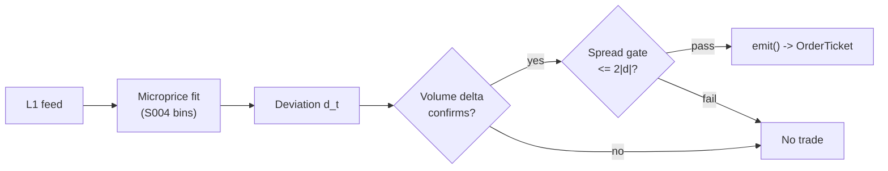

# T002 — Microprice Fair-Value Scalper

> **Reviewer card.** Intraday fair-value scalping (liquidity-taking, mean-reversion to a learned fair price): transient mid-price deviations from Stoikov's microprice, confirmed by signed volume delta, gated by measured spread costs. Provenance **[D]**.
>
> Edge verdict: **NO-DOCUMENTED-EDGE** — microprice predicts better than mid (Stoikov 2018), but no published after-cost P&L for the scalper exists [documented].
>
> After-cost: **FULL-COST** — one-sentence verdict: per-event edge is a fraction of the spread — it survives only where the deviation is wide relative to the measured effective spread.
>
> Tier **M** · prototype 40–80 h [example] · loaded cost $6,000–12,000 [example] · latency microstructure / sub-second · risk medium (intraday, taker).

> Capacity $0.5–2M/day notional [example] — small; survives only where the deviation is wide vs the effective spread · Executability: Feasible: Python+polars on `3–10` names [internal-est]; the S004 fit is the hard part.

## §1  Identity & provenance

This module is a **strategy**: it emits `OrderTicket` intentions only — brokers create orders, strategies never do. Family **A  # microstructure & order flow**, batch **TB1**, provenance **D**.

**Lede.** Intraday fair-value scalping (liquidity-taking, mean-reversion to a learned fair price): transient mid-price deviations from Stoikov's microprice, confirmed by signed volume delta, gated by measured spread costs. Provenance **[D]**.

**When it dies.** Effective spread `>2`× median [default]; microprice bins stale (fit drift); SIP-only latency race.

**Regime gates (provisional).** R001 elevated RV degrades (spread convexity eats the fraction-of-spread edge).

**Prototype scope.** microprice bin fitter + deviation monitor + volume-delta confirm + spread-decomposition gate + kill-switch.

## §1.5  Escalation gate

Cheapest viable path: **Polygon.io Stocks Basic** — L1 bid/ask price + size per quote event, exchange timestamps at ~$30–200/mo [unverified]. build on the S001/S003 feed you already own; buy only the exchange-timestamped L1 feed.

Resource budget: `1` core, `<4` GB RAM for `≤10` symbols live [internal-est] · compute pattern `per_event`.

Explicitly out of scope (phase two): multi-venue aggregation; Rust ingest; colocation; quote-free Roll fallback (phase `2`).

Escalation gate: live universe `>10` symbols [default]; trailing effective spread persistently `>2`× median [default] — crossing it requires re-review of §T7 and §T8.

## §T0  Contract — strategies emit intentions, brokers create orders

This strategy's sole output is a list of `OrderTicket` intentions. It never places, routes, or confirms an order. Every ticket carries `parent_signal` (the upstream signal id and its `computed_at`), an `intent_ts`, and a `tif`. The backtest harness fills tickets strictly after the signal bar (`fill_event > signal_event`, t->t+1 causality); any fill timestamped at or before its signal bar is a harness bug and trips the kill switch.

State variables carried between bars: ``prev_book`, `micro_bins`, `dev_window`, `delta_window`, `cost_window`, `cooldown_until`, `position`, `entry_mid`, `module_state``.

## §T1  Strategy thesis & edge

**Thesis.** Intraday fair-value scalping (liquidity-taking, mean-reversion to a learned fair price): transient mid-price deviations from Stoikov's microprice, confirmed by signed volume delta, gated by measured spread costs. Provenance **[D]**.

**Edge verdict: NO-DOCUMENTED-EDGE** — microprice predicts better than mid (Stoikov 2018), but no published after-cost P&L for the scalper exists [documented].

**After-cost verdict: FULL-COST** — one-sentence verdict: per-event edge is a fraction of the spread — it survives only where the deviation is wide relative to the measured effective spread.

**Risk summary.** Mean-reversion to a moving fair value — adverse drift when the microprice itself migrates; thin per-trade edge.

**Math.**

```text
Microprice `P^micro_t = M_t + G*(X_t)` (Stoikov [documented]) is the
learned fair value conditional on the book state; deviation `d_t = P^micro_t −
M_t` in cents. Entry when `|d_t| ≥ κ = 0.25 × spread_t` [example] with signed
volume-delta z-score confirming the deviation is noise, not information.
Modeled edge `edge_bps = |d_t| / P_t × 1e4 × 0.5` [example]; the S014
spread-decomposition gate vetoes when `S̄^e > 2·|d_t|` [example].
```

**Pseudocode (normative).**

```text
function emit(state, signals, bars, cfg) -> list[OrderTicket]:
    assert bars non-empty else return UNKNOWN                       # F1
    t = bars[-1]
    assert t.bid_px > 0 and t.ask_px > t.bid_px else return UNKNOWN  # F2
    d  = signals['S004'].deviation                                 # cents
    dz = signals['S006'].z_delta
    ec = signals['S014'].eff_spread
    assert isfinite(d) and isfinite(dz) and isfinite(ec) else return UNKNOWN  # F2

    edge_bps = abs(d) / t.mid * 1e4 * 0.5                         # [example]
    cost_ok = expected_cost_bps(notional, adv_pct, venue, side, urgency) <= cfg.cost_gate_k * edge_bps
    # ^^^ normative cost-gate predicate: expected_cost_bps(...) <= k * edge_bps
    spread_ok = ec <= cfg.cost_mult * abs(d)

    tickets = []
    kappa = cfg.kappa_mult * (t.ask_px - t.bid_px)
    if state.position == 0 and cost_ok and spread_ok and t.event_ts >= state.cooldown_until:
        if d >= kappa and dz >= cfg.z_delta_entry:
            tickets = [ticket(side='BUY', qty=size(...), limit=t.ask_px, tif='IOC',
                              parent_signal=f"S004@{signals['S004'].computed_at}")]
        elif d <= -kappa and dz <= -cfg.z_delta_entry and locate_ok():
            tickets = [ticket(side='SELL', qty=size(...), limit=t.bid_px, tif='IOC',
                              parent_signal=f"S004@{signals['S004'].computed_at}")]
    else:
        if exit_trigger(t, state, cfg): tickets = [flatten_ticket(state)]
        state.cooldown_until = t.event_ts + cfg.cooldown_s * 1e9   # C10
    for tk in tickets: log_decision(tk, inputs_hash, params_hash)  # C5 / App. g
    assert fill.event_ts > t.event_ts for any fill                 # t->t+1 causality
    return tickets
```

## §T2  Signal stack — dependencies & data rights

| Signal | Role | Contract |
|---|---|---|
| `S004` | trigger | |d_t| >= κ = 0.25×spread [example]; exit when d_t crosses 0 |
| `S006` | confirm | z^Δ_t >= +1.0 [example] long — aggressive flow must agree the deviation is noise |
| `S014` | veto | S̄^e <= 2·|d_t| per trade [example]; live-disable if measured costs exceed the edge |

Max dependency depth: `2` [default].

**Schema mapping (canonical).**

| Vendor (Databento MBP-1) | Canonical |
|---|---|
| `ts_event` | `event_ts` (int64 ns UTC) |
| `bid_px_00`, `bid_sz_00` | `bid_px`, `bid_sz` |
| `ask_px_00`, `ask_sz_00` | `ask_px`, `ask_sz` |

Staleness: max skew `1` [default] · jitter budget `500 µs` [default] · TTL `3 s` [default] · cadence `per_event` · tz `America/New_York`.

**Inputs that break the module.**

| Input failure | Module state | Alert |
|---|---|---|
| Microprice bins stale (no refit in session) (F4) | `DEGRADED` | notify |
| Deviation or z-delta out of bounds (F2) | `UNKNOWN` | page |
| Spread gate inputs missing | `UNKNOWN` | page |

**Data rights.** US equities L1 via Databento MBP-1, `rights: licensed`; research +
stated production (`≤10` symbols [default]); fixtures synthetic; entitlement =
professional/internal, no display; derived features ours. Entitlement-class
change → §1.5 escalation gate.

**Build vs buy.** Build on the S001/S003 feed you already own; buy only the
exchange-timestamped L1 feed — the microprice fit and the spread-decomposition
gate are yours to calibrate; no vendor sells them.

**Local build.** Feasible. The per-event loop is identical to T001's; the extra cost
is the microprice bin fit (offline, nightly) and the trailing effective-spread
window. `10` symbols [example] fit comfortably in Python+polars.

**Data dictionary (canonical fields).**

| Field | Type | Cadence | Tier | Notes |
|---|---|---|---|---|
| `Best bid/ask price+size` | float/int | every quote event (L1) | Tier 2 | exchange timestamps |
| `Microprice bin table` | reference | fitted on history strictly before today | Tier 2 | S004 fit; refit cadence daily [default] |
| `Trade prints (signed volume)` | float/int | every trade | Tier 2 | for S006 delta |

## §T3  Entry / exit / sizing & worked example

**Entry rule.**

```text
ENTER_LONG  := (d_t >= kappa) AND (z_delta >= z_delta_entry)
               AND (ecost <= cost_mult * |d_t|) AND (flat) AND (now >= cooldown_until)
               AND (expected_cost_bps(...) <= cost_gate_k * edge_bps)
ENTER_SHORT := (d_t <= -kappa) AND (z_delta <= -z_delta_entry)
               AND (ecost <= cost_mult * |d_t|) AND (flat) AND (now >= cooldown_until)
               AND (locate_ok) AND (expected_cost_bps(...) <= cost_gate_k * edge_bps)
FLAT        := otherwise
```

**Exit rule.**

```text
EXIT := (d_t crosses 0 toward mid) OR (z_delta crosses 0 against position)
        OR (age >= time_stop_s) OR (mid <= entry_mid - stop_spreads * spread) [long]
        OR (ecost > cost_mult * |d_t|) OR (module_state != OK)
```

**Cooldown.** `60` s [default] after every exit (C10).

**Sizing function (normative).**

```python
def shares(risk_budget_R, stop_distance, vol_estimate, ADV_cap, cost):
    # risk_budget_R in $, stop_distance = 1 spread-width in $/share
    n = risk_budget_R / max(stop_distance, 1e-9)   # [default] floor below
    n = min(n, ADV_cap * 0.01)                    # 1% of 1-min ADV [default]
    n = min(n * 50000.0, 500000.0) / 50000.0      # $500k notional cap [default]
    return int(n)
```

**Risk limits.**

| Limit | Value |
|---|---|
| Daily loss stop | `-$1,000` [example] → dark for the day |
| Max gross | `$500k` notional [example] |
| Live cost kill | measured effective spread above gate → disable [example] |
| Staleness kill | feed heartbeat `>2` s [example] → trip |

**Worked example (fixture-backed, from `fixtures/T002_tape.csv` trade 1).**

Trade 1: `BUY` `5000` shares [example] @ `50.01` [example], exit `50.02` [example] (`fair-value convergence`). Gross P&L = `50.00` [measured] dollars. Cost stack = `4.0` bps [example] → `100.02` [measured] dollars on `250050.00` [example] notional. Net = `-50.02` [measured] dollars. The fixture's expected CSV carries the same arithmetic for all six trades; the per-module test recomputes it from the tape and asserts equality.

**Flow.**


## §T4  Parameters

| Parameter | Key | Default | Provenance | Sensitivity |
|---|---|---|---|---|
| Deviation threshold κ | `kappa_mult` | `0.25`× spread | [default] | high |
| Volume-delta z entry | `z_delta_entry` | `1.0` | [default] | medium |
| Cost multiple | `cost_mult` | `2.0` | [default] | high |
| Time stop | `time_stop_s` | `10` s | [default] | medium |
| Stop distance | `stop_spreads` | `1` spread | [default] | high |
| Post-exit cooldown | `cooldown_s` | `60` s | [default] | low |
| Cost-gate k | `cost_gate_k` | `0.5` | [default] | high |

## §T5  Costs — the callable is the single source of truth

| Component | bps | Basis |
|---|---|---|
| Spread | `2.0` | [example] 1-tick spread at $50: half-spread per aggressive leg × 2 legs |
| Fees | `2.0` | [example] $0.005/share each way at $50 = 1 bps/leg |
| Borrow | `0.0` | [default] intraday; shorts add C7 locate |
| Impact | `0.0` | [example] flagged; calibrate per venue at scale-up |
| **Total** | `4.0` | [example] reference stack |

Fee schedule as of `2026-09-01` [example] · venue `XNAS / Databento MBP-1 [example]` · side `taker` · borrow `0.0` bps/day [example] — intraday holds only; borrow would accrue overnight — the strategy never carries overnight.

```python
def expected_cost_bps(notional, adv_pct, venue, side, urgency) -> float:
    """Callable cost model - T002 COST block (single source of truth)."""
    spread_bps = 2.0   # [example] 1-tick @ $50: half-spread per aggressive leg x 2
    fee_bps = 2.0      # [example] $0.005/share each way @ $50 = 1 bps/leg
    borrow_bps = 0.0   # [default] intraday; shorts add C7 locate
    impact_bps = 0.0   # [example] flagged; calibrate per venue at scale-up
    return spread_bps + fee_bps + borrow_bps + impact_bps
```

**Normative cost-gate predicate (C3):** `expected_cost_bps(...) <= k * edge_bps` — no ticket is emitted unless the callable cost clears this gate. The predicate appears verbatim in the §T1 pseudocode and is asserted by the per-module test.

## §T6  Execution assumptions

| Aspect | Assumption |
|---|---|
| Latency | signal→intent `≤1` ms colocated [example]; SIP path latency-simulated-only |
| Partial fills | oldest `intent_ts` first (FIFO); partials keep same ticket |
| Impact | `0` bps reference [example] |
| Adverse fill | mean-reversion to a migrating fair value — the primary tail risk |

## §T7  Risk contract & kill switch

Per-trade R: `$50` [example] per trade · daily loss stop: `- $1,000` [example] then dark for the day · max gross: `$500k` notional [example] · max adverse per trade: `2.0`x stop [default].

Enforcement: `intraday-hard` [default]. Calibration recipe: paper-trade `20` sessions [default]; fit microprice bins on history strictly before each session; re-pin fee schedule monthly [default].

**Kill switch: `ARMED` → `TRIPPED` → `RECOVERY` → `ARMED`.**

Trip conditions:

- feed heartbeat missed > 2 s [example]
- book sequence gap
- clock skew > 50 ms [example]
- measured effective spread > gate for 5 min [example]

On trip: the module stops emitting tickets immediately, flattens managed positions per the exit rule, and pages. `RECOVERY` requires manual review, cooldown expiry, and healthy feeds; only then does the module return to `ARMED`. The per-module test drives the full transition cycle.

**Ops.** Schedule: continuous during US equities RTH `09:45`–`15:45` America/New_York [example]; flat by `15:45` · budget: `1` vCPU, `4` GB RAM per `10` symbols [internal-est]; bin table O(bins) [internal-est] · env: `DATABENTO_API_KEY, POLYGON_API_KEY`.

**Universe.** `3–10` liquid large-tick names [example] with stable, visible books and `1`-tick
spreads most of the session (same hunting ground as T001) [example]. Exclude:
earnings days, halts, any name whose trailing effective spread exceeds `2`× [default]
its median [example]. Session `09:45`–`15:45` ET [example], RTH only, flat by
`15:45`.

## §T8  Compliance (C1–C10+)

- **C1** | No orders: the strategy emits `OrderTicket` intentions only; the broker creates orders.
- **C2** | Kill switch: `ARMED` → `TRIPPED` → `RECOVERY` → `ARMED` on the trip conditions in §T7.
- **C3** | Cost gate: `expected_cost_bps(...) <= k * edge_bps` before any ticket (see §T5).
- **C4** | Causality: `fill_event > signal_event` (t->t+1); no signal-bar fills, ever.
- **C5** | Decision log: every ticket logged with inputs hash and params hash (see App. g).
- **C6** | Staleness: inputs older than the TTL → `UNKNOWN`, no tickets.
- **C7** | Short discipline: `locate_ok` required before any short ticket.
- **C8** | Cooldown: post-exit cooldown enforced in seconds; no re-entry inside it.
- **C9** | Session flatten: no uncommanded overnight carry.
- **C10** | Position caps: per-trade R, daily loss stop, and max gross enforced.
- **C11 | Live cost kill: trigger = measured effective spread > `2·|d_t|` [example] for `5` min [example] → check = S014 window → action = disable new entries (existing managed to exit) → log = `GATE_VETO`**
- **C12 | Microprice-fit freshness: trigger = bins fit on stale history → check = fit date < today → action = DEGRADED, no new entries → log = state record**

## §T9  Evidence, failures & regime gates

**Evidence (cost-level tokens; every statistic tagged).**

| Source | Sample | Finding | Cost level | Caveat |
|---|---|---|---|---|
| Stoikov (2018) [documented] | BAC/CVX, March `2011`, high-frequency quotes [documented] | microprice a better predictor of short-term prices than mid or weighted mid [documented] | `BEFORE-COST` (prediction, not P&L) | two names, one month |
| Cont, Kukanov & Stoikov (2014) [documented] | `50` S&P 500, NYSE TAQ `2010` [documented] | OFI impact slope ∝ `1/(2·depth)` [documented] | `BEFORE-COST`; contemporaneous | supports the mechanics, not the P&L |
| Huang & Stoll (1997) [documented] | spread decomposition | quoted spread splits into order-processing, inventory, adverse-selection [documented] | measurement, not a strategy | the S014 gate's intellectual basis |

**Where this module is known to fail.** spread-regime shifts, microprice-fit drift, SIP-latency races, names where the deviation is information not noise.

**Failure modes (detect → action → recovery).**

| # | Failure | Detect → action → recovery | Executable check |
|---|---|---|---|
| 1 | Fair-value migration: the microprice drifts with the mid | detect: post-entry `d_t` persistence > `10` s [example] → action: tighten time stop or stand down → recovery: refit bins | `dev_persistence_s <= 10` |
| 2 | Spread gate lag: measured spread lags the real one | detect: realized slippage > gate for `5` min [example] → action: disable new entries → recovery: shorten cost window | `realized_spread <= gate` |
| 3 | Lookahead: bar-close deviation traded intra-bar | detect: `fill_event <= signal_event` → action: halt, fix finalization → recovery: no-signal-bar-fills test [default] | `all(fill_ts > signal_ts)` |
| 4 | Cost blowup on thin deviations | detect: cost gate failing on `[measured]` costs → action: raise κ or stand down → recovery: re-pin fee schedule | `expected_cost_bps(...) <= k * edge_bps` |
| 5 | Stale bins after a vol event | detect: bin fit age > `1` session [default] post-event → action: DEGRADED → recovery: emergency refit | `bin_age_sessions <= 1` |

**Regime gates.**

| Regime | Effect | Mechanism | Condition | Action | Latency | Fallback |
|---|---|---|---|---|---|---|
| R001 | degrades | elevated RV widens spreads convexly | rv_pctile > 75 [default] | halve | 1 bar [default] | veto |
| R-halt | inverts | halt/auction state | state != CONTINUOUS_TRADING [default] | veto | 0 [default] | veto |

**Robustness.** κ in `0.15`–`0.4`× spread keeps the signal [example]; the S014 gate is
the binding constraint — when measured effective spread exceeds `2·|d_t|` [default]
[example], the strategy disables itself rather than trading a negative edge.

**What the optimistic case assumes (and we do not).** (1) deviation mean-reverts to a *fixed* microprice — real fair value
migrates; (2) no latency — the deviation is sub-second and decays in seconds;
(3) the S014 gate is measured with lookback smoothing that lags regime
changes; (4) impact `0` [example] — flagged.

## §T10  Unverified leads & what would change our mind

- Chatbot-drafted throughput/fee bands for this sleeve — model-flagged estimates; not promoted.

What would change our mind: a purged/embargoed walk-forward with full costs that survives the S088 honesty protocol; a documented after-cost P&L from the cited authors' own implementations; or a regime-gated replication that holds outside the original sample.

## AI build prompt

```text
Build the T002 (Microprice Fair-Value Scalper) strategy module from this specification.
Hard constraints:
- The strategy emits OrderTicket intentions ONLY; it never creates orders (C1).
- Causality: fill_event > signal_event (t->t+1); no signal-bar fills (C4).
- Cost gate: expected_cost_bps(...) <= k * edge_bps before any ticket (C3).
- Kill switch ARMED -> TRIPPED -> RECOVERY -> ARMED on the §T7 trip conditions (C2).
- Every numeric literal in prose carries an honesty tag [documented]/[measured]/[example]/[unverified]/[default]/[internal-est]; exempt identifiers only.
- Sources must be real and cited with cost-level tokens; chatbot-only material goes to §T10.
Config surface:
- kappa_mult (float): default 0.25, range 0.1–1.0 [default]
- z_delta_entry (float): default 1.0, range 0.5–3.0 [default]
- cost_mult (float): default 2.0, range 1.0–4.0 [default]
- time_stop_s (float): default 10.0, range 1–60 [default]
- stop_spreads (float): default 1.0, range 0.5–3.0 [default]
- cooldown_s (float): default 60.0, range 0–3,600 [default]
- cost_gate_k (float): default 0.5, range 0.1–2.0 [default]
Entry rule:
ENTER_LONG  := (d_t >= kappa) AND (z_delta >= z_delta_entry)
               AND (ecost <= cost_mult * |d_t|) AND (flat) AND (now >= cooldown_until)
               AND (expected_cost_bps(...) <= cost_gate_k * edge_bps)
ENTER_SHORT := (d_t <= -kappa) AND (z_delta <= -z_delta_entry)
               AND (ecost <= cost_mult * |d_t|) AND (flat) AND (now >= cooldown_until)
               AND (locate_ok) AND (expected_cost_bps(...) <= cost_gate_k * edge_bps)
FLAT        := otherwise
Exit rule:
EXIT := (d_t crosses 0 toward mid) OR (z_delta crosses 0 against position)
        OR (age >= time_stop_s) OR (mid <= entry_mid - stop_spreads * spread) [long]
        OR (ecost > cost_mult * |d_t|) OR (module_state != OK)
Sizing: implement the §T3 sizing_fn verbatim; enforce the §T7 risk contract.
Deliverables: the module markdown (all sections §1–§T10), the fixture tape CSV
(fixtures/T002_tape.csv), the expected CSV (fixtures/T002_expected.csv), and
the per-module test (modules/tests/test_T002.py) covering fixture arithmetic,
causality, the cost gate, the kill-switch cycle, invalid→UNKNOWN, and the callable signature.
```
