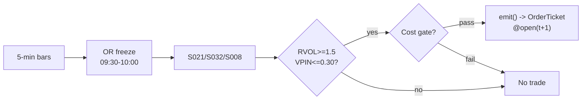

# T003 — VPIN-Gated Breakout Trader

> **Reviewer card.** Intraday breakout (opening-range / session-range), toxicity-gated: breakouts that are *funded* (abnormal participation, S032) and *clean* (low order-flow toxicity, S008) — the filter does the work, not the geometry. Provenance **[D]**.
>
> Edge verdict: **AFTER-COST-EDGE** — top-20 opening-RVOL ORB: Sharpe 2.81 commission-only [documented]; the edge is the filter, unfiltered ORB underperforms the index [documented].
>
> After-cost: **COMM-ONLY** — one-sentence verdict: published costs are commission-only ($0.0035/share) [documented] — no spread, impact, or borrow; the honest executable number is lower.
>
> Tier **S** · prototype 20–40 h [example] · loaded cost $3,000–6,000 [example] · latency bar / minutes · risk medium (intraday breakout, gap risk).

> Capacity $2–10M/day notional [example] — the RVOL sort crowds; the published variant ran on $25k notional · Executability: Feasible: ~`100`-line 5-min bar state machine [internal-est]; any retail platform suffices.

## §1  Identity & provenance

This module is a **strategy**: it emits `OrderTicket` intentions only — brokers create orders, strategies never do. Family **D  # breakout / session-pattern**, batch **TB1**, provenance **D**.

**Lede.** Intraday breakout (opening-range / session-range), toxicity-gated: breakouts that are *funded* (abnormal participation, S032) and *clean* (low order-flow toxicity, S008) — the filter does the work, not the geometry. Provenance **[D]**.

**When it dies.** VPIN persistently `>0.40` [default]; RVOL sort crowded; low-vol chop (unfunded ranges).

**Regime gates (provisional).** R001 elevated RV amplifies breakouts but widens stops; R-halt excludes.

**Prototype scope.** 5-min OR bar machine + OR freeze + RVOL baseline + VPIN window + kill-switch.

## §1.5  Escalation gate

Cheapest viable path: **Polygon.io Stocks Basic** — 5-min OHLCV bars, exchange timestamps, corporate-action adjustments at ~$30–200/mo [unverified]. build the ~100-line bar state machine on a cheap SIP feed; buy nothing.

Resource budget: `1` core, `<1` GB RAM [internal-est] [internal-est] · compute pattern `per_bar`.

Explicitly out of scope (phase two): VPIN alternatives (phase `2`); multi-timeframe OR; futures analogue.

Escalation gate: universe beyond `50` names [default]; 5-min bar latency `>30` s [default] — crossing it requires re-review of §T7 and §T8.

## §T0  Contract — strategies emit intentions, brokers create orders

This strategy's sole output is a list of `OrderTicket` intentions. It never places, routes, or confirms an order. Every ticket carries `parent_signal` (the upstream signal id and its `computed_at`), an `intent_ts`, and a `tif`. The backtest harness fills tickets strictly after the signal bar (`fill_event > signal_event`, t->t+1 causality); any fill timestamped at or before its signal bar is a harness bug and trips the kill switch.

State variables carried between bars: ``orh`, `orl`, `or_frozen`, `v_or`, `rvol`, `vpin_window`, `position`, `entry_px`, `stop_px`, `module_state``.

## §T1  Strategy thesis & edge

**Thesis.** Intraday breakout (opening-range / session-range), toxicity-gated: breakouts that are *funded* (abnormal participation, S032) and *clean* (low order-flow toxicity, S008) — the filter does the work, not the geometry. Provenance **[D]**.

**Edge verdict: AFTER-COST-EDGE** — top-20 opening-RVOL ORB: Sharpe 2.81 commission-only [documented]; the edge is the filter, unfiltered ORB underperforms the index [documented].

**After-cost verdict: COMM-ONLY** — one-sentence verdict: published costs are commission-only ($0.0035/share) [documented] — no spread, impact, or borrow; the honest executable number is lower.

**Risk summary.** Breakout whipsaws; toxic flow chasing; gap-through entries; VPIN false negatives in stress.

**Math.**

```text
Opening range `ORH = max H_j`, `ORL = min L_j` over the first `6`
five-minute bars [example]; width `W = ORH − ORL`. Participation `RVOL = V_OR
/ mean(V_OR[-14:])` [example]. Toxicity `VPIN` over trailing `50` volume
buckets (Easley–López de Prado–O'Hara [documented]). Breakout event `C_t ≥ ORH
+ δ` [example]. Modeled edge `edge_bps = (target_mult × W / P) × 1e4 × 0.48`
[example] using the published `48.4`% hit rate [documented].
```

**Pseudocode (normative).**

```text
function emit(state, signals, bars, cfg) -> list[OrderTicket]:
    assert bars non-empty else return UNKNOWN                       # F1
    t = bars[-1]   # newest 5-min bar, labeled by open time
    if t.bar_open_ts in OR_window: update(state.orh, state.orl, t); return []
    if not state.or_frozen: freeze_or(state); return []            # causal: no trade on OR bars
    vpin = signals['S008'].vpin
    rvol = signals['S032'].rvol
    assert isfinite(vpin) and isfinite(rvol) else return UNKNOWN    # F2

    edge_bps = (cfg.target_mult * (state.orh - state.orl) / t.close) * 1e4 * 0.48  # [example]
    cost_ok = expected_cost_bps(notional, adv_pct, venue, side, urgency) <= cfg.cost_gate_k * edge_bps
    # ^^^ normative cost-gate predicate: expected_cost_bps(...) <= k * edge_bps

    tickets = []
    if state.position == 0 and state.flat_today and cost_ok:
        if vpin > cfg.vpin_veto: log_decision(VETO, ...); return []  # C12
        if t.close >= state.orh + cfg.entry_offset and rvol >= cfg.rvol_entry:
            tickets = [ticket(side='BUY', qty=size(...), limit=open(t+1), tif='DAY',
                              parent_signal=f"S021@{t.bar_open_ts}")]
        elif t.close <= state.orl - cfg.entry_offset and rvol >= cfg.rvol_entry and locate_ok():
            tickets = [ticket(side='SELL', qty=size(...), limit=open(t+1), tif='DAY',
                              parent_signal=f"S021@{t.bar_open_ts}")]
    else:
        if exit_trigger(t, state, cfg): tickets = [flatten_ticket(state)]
    for tk in tickets: log_decision(tk, inputs_hash, params_hash)  # C5 / App. g
    assert fill.event_ts > t.bar_close_ts for any fill             # t->t+1 causality
    return tickets
```

## §T2  Signal stack — dependencies & data rights

| Signal | Role | Contract |
|---|---|---|
| `S021` | trigger | bar close beyond ORH/ORL ± δ [example] after the OR freeze; defines levels, target, stop |
| `S032` | confirm | RVOL >= 1.5× [example] on the OR window — unfunded breaks are vetoed |
| `S008` | veto | VPIN > 0.30 [example] blocks entry; VPIN > 0.40 [example] tightens a live stop |

Max dependency depth: `2` [default].

**Schema mapping (canonical).**

| Vendor (Polygon.io Stocks) | Canonical |
|---|---|
| `t` (ms) | `bar_open_ts` (int64 ns UTC; bar labeled by open time) |
| `o, h, l, c` | `open, high, low, close` |
| `v` | `volume` |
| `n` | `trade_count` |

Staleness: max skew `5 s` [default] · jitter budget `30 s` [default] · TTL `90 s` [default] · cadence `per_bar (5-min)` · tz `America/New_York`.

**Inputs that break the module.**

| Input failure | Module state | Alert |
|---|---|---|
| No 5-min bar within 30 s of expected close (feed stall) [example] | `UNKNOWN` | page |
| OR not frozen by 10:00 (data hole) | `UNKNOWN` | page |
| VPIN inputs missing/stale | `UNKNOWN` | notify |

**Data rights.** US equities 5-min bars via Polygon.io Stocks, `rights: licensed`;
research + stated production use; fixtures synthetic; entitlement =
professional/internal; derived features ours. Entitlement-class change →
§1.5 escalation gate.

**Build vs buy.** Build the OR/RVOL state machine yourself on a cheap SIP bar feed;
buy nothing — the filter *is* the strategy and it is `~100` lines of code [internal-est]
[internal-est].

**Local build.** Feasible on any laptop: `6` bars of OR state [example] per name, a `14`-session
RVOL baseline [example], and a `50`-bucket VPIN window [example]. The whole
book for `50` names [example] is kilobytes of state.

**Data dictionary (canonical fields).**

| Field | Type | Cadence | Tier | Notes |
|---|---|---|---|---|
| `5-min OHLCV bars` | float/int | 5-min | Tier 1 | split/dividend-adjusted; bar labeled by open |
| `Volume buckets (VPIN)` | int | per bucket | Tier 2 | S008 inputs |
| `Corporate actions / halts` | reference | daily + intraday | Tier 1 | OR garbage across splits/reopens |

## §T3  Entry / exit / sizing & worked example

**Entry rule.**

```text
ENTER_LONG  := (C_t >= ORH + delta) AND (RVOL >= rvol_entry) AND (VPIN <= vpin_veto)
               AND (flat_today) AND (expected_cost_bps(...) <= cost_gate_k * edge_bps)
ENTER_SHORT := (C_t <= ORL - delta) AND (RVOL >= rvol_entry) AND (VPIN <= vpin_veto)
               AND (flat_today) AND (locate_ok)
               AND (expected_cost_bps(...) <= cost_gate_k * edge_bps)
FLAT        := otherwise
```

**Exit rule.**

```text
EXIT := (C_t >= ORH + target_mult * W) [long target] OR (C_t <= ORL) [long stop]
        OR (VPIN > vpin_tighten) [tighten stop to breakeven-minus-fees]
        OR (t >= 15:45) [session flatten] OR (module_state != OK)
```

**Cooldown.** `0` s [default] after every exit (C10).

**Sizing function (normative).**

```python
def shares(risk_budget_R, stop_distance, vol_estimate, ADV_cap, cost):
    # risk_budget_R in $, stop_distance = |expected_fill - stop| in $/share
    # expected_fill = bar-t+1 open estimate, never the signal print
    n = risk_budget_R / max(stop_distance, 1e-9)   # [default] floor below
    n = min(n, ADV_cap * 0.02)                    # 2% of 1-min ADV [default]
    n = min(n * 50.0, 250000.0) / 50.0           # $250k notional cap [default]
    return int(n)
```

**Risk limits.**

| Limit | Value |
|---|---|
| Daily loss stop | `-$1,000` [example] → dark for the day |
| Max concurrent positions | `4` [example] |
| Gap-through | entry fill = next-bar open, never the signal print |
| Staleness kill | no 5-min bar within `30` s of expected close [example] → trip |

**Worked example (fixture-backed, from `fixtures/T003_tape.csv` trade 1).**

Trade 1: `BUY` `526` shares [example] @ `50.6` [example], exit `51.2` [example] (`target +1×W`). Gross P&L = `315.60` [measured] dollars. Cost stack = `8.0` bps [example] → `21.29` [measured] dollars on `26615.60` [example] notional. Net = `294.31` [measured] dollars. The fixture's expected CSV carries the same arithmetic for all six trades; the per-module test recomputes it from the tape and asserts equality.

**Flow.**


## §T4  Parameters

| Parameter | Key | Default | Provenance | Sensitivity |
|---|---|---|---|---|
| OR length | `or_bars` | `6` bars (09:30–10:00) | [default] | medium |
| Entry offset | `entry_offset` | `$0.05` | [default] | low |
| RVOL entry | `rvol_entry` | `1.5`× | [default] | high |
| VPIN veto | `vpin_veto` | `0.30` | [default] | high |
| VPIN tighten | `vpin_tighten` | `0.40` | [default] | medium |
| Target multiple | `target_mult` | `1.0`× W | [default] | medium |
| Cost-gate k | `cost_gate_k` | `0.5` | [default] | high |

## §T5  Costs — the callable is the single source of truth

| Component | bps | Basis |
|---|---|---|
| Spread | `4.0` | [example] $0.02 assumed spread at $50: $0.01 per aggressive leg × 2 legs |
| Fees | `2.0` | [example] $0.005/share each way at $50 = 1 bps/leg |
| Borrow | `0.0` | [default] intraday; shorts excluded from reference sizing (C7 gate) |
| Impact | `2.0` | [example] gap-through modeled explicitly on the entry bar |
| **Total** | `8.0` | [example] reference stack |

Fee schedule as of `2026-09-01` [example] · venue `XNAS / SIP 5-min bars [example]` · side `taker` · borrow `0.0` bps/day [example] — intraday holds only; no overnight borrow accrues.

```python
def expected_cost_bps(notional, adv_pct, venue, side, urgency) -> float:
    """Callable cost model - T003 COST block (single source of truth)."""
    spread_bps = 4.0   # [example] $0.02 assumed spread @ $50: $0.01/aggressive leg x 2
    fee_bps = 2.0      # [example] $0.005/share each way @ $50 = 1 bps/leg
    borrow_bps = 0.0   # [default] intraday; shorts C7-gated
    impact_bps = 2.0   # [example] gap-through on the entry bar, modeled
    if urgency == "high":
        impact_bps = 4.0  # [example] late-day entries pay more
    return spread_bps + fee_bps + borrow_bps + impact_bps
```

**Normative cost-gate predicate (C3):** `expected_cost_bps(...) <= k * edge_bps` — no ticket is emitted unless the callable cost clears this gate. The predicate appears verbatim in the §T1 pseudocode and is asserted by the per-module test.

## §T6  Execution assumptions

| Aspect | Assumption |
|---|---|
| Latency | bar-close evaluation; fill at next-bar open — the t→t+1 discipline |
| Partial fills | oldest `intent_ts` first (FIFO); participation `≤20`% of breakout bar volume [example] |
| Impact | `2.0` bps entry gap-through [example]; `4.0` bps urgent [example] |
| Adverse fill | breakout-bar extension against the fill — modeled in the gap-through term |

## §T7  Risk contract & kill switch

Per-trade R: `$200` [example] per trade · daily loss stop: `- $1,000` [example] then dark for the day · max gross: `$1M` notional [example] · max adverse per trade: `1.0`x OR width [default].

Enforcement: `intraday-hard` [default]. Calibration recipe: paper-trade `30` sessions [default]; calibrate RVOL baseline per name on `14` sessions [default]; re-pin commission schedule monthly [default].

**Kill switch: `ARMED` → `TRIPPED` → `RECOVERY` → `ARMED`.**

Trip conditions:

- no 5-min bar within 30 s of expected close [example]
- clock skew > 50 ms [example]
- VPIN data stale > 10 min [example]
- 4 concurrent positions reached [example]

On trip: the module stops emitting tickets immediately, flattens managed positions per the exit rule, and pages. `RECOVERY` requires manual review, cooldown expiry, and healthy feeds; only then does the module return to `ARMED`. The per-module test drives the full transition cycle.

**Ops.** Schedule: US equities RTH; OR built `09:30`–`10:00` ET [example]; entries `10:00`–`15:30`; flat by `15:45` · budget: `1` vCPU, `1` GB RAM [internal-est]; trivial state [internal-est] · env: `POLYGON_API_KEY`.

**Universe.** US listed equities, RTH only. Gates [example]: `14`-day ADV ≥ `1`M
shares; `14`-day ATR ≥ `$0.50` [default]; price > `$5` [default]. Exclude earnings days, halts,
names with missing opening prints. Session: OR built `09:30`–`10:00` ET
(`6` five-minute bars [example]); entries `10:00`–`15:30`; flat by `15:45`.
One trade per name per day; no re-entry after a stop [example].

## §T8  Compliance (C1–C10+)

- **C1** | No orders: the strategy emits `OrderTicket` intentions only; the broker creates orders.
- **C2** | Kill switch: `ARMED` → `TRIPPED` → `RECOVERY` → `ARMED` on the trip conditions in §T7.
- **C3** | Cost gate: `expected_cost_bps(...) <= k * edge_bps` before any ticket (see §T5).
- **C4** | Causality: `fill_event > signal_event` (t->t+1); no signal-bar fills, ever.
- **C5** | Decision log: every ticket logged with inputs hash and params hash (see App. g).
- **C6** | Staleness: inputs older than the TTL → `UNKNOWN`, no tickets.
- **C7** | Short discipline: `locate_ok` required before any short ticket.
- **C8** | Cooldown: post-exit cooldown enforced in seconds; no re-entry inside it.
- **C9** | Session flatten: no uncommanded overnight carry.
- **C10** | Position caps: per-trade R, daily loss stop, and max gross enforced.
- **C11 | One-trade-per-day: trigger = second signal same name same day → check = `flat_today` flag → action = veto → log = `GATE_VETO`**
- **C12 | Toxicity tighten: trigger = VPIN crosses `0.40` [example] while in position → check = S008 window → action = tighten stop to breakeven-minus-fees → log = `COMPLIANCE_BLOCK`**

## §T9  Evidence, failures & regime gates

**Evidence (cost-level tokens; every statistic tagged).**

| Source | Sample | Finding | Cost level | Caveat |
|---|---|---|---|---|
| Zarattini, Barbon & Aziz (2024) [documented] | `>7,000` US stocks, `2016`–`2023`, 5-min ORB [documented] | top-20 opening-RVOL stocks-in-play: total `+1,637`%, IRR `41.6`%, Sharpe `2.81`, hit `48.4`%, MDD `12`% [documented] | `COMM-ONLY` — after `$0.0035`/share commission; no spread/impact/borrow | $25k book; the filter is the strategy |
| Same paper, unfiltered 5-min ORB [documented] | same | total `+29`%, IRR `3.2`%, Sharpe `0.48`, hit `41.4`% — underperforms S&P 500 [documented] | `COMM-ONLY` | unfiltered ORB is not a strategy |
| Same paper, RVOL split [documented] | same | RVOL `>100`% [default] → `+0.08`R/trade; `<100`% → `−0.02`R [documented] | `COMM-ONLY` | the ORB edge is really the volume-filter edge |
| Easley, López de Prado & O'Hara (2012) [documented] | E-mini S&P futures | VPIN a useful indicator of short-term, toxicity-induced volatility [documented] | indicator study, not a trading rule | authors' claim; see the Andersen & Bondarenko replication row |

**Where this module is known to fail.** low-vol chop, crowded RVOL sorts, VPIN false negatives in stress, fee-schedule changes.

**Failure modes (detect → action → recovery).**

| # | Failure | Detect → action → recovery | Executable check |
|---|---|---|---|
| 1 | Whipsaw: range breaks then reverts | detect: `3` consecutive stops before `11:00` [example] → action: book stands down for the day → recovery: next session | `stops_before_11 < 3` |
| 2 | Toxic breakout chased | detect: VPIN > `0.40` [example] post-entry → action: tighten stop to breakeven-minus-fees → recovery: flat | `vpin <= 0.40 or flat` |
| 3 | Gap-through beyond risk budget | detect: fill vs signal print gap > `2`× stop [default] → action: kill sizing, review → recovery: re-run fixture | `gap_through <= 2*stop` |
| 4 | Cost blowup vs commission-only paper | detect: realized spread+impact > modeled → action: widen gate or stand down → recovery: re-pin costs [default] | `expected_cost_bps(...) <= k * edge_bps` |
| 5 | Lookahead: trading on un-frozen OR | detect: entry bar inside OR window → action: halt, fix → recovery: no-signal-bar-fills test [default] | `all(fill_ts > signal_ts)` |

**Regime gates.**

| Regime | Effect | Mechanism | Condition | Action | Latency | Fallback |
|---|---|---|---|---|---|---|
| R001 | amplifies | elevated RV: breakouts carry further | rv_pctile > 70 [default] | widen_stops | 1 bar [default] | veto |
| R001 | degrades | extreme RV: whipsaw | rv_pctile > 95 [default] | pause_entry | 1 bar [default] | veto |
| R-halt | inverts | halt/auction state | state != CONTINUOUS_TRADING [default] | veto | 0 [default] | veto |

**Robustness.** The OR geometry is the least important parameter; RVOL and VPIN
thresholds carry the edge. `rvol_entry` in `1.2`–`2.0` [example] and
`vpin_veto` in `0.25`–`0.35` [example] should be re-validated on embargoed OOS
per the S088 pattern — the published Sharpe is commission-only and crowded.

**What the optimistic case assumes (and we do not).** (1) gap-through modeled as a flat `2` bps [example] — real
breakout bars extend further; (2) the published Sharpe is commission-only —
spread, impact, and borrow are added here but estimated; (3) VPIN is a
contested toxicity proxy (Andersen & Bondarenko [documented]) — false
negatives in stress are the tail.

## §T10  Unverified leads & what would change our mind

- None segregated this pass — all figures above are from the cited papers.

What would change our mind: a purged/embargoed walk-forward with full costs that survives the S088 honesty protocol; a documented after-cost P&L from the cited authors' own implementations; or a regime-gated replication that holds outside the original sample.

## AI build prompt

```text
Build the T003 (VPIN-Gated Breakout Trader) strategy module from this specification.
Hard constraints:
- The strategy emits OrderTicket intentions ONLY; it never creates orders (C1).
- Causality: fill_event > signal_event (t->t+1); no signal-bar fills (C4).
- Cost gate: expected_cost_bps(...) <= k * edge_bps before any ticket (C3).
- Kill switch ARMED -> TRIPPED -> RECOVERY -> ARMED on the §T7 trip conditions (C2).
- Every numeric literal in prose carries an honesty tag [documented]/[measured]/[example]/[unverified]/[default]/[internal-est]; exempt identifiers only.
- Sources must be real and cited with cost-level tokens; chatbot-only material goes to §T10.
Config surface:
- or_bars (int): default 6, range 2–12 [default]
- entry_offset (float): default 0.05, range 0.0–0.5 [default]
- rvol_entry (float): default 1.5, range 1.0–3.0 [default]
- vpin_veto (float): default 0.30, range 0.1–0.6 [default]
- vpin_tighten (float): default 0.40, range 0.2–0.7 [default]
- target_mult (float): default 1.0, range 0.5–3.0 [default]
- cooldown_s (float): default 0.0, range 0–3,600 [default]
- cost_gate_k (float): default 0.5, range 0.1–2.0 [default]
Entry rule:
ENTER_LONG  := (C_t >= ORH + delta) AND (RVOL >= rvol_entry) AND (VPIN <= vpin_veto)
               AND (flat_today) AND (expected_cost_bps(...) <= cost_gate_k * edge_bps)
ENTER_SHORT := (C_t <= ORL - delta) AND (RVOL >= rvol_entry) AND (VPIN <= vpin_veto)
               AND (flat_today) AND (locate_ok)
               AND (expected_cost_bps(...) <= cost_gate_k * edge_bps)
FLAT        := otherwise
Exit rule:
EXIT := (C_t >= ORH + target_mult * W) [long target] OR (C_t <= ORL) [long stop]
        OR (VPIN > vpin_tighten) [tighten stop to breakeven-minus-fees]
        OR (t >= 15:45) [session flatten] OR (module_state != OK)
Sizing: implement the §T3 sizing_fn verbatim; enforce the §T7 risk contract.
Deliverables: the module markdown (all sections §1–§T10), the fixture tape CSV
(fixtures/T003_tape.csv), the expected CSV (fixtures/T003_expected.csv), and
the per-module test (modules/tests/test_T003.py) covering fixture arithmetic,
causality, the cost gate, the kill-switch cycle, invalid→UNKNOWN, and the callable signature.
```
