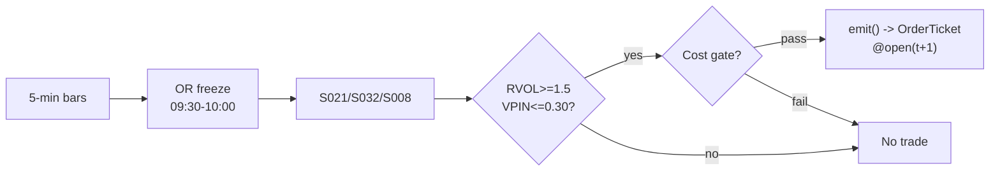

# T003 — VPIN-Gated Breakout Trader

> Tag law: every numeric literal in prose carries one of `[documented]
> [default] [example] [unverified] [internal-est] [measured]` (legend: `modules/appendices/marker-taxonomy-legend.md`). Constants inside cited formulas inherit the formula's tag
> (`[documented]` for cited literature). Bibliographic years, volumes, pages,
> arXiv IDs, DOIs, ISBNs, section numbers, rule codes (C1–C18), fail-safe codes
> (F1–F5), module IDs, session times, and machine-parsed §0 data fields are
> identifiers, not literals, and are exempt.

## §1  Five-minute reviewer card

| Row | Value |
|---|---|
| Module | T003 — VPIN-Gated Breakout Trader, v1.0.2 |
| Lede | Intraday breakout (opening-range / session-range), toxicity-gated: breakouts that are *funded* (abnormal participation, S032) and *clean* (low order-flow toxicity, S008) — the filter does the work, not the geometry. Provenance **[D]**. |
| Edge verdict | `AFTER-COST-EDGE` — top-20 opening-RVOL 5-min ORB: total `1,637`%, Sharpe `2.81`, hit `48.4`%, MDD `12`%, all commission-only at `$0.0035`/share [documented]; the edge is the filter — unfiltered ORB (total `29`%, Sharpe `0.48`) underperforms the S&P 500 (`198`%) [documented] |
| After-cost | `COMM-ONLY` — one-sentence verdict: published costs are commission-only (`$0.0035`/share = IBKR Pro Tiered as of 2023-12-31 [documented]) — no spread, impact, or borrow; the honest executable number is lower |
| Build cost | Tier S · `20–40` h [internal-est] · `$3,000–6,000` loaded [internal-est] |
| Data cost | Research `$29`/mo entry tier [documented — vendor pricing page https://massive.com/stocks-data, fetched 2026-09-11] · production `$29–199`/mo [documented — vendor pricing page https://massive.com/stocks-data, fetched 2026-09-11] (real-time on Advanced/Business only) |
| latency_class | bar / minutes |
| risk_class | medium (intraday breakout, gap risk) |
| Capacity | `$2–10`M/day operating band [example] (published variant ran on `$25k` notional [documented]); ceiling = `2`% participation [default] × Σ ADV_$ over ≤`50` names [default] |
| Executability | Feasible: ~`100`-line 5-min bar state machine [internal-est]; any retail platform suffices |
| Risk summary | Breakout whipsaws; toxic flow chasing; gap-through entries; VPIN false negatives in stress (VPIN is contested — Andersen & Bondarenko [documented]) |
| When it dies | VPIN persistently `>0.40` [default]; RVOL sort crowded; low-vol chop (unfunded ranges) |
| Regime gates | Provisional: R001 elevated RV amplifies breakouts but widens stops; R001 extreme RV degrades (whipsaw → pause_entry); R-halt inverts (veto) |
| Emits | `order_intents` (OrderTicket; strategy never creates orders) |

## §1.5  Cheapest / least-build path

1. **Prototype hour band:** `20–40` h [internal-est] — 5-min OR bar machine + OR freeze + RVOL baseline + VPIN window consumer + cost gate + kill-switch.
2. **Cheapest-source row:** min_tier = Massive (formerly Polygon.io) Stocks entry tier [documented]; latency_class = bar / minutes (SIP-consolidated, `~15`-min delayed on entry tier [unverified] — production needs real-time); required_fields = 5-min OHLCV + exchange timestamps + corporate-action adjustments; price_band = `$29`/mo entry [documented — vendor pricing page https://massive.com/stocks-data, fetched 2026-09-11] → `$199`/mo real-time (Advanced) [documented — vendor pricing page https://massive.com/stocks-data, fetched 2026-09-11]; build_or_buy = **build the ~100-line bar state machine [internal-est] on a cheap SIP feed; buy nothing** — the filter *is* the strategy.
3. **Resource budget:** `1` core, `<1` GB RAM [internal-est]; compute pattern `per_bar`.
4. **Skip list:** full tick/VPIN recomputation (consume S008's VPIN); multi-timeframe OR; futures analogue; colocated deployment.
5. **DO-NOT-CUT list:** causality assertions (`fill_event > signal_event`, no-signal-bar-fills test); COST block + `expected_cost_bps` callable; kill-switch state machine + re-arm checklist; decision-log schema (C5); bona-fide-intent + self-trade prevention (C13–C14); provenance tags on every number; fixtures + acceptance tests; secrets-via-env.
6. **Escalation gate:** universe beyond `50` names [default]; 5-min bar latency `>30` s [default] — crossing either requires re-review of §T7 and §T8.

## §T0  Module contract — strategies emit intentions, brokers create orders

**Typed signature.**

```python
def emit(state: ModuleState, signals: dict[str, SignalVector],
         bars: list[Bar], cfg: Config) -> tuple[list[OrderTicket], ModuleState]:
    """Core function. Returns (tickets, next_state). Invalid input -> ([], UNKNOWN)."""
```

Every ticket carries `parent_signal` (upstream signal id + `computed_at`), `intent_ts` (int64 ns UTC), `tif`, `limit_px`, `expected_fill` (bar-t+1 open estimate), and `strategy_tag` (for downstream self-trade prevention). The backtest harness fills tickets strictly after the signal bar (`fill_event > signal_event`, t→t+1); any fill timestamped at or before its signal bar is a harness bug and trips the kill switch (F3).

**Config dataclass (single surface; status ∈ {fixed, default, calibrate, example, internal-est}).**

| Parameter | Type | Default | Range | Status |
|---|---|---|---|---|
| `or_bars` | int | `6` | `2–12` | default |
| `entry_offset` | float ($/share) | `0.05` | `0.0–0.5` | default |
| `rvol_entry` | float (×) | `1.5` | `1.0–3.0` | default |
| `vpin_veto` | float | `0.30` | `0.1–0.6` | default |
| `vpin_tighten` | float | `0.40` | `0.2–0.7` | default |
| `target_mult` | float (× W) | `1.0` | `0.5–3.0` | default |
| `cooldown_s` | float (s) | `0.0` | `0–3,600` | default |
| `cost_gate_k` | float | `0.5` | `0.1–2.0` | default |
| `vpin_buckets` | int | `50` | fixed | fixed — consumed constant from S008 v1.1.0 (ELO bucket convention [documented]) |

Startup refuses out-of-range config (fail-closed, F5).

**Time contract.**

| Field | Value |
|---|---|
| Clock domain | exchange timestamps (SIP-consolidated); exchange = authoritative causality clock |
| Canonical form | int64 ns, UTC |
| Bar-label rule | bar labeled by **open** time (`bar_open_ts`); signal `t` = bar-close event of bar `t` |
| Timestamps | dual `(event_ts, asof_ts)`; `asof_ts − event_ts ≤ 90` s [default] else UNKNOWN (C6) |
| max_skew | `5` s [default] |
| Jitter budget | `30` s [default] |
| Staleness TTL | `90` s [default] — inputs older than TTL → UNKNOWN, never interpolated |
| Gap policy | missing bars → UNKNOWN (no interpolation); `30` s past expected close with no bar [example] → kill-switch trip |

**Market-state table.**

| State | Meaning | Module action |
|---|---|---|
| `CONTINUOUS_TRADING` | normal session | emit per rules |
| `HALTED` | trading halt / LULD pause | veto new tickets; flatten managed positions |
| `AUCTION` | open/close auction, reopen auction | no tickets during auction; resume on `CONTINUOUS_TRADING` |
| `CLOSED` | outside session | module `OFF`; no state carried except config |

**Module-state enum.** `OK | DEGRADED | UNKNOWN | OFF` — invalid input emits UNKNOWN, never interpolates. `DEGRADED` = market not `CONTINUOUS_TRADING` (halt/auction); `OFF` = outside session or kill-switch `TRIPPED` (no tickets until re-arm).

**Fail-safes (RB-list F1–F5, ported).**

| Code | Trigger | Action |
|---|---|---|
| F1 | empty or malformed bar batch | `([], UNKNOWN)`; notify |
| F2 | non-finite signal (`vpin`/`rvol` NaN/Inf) | `([], UNKNOWN)`; notify |
| F3 | clock regression (`bar_open_ts ≤ last_bar_ts`) or fill at/before signal bar | trip kill switch → `TRIPPED`; page |
| F4 | duplicate bar (`bar_open_ts` seen) | drop duplicate; notify; continue |
| F5 | config outside declared range | refuse to start (fail-closed) |

**Risk contract (fenced YAML; canonical — §T7 operationalizes it).**

```yaml
risk_contract:
  per_trade_R: 200.0            # $ [example]
  daily_loss_stop: -1000.0      # $ [example]; then dark for the day
  max_gross: 1000000.0          # $ notional [example]
  max_adverse_per_trade: 1.0   # x OR width [default]
  max_concurrent_positions: 4  # [example]
  enforcement: intraday-hard
  kill_conditions:
    - "no 5-min bar within 30 s of expected close [example]"
    - "clock skew > 50 ms [example]"
    - "VPIN data stale > 10 min [example]"
    - "4 concurrent positions reached [example]"
```

**Kill-switch state machine: `ARMED` → `TRIPPED` → `RECOVERY` → `ARMED`.** On trip: stop emitting immediately, flatten managed positions per the exit rule, page. `RECOVERY` requires the re-arm checklist; only then `ARMED`.

**Re-arm checklist** (all must hold): (1) trip cause reviewed and signed off by operator [default]; (2) cooldown `≥15` min [default] since trip; (3) feeds healthy — bars arriving on cadence, VPIN fresh `≤10` min [example]; (4) clock skew `≤50` ms [example]; (5) book flat (no managed position in limbo); (6) commission schedule re-pinned if the trip was cost-related.

**Ops tail.** Schedule: US equities RTH; OR built 09:30–10:00 ET [default]; entries 10:00–15:30 [default]; flat by 15:45. Owner: operator-defined [default]. Health checks: bar-arrival heartbeat (≤`30` s past expected close [example]); VPIN freshness (≤`10` min [example]); clock skew (≤`50` ms [example]). Alerts: page on kill-switch trip; notify on UNKNOWN/staleness. Resource budget: `1` vCPU, `1` GB RAM [internal-est]; state is kilobytes per name [internal-est]. Runbook stub: (1) confirm feed health; (2) inspect decision log around the trip; (3) work the re-arm checklist; (4) re-arm and watch one full OR cycle. Secrets: env-only — `MASSIVE_API_KEY` (or legacy `POLYGON_API_KEY`; both work after the 2025-10-30 rebrand [documented]); never in code or fixtures.

State variables carried between bars: `orh, orl, or_frozen, v_or, rvol, vpin_window, position, entry_px, stop_px, flat_today, last_bar_ts, kill_state, module_state`.

## §T1  Strategy thesis & edge

**Thesis.** Intraday breakout (opening-range / session-range), toxicity-gated: breakouts that are *funded* (abnormal participation, S032) and *clean* (low order-flow toxicity, S008) — the filter does the work, not the geometry. Provenance **[D]**.

**Edge verdict: AFTER-COST-EDGE** — top-20 opening-RVOL 5-min ORB: total `1,637`%, Sharpe `2.81`, hit `48.4`%, MDD `12`%, all commission-only at `$0.0035`/share [documented]; the edge is the filter — unfiltered ORB (total `29`%, Sharpe `0.48`) underperforms the S&P 500 (`198`%) [documented].

**After-cost verdict: COMM-ONLY** — one-sentence verdict: published costs are commission-only (`$0.0035`/share = IBKR Pro Tiered as of 2023-12-31 [documented]) — no spread, impact, or borrow; the honest executable number is lower.

**Risk summary.** Breakout whipsaws; toxic flow chasing; gap-through entries; VPIN false negatives in stress (VPIN is contested — Andersen & Bondarenko [documented]).

**Math (precise; prose is commentary, §T3 pseudocode is normative).**

```text
Opening range ORH = max H_j, ORL = min L_j over the first `6` five-minute
bars [default]; width W = ORH − ORL. Participation RVOL = V_OR /
mean(V_OR[-14:]) [example] (the paper uses first-5-minute volume vs its own
history [documented]; the `14`-session baseline is this module's [default]).
Toxicity VPIN over trailing `50` volume buckets (Easley–López de Prado–O'Hara
bucket convention [documented]; consumed from S008 v1.1.0). Breakout event
C_t ≥ ORH + δ [example]. Illustrative edge model
edge_bps = (target_mult × W / P) × 1e4 × 0.484 [example], where `0.484` is the
published `48.4`% hit rate [documented] — this model is an illustrative upper
bound, not a calibrated expectancy (it ignores the joint distribution of
target hits vs stop hits and gap-through); the cost gate treats it as a
conservative edge estimate [example].
```

**Universe.** US listed equities, RTH only. Gates: `14`-day ADV ≥ `1`M shares [documented]; `14`-day ATR ≥ `$0.50` [documented]; price > `$5` [documented] — all three are the paper's own universe filters (Zarattini et al. §4 [documented]). Exclude earnings days, halts, names with missing opening prints [default]. Session: OR built 09:30–10:00 ET (`6` five-minute bars [default]; the paper uses the first 5 minutes [documented] — this module widens to `30` minutes [default]); entries 10:00–15:30 [default]; flat by 15:45. One trade per name per day; no re-entry after a stop [default].

## §T2  Signal stack, entry/exit, sizing, COST, execution, compliance, parameters

Fixed-order mandatory sub-blocks. The COST block below is the **single source of truth** for cost numbers in this module; no other section restates them.

### Universe

See §T1 (universe block lives there by legacy numbering; gates: Price > `$5`, 14d ADV > `1`M shares, 14d ATR > `$0.50` [documented] — the paper's filters).

**Schema mapping (canonical).**

| Vendor (Massive Stocks, formerly Polygon.io) | Canonical |
|---|---|
| `t` (ms) | `bar_open_ts` (int64 ns UTC; bar labeled by open time) |
| `o, h, l, c` | `open, high, low, close` |
| `v` | `volume` |
| `n` | `trade_count` |

Staleness: max skew `5` s [default] · jitter budget `30` s [default] · TTL `90` s [default] · cadence `per_bar (5-min)` · tz `America/New_York`.

**Inputs that break the module.**

| Input failure | Module state | Alert |
|---|---|---|
| No 5-min bar within `30` s of expected close (feed stall) [example] | `UNKNOWN` | page |
| OR not frozen by 10:00 (data hole) | `UNKNOWN` | page |
| VPIN inputs missing/stale | `UNKNOWN` | notify |

**Data rights.** US equities 5-min bars via Massive (formerly Polygon.io) Stocks, `rights: licensed`; research + stated production use; fixtures synthetic; entitlement = professional/internal; derived features ours. Vendor rebranded Polygon.io → Massive on 2025-10-30; existing keys and `api.polygon.io` keep working [documented]. Entitlement-class change → §1.5 escalation gate.

**Build vs buy.** Build the OR/RVOL state machine yourself on a cheap SIP bar feed; buy nothing — the filter *is* the strategy and it is `~100` lines of code [internal-est].

**Local build.** Feasible on any laptop: `6` bars of OR state [default] per name, a `14`-session RVOL baseline [example], and a `50`-bucket VPIN window [documented, consumed from S008]. The whole book for `50` names [example] is kilobytes of state [internal-est].

**Data dictionary (canonical fields).**

| Field | Type | Cadence | Tier | Notes |
|---|---|---|---|---|
| `5-min OHLCV bars` | float/int | 5-min | Tier 1 | split/dividend-adjusted; bar labeled by open |
| `Volume buckets (VPIN)` | int | per bucket | Tier 2 | S008 inputs |
| `Corporate actions / halts` | reference | daily + intraday | Tier 1 | OR garbage across splits/reopens |

### Boolean entry rule

```text
ENTER_LONG  := (C_t >= ORH + delta) AND (RVOL >= rvol_entry) AND (VPIN <= vpin_veto)
               AND (flat_today) AND (locate_ok not required) AND (COST_GATE)
ENTER_SHORT := (C_t <= ORL - delta) AND (RVOL >= rvol_entry) AND (VPIN <= vpin_veto)
               AND (flat_today) AND (locate_ok) AND (COST_GATE)
FLAT        := otherwise
COST_GATE   := expected_cost_bps(notional, adv_pct, venue, side, urgency)
               <= cost_gate_k * edge_bps
```

VPIN `> vpin_veto` at the decision bar → `VETO` + decision log, no ticket (C12). A second entry signal for the same name on the same day → `flat_today` is false → `GATE_VETO` + log (C11).

### Exits + cooldown

```text
EXIT := (C_t >= ORH + target_mult * W) [long target] OR (C_t <= ORL) [long stop]
        OR (VPIN > vpin_tighten) [tighten stop to breakeven-minus-fees]
        OR (t >= 15:45) [session flatten] OR (module_state != OK)
```

**Cooldown.** `cooldown_s = 0` s [default] after every exit (C8); one-trade-per-day (C11) already blocks same-day re-entry, so the cooldown parameter is a no-op at default.

### Position sizing (fenced function)

```python
def shares(risk_budget_R, stop_distance, vol_estimate, ADV_cap, cost_bps):
    # risk_budget_R in $; stop_distance = |expected_fill - stop| in $/share
    # vol_estimate = reference price ($/share), the bar-t+1 open estimate
    # expected_fill = bar-t+1 open estimate, never the signal print
    # cost_bps = expected_cost_bps(...) for this ticket
    n0 = risk_budget_R / max(stop_distance, 1e-9)              # [default] floor below
    cost_per_share = vol_estimate * cost_bps / 1e4             # round-trip $ [example] stack
    n = (risk_budget_R - n0 * cost_per_share) / max(stop_distance, 1e-9)
    # ^^^ cost consumes part of R first [default]; never negative
    n = max(n, 0.0)
    n = min(n, ADV_cap * 0.02)                                # 2% of 1-min ADV [default]
    n = min(n * vol_estimate, 250000.0) / vol_estimate        # $250k notional cap [default]
    return int(n)
```

Every input is used; `cost_bps` shrinks the risk budget before the R/stop division. `int()` truncation is intentional (no fractional shares) [default].

### Risk limits

| Limit | Value |
|---|---|
| Per-trade R | `$200` [example] |
| Daily loss stop | `-$1,000` [example] → dark for the day |
| Max gross | `$1`M notional [example] |
| Max concurrent positions | `4` [example] |
| Max adverse per trade | `1.0`× OR width [default] |
| Gap-through | entry fill = next-bar open, never the signal print |
| Staleness kill | no 5-min bar within `30` s of expected close [example] → trip |

### COST block — single source of truth

| Component | bps | Basis |
|---|---|---|
| Spread | `4.0` | [example] `$0.02` assumed spread at `$50`: `$0.01` per aggressive leg × 2 legs |
| Fees | `2.0` | [documented] IBKR Pro Fixed `$0.005`/share each way = `1` bps/leg at `$50` (IBKR US stock commissions page, verified 2026-09-11; the paper's `$0.0035`/share = IBKR Pro Tiered as of 2023-12-31 [documented]) |
| Borrow | `0.0` | [default] intraday-only holds; borrow accrues per day held overnight, which never occurs (C9 session flatten); hard-to-borrow names excluded by `locate_ok` + universe gates — reason recorded per the borrow-convention rule |
| Impact | `2.0` | [example] gap-through modeled explicitly on the entry bar |
| **Total** | `8.0` | [example] reference stack |

Fee schedule as of `2026-09-11` [documented] · venue `XNAS` [example] · side `taker` · `borrow_bps_per_day = 0.0` [default] — intraday holds only; no overnight borrow accrues (see reason above).

```python
def expected_cost_bps(notional, adv_pct, venue, side, urgency) -> float:
    """Callable cost model - T003 COST block (single source of truth)."""
    spread_bps = 4.0   # [example] $0.02 assumed spread @ $50: $0.01/aggressive leg x 2
    fee_bps = 2.0      # [documented] IBKR Pro Fixed $0.005/share each way @ $50 = 1 bps/leg
    borrow_bps = 0.0   # [default] intraday-only; C7-gated shorts; C9 session flatten
    impact_bps = 2.0   # [example] gap-through on the entry bar, modeled
    if urgency == "high":
        impact_bps = 4.0  # [example] late-day entries pay more
    return spread_bps + fee_bps + borrow_bps + impact_bps
```

**Normative cost-gate predicate (C3):** `expected_cost_bps(...) <= k * edge_bps` — no ticket is emitted unless the callable cost clears this gate. The predicate appears verbatim in the §T3 pseudocode and is asserted by the per-module test.

### Execution / fill-model table

| Aspect | Assumption |
|---|---|
| Latency | bar-close evaluation; fill at next-bar open — the t→t+1 discipline |
| Partial fills | FIFO by `intent_ts`; participation `≤20`% of breakout-bar volume [example]; residual re-targeted at next bar open [default] |
| Impact | `2.0` bps entry gap-through [example]; `4.0` bps urgent [example] |
| Adverse fill | breakout-bar extension against the fill — modeled in the gap-through term [example] |
| Orders | strategy emits `OrderTicket` intents only; the broker creates orders (C1) |

### Robustness + compliance sub-block

**Robustness.** The OR geometry is the least important parameter; RVOL and VPIN thresholds carry the edge. `rvol_entry` in `1.2`–`2.0` [example] and `vpin_veto` in `0.25`–`0.35` [example] should be re-validated on embargoed OOS per the S088 pattern — the published Sharpe is commission-only and crowded.

**Compliance (C1–C18; full text in §T8).** C1 no-orders (intents only) · C2 kill switch · C3 cost gate · C4 causality (no signal-bar fills) · C5 decision log · C6 staleness→UNKNOWN · C7 short locate · C8 cooldown · C9 session flatten · C10 position caps · C11 one-trade-per-day · C12 toxicity tighten · C13 self-match/STP prevention · C14 bona-fide intent · C15 message-rate / cancel-to-trade · C16 pre-trade fat-finger trio · C17 public-dissemination gate · C18 data-entitlement assertions.

### Parameter table

| Symbol | Value | Tag | Sensitivity |
|---|---|---|---|
| `or_bars` | `6` bars (09:30–10:00) | [default] | medium |
| `entry_offset` | `$0.05` | [default] | low |
| `rvol_entry` | `1.5`× | [default] | high |
| `vpin_veto` | `0.30` | [default] | high |
| `vpin_tighten` | `0.40` | [default] | medium |
| `target_mult` | `1.0`× W | [default] | medium |
| `cooldown_s` | `0` s | [default] | low |
| `cost_gate_k` | `0.5` | [default] | high |

### Timing box

`signal@t (5-min, America/New_York) → earliest fill @open(t+1)` — fills are timestamped strictly after the signal bar; a fill at or before the signal bar is a harness bug (F3).

## §T3  Precise math & normative pseudocode

The pseudocode below is normative; prose is commentary. Every prose guard appears in the code.

```text
function emit(state, signals, bars, cfg) -> (list[OrderTicket], ModuleState):
    # F1: empty/malformed input -> UNKNOWN, never interpolate
    if bars is empty or any(not valid_bar(b) for b in bars):
        return ([], UNKNOWN)
    # F3: clock regression trips the kill switch
    if bars[-1].bar_open_ts <= state.last_bar_ts:
        trip_kill_switch("clock regression"); return ([], UNKNOWN)
    t = bars[-1]   # newest 5-min bar, labeled by open time (bar-label rule)
    # C6: staleness TTL on the dual timestamp
    if t.asof_ts - t.event_ts > 90: return ([], UNKNOWN)
    if market_state() != CONTINUOUS_TRADING: return ([], DEGRADED)  # halt/auction table
    if state.kill == TRIPPED: return ([], OFF)
    # Causal: no trade on OR bars; OR must freeze before any signal
    if t.bar_open_ts in OR_window:
        update(state.orh, state.orl, t); return ([], OK)
    if not state.or_frozen: freeze_or(state); return ([], OK)
    vpin = signals['S008'].vpin
    rvol = signals['S032'].rvol
    # F2: non-finite inputs -> UNKNOWN
    if not (isfinite(vpin) and isfinite(rvol)): return ([], UNKNOWN)

    W = state.orh - state.orl
    edge_bps = (cfg.target_mult * W / t.close) * 1e4 * 0.484
    # ^^^ [example] illustrative edge model; 0.484 = published 48.4% hit rate [documented]
    urgency = "high" if t.bar_open_ts >= ns_of("15:00", "America/New_York") else "normal"
    # ^^^ [default] late-day cutoff: bars opening at/after 15:00 ET pay the urgent impact
    cost = expected_cost_bps(notional_est, adv_pct, "XNAS", "taker", urgency)
    cost_ok = cost <= cfg.cost_gate_k * edge_bps
    # ^^^ C3 normative cost-gate predicate: expected_cost_bps(...) <= k * edge_bps

    tickets = []
    if state.position == 0:
        if vpin > cfg.vpin_veto:
            log_decision(VETO, reason="VPIN veto", ...)          # C12
        elif state.flat_today and cost_ok:
            if t.close >= state.orh + cfg.entry_offset and rvol >= cfg.rvol_entry:
                tickets = [ticket(side='BUY', qty=shares(R, |open(t+1)-stop|, open(t+1), ADV, cost),
                                  limit=open(t+1), tif='DAY',
                                  parent_signal=f"S021@{t.bar_open_ts}")]
            elif t.close <= state.orl - cfg.entry_offset and rvol >= cfg.rvol_entry \
                 and locate_ok():                                # C7
                tickets = [ticket(side='SELL', qty=shares(...), limit=open(t+1), tif='DAY',
                                  parent_signal=f"S021@{t.bar_open_ts}")]
            # C11: flat_today false -> second signal same day is vetoed (GATE_VETO)
    else:
        if vpin > cfg.vpin_tighten:
            state.stop_px = breakeven_minus_fees(state)          # C12 tighten
        if exit_trigger(t, state, cfg):
            tickets = [flatten_ticket(state)]
    for tk in tickets:
        log_decision(tk, inputs_hash, params_hash)               # C5 / decision-log schema
    # Causality assertion (machine): no signal-bar fills, ever
    assert all(fill_ts(tk) > signal_ts(tk) for tk in tickets)    # C4
    state.last_bar_ts = t.bar_open_ts
    return (tickets, OK)
```

Notes: `open(t+1)` is the bar-t+1 open **estimate** for the limit — the realized fill is the actual next-bar open (gap-through modeled in the cost stack). `notional_est`, `adv_pct`, `R` come from the risk contract and sizing function. `exit_trigger` implements the §T2 exit Boolean.

## §T4  Worked example — fixtures & acceptance tests

The worked example is shipped as fixtures, not narrative arithmetic. Both files carry the `# TYPE: validation-run` header, use seed `103`, and are **synthetic** — they validate the cost-stack accounting, the P&L arithmetic, and the t→t+1 causality gap, not an end-to-end OR replay.

- Tape: `fixtures/T003_tape.csv` — `6` synthetic trades [example] with `signal_ts`/`fill_ts` spaced exactly one 5-min bar apart (`300` s = `3e11` ns), so `fill_ts > signal_ts` always holds.
- Expected: `fixtures/T003_expected.csv` — per-trade `expected_cost_bps`, `gross_pnl`, `cost_dollars`, `net_pnl`, plus a SUMMARY row.

**Cost-function call per trade (inputs → bps → $).** The per-module test asserts the tape's stored stack, the callable, and the expected CSV all agree:

| trade_id | inputs (notional, adv_pct, venue, side, urgency) | expected_cost_bps | $ cost |
|---|---|---|---|
| 1 | (`26615.6`, `0.02`, XNAS, taker, normal) | `8.0000` | `21.29` |
| 2 | (`26676.0`, `0.02`, XNAS, taker, normal) | `8.0000` | `21.34` |
| 3 | (`26615.6`, `0.02`, XNAS, taker, normal) | `8.0000` | `21.29` |
| 4 | (`26626.1`, `0.02`, XNAS, taker, high) | `10.0000` | `26.63` |
| 5 | (`26665.2`, `0.02`, XNAS, taker, normal) | `8.0000` | `21.33` |
| 6 | (`26620.9`, `0.02`, XNAS, taker, normal) | `8.0000` | `21.30` |

All dollar figures [example] (synthetic fixture arithmetic).

**Trade 1 walk-through (from the tape).** `BUY` `526` shares [example] @ `50.6` [example]; exit `51.2` [example] (target `+1`×W). Gross P&L = `315.60` [example] dollars. Cost stack `8.0` bps [example] → `21.29` [example] dollars on `26615.60` [example] notional. Net = `294.31` [example] dollars. The per-module test recomputes this from the tape and asserts equality with the expected CSV.

**Flow.**



**Acceptance tests** (`test_cmd` in §0; 5 acceptance + 3 contract/unit checks, all stdlib-only):

| # | Test | Asserts |
|---|---|---|
| A1 | `test_fixture_arithmetic` | tape stack = `expected_cost_bps(...)` = expected CSV; P&L recomputed by hand |
| A2 | `test_no_signal_bar_fills` | `fill_event > signal_event` on every tape row (t→t+1) |
| A3 | `test_cost_gate_predicate` | gate passes when edge ≫ cost; blocks when edge ≪ cost |
| A4 | `test_kill_switch_trips_and_rearms` | full `ARMED → TRIPPED → RECOVERY → ARMED` cycle |
| A5 | `test_invalid_input_emits_unknown` | crossed/locked/empty input → UNKNOWN, never interpolated |
| U1 | `test_entry_gate_boolean` | VPIN veto blocks; RVOL < `1.5` blocks; `locate_ok=false` blocks shorts; clean setup emits |
| U2 | `test_cost_callable_signature` | `expected_cost_bps` returns finite float |
| U3 | `test_type_header` | both fixtures carry `# TYPE: validation-run` |

## §T5  Costs — canonical block & cost-level register

**Canonical: the §T2 COST block is the single source of truth** (per proposal §2 — re-stating numbers elsewhere is a validation failure). This section is the register: versioning, cost levels, and calibration notes only.

**Fee versioning.** Fee basis = IBKR Pro Fixed `$0.005`/share [documented] (IBKR US stock commissions page, verified 2026-09-11); the paper's backtest used IBKR Pro Tiered `$0.0035`/share as of 2023-12-31 [documented]. `fee_schedule_as_of: 2026-09-11` [documented]. Re-pin the commission schedule monthly [default]; a fee-schedule change is a §T9 failure-mode trigger (row 4).

**Cost-level record.**

| Layer | Level | Value |
|---|---|---|
| Published paper (Zarattini et al.) | `COMM-ONLY` | Sharpe `2.81` after `$0.0035`/share only [documented] |
| This module's reference stack | `FULL-COST` | `8.0` bps [example] (spread + fees + borrow `0.0` + impact) |
| Borrow | `0.0` bps/day [default] | reason: intraday-only holds; borrow accrues per day held overnight, which never occurs (C9); hard-to-borrow names excluded by `locate_ok` + universe gates |

**Cost-gate calibration note.** `cost_gate_k = 0.5` [default] is a placeholder pending calibration data (proposal §6 open item); the gate is the executable predicate `expected_cost_bps(...) <= k * edge_bps`, not a tuned number.

## §T6  Execution assumptions

Canonical fill model: the §T2 execution/fill-model table. This section covers the **OrderTicket interface** the strategy assumes of its downstream broker (category delta for T modules — strategy emits intents; execution is downstream).

**OrderTicket fields** (`modules/appendices/order-ticket-schema.md`): `ticket_id, module_id, module_version, side ∈ {BUY, SELL}, qty (int), limit_px, tif ∈ {DAY}, intent_ts (int64 ns), parent_signal, signal_ts, expected_fill, cost_bps, edge_bps, strategy_tag, idempotency_key`.

**Child-order state machine (downstream contract).** `INTENDED → ACKNOWLEDGED → WORKING → (PARTIAL_FILL)* → FILLED | CANCELLED | REJECTED`. The strategy emits one intent per decision; child-order splitting, routing, and cancel/replace are the broker's job. The strategy's obligations: intents are marketable day orders with `limit_px` at the bar-t+1 open estimate; one intent per name per bar [default] (C15).

**Partial-fill policy.** FIFO by `intent_ts`; participation `≤20`% of the breakout-bar volume [example]; residual `>1` share re-targeted at the next bar open [default]; remainder cancelled at 15:45 session flatten.

**Cancel-replace rules.** Cancel/replace only on signal invalidation (C14 bona-fide intent — no spoofing/layering); no quote stuffing; the module never emits resting passive orders, so cancel-to-trade stays bounded (C15).

## §T7  Risk contract & kill switch

Canonical risk contract: the fenced YAML in §T0 (per-trade R `$200` [example]; daily loss stop `-$1,000` [example]; max gross `$1`M notional [example]; max adverse `1.0`× OR width [default]; max concurrent `4` [example]; enforcement `intraday-hard` [default]).

**Calibration recipe.** Paper-trade `30` sessions [default]; calibrate the RVOL baseline per name on `14` sessions [default]; re-pin the commission schedule monthly [default]; re-validate `rvol_entry`/`vpin_veto` on embargoed OOS per the S088 pattern.

**Kill switch: `ARMED` → `TRIPPED` → `RECOVERY` → `ARMED`.**

Trip conditions:

- no 5-min bar within `30` s of expected close [example]
- clock skew `> 50` ms [example]
- VPIN data stale `> 10` min [example]
- `4` concurrent positions reached [example]

On trip: the module stops emitting tickets immediately, flattens managed positions per the exit rule, and pages. `RECOVERY` requires the §T0 re-arm checklist (manual review, cooldown expiry, healthy feeds); only then does the module return to `ARMED`. The per-module test drives the full transition cycle (A4).

**Ops.** Schedule: US equities RTH; OR built 09:30–10:00 ET [default]; entries 10:00–15:30 [default]; flat by 15:45 · budget: `1` vCPU, `1` GB RAM [internal-est]; trivial state [internal-est] · env: `MASSIVE_API_KEY` (or legacy `POLYGON_API_KEY`).

## §T8  Compliance (C1–C18)

- **C1** | No orders: the strategy emits `OrderTicket` intentions only; the broker creates orders.
- **C2** | Kill switch: `ARMED` → `TRIPPED` → `RECOVERY` → `ARMED` on the §T7 trip conditions.
- **C3** | Cost gate: `expected_cost_bps(...) <= k * edge_bps` before any ticket (see §T5).
- **C4** | Causality: `fill_event > signal_event` (t→t+1); no signal-bar fills, ever.
- **C5** | Decision log: every ticket logged with inputs hash and params hash (schema below).
- **C6** | Staleness: inputs older than the TTL → `UNKNOWN`, no tickets.
- **C7** | Short discipline: `locate_ok` required before any short ticket.
- **C8** | Cooldown: post-exit cooldown enforced in seconds; no re-entry inside it.
- **C9** | Session flatten: no uncommanded overnight carry.
- **C10** | Position caps: per-trade R, daily loss stop, and max gross enforced.
- **C11** | One-trade-per-day: trigger = second signal same name same day → check = `flat_today` flag → action = veto → log = `GATE_VETO`.
- **C12** | Toxicity tighten: trigger = VPIN crosses `0.40` [example] while in position → check = S008 window → action = tighten stop to breakeven-minus-fees → log = `COMPLIANCE_BLOCK`.
- **C13** | Self-match / STP prevention: every ticket carries `strategy_tag`; the broker must enforce self-trade prevention (cancel-newest [default]) — the module never crosses its own resting interest (it emits marketable intents only, no resting orders [default]).
- **C14** | Bona-fide intent: every ticket reflects a genuine intent to transact at the stated limit; no spoofing/layering; cancel-replace only on signal invalidation.
- **C15** | Message-rate / cancel-to-trade: the module emits ≤`1` ticket per name per bar [default]; the cancel-to-trade ratio is monitored downstream against a `10`:1 cap [default].
- **C16** | Pre-trade fat-finger trio (broker-enforced before release): price collar `|limit_px − reference| ≤ 5`% [default]; size collar `qty ≤ shares(...)` output; notional collar per ticket `≤ $250k` [default].
- **C17** | Public-dissemination gate: module outputs (tickets, signals, P&L) are never published or disseminated externally before execution.
- **C18** | Data-entitlement assertions: at startup the module asserts `rights: licensed` and entitlement `professional/internal` for the Massive Stocks feed; an entitlement-class change fires the §1.5 escalation gate.

**Decision-log schema (C5; `modules/appendices/decision-log-schema.md`).** `ts (int64 ns) | module_id | module_version | decision ∈ {EMIT, VETO, GATE_VETO, COMPLIANCE_BLOCK} | side | qty | limit_px | parent_signal | signal_ts | inputs_hash | params_hash | cost_bps | edge_bps | module_state`. Append-only; every EMIT/VETO row carries `inputs_hash` + `params_hash`.

**Halt/auction state table:** see §T0 market-state table (`HALTED` → veto + flatten; `AUCTION` → no tickets; `CLOSED` → `OFF`).

## §T9  Evidence, failures & regime gates

**Evidence (cost-level tokens; every statistic tagged; before/after-cost separated).**

| Source | Sample | Finding | Cost level | Caveat |
|---|---|---|---|---|
| Zarattini, Barbon & Aziz (2024) [documented] | `>7,000` US stocks, `2016`–`2023`, 5-min ORB, top-20 by opening RVOL [documented] | total `+1,637`%, IRR `41.6`%, Sharpe `2.81`, hit `48.4`%, MDD `12`%, alpha `35.8`%, corr `0.00` [documented] | `COMM-ONLY` — after `$0.0035`/share commission only (IBKR Pro Tiered as of 2023-12-31 [documented]); no spread/impact/borrow | `$25k` book [documented]; the filter is the strategy; selection: top-20 RVOL ranked ex-post each day |
| Same paper, unfiltered 5-min ORB [documented] | same universe | total `+29`%, IRR `3.2`%, Sharpe `0.48`, hit `41.4`%, MDD `13`% — underperforms S&P 500 (`198`%) [documented] | `COMM-ONLY` | unfiltered ORB is not a strategy |
| Same paper, RVOL split [documented] | same | RVOL `>100`% → `+0.08`R/trade; `<100`% → `−0.02`R [documented]; at `>30`× RVOL → `+0.38`R/trade [documented] | `COMM-ONLY` | the ORB edge is really the volume-filter edge |
| Easley, López de Prado & O'Hara (2012) [documented] | E-mini S&P futures | VPIN a useful indicator of short-term, toxicity-induced volatility [documented] | indicator study, not a trading rule | authors' claim |
| Andersen & Bondarenko (2014) [documented] | S&P 500 futures tick data | VPIN a poor predictor of short-run volatility; did not peak before the flash crash [documented] | replication, not a trading rule | VPIN is a **contested** toxicity proxy — false negatives in stress are the tail |

**Selection disclosure.** The paper ranks stocks by opening relative volume each day and trades only the top-20 ex-post (a same-morning rank, implementable at 09:35 ET [documented]); performance is conditional on that daily selection. Intraday data came from IQFeed, unadjusted for splits/dividends [documented].

**Where this module is known to fail.** low-vol chop, crowded RVOL sorts, VPIN false negatives in stress, fee-schedule changes.

**Failure modes (detect → action → recovery).**

| # | Failure | Detect → action → recovery | Executable check |
|---|---|---|---|
| 1 | Whipsaw: range breaks then reverts | detect: `3` consecutive stops before `11:00` [example] → action: book stands down for the day → recovery: next session | `stops_before_11 < 3` |
| 2 | Toxic breakout chased | detect: VPIN > `0.40` [example] post-entry → action: tighten stop to breakeven-minus-fees → recovery: flat | `vpin <= 0.40 or flat` |
| 3 | Gap-through beyond risk budget | detect: fill vs signal print gap > `2`× stop [default] → action: kill sizing, review → recovery: re-run fixture | `gap_through <= 2*stop` |
| 4 | Cost blowup vs commission-only paper | detect: realized spread+impact > modeled → action: widen gate or stand down → recovery: re-pin costs [default] | `expected_cost_bps(...) <= k * edge_bps` |
| 5 | Lookahead: trading on un-frozen OR | detect: entry bar inside OR window → action: halt, fix → recovery: no-signal-bar-fills test [default] | `all(fill_ts > signal_ts)` |
| 6 | Crowded RVOL sort | detect: same-name overlap with peer ORB flow / slippage `>2`× modeled [example] → action: halve size or stand down → recovery: re-validate on embargoed OOS | `slippage <= 2*modeled` |

**Regime gates (machine records).**

| regime_id | direction | mechanism | condition | action | min_lag | unknown_behavior |
|---|---|---|---|---|---|---|
| R001 | amplifies | elevated RV: breakouts carry further | `rv_pctile > 70` [default] | `widen_stops` | `1` bar [default] | veto |
| R001 | degrades | extreme RV: whipsaw | `rv_pctile > 95` [default] | `pause_entry` | `1` bar [default] | veto |
| R-halt | inverts | halt/auction state | `state != CONTINUOUS_TRADING` [default] | `veto` | `0` bars [default] | veto |

**Robustness.** The OR geometry is the least important parameter; RVOL and VPIN thresholds carry the edge. `rvol_entry` in `1.2`–`2.0` [example] and `vpin_veto` in `0.25`–`0.35` [example] should be re-validated on embargoed OOS per the S088 pattern — the published Sharpe is commission-only and crowded.

**What the optimistic case assumes (and we do not).** (1) gap-through modeled as a flat `2` bps [example] — real breakout bars extend further; (2) the published Sharpe is commission-only — spread, impact, and borrow are added here but estimated; (3) VPIN is a contested toxicity proxy (Andersen & Bondarenko [documented]) — false negatives in stress are the tail.

## §T10  Source log, unverified leads & what would change our mind

**Source log (what was taken from each source).**

- Zarattini, Barbon & Aziz (2024), SSRN 4729284 [documented]: all performance figures in §T9 (top-20: `1,637`% / Sharpe `2.81` / `48.4`% hit / `12`% MDD / `$0.0035`/share; unfiltered: `29`% / `0.48` / `41.4`%; RVOL split `+0.08`R vs `−0.02`R; `>30`× RVOL `+0.38`R); universe filters (Price > `$5`, 14d ADV > `1`M shares, 14d ATR > `$0.50`); commission basis (IBKR Pro Tiered as of 2023-12-31); `$25k` book; 2016–2023 sample, `>7,000` stocks; IQFeed intraday, unadjusted; direction-of-first-candle rule. Verified against the SSRN PDF 2026-09-11.
- Crabel (1990), ISBN-10 0934380171 [documented]: ORB origin (1990) and volatility-breakout lineage; no numbers taken (pre-electronic, futures-focused). Bibliographic details verified via bookseller records 2026-09-11.
- Easley, López de Prado & O'Hara (2012), RFS 25(5):1457–1493, DOI 10.1093/rfs/hhs053 [documented]: VPIN definition (volume-bucket imbalance, bulk volume classification), the `50`-bucket convention, and the "useful indicator of short-term, toxicity-induced volatility" claim. Citation verified via EconPapers/RePEc 2026-09-11.
- Andersen & Bondarenko (2014), JFM 17(C):1–46, DOI 10.1016/j.finmar.2013.05.005 [documented]: the counter-evidence that VPIN is a poor short-run volatility predictor and did not peak pre-flash-crash — the reason this module treats VPIN as a *veto*, not a trigger. Verified via EconPapers/RePEc 2026-09-11.
- Interactive Brokers US stock commissions page [documented]: Pro Fixed `$0.005`/share and Pro Tiered `$0.0035`/share (≤`300k` shares/mo) — the fee basis for the §T2 COST block. Verified 2026-09-11.
- Massive (formerly Polygon.io) rebrand [documented]: Polygon.io → Massive effective 2025-10-30; existing keys and `api.polygon.io` continue to work. Pricing [documented — vendor pricing page https://massive.com/stocks-data, fetched 2026-09-11]: entry tier starts at `$29`/mo (Starter, 15-min delayed); Developer $79/mo (15-min delayed); real-time tiers $199/mo (Advanced) and up.

**Unverified leads.**

- Realistic intraday borrow rates for hard-to-borrow stocks-in-play (the `0.0` bps/day borrow line rests on the intraday-only + C9 argument; no borrow schedule was sourced).
- Taker-side effective spread by price band for stocks-in-play at the open (the `4.0` bps spread line is an [example] assumption).
- Live 5-min-bar VPIN behavior on single-name US equities (ELO's validation is futures; Andersen & Bondarenko's replication is futures).

What would change our mind: a purged/embargoed walk-forward with full costs that survives the S088 honesty protocol; a documented after-cost P&L from the cited authors' own implementations; or a regime-gated replication that holds outside the original sample.

**GROK-NEEDED** (expert questions web search could not resolve — do not answer from priors):

- **Q-GROK-T003-1** (GROK-NEEDED): "For T003 (VPIN-gated 5-min opening-range breakout on US equities), what are realistic intraday borrow cost conventions for shorting hard-to-borrow stocks-in-play (the top-20 opening-RVOL names)? Specifically: (a) typical borrow_bps_per_day for HTB names vs general-collateral names in 2024–2026, (b) whether intraday-only shorts (opened after 10:00 ET, flattened by 15:45 ET) accrue any borrow charge under standard US prime-broker conventions, and (c) how often locate_ok fails for the highest-RVOL names. A good answer cites a prime-broker fee schedule or securities-lending data source with an as-of date."
- **Q-GROK-T003-2** (GROK-NEEDED): "For T003's reference cost stack (taker-side 5-min opening-range breakout entries on US equities $5–$100), what are empirically observed effective spreads at the open for high-RVOL stocks-in-play, in basis points by price band (e.g. $5–$20, $20–$50, $50–$100)? The module currently assumes a flat $0.02 spread at $50 (4.0 bps [example]). A good answer gives measured effective-spread bps by price band from TAQ or a published microstructure study with sample period."
- **Q-GROK-T003-3** (GROK-NEEDED): "For T003's toxicity veto (VPIN > 0.30 blocks entry, VPIN > 0.40 tightens stops), is there any published replication of VPIN computed at 5-minute-bar cadence on single-name US equities (not index futures)? What volume-bucket size (VBS) convention and trailing window (the module uses 50 buckets [default], the Easley–López de Prado–O'Hara convention) is appropriate for single names, and what VPIN thresholds practitioners actually use for veto/tighten decisions? A good answer cites a paper, vendor note, or practitioner replication with the bucket/window/threshold choices."
- **Q-GROK-T003-4** (GROK-NEEDED): "For T003's impact assumption (2.0 bps gap-through on normal entries, 4.0 bps on high-urgency late-day entries), are there empirical measurements of entry slippage for 5-minute opening-range-breakout strategies filled at the next bar's open — i.e. the gap between the signal-bar close and the realized next-bar-open fill, in bps, for high-RVOL US equities? A good answer gives a distribution or mean of gap-through slippage from a backtest or practitioner study with sample period and universe."
- **Q-GROK-T003-5** [RESOLVED 2026-09-11 by direct vendor-page verification — no Grok lookup needed] Plan ladder verified at https://massive.com/stocks-data: Basic $0 (EOD, 5 calls/min, 2-yr history); Starter $29/mo (15-min delayed, 5-yr history) for research; Developer $79/mo (15-min delayed, 10-yr history); Advanced $199/mo (real-time, 20+ yr history) for production; Business $2,499/mo. Real-time on Advanced/Business only.

## AI build prompt

```text
Build the T003 (VPIN-Gated Breakout Trader) strategy module from this specification.
Hard constraints:
- The strategy emits OrderTicket intentions ONLY; it never creates orders (C1).
- Causality: fill_event > signal_event (t->t+1); no signal-bar fills (C4).
- Cost gate: expected_cost_bps(...) <= k * edge_bps before any ticket (C3).
- Kill switch ARMED -> TRIPPED -> RECOVERY -> ARMED on the §T7 trip conditions (C2);
  re-arm requires the §T0 checklist.
- Module state is OK | DEGRADED | UNKNOWN | OFF; invalid input -> UNKNOWN, never
  interpolate (F1-F5).
- Every numeric literal in prose carries an honesty tag [documented]/[measured]/
  [example]/[unverified]/[default]/[internal-est]; exempt identifiers only.
- Sources must be real and cited with cost-level tokens; chatbot-only material goes to §T10.
Config surface (single Config dataclass; startup fail-closed on out-of-range):
- or_bars (int): default 6, range 2-12 [default]
- entry_offset (float): default 0.05, range 0.0-0.5 [default]
- rvol_entry (float): default 1.5, range 1.0-3.0 [default]
- vpin_veto (float): default 0.30, range 0.1-0.6 [default]
- vpin_tighten (float): default 0.40, range 0.2-0.7 [default]
- target_mult (float): default 1.0, range 0.5-3.0 [default]
- cooldown_s (float): default 0.0, range 0-3,600 [default]
- cost_gate_k (float): default 0.5, range 0.1-2.0 [default]
Entry rule (Boolean, §T2):
ENTER_LONG  := (C_t >= ORH + delta) AND (RVOL >= rvol_entry) AND (VPIN <= vpin_veto)
               AND (flat_today) AND (expected_cost_bps(...) <= cost_gate_k * edge_bps)
ENTER_SHORT := (C_t <= ORL - delta) AND (RVOL >= rvol_entry) AND (VPIN <= vpin_veto)
               AND (flat_today) AND (locate_ok)
               AND (expected_cost_bps(...) <= cost_gate_k * edge_bps)
FLAT        := otherwise
Exit rule:
EXIT := (C_t >= ORH + target_mult * W) [long target] OR (C_t <= ORL) [long stop]
        OR (VPIN > vpin_tighten) [tighten stop to breakeven-minus-fees]
        OR (t >= 15:45) [session flatten] OR (module_state != OK)
Sizing: implement the §T2 shares() verbatim; enforce the §T0 risk contract.
Timing: signal@t (5-min, America/New_York) -> earliest fill @open(t+1).
Deliverables: the module markdown (all sections §1-§T10 in order), the fixture tape CSV
(fixtures/T003_tape.csv), the expected CSV (fixtures/T003_expected.csv), and the
per-module test (modules/tests/test_T003.py) covering fixture arithmetic, causality,
the cost gate, the entry-gate Boolean logic, the kill-switch cycle, invalid->UNKNOWN,
and the callable signature.
Definition of done: `python -m pytest modules/tests/test_T003.py -q` exits 0.
---
