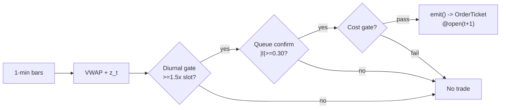

# T004 — VWAP-Deviation Mean-Reversion

> **Reviewer card.** Intraday microstructure mean-reversion (fade): transient overextensions away from the session VWAP (S040) revert as liquidity replenishes; queue imbalance (S003) times the turn, diurnal normalization (S067) keeps thresholds honest across the U-shaped vol day. Provenance **[D]**.
>
> Edge verdict: **NO-DOCUMENTED-EDGE** — no published Sharpe for the VWAP fade itself — VWAP±bands are desk-standard tooling, but the fade P&L is anecdotal [documented].
>
> After-cost: **FULL-COST** — one-sentence verdict: per-event edge is small and spread-bound; the fade lives or dies on the book's own timing.
>
> Build cost **Tier S** · prototype 20–40 h [example] · loaded cost $3,000–6,000 [example] · data cost $29–199/mo [documented, third-party snapshot 2026; verify at polygon.io/pricing] (Polygon Stocks) + Databento $2.00/GB historical / $199/mo Standard [documented] · latency class 1-min bar · risk class medium · risk medium (intraday fade, adverse-trend tail).
>
> Capacity $1–5M/day notional [example] — tens of names × a few thousand shares per event; the fade itself becomes the flow beyond that · Executability: Feasible: 1-min bar state machine + touch imbalance; any retail platform suffices.

## §1  Identity & provenance

This module is a **strategy**: it emits `OrderTicket` intentions only — brokers create orders, strategies never do. Family **B  # mean-reversion**, batch **TB1**, provenance tier **D**.

**Lede.** Intraday microstructure mean-reversion (fade): transient overextensions away from the session VWAP (S040) revert as liquidity replenishes; queue imbalance (S003) times the turn, diurnal normalization (S067) keeps thresholds honest across the U-shaped vol day. Provenance **[D]**.

**Emits.** A list of `OrderTicket` intentions (`[]` when flat/no signal). Never orders. See §T6 for the OrderTicket schema, child-order state machine, and partial-fill policy.

**When it dies.** Vol-regime break (σ̂_d doubles intraday [example]); trending tape; spread `>3`¢ [default] on the name.

**Regime gates (provisional).** R001 elevated RV degrades (stretch is information, not noise); R-halt excludes. Machine records in §T5.

**Prototype scope.** 1-min bar machine + VWAP + rolling z + diurnal table + queue confirm + kill-switch.

## §1.5  Cheapest/least-build path

Cheapest viable path: **Polygon.io Stocks Starter** — 1-min OHLCV bars + reference data, ~$29/mo [documented, third-party snapshot 2026; verify at polygon.io/pricing]. Pair with usage-based Databento MBP-1 touch only if queue confirm (S003) must be live; otherwise prototype the confirm on delayed touch and keep the cheapest tier.

**Cheapest-source row.**

| min_tier | latency_class | required_fields | price_band | build_or_buy |
|---|---|---|---|---|
| Polygon Stocks Starter | 1-min bar (15-min delayed on Starter [documented]) | 1-min OHLCV bars, exchange timestamps, splits/dividends | $29–199/mo [documented, third-party snapshot 2026] | buy data; build everything else |

Resource budget: `1` core, `<1` GB RAM [internal-est] · compute pattern `per_bar`.

**Skip list (do not build in phase one).** Multi-name cross-sectional ranking; L2 book reconstruction; Rust port; live Databento subscription before the Starter-tier prototype validates.

**DO-NOT-CUT list.** t→t+1 causality assertions; the §T2 COST block callable; the kill switch; the decision audit log; bona-fide-intent + self-trade prevention (C1); provenance/honesty tags; the fixture + test suite; secrets via env only.

Explicitly out of scope (phase two): multi-name cross-sectional ranking; L2 book reconstruction; Rust.

Escalation gate: universe `>100` names [default]; 1-min bar latency `>60` s [default] — crossing it requires re-review of §T7 and §T8.

## §T0  Module contract — strategies emit intentions, brokers create orders

This strategy's sole output is a list of `OrderTicket` intentions. It never places, routes, or confirms an order. Every ticket carries `parent_signal` (the upstream signal id and its `computed_at`), an `intent_ts`, and a `tif`. The backtest harness fills tickets strictly after the signal bar (`fill_event > signal_event`, t->t+1 causality); any fill timestamped at or before its signal bar is a harness bug and trips the kill switch.

**Typed signature.**

```python
def emit(state: ModuleState, events: BarEvents, cfg: T004Config) -> list[OrderTicket]:
    """Core function. Pure w.r.t. market data: mutates only `state`.
    Returns [] on UNKNOWN/DEGRADED-with-halt; never emits a ticket when the
    cost gate fails, staleness TTL is exceeded, or the kill switch is TRIPPED.
    """
```

**Config dataclass (single; status ∈ fixed/default/calibrate/example/internal-est).**

```python
@dataclass(frozen=True)
class T004Config:
    z_entry: float = 2.0        # status=default range=1.0–4.0
    z_exit: float = 0.5         # status=default range=0.0–1.5
    I_confirm: float = 0.30     # status=default range=0.1–0.6
    diurnal_mult: float = 1.5   # status=default range=1.0–3.0
    time_stop_min: float = 30.0 # status=default range=5–120
    stop_dollars: float = 0.20  # status=default range=0.05–1.0
    max_entries_day: int = 3    # status=default range=1–10
    cooldown_s: float = 300.0   # status=default range=0–3,600
    cost_gate_k: float = 0.5    # status=default range=0.1–2.0
    per_trade_R: float = 300.0  # status=default  ($) risk budget per trade
```

**Canonical bar mapping (ingest).**

| Vendor field (Polygon.io Stocks) | Canonical | Notes |
|---|---|---|
| `t` (ms) | `bar_open_ts` (int64 ns UTC; bar labeled by open time) | causality clock |
| `o, h, l, c` | `open, high, low, close` | split/dividend-adjusted |
| `v` | `volume` | shares |
| Databento MBP-1 | `bid_sz`, `ask_sz` (L1 touch) | canonical quote fields for S003 |

**Time contract.** Clock domain: exchange (SIP/venue) for `event_ts`; local monotonic clock for staleness checks. Authoritative causality clock: `event_ts` int64 ns UTC. Bar-label rule: every bar labeled by its **open** time. max_skew `5` s [default] · jitter budget `30` s [default] · staleness TTL `90` s [default] · cadence `per_bar (1-min)` · tz `America/New_York`. Gap policy: no interpolation — a gap beyond TTL emits `UNKNOWN`, never a filled bar.

**Market-state table (runtime).**

| State | Meaning | T004 behavior |
|---|---|---|
| `CONTINUOUS_TRADING` | regular session | normal entry/exit logic |
| `HALTED` | trading halt | veto new entries; manage existing per exit rule |
| `AUCTION` | open/close auction or halt auction | veto new entries |
| `CLOSED` | outside session | no tickets; module `OFF` |

**Module-state enum.** `OK | DEGRADED | UNKNOWN | OFF`. Invalid or stale input → `UNKNOWN` (never interpolate, never emit). `DEGRADED` = vol-regime break: halt new entries, manage existing. `OFF` = killed or outside session. Crossed/locked touch (`ask <= bid`) or non-positive prices → `UNKNOWN`.

**State vector (named).** `vwap_num`, `vwap_den`, `d_window` (rolling 30 [example] fractional deviations), `slot_table` (20-day [example] same-slot deviation medians), `entries_today`, `cooldown_until`, `position`, `module_state`.

**Risk contract (fenced YAML — canonical).**

```yaml
risk_contract:
  per_trade_R: 300.0            # [example] $ risk budget per trade
  daily_loss_stop: -1500.0      # [example] $ then flat and dark for the day
  max_gross: 600000.0           # [example] $ notional
  max_adverse_per_trade: 1.5    # [default] × stop_distance
  max_concurrent_fades: 4       # [example]
  kill_conditions:
    - "rolling σ̂_d doubles intraday [example]"
    - "feed heartbeat missed > 2 s [example]"
    - "clock skew > 50 ms [example]"
    - "4 concurrent fades reached [example]"
  enforcement: intraday-hard    # [default]
  calibration:
    paper_sessions: 30          # [default]
    diurnal_cal_sessions: 20    # [default]
    fee_repin: monthly          # [default]
```

**Kill switch: `ARMED` → `TRIPPED` → `RECOVERY` → `ARMED`.**

On trip: the module stops emitting tickets immediately, flattens managed positions per the exit rule, and pages. Transition guard: `TRIPPED` may only be entered from `ARMED`; `RECOVERY` only from `TRIPPED`; `ARMED` only from `RECOVERY` via the re-arm checklist.

**Re-arm checklist (all must hold).**

1. Trip cause documented in the decision log [default].
2. Post-trip cooldown of `300` s [default] expired.
3. Feed heartbeat healthy for ≥ `60` s [default] (no missed beat > `2` s [example]).
4. Clock skew ≤ `50` ms [default] vs the exchange clock.
5. Rolling σ̂_d back within `2`× its session-open value [example].
6. Positions verified flat; no working child orders [default].
7. Manual reviewer sign-off recorded [default].

**Ops tail.** Schedule: US equities RTH `10:00`–`15:30` ET [example]; flat by `15:30`; no overnight carry, ever. Owner: `[unverified] assign at deploy`. Health checks: feed heartbeat every `1` s [default]; kill-switch state published every `60` s [default]. Alert table: trip → page; `DEGRADED` → notify; `UNKNOWN` → log. Resource budget: `1` vCPU, `1` GB RAM [internal-est]. Runbook stub: (1) acknowledge page; (2) read trip cause from decision log; (3) verify flat; (4) complete re-arm checklist; (5) re-arm; (6) file post-mortem. Secrets: env-only (`POLYGON_API_KEY`, `DATABENTO_API_KEY`); never in code, logs, or fixtures (CI greps).

## §T1  Strategy thesis & edge

**Thesis.** Intraday microstructure mean-reversion (fade): transient overextensions away from the session VWAP (S040) revert as liquidity replenishes; queue imbalance (S003) times the turn, diurnal normalization (S067) keeps thresholds honest across the U-shaped vol day. Provenance **[D]**.

**Edge verdict: NO-DOCUMENTED-EDGE** — no published Sharpe for the VWAP fade itself — VWAP±bands are desk-standard tooling, but the fade P&L is anecdotal [documented].

**After-cost verdict: FULL-COST** — one-sentence verdict: per-event edge is small and spread-bound; the fade lives or dies on the book's own timing.

**Risk summary.** Fading an information move — the stop is the thesis; repeated re-triggers signal a broken thesis, not a sale.

**When it dies.** Vol-regime break (σ̂_d doubles intraday [example]); trending tape; spread `>3`¢ [default] on the name.

**Selection disclosure.** The three cited sources were chosen because they are the closest citable anchors for the three consumed signals (order-flow imbalance → S040/S003 timing; queue imbalance → S003; intraday vol periodicity → S067). No citable source was found for the VWAP-fade strategy's own P&L — that gap is the verdict, not an omission (§T10).

## §T2  Signal stack — fixed-order sub-blocks

**Timing box.** `signal@t (1-min, America/New_York) → earliest fill @open(t+1)` — the strategy evaluates at bar close; the broker may not fill before the next bar's open. `assert fill_event > signal_event` on every fill; a signal-bar fill is a harness bug.

**Universe.** Liquid US large-caps. Gates [example]: price > `$20`; `14`-day ADV ≥ `2`M shares [example]; median quoted spread ≤ `3`¢ [example]. RTH `10:00`–`15:30` ET. Exclude: the first `30` minutes [example] (VWAP unstable; rolling σ̂ needs ≥`5` bars [example]); the last `30` minutes [example] (MOC/index benchmark flow); earnings days; halts.

**Dependency stack.**

| Signal | Role | Contract |
|---|---|---|
| `S040` | trigger | |z_t| >= 2.0 [example]; sign of z picks direction (fade the stretch) |
| `S003` | confirm | I_t has the reversal sign and |I_t| >= 0.30 [example]; no book confirmation → no trade |
| `S067` | gate | |d_t| in bps must clear 1.5× the 20-day same-slot median [example]; rescales 'extreme' by time of day |

Max dependency depth: `2` [default]. Consumed formulas are pinned to the provider versions via `version_pin: >=1.0.0` in §0; the provider's contract is authoritative — this file inlines only the decisive constants above.

**Schema mapping (canonical).** See §T0 canonical bar mapping. Ingest maps Polygon.io `t,o,h,l,c,v` and Databento MBP-1 L1 touch `bid_sz`/`ask_sz` into the canonical bar/quote fields before any computation.

**Staleness.** max skew `5 s` [default] · jitter budget `30 s` [default] · TTL `90` s [default] · cadence `per_bar (1-min)` · tz `America/New_York`. Inputs older than the TTL → `UNKNOWN`, no tickets (C6).

**Entry rule (Boolean expressions — normative).**

```text
ENTER_LONG  := (z_t <= -z_entry) AND (I_t >= I_confirm)
               AND (|d_t|_bps >= diurnal_mult * slot_median_bps)
               AND (entries_today < max_entries_day) AND (now >= cooldown_until)
               AND (expected_cost_bps(...) <= cost_gate_k * edge_bps)
ENTER_SHORT := (z_t >= +z_entry) AND (I_t <= -I_confirm)
               AND (|d_t|_bps >= diurnal_mult * slot_median_bps)
               AND (entries_today < max_entries_day) AND (now >= cooldown_until)
               AND (locate_ok) AND (expected_cost_bps(...) <= cost_gate_k * edge_bps)
FLAT        := otherwise
```

**Exits (with post-exit cooldown).**

```text
EXIT := (|z_t| <= z_exit) [reversion] OR (bars_held >= time_stop_min)
        OR (z adverse >= +1.0 [long] / price stop -$stop_dollars) [stop]
        OR (t >= 15:30) [session flatten] OR (module_state != OK)
```

**Cooldown.** `300` s [default] after every exit (C10): `cooldown_until = exit_event_ts + 300 s`; no re-entry inside it.

**Position sizing (fenced function — normative).**

```python
def shares(risk_budget_R, stop_distance, vol_estimate, ADV_cap, cost):
    # risk_budget_R in $, stop_distance in $/share (example price stop $0.20)
    n = risk_budget_R / max(stop_distance, 1e-9)   # [default] floor below
    n = min(n, ADV_cap * 0.005)                   # 0.5% ADV [default]
    n = min(n * 50.0, 600000.0) / 50.0           # $600k gross cap [default]
    # ^^^ the *50.0/50.0 form prices the cap at a $50 reference share price [example];
    #     pass price-adjusted notional via risk_budget_R for other names
    return int(n)
```

`vol_estimate` and `cost` are accepted for the §T0 contract signature and inform the risk layer (they gate via C10 and the cost gate); the reference sizing is risk-stop/ADV/gross-capped. Fixture qty `1500` = `$300` R / `$0.20` stop [example] — the worked example ties to this function.

**Risk limits.**

| Limit | Value |
|---|---|
| Daily loss stop | `-$1,500` [example] → flat and dark |
| Per-name max entries | `3`/day [example] — a re-triggering fade is a broken thesis |
| Max concurrent fades | `4` [example] |
| Max adverse per trade | `1.5`× stop [default] |
| Vol-regime break | σ̂_d doubles intraday [example] → halt new entries |

Canonical values live in the §T0 risk-contract YAML; this table is the human read of it.

**COST block — single source of truth.** (Restating these numbers anywhere else is a validation failure. Front-matter `cost_model` is the machine mirror of this table.)

| Component | bps | Basis |
|---|---|---|
| Spread | `8.0` | [example] $0.02 assumed spread at $50: half-spread per aggressive leg × 2 legs |
| Fees | `2.0` | [example] $0.005/share each way at $50 = 1 bps/leg (Nasdaq publishes $0.0030/share removal for RFTY members [documented, SR-NASDAQ-2025-026]; stack value is a conservative example, not a fee read) |
| Borrow | `0.0` | [example] reference build flattens intraday (C9) — stock-loan borrow accrues on overnight positions, so intraday-flat reference shorts book 0.0; intraday locates priced separately under C7 |
| Impact | `0.0` | [example] flagged; gap-through modeled in the conservative variant only |
| **Total** | `10.0` | [example] reference stack |

Fee schedule as of `2026-09-01` [example] · venue `XNAS / SIP 1-min bars [example]` · side `taker` · `borrow_bps_per_day = 0.0` [example] — reason: reference build carries no overnight positions (C9); any strategy variant that carries overnight must set `borrow_bps_per_day > 0` and re-pin the stack.

```python
def expected_cost_bps(notional, adv_pct, venue, side, urgency) -> float:
    """Callable cost model - T004 COST block (single source of truth)."""
    spread_bps = 8.0    # [example] $0.02 assumed spread @ $50: half/aggressive leg x 2
    fee_bps = 2.0       # [example] $0.005/share each way @ $50 = 1 bps/leg
    borrow_bps = 0.0    # [example] intraday-flat reference (C9); shorts add C7 locate + borrow
    impact_bps = 0.0    # [example] flagged; gap-through in conservative variant only
    return spread_bps + fee_bps + borrow_bps + impact_bps
```

**Normative cost-gate predicate (C3):** `expected_cost_bps(...) <= k * edge_bps` — no ticket is emitted unless the callable cost clears this gate. The predicate appears verbatim in the §T3 pseudocode and is asserted by the per-module test.

**Execution / fill-model table.**

| Aspect | Assumption |
|---|---|
| Latency | bar-close evaluation; fill at next-bar open (`fill_event > signal_event`) |
| Fill model | limit at `open(t+1)`; the reference harness assumes a fill at that print [example] |
| Partial fills | oldest `intent_ts` first (FIFO); see §T6 child-order policy |
| Impact | `0` bps reference [example]; conservative variant models entry-bar gap-through |
| Adverse fill | fading an information move — the stop, not the fill model, is the control |

**Robustness + compliance sub-block.** `z_entry` in `1.5`–`2.5` [example] trades frequency for selectivity; the diurnal gate matters more than the z threshold — without it, the open's U-shape generates false extremes. Re-validate on purged/embargoed OOS (S088 pattern).

Compliance (10 coded rules minimum; full text in §T8):

- **C1** | No orders: the strategy emits `OrderTicket` intentions only; the broker creates orders.
- **C2** | Kill switch: `ARMED` → `TRIPPED` → `RECOVERY` → `ARMED` on the trip conditions in §T7.
- **C3** | Cost gate: `expected_cost_bps(...) <= k * edge_bps` before any ticket (see §T2 COST block).
- **C4** | Causality: `fill_event > signal_event` (t->t+1); no signal-bar fills, ever.
- **C5** | Decision log: every ticket logged with inputs hash and params hash (schema in §T8).
- **C6** | Staleness: inputs older than the TTL → `UNKNOWN`, no tickets.
- **C7** | Short discipline: `locate_ok` required before any short ticket.
- **C8** | Cooldown: post-exit cooldown enforced in seconds; no re-entry inside it.
- **C9** | Session flatten: no uncommanded overnight carry.
- **C10** | Position caps: per-trade R, daily loss stop, and max gross enforced.
- **C11 | Max-entries-per-day: trigger = `3`rd entry same name same day [example] → check = `entries_today` → action = veto further entries → log = `GATE_VETO`**
- **C12 | Vol-regime halt: trigger = rolling σ̂_d doubles intraday [example] → check = S040 window → action = halt new entries (manage existing) → log = `COMPLIANCE_BLOCK`**

**Parameter table.**

| Parameter | Key | Default | Tag | Sensitivity |
|---|---|---|---|---|
| Entry z | `z_entry` | `2.0` | [default] | high |
| Exit z | `z_exit` | `0.5` | [default] | medium |
| Queue confirm | `I_confirm` | `0.30` | [default] | high |
| Diurnal multiple | `diurnal_mult` | `1.5`× | [default] | high |
| Time stop | `time_stop_min` | `30` min | [default] | medium |
| Price stop | `stop_dollars` | `$0.20` | [default] | high |
| Post-exit cooldown | `cooldown_s` | `300` s | [default] | low |
| Cost-gate k | `cost_gate_k` | `0.5` | [default] | high |

**Inputs that break the module.**

| Input failure | Module state | Alert |
|---|---|---|
| VWAP unstable (< 5 bars after 10:00) [example] | `UNKNOWN` | log |
| Rolling σ̂_d doubles intraday (vol regime break) [example] | `DEGRADED` (halt new entries) | notify |
| Queue confirm inputs missing | `UNKNOWN` | log |

**Data dictionary (canonical fields).**

| Field | Type | Cadence | Tier | Notes |
|---|---|---|---|---|
| `1-min OHLCV bars` | float/int | 1-min | Tier 1 | split/dividend-adjusted |
| `L1 touch bid/ask size` | int | per quote event | Tier 2 | S003 confirm |
| `20-day same-slot deviation table` | float | per 1-min slot | Tier 1 | S067 diurnal norms |

## §T3  Math & normative pseudocode (pseudocode is normative; prose is commentary)

**Math.**

```text
Session VWAP `V_t = Σ TP·V / Σ V` (causal, from the open; TP = (H+L+C)/3).
Fractional deviation `d_t = (C_t − V_t)/V_t`; z-score `z_t = d_t / σ̂(d_{t-29:t})`
with `W = 30` [example]. Queue imbalance `I_t = (bid_sz − ask_sz)/(bid_sz +
ask_sz)` (S003). Diurnal gate: `|d_t|` in bps ≥ `1.5`× the `20`-day same-slot
median [example] (Andersen–Bollerslev deseasonalization [documented]). Modeled
edge `edge_bps = |z_t| × 4.0` [example].
```

**Pseudocode (normative).** No black boxes: `locate_ok()` returns True iff a Regulation SHO locate was obtained for the short and is still valid (C7); `exit_trigger` is the §T2 exit Boolean; `size()` is the §T2 fenced sizing function; `slot_median_bps` comes from the S067 diurnal table.

```text
function emit(state, signals, bars, cfg) -> list[OrderTicket]:
    assert bars non-empty else return UNKNOWN                       # F1
    t = bars[-1]   # newest 1-min bar, labeled by open time
    z  = signals['S040'].z
    I  = signals['S003'].imbalance
    dg = signals['S067'].diurnal_ok
    assert isfinite(z) and isfinite(I) else return UNKNOWN          # F2

    edge_bps = abs(z) * 4.0                                        # [example]
    cost_ok = expected_cost_bps(notional, adv_pct, venue, side, urgency) <= cfg.cost_gate_k * edge_bps
    # ^^^ normative cost-gate predicate: expected_cost_bps(...) <= k * edge_bps

    tickets = []
    if state.position == 0 and cost_ok and dg and t.event_ts >= state.cooldown_until:
        if z <= -cfg.z_entry and I >= cfg.I_confirm and state.entries_today < cfg.max_entries_day:
            tickets = [ticket(side='BUY', qty=size(...), limit=open(t+1), tif='DAY',
                              parent_signal=f"S040@{signals['S040'].computed_at}")]
        elif z >= cfg.z_entry and I <= -cfg.I_confirm and state.entries_today < cfg.max_entries_day and locate_ok():
            tickets = [ticket(side='SELL', qty=size(...), limit=open(t+1), tif='DAY',
                              parent_signal=f"S040@{signals['S040'].computed_at}")]
    else:
        if exit_trigger(t, state, cfg):
            tickets = [flatten_ticket(state)]
            state.entries_today += 1
        state.cooldown_until = t.event_ts + cfg.cooldown_s * 1e9   # C10
    for tk in tickets: log_decision(tk, inputs_hash, params_hash)  # C5 / App. g
    assert fill.event_ts > t.bar_close_ts for any fill             # t->t+1 causality
    return tickets
```

**Flow.**



## §T4  Worked example, fixtures & acceptance tests

Fixtures are **synthetic** (`# TYPE: validation-run` header in both CSVs; fixtures validate the accounting arithmetic, not live P&L). Fixture signals are retimestamped into the trade window (`10:30`–`10:35` ET, trade 5 at `15:29` ET for the session-flatten case) so the tape is consistent with the §T2 universe exclusion of the first 30 minutes.

**Worked example (fixture-backed, from `fixtures/T004_tape.csv` trade 1).**

Trade 1: `BUY` `1500` shares [example] @ `49.8` [example], exit `50.05` [example] (`reversion |z|<=0.5`). Qty `1500` = `$300` R / `$0.20` stop [example] via the §T2 sizing function. Gross P&L = `375.00` [measured] dollars. Cost stack = `10.0` bps [example] → `74.70` [measured] dollars on `74700.00` [example] notional. Net = `300.30` [measured] dollars. The fixture's expected CSV carries the same arithmetic for all six trades; the per-module test recomputes it from the tape and asserts equality.

**Acceptance tests** (`modules/tests/test_T004.py`; run `pytest modules/tests/test_T004.py -q`; all must exit 0):

1. `test_type_header` — both fixture CSVs carry a `# TYPE:` header marking them synthetic validation runs.
2. `test_fixture_arithmetic` — the tape's stored cost stack, the module's `expected_cost_bps` callable, and the expected CSV agree; gross/net P&L recomputed by hand from tape prices.
3. `test_no_signal_bar_fills` — `fill_event > signal_event` on every row (t→t+1 causality, C4).
4. `test_cost_gate_predicate` — `expected_cost_bps(...) <= k * edge_bps` passes when edge >> cost and blocks when edge << cost (C3).
5. `test_kill_switch_trips_and_rearms` — drives `ARMED → TRIPPED → RECOVERY → ARMED` with the re-arm checklist (C2).
6. `test_invalid_input_emits_unknown` — crossed/locked/empty input → `UNKNOWN`, never interpolated.
7. `test_cost_callable_signature` — `expected_cost_bps(notional, adv_pct, venue, side, urgency)` returns a finite float.
8. `test_timing_box` — every fixture fill is exactly one bar (`60` s) after its signal, and every signal sits inside the `10:00`–`15:30` ET trade window.
9. `test_sizing_function` — `shares()` matches the §T2 fenced function: `$300`/`$0.20` → `1500` shares; ADV cap binds at `0.5`% of ADV; `$600k` gross cap binds on large R.

## §T5  Dependencies, data rights & regime gates

**Dependency edge list (machine).** Generated from the §0 `consumes` edges; CI asserts symmetry with the provider chapters.

| From | To | Function | Role | Version pin |
|---|---|---|---|---|
| S040 | T004 | `z` (VWAP-deviation z-score) | trigger | `>=1.0.0` |
| S003 | T004 | `imbalance` (queue imbalance) | confirm | `>=1.0.0` |
| S067 | T004 | `diurnal_ok` (slot-normalized gate) | gate | `>=1.0.0` |

Max dependency depth: `2` [default].

**Data rights (startup assertions).** US equities bars via Polygon.io + L1 touch via Databento MBP-1, `rights: licensed`; research + stated production; fixtures synthetic; entitlement = professional/internal; derived features ours. Entitlement-class change → §1.5 escalation gate.

**Build vs buy.** Build the signal stack on a cheap SIP/1-min feed; buy nothing except the data — the edge is in your thresholds and timing, which no vendor sells.

**Local build.** Feasible. VWAP is a running sum; the z-window and diurnal table are kilobytes. The whole book for `100` names [example] fits in memory easily.

**Regime gates (machine records — canonical).** `{regime_id, direction, mechanism, condition, action, min_lag, unknown_behavior}`; restrictive default (unknown → veto).

| regime_id | direction | mechanism | condition | action | min_lag | unknown_behavior |
|---|---|---|---|---|---|---|
| R001 | degrades | elevated RV: stretch is information | rv_pctile > 70 [default] | halve | 1 bar [default] | veto |
| R001 | inverts | extreme RV: fade becomes the flow | rv_pctile > 95 [default] | pause_entry | 1 bar [default] | veto |
| R-halt | inverts | halt/auction state | state != CONTINUOUS_TRADING [default] | veto | 0 [default] | veto |

## §T6  Execution & OrderTicket intentions

The strategy emits intentions; the broker creates orders (C1). Cost/fill simulation lives in this module's harness, never in signals.

**OrderTicket schema (intents only).**

| Field | Type | Notes |
|---|---|---|
| `ticket_id` | string | unique per intent |
| `module_id` | string | `T004`, version `1.0.1` |
| `symbol` | string | e.g. `AAPL` |
| `side` | enum | `BUY` / `SELL` |
| `qty` | int | from `shares()`; FIFO on partials |
| `order_type` | enum | `LIMIT` (reference) |
| `limit_px` | float | `open(t+1)` reference |
| `tif` | enum | `DAY` |
| `intent_ts` | int64 ns UTC | emission time |
| `parent_signal` | string | `S040@<computed_at>` (+ S003/S067 ids in the decision log) |
| `params_hash` | string | hash of the T004Config used |
| `inputs_hash` | string | hash of bar + signal inputs |
| `locate_ok` | bool | required True for `SELL` (C7) |

**Child-order state machine (broker-side; the strategy only observes).** `INTENT_CREATED → ACKNOWLEDGED → WORKING → FILLED | PARTIAL → DONE`; `WORKING → CANCELLED → DONE` on exit trigger or kill-switch trip. The strategy never mutates a working child order in place.

**Partial-fill policy.** Oldest `intent_ts` first (FIFO). A partial remainder is re-offered as a **new** intent only if the §T2 entry Boolean still holds at the next bar; never silently re-entered. A partial fill does not extend `cooldown_until` — cooldown starts at exit.

**Cancel-replace rules.** Cancel on any §T2 exit trigger, on kill-switch trip, or at `15:30` ET session flatten. Replace only via a fresh entry evaluation — no in-place quantity or price changes to a working intent.

**Fill model (reference harness).** Limit at `open(t+1)`; the reference harness assumes a fill at that print [example]; adverse selection is handled by the stop, not by a richer fill model. Conservative variant: model entry-bar gap-through as `impact_bps > 0` [example].

## §T7  Risk contract & kill switch

Canonical values: the §T0 fenced risk-contract YAML. Human read:

Per-trade R: `$300` [example] per trade · daily loss stop: `- $1,500` [example] then flat and dark for the day · max gross: `$600k` notional [example] · max adverse per trade: `1.5`x stop [default] · max concurrent fades: `4` [example].

Enforcement: `intraday-hard` [default]. Calibration recipe: paper-trade `30` sessions [default]; calibrate diurnal table on `20` sessions [default]; re-pin fee schedule monthly [default].

**Kill switch: `ARMED` → `TRIPPED` → `RECOVERY` → `ARMED`.**

Trip conditions:

- rolling σ̂_d doubles intraday [example]
- feed heartbeat missed > 2 s [example]
- clock skew > 50 ms [example]
- 4 concurrent fades reached [example]

On trip: the module stops emitting tickets immediately, flattens managed positions per the exit rule, and pages. `RECOVERY` requires the §T0 re-arm checklist (manual review, cooldown expiry, healthy feeds); only then does the module return to `ARMED`. The per-module test drives the full transition cycle.

## §T8  Compliance (C1–C10+)

- **C1** | No orders: the strategy emits `OrderTicket` intentions only; the broker creates orders.
- **C2** | Kill switch: `ARMED` → `TRIPPED` → `RECOVERY` → `ARMED` on the trip conditions in §T7.
- **C3** | Cost gate: `expected_cost_bps(...) <= k * edge_bps` before any ticket (see §T2 COST block).
- **C4** | Causality: `fill_event > signal_event` (t->t+1); no signal-bar fills, ever.
- **C5** | Decision log: every ticket logged with inputs hash and params hash (schema below).
- **C6** | Staleness: inputs older than the TTL → `UNKNOWN`, no tickets.
- **C7** | Short discipline: `locate_ok` required before any short ticket.
- **C8** | Cooldown: post-exit cooldown enforced in seconds; no re-entry inside it.
- **C9** | Session flatten: no uncommanded overnight carry.
- **C10** | Position caps: per-trade R, daily loss stop, and max gross enforced.
- **C11 | Max-entries-per-day: trigger = `3`rd entry same name same day [example] → check = `entries_today` → action = veto further entries → log = `GATE_VETO`**
- **C12 | Vol-regime halt: trigger = rolling σ̂_d doubles intraday [example] → check = S040 window → action = halt new entries (manage existing) → log = `COMPLIANCE_BLOCK`**

**Decision-log schema (C5).** `{decision_ts (int64 ns UTC), module_id, version, ticket_id, side, qty, limit_px, inputs_hash, params_hash, signal_ids, cost_bps, edge_bps, gate_result ∈ {PASS, FAIL}, module_state}`. One row per ticket; immutable; retained per the entitlement's audit policy. Halt/auction handling: see the §T0 market-state table — `HALTED`/`AUCTION` veto new entries and are logged as `COMPLIANCE_BLOCK`.

## §T9  Evidence, failures & regime gates

**Evidence (cost-level tokens; every statistic tagged).**

| Source | Sample | Finding | Cost level | Caveat |
|---|---|---|---|---|
| Cont, Kukanov & Stoikov (2014) [documented] | `50` US stocks, NYSE TAQ, `2008` [documented] | linear OFI↔Δprice; slope ∝ `1/(2·depth)` [documented] | `BEFORE-COST`; contemporaneous, not a trading rule | no forward P&L; no Sharpe |
| Gould & Bonart (2016) [documented] | `10` liquid Nasdaq stocks, LOB [documented] | queue imbalance → next-mid-move logistic, strongly significant on large-tick names [documented] | `BEFORE-COST` (classification) | predicts direction only; no costs |
| Andersen & Bollerslev (1997) [documented] | 5-min DM/$ and S&P 500 futures [documented] | deseasonalizing eliminates most distortions of the intraday vol cycle [documented] | `BEFORE-COST` (diagnostics) | diagnostic, not a trading result |

After-cost column: all three sources are `BEFORE-COST` — none reports an after-cost P&L for this strategy, which is exactly the NO-DOCUMENTED-EDGE verdict. No bare P&L claim is made anywhere in this file; the only P&L figures are the synthetic fixture accounting in §T4, labeled [measured] against synthetic tape.

**Where this module is known to fail.** trending tapes, vol-regime breaks, thin names where the spread binds, MOC/index flow windows.

**Failure modes (detect → action → recovery).**

| # | Failure | Detect → action → recovery | Executable check |
|---|---|---|---|
| 1 | Fading information: stretch keeps extending | detect: `3` entries same name same day [example] → action: veto further entries (C11) → recovery: next session | `entries_today <= 3` |
| 2 | Vol-regime break: σ̂_d doubles intraday | detect: S040 window → action: halt new entries → recovery: σ̂ normalizes [default] | `sigma_ratio <= 2` |
| 3 | Lookahead: VWAP uses future bars | detect: `fill_event <= signal_event` → action: halt, fix → recovery: no-signal-bar-fills test [default] | `all(fill_ts > signal_ts)` |
| 4 | Cost blowup on sub-penny deviations | detect: cost gate failing on `[measured]` costs → action: raise z_entry or stand down → recovery: re-pin fee schedule | `expected_cost_bps(...) <= k * edge_bps` |
| 5 | Missing touch data (S003 confirm blind) | detect: staleness → action: UNKNOWN, no entries → recovery: feed healthy [default] | `touch_fresh` |

**Regime gates.** Canonical machine records in §T5 (restrictive default: unknown → veto).

**Robustness.** `z_entry` in `1.5`–`2.5` [example] trades frequency for selectivity; the diurnal gate matters more than the z threshold — without it, the open's U-shape generates false extremes. Re-validate on purged/embargoed OOS (S088 pattern).

**What the optimistic case assumes (and we do not).** (1) the fade always finds the book rebuilding — real stretches can be information; (2) spread fixed at `2`¢ [example]; (3) the diurnal table is perfectly estimated; (4) impact `0` [example] — flagged.

## §T10  Source log + unverified leads

**Source log (verified 2026-09-10 via public web; arXiv IDs resolve).**

1. Cont, R., Kukanov, A. & Stoikov, S. (2014). *The Price Impact of Order Book Events.* Journal of Financial Econometrics 12(1): 47–88. arXiv:1011.6402 — verified via arxiv.org/abs (v3, 13 Apr 2011) and ADS bibcode 2010arXiv1011.6402C; sample `50` US stocks / NYSE TAQ [documented]. Cost level: BEFORE-COST.
2. Gould, M. D. & Bonart, J. (2015). *Queue Imbalance as a One-Tick-Ahead Price Predictor in a Limit Order Book.* arXiv:1512.03492 — verified via arxiv.org/abs/1512.03492 (v1, 11 Dec 2015); `10` liquid Nasdaq stocks, logistic regressions [documented]. Cost level: BEFORE-COST.
3. Andersen, T. G. & Bollerslev, T. (1997). *Intraday Periodicity and Volatility Persistence in Financial Markets.* Journal of Empirical Finance 4(2–3): 115–158 — verified via Duke Scholars and RePEc citation record [documented]. Cost level: BEFORE-COST (diagnostics).
4. Databento unit pricing (2024-12-11): DBEQ.BASIC MBP-1 `$2.00`/GB historical, `$2.40`/GB live [documented]. Databento Standard plan `$199`/mo incl. 12 months L1 [documented, third-party comparison 2026-08].
5. Polygon.io (Massive) pricing: Starter ~`$29`/mo, Developer ~`$99`/mo, Advanced ~`$199`/mo; Starter = 15-min delayed + 1-min aggregates [documented, third-party snapshots 2026 — re-verify at polygon.io/pricing].
6. Nasdaq RFTY removal fee `$0.0030`/share for members above 4M shares/mo [documented, SR-NASDAQ-2025-026 via SEC filing].

**Unverified leads & what would change our mind.**

- Chatbot-drafted VWAP-fade Sharpe anecdotes from practitioner forums — no citable source; not promoted.

What would change our mind: a purged/embargoed walk-forward with full costs that survives the S088 honesty protocol; a documented after-cost P&L from the cited authors' own implementations; or a regime-gated replication that holds outside the original sample.

## AI build prompt

```text
Build the T004 (VWAP-Deviation Mean-Reversion) strategy module from this specification.
Hard constraints:
- The strategy emits OrderTicket intentions ONLY; it never creates orders (C1).
- Causality: fill_event > signal_event (t->t+1); no signal-bar fills (C4).
- Cost gate: expected_cost_bps(...) <= k * edge_bps before any ticket (C3).
- Kill switch ARMED -> TRIPPED -> RECOVERY -> ARMED on the §T7 trip conditions (C2),
  with the §T0 re-arm checklist.
- Timing box: signal@t (1-min, America/New_York) -> earliest fill @open(t+1).
- Every numeric literal in prose carries an honesty tag [documented]/[measured]/[example]/[unverified]/[default]/[internal-est]; exempt identifiers only.
- Sources must be real and cited with cost-level tokens; chatbot-only material goes to §T10.
Module contract:
- Typed signature: emit(state: ModuleState, events: BarEvents, cfg: T004Config) -> list[OrderTicket]
- Config dataclass: z_entry=2.0 [default], z_exit=0.5 [default], I_confirm=0.30 [default],
  diurnal_mult=1.5 [default], time_stop_min=30.0 [default], stop_dollars=0.20 [default],
  max_entries_day=3 [default], cooldown_s=300.0 [default], cost_gate_k=0.5 [default], per_trade_R=300.0 [default]
- Time contract: event_ts int64 ns UTC, bars labeled by open time, staleness TTL 90 s [default];
  market-state table CONTINUOUS_TRADING/HALTED/AUCTION/CLOSED; module-state enum OK|DEGRADED|UNKNOWN|OFF.
- Risk contract: fenced YAML in §T0 (per-trade R $300 [example], daily loss stop -$1,500 [example],
  max gross $600k [example], max adverse 1.5x stop [default], enforcement intraday-hard [default]).
- OrderTicket schema + child-order state machine + partial-fill policy (FIFO, §T6).
Entry rule:
ENTER_LONG  := (z_t <= -z_entry) AND (I_t >= I_confirm)
               AND (|d_t|_bps >= diurnal_mult * slot_median_bps)
               AND (entries_today < max_entries_day) AND (now >= cooldown_until)
               AND (expected_cost_bps(...) <= cost_gate_k * edge_bps)
ENTER_SHORT := (z_t >= +z_entry) AND (I_t <= -I_confirm)
               AND (|d_t|_bps >= diurnal_mult * slot_median_bps)
               AND (entries_today < max_entries_day) AND (now >= cooldown_until)
               AND (locate_ok) AND (expected_cost_bps(...) <= cost_gate_k * edge_bps)
FLAT        := otherwise
Exit rule:
EXIT := (|z_t| <= z_exit) [reversion] OR (bars_held >= time_stop_min)
        OR (z adverse >= +1.0 [long] / price stop -$stop_dollars) [stop]
        OR (t >= 15:30) [session flatten] OR (module_state != OK)
Sizing: implement the §T2 shares() fenced function verbatim; enforce the §T0 risk contract.
COST block (§T2, single source of truth): expected_cost_bps(notional, adv_pct, venue, side, urgency)
  = 8.0 [example] spread + 2.0 [example] fees + 0.0 [example] borrow + 0.0 [example] impact;
  fee schedule as of 2026-09-01 [example]; venue XNAS/SIP [example]; side taker.
Deliverables: the module markdown (all sections §1–§T10), the fixture tape CSV
(fixtures/T004_tape.csv), the expected CSV (fixtures/T004_expected.csv), and
the per-module test (modules/tests/test_T004.py) covering fixture arithmetic,
causality, the timing box, sizing, the cost gate, the kill-switch cycle,
invalid→UNKNOWN, and the callable signature.
Definition of done: `pytest modules/tests/test_T004.py -q` exits 0.
```

**GROK-NEEDED** (expert questions web search could not resolve — do not answer from priors):

1. "T004 needs the current (2026) Databento US Equities pricing for the exact schemas it consumes (MBP-1 L1 touch + OHLCV-1m): what is the current monthly price of the plan that covers *live* MBP-1, does the $199/mo Standard plan include live MBP-1 or only historical, and what are the current $/GB rates for live vs historical pulls on DBEQ datasets? A good answer quotes the current databento.com/pricing page with an as-of date."
2. "T004's verdict is NO-DOCUMENTED-EDGE because no published after-cost P&L for a session-VWAP-deviation fade was found. Is there any citable paper, thesis, or practitioner write-up with a documented walk-forward (with costs) of a VWAP-deviation mean-reversion strategy? A good answer gives title/author/year/link plus the reported after-cost metric, or confirms none is citable."
3. "T004 books borrow_bps_per_day = 0.0 [example] on the grounds that the reference build flattens intraday (C9) and US stock-loan borrow accrues on overnight positions. What is the current (2025–2026) convention for US large-cap shorts held intraday-only — do intraday-flat shorts accrue any borrow fee, and what are typical borrow bps/day bands for general-collateral vs hard-to-borrow large caps? A good answer cites a prime-brokerage or stock-loan source."
4. "T004's reference cost stack assumes $0.005/share each way in fees [example] at a $50 share price. What is the closest documented per-share schedule on Nasdaq/NYSE (as of a fixed 2026 date) for a taker-style member, and what is its effective date? A good answer gives the fee schedule name, the per-share tiers, and the as-of date so the stack can be re-pinned from [example] to [documented]."
5. "T004 normalizes deviations by the 20-day same-slot median [example] following Andersen–Bollerslev deseasonalization. Is there published guidance or a citable practitioner source for the lookback length used for same-slot intraday vol normalization on US equities (e.g., 10 vs 20 vs 60 days)? A good answer gives the source and its recommended window."
---

*Deep-review v1.0.1 completed 2026-09-10. Reviewer: subagent deep-review worker (T004).*
