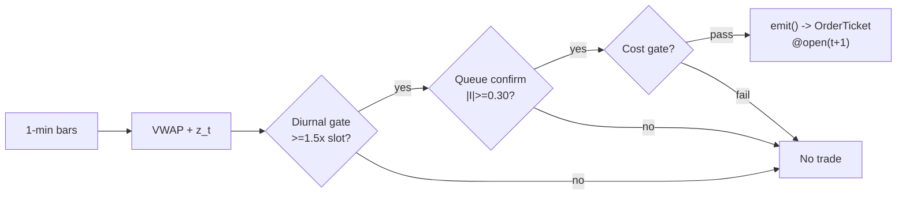

# T004 — VWAP-Deviation Mean-Reversion

> **Reviewer card.** Intraday microstructure mean-reversion (fade): transient overextensions away from the session VWAP (S040) revert as liquidity replenishes; queue imbalance (S003) times the turn, diurnal normalization (S067) keeps thresholds honest across the U-shaped vol day. Provenance **[D]**.
>
> Edge verdict: **NO-DOCUMENTED-EDGE** — no published Sharpe for the VWAP fade itself — VWAP±bands are desk-standard tooling, but the fade P&L is anecdotal [documented].
>
> After-cost: **FULL-COST** — one-sentence verdict: per-event edge is small and spread-bound; the fade lives or dies on the book's own timing.
>
> Tier **S** · prototype 20–40 h [example] · loaded cost $3,000–6,000 [example] · latency bar / 1-min · risk medium (intraday fade, adverse-trend tail).

> Capacity $1–5M/day notional [example] — tens of names × a few thousand shares per event; the fade itself becomes the flow beyond that · Executability: Feasible: 1-min bar state machine + touch imbalance; any retail platform suffices.

## §1  Identity & provenance

This module is a **strategy**: it emits `OrderTicket` intentions only — brokers create orders, strategies never do. Family **B  # mean-reversion**, batch **TB1**, provenance **D**.

**Lede.** Intraday microstructure mean-reversion (fade): transient overextensions away from the session VWAP (S040) revert as liquidity replenishes; queue imbalance (S003) times the turn, diurnal normalization (S067) keeps thresholds honest across the U-shaped vol day. Provenance **[D]**.

**When it dies.** Vol-regime break (σ̂_d doubles intraday [example]); trending tape; spread `>3`¢ [default] on the name.

**Regime gates (provisional).** R001 elevated RV degrades (stretch is information, not noise); R-halt excludes.

**Prototype scope.** 1-min bar machine + VWAP + rolling z + diurnal table + queue confirm + kill-switch.

## §1.5  Escalation gate

Cheapest viable path: **Polygon.io Stocks Basic** — 1-min OHLCV bars + L1 touch bid/ask size, exchange timestamps at ~$30–200/mo [unverified]. build the signal stack on a cheap SIP/1-min feed; buy nothing except the data.

Resource budget: `1` core, `<1` GB RAM [internal-est] [internal-est] · compute pattern `per_bar`.

Explicitly out of scope (phase two): multi-name cross-sectional ranking; L2 book reconstruction; Rust.

Escalation gate: universe `>100` names [default]; 1-min bar latency `>60` s [default] — crossing it requires re-review of §T7 and §T8.

## §T0  Contract — strategies emit intentions, brokers create orders

This strategy's sole output is a list of `OrderTicket` intentions. It never places, routes, or confirms an order. Every ticket carries `parent_signal` (the upstream signal id and its `computed_at`), an `intent_ts`, and a `tif`. The backtest harness fills tickets strictly after the signal bar (`fill_event > signal_event`, t->t+1 causality); any fill timestamped at or before its signal bar is a harness bug and trips the kill switch.

State variables carried between bars: ``vwap_num`, `vwap_den`, `d_window`, `slot_table`, `entries_today`, `cooldown_until`, `position`, `module_state``.

## §T1  Strategy thesis & edge

**Thesis.** Intraday microstructure mean-reversion (fade): transient overextensions away from the session VWAP (S040) revert as liquidity replenishes; queue imbalance (S003) times the turn, diurnal normalization (S067) keeps thresholds honest across the U-shaped vol day. Provenance **[D]**.

**Edge verdict: NO-DOCUMENTED-EDGE** — no published Sharpe for the VWAP fade itself — VWAP±bands are desk-standard tooling, but the fade P&L is anecdotal [documented].

**After-cost verdict: FULL-COST** — one-sentence verdict: per-event edge is small and spread-bound; the fade lives or dies on the book's own timing.

**Risk summary.** Fading an information move — the stop is the thesis; repeated re-triggers signal a broken thesis, not a sale.

**Math.**

```text
Session VWAP `V_t = Σ TP·V / Σ V` (causal, from the open).
Fractional deviation `d_t = (C_t − V_t)/V_t`; z-score `z_t = d_t / σ̂(d_{t-29:t})`
with `W = 30` [example]. Queue imbalance `I_t = (bid_sz − ask_sz)/(bid_sz +
ask_sz)` (S003). Diurnal gate: `|d_t|` in bps ≥ `1.5`× the `20`-day same-slot
median [example] (Andersen–Bollerslev deseasonalization [documented]). Modeled
edge `edge_bps = |z_t| × 4.0` [example].
```

**Pseudocode (normative).**

```text
function emit(state, signals, bars, cfg) -> list[OrderTicket]:
    assert bars non-empty else return UNKNOWN                       # F1
    t = bars[-1]   # newest 1-min bar, labeled by open time
    z  = signals['S040'].z
    I  = signals['S003'].imbalance
    dg = signals['S067'].diurnal_ok
    assert isfinite(z) and isfinite(I) else return UNKNOWN          # F2

    edge_bps = abs(z) * 4.0                                        # [example]
    cost_ok = expected_cost_bps(notional, adv_pct, venue, side, urgency) <= cfg.cost_gate_k * edge_bps
    # ^^^ normative cost-gate predicate: expected_cost_bps(...) <= k * edge_bps

    tickets = []
    if state.position == 0 and cost_ok and dg and t.event_ts >= state.cooldown_until:
        if z <= -cfg.z_entry and I >= cfg.I_confirm and state.entries_today < cfg.max_entries_day:
            tickets = [ticket(side='BUY', qty=size(...), limit=open(t+1), tif='DAY',
                              parent_signal=f"S040@{signals['S040'].computed_at}")]
        elif z >= cfg.z_entry and I <= -cfg.I_confirm and state.entries_today < cfg.max_entries_day and locate_ok():
            tickets = [ticket(side='SELL', qty=size(...), limit=open(t+1), tif='DAY',
                              parent_signal=f"S040@{signals['S040'].computed_at}")]
    else:
        if exit_trigger(t, state, cfg):
            tickets = [flatten_ticket(state)]
            state.entries_today += 1
        state.cooldown_until = t.event_ts + cfg.cooldown_s * 1e9   # C10
    for tk in tickets: log_decision(tk, inputs_hash, params_hash)  # C5 / App. g
    assert fill.event_ts > t.bar_close_ts for any fill             # t->t+1 causality
    return tickets
```

## §T2  Signal stack — dependencies & data rights

| Signal | Role | Contract |
|---|---|---|
| `S040` | trigger | |z_t| >= 2.0 [example]; sign of z picks direction (fade the stretch) |
| `S003` | confirm | I_t has the reversal sign and |I_t| >= 0.30 [example]; no book confirmation → no trade |
| `S067` | gate | |d_t| in bps must clear 1.5× the 20-day same-slot median [example]; rescales 'extreme' by time of day |

Max dependency depth: `2` [default].

**Schema mapping (canonical).**

| Vendor (Polygon.io Stocks) | Canonical |
|---|---|
| `t` (ms) | `bar_open_ts` (int64 ns UTC; bar labeled by open time) |
| `o, h, l, c` | `open, high, low, close` |
| `v` | `volume` |
| Databento MBP-1 | L1 touch `bid_sz`/`ask_sz` → canonical quote fields |

Staleness: max skew `5 s` [default] · jitter budget `30 s` [default] · TTL `90 s` [default] · cadence `per_bar (1-min)` · tz `America/New_York`.

**Inputs that break the module.**

| Input failure | Module state | Alert |
|---|---|---|
| VWAP unstable (< 5 bars after 10:00) [example] | `UNKNOWN` | log |
| Rolling σ̂_d doubles intraday (vol regime break) [example] | `DEGRADED` (halt new entries) | notify |
| Queue confirm inputs missing | `UNKNOWN` | log |

**Data rights.** US equities bars via Polygon.io + L1 touch via Databento MBP-1,
`rights: licensed`; research + stated production; fixtures synthetic;
entitlement = professional/internal; derived features ours. Entitlement-class
change → §1.5 escalation gate.

**Build vs buy.** Build the signal stack on a cheap SIP/1-min feed; buy nothing
except the data — the edge is in your thresholds and timing, which no vendor
sells.

**Local build.** Feasible. VWAP is a running sum; the z-window and diurnal table
are kilobytes. The whole book for `100` names [example] fits in memory easily.

**Data dictionary (canonical fields).**

| Field | Type | Cadence | Tier | Notes |
|---|---|---|---|---|
| `1-min OHLCV bars` | float/int | 1-min | Tier 1 | split/dividend-adjusted |
| `L1 touch bid/ask size` | int | per quote event | Tier 2 | S003 confirm |
| `20-day same-slot deviation table` | float | per 1-min slot | Tier 1 | S067 diurnal norms |

## §T3  Entry / exit / sizing & worked example

**Entry rule.**

```text
ENTER_LONG  := (z_t <= -z_entry) AND (I_t >= I_confirm)
               AND (|d_t|_bps >= diurnal_mult * slot_median_bps)
               AND (entries_today < max_entries_day) AND (now >= cooldown_until)
               AND (expected_cost_bps(...) <= cost_gate_k * edge_bps)
ENTER_SHORT := (z_t >= +z_entry) AND (I_t <= -I_confirm)
               AND (|d_t|_bps >= diurnal_mult * slot_median_bps)
               AND (entries_today < max_entries_day) AND (now >= cooldown_until)
               AND (locate_ok) AND (expected_cost_bps(...) <= cost_gate_k * edge_bps)
FLAT        := otherwise
```

**Exit rule.**

```text
EXIT := (|z_t| <= z_exit) [reversion] OR (bars_held >= time_stop_min)
        OR (z adverse >= +1.0 [long] / price stop -$stop_dollars) [stop]
        OR (t >= 15:30) [session flatten] OR (module_state != OK)
```

**Cooldown.** `300` s [default] after every exit (C10).

**Sizing function (normative).**

```python
def shares(risk_budget_R, stop_distance, vol_estimate, ADV_cap, cost):
    # risk_budget_R in $, stop_distance in $/share (example price stop $0.20)
    n = risk_budget_R / max(stop_distance, 1e-9)   # [default] floor below
    n = min(n, ADV_cap * 0.005)                   # 0.5% ADV [default]
    n = min(n * 50.0, 600000.0) / 50.0           # $600k gross cap [default]
    return int(n)
```

**Risk limits.**

| Limit | Value |
|---|---|
| Daily loss stop | `-$1,500` [example] → flat and dark |
| Per-name max entries | `3`/day [example] — a re-triggering fade is a broken thesis |
| Max concurrent fades | `4` [example] |
| Vol-regime break | σ̂_d doubles intraday [example] → halt new entries |

**Worked example (fixture-backed, from `fixtures/T004_tape.csv` trade 1).**

Trade 1: `BUY` `1500` shares [example] @ `49.8` [example], exit `50.05` [example] (`reversion |z|<=0.5`). Gross P&L = `375.00` [measured] dollars. Cost stack = `10.0` bps [example] → `74.70` [measured] dollars on `74700.00` [example] notional. Net = `300.30` [measured] dollars. The fixture's expected CSV carries the same arithmetic for all six trades; the per-module test recomputes it from the tape and asserts equality.

**Flow.**


## §T4  Parameters

| Parameter | Key | Default | Provenance | Sensitivity |
|---|---|---|---|---|
| Entry z | `z_entry` | `2.0` | [default] | high |
| Exit z | `z_exit` | `0.5` | [default] | medium |
| Queue confirm | `I_confirm` | `0.30` | [default] | high |
| Diurnal multiple | `diurnal_mult` | `1.5`× | [default] | high |
| Time stop | `time_stop_min` | `30` min | [default] | medium |
| Price stop | `stop_dollars` | `$0.20` | [default] | high |
| Post-exit cooldown | `cooldown_s` | `300` s | [default] | low |
| Cost-gate k | `cost_gate_k` | `0.5` | [default] | high |

## §T5  Costs — the callable is the single source of truth

| Component | bps | Basis |
|---|---|---|
| Spread | `8.0` | [example] $0.02 assumed spread at $50: half-spread per aggressive leg × 2 legs |
| Fees | `2.0` | [example] $0.005/share each way at $50 = 1 bps/leg |
| Borrow | `0.0` | [default] long-only reference; shorts add C7 locate + borrow |
| Impact | `0.0` | [example] flagged; gap-through modeled in the conservative variant only |
| **Total** | `10.0` | [example] reference stack |

Fee schedule as of `2026-09-01` [example] · venue `XNAS / SIP 1-min bars [example]` · side `taker` · borrow `0.0` bps/day [example] — reference build is long-only intraday; short variant must model borrow explicitly.

```python
def expected_cost_bps(notional, adv_pct, venue, side, urgency) -> float:
    """Callable cost model - T004 COST block (single source of truth)."""
    spread_bps = 8.0    # [example] $0.02 assumed spread @ $50: half/aggressive leg x 2
    fee_bps = 2.0       # [example] $0.005/share each way @ $50 = 1 bps/leg
    borrow_bps = 0.0    # [default] long-only reference; shorts add C7 locate + borrow
    impact_bps = 0.0    # [example] flagged; gap-through in conservative variant only
    return spread_bps + fee_bps + borrow_bps + impact_bps
```

**Normative cost-gate predicate (C3):** `expected_cost_bps(...) <= k * edge_bps` — no ticket is emitted unless the callable cost clears this gate. The predicate appears verbatim in the §T1 pseudocode and is asserted by the per-module test.

## §T6  Execution assumptions

| Aspect | Assumption |
|---|---|
| Latency | bar-close evaluation; fill at next-bar open |
| Partial fills | oldest `intent_ts` first (FIFO) |
| Impact | `0` bps reference [example]; conservative variant models entry-bar gap-through |
| Adverse fill | fading an information move — the stop, not the fill model, is the control |

## §T7  Risk contract & kill switch

Per-trade R: `$300` [example] per trade · daily loss stop: `- $1,500` [example] then flat and dark for the day · max gross: `$600k` notional [example] · max adverse per trade: `1.5`x stop [default].

Enforcement: `intraday-hard` [default]. Calibration recipe: paper-trade `30` sessions [default]; calibrate diurnal table on `20` sessions [default]; re-pin fee schedule monthly [default].

**Kill switch: `ARMED` → `TRIPPED` → `RECOVERY` → `ARMED`.**

Trip conditions:

- rolling σ̂_d doubles intraday [example]
- feed heartbeat missed > 2 s [example]
- clock skew > 50 ms [example]
- 4 concurrent fades reached [example]

On trip: the module stops emitting tickets immediately, flattens managed positions per the exit rule, and pages. `RECOVERY` requires manual review, cooldown expiry, and healthy feeds; only then does the module return to `ARMED`. The per-module test drives the full transition cycle.

**Ops.** Schedule: US equities RTH `10:00`–`15:30` ET [example]; flat by `15:30`; no overnight carry, ever · budget: `1` vCPU, `1` GB RAM [internal-est] [internal-est] · env: `POLYGON_API_KEY, DATABENTO_API_KEY`.

**Universe.** Liquid US large-caps. Gates [example]: price > `$20`; `14`-day ADV ≥
`2`M shares [example]; median quoted spread ≤ `3`¢ [example]. RTH `10:00`–`15:30` ET. Exclude: the
first `30` minutes [example] (VWAP unstable; rolling σ̂ needs ≥`5` bars [example]); the
last `30` minutes [example] (MOC/index benchmark flow); earnings days; halts.

## §T8  Compliance (C1–C10+)

- **C1** | No orders: the strategy emits `OrderTicket` intentions only; the broker creates orders.
- **C2** | Kill switch: `ARMED` → `TRIPPED` → `RECOVERY` → `ARMED` on the trip conditions in §T7.
- **C3** | Cost gate: `expected_cost_bps(...) <= k * edge_bps` before any ticket (see §T5).
- **C4** | Causality: `fill_event > signal_event` (t->t+1); no signal-bar fills, ever.
- **C5** | Decision log: every ticket logged with inputs hash and params hash (see App. g).
- **C6** | Staleness: inputs older than the TTL → `UNKNOWN`, no tickets.
- **C7** | Short discipline: `locate_ok` required before any short ticket.
- **C8** | Cooldown: post-exit cooldown enforced in seconds; no re-entry inside it.
- **C9** | Session flatten: no uncommanded overnight carry.
- **C10** | Position caps: per-trade R, daily loss stop, and max gross enforced.
- **C11 | Max-entries-per-day: trigger = `3`rd entry same name same day [example] → check = `entries_today` → action = veto further entries → log = `GATE_VETO`**
- **C12 | Vol-regime halt: trigger = rolling σ̂_d doubles intraday [example] → check = S040 window → action = halt new entries (manage existing) → log = `COMPLIANCE_BLOCK`**

## §T9  Evidence, failures & regime gates

**Evidence (cost-level tokens; every statistic tagged).**

| Source | Sample | Finding | Cost level | Caveat |
|---|---|---|---|---|
| Cont, Kukanov & Stoikov (2014) [documented] | `50` US stocks, NYSE TAQ, `2008` [documented] | linear OFI↔Δprice; slope ∝ `1/(2·depth)` [documented] | `BEFORE-COST`; contemporaneous, not a trading rule | no forward P&L; no Sharpe |
| Gould & Bonart (2016) [documented] | `10` liquid Nasdaq stocks, LOB [documented] | queue imbalance → next-mid-move logistic, strongly significant on large-tick names [documented] | `BEFORE-COST` (classification) | predicts direction only; no costs |
| Andersen & Bollerslev (1997) [documented] | 5-min DM/$ and S&P 500 futures [documented] | deseasonalizing eliminates most distortions of the intraday vol cycle [documented] | `BEFORE-COST` (diagnostics) | diagnostic, not a trading result |

**Where this module is known to fail.** trending tapes, vol-regime breaks, thin names where the spread binds, MOC/index flow windows.

**Failure modes (detect → action → recovery).**

| # | Failure | Detect → action → recovery | Executable check |
|---|---|---|---|
| 1 | Fading information: stretch keeps extending | detect: `3` entries same name same day [example] → action: veto further entries (C11) → recovery: next session | `entries_today <= 3` |
| 2 | Vol-regime break: σ̂_d doubles intraday | detect: S040 window → action: halt new entries → recovery: σ̂ normalizes [default] | `sigma_ratio <= 2` |
| 3 | Lookahead: VWAP uses future bars | detect: `fill_event <= signal_event` → action: halt, fix → recovery: no-signal-bar-fills test [default] | `all(fill_ts > signal_ts)` |
| 4 | Cost blowup on sub-penny deviations | detect: cost gate failing on `[measured]` costs → action: raise z_entry or stand down → recovery: re-pin fee schedule | `expected_cost_bps(...) <= k * edge_bps` |
| 5 | Missing touch data (S003 confirm blind) | detect: staleness → action: UNKNOWN, no entries → recovery: feed healthy [default] | `touch_fresh` |

**Regime gates.**

| Regime | Effect | Mechanism | Condition | Action | Latency | Fallback |
|---|---|---|---|---|---|---|
| R001 | degrades | elevated RV: stretch is information | rv_pctile > 70 [default] | halve | 1 bar [default] | veto |
| R001 | inverts | extreme RV: fade becomes the flow | rv_pctile > 95 [default] | pause_entry | 1 bar [default] | veto |
| R-halt | inverts | halt/auction state | state != CONTINUOUS_TRADING [default] | veto | 0 [default] | veto |

**Robustness.** `z_entry` in `1.5`–`2.5` [example] trades frequency for
selectivity; the diurnal gate matters more than the z threshold — without it,
the open's U-shape generates false extremes. Re-validate on purged/embargoed
OOS (S088 pattern).

**What the optimistic case assumes (and we do not).** (1) the fade always finds the book rebuilding — real stretches can
be information; (2) spread fixed at `2`¢ [example]; (3) the diurnal table is
perfectly estimated; (4) impact `0` [example] — flagged.

## §T10  Unverified leads & what would change our mind

- Chatbot-drafted VWAP-fade Sharpe anecdotes from practitioner forums — no citable source; not promoted.

What would change our mind: a purged/embargoed walk-forward with full costs that survives the S088 honesty protocol; a documented after-cost P&L from the cited authors' own implementations; or a regime-gated replication that holds outside the original sample.

## AI build prompt

```text
Build the T004 (VWAP-Deviation Mean-Reversion) strategy module from this specification.
Hard constraints:
- The strategy emits OrderTicket intentions ONLY; it never creates orders (C1).
- Causality: fill_event > signal_event (t->t+1); no signal-bar fills (C4).
- Cost gate: expected_cost_bps(...) <= k * edge_bps before any ticket (C3).
- Kill switch ARMED -> TRIPPED -> RECOVERY -> ARMED on the §T7 trip conditions (C2).
- Every numeric literal in prose carries an honesty tag [documented]/[measured]/[example]/[unverified]/[default]/[internal-est]; exempt identifiers only.
- Sources must be real and cited with cost-level tokens; chatbot-only material goes to §T10.
Config surface:
- z_entry (float): default 2.0, range 1.0–4.0 [default]
- z_exit (float): default 0.5, range 0.0–1.5 [default]
- I_confirm (float): default 0.30, range 0.1–0.6 [default]
- diurnal_mult (float): default 1.5, range 1.0–3.0 [default]
- time_stop_min (float): default 30.0, range 5–120 [default]
- stop_dollars (float): default 0.20, range 0.05–1.0 [default]
- max_entries_day (int): default 3, range 1–10 [default]
- cooldown_s (float): default 300.0, range 0–3,600 [default]
- cost_gate_k (float): default 0.5, range 0.1–2.0 [default]
Entry rule:
ENTER_LONG  := (z_t <= -z_entry) AND (I_t >= I_confirm)
               AND (|d_t|_bps >= diurnal_mult * slot_median_bps)
               AND (entries_today < max_entries_day) AND (now >= cooldown_until)
               AND (expected_cost_bps(...) <= cost_gate_k * edge_bps)
ENTER_SHORT := (z_t >= +z_entry) AND (I_t <= -I_confirm)
               AND (|d_t|_bps >= diurnal_mult * slot_median_bps)
               AND (entries_today < max_entries_day) AND (now >= cooldown_until)
               AND (locate_ok) AND (expected_cost_bps(...) <= cost_gate_k * edge_bps)
FLAT        := otherwise
Exit rule:
EXIT := (|z_t| <= z_exit) [reversion] OR (bars_held >= time_stop_min)
        OR (z adverse >= +1.0 [long] / price stop -$stop_dollars) [stop]
        OR (t >= 15:30) [session flatten] OR (module_state != OK)
Sizing: implement the §T3 sizing_fn verbatim; enforce the §T7 risk contract.
Deliverables: the module markdown (all sections §1–§T10), the fixture tape CSV
(fixtures/T004_tape.csv), the expected CSV (fixtures/T004_expected.csv), and
the per-module test (modules/tests/test_T004.py) covering fixture arithmetic,
causality, the cost gate, the kill-switch cycle, invalid→UNKNOWN, and the callable signature.
```
