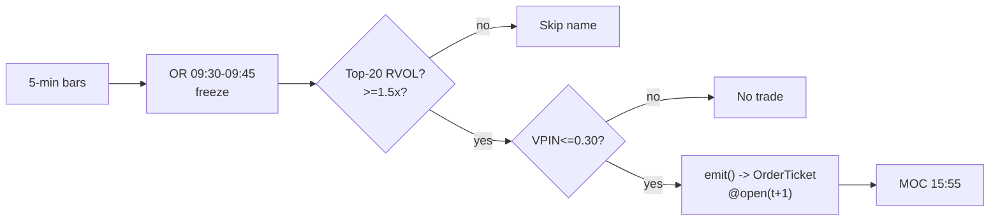

# T005 — RVOL-Filtered Opening-Range Breakout

> **Reviewer card.** Intraday breakout (Crabel opening-range), momentum: the first `15` minutes [example] set the day's range; breaks confirmed by abnormal relative volume (S032) carry institutional intent, while VPIN (S008) vetoes toxic flow. Provenance **[D]**.
>
> Edge verdict: **AFTER-COST-EDGE** — Zarattini et al.: Sharpe 2.81 commission-only [documented] on the top-20 stocks-in-play; the paper models commission only — no spread/impact [documented].
>
> After-cost: **COMM-ONLY** — one-sentence verdict: commission-only is not full cost — this module adds the spread honestly, which is the difference between the paper's Sharpe and an executable one.
>
> Tier **S** · prototype 20–40 h [example] · loaded cost $3,000–6,000 [example] · latency bar / minutes · risk medium (intraday breakout).

> Capacity $1–5M/day notional [example] — ~`20` names/day × a few hundred shares; size kills it (everyone scans the same stocks-in-play list) · Executability: Feasible: the OR/RVOL state machine is `~40` lines [internal-est]; any retail platform suffices.

## §1  Identity & provenance

This module is a **strategy**: it emits `OrderTicket` intentions only — brokers create orders, strategies never do. Family **D  # breakout / session-pattern**, batch **TB1**, provenance **D**.

**Lede.** Intraday breakout (Crabel opening-range), momentum: the first `15` minutes [example] set the day's range; breaks confirmed by abnormal relative volume (S032) carry institutional intent, while VPIN (S008) vetoes toxic flow. Provenance **[D]**.

**When it dies.** RVOL sort crowded; VPIN regime; `2.2`¢/share slippage kills the edge [unverified].

**Regime gates (provisional).** R001 elevated RV amplifies; `76`% of filtered P&L from `2022` [unverified] — regime-concentrated if true.

**Prototype scope.** OR freeze (09:30–09:45) + RVOL baselines + VPIN + MOC exit + kill-switch.

## §1.5  Escalation gate

Cheapest viable path: **Polygon.io Stocks Basic** — 5-min OHLCV bars, exchange timestamps, corporate-action adjustments at ~$30–200/mo [unverified]. build the OR/RVOL state machine yourself on a cheap SIP bar feed; buy nothing.

Resource budget: `1` core, `<1` GB RAM [internal-est] [internal-est] · compute pattern `per_bar`.

Explicitly out of scope (phase two): futures analogue; multi-timeframe OR; VPIN alternatives (phase `2`).

Escalation gate: `20`-name RVOL scan beyond `100` names [default]; bar latency `>30` s [default] — crossing it requires re-review of §T7 and §T8.

## §T0  Contract — strategies emit intentions, brokers create orders

This strategy's sole output is a list of `OrderTicket` intentions. It never places, routes, or confirms an order. Every ticket carries `parent_signal` (the upstream signal id and its `computed_at`), an `intent_ts`, and a `tif`. The backtest harness fills tickets strictly after the signal bar (`fill_event > signal_event`, t->t+1 causality); any fill timestamped at or before its signal bar is a harness bug and trips the kill switch.

State variables carried between bars: ``orh`, `orl`, `rvol_or`, `vpin_window`, `stops_today`, `position`, `entry_px`, `module_state``.

## §T1  Strategy thesis & edge

**Thesis.** Intraday breakout (Crabel opening-range), momentum: the first `15` minutes [example] set the day's range; breaks confirmed by abnormal relative volume (S032) carry institutional intent, while VPIN (S008) vetoes toxic flow. Provenance **[D]**.

**Edge verdict: AFTER-COST-EDGE** — Zarattini et al.: Sharpe 2.81 commission-only [documented] on the top-20 stocks-in-play; the paper models commission only — no spread/impact [documented].

**After-cost verdict: COMM-ONLY** — one-sentence verdict: commission-only is not full cost — this module adds the spread honestly, which is the difference between the paper's Sharpe and an executable one.

**Risk summary.** Choppy-tape whipsaws (`3` stops before `11:00` stands the book down [example]); gap-through; toxic-flow chasing.

**Math.**

```text
`ORH = max high`, `ORL = min low` over `09:30`–`09:45`, frozen at
`09:45`; `W = ORH − ORL`. `RVOL_OR = V_OR / median(same-slot V over 20
sessions)` (S032). Trigger-bar RVOL vs its `20`-day same-slot median. VPIN over
trailing `50` buckets (S008). Modeled edge `edge_bps = (W / P) × 1e4 × 0.48`
[example] with the published `48.4`% hit rate [documented].
```

**Pseudocode (normative).**

```text
function emit(state, signals, bars, cfg) -> list[OrderTicket]:
    assert bars non-empty else return UNKNOWN                       # F1
    t = bars[-1]   # newest 5-min bar, labeled by open time
    if t.bar_open_ts < freeze_ts: accumulate_or(state, t); return []
    if not state.or_frozen: freeze_or(state); return []            # causal
    if signals['S032'].rvol_or < cfg.rvol_or_min: return []        # gate: skip name
    vpin = signals['S008'].vpin
    assert isfinite(vpin) else return UNKNOWN                       # F2

    edge_bps = ((state.orh - state.orl) / t.close) * 1e4 * 0.48    # [example]
    cost_ok = expected_cost_bps(notional, adv_pct, venue, side, urgency) <= cfg.cost_gate_k * edge_bps
    # ^^^ normative cost-gate predicate: expected_cost_bps(...) <= k * edge_bps

    tickets = []
    if state.position == 0 and state.flat_today and cost_ok and state.stops_today < cfg.max_stops_day:
        if vpin > cfg.vpin_veto: log_decision(VETO, ...); return []  # C12/toxicity
        if t.close > state.orh + cfg.entry_offset and signals['S032'].bar_rvol >= cfg.rvol_bar_min:
            tickets = [ticket(side='BUY', qty=size(...), limit=open(t+1), tif='DAY',
                              parent_signal=f"S021@{t.bar_open_ts}")]
        elif t.close < state.orl - cfg.entry_offset and signals['S032'].bar_rvol >= cfg.rvol_bar_min and locate_ok():
            tickets = [ticket(side='SELL', qty=size(...), limit=open(t+1), tif='DAY',
                              parent_signal=f"S021@{t.bar_open_ts}")]
    else:
        if exit_trigger(t, state, cfg): tickets = [flatten_ticket(state)]
    for tk in tickets: log_decision(tk, inputs_hash, params_hash)  # C5 / App. g
    assert fill.event_ts > t.bar_close_ts for any fill             # t->t+1 causality
    return tickets
```

## §T2  Signal stack — dependencies & data rights

| Signal | Role | Contract |
|---|---|---|
| `S021` | trigger | break of frozen ORH/ORL; offset δ; the geometry of the trade |
| `S032` | confirm | OR RVOL >= 1.5× AND trigger-bar RVOL >= 1.2× [example]; unfunded breaks are rejected |
| `S008` | veto | no entry if VPIN_t > 0.30 [example]; high-VPIN breaks are faded-or-skipped, never chased |

Max dependency depth: `2` [default].

**Schema mapping (canonical).**

| Vendor (Polygon.io Stocks) | Canonical |
|---|---|
| `t` (ms) | `bar_open_ts` (int64 ns UTC; bar labeled by open time) |
| `o, h, l, c` | `open, high, low, close` |
| `v` | `volume` |

Staleness: max skew `5 s` [default] · jitter budget `30 s` [default] · TTL `90 s` [default] · cadence `per_bar (5-min)` · tz `America/New_York`.

**Inputs that break the module.**

| Input failure | Module state | Alert |
|---|---|---|
| OR RVOL below 1.5 or name not in top-20 RVOL (gate) [example] | `DEGRADED` (skip name for the day) | log |
| No 5-min bar within 30 s of expected close [example] | `UNKNOWN` | page |
| VPIN inputs missing | `UNKNOWN` | notify |

**Data rights.** US equities 5-min bars via Polygon.io Stocks, `rights: licensed`;
research + stated production; fixtures synthetic; entitlement =
professional/internal; derived features ours. Entitlement-class change →
§1.5 escalation gate.

**Build vs buy.** Build the OR/RVOL state machine yourself on a cheap SIP bar feed;
buy nothing — the filter *is* the strategy and it is `40` lines of code [internal-est]
[internal-est].

**Local build.** Feasible. OR state is two numbers; RVOL baselines are `20` medians [example]
per slot [example]; the scan is the only cost and it runs once a morning.

**Data dictionary (canonical fields).**

| Field | Type | Cadence | Tier | Notes |
|---|---|---|---|---|
| `5-min OHLCV bars` | float/int | 5-min | Tier 1 | split/dividend-adjusted |
| `20-session same-slot volume medians` | float | per slot | Tier 1 | RVOL baseline |
| `Volume buckets (VPIN)` | int | per bucket | Tier 2 | S008 inputs |

## §T3  Entry / exit / sizing & worked example

**Entry rule.**

```text
ENTER_LONG  := (close_t > ORH + delta) AND (bar_RVOL >= rvol_bar_min)
               AND (RVOL_OR >= rvol_or_min) AND (VPIN <= vpin_veto)
               AND (flat_today) AND (expected_cost_bps(...) <= cost_gate_k * edge_bps)
ENTER_SHORT := (close_t < ORL - delta) AND (bar_RVOL >= rvol_bar_min)
               AND (RVOL_OR >= rvol_or_min) AND (VPIN <= vpin_veto)
               AND (flat_today) AND (locate_ok)
               AND (expected_cost_bps(...) <= cost_gate_k * edge_bps)
FLAT        := otherwise
```

**Exit rule.**

```text
EXIT := (stop hit: ORL [long]) OR (target hit: ORH + target_mult * W)
        OR (t >= 15:55 → MOC) OR (module_state != OK)
        NOTE: once the range breaks, the level is done for the day — no re-entries
```

**Cooldown.** `0` s [default] after every exit (C10).

**Sizing function (normative).**

```python
def shares(risk_budget_R, stop_distance, vol_estimate, ADV_cap, cost):
    # risk_budget_R in $, stop_distance = |P_entry - P_stop| in $/share
    n = risk_budget_R / max(stop_distance, 1e-9)   # [default] floor below
    n = min(n, ADV_cap * 0.02)                    # 2% of 1-min ADV [default]
    n = min(n * 50.0, 1500000.0) / 50.0          # $1.5M gross cap [default]
    return int(n)
```

**Risk limits.**

| Limit | Value |
|---|---|
| Daily loss stop | `-$1,200` [example] → dark for the day |
| Max concurrent ORB positions | `5` [example]; portfolio heat ≤ `$1,500` at risk [example] |
| Choppy-tape kill | `3` consecutive stops before `11:00` [example] → book stands down |
| MOC exit | `15:55` [example] — no overnight |

**Worked example (fixture-backed, from `fixtures/T005_tape.csv` trade 1).**

Trade 1: `BUY` `405` shares [example] @ `50.54` [example], exit `51.28` [example] (`target +1×W`). Gross P&L = `299.70` [measured] dollars. Cost stack = `22.0` bps [example] → `45.03` [measured] dollars on `20468.70` [example] notional. Net = `254.67` [measured] dollars. The fixture's expected CSV carries the same arithmetic for all six trades; the per-module test recomputes it from the tape and asserts equality.

**Flow.**


## §T4  Parameters

| Parameter | Key | Default | Provenance | Sensitivity |
|---|---|---|---|---|
| Entry offset | `entry_offset` | `$0.02` | [default] | low |
| OR RVOL min | `rvol_or_min` | `1.5`× | [default] | high |
| Trigger-bar RVOL min | `rvol_bar_min` | `1.2`× | [default] | high |
| VPIN veto | `vpin_veto` | `0.30` | [default] | high |
| Target multiple | `target_mult` | `1.0`× W | [default] | medium |
| Cost-gate k | `cost_gate_k` | `0.5` | [default] | high |

## §T5  Costs — the callable is the single source of truth

| Component | bps | Basis |
|---|---|---|
| Spread | `8.0` | [example] $0.02 assumed spread at $50: half-spread per aggressive leg × 2 legs |
| Fees | `2.0` | [example] $0.005/share each way at $50 = 1 bps/leg |
| Borrow | `0.0` | [default] intraday; shorts C7-gated |
| Impact | `12.0` | [example] 6¢ gap-through above the trigger close on a $50 name |
| **Total** | `22.0` | [example] reference stack |

Fee schedule as of `2026-09-01` [example] · venue `XNAS / SIP 5-min bars [example]` · side `taker` · borrow `0.0` bps/day [example] — intraday holds only; no overnight borrow accrues.

```python
def expected_cost_bps(notional, adv_pct, venue, side, urgency) -> float:
    """Callable cost model - T005 COST block (single source of truth)."""
    spread_bps = 8.0    # [example] $0.02 assumed spread @ $50: half/aggressive leg x 2
    fee_bps = 2.0       # [example] $0.005/share each way @ $50 = 1 bps/leg
    borrow_bps = 0.0    # [default] intraday; shorts C7-gated
    impact_bps = 12.0   # [example] 6c gap-through above trigger close on $50 name
    return spread_bps + fee_bps + borrow_bps + impact_bps
```

**Normative cost-gate predicate (C3):** `expected_cost_bps(...) <= k * edge_bps` — no ticket is emitted unless the callable cost clears this gate. The predicate appears verbatim in the §T1 pseudocode and is asserted by the per-module test.

## §T6  Execution assumptions

| Aspect | Assumption |
|---|---|
| Latency | bar-close evaluation; fill at next-bar open |
| Partial fills | oldest `intent_ts` first (FIFO) |
| Impact | `12` bps gap-through modeled explicitly [example] — the worked example fills `6`¢ above the trigger close [example] |
| Adverse fill | breakout-bar extension — the gap-through term is the honest model |

## §T7  Risk contract & kill switch

Per-trade R: `$300` [example] per trade · daily loss stop: `- $1,200` [example] then dark for the day · max gross: `$1.5M` notional [example] · max adverse per trade: `1.0`x OR width [default].

Enforcement: `intraday-hard` [default]. Calibration recipe: paper-trade `30` sessions [default]; RVOL baselines on `20` sessions [default]; re-pin commission schedule monthly [default].

**Kill switch: `ARMED` → `TRIPPED` → `RECOVERY` → `ARMED`.**

Trip conditions:

- 3 consecutive stops before 11:00 [example]
- no 5-min bar within 30 s of expected close [example]
- clock skew > 50 ms [example]
- 5 concurrent positions reached [example]

On trip: the module stops emitting tickets immediately, flattens managed positions per the exit rule, and pages. `RECOVERY` requires manual review, cooldown expiry, and healthy feeds; only then does the module return to `ARMED`. The per-module test drives the full transition cycle.

**Ops.** Schedule: US equities RTH; OR built `09:30`–`09:45` ET [example]; entries `09:45`–`15:30`; MOC flatten `15:55` · budget: `1` vCPU, `1` GB RAM [internal-est] [internal-est] · env: `POLYGON_API_KEY`.

**Universe.** US listed equities, RTH only. Gates [example]: `14`-day ADV ≥ `1`M
shares; `14`-day ATR ≥ `$0.50` [default]; price > `$5` [default]; that morning's opening-range RVOL
in the top `20` names [example]. Session: build the OR `09:30`–`09:45`; entries
`09:45`–`15:30`; flatten `15:55` MOC. One trade per name per day; no
re-entries.

## §T8  Compliance (C1–C10+)

- **C1** | No orders: the strategy emits `OrderTicket` intentions only; the broker creates orders.
- **C2** | Kill switch: `ARMED` → `TRIPPED` → `RECOVERY` → `ARMED` on the trip conditions in §T7.
- **C3** | Cost gate: `expected_cost_bps(...) <= k * edge_bps` before any ticket (see §T5).
- **C4** | Causality: `fill_event > signal_event` (t->t+1); no signal-bar fills, ever.
- **C5** | Decision log: every ticket logged with inputs hash and params hash (see App. g).
- **C6** | Staleness: inputs older than the TTL → `UNKNOWN`, no tickets.
- **C7** | Short discipline: `locate_ok` required before any short ticket.
- **C8** | Cooldown: post-exit cooldown enforced in seconds; no re-entry inside it.
- **C9** | Session flatten: no uncommanded overnight carry.
- **C10** | Position caps: per-trade R, daily loss stop, and max gross enforced.
- **C11 | Choppy-tape stand-down: trigger = `3` consecutive stops before `11:00` [example] → check = `stops_today` → action = book stands down (no new entries) → log = `COMPLIANCE_BLOCK`**
- **C12 | No re-entry: trigger = second signal same name same day → check = `flat_today` → action = veto → log = `GATE_VETO`**

## §T9  Evidence, failures & regime gates

**Evidence (cost-level tokens; every statistic tagged).**

| Source | Sample | Finding | Cost level | Caveat |
|---|---|---|---|---|
| Zarattini, Barbon & Aziz (2024) [documented] | `7,000`+ US stocks, `2016`–`2023`, 5-min ORB [documented] | top-20 stocks-in-play: total net `+1,637`%, IRR `41.6`%, Sharpe `2.81`, hit `48.4`%, max DD `12`%, alpha `35.8`% [documented] | `COMM-ONLY` — after `$0.0035`/share; not full spread/impact | the published costs are commission-only |
| Same paper, unfiltered variant [documented] | same | total `+29`%, IRR `3.2`%, Sharpe `0.48`, hit `41.4`% vs S&P 500 `+198`% [documented] | `COMM-ONLY` | unfiltered ORB loses to the index |
| Zarattini & Aziz (2023), QQQ/TQQQ 5-min ORB [documented] | QQQ/TQQQ, `2016`–`2023` | ~`33`% annualized alpha net of commissions; TQQQ total return `1,484`% vs QQQ `169`% [documented] | `COMM-ONLY` — net of commissions; spread/impact unmodeled | authors' own earlier paper, not an independent replication; see §T10 for slippage/concentration claims |
| Gervais, Kaniel & Mingelgrin (2001) [documented] | US equities | high-volume return premium: unusually high-volume stocks appreciate over the following month [documented] | `BEFORE-COST` (return study) | monthly horizon — the attention mechanism, not the trade |

**Where this module is known to fail.** choppy tapes, crowded RVOL sorts, VPIN stress false negatives, slippage above ~`2.2`¢/share [unverified].

**Failure modes (detect → action → recovery).**

| # | Failure | Detect → action → recovery | Executable check |
|---|---|---|---|
| 1 | Choppy tape: `3` stops before `11:00` | detect: `stops_today` → action: stand down (C11) → recovery: next session [default] | `stops_today < 3` |
| 2 | Toxic break chased | detect: VPIN > `0.30` [example] → action: veto → recovery: VPIN normalizes | `vpin <= 0.30` |
| 3 | Gap-through beyond budget | detect: fill vs trigger > `2`× stop [default] → action: review sizing → recovery: re-run fixture | `gap_through <= 2*stop` |
| 4 | Slippage kills the paper edge | detect: realized slippage > `2.2`¢/share [unverified] → action: stand down → recovery: re-pin costs | `expected_cost_bps(...) <= k * edge_bps` |
| 5 | Lookahead on OR freeze | detect: entry bar inside OR window → action: halt, fix → recovery: no-signal-bar-fills test [default] | `all(fill_ts > signal_ts)` |

**Regime gates.**

| Regime | Effect | Mechanism | Condition | Action | Latency | Fallback |
|---|---|---|---|---|---|---|
| R001 | amplifies | elevated RV: breakouts carry | rv_pctile > 70 [default] | widen_stops | 1 bar [default] | veto |
| R001 | degrades | extreme RV: chop | rv_pctile > 95 [default] | pause_entry | 1 bar [default] | veto |
| R-halt | inverts | halt/auction state | state != CONTINUOUS_TRADING [default] | veto | 0 [default] | veto |

**Robustness.** The edge is the RVOL filter, not the OR geometry: RVOL `>100`% [default] →
`+0.08`R/trade vs `<100`% → `−0.02`R [documented]. The independent QQQ
replication is the authors' own earlier QQQ paper, not independent; the ~`2.2`¢/share slippage-kill figure is unverified (see §T10) — costs
are the strategy.

**What the optimistic case assumes (and we do not).** (1) gap-through fixed at `6`¢ [example] — real breakouts gap
further on the crowded names; (2) the published Sharpe is commission-only —
spread and impact are added here but estimated; (3) `76`% of the filtered P&L
came from `2022` [unverified] — regime-concentrated if true.

## §T10  Unverified leads & what would change our mind

- QQQ ORB edge dies at ~`2.2`¢/share slippage — not confirmed against the paper; re-verify before citing.
- `76`% of filtered P&L from `2022` — not confirmed; re-verify. [unverified]

What would change our mind: a purged/embargoed walk-forward with full costs that survives the S088 honesty protocol; a documented after-cost P&L from the cited authors' own implementations; or a regime-gated replication that holds outside the original sample.

## AI build prompt

```text
Build the T005 (RVOL-Filtered Opening-Range Breakout) strategy module from this specification.
Hard constraints:
- The strategy emits OrderTicket intentions ONLY; it never creates orders (C1).
- Causality: fill_event > signal_event (t->t+1); no signal-bar fills (C4).
- Cost gate: expected_cost_bps(...) <= k * edge_bps before any ticket (C3).
- Kill switch ARMED -> TRIPPED -> RECOVERY -> ARMED on the §T7 trip conditions (C2).
- Every numeric literal in prose carries an honesty tag [documented]/[measured]/[example]/[unverified]/[default]/[internal-est]; exempt identifiers only.
- Sources must be real and cited with cost-level tokens; chatbot-only material goes to §T10.
Config surface:
- entry_offset (float): default 0.02, range 0.0–0.2 [default]
- rvol_or_min (float): default 1.5, range 1.0–3.0 [default]
- rvol_bar_min (float): default 1.2, range 1.0–2.5 [default]
- vpin_veto (float): default 0.30, range 0.1–0.6 [default]
- target_mult (float): default 1.0, range 0.5–3.0 [default]
- max_stops_day (int): default 3, range 1–10 [default]
- cooldown_s (float): default 0.0, range 0–3,600 [default]
- cost_gate_k (float): default 0.5, range 0.1–2.0 [default]
Entry rule:
ENTER_LONG  := (close_t > ORH + delta) AND (bar_RVOL >= rvol_bar_min)
               AND (RVOL_OR >= rvol_or_min) AND (VPIN <= vpin_veto)
               AND (flat_today) AND (expected_cost_bps(...) <= cost_gate_k * edge_bps)
ENTER_SHORT := (close_t < ORL - delta) AND (bar_RVOL >= rvol_bar_min)
               AND (RVOL_OR >= rvol_or_min) AND (VPIN <= vpin_veto)
               AND (flat_today) AND (locate_ok)
               AND (expected_cost_bps(...) <= cost_gate_k * edge_bps)
FLAT        := otherwise
Exit rule:
EXIT := (stop hit: ORL [long]) OR (target hit: ORH + target_mult * W)
        OR (t >= 15:55 → MOC) OR (module_state != OK)
        NOTE: once the range breaks, the level is done for the day — no re-entries
Sizing: implement the §T3 sizing_fn verbatim; enforce the §T7 risk contract.
Deliverables: the module markdown (all sections §1–§T10), the fixture tape CSV
(fixtures/T005_tape.csv), the expected CSV (fixtures/T005_expected.csv), and
the per-module test (modules/tests/test_T005.py) covering fixture arithmetic,
causality, the cost gate, the kill-switch cycle, invalid→UNKNOWN, and the callable signature.
```
