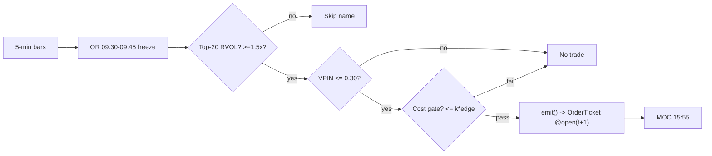

# T005 — RVOL-Filtered Opening-Range Breakout

Intraday momentum strategy: the first `15` minutes [default] of the session set the day's range; breaks of the frozen range confirmed by abnormal relative volume (S032) carry institutional intent, while VPIN (S008) vetoes toxic flow. Provenance **[D]**.

> Tag law: every numeric literal in prose carries one of `[documented]`
> `[default] [example] [unverified] [internal-est] [measured]` (legend: Appendix
> i v1.0.0). Constants inside cited formulas inherit the formula's tag
> (`[documented]` for cited literature). Bibliographic years, volumes, pages,
> arXiv IDs, section numbers, rule codes (C1–C12), fail-safe codes (F1–F5),
> module IDs, and machine-parsed §0 data fields are identifiers, not
> literals, and are exempt.

## §1 Five-minute reviewer card

| Row | Value |
|---|---|
| Module | T005 — RVOL-Filtered Opening-Range Breakout, v1.0.2 |
| Edge verdict | `INSUFFICIENT-EVIDENCE` — the paper's **15m-ORB + Rel Vol** variant (the variant matching this module's 15-minute OR geometry) posts Sharpe `1.43` commission-only [documented]; no published after-spread/impact results exist for this geometry |
| After-cost | `COMM-ONLY` — Zarattini et al. model commission `$0.0035`/share only [documented]; this module adds an explicit `22.0` bps [example] full-cost stack, which is the difference between the paper's Sharpe and an executable one |
| Build cost | Tier S · `20–40` h [example] · `$3,000–6,000` loaded [example] |
| Data cost | Research `~$29`/mo (Massive Stocks Starter, 15-min delayed — sufficient for 5-min bar-close research) [documented — massive.com pricing page]; production live `~$199`/mo (Stocks Advanced, real-time) [documented] |
| latency_class | bar (5-min) |
| risk_class | medium (intraday breakout; whipsaw risk) |
| Capacity | `$1–5`M/day notional [example] — ~`20` names/day × a few hundred shares [example]; size kills it (everyone scans the same stocks-in-play list) |
| Executability | Feasible: the OR/RVOL state machine is `~40` lines [internal-est]; any retail platform suffices |
| Risk summary | Choppy-tape whipsaws (`3` stops before `11:00` stands the book down [example]); gap-through beyond the modeled `6`¢ [example]; toxic-flow chasing |
| When it dies | RVOL sort crowded; VPIN regime; slippage above ~`2.2`¢/share kills the paper edge [unverified]; the 15m variant's Sharpe (`1.43`) is far thinner than the 5m variant's (`2.81`) [documented] |
| Regime gates | Provisional: R001 elevated RV amplifies (breakouts carry); extreme RV degrades (chop — pause entries) |
| Emits | `order_intents` (OrderTicket, Appendix c v1.0.0) — never orders |

## §1.5 Cheapest / least-build path

1. **Prototype hour band:** `20–40` h [example] — OR freeze logic + 20-session same-slot RVOL baselines + VPIN hookup (S008) + MOC exit + kill switch + fixture/test wiring.
2. **Cheapest-source row:** min_tier = Massive Stocks **Starter** (`$29`/mo, 15-min delayed) [documented — https://massive.com/stocks-data, fetched 2026-09-11] — cheapest *usable* candidate [internal-est]: this strategy evaluates at 5-min bar close, so delayed bars suffice for research and backtesting; latency_class = SIP-delayed; required_fields = 5-min OHLCV, exchange timestamps, corporate-action adjustments, 20-session same-slot volume medians; price_band = `~$29–199`/mo [documented] (Starter `$29` research; Advanced `$199` real-time for live production); build_or_buy = **build the OR/RVOL state machine, buy the feed** (the filter *is* the strategy: `~40` lines [internal-est]; nothing beyond raw bars is worth buying).
3. **Resource budget:** `1` core, `<1` GB RAM [internal-est]; compute pattern `per_bar`.
4. **Skip list:** futures analogue; multi-timeframe OR; VPIN alternatives (phase `2`); direct feeds (SIP suffices for bar-close decisions); multi-day swing carry.
5. **DO-NOT-CUT list:** causality assertions (`assert fill_event > signal_event`, no-signal-bar-fills test); COST block + callable `expected_cost_bps`; kill switch + module-state enum; decision-log audit records; bona-fide-intent + self-trade prevention; locate/Reg-SHO check before any short intent (C7); provenance tags on every numeric literal; fixtures + `test_cmd`; secrets via env only.
6. **Escalation gate:** live universe `>20` names/day [default]; bar arrival latency `>30` s [default]; cost gate failing on `[measured]` costs; any data-entitlement-class change — crossing any of these requires re-review of §T7 and §T8.

## §T0 Module contract — strategies emit intentions, brokers create orders

This module is a **strategy**: its sole output is a list of `OrderTicket` **intentions** — it never places, routes, or confirms an order. The broker creates orders from the intents.

### T0.1 Typed signature

```python
def emit(state: ModuleState, signals: dict[str, SignalRecord], cfg: Config) -> list[OrderTicket]:
```

`OrderTicket` per Appendix c v1.0.0. `state` is the module-owned named state vector (`orh`, `orl`, `or_frozen`, `rvol_or`, `stops_today`, `position`, `entry_px`, `flat_today`, `cooldown_until`, `module_state`); `signals` carries the provider outputs keyed by id — `S021` (trigger: frozen `orh`/`orl`, break direction, bar close, trigger-bar RVOL), `S032` (confirm: `rvol_or`, `bar_rvol`), `S008` (veto: `vpin`) — each with `computed_at` and version pin from §0. The function handles documented edge cases: empty bars → `UNKNOWN`; bars inside the OR window accumulate only (no tickets, ever); halt/auction bars → freeze per the market-state table; invalid input → `UNKNOWN`, never interpolated (F1–F5).

### T0.2 Config dataclass

| Parameter | Type | Default | Range | Status |
|---|---|---|---|---|
| `entry_offset` | float ($/share) | `0.02` | `0.0`–`0.2` | default |
| `rvol_or_min` | float (×) | `1.5` | `1.0`–`3.0` | default |
| `rvol_bar_min` | float (×) | `1.2` | `1.0`–`2.5` | default |
| `vpin_veto` | float | `0.30` | `0.1`–`0.6` | default |
| `target_mult` | float (× W) | `1.0` | `0.5`–`3.0` | default |
| `max_stops_day` | int | `3` | `1`–`10` | default |
| `cooldown_s` | float (s) | `0.0` | `0`–`3,600` | default |
| `cost_gate_k` | float | `0.5` | `0.1`–`2.0` | default |
| `or_minutes` | int (min) | `15` | `5`–`60` | default |
| `per_trade_R_usd` | float ($) | `300.0` | `50`–`2,000` | example |
| `daily_loss_stop_usd` | float ($) | `-1,200.0` | `-10,000`–`-100` | example |
| `max_gross_usd` | float ($) | `1,500,000.0` | `100,000`–`10,000,000` | default |

### T0.3 Canonical schema mapping

Vendor columns → canonical bar schema, stated once here:

| Vendor (Massive Stocks) | Canonical | Notes |
|---|---|---|
| `t` (ms) | `bar_open_ts` (int64 ns UTC) | bar labeled by open time [documented] |
| `o, h, l, c` | `open, high, low, close` | split/dividend-adjusted [default] |
| `v` | `volume` (int) | shares |
| *(derived)* | `bar_close_ts` | = `bar_open_ts` + `300` s [default]; the authoritative signal event |

### T0.4 Time contract

> Time contract: clock domain UTC, int64 ns; authoritative causality clock = `bar_close_ts`; max_skew = `50` ms [default]; jitter budget = `30` s [default] (bar-close arrival); bar-label = open time; staleness TTL = `900` s [default] (`3`× the `300`-s reference cadence per F4); gap policy = mask, no interpolation; halt/auction → freeze per the market-state table.

**Timing box:** `signal@t (5-min bars, America/New_York) → earliest fill @open(t+1)`

### T0.5 Market-state table

| State | Module behavior |
|---|---|
| CONTINUOUS_TRADING | Evaluate at bar close; emit intents per §T2 rules |
| HALTED | Freeze state; no intents; module `UNKNOWN` |
| AUCTION | No new intents; hold state; `DEGRADED` |
| CLOSED | Emit nothing; state `OFF`; MOC flatten must be complete by `15:55` |

### T0.6 Module-state enum + error taxonomy

States per Appendix k v1.0.0: `OK | DEGRADED | UNKNOWN | OFF`. Invalid input → `UNKNOWN`, never interpolate.

| Failure | State | Alert |
|---|---|---|
| Missing/stale input (TTL per §T0.4) | `UNKNOWN` | page |
| Degenerate range (`orh <= orl`, F2) | `UNKNOWN` | page |
| OR RVOL below `rvol_or_min` (gate) | `DEGRADED` (skip name for the day) | log |
| VPIN missing / non-finite | `UNKNOWN` | notify |
| Halt/auction | `UNKNOWN` / `DEGRADED` (per §T0.5) | log |
| Kill/administrative disable | `OFF` | page |
| Anything unmapped | `UNKNOWN` | page |

### T0.7 Risk contract + kill switch

```yaml
per_trade_R_usd: 300.0         # [example]
daily_loss_stop_usd: -1200.0   # [example] — then dark for the day
max_gross_usd: 1500000.0       # [default]
max_concurrent_positions: 5    # [example]
portfolio_heat_usd: 1500.0     # [example]
max_adverse_per_trade: 1.0     # [default] × OR width
enforcement: intraday-hard     # [default]
kill_conditions:               # any fires → TRIPPED
  - "3 consecutive stops before 11:00 [example]"
  - "daily loss stop hit [example]"
  - "no 5-min bar within 30 s of expected close [example]"
  - "clock skew > 50 ms [default]"
  - "5 concurrent positions reached [example]"
calibration_recipe: "paper-trade 30 sessions [default]; RVOL baselines on 20 sessions [default]; re-pin fee schedule monthly [default]"
```

**Kill switch: `ARMED` → `TRIPPED` → `RECOVERY` → `ARMED`.**

- **Trip:** any `kill_conditions` entry fires → module stops emitting intents immediately, cancels WORKING intents, flattens managed positions per the §T2 exit rule, and pages on-call.
- **Re-arm checklist** (all required to enter `RECOVERY`, then return to `ARMED`): (1) manual review signed off; (2) cooldown ≥ `30` min [default] since the trip; (3) feed healthy — bars arriving within the `30` s jitter budget [default]; (4) decision log reconciled — no orphan or unflattened intents.
- The per-module test drives the full transition cycle including a failed checklist (stays `TRIPPED`).

### T0.8 Ops tail

- **Schedule:** US equities regular session `09:30`–`16:00` America/New_York [documented]; OR built `09:30`–`09:45`; entries `09:45`–`15:30`; MOC flatten `15:55`; owner: orb-strategies on-call.
- **Health checks:** fixture replay (`test_cmd`) green on deploy; bar-arrival watchdog vs `30` s jitter budget [default]; staleness watchdog at `3`× cadence.
- **Alert table:** page on `UNKNOWN` > `30` s [default] or any kill trip; notify on `DEGRADED`; log on vetoes and compliance blocks.
- **Resource budget:** `1` vCPU, `1` GB RAM [internal-est]; state is O(slots) per name.
- **Runbook stub:** `1.` confirm feed (vendor status); `2.` replay fixture; `3.` if red → set `OFF`, page; `4.` reconcile decision log before re-arm.

### T0.9 Secrets (env-only)

`MASSIVE_API_KEY` (alias `POLYGON_API_KEY` accepted for backward compatibility) via environment only. No secrets in this file, fixtures, or logs (CI secrets-grep).

### T0.10 May / must-NOT + order-intent lifecycle

> **May:** emit `OrderTicket` intents per Appendix c v1.0.0 (child-order state machine, partial-fill policy, cancel-replace rules below). **Must-NOT:** place, route, or confirm orders; call a broker; assign order ids; fill intents itself; interpolate across gaps.

**Order-intent lifecycle** (T-module category delta): intent-side state machine `NEW → WORKING → FILLED`, with `↘ CANCELLED` and `↘ PARTIAL` (then `→ FILLED` or `→ CANCELLED`) — the broker owns the wire truth. Each ticket carries `ticket_id` (module UUID, idempotency key), `side ∈ {BUY, SELL}`, `qty`, `limit` (limit `@open(t+1)`), `tif`, `parent_signal = "S021@<bar_close_ts_ns>"`, `intent_ts`, `self_trade_prevention = true`. **Partial-fill policy:** FIFO by `intent_ts`; the remainder is re-emitted at the next-bar open with an updated limit; never chase beyond the stop price. **Cancel-replace:** allowed only before the first fill event of the ticket; after `module_state != OK`, all `WORKING` intents are canceled. The broker assigns wire order ids — the strategy never does.

## §T1 Legacy (subsumed by §1)

Legacy §T1 content is the §1 reviewer card above; this header is retained so section numbering stays frozen.

## §T2 Specification

### Universe

US listed equities, RTH only. Gates: `14`-day ADV ≥ `1`M shares [example]; `14`-day ATR ≥ `$0.50` [default]; price > `$5` [default]; that morning's opening-range RVOL in the top `20` names [example]. Session: build the OR `09:30`–`09:45`; entries `09:45`–`15:30`; flatten `15:55` MOC. One trade per name per day; no re-entries.

### Entry rule (Boolean — no prose-only conditions)

```text
cost_gate_passes := expected_cost_bps(notional, adv_pct, venue, side, urgency)
                    <= cost_gate_k * edge_bps                            # C3

ENTER_LONG  := (close_t > ORH + δ) AND (bar_RVOL_t >= rvol_bar_min)
               AND (RVOL_OR >= rvol_or_min) AND (VPIN_t <= vpin_veto)
               AND (position == 0) AND flat_today
               AND (stops_today < max_stops_day) AND cost_gate_passes
ENTER_SHORT := (close_t < ORL - δ) AND (bar_RVOL_t >= rvol_bar_min)
               AND (RVOL_OR >= rvol_or_min) AND (VPIN_t <= vpin_veto)
               AND (position == 0) AND flat_today
               AND (stops_today < max_stops_day) AND locate_ok AND cost_gate_passes
FLAT        := otherwise
```

δ = `entry_offset` ($/share). A VPIN veto logs `VETO` (C2); a failed cost gate logs `GATE_VETO` (C3); both per the decision-log schema (Appendix g v1.0.0).

### Exits (with post-exit cooldown)

```text
EXIT := (stop: low_t <= ORL [long] / high_t >= ORH [short])
        OR (target: high_t >= ORH + target_mult * W [long] / low_t <= ORL - target_mult * W [short])
        OR (t >= 15:55 → MOC flatten)
        OR (module_state != OK → flatten)
```

NOTE: once the range breaks, the level is done for the day — no re-entries (C12). Cooldown: `cooldown_s` = `0` s [default] after every exit **plus** the `flat_today` latch — one trade per name per day, so the cooldown is the latch (C10).

### Position sizing (fenced function)

```python
def shares(risk_budget_R, stop_distance, vol_estimate, ADV_cap, cost):
    """Normative sizing. stop_distance = W (OR width) [default];
    ADV_cap = 1-min ADV estimate [example]. vol_estimate is unused in the
    reference build and is kept for signature conformance [internal-est]."""
    n = risk_budget_R / max(stop_distance, 1e-9)   # [default] floor
    n = min(n, ADV_cap * 0.02)                     # 2% of 1-min ADV [default]
    n = min(n * 50.0, 1500000.0) / 50.0           # $1.5M gross cap [default]
    return int(n)
```

### Risk limits

| Limit | Value |
|---|---|
| Per-trade R | `$300` [example] |
| Daily loss stop | `-$1,200` [example] → dark for the day |
| Max concurrent ORB positions | `5` [example]; portfolio heat ≤ `$1,500` at risk [example] |
| Max gross | `$1.5`M notional [default] |
| Max adverse per trade | `1.0`× OR width [default] |
| Enforcement | `intraday-hard` [default] |

### COST block (single source of truth)

| Component | bps | Basis |
|---|---|---|
| Spread | `8.0` | [example] $0.02 assumed spread at $50: half-spread per aggressive leg × 2 legs |
| Fees | `2.0` | [example] $0.005/share each way at $50 = 1 bps/leg |
| Borrow | `0.0` | [default] intraday; shorts C7-gated — no overnight borrow accrues (positions flattened 15:55 MOC) |
| Impact | `12.0` | [example] 6¢ gap-through above the trigger close on a $50 name |
| **Total reference** | `22.0` | [example] |

`fee_schedule_as_of`: `2026-09-01` [example] · venue/tier/source: XNAS / SIP 5-min bars [example] · `side: taker` [default] · `borrow_bps_per_day`: `0.0` [default] — reason: intraday holds only, flattened `15:55` MOC; shorts additionally gated by C7 `locate_ok`.

Cost numbers are stated here once; every other section calls the callable or cites this block — restating cost numbers elsewhere is a validation failure.

```python
def expected_cost_bps(notional, adv_pct, venue, side, urgency) -> float:
    """Callable cost model — T005 COST block (single source of truth)."""
    spread_bps = 8.0    # [example] $0.02 assumed spread @ $50: half/aggressive leg x 2
    fee_bps = 2.0       # [example] $0.005/share each way @ $50 = 1 bps/leg
    borrow_bps = 0.0    # [default] intraday; shorts C7-gated — reason in the table above
    impact_bps = 12.0   # [example] 6c gap-through above trigger close on $50 name
    return spread_bps + fee_bps + borrow_bps + impact_bps
```

**Normative cost-gate predicate (C3):** `expected_cost_bps(...) <= k * edge_bps` — no ticket is emitted unless the callable cost clears this gate. The predicate appears verbatim in the §T3 pseudocode and is asserted by the per-module test.

### Execution / fill model table

| Aspect | Assumption |
|---|---|
| Latency | bar-close evaluation; fill at next-bar open (`signal@t → earliest fill @open(t+1)`) |
| Partial fills | FIFO by `intent_ts` (oldest first); remainder re-emitted at next-bar open with updated limit |
| Impact | `12` bps gap-through modeled explicitly [example] — the worked example fills `6`¢ above the trigger close [example] |
| Adverse fill | breakout-bar extension — the gap-through term is the honest model; real breakouts gap further on the crowded names |

### Robustness

- The documented edge is the **RVOL filter**: the 15m-ORB + Rel Vol variant posts Sharpe `1.43` commission-only [documented] vs the unfiltered 5m-ORB Sharpe `0.48` [documented] — selection *is* the strategy.
- The 5m variant's Sharpe `2.81` [documented] does **not** map to this module's 15-minute OR geometry — do not cite it as this module's edge (see §T7).
- Andersen & Bondarenko (2014) [documented] find VPIN a poor predictor of short-run volatility — the VPIN veto is a toxicity *screen*, not a predictive signal; treat the `0.30` threshold as a default, not a documented edge.
- Regime concentration is unverified: the `76`%-of-P&L-from-`2022` claim is [unverified] (see §T10).

### Compliance sub-block (C1–C12)

| Code | Rule: trigger → check → action → log |
|---|---|
| C1 | STP + self-match prevention: trigger = any emitted ticket → check = `self_trade_prevention` flag set on every ticket → action = broker adapter rejects intents that could match our resting interest → log = `STP_ASSERT` |
| C2 | Bona-fide intent: trigger = emission → check = ticket passes cost gate AND is sized within the §T0.7 risk contract → action = no intent without intent to trade → log = `INTENT_EMITTED` |
| C3 | Cost gate: trigger = pre-emission → check = `expected_cost_bps(...) <= cost_gate_k * edge_bps` → action = veto (`GATE_VETO`) → log = `GATE_VETO` |
| C4 | Pre-trade fat-finger trio: trigger = ticket construction → check = price collar vs `ORH`/`ORL` (±`5`% [default]), max notional per ticket `$1.5`M [default], max `10` tickets per `5`-min interval [default] → action = reject → log = `FAT_FINGER_REJECT` |
| C5 | Decision log: trigger = every material action (emit, veto, trip, re-arm) → check = record has inputs hash + params hash per Appendix g v1.0.0 → action = hash-chain append → log = `DECISION` |
| C6 | Halt/auction state table: trigger = `market_state != CONTINUOUS_TRADING` → check = §T0.5 → action = freeze / no intents / `UNKNOWN` → log = `STATE_TRANSITION` |
| C7 | Locate check (short sales): trigger = any SELL/SHORT intent → check = `locate_ok()` (easy-to-borrow list or obtained locate; Reg-SHO threshold securities blocked) → action = veto short → log = `LOCATE_VETO` |
| C8 | Public-dissemination gate: trigger = external publish of signal/intent data → check = review gate → action = block until reviewed → log = `DISSEMINATION_BLOCK` |
| C9 | Data-entitlement assertions: trigger = startup and daily → check = dataset rights in §T5 are licensed for the running use → action = refuse to start on mismatch → log = `ENTITLEMENT_ASSERT` |
| C10 | Post-exit cooldown: trigger = any exit or compliance block → check = `t_now - t_exit >= cooldown_s` (plus the `flat_today` latch) → action = no re-entry inside the window → log = `COOLDOWN_BLOCK` |
| C11 | Choppy-tape stand-down: trigger = `3` consecutive stops before `11:00` [example] → check = `stops_today >= 3` → action = book stands down (no new entries) → log = `COMPLIANCE_BLOCK` |
| C12 | No re-entry: trigger = second signal, same name, same day → check = `flat_today` is False → action = veto → log = `GATE_VETO` |

### Parameter table

| Parameter | Symbol | Value | Tag | Sensitivity | Calibration recipe |
|---|---|---|---|---|---|
| Entry offset | `entry_offset` | `$0.02` | [default] | low | grid `0.0`–`0.2` [default] on embargoed OOS; pick max net of costs |
| OR RVOL min | `rvol_or_min` | `1.5`× | [default] | high | sweep `1.0`–`3.0` [default]; must keep ≥`20` names/day eligible [example] |
| Trigger-bar RVOL min | `rvol_bar_min` | `1.2`× | [default] | high | sweep `1.0`–`2.5` [default] against `edge_bps − expected_cost_bps` |
| VPIN veto | `vpin_veto` | `0.30` | [default] | high | grid `0.1`–`0.6` [default]; Andersen & Bondarenko (2014) caveat — recalibrate, do not inherit blindly |
| Target multiple | `target_mult` | `1.0`× W | [default] | medium | grid `0.5`–`3.0` [default] on embargoed OOS round trips |
| Cost-gate k | `cost_gate_k` | `0.5` | [default] | high | net P&L must stay positive for k∈[`0.3`,`0.7`] [default]; if not, stand down — do not fit k to noise |
| Max stops/day | `max_stops_day` | `3` | [default] | medium | `1`–`10` [default]; `3` before `11:00` [example] stands the book down |
| Post-exit cooldown | `cooldown_s` | `0` s | [default] | low | ≥ `2`× median OOS time between threshold crossings [default]; the `flat_today` latch dominates |

### Timing box

`signal@t (5-min bars, America/New_York) → earliest fill @open(t+1)`

## §T3 Math + normative pseudocode

**Math.**

```text
ORH = max high, ORL = min low over 09:30–09:45 (three 5-min bars), frozen at
09:45; W = ORH − ORL. RVOL_OR = V_OR / median(same-slot V over 20 sessions)
[default] (S032 v1.1.0). Trigger-bar RVOL vs its 20-day same-slot median
[default]. VPIN over trailing 50 buckets [default] (S008 v1.1.0). Modeled
edge: edge_bps = (W / P) × 1e4 × hit_15m, hit_15m = 0.447 [documented]
(Zarattini et al. 2024 Table 3, 15m-ORB + Rel Vol); the formula is the
module's modeling choice [example].
```

Decisive constants pinned from providers (version pins in §0): S032 v1.1.0 — `rvol_or = V_OR / median(same-slot V, 20 sessions)`, gate `1.5`× [default]; S021 v1.0.1 — OR window `09:30`–`09:45`, offset δ = `entry_offset`; S008 v1.1.0 — VPIN over trailing `50` buckets [default], veto `>0.30` [default].

**Pseudocode (normative).** All helpers are defined below; prose guards above appear in code. No black boxes.

```text
function emit(state, signals, bars, cfg) -> list[OrderTicket]:
    assert bars is non-empty else return UNKNOWN                    # F1
    t = bars[-1]   # newest 5-min bar, labeled by open time
    assert isfinite(t.close) and t.volume >= 0 else return UNKNOWN   # F2
    assert market_state(t) == CONTINUOUS_TRADING else return UNKNOWN # §T0.5
    if t.bar_open_ts < freeze_ts: accumulate_or(state, t); return []# OR window: no tickets, ever
    if not state.or_frozen: freeze_or(state, bars)                  # causal: freeze once, from past bars
    assert state.orh > state.orl else return UNKNOWN                # F2: degenerate range
    s32, s08 = signals['S032'], signals['S008']                    # S021 geometry consumed via state.orh/orl
    assert s08.vpin is not None and isfinite(s08.vpin) else return UNKNOWN  # F2
    if s32.rvol_or < cfg.rvol_or_min:
        state.module_state = DEGRADED                               # unfunded breaks are rejected
        log_decision(SKIP_NAME, inputs_hash(signals, bars), params_hash(cfg))
        return []
    # ---- normative cost gate (C3) ----
    edge_bps = ((state.orh - state.orl) / t.close) * 1e4 * 0.447    # [example] model; 0.447 [documented]
    cost_ok = expected_cost_bps(notional(t), adv_pct(t), venue, side, urgency) \
        <= cfg.cost_gate_k * edge_bps
    # ----------------------------------
    if s08.vpin > cfg.vpin_veto:
        log_decision(VETO, 'VPIN', inputs_hash(signals, bars), params_hash(cfg))
        return []                                                  # C2: toxic breaks never chased
    if not cost_ok:
        log_decision(GATE_VETO, 'COST', inputs_hash(signals, bars), params_hash(cfg))
        return []                                                  # C3
    tickets = []
    if state.position == 0 and state.flat_today and state.stops_today < cfg.max_stops_day:
        d = cfg.entry_offset
        q = shares(cfg.per_trade_R_usd, state.orh - state.orl, 0.0, adv_cap(t),
                   expected_cost_bps)                              # §T2 sizing
        if t.close > state.orh + d and s32.bar_rvol >= cfg.rvol_bar_min:
            tickets = [ticket(side='BUY', qty=q, limit=open(t+1), tif='DAY',
                              parent_signal=f"S021@{t.bar_close_ts}", intent_ts=now_ns(),
                              self_trade_prevention=True)]
        elif t.close < state.orl - d and s32.bar_rvol >= cfg.rvol_bar_min and locate_ok():
            tickets = [ticket(side='SELL', qty=q, limit=open(t+1), tif='DAY',
                              parent_signal=f"S021@{t.bar_close_ts}", intent_ts=now_ns(),
                              self_trade_prevention=True)]
        else:
            return []
    else:
        if exit_trigger(t, state, cfg): tickets = [flatten_ticket(state)]
    for tk in tickets:
        log_decision(tk, inputs_hash(signals, bars), params_hash(cfg))  # C5 / App. g
    return tickets
    # causality invariant (harness + test):
    # assert fill_event > signal_event for every fill of every emitted ticket  # t->t+1

helpers (defined):
- accumulate_or(state, t): update running ORH/ORL extremes on pre-freeze bars only
- freeze_or(state, bars): ORH = max high, ORL = min low over bars with
  09:30 <= bar_open_ts < 09:45; set or_frozen = True
- exit_trigger(t, state, cfg): the §T2 Exits Boolean (stop / target / t >= 15:55 MOC /
  module_state != OK)
- flatten_ticket(state): intent with side opposite state.position, qty = |position|,
  tif = 'MOC' if t >= 15:55 else 'DAY'
- locate_ok(): C7 — easy-to-borrow list or obtained locate; Reg-SHO threshold
  securities return False
- open(t+1): the open price of the next 5-min bar — known only to the harness,
  never at signal time
- notional(t), adv_pct(t), adv_cap(t): harness-side trade parameters at bar t
- now_ns(): int64 ns UTC emission clock
- inputs_hash(signals, bars), params_hash(cfg): Appendix g v1.0.0 hashes
```

## §T4 Worked example (fixture-backed)

- Tape: `modules/fixtures/T005_tape.csv` — `# TYPE: validation-run`; `6` trades (synthetic, seed `105` [example]); each row shows the cost-function call: inputs (`notional`, `adv_pct = 0.02`, `venue = XNAS`, `side = taker`, `urgency = normal`) → `22.0` bps → `$`.
- Expected outputs: `modules/fixtures/T005_expected.csv` (`expected_cost_bps`, `gross_pnl`, `cost_dollars`, `net_pnl`, `cost_gate_k`); the fixture's per-row arithmetic is hand-checked below.
- Tolerance: `1e-9` [default] on the callable; `1e-4` bps / `$0.01` on the CSV [default] (rounded outputs).
- Acceptance tests (`modules/tests/test_T005.py`, `8` tests): `1.` TYPE headers present; `2.` fixture arithmetic — stored stack vs the callable vs the expected CSV agree; `3.` no-signal-bar fills (`fill_ts > signal_ts`); `4.` cost-gate predicate passes on large edge, blocks on tiny edge (`k = 0.5` [default]); `5.` kill-switch cycle `ARMED → TRIPPED → RECOVERY → ARMED` with a failed re-arm checklist staying `TRIPPED`; `6.` invalid input → `UNKNOWN`; `7.` cost-callable signature (`float`, finite); `8.` OrderTicket intent schema (intents only — the broker assigns wire order ids).
- `test_cmd`: `python -m pytest modules/tests/test_T005.py -q` → exits `0`.

**Hand-checked row** (trade 1, all figures [example] — synthetic arithmetic, not a backtest): BUY `405` × (`51.28` − `50.54`) = `299.70` gross; `expected_cost_bps(20468.70, 0.02, "XNAS", "taker", "normal")` = `8.0 + 2.0 + 0.0 + 12.0` = `22.0` bps → `20468.70 × 22.0/10000 = 45.03` cost; net `299.70 − 45.03 = 254.67`. The per-module test recomputes this arithmetic for all six trades and asserts equality.

**Where the example is optimistic:** gap-through fixed at `6`¢ [example]; no partial fills; no slippage beyond the modeled impact; no choppy-tape whipsaws — arithmetic illustration, not a backtest.

## §T5 Dependencies + data rights

Generated from the §0 machine edge list (provisional: `deps.yaml` not yet authored for T005; CI symmetry to be asserted once it is).

| Signal | Role | Contract | Version pin |
|---|---|---|---|
| S021 | trigger | break of frozen ORH/ORL; offset δ; the geometry of the trade | 1.0.1 |
| S032 | confirm | OR RVOL >= 1.5× AND trigger-bar RVOL >= 1.2× [default]; unfunded breaks are rejected | 1.1.0 |
| S008 | veto | no entry if VPIN_t > 0.30 [default]; high-VPIN breaks are faded-or-skipped, never chased | 1.1.0 |

Max dependency depth: `2` [default].

**Data rights row** (Appendix j v1.0.0): US equities 5-min bars via Massive Stocks, `rights: licensed`; license scope = research + stated production; raw bars never leave our systems — fixtures are synthetic; entitlement = professional/internal, no display; derived features ours. Entitlement-class change → §1.5 escalation gate.

## §T6 Local build

Feasible. OR state is two numbers; RVOL baselines are `20` medians [default] per slot [example]; the morning universe scan is the only cost and it runs once a day. `1` vCPU, `<1` GB RAM [internal-est]; compute pattern `per_bar`.

## §T7 Efficacy — documented evidence

| Study / source | Market & period | Finding | Before/after cost | Caveat |
|---|---|---|---|---|
| Zarattini, Barbon & Aziz (2024) [documented] | `7,000`+ US stocks, `2016`–`2023`, **15m-ORB + Rel Vol** (the variant matching this module's 15-min OR geometry) [documented] | top-20 stocks-in-play: total net `+272`%, IRR `17.4`%, Sharpe `1.43`, hit `44.7`%, max DD `11`%, alpha `16.9`%, beta `−0.01` [documented] | `COMM-ONLY` — after `$0.0035`/share commission; no spread/impact | commission-only; this is the geometry this module implements |
| Same paper, 5m-ORB + Rel Vol [documented] | same | total net `+1,637`%, IRR `41.6`%, Sharpe `2.81`, hit `48.4`%, max DD `12`%, alpha `35.8`%, beta `0.00` [documented] | `COMM-ONLY` | **context only** — different geometry (first-5-minute OR); not this module's edge |
| Same paper, unfiltered 5m-ORB [documented] | same | total `+29`%, IRR `3.2`%, Sharpe `0.48`, hit `41.4`% vs S&P 500 `+198`% [documented] | `COMM-ONLY` | the RVOL filter is the edge — unfiltered ORB loses to the index |
| Gervais, Kaniel & Mingelgrin (2001) [documented] | US equities | high-volume return premium: unusually high-volume stocks appreciate over the following month [documented] | `BEFORE-COST` (return study) | monthly horizon — the attention mechanism, not the trade |

Selection disclosure: all quantitative results above are from the chapter's two verified papers; the alleged QQQ/TQQQ follow-up paper could not be located in this pass — its figures are segregated in §T10, not cited as evidence.

**What the optimistic case assumes (and we do not).** (1) gap-through fixed at `6`¢ [example] — real breakouts gap further on the crowded names; (2) the published Sharpe is commission-only — spread and impact are added here but estimated; (3) `76`% of the filtered P&L came from `2022` [unverified] — regime-concentrated if true; (4) the paper's top-20 stocks-in-play sort is not this module's `1.5`×/`1.2`× RVOL gate [default] — a replication gap that costs must be re-measured against.

## §T8 Failure modes & pitfalls

| # | Trigger → Detect → Action → Recovery | check: |
|---|---|---|
| 1 | Choppy tape: `3` stops before `11:00` → detect: `stops_today` → action: stand down (C11) → recovery: next session [default] | `check: stops_today < 3` |
| 2 | Toxic break chased → detect: VPIN > `0.30` [default] → action: veto → recovery: VPIN normalizes | `check: vpin <= 0.30` |
| 3 | Gap-through beyond budget → detect: fill vs trigger > `2`× stop [default] → action: review sizing → recovery: re-run fixture | `check: gap_through <= 2*stop` |
| 4 | Slippage kills the paper edge → detect: realized slippage > `2.2`¢/share [unverified] → action: stand down → recovery: re-pin costs | `check: expected_cost_bps(...) <= k * edge_bps` |
| 5 | Lookahead on OR freeze → detect: entry bar inside OR window → action: halt, fix → recovery: no-signal-bar-fills test [default] | `check: all(fill_ts > signal_ts)` |
| 6 | Cost blowup: spread+fees+impact on the round trip → detect: cost gate failing on `[measured]` costs → action: widen `k` gate or stand down → recovery: re-pin fee schedule | `check: expected_cost_bps(...) <= k * edge_bps` |
| 7 | VPIN regime: the veto mis-fires per Andersen & Bondarenko (2014) → detect: veto rate vs toxicity outcomes diverge → action: recalibrate `vpin_veto`, do not inherit blindly → recovery: embargoed re-validation | `check: veto_outcome_correlation > 0 [default]` |

### Regime-gate machine records (provisional)

| regime_id | direction | mechanism | condition | action | min_lag | unknown_behavior |
|---|---|---|---|---|---|---|
| R001 | amplifies | elevated realized volatility: breakouts carry | rv_pctile > 70 [default] | widen_stops | `1` bar [default] | hold last label |
| R001 | degrades | extreme RV: chop/whipsaw | rv_pctile > 95 [default] | pause_entry | `1` bar [default] | veto entries |
| R-halt | inverts | halt/auction state | market_state != CONTINUOUS_TRADING | veto | `0` [default] | veto entries |

## §T9 Visuals

`scripts/plot_T005.py` — synthetic `6`-trade validation tape (seed `105` [example]): entry/exit vs frozen OR levels.



## §T10 Source log + unverified leads

**Sources** (citable facts only):

1. Crabel, T. (1990) [documented]. *Day Trading with Short Term Price Patterns and Opening Range Breakout*. Traders Press. ISBN 0934380171. Bibliographic details verified via bookseller records: https://www.abebooks.com/9780934380171/Day-Trading-Short-Term-Price-0934380171/plp — 5 sections including opening range breakouts; the opening range concept's first published treatment.
2. Zarattini, C., Barbon, A. & Aziz, A. (2024) [documented]. "A Profitable Day Trading Strategy For The U.S. Equity Market." Swiss Finance Institute Research Paper No. 24-98. SSRN 4729284. https://papers.ssrn.com/sol3/papers.cfm?abstract_id=4729284 — `7,000`+ US stocks `2016`–`2023`; Table 3: 15m-ORB + Rel Vol top-20 stocks-in-play total `+272`%, IRR `17.4`%, Sharpe `1.43`, hit `44.7`%, MDD `11`%, alpha `16.9`%, beta `−0.01`; 5m-ORB + Rel Vol Sharpe `2.81`; commission `$0.0035`/share (commission-only — no spread/impact).
3. Easley, D., Lopez de Prado, M. & O'Hara, M. (2012) [documented]. "Flow Toxicity and Liquidity in a High-Frequency World." *Review of Financial Studies* 25(5): 1457–1493. https://EconPapers.repec.org/article/ouprfinst/v_3a25_3ay_3a2012_3ai_3a5_3ap_3a1457-1493.htm — VPIN toxicity metric construction (basis for the S008 veto input).
4. Andersen, T. G. & Bondarenko, O. (2014) [documented]. "VPIN and the Flash Crash." *Journal of Financial Markets* 17: 1–46. https://EconPapers.repec.org/article/eeefinmar/v_3a17_3ay_3a2014_3ai_3ac_3ap_3a1-46.htm — finds VPIN a poor predictor of short-run volatility and not at highs before the flash crash; the module's VPIN veto is therefore a toxicity *screen*, not a documented predictor.
5. Gervais, S., Kaniel, R. & Mingelgrin, D. (2001) [documented]. "The High-Volume Return Premium." *Journal of Finance* 56(3): 877–919. http://ideas.repec.org/a/bla/jfinan/v56y2001i3p877-919.html — unusually high-volume stocks appreciate over the following month (attention mechanism, monthly horizon).
6. Massive (formerly Polygon.io), Stocks pricing [documented]. https://massive.com/stocks-data — Starter `$29`/mo (15-min delayed), Developer `$79`/mo, Advanced `$199`/mo (real-time); tiers corroborated by a third-party 2026 comparison: https://geekflare.com/guides/best-stock-market-api/

**Chatbot source log.** This deep-review worker asked no chatbot questions; the unverified leads below are carried from the module's earlier (TB1) research pass, whose bot transcripts were not available to this worker — they remain leads, not facts. Outstanding questions are queued as GROK-NEEDED below.

**Unverified leads** (chatbot-only — never in evidence tables, never promoted to documented facts):

- "QQQ ORB edge dies at ~`2.2`¢/share slippage" — not confirmed against the paper; re-verify before citing [unverified].
- "`76`% of filtered P&L from `2022`" — not confirmed; re-verify [unverified].
- Zarattini & Aziz (2023), alleged QQQ/TQQQ 5-min ORB paper: "~`33`% annualized alpha net of commissions; TQQQ total return `1,484`% vs QQQ `169`%" — the paper could not be located in this pass (no SSRN ID, title, or listing found); quarantined here until confirmed [unverified].
- "RVOL `>100`% → `+0.08`R/trade vs `<100`% → `−0.02`R" — unsourced; quarantined here [unverified].

**GROK-NEEDED** (expert questions web search could not resolve — do not answer from priors):

1. "T005 (RVOL-Filtered Opening-Range Breakout) cites Zarattini & Aziz (2023) as a QQQ/TQQQ 5-minute opening-range-breakout paper reporting ~33% annualized alpha net of commissions and total returns of 1,484% for TQQQ vs 169% for QQQ. Web search could not locate this paper — no SSRN ID, title, or listing was found. Does this paper exist? A good answer gives the exact title, authors, venue or SSRN/DOI identifier, sample period, and quotes the reported figures verbatim — or states definitively that no such paper exists and identifies what source the figures likely came from."
2. "T005 carries an unverified claim that 'the QQQ ORB edge dies at ~2.2 cents per share slippage'. Is there any published source — Zarattini et al. (2024) or an independent replication — that states a slippage-kill threshold for the 15-minute ORB plus relative-volume variant? A good answer quotes the exact figure, the variant it applies to, and the methodology — or confirms that no such figure exists in any published source."
3. "T005 carries an unverified claim that '76% of the filtered stocks-in-play ORB P&L came from 2022' for the Zarattini et al. (2024) strategy. Does the paper (or any replication of it) publish a year-by-year return breakdown showing such concentration in 2022? A good answer quotes the annual breakdown table verbatim or states that no such breakdown exists in the paper."
4. "An earlier draft of T005 claimed 'RVOL above 100% → +0.08R per trade vs RVOL below 100% → −0.02R per trade' for opening-range breakouts, with no source. Is there any published or widely-cited practitioner source reporting RVOL-filtered opening-range-breakout performance in R-multiples? A good answer names the source and its exact figures, or states that no such source exists."

---

## Appendix — AI build prompt (T005)

Copy-paste into any chat agent:

> Build module **T005 — RVOL-Filtered Opening-Range Breakout** per
> `notes/module-template.md` v1.0.0 and this file's §T0 contract.
> Cheapest path (§1.5): prototype 20–40 h [example]; cheapest data Massive
> Stocks Starter (`$29`/mo, 15-min delayed — sufficient for 5-min bar-close
> research); production live = Stocks Advanced (`$199`/mo real-time);
> compute pattern `per_bar`; skip futures, multi-timeframe OR, VPIN
> alternatives, direct feeds.
> Implement `emit(state, signals, cfg) -> list[OrderTicket]` (Appendix c v1.0.0)
> with the §T3 normative pseudocode: OR freeze `09:30`–`09:45`, RVOL gates
> `1.5`×/`1.2`× [default], VPIN veto `>0.30` [default], target `1.0`×W
> [default], MOC flatten `15:55`, cost-gate predicate
> `expected_cost_bps(...) <= k * edge_bps` (`k = 0.5` [default],
> `edge_bps = (W/P) × 1e4 × 0.447` [documented 15m-ORB + Rel Vol hit rate]),
> and `assert fill_event > signal_event`. Sized by the §T2 `shares()`
> function; enforce the §T0.7 risk contract (`$300`/trade [example],
> `-$1,200`/day [example], `$1.5`M gross [default], `5` concurrent [example]).
> Kill switch `ARMED → TRIPPED → RECOVERY → ARMED` with the §T0.7 re-arm
> checklist. Wire F1–F5 (Appendix f v1.0.0): invalid input → `UNKNOWN`,
> never interpolate. Log decisions per Appendix g v1.0.0 (inputs hash +
> params hash). Shorts require `locate_ok()` (C7, Reg-SHO). Secrets via env
> only (`MASSIVE_API_KEY`).
> IMPORTANT: this module's documented evidence is the paper's 15m-ORB + Rel
> Vol variant (Sharpe `1.43` commission-only) — the 5m variant's Sharpe
> `2.81` is a different geometry and must NOT be cited as this module's edge.
> QQQ/TQQQ figures are unverified leads (§T10), not evidence.
> Definition of done: `test_cmd` exits 0.
