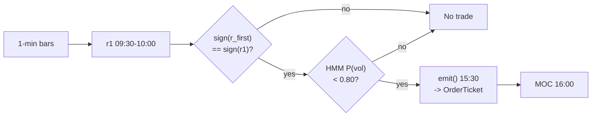

# T006 — Intraday Trend + Vol-Regime Allocator

> **Reviewer card.** Intraday time-series momentum into the close, regime-scaled: first-half-hour return predicts last-half-hour return (Gao et al. 2018); the day's own drift (S027) confirms; a `2`-state HMM vol regime (S079) scales size down when volatility makes the drift untradable. Provenance **[P]**.
>
> Edge verdict: **PREDICTIVE-FEATURE-ONLY** — Gao et al. predictive regression is documented (β̂ significant at 1% [documented]); the timing-rule figures are confirmed only in the Dec-2015 working draft — verify the published JFE tables before citing [unverified].
>
> After-cost: **BEFORE-COST** — one-sentence verdict: R² is statistical, not tradable P&L — Heston et al. conclude verbatim that periodicity strategies "lose money, after paying the bid/ask spread" [documented].
>
> Tier **S** · prototype 20–40 h [internal-est] · loaded cost $3,000–6,000 [internal-est] · latency snapshot / 15:30 clock · risk low (30-min hold, one vehicle, no leverage).

> Capacity $10–50M/day notional [example] — SPY/QQQ-class ETFs at the most liquid time of day; constraint is the closing-auction spread, not depth · Executability: Feasible: a `15:30` clock, a sign rule, and an HMM — any retail platform with minute bars suffices.

> Tag law: every numeric literal in prose carries one of `[documented]`
> `[default] [example] [unverified] [internal-est] [measured]` (legend: Appendix
> i v1.0.0). Constants inside cited formulas inherit the formula's tag
> (`[documented]` for cited literature). Bibliographic years, volumes, pages,
> arXiv IDs, DOIs, section numbers, rule codes (C1–C18), fail-safe codes (F1–F5),
> module IDs, and machine-parsed §0 data fields are identifiers, not
> literals, and are exempt.

## §1  Five-minute reviewer card

| Row | Value |
|---|---|
| Module | T006 — Intraday Trend + Vol-Regime Allocator, v1.0.2 |
| Edge verdict | `PREDICTIVE-FEATURE-ONLY` — Gao et al. (2018) JFE: `r_{13,t} = α + β·r_{1,t}` on SPY `1993`–`2013` [documented], β̂ = `6.94` (×100) significant at `1`% [documented], R² = `1.6`% [documented]; timing-rule figures (6.67%/yr, Sharpe `1.08` vs `0.29` buy-and-hold) confirmed only in the Dec-2015 working draft — verify the published JFE tables before citing [unverified] |
| After-cost | `BEFORE-COST` — R² is statistical, not tradable P&L: Heston et al. (2010) conclude periodicity strategies "lose money, after paying the bid/ask spread" [documented, working draft]; Gao et al. report the timing rule survives "reasonable transaction costs" [documented] |
| Build cost | Tier S · `20–40` h [internal-est] · `$3,000–6,000` loaded [internal-est] |
| Data cost | Research: Polygon.io/Massive Stocks Starter–Advanced `$29–199`/mo [documented secondary, verify at polygon.io/pricing before budgeting]; production: same tier, real-time [internal-est] |
| latency_class | snapshot / per_snapshot (one decision at `15:30` ET [example]) |
| risk_class | low (`30`-min hold [example], one vehicle, no leverage [example]) |
| Capacity | `$10–50`M/day notional [example]; `max_notional = participation_cap × ADV`, participation_cap = `5`% [default] |
| Executability | Feasible: a `15:30` clock, a sign rule, and an HMM — any retail platform with minute bars suffices |
| Risk summary | Event-day drift failure (FOMC/CPI); HMM regime misclassification; closing-auction spread blowout |
| When it dies | P(vol) ≥ `0.80` [example] (stand down); event days; the drift sign flips by `15:30`; Sharpe `<0.5` over `60` days [default] (retire) |
| Regime gates | Provisional: R001 elevated RV degrades (halve ≥ `0.60` [default], pause entry ≥ `0.80` [default]); scheduled macro days halve size |
| Emits | `OrderTicket` **intentions only** (Appendix c v1.0.0) — never orders |

## §1.5  Cheapest / least-build path

1. **Prototype hour band:** `20–40` h [internal-est] — 15:30 clock + sign rule + HMM fit + fixture validation.
2. **Cheapest-source row:** min_tier = Polygon.io/Massive Stocks Starter–Advanced (SIP 1-min bars, real-time) `$29–199`/mo [documented secondary, verify at polygon.io/pricing before budgeting]; latency_class = SIP-delayed, fine for a 15:30 clock; required_fields = 1-min OHLCV bars (regular session, open-time labeled) + economic calendar (FOMC/CPI) + `2` years of 1-min history [default] for HMM calibration; price_band = `$29–199`/mo [documented secondary]; build_or_buy = **build the clock and sign rule, buy the data**.
3. **Resource budget:** `1` core, `<1` GB RAM [internal-est]; compute pattern `per_snapshot`.
4. **Skip list:** cross-sectional extension; futures leg; HMM alternatives; intraday stop-loss machinery (phase `2`).
5. **DO-NOT-CUT list:** causality assertions (`assert fill_event > signal_event`, no-signal-bar-fills test); COST block + callable `expected_cost_bps`; F1–F5 fail-safes + module-state enum; decision-log audit records; bona-fide-intent + self-trade prevention; provenance tags on every numeric literal; fixtures + `test_cmd`; secrets via env only.
6. **Escalation gate:** moving beyond `1` vehicle [default]; bar latency `>60` s [default] — crossing it requires re-review of §T7 and §T8.
## §T0  Module contract — strategies emit intentions, brokers create orders

This strategy's sole output is a list of `OrderTicket` intentions (Appendix c
v1.0.0). It never places, routes, or confirms an order. Every ticket carries
`parent_signal` (the upstream signal id and its `computed_at`), an `intent_ts`,
and a `tif`. The backtest harness fills tickets strictly after the signal bar
(`fill_event > signal_event`, t→t+1 causality); any fill timestamped at or
before its signal bar is a harness bug and trips the kill switch.

### Typed signature

```python
def emit(state: ModuleState, signals: SignalBundle, bars: list[Bar], cfg: Config) -> list[OrderTicket]:
    """Core strategy function. Handles documented edge cases; never interpolates."""
```

- `ModuleState`: named state vector (below); mutated only by documented transitions.
- `SignalBundle`: `{S025: {r1_deseasoned: float, computed_at: int}, S027: {r_first: float, computed_at: int}, S079: {p_vol: float, computed_at: int}}`.
- `Bar`: canonical bar (Appendix a v1.0.0); `event_ts` int64 ns UTC, labeled by open time.
- Returns `list[OrderTicket]`; empty list = no intent this snapshot. Invalid input → module state `UNKNOWN`, returns `[]` (never a best-guess ticket).

### Config dataclass

```python
@dataclass(frozen=True)
class Config:
    # parameter      | type  | default    | range            | status
    r1_min:        float = 0.0025      # 0.0005–0.01      [default] morning-return minimum (fraction)
    p_vol_half:    float = 0.60        # 0.5–0.9          [default] HMM halve threshold
    p_vol_susp:    float = 0.80        # 0.6–0.95         [default] HMM suspend threshold
    base_notional: float = 100000.0    # 10000–1000000    [default] base notional ($)
    cooldown_s:    float = 0.0         # 0–3600           [default] post-exit cooldown (s)
    cost_gate_k:   float = 0.5         # 0.1–2.0          [default] cost-gate multiplier
    seed:          int   = 106         # fixed            [fixed]     fixture RNG seed
    s025_version:  str   = "1.0.1"     # fixed            [fixed]     trigger contract pin
    s027_version:  str   = "unpinned"  # unpinned         [unverified]
    s079_version:  str   = "unpinned"  # unpinned         [unverified]
```

### Mapping to canonical Event/Bar schema

Written once here (Appendix a v1.0.0); never restated elsewhere.

| Vendor (Polygon.io Stocks) | Canonical |
|---|---|
| `t` (ms) | `bar_open_ts` (int64 ns UTC; bar labeled by open time) |
| `o, h, l, c` | `open, high, low, close` |
| `v` | `volume` |

### Time contract (Appendix e v1.0.0)

Clock domain UTC, int64 ns; authoritative causality clock = `event_ts`;
max_skew = `5` s [default]; jitter budget = `60` s [default]; bar-label = open
time; staleness TTL = `180` s [default]; gap policy = mask, no interpolation.
Timing: `signal@t (15:30 snapshot, America/New_York) → earliest fill @16:00 close
auction`. Causality assertion: `assert fill_event > signal_event`
(no-signal-bar-fills test in `tests/test_T006.py`).

### Market-state table

| Market state | Module behavior |
|---|---|
| `CONTINUOUS_TRADING` | normal emission |
| `HALTED` | no tickets; any working intent `CANCELLED` + alert |
| `AUCTION` (15:59:30–16:00) | entry suppressed; MOC flatten allowed |
| `CLOSED` | `OFF` for the day; session flatten enforced |

### Module-state enum + F1–F5 (Appendix f v1.0.0)

Canonical vocabulary: `OK | DEGRADED | UNKNOWN | OFF` (Appendix k v1.0.0).

| Input failure | Module state | Alert |
|---|---|---|
| 15:30 bar missing (feed hole) | `UNKNOWN` | page |
| HMM state stale (F1) | `UNKNOWN` | notify |
| P(vol) incalculable / out of bounds `[0,1]` (F2) | `UNKNOWN` | page |
| Signals disagree on inputs beyond tolerance (F3) | `UNKNOWN` | notify |
| `computed_at` older than `3`× cadence (F4) | `UNKNOWN` | notify |
| Crossed/locked bar reaching the module (F1) | `UNKNOWN` | page |
| Kill-switch TRIPPED | `OFF` | page |

Invalid input → `UNKNOWN`, never interpolated. `UNKNOWN` is restrictive
(downstream reduces size / stands down), never benign. F5 (no regime label may
be used to select backtest periods ex post) applies to the §T9 evidence audit.

### Named state vector

`state = {r1, r_first, p_vol, scale, cooldown_until, position, module_state}` —
`r1`: deseasonalized first-half-hour return (from S025);
`r_first`: 9:30→15:30 drift (from S027);
`p_vol`: HMM vol-regime probability (from S079);
`scale`: `1.0 / 0.5 / 0.0` [example] from the p_vol thresholds;
`cooldown_until`: int64 ns UTC, no re-entry before it;
`position`: `0 | ±qty` current held shares;
`module_state`: `OK | DEGRADED | UNKNOWN | OFF`.

### Risk contract (fenced YAML)

```yaml
risk_contract:
  per_trade_R: 800.0            # [example] daily risk unit, $ — ex-post review trigger
  daily_loss_stop: -800.0       # [example] — enforced ex post as a next-day review trigger, not an intraday exit
  max_gross: 100000.0           # [example] $ notional
  max_adverse_per_trade: 0.0025 # [default] fraction of entry (0.25%)
  kill_conditions: ["15:30 bar stale > 3 min [example]", "clock skew > 50 ms [example]", "HMM inputs stale [example]"]
  enforcement: intraday-hard   # [default]
  calibration_recipe: "paper-trade 60 sessions [default]; HMM on 2 years of 1-min data [default]; review after any -$800 day [example]"
```

### Kill-switch state machine

`ARMED` → `TRIPPED` → `RECOVERY` → `ARMED`.

On trip: the module stops emitting tickets immediately, flattens managed
positions per the §T2 exit rule, cancels working intents, and pages.

**Re-arm checklist** (all must pass; manual review required):

1. [ ] Trip root cause identified and logged in the decision log.
2. [ ] Cooldown expired (`cooldown_until` passed).
3. [ ] All feeds healthy: 15:30 bar fresh, HMM inputs fresh, clock skew ≤ `50` ms [example].
4. [ ] Module state recomputed `OK` (not `UNKNOWN`/`DEGRADED` without declared restrictions).
5. [ ] Manual sign-off recorded (name + timestamp); then `RECOVERY` → `ARMED`.

The per-module test drives the full transition cycle.

### OrderTicket contract (Appendix c v1.0.0)

Emitted intents carry: `symbol`, `side` (`BUY | SELL | SHORT`), `qty` (int shares
`> 0`), `limit` (float or `None`), `tif` (`DAY | IOC | FOK | GTC | OPG | CLS`),
`ticket_id` (module UUID, idempotency key), `parent_signal` (`"S025@<computed_at_ns>"`),
`intent_ts` (int64 ns UTC), `state` (intent-side tracking).

**Child-order state machine (intent-side mirror):**
`NEW → WORKING → FILLED`, with `→ CANCELLED` from any state on kill-switch TRIP,
compliance veto, or explicit cancel; `PARTIAL` is a reporting state on the same
ticket (never a new intent). A ticket in a terminal state never re-enters; a new
intent is a new `ticket_id`. Timeout without broker acknowledgment → `CANCELLED` + alert.

**Partial-fill policy:** partial fills update the remaining quantity of the same
ticket; allocation across tickets for the same symbol is oldest `intent_ts`
first (FIFO); overfill beyond `qty` = broker-adapter defect → halt to `UNKNOWN`
+ alert + reconcile before re-arming. **Cancel-replace rules:** replace = cancel
old + emit new intent with a new `ticket_id`; never mutate a working ticket in
place.

### Ops tail

| Item | Value |
|---|---|
| Schedule | one decision per day: enter `15:30` ET [example], flatten at the `16:00` close [example]; a clock strategy |
| Owner | on-call quant; alerts page via the decision-log alert table |
| Health checks | 15:30 bar freshness; HMM freshness; clock skew; kill-switch state |
| Alert table | page: bar missing, crossed input, kill trip; notify: HMM stale, F3 disagreement, F4 expiry |
| Resource budget | `1` vCPU, `<1` GB RAM [internal-est]; HMM fit is offline [internal-est] |
| Runbook stub | trip → flatten → page → root-cause → checklist → manual re-arm |
| Secrets | `POLYGON_API_KEY` env-only; never in code, logs, or fixtures (Gate-grepped) |
## §T1  Strategy thesis & edge

**Thesis.** Intraday time-series momentum into the close, regime-scaled: first-half-hour return predicts last-half-hour return (Gao et al. 2018); the day's own drift (S027) confirms; a `2`-state HMM vol regime (S079) scales size down when volatility makes the drift untradable. Provenance **[P]**.

**Edge verdict: PREDICTIVE-FEATURE-ONLY** — Gao et al. predictive regression is documented (β̂ significant at 1% [documented]); the timing-rule figures (6.67%/yr, Sharpe `1.08` vs `0.29` buy-and-hold) are confirmed only in the Dec-2015 working draft — verify the published JFE tables before citing [unverified].

**After-cost verdict: BEFORE-COST** — one-sentence verdict: R² is statistical, not tradable P&L — Heston et al. conclude verbatim that periodicity strategies "lose money, after paying the bid/ask spread" [documented, working draft].

**Risk summary.** Event-day drift failure (FOMC/CPI); HMM regime misclassification; closing-auction spread blowout.

**Capacity.** `max_notional = participation_cap × ADV`, with participation_cap =
`5`% [default]; band `$10–50`M/day notional [example] on SPY/QQQ-class ETFs.

**Math.**

```text
First-half-hour return r_{1,t} measured from the prior day's close (includes the
overnight gap, per Gao et al. [documented]); deseasonalized r̃_{1,t} is S025's
published field — T006 consumes it and applies only the threshold (deseasonali-
zation is the provider's contract, not this chapter's). Formation drift
r_{first,t} over 9:30→15:30 (from S027). Direction s_t = sign(r̃_{1,t}) with
|r̃_{1,t}| ≥ 0.25% [example]; confirm sign(r_{first,t}) = s_t. Two-state HMM vol
regime (S079, Hamilton-1989 filter form [documented]): scale 1.0 / 0.5 / 0.0 at
P(vol) 0.60 / 0.80 [example]. Modeled edge edge_bps = 0.25% × 1e4 × 0.55
= 13.75 bps [example] (sign-hit ≈ 55% [example] from the working-paper timing
rule); the C3 gate requires 1.0 bps [example] ≤ 0.5 [default] × 13.75 bps
= 6.875 bps [example] — passes [example].
```

**Pinned consumed formula (≤10 lines; ID + version + spec-hash; CI hash-checked).**

```text
# PIN: GAO2018-EQ2 | source: Gao, Han, Li & Zhou (2018), JFE 132(3): 240–263
# spec-hash: jfe-2018-132-240-263
r_{13,t} = α + β · r_{1,t} + ε_t,  t = 1..T                      # [documented]
r_1   = first-half-hour return measured from prior day's close   # [documented]
r_13  = last-half-hour return                                    # [documented]
β̂ = 6.94 (×100), significant at the 1% level, R² = 1.6%         # [documented]
  on SPY (TAQ), Feb 1993 – Dec 2013, days with <500 trades excluded  # [documented]
```

**Lede.** See the reviewer card in §1. **When it dies:** P(vol) ≥ `0.80` [example]
(stand down); event days; the drift sign flips by `15:30`.

**Regime gates (provisional).** R001 elevated RV suspends (S079 gate); scheduled
macro days halve size. Machine records in §T5.
## §T2  Signal stack, entry/exit, sizing, costs, execution, robustness & compliance

> **Timing box (fixed wording).** `signal@t (15:30 snapshot, America/New_York) → earliest fill @open(t+1)` — here the earliest fill is the `16:00` close auction; no fill may occur inside the `15:30` signal bar (Appendix e v1.0.0).

### Universe

One liquid vehicle: SPY (or QQQ/ES) [example]; single-name extension uses price
> `$20`, ADV > `5`M shares [example] [example]. RTH only. Exactly one window:
enter at `15:30` ET, flatten at the `16:00` closing print. No other entries
exist — this is a *clock strategy*.

### Dependencies

| Signal | Role | Contract |
|---|---|---|
| `S025` | trigger | sign of deseasonalized r_{1,t}; needs |r̃_1| >= 0.25% [example] |
| `S027` | confirm | sign(r_{first,t}) must equal sign(r_{1,t}); disagreement → no trade |
| `S079` | gate | scale 1.0 / 0.5 / 0.0 at P(vol) thresholds 0.60 / 0.80 [example] |

Max dependency depth: `2` [default]. Machine edge list: `consumes` in §0
(`S025@1.0.1` trigger, `S027@unpinned` confirm, `S079@unpinned` gate).

**Schema mapping (canonical).** Written once in §T0; not restated here.

Staleness: max skew `5` s [default] · jitter budget `60` s [default] · TTL
`180` s [default] · cadence `per_snapshot (15:30 ET)` · tz `America/New_York`.

### Entry rule (Boolean expressions)

```text
ENTER_LONG  := (r̃_1 >= +r1_min) AND (sign(r_first) == sign(r̃_1))
               AND (P_vol < p_vol_susp) AND (expected_cost_bps(...) <= cost_gate_k * edge_bps)
ENTER_SHORT := (r̃_1 <= -r1_min) AND (sign(r_first) == sign(r̃_1))
               AND (P_vol < p_vol_susp) AND (locate_ok)
               AND (expected_cost_bps(...) <= cost_gate_k * edge_bps)
FLAT        := otherwise
```

### Exits (with post-exit cooldown)

```text
EXIT := (t >= 16:00) [MOC or 15:59:30 market order — the time stop IS the strategy]
        No intraday stop-loss (the hold is 30 minutes; a stop inside the last
        half hour is spread-donation [example]), no profit target.
```

**Cooldown.** `0` s [default] after every exit; `cooldown_until` enforced in the
pseudocode (C8).

### Position sizing (fenced function)

```python
def shares(risk_budget_R, stop_distance, vol_estimate, ADV_cap, cost):
    """Fenced position sizer — T006. Returns integer shares, never negative."""
    # vol_estimate is S079's P(vol) in [0,1]
    scale = 1.0 if vol_estimate < 0.60 else 0.5 if vol_estimate < 0.80 else 0.0  # [example]
    raw = scale * 100000.0 / 500.0    # $100k base notional [example] at $500 SPY [example]
    capped = min(raw, ADV_cap * 0.05) # 5% ADV participation cap [default]
    return max(0, int(capped))
```

### Risk limits

| Limit | Value |
|---|---|
| Daily loss stop | `-$800` [example] — ex-post review trigger, not an intraday exit |
| Max one position | one vehicle, one window |
| Max adverse per trade | `0.25`% of entry [default] |
| Regime suspend | P(vol) ≥ `0.80` [example] → flat, no trade |
| Staleness kill | `15:30` bar stale `>3` min [example] → trip |

### COST block — single source of truth

All cost numbers live here and in `expected_cost_bps` only; restating them
elsewhere is a validation failure. Stack is **round-trip** unless noted.

| Component | bps | Basis |
|---|---|---|
| Spread | `0.5` | [example] — ≈$5.00 per $100k notional (≈2.5¢/share on 200 shares at $500); assumes SPY effective spread ~0.5–1¢/share one-way [example] plus last-half-hour adverse selection, doubled to round-trip [example] |
| Fees | `0.5` | [example] — ≈$5.00 per $100k notional round-trip (≈2.5¢/share); retail-broker commission + exchange take fees + SEC Section 31 pass-through on the sell leg [example] |
| Borrow | `0.0` | [unverified] — single-day hold on SPY, an easy-to-borrow ETF with deep lend supply; intraday borrow charge effectively zero [unverified]; confirm with broker before live shorts |
| Impact | `0.0` | [example] base; conservative variant adds `1`¢ adverse on the MOC print [example] |
| **Total** | `1.0` | [example] — ≈$10.00 per $100k notional (≈5¢/share round trip) |

Fee schedule as of `2026-09-01` [example] · venue `ARCX` [example] · side
`taker` [example] · `borrow_bps_per_day = 0.0` [unverified — see row above].

```python
def expected_cost_bps(notional, adv_pct, venue, side, urgency) -> float:
    """Callable cost model - T006 COST block (single source of truth)."""
    spread_bps = 0.5   # [example] ~$5.00 per $100k notional round-trip
    fee_bps = 0.5      # [example] ~$5.00 per $100k notional round-trip
    borrow_bps = 0.0   # [unverified] single-day ETF hold; confirm with broker
    impact_bps = 0.0   # [example] base; conservative variant: MOC + 1c adverse
    return spread_bps + fee_bps + borrow_bps + impact_bps
```

**Normative cost-gate predicate (C3):** `expected_cost_bps(...) <= k * edge_bps`
— no ticket is emitted unless the callable cost clears this gate. The predicate
appears verbatim in the §T3 pseudocode and is asserted by the per-module test.

### Execution / fill-model table

| Aspect | Assumption |
|---|---|
| Latency | irrelevant — one decision at `15:30`, fills into the most liquid `30` minutes [example] |
| Entry fill | limit at touch, `DAY` tif; unfilled by `15:59:30` → market order [example] |
| Exit fill | MOC (`CLS` tif) at the `16:00` close [example] |
| Partial fills | oldest `intent_ts` first (FIFO); MOC aggregation |
| Impact | `0` bps base [example]; conservative `1`¢ adverse on the MOC print [example] |
| Adverse fill | closing-auction spread blowout on event days — the S046 throttle exists for this |

### Robustness + compliance sub-block (10 coded rules)

**Robustness.** The documented effect is a single-vehicle statistical regularity;
`r1_min` in `0.15`–`0.4`% [example] and the HMM thresholds are the calibration
surface. Heston et al.'s honest after-cost result on similar periodicity is the
standing caution: this survives only at SPY-class spreads. Failure modes with
`check:` lines live in §T9.

**Compliance (coded rules; full contract in §T8).**

- **C1** | No orders: the strategy emits `OrderTicket` intentions only; the broker creates orders.
- **C2** | Kill switch: `ARMED` → `TRIPPED` → `RECOVERY` → `ARMED` on the §T7 trip conditions.
- **C3** | Cost gate: `expected_cost_bps(...) <= k * edge_bps` before any ticket.
- **C4** | Causality: `fill_event > signal_event` (t→t+1); no signal-bar fills, ever.
- **C5** | Decision log: every ticket logged with inputs hash and params hash (Appendix g v1.0.0).
- **C6** | Staleness: inputs older than the TTL → `UNKNOWN`, no tickets.
- **C7** | Short discipline: `locate_ok` (Reg-SHO) required before any short ticket.
- **C8** | Cooldown: post-exit cooldown in seconds; no re-entry inside it.
- **C9** | Session flatten: no uncommanded overnight carry.
- **C10** | Position caps: per-trade R, daily loss stop, and max gross enforced.
- **C11** | One-window discipline: trigger = any intent outside the `15:30` window [example] → check = clock → action = veto → log = `GATE_VETO`.
- **C12** | Event-day throttle: trigger = scheduled macro release today → check = calendar → action = halve size → log = `GATE_VETO` (size variant).
- **C13** | Bona-fide intent: every ticket is a genuine trading intent at entry; no spoofing, no layering; the MOC flatten is a real liquidation.
- **C14** | Self-trade prevention: broker adapter enforces self-match prevention on SPY; a self-match is a defect → halt to `UNKNOWN`.
- **C15** | Pre-trade fat-finger trio: `qty > 0` and ≤ max gross; `limit` within `1`% of touch [default]; notional ≤ `$1`M [default] per ticket — violations veto.
- **C16** | Message-rate / cancel-to-trade: `1` ticket/day [example]; rate limits are non-binding but monitored.
- **C17** | Public-dissemination gate: intents are internal only; no external dissemination of tickets or signals.
- **C18** | Entitlement assertions: Polygon.io Stocks licensed, research + production; entitlement = professional/internal; derived features ours.

### Parameter table

| Parameter | Key | Default | Tag | Sensitivity |
|---|---|---|---|---|
| Morning-return minimum | `r1_min` | `0.0025` | [default] | high |
| HMM half threshold | `p_vol_half` | `0.60` | [default] | medium |
| HMM suspend threshold | `p_vol_susp` | `0.80` | [default] | high |
| Base notional | `base_notional` | `$100k` | [default] | medium |
| Post-exit cooldown | `cooldown_s` | `0` s | [default] | low |
| Cost-gate k | `cost_gate_k` | `0.5` | [default] | high |

### Data rights

SPY 1-min bars via Polygon.io Stocks, `rights: licensed`; research +
production; fixtures synthetic; entitlement = professional/internal; derived
features ours. Entitlement-class change → §1.5 escalation gate.

**Build vs buy.** Build: the whole strategy is a `15:30` clock, a sign rule, and
an HMM — any retail platform with minute bars suffices; buy only the data.

**Local build.** Feasible on anything. One decision a day; the HMM fit is offline.
The live loop is a clock and two sign comparisons.

**Data dictionary (canonical fields).**

| Field | Type | Cadence | Tier | Notes |
|---|---|---|---|---|
| `1-min OHLCV bars (SPY)` | float/int | 1-min | Tier 1 | split/dividend-adjusted |
| `Economic calendar (FOMC/CPI/NFP)` | reference | daily | Tier 1 | S046 event-day throttle |
| `2-year 1-min history` [default] | float/int | 1-min | Tier 1 | HMM calibration |
## §T3  Normative pseudocode (prose is commentary)

```text
function emit(state, signals, bars, cfg) -> list[OrderTicket]:
    assert bars non-empty else return UNKNOWN                       # F1
    t = bars[-1]   # 15:30 snapshot bar
    r1 = signals['S025'].r1_deseasoned
    rf = signals['S027'].r_first
    pv = signals['S079'].p_vol
    assert isfinite(r1) and isfinite(rf) and isfinite(pv) else return UNKNOWN  # F2
    assert 0.0 <= pv <= 1.0 else return UNKNOWN                    # F2: HMM bounds

    edge_bps = 0.0025 * 1e4 * 0.55                                 # [example] = 13.75
    cost_ok = expected_cost_bps(notional, adv_pct, venue, side, urgency) <= cfg.cost_gate_k * edge_bps
    # ^^^ normative cost-gate predicate (C3): expected_cost_bps(...) <= k * edge_bps

    scale = 1.0 if pv < cfg.p_vol_half else 0.5 if pv < cfg.p_vol_susp else 0.0  # [example]
    tickets = []
    if t.clock == '15:30' and state.position == 0 and scale > 0 and cost_ok \
            and t.event_ts >= state.cooldown_until:                # C8 cooldown
        if abs(r1) >= cfg.r1_min and sign(rf) == sign(r1):         # C11 one-window
            side = 'BUY' if r1 > 0 else 'SELL'
            if side == 'SELL': assert locate_ok                   # C7
            tickets = [ticket(side=side, qty=shares(...), limit=touch(t), tif='DAY',
                              parent_signal=f"S025@{signals['S025'].computed_at}")]  # C1, C13
    elif t.clock >= '15:59:30' and state.position != 0:
        tickets = [flatten_ticket(state, venue='MOC')]
        state.cooldown_until = t.event_ts + cfg.cooldown_s * 1e9   # C8
    for tk in tickets: log_decision(tk, inputs_hash, params_hash)  # C5 / App. g
    assert all(fill.event_ts > t.event_ts for any fill)            # C4: t->t+1, no signal-bar fills
    return tickets
```

**Flow.**



## §T4  Worked example, fixtures & acceptance tests

**Worked example (fixture-backed, from `fixtures/T006_tape.csv` trade 1).**

Trade 1: `BUY` `200` shares [example] @ `500.1` [example], exit `501.35`
[example] (`MOC 16:00`). Cost call:
`expected_cost_bps(100020.0, 0.01, "ARCX", "taker", "normal")` → `1.0` bps
[example] → `10.00` [measured] dollars on `100020.00` [example] notional.
Gross P&L = `250.00` [measured] dollars. Net = `240.00` [measured] dollars.
The fixture's expected CSV carries the same arithmetic for all six trades;
the per-module test recomputes it from the tape and asserts equality.

**Fixture rows (all synthetic, seed `106` [fixed]; tape + expected):**

| trade | side | qty | entry | exit | cost call inputs (notional, adv_pct, venue, side, urgency) | cost bps | cost $ | gross $ | net $ |
|---|---|---|---|---|---|---|---|---|---|
| 1 | BUY | 200 | 500.1 | 501.35 | (100020.0, 0.01, ARCX, taker, normal) | 1.0000 | 10.00 | 250.00 | 240.00 |
| 2 | SELL | 200 | 502.2 | 501.1 | (100440.0, 0.01, ARCX, taker, normal) | 1.0000 | 10.04 | 220.00 | 209.96 |
| 3 | BUY | 200 | 499.8 | 499.3 | (99960.0, 0.01, ARCX, taker, normal) | 1.0000 | 10.00 | −100.00 | −110.00 |
| 4 | BUY | 100 | 500.5 | 501.0 | (50050.0, 0.01, ARCX, taker, normal) | 1.0000 | 5.00 | 50.00 | 44.99 |
| 5 | SELL | 200 | 501.9 | 501.95 | (100380.0, 0.01, ARCX, taker, normal) | 1.0000 | 10.04 | −10.00 | −20.04 |
| 6 | BUY | 200 | 498.7 | 500.2 | (99740.0, 0.01, ARCX, taker, normal) | 1.0000 | 9.97 | 300.00 | 290.03 |

Trade 4 is the event-day half-size case (C12); trade 3 is a loser — fixtures
are an accounting demo of the cost stack, not a track record.

Fixture `TYPE: validation-run` (synthetic tape, seed `106`); `fill_ts − signal_ts`
= `1800` s [example] for every row; tolerance: bps `1e-4`, dollars `0.01`.

**Acceptance criteria** (`tests/test_T006.py`, `test_cmd` in §0):

1. Fixture arithmetic: tape stack = callable = expected CSV; gross/net recomputed.
2. No signal-bar fills: `fill_event > signal_event` for every row.
3. Cost-gate predicate: passes when edge ≫ cost, blocks when edge ≪ cost.
4. Kill-switch cycle: `ARMED → TRIPPED → RECOVERY → ARMED`.
5. Invalid input → `UNKNOWN`, never interpolated.
6. Callable signature: `expected_cost_bps(notional, adv_pct, venue, side, urgency) → float`.
7. Expected SUMMARY totals match recomputed sums.
8. Exit reasons are MOC; fills land `1800` s after signal (30-min hold).
9. Fixture `cost_gate_k` matches the Config default `0.5` and the gate passes.

## §T5  Dependencies & machine-readable regime gates

**Dependency edge list** (from §0 `consumes`):

| from | to | function | role | version_pin |
|---|---|---|---|---|
| S025 | T006 | `r1_deseasoned`, `computed_at` | trigger | `1.0.1` |
| S027 | T006 | `r_first`, `computed_at` | confirm | `unpinned` [unverified] |
| S079 | T006 | `p_vol`, `computed_at` | gate | `unpinned` [unverified] |

**Regime gates (machine records).**

| regime_id | direction | mechanism | condition | action | min_lag | unknown_behavior |
|---|---|---|---|---|---|---|
| R001 | degrades | elevated RV: drift untradable | `p_vol >= 0.60` [default] | halve | 1 bar [default] | veto |
| R001 | inverts | extreme RV | `p_vol >= 0.80` [default] | pause_entry | 1 bar [default] | veto |
| R-event | degrades | scheduled macro day | calendar flag [default] | halve | 0 [default] | halve |
## §T6  Execution assumptions

| Aspect | Assumption |
|---|---|
| Latency | irrelevant — one decision at `15:30`, fills into the most liquid `30` minutes [example] |
| Partial fills | oldest `intent_ts` first (FIFO); MOC aggregation |
| Impact | `0` bps base [example]; conservative `1`¢ adverse on the MOC print [example] |
| Adverse fill | closing-auction spread blowout on event days — the S046 throttle exists for this |

Intent-side order tracking follows the §T0 child-order state machine
(`NEW → WORKING → FILLED`, cancel-replace by cancel + new `ticket_id`); the
broker owns wire truth.

## §T7  Risk contract & kill switch

Risk contract: see the fenced YAML in §T0 (per-trade R `$800` [example], daily
loss stop `-$800` [example], max gross `$100k` [example], max adverse
`0.25`% [default], enforcement `intraday-hard` [default], calibration recipe
in §T0).

Enforcement: `intraday-hard` [default]. Calibration recipe: paper-trade `60`
sessions [default]; HMM on `2` years of 1-min data [default]; review after any
-$800 day [example].

**Kill switch: `ARMED` → `TRIPPED` → `RECOVERY` → `ARMED`.**

Trip conditions:

- 15:30 bar stale > 3 min [example]
- clock skew > 50 ms [example]
- HMM inputs stale [example]

On trip: the module stops emitting tickets immediately, flattens managed
positions per the exit rule, cancels working intents, and pages. `RECOVERY`
requires the §T0 re-arm checklist (manual review, cooldown expiry, healthy
feeds); only then does the module return to `ARMED`. The per-module test
drives the full transition cycle.

**Ops.** See §T0 ops tail (schedule, owner, health checks, alert table,
resource budget, runbook stub, secrets env-only).

## §T8  Compliance (C1–C18)

- **C1** | No orders: the strategy emits `OrderTicket` intentions only; the broker creates orders.
- **C2** | Kill switch: `ARMED` → `TRIPPED` → `RECOVERY` → `ARMED` on the trip conditions in §T7.
- **C3** | Cost gate: `expected_cost_bps(...) <= k * edge_bps` before any ticket (see §T2).
- **C4** | Causality: `fill_event > signal_event` (t→t+1); no signal-bar fills, ever.
- **C5** | Decision log: every ticket logged with inputs hash and params hash (Appendix g v1.0.0: `ticket_id, intent_ts, symbol, side, qty, limit, tif, parent_signal, inputs_hash, params_hash, decision, reason_code`).
- **C6** | Staleness: inputs older than the TTL → `UNKNOWN`, no tickets.
- **C7** | Short discipline: `locate_ok` (Reg-SHO) required before any short ticket.
- **C8** | Cooldown: post-exit cooldown enforced in seconds; no re-entry inside it.
- **C9** | Session flatten: no uncommanded overnight carry.
- **C10** | Position caps: per-trade R, daily loss stop, and max gross enforced.
- **C11** | One-window discipline: trigger = any intent outside the `15:30` window [example] → check = clock → action = veto → log = `GATE_VETO`.
- **C12** | Event-day throttle: trigger = scheduled macro release today → check = calendar → action = halve size → log = `GATE_VETO` (size variant).
- **C13** | Bona-fide intent: every ticket is a genuine trading intent at entry; no spoofing, no layering; the MOC flatten is a real liquidation.
- **C14** | Self-trade prevention: broker adapter enforces self-match prevention on SPY; a self-match is a defect → halt to `UNKNOWN`.
- **C15** | Pre-trade fat-finger trio: `qty > 0` and ≤ max gross; `limit` within `1`% of touch [default]; notional ≤ `$1`M [default] per ticket — violations veto.
- **C16** | Message-rate / cancel-to-trade: `1` ticket/day [example]; rate limits non-binding but monitored.
- **C17** | Public-dissemination gate: intents are internal only; no external dissemination of tickets or signals.
- **C18** | Entitlement assertions: Polygon.io Stocks licensed, research + production; entitlement = professional/internal; derived features ours.

**Halt/auction state table.**

| State | Emission | Working intents | Exit |
|---|---|---|---|
| `HALTED` | none | `CANCELLED` | flat via broker |
| `AUCTION` | entry suppressed | MOC flatten allowed | `16:00` close |
| `CLOSED` | none (`OFF`) | none | session flatten enforced |

## §T9  Evidence, failures & regime gates

**Evidence (cost-level tokens; every statistic tagged).**

| Source | Sample | Finding | Cost level | Caveat |
|---|---|---|---|---|
| Gao, Han, Li & Zhou (2018) [documented] | SPY, `1993`–`2013` (TAQ, days with `<500` trades excluded) [documented] | `r_{13} = α + β·r_1`: β̂ = `6.94` (×100), p < `1`%, R² = `1.6`% [documented] | `BEFORE-COST` (predictive regression) | R² is statistical, not tradable P&L |
| Gao, Han, Li & Zhou (2018), timing rule [documented draft] | SPY, `1993`–`2013` [documented] | sign(`r_1`) timing: `6.67`%/yr [documented draft], Sharpe `1.08` vs `0.29` buy-and-hold [documented draft]; authors state the rule survives "reasonable transaction costs" [documented draft] | before-cost metric (survives costs per authors) | confirmed only in the Dec-2015 draft text; verify the published JFE tables before citing as the final version |
| Heston, Korajczyk & Sadka (2010) [documented] | NYSE/AMEX, half-hour intervals, `2001`–`2005` [documented] | continuation at day-multiple half-hour lags, strongest first/last half-hour, persists ≥`40` trading days [documented] | after-cost (honest): "strategies that attempt to take advantage of the daily periodicity lose money, after paying the bid/ask spread" [documented, working draft] | the continuation is a timing/cost problem, not an arbitrage |
| Baltussen, Da, Lammers & Martens (2021) [documented] | `60`+ futures, `1974`–`2020` [documented] | last-`30`-min return positively predicted by rest-of-day return; gamma-hedging mechanism; effect reverts over the following days [documented] | `BEFORE-COST` | mechanism confirmation + reversion warning |

**Where this module is known to fail.** event-day drift failures, HMM
misclassification, closing-auction spread blowouts, post-2013 decay of the
documented effect.

**Failure modes (trigger → detect → action → recovery).**

| # | Failure | Detect → action → recovery | Executable check |
|---|---|---|---|
| 1 | HMM misclassifies a toxic tape as calm | detect: realized 30-min vol > `2`× forecast [example] → action: suspend via p_vol_susp → recovery: recheck calibration | `realized_vol <= 2*forecast_vol` |
| 2 | Event-day drift failure | detect: calendar flags FOMC/CPI → action: halve size (C12) or skip → recovery: next session [default] | `not event_day or size_halved` |
| 3 | MOC slippage | detect: realized close vs modeled > `1`¢ [example] → action: conservative variant → recovery: re-pin | `moc_slippage_cents <= 1` |
| 4 | Cost blowup at wider spreads | detect: cost gate failing → action: stand down → recovery: re-pin fee schedule [default] | `expected_cost_bps(...) <= k * edge_bps` |
| 5 | Clock/bars stale at 15:30 | detect: staleness → action: UNKNOWN, no entry → recovery: feed healthy [default] | `all(fill_ts > signal_ts)` |

**Regime gates.** Machine records in §T5.

**Robustness.** The documented effect is a single-vehicle statistical regularity;
`r1_min` in `0.15`–`0.4`% [example] and the HMM thresholds are the calibration
surface. Heston et al.'s honest after-cost result on similar periodicity is the
standing caution: this survives only at SPY-class spreads.

**What the optimistic case assumes (and we do not).** (1) the MOC print is the
modeled exit — the closing auction can slip; the conservative variant adds `1`¢
adverse [example]; (2) slippage `0` [example] — flagged; (3) the HMM is assumed
correctly specified.

## §T10  Source log + unverified leads

- Timing-rule figures (6.67%/yr, Sharpe `1.08` vs `0.29`) — confirmed in the Dec-2015 working draft (SSRN 2552752); verify against the published JFE 132(3) tables before citing as the final version.
- SPY borrow cost for a 30-minute single-day short hold — stubbed at `0` bps/day [unverified]; confirm with broker.
- Retail fee stack as of 2026-09 (`fee_schedule_as_of` in §T2 is an [example] stub).

What would change our mind: a purged/embargoed walk-forward with full costs
that survives the S088 honesty protocol; a documented after-cost P&L from the
cited authors' own implementations; or a regime-gated replication that holds
outside the original sample.

**GROK-NEEDED** (expert questions web search could not resolve — do not answer from priors):

1. "For module T006 (Intraday Trend + Vol-Regime Allocator, consuming Gao et al. 2018's sign(r_1) timing rule): in the published Journal of Financial Economics 132(3): 240–263 version, which Table/section reports the timing-strategy figures (6.67%/yr, Sharpe 1.08 vs 0.29 buy-and-hold confirmed only in the Dec-2015 SSRN draft), and do those exact figures survive in the published version? A good answer quotes the table number, sample period, and the return/Sharpe numbers exactly as printed."
2. "For module T006 (15:30 ET SPY entry via limit-at-touch, MOC exit at 16:00, ~$100k notional, retail broker): what is a defensible all-in round-trip cost stack in bps as of 2026-09 — IBKR Pro tiered commission (0.0035/share, $0.35 min), Nasdaq/NYSE liquidity-removal fees, and the SEC Section 31 fee pass-through on the sell? The module currently assumes 1.0 bps all-in round-trip [example]. A good answer gives per-component cents/share and bps at a $500 SPY price and states whether 1.0 bps is defensible or too optimistic."
3. "For module T006 (single-day ~30-minute SPY short hold, flat by 16:00): what do lenders actually charge for borrowing SPY for an intraday hold — is a 0 bps/day stub defensible, or is there a typical hard-to-borrow / general-collateral rate that applies to even a 30-minute hold? A good answer cites a broker stock-loan rate table or market-maker convention with an as-of date."
4. [RESOLVED 2026-09-11 by direct vendor-page verification — no Grok lookup needed] Tiers verified at https://massive.com/stocks-data: Starter $29/mo (15-min delayed, 5-yr history), Developer $79/mo (15-min delayed, 10-yr history), Advanced $199/mo (real-time, 20+ yr history); Basic $0 free (EOD, 2-yr history). Cheaper compliant path for the once-a-day 15:30 snapshot: Starter $29/mo (the 15-min delay is harmless for a single end-of-day snapshot) — or the free Basic tier for EOD-only research.

## AI build prompt

```text
Build the T006 (Intraday Trend + Vol-Regime Allocator) strategy module from this specification.
Hard constraints:
- The strategy emits OrderTicket intentions ONLY; it never creates orders (C1).
- Causality: fill_event > signal_event (t->t+1); no signal-bar fills (C4).
- Cost gate: expected_cost_bps(...) <= k * edge_bps before any ticket (C3).
- Kill switch ARMED -> TRIPPED -> RECOVERY -> ARMED on the §T7 trip conditions (C2).
- Every numeric literal in prose carries an honesty tag [documented]/[measured]/[example]/[unverified]/[default]/[internal-est]; exempt identifiers only.
- Sources must be real and cited with cost-level tokens; chatbot-only material goes to §T10.
Config surface:
- r1_min (float): default 0.0025, range 0.0005–0.01 [default]
- p_vol_half (float): default 0.60, range 0.5–0.9 [default]
- p_vol_susp (float): default 0.80, range 0.6–0.95 [default]
- base_notional (float): default 100000.0, range 10000–1000000 [default]
- cooldown_s (float): default 0.0, range 0–3,600 [default]
- cost_gate_k (float): default 0.5, range 0.1–2.0 [default]
Entry rule:
ENTER_LONG  := (r̃_1 >= +r1_min) AND (sign(r_first) == sign(r̃_1))
               AND (P_vol < p_vol_susp) AND (expected_cost_bps(...) <= cost_gate_k * edge_bps)
ENTER_SHORT := (r̃_1 <= -r1_min) AND (sign(r_first) == sign(r̃_1))
               AND (P_vol < p_vol_susp) AND (locate_ok)
               AND (expected_cost_bps(...) <= cost_gate_k * edge_bps)
FLAT        := otherwise
Exit rule:
EXIT := (t >= 16:00) [MOC or 15:59:30 market order — the time stop IS the strategy]
        No intraday stop-loss (the hold is 30 minutes; a stop inside the last
        half hour is spread-donation), no profit target.
Sizing: implement the §T2 shares() function verbatim; enforce the §T0 risk contract.
Deliverables: the module markdown (all sections §1–§T10), the fixture tape CSV
(fixtures/T006_tape.csv), the expected CSV (fixtures/T006_expected.csv), and
the per-module test (modules/tests/test_T006.py) covering fixture arithmetic,
causality, the cost gate, the kill-switch cycle, invalid→UNKNOWN, the SUMMARY
consistency, the MOC exit discipline, and the callable signature.
---
