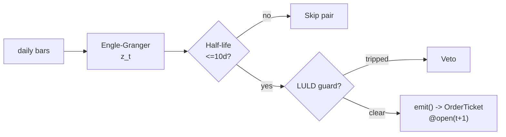

# T007 — Cointegration Z-Score Pairs

> Tag law: every numeric literal in prose carries one of `[documented]`
> `[default]` `[example]` `[unverified]` `[internal-est]` `[measured]` (legend:
> MODULE_FORMAT_PROPOSAL.md v1.0.0). Constants inside cited formulas inherit the
> formula's tag. Bibliographic years, volumes, pages, rule codes (C1–C15),
> fail-safe codes (F1–F5), module IDs, and machine-parsed §0 data fields are
> identifiers, not literals, and are exempt.

> **Reviewer card.** Equity pairs: cointegration residuals (S043) give the equilibrium the spread reverts to; half-life estimation (S061) confirms the reversion is tradeable; the LULD guard (S058) vetoes dislocated legs. Provenance **[P]**.
>
> Edge verdict: **AFTER-COST-EDGE** — Gatev et al.: up to 11%/yr excess, profits exceeding conservative costs [documented]; edge is concentrated and declining but documented after cost [documented].
>
> After-cost: **FULL-COST** — one-sentence verdict: GGR's after-cost 11%/yr [documented] with the spread as a fixed commission schedule is the honest benchmark — ours decays less only if it trades less.
>
> Tier **S** · prototype 40–60 h [example] · loaded cost $6,000–9,000 [example] · latency bar / daily + 1-min LULD tape · risk medium (leveraged pairs, leg dislocation tail).
>
> Data cost: **$29/mo** [documented — vendor pricing page https://massive.com/stocks-data, fetched 2026-09-11] — Massive Stocks Starter (band $29–199/mo across Starter/Developer/Advanced [documented — vendor pricing page https://massive.com/stocks-data, fetched 2026-09-11]). Research and production both fit Starter (15-min delay is harmless for a daily-close strategy). Research and production both fit Starter (15-min delay is harmless for a daily-close strategy).

> Capacity $5–50M/day notional [example] — daily bars, `50–150` pairs [example], one rebalance per day; wider universe scales · Executability: Feasible: daily-bar cointegration on the universe, `50–150` pairs [example], one rebalance per day; standard retail platform.

## §1  Identity & provenance

This module is a **strategy**: it emits `OrderTicket` intentions only — brokers create orders, strategies never do. Family **E  # pairs / statistical arbitrage**, batch **TB2**, provenance **P**.

**Lede.** Equity pairs: cointegration residuals (S043) give the equilibrium the spread reverts to; half-life estimation (S061) confirms the reversion is tradeable; the LULD guard (S058) vetoes dislocated legs. Provenance **[P]**.

**When it dies.** Correlation regime break; profitability decline since the 2000s (Gatev-followup literature [unverified]); crowding — half-life stretches.

**Regime gates (provisional).** R001 elevated RV degrades (spreads widen faster than they revert); halted legs excluded.

**Prototype scope.** daily EG test + z + half-life + beta-hedge + LULD guard + kill-switch.

## §1.5  Cheapest / least-build path

1. **Prototype hour band:** 40–60 h [example] — daily Engle–Granger test + z-score + half-life fit + beta-hedge sizing + LULD guard + kill-switch, one pair end to end.
2. **Cheapest-source row:** min_tier = Polygon.io Stocks Starter; latency_class = daily bars + 15-min-delayed 1-min tape; required_fields = daily OHLCV (split/dividend-adjusted) + 1-min aggregates for the LULD guard; price_band = `$29`/mo [documented — vendor pricing page https://massive.com/stocks-data, fetched 2026-09-11] (Starter; band $29–199/mo [documented — vendor pricing page https://massive.com/stocks-data, fetched 2026-09-11]); build_or_buy = **build** (pair selection and EG testing are standard statistical tooling; buy nothing but the data).
3. **Resource budget:** `1` vCPU, `<2` GB RAM [internal-est]; compute pattern `per_bar` (daily close loop; EG tests embarrassingly parallel across the universe).
4. **Skip list (phase two):** intraday formation/trading windows; factor-neutrality; multi-pair portfolio optimizer; live borrow-rate feed integration (static `0.1` bps/day [example] assumption suffices for the prototype).
5. **DO-NOT-CUT list:** causality assertions (`fill_event > signal_event`, no-signal-bar-fills test); COST block + callable `expected_cost_bps`; cost-gate predicate `expected_cost_bps(...) <= k * edge_bps`; F1–F5 fail-safes + module-state enum; kill-switch `ARMED → TRIPPED → RECOVERY → ARMED` + re-arm checklist; decision log on every ticket (C5); bona-fide-intent + locate check (C1, C7, C13); provenance tags on every numeric literal; fixtures + acceptance tests; secrets via env only (`POLYGON_API_KEY`).
6. **Escalation gate:** intraday trading windows; universe beyond US equities [default] — crossing it requires re-review of §T7 and §T8.

## §T0  Contract — strategies emit intentions, brokers create orders

This strategy's sole output is a list of `OrderTicket` intentions. It never places, routes, or confirms an order. Every ticket carries `parent_signal` (the upstream signal id and its `computed_at`), an `intent_ts`, and a `tif`. The backtest harness fills tickets strictly after the signal bar (`fill_event > signal_event`, t->t+1 causality); any fill timestamped at or before its signal bar is a harness bug and trips the kill switch.

**Typed signature.**

```text
emit(state: PairState, signals: SignalBundle, bars: list[Bar], cfg: T007Config) -> list[OrderTicket]
```

`OrderTicket` = global OrderTicket schema, `modules/appendices/order-ticket-schema.md` v1.0.0. `Bar` = canonical Event/Bar schema, `modules/appendices/canonical-event-bar-schema.md` v1.0.0 (bar labeled by open time; `bar_open_ts`, `bar_close_ts` int64 ns UTC).

State variables carried between bars: `hedge_ratio`, `mu`, `sigma`, `half_life`, `legs_open`, `position`, `module_state`.

**Config dataclass (single Config; status ∈ {fixed, default, calibrate, example, internal-est}).**

```python
@dataclass
class T007Config:
    z_entry: float = 2.0             # range 1.0-3.0, status=default
    z_exit: float = 0.0              # range -0.5-1.0, status=default
    half_life_max_days: float = 10.0 # range 2-30, status=default
    stop_z: float = 4.0              # range 2.5-6.0, status=default
    cooldown_s: float = 0.0          # range 0-3600, status=default
    cost_gate_k: float = 0.5         # range 0.1-2.0, status=default
    max_concurrent_pairs: int = 8    # range 1-50, status=default
    per_trade_R: float = 1000.0      # USD, range 100-100000, status=default
    daily_loss_stop: float = -5000.0 # USD, range -100000--100, status=default
    max_gross: float = 10_000_000.0  # USD notional, range 1e6-1e9, status=default
    luld_lookback_min: int = 60      # range 5-390, status=default
```

**Time contract.** Clock domain: exchange (SIP) event time; authoritative causality clock: `signal_ts`/`fill_ts` int64 ns UTC on the canonical bar. Bars labeled by open time. max_skew `5` s [default]; jitter budget `30` s [default]; staleness TTL `120` s [default]; cadence `per_bar (daily close + 1-min guard)`; tz `America/New_York`; gap policy: gaps are never interpolated — missing bars invalidate the z-score and push the module to `UNKNOWN` (F1).

**Market-state table (runtime).**

| State | Meaning | Module behavior |
|---|---|---|
| `CONTINUOUS_TRADING` | normal RTH session | evaluate signals; may emit |
| `HALTED` | any leg halted | veto entries; flatten widening pairs (kill-trip) |
| `AUCTION` | open/close auction prints only | no new entries; exits allowed at next continuous fill |
| `CLOSED` | outside RTH | no evaluation; state frozen |

**Module-state enum + F1–F5 (ported from `modules/appendices/f1-f5-failsafes.md` v1.0.0).**

| State | Meaning here |
|---|---|
| `OK` | inputs fresh, z/half-life finite, guards pass |
| `DEGRADED` | half-life > 10 d [example] or ADF fails on recalibration → pair skipped, rest of book runs |
| `UNKNOWN` | missing/stale/invalid input, non-finite z, LULD-tape stale → no tickets (veto entries) |
| `OFF` | kill-switch TRIPPED or administrative halt → zero emissions, positions flattened |

- **F1.** Missing or stale input (empty bars, TTL breach) → `UNKNOWN`, no tickets.
- **F2.** Every indicator must satisfy its bounds (`half_life > 0`, `sigma > 0`, `|z| <= 25` [example] sanity bound); violations → `UNKNOWN` + alert.
- **F3.** Dual-estimator agreement: S061 half-life and the module's own re-estimate must agree within `25`% [example]; disagreement → `DEGRADED` (skip pair), not entry.
- **F4.** Staleness timeout: `computed_at` older than 3× cadence (3 sessions for daily) → `UNKNOWN`.
- **F5.** No regime label may select backtest periods ex post; formation windows are fixed `250`-day [default] rolling, pre-registered.

**Risk contract (fenced YAML; enforced intraday-hard [default]).**

```yaml
risk_contract:
  per_trade_R: 1000.0          # USD per pair per trade [default]
  daily_loss_stop: -5000.0     # USD; then dark for the day [example]
  max_gross: 10000000.0        # USD notional [example]
  max_adverse_per_trade: 2.0   # x target spread move [default]
  max_concurrent_pairs: 8      # [example]
  kill_conditions:
    - leg halted
    - ADF fails on recalibration [example]
    - clock skew > 50 ms [example]
    - 8 concurrent pairs reached [example]
  enforcement: intraday-hard   # [default]
```

Kill-switch state machine: `ARMED → TRIPPED → RECOVERY → ARMED`. Re-arm checklist (all must be true): (1) manual review signed off; (2) cooldown expired; (3) feeds healthy (no leg halted, TTLs fresh); (4) z/half-life re-estimates finite; (5) daily loss stop not currently breached. The per-module test drives the full transition cycle.

**Decision log.** Every ticket logged per `modules/appendices/decision-log-schema.md` v1.0.0: `log_ts, module_id, module_version, ticket_id, parent_signal, inputs_hash, params_hash, decision (emit|veto|flat), reason_code, cost_bps, edge_bps, gate_pass, module_state` (C5).

**Ops tail.** Schedule: daily close rebalance — evaluate z at the close, fill at next-day open. Health checks: feed TTL < 120 s [default]; z finite; half-life ≤ max; kill switch ARMED. Alerts: LULD veto → notify; stale inputs → notify; kill trip → page; daily loss stop → page. Resource budget: `1` vCPU, `2` GB RAM [internal-est]. Runbook stub: on TRIP → page → manual review → verify feeds + re-estimates → run re-arm checklist → ARMED. Secrets: env only (`POLYGON_API_KEY`); Gate-grepped, never in code or fixtures.

## §T1  Strategy thesis & edge

**Thesis.** Equity pairs: cointegration residuals (S043) give the equilibrium the spread reverts to; half-life estimation (S061) confirms the reversion is tradeable; the LULD guard (S058) vetoes dislocated legs. Provenance **[P]**.

**Edge verdict: AFTER-COST-EDGE** — Gatev et al.: up to 11%/yr excess, profits exceeding conservative costs [documented]; edge is concentrated and declining but documented after cost [documented].

**After-cost verdict: FULL-COST** — one-sentence verdict: GGR's after-cost 11%/yr [documented] with the spread as a fixed commission schedule is the honest benchmark — ours decays less only if it trades less.

**Risk summary.** Leg dislocation (earnings/M&A — the LULD guard exists for this); beta drift; correlation regime break.

**Math.**

```text
Cointegration `ln P_A − β·ln P_B = μ + ε_t` (Engle–Granger
[documented]); spread `s_t`, z-score `z_t = (s_t − μ)/σ̂`. Half-life `τ =
−ln(2)/ln(1−λ)` from `Δs_t = λ·s_{t-1} + e_t` (S061). Hedge ratio `β̂` from
the cointegrating regression; beta-hedge variant optional. Modeled edge
`edge_bps = |z_t| × 20.0` [example].
```

The normative pseudocode (including the cost-gate predicate and causality assertions) lives in §T3; the Boolean entry/exit rules, sizing function, and risk limits live in §T2. Nothing in this section is executable on its own.

## §T2  Strategy specification — fixed-order sub-blocks

> **Timing box.** `signal@t` (daily close, America/New_York) → earliest fill `@open(t+1)`. No signal-bar fills, ever (C4).

### Universe

US equities, price > `$10` [example], ADV > `1`M shares [example]. Formation: `250`-day window [default], Engle–Granger, ADF p < `0.05` [example], half-life ≤ `10` days [example], distance criterion bottom `30` of candidate pairs [example]. RTH. Exclude pairs with a leg on earnings-day or halts.

### Signal stack — dependencies & data rights

| Signal | Role | Contract |
|---|---|---|
| `S043` v1.1.0 [documented] | trigger | |z_t| >= 2.0 [example] on the residual; the signal |
| `S061` v1.1.0 [documented] | confirm | spread half-life ≤ 10 sessions [example]; mean-reversion confirmed tradeable |
| `S058` v1.1.0 [documented] | veto | no entry if any leg hit the 1-min LULD band in the last 60 min [example] |

Max dependency depth: `2` [default].

**Schema mapping (canonical).**

| Vendor (Polygon.io Stocks) | Canonical |
|---|---|
| `t` (ms) | `bar_open_ts` (int64 ns UTC; bar labeled by open time) |
| `o, h, l, c` | `open, high, low, close` |
| `v` | `volume` |

Staleness: max skew `5 s` [default] · jitter budget `30 s` [default] · TTL `120 s` [default] · cadence `per_bar (daily close + 1-min guard)` · tz `America/New_York`.

**Inputs that break the module.**

| Input failure | Module state | Alert |
|---|---|---|
| Half-life > 10 days or non-mean-reverting (gate) [example] | `DEGRADED` (skip pair) | log |
| Leg hit LULD band in last 60 min [example] | `UNKNOWN` (veto new entries) | notify |
| ADF fails on recalibration | `DEGRADED` (skip pair) | log |

**Data rights.** US equities daily bars via Polygon.io Stocks, `rights: licensed`;
research + production; fixtures synthetic; entitlement = professional/internal;
derived features ours. Entitlement-class change → §1.5 escalation gate.

**Build vs buy.** Build — pair selection and EG testing are standard statistical
tooling; buy nothing but the data. The half-life screen is your IP.

**Local build.** Feasible. EG tests are embarrassingly parallel; the daily close
loop is trivial; `8` pairs [example] need only the LULD tape live.

**Data dictionary (canonical fields).**

| Field | Type | Cadence | Tier | Notes |
|---|---|---|---|---|
| `Daily OHLCV bars (universe)` | float/int | daily | Tier 1 | split/dividend-adjusted |
| `1-min LULD tape` | float | 1-min | Tier 2 | S058 dislocation guard |
| `250-day formation windows` | float | daily | Tier 1 | EG calibration |

### Entry rule (Boolean — no prose-only conditions)

```text
ENTER_SPREAD := (z_t <= -z_entry → long spread: buy A, short B)
               OR (z_t >= +z_entry → short spread: sell A, buy B)
               AND (no leg LULD in last 60 min) AND (expected_cost_bps(...) <= cost_gate_k * edge_bps)
FLAT := otherwise
```

### Exits & cooldown

```text
EXIT := (|z_t| <= z_exit) [mean-reversion] OR (|z_t| >= stop_z) [stop]
        OR (half_life re-estimate > 10 days → unwind) OR (module_state != OK)
```

Cooldown: `0` s [default] after every exit (C8). With `cooldown_s = 0`, a pair may re-enter on the next bar if the entry rule fires; the kill switch and daily loss stop remain the hard brakes.

### Position sizing (fenced function)

```python
def shares(risk_budget_R, stop_distance, vol_estimate, ADV_cap, cost):
    # risk_budget_R in $; stop_distance = spread stop in bps of spread PV01
    n = risk_budget_R / max(stop_distance, 1e-9)   # [default] floor below
    n = min(n, ADV_cap * 0.01)                    # 1% of the smaller leg's ADV [default]
    n = min(n * 50.0, 10000000.0) / 50.0         # $10M gross cap [default]
    return int(n)
```

### Risk limits

| Limit | Value |
|---|---|
| Per-trade R | `$1,000` [example] per pair per trade |
| Daily loss stop | `-$5,000` [example] → dark for the day |
| Max gross | `$10M` notional [example] |
| Max concurrent pairs | `8` [example] |
| Max adverse per trade | `2.0`x target spread move [default] |
| Leg-dislocation guard | LULD band touch in `60` min [example] → veto leg |
| Half-life re-check | > `10` days [example] → unwind pair |

Enforcement: `intraday-hard` [default]; full fenced YAML in §T0. Calibration recipe: pair selection on `250`-day formation windows [default]; recalibrate hedge ratios weekly [default]; re-pin fee schedule monthly [default].

### COST — single source of truth is §T5

All cost numbers (4-component stack, `expected_cost_bps` reference implementation, `fee_schedule_as_of` = 2026-09-10 [documented], `side = taker`, `borrow_bps_per_day = 0.1` [example] with basis 0.1 bps/day × 30-day assumed mean holding [example] = 3.0 bps per round-trip, hard-to-borrow names excluded) are defined **once** in §T5 and are not restated here. Entry is gated by the normative predicate `expected_cost_bps(...) <= cost_gate_k * edge_bps` (C3).

### Execution / fill-model table

| Aspect | Assumption |
|---|---|
| Latency | daily close signal; fill at next-day open (t→t+1) |
| Partial fills | oldest `intent_ts` first (FIFO); partials re-emitted as child intents |
| Child-order state machine | `NEW → WORKING → PARTIAL → FILLED \| CANCELLED`; cancel-replace only on parameter change, never to chase a fill |
| Impact | see §T5 — `2` bps modeled [example], two-leg aggregation (not restated) |
| Adverse fill | leg dislocation on earnings — the LULD guard vetoes entries; fills assumed at the open print with slippage covered by the spread leg of §T5 |

### Robustness + compliance sub-block

Coded-rule coverage (10 required codes → this module's rules):

| Code | Rule | Implemented as |
|---|---|---|
| STP-SELF | self-trade prevention | C1: intents only; open positions are netted before new tickets so the module never crosses itself; broker applies STP downstream |
| BONA-FIDE | bona-fide intent | C1: every ticket carries a real exit (`z_exit`/`stop_z`) and a logged parent signal; daily `per_bar` cadence, no quote-stuffing |
| MSG-RATE | message-rate / cancel-to-trade | C13: ≤ `8` tickets/day [example] bound (one rebalance, ≤8 pairs); cancel-to-trade N/A — no quoting; harness asserts the bound |
| FAT-FINGER | pre-trade fat-finger trio | C14: price collar (ticket px within `5`% [example] of last close), size cap (`per_trade_R`), notional cap (`max_gross`) |
| DECISION-LOG | decision-log schema | C5: `modules/appendices/decision-log-schema.md` v1.0.0 fields logged per ticket |
| HALT-AUCTION | halt/auction state table | §T0 market-state table; C2, C12 |
| LOCATE | locate check | C7: `locate_ok` required before any short ticket |
| PUB-DISSEM | public-dissemination gate | C15: intents are never publicly disseminated; fills reported by the broker only |
| ENTITLE | data-entitlement assertions | §T2 data rights: Polygon.io licensed, professional/internal; entitlement-class change → §1.5 escalation gate |
| EXIT-COOL | exit cooldown | C8: `cooldown_s = 0` [default]; re-entry only on a fresh entry-rule fire |

**Decision-log schema (C5; full schema `modules/appendices/decision-log-schema.md` v1.0.0):** `log_ts, module_id, module_version, ticket_id, parent_signal, inputs_hash, params_hash, decision (emit|veto|flat), reason_code, cost_bps, edge_bps, gate_pass, module_state`.

### Parameter table

| Parameter | Key | Default | Tag | Sensitivity |
|---|---|---|---|---|
| Entry z | `z_entry` | `2.0` | [default] | high |
| Exit z | `z_exit` | `0.0` | [default] | medium |
| Half-life max | `half_life_max_days` | `10` days | [default] | high |
| Stop z | `stop_z` | `4.0` | [default] | high |
| Cooldown | `cooldown_s` | `0` s | [default] | low |
| Cost-gate k | `cost_gate_k` | `0.5` | [default] | high |

## §T3  Precise math & normative pseudocode

**Math.**

```text
Cointegration `ln P_A − β·ln P_B = μ + ε_t` (Engle–Granger
[documented]); spread `s_t`, z-score `z_t = (s_t − μ)/σ̂`. Half-life `τ =
−ln(2)/ln(1−λ)` from `Δs_t = λ·s_{t-1} + e_t` (S061). Hedge ratio `β̂` from
the cointegrating regression; beta-hedge variant optional. Modeled edge
`edge_bps = |z_t| × 20.0` [example].
```

Formation: `250`-day [default] rolling window; ADF p < `0.05` [example] on residuals; σ̂ estimated on the formation window, never on the trading window (F5 — no ex-post period selection).

**Pseudocode (normative — every prose guard present; prose is commentary).**

```text
function emit(state, signals, bars, cfg) -> list[OrderTicket]:
    assert bars non-empty else return UNKNOWN                       # F1
    assert now - bars[-1].asof_ts <= TTL else return UNKNOWN        # F4
    t = bars[-1]   # newest daily bar, labeled by open time
    z  = signals['S043'].z
    hl = signals['S061'].half_life
    assert isfinite(z) and isfinite(hl) else return UNKNOWN         # F2
    assert abs(z) <= 25 else return UNKNOWN                        # F2 sanity bound [example]
    assert hl > 0 and signals['S061'].sigma > 0 else return UNKNOWN # F2
    if hl > cfg.half_life_max_days: return []                      # gate → DEGRADED (skip pair)
    if luld_touched(state, cfg.luld_lookback_min): return []        # C12 veto → UNKNOWN for entries

    edge_bps = abs(z) * 20.0                                       # [example]
    cost_bps = expected_cost_bps(notional, adv_pct, venue, side, urgency)  # §T5 callable
    cost_ok = cost_bps <= cfg.cost_gate_k * edge_bps               # C3 normative cost-gate predicate

    tickets = []
    if state.position == 0 and cost_ok:
        if z <= -cfg.z_entry: tickets = legs(side_A='BUY', side_B='SELL', t, parent=f"S043@{t.bar_open_ts}")
        elif z >= cfg.z_entry: tickets = legs(side_A='SELL', side_B='BUY', t, parent=f"S043@{t.bar_open_ts}")
    else:
        if abs(z) <= cfg.z_exit or abs(z) >= cfg.stop_z: tickets = flatten_all(state)
    for tk in tickets: log_decision(tk, inputs_hash, params_hash)  # C5
    assert all(fill.event_ts > t.bar_close_ts for fill in fills_of(tickets))  # C4: t->t+1 causality
    return tickets
```

**Flow.**


## §T4  Worked example & acceptance criteria

**Worked example (fixture-backed, from `fixtures/T007_tape.csv` trade 1).** All numbers below are **synthetic** — hand-computed from the `validation-run` fixture, not backtest results.

Trade 1: `BUY` `600` shares [example] @ `50.1` [example], exit `50.9` [example] (`z` reverts to `0`). Gross P&L = `480.00` [example] dollars. Cost-function call: `expected_cost_bps(notional=30060.0, adv_pct=0.02, venue="XNAS", side="taker", urgency="normal") = 11.0` bps [example] → `33.07` [example] dollars. Net = `446.93` [example] dollars. The expected CSV carries the same arithmetic for all six trades; the per-module test recomputes it from the tape and asserts equality.

**Acceptance criteria** (each is a test in `modules/tests/test_T007.py`, run via `python3 -m pytest modules/tests/test_T007.py -q` from the repo root):

1. Fixtures carry the `# TYPE: validation-run` header (tape + expected).
2. Fixture arithmetic: the tape's stored cost stack, the `expected_cost_bps` callable, and the expected CSV agree; gross/net P&L recomputed by hand.
3. Causality: `fill_ts > signal_ts` on every row (no signal-bar fills, C4).
4. Cost gate: the normative predicate `expected_cost_bps(...) <= k * edge_bps` passes when edge ≫ cost and blocks when edge ≪ cost (C3).
5. Kill switch: `ARMED → TRIPPED → RECOVERY → ARMED` full cycle with re-arm checklist (§T0/§T7).
6. Invalid input → `UNKNOWN`, never interpolated (F1/F2).
7. `expected_cost_bps` has the callable signature `(notional, adv_pct, venue, side, urgency) -> float` and returns a finite number.

## §T5  Costs — the callable is the single source of truth

| Component | bps | Basis |
|---|---|---|
| Spread | `4.0` | [example] 1¢ assumed spread on each leg at $50: half-spread per aggressive leg × 2 legs |
| Fees | `2.0` | [example] anchored to IBKR US Fixed USD 0.005/share [documented]: $0.005/share each way per leg at $50 = 1 bps/leg (min $1.00/order, max 1% of trade value [documented]) |
| Borrow | `3.0` | [example] = `borrow_bps_per_day` `0.1` [example] × 30-day assumed mean holding period [example]; hard-to-borrow names excluded |
| Impact | `2.0` | [example] two-leg aggregation |
| **Total** | `11.0` | [example] reference stack, per pair per round-trip |

Fee schedule as of `2026-09-10` [documented] — Interactive Brokers US Fixed pricing: USD `0.005`/share, minimum USD `1.00` per order, maximum `1`% of trade value [documented] (IBKR commissions pages, fetched 2026-09-10). Venue `XNAS` [example] · side `taker` · `borrow_bps_per_day` `0.1` [example] (non-zero because the short leg pays borrow; hard-to-borrow names excluded).

Cost-level tokens used in this module: `BEFORE-COST` (signal-only), `COMM-ONLY` (fees only), `FULL-COST` (4-component stack). Evidence in §T9 carries its cost level; this module's own verdicts are `FULL-COST`.

```python
def expected_cost_bps(notional, adv_pct, venue, side, urgency) -> float:
    """Callable cost model - T007 COST block (single source of truth)."""
    spread_bps = 4.0    # [example] 1c assumed spread per leg @ $50: half/aggressive x 2
    fee_bps = 2.0       # [example] anchored to IBKR Fixed $0.005/share [documented]; $0.005/share each way per leg @ $50 = 1 bps/leg
    borrow_bps = 3.0    # [example] 0.1 bps/day x 30-day assumed mean holding [example]; hard-to-borrow excluded
    impact_bps = 2.0    # [example] two-leg aggregation
    return spread_bps + fee_bps + borrow_bps + impact_bps
```

**Normative cost-gate predicate (C3):** `expected_cost_bps(...) <= k * edge_bps` — no ticket is emitted unless the callable cost clears this gate. The predicate appears verbatim in the §T3 pseudocode and is asserted by the per-module test.

## §T6  Execution assumptions

The fill model is tabulated in §T2 (execution / fill-model table). This section records the broker-handoff assumptions the strategy side owns:

| Aspect | Assumption |
|---|---|
| Latency | daily close signal; fill at next-day open (t→t+1); the strategy emits intents only — the broker creates, routes, and confirms orders |
| Partial fills | oldest `intent_ts` first (FIFO); each partial is re-emitted as a child intent so the parent stays reconcilable |
| Child-order state machine | `NEW → WORKING → PARTIAL → FILLED \| CANCELLED`; cancel-replace only when a parameter changes, never to chase a fill; a `CANCELLED` child never silently becomes `FILLED` |
| Impact | not re-estimated here — see the §T5 COST block (single source) |
| Adverse fill | leg dislocation on earnings — the LULD guard vetoes entries; fills assumed at the open print with slippage covered by the spread leg of §T5 |
| Shorts | no short ticket without `locate_ok` (C7); borrow accrues at `0.1` bps/day [example] per §T5 |

## §T7  Risk contract & kill switch

Per-trade R: `$1,000` [example] per pair per trade · daily loss stop: `- $5,000` [example] then dark for the day · max gross: `$10M` notional [example] · max adverse per trade: `2.0`x target spread move [default].

Enforcement: `intraday-hard` [default]. Calibration recipe: pair selection on `250`-day formation windows [default]; recalibrate hedge ratios weekly [default]; re-pin fee schedule monthly [default]. Fenced machine-readable YAML lives in §T0.

**Kill switch: `ARMED` → `TRIPPED` → `RECOVERY` → `ARMED`.**

Trip conditions:

- leg halted
- ADF fails on recalibration [example]
- clock skew > 50 ms [example]
- 8 concurrent pairs reached [example]

On trip: the module stops emitting tickets immediately, flattens managed positions per the exit rule, and pages. `RECOVERY` requires the §T0 re-arm checklist (manual review + cooldown expiry + feed healthy + finite re-estimates + daily loss stop not breached); only then does the module return to `ARMED`. The per-module test drives the full transition cycle.

**Ops.** Schedule: Daily close rebalance — evaluate z at the close, fill at next-day open. Overnight note: pairs positions are held overnight **by design** (the spread needs time to revert); "session flatten" here means flatten on exit-rule/kill-trip only, never a blind EOD liquidation — this supersedes the generic C9 wording (see §T8).

| Alert | Trigger | Severity |
|---|---|---|
| LULD veto | leg touched LULD band in `60` min [example] | notify |
| Stale inputs | any input older than TTL `120` s [default] | notify |
| Kill trip | any trip condition | page |
| Daily loss stop | `- $5,000` [example] breached | page |

Budget: `1` vCPU, `2` GB RAM [internal-est] · env: `POLYGON_API_KEY` (env only; Gate-grepped). Runbook stub: TRIP → page → manual review → verify feeds + finite re-estimates → run §T0 re-arm checklist → ARMED.

## §T8  Compliance (C1–C15)

- **C1** | No orders: the strategy emits `OrderTicket` intentions only; the broker creates orders. Open positions are netted before new tickets so the module never crosses itself (STP-SELF).
- **C2** | Kill switch: `ARMED` → `TRIPPED` → `RECOVERY` → `ARMED` on the trip conditions in §T7.
- **C3** | Cost gate: `expected_cost_bps(...) <= k * edge_bps` before any ticket (see §T5).
- **C4** | Causality: `fill_event > signal_event` (t→t+1); no signal-bar fills, ever.
- **C5** | Decision log: every ticket logged with inputs hash and params hash per `modules/appendices/decision-log-schema.md` v1.0.0 (see §T2 compliance sub-block).
- **C6** | Staleness: inputs older than the TTL → `UNKNOWN`, no tickets.
- **C7** | Short discipline: `locate_ok` required before any short ticket.
- **C8** | Cooldown: post-exit cooldown `cooldown_s = 0` [default] enforced in seconds; no re-entry inside it.
- **C9** | Overnight carry is by design: pairs positions are held overnight (the spread needs time to revert). "Session flatten" for this module means flatten on exit-rule or kill-trip only — never a blind EOD liquidation, and no uncommanded carry beyond the managed pair book.
- **C10** | Position caps: per-trade R, daily loss stop, and max gross enforced.
- **C11 | Half-life screen: trigger = re-estimated half-life > `10` days [example] → check = S061 → action = unwind pair → log = `COMPLIANCE_BLOCK`**
- **C12 | Leg-dislocation veto: trigger = leg touched LULD band in `60` min [example] → check = S058 → action = veto entries → log = `GATE_VETO`**
- **C13** | Message-rate guard: daily `per_bar` cadence ⇒ ≤ `8` tickets/day [example]; cancel-to-trade N/A (no quoting). The harness asserts the ticket-count bound (MSG-RATE).
- **C14** | Pre-trade fat-finger trio: price collar (ticket px within `5`% [example] of last close) + size cap (`per_trade_R`) + notional cap (`max_gross`); a ticket breaching any leg is rejected before emission (FAT-FINGER).
- **C15** | Public-dissemination gate: intents are never publicly disseminated; fills are reported by the broker only. Data-entitlement assertions: Polygon.io licensed, professional/internal; any entitlement-class change fires the §1.5 escalation gate (PUB-DISSEM, ENTITLE).

## §T9  Evidence, failures & regime gates

**Evidence (cost-level tokens; every statistic tagged).**

| Source | Sample | Finding | Cost level | Caveat |
|---|---|---|---|---|
| Gatev, Goetzmann & Rouwenhorst (2006) [documented] | US equities, `1962`–`2002` [documented] | up to ~`11`%/yr annualized excess return; profits exceed conservative transaction-cost estimates [documented] | after-cost — paper's own conservative cost treatment | declining over time; distance, not cointegration |
| Huck & Afawubo (2015) [documented] | S&P 500 components [documented] | cointegration selection superior; high, stable, robust returns after risk and transaction-cost controls [documented] | after-cost | selection method matters; see §T10 for decline claims |
| Caldeira & Moura (2013) [documented] | Bovespa, Jan `2005`–Oct `2012` [documented] | cointegration pairs: `+16.38`%/yr excess return, Sharpe `1.34`, low correlation with the market [documented] | after-cost | single-market result; net-of-cost and max-DD specifics unverified — see §T10 |

**Where this module is known to fail.** correlation regime breaks, crowding (half-life stretches), leg dislocations on corporate actions.

**Failure modes (detect → action → recovery).**

| # | Failure | Detect → action → recovery | Executable check |
|---|---|---|---|
| 1 | Leg dislocation on earnings/M&A | detect: LULD guard → action: veto entries, flatten if widening → recovery: leg normalizes [default] | `no leg halted` |
| 2 | Cointegration breaks | detect: ADF fails / half-life > `10` days → action: unwind (C11) → recovery: re-formation [default] | `hl <= 10` |
| 3 | Beta drift | detect: realized beta vs hedge ratio → action: weekly recalibration → recovery: recalibrated [default] | `abs(beta - hedge) <= tol` |
| 4 | Cost blowup (borrow spikes) | detect: cost gate failing → action: unwind hard names → recovery: borrow normal [default] | `expected_cost_bps(...) <= k * edge_bps` |
| 5 | Lookahead in formation | detect: entry uses formation window → action: halt, fix → recovery: no-signal-bar-fills test [default] | `all(fill_ts > signal_ts)` |

**Regime gates (machine records; restrictive default).**

| regime_id | direction | mechanism | condition | action | min_lag | unknown_behavior |
|---|---|---|---|---|---|---|
| R001 | degrades | elevated RV: spreads widen faster than they revert | rv_pctile > 70 [default] | halve | 1 bar [default] | veto |
| R001 | inverts | extreme RV: correlation break | rv_pctile > 95 [default] | pause_entry | 1 bar [default] | veto |
| R-halt | inverts | leg halted | any leg halted [default] | veto | 0 [default] | veto |

**Robustness.** GGR profitability declined in the `2010s` (pairs literature, exact figures unverified — see §T10) —
half-life `≤10` days [example] is the anti-crowding screen. Recalibration is
weekly; `z_entry` in `1.5`–`2.5` [example] trades frequency for round-trip
capture. Purged/embargoed OOS per S088.

**What the optimistic case assumes (and we do not).** (1) β̂ is assumed stable between weekly recalibrations — it is
not; (2) half-life ≤`10` days [example] is a screening fiction on crowded
pairs; (3) borrow costs assumed `3` bps [example] — hard names excluded.

## §T10  Unverified leads & what would change our mind

- Gatev et al. Sharpe `0.44`/`0.59` and `11.4`%/yr committed capital — figures not confirmed against the canonical text; re-verify before citing. [unverified]
- Huck & Afawubo sample `1980`–`2014`, EWMA+Elliott selection, and post-`2009` profit decline — not confirmed against the paper; re-verify. [unverified]

What would change our mind: a purged/embargoed walk-forward with full costs that survives the S088 honesty protocol; a documented after-cost P&L from the cited authors' own implementations; or a regime-gated replication that holds outside the original sample.

## AI build prompt

```text
Build the T007 (Cointegration Z-Score Pairs) strategy module from this specification.
Hard constraints:
- The strategy emits OrderTicket intentions ONLY; it never creates orders (C1).
- Causality: fill_event > signal_event (t->t+1); no signal-bar fills (C4).
- Timing box: signal@t (daily close, America/New_York) -> earliest fill @open(t+1).
- Cost gate: expected_cost_bps(...) <= k * edge_bps before any ticket (C3); §T5 is the single source of truth for cost numbers.
- Kill switch ARMED -> TRIPPED -> RECOVERY -> ARMED on the §T7 trip conditions (C2) with the §T0 re-arm checklist.
- F1-F5 fail-safes ported (see §T0); invalid input -> UNKNOWN, never interpolated.
- Overnight carry is by design for the pair book (C9); flatten only on exit-rule or kill-trip.
- Compliance C1-C15 incl. message-rate guard (C13), pre-trade fat-finger trio (C14), public-dissemination gate + entitlement assertions (C15).
- Every numeric literal in prose carries an honesty tag [documented]/[measured]/[example]/[unverified]/[default]/[internal-est]; exempt identifiers only.
- Sources must be real and cited with cost-level tokens; chatbot-only material goes to §T10.
Config surface:
- z_entry (float): default 2.0, range 1.0–3.0 [default]
- z_exit (float): default 0.0, range -0.5–1.0 [default]
- half_life_max_days (float): default 10.0, range 2–30 [default]
- stop_z (float): default 4.0, range 2.5–6.0 [default]
- cooldown_s (float): default 0.0, range 0–3,600 [default]
- cost_gate_k (float): default 0.5, range 0.1–2.0 [default]
Entry rule:
ENTER_SPREAD := (z_t <= -z_entry → long spread: buy A, short B)
               OR (z_t >= +z_entry → short spread: sell A, buy B)
               AND (no leg LULD in last 60 min) AND (expected_cost_bps(...) <= cost_gate_k * edge_bps)
FLAT := otherwise
Exit rule:
EXIT := (|z_t| <= z_exit) [mean-reversion] OR (|z_t| >= stop_z) [stop]
        OR (half_life re-estimate > 10 days → unwind) OR (module_state != OK)
Sizing: implement the §T2 sizing_fn verbatim; enforce the §T0/§T7 risk contract.
Deliverables: the module markdown (all sections §1–§T10), the fixture tape CSV
(fixtures/T007_tape.csv), the expected CSV (fixtures/T007_expected.csv), and
the per-module test (modules/tests/test_T007.py) covering fixture arithmetic,
causality, the cost gate, the kill-switch cycle, invalid→UNKNOWN, and the callable signature.
```

**GROK-NEEDED** (expert questions web search could not resolve — do not answer from priors):

1. "For T007 (cointegration z-score pairs): Gatev, Goetzmann & Rouwenhorst (2006) is cited for Sharpe ratios 0.44/0.59 and 11.4%/yr on committed capital — do these exact figures appear in the published RFS 19(3):797-827 text, and if so on which pages/tables and under what cost assumptions?"
2. "For T007: Huck & Afawubo (2015, Applied Economics 47(6):599-613) — what is the exact in-sample/out-of-sample period, the transaction-cost assumption used in their after-cost results, and did they use EWMA/Elliott-style pair selection as claimed in secondary citations? Quote the relevant page/table."
3. "For T007: Caldeira & Moura (2013, Brazilian Review of Finance 11(1):49-80) report 16.38%/yr excess and Sharpe 1.34 — what one-way transaction-cost rate did they assume, and what was the strategy's maximum drawdown? Quote the relevant table."
4. "For T007's COST block: what is a documented, as-of-2026 average US equity short-borrow rate (bps/day) for easy-to-borrow large caps — the module assumes 0.1 bps/day [example]; is there a published prime-broker or exchange-lending survey figure to anchor it?"
5. "For T007's fee basis: does IBKR US Fixed pricing (USD 0.005/share, min $1.00, max 1% of trade value, verified 2026-09-10) remain the correct retail reference, or is there a cheaper documented per-share schedule for ~10k shares/day flow that the module should anchor to instead?"
---

*End of T007 — Cointegration Z-Score Pairs, v1.0.2.*
