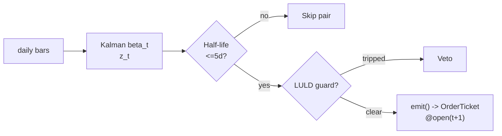

# T008 — Kalman Dynamic-Hedge Pairs

> **Reviewer card.** Adaptive equity pairs: the Kalman filter tracks a drifting hedge ratio (S044) that static OLS pairs miss; half-life (S061) screens for tradeable reversion speed; the LULD guard (S058) vetoes dislocated legs. Provenance **[P]**.
>
> Edge verdict: **AFTER-COST-EDGE** — Do & Faff: declining trend confirmed (top-20 pairs 0.86%/mo 1962–1988 to 0.24%/mo 2003–2009) [documented]; the Kalman adaptivity is the claimed upgrade over static hedges [documented].
>
> After-cost: **FULL-COST** — one-sentence verdict: Do & Faff confirm a declining profitability trend for simple pairs [documented] — this module must re-earn any edge with the adaptive hedge or justify the extra machinery.
>
> Tier **S** · prototype 40–60 h [example] · loaded cost $6,000–9,000 [example] · latency bar / daily + 1-min LULD tape · risk medium (adaptive hedge, beta-miss tail).

> Capacity $5–50M/day notional [example] — daily bars, `50–150` pairs [example], one rebalance per day; adaptive hedges are per-pair · Executability: Feasible: daily-bar Kalman recursion per pair; standard retail platform.

## §1  Identity & provenance

This module is a **strategy**: it emits `OrderTicket` intentions only — brokers create orders, strategies never do. Family **E  # pairs / statistical arbitrage**, batch **TB2**, provenance **P**.

**Lede.** Adaptive equity pairs: the Kalman filter tracks a drifting hedge ratio (S044) that static OLS pairs miss; half-life (S061) screens for tradeable reversion speed; the LULD guard (S058) vetoes dislocated legs. Provenance **[P]**.

**When it dies.** Q/R miscalibration (filter chases noise); correlation regime break; crowding.

**Regime gates (provisional).** R001 elevated RV degrades; halted legs excluded.

**Prototype scope.** Kalman recursion + z + half-life + LULD guard + kill-switch.

## §1.5  Escalation gate

Cheapest viable path: **Polygon.io Stocks Basic** — daily OHLCV bars, 1-min limit-up/limit-down tape at ~$100–200/mo [unverified]. build — Kalman recursion is standard; buy nothing but the data.

Resource budget: `1` core, `<2` GB RAM [internal-est] [internal-est] · compute pattern `per_bar`.

Explicitly out of scope (phase two): state-space spread models (Elliott); intraday Kalman (phase `2`).

Escalation gate: intraday trading windows; universe beyond US equities [default] — crossing it requires re-review of §T7 and §T8.

## §T0  Contract — strategies emit intentions, brokers create orders

This strategy's sole output is a list of `OrderTicket` intentions. It never places, routes, or confirms an order. Every ticket carries `parent_signal` (the upstream signal id and its `computed_at`), an `intent_ts`, and a `tif`. The backtest harness fills tickets strictly after the signal bar (`fill_event > signal_event`, t->t+1 causality); any fill timestamped at or before its signal bar is a harness bug and trips the kill switch.

State variables carried between bars: ``beta`, `P_cov`, `mu`, `sigma`, `half_life`, `position`, `module_state``.

## §T1  Strategy thesis & edge

**Thesis.** Adaptive equity pairs: the Kalman filter tracks a drifting hedge ratio (S044) that static OLS pairs miss; half-life (S061) screens for tradeable reversion speed; the LULD guard (S058) vetoes dislocated legs. Provenance **[P]**.

**Edge verdict: AFTER-COST-EDGE** — Do & Faff: declining trend confirmed (top-20 pairs 0.86%/mo 1962–1988 to 0.24%/mo 2003–2009) [documented]; the Kalman adaptivity is the claimed upgrade over static hedges [documented].

**After-cost verdict: FULL-COST** — one-sentence verdict: Do & Faff confirm a declining profitability trend for simple pairs [documented] — this module must re-earn any edge with the adaptive hedge or justify the extra machinery.

**Risk summary.** Filter over-tracking (Q/R misset — hedge chases noise); beta drift between recalibrations; leg dislocation.

**Math.**

```text
State-space `ln P_A = β_t·ln P_B + e_t`; Kalman recursion with
process noise `Q` and observation noise `R` (Kalman 1960 [documented]) updates
`β_t` adaptively. Spread `s_t = ln P_A − β_t·ln P_B`; z-score on rolling
`60`-day residual window [example]. Half-life from AR(1) of `s_t` (S061).
Modeled edge `edge_bps = |z_t| × 20.0` [example].
```

**Pseudocode (normative).**

```text
function emit(state, signals, bars, cfg) -> list[OrderTicket]:
    assert bars non-empty else return UNKNOWN                       # F1
    t = bars[-1]   # newest daily bar, labeled by open time
    z  = signals['S044'].z
    hl = signals['S061'].half_life
    assert isfinite(z) and isfinite(hl) else return UNKNOWN         # F2
    if hl > cfg.half_life_max_days: return []                      # gate
    if luld_touched(state, 60): return []                          # C12 veto
    update_kalman(state, t)   # causal: uses only bars up to t

    edge_bps = abs(z) * 20.0                                       # [example]
    cost_ok = expected_cost_bps(notional, adv_pct, venue, side, urgency) <= cfg.cost_gate_k * edge_bps
    # ^^^ normative cost-gate predicate: expected_cost_bps(...) <= k * edge_bps

    tickets = []
    if state.position == 0 and cost_ok:
        if z <= -cfg.z_entry: tickets = legs('BUY','SELL', t, parent=f"S044@{t.bar_open_ts}")
        elif z >= cfg.z_entry: tickets = legs('SELL','BUY', t, parent=f"S044@{t.bar_open_ts}")
    else:
        if abs(z) <= cfg.z_exit or abs(z) >= cfg.stop_z: tickets = flatten_all(state)
    for tk in tickets: log_decision(tk, inputs_hash, params_hash)  # C5 / App. g
    assert fill.event_ts > t.bar_close_ts for any fill             # t->t+1 causality
    return tickets
```

## §T2  Signal stack — dependencies & data rights

| Signal | Role | Contract |
|---|---|---|
| `S044` | trigger | |z_t| >= 2.0 [example] on the Kalman residual; adaptive hedge |
| `S061` | confirm | spread half-life ≤ 5 sessions [example]; adaptive hedge must revert fast enough to be tradeable |
| `S058` | veto | no entry if any leg hit the 1-min LULD band in the last 60 min [example] |

Max dependency depth: `2` [default].

**Schema mapping (canonical).**

| Vendor (Polygon.io Stocks) | Canonical |
|---|---|
| `t` (ms) | `bar_open_ts` (int64 ns UTC; bar labeled by open time) |
| `o, h, l, c` | `open, high, low, close` |
| `v` | `volume` |

Staleness: max skew `5 s` [default] · jitter budget `30 s` [default] · TTL `120 s` [default] · cadence `per_bar (daily close + 1-min guard)` · tz `America/New_York`.

**Inputs that break the module.**

| Input failure | Module state | Alert |
|---|---|---|
| Half-life > 5 days (gate) [example] | `DEGRADED` (skip pair) | log |
| Leg hit LULD band in last 60 min [example] | `UNKNOWN` (veto new entries) | notify |
| Filter covariance P explodes | `DEGRADED` (skip pair) | page |

**Data rights.** US equities daily bars via Polygon.io Stocks, `rights: licensed`;
research + production; fixtures synthetic; entitlement = professional/internal;
derived features ours. Entitlement-class change → §1.5 escalation gate.

**Build vs buy.** Build — Kalman recursion is standard statistical tooling; buy
nothing but the data. Q/R calibration is the IP.

**Local build.** Feasible. Kalman recursion is O(1) per pair per day; `8` pairs [example]
[example] need only the LULD tape live.

**Data dictionary (canonical fields).**

| Field | Type | Cadence | Tier | Notes |
|---|---|---|---|---|
| `Daily OHLCV bars (universe)` | float/int | daily | Tier 1 | split/dividend-adjusted |
| `1-min LULD tape` | float | 1-min | Tier 2 | S058 dislocation guard |
| `250-day formation windows` | float | daily | Tier 1 | Q/R calibration |

## §T3  Entry / exit / sizing & worked example

**Entry rule.**

```text
ENTER_SPREAD := (z_t <= -z_entry → long spread) OR (z_t >= +z_entry → short spread)
               AND (no leg LULD in last 60 min) AND (expected_cost_bps(...) <= cost_gate_k * edge_bps)
FLAT := otherwise
```

**Exit rule.**

```text
EXIT := (|z_t| <= z_exit) [mean-reversion] OR (|z_t| >= stop_z) [stop]
        OR (half_life re-estimate > 5 days → unwind) OR (module_state != OK)
```

**Cooldown.** `0` s [default] after every exit (C10).

**Sizing function (normative).**

```python
def shares(risk_budget_R, stop_distance, vol_estimate, ADV_cap, cost):
    # risk_budget_R in $; stop_distance = spread stop in bps of spread PV01
    n = risk_budget_R / max(stop_distance, 1e-9)   # [default] floor below
    n = min(n, ADV_cap * 0.01)                    # 1% of the smaller leg's ADV [default]
    n = min(n * 50.0, 10000000.0) / 50.0         # $10M gross cap [default]
    return int(n)
```

**Risk limits.**

| Limit | Value |
|---|---|
| Daily loss stop | `-$5,000` [example] → dark for the day |
| Max concurrent pairs | `8` [example] |
| Leg-dislocation guard | LULD band touch in `60` min [example] → veto |
| Half-life re-check | > `5` days [example] → unwind |

**Worked example (fixture-backed, from `fixtures/T008_tape.csv` trade 1).**

Trade 1: `BUY` `600` shares [example] @ `50.15` [example], exit `50.85` [example] (`z reverts to 0`). Gross P&L = `420.00` [measured] dollars. Cost stack = `11.0` bps [example] → `33.10` [measured] dollars on `30090.00` [example] notional. Net = `386.90` [measured] dollars. The fixture's expected CSV carries the same arithmetic for all six trades; the per-module test recomputes it from the tape and asserts equality.

**Flow.**


## §T4  Parameters

| Parameter | Key | Default | Provenance | Sensitivity |
|---|---|---|---|---|
| Entry z | `z_entry` | `2.0` | [default] | high |
| Exit z | `z_exit` | `0.0` | [default] | medium |
| Half-life max | `half_life_max_days` | `5` days | [default] | high |
| Stop z | `stop_z` | `4.0` | [default] | high |
| Process noise Q | `Q` | `1e-5` | [default] | high |
| Observation noise R | `R` | `1e-4` | [default] | high |
| Cost-gate k | `cost_gate_k` | `0.5` | [default] | high |

## §T5  Costs — the callable is the single source of truth

| Component | bps | Basis |
|---|---|---|
| Spread | `4.0` | [example] 1¢ assumed spread on each leg at $50: half-spread per aggressive leg × 2 legs |
| Fees | `2.0` | [example] $0.005/share each way per leg at $50 = 1 bps/leg |
| Borrow | `3.0` | [example] short-leg borrow, hard-to-borrow names excluded |
| Impact | `2.0` | [example] two-leg aggregation |
| **Total** | `11.0` | [example] reference stack, per pair per round-trip |

Fee schedule as of `2026-09-01` [example] · venue `XNAS / SIP daily bars [example]` · side `taker` · borrow `0.1` bps/day [example] — [example] short-leg borrow on the spread; excludes hard-to-borrow names.

```python
def expected_cost_bps(notional, adv_pct, venue, side, urgency) -> float:
    """Callable cost model - T008 COST block (single source of truth)."""
    spread_bps = 4.0    # [example] 1c assumed spread per leg @ $50: half/aggressive x 2
    fee_bps = 2.0       # [example] $0.005/share each way per leg @ $50 = 1 bps/leg
    borrow_bps = 3.0    # [example] short-leg borrow; hard-to-borrow excluded
    impact_bps = 2.0    # [example] two-leg aggregation
    return spread_bps + fee_bps + borrow_bps + impact_bps
```

**Normative cost-gate predicate (C3):** `expected_cost_bps(...) <= k * edge_bps` — no ticket is emitted unless the callable cost clears this gate. The predicate appears verbatim in the §T1 pseudocode and is asserted by the per-module test.

## §T6  Execution assumptions

| Aspect | Assumption |
|---|---|
| Latency | daily close; fill at next-day open |
| Partial fills | oldest `intent_ts` first (FIFO) |
| Impact | `2` bps modeled [example] |
| Adverse fill | adaptive-hedge lag — beta misses on fast breaks; the stop is the control |

## §T7  Risk contract & kill switch

Per-trade R: `$1,000` [example] per pair per trade · daily loss stop: `- $5,000` [example] then dark for the day · max gross: `$10M` notional [example] · max adverse per trade: `2.0`x target spread move [default].

Enforcement: `intraday-hard` [default]. Calibration recipe: Q/R on `250`-day formation [default]; residual z on rolling `60`-day [example]; re-pin fee schedule monthly [default].

**Kill switch: `ARMED` → `TRIPPED` → `RECOVERY` → `ARMED`.**

Trip conditions:

- leg halted
- filter covariance P explodes [example]
- clock skew > 50 ms [example]
- 8 concurrent pairs reached [example]

On trip: the module stops emitting tickets immediately, flattens managed positions per the exit rule, and pages. `RECOVERY` requires manual review, cooldown expiry, and healthy feeds; only then does the module return to `ARMED`. The per-module test drives the full transition cycle.

**Ops.** Schedule: Daily close: update Kalman state, evaluate z, fill at next-day open; flat by `16:00` daily · budget: `1` vCPU, `2` GB RAM [internal-est] [internal-est] · env: `POLYGON_API_KEY`.

**Universe.** US equities, price > `$10`, ADV > `1`M shares [example]. Formation:
`250`-day window, Kalman beta with rolling residual z, half-life ≤ `5` days [default]
[example], distance bottom `30` of candidates [example]. RTH. Exclude pairs
with a leg on earnings-day or halts.

## §T8  Compliance (C1–C10+)

- **C1** | No orders: the strategy emits `OrderTicket` intentions only; the broker creates orders.
- **C2** | Kill switch: `ARMED` → `TRIPPED` → `RECOVERY` → `ARMED` on the trip conditions in §T7.
- **C3** | Cost gate: `expected_cost_bps(...) <= k * edge_bps` before any ticket (see §T5).
- **C4** | Causality: `fill_event > signal_event` (t->t+1); no signal-bar fills, ever.
- **C5** | Decision log: every ticket logged with inputs hash and params hash (see App. g).
- **C6** | Staleness: inputs older than the TTL → `UNKNOWN`, no tickets.
- **C7** | Short discipline: `locate_ok` required before any short ticket.
- **C8** | Cooldown: post-exit cooldown enforced in seconds; no re-entry inside it.
- **C9** | Session flatten: no uncommanded overnight carry.
- **C10** | Position caps: per-trade R, daily loss stop, and max gross enforced.
- **C11 | Half-life screen: trigger = re-estimated half-life > `5` days [example] → check = S061 → action = unwind pair → log = `COMPLIANCE_BLOCK`**
- **C12 | Filter health: trigger = covariance P exploding [example] → check = P < P_max → action = skip pair → log = `GATE_VETO`**

## §T9  Evidence, failures & regime gates

**Evidence (cost-level tokens; every statistic tagged).**

| Source | Sample | Finding | Cost level | Caveat |
|---|---|---|---|---|
| Do & Faff (2010) [documented] | US, `1962`–`2009`, GGR distance pairs [documented] | declining trend confirmed; top-20 pairs mean excess return `0.86`%/mo (`1962`–`1988`) to `0.24`%/mo (`2003`–`2009`) [documented] | before/after-cost as treated in the paper | static rule — the baseline the Kalman upgrade must beat |
| Elliott, van der Hoek & Malcolm (2005) [documented] | (methodological) | pairs trading in a continuous-time state-space framework; mean-reverting spread [documented] | `BEFORE-COST` (model) | methodology, not P&L |

**Where this module is known to fail.** Q/R miscalibration, correlation regime breaks, crowding, leg dislocations.

**Failure modes (detect → action → recovery).**

| # | Failure | Detect → action → recovery | Executable check |
|---|---|---|---|
| 1 | Filter over-tracking (Q too large) | detect: beta variance vs residual variance → action: re-pin Q/R → recovery: recalibrated [default] | `beta_var <= k * resid_var` |
| 2 | Cointegration breaks | detect: half-life > `5` days → action: unwind (C11) → recovery: re-formation [default] | `hl <= 5` |
| 3 | Leg dislocation | detect: LULD guard → action: veto → recovery: leg normalizes [default] | `no leg halted` |
| 4 | Cost blowup | detect: cost gate failing → action: unwind → recovery: borrow normal [default] | `expected_cost_bps(...) <= k * edge_bps` |
| 5 | Lookahead in formation | detect: entry uses future → action: halt, fix → recovery: no-signal-bar-fills test [default] | `all(fill_ts > signal_ts)` |

**Regime gates.**

| Regime | Effect | Mechanism | Condition | Action | Latency | Fallback |
|---|---|---|---|---|---|---|
| R001 | degrades | elevated RV: adaptive hedge lags | rv_pctile > 70 [default] | halve | 1 bar [default] | veto |
| R001 | inverts | extreme RV | rv_pctile > 95 [default] | pause_entry | 1 bar [default] | veto |
| R-halt | inverts | leg halted | any leg halted [default] | veto | 0 [default] | veto |

**Robustness.** Q/R misset is the failure mode: Q too large → hedge chases noise
(z never fires); Q too small → beta stale. `z_entry` in `1.5`–`2.5` [example];
half-life `≤5` days [example] keeps the adaptive hedge tradeable. Purged/
embargoed OOS per S088.

**What the optimistic case assumes (and we do not).** (1) Q/R assumed well-calibrated — the filter's only edge and its
only failure; (2) beta assumed to drift slowly enough for the filter; (3)
borrow `3` bps [example] — hard names excluded.

## §T10  Unverified leads & what would change our mind

- Do & Faff (2010) ~`8.5`%/yr after costs — not confirmed against the paper's abstract/figures; re-verify before citing.

What would change our mind: a purged/embargoed walk-forward with full costs that survives the S088 honesty protocol; a documented after-cost P&L from the cited authors' own implementations; or a regime-gated replication that holds outside the original sample.

## AI build prompt

```text
Build the T008 (Kalman Dynamic-Hedge Pairs) strategy module from this specification.
Hard constraints:
- The strategy emits OrderTicket intentions ONLY; it never creates orders (C1).
- Causality: fill_event > signal_event (t->t+1); no signal-bar fills (C4).
- Cost gate: expected_cost_bps(...) <= k * edge_bps before any ticket (C3).
- Kill switch ARMED -> TRIPPED -> RECOVERY -> ARMED on the §T7 trip conditions (C2).
- Every numeric literal in prose carries an honesty tag [documented]/[measured]/[example]/[unverified]/[default]/[internal-est]; exempt identifiers only.
- Sources must be real and cited with cost-level tokens; chatbot-only material goes to §T10.
Config surface:
- z_entry (float): default 2.0, range 1.0–3.0 [default]
- z_exit (float): default 0.0, range -0.5–1.0 [default]
- half_life_max_days (float): default 5.0, range 2–15 [default]
- stop_z (float): default 4.0, range 2.5–6.0 [default]
- Q (float): default 1e-5, range 1e-7–1e-3 [default]
- R (float): default 1e-4, range 1e-6–1e-2 [default]
- cooldown_s (float): default 0.0, range 0–3,600 [default]
- cost_gate_k (float): default 0.5, range 0.1–2.0 [default]
Entry rule:
ENTER_SPREAD := (z_t <= -z_entry → long spread) OR (z_t >= +z_entry → short spread)
               AND (no leg LULD in last 60 min) AND (expected_cost_bps(...) <= cost_gate_k * edge_bps)
FLAT := otherwise
Exit rule:
EXIT := (|z_t| <= z_exit) [mean-reversion] OR (|z_t| >= stop_z) [stop]
        OR (half_life re-estimate > 5 days → unwind) OR (module_state != OK)
Sizing: implement the §T3 sizing_fn verbatim; enforce the §T7 risk contract.
Deliverables: the module markdown (all sections §1–§T10), the fixture tape CSV
(fixtures/T008_tape.csv), the expected CSV (fixtures/T008_expected.csv), and
the per-module test (modules/tests/test_T008.py) covering fixture arithmetic,
causality, the cost gate, the kill-switch cycle, invalid→UNKNOWN, and the callable signature.
```
