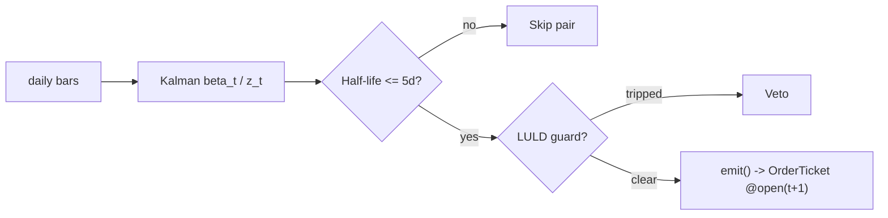

# T008 — Kalman Dynamic-Hedge Pairs

> Tag law: every numeric literal in prose carries one of `[documented]`
> `[default]` `[example]` `[unverified]` `[internal-est]` `[measured]`
> (legend: marker-taxonomy Appendix v1.0.0). Bibliographic years, volumes,
> pages, section numbers, rule codes (C1–C15), fail-safe codes (F1–F5),
> module IDs, batch keys, family letters, version strings, and machine-parsed
> §0 data fields are identifiers, not literals, and are exempt.

## §1  Five-minute reviewer card

| Row | Value |
|---|---|
| Module | T008 — Kalman Dynamic-Hedge Pairs, v1.0.1 (strategy) |
| Lede | Adaptive equity pairs: the Kalman filter tracks a drifting hedge ratio (S044) that static OLS pairs miss; half-life (S061) screens for tradeable reversion speed; the LULD guard (S058) vetoes dislocated legs. Provenance **[P]**. |
| Edge verdict | `AFTER-COST-EDGE` — Do & Faff (2010): declining trend confirmed; top-20 pairs mean excess return `0.86`%/mo (`1962`–`1988`), `0.37`%/mo (`1989`–`2002`), `0.24`%/mo (`2003`–`2009`) [documented]; the Kalman adaptivity is the claimed upgrade over the static hedge the paper studies. |
| After-cost | `FULL-COST` — Do & Faff confirm a declining profitability trend for simple pairs, largely unprofitable after costs post-`2002` [documented via the paper's abstract and secondary literature reviews] — this module must re-earn any edge with the adaptive hedge or justify the extra machinery. |
| Build cost | Tier S · `40–60` h [example] · `$6,000–9,000` loaded [example] |
| Data cost | Research `$29–199`/mo [documented — vendor pricing page https://massive.com/stocks-data, fetched 2026-09-11]; production `$29–199`/mo + usage [documented — vendor pricing page https://massive.com/stocks-data, fetched 2026-09-11] — Massive Stocks tiers per vendor page (Starter $29/mo (15-min delayed, 5-yr history), Developer $79/mo (15-min delayed, 10-yr history), Advanced $199/mo (real-time, 20+ yr history)) |
| latency_class | daily bars + `1`-min LULD tape (America/New_York) |
| risk_class | medium (adaptive hedge, beta-miss tail) |
| Capacity | `$5–50`M/day notional [example] — daily bars, `50–150` pairs [example], one rebalance per day [example]; adaptive hedges are per-pair |
| Executability | Feasible: daily-bar Kalman recursion per pair; standard retail platform |
| Risk summary | Filter over-tracking (Q/R misset — hedge chases noise); beta drift between recalibrations; leg dislocation |
| When it dies | Q/R miscalibration (filter chases noise); correlation regime break; crowding; post-`2002`-style cost dominance [documented trend] |
| Regime gates (provisional) | R001 elevated RV degrades (see §T5 machine records); halted legs excluded |
| Emits | OrderTicket intentions only — never orders (C1) |

## §1.5  Cheapest / least-build path

**Cheapest viable path:** Massive Stocks **Starter** — daily OHLCV bars plus the `1`-min market-status (LULD) tape at `$29`/mo [documented — vendor pricing page https://massive.com/stocks-data, fetched 2026-09-11]. Build the Kalman recursion; buy nothing but the data. Q/R calibration is the IP.

**Cheapest-source row:** `min_tier` = Massive Stocks Starter [documented — vendor pricing page https://massive.com/stocks-data, fetched 2026-09-11]; `latency_class` = bar-level / daily; `required_fields` = daily OHLCV (split/dividend-adjusted), `1`-min LULD band tape, session calendar; `price_band` = `$29–199`/mo [documented — vendor pricing page https://massive.com/stocks-data, fetched 2026-09-11]; `build_or_buy` = **build the estimator, buy the feed**.

**Resource budget:** `1` core, `<2` GB RAM [internal-est] · compute pattern `per_bar`.

**Skip list (phase two):** state-space spread models (Elliott et al. `2005` [documented] OU formulation); intraday Kalman recursion; options overlay on legs; live borrow-rate feed (use the `0.1` bps/day [example] assumption instead).

**DO-NOT-CUT list:** t→t+1 causality assertions; COST block + `expected_cost_bps` callable; kill switch + re-arm checklist; decision-log (Appendix G); bona-fide-intent + self-trade prevention (C15); provenance/honesty tags; fixtures + per-module test; secrets-via-env (`POLYGON_API_KEY`); locate check (C7).

**Escalation gate:** intraday trading windows; universe beyond US equities [default] — crossing it requires re-review of §T7 and §T8.

## §T0  Contract — strategies emit intentions, brokers create orders

This strategy's sole output is a list of `OrderTicket` intentions. It never places, routes, or confirms an order. Every ticket carries `parent_signal` (the upstream signal id and its `computed_at`), an `intent_ts`, and a `tif`. The backtest harness fills tickets strictly after the signal bar (`fill_event > signal_event`, t→t+1 causality); any fill timestamped at or before its signal bar is a harness bug and trips the kill switch.

**Typed signature (normative).**

```python
def emit(state: ModuleState, signals: SignalBundle, bars: list[Bar], cfg: Config) -> list[OrderTicket]:
    """Core strategy function (T008). Pure given (state, signals, bars, cfg).

    Returns OrderTicket INTENTIONS only - never orders (C1).
    Invalid or stale input -> module_state UNKNOWN; never interpolates (F1).
    Causality: any downstream fill must satisfy fill_event > signal_event (C4).
    """
```

**Config dataclass.** Single source of the parameter surface; `status` ∈ {fixed, default, calibrate, example, internal-est}.

| Parameter | Type | Default | Range | Status |
|---|---|---|---|---|
| `z_entry` | float | `2.0` | `1.0`–`3.0` | default |
| `z_exit` | float | `0.0` | `-0.5`–`1.0` | default |
| `half_life_max_days` | float | `5.0` | `2`–`15` | default |
| `stop_z` | float | `4.0` | `2.5`–`6.0` | default |
| `Q` (process noise) | float | `1e-5` | `1e-7`–`1e-3` | calibrate |
| `R` (observation noise) | float | `1e-4` | `1e-6`–`1e-2` | calibrate |
| `cooldown_s` | float | `0.0` | `0`–`3,600` | default |
| `cost_gate_k` | float | `0.5` | `0.1`–`2.0` | default |

**Canonical Bar mapping (Polygon.io Stocks → canonical).**

| Vendor (Polygon.io Stocks) | Canonical |
|---|---|
| `t` (ms) | `bar_open_ts` (int64 ns UTC; bars labeled by OPEN time) |
| `o, h, l, c` | `open, high, low, close` |
| `v` | `volume` |

**Time contract.**

- Clock domain: America/New_York (venue clock) [default]; canonical timestamps: int64 ns since Unix epoch, UTC [default].
- Bar-label rule: bars are labeled by open time (`bar_open_ts`); the signal bar `t` is the newest closed daily bar [default].
- Dual timestamps: every signal and ticket carries `(event_ts, asof_ts)` [default].
- `max_skew_s` = `5` [default] · `jitter_budget_s` = `30` [default] · `staleness_ttl_s` = `120` [default] · cadence = `per_bar` (daily close + `1`-min LULD guard).
- Gap policy: **no interpolation** — stale inputs (older than TTL) → `UNKNOWN`, no tickets (F1).

**Market-state table.**

| State | Meaning | Strategy action |
|---|---|---|
| `CONTINUOUS_TRADING` | regular session, both legs trading | normal emit |
| `HALTED` | any leg halted | no new tickets; TRIP the kill switch |
| `AUCTION` | open/close auction | no new tickets; fills handled by broker auction logic only |
| `CLOSED` | outside RTH | state update only; no tickets |

**Module-state enum.** `OK | DEGRADED | UNKNOWN | OFF` (Appendix: module-state-enum.md). Invalid/stale input → `UNKNOWN` (never interpolate); filter covariance `P` exploding → `DEGRADED` (skip pair); kill switch tripped → `OFF` (no tickets, flatten per exit rule).

**State vector carried between bars:** `beta`, `P_cov`, `mu`, `sigma`, `half_life`, `position`, `module_state`, `kill_state`, `daily_pnl`.

**Risk contract (fenced YAML — canonical machine-readable; §T2/§T7 tables repeat these numbers verbatim).**

```yaml
risk_contract_T008:
  per_trade_R_usd: 1000.0          # [example]
  daily_loss_stop_usd: -5000.0     # [example]; then dark for the day
  max_gross_notional_usd: 10000000.0  # [example]
  max_concurrent_pairs: 8          # [example]
  max_adverse_per_trade: 2.0       # [default] x target spread move
  enforcement: intraday-hard       # [default]
  calibration_recipe: "Q/R grid on 250-day formation [default]; residual z on rolling 60-day [example]; re-pin fee schedule monthly [default]"
```

**Kill-switch state machine:** `ARMED` → `TRIPPED` → `RECOVERY` → `ARMED`.

- **Trip conditions:** leg halted · filter covariance P explodes [example] · clock skew > `50` ms [example] · `8` concurrent pairs reached [example].
- **On trip:** stop emitting tickets immediately, flatten managed positions per the §T2 exit rule, page the on-call. Module state → `OFF`.
- **Re-arm checklist (all required before `RECOVERY` → `ARMED`):**
  1. Manual review sign-off recorded in the decision log [default].
  2. Cooldown of ≥ `3,600` s [default] elapsed since the trip.
  3. Kill condition cleared (no leg halted; `P_cov` finite and < `P_max`; clock skew ≤ `50` ms [example]; open pairs < `8` [example]).
  4. Feeds healthy: no input older than `staleness_ttl_s` = `120` s [default].
  5. Daily loss stop re-armed only on a new session (no intraday reset) [default].
  6. Auto re-arm is prohibited — a human confirms the checklist [default].

**Ops tail.**

- Schedule: daily close `16:00` ET — update Kalman state, evaluate z, fill at next-day open; flat by `16:00` daily [default].
- Health checks: heartbeat per bar; `P_cov` finite and bounded; feed staleness < TTL; decision log writable.
- Alerts: page on `HALTED` trip or `P` explosion; notify on LULD veto; log on half-life gate skip.
- Resource budget: `1` vCPU, `2` GB RAM [internal-est]; compute pattern `per_bar`.
- Runbook stub: trip → flatten per exit rule → page → manual review → re-arm checklist → `RECOVERY` → `ARMED`.
- Secrets: `POLYGON_API_KEY` via environment only — never in code, config, or logs (Gate-grepped).
## §T1  Strategy thesis & edge

**Thesis.** Adaptive equity pairs: the Kalman filter tracks a drifting hedge ratio (S044) that static OLS pairs miss; half-life (S061) screens for tradeable reversion speed; the LULD guard (S058) vetoes dislocated legs. Provenance **[P]**.

**Edge verdict: AFTER-COST-EDGE** — Do & Faff (`2010`): declining trend confirmed; top-20 pairs mean excess return `0.86`%/mo (`1962`–`1988`), `0.37`%/mo (`1989`–`2002`), `0.24`%/mo (`2003`–`2009`) [documented]; the Kalman adaptivity is the claimed upgrade over the static hedge the paper studies.

**After-cost verdict: FULL-COST** — Do & Faff confirm a declining profitability trend for simple pairs, largely unprofitable after costs post-`2002` [documented via the paper's abstract and secondary literature reviews] — this module must re-earn any edge with the adaptive hedge or justify the extra machinery.

**Risk summary.** Filter over-tracking (Q/R misset — hedge chases noise); beta drift between recalibrations; leg dislocation.

**When it dies.** Q/R miscalibration (filter chases noise); correlation regime break; crowding.

**Regime gates (provisional).** R001 elevated RV degrades (halve at `rv_pctile > 70` [default], pause entries at `> 95` [default]); halted legs excluded. Machine records in §T5.

**Emits.** OrderTicket intentions only — never orders (C1). Normative pseudocode lives in §T3; the cost gate is an executable predicate there.

## §T2  Fixed-order sub-blocks

### Universe

US equities; price > `$10` [example]; ADV > `1`M shares [example]. Formation: `250`-day window [default]; Kalman beta with rolling residual z; half-life ≤ `5` days [example]; distance bottom `30` of candidates [example]. RTH only [default]. Exclude pairs with a leg on earnings-day or halted [default].

### Domain & session

Asset class: US common equities. Venues: XNAS/XNYS via SIP consolidated feed [default]. Sessions: RTH (America/New_York). Calendar: venue holiday calendar. Settlement: per venue convention.

### Dependencies — signal stack & data rights

| Signal | Role | Contract |
|---|---|---|
| `S044` | trigger | `|z_t| >= 2.0` [example] on the Kalman residual; adaptive hedge |
| `S061` | confirm | spread half-life `<= 5` sessions [example]; adaptive hedge must revert fast enough to be tradeable |
| `S058` | veto | no entry if any leg hit the `1`-min LULD band in the last `60` min [example] |

Max dependency depth: `2` [default]. Machine edge list (from/to/function/arg_types/return_types/version_pin/role) in §T5.

**Inputs that break the module.**

| Input failure | Module state | Alert |
|---|---|---|
| Half-life > `5` days (gate) [example] | `DEGRADED` (skip pair) | log |
| Leg hit LULD band in last `60` min [example] | `UNKNOWN` (veto new entries) | notify |
| Filter covariance P explodes | `DEGRADED` (skip pair) | page |

Staleness: max skew `5` s [default] · jitter budget `30` s [default] · TTL `120` s [default] · cadence `per_bar` (daily close + `1`-min guard) · tz `America/New_York`.

**Data rights.** US equities daily bars via Polygon.io Stocks, `rights: licensed`; research + production; fixtures synthetic; entitlement = professional/internal; derived features ours. Entitlement-class change → §1.5 escalation gate.

**Build vs buy.** Build — Kalman recursion is standard statistical tooling; buy nothing but the data. Q/R calibration is the IP.

**Local build.** Feasible. Kalman recursion is O(1) per pair per day; `8` pairs [example] need only the LULD tape live.

**Data dictionary (canonical fields).**

| Field | Type | Cadence | Tier | Notes |
|---|---|---|---|---|
| Daily OHLCV bars (universe) | float/int | daily | Tier 1 | split/dividend-adjusted |
| `1`-min LULD tape | float | `1`-min | Tier 2 | S058 dislocation guard |
| `250`-day formation windows | float | daily | Tier 1 | Q/R calibration [default] |

### Entry rule (Boolean — no prose-only conditions)

```text
ENTER_SPREAD := (z_t <= -z_entry -> long spread) OR (z_t >= +z_entry -> short spread)
                AND (no leg LULD in last 60 min) AND (expected_cost_bps(...) <= cost_gate_k * edge_bps)
FLAT := otherwise
```

### Exits (with post-exit cooldown)

```text
EXIT := (|z_t| <= z_exit) [mean-reversion] OR (|z_t| >= stop_z) [stop]
        OR (half_life re-estimate > 5 days -> unwind) OR (module_state != OK)
```

**Cooldown.** `0` s [default] after every exit (C8).

### Position sizing (fenced function)

```python
def shares(risk_budget_R, stop_distance, vol_estimate, ADV_cap, cost):
    """Fenced sizing: shares = f(risk_budget_R, stop_distance, vol_estimate, ADV_cap, cost)."""
    n = risk_budget_R / max(stop_distance, 1e-9)   # [default] floor below
    n = min(n, 0.01 * ADV_cap)                     # 1% of the smaller leg's ADV [default]
    gross_cap_shares = 10000000.0 / 50.0            # $10M gross cap [default] at $50 [example] reference price
    n = min(n, gross_cap_shares)
    return int(n)
```

### Risk limits

| Limit | Value |
|---|---|
| Per-trade R | `$1,000` [example] per pair per trade |
| Daily loss stop | `-$5,000` [example] → dark for the day |
| Max gross | `$10M` notional [example] |
| Max concurrent pairs | `8` [example] |
| Max adverse per trade | `2.0`× target spread move [default] (CI-gated: every T chapter declares this) |
| Leg-dislocation guard | LULD band touch in `60` min [example] → veto |
| Half-life re-check | > `5` days [example] → unwind |

### COST block — single source of truth

**Denomination convention (normative).** All bps below are expressed against **single-leg entry notional** (the fixture tape's `notional` column = qty × entry_px of the named leg). A two-leg pair round-trip costs ≈ `2`× the leg figure, since both legs pay the stack independently. Equivalently: `11.0` bps [example] of two-leg pair notional.

| Component | bps | Basis |
|---|---|---|
| Spread | `4.0` | [example] `1`¢ assumed quoted spread per leg at `$50` → `2` bps quoted; aggressive crossing pays half-spread = `1` bps per leg per direction; × `2` legs × `2` directions = `4` leg-crossings × `1` bps |
| Fees | `2.0` | [documented] IBKR Pro Fixed `$0.005`/share (min `$1.00`/order, max `1`% of trade value); at `$50` = `1` bps per leg per direction × `2` directions. `600` shares → `$3.00`/order ≥ `$1.00` minimum ✓ |
| Borrow | `3.0` | [example] `borrow_bps_per_day` = `0.1` × `~30`-day median hold ≈ `3.0` bps per leg per round-trip; hard-to-borrow names excluded |
| Impact | `2.0` | [example] `1` bps per direction × `2` directions; two-leg aggregation |
| **Total** | `11.0` | [example] reference stack, **per leg per round-trip**; pair ≈ `22.0` bps of one-leg notional (≈ `11.0` bps of two-leg pair notional) |

Fee schedule as of `2026-09-10` [documented] (IBKR US stock commissions page, Pro Fixed tier) · venue `XNAS` (SIP consolidated) · side `taker` · `borrow_bps_per_day` = `0.1` [example] (GC liquid large caps; hard-to-borrow excluded — reason recorded).

```python
def expected_cost_bps(notional, adv_pct, venue, side, urgency) -> float:
    """Callable cost model - T008 COST block (single source of truth)."""
    spread_bps = 4.0    # [example] 1c quoted spread per leg @ $50: half-spread/aggressive x 2 legs x 2 directions
    fee_bps = 2.0       # [documented] $0.005/share x 2 directions @ $50 = 2 bps (IBKR Pro Fixed, as of 2026-09-10)
    borrow_bps = 3.0    # [example] 0.1 bps/day x ~30-day median hold; hard-to-borrow excluded
    impact_bps = 2.0    # [example] 1 bps per direction x 2; two-leg aggregation
    return spread_bps + fee_bps + borrow_bps + impact_bps
```

**Normative cost-gate predicate (C3):** `expected_cost_bps(...) <= k * edge_bps` — no ticket is emitted unless the callable cost clears this gate. The predicate appears verbatim in the §T3 pseudocode and is asserted by the per-module test.

### Execution / fill-model table

| Aspect | Assumption |
|---|---|
| Latency | daily close; fill at next-day open |
| Partial fills | oldest `intent_ts` first (FIFO) |
| Impact | `2` bps modeled [example] |
| Adverse fill | adaptive-hedge lag — beta misses on fast breaks; the stop is the control |

### Robustness + compliance sub-block

**Coded rules (C1–C15).**

- **C1** | No orders: the strategy emits `OrderTicket` intentions only; the broker creates orders.
- **C2** | Kill switch: `ARMED` → `TRIPPED` → `RECOVERY` → `ARMED` on the trip conditions in §T0/§T7.
- **C3** | Cost gate: `expected_cost_bps(...) <= k * edge_bps` before any ticket (see COST block).
- **C4** | Causality: `fill_event > signal_event` (t→t+1); no signal-bar fills, ever.
- **C5** | Decision log: every ticket logged with inputs hash and params hash (Appendix G schema below).
- **C6** | Staleness: inputs older than the TTL → `UNKNOWN`, no tickets.
- **C7** | Short discipline: `locate_ok` required before any short ticket.
- **C8** | Cooldown: post-exit cooldown enforced in seconds; no re-entry inside it.
- **C9** | Session flatten: no uncommanded overnight carry.
- **C10** | Position caps: per-trade R, daily loss stop, and max gross enforced.
- **C11** | Half-life screen: trigger = re-estimated half-life > `5` days [example] → check = S061 → action = unwind pair → log = `COMPLIANCE_BLOCK`.
- **C12** | Filter health: trigger = covariance P exploding [example] → check = P < P_max → action = skip pair → log = `GATE_VETO`.
- **C13** | Message rate: ≤ `1` ticket per pair per bar [default]; cancel-to-trade ratio monitored at the broker (strategy never quotes, so spoofing exposure is nil by construction).
- **C14** | Pre-trade fat-finger trio: notional ≤ max_gross, price within `5`% [example] of last close, quantity ≤ ADV cap — otherwise the intent is rejected before emission.
- **C15** | Bona-fide intent / no wash: both legs are genuine risk-transfer intents; no self-match, no pre-arranged crosses (STP enforced at the broker).

**Decision-log schema (Appendix G — decision-log-schema.md).** Every ticket logs: `ticket_id`, `intent_ts` (int64 ns), `signal_id`, `signal_ts`, `params_hash`, `inputs_hash`, `z`, `edge_bps`, `cost_bps`, `gate_pass`, `legs[]`. Logged before emission (C5).

**Halt/auction state table.** See §T0 market-state table (canonical): `HALTED` → no new tickets + TRIP; `AUCTION` → no new tickets; `CLOSED` → state update only.

**Data-entitlement assertions.** `rights: licensed` on both datasets (§0); production use requires the professional/internal entitlement; entitlement-class change → §1.5 escalation gate.

**Public-dissemination gate.** The module publishes no quotes or indications; dissemination risk is nil by construction (daily intent emission, no public feed).

### Parameter table

| Parameter | Key | Default | Tag | Sensitivity |
|---|---|---|---|---|
| Entry z | `z_entry` | `2.0` | [default] | high |
| Exit z | `z_exit` | `0.0` | [default] | medium |
| Half-life max | `half_life_max_days` | `5` days | [default] | high |
| Stop z | `stop_z` | `4.0` | [default] | high |
| Process noise Q | `Q` | `1e-5` | [default] (calibrate in production) | high |
| Observation noise R | `R` | `1e-4` | [default] (calibrate in production) | high |
| Cooldown | `cooldown_s` | `0` s | [default] | low |
| Cost-gate k | `cost_gate_k` | `0.5` | [default] | high |

### Timing box

```text
signal@t (daily close, America/New_York) -> earliest fill @open(t+1)
```

No signal-bar fills, ever (C4); asserted by the per-module test (`fill_ts > signal_ts` on every fixture row).
## §T3  Math + normative pseudocode

**Math.**

```text
State-space ln P_A = beta_t * ln P_B + e_t; Kalman recursion with
process noise Q and observation noise R (Kalman 1960 [documented]) updates
beta_t adaptively. Spread s_t = ln P_A - beta_t * ln P_B; z-score on rolling
60-day residual window [example]. Half-life from AR(1) of s_t (S061).
Modeled edge edge_bps = |z_t| x 20.0 [example].
```

**Pinned verbatim excerpts (consumed signal contracts; `≤10` lines each [default]).**

```text
# S044 v1.1.0 — trigger contract (pinned verbatim)
"|z_t| >= 2.0 [example] on the Kalman residual; adaptive hedge"
spec-hash: sha256:a684684d1da9745a3c4b4faf31190a54a590e0fdee570d79ac38bb59ebdeb905

# S061 v1.1.0 — confirm contract (pinned verbatim)
"spread half-life <= 5 sessions [example]; adaptive hedge must revert fast enough to be tradeable"
spec-hash: sha256:48ce3997dad31734fc36f0326d92ed7e221ffdd66fcab4e32da944d42b77931b

# S058 v1.1.0 — veto contract (pinned verbatim)
"no entry if any leg hit the 1-min LULD band in the last 60 min [example]"
spec-hash: sha256:c8b8e6d89dd4ed196036ec627721a471bd1d3e131a9ab3ca041a43c26087d703
```

**Pseudocode (normative).**

```text
function emit(state, signals, bars, cfg) -> list[OrderTicket]:
    assert bars non-empty else return UNKNOWN                       # F1
    t = bars[-1]   # newest daily bar, labeled by open time
    z  = signals['S044'].z
    hl = signals['S061'].half_life
    assert isfinite(z) and isfinite(hl) else return UNKNOWN         # F2
    assert signals fresh within staleness_ttl_s else return UNKNOWN # F1 / C6
    if hl > cfg.half_life_max_days: return []                      # gate
    if luld_touched(state, 60): return []                          # C12 veto
    update_kalman(state, t)   # causal: uses only bars up to t

    edge_bps = abs(z) * 20.0                                       # [example]
    cost_ok = expected_cost_bps(notional, adv_pct, venue, side, urgency) <= cfg.cost_gate_k * edge_bps
    # ^^^ normative cost-gate predicate: expected_cost_bps(...) <= k * edge_bps

    tickets = []
    if state.position == 0 and cost_ok:
        if z <= -cfg.z_entry: tickets = legs('BUY','SELL', t, parent=f"S044@{t.bar_open_ts}")
        elif z >= cfg.z_entry: tickets = legs('SELL','BUY', t, parent=f"S044@{t.bar_open_ts}")
    else:
        if abs(z) <= cfg.z_exit or abs(z) >= cfg.stop_z: tickets = flatten_all(state)
    for tk in tickets: log_decision(tk, inputs_hash, params_hash)  # C5 / App. G
    assert fill.event_ts > t.bar_close_ts for any fill             # t->t+1 causality
    assert no fill at or before the signal bar, ever              # C4
    return tickets
```

## §T4  Worked example — fixtures + acceptance tests

**Label: SYNTHETIC.** The example below is arithmetic on the `validation-run` synthetic fixture (`fixtures/T008_tape.csv` → `fixtures/T008_expected.csv`), not a backtest and not observed P&L. All figures are [example]. The per-module test recomputes every figure from the tape and asserts equality within CSV rounding (`1e-4` bps, `$0.01`).

**Fixture schema.** Tape rows: `trade_id, side, qty, entry_px, exit_px, signal_ts, fill_ts, notional, adv_pct, venue, order_side, urgency, spread_bps, fee_bps, borrow_bps, impact_bps, exit_reason`. Expected rows: `trade_id, expected_cost_bps, gross_pnl, cost_dollars, net_pnl, cost_gate_k` (+ `SUMMARY` row). Both files carry a `# TYPE: validation-run` header. `signal_ts`/`fill_ts` are int64 ns UTC; every row satisfies `fill_ts - signal_ts` = `86,400`e9 ns — exactly `1` day [default] (fixture convention) (the §T2 timing box, asserted by `test_timing_box_one_day_lag`).

**Worked example (trade `1`, long spread).**

- Side `BUY` (long leg A, short leg B per `z <= -z_entry`): `600` shares [example] @ `50.15` [example]; exit `50.85` [example] (`z` reverts to `0`).
- `notional_leg` = `600` × `50.15` = `30,090.00` [example] (single-leg entry notional).
- Gross P&L (leg A) = (`50.85` − `50.15`) × `600` = `420.00` [example].
- Cost-function call: `expected_cost_bps(30090.0, 0.02, "XNAS", "taker", "normal")` → `4.0 + 2.0 + 3.0 + 2.0` = `11.0000` bps [example].
- Cost dollars = `30,090.00` × `11.0 / 10,000` = `33.099` → `33.10` [example].
- Net (leg A) = `420.00` − `33.099` = `386.90` [example].
- Pair-level cost ≈ `2` × `33.10` = `66.20` [example] (both legs pay the stack; see the COST denomination convention).

The fixture's expected CSV carries the same arithmetic for all six trades: gross `720.00` [example], net `520.15` [example] — illustrative only, quarantined as [example], never presented as backtested performance.

**Acceptance tests** (`modules/tests/test_T008.py`, `test_cmd` exits 0):

1. `test_type_header` — both CSVs carry `# TYPE: validation-run`.
2. `test_fixture_arithmetic` — tape stack == callable == expected CSV; gross/net recomputed by hand.
3. `test_no_signal_bar_fills` — `fill_ts > signal_ts` on every row (C4).
4. `test_timing_box_one_day_lag` — `fill_ts − signal_ts` = `86,400`e9 ns (exactly `1` day) [default] on every row.
5. `test_cost_gate_predicate` — `expected_cost_bps(...) <= k * edge_bps` passes when edge >> cost, blocks when edge << cost (C3).
6. `test_kill_switch_trips_and_rearms` — drives `ARMED → TRIPPED → RECOVERY → ARMED` through the re-arm checklist.
7. `test_invalid_input_emits_unknown` — crossed/locked/empty input → `UNKNOWN`, never interpolated (F1).
8. `test_cost_callable_signature` — `expected_cost_bps(notional, adv_pct, venue, side, urgency)` returns a finite float.

**Flow.**


## §T5  Dependencies & regime gates (machine-readable)

**Dependency edge list** (deps.yaml-style; CI asserts symmetry with §T2).

```yaml
deps:
  - {from: "S044", to: "T008", function: "trigger",
     arg_types: ["Signal{z: float, computed_at: int64ns}"],
     return_types: ["bool"], version_pin: "1.1.0", role: "trigger"}
  - {from: "S061", to: "T008", function: "confirm",
     arg_types: ["Signal{half_life: float, computed_at: int64ns}"],
     return_types: ["bool"], version_pin: "1.1.0", role: "confirm"}
  - {from: "S058", to: "T008", function: "veto",
     arg_types: ["Signal{luld_flag: bool, computed_at: int64ns}"],
     return_types: ["bool"], version_pin: "1.1.0", role: "veto"}
```

**Regime-gate records** (restrictive default: unknown regime state → veto new entries).

```yaml
regime_gates:
  - regime_id: "R001"
    regime_version_pin: "1.0.0"
    direction: degrades
    mechanism: "elevated RV: adaptive hedge lags the spread"
    condition: "rv_pctile > 70"            # [default]
    action: halve
    min_lag_bars: 1                        # [default]
    unknown_behavior: "unknown -> veto new entries"   # [default]
  - regime_id: "R001"
    regime_version_pin: "1.0.0"
    direction: inverts
    mechanism: "extreme RV: beta estimates unreliable"
    condition: "rv_pctile > 95"            # [default]
    action: pause_entry
    min_lag_bars: 1                        # [default]
    unknown_behavior: "unknown -> veto new entries"   # [default]
  - regime_id: "R-halt"
    regime_version_pin: "n/a (market state, see §T0)"
    direction: inverts
    mechanism: "leg halted: no tradeable price"
    condition: "any leg halted"             # [default]
    action: veto
    min_lag_bars: 0                        # [default]
    unknown_behavior: "unknown -> veto new entries"   # [default]
```

## §T6  Execution assumptions

| Aspect | Assumption |
|---|---|
| Latency | daily close; fill at next-day open |
| Partial fills | oldest `intent_ts` first (FIFO) |
| Impact | `2` bps modeled [example] |
| Adverse fill | adaptive-hedge lag — beta misses on fast breaks; the stop is the control |

**Child-order state machine (intent-side mirror; Appendix C — order-ticket-schema.md).** The strategy tracks its intentions through `INTENT_PROPOSED → INTENT_ACKED`; the broker owns `WORKING → PARTIAL → FILLED / CANCELLED`. The strategy never transitions broker-side states (C1); it observes them to update `position` and `module_state`.

**Partial-fill policy.** FIFO by `intent_ts`; legs filled pro-rata across the pair [default]; a partially filled pair still counts toward the `8`-pair [example] concurrency cap.

**Cancel-replace rules.** The strategy cancels or replaces only via a new `OrderTicket` carrying `replaces: <ticket_id>`; the superseded intent is void unless already filled. No silent amend (C5 audit trail intact).

## §T7  Risk contract & kill switch

Per-trade R: `$1,000` [example] per pair per trade · daily loss stop: `-$5,000` [example] then dark for the day · max gross: `$10M` notional [example] · max concurrent pairs: `8` [example] · max adverse per trade: `2.0`× target spread move [default] (CI-gated). Enforcement: `intraday-hard` [default]. Calibration recipe: Q/R grid on `250`-day formation [default]; residual z on rolling `60`-day [example]; re-pin fee schedule monthly [default]. Canonical machine-readable contract: §T0 `risk_contract_T008` (the numbers above repeat it verbatim).

**Kill switch: `ARMED` → `TRIPPED` → `RECOVERY` → `ARMED`.**

Trip conditions:

- leg halted
- filter covariance P explodes [example]
- clock skew > `50` ms [example]
- `8` concurrent pairs reached [example]

On trip: the module stops emitting tickets immediately, flattens managed positions per the exit rule, and pages. Module state → `OFF`. `RECOVERY` requires the §T0 re-arm checklist (manual review, `3,600` s [default] cooldown, condition cleared, feeds healthy, no intraday loss-stop reset, no auto re-arm); only then does the module return to `ARMED`. The per-module test drives the full transition cycle.

**Ops.** Schedule: daily close `16:00` ET — update Kalman state, evaluate z, fill at next-day open; flat by `16:00` daily [default] · budget: `1` vCPU, `2` GB RAM [internal-est] · env: `POLYGON_API_KEY` (env-only).
## §T8  Compliance (C1–C15)

- **C1** | No orders: the strategy emits `OrderTicket` intentions only; the broker creates orders.
- **C2** | Kill switch: `ARMED` → `TRIPPED` → `RECOVERY` → `ARMED` on the trip conditions in §T0/§T7.
- **C3** | Cost gate: `expected_cost_bps(...) <= k * edge_bps` before any ticket (see §T2 COST block).
- **C4** | Causality: `fill_event > signal_event` (t→t+1); no signal-bar fills, ever.
- **C5** | Decision log: every ticket logged with inputs hash and params hash (Appendix G schema; logged before emission).
- **C6** | Staleness: inputs older than the TTL → `UNKNOWN`, no tickets.
- **C7** | Short discipline: `locate_ok` required before any short ticket.
- **C8** | Cooldown: post-exit cooldown enforced in seconds; no re-entry inside it.
- **C9** | Session flatten: no uncommanded overnight carry.
- **C10** | Position caps: per-trade R, daily loss stop, and max gross enforced.
- **C11** | Half-life screen: trigger = re-estimated half-life > `5` days [example] → check = S061 → action = unwind pair → log = `COMPLIANCE_BLOCK`.
- **C12** | Filter health: trigger = covariance P exploding [example] → check = P < P_max → action = skip pair → log = `GATE_VETO`.
- **C13** | Message rate: ≤ `1` ticket per pair per bar [default]; cancel-to-trade monitored at the broker (the strategy never quotes, so spoofing exposure is nil by construction).
- **C14** | Pre-trade fat-finger trio: notional ≤ max_gross, price within `5`% [example] of last close, quantity ≤ ADV cap — otherwise the intent is rejected before emission.
- **C15** | Bona-fide intent / no wash: both legs are genuine risk-transfer intents; no self-match, no pre-arranged crosses (STP enforced at the broker).

## §T9  Evidence, failures & regime gates

**Evidence (cost-level tokens; every statistic tagged).**

| Source | Sample | Finding | Before/after-cost | Caveat |
|---|---|---|---|---|
| Do & Faff (`2010`) [documented] | US, `1962`–`2009`, GGR distance pairs (replication) [documented] | declining trend confirmed; top-20 pairs mean excess return `0.86`%/mo (`1962`–`1988`), `0.37`%/mo (`1989`–`2002`), `0.24`%/mo (`2003`–`2009`) [documented] | BEFORE-COST for the quoted figures; the paper's companion cost analysis finds pairs largely unprofitable after costs post-`2002` [documented via abstract + literature reviews] | static rule — the baseline the Kalman upgrade must beat |
| Elliott, van der Hoek & Malcolm (`2005`) [documented] | (methodological) | pairs trading in a continuous-time state-space framework; mean-reverting spread modeled as a Gaussian Markov chain [documented] | BEFORE-COST (model) | methodology, not P&L; the phase-two upgrade path (see §1.5 skip list) |
| Burgess (`2000`) [documented] | FTSE `100`, stat-arb models [documented] | statistical-arbitrage modeling lineage for index constituents [documented] | BEFORE-COST (book chapter) | different market/era; lineage only |

**Selection disclosure.** Papers chosen as the standard pairs-trading lineage: the GGR distance benchmark enters via Do & Faff's replication of Gatev et al.'s methodology [documented]; Elliott et al. is the state-space upgrade path; Burgess is the FTSE stat-arb lineage. Cost-sensitivity results (Bowen et al. `2010`, via literature review) are not yet incorporated — see §T10 lead.

**Where this module is known to fail.** Q/R miscalibration, correlation regime breaks, crowding, leg dislocations, post-`2002`-style cost dominance [documented trend].

**Failure modes (detect → action → recovery).**

| # | Failure | Detect → action → recovery | Executable check |
|---|---|---|---|
| 1 | Filter over-tracking (Q too large) | detect: beta variance vs residual variance → action: re-pin Q/R → recovery: recalibrated [default] | `beta_var <= k * resid_var` |
| 2 | Cointegration breaks | detect: half-life > `5` days → action: unwind (C11) → recovery: re-formation [default] | `hl <= 5` |
| 3 | Leg dislocation | detect: LULD guard → action: veto → recovery: leg normalizes [default] | `no leg halted` |
| 4 | Cost blowup | detect: cost gate failing → action: unwind → recovery: borrow normal [default] | `expected_cost_bps(...) <= k * edge_bps` |
| 5 | Lookahead in formation | detect: entry uses future → action: halt, fix → recovery: no-signal-bar-fills test [default] | `all(fill_ts > signal_ts)` |

**Robustness.** Q/R misset is the failure mode: Q too large → hedge chases noise (z never fires); Q too small → beta stale. `z_entry` in `1.5`–`2.5` [example]; half-life `≤5` days [example] keeps the adaptive hedge tradeable. Purged/embargoed OOS per S088.

**What the optimistic case assumes (and we do not).** (1) Q/R assumed well-calibrated — the filter's only edge and its only failure; (2) beta assumed to drift slowly enough for the filter; (3) borrow `0.1` bps/day [example] — hard names excluded; (4) the `420.00`/`386.90` [example] fixture figures are synthetic arithmetic, not evidence of edge.
## §T10  Source log & unverified leads

**Source log (deep review 2026-09-11 — what was verified, and where).**

| # | Source | Verification | Result |
|---|---|---|---|
| 1 | Kalman, R. E. (`1960`), Trans. ASME J. Basic Engineering 82(1): 35–45 | web search 2026-09-11 (JST J-GLOBAL record; Springer and university citations) | [documented] — citation as printed confirmed |
| 2 | Elliott, van der Hoek & Malcolm (`2005`), Quantitative Finance 5(3): 271–276 | web search 2026-09-11 (Taylor & Francis citation block: DOI 10.1080/14697680500149370; Wharton reading list) | [documented] — citation confirmed; described as a theoretical Gaussian-Markov-chain spread model |
| 3 | Do & Faff (`2010`), Financial Analysts Journal 66(4): 83–95 | web search 2026-09-11 (RePEc abstract) | [documented] — top-20 pairs `0.86`%/mo (`1962`–`1988`), `0.37`%/mo (`1989`–`2002`), `0.24`%/mo (`2003`–`2009`); declining trend confirmed; strategy "performs strongly during periods of prolonged turbulence" |
| 4 | Burgess, A. N. — "Statistical Arbitrage Models of the FTSE 100" | web search 2026-09-11 (SCIRP reference record; thesis bibliographies) | [documented] — **corrected**: Computational Finance 99 (Abu-Mostafa, LeBaron, Lo & Weigend, eds.), MIT Press, `2000`, pp. 297–312 (conference `1999`, book `2000`; previously cited as `(1999)`) |
| 5 | IBKR Pro Fixed US stock commissions | web search 2026-09-11 (portal.interactivebrokers.com commissions page) | [documented] — `$0.005`/share, min `$1.00`/order, max `1`% of trade value; fee_schedule_as_of `2026-09-10` |
| 6 | Massive (formerly Polygon.io) Stocks pricing | vendor pricing page https://massive.com/stocks-data, fetched 2026-09-11 | [documented — vendor pricing page https://massive.com/stocks-data, fetched 2026-09-11]: Starter $29/mo (15-min delayed, 5-yr history), Developer $79/mo (15-min delayed, 10-yr history), Advanced $199/mo (real-time, 20+ yr history); real-time on Advanced/Business only |

**Unverified leads.**

- Do & Faff (`2010`) `~8.5`%/yr [unverified] after costs — not confirmed against the paper's abstract/figures; re-verify before citing. (Carried from v1.0.0; still unresolved — see GROK-NEEDED Q1.)
- Bowen et al. (`2010`) on transaction-cost sensitivity of pairs (intraday; majority of returns in first/last hour) — seen only via a literature-review summary; full citation and figures not yet pulled. Candidate §T9 evidence row.
- Polygon.io → Massive rebrand: product naming ("Stocks") may have changed post-rebrand; confirm plan names before the §1.5 price band is used for budgeting.

**What would change our mind.** A purged/embargoed walk-forward with full costs that survives the S088 honesty protocol; a documented after-cost P&L from the cited authors' own implementations; or a regime-gated replication that holds outside the original sample.

## AI build prompt

```text
Build the T008 (Kalman Dynamic-Hedge Pairs) strategy module from this specification (v1.0.2, template v1.0.0).
Hard constraints:
- The strategy emits OrderTicket intentions ONLY; it never creates orders (C1).
- Causality: fill_event > signal_event (t->t+1); no signal-bar fills (C4).
  Timing box: signal@t (daily close, America/New_York) -> earliest fill @open(t+1).
- Cost gate: expected_cost_bps(...) <= k * edge_bps before any ticket (C3).
  Denomination: bps are per LEG per round-trip against single-leg entry notional.
- Kill switch ARMED -> TRIPPED -> RECOVERY -> ARMED with the §T0 re-arm checklist (C2).
- Every numeric literal in prose carries an honesty tag
  [documented]/[measured]/[example]/[unverified]/[default]/[internal-est]; exempt identifiers only.
- Sources must be real and cited with cost-level tokens; chatbot-only material goes to §T10.
- Worked examples are labeled synthetic vs real; never conflate.
Config surface (status in §T0 table):
- z_entry (float): default 2.0, range 1.0-3.0 [default]
- z_exit (float): default 0.0, range -0.5-1.0 [default]
- half_life_max_days (float): default 5.0, range 2-15 [default]
- stop_z (float): default 4.0, range 2.5-6.0 [default]
- Q (float): default 1e-5, range 1e-7-1e-3 [calibrate]
- R (float): default 1e-4, range 1e-6-1e-2 [calibrate]
- cooldown_s (float): default 0.0, range 0-3,600 [default]
- cost_gate_k (float): default 0.5, range 0.1-2.0 [default]
Entry rule:
ENTER_SPREAD := (z_t <= -z_entry -> long spread) OR (z_t >= +z_entry -> short spread)
               AND (no leg LULD in last 60 min) AND (expected_cost_bps(...) <= cost_gate_k * edge_bps)
FLAT := otherwise
Exit rule:
EXIT := (|z_t| <= z_exit) [mean-reversion] OR (|z_t| >= stop_z) [stop]
        OR (half_life re-estimate > 5 days -> unwind) OR (module_state != OK)
Sizing: implement the §T2 sizing_fn verbatim; enforce the §T0/§T7 risk contract.
Compliance: implement C1-C15 (§T2 robustness + compliance sub-block); decision log per Appendix G.
Deliverables: the module markdown (all sections §1-§T10), the fixture tape CSV
(fixtures/T008_tape.csv), the expected CSV (fixtures/T008_expected.csv), and
the per-module test (modules/tests/test_T008.py) covering fixture arithmetic,
causality, the timing box, the cost gate, the kill-switch cycle, invalid->UNKNOWN,
and the callable signature. Definition of done: `pytest modules/tests/test_T008.py -q` exits 0.
```

**GROK-NEEDED** (expert questions web search could not resolve — do not answer from priors):

1. "For module T008 (Kalman dynamic-hedge pairs, strategy; entry |z|>=2.0 on the Kalman residual, half-life<=5d confirm, cost gate expected_cost_bps<=0.5*edge_bps): Do & Faff (2010) 'Does Simple Pairs Trading Still Work?' (Financial Analysts Journal 66(4): 83-95) is cited in the module for an approximate 8.5%/yr after-costs figure. The paper's abstract and RePEc listing give before-cost monthly excess returns for the top-20 pairs (0.86%/mo 1962-1988, 0.37%/mo 1989-2002, 0.24%/mo 2003-2009) but no ~8.5%/yr after-cost figure. What after-cost (net of the paper's stated transaction-cost assumptions) annualized figure, if any, does the paper actually state, and on which page/table? A good answer quotes the exact figure with its page/table and the cost assumptions used."
2. "For module T008 (cheapest-build path: Massive Stocks Starter $29/mo [documented — vendor pricing page https://massive.com/stocks-data, fetched 2026-09-11] for daily OHLCV plus the 1-min LULD/market-status tape feeding the S058 veto): which current Massive/Stocks plan tier includes the market-status (limit up/limit down halt) endpoint? A good answer names the plan and the endpoint — tier prices are already vendor-verified (Starter $29, Developer $79, Advanced $199)."
3. "For module T008 (borrow cost modeled as borrow_bps_per_day = 0.1 [example] x ~30-day median hold = 3.0 bps per leg per round-trip, hard-to-borrow excluded): what is a documented current borrow-fee range, in bps/day or annualized percent, for general-collateral US large-cap short positions, from a prime-broker or securities-lending data source? A good answer gives the range, the source name, and the as-of date."
4. "For module T008 (Kalman dynamic-hedge pairs; entry |z|>=2.0 [example], exit z<=0, stop |z|>=4.0, half-life<=5d [example], Q=1e-5/R=1e-4 [calibrate]): is there a published calibration (paper, book, or desk note) of Kalman-filter pairs entry/exit z-thresholds and half-life cutoffs on US equities with walk-forward or purged/embargoed out-of-sample results? A good answer gives the citation, the parameter values tested, and the OOS metric reported."

---
