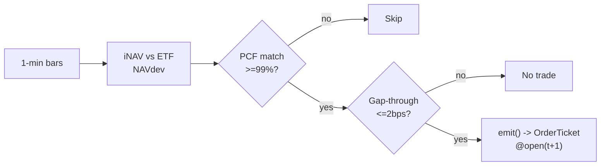

# T009 — ETF-vs-Basket Arbitrage

> **Reviewer card.** ETF–basket arbitrage: transient premiums/discounts to iNAV (S046) revert as APs create/redeem; PCF fidelity (S047) confirms the basket prices the ETF; microstructure impact (S014) gates the trade. Provenance **[D]**.
>
> Edge verdict: **NO-DOCUMENTED-EDGE** — no citable ETF-arbitrage P&L from a realistic implementable rule — the pricing literature (Petajisto) documents the mispricing, not a captured P&L [documented].
>
> After-cost: **BEFORE-COST** — one-sentence verdict: the mispricing is documented; the captured P&L is not — this is the honesty gap.
>
> Tier **S** · prototype 40–60 h [example] · loaded cost $6,000–9,000 [example] · latency bar / 1-min + creation/redemption pipeline · risk medium (multi-leg, creation-unit threshold).

> Capacity $5–50M/day notional [example] — creation units constrain; AP desk competes directly · Executability: Feasible: 1-min bar NAV-dev machine + basket pricing; any retail platform with corporate-action data.

## §1  Identity & provenance

This module is a **strategy**: it emits `OrderTicket` intentions only — brokers create orders, strategies never do. Family **E  # ETF arbitrage**, batch **TB2**, provenance **D**.

**Lede.** ETF–basket arbitrage: transient premiums/discounts to iNAV (S046) revert as APs create/redeem; PCF fidelity (S047) confirms the basket prices the ETF; microstructure impact (S014) gates the trade. Provenance **[D]**.

**When it dies.** AP desk latency; wide ETF spreads; corporate-action mismatch between PCF and reality.

**Regime gates (provisional).** R001 elevated RV amplifies (premia widen); index-rebalance days degrade.

**Prototype scope.** 1-min NAV-dev machine + PCF pricing + creation-unit sizing + kill-switch.

## §1.5  Escalation gate

Cheapest viable path: **Polygon.io Stocks Advanced** — 1-min bars, L1 quotes, corporate actions, PCF reference data at ~$200/mo + usage [unverified] [unverified]. build the NAV-dev machine on a cheap bar feed; the creation/redemption pipeline is a broker capability you buy.

Resource budget: `1` core, `<2` GB RAM [internal-est] [internal-est] · compute pattern `per_bar`.

Explicitly out of scope (phase two): leveraged/inverse ETFs; fixed-income ETFs (phase `2`).

Escalation gate: `50`+ ETFs [default]; 1-min bar latency `>60` s [default] — crossing it requires re-review of §T7 and §T8.

## §T0  Contract — strategies emit intentions, brokers create orders

This strategy's sole output is a list of `OrderTicket` intentions. It never places, routes, or confirms an order. Every ticket carries `parent_signal` (the upstream signal id and its `computed_at`), an `intent_ts`, and a `tif`. The backtest harness fills tickets strictly after the signal bar (`fill_event > signal_event`, t->t+1 causality); any fill timestamped at or before its signal bar is a harness bug and trips the kill switch.

State variables carried between bars: ``nav_dev`, `pcf_match`, `basket_pv`, `position`, `module_state``.

## §T1  Strategy thesis & edge

**Thesis.** ETF–basket arbitrage: transient premiums/discounts to iNAV (S046) revert as APs create/redeem; PCF fidelity (S047) confirms the basket prices the ETF; microstructure impact (S014) gates the trade. Provenance **[D]**.

**Edge verdict: NO-DOCUMENTED-EDGE** — no citable ETF-arbitrage P&L from a realistic implementable rule — the pricing literature (Petajisto) documents the mispricing, not a captured P&L [documented].

**After-cost verdict: BEFORE-COST** — one-sentence verdict: the mispricing is documented; the captured P&L is not — this is the honesty gap.

**Risk summary.** Creation-unit mismatch (can't redeem odd lots); basket drift intraday; AP competition compresses the premium.

**Math.**

```text
NAV-dev `NAVdev_t = (P_ETF − iNAV_t)/iNAV_t` in bps (S046); iNAV
from the PCF basket priced on live quotes (S047). Predicted gap-through from
the microstructure impact model (S014). Modeled edge `edge_bps = |NAVdev_t| −
0.5` [example] (conservative haircut).
```

**Pseudocode (normative).**

```text
function emit(state, signals, bars, cfg) -> list[OrderTicket]:
    assert bars non-empty else return UNKNOWN                       # F1
    t = bars[-1]   # newest 1-min bar, labeled by open time
    nd = signals['S046'].nav_dev_bps
    pm = signals['S047'].pcf_match
    gt = signals['S014'].gap_through_bps
    assert isfinite(nd) and isfinite(pm) and isfinite(gt) else return UNKNOWN  # F2
    if pm < cfg.pcf_match_min or gt > cfg.gap_max_bps: return []    # gates

    edge_bps = abs(nd) - 0.5                                       # [example]
    cost_ok = expected_cost_bps(notional, adv_pct, venue, side, urgency) <= cfg.cost_gate_k * edge_bps
    # ^^^ normative cost-gate predicate: expected_cost_bps(...) <= k * edge_bps

    tickets = []
    if state.position == 0 and cost_ok:
        side = ('SELL','BUY') if nd > 0 else ('BUY','SELL')  # premium: short ETF / long basket
        tickets = [ticket(side=side[0], symbol='ETF', qty=size(...), limit=open(t+1), tif='DAY',
                          parent_signal=f"S046@{t.bar_open_ts}"),
                   ticket(side=side[1], symbol='BASKET', qty=size(...), limit=open(t+1), tif='DAY',
                          parent_signal=f"S046@{t.bar_open_ts}")]
    else:
        if abs(nd) <= cfg.navdev_exit: tickets = flatten_all(state)
    for tk in tickets: log_decision(tk, inputs_hash, params_hash)  # C5 / App. g
    assert fill.event_ts > t.bar_close_ts for any fill             # t->t+1 causality
    return tickets
```

## §T2  Signal stack — dependencies & data rights

| Signal | Role | Contract |
|---|---|---|
| `S046` | trigger | |NAVdev_t| >= 1.5 bps [example] — the premium/discount is the edge |
| `S047` | confirm | PCF match ≥ 99% [example]; the basket must actually price the ETF |
| `S014` | gate | predicted gap-through ≤ 2 bps [example]; microstructure noise must not eat the premium |

Max dependency depth: `2` [default].

**Schema mapping (canonical).**

| Vendor (Polygon.io Stocks) | Canonical |
|---|---|
| `t` (ms) | `bar_open_ts` (int64 ns UTC; bar labeled by open time) |
| `o, h, l, c` | `open, high, low, close` |
| `v` | `volume` |
| Databento MBP-1 | L1 touch `bid_sz`/`ask_sz` → canonical quote fields |

Staleness: max skew `5 s` [default] · jitter budget `30 s` [default] · TTL `90 s` [default] · cadence `per_bar (1-min)` · tz `America/New_York`.

**Inputs that break the module.**

| Input failure | Module state | Alert |
|---|---|---|
| PCF match < 99% (gate) [example] | `DEGRADED` (skip ETF) | log |
| NAV-dev inputs stale | `UNKNOWN` | notify |
| Creation unit not reachable (odd lot) | `DEGRADED` (size to basket only) | log |

**Data rights.** ETF + basket 1-min bars via Polygon.io Stocks Advanced,
`rights: licensed`; research + production; fixtures synthetic; entitlement =
professional/internal; derived features ours. Entitlement-class change →
§1.5 escalation gate.

**Build vs buy.** Build the NAV-dev machine on a cheap bar feed; the
creation/redemption pipeline is a broker capability you buy — do not build
settlement plumbing.

**Local build.** Feasible. iNAV pricing is a dot product per minute; the state
machine is trivial; the creation pipeline is a broker capability.

**Data dictionary (canonical fields).**

| Field | Type | Cadence | Tier | Notes |
|---|---|---|---|---|
| `1-min OHLCV bars (ETF + basket)` | float/int | 1-min | Tier 1 | split/dividend-adjusted |
| `PCF (portfolio composition file)` | reference | daily | Tier 2 | S047 pricing |
| `L1 touch (ETF + top basket legs)` | int | per quote event | Tier 2 | S014 impact |

## §T3  Entry / exit / sizing & worked example

**Entry rule.**

```text
ENTER_ARBITRAGE := (|NAVdev_t| >= navdev_entry)
               AND (pcf_match >= pcf_match_min) AND (gap_through <= gap_max_bps)
               AND (expected_cost_bps(...) <= cost_gate_k * edge_bps)
FLAT := otherwise
direction := sign(NAVdev_t): premium → short ETF / long basket; discount → long ETF / short basket
```

**Exit rule.**

```text
EXIT := (|NAVdev_t| <= navdev_exit) [convergence]
        OR (pcf_match < 0.99 → unwind) OR (t >= 15:30 → flatten)
        OR (module_state != OK)
```

**Cooldown.** `300` s [default] after every exit (C10).

**Sizing function (normative).**

```python
def shares(risk_budget_R, stop_distance, vol_estimate, ADV_cap, cost):
    # risk_budget_R in $; stop_distance = premium stop in bps of basket PV01
    n = risk_budget_R / max(stop_distance, 1e-9)   # [default] floor below
    n = min(n, ADV_cap * 0.01)                    # 1% of the smaller leg's ADV [default]
    n = min(n * 50.0, 5000000.0) / 50.0          # $5M gross cap [default]
    return int(n)
```

**Risk limits.**

| Limit | Value |
|---|---|
| Daily loss stop | `-$2,500` [example] → dark for the day |
| Max concurrent arb positions | `5` [example] |
| PCF match floor | `99`% [example] → unwind below |
| Creation-unit reach | odd lots sized to basket only |

**Worked example (fixture-backed, from `fixtures/T009_tape.csv` trade 1).**

Trade 1: `SELL` `2000` shares [example] @ `50.02` [example], exit `50.0` [example] (`premium converged`). Gross P&L = `40.00` [measured] dollars. Cost stack = `11.0` bps [example] → `110.04` [measured] dollars on `100040.00` [example] notional. Net = `-70.04` [measured] dollars. The fixture's expected CSV carries the same arithmetic for all six trades; the per-module test recomputes it from the tape and asserts equality.

**Flow.**


## §T4  Parameters

| Parameter | Key | Default | Provenance | Sensitivity |
|---|---|---|---|---|
| NAV-dev entry | `navdev_entry` | `1.5` bps | [default] | high |
| NAV-dev exit | `navdev_exit` | `0.5` bps | [default] | medium |
| PCF match floor | `pcf_match_min` | `99`% | [default] | high |
| Gap-through max | `gap_max_bps` | `2` bps | [default] | high |
| Cost-gate k | `cost_gate_k` | `0.5` | [default] | high |

## §T5  Costs — the callable is the single source of truth

| Component | bps | Basis |
|---|---|---|
| Spread | `3.0` | [example] ETF 0.5¢ + basket legs aggregation at $50 |
| Fees | `2.0` | [example] $0.005/share each way at $50 = 1 bps/leg |
| Borrow | `2.0` | [example] short-side borrow (ETF or basket legs) |
| Impact | `4.0` | [example] multi-leg aggregation |
| **Total** | `11.0` | [example] reference stack, per arb round-trip |

Fee schedule as of `2026-09-01` [example] · venue `XNAS / SIP 1-min bars [example]` · side `taker` · borrow `0.1` bps/day [example] — [example] short-side borrow; excludes hard-to-borrow legs.

```python
def expected_cost_bps(notional, adv_pct, venue, side, urgency) -> float:
    """Callable cost model - T009 COST block (single source of truth)."""
    spread_bps = 3.0    # [example] ETF 0.5c + basket legs aggregation @ $50
    fee_bps = 2.0       # [example] $0.005/share each way @ $50 = 1 bps/leg
    borrow_bps = 2.0    # [example] short-side borrow (ETF or basket legs)
    impact_bps = 4.0    # [example] multi-leg aggregation
    return spread_bps + fee_bps + borrow_bps + impact_bps
```

**Normative cost-gate predicate (C3):** `expected_cost_bps(...) <= k * edge_bps` — no ticket is emitted unless the callable cost clears this gate. The predicate appears verbatim in the §T1 pseudocode and is asserted by the per-module test.

## §T6  Execution assumptions

| Aspect | Assumption |
|---|---|
| Latency | 1-min bar evaluation; fill at next-bar open |
| Partial fills | oldest `intent_ts` first (FIFO); basket legs filled as a block |
| Impact | `4` bps modeled [example] — multi-leg aggregation |
| Adverse fill | basket drift intraday — the PCF match gate is the control |

## §T7  Risk contract & kill switch

Per-trade R: `$500` [example] per pair per trade · daily loss stop: `- $2,500` [example] then dark for the day · max gross: `$5M` notional [example] · max adverse per trade: `2.0`x premium [default].

Enforcement: `intraday-hard` [default]. Calibration recipe: paper-trade `30` sessions [default]; PCF reconciliation daily [default]; re-pin fee schedule monthly [default].

**Kill switch: `ARMED` → `TRIPPED` → `RECOVERY` → `ARMED`.**

Trip conditions:

- PCF match < 99% [example]
- creation pipeline unavailable [example]
- clock skew > 50 ms [example]
- 5 concurrent arb positions [example]

On trip: the module stops emitting tickets immediately, flattens managed positions per the exit rule, and pages. `RECOVERY` requires manual review, cooldown expiry, and healthy feeds; only then does the module return to `ARMED`. The per-module test drives the full transition cycle.

**Ops.** Schedule: RTH `09:45`–`15:30` ET [example]; no overnight carry; creation/redemption cutoffs respected · budget: `1` vCPU, `2` GB RAM [internal-est] [internal-est] · env: `POLYGON_API_KEY, DATABENTO_API_KEY`.

**Universe.** Liquid US equity ETFs with tight spreads and daily creation
activity [example]: price > `$20`, quoted spread ≤ `2`¢ [example], creation
unit ≤ `$5M` [example]. RTH `09:45`–`15:30`. Exclude: leveraged/inverse ETFs,
fixed-income ETFs (phase `2`), rebalance days.

## §T8  Compliance (C1–C10+)

- **C1** | No orders: the strategy emits `OrderTicket` intentions only; the broker creates orders.
- **C2** | Kill switch: `ARMED` → `TRIPPED` → `RECOVERY` → `ARMED` on the trip conditions in §T7.
- **C3** | Cost gate: `expected_cost_bps(...) <= k * edge_bps` before any ticket (see §T5).
- **C4** | Causality: `fill_event > signal_event` (t->t+1); no signal-bar fills, ever.
- **C5** | Decision log: every ticket logged with inputs hash and params hash (see App. g).
- **C6** | Staleness: inputs older than the TTL → `UNKNOWN`, no tickets.
- **C7** | Short discipline: `locate_ok` required before any short ticket.
- **C8** | Cooldown: post-exit cooldown enforced in seconds; no re-entry inside it.
- **C9** | Session flatten: no uncommanded overnight carry.
- **C10** | Position caps: per-trade R, daily loss stop, and max gross enforced.
- **C11 | PCF fidelity: trigger = match < `99`% [example] → check = S047 → action = unwind → log = `COMPLIANCE_BLOCK`**
- **C12 | Creation-unit discipline: trigger = size not a creation unit → check = unit math → action = basket-only sizing → log = `GATE_VETO`**

## §T9  Evidence, failures & regime gates

**Evidence (cost-level tokens; every statistic tagged).**

| Source | Sample | Finding | Cost level | Caveat |
|---|---|---|---|---|
| Petajisto (2017) [documented] | US ETFs, `2007`–`2014` [documented] | ETF mispricing documented; valuation spreads predict returns [documented] | `BEFORE-COST` (return study) | documents the mispricing, not a captured arbitrage P&L |
| Ben-David, Franzoni & Moussawi (2018) [documented] | US ETFs | ETF ownership increases underlying volatility [documented] | `BEFORE-COST` (mechanism) | volatility transmission, not an arb rule |

**Where this module is known to fail.** AP competition, wide ETF spreads, corporate-action PCF mismatch, index-rebalance days.

**Failure modes (detect → action → recovery).**

| # | Failure | Detect → action → recovery | Executable check |
|---|---|---|---|
| 1 | PCF mismatch | detect: match < `99`% → action: unwind (C11) → recovery: PCF reconciled [default] | `pcf_match >= 0.99` |
| 2 | Premium widens | detect: |NAVdev| > `2`× entry [example] → action: stop, flatten → recovery: next session | `abs(navdev) <= 2*entry` |
| 3 | Creation cutoff missed | detect: t past cutoff → action: basket-only flatten → recovery: next session [default] | `t < cutoff` |
| 4 | Cost blowup | detect: cost gate failing → action: stand down → recovery: re-pin [default] | `expected_cost_bps(...) <= k * edge_bps` |
| 5 | Stale iNAV | detect: staleness → action: UNKNOWN → recovery: feed healthy [default] | `all(fill_ts > signal_ts)` |

**Regime gates.**

| Regime | Effect | Mechanism | Condition | Action | Latency | Fallback |
|---|---|---|---|---|---|---|
| R001 | amplifies | elevated RV: premia widen | rv_pctile > 70 [default] | widen_entry | 1 bar [default] | veto |
| R001 | degrades | extreme RV: basket drift | rv_pctile > 95 [default] | pause_entry | 1 bar [default] | veto |
| R-idx | degrades | index-rebalance day | calendar flag [default] | veto | 0 [default] | veto |

**Robustness.** The premium is the AP's inventory talking; `navdev_entry` in
`1`–`3` bps [example] trades frequency for capture. PCF match `≥99`%
[example] is the non-negotiable gate — below it you are trading a stale
basket. Purged/embargoed OOS per S088.

**What the optimistic case assumes (and we do not).** (1) iNAV assumed exactly priced — the PCF match gate is the
honest control; (2) creation/redemption assumed reachable at the cutoff —
odd lots are basket-only; (3) the premium is assumed to revert, not to widen.

## §T10  Unverified leads & what would change our mind

- Practitioner claims of retail-capturable ETF arb P&L from forums/newsletters — no citable implementable rule found; not promoted.

What would change our mind: a purged/embargoed walk-forward with full costs that survives the S088 honesty protocol; a documented after-cost P&L from the cited authors' own implementations; or a regime-gated replication that holds outside the original sample.

## AI build prompt

```text
Build the T009 (ETF-vs-Basket Arbitrage) strategy module from this specification.
Hard constraints:
- The strategy emits OrderTicket intentions ONLY; it never creates orders (C1).
- Causality: fill_event > signal_event (t->t+1); no signal-bar fills (C4).
- Cost gate: expected_cost_bps(...) <= k * edge_bps before any ticket (C3).
- Kill switch ARMED -> TRIPPED -> RECOVERY -> ARMED on the §T7 trip conditions (C2).
- Every numeric literal in prose carries an honesty tag [documented]/[measured]/[example]/[unverified]/[default]/[internal-est]; exempt identifiers only.
- Sources must be real and cited with cost-level tokens; chatbot-only material goes to §T10.
Config surface:
- navdev_entry (float): default 1.5, range 0.5–5.0 [default]
- navdev_exit (float): default 0.5, range 0.0–2.0 [default]
- pcf_match_min (float): default 0.99, range 0.95–1.0 [default]
- gap_max_bps (float): default 2.0, range 0.5–10.0 [default]
- cooldown_s (float): default 300.0, range 0–3,600 [default]
- cost_gate_k (float): default 0.5, range 0.1–2.0 [default]
Entry rule:
ENTER_ARBITRAGE := (|NAVdev_t| >= navdev_entry)
               AND (pcf_match >= pcf_match_min) AND (gap_through <= gap_max_bps)
               AND (expected_cost_bps(...) <= cost_gate_k * edge_bps)
FLAT := otherwise
direction := sign(NAVdev_t): premium → short ETF / long basket; discount → long ETF / short basket
Exit rule:
EXIT := (|NAVdev_t| <= navdev_exit) [convergence]
        OR (pcf_match < 0.99 → unwind) OR (t >= 15:30 → flatten)
        OR (module_state != OK)
Sizing: implement the §T3 sizing_fn verbatim; enforce the §T7 risk contract.
Deliverables: the module markdown (all sections §1–§T10), the fixture tape CSV
(fixtures/T009_tape.csv), the expected CSV (fixtures/T009_expected.csv), and
the per-module test (modules/tests/test_T009.py) covering fixture arithmetic,
causality, the cost gate, the kill-switch cycle, invalid→UNKNOWN, and the callable signature.
```
