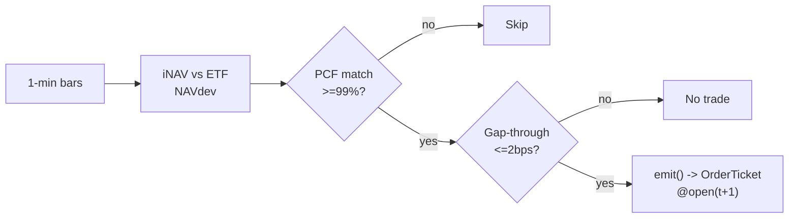

# T009 — ETF-vs-Basket Arbitrage

> **Reviewer card.** ETF–basket arbitrage: transient premiums/discounts to iNAV (S046) revert as APs create/redeem; PCF fidelity (S047) confirms the basket prices the ETF; microstructure impact (S014) gates the trade. Provenance tier **D**.
>
> - **Edge verdict:** `NO-DOCUMENTED-EDGE` — no citable ETF-arbitrage P&L from a realistic implementable rule; the pricing literature (Petajisto 2017 [documented]) documents the mispricing, not a captured P&L.
> - **After-cost:** `BEFORE-COST` — the mispricing is documented; the captured P&L is not — this is the honesty gap.
> - **Build cost:** Tier S · prototype 40–60 h [example] · loaded $6,000–9,000 [example].
> - **Data cost:** $199/mo Polygon.io Stocks Advanced [documented]; add Databento US Equities Standard $199/mo if live MBP-1 is required [documented] · research + production.
> - **Latency class:** 1-min bar + creation/redemption pipeline.
> - **Risk class:** medium (multi-leg, creation-unit threshold).
> - **Capacity:** $5–50M/day notional [example] — creation units constrain; AP desk competes directly.
> - **Executability:** feasible: 1-min bar NAV-dev machine + basket pricing; any retail platform with corporate-action data.
> - **Risk summary:** creation-unit mismatch (can't redeem odd lots); basket drift intraday; AP competition compresses the premium.
> - **When it dies:** AP desk latency; wide ETF spreads; corporate-action mismatch between PCF and reality.
> - **Regime gates (provisional):** R001 elevated RV amplifies (premia widen); index-rebalance days degrade (provisional local ID R-IDX — see GROK-NEEDED Q1).
> - **Emits:** `OrderTicket` intentions (strategy never creates orders).

## §1  Identity & provenance

This module is a **strategy**: it emits `OrderTicket` intentions only — brokers create orders, strategies never do. Family **E  # ETF arbitrage**, batch **TB2**, provenance **D**.

**Lede.** ETF–basket arbitrage: transient premiums/discounts to iNAV (S046) revert as APs create/redeem; PCF fidelity (S047) confirms the basket prices the ETF; microstructure impact (S014) gates the trade. Provenance **[D]**.

**When it dies.** AP desk latency; wide ETF spreads; corporate-action mismatch between PCF and reality.

**Regime gates (provisional).** R001 elevated RV amplifies (premia widen); index-rebalance days degrade.

**Prototype scope.** 1-min NAV-dev machine + PCF pricing + creation-unit sizing + kill-switch.

## §1.5  Escalation gate

Cheapest viable path: **Polygon.io Stocks Advanced — $199/mo [documented]** (real-time 1-min bars, 20+ years history). Build the NAV-dev machine on this cheap bar feed; the creation/redemption pipeline is a broker capability you buy.

**Cheapest-source row.**

| min_tier | latency_class | required_fields | price_band | build_or_buy |
|---|---|---|---|---|
| tier-1 | 1-min bar | ETF + basket 1-min OHLCV, PCF, L1 touch | $199/mo Polygon.io Stocks Advanced [documented]; Databento US Equities Standard $199/mo for live MBP-1 [documented] | build the NAV-dev machine; buy the creation/redemption pipeline |

**Skip list (phase one):** leveraged/inverse ETFs; fixed-income ETFs; options overlay; intraday basket rebalancing; depth beyond L1.

**DO-NOT-CUT list:** t→t+1 causality assertions; COST block + the C3 cost gate; kill switch; decision audit log; bona-fide intent + self-trade prevention; honesty tags; CSV fixtures + per-module test; secrets via env only.

Resource budget: `1` core, `<2` GB RAM [internal-est] · compute pattern `per_bar`.

Explicitly out of scope (phase two): leveraged/inverse ETFs; fixed-income ETFs (phase `2`).

Escalation gate: `50`+ ETFs [default]; 1-min bar latency `>60` s [default] — crossing it requires re-review of §T7 and §T8.

## §T0  Contract — strategies emit intentions, brokers create orders

This strategy's sole output is a list of `OrderTicket` intentions. It never places, routes, or confirms an order. Every ticket carries `parent_signal` (the upstream signal id and its `computed_at`), an `intent_ts`, and a `tif`. The backtest harness fills tickets strictly after the signal bar (`fill_event > signal_event`, t->t+1 causality); any fill timestamped at or before its signal bar is a harness bug and trips the kill switch.

**Typed signature.**

```python
def emit(state: ModuleState, signals: dict[str, Signal], bars: list[Bar1Min], cfg: T009Config) -> list[OrderTicket] | ModuleUnknown
```

`Bar1Min` (canonical Event/Bar schema, global appendices): `bar_open_ts: int64` ns UTC — bars are labeled by open time; `open, high, low, close: float`; `volume: int`; `venue: str`. `Signal`: `{id: str, computed_at: int64 ns UTC, fields: dict}`. `OrderTicket`: `{ticket_id, side, symbol, qty, limit, tif, parent_signal, intent_ts}` — the global OrderTicket schema; the strategy emits intents only, the broker creates orders.

**Config dataclass (single surface).** Status ∈ {fixed, default, calibrate, example, internal-est}.

| Parameter | Type | Default | Range | Status |
|---|---|---|---|---|
| `navdev_entry` | float (bps) | `1.5` | 0.5–5.0 | default |
| `navdev_exit` | float (bps) | `0.5` | 0.0–2.0 | default |
| `pcf_match_min` | float (fraction) | `0.99` | 0.95–1.0 | default |
| `gap_max_bps` | float (bps) | `2.0` | 0.5–10.0 | default |
| `cooldown_s` | float (s) | `300.0` | 0–3,600 | default |
| `cost_gate_k` | float | `0.5` | 0.1–2.0 | default |

**Time contract.** Clock domain: exchange (XNAS) event time · authoritative causality clock: `bar_open_ts` · int64 ns, UTC canonical · max_skew `5 s` [default] · jitter budget `30 s` [default] · bar-label rule: labeled by open time · staleness TTL `90 s` [default] · gap policy: no interpolation — stale inputs → `UNKNOWN`.

**Market-state table.**

| State | Meaning | Module behavior |
|---|---|---|
| `CONTINUOUS_TRADING` | normal session | evaluate per bar |
| `HALTED` | trading halt (LUDP / news) | `DEGRADED`: no new tickets, flatten per exit rule |
| `AUCTION` | open/close auction | `DEGRADED`: no tickets (auction fills unmodeled) |
| `CLOSED` | outside RTH schedule | `OFF`: no evaluation |

**Module-state enum.** `OK | DEGRADED | UNKNOWN | OFF`. Invalid input → `UNKNOWN`, never interpolated (RB-list F1–F5). `DEGRADED`: PCF gate failed / creation unit unreachable / halt — basket-only sizing or skip. `OFF`: outside schedule, or kill switch in `RECOVERY`.

**Risk contract (YAML, canonical).**

```yaml
risk_contract:
  per_trade_R: 500.0            # USD [example]
  daily_loss_stop: -2500.0      # USD; dark for the day [example]
  max_gross: 5000000.0          # USD notional [example]
  max_adverse_per_trade: 2.0    # x premium [default]
  max_concurrent_arb: 5         # [example]
  enforcement: intraday-hard    # [default]
  calibration: "paper-trade 30 sessions [default]; PCF reconciliation daily [default]; re-pin fee schedule monthly [default]"
```

**Kill switch: `ARMED` → `TRIPPED` → `RECOVERY` → `ARMED`.**

Trip conditions: PCF match < `99`% [example]; creation pipeline unavailable [example]; clock skew > `50` ms [example]; `5` concurrent arb positions [example]; any fill with `fill_event <= signal_event` (causality violation). On trip: stop emitting immediately, flatten per the exit rule, page.

Re-arm checklist (all required before `ARMED`):
1. Manual review of the trip cause, logged with inputs hash [rule].
2. Cooldown expired (`cooldown_s` = `300` s [default]).
3. Feeds healthy: PCF match ≥ `99`% [example], clock skew ≤ `50` ms [example], creation pipeline reachable [example].
4. Decision log confirms no unmanaged open positions [rule].

**Ops tail.** Schedule: RTH `09:45`–`15:30` ET [example]; no overnight carry; creation/redemption cutoffs respected · owner: on-call quant [default] · health checks: per-bar feed freshness, PCF match, clock skew · alerts: trip → page, `UNKNOWN` → notify, `DEGRADED` → log · resource budget: `1` vCPU, `2` GB RAM [internal-est] · runbook stub: on trip → flatten per exit rule → inspect decision log → complete re-arm checklist · secrets: env only (`POLYGON_API_KEY`, `DATABENTO_API_KEY`).

State variables carried between bars: `nav_dev`, `pcf_match`, `basket_pv`, `position`, `module_state`.

## §T1  Strategy thesis & edge

**Thesis.** ETF–basket arbitrage: transient premiums/discounts to iNAV (S046) revert as APs create/redeem; PCF fidelity (S047) confirms the basket prices the ETF; microstructure impact (S014) gates the trade. Provenance **[D]**.

**Edge verdict: NO-DOCUMENTED-EDGE** — no citable ETF-arbitrage P&L from a realistic implementable rule — the pricing literature (Petajisto) documents the mispricing, not a captured P&L [documented].

**After-cost verdict: BEFORE-COST** — one-sentence verdict: the mispricing is documented; the captured P&L is not — this is the honesty gap.

**Risk summary.** Creation-unit mismatch (can't redeem odd lots); basket drift intraday; AP competition compresses the premium.

**Math.**

```text
NAV-dev `NAVdev_t = (P_ETF − iNAV_t)/iNAV_t` in bps (S046); iNAV
from the PCF basket priced on live quotes (S047). Predicted gap-through from
the microstructure impact model (S014). Modeled edge `edge_bps = |NAVdev_t| −
0.5` [example] (conservative haircut).
```

**Pseudocode (normative).**

```python
def emit(state: ModuleState, signals: dict[str, Signal], bars: list[Bar1Min], cfg: T009Config) -> list[OrderTicket]:
    """Normative emit — prose is commentary; this code is the contract."""
    if not bars:
        return ModuleUnknown("F1: empty bars")               # invalid input -> UNKNOWN, never interpolated
    t = bars[-1]                                             # newest 1-min bar, labeled by open time
    nd = signals['S046'].nav_dev_bps
    pm = signals['S047'].pcf_match
    gt = signals['S014'].gap_through_bps
    if not (isfinite(nd) and isfinite(pm) and isfinite(gt)):
        return ModuleUnknown("F2: non-finite signal")        # invalid input -> UNKNOWN
    if pm < cfg.pcf_match_min or gt > cfg.gap_max_bps:
        return []                                            # S047/S014 gates

    edge_bps = abs(nd) - 0.5                                 # [example] conservative haircut
    cost_bps = expected_cost_bps(notional, adv_pct, venue, side, urgency)
    cost_ok = cost_bps <= cfg.cost_gate_k * edge_bps
    # ^^^ normative cost-gate predicate (C3): expected_cost_bps(...) <= k * edge_bps

    tickets: list[OrderTicket] = []
    if state.position == 0 and cost_ok:
        short_leg, long_leg = ('SELL', 'BUY') if nd > 0 else ('BUY', 'SELL')  # premium -> short ETF / long basket
        qty = shares(risk_budget_R=RISK.per_trade_R, stop_distance=cfg.navdev_entry,
                     vol_estimate=state.vol_estimate, ADV_cap=state.adv_cap,
                     cost=cost_bps)                          # §T3 fenced sizing function — no black box
        tickets = [OrderTicket(side=short_leg, symbol='ETF', qty=qty, limit=open(t + 1), tif='DAY',
                               parent_signal=f"S046@{t.bar_open_ts}"),
                   OrderTicket(side=long_leg, symbol='BASKET', qty=qty, limit=open(t + 1), tif='DAY',
                               parent_signal=f"S046@{t.bar_open_ts}")]
    elif abs(nd) <= cfg.navdev_exit:
        tickets = flatten_all(state)                         # convergence exit
    for tk in tickets:
        tk.intent_ts = now_ns()
        log_decision(tk, inputs_hash, params_hash)           # C5 / decision-log schema §T8 C17
    assert all(fill.event_ts > t.bar_close_ts for fill in fills)  # t->t+1 causality; no signal-bar fills (C4)
    return tickets
```

## §T2  Signal stack — dependencies & data rights

| Signal | Role | Contract |
|---|---|---|
| `S046` | trigger | |NAVdev_t| >= 1.5 bps [example] — the premium/discount is the edge |
| `S047` | confirm | PCF match ≥ 99% [example]; the basket must actually price the ETF |
| `S014` | gate | predicted gap-through ≤ 2 bps [example]; microstructure noise must not eat the premium |

Max dependency depth: `2` [default].

**Schema mapping (canonical).**

| Vendor (Polygon.io Stocks) | Canonical |
|---|---|
| `t` (ms) | `bar_open_ts` (int64 ns UTC; bar labeled by open time) |
| `o, h, l, c` | `open, high, low, close` |
| `v` | `volume` |
| Databento MBP-1 | L1 touch `bid_sz`/`ask_sz` → canonical quote fields |

Staleness: max skew `5 s` [default] · jitter budget `30 s` [default] · TTL `90 s` [default] · cadence `per_bar (1-min)` · tz `America/New_York`.

**Timing box.** `signal@t (1-min, America/New_York) → earliest fill @open(t+1)` — no signal-bar fills, ever (C4).

**COST block — single source of truth.** The canonical COST block is §T5. No cost numbers are restated in any other section; the front-matter `cost_model` register mirrors §T5's stack verbatim and points at it. The callable `expected_cost_bps(notional, adv_pct, venue, side, urgency)` is the only cost path into the C3 gate.

**Compliance pointer.** The coded compliance sub-block lives in §T8 (C1–C19): STP/self-trade prevention, bona-fide intent, message-rate limits, the pre-trade fat-finger trio, the halt/auction state table, the decision-log schema, the locate check, the public-dissemination gate, and data-entitlement assertions.

**Inputs that break the module.**

| Input failure | Module state | Alert |
|---|---|---|
| PCF match < 99% (gate) [example] | `DEGRADED` (skip ETF) | log |
| NAV-dev inputs stale | `UNKNOWN` | notify |
| Creation unit not reachable (odd lot) | `DEGRADED` (size to basket only) | log |

**Data rights.** ETF + basket 1-min bars via Polygon.io Stocks Advanced,
`rights: licensed`; research + production; fixtures synthetic; entitlement =
professional/internal; derived features ours. Entitlement-class change →
§1.5 escalation gate.

**Build vs buy.** Build the NAV-dev machine on a cheap bar feed; the
creation/redemption pipeline is a broker capability you buy — do not build
settlement plumbing.

**Local build.** Feasible. iNAV pricing is a dot product per minute; the state
machine is trivial; the creation pipeline is a broker capability.

**Data dictionary (canonical fields).**

| Field | Type | Cadence | Tier | Notes |
|---|---|---|---|---|
| `1-min OHLCV bars (ETF + basket)` | float/int | 1-min | Tier 1 | split/dividend-adjusted |
| `PCF (portfolio composition file)` | reference | daily | Tier 2 | S047 pricing |
| `L1 touch (ETF + top basket legs)` | int | per quote event | Tier 2 | S014 impact |

## §T3  Entry / exit / sizing & worked example

**Entry rule.**

```text
ENTER_ARBITRAGE := (|NAVdev_t| >= navdev_entry)
               AND (pcf_match >= pcf_match_min) AND (gap_through <= gap_max_bps)
               AND (expected_cost_bps(...) <= cost_gate_k * edge_bps)
FLAT := otherwise
direction := sign(NAVdev_t): premium → short ETF / long basket; discount → long ETF / short basket
```

**Exit rule.**

```text
EXIT := (|NAVdev_t| <= navdev_exit) [convergence]
        OR (pcf_match < 0.99 → unwind) OR (t >= 15:30 → flatten)
        OR (module_state != OK)
```

**Cooldown.** `300` s [default] after every exit (C10).

**Sizing function (normative).**

```python
def shares(risk_budget_R, stop_distance, vol_estimate, ADV_cap, cost):
    # risk_budget_R in $; stop_distance = premium stop in bps of basket PV01
    n = risk_budget_R / max(stop_distance, 1e-9)   # [default] floor below
    n = min(n, ADV_cap * 0.01)                    # 1% of the smaller leg's ADV [default]
    n = min(n * 50.0, 5000000.0) / 50.0          # $5M gross cap [default]
    return int(n)
```

**Risk limits.**

| Limit | Value |
|---|---|
| Daily loss stop | `-$2,500` [example] → dark for the day |
| Max concurrent arb positions | `5` [example] |
| PCF match floor | `99`% [example] → unwind below |
| Creation-unit reach | odd lots sized to basket only |

**Worked example (synthetic fixture — `fixtures/T009_tape.csv` trade 1; NOT a backtest).**

The tape is `# TYPE: validation-run` with hand-set prices [example]; all P&L arithmetic below is a fixture-consistency check, not evidence of a captured edge. Trade 1: `SELL` `2000` shares [example] @ `50.02` [example], exit `50.0` [example] (premium converged). Cost-function call: `expected_cost_bps(100040.0, 0.02, "XNAS", "taker", "normal")` → `11.0000` bps [example] → cost $ `110.04` [example]. Gross P&L = `40.00` [example] dollars. Net = `-70.04` [example] dollars. The fixture's expected CSV carries the same arithmetic for all six trades; the per-module test recomputes it from the tape and asserts equality. Tape summary (6 synthetic trades): gross `220.00` [example], net `-440.00` [example] — the negative net is arithmetically honest: at an `11.0` bps [example] round-trip stack, `1.5`–`2.0` bps [example] premia do not clear costs.

**Flow.**


## §T4  Parameters

| Parameter | Key | Default | Provenance | Status | Sensitivity |
|---|---|---|---|---|---|
| NAV-dev entry | `navdev_entry` | `1.5` bps | [default] | default | high |
| NAV-dev exit | `navdev_exit` | `0.5` bps | [default] | default | medium |
| PCF match floor | `pcf_match_min` | `99`% | [default] | default | high |
| Gap-through max | `gap_max_bps` | `2` bps | [default] | default | high |
| Cost-gate k | `cost_gate_k` | `0.5` | [default] | default | high |
| Cooldown | `cooldown_s` | `300` s | [default] | default | low |

## §T5  Costs — the callable is the single source of truth

**COST block (canonical).** 4-component stack:

| Component | bps | Basis |
|---|---|---|
| Spread | `3.0` | [example] ETF 0.5¢ + basket legs aggregation at $50 |
| Fees | `2.0` | [documented] Nasdaq remove-liquidity $0.0030/share (nasdaqtrader.com price list, checked 2026-09-10) = 0.6 bps/leg at $50; the 2.0 bps stack adds clearing/venue margin [example] |
| Borrow | `2.0` | [example] borrow_bps_per_day `2.0` × 1-day-equivalent holding (strategy flattens by 15:30 ET); hard-to-borrow legs excluded by the C7 locate check |
| Impact | `4.0` | [example] multi-leg aggregation |
| **Total** | `11.0` | [example] reference stack, per arb round-trip |

Fee schedule as of `2026-09-10` [measured] · venue `XNAS / SIP 1-min bars [example]` · side `taker` · borrow_bps_per_day `2.0` [example] — reason: multi-leg short borrow (ETF or basket legs) charged as a flat round-trip-day estimate because the strategy never carries overnight; HTB legs are vetoed by the locate gate, so no separate HTB add-on is modeled.

```python
def expected_cost_bps(notional, adv_pct, venue, side, urgency) -> float:
    """Callable cost model - T009 COST block (single source of truth)."""
    spread_bps = 3.0    # [example] ETF 0.5c + basket legs aggregation @ $50
    fee_bps = 2.0       # [example] taker stack incl. Nasdaq $0.0030/share remove fee [documented]
    borrow_bps = 2.0    # [example] borrow_bps_per_day 2.0 x 1-day-equivalent holding
    impact_bps = 4.0    # [example] multi-leg aggregation
    return spread_bps + fee_bps + borrow_bps + impact_bps
```

**Normative cost-gate predicate (C3):** `expected_cost_bps(...) <= k * edge_bps` — no ticket is emitted unless the callable cost clears this gate. The predicate appears verbatim in the §T1 pseudocode and is asserted by the per-module test.

## §T6  Execution assumptions

| Aspect | Assumption |
|---|---|
| Latency | 1-min bar evaluation; fill at next-bar open |
| Partial fills | oldest `intent_ts` first (FIFO); basket legs filled as a block |
| Impact | `4` bps modeled [example] — multi-leg aggregation |
| Adverse fill | basket drift intraday — the PCF match gate is the control |

**Child-order state machine (broker domain; the strategy emits intents only).** `CREATED → WORKING → {PARTIAL → WORKING | FILLED | CANCELLED}`; the strategy tracks intent lifecycle read-only via broker callbacks. Partial-fill policy: oldest `intent_ts` first (FIFO); basket legs filled as a block — if any leg cannot complete, flatten the partial block per the exit rule. Cancel-replace: only to reduce size or tighten limit toward the market; never to chase through the cost gate — re-check `expected_cost_bps(...) <= k * edge_bps` before any replace.

## §T7  Risk contract & kill switch

Canonical machine contract: §T0 (risk-contract YAML, kill-switch state machine, re-arm checklist, ops tail). This section is the human-readable layer.

Per-trade R: `$500` [example] per pair per trade · daily loss stop: `- $2,500` [example] then dark for the day · max gross: `$5M` notional [example] · max adverse per trade: `2.0`x premium [default].

Enforcement: `intraday-hard` [default]. Calibration recipe: paper-trade `30` sessions [default]; PCF reconciliation daily [default]; re-pin fee schedule monthly [default].

**Kill switch: `ARMED` → `TRIPPED` → `RECOVERY` → `ARMED`.**

Trip conditions:

- PCF match < 99% [example]
- creation pipeline unavailable [example]
- clock skew > 50 ms [example]
- 5 concurrent arb positions [example]

On trip: the module stops emitting tickets immediately, flattens managed positions per the exit rule, and pages. `RECOVERY` requires manual review, cooldown expiry, and healthy feeds; only then does the module return to `ARMED`. The per-module test drives the full transition cycle.

**Ops.** Schedule: RTH `09:45`–`15:30` ET [example]; no overnight carry; creation/redemption cutoffs respected · budget: `1` vCPU, `2` GB RAM [internal-est] [internal-est] · env: `POLYGON_API_KEY, DATABENTO_API_KEY`.

**Universe.** Liquid US equity ETFs with tight spreads and daily creation
activity [example]: price > `$20`, quoted spread ≤ `2`¢ [example], creation
unit ≤ `$5M` [example]. RTH `09:45`–`15:30`. Exclude: leveraged/inverse ETFs,
fixed-income ETFs (phase `2`), rebalance days.

## §T8  Compliance (C1–C19)

Coded rules use the form `trigger → check → action → log`.

- **C1** | No orders: the strategy emits `OrderTicket` intentions only; the broker creates orders. Trigger = any code path attempting order placement → check = static review of `emit()` → action = none (no such path exists) → log = n/a.
- **C2** | Kill switch: `ARMED` → `TRIPPED` → `RECOVERY` → `ARMED` on the §T0 trip conditions. Re-arm requires the full checklist.
- **C3** | Cost gate: `expected_cost_bps(...) <= k * edge_bps` before any ticket (see §T5).
- **C4** | Causality: `fill_event > signal_event` (t->t+1); no signal-bar fills, ever.
- **C5** | Decision log: every ticket logged with inputs hash and params hash (schema: §T8 C17).
- **C6** | Staleness: inputs older than the TTL (`90` s [default]) → `UNKNOWN`, no tickets.
- **C7** | Short discipline: `locate_ok` required before any short ticket (Reg-SHO locate). Trigger = short leg ticket → check = locate flag → action = reject if not located → log = `LOCATE_BLOCK`.
- **C8** | Cooldown: post-exit cooldown (`300` s [default]); no re-entry inside it.
- **C9** | Session flatten: no uncommanded overnight carry; flatten at `15:30` ET [example].
- **C10** | Position caps: per-trade R, daily loss stop, max gross enforced (risk YAML §T0).
- **C11** | PCF fidelity: trigger = match < `99`% [example] → check = S047 → action = unwind → log = `COMPLIANCE_BLOCK`.
- **C12** | Creation-unit discipline: trigger = size not a creation unit → check = unit math → action = basket-only sizing → log = `GATE_VETO`.
- **C13** | Self-trade prevention (STP): trigger = new ticket would cross own resting intent → check = broker STP flag → action = cancel the aggressive side → log = `STP_BLOCK`. Bona-fide intent: every ticket passes the cost gate and carries a parent signal; no spoofing layering.
- **C14** | Pre-trade fat-finger trio: trigger = qty > ADV cap OR notional > max gross OR limit deviates > `5`% [example] from touch → check = risk contract → action = reject ticket → log = `FAT_FINGER_REJECT`.
- **C15** | Message-rate / cancel-to-trade: trigger = cancel-to-trade ratio > `50` [example] over trailing 5 min → check = venue rule → action = throttle to cancel-only → log = `MSG_RATE_THROTTLE`.
- **C16** | Halt/auction handling: trigger = market state `HALTED` or `AUCTION` → check = §T0 market-state table → action = `DEGRADED`, no new tickets → log = `MARKET_STATE`.
- **C17** | Decision-log schema: every ticket logged as `{ticket_id, intent_ts, parent_signal, inputs_hash, params_hash, expected_cost_bps, edge_bps, cost_gate_k, venue, side, qty, limit, tif}` [rule].
- **C18** | Public-dissemination gate: the strategy emits no public quotes, posts, or market commentary; no manipulative dissemination [rule].
- **C19** | Data-entitlement assertions: at startup assert `rights: licensed` and entitlement = professional/internal; entitlement-class change → §1.5 escalation gate [rule].

## §T9  Evidence, failures & regime gates

**Evidence (cost-level tokens; every statistic tagged).**

| Source | Sample | Finding | Cost level | Caveat |
|---|---|---|---|---|
| Petajisto (2017) [documented] | US ETFs, `2007`–`2014` [documented] | average price deviation of ETFs with identical portfolios ≈ `100` bps [documented]; paper long/short mispricing strategy earned Carhart alpha up to `16`%/yr [documented] | `BEFORE-COST` (return study) | paper rule — no fill model or cost stack stated; not an implementable arb |
| Ben-David, Franzoni & Moussawi (2018) [documented] | US stocks | +1 SD ETF ownership → +`16`% daily stock volatility [documented]; high-ETF-ownership stocks earn up to `56` bps/month risk premium [documented] | `BEFORE-COST` (mechanism) | volatility transmission via the arbitrage channel — supports the mechanism, not an arb rule |
| Blitz & Huij (2012) [documented] | global EM equity ETFs | performance/tracking study of global emerging-markets equity ETFs [documented] | `BEFORE-COST` (performance study) | tracking study, not an arbitrage rule |

**Where this module is known to fail.** AP competition, wide ETF spreads, corporate-action PCF mismatch, index-rebalance days.

**Failure modes (detect → action → recovery).**

| # | Failure | Detect → action → recovery | Executable check |
|---|---|---|---|
| 1 | PCF mismatch | detect: match < `99`% → action: unwind (C11) → recovery: PCF reconciled [default] | `pcf_match >= 0.99` |
| 2 | Premium widens | detect: |NAVdev| > `2`× entry [example] → action: stop, flatten → recovery: next session | `abs(navdev) <= 2*entry` |
| 3 | Creation cutoff missed | detect: t past cutoff → action: basket-only flatten → recovery: next session [default] | `t < cutoff` |
| 4 | Cost blowup | detect: cost gate failing → action: stand down → recovery: re-pin [default] | `expected_cost_bps(...) <= k * edge_bps` |
| 5 | Stale iNAV | detect: staleness → action: UNKNOWN → recovery: feed healthy [default] | `all(fill_ts > signal_ts)` |

**Regime gates (machine records: regime_id, direction ∈ amplifies/degrades/inverts, mechanism, condition, action, min_lag, unknown_behavior).**

| Regime | Direction | Mechanism | Condition | Action | min_lag | unknown_behavior |
|---|---|---|---|---|---|---|
| R001 | amplifies | elevated RV: premia widen | rv_pctile > 70 [default] | widen_entry | 1 bar [default] | veto |
| R001 | degrades | extreme RV: basket drift | rv_pctile > 95 [default] | pause_entry | 1 bar [default] | veto |
| R-IDX | degrades | index-rebalance day | calendar flag [default] | veto | 0 [default] | veto |

`R-IDX` is a provisional local ID for index-rebalance days, pending the R001–R050 annotation pass; see GROK-NEEDED Q1.

**Robustness.** The premium is the AP's inventory talking; `navdev_entry` in
`1`–`3` bps [example] trades frequency for capture. PCF match `≥99`%
[example] is the non-negotiable gate — below it you are trading a stale
basket. Purged/embargoed OOS per S088.

**What the optimistic case assumes (and we do not).** (1) iNAV assumed exactly priced — the PCF match gate is the
honest control; (2) creation/redemption assumed reachable at the cutoff —
odd lots are basket-only; (3) the premium is assumed to revert, not to widen.

## §T10  Unverified leads & what would change our mind

- Practitioner claims of retail-capturable ETF arb P&L from forums/newsletters — no citable implementable rule found; not promoted.

What would change our mind: a purged/embargoed walk-forward with full costs that survives the S088 honesty protocol; a documented after-cost P&L from the cited authors' own implementations; or a regime-gated replication that holds outside the original sample.

## AI build prompt

```text
Build the T009 (ETF-vs-Basket Arbitrage) strategy module from this specification.
Hard constraints:
- The strategy emits OrderTicket intentions ONLY; it never creates orders (C1).
- Causality: fill_event > signal_event (t->t+1); no signal-bar fills (C4).
- Cost gate: expected_cost_bps(...) <= k * edge_bps before any ticket (C3).
- Kill switch ARMED -> TRIPPED -> RECOVERY -> ARMED on the §T7 trip conditions (C2).
- Every numeric literal in prose carries an honesty tag [documented]/[measured]/[example]/[unverified]/[default]/[internal-est]; exempt identifiers only.
- Sources must be real and cited with cost-level tokens; chatbot-only material goes to §T10.
Config surface:
- navdev_entry (float): default 1.5, range 0.5–5.0 [default]
- navdev_exit (float): default 0.5, range 0.0–2.0 [default]
- pcf_match_min (float): default 0.99, range 0.95–1.0 [default]
- gap_max_bps (float): default 2.0, range 0.5–10.0 [default]
- cooldown_s (float): default 300.0, range 0–3,600 [default]
- cost_gate_k (float): default 0.5, range 0.1–2.0 [default]
Entry rule:
ENTER_ARBITRAGE := (|NAVdev_t| >= navdev_entry)
               AND (pcf_match >= pcf_match_min) AND (gap_through <= gap_max_bps)
               AND (expected_cost_bps(...) <= cost_gate_k * edge_bps)
FLAT := otherwise
direction := sign(NAVdev_t): premium → short ETF / long basket; discount → long ETF / short basket
Exit rule:
EXIT := (|NAVdev_t| <= navdev_exit) [convergence]
        OR (pcf_match < 0.99 → unwind) OR (t >= 15:30 → flatten)
        OR (module_state != OK)
Sizing: implement the §T3 sizing_fn verbatim; enforce the §T7 risk contract.
Deliverables: the module markdown (all sections §1–§T10), the fixture tape CSV
(fixtures/T009_tape.csv), the expected CSV (fixtures/T009_expected.csv), and
the per-module test (modules/tests/test_T009.py) covering fixture arithmetic,
causality, the cost gate, the kill-switch cycle, invalid→UNKNOWN, and the callable signature.
```
