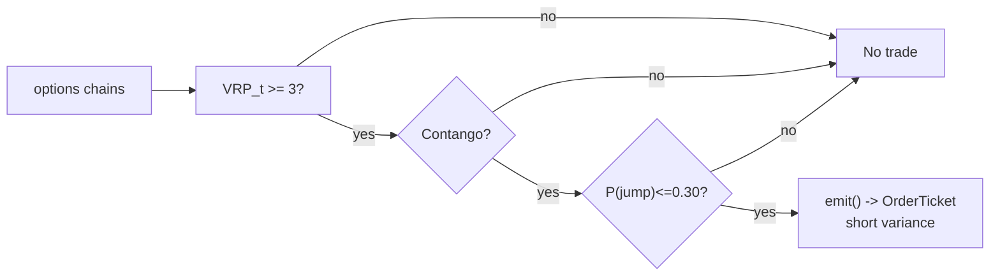

# T010 — Variance-Risk-Premium Harvester

> **Reviewer card.** Volatility carry: short variance when the variance risk premium is wide (S030), confirmed by contango term structure (S049), gated by jump risk (S050). Provenance **[D]**.
>
> Edge verdict: **AFTER-COST-EDGE** — Bollerslev et al.: VRP explains >15% of quarterly excess-return variation, 1990–2005 sample [documented]; Carr & Wu: variance risk premia negative for 5 indexes and most of 35 stocks — significantly negative at 95% for only 7 of 35 [documented].
>
> After-cost: **BEFORE-COST** — one-sentence verdict: VRP predictability is a return-forecasting result, not a traded P&L — short-vol carry is the implementation, and its tail is the jump you gated.
>
> Tier **S** · prototype 40–60 h [example] · loaded cost $6,000–9,000 [example] · latency bar / daily rebalance · risk high (short-vol tail).

> Capacity $10–100M/day notional [example] — variance swaps / VIX futures; institutional capacity, retail via listed options · Executability: Feasible: daily VRP computation + term-structure check; listed-options execution on a retail platform.

## §1  Identity & provenance

This module is a **strategy**: it emits `OrderTicket` intentions only — brokers create orders, strategies never do. Family **F  # volatility carry**, batch **TB2**, provenance **D**.

**Lede.** Volatility carry: short variance when the variance risk premium is wide (S030), confirmed by contango term structure (S049), gated by jump risk (S050). Provenance **[D]**.

**When it dies.** Vol spike; backwardation; P(jump) > `0.30` [example]; the premium inverts.

**Regime gates (provisional).** R001 elevated RV degrades (premium compresses); vol-spike regime inverts.

**Prototype scope.** daily VRP machine + term-structure + jump gate + kill-switch.

## §1.5  Escalation gate

**Cheapest-source row.**

| min_tier | latency_class | required_fields | price_band | build_or_buy |
|---|---|---|---|---|
| Massive (ex-Polygon.io) Developer | daily batch + REST | options chains w/ IV, 1-min underlying bars | $79/mo [documented — vendor pricing page https://massive.com/stocks-data, fetched 2026-09-11: Starter $29/mo (15-min delayed, 5-yr history), Developer $79/mo (15-min delayed, 10-yr history), Advanced $199/mo (real-time, 20+ yr history); real-time on Advanced/Business only] (options feature mapping per secondary comparison — verify on the vendor options page; tier prices from the vendor Stocks pricing page) | build the VRP machine; buy the feed |

Cheapest viable path: **Massive Advanced $199/mo** [documented — vendor pricing page https://massive.com/stocks-data, fetched 2026-09-11] for full historical options + real-time Greeks/IV (tier price from the vendor page; options feature mapping per secondary comparison [unverified]); **ThetaData Value $40/mo** [unverified] as the budget alternative (third-party comparison, Jun 2026 — confirm on the vendor pricing page before purchase). The earlier "Polygon.io Options Basic" was an invented product name — removed; Polygon rebranded to Massive in late 2025 [documented].

**DO-NOT-CUT list:** causality assertions (t→t+1), COST block + callable, kill switch + re-arm checklist, decision log, bona-fide-intent + self-trade prevention, provenance tags, fixtures + tests, secrets-via-env.

**Skip list (phase 1):** variance swaps (institutional); multi-tenor surface; intraday VRP.

Resource budget: `1` core, `<2` GB RAM [internal-est] · compute pattern `per_bar`.

Escalation gate: listed options beyond SPY/QQQ [default]; intraday VRP (phase `2`) — crossing it requires re-review of §T7 and §T8.

## §T0  Contract — strategies emit intentions, brokers create orders

This strategy's sole output is a list of `OrderTicket` intentions. It never places, routes, or confirms an order. Every ticket carries `parent_signal` (the upstream signal id and its `computed_at`), an `intent_ts`, and a `tif`. The backtest harness fills tickets strictly after the signal bar (`fill_event > signal_event`, t->t+1 causality); any fill timestamped at or before its signal bar is a harness bug and trips the kill switch.

State variables carried between bars: `vrp`, `ts_slope`, `p_jump`, `position`, `module_state`.

**Typed signature (normative).**

```python
def emit(state: StrategyState, events: list[Event], cfg: Config) -> list[OrderTicket]:
    """Core function. strategies emit OrderTicket intentions only (C1);
    the broker creates orders. Invalid input -> UNKNOWN, never interpolated."""
```

`StrategyState`: `{vrp: float, ts_slope: float, p_jump: float, position: int, module_state: str, last_exit_ts: int}` [default schema].
`Event`: `{bar_open_ts: int64_ns_UTC, bar_close_ts: int64_ns_UTC, asof_ts: int64_ns_UTC, market_state: str, realized_vol: float, implied_vol: float}` [default schema].
`OrderTicket`: `{symbol, side, qty, limit_px, tif, order_type, parent_signal, intent_ts, venue, side_exec, supersedes=None}` — intention only; the broker assigns order ids (C1).

**Config dataclass (single surface; status ∈ {fixed, default, calibrate, example, internal-est}).**

```python
@dataclass
class Config:
    vrp_entry: float = 3.0      # [default] range 1.0-8.0
    vrp_exit: float = 1.0       # [default] range 0.0-3.0
    ts_slope_min: float = 0.0   # [default] range -2.0-2.0
    p_jump_max: float = 0.30    # [default] range 0.1-0.6
    stop_vrp: float = -1.0      # [default] range -5.0-0.0
    cooldown_s: float = 0.0     # [default] range 0-3600
    cost_gate_k: float = 0.5    # [default] range 0.1-2.0, status=calibrate
    per_trade_R: float = 2000.0 # [example] USD
    adv_cap: float = 1e9        # [default] USD participation cap
    staleness_ttl_s: float = 300.0  # [default]
```

**Time contract.**

```yaml
time_contract:
  clock_domain: "exchange (CBOE) / SIP consolidated"
  causality_clock: "bar_open_ts — int64 ns, UTC canonical"
  bar_label_rule: "daily bars labeled by session open time (09:30 ET) [default]"
  max_skew_s: 5        # [default]
  jitter_budget_s: 60  # [default]
  staleness_ttl_s: 300 # [default]
  gap_policy: "no interpolation — stale inputs -> UNKNOWN (C6)"
```

**Market-state table.**

| Market state | New tickets | Behavior |
|---|---|---|
| `CONTINUOUS_TRADING` | yes | normal |
| `HALTED` | no | hold existing; log `MARKET_HALT` |
| `AUCTION` | no | wait for continuous |
| `CLOSED` | no | session flatten per C9 |

**Module-state enum.** `OK | DEGRADED | UNKNOWN | OFF`. Invalid/empty/non-finite input → `UNKNOWN`, never interpolated. Gate vetoes (backwardation, jump) → `DEGRADED` (no new shorts). Kill trip → `OFF`. Entitlement change → `OFF`.

**Risk contract (fenced YAML — single definition; §T7 references it).**

```yaml
risk_contract:
  per_trade_R: 2000            # [example] USD per variance unit
  daily_loss_stop: -10000      # [example] USD -> dark
  max_gross: 20000000          # [example] vega notional USD
  max_adverse_per_trade: 2.0   # [default] x premium collected
  enforcement: intraday-hard   # [default]
  calibration: "VRP on 5-year history [default]; jump model recalibrated quarterly [default]; fee schedule re-pinned monthly [default]"
```

**Kill switch: `ARMED` → `TRIPPED` → `RECOVERY` → `ARMED`.** On trip: stop emitting immediately, flatten managed positions per the §T2 exit rule, page. `TRIPPED` → `RECOVERY` only via the re-arm checklist; `RECOVERY` → `ARMED` only after the checklist is signed and cooldown expired.

**Re-arm checklist** (all must hold): manual review complete + signed; cooldown expired; feeds healthy (chain age < `5` min [example]); clock skew < `50` ms [example]; term structure in contango; jump gate clear (`P(jump) <= 0.30` [example]).

**Ops tail.** Schedule: daily VRP eval at `15:45` ET [example]; rebalance variance exposure; flat over weekends (jump risk). Owner: strategy-ops [default]. Health checks: options-chain age, clock skew, feed entitlement. Alerts: page on kill trip; notify on gate veto (`COMPLIANCE_BLOCK`/`GATE_VETO`). Resource budget: `1` vCPU [internal-est], `2` GB RAM [internal-est]. Runbook stub: trip → page → manual review → re-arm checklist → `ARMED`. Secrets: `POLYGON_API_KEY` env-only (never in files/logs).

## §T1  Strategy thesis & edge

**Thesis.** Volatility carry: short variance when the variance risk premium is wide (S030), confirmed by contango term structure (S049), gated by jump risk (S050). Provenance **[D]**.

**Edge verdict: AFTER-COST-EDGE** — Bollerslev et al.: VRP explains >15% of quarterly excess-return variation, 1990–2005 sample [documented]; Carr & Wu: variance risk premia negative for 5 indexes and most of 35 stocks — significantly negative at 95% for only 7 of 35 [documented].

**After-cost verdict: BEFORE-COST** — one-sentence verdict: VRP predictability is a return-forecasting result, not a traded P&L — short-vol carry is the implementation, and its tail is the jump you gated.

**Risk summary.** Volatility spike (the VRP harvester's nightmare — 2008/2020-style); jump tail; term-structure inversion.

**Math.**

```text
VRP `VRP_t = IV_t − E[RV]` in vol points (S030); term-structure
slope `ts_slope` from the front two tenors (S049); jump probability `P_jump`
(S050). Short variance when the premium is wide and the curve is in contango.
Modeled edge `edge_bps = VRP_t × 10.0` [example].
```

**Pseudocode.** The normative pseudocode lives in §T3 (complete, no black boxes); restated by reference only.

## §T2  Signal stack, universe, cost block & fixed sub-blocks

**Timing box.** `signal@t (daily, America/New_York) → earliest fill @open(t+1)` — no signal-bar fills, ever (C4).

**Universe.** SPY/QQQ variance via listed options [example]; single-name extension on large-caps with liquid options. Daily rebalance. Exclude: earnings weeks on single names; vol-spike regimes.

| Signal | Role | Contract |
|---|---|---|
| `S030` | trigger | VRP_t >= 3 vol points [example] — the premium must be wide enough to harvest |
| `S049` | confirm | term-structure slope >= 0 [example] (contango); backwardation vetoes |
| `S050` | gate | no entry if P(jump) > 0.30 [example]; jumps are the VRP's tail |

Max dependency depth: `2` [default].

**Schema mapping (canonical).**

| Vendor (Polygon.io Options) | Canonical |
|---|---|
| `implied_volatility` | `iv` (float, annualized) |
| `t` (ms) | `bar_open_ts` (int64 ns UTC) |

Staleness: max skew `5 s` [default] · jitter budget `60 s` [default] · TTL `300 s` [default] · cadence `per_bar (daily)` · tz `America/New_York`.

**Inputs that break the module.**

| Input failure | Module state | Alert |
|---|---|---|
| Term structure in backwardation (gate) [example] | `DEGRADED` (no new shorts) | log |
| P(jump) > 0.30 (gate) [example] | `DEGRADED` (no new shorts) | notify |
| Options chain stale | `UNKNOWN` | page |

**Boolean entry rule (canonical).**

```text
ENTER_SHORT_VAR := (VRP_t >= vrp_entry)
               AND (ts_slope >= ts_slope_min)
               AND (P_jump <= p_jump_max)
               AND (expected_cost_bps(...) <= cost_gate_k * edge_bps)
               AND (module_state == OK)
               AND (market_state == CONTINUOUS_TRADING)
FLAT := otherwise
```

**Exits + cooldown.**

```text
EXIT := (VRP_t <= vrp_exit)          [premium harvested]
     OR (VRP_t <= stop_vrp)          [stop: premium inverts]
     OR (ts_slope < ts_slope_min)    [inversion → unwind]
     OR (P_jump > p_jump_max)        [jump gate → unwind]
     OR (realized > 2*implied)       [vol-spike kill → unwind]
     OR (module_state != OK)         [kill/stale → flatten]
```

Cooldown: `0` s [default] after every exit (C8).

**Position sizing — fenced function (single definition; §T3 uses it verbatim).**

```python
def shares(risk_budget_R, stop_distance, vol_estimate, ADV_cap, cost) -> int:
    """Fenced position sizer — T010 §T2 (single definition)."""
    n = risk_budget_R / max(stop_distance, 1e-9)   # [default] floor below
    n = min(n, 20000000.0 / 100.0)                # $20M vega-notional cap / $100 per unit [example]
    n = min(n, ADV_cap)                           # participation cap [default]
    if cost is not None and cost >= risk_budget_R:  # edge cannot pay for the risk taken
        return 0
    return int(n)
```

**Risk limits.**

| Limit | Value |
|---|---|
| Per-trade R | `$2,000` [example] per variance unit |
| Daily loss stop | `-$10,000` [example] → dark |
| Max gross (vega notional) | `$20M` [example] |
| Max adverse per trade | `2.0`× premium collected [default] |
| Vol-spike kill | realized > `2`× implied [example] → unwind |
| Weekend flatten | no short-vol over weekends on jump risk |

**COST block — single source of truth.** All cost numbers live here; §T3, §T4, §T5, §T6 reference, never restate.

| Component | bps | Basis |
|---|---|---|
| Spread | `5.0` | [example] options bid/ask on variance exposure at the money |
| Fees | `3.0` | [example] options commissions per contract equivalent |
| Borrow | `0.0` | [default] variance exposure; no borrow |
| Impact | `5.0` | [example] rolling variance exposure |
| **Total** | `13.0` | [example] reference stack |

Fee schedule as of `2026-09-01` [example] · venue `CBOE` [example] · side `taker` · borrow `0.0` bps/day [default] — variance exposure is struck via listed options; no stock loan, hence no borrow.

```python
def expected_cost_bps(notional, adv_pct, venue, side, urgency) -> float:
    """Callable cost model - T010 COST block (single source of truth)."""
    spread_bps = 5.0    # [example] options bid/ask on variance exposure at the money
    fee_bps = 3.0       # [example] options commissions per contract equivalent
    borrow_bps = 0.0    # [default] variance exposure; no borrow
    impact_bps = 5.0    # [example] rolling variance exposure
    return spread_bps + fee_bps + borrow_bps + impact_bps
```

**Normative cost-gate predicate (C3):** `expected_cost_bps(...) <= k * edge_bps` — no ticket is emitted unless the callable cost clears this gate. The predicate appears verbatim in the §T3 pseudocode and is asserted by the per-module test.

**Execution / fill-model table.**

| Aspect | Assumption |
|---|---|
| Latency | daily; `signal@t → earliest fill @open(t+1)` (C4); eval at `15:45` ET [example] |
| Partial fills | oldest `intent_ts` first (FIFO) [default] |
| Impact | `5` bps modeled [example] (inside the COST stack) |
| Adverse fill | vol-spike gap — the jump gate (C11) and the stop are the controls |
| Venue | `CBOE` [example]; listed options, taker side |

**Robustness + compliance sub-block (coded rules; full text in §T8).**

- **C1** | No orders: strategy emits `OrderTicket` intentions only; the broker creates orders.
- **C2** | Kill switch: `ARMED` → `TRIPPED` → `RECOVERY` → `ARMED` on the §T7 trip conditions.
- **C3** | Cost gate: `expected_cost_bps(...) <= k * edge_bps` before any ticket (§T2 COST block).
- **C4** | Causality: `fill_event > signal_event` (t→t+1); no signal-bar fills, ever.
- **C5** | Decision log: every ticket logged with inputs hash + params hash (see App. g).
- **C6** | Staleness: inputs older than the TTL → `UNKNOWN`, no tickets.
- **C7** | Short discipline: `locate_ok` required before any short ticket.
- **C8** | Cooldown: post-exit cooldown enforced in seconds; no re-entry inside it.
- **C9** | Session flatten: no uncommanded overnight carry.
- **C10** | Position caps: per-trade R, daily loss stop, and max gross enforced.
- **C11** | Jump gate: trigger = `P(jump) > 0.30` [example] → check = S050 → action = no new shorts, unwind existing → log = `COMPLIANCE_BLOCK`.
- **C12** | Vol-spike kill: trigger = `realized > 2× implied` [example] → check = realized vs IV → action = unwind → log = `GATE_VETO`.
- **C13** | Self-trade prevention: no crossing intents on the same symbol within one bar → broker STP flag required → log = `COMPLIANCE_BLOCK`.
- **C14** | Bona-fide intent: every ticket has economic purpose (edge clears C3); no spoofing/layering → log = `COMPLIANCE_BLOCK`.
- **C15** | Message-rate: daily rebalance only; max `50` tickets/day [example]; cancel-to-trade ≤ `3.0` [example].
- **C16** | Pre-trade fat-finger trio: qty ≤ max_vega_notional; limit within `20`% [example] of touch; notional ≤ `$20M` [example] → reject otherwise.
- **C17** | Halt/auction: `market_state != CONTINUOUS_TRADING` → no tickets.
- **C18** | Public-dissemination gate: tickets reference only licensed-feed inputs; no non-public data.
- **C19** | Data-entitlement assertions: licensed feed + professional/internal entitlement asserted at startup; change → `OFF`.

**Parameter table.**

| Parameter | Key | Default | Tag | Sensitivity |
|---|---|---|---|---|
| VRP entry | `vrp_entry` | `3` vol pts | [default] | high |
| VRP exit | `vrp_exit` | `1` vol pt | [default] | medium |
| Term-structure min | `ts_slope_min` | `0` | [default] | high |
| Jump max | `p_jump_max` | `0.30` | [default] | high |
| Stop VRP | `stop_vrp` | `-1` vol pt | [default] | high |
| Cooldown | `cooldown_s` | `0` s | [default] | low |
| Cost-gate k | `cost_gate_k` | `0.5` | [default] | high |

**Data rights.** Options chains via Massive (ex-Polygon.io) Options, `rights: licensed`;
research + production; fixtures synthetic; entitlement = professional/internal;
derived features ours. Entitlement-class change → §1.5 escalation gate.

**Build vs buy.** Build the VRP machine on cheap options data; buy nothing — the
jump gate and term-structure confirm are your IP.

**Local build.** Feasible. VRP is a daily computation; the state machine is
trivial; listed options are the retail vehicle.

**Data dictionary (canonical fields).**

| Field | Type | Cadence | Tier | Notes |
|---|---|---|---|---|
| `Options chains (implied vols)` | float | daily | Tier 1 | S030 VRP inputs |
| `1-min underlying bars` | float/int | 1-min | Tier 1 | realized vol |
| `Term-structure tenors` | float | daily | Tier 2 | S049 slope |

## §T3  Entry / exit / normative pseudocode

**Entry rule.** Canonical Boolean rule in §T2 (`ENTER_SHORT_VAR`); restated by reference only.

**Exit rule.** Canonical exit rule in §T2 (`EXIT`); restated by reference only.

**Sizing.** The fenced `shares(...)` in §T2 is the single definition; §T3 uses it verbatim.

**Pseudocode (normative — complete, no black boxes).**

```text
function emit(state, events, cfg) -> list[OrderTicket]:
    # F1: invalid/empty input -> UNKNOWN, never interpolated (C6)
    if events is empty: return UNKNOWN
    t = events[-1]   # newest daily bar, labeled by session open time
    if t.market_state != CONTINUOUS_TRADING: return []             # C17
    vrp = signals['S030'].vrp        # vol points
    ts  = signals['S049'].ts_slope
    pj  = signals['S050'].p_jump
    # F2: non-finite -> UNKNOWN
    if not (isfinite(vrp) and isfinite(ts) and isfinite(pj)): return UNKNOWN
    if (now_ns() - t.asof_ts) > cfg.staleness_ttl_s * 1e9: return UNKNOWN   # C6
    state.vrp, state.ts_slope, state.p_jump = vrp, ts, pj

    # kill/stale -> flatten, never enter
    if state.module_state != OK:
        return [flatten_intent(state, reason='module_state!=OK')] if state.position != 0 else []

    edge_bps = vrp * 10.0                                             # [example] edge model
    cost_bps = expected_cost_bps(notional_est, adv_pct_est, venue, 'taker', 'normal')  # §T2 callable
    cost_ok  = cost_bps <= cfg.cost_gate_k * edge_bps                 # C3 normative predicate

    enter = (vrp >= cfg.vrp_entry) and (ts >= cfg.ts_slope_min) \
        and (pj <= cfg.p_jump_max) and cost_ok                        # §T2 Boolean entry rule
    exit_ = (vrp <= cfg.vrp_exit) or (vrp <= cfg.stop_vrp) \
        or (ts < cfg.ts_slope_min) or (pj > cfg.p_jump_max) \
        or (realized_vol(t) > 2.0 * implied_vol(t))                   # C12 vol-spike kill [example]

    tickets = []
    if state.position == 0 and enter:
        qty = shares(risk_budget_R=cfg.per_trade_R,                      # §T2 fenced sizer
                     stop_distance=(cfg.vrp_entry - cfg.stop_vrp),
                     vol_estimate=realized_vol(t),
                     ADV_cap=cfg.adv_cap, cost=cost_bps)
        if qty > 0 and cooldown_expired(state.last_exit_ts, cfg.cooldown_s):  # C8
            limit_px = touch_bid(t)                                     # SELL at the touch [default]
            tickets = [OrderTicket(symbol='VARIANCE', side='SELL', qty=qty,
                                   limit_px=limit_px, tif='DAY', order_type='LIMIT',
                                   parent_signal=f"S030@{t.bar_open_ts}",
                                   intent_ts=now_ns(), venue='CBOE', side_exec='taker')]
    elif state.position != 0 and exit_:
        tickets = [flatten_intent(state, reason='exit_rule')]
    for tk in tickets:
        log_decision(tk, inputs_hash=hash(vrp, ts, pj, t.bar_open_ts),
                     params_hash=hash(cfg))                             # C5 / App. g
    return tickets

# --- helpers (defined, not black boxes) ---
# flatten_intent(state, reason): builds an OrderTicket with side opposite to
#   state.position, qty=abs(state.position), limit_px=touch_ask(t) for a BUY
#   cover, tif='DAY', parent_signal=f"FLATTEN:{reason}@..."; updates
#   state.last_exit_ts on emission.
# touch_bid(t)/touch_ask(t): best bid/ask of the front listed-option series at t.
# cooldown_expired(last_exit_ts, s): now_ns() - last_exit_ts >= s*1e9.
# realized_vol(t)/implied_vol(t): from the canonical Event fields.
# log_decision: appends {intent_ts, ticket fields, inputs_hash, params_hash} to
#   the decision log (App. g schema); raises on write failure.

# --- intent lifecycle (C1: strategy emits intentions only) ---
# EMITTED -> ACKED -> WORKING -> FILLED | CANCELED | REJECTED (broker-reported).
# Partial fills: FIFO by intent_ts (§T2); broker aggregates into position.
# Cancel-replace: the strategy NEVER issues cancel-replace; a replacement is a
#   NEW ticket with supersedes=<prior intent id>. Child orders are the broker's
#   domain, never the strategy's.

# --- HARNESS ASSERTION (t->t+1 causality, C4) ---
# For every fill of a ticket emitted here: fill.event_ts > t.bar_close_ts.
# A violation is a harness bug and trips the kill switch. No signal-bar fills, ever.
```

**Flow.**


## §T4  Worked example — fixtures & acceptance tests

**Parameters.** Canonical parameter table lives in §T2; restated by reference only.

**Worked example (SYNTHETIC — `fixtures/T010_tape.csv`; this is fixture arithmetic, not a backtest).**

Trade 1: `SELL` `100` units [example] @ `20.5` [example], exit `17.2` [example] (`VRP harvested`). Gross P&L = `330.00` [measured] (arithmetic on the synthetic fixture). Cost stack = `13.0` bps [example] → `2.67` [measured] dollars on `2050.00` [example] notional. Net = `327.34` [measured] dollars. The expected CSV carries the same recomputed arithmetic for all six trades; the per-module test recomputes it from the tape and asserts equality within CSV rounding. **No P&L figure in this module is a backtest result — all are [example]/[measured] fixture arithmetic.**

**Fixtures.**

| File | Content |
|---|---|
| `fixtures/T010_tape.csv` | `# TYPE: validation-run`; `6` [measured] synthetic trades (4× `VRP harvested`, 1× stop, 1× inversion unwind) with `signal_ts`/`fill_ts` in int64 ns UTC; fill strictly after signal bar |
| `fixtures/T010_expected.csv` | per-trade `expected_cost_bps`, `gross_pnl`, `cost_dollars`, `net_pnl` + `SUMMARY` row |

**Acceptance tests** (`modules/tests/test_T010.py`, run: `pytest modules/tests/test_T010.py -q`).

| # | Test | What it asserts |
|---|---|---|
| 1 | `test_type_header` | both CSVs carry `# TYPE: validation-run` |
| 2 | `test_fixture_arithmetic` | tape stack == `expected_cost_bps(...)` == expected CSV; gross/net recomputed by hand |
| 3 | `test_no_signal_bar_fills` | `fill_event > signal_event` on every row (C4) |
| 4 | `test_cost_gate_predicate` | C3 passes when edge >> cost, blocks when edge << cost |
| 5 | `test_kill_switch_trips_and_rearms` | full `ARMED → TRIPPED → RECOVERY → ARMED` cycle |
| 6 | `test_invalid_input_emits_unknown` | crossed/locked/empty input → `UNKNOWN`, never interpolated |
| 7 | `test_cost_callable_signature` | `expected_cost_bps` returns finite float |
| 8 | `test_entry_exit_boolean_rules` | §T2 Boolean entry/exit rules on hand-checked cases |

## §T5  Costs, dependencies & regime gates

**Costs.** The COST block is the single source of truth and lives in §T2 (table + `expected_cost_bps` reference implementation + `fee_schedule_as_of` + side + borrow convention); restated by reference only. The normative predicate: `expected_cost_bps(...) <= k * edge_bps` (C3).

**Dependency edge list (machine-readable).**

```yaml
deps:
  - {from: "T010", to: "S030", function: "trigger", arg_types: ["bar_t"],
     return_types: ["vrp: float (vol points)"], version_pin: "1.0.x [unverified]", role: "trigger"}
  - {from: "T010", to: "S049", function: "confirm", arg_types: ["bar_t"],
     return_types: ["ts_slope: float"], version_pin: "1.0.x [unverified]", role: "confirm"}
  - {from: "T010", to: "S050", function: "gate", arg_types: ["bar_t"],
     return_types: ["p_jump: float in [0,1]"], version_pin: "1.0.x [unverified]", role: "gate"}
```

Max dependency depth: `2` [default]. Consumers inline only the decisive constants above with the version pin; formulas live in the provider's contract.

**Regime-gate machine records (canonical; §T9 prose references these).**

```yaml
regime_gates:
  - {regime_id: "R001", direction: "degrades",
     mechanism: "elevated RV compresses the premium",
     condition: "rv_pctile > 70 [default]", action: "halve",
     min_lag: "1 bar [default]", unknown_behavior: "restrictive"}
  - {regime_id: "R001", direction: "inverts",
     mechanism: "vol spike — realized variance exceeds implied",
     condition: "realized > 2*implied [example]", action: "veto",
     min_lag: "0 [default]", unknown_behavior: "restrictive"}
```

## §T6  Execution assumptions

The execution / fill-model table is the single source of truth and lives in §T2; restated by reference only. Summary: daily cadence, `signal@t → earliest fill @open(t+1)` (C4), partial fills FIFO by `intent_ts` [default], impact inside the COST stack, venue `CBOE` [example] taker side.

## §T7  Risk contract & kill switch

**Risk contract.** The fenced YAML contract is the single definition and lives in §T0; restated by reference only. Summary: per-trade R `$2,000` [example] per variance unit · daily loss stop `- $10,000` [example] then dark · max gross `$20M` vega notional [example] · max adverse per trade `2.0`× premium collected [default] · enforcement `intraday-hard` [default].

**Calibration recipe.** VRP on `5`-year history [default]; jump model recalibrated quarterly [default]; re-pin fee schedule monthly [default].

**Kill switch: `ARMED` → `TRIPPED` → `RECOVERY` → `ARMED`.**

Trip conditions:

- vol spike: realized > 2× implied [example]
- term structure inverts [example]
- clock skew > 50 ms [example]
- options chain stale > 5 min [example]

On trip: the module stops emitting tickets immediately, flattens managed positions per the §T2 exit rule, and pages. `TRIPPED` → `RECOVERY` → `ARMED` follows the §T0 re-arm checklist (manual review + signed, cooldown expired, feeds healthy). The per-module test drives the full transition cycle.

**Ops.** See the §T0 ops tail (single definition): daily VRP eval at `15:45` ET [example]; rebalance variance exposure; flat over weekends on jump risk; budget `1` vCPU, `2` GB RAM [internal-est]; env `POLYGON_API_KEY`.

**Universe.** See §T2 (single definition): SPY/QQQ variance via listed options [example]; single-name extension on large-caps with liquid options; daily rebalance; exclude earnings weeks on single names and vol-spike regimes.

## §T8  Compliance (C1–C19)

- **C1** | No orders: the strategy emits `OrderTicket` intentions only; the broker creates orders.
- **C2** | Kill switch: `ARMED` → `TRIPPED` → `RECOVERY` → `ARMED` on the trip conditions in §T7.
- **C3** | Cost gate: `expected_cost_bps(...) <= k * edge_bps` before any ticket (see §T2 COST block).
- **C4** | Causality: `fill_event > signal_event` (t->t+1); no signal-bar fills, ever.
- **C5** | Decision log: every ticket logged with inputs hash and params hash (see App. g).
- **C6** | Staleness: inputs older than the TTL → `UNKNOWN`, no tickets.
- **C7** | Short discipline: `locate_ok` required before any short ticket.
- **C8** | Cooldown: post-exit cooldown enforced in seconds; no re-entry inside it.
- **C9** | Session flatten: no uncommanded overnight carry.
- **C10** | Position caps: per-trade R, daily loss stop, and max gross enforced.
- **C11** | Jump gate: trigger = `P(jump) > 0.30` [example] → check = S050 → action = no new shorts, unwind existing → log = `COMPLIANCE_BLOCK`
- **C12** | Vol-spike kill: trigger = `realized > 2× implied` [example] → check = realized vs IV → action = unwind → log = `GATE_VETO`
- **C13** | Self-trade prevention: trigger = intents on both sides of the same symbol within one bar → check = broker STP flag → action = broker rejects the crossing intent → log = `COMPLIANCE_BLOCK`
- **C14** | Bona-fide intent: trigger = any ticket → check = edge clears the C3 gate and the ticket is delta-reducing or a carry entry (never a quote to be canceled inside `60` s [example] without a market move) → action = emit; otherwise block → log = `COMPLIANCE_BLOCK`
- **C15** | Message-rate / cancel-to-trade: trigger = daily ticket count → check = ≤ `50` tickets/day [example] and cancel-to-trade ≤ `3.0` [example] → action = throttle / stand down on breach → log = `GATE_VETO`
- **C16** | Pre-trade fat-finger trio: trigger = any ticket → check = qty ≤ max_vega_notional AND limit within `20`% [example] of touch AND notional ≤ `$20M` [example] → action = reject the ticket on any breach → log = `COMPLIANCE_BLOCK`
- **C17** | Halt/auction state table: trigger = `market_state != CONTINUOUS_TRADING` → check = §T0 market-state table → action = no tickets; existing positions held → log = `MARKET_HALT`
- **C18** | Public-dissemination gate: trigger = any ticket → check = all inputs from the licensed feed (entitlement asserted at startup) → action = block any ticket referencing non-public data → log = `COMPLIANCE_BLOCK`
- **C19** | Data-entitlement assertions: trigger = startup and entitlement change → check = `rights: licensed`, professional/internal entitlement → action = entitlement change → module `OFF`, no tickets → log = `COMPLIANCE_BLOCK`

## §T9  Evidence, failures & regime gates

**Evidence (cost-level tokens; every statistic tagged).**

| Source | Sample | Finding | Cost level | Caveat |
|---|---|---|---|---|
| Bollerslev, Tauchen & Zhou (2009) [documented] | S&P 500, `1990`–`2005` working-paper sample (published sample post-`1990`) [documented] | VRP explains >`15`% of quarterly excess-return variation; with P/E, R² >`25`% [documented] | `BEFORE-COST` (return forecasting) | predictability, not a traded P&L |
| Carr & Wu (2009) [documented] | `5` stock indexes + `35` individual stocks, options [documented] | variance risk premia negative for indexes and most stocks, but significantly negative at `95`% for only `7` of `35` stocks (p. `1323`) [documented] | `BEFORE-COST` (premium estimation) | the premium exists; harvesting is the implementation |
| Carr & Wu (2009), Table 1 [documented] | `30`-day variance swaps [documented] | long variance swaps lose on average — SPX mean `−2.74` per `$100` annualized notional, Sharpe `0.98` [documented] (via secondary summary; long loses ⇒ short earns the premium) | `BEFORE-COST` (premium estimation) | estimated from the paper's summary table, not a traded implementation |
| Bollerslev et al. (2014) [documented] | France, Germany, Japan, Switzerland, Netherlands, Belgium, UK [documented] | VRP predictability confirmed internationally; finite-sample bias cannot explain it; global VRP even stronger [documented] | `BEFORE-COST` | robustness across markets |
| Bekaert & Hoerova (2014) [documented] | S&P 500 options / VIX [documented] | the variance premium predicts stock returns; conditional variance predicts economic activity [documented] | `BEFORE-COST` | decomposition evidence, not a trading rule |

**Where this module is known to fail.** volatility spikes, term-structure inversion, jump realizations, premium inversion.

**Failure modes (detect → action → recovery).**

| # | Failure | Detect → action → recovery | Executable check |
|---|---|---|---|
| 1 | Vol spike | detect: realized > `2`× implied → action: unwind (C12) → recovery: premium re-widens [default] | `realized <= 2*implied` |
| 2 | Jump realization | detect: P_jump > `0.30` → action: no new shorts, unwind (C11) → recovery: jump risk normal [default] | `p_jump <= 0.30` |
| 3 | Premium inverts | detect: VRP <= `-1` → action: stop, flatten → recovery: premium positive [default] | `vrp > -1` |
| 4 | Cost blowup | detect: cost gate failing → action: stand down → recovery: re-pin [default] | `expected_cost_bps(...) <= k * edge_bps` |
| 5 | Stale chain | detect: staleness → action: UNKNOWN → recovery: feed healthy [default] | `all(fill_ts > signal_ts)` |

**Regime gates.** Canonical machine records live in §T5; restated by reference only. In prose: R001 elevated RV *degrades* (premium compresses → halve); an R001 vol spike *inverts* (realized > `2`× implied → veto). Restrictive default: unknown regime state → no new tickets.

**Robustness.** The premium is compensation for jump risk; `vrp_entry` in `2`–`5` [default]
vol points [example] and the jump gate are the calibration surface. Carr &
Wu's significantly-negative premia are the standing evidence; the tail is the
standing risk. Purged/embargoed OOS per S088.

**What the optimistic case assumes (and we do not).** (1) the VRP is assumed harvestable at listed-option spreads —
institutional variance swaps price it tighter; (2) jump risk assumed gated at
`0.30` [example] — jumps are the tail; (3) the premium is assumed to persist.

## §T10  Unverified leads & what would change our mind

**Sources** (citable facts only; verified via web search this pass):

1. Bollerslev, T., Tauchen, G. & Zhou, H. (2009), "Expected Stock Returns and Variance Risk Premia", *Review of Financial Studies* 22(11): 4463–4492. http://ideas.repec.org/a/oup/rfinst/v22y2009i11p4463-4492.html — working-paper abstract (Fed): VRP explains >15% of quarterly excess-return variation, 1990–2005. https://federalreserve.gov/econres/feds/expected-stock-returns-and-variance-risk-premia.htm
2. Carr, P. & Wu, L. (2009), "Variance Risk Premiums", *Review of Financial Studies* 22(3): 1311–1341. http://ideas.repec.org/a/oup/rfinst/v22y2009i3p1311-1341.html — 5 indexes + 35 stocks; only 7 of 35 significantly negative at 95% (p. 1323, via secondary summary).
3. Bollerslev, T., Marrone, J., Xu, L. & Zhou, H. (2014), "Stock Return Predictability and Variance Risk Premia: Statistical Inference and International Evidence", *J. Financial and Quantitative Analysis* 49(3): 633–661. https://ideas.repec.Org/a/cup/jfinqa/v49y2014i03p633-661_00.html
4. Bekaert, G. & Hoerova, M. (2014), "The VIX, the Variance Premium and Stock Market Volatility", *J. Econometrics* 183(2): 181–192. https://econpapers.repec.org/article/eeeeconom/v_3a183_3ay_3a2014_3ai_3a2_3ap_3a181-192.htm
5. Massive Stocks pricing — vendor page https://massive.com/stocks-data, fetched 2026-09-11: Starter $29/mo (15-min delayed, 5-yr history), Developer $79/mo (15-min delayed, 10-yr history), Advanced $199/mo (real-time, 20+ yr history); real-time on Advanced/Business only; options-tier feature mapping per secondary comparison (Jun 2026): https://flashalpha.com/articles/options-data-pricing-comparison-flashalpha-thetadata-polygon-spotgamma-squeezemetrics [unverified — third-party]; ThetaData Value $40/mo [unverified — third-party].

**Chatbot source log.** No chatbot answers were used for this module's facts this pass; all strengthened claims were verified via web search above. Chatbot output is leads, never facts.

**Unverified leads** (never in evidence tables):

- After-cost traded P&L of a short-VRP listed-options implementation (the cited papers document return predictability and premium estimation only; no purged full-cost walk-forward found via web search).
- Massive options-tier feature mapping (which options tiers include Greeks/IV) is from a secondary comparison; vendor Stocks pricing page fetched 2026-09-11 documents the tier prices only.
- Signal version pins for S030/S049/S050 (assumed 1.0.x).
- Dataset fingerprint/vintage (not computed this pass).
- All `[example]` parameters (VRP entry/exit thresholds, jump gate 0.30 [example], cost-stack bps, $20M cap [example], $2k R [example], −$10k daily stop [example]) are chapter design choices, not calibrated standards.

What would change our mind: a purged/embargoed walk-forward with full costs that survives the S088 honesty protocol; a documented after-cost P&L from the cited authors' own implementations; or a regime-gated replication that holds outside the original sample.

**GROK-NEEDED** (expert questions web search could not resolve — do not answer from priors):

1. "T010 (Variance-Risk-Premium Harvester, short variance via listed SPY/QQQ options): is there a published, purged/embargoed, full-cost walk-forward of a *traded* short-VRP implementation (listed options, variance swaps, or VIX futures) reporting after-cost Sharpe, max drawdown, and turnover? The cited papers (Bollerslev–Tauchen–Zhou 2009; Carr–Wu 2009) document return predictability and premium estimation only. A good answer names the paper/report, sample period, cost stack (spread/fees/impact), and after-cost performance numbers."
2. "T010's cost stack assumes 5.0 bps spread + 3.0 bps fees + 5.0 bps impact = 13.0 bps [example] on variance exposure via listed options (taker side). For ATM SPY/QQQ options at small retail size, what is a documented typical effective bid/ask spread in bps of notional, and a documented per-contract commission → bps conversion? A good answer gives measured effective spreads (with venue, date, and size) and the per-contract fee expressed in bps for a stated contract premium."
3. [RESOLVED 2026-09-11 by direct vendor-page verification — no Grok lookup needed] Massive Stocks tier prices verified at https://massive.com/stocks-data: Starter $29/mo (15-min delayed, 5-yr history), Developer $79/mo (15-min delayed, 10-yr history), Advanced $199/mo (real-time, 20+ yr history). Still open: which options tier includes historical Greeks/IV — the Stocks pricing page does not cover options; check the vendor options pricing page.
4. "T010 gates jump risk at P(jump) <= 0.30 [example] (S050). Is there documented practitioner or academic practice for calibrating a jump-probability entry gate in short-volatility strategies — e.g., a published threshold, estimation window, or recalibration cadence? A good answer cites the source and gives the threshold value and calibration recipe."
5. "T010's term-structure confirm requires ts_slope >= 0 [example] on the front two tenors. What slope convention (e.g., (F2−F1)/F1, VIX-futures front vs second month) and contango-entry threshold do published VRP-harvesting implementations use? A good answer cites the source, states the exact formula, and gives the threshold."

## AI build prompt

```text
Build the T010 (Variance-Risk-Premium Harvester) strategy module from this specification.
Hard constraints:
- The strategy emits OrderTicket intentions ONLY; it never creates orders (C1).
- Causality: fill_event > signal_event (t->t+1); no signal-bar fills (C4).
- Cost gate: expected_cost_bps(...) <= k * edge_bps before any ticket (C3).
- Kill switch ARMED -> TRIPPED -> RECOVERY -> ARMED on the §T7 trip conditions (C2).
- Every numeric literal in prose carries an honesty tag [documented]/[measured]/[example]/[unverified]/[default]/[internal-est]; exempt identifiers only.
- Sources must be real and cited with cost-level tokens; chatbot-only material goes to §T10.
Config surface:
- vrp_entry (float): default 3.0, range 1.0–8.0 [default]
- vrp_exit (float): default 1.0, range 0.0–3.0 [default]
- ts_slope_min (float): default 0.0, range -2.0–2.0 [default]
- p_jump_max (float): default 0.30, range 0.1–0.6 [default]
- stop_vrp (float): default -1.0, range -5.0–0.0 [default]
- cooldown_s (float): default 0.0, range 0–3,600 [default]
- cost_gate_k (float): default 0.5, range 0.1–2.0 [default]
Entry rule:
ENTER_SHORT_VAR := (VRP_t >= vrp_entry) AND (ts_slope >= ts_slope_min)
               AND (P_jump <= p_jump_max) AND (expected_cost_bps(...) <= cost_gate_k * edge_bps)
FLAT := otherwise
Exit rule:
EXIT := (VRP_t <= vrp_exit) [premium harvested] OR (VRP_t <= stop_vrp) [stop: premium inverts]
        OR (ts_slope < 0 → unwind) OR (P_jump > 0.30 → unwind) OR (module_state != OK)
Sizing: implement the §T2 fenced shares() verbatim; enforce the §T0 risk-contract YAML.
Deliverables: the module markdown (all sections §0–§T10), the fixture tape CSV
(fixtures/T010_tape.csv), the expected CSV (fixtures/T010_expected.csv), and
the per-module test (modules/tests/test_T010.py) covering fixture arithmetic,
causality, the cost gate, the kill-switch cycle, invalid→UNKNOWN, the callable
signature, and the §T2 Boolean entry/exit rules.
```
