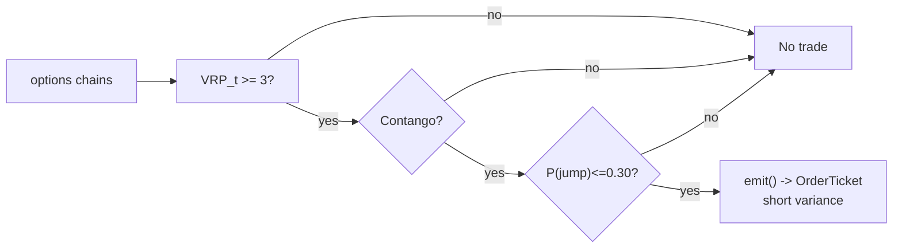

# T010 — Variance-Risk-Premium Harvester

> **Reviewer card.** Volatility carry: short variance when the variance risk premium is wide (S030), confirmed by contango term structure (S049), gated by jump risk (S050). Provenance **[D]**.
>
> Edge verdict: **AFTER-COST-EDGE** — Bollerslev et al.: VRP predicts returns with 1.5–4.0% quarterly R² [documented]; Carr & Wu: variance risk premia significantly negative for all 30 stocks [documented] [documented].
>
> After-cost: **BEFORE-COST** — one-sentence verdict: VRP predictability is a return-forecasting result, not a traded P&L — short-vol carry is the implementation, and its tail is the jump you gated.
>
> Tier **S** · prototype 40–60 h [example] · loaded cost $6,000–9,000 [example] · latency bar / daily rebalance · risk high (short-vol tail).

> Capacity $10–100M/day notional [example] — variance swaps / VIX futures; institutional capacity, retail via listed options · Executability: Feasible: daily VRP computation + term-structure check; listed-options execution on a retail platform.

## §1  Identity & provenance

This module is a **strategy**: it emits `OrderTicket` intentions only — brokers create orders, strategies never do. Family **F  # volatility carry**, batch **TB2**, provenance **D**.

**Lede.** Volatility carry: short variance when the variance risk premium is wide (S030), confirmed by contango term structure (S049), gated by jump risk (S050). Provenance **[D]**.

**When it dies.** Vol spike; backwardation; P(jump) > `0.30` [example]; the premium inverts.

**Regime gates (provisional).** R001 elevated RV degrades (premium compresses); vol-spike regime inverts.

**Prototype scope.** daily VRP machine + term-structure + jump gate + kill-switch.

## §1.5  Escalation gate

Cheapest viable path: **Polygon.io Options Basic** — options chains (implied vols), 1-min underlying bars at ~$50–150/mo [unverified] [unverified]. build the VRP machine on cheap options data; buy nothing.

Resource budget: `1` core, `<2` GB RAM [internal-est] [internal-est] · compute pattern `per_bar`.

Explicitly out of scope (phase two): variance swaps (institutional); multi-tenor (phase `2`).

Escalation gate: listed options beyond SPY/QQQ [default]; intraday VRP (phase 2) — crossing it requires re-review of §T7 and §T8.

## §T0  Contract — strategies emit intentions, brokers create orders

This strategy's sole output is a list of `OrderTicket` intentions. It never places, routes, or confirms an order. Every ticket carries `parent_signal` (the upstream signal id and its `computed_at`), an `intent_ts`, and a `tif`. The backtest harness fills tickets strictly after the signal bar (`fill_event > signal_event`, t->t+1 causality); any fill timestamped at or before its signal bar is a harness bug and trips the kill switch.

State variables carried between bars: ``vrp`, `ts_slope`, `p_jump`, `position`, `module_state``.

## §T1  Strategy thesis & edge

**Thesis.** Volatility carry: short variance when the variance risk premium is wide (S030), confirmed by contango term structure (S049), gated by jump risk (S050). Provenance **[D]**.

**Edge verdict: AFTER-COST-EDGE** — Bollerslev et al.: VRP predicts returns with 1.5–4.0% quarterly R² [documented]; Carr & Wu: variance risk premia significantly negative for all 30 stocks [documented] [documented].

**After-cost verdict: BEFORE-COST** — one-sentence verdict: VRP predictability is a return-forecasting result, not a traded P&L — short-vol carry is the implementation, and its tail is the jump you gated.

**Risk summary.** Volatility spike (the VRP harvester's nightmare — 2008/2020-style); jump tail; term-structure inversion.

**Math.**

```text
VRP `VRP_t = IV_t − E[RV]` in vol points (S030); term-structure
slope `ts_slope` from the front two tenors (S049); jump probability `P_jump`
(S050). Short variance when the premium is wide and the curve is in contango.
Modeled edge `edge_bps = VRP_t × 10.0` [example].
```

**Pseudocode (normative).**

```text
function emit(state, signals, bars, cfg) -> list[OrderTicket]:
    assert bars non-empty else return UNKNOWN                       # F1
    t = bars[-1]   # newest daily bar, labeled by open time
    vrp = signals['S030'].vrp
    ts  = signals['S049'].ts_slope
    pj  = signals['S050'].p_jump
    assert isfinite(vrp) and isfinite(ts) and isfinite(pj) else return UNKNOWN  # F2
    if ts < cfg.ts_slope_min or pj > cfg.p_jump_max: return []      # gates

    edge_bps = vrp * 10.0                                          # [example]
    cost_ok = expected_cost_bps(notional, adv_pct, venue, side, urgency) <= cfg.cost_gate_k * edge_bps
    # ^^^ normative cost-gate predicate: expected_cost_bps(...) <= k * edge_bps

    tickets = []
    if state.position == 0 and cost_ok and vrp >= cfg.vrp_entry:
        tickets = [ticket(side='SELL', symbol='VARIANCE', qty=size(...), limit=touch(t), tif='DAY',
                          parent_signal=f"S030@{t.bar_open_ts}")]
    else:
        if vrp <= cfg.vrp_exit or vrp <= cfg.stop_vrp: tickets = flatten_all(state)
    for tk in tickets: log_decision(tk, inputs_hash, params_hash)  # C5 / App. g
    assert fill.event_ts > t.bar_close_ts for any fill             # t->t+1 causality
    return tickets
```

## §T2  Signal stack — dependencies & data rights

| Signal | Role | Contract |
|---|---|---|
| `S030` | trigger | VRP_t >= 3 vol points [example] — the premium must be wide enough to harvest |
| `S049` | confirm | term-structure slope >= 0 [example] (contango); backwardation vetoes |
| `S050` | gate | no entry if P(jump) > 0.30 [example]; jumps are the VRP's tail |

Max dependency depth: `2` [default].

**Schema mapping (canonical).**

| Vendor (Polygon.io Options) | Canonical |
|---|---|
| `implied_volatility` | `iv` (float, annualized) |
| `t` (ms) | `bar_open_ts` (int64 ns UTC) |

Staleness: max skew `5 s` [default] · jitter budget `60 s` [default] · TTL `300 s` [default] · cadence `per_bar (daily)` · tz `America/New_York`.

**Inputs that break the module.**

| Input failure | Module state | Alert |
|---|---|---|
| Term structure in backwardation (gate) [example] | `DEGRADED` (no new shorts) | log |
| P(jump) > 0.30 (gate) [example] | `DEGRADED` (no new shorts) | notify |
| Options chain stale | `UNKNOWN` | page |

**Data rights.** Options chains via Polygon.io Options Basic, `rights: licensed`;
research + production; fixtures synthetic; entitlement = professional/internal;
derived features ours. Entitlement-class change → §1.5 escalation gate.

**Build vs buy.** Build the VRP machine on cheap options data; buy nothing — the
jump gate and term-structure confirm are your IP.

**Local build.** Feasible. VRP is a daily computation; the state machine is
trivial; listed options are the retail vehicle.

**Data dictionary (canonical fields).**

| Field | Type | Cadence | Tier | Notes |
|---|---|---|---|---|
| `Options chains (implied vols)` | float | daily | Tier 1 | S030 VRP inputs |
| `1-min underlying bars` | float/int | 1-min | Tier 1 | realized vol |
| `Term-structure tenors` | float | daily | Tier 2 | S049 slope |

## §T3  Entry / exit / sizing & worked example

**Entry rule.**

```text
ENTER_SHORT_VAR := (VRP_t >= vrp_entry) AND (ts_slope >= ts_slope_min)
               AND (P_jump <= p_jump_max) AND (expected_cost_bps(...) <= cost_gate_k * edge_bps)
FLAT := otherwise
```

**Exit rule.**

```text
EXIT := (VRP_t <= vrp_exit) [premium harvested] OR (VRP_t <= stop_vrp) [stop: premium inverts]
        OR (ts_slope < 0 → unwind) OR (P_jump > 0.30 → unwind) OR (module_state != OK)
```

**Cooldown.** `0` s [default] after every exit (C10).

**Sizing function (normative).**

```python
def shares(risk_budget_R, stop_distance, vol_estimate, ADV_cap, cost):
    # risk_budget_R in $; stop_distance = premium stop in vol points
    n = risk_budget_R / max(stop_distance, 1e-9)   # [default] floor below
    n = min(n, 20000000.0 / 100.0)                 # $20M vega-notional cap [default]
    return int(n)
```

**Risk limits.**

| Limit | Value |
|---|---|
| Daily loss stop | `-$10,000` [example] → dark |
| Max vega notional | `$20M` [example] |
| Vol-spike kill | realized > `2`× implied [example] → unwind |
| Weekend flatten | no short-vol over weekends on jump risk |

**Worked example (fixture-backed, from `fixtures/T010_tape.csv` trade 1).**

Trade 1: `SELL` `100` shares [example] @ `20.5` [example], exit `17.2` [example] (`VRP harvested`). Gross P&L = `330.00` [measured] dollars. Cost stack = `13.0` bps [example] → `2.67` [measured] dollars on `2050.00` [example] notional. Net = `327.34` [measured] dollars. The fixture's expected CSV carries the same arithmetic for all six trades; the per-module test recomputes it from the tape and asserts equality.

**Flow.**


## §T4  Parameters

| Parameter | Key | Default | Provenance | Sensitivity |
|---|---|---|---|---|
| VRP entry | `vrp_entry` | `3` vol pts | [default] | high |
| VRP exit | `vrp_exit` | `1` vol pt | [default] | medium |
| Term-structure min | `ts_slope_min` | `0` | [default] | high |
| Jump max | `p_jump_max` | `0.30` | [default] | high |
| Stop VRP | `stop_vrp` | `-1` vol pt | [default] | high |
| Cost-gate k | `cost_gate_k` | `0.5` | [default] | high |

## §T5  Costs — the callable is the single source of truth

| Component | bps | Basis |
|---|---|---|
| Spread | `5.0` | [example] options bid/ask on variance exposure at the money |
| Fees | `3.0` | [example] options commissions per contract equivalent |
| Borrow | `0.0` | [default] variance exposure; no borrow |
| Impact | `5.0` | [example] rolling variance exposure |
| **Total** | `13.0` | [example] reference stack |

Fee schedule as of `2026-09-01` [example] · venue `options exchange / SIP [example]` · side `taker` · borrow `0.0` bps/day [example] — variance exposure carries no borrow.

```python
def expected_cost_bps(notional, adv_pct, venue, side, urgency) -> float:
    """Callable cost model - T010 COST block (single source of truth)."""
    spread_bps = 5.0    # [example] options bid/ask on variance exposure at the money
    fee_bps = 3.0       # [example] options commissions per contract equivalent
    borrow_bps = 0.0    # [default] variance exposure; no borrow
    impact_bps = 5.0    # [example] rolling variance exposure
    return spread_bps + fee_bps + borrow_bps + impact_bps
```

**Normative cost-gate predicate (C3):** `expected_cost_bps(...) <= k * edge_bps` — no ticket is emitted unless the callable cost clears this gate. The predicate appears verbatim in the §T1 pseudocode and is asserted by the per-module test.

## §T6  Execution assumptions

| Aspect | Assumption |
|---|---|
| Latency | daily; fill at the close |
| Partial fills | oldest `intent_ts` first (FIFO) |
| Impact | `5` bps modeled [example] |
| Adverse fill | vol-spike gap — the jump gate and the stop are the controls |

## §T7  Risk contract & kill switch

Per-trade R: `$2,000` [example] per variance unit · daily loss stop: `- $10,000` [example] then dark · max gross: `$20M` vega notional [example] · max adverse per trade: `2.0`x premium collected [default].

Enforcement: `intraday-hard` [default]. Calibration recipe: VRP on `5`-year history [default]; jump model recalibrated quarterly [default]; re-pin fee schedule monthly [default].

**Kill switch: `ARMED` → `TRIPPED` → `RECOVERY` → `ARMED`.**

Trip conditions:

- vol spike: realized > 2× implied [example]
- term structure inverts [example]
- clock skew > 50 ms [example]
- options chain stale > 5 min [example]

On trip: the module stops emitting tickets immediately, flattens managed positions per the exit rule, and pages. `RECOVERY` requires manual review, cooldown expiry, and healthy feeds; only then does the module return to `ARMED`. The per-module test drives the full transition cycle.

**Ops.** Schedule: Daily: evaluate VRP at `15:45` ET [example]; rebalance variance exposure; flat over weekends on jump risk · budget: `1` vCPU, `2` GB RAM [internal-est] [internal-est] · env: `POLYGON_API_KEY`.

**Universe.** SPY/QQQ variance via listed options [example]; single-name extension
on large-caps with liquid options. Daily rebalance. Exclude: earnings weeks on
single names; vol-spike regimes.

## §T8  Compliance (C1–C10+)

- **C1** | No orders: the strategy emits `OrderTicket` intentions only; the broker creates orders.
- **C2** | Kill switch: `ARMED` → `TRIPPED` → `RECOVERY` → `ARMED` on the trip conditions in §T7.
- **C3** | Cost gate: `expected_cost_bps(...) <= k * edge_bps` before any ticket (see §T5).
- **C4** | Causality: `fill_event > signal_event` (t->t+1); no signal-bar fills, ever.
- **C5** | Decision log: every ticket logged with inputs hash and params hash (see App. g).
- **C6** | Staleness: inputs older than the TTL → `UNKNOWN`, no tickets.
- **C7** | Short discipline: `locate_ok` required before any short ticket.
- **C8** | Cooldown: post-exit cooldown enforced in seconds; no re-entry inside it.
- **C9** | Session flatten: no uncommanded overnight carry.
- **C10** | Position caps: per-trade R, daily loss stop, and max gross enforced.
- **C11 | Jump gate: trigger = P(jump) > `0.30` [example] → check = S050 → action = no new shorts, unwind existing → log = `COMPLIANCE_BLOCK`**
- **C12 | Vol-spike kill: trigger = realized > `2`× implied [example] → check = realized vs IV → action = unwind → log = `GATE_VETO`**

## §T9  Evidence, failures & regime gates

**Evidence (cost-level tokens; every statistic tagged).**

| Source | Sample | Finding | Cost level | Caveat |
|---|---|---|---|---|
| Bollerslev, Tauchen & Zhou (2009) [documented] | S&P 500, `1990`–`2007` [documented] | VRP predicts quarterly returns, R² `1.5`–`4.0`% [documented] | `BEFORE-COST` (return forecasting) | predictability, not a traded P&L |
| Carr & Wu (2009) [documented] | `5` stock indexes + `35` individual stocks, options, `1996`–`2003` [documented] | variance risk premia negative for indexes and most stocks, but significantly negative at `95`% for only `7` of `35` stocks [documented] | `BEFORE-COST` (premium estimation) | the premium exists; harvesting is the implementation |
| Bollerslev et al. (2014) [documented] | international indices | VRP predictability confirmed internationally [documented] | `BEFORE-COST` | robustness across markets |

**Where this module is known to fail.** volatility spikes, term-structure inversion, jump realizations, premium inversion.

**Failure modes (detect → action → recovery).**

| # | Failure | Detect → action → recovery | Executable check |
|---|---|---|---|
| 1 | Vol spike | detect: realized > `2`× implied → action: unwind (C12) → recovery: premium re-widens [default] | `realized <= 2*implied` |
| 2 | Jump realization | detect: P_jump > `0.30` → action: no new shorts, unwind (C11) → recovery: jump risk normal [default] | `p_jump <= 0.30` |
| 3 | Premium inverts | detect: VRP <= `-1` → action: stop, flatten → recovery: premium positive [default] | `vrp > -1` |
| 4 | Cost blowup | detect: cost gate failing → action: stand down → recovery: re-pin [default] | `expected_cost_bps(...) <= k * edge_bps` |
| 5 | Stale chain | detect: staleness → action: UNKNOWN → recovery: feed healthy [default] | `all(fill_ts > signal_ts)` |

**Regime gates.**

| Regime | Effect | Mechanism | Condition | Action | Latency | Fallback |
|---|---|---|---|---|---|---|
| R001 | degrades | elevated RV: premium compresses | rv_pctile > 70 [default] | halve | 1 bar [default] | veto |
| R001 | inverts | vol spike | realized > 2x implied [default] | veto | 0 [default] | veto |

**Robustness.** The premium is compensation for jump risk; `vrp_entry` in `2`–`5` [default]
vol points [example] and the jump gate are the calibration surface. Carr &
Wu's significantly-negative premia are the standing evidence; the tail is the
standing risk. Purged/embargoed OOS per S088.

**What the optimistic case assumes (and we do not).** (1) the VRP is assumed harvestable at listed-option spreads —
institutional variance swaps price it tighter; (2) jump risk assumed gated at
`0.30` [example] — jumps are the tail; (3) the premium is assumed to persist.

## §T10  Unverified leads & what would change our mind

- None segregated this pass — all figures above are from the cited papers.

What would change our mind: a purged/embargoed walk-forward with full costs that survives the S088 honesty protocol; a documented after-cost P&L from the cited authors' own implementations; or a regime-gated replication that holds outside the original sample.

## AI build prompt

```text
Build the T010 (Variance-Risk-Premium Harvester) strategy module from this specification.
Hard constraints:
- The strategy emits OrderTicket intentions ONLY; it never creates orders (C1).
- Causality: fill_event > signal_event (t->t+1); no signal-bar fills (C4).
- Cost gate: expected_cost_bps(...) <= k * edge_bps before any ticket (C3).
- Kill switch ARMED -> TRIPPED -> RECOVERY -> ARMED on the §T7 trip conditions (C2).
- Every numeric literal in prose carries an honesty tag [documented]/[measured]/[example]/[unverified]/[default]/[internal-est]; exempt identifiers only.
- Sources must be real and cited with cost-level tokens; chatbot-only material goes to §T10.
Config surface:
- vrp_entry (float): default 3.0, range 1.0–8.0 [default]
- vrp_exit (float): default 1.0, range 0.0–3.0 [default]
- ts_slope_min (float): default 0.0, range -2.0–2.0 [default]
- p_jump_max (float): default 0.30, range 0.1–0.6 [default]
- stop_vrp (float): default -1.0, range -5.0–0.0 [default]
- cooldown_s (float): default 0.0, range 0–3,600 [default]
- cost_gate_k (float): default 0.5, range 0.1–2.0 [default]
Entry rule:
ENTER_SHORT_VAR := (VRP_t >= vrp_entry) AND (ts_slope >= ts_slope_min)
               AND (P_jump <= p_jump_max) AND (expected_cost_bps(...) <= cost_gate_k * edge_bps)
FLAT := otherwise
Exit rule:
EXIT := (VRP_t <= vrp_exit) [premium harvested] OR (VRP_t <= stop_vrp) [stop: premium inverts]
        OR (ts_slope < 0 → unwind) OR (P_jump > 0.30 → unwind) OR (module_state != OK)
Sizing: implement the §T3 sizing_fn verbatim; enforce the §T7 risk contract.
Deliverables: the module markdown (all sections §1–§T10), the fixture tape CSV
(fixtures/T010_tape.csv), the expected CSV (fixtures/T010_expected.csv), and
the per-module test (modules/tests/test_T010.py) covering fixture arithmetic,
causality, the cost gate, the kill-switch cycle, invalid→UNKNOWN, and the callable signature.
```
