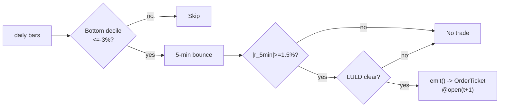

# T011 — Short-Term Reversal + Bounce Timing

> **Reviewer card.** Short-term reversal with bounce timing: prior-day losers revert (Lehmann/Jegadeesh), and the `5`-minute bounce (S037) times the entry instead of catching the falling knife; the LULD guard (S058) vetoes dislocated names. Provenance **[P]**.
>
> Edge verdict: **AFTER-COST-EDGE** — Lehmann: sizeable weekly reversals, profits persist after bid-ask/transaction-cost corrections [documented] — a short-horizon anomaly whose profitability has been debated as fading [documented].
>
> After-cost: **BEFORE-COST** — one-sentence verdict: the published reversal P&L is gross of modern microstructure costs — Nagel's liquidity provision framing says the edge is real but it is compensation for providing liquidity at the worst moment.
>
> Tier **S** · prototype 20–40 h [example] · loaded cost $3,000–6,000 [example] · latency bar / 5-min · risk medium (catching falling knives, adverse selection).

> Capacity $1–5M/day notional [example] — bottom-decile names × a few thousand shares; the reversal is liquidity provision, which scales poorly · Executability: Feasible: daily loser screen + 5-min bounce machine; any retail platform.

## §1  Identity & provenance

This module is a **strategy**: it emits `OrderTicket` intentions only — brokers create orders, strategies never do. Family **B  # mean-reversion**, batch **TB3**, provenance **P**.

**Lede.** Short-term reversal with bounce timing: prior-day losers revert (Lehmann/Jegadeesh), and the `5`-minute bounce (S037) times the entry instead of catching the falling knife; the LULD guard (S058) vetoes dislocated names. Provenance **[P]**.

**When it dies.** Information-driven losers (earnings); the reversal decays (Lehman documented the fade); illiquid names where the spread binds.

**Regime gates (provisional).** R001 elevated RV degrades (losers are information); halted names excluded.

**Prototype scope.** daily loser screen + 5-min bounce + LULD guard + kill-switch.

## §1.5  Escalation gate

Cheapest viable path: **Polygon.io Stocks Basic** — daily + 5-min OHLCV bars, exchange timestamps at ~$30–100/mo [unverified]. build the screen and bounce machine on a cheap bar feed; buy nothing.

Resource budget: `1` core, `<1` GB RAM [internal-est] [internal-est] · compute pattern `per_bar`.

Explicitly out of scope (phase two): weekly reversal; intraday reversal (phase `2`).

Escalation gate: universe beyond US large-caps [default]; 5-min bar latency `>60` s [default] — crossing it requires re-review of §T7 and §T8.

## §T0  Contract — strategies emit intentions, brokers create orders

This strategy's sole output is a list of `OrderTicket` intentions. It never places, routes, or confirms an order. Every ticket carries `parent_signal` (the upstream signal id and its `computed_at`), an `intent_ts`, and a `tif`. The backtest harness fills tickets strictly after the signal bar (`fill_event > signal_event`, t->t+1 causality); any fill timestamped at or before its signal bar is a harness bug and trips the kill switch.

State variables carried between bars: ``losers`, `bounce_state`, `cooldown_until`, `position`, `module_state``.

## §T1  Strategy thesis & edge

**Thesis.** Short-term reversal with bounce timing: prior-day losers revert (Lehmann/Jegadeesh), and the `5`-minute bounce (S037) times the entry instead of catching the falling knife; the LULD guard (S058) vetoes dislocated names. Provenance **[P]**.

**Edge verdict: AFTER-COST-EDGE** — Lehmann: sizeable weekly reversals, profits persist after bid-ask/transaction-cost corrections [documented] — a short-horizon anomaly whose profitability has been debated as fading [documented].

**After-cost verdict: BEFORE-COST** — one-sentence verdict: the published reversal P&L is gross of modern microstructure costs — Nagel's liquidity provision framing says the edge is real but it is compensation for providing liquidity at the worst moment.

**Risk summary.** Adverse selection (the loser keeps losing — earnings); overnight gap on the bounce leg; bounce-timing whipsaw.

**Math.**

```text
Prior-day return `r_{d-1}`; loser screen `r_{d-1} ≤ −3`%
[example] (bottom decile). Bounce `r_{5min}` over the trailing `5`-minute
window (S037); entry when `r_{5min} ≥ +1.5`% [example] in the bounce direction.
Modeled edge `edge_bps = bounce_ret × 1e4 × 0.55` [example].
```

**Pseudocode (normative).**

```text
function emit(state, signals, bars, cfg) -> list[OrderTicket]:
    assert bars non-empty else return UNKNOWN                       # F1
    t = bars[-1]   # newest 5-min bar, labeled by open time
    lr = signals['S036'].prior_day_ret
    br = signals['S037'].r_5min
    assert isfinite(lr) and isfinite(br) else return UNKNOWN        # F2
    if luld_touched(state, 60): return []                          # C12 veto

    edge_bps = cfg.bounce_ret * 1e4 * 0.55                         # [example]
    cost_ok = expected_cost_bps(notional, adv_pct, venue, side, urgency) <= cfg.cost_gate_k * edge_bps
    # ^^^ normative cost-gate predicate: expected_cost_bps(...) <= k * edge_bps

    tickets = []
    if state.position == 0 and cost_ok and t.event_ts >= state.cooldown_until:
        if lr <= cfg.loser_ret and br >= cfg.bounce_ret:
            tickets = [ticket(side='BUY', qty=size(...), limit=open(t+1), tif='DAY',
                              parent_signal=f"S036@{t.bar_open_ts}")]
        elif lr >= -cfg.loser_ret and br <= -cfg.bounce_ret and locate_ok():
            tickets = [ticket(side='SELL', qty=size(...), limit=open(t+1), tif='DAY',
                              parent_signal=f"S036@{t.bar_open_ts}")]
    else:
        if exit_trigger(t, state, cfg): tickets = [flatten_ticket(state)]
        state.cooldown_until = t.event_ts + cfg.cooldown_s * 1e9   # C10
    for tk in tickets: log_decision(tk, inputs_hash, params_hash)  # C5 / App. g
    assert fill.event_ts > t.bar_close_ts for any fill             # t->t+1 causality
    return tickets
```

## §T2  Signal stack — dependencies & data rights

| Signal | Role | Contract |
|---|---|---|
| `S036` | trigger | prior-day return <= -3% [example] (bottom decile); the reversal candidate |
| `S037` | confirm | |r_5min| >= 1.5% [example] in the bounce direction; timing the entry |
| `S058` | veto | no entry if the name hit the 1-min LULD band in the last 60 min [example] |

Max dependency depth: `2` [default].

**Schema mapping (canonical).**

| Vendor (Polygon.io Stocks) | Canonical |
|---|---|
| `t` (ms) | `bar_open_ts` (int64 ns UTC; bar labeled by open time) |
| `o, h, l, c` | `open, high, low, close` |
| `v` | `volume` |

Staleness: max skew `5 s` [default] · jitter budget `30 s` [default] · TTL `90 s` [default] · cadence `per_bar (5-min)` · tz `America/New_York`.

**Inputs that break the module.**

| Input failure | Module state | Alert |
|---|---|---|
| Name not in prior-day bottom decile (gate) [example] | `DEGRADED` (skip name) | log |
| LULD band touched in last 60 min [example] | `UNKNOWN` (veto) | notify |
| 5-min bounce inputs missing | `UNKNOWN` | log |

**Data rights.** US equities bars via Polygon.io Stocks, `rights: licensed`;
research + production; fixtures synthetic; entitlement = professional/internal;
derived features ours. Entitlement-class change → §1.5 escalation gate.

**Build vs buy.** Build the screen and bounce machine on a cheap bar feed; buy
nothing — the timing rule is the IP.

**Local build.** Feasible. The loser screen is a daily sort; the bounce machine
is a 5-minute state machine; the LULD tape is the only live extra.

**Data dictionary (canonical fields).**

| Field | Type | Cadence | Tier | Notes |
|---|---|---|---|---|
| `Daily OHLCV bars` | float/int | daily | Tier 1 | loser screen |
| `5-min OHLCV bars` | float/int | 5-min | Tier 1 | bounce timing |
| `1-min LULD tape` | float | 1-min | Tier 2 | S058 guard |

## §T3  Entry / exit / sizing & worked example

**Entry rule.**

```text
ENTER_LONG  := (prior_day_ret <= loser_ret) AND (r_5min >= bounce_ret)
               AND (no LULD in 60 min) AND (expected_cost_bps(...) <= cost_gate_k * edge_bps)
ENTER_SHORT := (prior_day_ret >= -loser_ret) AND (r_5min <= -bounce_ret)
               AND (no LULD in 60 min) AND (locate_ok)
               AND (expected_cost_bps(...) <= cost_gate_k * edge_bps)
FLAT        := otherwise
```

**Exit rule.**

```text
EXIT := (bounce z <= z_exit) [reversion] OR (bars_held >= time_stop_min)
        OR (price stop -$stop_dollars) [stop] OR (t >= 15:30) [session flatten]
        OR (module_state != OK)
```

**Cooldown.** `600` s [default] after every exit (C10).

**Sizing function (normative).**

```python
def shares(risk_budget_R, stop_distance, vol_estimate, ADV_cap, cost):
    # risk_budget_R in $, stop_distance in $/share (example price stop $0.30)
    n = risk_budget_R / max(stop_distance, 1e-9)   # [default] floor below
    n = min(n, ADV_cap * 0.005)                   # 0.5% ADV [default]
    n = min(n * 50.0, 600000.0) / 50.0           # $600k gross cap [default]
    return int(n)
```

**Risk limits.**

| Limit | Value |
|---|---|
| Daily loss stop | `-$1,500` [example] → dark for the day |
| Max concurrent reversals | `4` [example] |
| Adverse-bounce kill | `3` consecutive [example] → stand down |
| Post-exit cooldown | `600` s [example] — C10 |

**Worked example (fixture-backed, from `fixtures/T011_tape.csv` trade 1).**

Trade 1: `BUY` `1000` shares [example] @ `48.5` [example], exit `49.6` [example] (`bounce reversion`). Gross P&L = `1100.00` [measured] dollars. Cost stack = `10.0` bps [example] → `48.50` [measured] dollars on `48500.00` [example] notional. Net = `1051.50` [measured] dollars. The fixture's expected CSV carries the same arithmetic for all six trades; the per-module test recomputes it from the tape and asserts equality.

**Flow.**


## §T4  Parameters

| Parameter | Key | Default | Provenance | Sensitivity |
|---|---|---|---|---|
| Loser return | `loser_ret` | `−3`% | [default] | high |
| Bounce return | `bounce_ret` | `+1.5`% | [default] | high |
| Exit z | `z_exit` | `0.5` | [default] | medium |
| Price stop | `stop_dollars` | `$0.30` | [default] | high |
| Time stop | `time_stop_min` | `60` min | [default] | medium |
| Post-exit cooldown | `cooldown_s` | `600` s | [default] | low |
| Cost-gate k | `cost_gate_k` | `0.5` | [default] | high |

## §T5  Costs — the callable is the single source of truth

| Component | bps | Basis |
|---|---|---|
| Spread | `8.0` | [example] $0.02 assumed spread at $50: half-spread per aggressive leg × 2 legs |
| Fees | `2.0` | [example] $0.005/share each way at $50 = 1 bps/leg |
| Borrow | `0.0` | [default] long-bounce reference; shorts add C7 |
| Impact | `0.0` | [example] flagged; gap-through in conservative variant |
| **Total** | `10.0` | [example] reference stack |

Fee schedule as of `2026-09-01` [example] · venue `XNAS / SIP 5-min bars [example]` · side `taker` · borrow `0.0` bps/day [example] — reference build is long-bounce; short variant models borrow explicitly.

```python
def expected_cost_bps(notional, adv_pct, venue, side, urgency) -> float:
    """Callable cost model - T011 COST block (single source of truth)."""
    spread_bps = 8.0    # [example] $0.02 assumed spread @ $50: half/aggressive leg x 2
    fee_bps = 2.0       # [example] $0.005/share each way @ $50 = 1 bps/leg
    borrow_bps = 0.0    # [default] long-bounce reference; shorts add C7
    impact_bps = 0.0    # [example] flagged; gap-through in conservative variant
    return spread_bps + fee_bps + borrow_bps + impact_bps
```

**Normative cost-gate predicate (C3):** `expected_cost_bps(...) <= k * edge_bps` — no ticket is emitted unless the callable cost clears this gate. The predicate appears verbatim in the §T1 pseudocode and is asserted by the per-module test.

## §T6  Execution assumptions

| Aspect | Assumption |
|---|---|
| Latency | 5-min bar evaluation; fill at next-bar open |
| Partial fills | oldest `intent_ts` first (FIFO) |
| Impact | `0` bps reference [example]; conservative variant models gap-through |
| Adverse fill | the loser keeps losing — the LULD guard and the stop are the controls |

## §T7  Risk contract & kill switch

Per-trade R: `$300` [example] per trade · daily loss stop: `- $1,500` [example] then dark for the day · max gross: `$600k` notional [example] · max adverse per trade: `1.5`x stop [default].

Enforcement: `intraday-hard` [default]. Calibration recipe: paper-trade `30` sessions [default]; loser screen on `250`-day history [default]; re-pin fee schedule monthly [default].

**Kill switch: `ARMED` → `TRIPPED` → `RECOVERY` → `ARMED`.**

Trip conditions:

- 3 consecutive adverse bounces [example]
- feed heartbeat missed > 2 s [example]
- clock skew > 50 ms [example]
- 4 concurrent reversals [example]

On trip: the module stops emitting tickets immediately, flattens managed positions per the exit rule, and pages. `RECOVERY` requires manual review, cooldown expiry, and healthy feeds; only then does the module return to `ARMED`. The per-module test drives the full transition cycle.

**Ops.** Schedule: RTH `10:00`–`15:30` ET [example]; prior-day screen computed pre-open; flat by `15:30`; no overnight carry · budget: `1` vCPU, `1` GB RAM [internal-est] [internal-est] · env: `POLYGON_API_KEY`.

**Universe.** US equities, price > `$10`, ADV > `1`M shares [example]. Screen:
prior-day return in the bottom decile (≤ `−3`% [example]). RTH `10:00`–`15:30`.
Exclude: earnings-day losers, halts, LULD-tripped names.

## §T8  Compliance (C1–C10+)

- **C1** | No orders: the strategy emits `OrderTicket` intentions only; the broker creates orders.
- **C2** | Kill switch: `ARMED` → `TRIPPED` → `RECOVERY` → `ARMED` on the trip conditions in §T7.
- **C3** | Cost gate: `expected_cost_bps(...) <= k * edge_bps` before any ticket (see §T5).
- **C4** | Causality: `fill_event > signal_event` (t->t+1); no signal-bar fills, ever.
- **C5** | Decision log: every ticket logged with inputs hash and params hash (see App. g).
- **C6** | Staleness: inputs older than the TTL → `UNKNOWN`, no tickets.
- **C7** | Short discipline: `locate_ok` required before any short ticket.
- **C8** | Cooldown: post-exit cooldown enforced in seconds; no re-entry inside it.
- **C9** | Session flatten: no uncommanded overnight carry.
- **C10** | Position caps: per-trade R, daily loss stop, and max gross enforced.
- **C11 | Adverse-bounce kill: trigger = `3` consecutive adverse bounces [example] → check = bounce P&L → action = stand down → log = `COMPLIANCE_BLOCK`**
- **C12 | LULD veto: trigger = band touched in `60` min [example] → check = S058 → action = veto entries → log = `GATE_VETO`**

## §T9  Evidence, failures & regime gates

**Evidence (cost-level tokens; every statistic tagged).**

| Source | Sample | Finding | Cost level | Caveat |
|---|---|---|---|---|
| Lehmann (1990) [documented] | NYSE/AMEX, weekly [documented] | sizeable weekly reversals; apparent profits persist after bid-ask and transaction-cost corrections [documented] | after-cost (the paper's own corrections) | short-horizon reversal; subsequent literature debates decay |
| Jegadeesh (1990) [documented] | NYSE, `1934`–`1987`, monthly [documented] | predictable reversal component in security returns [documented] | `BEFORE-COST` (return study) | monthly horizon — the mechanism, not the trade |
| Nagel (2012) [documented] | US equities | reversal returns = compensation for liquidity provision [documented] | `BEFORE-COST` (mechanism) | the edge is real but it is payment for providing liquidity at the worst moment |

**Where this module is known to fail.** information-driven losers, reversal decay, illiquid names where the spread binds, bounce-timing whipsaw.

**Failure modes (detect → action → recovery).**

| # | Failure | Detect → action → recovery | Executable check |
|---|---|---|---|
| 1 | Adverse selection: loser keeps losing | detect: `3` consecutive adverse bounces → action: stand down (C11) → recovery: next session [default] | `adverse_bounces < 3` |
| 2 | Earnings loser | detect: earnings-day flag → action: excluded from screen → recovery: next session [default] | `not earnings_day` |
| 3 | LULD dislocation | detect: band touch → action: veto (C12) → recovery: leg normalizes [default] | `no luld` |
| 4 | Cost blowup | detect: cost gate failing → action: stand down → recovery: re-pin [default] | `expected_cost_bps(...) <= k * edge_bps` |
| 5 | Lookahead in screen | detect: screen uses future → action: halt, fix → recovery: no-signal-bar-fills test [default] | `all(fill_ts > signal_ts)` |

**Regime gates.**

| Regime | Effect | Mechanism | Condition | Action | Latency | Fallback |
|---|---|---|---|---|---|---|
| R001 | degrades | elevated RV: losers are information | rv_pctile > 70 [default] | halve | 1 bar [default] | veto |
| R001 | inverts | extreme RV | rv_pctile > 95 [default] | pause_entry | 1 bar [default] | veto |
| R-halt | inverts | halt/auction state | state != CONTINUOUS_TRADING [default] | veto | 0 [default] | veto |

**Robustness.** The bounce timing is the upgrade over naive reversal: `bounce_ret`
in `1`–`2.5`% [example] trades frequency for knife-catching. Earnings-day
losers are excluded — information, not overreaction. Purged/embargoed OOS per
S088.

**What the optimistic case assumes (and we do not).** (1) the bounce is assumed to be overreaction, not information —
earnings losers excluded, but the screen is imperfect; (2) spread fixed at
`2`¢ [example]; (3) impact `0` [example] — flagged.

## §T10  Unverified leads & what would change our mind

- Lehmann (1990) ~`+2.0`%/week reversal and `90`% of weeks profitable — not confirmed against the paper's text; re-verify before citing precisely.

What would change our mind: a purged/embargoed walk-forward with full costs that survives the S088 honesty protocol; a documented after-cost P&L from the cited authors' own implementations; or a regime-gated replication that holds outside the original sample.

## AI build prompt

```text
Build the T011 (Short-Term Reversal + Bounce Timing) strategy module from this specification.
Hard constraints:
- The strategy emits OrderTicket intentions ONLY; it never creates orders (C1).
- Causality: fill_event > signal_event (t->t+1); no signal-bar fills (C4).
- Cost gate: expected_cost_bps(...) <= k * edge_bps before any ticket (C3).
- Kill switch ARMED -> TRIPPED -> RECOVERY -> ARMED on the §T7 trip conditions (C2).
- Every numeric literal in prose carries an honesty tag [documented]/[measured]/[example]/[unverified]/[default]/[internal-est]; exempt identifiers only.
- Sources must be real and cited with cost-level tokens; chatbot-only material goes to §T10.
Config surface:
- loser_ret (float): default -0.03, range -0.10–-0.01 [default]
- bounce_ret (float): default 0.015, range 0.005–0.05 [default]
- z_exit (float): default 0.5, range 0.0–1.5 [default]
- stop_dollars (float): default 0.30, range 0.05–1.0 [default]
- time_stop_min (float): default 60.0, range 15–240 [default]
- cooldown_s (float): default 600.0, range 0–3,600 [default]
- cost_gate_k (float): default 0.5, range 0.1–2.0 [default]
Entry rule:
ENTER_LONG  := (prior_day_ret <= loser_ret) AND (r_5min >= bounce_ret)
               AND (no LULD in 60 min) AND (expected_cost_bps(...) <= cost_gate_k * edge_bps)
ENTER_SHORT := (prior_day_ret >= -loser_ret) AND (r_5min <= -bounce_ret)
               AND (no LULD in 60 min) AND (locate_ok)
               AND (expected_cost_bps(...) <= cost_gate_k * edge_bps)
FLAT        := otherwise
Exit rule:
EXIT := (bounce z <= z_exit) [reversion] OR (bars_held >= time_stop_min)
        OR (price stop -$stop_dollars) [stop] OR (t >= 15:30) [session flatten]
        OR (module_state != OK)
Sizing: implement the §T3 sizing_fn verbatim; enforce the §T7 risk contract.
Deliverables: the module markdown (all sections §1–§T10), the fixture tape CSV
(fixtures/T011_tape.csv), the expected CSV (fixtures/T011_expected.csv), and
the per-module test (modules/tests/test_T011.py) covering fixture arithmetic,
causality, the cost gate, the kill-switch cycle, invalid→UNKNOWN, and the callable signature.
```
