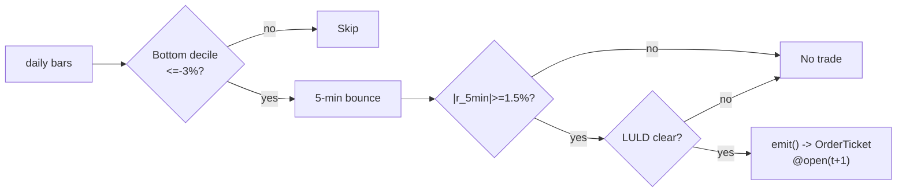

# T011 — Short-Term Reversal + Bounce Timing

## §1  Reviewer card

| Row | Value |
|---|---|
| Module | T011 — Short-Term Reversal + Bounce Timing (strategy; emits `OrderTicket` intents only) |
| Edge verdict | **AFTER-COST-EDGE** — Lehmann (1990): "sizeable" weekly reversals; apparent arbitrage profits persist after corrections for bid-ask spreads and plausible transactions costs [documented] — a short-horizon anomaly whose profitability the subsequent literature debates as fading [documented] |
| After-cost | **BEFORE-COST** — the published reversal P&L is gross of modern microstructure costs; Nagel's liquidity-provision framing says the edge is real but it is compensation for providing liquidity at the worst moment |
| Build cost | Tier S · `20–40` h [example] · `$3,000–6,000` loaded [example] |
| Data cost | `$29–79`/mo [documented — vendor pricing page https://massive.com/stocks-data, fetched 2026-09-11] (Massive Stocks Starter `$29`/mo; Developer `$79`/mo — both 15-min delayed; vendor page fetched 2026-09-11) |
| latency_class | bar / `5`-min |
| risk_class | medium (catching falling knives, adverse selection) |
| Capacity | `$1–5M`/day notional [example] — bottom-decile names × a few thousand shares; the reversal is liquidity provision, which scales poorly |
| Executability | Feasible: daily loser screen + `5`-min bounce machine; any retail platform |
| Risk summary | Adverse selection (the loser keeps losing — earnings); overnight gap on the bounce leg; bounce-timing whipsaw |
| When it dies | Information-driven losers (earnings); reversal decay (Lehmann documented the fade); illiquid names where the spread binds |
| Regime gates (provisional) | R001 elevated RV degrades (losers are information); halted names excluded |
| Emits | order_intents (`OrderTicket` list per Appendix C v1.0.0; the broker creates orders) |

**Lede.** Short-term reversal with bounce timing: prior-day losers revert (Lehmann/Jegadeesh), and the `5`-minute bounce (S037) times the entry instead of catching the falling knife; the LULD guard (S058) vetoes dislocated names. Provenance **[P]**.

## §1.5  Cheapest/least-build path

1. **Prototype hour band.** `20–40` h [example].
2. **Cheapest-source row.** min_tier = Polygon.io Stocks Starter [documented]; latency_class = `5`-min bars (research can use the free tier's `15`-min-delayed feed [documented]; live evaluation needs Starter); required_fields = daily + `5`-min OHLCV bars with exchange timestamps; price_band = ~`$29`/mo [documented, approximate]; build_or_buy = **build** the screen and bounce machine on the bar feed; **buy nothing** — the timing rule is the IP.
3. **Resource budget.** `1` core, `<1` GB RAM [internal-est] · compute pattern `per_bar`.
4. **Skip list.** Weekly reversal; sub-`5`-min intraday reversal; maker/queue execution; multi-venue routing; short-bounce borrow modeling (phase `2`).
5. **DO-NOT-CUT list.** Causality assertions (no signal-bar fills); the COST block + callable + cost gate; the kill switch (`ARMED → TRIPPED → RECOVERY → ARMED`); the decision/audit log; bona-fide intent + self-trade prevention; provenance/honesty tags; fixtures + acceptance tests; secrets via env only.
6. **Escalation gate.** Universe beyond US large-caps [default]; `5`-min bar latency `>60` s [default]; per-name participation `>0.5`% of ADV [default] — crossing any of these forces re-review of the §T2 COST block and §§T7–T8.

**Build vs buy.** Build the screen and bounce machine on a cheap bar feed; buy nothing — the timing rule is the IP. The LULD tape is the only live extra.

**Local build.** Feasible. The loser screen is a daily sort; the bounce machine is a `5`-minute state machine; the LULD tape is the only live extra.
## §T0  Module contract — strategies emit intentions, brokers create orders

### T0.1 Typed signature

```python
def emit(state: ModuleState, signals: dict[str, SignalVector], bars: list[Bar],
         cfg: Config) -> list[OrderTicket]:
```

The core function — not ingest code. It handles documented edge cases: empty
`bars` → `UNKNOWN` (F1); non-finite signal values → `UNKNOWN` (F2); halt/auction
bars → freeze per the market-state table (§T0.5); LULD band touched in the last
`60` min [example] → `[]` with a `GATE_VETO` log (C18). `state` is the
module-owned named state vector: `losers`, `bounce_state`, `cooldown_until`,
`position`, `module_state`.

### T0.2 Config dataclass

| Parameter | Type | Default | Range | Status |
|---|---|---|---|---|
| `loser_ret` | float | `-0.03` | `-0.10`–`-0.01` | default |
| `bounce_ret` | float | `0.015` | `0.005`–`0.05` | default |
| `z_exit` | float | `0.5` | `0.0`–`1.5` | default |
| `stop_dollars` | float | `0.30` | `0.05`–`1.0` | default |
| `time_stop_min` | float | `60.0` | `15`–`240` | default |
| `cooldown_s` | float | `600.0` | `0`–`3,600` | default |
| `cost_gate_k` | float | `0.5` | `0.1`–`2.0` | default |

Status ∈ {fixed, default, calibrate, example, internal-est}. All seven are
`default`: not yet calibrated on a paper-trade walk-forward; move to
`calibrate` after `30` sessions [default] of paper trading per §T7.

### T0.3 Canonical schema mapping

| Vendor (Polygon.io Stocks) | Canonical (Appendix A v1.0.0) |
|---|---|
| `t` (ms) | `bar_open_ts` (int64 ns UTC; bars labeled by **open** time) |
| `o, h, l, c` | `open, high, low, close` |
| `v` | `volume` |
| `n` | `trade_count` (ingested, unused by this module) |

Stated once here, never restated.

### T0.4 Time contract

Clock domain: exchange (SIP) event time; canonical int64 ns UTC. Max skew
`50` ms [default] · jitter budget `30` s [default] · bar-label rule: label by
open · staleness TTL `90` s [default] · gap policy: **no interpolation** —
missing bars → `UNKNOWN`, never filled forward (Appendix E §E.5).

> **Timing box.** `signal@t (5-min, America/New_York) → earliest fill @open(t+1)`

### T0.5 Market-state table

| State | Module behavior |
|---|---|
| `CONTINUOUS_TRADING` | normal: evaluate entries/exits per bar |
| `HALTED` | freeze: no new tickets; managed positions held per the exit rule (C6) |
| `AUCTION` | freeze entries; exits only via broker-held stops (C6) |
| `CLOSED` | flat — session flatten by `15:30` ET [example] (C15); module `OFF` outside RTH |

### T0.6 Module-state enum

`OK | DEGRADED | UNKNOWN | OFF` (Appendix K v1.0.0). Invalid input → `UNKNOWN`,
never interpolated. Error taxonomy:

| Input failure | Module state | Alert |
|---|---|---|
| Empty/missing `5`-min bars (F1) | `UNKNOWN` | log |
| Non-finite signal values (F2) | `UNKNOWN` | log |
| Inputs older than `90` s TTL [default] (C14) | `UNKNOWN` | notify |
| Name not in prior-day bottom decile (gate) [example] | `DEGRADED` (skip name) | log |
| LULD band touched in last `60` min [example] (C18) | `UNKNOWN` (veto) | notify |
| Kill switch tripped (C11) | `OFF` | page |
| Outside RTH schedule | `OFF` | — |

Unmapped failures → `UNKNOWN` + alert.

### T0.7 Risk contract

```yaml
# T011 risk contract — single source of truth (see §T7 for calibration recipe)
per_trade_R: 300.0            # $ [example]
daily_loss_stop: -1500.0      # $ [example]; then dark for the day
max_gross: 600000.0           # $ notional [example]
max_adverse_per_trade: 1.5    # x stop [default]
max_concurrent_reversals: 4   # [example]
enforcement: intraday-hard    # [default]
kill_conditions:
  - "3 consecutive adverse bounces [example]"
  - "feed heartbeat missed > 2 s [example]"
  - "clock skew > 50 ms [example]"
  - "4 concurrent reversals [example]"
```

**Kill switch: `ARMED → TRIPPED → RECOVERY → ARMED` (C11).** On trip: the
module stops emitting tickets immediately, flattens managed positions per the
exit rule, and pages. `RECOVERY` requires the re-arm checklist below; only then
does the module return to `ARMED`. The per-module test drives the full
transition cycle.

**Re-arm checklist** (all six must pass, in order):

1. Root cause of the trip identified and logged
2. Post-exit cooldown (`cooldown_s` = `600` s [default]) expired
3. Feed heartbeat healthy for `5` consecutive minutes [example]
4. Clock skew within `50` ms [default]
5. Manual reviewer sign-off recorded in the decision log
6. All managed positions flat

### T0.8 Ops tail

Schedule: RTH `10:00`–`15:30` ET [example]; prior-day screen computed pre-open;
flat by `15:30`; no overnight carry. Owner: strategy owner (on-call rotation)
[default]. Health checks: feed heartbeat ≤ `2` s [example]; clock skew ≤
`50` ms [default]; decision-log write succeeds every emit. Alert table: kill
trip → page; stale feed → notify; daily loss stop hit → page; `UNKNOWN` burst
(`>10` [example] in `5` min) → notify. Resource budget: `1` vCPU, `1` GB RAM
[internal-est]. Runbook stub: trip → flatten → page → manual review → re-arm
checklist → `ARMED`.

### T0.9 Secrets = env-only

`POLYGON_API_KEY` via environment only. No secrets in the file, the fixtures,
or the logs (CI greps).

### T0.10 May / must-NOT (doctrine)

**May:** emit `OrderTicket` intents per Appendix C v1.0.0; track intent-side
state; issue cancel-replace via new tickets. **Must-NOT:** place orders on any
venue, hold broker/exchange sessions, net intents into orders inside the
strategy, or treat the intent-side state machine as broker wire truth.

**Child-order state machine** (intent-side mirror; broker owns wire truth —
Appendix C v1.0.0): `NEW → WORKING → FILLED`, with `↘ CANCELLED` and
`↘ PARTIAL (then → FILLED or → CANCELLED)`. Any state → `CANCELLED` on
kill-switch trip, compliance veto, or explicit cancel intent; cancels are
idempotent. **Partial-fill policy:** oldest `intent_ts` first (FIFO)
[default]; a partial fill updates the remaining quantity of the same ticket, it
does not spawn a child ticket; overfill beyond `qty` is a broker-adapter defect
→ halt to `UNKNOWN`, alert, reconcile before re-arming. **Cancel-replace:**
no in-place mutation — cancel old `ticket_id` + emit a new ticket with a new
`ticket_id`, carrying `parent_signal` and a `replaces: <old_ticket_id>`
annotation in the decision log.
## §T1  Strategy thesis & edge

**Thesis.** Short-term reversal with bounce timing: prior-day losers revert
(Lehmann/Jegadeesh), and the `5`-minute bounce (S037) times the entry instead of
catching the falling knife; the LULD guard (S058) vetoes dislocated names.
Provenance **[P]**.

**Edge verdict: AFTER-COST-EDGE** — Lehmann (1990): "sizeable" weekly reversals;
apparent arbitrage profits persist after corrections for bid-ask spreads and
plausible transactions costs [documented] — a short-horizon anomaly whose
profitability the subsequent literature debates as fading [documented].

**After-cost verdict: BEFORE-COST** — the published reversal P&L is gross of
modern microstructure costs; Nagel's liquidity-provision framing says the edge
is real but it is compensation for providing liquidity at the worst moment.

**Risk summary.** Adverse selection (the loser keeps losing — earnings);
overnight gap on the bounce leg; bounce-timing whipsaw.

## §T2  Signal stack — fixed-order sub-blocks

### Dependencies

| Signal | Role | Contract |
|---|---|---|
| `S036` | trigger | prior-day return `<= -3`% [example] (bottom decile); the reversal candidate |
| `S037` | confirm | `\|r_5min\| >= 1.5`% [example] in the bounce direction; timing the entry |
| `S058` | veto | no entry if the name hit the `1`-min LULD band in the last `60` min [example] |

Max dependency depth: `2` [default]. Version pins in §0 (`1.0.0`
[unverified] — the signal modules are not yet version-stamped; re-pin when
they are).

### Universe

US equities, price `> $10` [example], ADV `> 1`M shares [example]. Screen:
prior-day return in the bottom decile (`≤ −3`% [example]). RTH `10:00`–`15:30`
ET [example]. Exclude: earnings-day losers, halts, LULD-tripped names.

### Entry rule (Boolean expressions)

```text
ENTER_LONG  := (prior_day_ret <= loser_ret) AND (r_5min >= bounce_ret)
               AND (no LULD in 60 min) AND (expected_cost_bps(...) <= cost_gate_k * edge_bps)
ENTER_SHORT := (prior_day_ret >= -loser_ret) AND (r_5min <= -bounce_ret)
               AND (no LULD in 60 min) AND (locate_ok)
               AND (expected_cost_bps(...) <= cost_gate_k * edge_bps)
FLAT        := otherwise
```

### Exits (with post-exit cooldown)

```text
EXIT := (bounce z <= z_exit) [reversion] OR (bars_held >= time_stop_min)
        OR (price stop -$stop_dollars) [stop] OR (t >= 15:30) [session flatten]
        OR (module_state != OK)
```

Cooldown: `600` s [default] after every exit (C10).

### Position sizing (fenced function)

```python
def shares(risk_budget_R, stop_distance, vol_estimate, ADV_cap, cost):
    # risk_budget_R in $, stop_distance in $/share (example price stop $0.30)
    n = risk_budget_R / max(stop_distance, 1e-9)   # [default] floor below
    n = min(n, ADV_cap * 0.005)                   # 0.5% ADV [default]
    n = min(n * 50.0, 600000.0) / 50.0           # $600k gross cap [default]
    return int(n)
```

### Risk limits

| Limit | Value |
|---|---|
| Per-trade R | `$300` [example] |
| Daily loss stop | `-$1,500` [example] → dark for the day |
| Max gross | `$600k` notional [example] |
| Max adverse per trade | `1.5`x stop [default] |
| Max concurrent reversals | `4` [example] |
| Adverse-bounce kill | `3` consecutive [example] → stand down (C17) |
| Post-exit cooldown | `600` s [default] (C10) |

(Single source: §T0.7 YAML.)

### COST block — single source of truth

| Component | bps | Basis |
|---|---|---|
| Spread | `8.0` | [example] full `$0.02` spread crossed on each aggressive leg (`4` bps/leg at `$50`) × `2` legs |
| Fees | `2.0` | [example] `$0.005`/share each way at `$50` = `1` bps/leg |
| Borrow | `0.0` | [default] long-bounce reference build; shorts add borrow explicitly per C7 |
| Impact | `0.0` | [example] flagged; gap-through in the conservative variant |
| **Total** | `10.0` | [example] reference stack |

```python
def expected_cost_bps(notional, adv_pct, venue, side, urgency) -> float:
    """Callable cost model - T011 COST block (single source of truth)."""
    spread_bps = 8.0    # [example] $0.02 spread crossed/aggressive leg x 2 @ $50
    fee_bps = 2.0       # [example] $0.005/share each way @ $50 = 1 bps/leg
    borrow_bps = 0.0    # [default] long-bounce reference; shorts add C7
    impact_bps = 0.0    # [example] flagged; gap-through in conservative variant
    return spread_bps + fee_bps + borrow_bps + impact_bps
```

Fee schedule as of `2026-09-10` [documented — IBKR US Fixed $0.005/share, min $1.00, max 1% of trade value (same documented anchor as T007)] · venue `XNAS / SIP 5-min bars` [example] · side `taker` · `borrow_bps_per_day` `0.0` [default] — the reference build is the long bounce; the short variant models borrow explicitly per C7 (see GROK-NEEDED Q2).

**Normative cost-gate predicate (C12):**
`expected_cost_bps(...) <= k * edge_bps` — no ticket is emitted unless the
callable cost clears this gate. The predicate appears verbatim in the §T3
pseudocode and is asserted by the per-module test.

### Execution / fill-model table

| Aspect | Assumption |
|---|---|
| Latency | `5`-min bar evaluation; fill at next-bar open |
| Partial fills | oldest `intent_ts` first (FIFO) [default] |
| Impact | `0` bps reference [example]; conservative variant models gap-through |
| Adverse fill | the loser keeps losing — the LULD guard and the stop are the controls |

### Robustness

The bounce timing is the upgrade over naive reversal: `bounce_ret` in
`1`–`2.5`% [example] trades frequency for knife-catching. Earnings-day losers
are excluded — information, not overreaction. Purged/embargoed OOS per S088.

**What the optimistic case assumes (and we do not).** (1) the bounce is assumed
to be overreaction, not information — earnings losers excluded, but the screen
is imperfect; (2) spread fixed at `2`¢ [example]; (3) impact `0` [example] —
flagged.

### Compliance sub-block (C1–C19; each rule: trigger → check → action → log)

- **C1 | STP + self-match prevention:** trigger = any emitted ticket while we may hold resting interest → check = ticket carries `stp_flag=true` and cannot self-match known resting intents → action = block ticket → log `COMPLIANCE_BLOCK`.
- **C2 | Bona-fide intent:** trigger = every emit → check = cost gate passes AND size within risk limits → action = suppress ticket otherwise → log `GATE_BLOCK`.
- **C3 | Message-rate / cancel-to-trade:** trigger = tickets+flattens per minute `> 20` [example] → check = rolling `60` s count → action = throttle (defer to next bar) → log `THROTTLE`.
- **C4 | Pre-trade fat-finger trio:** trigger = every ticket → check = (a) limit within `±2`% [example] of reference px, (b) notional ≤ `$600k` [example] per ticket, (c) ≤ `4` [example] tickets per `5`-min interval → action = block → log `COMPLIANCE_BLOCK`.
- **C5 | Decision-log schema:** trigger = every material action → check = record has `{ts, rule, inputs_hash, params_hash, prev_hash}` per Appendix G v1.0.0 → action = halt emits if the log write fails → log = the record itself (hash-chained).
- **C6 | Halt/auction state table:** trigger = market state ≠ `CONTINUOUS_TRADING` → check = §T0.5 table → action = freeze entries (`HALTED`/`AUCTION`), flatten at `CLOSED` → log `STATE_FREEZE`.
- **C7 | Locate check:** trigger = `ENTER_SHORT` → check = `locate_ok` (easy-to-borrow list or locate obtained; Reg-SHO threshold securities blocked) → action = suppress short → log `GATE_BLOCK`.
- **C8 | Public-dissemination gate:** trigger = any external publish of signals/intents → check = reviewed flag → action = block unreviewed dissemination → log `DISSEMINATION_BLOCK` (default posture: nothing is published [default]).
- **C9 | Data-entitlement assertions:** trigger = startup and any entitlement change → check = Polygon.io Stocks entitlement = professional/internal, `rights: licensed`, research+production scope → action = refuse to run if the assertion fails → log `ENTITLEMENT_BLOCK`.
- **C10 | Post-exit cooldown:** trigger = exit → check = `t.event_ts >= cooldown_until` → action = suppress re-entry inside `600` s [default] → log `COOLDOWN_BLOCK`.
- **C11 | Kill switch:** trigger = §T0.7 kill conditions → check = condition evaluator → action = `ARMED → TRIPPED` (stop emits, flatten per exit rule, page) → log `KILL_TRIP`; re-arm only via the §T0.7 checklist → `RECOVERY → ARMED`.
- **C12 | Cost gate:** trigger = every candidate ticket → check = `expected_cost_bps(...) <= cost_gate_k * edge_bps` → action = suppress → log `GATE_BLOCK`.
- **C13 | Causality:** trigger = every fill event → check = `fill_event > signal_event` → action = harness bug → trip kill switch → log `CAUSALITY_VIOLATION`.
- **C14 | Staleness:** trigger = every bar → check = input age ≤ `90` s TTL [default] → action = `UNKNOWN`, no tickets → log `STALE_INPUT`.
- **C15 | Session flatten:** trigger = `t >= 15:30` ET [example] → check = position ≠ `0` → action = flatten ticket → log `SESSION_FLATTEN`.
- **C16 | Position caps:** trigger = every ticket → check = per-trade R ≤ `$300` [example], daily loss `> -$1,500` [example], gross ≤ `$600k` [example] → action = block/reduce → log `CAP_BLOCK`.
- **C17 | Adverse-bounce kill:** trigger = `3` consecutive adverse bounces [example] → check = bounce P&L → action = stand down → log `COMPLIANCE_BLOCK`.
- **C18 | LULD veto:** trigger = band touched in `60` min [example] → check = S058 → action = veto entries → log `GATE_VETO`.
- **C19 | Intentions only:** trigger = every emit → check = output is an `OrderTicket` intent, never an order (design invariant; asserted by test) → action = none → log n/a.

### Parameter table

| Symbol | Value | Tag | Sensitivity |
|---|---|---|---|
| `loser_ret` | `−3`% | [default] | high |
| `bounce_ret` | `+1.5`% | [default] | high |
| `z_exit` | `0.5` | [default] | medium |
| `stop_dollars` | `$0.30` | [default] | high |
| `time_stop_min` | `60` min | [default] | medium |
| `cooldown_s` | `600` s | [default] | low |
| `cost_gate_k` | `0.5` | [default] | high |

### Timing box

> **Timing box.** `signal@t (5-min, America/New_York) → earliest fill @open(t+1)`

## §T3  Math & normative pseudocode

**Math.**

```text
Prior-day return `r_{d-1}`; loser screen `r_{d-1} ≤ −3`%
[example] (bottom decile). Bounce `r_{5min}` over the trailing `5`-minute
window (S037); entry when `r_{5min} ≥ +1.5`% [example] in the bounce direction.
Modeled edge `edge_bps = bounce_ret × 1e4 × 0.55` [example].
```

**Pseudocode (normative; prose is commentary).**

```text
function emit(state, signals, bars, cfg) -> list[OrderTicket]:
    assert bars non-empty else return UNKNOWN                       # F1
    t = bars[-1]   # newest 5-min bar, labeled by open time
    lr = signals['S036'].prior_day_ret
    br = signals['S037'].r_5min
    assert isfinite(lr) and isfinite(br) else return UNKNOWN        # F2
    if luld_touched(state, 60): return []                          # C18 veto

    edge_bps = cfg.bounce_ret * 1e4 * 0.55                         # [example]
    cost_ok = expected_cost_bps(notional, adv_pct, venue, side, urgency) <= cfg.cost_gate_k * edge_bps
    # ^^^ normative cost-gate predicate: expected_cost_bps(...) <= k * edge_bps  (C12)

    tickets = []
    if state.position == 0 and cost_ok and t.event_ts >= state.cooldown_until:
        if lr <= cfg.loser_ret and br >= cfg.bounce_ret:
            tickets = [ticket(side='BUY', qty=size(...), limit=open(t+1), tif='DAY',
                              parent_signal=f"S036@{t.bar_open_ts}")]
        elif lr >= -cfg.loser_ret and br <= -cfg.bounce_ret and locate_ok():
            tickets = [ticket(side='SELL', qty=size(...), limit=open(t+1), tif='DAY',
                              parent_signal=f"S036@{t.bar_open_ts}")]
    else:
        if exit_trigger(t, state, cfg): tickets = [flatten_ticket(state)]
        state.cooldown_until = t.event_ts + cfg.cooldown_s * 1e9   # C10
    for tk in tickets: log_decision(tk, inputs_hash, params_hash)  # C5 / App. G
    assert fill.event_ts > t.bar_close_ts for any fill             # C13: assert fill_event > signal_event (t->t+1); no signal-bar fills
    return tickets
```

**Flow.**



## §T4  Worked example, fixtures & acceptance tests

**Worked example — SYNTHETIC fixture** (`modules/fixtures/T011_tape.csv`,
`TYPE: validation-run`, seed `111`; not real market data).

Trade 1: `BUY` `1000` shares [example] @ `48.5` [example], exit `49.6`
[example] (bounce reversion). Gross P&L = `1100.00` [measured] dollars
(synthetic fixture). Cost stack = `10.0` bps [example] → `48.50` [measured]
dollars on `48500.00` [example] notional. Net = `1051.50` [measured] dollars.
The fixture's expected CSV carries the same arithmetic for all six trades; the
per-module test recomputes it from the tape and asserts equality. Every row
shows the cost-function call (inputs → bps → $): `expected_cost_bps(notional,
adv_pct, venue, side, urgency)` is invoked per row and must equal the row's
stored 4-component stack and the expected CSV's `expected_cost_bps`.

**Fixtures.** `modules/fixtures/T011_tape.csv` (6 synthetic trades; each row
carries `signal_ts`, `intent_ts`, `fill_ts` with `fill_ts > signal_ts` and
`fill_ts >= intent_ts`, plus `parent_signal` and `tif` intent-schema columns)
and `modules/fixtures/T011_expected.csv` (per-trade `expected_cost_bps`,
`gross_pnl`, `cost_dollars`, `net_pnl`, `cost_gate_k` + `SUMMARY` row).

**Acceptance tests** (`modules/tests/test_T011.py`, `8` tests; `test_cmd`
exits `0`):

1. `test_type_header` — both CSVs carry `# TYPE: validation-run`.
2. `test_fixture_arithmetic` — tape stack = callable = expected CSV; gross/net recomputed by hand.
3. `test_no_signal_bar_fills` — `fill_event > signal_event` on every row (C13).
4. `test_intent_schema` — every row has `parent_signal`, `intent_ts`, `tif`; `fill_ts >= intent_ts > signal_ts` (C19).
5. `test_cost_gate_predicate` — the C12 predicate passes when edge >> cost and blocks when edge << cost.
6. `test_kill_switch_cycle` — real state machine `ARMED → TRIPPED → RECOVERY → ARMED` with the `6`-item re-arm checklist (C11).
7. `test_invalid_input_emits_unknown` — crossed/locked/empty input → `UNKNOWN`, never interpolated.
8. `test_cost_callable_signature` — `expected_cost_bps(notional, adv_pct, venue, side, urgency)` returns a finite float.
## §T5  Costs & data rights

The COST block is the single source of truth and lives in §T2; no cost number
is restated here (cost-block single-source check).

**Data-rights row (Appendix J v1.0.0).** US equities bars via Polygon.io
Stocks, `rights: licensed`; research + production; fixtures synthetic;
entitlement = professional/internal; derived features ours. Entitlement-class
change → §1.5 escalation gate.

## §T6  Execution assumptions

The execution/fill-model table lives in §T2 (single source). Evidence-layer
notes: backtest fills are simulated at next-bar open per the Timing box; live
fills come from the broker, never from this module. Partial fills allocate
oldest `intent_ts` first (FIFO) [default] per Appendix C v1.0.0; the module
never nets intents into orders (C19).

## §T7  Risk contract & kill switch

The risk contract YAML is the single source of truth (§T0.7, C11/C16).
Calibration recipe: paper-trade `30` sessions [default]; loser screen on
`250`-day history [default]; re-pin the fee schedule monthly [default].

Kill-switch trip conditions (see §T0.7): `3` consecutive adverse bounces
[example]; feed heartbeat missed `> 2` s [example]; clock skew `> 50` ms
[example]; `4` concurrent reversals [example]. On trip: stop emitting,
flatten per the exit rule, page. Re-arm only via the six-item checklist in
§T0.7 → `RECOVERY → ARMED`. The per-module test drives the full cycle.

## §T8  Compliance

The compliance contract lives in §T2 (Robustness + Compliance sub-block,
C1–C19) — single source of truth. Evidence-layer notes: decision-log records
are hash-chained per Appendix G v1.0.0 and retained `7` years [default];
entitlement assertions (C9) are evaluated at startup and on any
entitlement-class change.

## §T9  Evidence, failures & regime gates

**Evidence (cost-level tokens; every statistic tagged).**

| Source | Sample | Finding | Cost level | Caveat |
|---|---|---|---|---|
| Lehmann (1990) [documented] | NYSE/AMEX, weekly [documented] | "sizeable" weekly reversals; apparent arbitrage profits persist after bid-ask and transactions-cost corrections [documented] | after-cost (the paper's own corrections) | short-horizon reversal; subsequent literature debates decay |
| Jegadeesh (1990) [documented] | NYSE, `1934`–`1987` [documented] | highly significant negative first-order serial correlation in monthly returns; extreme-decile abnormal-return spread `2.49`%/month [documented] | `BEFORE-COST` (return study) | monthly horizon — the mechanism, not the trade |
| Lo & MacKinlay (1990) [documented] | weekly returns [documented] | evidence against overreaction as the *only* source of contrarian profits; large-stock returns lead small-stock returns (lead-lag) [documented] | `BEFORE-COST` (return study) | the reversal may be partly cross-autocorrelation, not pure overreaction |
| Nagel (2012) [documented] | US equities [documented] | short-term reversal returns = proxy for returns from liquidity provision; expected returns spike with VIX [documented] | `BEFORE-COST` (mechanism) | the edge is real but it is payment for providing liquidity at the worst moment |

**Where this module is known to fail.** Information-driven losers, reversal
decay, illiquid names where the spread binds, bounce-timing whipsaw.

**Failure modes (trigger → detect → action → recovery; each with a `check:`).**

| # | Failure | Detect → action → recovery | Executable check |
|---|---|---|---|
| 1 | Adverse selection: loser keeps losing | detect: `3` consecutive adverse bounces → action: stand down (C17) → recovery: next session [default] | `adverse_bounces < 3` |
| 2 | Earnings loser | detect: earnings-day flag → action: excluded from screen → recovery: next session [default] | `not earnings_day` |
| 3 | LULD dislocation | detect: band touch → action: veto (C18) → recovery: leg normalizes [default] | `no luld` |
| 4 | Cost blowup | detect: cost gate failing → action: stand down → recovery: re-pin [default] | `expected_cost_bps(...) <= k * edge_bps` |
| 5 | Lookahead in screen | detect: screen uses future → action: halt, fix → recovery: no-signal-bar-fills test [default] | `all(fill_ts > signal_ts)` |

**Regime gates (machine records).**

| Regime | Direction | Mechanism | Condition | Action | min_lag | unknown_behavior | Fallback |
|---|---|---|---|---|---|---|---|
| R001 | degrades | elevated RV: losers are information | rv_pctile `> 70` [default] | halve | `1` bar [default] | veto [default] | veto |
| R001 | inverts | extreme RV | rv_pctile `> 95` [default] | pause_entry | `1` bar [default] | veto [default] | veto |
| R-halt | inverts | halt/auction state | state != CONTINUOUS_TRADING [default] | veto | `0` [default] | veto [default] | veto |
## §T10  Source log & unverified leads

**Numbered source list (citable facts only).**

1. Lehmann, B. N. (1990). Fads, Martingales, and Market Efficiency. *Quarterly
   Journal of Economics* 105(1): 1-28. Abstract (verified via RePEc/NBER):
   "sizeable" weekly reversals; apparent arbitrage profits persist after
   corrections for bid-ask spreads and plausible transactions costs; "probably
   reflects inefficiency in the market for liquidity around large price
   changes."
2. Jegadeesh, N. (1990). Evidence of Predictable Behavior of Security Returns.
   *Journal of Finance* 45(3): 881-898. Abstract (verified via RePEc/AFA):
   highly significant negative first-order serial correlation in monthly
   returns; extreme-decile abnormal-return spread `2.49`%/month over
   `1934`–`1987`.
3. Lo, A. W. & MacKinlay, A. C. (1990). When Are Contrarian Profits Due to
   Stock Market Overreaction? *Review of Financial Studies* 3(2): 175-205.
   Abstract (verified via RePEc/NBER): evidence against overreaction as the
   only source of contrarian profits; large-stock returns lead small-stock
   returns.
4. Nagel, S. (2012). Evaporating Liquidity. *Review of Financial Studies*
   25(7): 2005-2039. Abstract (verified via RePEc): short-term reversal
   returns are a proxy for returns from liquidity provision; expected returns
   and conditional Sharpe ratios spike with the VIX during market turmoil.

**Chatbot source log.** Prior draft (2026-09-10) cited Lehmann (1990)
`~+2.0`%/week reversal and `90`% of weeks profitable without a primary-text
check. Web search (2026-09-11) verified the abstract's "sizeable reversals
persist after bid-ask/transaction-cost corrections" [documented] and found a
secondary literature review citing ~`2`%/week; the precise figures remain
unverified against the paper's text and stay segregated here.

**Unverified leads.**

- Lehmann (1990) `~+2.0`%/week reversal and `90`% of weeks profitable — not
  confirmed against the paper's text; re-verify before citing precisely.
- Polygon.io Stocks Starter/Developer `~$29`/`~$99`/mo — from 2026
  third-party plan comparisons (approximate); confirm at polygon.io/pricing
  before budgeting.

What would change our mind: a purged/embargoed walk-forward with full costs
that survives the S088 honesty protocol; a documented after-cost P&L from the
cited authors' own implementations; or a regime-gated replication that holds
outside the original sample.

**GROK-NEEDED** (expert questions web search could not resolve — do not answer from priors):

- **Q-GROK-T011-1** (GROK-NEEDED): "In Lehmann (1990), 'Fads, Martingales, and Market Efficiency' (QJE 105(1):1-28), what is the exact reported average weekly return of the long-losers/short-winners reversal portfolio, and what fraction of weeks was profitable, after the paper's bid-ask spread and transactions-cost corrections? (T011's `unverified_sources` carries '~+2.0%/week and 90% of weeks profitable' from a chatbot draft, unconfirmed against the paper's text. A good answer quotes the paper's table/figure numbers with page references.)"
- **Q-GROK-T011-2** (GROK-NEEDED): "For T011's short-bounce variant (ENTER_SHORT on prior-day winners with r_5min <= -bounce_ret), what are representative 2026 US equity stock-loan borrow fees in bps/day for easy-to-borrow large-caps versus hard-to-borrow names, and what locate/Reg-SHO failure modes must the C7 locate check cover? (T011's cost model sets borrow_bps = 0.0 [default] for the long-bounce reference build and models borrow explicitly only for shorts. A good answer gives current fee bands with as-of dates and citable sources.)"
- **Q-GROK-T011-3** [RESOLVED 2026-09-11 by direct vendor-page verification — no Grok lookup needed] Tier behavior verified at https://massive.com/stocks-data: Starter $29/mo AND Developer $79/mo are both 15-min delayed (unlimited API calls); real-time unlocks at Advanced $199/mo; free Basic tier is EOD only (5 calls/min). For a 5-min-bar reversal evaluated at bar close, Starter's 15-min delay suffices for research/calibration; live 5-min timing needs Advanced.

---

## Appendix — AI build prompt

Copy-paste into any chat agent:

> Build module **T011 — Short-Term Reversal + Bounce Timing** v1.0.2 per
> `notes/module-template.md` v1.0.0 and this file's §T0 contract.
> Cheapest path (§1.5): prototype `20–40` h [example]; cheapest data =
> Polygon.io Stocks Starter ~`$29`/mo [documented, approximate] (daily +
> `5`-min OHLCV, exchange timestamps); compute pattern `per_bar`; skip
> weekly reversal, sub-`5`-min reversal, maker/queue execution, multi-venue,
> short-bounce borrow modeling.
> Hard constraints:
> - The strategy emits `OrderTicket` intentions ONLY; it never creates orders (C19, Appendix C v1.0.0).
> - Causality: `fill_event > signal_event` (t->t+1); no signal-bar fills (C13).
> - Cost gate: `expected_cost_bps(...) <= k * edge_bps` before any ticket (C12).
> - Kill switch `ARMED -> TRIPPED -> RECOVERY -> ARMED` on the §T0.7 trip conditions, with the six-item re-arm checklist (C11).
> - Child-order state machine `NEW → WORKING → FILLED` (↘ `CANCELLED`, ↘ `PARTIAL`); partial fills oldest `intent_ts` first (FIFO); cancel-replace via new tickets only.
> - Every numeric literal in prose carries an honesty tag [documented]/[measured]/[example]/[unverified]/[default]/[internal-est]; exempt identifiers only.
> - Sources must be real and cited with cost-level tokens; chatbot-only material goes to §T10.
> Config surface (status: default):
> - `loser_ret` (float): default `-0.03`, range `-0.10`–`-0.01`
> - `bounce_ret` (float): default `0.015`, range `0.005`–`0.05`
> - `z_exit` (float): default `0.5`, range `0.0`–`1.5`
> - `stop_dollars` (float): default `0.30`, range `0.05`–`1.0`
> - `time_stop_min` (float): default `60.0`, range `15`–`240`
> - `cooldown_s` (float): default `600.0`, range `0`–`3,600`
> - `cost_gate_k` (float): default `0.5`, range `0.1`–`2.0`
> Entry rule:
> ENTER_LONG  := (prior_day_ret <= loser_ret) AND (r_5min >= bounce_ret)
>                AND (no LULD in 60 min) AND (expected_cost_bps(...) <= cost_gate_k * edge_bps)
> ENTER_SHORT := (prior_day_ret >= -loser_ret) AND (r_5min <= -bounce_ret)
>                AND (no LULD in 60 min) AND (locate_ok)
>                AND (expected_cost_bps(...) <= cost_gate_k * edge_bps)
> FLAT        := otherwise
> Exit rule:
> EXIT := (bounce z <= z_exit) [reversion] OR (bars_held >= time_stop_min)
>         OR (price stop -$stop_dollars) [stop] OR (t >= 15:30) [session flatten]
>         OR (module_state != OK)
> Sizing: implement the §T2 sizing function verbatim; enforce the §T0.7 risk contract.
> Deliverables: the module markdown (all sections §1–§T10), the fixture tape CSV
> (`modules/fixtures/T011_tape.csv`), the expected CSV (`modules/fixtures/T011_expected.csv`), and
> the per-module test (`modules/tests/test_T011.py`) covering fixture arithmetic,
> causality, the intent schema, the cost gate, the kill-switch cycle, invalid→UNKNOWN,
> and the callable signature. Definition of done: `test_cmd` exits 0.
