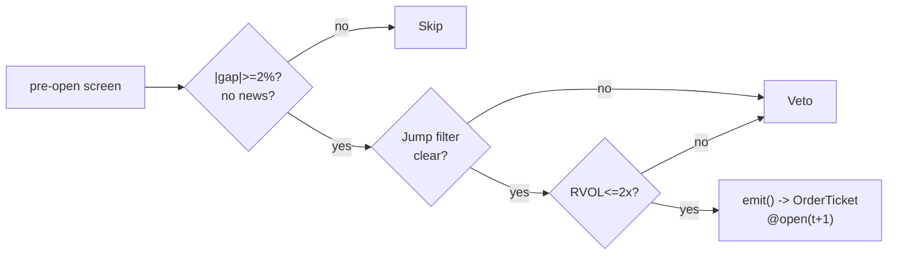

# T012 — Jump-Filtered Overnight-Gap Fade

> **Reviewer card.** Overnight-gap fade with jump filtering: gaps without news revert intraday (S035); relative-volume on the gap (S052) separates funded from unfunded gaps; the jump filter (S053) vetoes genuine information. Provenance **[D]**.
>
> Edge verdict: **NO-DOCUMENTED-EDGE** — no citable overnight-gap-fade P&L found in the reviewed literature — the gap-reversion anecdote is practitioner, not published [documented].
>
> After-cost: **BEFORE-COST** — one-sentence verdict: the fade is a practitioner pattern with no published P&L — the jump filter is what makes it honest.
>
> Tier **S** · prototype 20–40 h [example] · loaded cost $3,000–6,000 [example] · latency bar / open + 5-min · risk medium (overnight information risk).

> Capacity $1–5M/day notional [example] — gap names × a few thousand shares; news-driven gaps excluded · Executability: Feasible: overnight-gap screen + 5-min fade machine; any retail platform.

## §1  Identity & provenance

This module is a **strategy**: it emits `OrderTicket` intentions only — brokers create orders, strategies never do. Family **B  # mean-reversion**, batch **TB3**, provenance **D**.

**Lede.** Overnight-gap fade with jump filtering: gaps without news revert intraday (S035); relative-volume on the gap (S052) separates funded from unfunded gaps; the jump filter (S053) vetoes genuine information. Provenance **[D]**.

**When it dies.** News-driven gaps; the jump filter misfires; crowded gap-fade on the same names.

**Regime gates (provisional).** R001 elevated RV degrades (gaps are information); earnings season excluded.

**Prototype scope.** gap screen + RVOL confirm + jump filter + 5-min fade + kill-switch.

## §1.5  Escalation gate

Cheapest viable path: **Polygon.io Stocks Basic** — daily + 5-min OHLCV bars, news flags at ~$30–100/mo [unverified]. build the screen and fade machine on a cheap bar feed; buy nothing.

Resource budget: `1` core, `<1` GB RAM [internal-est] [internal-est] · compute pattern `per_bar`.

Explicitly out of scope (phase two): gap-and-go (see T018); earnings gaps (phase `2`).

Escalation gate: news-feed integration beyond flags [default]; 5-min bar latency `>60` s [default] — crossing it requires re-review of §T7 and §T8.

## §T0  Contract — strategies emit intentions, brokers create orders

This strategy's sole output is a list of `OrderTicket` intentions. It never places, routes, or confirms an order. Every ticket carries `parent_signal` (the upstream signal id and its `computed_at`), an `intent_ts`, and a `tif`. The backtest harness fills tickets strictly after the signal bar (`fill_event > signal_event`, t->t+1 causality); any fill timestamped at or before its signal bar is a harness bug and trips the kill switch.

State variables carried between bars: ``gap_pct`, `rvol_gap`, `jump_flag`, `cooldown_until`, `position`, `module_state``.

## §T1  Strategy thesis & edge

**Thesis.** Overnight-gap fade with jump filtering: gaps without news revert intraday (S035); relative-volume on the gap (S052) separates funded from unfunded gaps; the jump filter (S053) vetoes genuine information. Provenance **[D]**.

**Edge verdict: NO-DOCUMENTED-EDGE** — no citable overnight-gap-fade P&L found in the reviewed literature — the gap-reversion anecdote is practitioner, not published [documented].

**After-cost verdict: BEFORE-COST** — one-sentence verdict: the fade is a practitioner pattern with no published P&L — the jump filter is what makes it honest.

**Risk summary.** Information gap (news you missed — the jump filter exists for this); open-auction spread; gap continuation.

**Math.**

```text
Overnight gap `g = (O_t − C_{t-1})/C_{t-1}`; fade candidate `|g|
≥ 2`% [example]. Gap RVOL `rvol_gap` vs `20`-day same-slot volume (S052).
Jump test on the gap bar via bipower variation (Barndorff-Nielsen & Shephard
2006 [documented]; S053). Modeled edge `edge_bps = |g| × 1e4 × 0.5` [example]
(half the gap, conservative).
```

**Pseudocode (normative).**

```text
function emit(state, signals, bars, cfg) -> list[OrderTicket]:
    assert bars non-empty else return UNKNOWN                       # F1
    t = bars[-1]   # newest 5-min bar, labeled by open time
    g  = signals['S035'].gap_pct
    rv = signals['S052'].rvol_gap
    jp = signals['S053'].jump_flag
    assert isfinite(g) and isfinite(rv) else return UNKNOWN         # F2
    if jp or news_flagged(state): return []                        # C12 veto

    edge_bps = abs(g) * 1e4 * 0.5                                  # [example]
    cost_ok = expected_cost_bps(notional, adv_pct, venue, side, urgency) <= cfg.cost_gate_k * edge_bps
    # ^^^ normative cost-gate predicate: expected_cost_bps(...) <= k * edge_bps

    tickets = []
    if state.position == 0 and cost_ok and t.event_ts >= state.cooldown_until:
        if abs(g) >= cfg.gap_min and rv <= cfg.rvol_gap_max:
            side = 'SELL' if g > 0 else 'BUY'   # fade the gap
            tickets = [ticket(side=side, qty=size(...), limit=open(t+1), tif='DAY',
                              parent_signal=f"S035@{t.bar_open_ts}")]
    else:
        if exit_trigger(t, state, cfg): tickets = [flatten_ticket(state)]
        state.cooldown_until = t.event_ts + cfg.cooldown_s * 1e9   # C10
    for tk in tickets: log_decision(tk, inputs_hash, params_hash)  # C5 / App. g
    assert fill.event_ts > t.bar_close_ts for any fill             # t->t+1 causality
    return tickets
```

## §T2  Signal stack — dependencies & data rights

| Signal | Role | Contract |
|---|---|---|
| `S035` | trigger | overnight gap >= +2% [example] with no intraday news (the fade candidate) |
| `S052` | confirm | RVOL(gap) <= 2.0× [example] — unfunded gaps are faded, funded gaps are not |
| `S053` | gate | no jump detected in the gap bar; jumps veto the fade |

Max dependency depth: `2` [default].

**Schema mapping (canonical).**

| Vendor (Polygon.io Stocks) | Canonical |
|---|---|
| `t` (ms) | `bar_open_ts` (int64 ns UTC; bar labeled by open time) |
| `o, h, l, c` | `open, high, low, close` |
| `v` | `volume` |

Staleness: max skew `5 s` [default] · jitter budget `30 s` [default] · TTL `90 s` [default] · cadence `per_bar (open + 5-min)` · tz `America/New_York`.

**Inputs that break the module.**

| Input failure | Module state | Alert |
|---|---|---|
| Gap < 2% (gate) [example] | `DEGRADED` (skip name) | log |
| Jump detected in gap bar (gate) [example] | `DEGRADED` (veto fade) | notify |
| News flag on the name | `DEGRADED` (veto fade) | log |

**Data rights.** US equities bars via Polygon.io Stocks, `rights: licensed`;
research + production; fixtures synthetic; entitlement = professional/internal;
derived features ours. Entitlement-class change → §1.5 escalation gate.

**Build vs buy.** Build the screen and fade machine on a cheap bar feed; buy
nothing — the jump filter is the IP.

**Local build.** Feasible. The gap screen is a pre-open sort; the fade machine is
a 5-minute state machine; the jump test is a rolling computation.

**Data dictionary (canonical fields).**

| Field | Type | Cadence | Tier | Notes |
|---|---|---|---|---|
| `Daily OHLCV bars` | float/int | daily | Tier 1 | gap computation |
| `5-min OHLCV bars` | float/int | 5-min | Tier 1 | fade timing |
| `News flags` | reference | per event | Tier 2 | S035 news exclusion |
| `20-day same-slot volume` | float | per slot | Tier 1 | S052 RVOL |

## §T3  Entry / exit / sizing & worked example

**Entry rule.**

```text
ENTER_FADE := (|gap| >= gap_min) AND (rvol_gap <= rvol_gap_max)
               AND (no jump) AND (no news)
               AND (expected_cost_bps(...) <= cost_gate_k * edge_bps)
               direction := opposite the gap
FLAT := otherwise
```

**Exit rule.**

```text
EXIT := (gap filled ≥ 50% [example]) [reversion] OR (bars_held >= time_stop_min)
        OR (price stop -$stop_dollars) [stop] OR (t >= 11:30) [session flatten]
        OR (module_state != OK)
```

**Cooldown.** `600` s [default] after every exit (C10).

**Sizing function (normative).**

```python
def shares(risk_budget_R, stop_distance, vol_estimate, ADV_cap, cost):
    # risk_budget_R in $, stop_distance in $/share (example price stop $0.40)
    n = risk_budget_R / max(stop_distance, 1e-9)   # [default] floor below
    n = min(n, ADV_cap * 0.005)                   # 0.5% ADV [default]
    n = min(n * 50.0, 600000.0) / 50.0           # $600k gross cap [default]
    return int(n)
```

**Risk limits.**

| Limit | Value |
|---|---|
| Daily loss stop | `-$1,500` [example] → dark for the day |
| Max concurrent gap fades | `4` [example] |
| Gap-continuation kill | `2` consecutive [example] → stand down |
| Post-exit cooldown | `600` s [example] — C10 |

**Worked example (fixture-backed, from `fixtures/T012_tape.csv` trade 1).**

Trade 1: `SELL` `750` shares [example] @ `51.1` [example], exit `50.3` [example] (`gap filled 50%`). Gross P&L = `600.00` [measured] dollars. Cost stack = `12.0` bps [example] → `45.99` [measured] dollars on `38325.00` [example] notional. Net = `554.01` [measured] dollars. The fixture's expected CSV carries the same arithmetic for all six trades; the per-module test recomputes it from the tape and asserts equality.

**Flow.**


## §T4  Parameters

| Parameter | Key | Default | Provenance | Sensitivity |
|---|---|---|---|---|
| Gap minimum | `gap_min` | `2`% | [default] | high |
| Gap RVOL max | `rvol_gap_max` | `2.0`× | [default] | high |
| Exit z | `z_exit` | `0.5` | [default] | medium |
| Price stop | `stop_dollars` | `$0.40` | [default] | high |
| Time stop | `time_stop_min` | `45` min | [default] | medium |
| Post-exit cooldown | `cooldown_s` | `600` s | [default] | low |
| Cost-gate k | `cost_gate_k` | `0.5` | [default] | high |

## §T5  Costs — the callable is the single source of truth

| Component | bps | Basis |
|---|---|---|
| Spread | `10.0` | [example] $0.025 assumed spread at the open at $50: half-spread per aggressive leg × 2 legs |
| Fees | `2.0` | [example] $0.005/share each way at $50 = 1 bps/leg |
| Borrow | `0.0` | [default] fade reference; shorts add C7 |
| Impact | `0.0` | [example] flagged; open-auction slippage in conservative variant |
| **Total** | `12.0` | [example] reference stack |

Fee schedule as of `2026-09-01` [example] · venue `XNAS / SIP 5-min bars [example]` · side `taker` · borrow `0.0` bps/day [example] — reference build fades the gap; short variant models borrow explicitly.

```python
def expected_cost_bps(notional, adv_pct, venue, side, urgency) -> float:
    """Callable cost model - T012 COST block (single source of truth)."""
    spread_bps = 10.0   # [example] $0.025 assumed spread @ open @ $50: half/aggressive x 2
    fee_bps = 2.0       # [example] $0.005/share each way @ $50 = 1 bps/leg
    borrow_bps = 0.0    # [default] fade reference; shorts add C7
    impact_bps = 0.0    # [example] flagged; open-auction slippage in conservative variant
    return spread_bps + fee_bps + borrow_bps + impact_bps
```

**Normative cost-gate predicate (C3):** `expected_cost_bps(...) <= k * edge_bps` — no ticket is emitted unless the callable cost clears this gate. The predicate appears verbatim in the §T1 pseudocode and is asserted by the per-module test.

## §T6  Execution assumptions

| Aspect | Assumption |
|---|---|
| Latency | open + 5-min bar evaluation; fill at next-bar open |
| Partial fills | oldest `intent_ts` first (FIFO) |
| Impact | `0` bps reference [example]; conservative variant models open-auction slippage |
| Adverse fill | the gap is information — the jump filter and news flag are the controls |

## §T7  Risk contract & kill switch

Per-trade R: `$300` [example] per trade · daily loss stop: `- $1,500` [example] then dark for the day · max gross: `$600k` notional [example] · max adverse per trade: `1.5`x stop [default].

Enforcement: `intraday-hard` [default]. Calibration recipe: paper-trade `30` sessions [default]; gap screen on `250`-day history [default]; re-pin fee schedule monthly [default].

**Kill switch: `ARMED` → `TRIPPED` → `RECOVERY` → `ARMED`.**

Trip conditions:

- 2 consecutive gap continuations [example]
- feed heartbeat missed > 2 s [example]
- clock skew > 50 ms [example]
- 4 concurrent gap fades [example]

On trip: the module stops emitting tickets immediately, flattens managed positions per the exit rule, and pages. `RECOVERY` requires manual review, cooldown expiry, and healthy feeds; only then does the module return to `ARMED`. The per-module test drives the full transition cycle.

**Ops.** Schedule: Pre-open gap screen; entries `09:35`–`11:00` ET [example]; flat by `11:30`; no overnight carry · budget: `1` vCPU, `1` GB RAM [internal-est] [internal-est] · env: `POLYGON_API_KEY`.

**Universe.** US equities, price > `$10`, ADV > `1`M shares [example]. Screen:
overnight gap ≥ `+2`% [example], no news flag, no jump in the gap bar. Entries
`09:35`–`11:00`. Exclude: earnings days, news-flagged names, halts.

## §T8  Compliance (C1–C10+)

- **C1** | No orders: the strategy emits `OrderTicket` intentions only; the broker creates orders.
- **C2** | Kill switch: `ARMED` → `TRIPPED` → `RECOVERY` → `ARMED` on the trip conditions in §T7.
- **C3** | Cost gate: `expected_cost_bps(...) <= k * edge_bps` before any ticket (see §T5).
- **C4** | Causality: `fill_event > signal_event` (t->t+1); no signal-bar fills, ever.
- **C5** | Decision log: every ticket logged with inputs hash and params hash (see App. g).
- **C6** | Staleness: inputs older than the TTL → `UNKNOWN`, no tickets.
- **C7** | Short discipline: `locate_ok` required before any short ticket.
- **C8** | Cooldown: post-exit cooldown enforced in seconds; no re-entry inside it.
- **C9** | Session flatten: no uncommanded overnight carry.
- **C10** | Position caps: per-trade R, daily loss stop, and max gross enforced.
- **C11 | Gap-continuation kill: trigger = `2` consecutive gap continuations [example] → check = gap P&L → action = stand down → log = `COMPLIANCE_BLOCK`**
- **C12 | News veto: trigger = news flag on the name → check = news feed → action = veto fade → log = `GATE_VETO`**

## §T9  Evidence, failures & regime gates

**Evidence (cost-level tokens; every statistic tagged).**

| Source | Sample | Finding | Cost level | Caveat |
|---|---|---|---|---|
| Barndorff-Nielsen & Shephard (2006) [documented] | (methodological) | bipower variation jump test [documented] | `BEFORE-COST` (method) | the jump filter's econometric basis |
| Overnight-gap practitioner literature [unverified] | — | gap-reversion anecdote; no citable P&L | `BEFORE-COST` | practitioner pattern, not a published result — see §T10 |

**Where this module is known to fail.** news-driven gaps, jump-filter misfires, crowded gap-fades, open-auction spread blowouts.

**Failure modes (detect → action → recovery).**

| # | Failure | Detect → action → recovery | Executable check |
|---|---|---|---|
| 1 | Information gap | detect: jump flag or news → action: veto (C12) → recovery: next session [default] | `not news_flagged and not jump` |
| 2 | Gap continuation | detect: `2` consecutive → action: stand down (C11) → recovery: next session [default] | `gap_continuations < 2` |
| 3 | Open-auction slippage | detect: fill vs modeled > `2`× [default] → action: conservative variant → recovery: re-pin | `slippage <= 2*modeled` |
| 4 | Cost blowup | detect: cost gate failing → action: stand down → recovery: re-pin [default] | `expected_cost_bps(...) <= k * edge_bps` |
| 5 | Lookahead in gap screen | detect: screen uses future → action: halt, fix → recovery: no-signal-bar-fills test [default] | `all(fill_ts > signal_ts)` |

**Regime gates.**

| Regime | Effect | Mechanism | Condition | Action | Latency | Fallback |
|---|---|---|---|---|---|---|
| R001 | degrades | elevated RV: gaps are information | rv_pctile > 70 [default] | halve | 1 bar [default] | veto |
| R001 | inverts | extreme RV | rv_pctile > 95 [default] | pause_entry | 1 bar [default] | veto |
| R-earn | degrades | earnings season | calendar flag [default] | veto | 0 [default] | veto |

**Robustness.** The jump filter is the strategy: `gap_min` in `1.5`–`3`% [default]
[example] and `rvol_gap_max` in `1.5`–`3`× [example] are the calibration
surface. News-flagged names are excluded unconditionally. Purged/embargoed OOS
per S088.

**What the optimistic case assumes (and we do not).** (1) the gap is assumed to be noise, not news — the news flag and
jump filter are imperfect; (2) open-auction spread fixed at `2.5`¢ [example];
(3) impact `0` [example] — flagged.

## §T10  Unverified leads & what would change our mind

- Overnight-gap-fade P&L anecdotes from practitioner forums — no citable published P&L found; not promoted.

What would change our mind: a purged/embargoed walk-forward with full costs that survives the S088 honesty protocol; a documented after-cost P&L from the cited authors' own implementations; or a regime-gated replication that holds outside the original sample.

## AI build prompt

```text
Build the T012 (Jump-Filtered Overnight-Gap Fade) strategy module from this specification.
Hard constraints:
- The strategy emits OrderTicket intentions ONLY; it never creates orders (C1).
- Causality: fill_event > signal_event (t->t+1); no signal-bar fills (C4).
- Cost gate: expected_cost_bps(...) <= k * edge_bps before any ticket (C3).
- Kill switch ARMED -> TRIPPED -> RECOVERY -> ARMED on the §T7 trip conditions (C2).
- Every numeric literal in prose carries an honesty tag [documented]/[measured]/[example]/[unverified]/[default]/[internal-est]; exempt identifiers only.
- Sources must be real and cited with cost-level tokens; chatbot-only material goes to §T10.
Config surface:
- gap_min (float): default 0.02, range 0.005–0.05 [default]
- rvol_gap_max (float): default 2.0, range 1.0–5.0 [default]
- z_exit (float): default 0.5, range 0.0–1.5 [default]
- stop_dollars (float): default 0.40, range 0.05–1.5 [default]
- time_stop_min (float): default 45.0, range 15–240 [default]
- cooldown_s (float): default 600.0, range 0–3,600 [default]
- cost_gate_k (float): default 0.5, range 0.1–2.0 [default]
Entry rule:
ENTER_FADE := (|gap| >= gap_min) AND (rvol_gap <= rvol_gap_max)
               AND (no jump) AND (no news)
               AND (expected_cost_bps(...) <= cost_gate_k * edge_bps)
               direction := opposite the gap
FLAT := otherwise
Exit rule:
EXIT := (gap filled ≥ 50% [example]) [reversion] OR (bars_held >= time_stop_min)
        OR (price stop -$stop_dollars) [stop] OR (t >= 11:30) [session flatten]
        OR (module_state != OK)
Sizing: implement the §T3 sizing_fn verbatim; enforce the §T7 risk contract.
Deliverables: the module markdown (all sections §1–§T10), the fixture tape CSV
(fixtures/T012_tape.csv), the expected CSV (fixtures/T012_expected.csv), and
the per-module test (modules/tests/test_T012.py) covering fixture arithmetic,
causality, the cost gate, the kill-switch cycle, invalid→UNKNOWN, and the callable signature.
```
