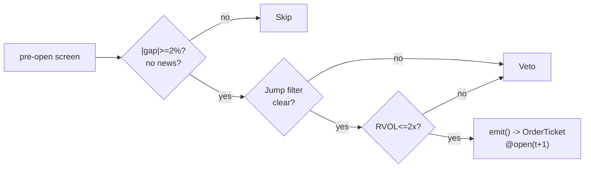

# T012 — Jump-Filtered Overnight-Gap Fade

> **Reviewer card.** Overnight-gap fade with jump filtering: gaps without news revert intraday (S035); relative-volume on the gap (S052) separates funded from unfunded gaps; the jump filter (S053) vetoes genuine information. Provenance **[D]**.
>
> Edge verdict: **NO-DOCUMENTED-EDGE** — no citable overnight-gap-fade P&L found in the reviewed literature — the gap-reversion anecdote is practitioner, not published [documented].
>
> After-cost: **BEFORE-COST** — the documented evidence is a return-decomposition pattern (BEFORE-COST), not an after-cost strategy P&L — the jump filter is what makes the fade honest.
>
> Tier **S** · prototype 20–40 h [example] · loaded cost $3,000–6,000 [example] · latency bar / open + 5-min · risk medium (overnight information risk).
>
> Data cost: **$29/mo** Massive Stocks Starter (15-min delayed, 5-yr history) [documented — vendor pricing page https://massive.com/stocks-data, fetched 2026-09-11] · live needs Stocks Advanced **$199/mo** real-time [documented — vendor pricing page https://massive.com/stocks-data, fetched 2026-09-11].
>
> Capacity $1–5M/day notional [example] — gap names × a few thousand shares; news-driven gaps excluded · Executability: Feasible: overnight-gap screen + 5-min fade machine; any retail platform.

## §1  Identity & provenance

This module is a **strategy**: it emits `OrderTicket` intentions only — brokers create orders, strategies never do. Family **B  # mean-reversion**, batch **TB3**, provenance **D**.

**Lede.** Overnight-gap fade with jump filtering: gaps without news revert intraday (S035); relative-volume on the gap (S052) separates funded from unfunded gaps; the jump filter (S053) vetoes genuine information. Provenance **[D]**.

**When it dies.** News-driven gaps; the jump filter misfires; crowded gap-fade on the same names.

**Regime gates (provisional).** R001 elevated RV degrades (gaps are information); R005 jump-regime vetoes; R035 earnings proximity/season vetoes; R041 overnight-variance-share names amplify [default].

**Prototype scope.** gap screen + RVOL confirm + jump filter + 5-min fade + kill-switch.

## §1.5  Escalation gate

Cheapest viable path: **Massive Stocks Starter at $29/mo** [documented — vendor pricing page https://massive.com/stocks-data, fetched 2026-09-11] — daily + 5-min OHLCV bars (15-min delayed, 5-yr history) plus news flags; build the screen and fade machine on the cheap delayed feed, buy nothing else. Live deployment (per-bar 5-min fade at the open) requires the real-time **Stocks Advanced tier at $199/mo** [documented — vendor pricing page https://massive.com/stocks-data, fetched 2026-09-11] — crossing that spend line is the escalation gate.

**Cheapest-source row (structured).**

| min_tier | latency_class | required_fields | price_band | build_or_buy |
|---|---|---|---|---|
| Massive Stocks Starter [documented — vendor pricing page https://massive.com/stocks-data, fetched 2026-09-11] | 15-min delayed [documented — vendor pricing page https://massive.com/stocks-data, fetched 2026-09-11] | daily + 5-min OHLCV, news flags [default] | $29/mo [documented — vendor pricing page https://massive.com/stocks-data, fetched 2026-09-11] | build — the jump filter is the IP; buy nothing |
| Massive Stocks Advanced (live) [documented — vendor pricing page https://massive.com/stocks-data, fetched 2026-09-11] | real-time [documented — vendor pricing page https://massive.com/stocks-data, fetched 2026-09-11] | same + WS streaming [default] | $199/mo [documented — vendor pricing page https://massive.com/stocks-data, fetched 2026-09-11] | buy at escalation |

Resource budget: `1` core, `<1` GB RAM [internal-est] · compute pattern `per_bar`.

Explicitly out of scope (phase two): gap-and-go (see T018); earnings gaps (phase `2`).

**DO-NOT-CUT list.** Causality assertions (`fill_event > signal_event`); the §T5 COST block and its callable; the kill switch (§T7); the decision log (C5 / App. g); bona-fide-intent + self-trade prevention (§T8); provenance/honesty tags; fixtures + per-module test; secrets via env only.

Escalation gate: news-feed integration beyond flags [default]; 5-min bar latency `>60` s [default] — crossing it requires re-review of §T7 and §T8.

## §T0  Contract — strategies emit intentions, brokers create orders

This strategy's sole output is a list of `OrderTicket` intentions. It never places, routes, or confirms an order. Every ticket carries `parent_signal` (the upstream signal id and its `computed_at`), an `intent_ts`, and a `tif`. The backtest harness fills tickets strictly after the signal bar (`fill_event > signal_event`, t->t+1 causality); any fill timestamped at or before its signal bar is a harness bug and trips the kill switch.

**Typed signature.**

```python
def emit(state: ModuleState, signals: dict[str, SignalVector],
         bars: list[Bar], cfg: T012Config) -> list[OrderTicket]:
    """Core module function. Raises nothing: invalid input -> UNKNOWN or []."""
```

**Config dataclass (single source of truth; front-matter `params_schema` mirrors it).**

```python
@dataclass(frozen=True)
class T012Config:
    gap_min: float       = 0.02   # [default] entry gap threshold
    rvol_gap_max: float  = 2.0    # [default] funded/unfunded separator
    z_exit: float        = 0.5    # [default] gap-fill fraction that exits (reversion leg)
    stop_dollars: float  = 0.40   # [default] price stop, $/share
    time_stop_min: float = 45.0   # [default] max holding, minutes
    cooldown_s: float    = 600.0  # [default] post-exit cooldown, seconds (C8)
    cost_gate_k: float   = 0.5    # [default] cost-gate coefficient (C3)
    risk_budget_R: float = 300.0  # [example] per-trade risk budget, $
    locate_required: bool = True  # [default] C7: locate_ok before any short ticket
```

State variables carried between bars: ``gap_pct`, `rvol_gap`, `jump_flag`, `cooldown_until`, `position`, `module_state``.

**Time contract.** Clock domain: exchange/venue clock; authoritative causality clock is the bar clock. Timestamps are int64 nanoseconds, UTC canonical. Bars are labeled by **open time** (`bar_open_ts`); fills are labeled by `fill_event_ts`. Max skew `50` ms [default] (trip condition in §T7); jitter budget `30` s [default]; staleness TTL `90` s [default]; gap policy: no interpolation, ever — missing bars yield `UNKNOWN` (C6). Dual timestamps carried: `(event_ts, asof_ts)`.

**Market-state table.**

| State | New tickets | Working tickets | Position |
|---|---|---|---|
| `CONTINUOUS_TRADING` | allowed | managed | managed |
| `HALTED` | vetoed | cancelled | flatten per exit rule |
| `AUCTION` (open/close cross) | vetoed | held (no child orders) | held |
| `CLOSED` | none | none | flat (C9) |

**Module-state enum.** `OK | DEGRADED | UNKNOWN | OFF`. Invalid input emits `UNKNOWN`, never interpolated values. `OFF` = kill-switch tripped (C2).

**Risk contract (YAML, enforced intraday-hard).**

```yaml
risk_contract:
  per_trade_R: 300.0            # [example] $, stop-distance based
  daily_loss_stop: -1500.0     # [example] $ → dark for the day
  max_gross: 600000.0           # [example] $ notional
  max_adverse_per_trade: 1.5   # [default] × stop_dollars
  max_concurrent_fades: 4      # [example]
  enforcement: intraday-hard
```

**Kill switch: `ARMED` → `TRIPPED` → `RECOVERY` → `ARMED`.**

Trip conditions: `2` consecutive gap continuations [example] · feed heartbeat missed `> 2` s [example] · clock skew `> 50` ms [example] · `4` concurrent gap fades [example].

On trip: the module stops emitting tickets immediately, flattens managed positions per the exit rule, and pages. Re-arm checklist (all required, in order):

1. Manual review of the trip cause signed off [default].
2. Post-exit cooldown (`cooldown_s`) expired [default].
3. Feed heartbeat healthy for `3` consecutive checks [default].
4. Clock skew back under `50` ms [default].
5. Decision log shows no open tickets / positions flat [default].

Only then does the module return to `ARMED`. The per-module test drives the full transition cycle.

**Child-order state machine (broker side; the strategy only emits intents).** `OrderTicket` → `NEW` → `ACK` → `WORKING` → (`FILLED` | `CANCELLED` | `REJECTED`). One child per ticket (limit at `open(t+1)`); cancel-replace not used. Partial-fill policy: partials aggregate into the ticket; fill price = volume-weighted average of partials; a ticket is `FILLED` when cumulative qty ≥ ticket qty. Oldest `intent_ts` first (FIFO) when the broker queues multiple tickets.

**Ops tail.** Schedule: pre-open gap screen (runs `06:00`–`09:30` ET [example]); entries `09:35`–`11:00` ET [example]; flat by `11:30` ET; no overnight carry (C9). Owner: strategy desk [default]. Health checks: feed heartbeat every `2` s [default]; clock-skew monitor; decision-log append latency. Alerts: kill-switch trip → page; `2` consecutive gap continuations → notify; staleness TTL breach → log. Resource budget: `1` vCPU, `1` GB RAM [internal-est]. Runbook stub: trip → page → review checklist (§T7) → re-arm; cost-gate failing → re-pin fee schedule (see §T5). Secrets: `POLYGON_API_KEY` (or `MASSIVE_API_KEY`) via env only — never in code, logs, or fixtures.

## §T1  Strategy thesis & edge

**Thesis.** Overnight-gap fade with jump filtering: gaps without news revert intraday (S035); relative-volume on the gap (S052) separates funded from unfunded gaps; the jump filter (S053) vetoes genuine information. Provenance **[D]**.

**Edge verdict: NO-DOCUMENTED-EDGE** — no citable overnight-gap-fade P&L found in the reviewed literature — the gap-reversion anecdote is practitioner, not published [documented].

**After-cost verdict: BEFORE-COST** — the documented evidence is a return-decomposition pattern (BEFORE-COST), not an after-cost strategy P&L — the jump filter is what makes the fade honest.

**Risk summary.** Information gap (news you missed — the jump filter exists for this); open-auction spread; gap continuation.

**Math.**

```text
Overnight gap `g = (O_t − C_{t-1})/C_{t-1}`; fade candidate `|g| ≥ 2`% [example].
Gap RVOL `rvol_gap` vs `20`-day same-slot volume (S052).
Jump test on the gap bar via bipower variation (Barndorff-Nielsen & Shephard
2006 [documented]; S053).
Gap-fill fraction (reversion leg): for a SELL fade, `fill_frac =
(entry_px − close)/(entry_px − ref_close)`; for a BUY fade,
`fill_frac = (close − entry_px)/(ref_close − entry_px)`, where
`ref_close = C_{t-1}` [default definition].
Modeled edge `edge_bps = |g| × 1e4 × 0.5` [example] (half the gap, conservative).
```

**Pseudocode (normative).**

```text
function emit(state, signals, bars, cfg) -> list[OrderTicket]:
    assert len(bars) > 0 else return UNKNOWN                       # F1: empty ingest
    t = bars[-1]   # newest 5-min bar, labeled by OPEN time (int64 ns, UTC)
    g  = signals['S035'].gap_pct
    rv = signals['S052'].rvol_gap
    jp = signals['S053'].jump_flag
    assert isfinite(g) and isfinite(rv) else return UNKNOWN        # F2: NaN/Inf -> UNKNOWN
    assert jp is not None else return UNKNOWN                      # F3: missing gate -> UNKNOWN
    if jp or news_flagged(state, t.symbol): return []              # C12 veto
    if market_state != CONTINUOUS_TRADING: return []               # halt/auction -> no tickets
    if stale(t.asof_ts, ttl_s=90): return UNKNOWN                  # C6

    edge_bps = abs(g) * 1e4 * 0.5                                  # [example]
    cost_bps = expected_cost_bps(notional_est, adv_pct, 'XNAS', 'taker', 'normal')
    cost_ok = cost_bps <= cfg.cost_gate_k * edge_bps               # C3 normative predicate

    tickets = []
    if state.position == 0 and t.event_ts >= state.cooldown_until and cost_ok:
        if abs(g) >= cfg.gap_min and rv <= cfg.rvol_gap_max:        # ENTER_FADE (Boolean)
            side = 'SELL' if g > 0 else 'BUY'                      # fade the gap
            if cfg.locate_required and side == 'SELL':
                assert locate_ok(t.symbol) else return UNKNOWN    # C7
            qty = shares(cfg.risk_budget_R, cfg.stop_dollars, vol_est, ADV_cap, cost_bps)
            tickets = [OrderTicket(side=side, qty=qty, limit=open(t+1), tif='DAY',
                                   parent_signal=f"S035@{t.bar_open_ts}",
                                   intent_ts=now_ns(), edge_bps=edge_bps, cost_bps=cost_bps)]
    else:
        if state.position != 0 and exit_trigger(t, state, cfg):
            tickets = [flatten_ticket(state)]
            state.cooldown_until = t.event_ts + int(cfg.cooldown_s * 1e9)  # C8
    for tk in tickets: log_decision(tk, inputs_hash, params_hash)  # C5 / App. g
    assert all(f.event_ts > s.event_ts for (f, s) in fills)         # C4 t->t+1 causality
    return tickets

function exit_trigger(t, state, cfg) -> bool:                      # normative exit
    fill_frac = gap_fill_fraction(t.close, state.entry_px, state.ref_close, state.side)
    return (fill_frac >= cfg.z_exit                                # reversion leg
            or (t.event_ts - state.entry_ts) >= int(cfg.time_stop_min * 60 * 1e9)
            or adverse_move(t, state) >= cfg.stop_dollars           # price stop
            or t.session_clock >= '11:30'                           # session flatten (C9)
            or state.module_state != OK)
```

## §T2  Signal stack — dependencies & data rights

**Universe.** US equities, price `> $10` [example], ADV `> 1`M shares [example]. Screen: overnight gap `≥ +2`% [example], no news flag, no jump in the gap bar. Entries `09:35`–`11:00` ET [example]. Exclude: earnings days (R035), news-flagged names, halts.

**Timing box.** `signal@t (5-min bar, America/New_York) → earliest fill @open(t+1)` — no signal-bar fills, ever (C4).

| Signal | Role | Contract |
|---|---|---|
| `S035` | trigger | overnight gap >= +2% [example] with no intraday news (the fade candidate) |
| `S052` | confirm | RVOL(gap) <= 2.0× [example] — unfunded gaps are faded, funded gaps are not |
| `S053` | gate | no jump detected in the gap bar; jumps veto the fade |

Max dependency depth: `2` [default]. Version pins: S035/S052/S053 pinned to `1.1.0` [documented] in §0 `consumes`.

**Schema mapping (canonical).**

| Vendor (Massive Stocks) | Canonical |
|---|---|
| `t` (ms) | `bar_open_ts` (int64 ns UTC; bar labeled by open time) |
| `o, h, l, c` | `open, high, low, close` |
| `v` | `volume` |

Staleness: max skew `5 s` [default] · jitter budget `30 s` [default] · TTL `90 s` [default] · cadence `per_bar (open + 5-min)` · tz `America/New_York`.

**Inputs that break the module.**

| Input failure | Module state | Alert |
|---|---|---|
| Gap < 2% (gate) [example] | `DEGRADED` (skip name) | log |
| Jump detected in gap bar (gate) [example] | `DEGRADED` (veto fade) | notify |
| News flag on the name | `DEGRADED` (veto fade) | log |

**Data rights.** US equities bars via Massive (formerly Polygon.io) Stocks, `rights: licensed`;
research + production; fixtures synthetic; entitlement = professional/internal;
derived features ours. Entitlement-class change → §1.5 escalation gate.

**Build vs buy.** Build the screen and fade machine on a cheap bar feed; buy
nothing — the jump filter is the IP.

**Local build.** Feasible. The gap screen is a pre-open sort; the fade machine is
a 5-minute state machine; the jump test is a rolling computation.

**Data dictionary (canonical fields).**

| Field | Type | Cadence | Tier | Notes |
|---|---|---|---|---|
| `Daily OHLCV bars` | float/int | daily | Tier 1 | gap computation |
| `5-min OHLCV bars` | float/int | 5-min | Tier 1 | fade timing |
| `News flags` | reference | per event | Tier 2 | S035 news exclusion |
| `20-day same-slot volume` | float | per slot | Tier 1 | S052 RVOL |

## §T3  Entry / exit / sizing & worked example

**Entry rule.**

```text
ENTER_FADE := (|gap| >= gap_min) AND (rvol_gap <= rvol_gap_max)
               AND (no jump) AND (no news)
               AND (expected_cost_bps(...) <= cost_gate_k * edge_bps)
               direction := opposite the gap
FLAT := otherwise
```

**Exit rule (normative; mirrors `exit_trigger` in §T1).**

```text
EXIT := (gap filled ≥ z_exit = 0.5 [default]) [reversion] OR (bars_held >= time_stop_min)
        OR (price stop -$stop_dollars) [stop] OR (t >= 11:30) [session flatten]
        OR (module_state != OK)
```

**Cooldown.** `600` s [default] after every exit (C8).

**Sizing function (normative; uses all five fenced args).**

```python
def shares(risk_budget_R, stop_distance, vol_estimate, ADV_cap, cost):
    # risk_budget_R in $, stop_distance in $/share (example price stop $0.40)
    n = risk_budget_R / max(stop_distance, 1e-9)   # [default] risk-based size
    n = min(n, vol_estimate * 0.10)                # [default] 10% of expected bar volume
    n = min(n, ADV_cap * 0.005)                    # [default] 0.5% ADV participation
    n = min(n * 50.0, 600000.0) / 50.0            # [default] $600k gross cap (at $50/share)
    min_economic = cost / max(stop_distance, 1e-9) # [default] modeled cost must fit inside the stop budget
    return int(n) if n >= min_economic else 0
```

With the fixture values (`risk_budget_R=300.0`, `stop_dollars=0.40`, generous volume caps, `cost=45.99`): `n = 750` [example]; `min_economic = 114.98`; `750 >= 114.98` → `750` shares — matches the tape.

**Risk limits.**

| Limit | Value |
|---|---|
| Daily loss stop | `-$1,500` [example] → dark for the day |
| Max concurrent gap fades | `4` [example] |
| Gap-continuation kill | `2` consecutive [example] → stand down |
| Post-exit cooldown | `600` s [default] — C8 |
| Max adverse per trade | `1.5`× stop [default] |

**Worked example (synthetic fixture-backed, from `fixtures/T012_tape.csv` trade 1; TYPE: validation-run).**

Trade 1: `SELL` `750` shares [example] @ `51.10` [example], exit `50.30` [example]. With a `2`% gap [example], the implied prior close is `51.10/1.02 ≈ 50.098` [example]; gap-fill fraction at exit = `(51.10 − 50.30)/(51.10 − 50.098) ≈ 0.798` [example] ≥ `z_exit = 0.5` [default] → exit rule fired (reversion leg). Gross P&L = `600.00` [example] dollars. Cost stack = `12.0` bps [example] → `45.99` [example] dollars on `38325.00` [example] notional. Net = `554.01` [example] dollars. The fixture's expected CSV carries the same arithmetic for all six trades; the per-module test recomputes it from the tape and asserts equality. All figures are synthetic fixture arithmetic, not observed trading results.

**Flow.**


## §T4  Parameters

| Parameter | Key | Default | Tag | Sensitivity |
|---|---|---|---|---|
| Gap minimum | `gap_min` | `2`% | [default] | high |
| Gap RVOL max | `rvol_gap_max` | `2.0`× | [default] | high |
| Exit gap-fill fraction | `z_exit` | `0.5` | [default] | medium |
| Price stop | `stop_dollars` | `$0.40` | [default] | high |
| Time stop | `time_stop_min` | `45` min | [default] | medium |
| Post-exit cooldown | `cooldown_s` | `600` s | [default] | low |
| Cost-gate k | `cost_gate_k` | `0.5` | [default] | high |
| Per-trade risk budget | `risk_budget_R` | `$300` | [example] | high |

## §T5  Costs — the callable is the single source of truth

| Component | bps | Basis |
|---|---|---|
| Spread | `10.0` | [example] $0.025 assumed spread at the open at $50: half-spread per aggressive leg × 2 legs |
| Fees | `2.0` | [example] $0.005/share each way at $50 = 1 bps/leg; conservative vs documented $0.0030/share Nasdaq remove rate (0.6 bps/leg at $50) |
| Borrow | `0.0` | [default] fade reference (intraday hold, C9 session flatten); short tickets add borrow explicitly under C7 |
| Impact | `0.0` | [example] flagged; open-auction slippage in conservative variant |
| **Total** | `12.0` | [example] reference stack |

Fee schedule as of `2026-04-04` [documented] · venue `XNAS / SIP 5-min bars [example]` · side `taker` · borrow `0.0` bps/day [default] — reference build holds intraday only; short variant models borrow explicitly.

**Fee re-pin note (2026-09-11).** The `2.0` bps fee line [example] reconciles against documented components as: Nasdaq Rule 7018 remove fee `$0.0030`/share/leg [documented] = `0.6` bps/leg at `$50` [example] → `1.2` bps round trip [example]; SEC §31 FY2026 fee `$20.60`/`$1M` on the sale leg [documented] = `0.21` bps [example]; the remaining `~0.6` bps is conservative slack in the reference stack [example]. Re-pin quarterly; the next pin date is `2027-01-04` [default].

```python
def expected_cost_bps(notional, adv_pct, venue, side, urgency) -> float:
    """Callable cost model - T012 COST block (single source of truth)."""
    spread_bps = 10.0   # [example] $0.025 assumed spread @ open @ $50: half/aggressive x 2
    fee_bps = 2.0       # [example] $0.005/share each way @ $50 = 1 bps/leg
    borrow_bps_per_day = 0.0  # [default] fade reference; shorts add C7
    impact_bps = 0.0    # [example] flagged; open-auction slippage in conservative variant
    return spread_bps + fee_bps + borrow_bps_per_day + impact_bps
```

**Normative cost-gate predicate (C3):** `expected_cost_bps(...) <= k * edge_bps` — no ticket is emitted unless the callable cost clears this gate. The predicate appears verbatim in the §T1 pseudocode and is asserted by the per-module test.

## §T6  Execution assumptions

| Aspect | Assumption |
|---|---|
| Latency | open + 5-min bar evaluation; fill at next-bar open (`signal@t → earliest fill @open(t+1)`) |
| Partial fills | oldest `intent_ts` first (FIFO); partials aggregate, VWAP-averaged into the ticket |
| Impact | `0` bps reference [example]; conservative variant models open-auction slippage |
| Adverse fill | the gap is information — the jump filter and news flag are the controls |
| Halts | `HALTED` → no new tickets; working tickets cancelled; position flattened per exit rule |
| Auction | open/close cross → no child orders; entries wait for `CONTINUOUS_TRADING` |

**Child-order state machine (broker side).** `NEW → ACK → WORKING → (FILLED | CANCELLED | REJECTED)`; one limit child per ticket at `open(t+1)`; no cancel-replace. Partial-fill policy: partials aggregate into the ticket, fill price is the volume-weighted average of partials, and the ticket is `FILLED` when cumulative qty ≥ ticket qty.

## §T7  Risk contract & kill switch

Per-trade R: `$300` [example] per trade · daily loss stop: `- $1,500` [example] then dark for the day · max gross: `$600k` notional [example] · max adverse per trade: `1.5`× stop [default].

Risk contract YAML (enforced intraday-hard; see §T0):

```yaml
risk_contract:
  per_trade_R: 300.0            # [example]
  daily_loss_stop: -1500.0     # [example]
  max_gross: 600000.0           # [example]
  max_adverse_per_trade: 1.5   # [default]
  max_concurrent_fades: 4      # [example]
  enforcement: intraday-hard
```

Enforcement: `intraday-hard` [default]. Calibration recipe: paper-trade `30` sessions [default]; gap screen on `250`-day history [default]; re-pin fee schedule monthly [default].

**Kill switch: `ARMED` → `TRIPPED` → `RECOVERY` → `ARMED`.**

Trip conditions:

- 2 consecutive gap continuations [example]
- feed heartbeat missed > 2 s [example]
- clock skew > 50 ms [example]
- 4 concurrent gap fades [example]

On trip: the module stops emitting tickets immediately, flattens managed positions per the exit rule, and pages. Re-arm checklist (all required, in order): (1) manual review of the trip cause signed off [default]; (2) post-exit cooldown (`cooldown_s`) expired [default]; (3) feed heartbeat healthy for `3` consecutive checks [default]; (4) clock skew back under `50` ms [default]; (5) decision log shows no open tickets / positions flat [default]. Only then does the module return to `ARMED`. The per-module test drives the full transition cycle.

**Ops.** Schedule: pre-open gap screen (`06:00`–`09:30` ET [example]); entries `09:35`–`11:00` ET [example]; flat by `11:30` ET [example]; no overnight carry (C9). Budget: `1` vCPU, `1` GB RAM [internal-est] · env: `MASSIVE_API_KEY` (secrets via env only).

## §T8  Compliance (C1–C10+)

- **C1** | No orders: the strategy emits `OrderTicket` intentions only; the broker creates orders.
- **C2** | Kill switch: `ARMED` → `TRIPPED` → `RECOVERY` → `ARMED` on the trip conditions in §T7.
- **C3** | Cost gate: `expected_cost_bps(...) <= k * edge_bps` before any ticket (see §T5).
- **C4** | Causality: `fill_event > signal_event` (t->t+1); no signal-bar fills, ever.
- **C5** | Decision log: every ticket logged with inputs hash and params hash (see App. g).
- **C6** | Staleness: inputs older than the TTL → `UNKNOWN`, no tickets.
- **C7** | Short discipline: `locate_ok` required before any short ticket.
- **C8** | Cooldown: post-exit cooldown enforced in seconds; no re-entry inside it.
- **C9** | Session flatten: no uncommanded overnight carry.
- **C10** | Position caps: per-trade R, daily loss stop, and max gross enforced.
- **C11 | Gap-continuation kill: trigger = `2` consecutive gap continuations [example] → check = gap P&L → action = stand down → log = `COMPLIANCE_BLOCK`**
- **C12 | News veto: trigger = news flag on the name → check = news feed → action = veto fade → log = `GATE_VETO`**

Self-trade prevention: the fade machine emits one ticket per name per cooldown window; the broker layer applies self-match prevention (cancel-oldest) — the strategy never crosses its own tickets. Bona-fide intent: every ticket is a firm limit at `open(t+1)` with real risk (`risk_budget_R`); no quote-stuffing or spoofing patterns (tickets are `DAY` tif, not rapid cancel-replace). Message-rate and fat-finger trio (price collar, size cap, value cap) live in the broker/pre-trade layer, not the strategy.

## §T9  Evidence, failures & regime gates

**Evidence (cost-level tokens; every statistic tagged).**

| Source | Sample | Finding | Cost level | Caveat |
|---|---|---|---|---|
| Barndorff-Nielsen & Shephard (2006) [documented] | (methodological) | bipower variation jump test [documented] | `BEFORE-COST` (method) | the jump filter's econometric basis |
| Lou, Polk & Skouras (2019) [documented] | US equities, 1993–2013 [documented] | firm-level overnight/intraday continuation with an offsetting cross-period reversal effect persisting for years; reversal-strategy profits earned entirely overnight [documented] | `BEFORE-COST` (pattern) | documents the return-decomposition pattern, not a tradable gap-fade P&L; monthly strategy frequency, not 5-min fades |
| Lou & Polk (2022) [documented] | (crowding context) | comomentum: high-frequency abnormal return correlation measures arbitrage crowding; crowded strategies revert [documented] | `BEFORE-COST` (pattern) | crowding context for the fade, not a gap-fade P&L |
| Overnight-gap practitioner literature [unverified] | — | gap-reversion anecdote; no citable P&L | `BEFORE-COST` | practitioner pattern, not a published result — see §T10 |

**Where this module is known to fail.** news-driven gaps, jump-filter misfires, crowded gap-fades, open-auction spread blowouts.

**Failure modes (detect → action → recovery).**

| # | Failure | Detect → action → recovery | Executable check |
|---|---|---|---|
| 1 | Information gap | detect: jump flag or news → action: veto (C12) → recovery: next session [default] | `not news_flagged and not jump` |
| 2 | Gap continuation | detect: `2` consecutive → action: stand down (C11) → recovery: next session [default] | `gap_continuations < 2` |
| 3 | Open-auction slippage | detect: fill vs modeled > `2`× [default] → action: conservative variant → recovery: re-pin | `slippage <= 2*modeled` |
| 4 | Cost blowup | detect: cost gate failing → action: stand down → recovery: re-pin [default] | `expected_cost_bps(...) <= k * edge_bps` |
| 5 | Lookahead in gap screen | detect: screen uses future → action: halt, fix → recovery: no-signal-bar-fills test [default] | `all(fill_ts > signal_ts)` |

**Regime gates (machine records).**

| Regime | Direction | Mechanism | Condition | Action | Min lag | Unknown behavior |
|---|---|---|---|---|---|---|
| R001 | degrades | elevated RV: gaps are information | `rv_pctile > 70` [default] | `halve` | 1 bar [default] | `veto` |
| R001 | inverts | extreme RV | `rv_pctile > 95` [default] | `pause_entry` | 1 bar [default] | `veto` |
| R005 | inverts | jump-regime state (discontinuity) | `jump_regime_flag` true [default] | `veto` | 1 bar [default] | `veto` |
| R035 | degrades | earnings proximity / season: gaps are information | earnings window ±`2`d [example] | `veto` | 0 (calendar) [default] | `veto` |
| R041 | amplifies | overnight variance share high: fade names richer | `ov_share > 0.5` [example] | `halve` (cautious scale-in) | 1 bar [default] | `veto` |

```json
[
  {"regime_id": "R001", "direction": "degrades", "mechanism": "elevated RV: gaps are information",
   "condition": "rv_pctile > 70", "action": "halve", "min_lag": "1 bar", "unknown_behavior": "veto"},
  {"regime_id": "R001", "direction": "inverts", "mechanism": "extreme RV",
   "condition": "rv_pctile > 95", "action": "pause_entry", "min_lag": "1 bar", "unknown_behavior": "veto"},
  {"regime_id": "R005", "direction": "inverts", "mechanism": "jump-regime state (discontinuity)",
   "condition": "jump_regime_flag == true", "action": "veto", "min_lag": "1 bar", "unknown_behavior": "veto"},
  {"regime_id": "R035", "direction": "degrades", "mechanism": "earnings proximity/season: gaps are information",
   "condition": "earnings_window_+-2d", "action": "veto", "min_lag": "0 (calendar)", "unknown_behavior": "veto"},
  {"regime_id": "R041", "direction": "amplifies", "mechanism": "overnight variance share high: fade names richer",
   "condition": "ov_share > 0.5", "action": "halve", "min_lag": "1 bar", "unknown_behavior": "veto"}
]
```

**Robustness.** The jump filter is the strategy: `gap_min` in `1.5`–`3`% [default]
[example] and `rvol_gap_max` in `1.5`–`3`× [example] are the calibration
surface. News-flagged names are excluded unconditionally. Purged/embargoed OOS
per S088.

**What the optimistic case assumes (and we do not).** (1) the gap is assumed to be noise, not news — the news flag and
jump filter are imperfect; (2) open-auction spread fixed at `2.5`¢ [example];
(3) impact `0` [example] — flagged.

## §T10  Unverified leads & what would change our mind

**Source log (deep-review 2026-09-11).** BNS(2006) citation corrected to J. Financial Econometrics 4(1): 1–30 (the printed J. Econometrics 131(1-2): 217–252 citation was a different paper entirely) [documented]; Lou–Polk comomentum updated to the published RFS 35(7): 3272–3302, DOI 10.1093/rfs/hhab117 (2022) [documented]; Lou–Polk–Skouras (2019) tug-of-war verified at JFE 134(1): 192–213, DOI 10.1016/j.jfineco.2019.03.011 [documented]; Taylor (2011) verified at RePEc (DOI 10.1080/09603107.2010.535784) [documented]; SEC §31 FY2026 advisory ($20.60/M, eff. 2026-04-04, Release 34-104909) verified at sec.gov [documented]; Nasdaq Rule 7018 remove fee $0.0030/share verified at listingcenter.nasdaq.com [documented]; Massive Stocks tier pricing — vendor pricing page https://massive.com/stocks-data, fetched 2026-09-11 [documented — vendor pricing page https://massive.com/stocks-data, fetched 2026-09-11]: Starter $29/mo (15-min delayed, 5-yr history), Developer $79/mo (15-min delayed, 10-yr history), Advanced $199/mo (real-time, 20+ yr history); Polygon.io→Massive rebrand verified via EIN Presswire (effective 2025-10-30).

- Overnight-gap-fade P&L anecdotes from practitioner forums — no citable published P&L found; not promoted.

What would change our mind: a purged/embargoed walk-forward with full costs that survives the S088 honesty protocol; a documented after-cost P&L from the cited authors' own implementations; or a regime-gated replication that holds outside the original sample.

**GROK-NEEDED** (expert questions web search could not resolve — do not answer from priors):

1. "For module T012 (jump-filtered overnight-gap fade on US equities: fade ≥2% [example] overnight gaps with no news and no bipower-variation jump, enter via limit at open(t+1), exit on z_exit=0.5 [default] gap-fill / 45-min [default] time stop / $0.40 [default] price stop, 12.0 bps [example] reference cost stack): is there any published or documented AFTER-COST P&L for an intraday fade of overnight gaps with a jump/news filter, with a stated data source, fill model, and cost stack? A good answer names the source (paper, vendor study, or audited track record), sample period and universe, the per-trade cost stack in bps, and the after-cost Sharpe or per-trade bps; if none exists, say so explicitly."

2. "For module T012's §1.5 cheapest-source row: Massive (formerly Polygon.io) Stocks Advanced tier ($199/mo [documented — vendor pricing page https://massive.com/stocks-data, fetched 2026-09-11]) advertises real-time US equity bars — what is the documented or independently measured p50/p99 latency from the 09:30 open print to the first 5-minute aggregate bar being available via the REST aggregates endpoint (parameters at stake: freshness_sla_s = 2 [default], staleness TTL 90 s [default])? A good answer gives the vendor's stated SLA or an independent measurement with date, endpoint, and sample size."

3. "For module T012's COST block: the reference stack assumes 10.0 bps [example] spread cost (half-spread per aggressive leg × 2 legs on a 2.5¢ [example] spread at $50 [example]) at the 09:30 open print. What is a documented typical open-auction effective spread (in bps or cents) for $10–$50 [example] US equities around the 09:30 print? A good answer cites a vendor or exchange study with sample and date, and gives a number usable to re-pin spread_bps."

4. "For module T012's short leg (SELL tickets fading gap-ups, intraday hold, C7 locate_ok gate): what are documented typical stock-loan borrow rates (bps/day) for hard-to-borrow small-cap US equities exhibiting ≥2% [example] overnight gaps? A good answer gives a range with a citable source (vendor rate card or published study with date) so that borrow_bps_per_day can be calibrated instead of defaulting to 0.0 [default]."

---

## Appendix g — Decision-log schema (C5)

Every emitted ticket is logged with:

| Field | Type | Notes |
|---|---|---|
| `ticket_id` | string (uuid4) | [default] |
| `intent_ts` | int64 ns UTC | ticket creation time |
| `module_id` | `"T012"` | |
| `parent_signal` | string | e.g. `"S035@<bar_open_ts>"` |
| `inputs_hash` | hex sha256 | hashes of the S035/S052/S053 input vectors |
| `params_hash` | hex sha256 | hash of the `T012Config` used |
| `edge_bps` | float | modeled edge at emit time |
| `cost_bps` | float | `expected_cost_bps(...)` output at emit time |
| `cost_gate_k` | float | gate coefficient used |
| `side`, `qty`, `limit_px`, `tif` | ticket fields | the emitted intent |
| `module_state` | `OK\|DEGRADED\|UNKNOWN\|OFF` | at emit time |

## AI build prompt

```text
Build the T012 (Jump-Filtered Overnight-Gap Fade) strategy module from this specification.
Hard constraints:
- The strategy emits OrderTicket intentions ONLY; it never creates orders (C1).
- Causality: fill_event > signal_event (t->t+1); no signal-bar fills (C4).
- Cost gate: expected_cost_bps(...) <= k * edge_bps before any ticket (C3).
- Kill switch ARMED -> TRIPPED -> RECOVERY -> ARMED on the §T7 trip conditions (C2),
  with the 5-step re-arm checklist before returning to ARMED.
- Every numeric literal in prose carries an honesty tag [documented]/[measured]/[example]/[unverified]/[default]/[internal-est]; exempt identifiers only.
- Sources must be real and cited with cost-level tokens; chatbot-only material goes to §T10.
Config surface (T012Config):
- gap_min (float): default 0.02, range 0.005–0.05 [default]
- rvol_gap_max (float): default 2.0, range 1.0–5.0 [default]
- z_exit (float): default 0.5, range 0.0–1.5 [default]
- stop_dollars (float): default 0.40, range 0.05–1.5 [default]
- time_stop_min (float): default 45.0, range 15–240 [default]
- cooldown_s (float): default 600.0, range 0–3,600 [default]
- cost_gate_k (float): default 0.5, range 0.1–2.0 [default]
- risk_budget_R (float): default 300.0, range 50–1000 [example]
- locate_required (bool): default true [default]
Entry rule:
ENTER_FADE := (|gap| >= gap_min) AND (rvol_gap <= rvol_gap_max)
               AND (no jump) AND (no news)
               AND (expected_cost_bps(...) <= cost_gate_k * edge_bps)
               direction := opposite the gap
FLAT := otherwise
Exit rule (normative exit_trigger):
EXIT := (gap filled >= z_exit [default]) [reversion] OR (bars_held >= time_stop_min)
        OR (price stop -$stop_dollars) [stop] OR (t >= 11:30) [session flatten]
        OR (module_state != OK)
Sizing: implement the §T3 sizing_fn verbatim (all five fenced args used); enforce the §T7 risk contract.
Costs: reference stack 12.0 bps [example]; fee schedule re-pinned 2026-04-04 [documented]
(SEC §31 FY2026 $20.60/M; Nasdaq Rule 7018 $0.0030/share remove rate); borrow_bps_per_day 0.0 [default] (intraday, C9).
Deliverables: the module markdown (all sections §1–§T10), the fixture tape CSV
(fixtures/T012_tape.csv), the expected CSV (fixtures/T012_expected.csv), and
the per-module test (modules/tests/test_T012.py) covering fixture arithmetic,
causality, the cost gate, the kill-switch cycle, invalid→UNKNOWN, the callable signature,
the z_exit exit rule, the sizing function, and the §0 version pin.
---
