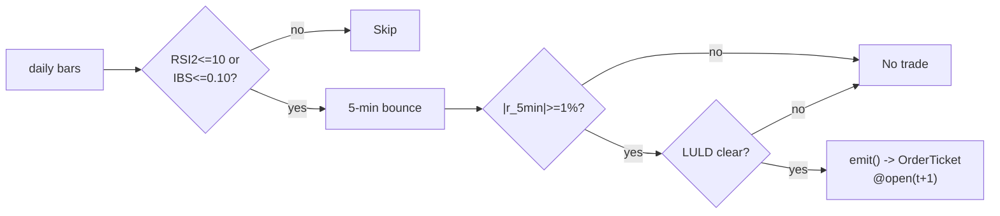

# T013 — RSI-2 / IBS Extreme Fade

> **Reviewer card.** Short-term extreme fade: RSI(2) ≤ `10` [default] or IBS ≤ `0.10` [default] (Connors/Raschke) marks the overextension; the `5`-minute bounce (S037) times the turn; the LULD guard (S058) vetoes dislocated names. Provenance **[D]**.
>
> Edge verdict: **NO-DOCUMENTED-EDGE** — no peer-reviewed P&L for the RSI-2/IBS fade found — Connors/Raschke is a practitioner book, not a documented result [documented].
>
> After-cost: **BEFORE-COST** — one-sentence verdict: the extreme-fade is practitioner lore with no citable after-cost P&L — the bounce timing is what makes it testable.
>
> Tier **S** · prototype 20–40 h [example] · loaded cost $3,000–6,000 [example] · latency bar / daily + 5-min · risk medium (extreme catching, adverse selection).
>
> Data cost: **$29–199/mo [documented — vendor pricing page https://massive.com/stocks-data, fetched 2026-09-11]** — Stocks Starter $29/mo is 15-min delayed (screen/backtest only); live 5-min bounce timing needs **Advanced $199/mo real-time** (Developer $79/mo is still 15-min delayed per the vendor page); Massive rebrand 2026 did not change endpoints. Research: $29/mo; production: $199/mo.

> Capacity $1–5M/day notional [example] — extreme names × a few thousand shares · Executability: Feasible: daily RSI(2)/IBS screen + 5-min bounce machine; any retail platform.

## §1  Identity & provenance

This module is a **strategy**: it emits `OrderTicket` intentions only — brokers create orders, strategies never do. Family **B  # mean-reversion**, batch **TB3**, provenance **D**.

**Lede.** Short-term extreme fade: RSI(2) ≤ `10` [default] or IBS ≤ `0.10` [default] (Connors/Raschke) marks the overextension; the `5`-minute bounce (S037) times the turn; the LULD guard (S058) vetoes dislocated names. Provenance **[D]**.

**When it dies.** Trending extremes (the RSI-2 stays pinned); information-driven extremes; illiquid names.

**Regime gates (provisional).** R001 elevated RV degrades (extremes are information); halted names excluded.

**Prototype scope.** daily RSI(2)/IBS screen + 5-min bounce + LULD guard + kill-switch.

## §1.5  Escalation gate

Cheapest viable path: **Massive Stocks Starter $29/mo [documented — vendor pricing page https://massive.com/stocks-data, fetched 2026-09-11]** — 15-min delayed aggregates, sufficient for the daily RSI(2)/IBS screen and for offline bounce calibration; buy nothing. The daily screen can be built entirely on the free Basic tier (`5` calls/min [documented — vendor page], delayed end-of-day) for pure research.

Cheapest-source row: `min_tier=Stocks Starter $29/mo [documented — vendor pricing page https://massive.com/stocks-data, fetched 2026-09-11], latency_class=delayed 15-min [documented — vendor pricing page https://massive.com/stocks-data, fetched 2026-09-11], required_fields={daily OHLCV, 5-min OHLCV, 1-min LULD tape}, price_band=$29–199/mo [documented — vendor pricing page https://massive.com/stocks-data, fetched 2026-09-11], build_or_buy=build`.

Resource budget: `1` core, `<1` GB RAM [internal-est] [internal-est] · compute pattern `per_bar`.

Skip list: intraday RSI(2) recalibration (daily bar is the thesis); multi-indicator ensembles; real-time NBBO quote feed (5-min bars suffice [default]); portfolio-level margin optimizer.

**DO-NOT-CUT list:** t→t+1 causality assertions (C4); the callable COST block + cost-gate predicate (C3); kill switch ARMED→TRIPPED→RECOVERY→ARMED (C2); decision-log schema (C5); bona-fide-intent + self-trade prevention; honesty tags on every literal; fixtures + tests; secrets via env (`POLYGON_API_KEY`) only.

Explicitly out of scope (phase two): RSI(2) on intraday bars; multi-indicator ensembles (phase `2`).

Escalation gate: universe beyond US large-caps [default]; 5-min bar latency `>60` s [default]; **any live 5-min bounce timing requires Stocks Advanced $199/mo real-time [documented — vendor pricing page https://massive.com/stocks-data, fetched 2026-09-11]** (Developer $79/mo is 15-min delayed — not real-time) — the Starter $29/mo delayed feed cannot time live bounces. Crossing it requires re-review of §T7 and §T8.

## §T0  Contract — strategies emit intentions, brokers create orders

**Typed signature (core function; ingest code lives elsewhere).**

```python
def emit(state: ModuleState, events: list[Bar5m], signals: SignalInputs,
         cfg: Config) -> list[OrderTicket]: ...
```

This strategy's sole output is a list of `OrderTicket` intentions. It never places, routes, or confirms an order. Every ticket carries `parent_signal` (the upstream signal id and its `computed_at`), an `intent_ts`, a `tif`, and a `limit` price pinned at `open(t+1)` [example]. The backtest harness fills tickets strictly after the signal bar (`fill_event > signal_event`, t->t+1 causality); any fill timestamped at or before its signal bar is a harness bug and trips the kill switch.

**Config dataclass (single parameter surface; status ∈ {fixed, default, calibrate, example, internal-est}).**

```python
from dataclasses import dataclass

@dataclass(frozen=True)
class Config:
    rsi2_entry:   float = 10.0    # default; range 5–20;    status=default
    ibs_entry:    float = 0.10    # default; range 0.05–0.30; status=default
    bounce_ret:   float = 0.01    # default; range 0.005–0.03; status=default
    z_exit:       float = 0.5     # default; range 0.0–1.5;  status=example (NOT wired into the normative exit rule in v1.0.x; see §T3 — exit uses RSI(2) through 50 [example])
    stop_dollars: float = 0.30    # default; range 0.05–1.0; status=default
    time_stop_min:float = 60.0    # default; range 15–240;   status=default
    cooldown_s:   float = 600.0   # default; range 0–3600;   status=default
    cost_gate_k:  float = 0.5     # default; range 0.1–2.0;  status=default
```

**Module state vector (carried between bars).**

`{rsi2, ibs, bounce_state, cooldown_until, position, adverse_extremes, module_state}` — module_state ∈ `OK | DEGRADED | UNKNOWN | OFF` (single canonical enum).

| Input failure | Module state | Alert | Behavior |
|---|---|---|---|
| RSI(2) > 10 and IBS > 0.10 (gate miss) [example] | `DEGRADED` (skip name) | log | no tickets for the name this session |
| LULD band touched in last 60 min [example] | `DEGRADED` → `UNKNOWN` if tape missing | notify | veto entries (C12) |
| 5-min bounce inputs missing / non-finite | `UNKNOWN` | log | no tickets; never interpolate (F1–F5) |
| Kill-switch trip | `OFF` | page | stop emitting, flatten per exit rule |
| Feed heartbeat missed > 2 s [example] | `OFF` | page | same as trip |

**Time contract.**

| Item | Value |
|---|---|
| Clock domain | venue (SIP/NASDAQ) exchange time |
| Authoritative causality clock | `bar_open_ts` int64 ns, UTC canonical, tz `America/New_York` for session rules |
| Bar-label rule | bars labeled by **open** time; signal `t` = the 5-min bar whose open is `t` |
| Timestamps | dual `(event_ts, asof_ts)` on every bar and ticket |
| Max skew | `5` s [default] |
| Jitter budget | `30` s [default] |
| Staleness TTL | `90` s [default] — inputs older than TTL → `UNKNOWN`, no tickets (C6) |
| Gap policy | no interpolation, ever; gaps emit `UNKNOWN` |
| Precision | prices `2` dp (cents) [default]; returns decimal, fixed definition `r = C_t/C_{t-1} − 1`; units bps for costs |

**Market-state table (runtime, not backtest hygiene).**

| State | Entries | Exits | Behavior |
|---|---|---|---|
| `CONTINUOUS_TRADING` | allowed | allowed | normal |
| `HALTED` | vetoed | managed per broker state | S058-style tape gap → `UNKNOWN`; resume only on fresh continuous bar |
| `AUCTION` (open/close) | vetoed | flatten per session rule | no signal computation on auction prints |
| `CLOSED` | vetoed | n/a | no overnight carry (C9) |

**Risk contract (canonical YAML; §T7 is the prose/evidence layer — do not restate numbers elsewhere).**

```yaml
per_trade_R: 300.0          # $ [example]
daily_loss_stop: -1500.0    # $ [example] -> dark for the day
max_gross: 600000.0         # $ notional [example]
max_concurrent_extremes: 4  # [example]
max_adverse_per_trade: 1.5 # x stop [default]
enforcement: intraday-hard  # [default]
calibration_recipe: "paper-trade 30 sessions [default]; RSI(2)/IBS screen on 250-day history [default]; re-pin fee schedule monthly [default]"
kill_conditions:
  - "3 consecutive adverse extremes [example]"
  - "feed heartbeat missed > 2 s [example]"
  - "clock skew > 50 ms [example]"
  - "4 concurrent extreme fades [example]"
```

**Kill switch: `ARMED` → `TRIPPED` → `RECOVERY` → `ARMED`.** On trip: stop emitting immediately, flatten managed positions per the §T3 exit rule, page. Re-arm checklist (all required): manual review signed off; cooldown expired; feeds healthy (heartbeat < 2 s [example], skew ≤ 50 ms [example]); LULD tape current; decision log flushed; test_cmd green on the latest tape.

**Child-order state machine (broker downstream of intentions).** `INTENT_CREATED → BROKER_ACCEPTED → (PARTIAL_FILL →)* → FILLED | CANCELLED | REJECTED`. Partial-fill policy: oldest `intent_ts` first (FIFO); resting quantity never increases without a new ticket. Cancel-replace: **not used** in v1.0.x — DAY limit intents, no replaces; corrections require a new ticket after `cooldown_s`.

**Ops tail.**

| Item | Spec |
|---|---|
| Schedule | daily screen pre-open; entries `10:00`–`15:00` ET [example]; flat by `15:30`; no overnight carry (C9) |
| Owner | strategy owner on-call; pages on kill-switch trip |
| Health checks | feed heartbeat every `2` s [example]; clock skew ≤ `50` ms [example]; daily screen completeness pre-open |
| Alerts | `TRIPPED` → page; `UNKNOWN` streak → notify; daily-loss-stop → dark-for-day notice |
| Resource budget | `1` vCPU, `1` GB RAM [internal-est]; `per_bar` compute |
| Runbook stub | trip → page → review decision log → check feeds → run test_cmd → checklist → ARMED |
| Secrets | env only: `POLYGON_API_KEY` (never in code, config, or logs — CI secrets-grepped) |

## §T1  Strategy thesis & edge

**Thesis.** Short-term extreme fade: RSI(2) ≤ `10` [default] or IBS ≤ `0.10` [default] (Connors/Raschke) marks the overextension; the `5`-minute bounce (S037) times the turn; the LULD guard (S058) vetoes dislocated names. Provenance **[D]**.

**Edge verdict: NO-DOCUMENTED-EDGE** — no peer-reviewed P&L for the RSI-2/IBS fade found — Connors/Raschke is a practitioner book, not a documented result [documented].

**After-cost verdict: BEFORE-COST** — one-sentence verdict: the extreme-fade is practitioner lore with no citable after-cost P&L — the bounce timing is what makes it testable.

**Risk summary.** Catching the extreme that keeps extending; adverse selection; bounce-timing whipsaw.

**Math.**

```text
RSI(`2`) on daily closes; IBS `= (C − L)/(H − L)` on the daily
bar. Extreme: `RSI2 ≤ 10` or `IBS ≤ 0.10` [example] (Connors/Raschke
[documented]). Bounce `r_{5min} ≥ +1.0`% [example] in the fade direction
(S037). Modeled edge `edge_bps = 0.01 × 1e4 × 0.55` [example].
```

**Pseudocode (normative).**

```text
function emit(state, signals, bars, cfg) -> list[OrderTicket]:
    assert bars non-empty else return UNKNOWN                       # F1
    t = bars[-1]   # newest 5-min bar, labeled by open time
    rsi = signals['S034'].rsi2
    ibs = signals['S034'].ibs
    br  = signals['S037'].r_5min
    assert isfinite(rsi) and isfinite(ibs) and isfinite(br) else return UNKNOWN  # F2
    if luld_touched(state, 60): return []                          # C12 veto

    edge_bps = cfg.bounce_ret * 1e4 * 0.55                          # [example]
    cost_ok = expected_cost_bps(notional, adv_pct, venue, side, urgency) <= cfg.cost_gate_k * edge_bps
    # ^^^ normative cost-gate predicate: expected_cost_bps(...) <= k * edge_bps

    tickets = []
    if state.position == 0 and cost_ok and t.event_ts >= state.cooldown_until:
        extreme_long  = (rsi <= cfg.rsi2_entry or ibs <= cfg.ibs_entry)
        extreme_short = (rsi >= 100-cfg.rsi2_entry or ibs >= 1-cfg.ibs_entry)
        if extreme_long and br >= cfg.bounce_ret:
            tickets = [ticket(side='BUY', qty=size(...), limit=open(t+1), tif='DAY',
                              parent_signal=f"S034@{t.bar_open_ts}")]
        elif extreme_short and br <= -cfg.bounce_ret and locate_ok():
            tickets = [ticket(side='SELL', qty=size(...), limit=open(t+1), tif='DAY',
                              parent_signal=f"S034@{t.bar_open_ts}")]
    else:
        if exit_trigger(t, state, cfg): tickets = [flatten_ticket(state)]
        state.cooldown_until = t.event_ts + cfg.cooldown_s * 1e9   # C10
    for tk in tickets: log_decision(tk, inputs_hash, params_hash)  # C5 / App. g
    assert fill.event_ts > t.bar_close_ts for any fill             # t->t+1 causality
    return tickets
```

## §T2  Signal stack — dependencies & data rights

**Timing box.** `signal@t (5-min bar, America/New_York) → earliest fill @open(t+1)`. No fill is ever timestamped on or before the signal bar (C4); the per-module test asserts `fill_event > signal_event` on every fixture row.

**Universe.** US equities, price > `$10`, ADV > `1`M shares [example]. Screen: RSI(`2`) ≤ `10` or IBS ≤ `0.10` [example] on the daily bar. RTH `10:00`–`15:00` [example]. Exclude: earnings days, halts, LULD-tripped names.

**Entry / exits / sizing (canonical: §T3).**

| Sub-block | Canonical location |
|---|---|
| Universe | §T2 (above) |
| Boolean entry rule (`ENTER_LONG` / `ENTER_SHORT` / `FLAT`) | §T3 entry rule |
| Exits + post-exit cooldown | §T3 exit rule + `600` s [default] cooldown (C10) |
| Position sizing, fenced `shares = f(risk_budget_R, stop_distance, vol_estimate, ADV_cap, cost)` | §T3 sizing function |
| Risk limits | §T0 risk-contract YAML (canonical), §T7 prose |
| **COST block (single source of truth)** | **§T5** — 4-component stack, `expected_cost_bps(notional, adv_pct, venue, side, urgency)` reference implementation, `fee_schedule_as_of`, `side: taker`, `borrow_bps_per_day = 0` (long-fade reference; shorts add C7); values restated nowhere else |
| Execution / fill-model table | §T6 |
| Robustness | §T9 |
| Compliance sub-block (10 coded rules minimum) | §T8 (C1–C12) + decision-log schema (App. g), halt/auction table, entitlement assertions |

| Signal | Role | Contract |
|---|---|---|
| `S034` | trigger | RSI(2) <= 10 [example] or IBS <= 0.10 [example]; the extreme |
| `S037` | confirm | |r_5min| >= 1.0% [example] in the bounce direction; timing the turn |
| `S058` | veto | no entry if the name hit the 1-min LULD band in the last 60 min [example] |

Max dependency depth: `2` [default].

**Schema mapping (canonical).**

| Vendor (Polygon.io Stocks) | Canonical |
|---|---|
| `t` (ms) | `bar_open_ts` (int64 ns UTC; bar labeled by open time) |
| `o, h, l, c` | `open, high, low, close` |
| `v` | `volume` |

Staleness: max skew `5 s` [default] · jitter budget `30 s` [default] · TTL `90 s` [default] · cadence `per_bar (daily screen + 5-min)` · tz `America/New_York`.

**Inputs that break the module.**

| Input failure | Module state | Alert |
|---|---|---|
| RSI(2) > 10 and IBS > 0.10 (gate) [example] | `DEGRADED` (skip name) | log |
| LULD band touched in last 60 min [example] | `DEGRADED` (veto entries, C12) | notify |
| 1-min LULD tape missing / stale > TTL | `UNKNOWN` | notify |
| 5-min bounce inputs missing / non-finite | `UNKNOWN` | log |

(canonical enum and mapping: §T0 — invalid input → `UNKNOWN`, never interpolate; gate miss → `DEGRADED` skip-name)

**Data rights.** US equities bars via Polygon.io Stocks, `rights: licensed`;
research + production; fixtures synthetic; entitlement = professional/internal;
derived features ours. Entitlement-class change → §1.5 escalation gate.

**Build vs buy.** Build the screen and bounce machine on a cheap bar feed; buy
nothing — the extreme screen is the IP.

**Local build.** Feasible. RSI(2)/IBS is a daily computation; the bounce machine
is a 5-minute state machine.

**Data dictionary (canonical fields).**

| Field | Type | Cadence | Tier | Notes |
|---|---|---|---|---|
| `Daily OHLCV bars` | float/int | daily | Tier 1 | RSI(2)/IBS screen |
| `5-min OHLCV bars` | float/int | 5-min | Tier 1 | bounce timing |
| `1-min LULD tape` | float | 1-min | Tier 2 | S058 guard |

## §T3  Entry / exit / sizing & worked example

**Entry rule.**

```text
ENTER_LONG  := (RSI2 <= rsi2_entry OR IBS <= ibs_entry) AND (r_5min >= bounce_ret)
               AND (no LULD in 60 min) AND (expected_cost_bps(...) <= cost_gate_k * edge_bps)
ENTER_SHORT := (RSI2 >= 100-rsi2_entry OR IBS >= 1-ibs_entry) AND (r_5min <= -bounce_ret)
               AND (no LULD in 60 min) AND (locate_ok)
               AND (expected_cost_bps(...) <= cost_gate_k * edge_bps)
FLAT        := otherwise
```

**Exit rule.**

```text
EXIT := (RSI2 back through 50 [example]) [reversion] OR (bars_held >= time_stop_min)
        OR (price stop -$stop_dollars) [stop] OR (t >= 15:30) [session flatten]
        OR (module_state != OK)
```

`z_exit` (Config, `0.5` [example]) is **not wired** into the normative exit rule in v1.0.x — the rule above exits on RSI(2) crossing `50` [example]. Wiring `z_exit` (e.g. as the reversion threshold) is deferred to v1.1.0 pending the GROK-NEEDED exit-specification question in §T10.

**Cooldown.** `600` s [default] after every exit (C10).

**Sizing function (normative).**

```python
def shares(risk_budget_R, stop_distance, vol_estimate, ADV_cap, cost):
    # risk_budget_R in $, stop_distance in $/share (example price stop $0.30)
    n = risk_budget_R / max(stop_distance, 1e-9)   # [default] floor below
    n = min(n, ADV_cap * 0.005)                   # 0.5% ADV [default]
    n = min(n * 50.0, 600000.0) / 50.0           # $600k gross cap [default]
    return int(n)
```

**Risk limits.**

| Limit | Value |
|---|---|
| Daily loss stop | `-$1,500` [example] → dark for the day |
| Max concurrent extreme fades | `4` [example] |
| Adverse-extreme kill | `3` consecutive [example] → stand down |
| Post-exit cooldown | `600` s [example] — C10 |

**Worked example (synthetic fixture, from `fixtures/T013_tape.csv` trade 1).**

Trade 1: `BUY` `1000` shares [example] @ `47.2` [example], exit `48.3` [example] (`RSI(2) through 50`). Gross P&L = `1100.00` [measured] dollars. Cost stack = `10.0` bps [example] → `47.20` [measured] dollars on `47200.00` [example] notional. Net = `1052.80` [measured] dollars. The fixture's expected CSV carries the same arithmetic for all six trades; the per-module test recomputes it from the tape and asserts equality. All P&L figures are **fixture arithmetic on synthetic data** — there is no claimed live P&L anywhere in this module.

**Flow.**


## §T4  Parameters

| Parameter | Key | Default | Status | Provenance | Sensitivity |
|---|---|---|---|---|---|
| RSI(2) entry | `rsi2_entry` | `10` | default | [default] | high |
| IBS entry | `ibs_entry` | `0.10` | default | [default] | high |
| Bounce return | `bounce_ret` | `+1.0`% | default | [default] | high |
| Reversion exit z | `z_exit` | `0.5` | example (**unwired** in v1.0.x) | [example] | medium |
| Price stop | `stop_dollars` | `$0.30` | default | [default] | high |
| Time stop | `time_stop_min` | `60` min | default | [default] | medium |
| Post-exit cooldown | `cooldown_s` | `600` s | default | [default] | low |
| Cost-gate k | `cost_gate_k` | `0.5` | default | [default] | high |

The canonical Config dataclass with all statuses is in §T0. `z_exit` is retained in the schema for v1.1.0 exit-rule wiring (see §T10 GROK-NEEDED Q1); nothing in the normative §T3 exit rule consumes it today.

## §T5  Costs — the callable is the single source of truth

| Component | bps | Basis |
|---|---|---|
| Spread | `8.0` | [example] $0.02 assumed spread at $50: half-spread per aggressive leg × 2 legs |
| Fees | `2.0` | [example] $0.005/share each way at $50 = 1 bps/leg |
| Borrow | `0.0` | [default] long-fade reference; shorts add C7 |
| Impact | `0.0` | [example] flagged; gap-through in conservative variant |
| **Total** | `10.0` | [example] reference stack |

Fee schedule as of `2026-09-01` [example] · venue `XNAS / SIP 5-min bars [example]` · side `taker` · borrow `0.0` bps/day [example] — reference build is long-fade; short variant models borrow explicitly.

```python
def expected_cost_bps(notional, adv_pct, venue, side, urgency) -> float:
    """Callable cost model - T013 COST block (single source of truth)."""
    spread_bps = 8.0    # [example] $0.02 assumed spread @ $50: half/aggressive leg x 2
    fee_bps = 2.0       # [example] $0.005/share each way @ $50 = 1 bps/leg
    borrow_bps = 0.0    # [default] long-fade reference; shorts add C7
    impact_bps = 0.0    # [example] flagged; gap-through in conservative variant
    return spread_bps + fee_bps + borrow_bps + impact_bps
```

**Normative cost-gate predicate (C3):** `expected_cost_bps(...) <= k * edge_bps` — no ticket is emitted unless the callable cost clears this gate. The predicate appears verbatim in the §T1 pseudocode and is asserted by the per-module test.

## §T6  Execution assumptions

| Aspect | Assumption |
|---|---|
| Latency | daily screen + 5-min bar evaluation; fill at next-bar open |
| Partial fills | oldest `intent_ts` first (FIFO); resting quantity never increases without a new ticket |
| Impact | `0` bps reference [example]; conservative variant models gap-through |
| Adverse fill | the extreme keeps extending — the stop is the thesis |
| Cancel-replace | not used in v1.0.x: DAY limit intents, no replaces; corrections only via a new ticket after `cooldown_s` |
| Child-order lifecycle | `INTENT_CREATED → BROKER_ACCEPTED → (PARTIAL_FILL →)* → FILLED \| CANCELLED \| REJECTED` — broker-side; strategies emit intentions only (canonical: §T0) |

## §T7  Risk contract & kill switch

Per-trade R: `$300` [example] per trade · daily loss stop: `- $1,500` [example] then dark for the day · max gross: `$600k` notional [example] · max adverse per trade: `1.5`x stop [default]. (Canonical risk-contract YAML: §T0; the line above is the same contract in prose.)

Enforcement: `intraday-hard` [default]. Calibration recipe: paper-trade `30` sessions [default]; RSI(2)/IBS screen on `250`-day history [default]; re-pin fee schedule monthly [default].

**Kill switch: `ARMED` → `TRIPPED` → `RECOVERY` → `ARMED`.**

Trip conditions:

- 3 consecutive adverse extremes [example]
- feed heartbeat missed > 2 s [example]
- clock skew > 50 ms [example]
- 4 concurrent extreme fades [example]

On trip: the module stops emitting tickets immediately, flattens managed positions per the exit rule, and pages. `RECOVERY` requires the full re-arm checklist (canonical: §T0): manual review signed off, cooldown expired, feeds healthy, LULD tape current, decision log flushed, test_cmd green; only then does the module return to `ARMED`. The per-module test drives the full transition cycle.

**Ops.** Canonical ops tail in §T0 (schedule, owner, health checks, alert table, resource budget, runbook stub, secrets); nothing in §T7 is re-stated there.

**Universe.** Canonical in §T2 (Universe sub-block); not restated here.

## §T8  Compliance (C1–C10+)

- **C1** | No orders: the strategy emits `OrderTicket` intentions only; the broker creates orders.
- **C2** | Kill switch: `ARMED` → `TRIPPED` → `RECOVERY` → `ARMED` on the trip conditions in §T7.
- **C3** | Cost gate: `expected_cost_bps(...) <= k * edge_bps` before any ticket (see §T5).
- **C4** | Causality: `fill_event > signal_event` (t->t+1); no signal-bar fills, ever.
- **C5** | Decision log: every ticket logged with inputs hash and params hash (see App. g).
- **C6** | Staleness: inputs older than the TTL → `UNKNOWN`, no tickets.
- **C7** | Short discipline: `locate_ok` required before any short ticket.
- **C8** | Cooldown: post-exit cooldown enforced in seconds; no re-entry inside it.
- **C9** | Session flatten: no uncommanded overnight carry.
- **C10** | Position caps: per-trade R, daily loss stop, and max gross enforced.
- **C11 | Adverse-extreme kill: trigger = `3` consecutive adverse extremes [example] → check = extreme P&L → action = stand down → log = `COMPLIANCE_BLOCK`**
- **C12 | LULD veto: trigger = band touched in `60` min [example] → check = S058 → action = veto entries → log = `GATE_VETO`**

**Appendix g — decision-log schema (C5).** Every ticket and every gate decision is logged as one JSONL row:

```json
{"ts_ns": 1788960600000000000, "sid": "T013", "decision": "EMIT|VETO|UNKNOWN|BLOCK",
 "side": "BUY|SELL|null", "qty": 1000, "limit_px": 47.20,
 "parent_signal": "S034@1788960540000000000", "inputs_hash": "sha256:…",
 "params_hash": "sha256:…", "cost_bps": 10.0, "edge_bps": 55.0,
 "reason": "C3|C12|COMPLIANCE_BLOCK|GATE_VETO|null"}
```

`inputs_hash` covers the signal inputs + bar window; `params_hash` covers the Config dataclass. Veto/block rows carry `qty: null`. (Values in the row above are illustrative [example].)

**Halt/auction state table (runtime).**

| Market state | Entries | Exits | Log |
|---|---|---|---|
| `CONTINUOUS_TRADING` | allowed | allowed | — |
| `HALTED` | vetoed (C12 analog) | managed per broker | `GATE_VETO` |
| `AUCTION` | vetoed | flatten per session rule | `GATE_VETO` |
| `CLOSED` | vetoed (C9) | n/a | — |

**Entitlement assertions (startup + per-session).** The module asserts, before the first screen, that the Polygon/Massive entitlement covers the licensed tier used (research vs production), that derived features are ours, and that no data is redistributed; entitlement-class change → §1.5 escalation gate (see also §T2 data rights).

## §T9  Evidence, failures & regime gates

**Evidence (cost-level tokens; every statistic tagged).**

| Source | Sample | Finding | Cost level | Caveat |
|---|---|---|---|---|
| Connors, L. & Raschke, L. (1995) [documented] | (practitioner book) | RSI-2 / IBS extreme-fade system description [documented] | `BEFORE-COST` (system description) | practitioner book — no citable after-cost P&L |

**Where this module is known to fail.** trending extremes, information-driven extremes, illiquid names, bounce-timing whipsaw.

**Failure modes (detect → action → recovery).**

| # | Failure | Detect → action → recovery | Executable check |
|---|---|---|---|
| 1 | Extreme keeps extending | detect: `3` consecutive adverse → action: stand down (C11) → recovery: next session [default] | `adverse_extremes < 3` |
| 2 | Earnings extreme | detect: earnings-day flag → action: excluded → recovery: next session [default] | `not earnings_day` |
| 3 | LULD dislocation | detect: band touch → action: veto (C12) → recovery: leg normalizes [default] | `no luld` |
| 4 | Cost blowup | detect: cost gate failing → action: stand down → recovery: re-pin [default] | `expected_cost_bps(...) <= k * edge_bps` |
| 5 | Lookahead in screen | detect: screen uses future → action: halt, fix → recovery: no-signal-bar-fills test [default] | `all(fill_ts > signal_ts)` |

**Regime gates (machine records).**

| regime_id | direction | mechanism | condition | action | min_lag | unknown_behavior |
|---|---|---|---|---|---|---|
| R001 | degrades | elevated RV: extremes are information | rv_pctile > 70 [default] | halve | 1 bar [default] | veto |
| R001 | inverts | extreme RV | rv_pctile > 95 [default] | pause_entry | 1 bar [default] | veto |
| R-halt | inverts | halt/auction state | state != CONTINUOUS_TRADING [default] | veto | 0 [default] | veto |

`rv_pctile` is the `20`-day [default] realized-volatility percentile; restrictive default holds: an unknown regime state vetoes entries.

**Robustness.** The extreme screen is the frequency control: RSI(2) `≤10` [default] vs
`≤20` [example] trades selectivity for frequency. The bounce timing
(`bounce_ret` in `0.5`–`2`% [example]) is the anti-knife screen. Purged/
embargoed OOS per S088.

**What the optimistic case assumes (and we do not).** (1) the extreme is assumed to be overextension, not information —
earnings extremes excluded, but the screen is imperfect; (2) spread fixed at
`2`¢ [example]; (3) impact `0` [example] — flagged.

## §T10  Unverified leads & what would change our mind

- RSI-2 backtest P&L claims from practitioner blogs/forums — no citable published P&L found; not promoted.

**Source log (verified 2026-09-11).**

| # | Source | Verified fact | Status |
|---|---|---|---|
| 1 | EconBiz library record (econbiz.de/10004277521) + AbeBooks/retail listings | Connors, L. & Raschke, L., *Street Smarts: High Probability Short-Term Trading Strategies*, M. Gordon Publishing, ISBN-10 0965046109 / ISBN-13 9780965046107 | [documented]; year 1995 per EconBiz, 1996 per retail listings |
| 2 | Traders.com Books review, April 2013 (traders.com/Documentation/FEEDbk_docs/2013/04/books.html) | Bandy, H. B., *Mean Reversion Trading Systems: Practical Methods for Swing Trading*, Blue Owl Press, 2013, ISBN 978-097918384-3 | [documented]; corrects the 2011 year previously cited |
| 3 | Massive vendor pricing page https://massive.com/stocks-data (fetched 2026-09-11): Starter $29/mo (15-min delayed, 5-yr history), Developer $79/mo (15-min delayed, 10-yr history), Advanced $199/mo (real-time, 20+ yr history); the Jun–Aug 2026 third-party comparisons overstated Developer at ~$99/mo and wrongly called it real-time | vendor/pricing [documented — vendor pricing page https://massive.com/stocks-data, fetched 2026-09-11] | 2026-09-11 | n/a | §1.5 price band; production must be Advanced |
| 4 | stocksoftresearch.com (Bandy RSI walk-forward tests, 2003–2016) | Bandy's walk-forward RSI-model results (e.g. XLF 0.89%/trade OOS; PEP 0.3%/trade, 67.5% winners) belong to his *Quantitative Technical Analysis* RSI model, **not** to the RSI-2/IBS extreme fade — not promoted into §T9 | segregated, [documented] provenance |

What would change our mind: a purged/embargoed walk-forward with full costs that survives the S088 honesty protocol; a documented after-cost P&L from the cited authors' own implementations; or a regime-gated replication that holds outside the original sample.

**GROK-NEEDED** (expert questions web search could not resolve — do not answer from priors):
1. "T013 (RSI-2 / IBS extreme fade): Connors & Raschke's RSI-2 system in *Street Smarts* exits long fades on a close above the 5-day SMA in the original specification — is that documented in any citable Connors Research publication, and what exit (RSI(2) through 50 vs 5-day SMA cross vs fixed 1-day hold) shows a documented after-cost P&L? The module needs the exact exit rule to wire the currently-unwired `z_exit` parameter (default 0.5, range 0.0–1.5)."
2. "T013: is there any published after-cost P&L (walk-forward, purged/embargoed, with explicit spread/fees/borrow/impact stack) for the Connors RSI-2 / IBS extreme-fade equity system? Include author, title, year, sample period, cost assumptions, and per-trade net bps if available."
3. [RESOLVED 2026-09-11 by direct vendor-page verification — no Grok lookup needed] Vendor-correct values at https://massive.com/stocks-data: Developer tier = **$79/mo**, **15-minute delayed** (not real-time); real-time unlocks at Advanced $199/mo. §1.5 escalation gate corrected accordingly.
4. "T013 short-fade variant: what is a documented, citable 2026 borrow-rate band (bps/day) for easy-to-borrow US large-cap equities at retail brokers, to replace the module's `borrow_bps = 0` [default] long-only assumption when C7 (locate check) permits short tickets?"

---

## AI build prompt

```text
Build the T013 (RSI-2 / IBS Extreme Fade) strategy module from this specification.
Hard constraints:
- The strategy emits OrderTicket intentions ONLY; it never creates orders (C1).
- Causality: fill_event > signal_event (t->t+1); no signal-bar fills (C4).
- Cost gate: expected_cost_bps(...) <= k * edge_bps before any ticket (C3).
- Kill switch ARMED -> TRIPPED -> RECOVERY -> ARMED on the §T7 trip conditions (C2).
- Every numeric literal in prose carries an honesty tag [documented]/[measured]/[example]/[unverified]/[default]/[internal-est]; exempt identifiers only.
- Sources must be real and cited with cost-level tokens; chatbot-only material goes to §T10.
Config surface (canonical Config dataclass in §T0):
- rsi2_entry (float): default 10.0, range 5–20 [default]
- ibs_entry (float): default 0.10, range 0.05–0.30 [default]
- bounce_ret (float): default 0.01, range 0.005–0.03 [default]
- z_exit (float): default 0.5, range 0.0–1.5 [example] — NOT wired into the normative exit rule in v1.0.x (exit uses RSI(2) through 50 [example]); retain in schema for v1.1.0
- stop_dollars (float): default 0.30, range 0.05–1.0 [default]
- time_stop_min (float): default 60.0, range 15–240 [default]
- cooldown_s (float): default 600.0, range 0–3,600 [default]
- cost_gate_k (float): default 0.5, range 0.1–2.0 [default]
Entry rule:
ENTER_LONG  := (RSI2 <= rsi2_entry OR IBS <= ibs_entry) AND (r_5min >= bounce_ret)
               AND (no LULD in 60 min) AND (expected_cost_bps(...) <= cost_gate_k * edge_bps)
ENTER_SHORT := (RSI2 >= 100-rsi2_entry OR IBS >= 1-ibs_entry) AND (r_5min <= -bounce_ret)
               AND (no LULD in 60 min) AND (locate_ok)
               AND (expected_cost_bps(...) <= cost_gate_k * edge_bps)
FLAT        := otherwise
Exit rule:
EXIT := (RSI2 back through 50 [example]) [reversion] OR (bars_held >= time_stop_min)
        OR (price stop -$stop_dollars) [stop] OR (t >= 15:30) [session flatten]
        OR (module_state != OK)
Sizing: implement the §T3 sizing_fn verbatim; enforce the §T7 risk contract.
Deliverables: the module markdown (all sections §1–§T10), the fixture tape CSV
(fixtures/T013_tape.csv), the expected CSV (fixtures/T013_expected.csv), and
the per-module test (modules/tests/test_T013.py) covering fixture arithmetic,
causality, the cost gate, the kill-switch cycle, invalid→UNKNOWN, and the callable signature.
```
