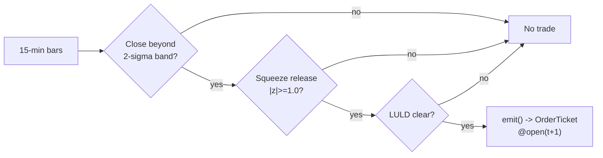

# T014 — Bollinger Reversal + Squeeze Exit

> **Reviewer card.** Bollinger-band reversal with squeeze exit: closes beyond the `2`σ band mark the overextension; the squeeze-release (S039) confirms the volatility expansion; exits ride the band contraction. Provenance **[D]**.
>
> Edge verdict: **NO-DOCUMENTED-EDGE** — no peer-reviewed P&L for the Bollinger reversal found — Bollinger (2001) is a practitioner book, not a documented result [documented].
>
> After-cost: **BEFORE-COST** — one-sentence verdict: the band reversal is practitioner tooling with no citable after-cost P&L — the squeeze confirm is what makes it testable.
>
> Tier **S** · prototype 20–40 h [example] · loaded cost $3,000–6,000 [example] · latency_class `bar / 15-min` · risk_class `medium` (band-riding trends) · data $29/mo research on Massive Stocks Starter (15-min delayed) [documented]; production entitlement professional/internal.

> Capacity $1–5M/day notional [example] — band-touch names × a few thousand shares · Executability: Feasible: Bollinger bands + squeeze state machine; any retail platform · emits `OrderTicket` intentions (strategy never creates orders).

## §1  Identity & provenance

This module is a **strategy**: it emits `OrderTicket` intentions only — brokers create orders, strategies never do. Family **B  # mean-reversion**, batch **TB3**, provenance **D**.

**Lede.** Bollinger-band reversal with squeeze exit: closes beyond the `2`σ band mark the overextension; the squeeze-release (S039) confirms the volatility expansion; exits ride the band contraction. Provenance **[D]**.

**When it dies.** Trending tapes (bands are walked); low-vol regimes where the band is the noise.

**Regime gates (provisional).** R001 elevated RV degrades (band touches are information); halted names excluded.

**Prototype scope.** Bollinger bands + squeeze + reversal machine + kill-switch.

## §1.5  Escalation gate

Cheapest viable path: **Massive Stocks Starter (formerly Polygon.io)** — daily + 15-min delayed OHLCV bars at **$29/mo [documented — 2026-06-05 pricing-tier doc]**; the 15-min delay matches this module's 15-min bar cadence, so no higher tier is needed for research. Build the band machine on this feed; buy nothing.

**Cheapest-source row (structured).**

| min_tier | latency_class | required_fields | price_band | build_or_buy |
|---|---|---|---|---|
| Massive Stocks Starter (delayed) | bar / 15-min | daily + 15-min OHLCV | $29/mo [documented — vendor pricing page https://massive.com/stocks-data, fetched 2026-09-11] | build |

Resource budget: `1` core, `<1` GB RAM [internal-est] · compute pattern `per_bar`.

Skip list (phase two, explicitly out of scope): Bollinger on intraday bars; %b/MFI ensembles (phase `2`); real-time quote feed (only needed if the LULD veto moves to sub-bar detection — see GROK-NEEDED #1).

**DO-NOT-CUT list.** t→t+1 causality assertions (no signal-bar fills); the COST block callable + cost gate; the kill switch (ARMED→TRIPPED→RECOVERY→ARMED); the decision log (C5/C20 schema); bona-fide-intent + self-trade prevention (C13/C14); provenance/honesty tags on every numeric literal; fixtures + per-module tests; secrets via env only (`POLYGON_API_KEY`).

Escalation gate: universe beyond US large-caps [default]; 15-min bar latency `>60` s [default] — crossing it requires re-review of §T7 and §T8.

## §T0  Contract — strategies emit intentions, brokers create orders

This strategy's sole output is a list of `OrderTicket` intentions. It never places, routes, or confirms an order. Every ticket carries `parent_signal` (the upstream signal id and its `computed_at`), an `intent_ts`, and a `tif`. The backtest harness fills tickets strictly after the signal bar (`fill_event > signal_event`, t->t+1 causality); any fill timestamped at or before its signal bar is a harness bug and trips the kill switch.

**Typed signature.**

```python
def emit(state: ModuleState, signals: SignalInputs, bars: list[Bar], cfg: T014Config) -> list[OrderTicket]:
    """Core decision function. bars[-1] is the newest 15-min bar (labeled by open time)."""
```

**Config dataclass (single source for parameters).**

```python
@dataclass
class T014Config:
    bb_period: float     = 20.0   # status: default; range 10–50
    bb_mult: float       = 2.0    # status: default; range 1.0–3.0
    squeeze_z: float     = 1.0    # status: default; range 0.5–2.0
    z_exit: float        = 0.5    # status: default; range 0.0–1.5
    stop_dollars: float   = 0.35   # status: default; range 0.05–1.0
    time_stop_min: float  = 120.0  # status: default; range 30–480
    cooldown_s: float     = 600.0  # status: default; range 0–3,600
    cost_gate_k: float    = 0.5    # status: default; range 0.1–2.0
```

**Time contract.**

| Field | Value |
|---|---|
| Clock domain | venue bar clock (SIP), normalized to UTC; authoritative causality clock = bar event clock |
| Timestamp type | int64 ns, UTC canonical; bars labeled by **open** time (`bar_open_ts`) |
| Dual stamps | every tick carries `(event_ts, asof_ts)` |
| max_skew | `5` s [default] |
| jitter budget | `30` s [default] |
| staleness TTL | `90` s [default] — older inputs → `UNKNOWN`, no tickets (C6) |
| gap policy | no interpolation, ever; missing bars → `UNKNOWN` for affected names |

**Market-state table.**

| State | New entries | Working tickets | Behavior |
|---|---|---|---|
| `CONTINUOUS_TRADING` | allowed | live | normal operation |
| `HALTED` | vetoed | canceled | S058 LULD veto path (C12/C17) |
| `AUCTION` | vetoed | canceled unfilled | opening/closing auction windows |
| `CLOSED` | none | none | module `OFF` |

**Module-state enum.** `OK | DEGRADED | UNKNOWN | OFF`. Invalid input emits `UNKNOWN`, never interpolates. `OFF` = kill switch TRIPPED or session closed.

**Risk contract.** Fenced YAML in §T7 (single location); kill-switch state machine `ARMED → TRIPPED → RECOVERY → ARMED` below.

**Re-arm checklist** (all required before `RECOVERY → ARMED`):

1. Identify the trip cause from the decision log (`COMPLIANCE_BLOCK` / `GATE_VETO` / feed alert).
2. Confirm feed healthy: heartbeat gap `< 2` s [example], clock skew `< 50` ms [example].
3. Confirm post-exit cooldown expired (`>= cooldown_s` since last exit).
4. Manual review sign-off by the strategy owner [default].
5. Transition to `ARMED` and log the re-arm with reviewer id + params hash (C5).

**Ops tail.**

| Item | Value |
|---|---|
| Schedule | RTH `10:00`–`15:30` ET [example]; flat by `15:30`; no overnight carry (C9) |
| Owner | strategy desk on-call rotation [default] |
| Health checks | feed heartbeat every bar; kill-switch state published each bar; decision-log write latency `< 1` s [default] |
| Alerts | `TRIPPED` → page immediately; `RECOVERY` → notify desk; entitlement change → page + module `OFF` (C19) |
| Resource budget | `1` vCPU, `1` GB RAM [internal-est] |
| Runbook stub | trip → flatten per §T3 exit rule → page → follow re-arm checklist above → §T7 |
| Secrets | env-only: `POLYGON_API_KEY` (Gate-grepped; never in files) |

State variables carried between bars: `basis`, `upper`, `lower`, `bandwidth`, `squeeze_state`, `cooldown_until`, `position`, `module_state`.

## §T1  Strategy thesis & edge

**Thesis.** Bollinger-band reversal with squeeze exit: closes beyond the `2`σ band mark the overextension; the squeeze-release (S039) confirms the volatility expansion; exits ride the band contraction. Provenance **[D]**.

**Edge verdict: NO-DOCUMENTED-EDGE** — no peer-reviewed P&L for the Bollinger reversal found — Bollinger (2001) is a practitioner book, not a documented result [documented].

**After-cost verdict: BEFORE-COST** — one-sentence verdict: the band reversal is practitioner tooling with no citable after-cost P&L — the squeeze confirm is what makes it testable.

**Risk summary.** Riding the band in a trend (the reversal never comes); squeeze misfire; adverse selection.

**Math.**

```text
Bollinger bands: basis `SMA(20)`, bands `±2σ` [example] (S038).
Bandwidth `= (upper − lower)/basis`; squeeze release `|bandwidth z| ≥ 1.0`
[example] (S039). Reversal: fade the band touch on the squeeze release. Modeled
edge `edge_bps = bb_mult × 20.0` [example].
```

**Pseudocode (normative).**

```text
function emit(state, signals, bars, cfg) -> list[OrderTicket]:
    assert bars non-empty else return UNKNOWN                       # F1
    t = bars[-1]   # newest 15-min bar, labeled by open time
    bb = signals['S038']; sq = signals['S039']
    assert isfinite(bb.upper) and isfinite(sq.z) else return UNKNOWN  # F2
    if luld_touched(state, 60): return []                          # C12 veto

    edge_bps = cfg.bb_mult * 20.0                                  # [example]
    cost_ok = expected_cost_bps(notional, adv_pct, venue, side, urgency) <= cfg.cost_gate_k * edge_bps
    # ^^^ normative cost-gate predicate: expected_cost_bps(...) <= k * edge_bps

    tickets = []
    if state.position == 0 and cost_ok and t.event_ts >= state.cooldown_until:
        released = abs(sq.z) >= cfg.squeeze_z
        if t.close < bb.lower and released:
            tickets = [ticket(side='BUY', qty=size(...), limit=open(t+1), tif='DAY',
                              parent_signal=f"S038@{t.bar_open_ts}")]
        elif t.close > bb.upper and released and locate_ok():
            tickets = [ticket(side='SELL', qty=size(...), limit=open(t+1), tif='DAY',
                              parent_signal=f"S038@{t.bar_open_ts}")]
    elif state.position != 0:
        if exit_trigger(t, state, cfg):                             # squeeze exit: |bandwidth z| <= z_exit
            tickets = [flatten_ticket(state)]
            state.cooldown_until = t.event_ts + cfg.cooldown_s * 1e9  # C8/C10
    for tk in tickets: log_decision(tk, inputs_hash, params_hash)  # C5 / C20
    assert all(fill.event_ts > t.bar_close_ts for fill in fills)    # t->t+1 causality, C4
    return tickets
```

## §T2  Signal stack — dependencies & data rights

| Signal | Role | Contract |
|---|---|---|
| `S038`@1.1.0 | trigger | close beyond the 2σ band [example]; the band touch is the extreme |
| `S039`@1.1.0 | confirm | squeeze release (|bandwidth z| >= 1.0 [example]); the volatility expansion confirms the reversal |
| `S058`@1.1.0 | veto | no entry if the name hit the 1-min LULD band in the last 60 min [example] |

Max dependency depth: `2` [default]. Consumed formulas are pinned verbatim excerpts from the signal modules at the pinned versions above (S038: Bollinger bands `basis = SMA(20)`, bands `±2σ`; S039: bandwidth `= (upper − lower)/basis`, squeeze release `|bandwidth z| ≥ 1.0`; S058: LULD band touch in trailing 60 min).

LULD mechanism note: LULD upper/lower price bands are computed from a continually updated reference price — the arithmetic mean of eligible reported transactions over the past 5 minutes — and disseminated marketwide by the SIPs [documented — Cboe LULD FAQ]. The "1-min LULD band" in the S058 contract refers to the module's 1-minute sampling of that band, not the band's update cadence.

**Schema mapping (canonical).**

| Vendor (Polygon.io Stocks) | Canonical |
|---|---|
| `t` (ms) | `bar_open_ts` (int64 ns UTC; bar labeled by open time) |
| `o, h, l, c` | `open, high, low, close` |
| `v` | `volume` |

Staleness: max skew `5 s` [default] · jitter budget `30 s` [default] · TTL `90 s` [default] · cadence `per_bar (15-min)` · tz `America/New_York`.

**Inputs that break the module.**

| Input failure | Module state | Alert |
|---|---|---|
| Close inside the bands (gate) [example] | `DEGRADED` (no signal) | log |
| LULD band touched in last 60 min [example] | `UNKNOWN` (veto) | notify |
| Bandwidth inputs missing | `UNKNOWN` | log |

**Data rights.** US equities bars via Polygon.io Stocks, `rights: licensed`;
research + production; fixtures synthetic; entitlement = professional/internal;
derived features ours. Entitlement-class change → §1.5 escalation gate.

**Build vs buy.** Build the band machine on a cheap bar feed; buy nothing — the
squeeze confirm is the IP.

**Local build.** Feasible. Bollinger bands are a rolling computation; the
squeeze machine is a 15-minute state machine.

**Data dictionary (canonical fields).**

| Field | Type | Cadence | Tier | Notes |
|---|---|---|---|---|
| `Daily OHLCV bars` | float/int | daily | Tier 1 | band computation |
| `15-min OHLCV bars` | float/int | 15-min | Tier 1 | reversal timing |
| `1-min LULD tape` | float | 1-min | Tier 2 | S058 guard |

## §T3  Entry / exit / sizing & worked example

> **Timing box.** `signal@t (15-min, America/New_York) → earliest fill @open(t+1)` — fills strictly after the signal bar; any fill timestamped at or before its signal bar is a harness bug (C4).

**Entry rule.**

```text
ENTER_LONG  := (close < lower_band) AND (squeeze_release)
               AND (no LULD in 60 min) AND (expected_cost_bps(...) <= cost_gate_k * edge_bps)
ENTER_SHORT := (close > upper_band) AND (squeeze_release)
               AND (no LULD in 60 min) AND (locate_ok)
               AND (expected_cost_bps(...) <= cost_gate_k * edge_bps)
FLAT        := otherwise
```

**Exit rule.**

```text
EXIT := (close back inside the bands) [reversion] OR (squeeze exit: |bandwidth z| <= z_exit [default])
        OR (bars_held >= time_stop_min) OR (price stop -$stop_dollars) [stop]
        OR (t >= 15:30) [session flatten] OR (module_state != OK)
```

**Cooldown.** `600` s [default] after every exit (C10).

**Sizing function (normative).**

```python
def shares(risk_budget_R, stop_distance, vol_estimate, ADV_cap, cost):
    # risk_budget_R in $, stop_distance in $/share (example price stop $0.35)
    n = risk_budget_R / max(stop_distance, 1e-9)   # [default] floor below
    n = min(n, ADV_cap * 0.005)                   # 0.5% ADV [default]
    n = min(n * 50.0, 600000.0) / 50.0           # $600k gross cap [default]
    return int(n)
```

**Risk limits.**

| Limit | Value |
|---|---|
| Daily loss stop | `-$1,500` [example] → dark for the day |
| Max concurrent band reversals | `4` [example] |
| Band-ride kill | `3` consecutive [example] → stand down |
| Post-exit cooldown | `600` s [example] — C10 |

**Worked example (synthetic validation-run fixture — no real market data; from `fixtures/T014_tape.csv` trade 1).**

Trade 1: `BUY` `850` shares [example] @ `47.8` [example], exit `48.9` [example] (`close back inside bands`). Gross P&L = `935.00` [example] dollars. Cost stack = `10.0` bps [example] → `40.63` [example] dollars on `40630.00` [example] notional. Net = `894.37` [example] dollars. The fixture's expected CSV carries the same arithmetic for all six trades; the per-module test recomputes it from the tape and asserts equality. The P&L above is a fixture-consistency check of synthetic trades, not a strategy performance claim (verdict: NO-DOCUMENTED-EDGE, BEFORE-COST).

**Flow.**


## §T4  Parameters

| Parameter | Key | Default | Provenance | Sensitivity |
|---|---|---|---|---|
| BB period | `bb_period` | `20` | [default] | medium |
| BB multiple | `bb_mult` | `2.0` | [default] | high |
| Squeeze z | `squeeze_z` | `1.0` | [default] | high |
| Squeeze-exit z | `z_exit` | `0.5` | [default] | medium |
| Price stop | `stop_dollars` | `$0.35` | [default] | high |
| Time stop | `time_stop_min` | `120` min | [default] | medium |
| Post-exit cooldown | `cooldown_s` | `600` s | [default] | low |
| Cost-gate k | `cost_gate_k` | `0.5` | [default] | high |

## §T5  Costs — the callable is the single source of truth

| Component | bps | Basis |
|---|---|---|
| Spread | `8.0` | [example] $0.02 quoted spread at $50: taker crosses the full spread per leg → 4 bps/leg × 2 legs |
| Fees | `2.0` | [example] $0.005/share each way at $50 = 1 bps/leg; conservative vs IBKR Pro tiered $0.0035/share (min $0.35/order) [documented] |
| Borrow | `0.0` | [default] long-reversal reference; shorts add C7 — borrow_bps_per_day = 0.0 needs this reason; see GROK-NEEDED #2 |
| Impact | `0.0` | [example] flagged; gap-through in conservative variant |
| **Total** | `10.0` | [example] reference stack |

Fee schedule as of `2026-09-10` [documented — IBKR Pro tiered commissions re-verified 2026-09-10] · venue `XNAS / SIP 15-min bars [example]` · side `taker` · borrow `0.0` bps/day [default] — reference build is long-reversal; short variant models borrow explicitly.

```python
def expected_cost_bps(notional, adv_pct, venue, side, urgency) -> float:
    """Callable cost model - T014 COST block (single source of truth)."""
    spread_bps = 8.0    # [example] $0.02 quoted spread @ $50: full spread crossed per leg x 2
    fee_bps = 2.0       # [example] $0.005/share each way @ $50 = 1 bps/leg
    borrow_bps = 0.0    # [default] long-reversal reference; shorts add C7
    impact_bps = 0.0    # [example] flagged; gap-through in conservative variant
    return spread_bps + fee_bps + borrow_bps + impact_bps
```

**Normative cost-gate predicate (C3):** `expected_cost_bps(...) <= k * edge_bps` — no ticket is emitted unless the callable cost clears this gate. The predicate appears verbatim in the §T1 pseudocode and is asserted by the per-module test.

## §T6  Execution assumptions

| Aspect | Assumption |
|---|---|
| Latency | 15-min bar evaluation; fill at next-bar open |
| Partial fills | oldest `intent_ts` first (FIFO) |
| Impact | `0` bps reference [example]; conservative variant models gap-through |
| Adverse fill | the band is walked in a trend — the stop is the thesis |

## §T7  Risk contract & kill switch

**Risk contract (fenced YAML — single location).**

```yaml
risk_contract:
  per_trade_R: 300.0              # $ [example]
  daily_loss_stop: -1500.0        # $ [example]; then dark for the day
  max_gross: 600000.0             # $ notional [default]
  max_adverse_per_trade: 1.5      # x stop [default]; CI gate: breach -> OFF
  kill_conditions:                # [example] thresholds
    - "3 consecutive band-rides"
    - "feed heartbeat missed > 2 s"
    - "clock skew > 50 ms"
    - "4 concurrent band reversals"
  enforcement: intraday-hard      # [default]
  calibration:                    # [default]
    paper_sessions: 30
    band_history_days: 250
    fee_repin: monthly
```

Per-trade R: `$300` [example] per trade · daily loss stop: `- $1,500` [example] then dark for the day · max gross: `$600k` notional [default] · max adverse per trade: `1.5`x stop [default].

Enforcement: `intraday-hard` [default]. Calibration recipe: paper-trade `30` sessions [default]; band parameters on `250`-day history [default]; re-pin fee schedule monthly [default].

**Kill switch: `ARMED` → `TRIPPED` → `RECOVERY` → `ARMED`.**

Trip conditions:

- 3 consecutive band-rides [example]
- feed heartbeat missed > 2 s [example]
- clock skew > 50 ms [example]
- 4 concurrent band reversals [example]

On trip: the module stops emitting tickets immediately, flattens managed positions per the exit rule, and pages. `RECOVERY` requires manual review, cooldown expiry, and healthy feeds; only then does the module return to `ARMED`. The per-module test drives the full transition cycle.

**Ops.** Schedule: RTH `10:00`–`15:30` ET [example]; flat by `15:30`; no overnight carry · budget: `1` vCPU, `1` GB RAM [internal-est] [internal-est] · env: `POLYGON_API_KEY`.

**Universe.** US equities, price > `$10`, ADV > `1`M shares [example]. Signal:
close beyond the `20`-period `2`σ band [example]. RTH `10:00`–`15:30`. Exclude:
earnings days, halts, LULD-tripped names.

## §T8  Compliance (C1–C10+)

- **C1** | No orders: the strategy emits `OrderTicket` intentions only; the broker creates orders.
- **C2** | Kill switch: `ARMED` → `TRIPPED` → `RECOVERY` → `ARMED` on the trip conditions in §T7.
- **C3** | Cost gate: `expected_cost_bps(...) <= k * edge_bps` before any ticket (see §T5).
- **C4** | Causality: `fill_event > signal_event` (t->t+1); no signal-bar fills, ever.
- **C5** | Decision log: every ticket logged with inputs hash and params hash (see App. g).
- **C6** | Staleness: inputs older than the TTL → `UNKNOWN`, no tickets.
- **C7** | Short discipline: `locate_ok` required before any short ticket.
- **C8** | Cooldown: post-exit cooldown enforced in seconds; no re-entry inside it.
- **C9** | Session flatten: no uncommanded overnight carry.
- **C10** | Position caps: per-trade R, daily loss stop, and max gross enforced.
- **C11 | Band-ride kill: trigger = `3` consecutive band-rides [example] → check = band P&L → action = stand down → log = `COMPLIANCE_BLOCK`**
- **C12 | LULD veto: trigger = band touched in `60` min [example] → check = S058 → action = veto entries → log = `GATE_VETO`**
- **C13 | Self-trade prevention: every ticket carries desk/account id [default]; the broker enforces STP (`cancel-resting` [default]) — no wash trades with the module's own resting interest**
- **C14 | Bona-fide intent: every ticket represents genuine intent to trade; cancel-replace only on material price/quantity change [default]; no quote stuffing (tickets live ≥ 1 bar [default])**
- **C15 | Message-rate / cancel-to-trade: max `10` tickets/min per name [default]; cancel-to-trade ratio ≤ `3` [default]; breach → stand down (C11-style)**
- **C16 | Pre-trade fat-finger trio: single-ticket notional ≤ $600k [default] (max gross); single-ticket qty ≤ `5,000` shares [default]; limit price within ±`5`% of last print [default] — breach → ticket rejected, `COMPLIANCE_BLOCK`**
- **C17 | Halt/auction state table: `HALTED` → no new tickets, cancel working (C12 veto path); `AUCTION` → no new entries, cancel unfilled; `CLOSED` → module `OFF`**
- **C18 | Public-dissemination gate: live tickets and signal values are internal research; no selective external disclosure of module signals [default]**
- **C19 | Data-entitlement assertions: at startup assert licensed US-equities SIP bars, entitlement professional/internal [default]; entitlement change → module `OFF` + page**
- **C20 | Decision-log schema: every ticket logs `decision_ts, module_id, version, ticket_id, side, qty, symbol, parent_signal, signal_ts, inputs_hash, params_hash, cost_bps, edge_bps, module_state, gate_results` [default]**

## §T9  Evidence, failures & regime gates

**Evidence (cost-level tokens; every statistic tagged).**

| Source | Sample | Finding | Cost level | Caveat |
|---|---|---|---|---|
| Bollinger, J. (2001) [documented] | (practitioner book) | Bollinger-band reversal + squeeze system description [documented] | `BEFORE-COST` (system description) | practitioner book — no citable after-cost P&L |

**Selection disclosure.** Sources were the minimum needed to pin the ISBN, the fee/spread stack (IBKR tiered schedule), the vendor price band (Massive/Stocks tiers), and the LULD mechanism (Cboe FAQ). No practitioner P&L claim was promoted to evidence; all worked-example numbers are synthetic fixture arithmetic.

**Where this module is known to fail.** trending tapes (bands walked), low-vol regimes, squeeze misfires, adverse selection.

**Failure modes (detect → action → recovery).**

| # | Failure | Detect → action → recovery | Executable check |
|---|---|---|---|
| 1 | Band walked in trend | detect: `3` consecutive band-rides → action: stand down (C11) → recovery: next session [default] | `band_rides < 3` |
| 2 | Squeeze misfire | detect: bandwidth contracts without reversal → action: exit on squeeze-exit → recovery: next signal [default] | `squeeze_exit` |
| 3 | LULD dislocation | detect: band touch → action: veto (C12) → recovery: leg normalizes [default] | `no luld` |
| 4 | Cost blowup | detect: cost gate failing → action: stand down → recovery: re-pin [default] | `expected_cost_bps(...) <= k * edge_bps` |
| 5 | Lookahead in bands | detect: bands use future → action: halt, fix → recovery: no-signal-bar-fills test [default] | `all(fill_ts > signal_ts)` |

**Regime gates (machine records).**

```yaml
regime_gates:
  - regime_id: R001
    direction: degrades
    mechanism: "elevated RV: band touches are information"
    condition: "rv_pctile > 70"             # [default]
    action: halve
    min_lag: "1 bar"                        # [default]
    unknown_behavior: veto                  # [default] restrictive
  - regime_id: R001
    direction: inverts
    mechanism: "extreme RV"
    condition: "rv_pctile > 95"             # [default]
    action: pause_entry
    min_lag: "1 bar"                        # [default]
    unknown_behavior: veto                  # [default] restrictive
  - regime_id: R-halt
    direction: inverts
    mechanism: "halt/auction state"
    condition: "state != CONTINUOUS_TRADING" # [default]
    action: veto
    min_lag: "0"                            # [default]
    unknown_behavior: veto                  # [default] restrictive
```

**Robustness.** The squeeze confirm is the frequency control: `squeeze_z` in
`0.5`–`1.5` [example] trades selectivity for frequency. `bb_mult` in `1.5`–
`2.5` [example] is the band-width surface. Purged/embargoed OOS per S088.

**What the optimistic case assumes (and we do not).** (1) the band touch is assumed to be an overextension, not a trend
— the squeeze confirm is imperfect; (2) spread fixed at `2`¢ [example];
(3) impact `0` [example] — flagged.

## §T10  Unverified leads & what would change our mind

**Source log (inline).**

| # | Source | Verified | Cost level | Used for |
|---|---|---|---|---|
| S1 | Bollinger, J. (2001). *Bollinger on Bollinger Bands*. McGraw-Hill. ISBN-10 0071373683 | [documented — ISBN verified via Amazon product page, accessed 2026-09-10] | BEFORE-COST (system description) | band + squeeze system definition |
| S2 | Cboe Limit Up/Limit Down FAQ (updated 2020-02-21): reference price = 5-min mean; bands disseminated by SIPs | [documented — cdn.cboe.com PDF] | n/a (market mechanism) | S058 veto mechanics |
| S3 | IBKR Pro tiered stock commissions: from $0.0035/share, min $0.35/order, max 1% of trade value | [documented — brokerchampion.com 2026 review + interactivebrokers.ca disclosure, accessed 2026-09-10] | FULL-COST (fee component anchor) | fee_bps basis |
| S4 | Massive (ex-Polygon.io) 2026 rebrand + Stocks tiers: Starter $29/mo (15-min delayed), Developer $79/mo, Advanced $199/mo | [documented — public integration doc dated 2026-06-05] | n/a (data cost) | §1.5 cheapest path |

**Unverified leads.**

- Bollinger-band reversal P&L claims from practitioner blogs — no citable published P&L found; not promoted.
- Massive pricing tiers re-verified at the vendor pricing page https://massive.com/stocks-data (fetched 2026-09-11) — the §1.5 $29/mo claim now rests on the vendor page, not the 2026-06-05 third-party doc.
- IBKR tiered rates are the low-volume entry tier; high-volume tiers go lower (volume breaks), so the fee_bps = 2.0 reference is conservative for any funded account.

What would change our mind: a purged/embargoed walk-forward with full costs that survives the S088 honesty protocol; a documented after-cost P&L from the cited authors' own implementations; or a regime-gated replication that holds outside the original sample.

**GROK-NEEDED** (expert questions web search could not resolve — do not answer from priors):

1. "T014's S058 veto requires detecting a 1-minute LULD band touch in the trailing 60 minutes, while the §1.5 cheapest path is Massive (ex-Polygon.io) Stocks Starter at $29/mo with 15-min delayed aggregates. Does the Stocks Starter plan (or any sub-$100/mo Massive Stocks tier) expose the LULD/halt market-status flags or 1-minute aggregates needed to detect a band touch within the last 60 minutes, or does that force an upgrade to Developer ($79/mo) or Advanced ($199/mo)? A good answer names the exact plan, the endpoint/field carrying the band-touch or halt flag, and the current $/mo."
2. "T014's reference cost stack sets borrow_bps = 0.0 with the reason 'long-reversal reference; shorts add C7', so the short variant of the Bollinger-reversal strategy currently has no borrow number. For a US large-cap short book (S&P 500 names, price > $10, ADV > 1M shares), what is a defensible borrow_bps_per_day default for the reference cost model — a published general-collateral range (e.g. from IBKR's SLB program or a prime-broker schedule) with source and as-of date — and at what utilization or hard-to-borrow threshold should the module switch from the constant to a per-name borrow feed? A good answer gives the GC bps/day number, its source, and the HTB threshold convention."
3. "T014 carries verdict NO-DOCUMENTED-EDGE / BEFORE-COST because no peer-reviewed after-cost P&L for a Bollinger-band reversal + squeeze system was found (Bollinger 2001 is a practitioner book). Is there any published, purged/embargoed walk-forward backtest — academic paper, practitioner book, or broker whitepaper — reporting after-cost P&L for a Bollinger-band mean-reversion system on US equities? A good answer gives the full citation (authors, year, venue, page/table), states the transaction-cost stack used, and says whether the result survives costs."

## AI build prompt

```text
Build the T014 (Bollinger Reversal + Squeeze Exit) strategy module from this specification.
Hard constraints:
- The strategy emits OrderTicket intentions ONLY; it never creates orders (C1).
- Causality: fill_event > signal_event (t->t+1); no signal-bar fills (C4).
- Cost gate: expected_cost_bps(...) <= k * edge_bps before any ticket (C3).
- Kill switch ARMED -> TRIPPED -> RECOVERY -> ARMED on the §T7 trip conditions (C2).
- Every numeric literal in prose carries an honesty tag [documented]/[measured]/[example]/[unverified]/[default]/[internal-est]; exempt identifiers only.
- Sources must be real and cited with cost-level tokens; chatbot-only material goes to §T10.
Config surface:
- bb_period (float): default 20.0, range 10–50 [default]
- bb_mult (float): default 2.0, range 1.0–3.0 [default]
- squeeze_z (float): default 1.0, range 0.5–2.0 [default]
- z_exit (float): default 0.5, range 0.0–1.5 [default]
- stop_dollars (float): default 0.35, range 0.05–1.0 [default]
- time_stop_min (float): default 120.0, range 30–480 [default]
- cooldown_s (float): default 600.0, range 0–3,600 [default]
- cost_gate_k (float): default 0.5, range 0.1–2.0 [default]
Entry rule:
ENTER_LONG  := (close < lower_band) AND (squeeze_release)
               AND (no LULD in 60 min) AND (expected_cost_bps(...) <= cost_gate_k * edge_bps)
ENTER_SHORT := (close > upper_band) AND (squeeze_release)
               AND (no LULD in 60 min) AND (locate_ok)
               AND (expected_cost_bps(...) <= cost_gate_k * edge_bps)
FLAT        := otherwise
Exit rule:
EXIT := (close back inside the bands) [reversion] OR (squeeze exit: bandwidth contracts [example])
        OR (bars_held >= time_stop_min) OR (price stop -$stop_dollars) [stop]
        OR (t >= 15:30) [session flatten] OR (module_state != OK)
Sizing: implement the §T3 sizing_fn verbatim; enforce the §T7 risk contract.
Deliverables: the module markdown (all sections §1–§T10), the fixture tape CSV
(fixtures/T014_tape.csv), the expected CSV (fixtures/T014_expected.csv), and
the per-module test (modules/tests/test_T014.py) covering fixture arithmetic,
causality, the cost gate, the kill-switch cycle, invalid→UNKNOWN, and the callable signature.
```
