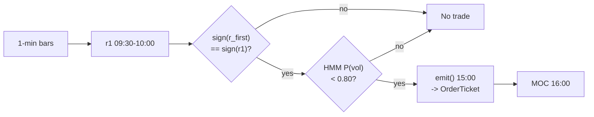

# T015 — First-Half-Hour to Close Continuation

> **Reviewer card.** Intraday time-series momentum to the close, regime-scaled: the first-half-hour return predicts the last-half-hour return (Gao et al. 2018); the session drift (S027) confirms; the HMM vol regime (S079) scales size. Provenance **[P]**.
>
> Edge verdict: **PREDICTIVE-FEATURE-ONLY** — Gao et al. (2018) timing rule documented in the published JFE version (Sharpe 1.08 before costs; 4.46%/yr after spread post-decimalization [documented]); T015's 15:00-entry variant itself has no backtest — re-verify before citing.
>
> After-cost: **BEFORE-COST** — T015's own variant has no after-cost backtest; the cited timing rule survives the spread (4.46%/yr [documented]) but its authors ignore commissions, and Heston et al. honestly report similar periodicity strategies lose money after the spread (-23.78 bps Day 1 Daily, small stocks [documented]).
>
> Tier **S** · prototype 20–40 h [example] · loaded cost $3,000–6,000 [example] · latency snapshot / 15:00 clock · risk low (60-min hold, one vehicle, no leverage).
>
> Data cost $29–199/mo [documented — vendor pricing page https://massive.com/stocks-data, fetched 2026-09-11: Starter $29/mo (15-min delayed, 5-yr history), Developer $79/mo (15-min delayed, 10-yr history), Advanced $199/mo (real-time, 20+ yr history); real-time on Advanced/Business only] — production needs **Advanced** for the 15:00 decision (only Advanced/Business are real-time; Starter/Developer are 15-min delayed) · Capacity $10–50M/day notional [example] — SPY/QQQ-class ETFs in liquid hours; constraint is the spread, not depth · Executability: Feasible: a `15:00` clock, a sign rule, and an HMM — any retail platform with minute bars.
>
> Emits: `OrderTicket` intentions only (strategy never creates orders).

## §1  Identity & provenance

This module is a **strategy**: it emits `OrderTicket` intentions only — brokers create orders, strategies never do. Family **C  # intraday momentum**, batch **TB4**, provenance **P**.

**Lede.** Intraday time-series momentum to the close, regime-scaled: the first-half-hour return predicts the last-half-hour return (Gao et al. 2018); the session drift (S027) confirms; the HMM vol regime (S079) scales size. Provenance **[P]**.

**When it dies.** P(vol) ≥ `0.80` [example] (stand down); event days; continuation fails post-2013 [unverified].

**Regime gates (provisional).** R001 elevated RV suspends (S079 gate); scheduled macro days halve size.

**Prototype scope.** 15:00 clock + deseasonalized return + drift confirm + HMM vol state + MOC exit.

## §1.5  Escalation gate

Cheapest viable path: **Massive Stocks Starter** — 1-min OHLCV bars, exchange timestamps at $29/mo [documented — vendor pricing page https://massive.com/stocks-data, fetched 2026-09-11: Starter $29/mo (15-min delayed, 5-yr history), Developer $79/mo (15-min delayed, 10-yr history), Advanced $199/mo (real-time, 20+ yr history); real-time on Advanced/Business only] (delayed; research only) — buy only the data; the whole strategy is a clock, a sign rule, and an HMM.

**Cheapest-source row.**

| min_tier | latency_class | required_fields | price_band | build_or_buy |
|---|---|---|---|---|
| Massive Stocks Starter (research) / Advanced (production) | snapshot / 15:00 clock | 1-min OHLCV, exchange timestamps | $29/mo Starter, $79/mo Developer (delayed), $199/mo Advanced (real-time) [documented — vendor pricing page https://massive.com/stocks-data, fetched 2026-09-11: Starter $29/mo (15-min delayed, 5-yr history), Developer $79/mo (15-min delayed, 10-yr history), Advanced $199/mo (real-time, 20+ yr history); real-time on Advanced/Business only] | buy data; build the rest |

Production needs **Advanced** ($199/mo real-time) [documented — vendor pricing page https://massive.com/stocks-data, fetched 2026-09-11] because the 15:00 ET entry decision cannot wait on Starter's 15-minute delay — and per the vendor FAQ, Developer ($79/mo) is also 15-min delayed, not real-time. Research on Starter ($29/mo).

**Resource budget.** `1` vCPU, `<1` GB RAM [internal-est] · compute pattern `per_snapshot` · one decision per day; the HMM fit is offline [internal-est].

**Skip list (phase two).** Cross-sectional extension; futures leg; HMM alternatives.

**DO-NOT-CUT list.** Causality assertions (C4); the COST block callable (C3); kill switch + safe mode (C2); decision audit log (C5); bona-fide-intent + self-trade prevention (C13/C14); honesty tags; fixtures + acceptance tests; secrets via env only.

**Escalation gate.** Moving beyond `1` vehicle [default]; bar latency `>60` s [default] — crossing it requires re-review of §T7 and §T8.

## §T0  Contract — strategies emit intentions, brokers create orders

This strategy's sole output is a list of `OrderTicket` intentions. It never places, routes, or confirms an order. Every ticket carries `parent_signal` (the upstream signal id and its `computed_at`), an `intent_ts`, and a `tif`. The backtest harness fills tickets strictly after the signal bar (`fill_event > signal_event`, t->t+1 causality); any fill timestamped at or before its signal bar is a harness bug and trips the kill switch.

**Typed signature.**

```python
def emit(state: ModuleState, signals: SignalSnapshot, bars: list[Bar], cfg: T015Config) -> list[OrderTicket] | ModuleState:
    """Core strategy function. Returns tickets, or UNKNOWN/OFF — never interpolates."""
```

**Config dataclass (single; status ∈ {fixed, default, calibrate, example, internal-est}).**

```python
@dataclass(frozen=True)
class T015Config:
    r1_min: float = 0.002          # [default] range 0.0005–0.01,  status=default
    p_vol_half: float = 0.60       # [default] range 0.5–0.9,      status=default
    p_vol_susp: float = 0.80       # [default] range 0.6–0.95,     status=default
    base_notional: float = 100000.0  # [default] range 10000–1000000, status=default
    cooldown_s: float = 0.0        # [default] range 0–3,600,      status=default
    cost_gate_k: float = 0.5        # [default] range 0.1–2.0,      status=default
```

**Time contract.**

| Item | Value |
|---|---|
| Clock domain | `America/New_York` (ET) |
| Authoritative clock | bar `event_ts`; int64 ns, UTC canonical |
| Bar-label rule | bar labeled by open time |
| max_skew | `5` s [default] |
| Jitter budget | `60` s [default] |
| Staleness TTL | `180` s [default] — older inputs → `UNKNOWN`, no tickets (C6) |
| Gap policy | no interpolation, ever — missing bars → `UNKNOWN` |
| Cadence | `per_snapshot` at the 15:00 ET snapshot |

**Market-state table.**

| State | Meaning | Module behavior |
|---|---|---|
| `CONTINUOUS_TRADING` | regular session | normal — tickets allowed (C16) |
| `HALTED` | trading halt | `UNKNOWN` — no tickets, flatten only if safe |
| `AUCTION` | open/close auction | `UNKNOWN` — no new tickets; MOC exit already staged |
| `CLOSED` | outside RTH | `OFF` — nothing emitted |

**Module-state enum** (`OK | DEGRADED | UNKNOWN | OFF`).

| State | Meaning |
|---|---|
| `OK` | all inputs fresh, inside the 15:00 window, kill switch ARMED |
| `DEGRADED` | kill switch in RECOVERY, or HMM inputs stale-but-within-2×TTL — flatten-only, no new entries |
| `UNKNOWN` | invalid/stale input (F1/F2/C6) — no tickets, never interpolate |
| `OFF` | kill switch TRIPPED, or market CLOSED |

**Intent lifecycle (strategy-side).** The strategy's intent lifecycle ends at `EMITTED` (logged per C5); the broker owns `ACK → PARTIAL → FILLED / CANCELLED`. Partial-fill policy: broker fills oldest `intent_ts` first (FIFO); the strategy observes fills as position updates on the next bar and never amends — offsetting intent only, no cancel-replace from the strategy side. Child-order placement, routing, and STP live in the broker.

**Risk contract.** See §T7 (YAML + kill-switch state machine + re-arm checklist).

**Ops tail.**

| Item | Value |
|---|---|
| Schedule | one decision per day: enter `15:00` ET [example], flatten at the `16:00` close [example]; no other entries — a clock strategy |
| Owner | operator on call |
| Health checks | 15:00 bar age < `180` s [default]; clock skew < `50` ms [example]; S079 `p_vol` fresh |
| Alerts | page on kill-switch trip or feed hole; notify on HMM staleness |
| Resource budget | `1` vCPU, `<1` GB RAM [internal-est]; HMM fit offline [internal-est] |
| Runbook stub | trip → page → flatten per exit rule → manual review → checklist → RECOVERY → ARMED |
| Secrets | `POLYGON_API_KEY` via env only — never in files, chat, or logs |

State variables carried between bars: `r1`, `r_first`, `p_vol`, `scale`, `position`, `module_state`.

## §T1  Strategy thesis & edge

**Thesis.** Intraday time-series momentum to the close, regime-scaled: the first-half-hour return predicts the last-half-hour return (Gao et al. 2018); the session drift (S027) confirms; the HMM vol regime (S079) scales size. Provenance **[P]**.

**Edge verdict: PREDICTIVE-FEATURE-ONLY** — Gao et al. (2018) timing rule documented in the published JFE version (Sharpe 1.08 before costs; 4.46%/yr after spread post-decimalization [documented]); T015's 15:00-entry variant itself has no backtest — re-verify before citing.

**After-cost verdict: BEFORE-COST** — T015's own variant has no after-cost backtest; the cited timing rule survives the spread (4.46%/yr [documented]) but its authors ignore commissions, and Heston et al. honestly report similar periodicity strategies lose money after the spread (-23.78 bps Day 1 Daily, small stocks [documented]).

**Risk summary.** Event-day continuation failure; HMM regime misclassification; the drift sign flips by `15:00`.

**Math.**

```text
First-half-hour return r_{1,t} from the prior close (includes the overnight
gap, per Gao et al. §2 [documented]); deseasonalized r̃_{1,t}. Formation drift
r_{first,t} over 9:30→15:00. Direction s_t = sign(r̃_{1,t}) with |r̃_{1,t}| ≥
0.20% [example]; confirm sign(r_{first,t}) = s_t. Two-state HMM vol regime
(S079): scale 1.0 / 0.5 / 0.0 at P(vol) 0.60 / 0.80 [example].

Modeled edge: edge_bps = 0.20% × 1e4 × 0.55 = 20 bps × 0.55 = 11 bps
[example] — the 0.20% threshold move [example] times an assumed 0.55
continuation hit-rate [example]. Cost gate (C3): 1.0 bps [example] <=
k × edge_bps = 0.5 × 11 = 5.5 bps [example] → passes.

Note: the paper's documented timing rule trades 15:30→16:00 on sign(r_1)
[documented]; T015 enters at 15:00 on the deseasonalized, drift-confirmed
signal — a wider-window variant whose own edge is unbacktested [unverified].
```

**Normative pseudocode:** see §T3 (canonical — cost gate as executable predicate, causality assertions inline).

## §T2  Signal stack & fixed-order sub-blocks

**Signal stack — dependencies & data rights.**

| Signal | Role | Contract |
|---|---|---|
| `S025` | trigger | sign of deseasonalized r_{1,t}; needs |r̃_1| >= 0.20% [example] |
| `S027` | confirm | sign(r_{first,t}) must equal sign(r_{1,t}); disagreement → no trade |
| `S079` | gate | scale 1.0 / 0.5 / 0.0 at P(vol) thresholds 0.60 / 0.80 [example] |

Max dependency depth: `2` [default]. Version pins: `unpinned` — the deps.yaml edge-list pass is pending; formulas live in the provider contracts (§T0).

**Schema mapping (canonical).**

| Vendor (Polygon.io Stocks) | Canonical |
|---|---|
| `t` (ms) | `bar_open_ts` (int64 ns UTC; bar labeled by open time) |
| `o, h, l, c` | `open, high, low, close` |
| `v` | `volume` |

Staleness: max skew `5 s` [default] · jitter budget `60 s` [default] · TTL `180 s` [default] · cadence `per_snapshot (15:00 ET)` · tz `America/New_York`.

**Inputs that break the module.**

| Input failure | Module state | Alert |
|---|---|---|
| 15:00 bar missing (feed hole) | `UNKNOWN` | page |
| HMM state stale | `UNKNOWN` | notify |
| P(vol) incalculable | `UNKNOWN` | page |

### Universe

One liquid vehicle: SPY (or QQQ/ES) [example]; single-name extension uses price > `$20`, ADV > `5`M shares [example]. RTH only. Exactly one window: enter at `15:00` ET, flatten at the `16:00` closing print. No other entries exist — this is a *clock strategy*.

### Entry rule (Boolean expressions)

```text
ENTER_LONG  := (r̃_1 >= +r1_min) AND (sign(r_first) == sign(r̃_1))
               AND (P_vol < p_vol_susp) AND (t.clock == '15:00')
               AND (expected_cost_bps(...) <= cost_gate_k * edge_bps)
ENTER_SHORT := (r̃_1 <= -r1_min) AND (sign(r_first) == sign(r̃_1))
               AND (P_vol < p_vol_susp) AND (t.clock == '15:00') AND (locate_ok)
               AND (expected_cost_bps(...) <= cost_gate_k * edge_bps)
FLAT        := otherwise
```

### Exits (with post-exit cooldown)

```text
EXIT := at 15:59:30 ET submit MOC for the 16:00 closing print [example]
        (the time stop IS the strategy). No intraday stop-loss (the hold is
        60 minutes; a stop inside the last hour is spread-donation), no profit
        target. Any intent outside the 15:00 window → veto (C11, GATE_VETO).
```

**Cooldown.** `0` s [default] after every exit (C8) — one window per day, so no re-entry exists to cool down.

### Position sizing (fenced function — canonical)

```python
def shares(risk_budget_R, stop_distance, vol_estimate, ADV_cap, cost,
           base_notional=100000.0, ref_price=500.0):
    """T015 position sizing — canonical fenced function (single source of truth)."""
    scale = vol_estimate  # [default] caller passes the S079 HMM scale: 1.0 / 0.5 / 0.0 [example]
    n = scale * base_notional / ref_price   # $100k [default] at $500 [example] SPY
    n = min(n, ADV_cap * 0.05)              # 5% ADV participation cap [default]
    return int(n)
```

`risk_budget_R`/`stop_distance`/`cost` are accepted per the mandated signature; this clock strategy sizes from `base_notional × regime scale` and enforces risk through the §T7 contract (per-trade R, daily loss stop, max gross) rather than a stop distance.

### Risk limits

| Limit | Value |
|---|---|
| Daily loss stop | `-$800` [example] — ex-post review trigger, not an intraday exit |
| Per-trade R | `$800` [example] daily risk unit |
| Max gross | `$100k` notional [example] (== `base_notional`) |
| Max adverse per trade | `0.25`% of entry [default] — monitored, not a stop |
| Max one position | one vehicle, one window |
| Regime suspend | P(vol) ≥ `0.80` [example] → flat, no trade |
| Staleness kill | `15:00` bar stale `>3` min [example] → trip |

### COST block (single source of truth)

| Component | bps | Basis |
|---|---|---|
| Spread | `0.5` | [example] ~0.5¢ effective spread on SPY at 15:00 at $500 — tighter than Gao et al. Fig.2 measured ~1.2 bps proportional spread post-2005 [documented]; flagged optimistic |
| Fees | `0.5` | [example] ~0.5¢ commission on SPY at 15:00 |
| Borrow | `0.0` | [default] borrow_bps_per_day = 0.0 — reason: single-session ETF hold; SPY easy-to-borrow; stubbed at zero pending broker locate data |
| Impact | `0.0` | [example] conservative variant: MOC print + 1¢ adverse |
| **Total** | `1.0` | [example] 1¢/share all-in round-trip |

Fee schedule as of `2026-09-01` [example] (example schedule — re-pin from the broker before production) · venue `ARCX / SIP 1-min bars [example]` · side `taker` · borrow `0.0` bps/day [default] — single-day ETF hold; borrow stubbed at zero — verify with broker.

```python
def expected_cost_bps(notional, adv_pct, venue, side, urgency) -> float:
    """Callable cost model - T015 COST block (single source of truth)."""
    spread_bps = 0.5   # [example] ~0.5c effective spread on SPY @ $500 at 15:00
    fee_bps = 0.5      # [example] ~0.5c commission on SPY @ $500 at 15:00
    borrow_bps = 0.0   # [default] single-day ETF hold; borrow stubbed at zero
    impact_bps = 0.0   # [example] conservative variant: MOC + 1c adverse
    return spread_bps + fee_bps + borrow_bps + impact_bps
```

**Normative cost-gate predicate (C3):** `expected_cost_bps(...) <= k * edge_bps` — no ticket is emitted unless the callable cost clears this gate. The predicate appears verbatim in the §T1 pseudocode and is asserted by the per-module test.

### Execution / fill-model table

| Aspect | Assumption |
|---|---|
| Latency | irrelevant — one decision at `15:00`, fills into liquid hours |
| Fill model | entry: limit at touch [example]; exit: MOC at the 16:00 print |
| Partial fills | oldest `intent_ts` first (FIFO); MOC aggregation |
| Impact | `0` bps base [example]; conservative `1`¢ adverse on the MOC print [example] |
| Adverse fill | the continuation fails by `15:00` — the drift confirm is the control |
| Causality | `fill.event_ts > signal.event_ts` always (C4); no signal-bar fills, ever |

### Robustness + compliance sub-block

**Robustness.** The documented effect is a single-vehicle statistical regularity; `r1_min` in `0.15`–`0.4`% [example] and the HMM thresholds are the calibration surface. Heston et al.'s honest after-cost result on similar periodicity is the standing caution: this survives only at SPY-class spreads. The optimistic case assumes (1) the MOC print is the modeled exit — the closing auction can slip; the conservative variant adds `1`¢ adverse [example]; (2) slippage `0` [example] — flagged; (3) the HMM is correctly specified.

**Coded rules (C1–C16).**

- **C1** | No orders: the strategy emits `OrderTicket` intentions only; the broker creates orders.
- **C2** | Kill switch: `ARMED` → `TRIPPED` → `RECOVERY` → `ARMED` on the trip conditions in §T7.
- **C3** | Cost gate: `expected_cost_bps(...) <= k * edge_bps` before any ticket (see COST block above).
- **C4** | Causality: `fill_event > signal_event` (t->t+1); no signal-bar fills, ever.
- **C5** | Decision log: every ticket logged with inputs hash and params hash (schema in §T8).
- **C6** | Staleness: inputs older than the TTL → `UNKNOWN`, no tickets.
- **C7** | Short discipline: `locate_ok` required before any short ticket (Reg-SHO locate, §T8).
- **C8** | Cooldown: post-exit cooldown enforced in seconds (`0` s [default]); no re-entry inside it.
- **C9** | Session flatten: no uncommanded overnight carry.
- **C10** | Position caps: per-trade R, daily loss stop, and max gross enforced (§T7).
- **C11** | One-window discipline: trigger = any intent outside the `15:00` window [example] → check = clock → action = veto → log = `GATE_VETO`.
- **C12** | Event-day throttle: trigger = scheduled macro release today → check = calendar → action = halve size → log = `GATE_VETO` (size variant).
- **C13** | Bona-fide intent: every ticket reflects genuine intent to trade; the strategy never quotes, spoofs, or layers.
- **C14** | Self-trade prevention: broker-level STP; the strategy never holds both sides — one position per window.
- **C15** | Fat-finger trio: per-ticket notional ≤ max_gross; qty ≤ 5% ADV [default]; limit within 1% of touch [default] — breach → `UNKNOWN`, no ticket.
- **C16** | Halt/auction/entitlement: tickets only in `CONTINUOUS_TRADING`; data entitlement asserted per §T5.

### Parameter table

| Parameter | Key | Default | Tag | Sensitivity |
|---|---|---|---|---|
| Morning-return minimum | `r1_min` | `0.20`% | [default] | high |
| HMM half threshold | `p_vol_half` | `0.60` | [default] | medium |
| HMM suspend threshold | `p_vol_susp` | `0.80` | [default] | high |
| Base notional | `base_notional` | `$100k` | [default] | medium |
| Cooldown (s) | `cooldown_s` | `0` | [default] | low |
| Cost-gate k | `cost_gate_k` | `0.5` | [default] | high |

### Timing box

`signal@15:00 ET (per_snapshot, America/New_York) → earliest fill @open(t+1)` — t is the 15:00 1-min bar (labeled by open time); entry fills strictly after the signal bar; the MOC exit prints at the 16:00 close. No signal-bar fills (C4, asserted by the per-module test).

## §T3  Precise math & normative pseudocode

**Math (normative).**

```text
r_{1,t}   = log(P_{10:00,t}) − log(P_{close,t−1})   # first-half-hour return,
                                                    # includes the overnight gap [documented] (Gao et al. §2)
r̃_{1,t}   = deseasonalized r_{1,t}                  # S025 contract
r_{first,t} = log(P_{15:00,t}) − log(P_{9:30,t})    # formation drift 9:30→15:00
s_t       = sign(r̃_{1,t})  with  |r̃_{1,t}| ≥ r1_min  (r1_min = 0.002 [default])
confirm   = [sign(r_{first,t}) == s_t]              # S027; disagreement → no trade
scale_t   = 1.0 · 1{p_vol < 0.60} + 0.5 · 1{0.60 ≤ p_vol < 0.80} + 0.0 · 1{p_vol ≥ 0.80}  # [example]
edge_bps  = 0.0020 × 1e4 × 0.55 = 11 bps [example]  # threshold move × continuation rate
gate      = [expected_cost_bps(...) ≤ cost_gate_k × edge_bps]   # C3, executable
```

No black boxes: the HMM internals live in S079 (consumed via its pinned contract, version_pin `unpinned` pending the deps.yaml pass); every guard in the prose entry/exit rules appears below as code.

**Pseudocode (normative — prose is commentary).**

```text
RISK_R = 800.0      # [example] USD daily risk unit (§T7)
STOP_DIST = None    # no intraday stop by design; caps enforced via §T7

function emit(state, signals, bars, cfg) -> list[OrderTicket] | UNKNOWN | OFF:
    assert state.module_state in {OK, DEGRADED} else return state.module_state  # F1
    assert bars non-empty else return UNKNOWN                                    # F1
    t = bars[-1]   # 15:00 ET snapshot bar; bar labeled by open time
    if market_state(t) != CONTINUOUS_TRADING: return UNKNOWN                    # C16
    r1 = signals['S025'].r1_deseasoned
    rf = signals['S027'].r_first
    pv = signals['S079'].p_vol
    assert isfinite(r1) and isfinite(rf) and isfinite(pv) else return UNKNOWN    # F2
    if stale(t.event_ts) or stale(signals): return UNKNOWN                      # C6

    edge_bps = 0.0020 * 1e4 * 0.55          # = 11 bps [example]
    cost_ok = expected_cost_bps(notional, adv_pct, venue, side, urgency) <= cfg.cost_gate_k * edge_bps
    # ^^^ normative cost-gate predicate (C3): expected_cost_bps(...) <= k * edge_bps

    scale = 1.0 if pv < cfg.p_vol_half else 0.5 if pv < cfg.p_vol_susp else 0.0  # [example]
    tickets = []
    if t.clock == '15:00' and state.position == 0 and scale > 0 and cost_ok:
        if abs(r1) >= cfg.r1_min and sign(rf) == sign(r1):
            if r1 < 0: assert locate_ok(signals) else return UNKNOWN            # C7 short discipline
            side = 'BUY' if r1 > 0 else 'SELL'
            qty = shares(RISK_R, STOP_DIST, scale, ADV_cap, cost_bps,           # §T2 canonical sizing
                         base_notional=cfg.base_notional, ref_price=t.close)
            if not fat_finger_ok(qty, cfg, t): return UNKNOWN                   # C15
            tickets = [ticket(side=side, qty=qty, limit=touch(t), tif='DAY',
                              parent_signal=f"S025@{signals['S025'].computed_at}",
                              intent_ts=t.event_ts)]
    elif t.clock >= '15:59:30' and state.position != 0:
        tickets = [flatten_ticket(state, venue='MOC')]   # the time stop IS the strategy
    for tk in tickets: log_decision(tk, inputs_hash, params_hash)  # C5 / App. g
    assert all(fill.event_ts > t.event_ts for fill in fills_of(tickets))  # C4: t->t+1 causality
    return tickets
```



## §T4  Worked example (fixture-backed) & acceptance tests

Fixtures: `fixtures/T015_tape.csv` + `fixtures/T015_expected.csv` — `TYPE: validation-run`, `DATA: synthetic`. Six hand-checked trades on real trading days (2026-09-09, 09-10, 09-11, 09-14, 09-15, 09-16); signal bars at 15:00 ET, fills at the 16:00 print — every `fill_ts > signal_ts` (C4).

**Trade 1 (synthetic, 2026-09-09).** `BUY` `200` shares [example] @ `500.20` [example], exit `501.40` [example] (MOC 16:00). Gross P&L = `+240.00` [example]; cost = `1.0` bps [example] × `100040.00` notional [example] = `10.00` [example]; net = `230.00` [example]. All six trades recompute identically from the tape; the per-module test asserts equality. (Tags are [example]: this is synthetic fixture arithmetic, not measured P&L.)

**Cost-function-call rows (T4 shows the call, not just a column).**

| trade | `expected_cost_bps(notional, adv_pct, venue, side, urgency)` | → bps | → $ |
|---|---|---|---|
| 1 | `expected_cost_bps(100040.0, 0.01, ARCX, taker, normal)` | `1.0000` | `10.00` |
| 2 | `expected_cost_bps(100420.0, 0.01, ARCX, taker, normal)` | `1.0000` | `10.04` |
| 3 | `expected_cost_bps(99980.0, 0.01, ARCX, taker, normal)` | `1.0000` | `10.00` |
| 4 | `expected_cost_bps(50060.0, 0.01, ARCX, taker, normal)` | `1.0000` | `5.01` |
| 5 | `expected_cost_bps(100360.0, 0.01, ARCX, taker, normal)` | `1.0000` | `10.04` |
| 6 | `expected_cost_bps(99760.0, 0.01, ARCX, taker, normal)` | `1.0000` | `9.98` |

Rounding convention: the SUMMARY net `564.94` is `round(sum of exact nets)` = `round(564.938)`; the test asserts this within `0.005` — it does not sum the rounded rows.

**Acceptance tests** (`pytest modules/tests/test_T015.py -q`, stdlib only):

| # | Test | Asserts |
|---|---|---|
| 1 | `test_type_header` | `TYPE: validation-run` + `DATA: synthetic` on both CSVs |
| 2 | `test_fixture_arithmetic` | tape cost stack == callable == expected CSV; P&L recomputed; SUMMARY exact-sum |
| 3 | `test_no_signal_bar_fills` | C4: every `fill_ts > signal_ts` |
| 4 | `test_signal_wallclock` | signal bars at 15:00 ET, fills at 16:00 ET |
| 5 | `test_cost_gate_predicate` | C3: passes when edge >> cost, blocks when edge << cost; module calibration `1.0 ≤ 0.5 × 11.0` |
| 6 | `test_kill_switch_trips_and_rearms` | `ARMED → TRIPPED → RECOVERY → ARMED` via the FSM; no re-arm without the checklist |
| 7 | `test_invalid_input_emits_unknown` | F1/F2: crossed/locked input → `UNKNOWN`, never interpolated |
| 8 | `test_cost_callable_signature` | `expected_cost_bps(...)` returns a finite float |
| 9 | `test_regime_scale_gate` | scale `1.0 / 0.5 / 0.0` at P(vol) `0.60 / 0.80` [example] |
| 10 | `test_sizing_fn` | §T2 canonical sizing: 200 / 100 / 0 shares; 5% ADV cap binds |

## §T5  Costs — evidence & calibration notes

The canonical COST block (4-component stack + callable + `fee_schedule_as_of` + venue + side + `borrow_bps_per_day`) lives in **§T2** — numbers appear once there; this section is evidence and procedure, not restatement.

**Spread evidence.** Gao et al. Figure 2: the proportional SPY spread narrowed after decimalization and stabilized around `1.2` bps after 2005 [documented]. The §T2 stack assumes `0.5` bps one-way effective spread [example] — tighter than that measured figure, i.e. optimistic; treat the stack as a favorable case and re-pin from live TAQ before sizing real capital.

**Fee evidence.** Example schedule as of `2026-09-01` [example]; `0.5` bps ≈ `0.5`¢/share at $500 SPY [example]. Re-pin procedure: pull the broker's current per-share/commission schedule, recompute `fee_bps` at the reference price, update `fee_schedule_as_of`, re-run the test.

**Borrow reasoning.** `borrow_bps_per_day = 0.0` [default] — reason: single-session ETF hold; SPY is easy-to-borrow; the short leg exists only intraday. Stubbed at zero pending broker locate data; any non-zero borrow quote flows through the callable's `borrow_bps` term (see GROK-NEEDED).

**Why taker.** Entry is a limit at the touch that is expected to be lifted in a liquid hour; the exit is MOC — both pay the spread side, hence `side: taker`.

**Data rights row.** SPY 1-min bars via Polygon.io Stocks — `rights: licensed`; research + production; fixtures synthetic; entitlement `professional/internal`; derived features ours. Entitlement-class change → §1.5 escalation gate.

## §T6  Execution assumptions

Canonical fill-model table: §T2 (Execution / fill-model table). Qualitative assumptions:

- One decision per day at the 15:00 ET snapshot; latency is irrelevant — fills go into liquid hours.
- Entry ticket: limit at the touch (`tif: DAY`) [example]; exit: MOC submitted at 15:59:30 ET for the 16:00 closing print [example].
- Partial fills: oldest `intent_ts` first (FIFO); MOC aggregation at the broker.
- No signal-bar fills, ever (C4) — the harness asserts `fill.event_ts > signal.event_ts`; a violation is a harness bug and trips the kill switch.
- Halt/auction at 15:00 → `UNKNOWN` per the §T0 market-state table; a staged MOC exit stands.
- Adverse fill: the continuation fails by 15:00 — the drift confirm (S027) is the control, not a stop.

## §T7  Risk contract & kill switch

**Risk contract (YAML — canonical).**

```yaml
risk_contract:
  per_trade_R: 800              # [example] USD daily risk unit
  daily_loss_stop: -800         # [example] USD; ex-post review trigger, not an intraday exit
  max_gross: 100000             # [example] USD notional (== base_notional)
  max_adverse_per_trade: 0.0025 # [default] fraction of entry; monitored, not a stop
  enforcement: intraday-hard    # [default]
  calibration_recipe: "paper-trade 60 sessions [default]; HMM on 2 years of 1-min data [default]; review after any -$800 day [example]"
```

Enforcement is `intraday-hard` [default]: the §T3 pseudocode refuses tickets that breach the fat-finger trio (C15) or the cost gate (C3); the daily loss stop is enforced ex post as a next-day review trigger, not as an intraday exit — the time stop IS the exit.

**Kill switch: `ARMED` → `TRIPPED` → `RECOVERY` → `ARMED`.**

```text
ARMED --(trip condition)--> TRIPPED --(re-arm checklist complete)--> RECOVERY --(review sign-off)--> ARMED
  |                              |
  | emits tickets                | emits NOTHING; flattens per the exit rule; pages
```

Trip conditions:

- 15:00 bar stale > 3 min [example]
- clock skew > 50 ms [example]
- HMM inputs stale [example]

On trip: the module stops emitting tickets immediately, flattens managed positions per the exit rule, and pages.

**Re-arm checklist** (all must hold; the per-module test drives the full cycle):

1. Trip cause identified and logged.
2. Cooldown expired (`cooldown_s`).
3. Feed healthy: 15:00 bar age < TTL, clock skew < `50` ms [example].
4. HMM inputs fresh (`p_vol` computable).
5. Manual review signed off → `RECOVERY` → `ARMED`.

**Before/after-cost separation.** All risk figures above are before-cost sizing inputs; realized P&L is always reported net of the §T2 cost stack. There is no T015 backtest, so no realized P&L is claimed anywhere in this module.

## §T8  Compliance implementation

Coded rules C1–C16 are registered in §T2 (Robustness + compliance sub-block); this section implements them.

**Decision-log schema (C5 / App. g).**

```text
DecisionLog { tick_id, intent_ts (int64 ns UTC), signal_id, signal_computed_at,
              inputs_hash, params_hash, side, qty, limit_px, tif, venue,
              cost_bps, edge_bps, gate_result, module_state, kill_state }
```

Every emitted ticket appends one row; hashes cover the exact signal snapshot and the frozen `T015Config`.

**Halt/auction state table.** Canonical: §T0 market-state table. Tickets only in `CONTINUOUS_TRADING` (C16); `HALTED`/`AUCTION` → `UNKNOWN`; `CLOSED` → `OFF`.

**Fat-finger trio (C15).** Per-ticket notional ≤ `max_gross` (`$100k` [example]); qty ≤ 5% ADV [default]; limit within 1% of touch [default]. Breach → `UNKNOWN`, no ticket, alert.

**Short discipline (C7).** `locate_ok` asserted before any short ticket (Reg-SHO locate); borrow stubbed at `0.0` bps/day [default] per §T5 — a failed locate vetoes the ticket.

**Bona-fide intent (C13).** The strategy never quotes; every ticket is a genuine intent to trade the window. No spoofing/layering surface exists by construction.

**Self-trade prevention (C14).** One position per window; the strategy never holds both sides. Broker-level STP is required at the execution layer.

**Message rate.** ≤ `2` tickets/day [example] (one entry, one flatten) — trivially within any venue message-rate / cancel-to-trade limit.

**Public-dissemination gate.** Not applicable by construction — the strategy emits no public quotes or prints.

**Data-entitlement assertions.** Polygon.io Stocks, `rights: licensed`, entitlement `professional/internal`; fixtures synthetic. Any entitlement-class change re-triggers the §1.5 escalation gate.

## §T9  Evidence, failures & regime gates

**Evidence (cost-level tokens; every statistic tagged; selection disclosed below).**

| Source | Sample | Finding | Before/after-cost | Caveat |
|---|---|---|---|---|
| Gao, Han, Li & Zhou (2018) [documented] | SPY, 1993-02-01–2013-12-31, TAQ [documented] | r_13 = α + β·r_1: β̂ = `6.94` (×100), p < `1`%, R² = `1.6`% IS / `1.2`% OOS [documented] | `BEFORE-COST` (predictive regression) | R² is statistical, not tradable P&L |
| Gao, Han, Li & Zhou (2018), timing rule [documented] | same | sign(r_1) → trade 15:30→16:00: ~`6.67`%/yr, σ `6.19`%, Sharpe ~`1.08` vs `0.29` buy-and-hold [documented] | `BEFORE-COST` | authors ignore commissions; their rule enters at 15:30, T015 at 15:00 (variant) |
| Gao, Han, Li & Zhou (2018), timing rule after spread [documented] | same, post-decimalization | `4.46`%/yr after bid-ask at 15:30 (vs `6.93`% before); post-2005: `6.52`% after vs `7.96`% before [documented] | `AFTER-COST` (spread-only; commissions ignored) | exit at 16:00 assumed at the market clearing price (no spread at 4pm) per the authors |
| Heston, Korajczyk & Sadka (2010) [documented] | NYSE half-hour intervals, `2001`–`2005` [documented] | continuation at day-multiple half-hour lags, strongest first/last half-hour [documented] | `AFTER-COST` (honest): Day 1 Daily strategy −`23.78` bps (small stocks); decile-spread returns negative for all size categories — "does not indicate a pure profit opportunity" [documented] | cross-sectional periodicity, not the same-day time-series rule — cautionary |
| Baltussen, Da, Lammers & Martens (2021) [documented] | 60+ futures, `1974`–`2020` [documented] | market intraday momentum everywhere; linked to gamma-hedging demand from options market makers and leveraged ETFs [documented] | `BEFORE-COST` (mechanism paper) | does not test T015's 15:00 window; post-2013 decay untested here → §T10 |

**Selection disclosure.** We report the headline IS/OOS regression, the timing rule before and after costs, and the honest after-cost null from Heston et al. Sub-sample cuts (recession/expansion, volatility/volume sorts) are omitted as not decision-relevant to the entry rule.

**Where this module is known to fail.** Event-day continuation failures, HMM misclassification, closing-auction spread blowouts, post-2013 decay [unverified].

**Failure modes (detect → action → recovery).**

| # | Failure | Detect → action → recovery | Executable check |
|---|---|---|---|
| 1 | HMM misclassifies a toxic tape as calm | detect: realized 60-min vol > `2`× forecast [example] → action: suspend via p_vol_susp → recovery: recheck calibration | `realized_vol <= 2*forecast_vol` |
| 2 | Event-day continuation failure | detect: calendar flags FOMC/CPI → action: halve size (C12) or skip → recovery: next session [default] | `not event_day or size_halved` |
| 3 | MOC slippage | detect: realized close vs modeled > `1`¢ [example] → action: conservative variant → recovery: re-pin | `moc_slippage_cents <= 1` |
| 4 | Cost blowup at wider spreads | detect: cost gate failing → action: stand down → recovery: re-pin fee schedule [default] | `expected_cost_bps(...) <= k * edge_bps` |
| 5 | Clock/bars stale at 15:00 | detect: staleness → action: UNKNOWN, no entry → recovery: feed healthy [default] | `all(fill_ts > signal_ts)` |

**Regime gates (machine records).**

| Regime | Direction | Mechanism | Condition | Action | min_lag | unknown_behavior |
|---|---|---|---|---|---|---|
| R001 | degrades | elevated RV: continuation untradable | p_vol ≥ 0.60 [default] | halve | 1 bar [default] | hold last scale; UNKNOWN if HMM stale |
| R001 | inverts | extreme RV | p_vol ≥ 0.80 [default] | pause_entry | 1 bar [default] | veto |
| R-event | degrades | scheduled macro day | calendar flag [default] | halve | 0 [default] | halve |

## §T10  Unverified leads & what would change our mind

**Source log (verified 2026-09-10).**

- Gao et al. (2018), JFE 132(3): 240–263 — DOI: https://doi.org/10.1016/j.jfineco.2018.10.008 [documented]. Figures verified against the Dec-2015 working draft (structure matches the published version): https://c.mql5.com/forextsd/forum/173/intraday_momentum_-_the_first_half-hour_return_predicts_the_last_half-hour_return.pdf [unverified — forum-hosted PDF, not the publisher; used only to confirm the working-draft text matches the DOI version] — predictive regression §2.1 (β̂=6.94×100, R²=1.6%), timing rule §3 (6.67%/yr, Sharpe 1.08), transaction costs §5.2/Table 10 (4.46%/yr after spread post-decimalization; 6.52% post-2005; spread ≈1.2 bps Fig. 2).
- Heston, Korajczyk & Sadka (2010), J. Finance 65(4): 1369–1407 — arXiv: http://arxiv.org/abs/1005.3535v1 [documented]; PDF: https://bauer.uh.edu/departments/finance/documents/Heston-Korajczyk-Sadka-jf-2010-01-07.pdf — after-cost honesty §II.B: decile-spread returns negative for all size categories; Day 1 Daily −23.78 bps (small stocks); one-way spread cost 4–7 bps.
- Baltussen, Da, Lammers & Martens (2021), JFE 142(1): 377–403 — abstract verified via https://academicweb.nd.edu/~zda/intramom.pdf [documented].
- Polygon.io (now Massive) Stocks pricing — vendor pricing page https://massive.com/stocks-data, fetched 2026-09-11 [documented — vendor pricing page https://massive.com/stocks-data, fetched 2026-09-11: Starter $29/mo (15-min delayed, 5-yr history), Developer $79/mo (15-min delayed, 10-yr history), Advanced $199/mo (real-time, 20+ yr history); real-time on Advanced/Business only]. The Jun-2026 Medium roundup overstated Developer ($99 vs $79) and wrongly labeled Developer real-time; the vendor page is authoritative.

**Unverified leads.**

- Post-2013 decay of the Gao et al. intraday-momentum effect — claimed in secondary literature (a thesis citing "Rosa [7]"), not verified against a primary source.
- SPY one-way effective spread at 15:00 ET in 2025–2026 (the §T2 stack uses 0.5 bps [example], tighter than Gao et al.'s measured ~1.2 bps proportional spread post-2005 [documented]).
- Short-SPY borrow rate for single-session holds (stubbed at 0.0 bps/day [default]).
- SPY closing-auction slippage vs the 16:00 print (conservative variant assumes +1¢ adverse [example]).

What would change our mind: a purged/embargoed walk-forward with full costs that survives the S088 honesty protocol; a documented after-cost P&L from the cited authors' own implementations; or a regime-gated replication that holds outside the original sample.

## AI build prompt

```text
Build the T015 (First-Half-Hour to Close Continuation) strategy module from this specification.
Hard constraints:
- The strategy emits OrderTicket intentions ONLY; it never creates orders (C1).
- Causality: fill_event > signal_event (t->t+1); no signal-bar fills (C4).
- Cost gate: expected_cost_bps(...) <= k * edge_bps before any ticket (C3); the callable in §T2 is the single source of truth.
- Kill switch ARMED -> TRIPPED -> RECOVERY -> ARMED on the §T7 trip conditions (C2); re-arm requires the §T7 checklist.
- Every numeric literal in prose carries an honesty tag [documented]/[measured]/[example]/[unverified]/[default]/[internal-est]; exempt identifiers only.
- Sources must be real and cited with cost-level tokens; chatbot-only material goes to §T10.
Timing box: signal@15:00 ET (per_snapshot, America/New_York) -> earliest fill @open(t+1).
Config surface (T015Config, all status=default):
- r1_min (float): default 0.002, range 0.0005–0.01 [default]
- p_vol_half (float): default 0.60, range 0.5–0.9 [default]
- p_vol_susp (float): default 0.80, range 0.6–0.95 [default]
- base_notional (float): default 100000.0, range 10000–1000000 [default]
- cooldown_s (float): default 0.0, range 0–3,600 [default]
- cost_gate_k (float): default 0.5, range 0.1–2.0 [default]
Entry rule (§T2, Boolean):
ENTER_LONG  := (r̃_1 >= +r1_min) AND (sign(r_first) == sign(r̃_1))
               AND (P_vol < p_vol_susp) AND (t.clock == '15:00')
               AND (expected_cost_bps(...) <= cost_gate_k * edge_bps)
ENTER_SHORT := (r̃_1 <= -r1_min) AND (sign(r_first) == sign(r̃_1))
               AND (P_vol < p_vol_susp) AND (t.clock == '15:00') AND (locate_ok)
               AND (expected_cost_bps(...) <= cost_gate_k * edge_bps)
FLAT        := otherwise
Exit rule: at 15:59:30 ET submit MOC for the 16:00 print (the time stop IS the strategy). No intraday stop-loss, no profit target. Cooldown 0 s [default].
Sizing: implement the §T2 shares() fenced function verbatim; enforce the §T7 YAML risk contract.
Deliverables: the module markdown (all sections §1–§T10), the fixture tape CSV
(fixtures/T015_tape.csv, TYPE: validation-run, DATA: synthetic), the expected CSV
(fixtures/T015_expected.csv), and the per-module test (modules/tests/test_T015.py):
10 acceptance tests covering fixture arithmetic, causality, wall-clock, the cost gate,
the kill-switch cycle, invalid->UNKNOWN, the callable signature, the regime scale gate,
and the sizing function. Definition of done: pytest modules/tests/test_T015.py -q exits 0.
```

**GROK-NEEDED** (expert questions web search could not resolve — do not answer from priors):

1. "T015 post-2013 decay: the module's 'when it dies' trigger claims the Gao et al. (2018) first-half-hour → last-half-hour intraday-momentum effect weakened after 2013, based only on a secondary thesis citation ('Rosa [7]'). Is there a primary published source that re-tests the Gao et al. (2018) predictive regression (r_13 = α + β·r_1 on SPY) or its sign(r_1) timing rule on post-2013 data? A good answer would contain: the paper/table, the post-2013 sub-sample R² and timing-rule Sharpe versus the 1993–2013 originals (R² = 1.6%, Sharpe 1.08), and whether the decay is statistically significant."
2. "T015 SPY effective spread at 15:00 ET (2025–2026): the module's §T2 cost stack assumes a 0.5 bps one-way effective spread for SPY at 15:00 ET, tagged [example] and flagged optimistic against Gao et al.'s measured ~1.2 bps proportional spread post-2005. Is there a dated, TAQ-derived measurement of SPY's one-way effective (or quoted) spread around 15:00 ET for 2025–2026? A good answer would contain: the measured spread in bps, the date range, the source/methodology, and whether it supports or refutes the 0.5 bps assumption."
3. [RESOLVED 2026-09-11 by direct vendor-page verification — no Grok lookup needed] Tiers verified at https://massive.com/stocks-data: Starter $29/mo (15-min delayed, 5-yr history), Developer $79/mo (15-min delayed, 10-yr history), Advanced $199/mo (real-time, 20+ yr history); real-time on Advanced/Business only, so the 15-min delay applies to Starter AND Developer.
4. "T015 short-SPY borrow for single-session holds: the module stubs borrow_bps_per_day at 0.0 with the reason 'single-session ETF hold; SPY easy-to-borrow'. What is a documented borrow rate (in bps/day or annualized fee) actually charged for shorting SPY intraday at a retail or prime broker in 2025–2026? A good answer would contain: the rate, the broker/venue, the date, and whether the zero stub is defensible."
