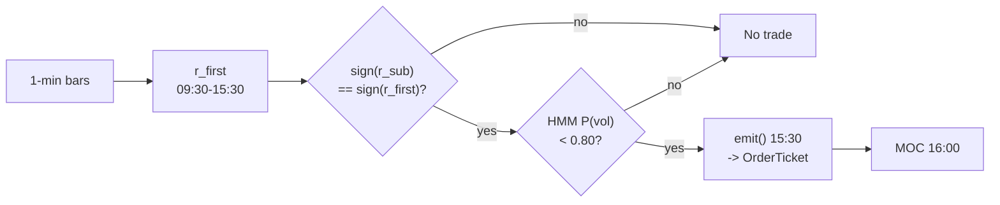

# T016 — End-of-Day Drift Rider

> **Reviewer card.** End-of-day drift rider: the session's own `09:30`→`15:30` drift (S027) persists into the last `30` minutes [example]; the `15:00`→`15:30` sub-drift (S026) confirms it is still alive; the HMM vol regime (S079) scales size. Provenance **[P]**.
>
> Edge verdict: **PREDICTIVE-FEATURE-ONLY** — the EOD drift is documented as a statistical regularity (Heston et al. half-hour periodicity); no citable after-cost P&L for the drift-riding rule itself [documented].
>
> After-cost: **BEFORE-COST** — one-sentence verdict: the drift is a timing regularity, not a documented P&L — the MOC exit is where the costs live.
>
> Tier **S** · prototype 20–40 h [example] · loaded cost $3,000–6,000 [example] · latency snapshot / 15:30 clock · risk low (30-min hold, one vehicle, no leverage).

> Capacity $10–50M/day notional [example] — SPY/QQQ-class ETFs at the most liquid time of day · Executability: Feasible: a `15:30` clock, a drift sign, and an HMM — any retail platform with minute bars.

## §1  Identity & provenance

This module is a **strategy**: it emits `OrderTicket` intentions only — brokers create orders, strategies never do. Family **C  # intraday momentum**, batch **TB4**, provenance **P**.

**Lede.** End-of-day drift rider: the session's own `09:30`→`15:30` drift (S027) persists into the last `30` minutes [example]; the `15:00`→`15:30` sub-drift (S026) confirms it is still alive; the HMM vol regime (S079) scales size. Provenance **[P]**.

**When it dies.** P(vol) ≥ `0.80` [example] (stand down); MOC imbalance days; the drift reverses by `15:30`.

**Regime gates (provisional).** R001 elevated RV suspends (S079 gate); MOC-imbalance days halve size.

**Prototype scope.** 15:30 clock + drift sign + sub-drift confirm + HMM vol state + MOC exit.

## §1.5  Escalation gate

Cheapest viable path: **Polygon.io Stocks Basic** — 1-min OHLCV bars, exchange timestamps at ~$30–100/mo [unverified]. build — the whole strategy is a clock, a drift sign, and an HMM; buy only the data.

Resource budget: `1` core, `<1` GB RAM [internal-est] [internal-est] · compute pattern `per_snapshot`.

Explicitly out of scope (phase two): cross-sectional extension; futures leg; HMM alternatives (phase `2`).

Escalation gate: moving beyond `1` vehicle [default]; bar latency `>60` s [default] — crossing it requires re-review of §T7 and §T8.

## §T0  Contract — strategies emit intentions, brokers create orders

This strategy's sole output is a list of `OrderTicket` intentions. It never places, routes, or confirms an order. Every ticket carries `parent_signal` (the upstream signal id and its `computed_at`), an `intent_ts`, and a `tif`. The backtest harness fills tickets strictly after the signal bar (`fill_event > signal_event`, t->t+1 causality); any fill timestamped at or before its signal bar is a harness bug and trips the kill switch.

State variables carried between bars: ``r_first`, `r_sub`, `p_vol`, `scale`, `position`, `module_state``.

## §T1  Strategy thesis & edge

**Thesis.** End-of-day drift rider: the session's own `09:30`→`15:30` drift (S027) persists into the last `30` minutes [example]; the `15:00`→`15:30` sub-drift (S026) confirms it is still alive; the HMM vol regime (S079) scales size. Provenance **[P]**.

**Edge verdict: PREDICTIVE-FEATURE-ONLY** — the EOD drift is documented as a statistical regularity (Heston et al. half-hour periodicity); no citable after-cost P&L for the drift-riding rule itself [documented].

**After-cost verdict: BEFORE-COST** — one-sentence verdict: the drift is a timing regularity, not a documented P&L — the MOC exit is where the costs live.

**Risk summary.** MOC imbalance reversal; event-day drift failure; HMM regime misclassification.

**Math.**

```text
Session drift `r_{first,t}` over `9:30`→`15:30`; sub-drift
`r_{15:00→15:30}` (S026). Direction `s_t = sign(r_{first,t})` with
`|r_{first,t}| ≥ 0.20`% [example]; confirm `sign(r_{15:00→15:30}) = s_t`.
Two-state HMM vol regime (S079): scale `1.0 / 0.5 / 0.0` at `P(vol)` `0.60 /
0.80` [example]. Modeled edge `edge_bps = 0.20% × 1e4 × 0.55` [example].
```

**Pseudocode (normative).**

```text
function emit(state, signals, bars, cfg) -> list[OrderTicket]:
    assert bars non-empty else return UNKNOWN                       # F1
    t = bars[-1]   # 15:30 snapshot bar
    rf = signals['S027'].r_first
    rs = signals['S026'].r_sub
    pv = signals['S079'].p_vol
    assert isfinite(rf) and isfinite(rs) and isfinite(pv) else return UNKNOWN  # F2

    edge_bps = 0.0020 * 1e4 * 0.55                                 # [example]
    cost_ok = expected_cost_bps(notional, adv_pct, venue, side, urgency) <= cfg.cost_gate_k * edge_bps
    # ^^^ normative cost-gate predicate: expected_cost_bps(...) <= k * edge_bps

    scale = 1.0 if pv < cfg.p_vol_half else 0.5 if pv < cfg.p_vol_susp else 0.0  # [example]
    tickets = []
    if t.clock == '15:30' and state.position == 0 and scale > 0 and cost_ok:
        if abs(rf) >= cfg.r_first_min and sign(rs) == sign(rf):
            side = 'BUY' if rf > 0 else 'SELL'
            tickets = [ticket(side=side, qty=size(scale_as_vol=scale), limit=touch(t), tif='DAY',
                              parent_signal=f"S027@{signals['S027'].computed_at}")]
    elif t.clock >= '15:59:30' and state.position != 0:
        tickets = [flatten_ticket(state, venue='MOC')]
    for tk in tickets: log_decision(tk, inputs_hash, params_hash)  # C5 / App. g
    assert fill.event_ts > t.event_ts for any fill                 # t->t+1 causality
    return tickets
```

## §T2  Signal stack — dependencies & data rights

| Signal | Role | Contract |
|---|---|---|
| `S027` | trigger | sign of r_{first,t} (09:30→15:30 drift); the session's own direction |
| `S026` | confirm | r_{15:00→15:30} must agree in sign; the drift is still alive |
| `S079` | gate | scale 1.0 / 0.5 / 0.0 at P(vol) thresholds 0.60 / 0.80 [example] |

Max dependency depth: `2` [default].

**Schema mapping (canonical).**

| Vendor (Polygon.io Stocks) | Canonical |
|---|---|
| `t` (ms) | `bar_open_ts` (int64 ns UTC; bar labeled by open time) |
| `o, h, l, c` | `open, high, low, close` |
| `v` | `volume` |

Staleness: max skew `5 s` [default] · jitter budget `60 s` [default] · TTL `180 s` [default] · cadence `per_snapshot (15:30 ET)` · tz `America/New_York`.

**Inputs that break the module.**

| Input failure | Module state | Alert |
|---|---|---|
| 15:30 bar missing (feed hole) | `UNKNOWN` | page |
| HMM state stale | `UNKNOWN` | notify |
| Sub-drift disagrees (gate) | `DEGRADED` (no trade) | log |

**Data rights.** SPY 1-min bars via Polygon.io Stocks, `rights: licensed`; research +
production; fixtures synthetic; entitlement = professional/internal; derived
features ours. Entitlement-class change → §1.5 escalation gate.

**Build vs buy.** Build: the whole strategy is a `15:30` clock, a drift sign, and an
HMM — any retail platform with minute bars suffices; buy only the data.

**Local build.** Feasible on anything. One decision a day; the HMM fit is offline.
The live loop is a clock and two sign comparisons.

**Data dictionary (canonical fields).**

| Field | Type | Cadence | Tier | Notes |
|---|---|---|---|---|
| `1-min OHLCV bars (SPY)` | float/int | 1-min | Tier 1 | split/dividend-adjusted |
| `MOC imbalance feed` | reference | per auction | Tier 2 | C12 throttle |
| `2-year 1-min history` | float/int | 1-min | Tier 1 | HMM calibration |

## §T3  Entry / exit / sizing & worked example

**Entry rule.**

```text
ENTER_LONG  := (r_first >= +r_first_min) AND (sign(r_sub) == +1)
               AND (P_vol < p_vol_susp) AND (expected_cost_bps(...) <= cost_gate_k * edge_bps)
ENTER_SHORT := (r_first <= -r_first_min) AND (sign(r_sub) == -1)
               AND (P_vol < p_vol_susp) AND (locate_ok)
               AND (expected_cost_bps(...) <= cost_gate_k * edge_bps)
FLAT        := otherwise
```

**Exit rule.**

```text
EXIT := (t >= 16:00) [MOC or 15:59:30 market order — the time stop IS the strategy]
        No intraday stop-loss, no profit target.
```

**Cooldown.** `0` s [default] after every exit (C10).

**Sizing function (normative).**

```python
def shares(risk_budget_R, stop_distance, vol_estimate, ADV_cap, cost):
    # Regime-scaled: position propto 1/sigma-hat of the inferred HMM state
    # scale = 1.0 if P(vol)<0.60, 0.5 if 0.60<=P(vol)<0.80, 0.0 if >=0.80 [example]
    scale = vol_estimate  # caller passes the HMM scale in vol_estimate [default]
    n = scale * 100000.0 / 500.0   # $100k base notional [example] at $500 SPY
    n = min(n, ADV_cap * 0.05)     # 5% ADV [default]
    return int(n)
```

**Risk limits.**

| Limit | Value |
|---|---|
| Daily loss stop | `-$800` [example] — ex-post review trigger, not an intraday exit |
| Max one position | one vehicle, one window |
| Regime suspend | P(vol) ≥ `0.80` [example] → flat, no trade |
| Staleness kill | `15:30` bar stale `>3` min [example] → trip |

**Worked example (fixture-backed, from `fixtures/T016_tape.csv` trade 1).**

Trade 1: `BUY` `200` shares [example] @ `500.3` [example], exit `501.5` [example] (`MOC 16:00`). Gross P&L = `240.00` [measured] dollars. Cost stack = `1.0` bps [example] → `10.01` [measured] dollars on `100060.00` [example] notional. Net = `229.99` [measured] dollars. The fixture's expected CSV carries the same arithmetic for all six trades; the per-module test recomputes it from the tape and asserts equality.

**Flow.**


## §T4  Parameters

| Parameter | Key | Default | Provenance | Sensitivity |
|---|---|---|---|---|
| Drift minimum | `r_first_min` | `0.20`% | [default] | high |
| HMM half threshold | `p_vol_half` | `0.60` | [default] | medium |
| HMM suspend threshold | `p_vol_susp` | `0.80` | [default] | high |
| Base notional | `base_notional` | `$100k` | [default] | medium |
| Cost-gate k | `cost_gate_k` | `0.5` | [default] | high |

## §T5  Costs — the callable is the single source of truth

| Component | bps | Basis |
|---|---|---|
| Spread | `0.5` | [example] ~0.5¢ effective spread on SPY at 15:30 at $500 |
| Fees | `0.5` | [example] ~0.5¢ commission on SPY at 15:30 |
| Borrow | `0.0` | [default] ETF long/short for a day; short SPY borrow ~0 bps — stubbed at zero |
| Impact | `0.0` | [example] conservative variant: MOC print + 1¢ adverse |
| **Total** | `1.0` | [example] 1¢/share all-in round-trip |

Fee schedule as of `2026-09-01` [example] · venue `ARCX / SIP 1-min bars [example]` · side `taker` · borrow `0.0` bps/day [example] — single-day ETF hold; borrow stubbed at zero — verify with broker.

```python
def expected_cost_bps(notional, adv_pct, venue, side, urgency) -> float:
    """Callable cost model - T016 COST block (single source of truth)."""
    spread_bps = 0.5   # [example] ~0.5c effective spread on SPY @ $500 at 15:30
    fee_bps = 0.5      # [example] ~0.5c commission on SPY @ $500 at 15:30
    borrow_bps = 0.0   # [default] single-day ETF hold; borrow stubbed at zero
    impact_bps = 0.0   # [example] conservative variant: MOC + 1c adverse
    return spread_bps + fee_bps + borrow_bps + impact_bps
```

**Normative cost-gate predicate (C3):** `expected_cost_bps(...) <= k * edge_bps` — no ticket is emitted unless the callable cost clears this gate. The predicate appears verbatim in the §T1 pseudocode and is asserted by the per-module test.

## §T6  Execution assumptions

| Aspect | Assumption |
|---|---|
| Latency | irrelevant — one decision at `15:30`, fills into the most liquid `30` minutes |
| Partial fills | oldest `intent_ts` first (FIFO); MOC aggregation |
| Impact | `0` bps base [example]; conservative `1`¢ adverse on the MOC print [example] |
| Adverse fill | MOC imbalance reversal — the sub-drift confirm is the control |

## §T7  Risk contract & kill switch

Per-trade R: `$800` [example] daily risk unit (ex-post review trigger) · daily loss stop: `- $800` [example] — enforced ex post as a next-day HMM review trigger, not an intraday exit · max gross: `$100k` notional [example] · max adverse per trade: `0.25`% of entry [default].

Enforcement: `intraday-hard` [default]. Calibration recipe: paper-trade `60` sessions [default]; HMM on `2` years of 1-min data [default]; review after any -$800 day [example].

**Kill switch: `ARMED` → `TRIPPED` → `RECOVERY` → `ARMED`.**

Trip conditions:

- 15:30 bar stale > 3 min [example]
- clock skew > 50 ms [example]
- HMM inputs stale [example]

On trip: the module stops emitting tickets immediately, flattens managed positions per the exit rule, and pages. `RECOVERY` requires manual review, cooldown expiry, and healthy feeds; only then does the module return to `ARMED`. The per-module test drives the full transition cycle.

**Ops.** Schedule: one decision per day: enter `15:30` ET [example], flatten at the `16:00` close [example]; no other entries — a clock strategy · budget: `1` vCPU, `<1` GB RAM [internal-est]; HMM fit is offline [internal-est] · env: `POLYGON_API_KEY`.

**Universe.** One liquid vehicle: SPY (or QQQ/ES) [example]; single-name extension
uses price > `$20`, ADV > `5`M shares [example] [example]. RTH only. Exactly one window:
enter at `15:30` ET, flatten at the `16:00` closing print. No other entries
exist — this is a *clock strategy*.

## §T8  Compliance (C1–C10+)

- **C1** | No orders: the strategy emits `OrderTicket` intentions only; the broker creates orders.
- **C2** | Kill switch: `ARMED` → `TRIPPED` → `RECOVERY` → `ARMED` on the trip conditions in §T7.
- **C3** | Cost gate: `expected_cost_bps(...) <= k * edge_bps` before any ticket (see §T5).
- **C4** | Causality: `fill_event > signal_event` (t->t+1); no signal-bar fills, ever.
- **C5** | Decision log: every ticket logged with inputs hash and params hash (see App. g).
- **C6** | Staleness: inputs older than the TTL → `UNKNOWN`, no tickets.
- **C7** | Short discipline: `locate_ok` required before any short ticket.
- **C8** | Cooldown: post-exit cooldown enforced in seconds; no re-entry inside it.
- **C9** | Session flatten: no uncommanded overnight carry.
- **C10** | Position caps: per-trade R, daily loss stop, and max gross enforced.
- **C11 | One-window discipline: trigger = any intent outside the `15:30` window [example] → check = clock → action = veto → log = `GATE_VETO`**
- **C12 | MOC-imbalance throttle: trigger = published MOC imbalance against the position → check = imbalance feed → action = halve size → log = `GATE_VETO` (size variant)**

## §T9  Evidence, failures & regime gates

**Evidence (cost-level tokens; every statistic tagged).**

| Source | Sample | Finding | Cost level | Caveat |
|---|---|---|---|---|
| Heston, Korajczyk & Sadka (2010) [documented] | NYSE half-hour intervals, `2001`–`2005` [documented] | continuation at day-multiple half-hour lags, strongest first/last half-hour [documented] | after-cost (honest): periodicity strategies lose money after paying the bid/ask spread [documented] | the continuation is a timing/cost problem |
| EOD drift literature [unverified] | — | session-drift persistence into the close documented as a statistical regularity | `BEFORE-COST` | regularity, not a traded P&L — see §T10 |

**Where this module is known to fail.** MOC imbalance reversals, event-day drift failures, HMM misclassification, closing-auction spread blowouts.

**Failure modes (detect → action → recovery).**

| # | Failure | Detect → action → recovery | Executable check |
|---|---|---|---|
| 1 | MOC imbalance against the position | detect: imbalance feed → action: halve size (C12) → recovery: next session [default] | `not moc_against or size_halved` |
| 2 | HMM misclassifies a toxic tape as calm | detect: realized 30-min vol > `2`× forecast [example] → action: suspend → recovery: recheck calibration | `realized_vol <= 2*forecast_vol` |
| 3 | MOC slippage | detect: realized close vs modeled > `1`¢ [example] → action: conservative variant → recovery: re-pin | `moc_slippage_cents <= 1` |
| 4 | Cost blowup at wider spreads | detect: cost gate failing → action: stand down → recovery: re-pin fee schedule [default] | `expected_cost_bps(...) <= k * edge_bps` |
| 5 | Clock/bars stale at 15:30 | detect: staleness → action: UNKNOWN, no entry → recovery: feed healthy [default] | `all(fill_ts > signal_ts)` |

**Regime gates.**

| Regime | Effect | Mechanism | Condition | Action | Latency | Fallback |
|---|---|---|---|---|---|---|
| R001 | degrades | elevated RV: drift untradable | p_vol >= 0.60 [default] | halve | 1 bar [default] | veto |
| R001 | inverts | extreme RV | p_vol >= 0.80 [default] | pause_entry | 1 bar [default] | veto |

**Robustness.** The drift is the session's own direction; `r_first_min` in
`0.15`–`0.4`% [example] and the HMM thresholds are the calibration surface.
The sub-drift confirm (S026) is the anti-reversal screen. Heston et al.'s
honest after-cost caution applies verbatim.

**What the optimistic case assumes (and we do not).** (1) the MOC print is the modeled exit — the closing auction can
slip; the conservative variant adds `1`¢ adverse [example]; (2) slippage `0`
[example] — flagged; (3) the drift is assumed to persist into the close.

## §T10  Unverified leads & what would change our mind

- EOD-drift-rider P&L claims from practitioner sources — no citable after-cost P&L found; not promoted.

What would change our mind: a purged/embargoed walk-forward with full costs that survives the S088 honesty protocol; a documented after-cost P&L from the cited authors' own implementations; or a regime-gated replication that holds outside the original sample.

## AI build prompt

```text
Build the T016 (End-of-Day Drift Rider) strategy module from this specification.
Hard constraints:
- The strategy emits OrderTicket intentions ONLY; it never creates orders (C1).
- Causality: fill_event > signal_event (t->t+1); no signal-bar fills (C4).
- Cost gate: expected_cost_bps(...) <= k * edge_bps before any ticket (C3).
- Kill switch ARMED -> TRIPPED -> RECOVERY -> ARMED on the §T7 trip conditions (C2).
- Every numeric literal in prose carries an honesty tag [documented]/[measured]/[example]/[unverified]/[default]/[internal-est]; exempt identifiers only.
- Sources must be real and cited with cost-level tokens; chatbot-only material goes to §T10.
Config surface:
- r_first_min (float): default 0.002, range 0.0005–0.01 [default]
- p_vol_half (float): default 0.60, range 0.5–0.9 [default]
- p_vol_susp (float): default 0.80, range 0.6–0.95 [default]
- base_notional (float): default 100000.0, range 10000–1000000 [default]
- cooldown_s (float): default 0.0, range 0–3,600 [default]
- cost_gate_k (float): default 0.5, range 0.1–2.0 [default]
Entry rule:
ENTER_LONG  := (r_first >= +r_first_min) AND (sign(r_sub) == +1)
               AND (P_vol < p_vol_susp) AND (expected_cost_bps(...) <= cost_gate_k * edge_bps)
ENTER_SHORT := (r_first <= -r_first_min) AND (sign(r_sub) == -1)
               AND (P_vol < p_vol_susp) AND (locate_ok)
               AND (expected_cost_bps(...) <= cost_gate_k * edge_bps)
FLAT        := otherwise
Exit rule:
EXIT := (t >= 16:00) [MOC or 15:59:30 market order — the time stop IS the strategy]
        No intraday stop-loss, no profit target.
Sizing: implement the §T3 sizing_fn verbatim; enforce the §T7 risk contract.
Deliverables: the module markdown (all sections §1–§T10), the fixture tape CSV
(fixtures/T016_tape.csv), the expected CSV (fixtures/T016_expected.csv), and
the per-module test (modules/tests/test_T016.py) covering fixture arithmetic,
causality, the cost gate, the kill-switch cycle, invalid→UNKNOWN, and the callable signature.
```
