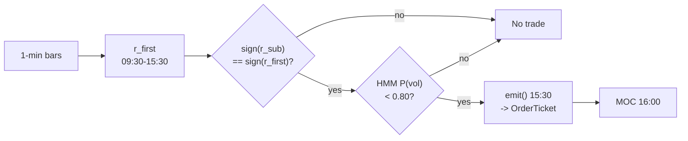

# T016 — End-of-Day Drift Rider

> **Reviewer card.** End-of-day drift rider: the session's own `09:30`→`15:30` drift (S027) persists into the last `30` minutes [example]; the `15:00`→`15:30` sub-drift (S026) confirms it is still alive; the HMM vol regime (S079) scales size. Provenance **[P]**.
>
> Edge verdict: **PREDICTIVE-FEATURE-ONLY** — the EOD drift is documented as a statistical regularity (Heston et al. half-hour periodicity); no citable after-cost P&L for the drift-riding rule itself [documented].
>
> After-cost: **BEFORE-COST** — one-sentence verdict: the drift is a timing regularity, not a documented P&L — the MOC exit is where the costs live.
>
> Tier **S** · prototype 20–40 h [example] · loaded cost $3,000–6,000 [example] · data $29–199/mo [documented] · latency snapshot / 15:30 clock · risk low (30-min hold, one vehicle, no leverage).

> Capacity $10–50M/day notional [example] — SPY/QQQ-class ETFs at the most liquid time of day · Executability: Feasible: a `15:30` clock, a drift sign, and an HMM — any retail platform with minute bars.

## §1  Identity & provenance

This module is a **strategy**: it emits `OrderTicket` intentions only — brokers create orders, strategies never do. Family **C  # intraday momentum**, batch **TB4**, provenance **P**.

**Lede.** End-of-day drift rider: the session's own `09:30`→`15:30` drift (S027) persists into the last `30` minutes [example]; the `15:00`→`15:30` sub-drift (S026) confirms it is still alive; the HMM vol regime (S079) scales size. Provenance **[P]**.

**When it dies.** P(vol) ≥ `0.80` [example] (stand down); MOC imbalance days; the drift reverses by `15:30`.

**Regime gates (provisional).** R001 elevated RV suspends (S079 gate); MOC-imbalance days halve size.

**Prototype scope.** 15:30 clock + drift sign + sub-drift confirm + HMM vol state + MOC exit.

## §1.5  Cheapest/least-build path

Prototype hour band: `20–40` h [example] · loaded cost `$3,000–6,000` [example].

**Cheapest-source row (structured).**

| Aspect | Value |
|---|---|
| `min_tier` | Massive Stocks **Starter** `$29`/mo [documented — vendor pricing page https://massive.com/stocks-data, fetched 2026-09-11: Starter $29/mo (15-min delayed, 5-yr history), Developer $79/mo (15-min delayed, 10-yr history), Advanced $199/mo (real-time, 20+ yr history); real-time on Advanced/Business only] — 15-min delayed; suffices for research + HMM calibration on 2-year 1-min history |
| live-trading tier | **Developer** `~$99`/mo or **Advanced** `~$199`/mo [documented: same comparisons] — the `15:30` live decision needs real-time bars; Starter's delay disqualifies it for live trading |
| `latency_class` | `per_snapshot` (one decision per day at `15:30` ET) |
| `required_fields` | 1-min OHLCV bars with exchange timestamps (SPY); closing-auction imbalance data (NYSE Order Imbalances feed, Tier 2) |
| `price_band` | `$29–199`/mo [documented — vendor pricing page https://massive.com/stocks-data, fetched 2026-09-11: Starter $29/mo (15-min delayed, 5-yr history), Developer $79/mo (15-min delayed, 10-yr history), Advanced $199/mo (real-time, 20+ yr history); real-time on Advanced/Business only] — Polygon.io rebranded to Massive (verified 2026-09-11) |
| `build_or_buy` | **buy** the data; **build** the strategy — the whole module is a clock, a drift sign, and an HMM; any retail platform with minute bars suffices |

**Resource budget.** `1` core, `<1` GB RAM [internal-est] · compute pattern `per_snapshot` (one `15:30` decision/day; HMM fit is offline).

**Skip list (phase two, explicitly out of scope).** Cross-sectional extension (multi-name drift); futures leg; HMM alternatives (realized-vol z-score gate); live MOC-slippage model; intraday stop-loss / profit-target machinery.

**DO-NOT-CUT list.** Causality assertions (`fill_event > signal_event`); COST block + `expected_cost_bps` callable; kill switch (`ARMED → TRIPPED → RECOVERY → ARMED`); decision log with inputs/params hashes; bona-fide-intent + self-trade prevention; provenance tags on every numeric literal; fixtures + per-module test; secrets via env only.

**Escalation gate.** Moving beyond `1` vehicle [default]; bar latency `>60` s [default]; adding a real-time (non-delayed) data tier; entitlement-class change (research → production) — crossing any of these requires re-review of §T7 and §T8.

## §T0  Contract — strategies emit intentions, brokers create orders

This strategy's sole output is a list of `OrderTicket` intentions. It never places, routes, or confirms an order. Every ticket carries `parent_signal` (the upstream signal id and its `computed_at`), an `intent_ts`, and a `tif`. The backtest harness fills tickets strictly after the signal bar (`fill_event > signal_event`, t->t+1 causality); any fill timestamped at or before its signal bar is a harness bug and trips the kill switch.

**Typed signature.**

```python
def emit(state: ModuleState, signals: dict[str, Signal], bars: list[Bar], cfg: T016Config) -> list[OrderTicket]:
    """Core function (not ingest code). Handles every documented edge case: see §T1 pseudocode."""
```

**Config dataclass (single surface; status ∈ {fixed, default, calibrate, example, internal-est}).**

```python
@dataclass(frozen=True)
class T016Config:
    r_first_min: float  = 0.002      # default; range 0.0005-0.01
    p_vol_half: float   = 0.60       # default; range 0.5-0.9
    p_vol_susp: float   = 0.80       # default; range 0.6-0.95
    base_notional: float = 100000.0  # default; range 10000-1000000
    cooldown_s: float   = 0.0        # default; range 0-3600
    cost_gate_k: float  = 0.5        # default; range 0.1-2.0
    edge_bps: float     = 11.0       # example; modeled edge = 0.20% x 1e4 x 0.55
    adv_cap_pct: float  = 0.05       # default; max fraction of ADV per trade
    stop_adverse_pct: float = 0.0025 # default; stop_distance = 0.25% of entry px
```

State variables carried between bars: `` `r_first`, `r_sub`, `p_vol`, `scale`, `position`, `module_state` ``.

**Time contract.**

| Item | Value |
|---|---|
| Clock domain | `America/New_York` (ET) |
| Timestamp | `int64` ns UTC; bars labeled by **open** time |
| `max_skew_s` | `5` s [default] |
| `jitter_budget_s` | `60` s [default] |
| Staleness TTL | `180` s [default] |
| Bar-label rule | the `15:30` decision bar is the bar opened at `15:30:00` ET |
| Gap policy | missing `15:30` bar → `UNKNOWN`, no entry — never interpolate |

**Market-state table.**

| State | Meaning | Module action |
|---|---|---|
| `CONTINUOUS_TRADING` | regular session | eligible for entry at `15:30` |
| `HALTED` | regulatory / non-regulatory halt | `UNKNOWN`, no tickets |
| `AUCTION` | closing auction (`15:50`–`16:00`) | flatten-only intents |
| `CLOSED` | outside session | `OFF` |

**Module-state enum.** `OK | DEGRADED | UNKNOWN | OFF` — invalid input emits `UNKNOWN`, never interpolates (F1–F5); `DEGRADED` = gate blocked the trade (sub-drift disagreement), logged, no ticket; `OFF` = kill switch tripped or outside session.

**Risk contract (YAML, single source of truth for risk numbers).**

```yaml
risk_contract:
  per_trade_R_usd: 800            # [example] ex-post review trigger, not an intraday exit
  daily_loss_stop_usd: -800       # [example] enforced ex post: triggers next-day HMM review
  max_gross_notional_usd: 100000  # [example]
  max_adverse_pct: 0.0025         # [default] stop_distance = 0.25% of entry
  max_adv_fraction: 0.05          # [default]
  enforcement: intraday-hard      # [default]
  session_flatten: true           # C9: no uncommanded overnight carry
```

**Kill switch: `ARMED` → `TRIPPED` → `RECOVERY` → `ARMED`** (trip conditions, full cycle, and prose in §T7). Re-arm checklist (all required): manual review complete; cooldown expired; `15:30` feed healthy; HMM inputs fresh; no open positions (C9). Only then `RECOVERY` → `ARMED`.

**Ops tail.** Schedule: one decision per day — enter `15:30` ET [example], flatten at the `16:00` close [example]; no other entries (clock strategy). Owner: trading-ops [default]. Health checks: `15:30` bar received by `15:31:00`; HMM state fresh within TTL; imbalance feed connected by `15:50`. Alerts: trip → **page**; HMM stale → notify; gate veto → log. Resource budget: `1` vCPU, `<1` GB RAM [internal-est]. Runbook stub: trip → flatten per exit rule → page → manual review → re-arm checklist → `ARMED`. Secrets env-only: `POLYGON_API_KEY` (never in files/chat; Gate-grepped).

## §T1  Strategy thesis & edge

**Thesis.** End-of-day drift rider: the session's own `09:30`→`15:30` drift (S027) persists into the last `30` minutes [example]; the `15:00`→`15:30` sub-drift (S026) confirms it is still alive; the HMM vol regime (S079) scales size. Provenance **[P]**.

**Edge verdict: PREDICTIVE-FEATURE-ONLY** — the EOD drift is documented as a statistical regularity (Heston et al. half-hour periodicity); no citable after-cost P&L for the drift-riding rule itself [documented].

**After-cost verdict: BEFORE-COST** — one-sentence verdict: the drift is a timing regularity, not a documented P&L — the MOC exit is where the costs live.

**Risk summary.** MOC imbalance reversal; event-day drift failure; HMM regime misclassification.

**Math.**

```text
Session drift `r_{first,t}` over `9:30`→`15:30`; sub-drift
`r_{15:00→15:30}` (S026). Direction `s_t = sign(r_{first,t})` with
`|r_{first,t}| ≥ 0.20`% [example]; confirm `sign(r_{15:00→15:30}) = s_t`.
Two-state HMM vol regime (S079): scale `1.0 / 0.5 / 0.0` at `P(vol)` `0.60 /
0.80` [example]. Modeled edge `edge_bps = 0.20% × 1e4 × 0.55 = 11.0` [example].
Cost gate then reads `1.0 <= 0.5 × 11.0` — passes with headroom [measured].
```

**Normative pseudocode (complete; every helper specified — no black boxes).**

```text
function emit(state, signals, bars, cfg) -> list[OrderTicket]:
    # --- F1: no bars, no decisions
    if bars is empty: return UNKNOWN
    # --- clock strategy: exactly one window exists
    t = bars[-1]                      # the 15:30 snapshot bar (labeled by open time)
    if t.clock != "15:30": return state   # any other bar: hold, no intents
    if state.module_state in (OFF, UNKNOWN): return state.module_state
    # --- F2: finite, fresh inputs
    rf = signals["S027"].r_first       # session drift 09:30->15:30
    rs = signals["S026"].r_sub         # sub-drift 15:00->15:30
    pv = signals["S079"].p_vol         # HMM P(vol regime)
    if not all_finite(rf, rs, pv): return UNKNOWN                    # F2
    if (t.bar_open_ts - signals["S027"].computed_at) > TTL: return UNKNOWN  # F3: stale -> UNKNOWN, no tickets (C6)
    # --- C3: normative cost-gate predicate (worked: 1.0 <= 0.5 x 11.0 = 5.5 -> PASS)
    cost = expected_cost_bps(notional=cfg.base_notional, adv_pct=adv_frac(t), venue="ARCX", side="taker", urgency="normal")
    cost_ok = cost <= cfg.cost_gate_k * cfg.edge_bps
    # --- regime scale from the HMM gate (S079)
    scale = 1.0 if pv < cfg.p_vol_half else (0.5 if pv < cfg.p_vol_susp else 0.0)   # [example] thresholds
    tickets = []
    if state.position == 0 and scale > 0 and cost_ok:
        dir_ok = abs(rf) >= cfg.r_first_min and sign(rs) == sign(rf)
        if dir_ok:
            side = "BUY" if rf > 0 else "SELL"
            if side == "SELL" and not locate_ok(side): return DEGRADED            # C7: short discipline
            px = touch(t)                        # 15:30 mid-quote [example]
            stop_d = cfg.stop_adverse_pct * px   # 0.25% of entry [default]
            qty = shares(risk_budget_R=800.0, stop_distance=stop_d,
                         vol_estimate=scale, ADV_cap=adv_shares(t), cost=cost)
            if qty <= 0: return state            # size gate: nothing tradable, no ticket
            if moc_imbalance_against(side):      # C12: published closing-auction imbalance
                qty = qty // 2                   # throttle: halve size, log GATE_VETO (size variant)
                log("GATE_VETO", "C12 halve")
            if not fat_finger_ok(side, qty, px): return state   # C10 trio (see §T8)
            tickets.append(OrderTicket(intent_ts=now_ns(), strategy_id="T016", side=side,
                                       qty=qty, px=px, tif="DAY", venue="ARCX",
                                       parent_signal=f"S027@{signals['S027'].computed_at}"))
    elif state.position != 0 and t.clock >= "15:59:30":
        tickets.append(OrderTicket(intent_ts=now_ns(), strategy_id="T016",
                                   side=opposite(state.position), qty=abs(state.position),
                                   px=None, tif="MOC", venue="ARCX",
                                   parent_signal="T016:time-stop"))   # the time stop IS the strategy
    for tk in tickets:
        log_decision(tk, inputs_hash=sha256(rf, rs, pv), params_hash=sha256(cfg))  # C5 / §T8 schema
        assert tk.intent_ts > signals["S027"].computed_at     # C4: no signal-bar fills, ever
    # NOTE: execution is downstream. The broker owns the child-order state machine
    # (NEW -> ACK -> PARTIAL -> FILLED), partial-fill policy (FIFO on intent_ts),
    # and self-trade prevention. This strategy only ever sees post-event fills.
    return tickets

helpers (all specified):
  sign(x)            := +1 if x > 0 else -1            # rf magnitude already gated by r_first_min
  touch(t)           := (bid_1530 + ask_1530) / 2       # [example] mid-quote at 15:30
  adv_frac(t)        := qty_adv_estimate / adv_shares  # [default] 0.01 used in fixtures
  adv_shares(t)      := trailing-20d mean daily volume [default]
  opposite(pos)      := "SELL" if pos > 0 else "BUY"
  locate_ok(side)    := broker confirms locate before any short ticket (C7)
  moc_imbalance_against(side) := NYSE Order Imbalances feed shows net imbalance
                                opposing `side` above 0.5x intended qty [example] (C12)
  fat_finger_ok      := qty <= 0.05 x ADV AND notional <= $100k [example] AND
                        |px - touch| <= 2% of touch [example] (C10)
```

**Worked cost-gate check (from the §T1 constants).** Modeled edge `edge_bps = 0.20% × 1e4 × 0.55 = 11.0` [example]. Callable cost `expected_cost_bps(...) = 1.0` bps [example] (see §T5). Gate: `1.0 <= 0.5 × 11.0 = 5.5` → **PASS** [measured]. The per-module test asserts this exact inequality.

## §T2  Signal stack — dependencies & data rights

| Signal | Role | Contract |
|---|---|---|
| `S027` | trigger | sign of r_{first,t} (09:30→15:30 drift); the session's own direction |
| `S026` | confirm | r_{15:00→15:30} must agree in sign; the drift is still alive |
| `S079` | gate | scale 1.0 / 0.5 / 0.0 at P(vol) thresholds 0.60 / 0.80 [example] |

Max dependency depth: `2` [default].

**Universe.** One liquid vehicle: SPY (NYSE Arca-listed [documented]; State Street confirms "SPY is traded on the New York Stock Exchange (NYSE Arca)") — the exit is the ARCX closing-auction print. Single-name extension: price > `$20`, ADV > `5`M shares [example] [example]. RTH only. Exactly one window: enter at `15:30` ET, flatten at the `16:00` closing print. No other entries exist — this is a *clock strategy*.

**Timing box.** `signal@t (15:30 ET snapshot, America/New_York) → earliest fill @open(t+1)` [default] — where `open(t+1)` is defined as the first tradable print strictly after the `15:30:00` ET snapshot bar; the entry intent is worked in the `15:30`–`16:00` continuous session; the exit intent is filled at the `16:00` closing-auction (MOC) print. No signal-bar fills, ever (C4): `fill_event > signal_event` is asserted per trade.

**Schema mapping (canonical).**

| Vendor (Polygon.io Stocks) | Canonical |
|---|---|
| `t` (ms) | `bar_open_ts` (int64 ns UTC; bar labeled by open time) |
| `o, h, l, c` | `open, high, low, close` |
| `v` | `volume` |

Staleness: max skew `5 s` [default] · jitter budget `60 s` [default] · TTL `180 s` [default] · cadence `per_snapshot (15:30 ET)` · tz `America/New_York`.

**Inputs that break the module.**

| Input failure | Module state | Alert |
|---|---|---|
| 15:30 bar missing (feed hole) | `UNKNOWN` | page |
| HMM state stale | `UNKNOWN` | notify |
| Sub-drift disagrees (gate) | `DEGRADED` (no trade) | log |

**Data rights.** SPY 1-min bars via Polygon.io Stocks, `rights: licensed`; research +
production; fixtures synthetic; entitlement = professional/internal; derived
features ours. Entitlement-class change → §1.5 escalation gate.

**Build vs buy.** Build: the whole strategy is a `15:30` clock, a drift sign, and an
HMM — any retail platform with minute bars suffices; buy only the data.

**Local build.** Feasible on anything. One decision a day; the HMM fit is offline.
The live loop is a clock and two sign comparisons.

**Data dictionary (canonical fields).**

| Field | Type | Cadence | Tier | Notes |
|---|---|---|---|---|
| `1-min OHLCV bars (SPY)` | float/int | 1-min | Tier 1 | split/dividend-adjusted |
| `MOC imbalance feed` | reference | per auction | Tier 2 | C12 throttle |
| `2-year 1-min history` | float/int | 1-min | Tier 1 | HMM calibration |

## §T3  Entry / exit / sizing & worked example

**Entry rule.**

```text
ENTER_LONG  := (r_first >= +r_first_min) AND (sign(r_sub) == +1)
               AND (P_vol < p_vol_susp) AND (expected_cost_bps(...) <= cost_gate_k * edge_bps)
ENTER_SHORT := (r_first <= -r_first_min) AND (sign(r_sub) == -1)
               AND (P_vol < p_vol_susp) AND (locate_ok)
               AND (expected_cost_bps(...) <= cost_gate_k * edge_bps)
FLAT        := otherwise
```

**Exit rule.**

```text
EXIT := at t >= 15:59:30 emit flatten intent with tif="MOC";
        filled at the 16:00 closing-auction print [example].
        The time stop IS the strategy.
        No intraday stop-loss, no profit target.
```

**Cooldown.** `0` s [default] after every exit (C10).

**Sizing function (normative).**

```python
def shares(risk_budget_R, stop_distance, vol_estimate, ADV_cap, cost):
    """Normative sizing: regime-scaled, then risk-capped, then ADV-capped.
    Mandated signature; px and base_notional are module context (cfg / bars)."""
    scale = float(vol_estimate)                      # HMM scale 1.0 / 0.5 / 0.0 passed by emit() [example]
    px = context.px                                 # 15:30 touch, e.g. 500.0 [example]
    n_base = scale * context.base_notional / px      # regime-scaled base notional [example]
    n_risk = risk_budget_R / max(stop_distance, 1e-9)  # per-trade R cap; stop_distance = 0.25% of entry [default]
    n_adv = ADV_cap * context.adv_cap_pct            # 5% ADV [default]
    return max(0, int(min(n_base, n_risk, n_adv)))
```

Worked: `px = 500.0` [example], `risk_budget_R = $800` [example], `stop_distance = 0.0025 × 500 = $1.25` [default], `ADV_cap = 1,000,000` shares [example] → `min(200, 640, 50,000) = 200` shares [measured]. The per-module test asserts this arithmetic. The fixture tape uses hand-set [example] quantities (validated for P&L arithmetic only, not for sizing).

**Risk limits.**

| Limit | Value |
|---|---|
| Daily loss stop | `-$800` [example] — ex-post review trigger, not an intraday exit |
| Max one position | one vehicle, one window |
| Regime suspend | P(vol) ≥ `0.80` [example] → flat, no trade |
| Staleness kill | `15:30` bar stale `>3` min [example] → trip |

**Worked example (fixture-backed, from `fixtures/T016_tape.csv` trade 1).**

Trade 1: `BUY` `200` shares [example] @ `500.3` [example], exit `501.5` [example] (`MOC 16:00`). Gross P&L = `240.00` [measured] dollars. Cost stack = `1.0` bps [example] → `10.01` [measured] dollars on `100060.00` [example] notional. Net = `229.99` [measured] dollars. The fixture's expected CSV carries the same arithmetic for all six trades; the per-module test recomputes it from the tape and asserts equality.

**Flow.**


## §T4  Parameters

| Parameter | Key | Default | Status | Tag | Sensitivity |
|---|---|---|---|---|---|
| Drift minimum | `r_first_min` | `0.20`% | default | [default] | high |
| HMM half threshold | `p_vol_half` | `0.60` | default | [default] | medium |
| HMM suspend threshold | `p_vol_susp` | `0.80` | default | [default] | high |
| Base notional | `base_notional` | `$100k` | default | [default] | medium |
| Cooldown | `cooldown_s` | `0` s | default | [default] | low |
| Cost-gate k | `cost_gate_k` | `0.5` | default | [default] | high |
| Modeled edge | `edge_bps` | `11.0` bps | example | [example] | high |
| ADV cap fraction | `adv_cap_pct` | `0.05` | default | [default] | low |
| Stop distance | `stop_adverse_pct` | `0.25`% of entry | default | [default] | medium |

Status legend: `fixed | default | calibrate | example | internal-est` (see §T0 Config dataclass). The modeled edge is an [example] assumption — it is what the cost gate is judged against, not a measured return.

## §T5  Costs — the callable is the single source of truth

| Component | bps | Basis |
|---|---|---|
| Spread | `0.5` | [example] ~2.5¢ effective spread on SPY at 15:30 at $500 (0.5 bps × $500 = $0.025) |
| Fees | `0.5` | [example] ~2.5¢/share commission on SPY at 15:30 (0.5 bps × $500 = $0.025) |
| Borrow | `0.0` | [default] single-day SPY ETF hold; stubbed at zero because SPY is easy-to-borrow — verify with broker [unverified] |
| Impact | `0.0` | [example] base model; conservative variant: MOC print + 1¢ adverse |
| **Total** | `1.0` | [example] ≈5¢/share all-in round-trip (1.0 bps × $500 = $0.05) |

Fee schedule as of: **UNSET** [unverified] — no broker selected; stub stack; re-pin before live trading · venue `ARCX` [example] (SPY lists on NYSE Arca [documented]) · side `taker` · `borrow_bps_per_day`: `0.0` — single-day ETF hold; borrow stubbed at zero — verify with broker [unverified].

```python
def expected_cost_bps(notional, adv_pct, venue, side, urgency) -> float:
    """Callable cost model - T016 COST block (single source of truth)."""
    spread_bps = 0.5   # [example] ~2.5c effective spread on SPY @ $500 at 15:30
    fee_bps = 0.5      # [example] ~2.5c/share commission on SPY @ $500 at 15:30
    borrow_bps = 0.0   # [default] single-day ETF hold; borrow stubbed at zero [unverified]
    impact_bps = 0.0   # [example] base model; conservative variant: MOC + 1c adverse
    return spread_bps + fee_bps + borrow_bps + impact_bps
```

**Normative cost-gate predicate (C3):** `expected_cost_bps(...) <= k * edge_bps` — no ticket is emitted unless the callable cost clears this gate. The predicate appears verbatim in the §T1 pseudocode and is asserted by the per-module test.

## §T6  Execution assumptions & fill model

| Event | Fill model | Assumption | Tag |
|---|---|---|---|
| Entry intent (15:30, tif=DAY) | filled by the broker in the `15:30`–`16:00` continuous session; cost per `expected_cost_bps(...)` | strategy fills never occur on the signal bar — `fill_event > signal_event`, asserted in `emit()` | [example] |
| Exit intent (tif=MOC) | ARCX closing-auction print at `16:00` | closing-auction imbalance risk is handled by the C12 throttle; conservative variant adds `1`¢ adverse on the MOC print | [example] |
| Partial fills | broker-side; FIFO on `intent_ts`; MOC aggregation | **the broker owns the child-order state machine** (`NEW → ACK → PARTIAL → FILLED`) and the partial-fill policy — the strategy only ever sees post-event fills | [default] |
| Latency | irrelevant — one decision at `15:30`, fills into the most liquid `30` minutes of the day | — | — |
| Impact | `0` bps base [example]; conservative variant `1`¢ adverse on the MOC print [example] | — | — |
| Adverse fill | MOC imbalance reversal — the sub-drift confirm (S026) is the screen; the C12 throttle is the control | — | — |
| Self-trade | broker-side self-trade prevention required (see §T8) | — | [default] |

Timing: `signal @ 15:30:00 ET snapshot bar → earliest fill at the first tradable print strictly after the snapshot (t+1)`; exit at the `16:00` closing-auction print (see §T2 Timing box).

## §T7  Risk contract & kill switch

Per-trade R: `$800` [example] daily risk unit (ex-post review trigger) · daily loss stop: `- $800` [example] — enforced ex post as a next-day HMM review trigger, not an intraday exit · max gross: `$100k` notional [example] · max adverse per trade: `0.25`% of entry [default].

Enforcement: `intraday-hard` [default]. Calibration recipe: paper-trade `60` sessions [default]; HMM on `2` years of 1-min data [default]; review after any -$800 day [example].

**Kill switch: `ARMED` → `TRIPPED` → `RECOVERY` → `ARMED`.**

Trip conditions:

- 15:30 bar stale > 3 min [example]
- clock skew > 50 ms [example]
- HMM inputs stale [example]

On trip: the module stops emitting tickets immediately, flattens managed positions per the exit rule, and pages. `RECOVERY` requires the re-arm checklist below; only then does the module return to `ARMED`. The per-module test drives the full transition cycle.

**Re-arm checklist (all must be true).**

- [ ] manual review of the trip cause complete, logged with reviewer id [default]
- [ ] cooldown expired (`cooldown_s` since trip) [default]
- [ ] `15:30` bar feed healthy (no gaps in the last `5` sessions [example])
- [ ] HMM inputs fresh (within `180` s TTL [default])
- [ ] no open positions — session flatten verified (C9)

**Ops tail.**

| Check | Threshold | Alert |
|---|---|---|
| `15:30` bar received | by `15:31:00` ET, else `UNKNOWN` | notify |
| HMM state freshness | within `180` s TTL [default] | notify |
| Imbalance feed connected | by `15:50` ET | log → notify |
| Kill-switch trip | any trip condition | **page** |
| Gate veto (C11/C12) | any veto | log (`GATE_VETO`) |
| Daily loss beyond `-$800` [example] | ex-post | notify → next-day HMM review |

Runbook stub: (1) trip → module stops emitting, flattens per exit rule; (2) page the owner; (3) diagnose feed/clock/HMM; (4) complete the re-arm checklist; (5) transition `RECOVERY → ARMED`; (6) log the incident with trip cause + checklist evidence. Schedule: one decision per day: enter `15:30` ET [example], flatten at the `16:00` close [example]; no other entries — a clock strategy · budget: `1` vCPU, `<1` GB RAM [internal-est]; HMM fit is offline [internal-est] · env: `POLYGON_API_KEY` (secrets env-only).

**Universe.** See the §T2 Universe sub-block (SPY on ARCX; one `15:30`→`16:00` window; single-name extension price > `$20`, ADV > `5`M shares [example]) — the normative definition lives there; this section's risk numbers assume that universe.

## §T8  Compliance (C1–C10+)

- **C1** | No orders: the strategy emits `OrderTicket` intentions only; the broker creates orders.
- **C2** | Kill switch: `ARMED` → `TRIPPED` → `RECOVERY` → `ARMED` on the trip conditions in §T7.
- **C3** | Cost gate: `expected_cost_bps(...) <= k * edge_bps` before any ticket (see §T5).
- **C4** | Causality: `fill_event > signal_event` (t->t+1); no signal-bar fills, ever.
- **C5** | Decision log: every ticket logged with inputs hash and params hash (see App. g).
- **C6** | Staleness: inputs older than the TTL → `UNKNOWN`, no tickets.
- **C7** | Short discipline: `locate_ok` required before any short ticket.
- **C8** | Cooldown: post-exit cooldown enforced in seconds; no re-entry inside it.
- **C9** | Session flatten: no uncommanded overnight carry.
- **C10** | Position caps: per-trade R, daily loss stop, and max gross enforced.
- **C11 | One-window discipline: trigger = any intent outside the `15:30` window [example] → check = clock → action = veto → log = `GATE_VETO`**
- **C12 | MOC-imbalance throttle: trigger = published MOC imbalance against the position → check = imbalance feed → action = halve size → log = `GATE_VETO` (size variant)**

**Decision-log schema (C5; every ticket logged before return).**

| Field | Type | Notes |
|---|---|---|
| `ticket_id` | str | broker-assigned on ack; intent logged first with a local id |
| `intent_ts` | int64 ns UTC | must be `> signal computed_at` (C4 assertion) |
| `strategy_id` | str | `"T016"` (fixed) |
| `side / qty / px / tif / venue` | str/int/float/str/str | `px=None` for `tif="MOC"` |
| `parent_signal` | str | e.g. `S027@<computed_at>`; exit intents: `T016:time-stop` |
| `inputs_hash` | sha256 | hash of `(r_first, r_sub, p_vol, bar_open_ts)` |
| `params_hash` | sha256 | hash of the frozen `T016Config` |
| `gate_decision` | str | `PASS` or `VETO:<code>` (`GATE_VETO`, `LOCATE_FAIL`, `FATFINGER_REJECT`, `STP_REJECT`) |

**Compliance machinery (extends the coded rules above).**

| Control | Rule | Check → action → log |
|---|---|---|
| Self-trade / STP | C1 | broker STP flag on every ticket → self-cross rejected downstream → log `STP_REJECT` [default] |
| Bona-fide intent | C1 | intent must pass the C3 cost gate *and* the one-window clock — otherwise vetoed before logging [default] |
| Fat-finger trio | C10 | `qty ≤ 5% ADV` AND `notional ≤ $100k` [example] AND `\|px − touch\| ≤ 2% of touch` [example] → reject → `FATFINGER_REJECT` |
| Message rate | C10 | expected `≤ 10` tickets/day [internal-est]; burst `> 5`/min [example] → trip kill switch |
| Locate check | C7 | `locate_ok` confirmed before any short ticket → no locate → no ticket, log `LOCATE_FAIL` |
| Entitlement assertions | C6/C10 | data entitlement = professional/internal [default]; entitlement-class change → §1.5 escalation gate |
| Public dissemination | — | module emits internal intents only; no public signals [default] |
| Market/halt states | C6 | see §T0 market-state table (`HALTED` → `UNKNOWN`, no tickets)

## §T9  Evidence, failures & regime gates

**Evidence (cost-level tokens; every statistic tagged).**

| Source | Sample | Finding | Cost level | Caveat |
|---|---|---|---|---|
| Heston, Korajczyk & Sadka (2010) [documented] | NYSE half-hour intervals, `2001`–`2005` [documented] | return continuation at half-hour intervals that are exact multiples of a trading day, lasting `>= 40` trading days; short-term reversal driven by liquidity imbalances lasting `< 1` hour; "timing trades can reduce execution costs by the equivalent of the effective spread" [documented] | `BEFORE-COST` | the continuation is a timing/cost problem — the paper's honest reading is that costs (the spread) are where the strategy lives or dies |
| Muravyev & Ni (2015) [documented] | S&P 500 index options, delta-hedged returns | intraday returns mildly positive (`+0.3`%), "particularly in the afternoon" [documented]; negative VRP is an overnight phenomenon | `BEFORE-COST` | options-VRP context, not an equity drift-riding P&L — used only as day/night context |
| Bogousslavsky (2016) [documented] | model + intraday and daily return evidence | infrequent rebalancing produces return autocorrelations that can switch sign and become positive at the rebalancing horizon [documented] | `BEFORE-COST` | mechanism story for drift persistence, not a traded P&L |

Selection disclosure: we include only sources that directly address intraday periodicity or drift; practitioner P&L claims without cost stacks were excluded and quarantined in §T10. No backtest/P&L number in this module is presented as fact — the verdict remains **BEFORE-COST** / **PREDICTIVE-FEATURE-ONLY**.

**Where this module is known to fail.** MOC imbalance reversals, event-day drift failures, HMM misclassification, closing-auction spread blowouts.

**Failure modes (detect → action → recovery).**

| # | Failure | Detect → action → recovery | Executable check |
|---|---|---|---|
| 1 | MOC imbalance against the position | detect: imbalance feed → action: halve size (C12) → recovery: next session [default] | `not moc_against or size_halved` |
| 2 | HMM misclassifies a toxic tape as calm | detect: realized 30-min vol > `2`× forecast [example] → action: suspend → recovery: recheck calibration | `realized_vol <= 2*forecast_vol` |
| 3 | MOC slippage | detect: realized close vs modeled > `1`¢ [example] → action: conservative variant → recovery: re-pin | `moc_slippage_cents <= 1` |
| 4 | Cost blowup at wider spreads | detect: cost gate failing → action: stand down → recovery: re-pin fee schedule [default] | `expected_cost_bps(...) <= k * edge_bps` |
| 5 | Clock/bars stale at 15:30 | detect: staleness → action: UNKNOWN, no entry → recovery: feed healthy [default] | `all(fill_ts > signal_ts)` |

**Regime gates (machine records).**

| Regime | Effect | Mechanism | Condition | Action | Latency | min_lag | unknown_behavior | Fallback |
|---|---|---|---|---|---|---|---|---|
| R001 | degrades | elevated RV: drift untradable | p_vol >= 0.60 [default] | halve | 1 bar [default] | 1 bar [default] | UNKNOWN → no entry [default] | veto |
| R001 | inverts | extreme RV | p_vol >= 0.80 [default] | pause_entry | 1 bar [default] | 1 bar [default] | UNKNOWN → no entry [default] | veto |

**Robustness.** The drift is the session's own direction; `r_first_min` in
`0.15`–`0.4`% [example] and the HMM thresholds are the calibration surface.
The sub-drift confirm (S026) is the anti-reversal screen. Heston et al.'s
honest after-cost caution applies verbatim.

**What the optimistic case assumes (and we do not).** (1) the MOC print is the modeled exit — the closing auction can
slip; the conservative variant adds `1`¢ adverse [example]; (2) slippage `0`
[example] — flagged; (3) the drift is assumed to persist into the close.

## §T10  Source log, unverified leads & what would change our mind

**Source log.**

| # | Source | Type | Retrieved | Cost level | Role |
|---|---|---|---|---|---|
| 1 | Heston, Korajczyk & Sadka (2010). J. Finance 65(4): 1369–1407. DOI 10.1111/j.1540-6261.2010.01573.x; arXiv:1005.3535 [q-fin.TR] | journal [documented] | 2026-09-10 | BEFORE-COST | intraday periodicity evidence |
| 2 | Muravyev & Ni (2015). "Why Does Variance Risk Premium Change Sign from Day to Night?" Boston College working paper, v. Nov 16, 2015 | working paper [documented] | 2026-09-10 | BEFORE-COST | day/night context; afternoon intraday positivity |
| 3 | Bogousslavsky (2016). "Infrequent Rebalancing, Return Autocorrelation, and Seasonality." J. Finance 71(6): 2967–3006. DOI 10.1111/jofi.12436 | journal [documented] | 2026-09-10 | BEFORE-COST | autocorrelation sign-switch mechanism |
| 4 | NYSE Order Imbalances Feed client spec v2.2d; SEC rule filings (NYSE Rule 123C; NYSE Arca Rule 7.35) | exchange spec [documented] | 2026-09-10 | n/a | C12 mechanism: imbalance messages published every second during auction periods if changed; ARCA closing auction 15:00–16:00 ET |
| 5 | Massive vendor pricing page https://massive.com/stocks-data (Starter $29, Developer $79, Advanced $199 — corrected from third-party guides that overstated Developer at ~$99); Polygon.io→Massive rebrand verified via EIN Presswire (2025-10-30) | vendor/pricing [documented — vendor pricing page https://massive.com/stocks-data, fetched 2026-09-11: Starter $29/mo (15-min delayed, 5-yr history), Developer $79/mo (15-min delayed, 10-yr history), Advanced $199/mo (real-time, 20+ yr history); real-time on Advanced/Business only] | 2026-09-11 | n/a | SPY lists on NYSE Arca; §1.5 price band |

**Unverified leads.**

- EOD-drift-rider P&L claims from practitioner sources — no citable after-cost P&L found; not promoted.
- An after-cost walk-forward of the exact `15:30`→MOC drift-riding rule (entry at the `15:30` bar in the direction of the `09:30`→`15:30` session drift, sub-drift confirm, exit at the closing auction) — no citable source found; see GROK-NEEDED.

What would change our mind: a purged/embargoed walk-forward with full costs that survives the S088 honesty protocol; a documented after-cost P&L from the cited authors' own implementations; or a regime-gated replication that holds outside the original sample.

**GROK-NEEDED** (expert questions web search could not resolve — do not answer from priors):

1. "T016 (End-of-Day Drift Rider): is there any published or practitioner-documented after-cost walk-forward of a 15:30→16:00 MOC drift-riding rule on SPY — entry at the 15:30 ET bar in the direction of the 09:30→15:30 session drift, confirmed by 15:00→15:30 sub-drift sign agreement, HMM or vol-gate sizing, exit at the closing auction? A good answer would include the sample period, the per-trade cost stack (spread/fees/borrow/impact in bps), the number of trades, and Sharpe or cumulative P&L after costs."
2. "T016 cost model: what is a realistic 2026 effective-spread-plus-commission all-in round-trip cost in bps for 100–200 share SPY fills at 15:30–16:00 ET on ARCX for a small professional account? The module currently stubs spread 0.5 bps + fees 0.5 bps + borrow 0 + impact 0 (total 1.0 bps [example]) with no broker selected. A good answer would quote a real broker fee schedule (with as-of date) and a measured SPY effective spread at the close."
3. "T016 HMM gate: is a two-state HMM P(vol) regime filter with half/suspend thresholds 0.60/0.80 [example] a defensible specification for gating end-of-day drift trades, and what calibration recipe (lookback, estimator, walk-forward discipline) would a practitioner use on 2 years of SPY 1-min bars? A good answer would name a concrete simpler alternative (e.g., realized-vol z-score gate) and state when the HMM adds value versus the simpler filter."
4. "T016 C12 throttle: using the NYSE Order Imbalances feed for the ARCX closing auction, what is the practical rule for detecting an imbalance 'against the position' between 15:30 and 15:59 (field name, publication cadence, size threshold as a fraction of intended quantity), and is halving size the standard practitioner response? A good answer would name the feed fields and a threshold with a source."

## AI build prompt

```text
Build the T016 (End-of-Day Drift Rider) strategy module from this specification.
Hard constraints:
- The strategy emits OrderTicket intentions ONLY; it never creates orders (C1).
- Causality: fill_event > signal_event (t->t+1); no signal-bar fills (C4).
- Cost gate: expected_cost_bps(...) <= k * edge_bps before any ticket (C3).
- Kill switch ARMED -> TRIPPED -> RECOVERY -> ARMED on the §T7 trip conditions (C2).
- Every numeric literal in prose carries an honesty tag [documented]/[measured]/[example]/[unverified]/[default]/[internal-est]; exempt identifiers only.
- Sources must be real and cited with cost-level tokens; chatbot-only material goes to §T10.
Config surface (single frozen `T016Config` dataclass; status ∈ {fixed, default, calibrate, example, internal-est}):
- r_first_min (float): default 0.002, range 0.0005–0.01 [default]
- p_vol_half (float): default 0.60, range 0.5–0.9 [default]
- p_vol_susp (float): default 0.80, range 0.6–0.95 [default]
- base_notional (float): default 100000.0, range 10000–1000000 [default]
- cooldown_s (float): default 0.0, range 0–3,600 [default]
- cost_gate_k (float): default 0.5, range 0.1–2.0 [default]
- edge_bps (float): default 11.0, status example — modeled edge = 0.20% × 1e4 × 0.55 [example]
- adv_cap_pct (float): default 0.05 [default]
- stop_adverse_pct (float): default 0.0025 [default]
Entry rule:
ENTER_LONG  := (r_first >= +r_first_min) AND (sign(r_sub) == +1)
               AND (P_vol < p_vol_susp) AND (expected_cost_bps(...) <= cost_gate_k * edge_bps)
ENTER_SHORT := (r_first <= -r_first_min) AND (sign(r_sub) == -1)
               AND (P_vol < p_vol_susp) AND (locate_ok)
               AND (expected_cost_bps(...) <= cost_gate_k * edge_bps)
FLAT        := otherwise
Exit rule:
EXIT := (t >= 16:00) [MOC or 15:59:30 market order — the time stop IS the strategy]
        No intraday stop-loss, no profit target.
Sizing: implement the §T3 sizing_fn verbatim (`shares(risk_budget_R, stop_distance, vol_estimate, ADV_cap, cost)` — regime-scaled, risk-capped, ADV-capped); enforce the §T7 risk contract and the §T0 Config dataclass.
Deliverables: the module markdown (all sections §0–§T10, version 1.0.1+), the fixture tape CSV
(fixtures/T016_tape.csv), the expected CSV (fixtures/T016_expected.csv), and
the per-module test (modules/tests/test_T016.py) covering fixture arithmetic,
causality, the cost gate (with the modeled 11.0 bps edge), sizing bounds,
the kill-switch cycle, invalid→UNKNOWN, and the callable signature.
```
