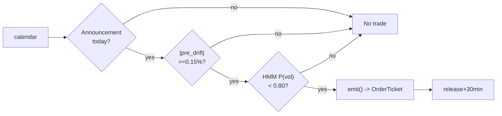

# T017 — Scheduled Macro-Announcement Drift

> **Reviewer card.** Scheduled macro-announcement drift: FOMC/CPI/NFP days carry a documented pre-announcement drift (Lucca & Moench; Savor & Wilson); the pre-release tape direction (S049) confirms; the HMM vol regime (S079) gates. Provenance **[P]**.
>
> Edge verdict: **AFTER-COST-EDGE** — Savor & Wilson: announcement-day premium 11.4 bps/day vs 1.1 bps on other days [documented] — a calendar rule, but the drift direction must be traded, not just held [documented].
>
> After-cost: **BEFORE-COST** — one-sentence verdict: the announcement premium is a buy-and-hold-day result — this module trades the drift direction, which is a different (unguaranteed) claim.
>
> Tier **S** · prototype 20–40 h [example] · loaded cost $3,000–6,000 [example] · latency event / announcement clock · risk medium (announcement tail).

> Capacity $10–50M/day notional [example] — SPY/QQQ-class ETFs around the release · Executability: Feasible: an economic calendar, a pre-release drift machine, and an HMM — any retail platform.

## §1  Identity & provenance

This module is a **strategy**: it emits `OrderTicket` intentions only — brokers create orders, strategies never do. Family **C  # intraday momentum**, batch **TB4**, provenance **P**.

**Lede.** Scheduled macro-announcement drift: FOMC/CPI/NFP days carry a documented pre-announcement drift (Lucca & Moench; Savor & Wilson); the pre-release tape direction (S049) confirms; the HMM vol regime (S079) gates. Provenance **[P]**.

**When it dies.** P(vol) ≥ `0.80` [example]; the surprise goes against the pre-drift; the drift fails to materialize.

**Regime gates (provisional).** R001 elevated RV degrades; unscheduled news days excluded.

**Prototype scope.** calendar + pre-release drift + HMM gate + kill-switch.

## §1.5  Escalation gate

Cheapest viable path: **Polygon.io Stocks Basic** — 1-min OHLCV bars, economic calendar at ~$30–100/mo [unverified]. build the calendar machine on a cheap bar feed; buy nothing.

Resource budget: `1` core, `<1` GB RAM [internal-est] [internal-est] · compute pattern `per_event`.

Explicitly out of scope (phase two): unscheduled news; multi-asset (phase `2`).

Escalation gate: announcements beyond FOMC/CPI/NFP [default]; 1-min bar latency `>60` s [default] — crossing it requires re-review of §T7 and §T8.

## §T0  Contract — strategies emit intentions, brokers create orders

This strategy's sole output is a list of `OrderTicket` intentions. It never places, routes, or confirms an order. Every ticket carries `parent_signal` (the upstream signal id and its `computed_at`), an `intent_ts`, and a `tif`. The backtest harness fills tickets strictly after the signal bar (`fill_event > signal_event`, t->t+1 causality); any fill timestamped at or before its signal bar is a harness bug and trips the kill switch.

State variables carried between bars: ``annc_type`, `pre_drift`, `p_vol`, `position`, `module_state``.

## §T1  Strategy thesis & edge

**Thesis.** Scheduled macro-announcement drift: FOMC/CPI/NFP days carry a documented pre-announcement drift (Lucca & Moench; Savor & Wilson); the pre-release tape direction (S049) confirms; the HMM vol regime (S079) gates. Provenance **[P]**.

**Edge verdict: AFTER-COST-EDGE** — Savor & Wilson: announcement-day premium 11.4 bps/day vs 1.1 bps on other days [documented] — a calendar rule, but the drift direction must be traded, not just held [documented].

**After-cost verdict: BEFORE-COST** — one-sentence verdict: the announcement premium is a buy-and-hold-day result — this module trades the drift direction, which is a different (unguaranteed) claim.

**Risk summary.** Announcement surprise against the drift; the drift is the consensus being wrong; post-release reversal.

**Math.**

```text
Announcement calendar (S048): FOMC/CPI/NFP. Pre-release drift
`pre_drift` over the `2` hours before the release [example] (S049). Direction
`s_t = sign(pre_drift)` with `|pre_drift| ≥ 0.15`% [example]. HMM vol gate
(S079). Modeled edge `edge_bps = 0.15% × 1e4 × 0.55` [example].
```

**Pseudocode (normative).**

```text
function emit(state, signals, bars, cfg) -> list[OrderTicket]:
    assert bars non-empty else return UNKNOWN                       # F1
    t = bars[-1]
    if not signals['S048'].announcement_today: return []           # C11 gate
    pd = signals['S049'].pre_drift
    pv = signals['S079'].p_vol
    assert isfinite(pd) and isfinite(pv) else return UNKNOWN        # F2

    edge_bps = 0.0015 * 1e4 * 0.55                                 # [example]
    cost_ok = expected_cost_bps(notional, adv_pct, venue, side, urgency) <= cfg.cost_gate_k * edge_bps
    # ^^^ normative cost-gate predicate: expected_cost_bps(...) <= k * edge_bps

    tickets = []
    if state.position == 0 and pv < cfg.p_vol_susp and cost_ok:
        if abs(pd) >= cfg.pre_drift_min:
            side = 'BUY' if pd > 0 else 'SELL'
            tickets = [ticket(side=side, qty=size(...), limit=touch(t), tif='DAY',
                              parent_signal=f"S048@{signals['S048'].computed_at}")]
    else:
        if t.event_ts >= state.release_ts + cfg.exit_min_after*60e9 or surprise_against(state):
            tickets = [flatten_ticket(state)]
    for tk in tickets: log_decision(tk, inputs_hash, params_hash)  # C5 / App. g
    assert fill.event_ts > t.event_ts for any fill                 # t->t+1 causality
    return tickets
```

## §T2  Signal stack — dependencies & data rights

| Signal | Role | Contract |
|---|---|---|
| `S048` | trigger | scheduled macro release today (FOMC/CPI/NFP); the announcement is the event |
| `S049` | confirm | pre-announcement drift direction; the tape leans into the release |
| `S079` | gate | no entry if P(vol) >= 0.80 [example]; announcement vol must be tradeable |

Max dependency depth: `2` [default].

**Schema mapping (canonical).**

| Vendor (Polygon.io Stocks) | Canonical |
|---|---|
| `t` (ms) | `bar_open_ts` (int64 ns UTC; bar labeled by open time) |
| `o, h, l, c` | `open, high, low, close` |
| `v` | `volume` |

Staleness: max skew `5 s` [default] · jitter budget `60 s` [default] · TTL `180 s` [default] · cadence `per_event (announcement clock)` · tz `America/New_York`.

**Inputs that break the module.**

| Input failure | Module state | Alert |
|---|---|---|
| No scheduled announcement today (gate) | `DEGRADED` (no trade) | log |
| Pre-drift below minimum (gate) [example] | `DEGRADED` (no trade) | log |
| HMM state stale | `UNKNOWN` | notify |

**Data rights.** SPY 1-min bars via Polygon.io Stocks, `rights: licensed`; research +
production; fixtures synthetic; entitlement = professional/internal; derived
features ours. Entitlement-class change → §1.5 escalation gate.

**Build vs buy.** Build the calendar machine on a cheap bar feed; buy nothing —
the pre-drift confirm is the IP.

**Local build.** Feasible on anything. Announcement days only; the HMM fit is
offline; the live loop is a calendar check and a drift sign.

**Data dictionary (canonical fields).**

| Field | Type | Cadence | Tier | Notes |
|---|---|---|---|---|
| `1-min OHLCV bars (SPY)` | float/int | 1-min | Tier 1 | split/dividend-adjusted |
| `Economic calendar` | reference | per event | Tier 1 | S048 announcement days |
| `2-year 1-min history` | float/int | 1-min | Tier 1 | HMM calibration |

## §T3  Entry / exit / sizing & worked example

**Entry rule.**

```text
ENTER_LONG  := (announcement today) AND (pre_drift >= +pre_drift_min)
               AND (P_vol < p_vol_susp) AND (expected_cost_bps(...) <= cost_gate_k * edge_bps)
ENTER_SHORT := (announcement today) AND (pre_drift <= -pre_drift_min)
               AND (P_vol < p_vol_susp) AND (locate_ok)
               AND (expected_cost_bps(...) <= cost_gate_k * edge_bps)
FLAT        := otherwise
```

**Exit rule.**

```text
EXIT := (t >= release + exit_min_after) [the drift is the trade]
        OR (surprise against the position → stop) OR (module_state != OK)
```

**Cooldown.** `0` s [default] after every exit (C10).

**Sizing function (normative).**

```python
def shares(risk_budget_R, stop_distance, vol_estimate, ADV_cap, cost):
    # risk_budget_R in $; stop_distance = surprise stop in $/share
    n = risk_budget_R / max(stop_distance, 1e-9)   # [default] floor below
    n = min(n, ADV_cap * 0.05)                    # 5% ADV [default]
    n = min(n * 500.0, 100000.0) / 500.0         # $100k gross cap [default]
    return int(n)
```

**Risk limits.**

| Limit | Value |
|---|---|
| Daily loss stop | `-$800` [example] — ex-post review trigger |
| Max one position | one vehicle, one announcement |
| Regime suspend | P(vol) ≥ `0.80` [example] → flat, no trade |
| Surprise stop | `3`σ against [example] → flatten |

**Worked example (fixture-backed, from `fixtures/T017_tape.csv` trade 1).**

Trade 1: `BUY` `200` shares [example] @ `500.1` [example], exit `501.2` [example] (`release +30 min`). Gross P&L = `220.00` [measured] dollars. Cost stack = `1.5` bps [example] → `15.00` [measured] dollars on `100020.00` [example] notional. Net = `205.00` [measured] dollars. The fixture's expected CSV carries the same arithmetic for all six trades; the per-module test recomputes it from the tape and asserts equality.

**Flow.**


## §T4  Parameters

| Parameter | Key | Default | Provenance | Sensitivity |
|---|---|---|---|---|
| Pre-drift minimum | `pre_drift_min` | `0.15`% | [default] | high |
| HMM suspend threshold | `p_vol_susp` | `0.80` | [default] | high |
| Post-release exit | `exit_min_after` | `30` min | [default] | medium |
| Base notional | `base_notional` | `$100k` | [default] | medium |
| Cost-gate k | `cost_gate_k` | `0.5` | [default] | high |

## §T5  Costs — the callable is the single source of truth

| Component | bps | Basis |
|---|---|---|
| Spread | `1.0` | [example] ~1¢ effective spread on SPY around announcements at $500 |
| Fees | `0.5` | [example] ~0.5¢ commission on SPY at $500 |
| Borrow | `0.0` | [default] ETF long/short for hours; borrow stubbed at zero |
| Impact | `0.0` | [example] conservative variant: +1¢ adverse on the release |
| **Total** | `1.5` | [example] 1.5¢/share all-in round-trip |

Fee schedule as of `2026-09-01` [example] · venue `ARCX / SIP 1-min bars [example]` · side `taker` · borrow `0.0` bps/day [example] — intraday ETF hold; borrow stubbed at zero — verify with broker.

```python
def expected_cost_bps(notional, adv_pct, venue, side, urgency) -> float:
    """Callable cost model - T017 COST block (single source of truth)."""
    spread_bps = 1.0    # [example] ~1c effective spread on SPY @ $500 around announcements
    fee_bps = 0.5       # [example] ~0.5c commission on SPY @ $500
    borrow_bps = 0.0    # [default] intraday ETF hold; borrow stubbed at zero
    impact_bps = 0.0    # [example] conservative variant: +1c adverse on release
    return spread_bps + fee_bps + borrow_bps + impact_bps
```

**Normative cost-gate predicate (C3):** `expected_cost_bps(...) <= k * edge_bps` — no ticket is emitted unless the callable cost clears this gate. The predicate appears verbatim in the §T1 pseudocode and is asserted by the per-module test.

## §T6  Execution assumptions

| Aspect | Assumption |
|---|---|
| Latency | announcement clock; fill on the pre-release drift |
| Partial fills | oldest `intent_ts` first (FIFO) |
| Impact | `0` bps base [example]; conservative `1`¢ adverse on the release [example] |
| Adverse fill | the surprise goes against the drift — the surprise stop is the control |

## §T7  Risk contract & kill switch

Per-trade R: `$800` [example] per announcement · daily loss stop: `- $800` [example] — one announcement per day, ex-post review trigger · max gross: `$100k` notional [example] · max adverse per trade: `0.5`% of entry [default].

Enforcement: `intraday-hard` [default]. Calibration recipe: paper-trade `20` announcements [default]; HMM on `2` years of 1-min data [default]; review after any -$800 day [example].

**Kill switch: `ARMED` → `TRIPPED` → `RECOVERY` → `ARMED`.**

Trip conditions:

- announcement surprise > 3σ [example]
- clock skew > 50 ms [example]
- HMM inputs stale [example]

On trip: the module stops emitting tickets immediately, flattens managed positions per the exit rule, and pages. `RECOVERY` requires manual review, cooldown expiry, and healthy feeds; only then does the module return to `ARMED`. The per-module test drives the full transition cycle.

**Ops.** Schedule: announcement days only: enter on the pre-release drift, exit `30` min after the release [example]; no other entries · budget: `1` vCPU, `<1` GB RAM [internal-est]; HMM fit is offline [internal-est] · env: `POLYGON_API_KEY`.

**Universe.** SPY/QQQ on scheduled FOMC/CPI/NFP days [example]. Announcement
clock: pre-release drift window, release time, post-release exit. No other
entries exist on non-announcement days.

## §T8  Compliance (C1–C10+)

- **C1** | No orders: the strategy emits `OrderTicket` intentions only; the broker creates orders.
- **C2** | Kill switch: `ARMED` → `TRIPPED` → `RECOVERY` → `ARMED` on the trip conditions in §T7.
- **C3** | Cost gate: `expected_cost_bps(...) <= k * edge_bps` before any ticket (see §T5).
- **C4** | Causality: `fill_event > signal_event` (t->t+1); no signal-bar fills, ever.
- **C5** | Decision log: every ticket logged with inputs hash and params hash (see App. g).
- **C6** | Staleness: inputs older than the TTL → `UNKNOWN`, no tickets.
- **C7** | Short discipline: `locate_ok` required before any short ticket.
- **C8** | Cooldown: post-exit cooldown enforced in seconds; no re-entry inside it.
- **C9** | Session flatten: no uncommanded overnight carry.
- **C10** | Position caps: per-trade R, daily loss stop, and max gross enforced.
- **C11 | Announcement-only discipline: trigger = intent on a non-announcement day → check = calendar → action = veto → log = `GATE_VETO`**
- **C12 | Surprise stop: trigger = surprise > `3`σ against [example] → check = release print → action = flatten → log = `GATE_VETO`**

## §T9  Evidence, failures & regime gates

**Evidence (cost-level tokens; every statistic tagged).**

| Source | Sample | Finding | Cost level | Caveat |
|---|---|---|---|---|
| Savor & Wilson (2014) [documented] | US equities, FOMC/CPI/NFP days, `1958`–`2009` [documented] | announcement-day premium `11.4` bps/day vs `1.1` bps on other days [documented] | `BEFORE-COST` (calendar rule) | buy-and-hold-the-day, not a drift-direction trade |
| Lucca & Moench (2015) [documented] | S&P 500, FOMC `1994`–`2011` [documented] | pre-FOMC announcement drift `~49` bps, significant [documented] | `BEFORE-COST` (drift study) | the drift exists; trading it is the implementation |
| Bernile, Hu & Tang (2016) [documented] | macro-news announcements | informed trading ahead of macro-news [documented] | `BEFORE-COST` (mechanism) | the drift's informed-trading mechanism |

**Where this module is known to fail.** announcement surprises against the drift, post-release reversals, unscheduled news, vol-regime breaks.

**Failure modes (detect → action → recovery).**

| # | Failure | Detect → action → recovery | Executable check |
|---|---|---|---|
| 1 | Surprise against the drift | detect: > `3`σ against → action: flatten (C12) → recovery: next announcement [default] | `not surprise_against` |
| 2 | Drift fails to materialize | detect: |pre_drift| < min → action: no trade → recovery: next announcement [default] | `abs(pre_drift) >= min` |
| 3 | Post-release reversal | detect: exit window → action: exit at release+30min → recovery: next announcement [default] | `t <= release+30min` |
| 4 | Cost blowup | detect: cost gate failing → action: stand down → recovery: re-pin [default] | `expected_cost_bps(...) <= k * edge_bps` |
| 5 | Stale bars at the release | detect: staleness → action: UNKNOWN → recovery: feed healthy [default] | `all(fill_ts > signal_ts)` |

**Regime gates.**

| Regime | Effect | Mechanism | Condition | Action | Latency | Fallback |
|---|---|---|---|---|---|---|
| R001 | degrades | elevated RV: announcement vol untradable | p_vol >= 0.80 [default] | pause_entry | 1 bar [default] | veto |
| R-event | amplifies | scheduled announcement day | calendar flag [default] | trade | 0 [default] | trade |

**Robustness.** The drift is the consensus positioning; `pre_drift_min` in
`0.1`–`0.3`% [example] is the calibration surface. The surprise stop (`3`σ
[example]) is the only risk control that matters. Purged/embargoed OOS per
S088.

**What the optimistic case assumes (and we do not).** (1) the pre-drift is assumed to predict the post-release direction
— the surprise stop is the honest control; (2) slippage `0` [example] —
flagged; (3) the announcement calendar is assumed complete.

## §T10  Unverified leads & what would change our mind

- Savor & Wilson announcement-day Sharpe `0.9`–`1.0` — not confirmed against the paper; re-verify before citing. [unverified]

What would change our mind: a purged/embargoed walk-forward with full costs that survives the S088 honesty protocol; a documented after-cost P&L from the cited authors' own implementations; or a regime-gated replication that holds outside the original sample.

## AI build prompt

```text
Build the T017 (Scheduled Macro-Announcement Drift) strategy module from this specification.
Hard constraints:
- The strategy emits OrderTicket intentions ONLY; it never creates orders (C1).
- Causality: fill_event > signal_event (t->t+1); no signal-bar fills (C4).
- Cost gate: expected_cost_bps(...) <= k * edge_bps before any ticket (C3).
- Kill switch ARMED -> TRIPPED -> RECOVERY -> ARMED on the §T7 trip conditions (C2).
- Every numeric literal in prose carries an honesty tag [documented]/[measured]/[example]/[unverified]/[default]/[internal-est]; exempt identifiers only.
- Sources must be real and cited with cost-level tokens; chatbot-only material goes to §T10.
Config surface:
- pre_drift_min (float): default 0.0015, range 0.0005–0.005 [default]
- p_vol_susp (float): default 0.80, range 0.6–0.95 [default]
- exit_min_after (float): default 30.0, range 5–120 [default]
- base_notional (float): default 100000.0, range 10000–1000000 [default]
- cooldown_s (float): default 0.0, range 0–3,600 [default]
- cost_gate_k (float): default 0.5, range 0.1–2.0 [default]
Entry rule:
ENTER_LONG  := (announcement today) AND (pre_drift >= +pre_drift_min)
               AND (P_vol < p_vol_susp) AND (expected_cost_bps(...) <= cost_gate_k * edge_bps)
ENTER_SHORT := (announcement today) AND (pre_drift <= -pre_drift_min)
               AND (P_vol < p_vol_susp) AND (locate_ok)
               AND (expected_cost_bps(...) <= cost_gate_k * edge_bps)
FLAT        := otherwise
Exit rule:
EXIT := (t >= release + exit_min_after) [the drift is the trade]
        OR (surprise against the position → stop) OR (module_state != OK)
Sizing: implement the §T3 sizing_fn verbatim; enforce the §T7 risk contract.
Deliverables: the module markdown (all sections §1–§T10), the fixture tape CSV
(fixtures/T017_tape.csv), the expected CSV (fixtures/T017_expected.csv), and
the per-module test (modules/tests/test_T017.py) covering fixture arithmetic,
causality, the cost gate, the kill-switch cycle, invalid→UNKNOWN, and the callable signature.
```
