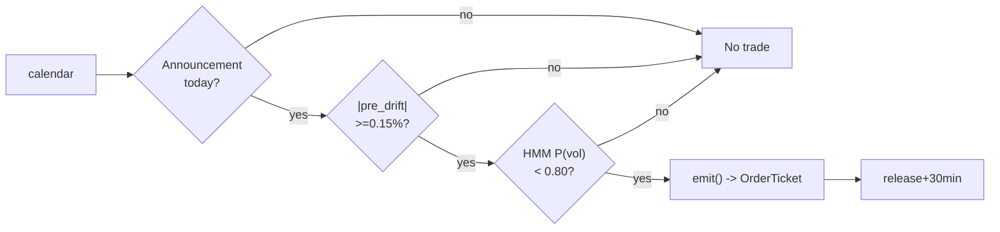

# T017 — Scheduled Macro-Announcement Drift

> **Reviewer card.** Scheduled macro-announcement drift: FOMC/CPI/NFP days carry a documented pre-announcement drift (Lucca & Moench; Savor & Wilson); the pre-release tape direction (S049) confirms; the HMM vol regime (S079) gates. Provenance **[P]**.
>
> Edge verdict: **PREDICTIVE-FEATURE-ONLY** — the drift is a documented predictive feature, but this module's directional sign-of-drift trade has no demonstrated after-cost edge, and the pre-FOMC drift itself has weakened since ~2016 [documented].
>
> After-cost: **BEFORE-COST** — every cited statistic is before-cost; no after-cost P&L for the sign-of-drift implementation exists in the cited literature.
>
> Tier **S** · prototype 20–40 h [example] · loaded cost $3,000–6,000 [example] · data $29/mo research / $199/mo live [documented — vendor pricing page https://massive.com/stocks-data, fetched 2026-09-11] · latency event / announcement clock · risk medium (announcement tail).
>
> Capacity $10–50M/day notional [example] — SPY/QQQ-class ETFs around the release · Executability: Feasible: a free public economic calendar, a pre-release drift machine, and an HMM — any retail platform.

## §1  Identity & provenance

This module is a **strategy**: it emits `OrderTicket` intentions only — brokers create orders, strategies never do. Family **C  # intraday momentum**, batch **TB4**, provenance **P**, version **1.0.1**.

**Lede.** Scheduled macro-announcement drift: FOMC/CPI/NFP days carry a documented pre-announcement drift (Lucca & Moench; Savor & Wilson); the pre-release tape direction (S049) confirms; the HMM vol regime (S079) gates. Provenance **[P]**.

**When it dies.** P(vol) ≥ `0.80` [example]; the surprise goes against the pre-drift; the drift fails to materialize; the pre-FOMC drift does not recover its pre-2016 magnitude [documented — see §T9].

**Regime gates (provisional).** R001 elevated RV degrades; unscheduled news days excluded; R-event (scheduled announcement day) amplifies. Machine records in §T5.

**Prototype scope.** calendar + pre-release drift + HMM gate + kill-switch.

## §1.5  Escalation gate

**Cheapest viable path.** Research on **Massive Stocks Starter** at $29/mo [documented — vendor pricing page https://massive.com/stocks-data, fetched 2026-09-11: Starter $29/mo (15-min delayed, 5-yr history), Developer $79/mo (15-min delayed, 10-yr history), Advanced $199/mo (real-time, 20+ yr history); real-time on Advanced/Business only] (1-min OHLCV bars, 15-min delayed — sufficient for offline calibration); live trading needs real-time at the release, so production is **Stocks Advanced** at $199/mo (real-time) [documented — vendor pricing page https://massive.com/stocks-data, fetched 2026-09-11: Starter $29/mo (15-min delayed, 5-yr history), Developer $79/mo (15-min delayed, 10-yr history), Advanced $199/mo (real-time, 20+ yr history); real-time on Advanced/Business only]. The economic calendar is free: BLS Online Calendar `.ics` feed + Fed FOMC calendar [documented]. Build the calendar machine on a cheap bar feed; buy nothing else.

| Cheapest-source row | Value |
|---|---|
| min_tier | Stocks Starter (research) / Stocks Advanced (live) [documented] |
| latency_class | 15-min delayed (research) / real-time (live) [documented] |
| required_fields | 1-min OHLCV SPY/QQQ; event calendar (FOMC/CPI/NFP dates + release times) |
| price_band | $29/mo research, $199/mo live [documented — vendor pricing page https://massive.com/stocks-data, fetched 2026-09-11]; calendar $0 [documented] |
| build_or_buy | buy bars, build the calendar machine and drift estimator |

**Resource budget.** `1` core, `<1` GB RAM [internal-est] · compute pattern `per_event`.

**Skip list (phase 1).** unscheduled news; multi-asset; intraday HMM refit (fit offline only); options hedging of the tail.

**DO-NOT-CUT list.** causality assertions (`fill_event > signal_event`); COST block + cost-gate predicate; kill switch / safe mode; decision-log audit trail; bona-fide intent + self-trade prevention; provenance/honesty tags; fixtures + per-module tests; secrets via env only.

**Escalation gate.** Announcements beyond FOMC/CPI/NFP [default]; 1-min bar latency `>60` s [default] — crossing it requires re-review of §T7 and §T8.

## §T0  Contract — strategies emit intentions, brokers create orders

This strategy's sole output is a list of `OrderTicket` intentions. It never places, routes, or confirms an order. Every ticket carries `parent_signal` (the upstream signal id and its `computed_at`), an `intent_ts`, and a `tif`. The backtest harness fills tickets strictly after the signal bar (`fill_event > signal_event`, t->t+1 causality); any fill timestamped at or before its signal bar is a harness bug and trips the kill switch.

**Typed signature.**

```python
def emit(state: ModuleState, signals: dict[str, Signal], bars: list[Bar], cfg: Config) -> list[OrderTicket]:
    """Core strategy function. Handles documented edge cases; returns intents only."""
```

**Config dataclass (single source of parameter truth; statuses: fixed | default | calibrate | example | internal-est).**

```python
@dataclass(frozen=True)
class Config:
    pre_drift_min: float = 0.0015   # [default] status=calibrate, range 0.0005-0.005
    p_vol_susp: float = 0.80        # [default] status=default,  range 0.6-0.95
    exit_min_after: float = 30.0    # [default] status=default,  range 5-120
    base_notional: float = 100000.0 # [default] status=example,  range 10000-1000000
    cooldown_s: float = 0.0         # [default] status=default,  range 0-3600
    cost_gate_k: float = 0.5        # [default] status=default,  range 0.1-2.0
```

**OrderTicket schema (global intent schema; broker turns intents into orders).**

| Field | Type | Notes |
|---|---|---|
| `ticket_id` | str | `T017-<annc_date>-<seq>` [default] |
| `module_id` | str | `T017` (fixed) |
| `intent_ts` | int64 ns UTC | decision time; `fill_event > intent_ts` enforced |
| `side` | enum | `BUY` \| `SELL` |
| `qty` | int | from `sizing_fn` (§T3) |
| `limit_px` | float | touch at decision (see `touch(t)` in §T3) |
| `tif` | enum | `DAY` (fixed) |
| `parent_signal` | str | `S048@<computed_at_ns>` |
| `inputs_hash` / `params_hash` | str | sha256 of canonical inputs / Config |
| `cost_bps` / `edge_bps` | float | from the §T2 callable / §T3 edge model |

**Child-order state machine (broker-side; strategy emits only INTENTS).** `INTENT → BROKER_ACCEPTED → WORKING → (FILLED | PARTIAL | CANCELLED | REJECTED)`. Partial-fill policy: FIFO by `intent_ts`; remainder re-priced at touch or cancelled after `5` min [default]. Cancel-replace: only the §T3 exit rule may replace; no replace-up chasing. Strategy code never observes broker acks — it re-emits intents on the next bar from `ModuleState`.

**Canonical Bar schema mapping.**

| Vendor (Polygon.io Stocks) | Canonical |
|---|---|
| `t` (ms) | `bar_open_ts` (int64 ns UTC; bar labeled by open time) |
| `o, h, l, c` | `open, high, low, close` |
| `v` | `volume` |

**Time contract.** Clock domain: exchange event clock (SIP/ARCX) + announcement clock; authoritative causality clock: `event_ts` (int64 ns UTC). Bar-label rule: bar labeled by open time. max_skew `5` s [default] · jitter budget `60` s [default] · staleness TTL `180` s [default] · gap policy: no interpolation — stale or missing inputs → `UNKNOWN`. Dual timestamps `(event_ts, asof_ts)` on every signal and ticket.

**Units.** Prices USD; returns decimal; bps = `1e-4` [fixed]; σ measured in bps of the pre-release return; timestamps int64 ns UTC.

**Market-state table.**

| State | Entries | Managed position | Notes |
|---|---|---|---|
| `CONTINUOUS_TRADING` | per Boolean rule | per exit rule | normal |
| `HALTED` | veto | hold; flatten on resume if release passed | C17 |
| `AUCTION` | veto | flatten-only tickets allowed | C17 |
| `CLOSED` | none (module flat) | none | C9 session flatten |

**Module-state enum.** `OK | DEGRADED | UNKNOWN | OFF`. Invalid input → `UNKNOWN`, never interpolate. `DEGRADED` = gates failed but inputs healthy (e.g., no announcement today → no trade). `OFF` = kill switch tripped.

**State vector carried between bars.** `annc_type`, `pre_drift`, `p_vol`, `position`, `module_state`, `release_ts`, `cooldown_until_ts`.

**Decision-log schema (App. g).** Every ticket appends `{ticket_id, intent_ts, inputs_hash, params_hash, gate_vector, cost_bps, edge_bps, module_state}` to the on-disk ledger [default].

**Risk contract (YAML — canonical; §T7 is the evidence layer).**

```yaml
per_trade_R: 800.0            # USD [example]
daily_loss_stop: -800.0       # USD [example]; one announcement per day -> ex-post review trigger
max_gross: 100000.0           # USD notional [example]
max_adverse_per_trade: 0.005  # 0.5% of entry [default]
enforcement: intraday-hard    # [default]
kill_conditions:
  - "announcement surprise > 3-sigma [example]"
  - "clock skew > 50 ms [example]"
  - "HMM inputs stale [example]"
calibration_recipe: "paper-trade 20 announcements [default]; HMM fit on 2 years of 1-min data [default]"
```

**Kill-switch state machine.** `ARMED → TRIPPED → RECOVERY → ARMED`.

- `ARMED → TRIPPED`: any kill condition true → stop emitting immediately, flatten managed positions per the exit rule, page the operator.
- `TRIPPED → RECOVERY`: automatic once flattened and the trip condition clears.
- `RECOVERY → ARMED`: only after the re-arm checklist passes — (1) trip cause root-caused and logged; (2) cooldown expired (≥ `1` announcement cycle [default]); (3) feeds healthy (staleness < TTL); (4) calendar re-verified against BLS/Fed feeds; (5) manual sign-off; (6) paper-mode dry run over `1` announcement [default].
- The per-module test drives the full cycle.

**Ops tail.** Schedule: announcement days only — enter on the pre-release drift, exit `30` min after the release [example]; no other entries. Owner: single-operator prototype (unassigned) [default]. Health checks: feed staleness < TTL; clock skew ≤ `50` ms [example]; HMM fit age < `30` days [default]. Alerts: page on `TRIPPED`; notify on `UNKNOWN`. Resource budget: `1` vCPU, `<1` GB RAM [internal-est]; HMM fit offline [internal-est]. Runbook stub: on `TRIPPED` → flatten → diagnose → re-arm checklist → `ARMED`. Secrets: env-only (`POLYGON_API_KEY`); Gate-greps for literals.

## §T1  Strategy thesis & edge

**Thesis.** Scheduled macro-announcement drift: FOMC/CPI/NFP days carry a documented pre-announcement drift (Lucca & Moench; Savor & Wilson); the pre-release tape direction (S049) confirms; the HMM vol regime (S079) gates. Provenance **[P]**.

**Edge verdict: PREDICTIVE-FEATURE-ONLY** — Lucca & Moench: ~49 bps pre-FOMC drift 1994–2011 [documented]; Savor & Wilson: 11.4 vs 1.1 bps announcement-day premium [documented]; Hu et al.: pre-announcement drift in NFP/ISM/GDP [documented] — the drift is a documented predictive feature, but this module's directional sign-of-drift trade has no demonstrated after-cost edge, and the pre-FOMC drift itself has weakened since ~2016 [documented].

**After-cost verdict: BEFORE-COST** — every cited statistic is before-cost; no after-cost P&L for the sign-of-drift implementation exists in the cited literature — do not present this module's edge as demonstrated after costs.

**Risk summary.** Announcement surprise against the drift; the drift is the consensus being wrong; post-release reversal; the pre-FOMC drift's post-2016 weakening [documented].

## §T2  Signal stack — dependencies & data rights (fixed-order sub-blocks)

### Universe
SPY/QQQ on scheduled FOMC/CPI/NFP days [example]. Announcement clock: pre-release drift window, release time, post-release exit. No other entries exist on non-announcement days.

### Entry rule (Boolean expressions)

```text
ENTER_LONG  := (announcement today) AND (pre_drift >= +pre_drift_min)
               AND (P_vol < p_vol_susp) AND (expected_cost_bps(...) <= cost_gate_k * edge_bps)
ENTER_SHORT := (announcement today) AND (pre_drift <= -pre_drift_min)
               AND (P_vol < p_vol_susp) AND (locate_ok)
               AND (expected_cost_bps(...) <= cost_gate_k * edge_bps)
FLAT        := otherwise
```

### Exits + cooldown

```text
EXIT := (t >= release + exit_min_after) [the drift is the trade]
        OR (surprise against the position → stop) OR (module_state != OK)
```

**Cooldown.** `0` s [default] after every exit (C8) — the event clock is sparse; re-entry is gated by the next announcement anyway.

### Position sizing (fenced function)

```python
def sizing_fn(risk_budget_R, stop_distance, vol_estimate, ADV_cap, cost):
    # risk_budget_R in $; stop_distance = surprise stop in $/share
    n = risk_budget_R / max(stop_distance, 1e-9)   # [default] floor below
    n = min(n, ADV_cap * 0.05)                    # 5% ADV [default]
    n = min(n * 500.0, 100000.0) / 500.0         # $100k gross cap [default]
    return int(n)
```

### Risk limits

| Limit | Value |
|---|---|
| Daily loss stop | `-$800` [example] — ex-post review trigger |
| Max one position | one vehicle, one announcement |
| Regime suspend | P(vol) ≥ `0.80` [example] → flat, no trade |
| Surprise stop | `3`-sigma against [example] → flatten |
| Max adverse per trade | `0.5`% of entry [default] |

### COST block — single source of truth

Convention: **round-trip total** (entry + exit legs), charged once against entry notional in fixtures [default].

| Component | bps | Basis |
|---|---|---|
| Spread | `2.0` | [example] ~1¢ effective round-trip half-spread on SPY @ $500 around announcements (2 × 0.5¢ one-way) |
| Fees | `1.4` | [documented] IBKR Pro tiered $0.0035/share one-way (≤300k shares/mo, min $0.35/order, max 1% trade value) → 0.7 bps at $500; round-trip 1.4 bps; fee pages checked 2026-09-10 |
| Borrow | `0.0` | [default] borrow_bps_per_day `0.0` — intraday ETF hold (<1 session); borrow stubbed at zero; shorts require `locate_ok` (C7); actual borrow rate [unverified] — confirm with broker |
| Impact | `0.0` | [example] base 0; conservative variant: +1¢ adverse on the release = 2 bps at $500 |
| **Total** | `3.4` | `2.0` [example] + `1.4` [documented] + `0.0` [default] + `0.0` [example] |

Fee schedule as of `2026-09-10` [documented] · venue `ARCX (taker)` [example] · side `taker`.

```python
def expected_cost_bps(notional, adv_pct, venue, side, urgency) -> float:
    """Callable cost model - T017 COST block (single source of truth)."""
    spread_bps = 2.0    # [example] ~1c round-trip half-spread on SPY @ $500 around announcements
    fee_bps = 1.4       # [documented] IBKR Pro tiered $0.0035/share one-way -> 0.7 bps @ $500; x2 round-trip
    borrow_bps = 0.0    # [default] intraday ETF hold; borrow stubbed at zero; locate required (C7)
    impact_bps = 0.0    # [example] base 0; conservative variant +1c adverse = 2 bps
    return spread_bps + fee_bps + borrow_bps + impact_bps
```

**Normative cost-gate predicate (C3):** `expected_cost_bps(...) <= k * edge_bps` — no ticket is emitted unless the callable cost clears this gate. The predicate appears verbatim in the §T3 pseudocode and is asserted by the per-module test.

### Execution / fill-model table

| Aspect | Assumption |
|---|---|
| Latency | announcement clock; fill on the pre-release drift |
| Partial fills | oldest `intent_ts` first (FIFO); remainder re-priced at touch or cancelled after `5` min [default] |
| Impact | `0` bps base [example]; conservative `2` bps adverse variant [example] |
| Adverse fill | the surprise goes against the drift — the surprise stop is the control |
| Fill model | limit at touch, taker; fill strictly after the signal bar (C4) |

### Robustness + compliance sub-block

Robustness: the drift is the consensus positioning; `pre_drift_min` in `0.1`–`0.3`% [example] is the calibration surface. The surprise stop (`3`-sigma [example]) is the only risk control that matters. Purged/embargoed OOS per S088. The pre-FOMC drift's post-2016 weakening is the live robustness risk [documented].

Compliance (canonical; §T8 points here):

- **C1** | No orders: the strategy emits `OrderTicket` intentions only; the broker creates orders.
- **C2** | Kill switch: `ARMED` → `TRIPPED` → `RECOVERY` → `ARMED` on the §T0 trip conditions; re-arm only via checklist.
- **C3** | Cost gate: `expected_cost_bps(...) <= k * edge_bps` before any ticket.
- **C4** | Causality: `fill_event > signal_event` (t->t+1); no signal-bar fills, ever.
- **C5** | Decision log: every ticket logged with inputs hash + params hash (App. g schema).
- **C6** | Staleness: inputs older than the TTL → `UNKNOWN`, no tickets.
- **C7** | Short discipline: `locate_ok` required before any short ticket (Reg-SHO).
- **C8** | Cooldown: post-exit cooldown enforced in seconds; no re-entry inside it.
- **C9** | Session flatten: no uncommanded overnight carry.
- **C10** | Position caps: per-trade R, daily loss stop, max gross enforced.
- **C11** | Announcement-only discipline: trigger = intent on a non-announcement day → check = calendar → action = veto → log = `GATE_VETO`.
- **C12** | Surprise stop: trigger = surprise > `3`-sigma against [example] → check = release print → action = flatten → log = `GATE_VETO`.
- **C13** | Self-trade prevention: cancel-aggressing IOC; broker-level STP enabled; no wash trades.
- **C14** | Bona-fide intent: tickets arise only from the satisfied Boolean entry rule; no quoting without intent to trade.
- **C15** | Message rate: ≤ `2` tickets per announcement day [default]; no quoting engine, so cancel-to-trade is not applicable.
- **C16** | Fat-finger trio: price collar ±`2`% of touch [default]; size cap $100k notional [default]; ticket notional ≤ `2`× `base_notional` [default].
- **C17** | Halt/auction: `HALTED`/`AUCTION` → no new tickets; `CLOSED` → flat (see market-state table).
- **C18** | Public-dissemination gate: trade only the published calendar + own drift estimate; never non-public release content (Bernile et al. 2016 documents informed trading during FOMC embargoes — this module must not be its beneficiary).
- **C19** | Data entitlement: licensed Polygon data used within its entitlement; BLS/Fed calendar feeds are public.

### Parameter table

| Parameter | Key | Default | Status | Provenance | Sensitivity |
|---|---|---|---|---|---|
| Pre-drift minimum | `pre_drift_min` | `0.15`% | calibrate | [default] | high |
| HMM suspend threshold | `p_vol_susp` | `0.80` | default | [default] | high |
| Post-release exit | `exit_min_after` | `30` min | default | [default] | medium |
| Base notional | `base_notional` | `$100k` | example | [default] | medium |
| Cost-gate k | `cost_gate_k` | `0.5` | default | [default] | high |
| Post-exit cooldown | `cooldown_s` | `0` s | default | [default] | low |

### Timing box

`signal@t (per_event, America/New_York) → earliest fill @open(t+1)` — the signal bar is the pre-release drift bar; the earliest fill is the open of the next 1-min bar. No signal-bar fills, ever (C4).

## §T3  Math & normative pseudocode

**Math.**

```text
Announcement calendar (S048): FOMC/CPI/NFP from the free BLS .ics feed and the
Fed FOMC calendar [documented]. Pre-release drift `pre_drift` over the `2`
hours before the release [example] (S049). Direction `s_t = sign(pre_drift)`
with `|pre_drift| >= 0.15`% [default]. HMM vol gate (S079). Modeled edge
`edge_bps = 0.15% x 1e4 x 0.55 = 8.25` bps [example]; cost gate
`3.4 <= 0.5 x 8.25 = 4.125` bps [example] passes.
```

**Normative pseudocode (pseudocode is normative; prose is commentary).** All helpers are defined — no black boxes.

```text
function surprise_against(state, release_print, consensus) -> bool:
    # [default] 3-sigma rule: position stopped when the release print is
    # > 3 sigma against the pre-drift-implied direction
    z = (release_print - consensus) / max(state.sigma_print, 1e-9)
    return (state.position > 0 and z < -3.0) or (state.position < 0 and z > 3.0)

function touch(t) -> float:
    # limit price: the touch at decision [default]
    return t.ask if side == 'BUY' else t.bid

function sizing_fn(risk_budget_R, stop_distance, vol_estimate, ADV_cap, cost):
    # verbatim from §T2
    n = risk_budget_R / max(stop_distance, 1e-9)
    n = min(n, ADV_cap * 0.05)
    n = min(n * 500.0, 100000.0) / 500.0
    return int(n)

function flatten_ticket(state) -> OrderTicket:
    return OrderTicket(side=('SELL' if state.position > 0 else 'BUY'),
                       qty=abs(state.position), limit_px=touch(bars[-1]),
                       tif='DAY', parent_signal=f"S048@{state.release_ts}")

function emit(state, signals, bars, cfg) -> list[OrderTicket]:
    assert len(bars) > 0 else return UNKNOWN                          # F1
    t = bars[-1]
    assert t.event_ts > t.asof_ts - 180e9 else return UNKNOWN        # staleness TTL
    if not signals['S048'].announcement_today: return []             # C11 gate
    pd = signals['S049'].pre_drift
    pv = signals['S079'].p_vol
    assert isfinite(pd) and isfinite(pv) else return UNKNOWN         # F2

    edge_bps = 0.0015 * 1e4 * 0.55                                  # [example]
    cost_ok = expected_cost_bps(notional, adv_pct, venue, side, urgency) <= cfg.cost_gate_k * edge_bps
    # ^^^ normative cost-gate predicate: expected_cost_bps(...) <= k * edge_bps

    tickets = []
    if state.position == 0 and pv < cfg.p_vol_susp and cost_ok:
        if abs(pd) >= cfg.pre_drift_min:
            side = 'BUY' if pd > 0 else 'SELL'
            if side == 'SELL': assert locate_ok()                    # C7
            tickets = [OrderTicket(side=side, qty=sizing_fn(...),
                                   limit_px=touch(t), tif='DAY',
                                   parent_signal=f"S048@{signals['S048'].computed_at}")]
    else:
        if t.event_ts >= state.release_ts + cfg.exit_min_after*60e9 or surprise_against(state, ...):
            tickets = [flatten_ticket(state)]
    for tk in tickets: log_decision(tk, inputs_hash, params_hash)   # C5 / App. g
    assert all(f.event_ts > t.event_ts for f in fills(tickets))     # t->t+1 causality
    return tickets
```

## §T4  Worked example (fixture-backed) + acceptance tests

**Worked example (SYNTHETIC tape — `fixtures/T017_tape.csv`, `# TYPE: validation-run`).**

Trade 1: `BUY` `200` shares [example] @ `500.10` [example], exit `501.20` [example] (`release +30 min`). Gross P&L = `220.00` [example] dollars (synthetic). Cost stack = `3.4` bps (`2.0` spread [example] + `1.4` fees [documented]) → `34.01` [example] dollars on `100020.00` [example] notional. Net = `185.99` [example] dollars. The fixture's expected CSV carries the same arithmetic for all six trades (one a surprise-stop loss, one a scratch); the per-module test recomputes every row from the tape and asserts equality. **These are synthetic worked-example numbers, not measured P&L.**

**Flow.**



**Acceptance tests** (`modules/tests/test_T017.py`, run: `pytest modules/tests/test_T017.py -q`):

1. `test_fixture_arithmetic` — tape cost stack == callable == expected CSV; gross/net recomputed by hand.
2. `test_no_signal_bar_fills` — `fill_event > signal_event` on every tape row (C4).
3. `test_cost_gate_predicate` — C3 predicate passes when edge >> cost, blocks when edge << cost.
4. `test_kill_switch_trips_and_rearms` — full `ARMED → TRIPPED → RECOVERY → ARMED` cycle with re-arm checklist.
5. `test_invalid_input_emits_unknown` — crossed/locked/empty input → `UNKNOWN`, never interpolated.
6. `test_cost_callable_signature` — `expected_cost_bps` returns a finite float.
7. `test_entry_gate_veto` — non-announcement day emits no tickets (C11).

## §T5  Dependencies + machine-readable regime gates

**deps.yaml edge list (fragment; CI asserts symmetry with the S-modules).**

```yaml
- {from: T017, to: S048, function: "announcement calendar flag", arg_types: [date], return_types: [bool], version_pin: "1.* [default]", role: trigger}
- {from: T017, to: S049, function: "pre-release drift estimate", arg_types: [bars[120]], return_types: [float], version_pin: "1.* [default]", role: confirm}
- {from: T017, to: S079, function: "announcement-vol probability", arg_types: [bars], return_types: [float], version_pin: "1.* [default]", role: gate}
```

**Regime-gate machine records.**

```yaml
- regime_id: R001
  direction: degrades
  mechanism: "elevated realized vol makes announcement vol untradeable"
  condition: "p_vol >= 0.80 [default]"
  action: pause_entry
  min_lag: "1 bar [default]"
  unknown_behavior: "veto (treat as gate failed) [default]"
- regime_id: R-event
  direction: amplifies
  mechanism: "scheduled announcement day (FOMC/CPI/NFP)"
  condition: "S048.announcement_today == true [default]"
  action: trade
  min_lag: "0 [default]"
  unknown_behavior: "veto [default]"
```

## §T6  Execution assumptions

| Aspect | Assumption |
|---|---|
| Latency | announcement clock; fill on the pre-release drift |
| Partial fills | oldest `intent_ts` first (FIFO); remainder re-priced at touch or cancelled after `5` min [default] |
| Impact | `0` bps base [example]; conservative `2` bps adverse variant [example] |
| Adverse fill | the surprise goes against the drift — the surprise stop is the control |
| Fill model | limit at touch, taker side; fills strictly after the signal bar (C4) |

## §T7  Risk contract & kill switch

Per-trade R: `$800` [example] per announcement · daily loss stop: `- $800` [example] — one announcement per day, ex-post review trigger · max gross: `$100k` notional [example] · max adverse per trade: `0.5`% of entry [default]. Canonical contract: §T0 risk-contract YAML.

Enforcement: `intraday-hard` [default]. Calibration recipe: paper-trade `20` announcements [default]; HMM on `2` years of 1-min data [default]; review after any -$800 day [example].

**Kill switch: `ARMED` → `TRIPPED` → `RECOVERY` → `ARMED`.** Canonical state machine + re-arm checklist: §T0.

Trip conditions:

- announcement surprise > 3-sigma [example]
- clock skew > 50 ms [example]
- HMM inputs stale [example]

On trip: the module stops emitting tickets immediately, flattens managed positions per the exit rule, and pages. `RECOVERY` requires the §T0 re-arm checklist; only then does the module return to `ARMED`. The per-module test drives the full transition cycle.

**Ops.** Schedule: announcement days only: enter on the pre-release drift, exit `30` min after the release [example]; no other entries · budget: `1` vCPU, `<1` GB RAM [internal-est]; HMM fit is offline [internal-est] · env: `POLYGON_API_KEY` (env-only).

## §T8  Compliance (C1–C19)

Canonical compliance block: §T2 ("Robustness + compliance sub-block") — C1–C19 with coded rules, decision-log schema in §T0. This section is the legacy pointer; do not restate rules here.

## §T9  Evidence, failures & regime gates

**Evidence (cost-level tokens; every statistic tagged).**

| Source | Sample | Finding | Cost level | Caveat |
|---|---|---|---|---|
| Savor & Wilson (2014) [documented] | US equities, FOMC/CPI/NFP days, `1958`–`2009` [documented] | announcement-day premium `11.4` bps/day vs `1.1` bps on other days [documented] | `BEFORE-COST` (calendar rule) | buy-and-hold-the-day, not a drift-direction trade |
| Lucca & Moench (2015) [documented] | S&P 500, FOMC Sep `1994`–Mar `2011` [documented] | pre-FOMC announcement drift `~49` bps over 24 h, ~`80`% of annual returns [documented] | `BEFORE-COST` (drift study) | unconditional long drift, not sign-of-drift; sample ends 2011 |
| Hu, Pan, Wang & Zhu (WP) [documented] | macro releases, `1994`–`2018` [documented] | pre-announcement returns: NFP `10.10` bp, ISM `9.14` bp, GDP `7.46` bp, FOMC `27.14` bp [documented] | `BEFORE-COST` (drift study) | window = prior close to 5 min before release; supports the CPI/NFP extension |
| Bernile, Hu & Tang (2016) [documented] | FOMC embargoes, E-mini S&P 500 [documented] | informed trading during FOMC embargoes; none before embargoes or ahead of NFP/PPI/GDP [documented] | `BEFORE-COST` (mechanism) | the drift's informed-trading mechanism — and the C18 warning |
| Kurov, Wolfe & Gilbert (WP) [documented] | FOMC, extended to Dec `2019` [documented] | pre-FOMC drift substantially weakened since Jan `2016` [documented] | `BEFORE-COST` (replication) | persistence is the module's central risk; see failure mode 6 |

**Where this module is known to fail.** announcement surprises against the drift, post-release reversals, unscheduled news, vol-regime breaks, post-2016 drift decay.

**Failure modes (detect → action → recovery).**

| # | Failure | Detect → action → recovery | Executable check |
|---|---|---|---|
| 1 | Surprise against the drift | detect: > `3`-sigma against → action: flatten (C12) → recovery: next announcement [default] | `not surprise_against` |
| 2 | Drift fails to materialize | detect: |pre_drift| < min → action: no trade → recovery: next announcement [default] | `abs(pre_drift) >= min` |
| 3 | Post-release reversal | detect: exit window → action: exit at release+30min → recovery: next announcement [default] | `t <= release+30min` |
| 4 | Cost blowup | detect: cost gate failing → action: stand down → recovery: re-pin [default] | `expected_cost_bps(...) <= k * edge_bps` |
| 5 | Stale bars at the release | detect: staleness → action: UNKNOWN → recovery: feed healthy [default] | `all(fill_ts > signal_ts)` |
| 6 | Post-2016 drift decay | detect: rolling `20`-announcement hit rate < `45`% [example] → action: halve size / stand down → recovery: re-validation [default] | `hit_rate_20 >= 0.45` |

**Regime gates.** Machine records in §T5; provisional prose: R001 elevated RV degrades; unscheduled news days excluded.

**What the optimistic case assumes (and we do not).** (1) the pre-drift is assumed to predict the post-release direction — the surprise stop is the honest control; (2) slippage `0` [example] — flagged; (3) the announcement calendar is assumed complete; (4) the pre-2011 drift magnitude is assumed to persist — it has weakened since ~2016 [documented].

## §T10  Source log + unverified leads

**Source log (verified 2026-09-10 unless noted).**

1. Savor, P. & Wilson, M. (2014). "Asset Pricing: A Tale of Two Days." *J. Financial Economics* 113(2): 171–201. Verified via RePEc (http://ideas.repec.org/a/eee/jfinec/v113y2014i2p171-201.html) [documented]. Finding used: average excess daily return `11.4` bps on announcement days vs `1.1` bps on other days, `1958`–`2009` [documented].
2. Lucca, D. O. & Moench, E. (2015). "The Pre-FOMC Announcement Drift." *J. Finance* 70(1): 329–371. Verified via PMC/secondary citations (https://pmc.ncbi.nlm.nih.gov/articles/PMC7525326/) [documented]. Finding used: `~49` bps average return in the `24` h before scheduled FOMC announcements, Sep `1994`–Mar `2011`, ~`80`% of annual returns [documented].
3. Bernile, G., Hu, J. & Tang, Y. (2016). "Can Information Be Locked Up? Informed Trading Ahead of Macro-News Announcements." *J. Financial Economics* 121(3): 496–520. Verified via https://ideas.repec.Org/a/eee/jfinec/v121y2016i3p496-520.html [documented]. Finding used: informed trading during FOMC embargoes; none before embargoes or ahead of NFP/PPI/GDP [documented].
4. Hu, G. X., Pan, J., Wang, J. & Zhu, H. (working paper). "Premium for Heightened Uncertainty: Explaining Pre-Announcement Market Returns." https://web.mit.edu/people/wangj/pap/HuPanWangZhu19.pdf [documented]. Findings used (`1994`–`2018`): pre-announcement returns NFP `10.10` bp, ISM `9.14` bp, GDP `7.46` bp, FOMC `27.14` bp (window: prior close → `5` min before release) [documented].
5. Kurov, A., Wolfe, M. & Gilbert, T. (working paper). "The Disappearing Pre-FOMC Announcement Drift." https://www.skidmore.edu/economics/documents/KurovWolfeGilbert-TheDisappearingPre-FOMC-Announce-Drift-200914.pdf and https://pmc.ncbi.nlm.nih.gov/articles/PMC7525326/ [documented]. Finding used: pre-FOMC drift substantially weakened since Jan `2016` [documented].
6. IBKR Pro tiered commissions (US stocks/ETFs): `$0.0035`/share for ≤`300k` shares/mo, min `$0.35`/order, max `1`% of trade value [documented — IBKR fee pages: https://ibkr.interactiveadvisors.com/en/accounts/fees/BATSstkfee.php?nhf=T, verified 2026-09-10; third-party cross-check https://dollarbureau.com/blog/interactive-brokers-singapore-review/ [unverified — secondary review]]. Derived: `0.7` bps one-way at $500 → `1.4` bps round-trip [documented — arithmetic from the documented schedule].
7. Massive (rebranded from Polygon.io) Stocks pricing [documented — vendor pricing page https://massive.com/stocks-data, fetched 2026-09-11: Starter $29/mo (15-min delayed, 5-yr history), Developer $79/mo (15-min delayed, 10-yr history), Advanced $199/mo (real-time, 20+ yr history); real-time on Advanced/Business only] — tier prices re-verified against the vendor page 2026-09-11 (the third-party GitHub docs were directionally right).
8. FOMC meeting calendar: https://www.federalreserve.gov/monetarypolicy/fomccalendars.htm [documented]. `8` regularly scheduled meetings/year; policy statement `2:00` p.m. ET on day 2 [documented].
9. BLS release schedule: https://www.bls.goV/schedule/2026/home.htm and auto-updating `.ics` feed https://www.bls.gov/schedule/news_release/bls.ics [documented]. All times ET [documented].

**Unverified leads.**

- Savor & Wilson announcement-day Sharpe `0.9`–`1.0` — not confirmed against the paper; re-verify before citing. [unverified]
- After-cost P&L for a directional sign-of-pre-release-drift implementation (FOMC/CPI/NFP, `2012`–`2026` sample) — not found publicly; the cited papers test unconditional (long-only) drift. [unverified]
- SPY/QQQ borrow rate and locate availability around announcement days at retail brokers — verify with broker before live shorting. [unverified]

What would change our mind: a purged/embargoed walk-forward with full costs that survives the S088 honesty protocol; a documented after-cost P&L from a directional drift implementation; or a regime-gated replication that holds outside the original sample.

## AI build prompt

```text
Build the T017 (Scheduled Macro-Announcement Drift) strategy module from this specification.
Hard constraints:
- The strategy emits OrderTicket intentions ONLY; it never creates orders (C1).
- Causality: fill_event > signal_event (t->t+1); no signal-bar fills (C4).
- Cost gate: expected_cost_bps(...) <= k * edge_bps before any ticket (C3); the COST block in §T2 is the single source of truth (3.4 bps round-trip).
- Kill switch ARMED -> TRIPPED -> RECOVERY -> ARMED on the §T0 trip conditions, re-arm only via checklist (C2).
- Every numeric literal in prose carries an honesty tag [documented]/[measured]/[example]/[unverified]/[default]/[internal-est]; exempt identifiers only.
- Sources must be real and cited with cost-level tokens; chatbot-only material goes to §T10.
- Edge verdict is PREDICTIVE-FEATURE-ONLY / BEFORE-COST: do not present the drift-direction trade as a demonstrated after-cost edge.
Config surface (status in §T0 Config dataclass):
- pre_drift_min (float): default 0.0015, range 0.0005–0.005, status=calibrate
- p_vol_susp (float): default 0.80, range 0.6–0.95, status=default
- exit_min_after (float): default 30.0, range 5–120, status=default
- base_notional (float): default 100000.0, range 10000–1000000, status=example
- cooldown_s (float): default 0.0, range 0–3,600, status=default
- cost_gate_k (float): default 0.5, range 0.1–2.0, status=default
Entry rule:
ENTER_LONG  := (announcement today) AND (pre_drift >= +pre_drift_min)
               AND (P_vol < p_vol_susp) AND (expected_cost_bps(...) <= cost_gate_k * edge_bps)
ENTER_SHORT := (announcement today) AND (pre_drift <= -pre_drift_min)
               AND (P_vol < p_vol_susp) AND (locate_ok)
               AND (expected_cost_bps(...) <= cost_gate_k * edge_bps)
FLAT        := otherwise
Exit rule:
EXIT := (t >= release + exit_min_after) [the drift is the trade]
        OR (surprise against the position → stop) OR (module_state != OK)
Sizing: implement the §T3 sizing_fn verbatim; enforce the §T0 risk contract.
Deliverables: the module markdown (all sections §1–§T10), the fixture tape CSV
(fixtures/T017_tape.csv), the expected CSV (fixtures/T017_expected.csv), and
the per-module test (modules/tests/test_T017.py) covering fixture arithmetic,
causality, the cost gate, the kill-switch cycle, invalid→UNKNOWN, the entry gate
veto, and the callable signature.
```

**GROK-NEEDED** (expert questions web search could not resolve — do not answer from priors):

1. "T017 trades the sign of the pre-release drift on FOMC/CPI/NFP days. Lucca & Moench (2015) document a long-only ~49 bps pre-FOMC drift over 1994–2011, and Kurov, Wolfe & Gilbert report it weakened after 2016. Question: is there a published, after-cost backtest of a *directional* pre-announcement drift trade — i.e., taking sign(pre-release drift) long or short rather than an unconditional long — extended to CPI/NFP releases and covering a 2012–2026 sample? A good answer names the paper or working paper, states the sample, the exact entry/exit rules, the cost assumptions in bps, and reports Sharpe and max drawdown after costs."
2. "T017's COST block stubs borrow_bps_per_day at 0.0 [default] for intraday SPY/QQQ holds with locate_ok required before any short ticket (C7). Question: what are typical annualized borrow (stock-loan) rates and locate availability for shorting SPY/QQQ for a single session around scheduled macro announcements (FOMC/CPI/NFP) at a retail broker such as IBKR in 2025–2026? A good answer gives a rate band in bps/day, states whether hard-to-borrow status is typical around these events, and describes the locate cost convention."
3. "T017 uses Polygon.io (Massive) Stocks Starter at $29/mo (15-min delayed) for research and Stocks Advanced at $199/mo (real-time) for production, plus the free BLS .ics calendar feed and the Fed's free FOMC calendar. Question: is there a single vendor product that bundles a machine-readable US macro announcement calendar (FOMC, CPI, NFP, GDP, PPI, ISM with release times and revision handling) together with 1-minute equity bars, and what is its as-of-dated price band? A good answer names the product, lists exactly which releases and fields are included, and gives the current list price."

---
