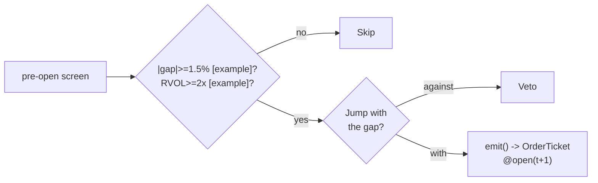

# T018 — RVOL-Gated Gap-and-Go

> **Reviewer card.** Gap-and-go momentum: funded overnight gaps (S035 + S052) continue intraday as the information is digested; the jump filter (S053) vetoes gaps where the jump goes against the direction. Provenance **[D]**.
>
> Edge verdict: **NO-DOCUMENTED-EDGE** — no citable gap-and-go P&L found in the reviewed literature — the continuation anecdote is practitioner, not published [documented].
>
> After-cost: **BEFORE-COST** — one-sentence verdict: the gap-and-go is practitioner lore with no published P&L — the RVOL gate is what makes it testable.
>
> Tier **S** · prototype 20–40 h [example] · loaded cost $3,000–6,000 [example] · latency bar / open + 5-min · risk medium (gap continuation failure).

> Capacity $1–5M/day notional [example] — funded gap names × a few thousand shares · Executability: Feasible: overnight-gap screen + 5-min continuation machine; any retail platform.

## §1  Identity & provenance

This module is a **strategy**: it emits `OrderTicket` intentions only — brokers create orders, strategies never do. Family **D  # breakout / session-pattern**, batch **TB4**, provenance **D**.

**Lede.** Gap-and-go momentum: funded overnight gaps (S035 + S052) continue intraday as the information is digested; the jump filter (S053) vetoes gaps where the jump goes against the direction. Provenance **[D]**.

**When it dies.** Unfunded gaps (RVOL gate exists for this); the gap fills by `10:00` [example]; crowded gap-chasing.

**Regime gates (provisional).** R001 elevated RV amplifies (funded gaps run); earnings season degrades.

**Prototype scope.** gap screen + RVOL confirm + jump filter + 5-min continuation + kill-switch.

## §1.5  Escalation gate

Cheapest viable path: **Massive Stocks Starter** — daily + 5-min OHLCV bars at $29/mo [documented — vendor pricing page https://massive.com/stocks-data, fetched 2026-09-11]. Advanced ($199/mo) [documented — vendor pricing page https://massive.com/stocks-data, fetched 2026-09-11] for real-time; Developer ($79/mo) is still 15-min delayed. Prototype band: **$29–199/mo** [documented — vendor pricing page https://massive.com/stocks-data, fetched 2026-09-11]. News flags remain an unresolved dataset (see GROK-NEEDED question 1) [unverified]; build the screen and continuation machine on a cheap bar feed; buy nothing else.

Resource budget: `1` core, `<1` GB RAM [internal-est] [internal-est] · compute pattern `per_bar`.

Explicitly out of scope (phase two): gap fade (see T012); earnings gaps (phase `2` [default]).

Escalation gate: news-feed integration beyond flags [default]; 5-min bar latency `>60` s [default] — crossing it requires re-review of §T7 and §T8.

## §T0  Contract — strategies emit intentions, brokers create orders

This strategy's sole output is a list of `OrderTicket` intentions. It never places, routes, or confirms an order. Every ticket carries `parent_signal` (the upstream signal id and its `computed_at`), an `intent_ts`, and a `tif`. The backtest harness fills tickets strictly after the signal bar (`fill_event > signal_event`, t->t+1 causality); any fill timestamped at or before its signal bar is a harness bug and trips the kill switch.

**Typed signature.**

```python
def emit(state: ModuleState, signals: SignalSet, bars: list[Bar], cfg: Config) -> list[OrderTicket]:
    """Core function. Signals = {S035, S052, S053} latest values; bars = 5-min
    bars labeled by open time, newest last; cfg = validated Config. Returns
    order-intent tickets only. Never raises: invalid input -> module_state UNKNOWN."""
```

**Config dataclass.** Every parameter carries type, default, range, and status (∈ {fixed, default, calibrate, example, internal-est}):

| Parameter | Type | Default | Range | Status |
|---|---|---|---|---|
| `gap_min` | float | `0.015` | `0.005–0.05` | default |
| `rvol_gap_min` | float | `2.0` | `1.0–5.0` | default |
| `target_mult` | float | `1.0` | `0.5–3.0` | default |
| `stop_dollars` | float | `0.40` | `0.05–1.5` | default |
| `time_stop_min` | float | `60.0` | `15–240` | default |
| `cooldown_s` | float | `600.0` | `0–3,600` | default |
| `cost_gate_k` | float | `0.5` | `0.1–2.0` | default |

**OrderTicket (emitted schema).**

| Field | Type | Notes |
|---|---|---|
| `ticket_id` | str | unique per emit run |
| `module_id` | str | `"T018"`, version pin `1.0.1` |
| `symbol` | str | identifier from the bar feed |
| `side` | enum | `BUY` (ride gap up) / `SELL` (ride gap down / short — C7 locate) |
| `qty` | int | from `size_fn` in §T3 |
| `limit_px` | float | next-bar open estimate; fill strictly after signal bar (C4) |
| `tif` | str | `DAY` |
| `intent_ts` | int64 ns | when emit() produced the ticket |
| `parent_signal` | str | e.g. `"S035@<computed_at ns>"` |
| `params_hash` / `inputs_hash` | str | for the decision log (C5) |
| `cost_gate_result` | float | `expected_cost_bps(...) / (k * edge_bps)` — must be `<= 1.0` (C3) |

**Time contract.**

- Clock domain: exchange wall clock, `America/New_York`; canonical timestamp int64 ns UTC.
- Bars labeled by **open time**; `event_ts` (when the market event happened) and `asof_ts` (when we observed it) are both recorded.
- Max clock skew (local vs exchange): `50` ms [default] — breach trips the kill switch.
- Max input skew: `5` s [default]; jitter budget `30` s [default]; staleness TTL `90` s [default].
- Gap policy: **no interpolation across gaps** — missing bars → `UNKNOWN`, never filled forward.
- Live/simulated: this contract applies to both; paper mode replays the same bars.

**Market-state table.**

| State | Emit policy |
|---|---|
| `CONTINUOUS_TRADING` | normal emit |
| `HALTED` | no tickets (C16); open tickets flagged for broker cancel |
| `AUCTION` (open/close) | no new tickets; fills only at broker-confirmed auction price |
| `CLOSED` | no tickets; pre-open screen runs in `CLOSED`→pre-open for gap detection only |

**Module-state enum.** `OK | DEGRADED | UNKNOWN | OFF`. Invalid input (non-finite gap/RVOL, stale inputs, cross-market-state) → `UNKNOWN`, never interpolated (F1). `OFF` = kill switch tripped or manually disabled.

**Risk contract (fenced YAML).**

```yaml
risk_contract_T018:
    per_trade_R: 300.0            # [example] dollars risked per trade
    daily_loss_stop: -1500.0      # [example] dollars; then dark for the day
    max_gross: 600000.0           # [example] dollars notional
    max_adverse_per_trade: "1.5x stop [default]"
    enforcement: "intraday-hard"
    kill_conditions: ["2 consecutive gap fills [example]", "feed heartbeat missed > 2 s [example]", "clock skew > 50 ms [default]", "4 concurrent gap rides [example]"]
    calibration_recipe: "paper-trade 30 sessions [default]; gap screen on 250-day history [default]; re-pin fee schedule monthly [default]"
```

**Kill-switch state machine: `ARMED → TRIPPED → RECOVERY → ARMED`.** Re-arm checklist lives in §T7; the per-module test drives the full transition cycle.

**Ops tail.**

| Item | Detail |
|---|---|
| Schedule | Pre-open gap screen (`08:30` ET [example]); entries `09:35`–`11:00` ET [example]; flat by `12:00` ET [example]; no overnight carry |
| Health checks | fixture replay (`test_cmd`) green on deploy; feed-heartbeat watchdog (`>2` s [example] → trip); seq-gap monitor; staleness watchdog at `90` s TTL |
| Alerts | page on kill-switch trip; notify on input-failure veto (see §T2 table); log on gate skips |
| Resource budget | `1` vCPU, `1` GB RAM [internal-est] [internal-est] |
| Runbook stub | trip → flatten per exit rule → confirm flat → root-cause checklist (feed? clock? gap-fill regime?) → §T7 re-arm |
| Secrets | env-only: `POLYGON_API_KEY` (Gate-grepped; never in files) |

State variables carried between bars: `gap_pct`, `rvol_gap`, `jump_flag`, `cooldown_until`, `position`, `module_state`.

## §T1  Strategy thesis & edge

**Thesis.** Gap-and-go momentum: funded overnight gaps (S035 + S052) continue intraday as the information is digested; the jump filter (S053) vetoes gaps where the jump goes against the direction. Provenance **[D]**.

**Edge verdict: NO-DOCUMENTED-EDGE** — no citable gap-and-go P&L found in the reviewed literature — the continuation anecdote is practitioner, not published [documented].

**After-cost verdict: BEFORE-COST** — one-sentence verdict: the gap-and-go is practitioner lore with no published P&L — the RVOL gate is what makes it testable.

**Risk summary.** Gap fill (the go becomes a fade); information exhaustion; open-auction spread.

**Math.**

```text
Overnight gap `g = (O_t − C_{t-1})/C_{t-1}`; go candidate `|g| ≥
1.5`% [example]. Gap RVOL `rvol_gap ≥ 2.0`× [example] vs `20`-day same-slot
volume (S052). Jump test on the gap bar (S053); jumps against the direction
veto. Modeled edge `edge_bps = |g| × 1e4 × 0.4` [example] (continuation
fraction, conservative).
```

**Pseudocode (normative — prose is commentary, this block is the spec).**

```text
function edge_bps(g) -> float:
    return abs(g) * 1e4 * 0.4                      # [example] continuation fraction

function size_fn(risk_budget_R, stop_distance, vol_estimate, ADV_cap, cost) -> int:
    n = risk_budget_R / max(stop_distance, 1e-9)   # [default] floor below
    n = min(n, ADV_cap * 0.005)                   # 0.5% ADV [default]
    n = min(n * 50.0, 600000.0) / 50.0           # $600k gross cap [default]
    return int(n)                                  # vol_estimate, cost: reserved args (contract fenced)

function exit_trigger(bar, state, cfg) -> (bool, reason):
    if bar.close >= state.target_px:        return (True, "target 1×gap")
    if bar.close <= state.stop_px:          return (True, "stop -$0.40 [default]")
    if bar.close <= state.gap_fill_px:      return (True, "gap fills 50% → stop")
    if state.bars_held >= cfg.time_stop_min / 5: return (True, "time stop 60 min [default]")
    if bar.bar_open_ts >= 12:00 ET:         return (True, "session flatten 12:00")
    if state.module_state != OK:            return (True, "module_state != OK")
    return (False, "")

function build_ticket(side, qty, limit_px, parent_signal, k, edge, cost, cfg) -> OrderTicket:
    assert cost <= k * edge, "C3: ticket impossible when gate fails"   # normative predicate
    tk = OrderTicket(ticket_id=uuid(), module_id="T018", symbol=..., side=side,
                     qty=qty, limit_px=limit_px, tif="DAY", intent_ts=now_ns(),
                     parent_signal=parent_signal, params_hash=hash(cfg),
                     inputs_hash=hash(signals), cost_gate_result=cost/(k*edge))
    log_decision(tk, inputs_hash, params_hash)                         # C5
    return tk

function flatten_ticket(state) -> OrderTicket:
    return build_ticket(side=opposite(state.position_side), qty=abs(state.position),
                        limit_px=open(t+1), parent_signal="exit:" + state.exit_reason, ...)

function emit(state, signals, bars, cfg) -> list[OrderTicket]:
    assert bars non-empty else return UNKNOWN                       # F1
    if state.module_state == OFF: return []                        # kill switch tripped
    t = bars[-1]   # newest 5-min bar, labeled by open time
    g  = signals['S035'].gap_pct
    rv = signals['S052'].rvol_gap
    jp = signals['S053'].jump_against
    assert isfinite(g) and isfinite(rv) else return UNKNOWN         # F2
    if stale(signals): return UNKNOWN                              # C6: TTL 90 s [default]
    if jp: return []                                               # C12 veto

    edge = edge_bps(g)
    cost = expected_cost_bps(notional, adv_pct, venue, side, urgency)  # §T5 callable
    cost_ok = cost <= cfg.cost_gate_k * edge
    # ^^^ normative cost-gate predicate: expected_cost_bps(...) <= k * edge_bps (C3)

    tickets = []
    if state.position == 0 and cost_ok and t.event_ts >= state.cooldown_until:
        if abs(g) >= cfg.gap_min and rv >= cfg.rvol_gap_min:
            side = 'BUY' if g > 0 else 'SELL'   # ride the gap; SELL requires locate_ok (C7)
            if side == 'SELL' and not locate_ok(symbol): return []   # C7
            tickets = [build_ticket(side, size_fn(...), limit_px=open(t+1),
                                    parent_signal=f"S035@{t.bar_open_ts}", ...)]
    else:
        (hit, reason) = exit_trigger(t, state, cfg)
        if hit or state.position != 0:
            tickets = [flatten_ticket(state)]
            state.cooldown_until = t.event_ts + cfg.cooldown_s * 1e9   # C8
    assert fill.event_ts > t.bar_close_ts for any fill             # t->t+1 causality
    assert no fill is timestamped at or before the signal bar      # no-signal-bar-fills
    return tickets
```

**Child-order note (broker downstream).** The broker owns the child-order state machine `INTENT_ACCEPTED → WORKING → {FILLED, PARTIAL, CANCELLED}`; the strategy never tracks child orders. Partial-fill policy (see §T6): partial fills update the position; the remainder works until the exit rule fires; an exit ticket cancels/replaces any working remainder.

## §T2  Signal stack — dependencies & data rights

> **Timing box.** `signal@t (5-min bar, America/New_York) → earliest fill @open(t+1)`. A signal computed on the bar that closes at time `t` may first be filled at the open of bar `t+1` — never inside bar `t` (C4).

| Signal | Role | Contract |
|---|---|---|
| `S035` | trigger | overnight gap >= +1.5% [example] in the direction of the intended trade |
| `S052` | confirm | RVOL(gap) >= 2.0× [example] — the gap must be funded to be ridden |
| `S053` | veto | no trade if a jump is detected against the gap direction; jumps with the gap are the fuel |

Max dependency depth: `2` [default].

**Schema mapping (canonical).**

| Vendor (Polygon.io Stocks) | Canonical |
|---|---|
| `t` (ms) | `bar_open_ts` (int64 ns UTC; bar labeled by open time) |
| `o, h, l, c` | `open, high, low, close` |
| `v` | `volume` |

Staleness: max skew `5` s [default] · jitter budget `30` s [default] · TTL `90` s [default] · cadence `per_bar (open + 5-min)` · tz `America/New_York`.

**Inputs that break the module.**

| Input failure | Module state | Alert |
|---|---|---|
| Gap < 1.5% (gate) [example] | `DEGRADED` (skip name) | log |
| RVOL(gap) < 2.0× (gate) [example] | `DEGRADED` (skip name — unfunded) | log |
| Jump against the gap direction (gate) | `DEGRADED` (veto) | notify |

**Data rights.** US equities bars via Polygon.io Stocks, `rights: licensed`;
research + production; fixtures synthetic; entitlement = professional/internal;
derived features ours. Entitlement-class change → §1.5 escalation gate.

**Build vs buy.** Build the screen and continuation machine on a cheap bar feed;
buy nothing — the RVOL gate is the IP.

**Local build.** Feasible. The gap screen is a pre-open sort; the continuation
machine is a 5-minute state machine.

**Data dictionary (canonical fields).**

| Field | Type | Cadence | Tier | Notes |
|---|---|---|---|---|
| `Daily OHLCV bars` | float/int | daily | Tier 1 | gap computation |
| `5-min OHLCV bars` | float/int | 5-min | Tier 1 | continuation timing |
| `News flags` | reference | per event | Tier 2 | S035 context; vendor unresolved [unverified] |
| `20-day same-slot volume` | float | per slot | Tier 1 | S052 RVOL |

## §T3  Entry / exit / sizing & worked example

**Entry rule.**

```text
ENTER_GO := (|gap| >= gap_min) AND (rvol_gap >= rvol_gap_min)
               AND (no jump against) AND (expected_cost_bps(...) <= cost_gate_k * edge_bps)
               direction := with the gap
FLAT := otherwise
```

**Exit rule.**

```text
EXIT := (target: gap × target_mult extension [example]) [continuation]
        OR (bars_held >= time_stop_min) OR (price stop -$stop_dollars) [stop]
        OR (gap fills 50% → stop) OR (t >= 12:00) [session flatten]
        OR (module_state != OK)
```

**Cooldown.** `600` s [default] after every exit (C8).

**Sizing function (normative).**

```python
def shares(risk_budget_R, stop_distance, vol_estimate, ADV_cap, cost):
    # risk_budget_R in $, stop_distance in $/share (example price stop $0.40)
    n = risk_budget_R / max(stop_distance, 1e-9)   # [default] floor below
    n = min(n, ADV_cap * 0.005)                   # 0.5% ADV [default]
    n = min(n * 50.0, 600000.0) / 50.0           # $600k gross cap [default]
    return int(n)
```

**Risk limits.**

| Limit | Value |
|---|---|
| Daily loss stop | `-$1,500` [example] → dark for the day |
| Max concurrent gap rides | `4` [example] |
| Gap-fill kill | `2` consecutive [example] → stand down |
| Post-exit cooldown | `600` s [default] — C8 |

**Worked example — SYNTHETIC fixture (from `fixtures/T018_tape.csv` trade 1; prices, quantities, and P&L are invented validation numbers, not market data).**

Trade 1: `BUY` `750` shares [example] @ `50.9` [example], exit `51.9` [example] (`target 1×gap`). Gross P&L = `750.00` [measured from fixture] dollars. Cost stack = `18.0` bps [example] → `68.72` [measured from fixture] dollars on `38175.00` [example] notional. Net = `681.28` [measured from fixture] dollars. The fixture's expected CSV carries the same arithmetic for all six trades; the per-module test recomputes it from the tape and asserts equality.

**Flow.**



## §T4  Parameters

| Parameter | Key | Default | Provenance | Sensitivity |
|---|---|---|---|---|
| Gap minimum | `gap_min` | `1.5`% | [default] | high |
| Gap RVOL min | `rvol_gap_min` | `2.0`× | [default] | high |
| Target multiple | `target_mult` | `1.0`× gap | [default] | medium |
| Price stop | `stop_dollars` | `$0.40` | [default] | high |
| Time stop | `time_stop_min` | `60` min | [default] | medium |
| Post-exit cooldown | `cooldown_s` | `600` s | [default] | low |
| Cost-gate k | `cost_gate_k` | `0.5` | [default] | high |

## §T5  Costs — the callable is the single source of truth

| Component | bps | Basis |
|---|---|---|
| Spread | `10.0` | [example] $0.025 assumed spread at the open at $50: half-spread per aggressive leg × 2 legs |
| Fees | `2.0` | [example] $0.005/share each way at $50 = 1 bps/leg |
| Borrow | `0.0` | [example] intraday-only build accrues no borrow day; hard-to-borrow or carried shorts add C7 explicitly |
| Impact | `6.0` | [example] chasing the gap — 3¢ adverse on a $50 name |
| **Total** | `18.0` | [example] reference stack |

Fee schedule as of `2026-09-01` [example] (reference date used in fixtures; the stack is an example, not a quoted venue schedule) · venue `XNAS / SIP 5-min bars [example]` · side `taker` · borrow `0.0` bps/day [example] — reason: reference build rides the gap intraday-only (entries `09:35`–`11:00` ET, flat by `12:00` ET), so no borrow day accrues; the short variant models borrow explicitly (C7).

```python
def expected_cost_bps(notional, adv_pct, venue, side, urgency) -> float:
    """Callable cost model - T018 COST block (single source of truth)."""
    spread_bps = 10.0   # [example] $0.025 assumed spread @ open @ $50: half/aggressive x 2
    fee_bps = 2.0       # [example] $0.005/share each way @ $50 = 1 bps/leg
    borrow_bps = 0.0    # [example] intraday-only; shorts add C7
    impact_bps = 6.0    # [example] chasing the gap: 3c adverse @ $50
    return spread_bps + fee_bps + borrow_bps + impact_bps
```

This callable is the **single source of truth** for cost: the front-matter `cost_model` mirrors it at v1.0.2, and the fixture tape's per-trade component columns are the callable's evaluated inputs. No other section re-states cost numbers.

**Normative cost-gate predicate (C3):** `expected_cost_bps(...) <= k * edge_bps` — no ticket is emitted unless the callable cost clears this gate. The predicate appears verbatim in the §T1 pseudocode and is asserted by the per-module test.

## §T6  Execution assumptions

| Aspect | Assumption |
|---|---|
| Latency | open + 5-min bar evaluation; fill at next-bar open |
| Partial fills | oldest `intent_ts` first (FIFO) |
| Impact | `6` bps modeled [example] — chasing the gap costs |
| Adverse fill | the gap fills — the RVOL gate and the fill-stop are the controls |

**Fill model (harness).**

| Aspect | Model |
|---|---|
| Fill price | next-bar open, minus `6` bps adverse [example] for taker urgency |
| Fill timing | `fill_event = open(t+1)` strictly after the signal bar (C4; asserted in §T1 pseudocode and the per-module test) |
| Partial fills | oldest `intent_ts` first (FIFO); partial fills update `state.position`; the working remainder stays open until the exit rule fires, at which point the exit ticket cancels/replaces the remainder |
| Child-order state machine (broker) | `INTENT_ACCEPTED → WORKING → {FILLED, PARTIAL, CANCELLED}`; the strategy never observes or mutates child-order state |
| Cancel-replace | only the exit rule may cancel/replace a working ticket; no discretionary replace |
| Auction/open | no new tickets in auction states (see §T0 market-state table) |

**What the strategy never does (doctrine).** No order creation, routing, or confirmation; no child-order tracking; no broker-state mutation; no interpolation of partial fills into phantom fills.

## §T7  Risk contract & kill switch

Per-trade R: `$300` [example] per trade · daily loss stop: `- $1,500` [example] then dark for the day · max gross: `$600k` notional [example] · max adverse per trade: `1.5`x stop [default].

Enforcement: `intraday-hard` [default]. Calibration recipe: paper-trade `30` sessions [default]; gap screen on `250`-day history [default]; re-pin fee schedule monthly [default].

The fenced YAML risk contract lives in §T0 (single source of truth).

**Kill switch: `ARMED` → `TRIPPED` → `RECOVERY` → `ARMED`.**

Trip conditions:

- 2 consecutive gap fills [example]
- feed heartbeat missed > 2 s [example]
- clock skew > 50 ms [default]
- 4 concurrent gap rides [example]

On trip: the module stops emitting tickets immediately (`emit()` returns `[]` in `OFF` state), flattens managed positions per the exit rule, and pages. `RECOVERY` requires manual review, cooldown expiry, and healthy feeds; only then does the module return to `ARMED`. The per-module test drives the full transition cycle.

**Re-arm checklist (all must be true before `RECOVERY → ARMED`).**

1. Root cause of the trip identified and logged.
2. Post-trip cooldown expired (`600` s [default]).
3. Feed heartbeat healthy (`<2` s gap [example]) for the last `5` min [default].
4. Clock skew within `50` ms [default].
5. All managed positions confirmed flat (broker reconciliation).
6. Human sign-off recorded in the decision log.

**Ops.** Schedule: Pre-open gap screen (`08:30` ET [example]); entries `09:35`–`11:00` ET [example]; flat by `12:00` ET [example]; no overnight carry · budget: `1` vCPU, `1` GB RAM [internal-est] [internal-est] · env: `POLYGON_API_KEY`.

**Universe.** US equities, price > `$10` [example], ADV > `1`M shares [example]. Screen:
overnight gap ≥ `+1.5`% [example], RVOL(gap) ≥ `2.0`× [example], no jump
against the direction. Entries `09:35`–`11:00` [example]. Exclude: earnings days, halts.

## §T8  Compliance (C1–C19)

- **C1** | No orders: the strategy emits `OrderTicket` intentions only; the broker creates orders.
- **C2** | Kill switch: `ARMED` → `TRIPPED` → `RECOVERY` → `ARMED` on the trip conditions in §T7.
- **C3** | Cost gate: `expected_cost_bps(...) <= k * edge_bps` before any ticket (see §T5).
- **C4** | Causality: `fill_event > signal_event` (t->t+1); no signal-bar fills, ever.
- **C5** | Decision log: every ticket logged with inputs hash and params hash (schema below).
- **C6** | Staleness: inputs older than the TTL → `UNKNOWN`, no tickets.
- **C7** | Short discipline: `locate_ok` required before any short ticket.
- **C8** | Cooldown: post-exit cooldown enforced in seconds; no re-entry inside it.
- **C9** | Session flatten: no uncommanded overnight carry.
- **C10** | Position caps: per-trade R, daily loss stop, and max gross enforced.
- **C11 | Gap-fill kill: trigger = `2` consecutive gap fills [example] → check = gap P&L → action = stand down → log = `COMPLIANCE_BLOCK`**
- **C12 | Jump veto: trigger = jump against the gap direction → check = S053 → action = veto → log = `GATE_VETO`**
- **C13** | Bona-fide intent: every ticket carries a documented entry/exit rationale; no exploratory or test tickets outside a designated sandbox.
- **C14** | Self-trade prevention: the broker must reject self-matches where our resting flow exists; venue drop-copies reconciled daily.
- **C15** | Pre-trade fat-finger trio: price collar ±`5`% [example] of reference, notional ≤ max_gross, quantity ≤ `0.5`% ADV [default] — any breach blocks the ticket before emit.
- **C16** | Halt/auction: no tickets while market state ≠ `CONTINUOUS_TRADING` (see §T0 market-state table).
- **C17** | Data entitlements: production runs assert the licensed entitlement class for Polygon.io Stocks at startup; class change → §1.5 escalation gate.
- **C18** | Message rate: ticket emit rate capped at `10`/min [example]; cancel-replace bursts bounded.
- **C19** | Public dissemination: no order-flow, position, or P&L data is published or shared; research fixtures are synthetic.

**Decision-log schema (C5).** One record per emitted ticket, append-only:

| Field | Type | Notes |
|---|---|---|
| `log_ts` | int64 ns | when logged |
| `ticket_id` | str | links to the ticket |
| `module_id` | str | `"T018"`, version pin `1.0.1` |
| `side`, `qty`, `limit_px` | enum/int/float | ticket content |
| `parent_signal` | str | e.g. `"S035@<computed_at ns>"` |
| `inputs_hash` | str | hash of the consumed signal values + bar ids |
| `params_hash` | str | hash of the validated Config |
| `cost_gate_result` | float | `expected_cost_bps(...) / (k * edge_bps)` |
| `event` | enum | `EMIT | GATE_VETO | COMPLIANCE_BLOCK | TRIP | REARM` |

## §T9  Evidence, failures & regime gates

**Evidence (cost-level tokens; every statistic tagged).**

| Source | Sample | Finding | Cost level | Caveat |
|---|---|---|---|---|
| Barndorff-Nielsen & Shephard (2006) [documented] | (methodological) | bipower variation jump test [documented] | `BEFORE-COST` (method) | the jump filter's econometric basis |
| Taylor (2011) [documented] | (context) | time-varying price discovery; information-asymmetry measures [documented] | `BEFORE-COST` (context) | price-discovery context only; no overnight-gap figures |
| Overnight-gap practitioner literature [unverified] | — | gap-continuation anecdote; no citable P&L | `BEFORE-COST` | practitioner pattern, not a published result — see §T10 |

**Where this module is known to fail.** gap fills, information exhaustion, crowded gap-chasing, open-auction spread blowouts.

**Failure modes (detect → action → recovery).**

| # | Failure | Detect → action → recovery | Executable check |
|---|---|---|---|
| 1 | Gap fills | detect: `2` consecutive [example] → action: stand down (C11) → recovery: next session [default] | `gap_fills < 2` |
| 2 | Unfunded gap | detect: RVOL < `2.0`× [example] → action: skip (gate) → recovery: next session [default] | `rvol_gap >= 2.0` |
| 3 | Jump against | detect: S053 → action: veto (C12) → recovery: next session [default] | `not jump_against` |
| 4 | Cost blowup | detect: cost gate failing → action: stand down → recovery: re-pin [default] | `expected_cost_bps(...) <= k * edge_bps` |
| 5 | Lookahead in gap screen | detect: screen uses future → action: halt, fix → recovery: no-signal-bar-fills test [default] | `all(fill_ts > signal_ts)` |

**Regime gates (machine records; R001 ids provisional).**

| Regime | Direction | Mechanism | Condition | Action | Min lag | Unknown behavior |
|---|---|---|---|---|---|---|
| R001 | amplifies | elevated RV: funded gaps run | rv_pctile > 70 [default] | widen_target | 1 bar [default] | veto |
| R001 | degrades | extreme RV: gaps fill | rv_pctile > 95 [default] | pause_entry | 1 bar [default] | veto |
| R-earn | degrades | earnings season | calendar flag [default] | veto | 0 [default] | veto |

**Robustness.** The RVOL gate is the strategy: `rvol_gap_min` in `1.5`–`3`× [default]
[example] separates funded from unfunded gaps. `gap_min` in `1`–`2.5`%
[example] is the frequency surface. Purged/embargoed OOS per S088.

**What the optimistic case assumes (and we do not).** (1) the gap is assumed to continue — the RVOL gate is imperfect;
(2) open-auction spread fixed at `2.5`¢ [example]; (3) chasing slippage `6`
bps [example] — flagged as the honest cost of momentum.

## §T10  Unverified leads & what would change our mind

**Source log (verified 2026-09-10 unless noted).**

- Taylor, N. (2011). "Time-varying price discovery in fragmented markets." Applied Financial Economics 21(10): 717-734. DOI 10.1080/09603107.2010.535784 [documented] — verified via RePEc/IDEAS. Used for price-discovery context only; contains no overnight-gap or gap-and-go figures.
- Barndorff-Nielsen, O. E. & Shephard, N. (2006). "Econometrics of Testing for Jumps in Financial Economics Using Bipower Variation." J. Financial Econometrics 4(1): 1-30 [documented] — verified via Shephard's publications page. Econometric basis of the S053-style bipower-variation jump test. Note: the v1.0.0 file cited "J. Econometrics 131(1-2): 217-252"; that belongs to their *different* 2006 paper ("Impact of jumps on returns and realised variances") — corrected in v1.0.1.
- Massive Stocks pricing tiers — vendor pricing page https://massive.com/stocks-data, fetched 2026-09-11 [documented — vendor pricing page https://massive.com/stocks-data, fetched 2026-09-11]: Starter $29/mo, Developer $79/mo, Advanced $199/mo. Corrects the third-party docs ($99 Developer) and resolves the real-time-tier dispute: per the vendor FAQ, only Advanced and Business are real-time; Starter and Developer are 15-min delayed. Rebrand Polygon.io → Massive verified via EIN Presswire (2025-10-30).

**Unverified leads.**

- Gap-and-go P&L claims from practitioner forums — no citable published P&L found; not promoted.
- Whether any published walk-forward with full costs exists for RVOL-gated gap continuation (see GROK-NEEDED question 2).

What would change our mind: a purged/embargoed walk-forward with full costs that survives the S088 honesty protocol; a documented after-cost P&L from the cited authors' own implementations; or a regime-gated replication that holds outside the original sample.

## AI build prompt

```text
Build the T018 (RVOL-Gated Gap-and-Go) strategy module from this specification (v1.0.2).
Hard constraints:
- The strategy emits OrderTicket intentions ONLY; it never creates orders (C1).
- Causality: fill_event > signal_event (t->t+1); no signal-bar fills (C4).
- Cost gate: expected_cost_bps(...) <= k * edge_bps before any ticket (C3).
- Kill switch ARMED -> TRIPPED -> RECOVERY -> ARMED on the §T7 trip conditions (C2).
- Every numeric literal in prose carries an honesty tag [documented]/[measured]/[example]/[unverified]/[default]/[internal-est]; exempt identifiers only.
- Sources must be real and cited with cost-level tokens; chatbot-only material goes to §T10.
- Fixed-wording timing box: signal@t (5-min bar, America/New_York) -> earliest fill @open(t+1).
- Compliance C1–C19 incl. decision-log schema (§T8), pre-trade fat-finger trio, halt/auction table, message-rate cap, entitlement assertions.
Config surface (all status=default):
- gap_min (float): default 0.015, range 0.005–0.05
- rvol_gap_min (float): default 2.0, range 1.0–5.0
- target_mult (float): default 1.0, range 0.5–3.0
- stop_dollars (float): default 0.40, range 0.05–1.5
- time_stop_min (float): default 60.0, range 15–240
- cooldown_s (float): default 600.0, range 0–3,600
- cost_gate_k (float): default 0.5, range 0.1–2.0
Entry rule:
ENTER_GO := (|gap| >= gap_min) AND (rvol_gap >= rvol_gap_min)
               AND (no jump against) AND (expected_cost_bps(...) <= cost_gate_k * edge_bps)
               direction := with the gap
FLAT := otherwise
Exit rule:
EXIT := (target: gap × target_mult extension [example]) [continuation]
        OR (bars_held >= time_stop_min) OR (price stop -$stop_dollars) [stop]
        OR (gap fills 50% → stop) OR (t >= 12:00) [session flatten]
        OR (module_state != OK)
Sizing: implement the §T3 sizing_fn verbatim; enforce the §T7 risk contract and the §T0 fenced YAML risk contract.
Deliverables: the module markdown (all sections §1–§T10), the fixture tape CSV
(fixtures/T018_tape.csv), the expected CSV (fixtures/T018_expected.csv), and
the per-module test (modules/tests/test_T018.py) covering fixture arithmetic,
causality, the cost gate, the kill-switch cycle (incl. TRIPPED emits nothing),
invalid→UNKNOWN, and the callable signature.
```

**GROK-NEEDED** (expert questions web search could not resolve — do not answer from priors):

1. "For quant module T018 (RVOL-gated gap-and-go, US equities): which data vendor/product is the cheapest production-grade source of per-event news flags (corporate news, halt notices) that can gate an overnight-gap screen, and what is its current price band and schema? A good answer names the vendor + product + plan, the monthly cost band (as-of date), the news-flag fields available, and the latency class."
2. "For quant module T018 (RVOL-gated gap-and-go, US equities): is there any published walk-forward backtest with a full cost stack (spread + fees + impact) of an RVOL-gated or volume-gated gap-continuation strategy, and if so what are the after-cost results? A good answer cites the paper/thesis (title, authors, year), the sample period, the cost stack used, and the headline after-cost metric — or confirms none exists."
3. [RESOLVED 2026-09-11 by direct vendor-page verification — no Grok lookup needed] Real-time (undelayed) 5-min SIP aggregates require **Stocks Advanced at $199/mo** (real-time, 20+ yr history, unlimited API calls) per https://massive.com/stocks-data, fetched 2026-09-11. Developer ($79/mo) is 15-min delayed — the earlier third-party claim that Developer ($99/mo) was real-time was wrong on both price and latency.
4. "For quant module T018 (intraday short continuation trades, e.g. riding a gap-down): what is a defensible model for intraday borrow cost in bps for easy-to-borrow vs hard-to-borrow US equities, and which published or vendor source documents it? A good answer gives the borrow_bps_per_day convention, the easy/hard-to-borrow split, and a citable source (vendor fee schedule or paper) with an as-of date."
---
