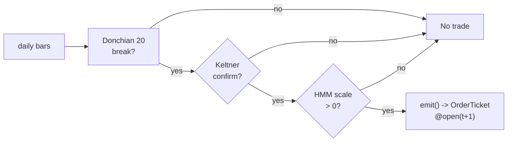

# T019 — Donchian/Keltner Breakout + Vol Sizing

> **Reviewer card.** Classic trend breakout (Turtle): `20`-day Donchian channel breaks (S022) confirmed by Keltner/ATR expansion (S023), sized by volatility (S079); the vol-regime gate scales the classic `1`%-risk unit [default]. Provenance **[P]**.
>
> Edge verdict: **AFTER-COST-EDGE** — Hurst et al.: composite `7.3`% annualized excess return at `10`% vol target (≈`0.73` implied Sharpe) across a century of futures [documented]; the Turtle 20/55-day rules are practitioner — this module ports the geometry to equities with vol sizing.
>
> After-cost: **BEFORE-COST** — the century of trend evidence is futures, not single-name equities — the equity port is the unproven claim.
>
> Emits: `OrderTicket` intentions only (never orders) · Tier **S** · prototype 20–40 h [example] · loaded cost $3,000–6,000 [example] · data $0–79/mo [documented] · latency bar / daily · risk medium (trend breakouts, whipsaw).
>
> Capacity $5–50M/day notional [example] — daily bars, diversified names; vol sizing scales · Executability: Feasible: Donchian/Keltner state machine on daily bars; any retail platform.

## §1  Identity & provenance

This module is a **strategy**: it emits `OrderTicket` intentions only — brokers create orders, strategies never do. Family **D  # breakout / session-pattern**, batch **TB4**, provenance **P**.

**Lede.** Classic trend breakout (Turtle): `20`-day Donchian channel breaks (S022) confirmed by Keltner/ATR expansion (S023), sized by volatility (S079); the vol-regime gate scales the classic `1`%-risk unit [default]. Provenance **[P]**.

**When it dies.** Range-bound regimes; P(vol) ≥ `0.80` [example]; crowded breakout levels; the Keltner confirm lagging the break.

**Regime gates (provisional).** R001 elevated RV degrades (breakouts fail); halted names excluded; see the machine records in §T5.

**Prototype scope.** Donchian/Keltner machine + ATR sizing + HMM gate + kill-switch.

## §1.5  Escalation gate

**Cheapest viable path.** Build the channel machine on a cheap daily-bar feed; buy nothing — the vol sizing is the IP.

**Cheapest-source row** (structured).

| Field | Value |
|---|---|
| `min_tier` | free tier (`5` req/min [documented]) for prototype; paid entry for backfill [documented] |
| `latency_class` | end-of-day / daily |
| `required_fields` | daily OHLCV bars (`t,o,h,l,c,v`) |
| `price_band` | `$0`/mo free; `$29`–`$79`/mo paid entry/professional [documented] |
| `build_or_buy` | buy the bar feed; build the Donchian/Keltner/HMM machine |

Price-band basis [documented — vendor pricing page https://massive.com/stocks-data, fetched 2026-09-11]: Massive Stocks Starter $29/mo (15-min delayed, 5-yr history), Developer $79/mo (15-min delayed, 10-yr history), Advanced $199/mo (real-time, 20+ yr history); free Basic $0/mo (EOD, 2-yr history, 5 calls/min). (The "Professional ~$79" tier name from third-party comparisons was the Developer tier at $79/mo.)

**Resource budget.** `1` core, `<1` GB RAM [internal-est] · compute pattern `per_bar` · schedule: evaluate at daily close; fills at next-day open.

**Skip list (phase 1).** 55-day System 2; futures port; portfolio heat beyond `6` units [default]; intraday breakout; limit-order queue modeling.

**DO-NOT-CUT list.** t→t+1 causality assertions; the §T2 COST block + cost-gate predicate; kill-switch state machine; decision audit log; bona-fide-intent + self-trade prevention (C1); honesty tags on every numeric literal; fixture tape + expected CSV + per-module test; secrets via env only.

**Escalation gate.** Universe beyond US equities [default]; intraday breakout (phase 2) — crossing either requires re-review of §T7 and §T8.

## §T0  Contract — strategies emit intentions, brokers create orders

This strategy's sole output is a list of `OrderTicket` intentions. It never places, routes, or confirms an order. Every ticket carries `parent_signal` (the upstream signal id and its `computed_at`), an `intent_ts`, and a `tif`. The backtest harness fills tickets strictly after the signal bar (`fill_event > signal_event`, t→t+1 causality); any fill timestamped at or before its signal bar is a harness bug and trips the kill switch.

**Typed signature.**

```python
def emit(state: ModuleState, events: BarEvents, cfg: T019Config) -> list[OrderTicket]:
    """Core strategy function. Ingest code excluded; handles documented edge cases."""
```

`BarEvents` = `{daily_bars: DailyBar[], signals: {S022: Breakout, S023: Keltner, S079: VolRegime}, market_state: MarketState}`. Timestamps int64 ns UTC; bars labeled by open time.

**Config dataclass** (single source for parameters; status ∈ {fixed, default, calibrate, example, internal-est}).

| Parameter | Type | Default | Range | Status |
|---|---|---|---|---|
| `donch_period` | float | `20.0` | 10–55 | default |
| `keltner_mult` | float | `1.5` | 1.0–2.5 | default |
| `atr_period` | float | `20.0` | 10–30 | default |
| `risk_pct` | float | `0.01` | 0.005–0.02 | calibrate |
| `p_vol_half` | float | `0.60` | 0.5–0.9 | default |
| `p_vol_susp` | float | `0.80` | 0.6–0.95 | default |
| `stop_atr_mult` | float | `2.0` | 1.0–3.0 | default |
| `cooldown_s` | float | `0.0` | 0–3,600 | default |
| `cost_gate_k` | float | `0.5` | 0.1–2.0 | calibrate |
| `borrow_annual_bps` | float | `50.0` | 0–500 | example |
| `max_units_name` | int | `4` | 1–8 | default |
| `max_units_portfolio` | int | `12` | 4–24 | default |

**Time contract.** Clock domain: `America/New_York` exchange clock; authoritative causality clock = bar-close events; canonical timestamps int64 ns UTC; bars labeled by open time. Max skew `5` s [default]; jitter budget `30` s [default]; staleness TTL `120` s [default]; gap policy: **no interpolation** — stale inputs → `UNKNOWN`, never filled forward.

**Market-state table** (runtime, not backtest hygiene).

| State | Meaning | Module behavior |
|---|---|---|
| `CONTINUOUS_TRADING` | regular session | evaluate and emit normally |
| `HALTED` | trading halt | no tickets; module → `DEGRADED`; existing positions held per broker |
| `AUCTION` | open/close auction | no tickets; module → `DEGRADED` |
| `CLOSED` | outside session | no evaluation; module → `OFF` |

**Module-state enum.** `OK | DEGRADED | UNKNOWN | OFF`. Invalid input (empty bars, non-finite channels, stale signals beyond TTL) → `UNKNOWN`; never interpolate. `UNKNOWN` is the single canonical degradation token.

**Risk contract (YAML, fenced).**

```yaml
risk_contract:
  per_trade_R: 0.01                 # [default] 1% equity per unit (Turtle unit)
  daily_loss_stop: -0.02            # [example] -2% equity then dark
  max_gross: 10000000.0             # [example] $10M notional
  max_adverse_per_trade: 2.0        # [default] 2x ATR stop
  kill_conditions:
    - "units_name >= 4 [example]"
    - "units_portfolio >= 12 [example]"
    - "clock_skew_ms > 50 [example]"
  enforcement: intraday-hard        # [default]
```

**Kill switch: `ARMED` → `TRIPPED` → `RECOVERY` → `ARMED`.** On trip: the module stops emitting tickets immediately, flattens managed positions per the exit rule, and pages. `TRIPPED` cancels all pending intents. `RECOVERY` requires the full re-arm checklist; only then does the module return to `ARMED`.

**Re-arm checklist** (all must hold): (1) manual review signed off; (2) post-trip cooldown expired; (3) feeds healthy (no staleness trips in the last session [default]); (4) unit counts back inside limits; (5) decision log reviewed for the trip window. The per-module test drives the full cycle.

**Ops tail.** Schedule: evaluate at daily close; fills at next-day open. Owner: module operator [default]. Health checks: feed freshness vs TTL; unit counts vs caps; clock skew vs `50` ms [example]. Alerts: page on trip / `UNKNOWN` streak > `1` session [default]; notify on regime unwind. Resource budget: `1` vCPU, `1` GB RAM [internal-est]. Runbook stub: on trip, follow the re-arm checklist; on `UNKNOWN`, do not interpolate — wait for the next clean bar. Secrets env-only: `POLYGON_API_KEY`.

## §T1  Strategy thesis & edge

**Thesis.** Classic trend breakout (Turtle): `20`-day Donchian channel breaks (S022) confirmed by Keltner/ATR expansion (S023), sized by volatility (S079); the vol-regime gate scales the classic `1`%-risk unit [default]. Provenance **[P]**.

**Edge verdict: AFTER-COST-EDGE** — Hurst et al.: composite `7.3`% annualized excess return at `10`% vol target (≈`0.73` implied Sharpe) across a century of futures [documented]; the Turtle 20/55-day rules are practitioner — this module ports the geometry to equities with vol sizing.

**After-cost verdict: BEFORE-COST** — one-sentence verdict: the century of trend evidence is futures, not single-name equities — the equity port is the unproven claim.

**Risk summary.** Whipsaw in range-bound tapes; the breakout fails; vol-regime misclassification; crowded breakout levels.

**Math (overview; normative detail in §T3).**

```text
Donchian channel: donch_hi = max high(20), donch_lo = min low(20) [example] (S022).
Keltner: EMA(20) ± 1.5× ATR(20) [example] (S023).
Turtle unit: N = 1% equity / (2× ATR) in $/share [example].
HMM vol gate (S079): scale 1.0 / 0.5 / 0.0 [example].
Modeled edge: edge_bps = 2.0 × ATR_bps × 0.3 [example].
```

## §T2  Specification — fixed-order sub-blocks

Fixed-order sub-blocks below. Dependency edge list, data-rights row, and regime-gate records live in §T5 (machine tables); normative pseudocode in §T3.

**Universe.** US equities. Price > `$10` [example]; ADV > `1`M shares [example]. Signal: close beyond the `20`-day Donchian channel with Keltner confirm [example]. Daily. Exclude: earnings weeks [example]; halts (see §T0 market-state table).

**Entry rule (Boolean expressions, no prose-only conditions).**

```text
ENTER_LONG  := (close > donch_hi) AND (close > keltner_upper)
               AND (P_vol < p_vol_susp) AND (expected_cost_bps(...) <= cost_gate_k * edge_bps)
ENTER_SHORT := (close < donch_lo) AND (close < keltner_lower)
               AND (P_vol < p_vol_susp) AND (locate_ok)
               AND (expected_cost_bps(...) <= cost_gate_k * edge_bps)
FLAT        := otherwise
```

**Exits (with post-exit cooldown).**

```text
EXIT := (close back inside the 10-day Donchian [example]) [Turtle exit]
        OR (2x ATR stop) [stop] OR (P_vol >= 0.80 → unwind [example])
        OR (module_state != OK)
```

**Cooldown.** `0` s [default] after every exit (C8); no re-entry inside it.



**Position sizing (fenced function, normative).**

```python
def shares(risk_budget_R, stop_distance, vol_estimate, ADV_cap, cost):
    # Turtle unit: risk 1% of equity per unit; stop_distance = 2x ATR in $/share [default]
    # vol_estimate carries the HMM scale 1.0 / 0.5 / 0.0 [example]
    n = risk_budget_R / max(stop_distance, 1e-9)   # [default] floor below
    n = n * vol_estimate                           # HMM scale [example]
    n = min(n, ADV_cap * 0.01)                    # 1% ADV [default]
    n = min(n * 50.0, 10000000.0) / 50.0         # $10M gross cap [example]
    return int(n)
```

**Risk limits.**

| Limit | Value |
|---|---|
| Per-trade risk | `1`% of equity per unit [default] — the Turtle unit |
| Max units per name | `4` [example] |
| Max portfolio units | `12` [example] |
| Daily loss stop | `-2`% of equity [example] then dark |
| Max adverse per trade | `2.0`x ATR stop [default] |
| Regime suspend | P(vol) ≥ `0.80` [example] → unwind |

**COST block — the single source of truth.** Re-stating these numbers elsewhere is a validation failure; every consumer calls the callable.

| Component | bps | Basis |
|---|---|---|
| Spread | `4.0` | [example] 1¢ assumed spread at $50: half-spread per aggressive leg × 2 legs |
| Fees | `2.0` | [example] $0.005/share each way at $50 = 1 bps/leg |
| Borrow | `0.0` long / `0.1370` short 1-day | [default] no borrow on long positions (reason); shorts accrue `50` bps/yr [example] pro-rated per calendar day held |
| Impact | `4.0` | [example] breakout chasing — 2¢ adverse on a $50 name |
| **Total** | `10.0` long / `10.1370` short 1-day | [example] reference stack |

Fee schedule as of `2026-09-01` [example] (the whole stack is example-tagged; re-pin monthly against the live schedule [default]) · venue `XNAS / SIP daily bars [example]` · side `taker` · `borrow_bps_per_day`: `0.0` for longs — reason: long positions borrow nothing; shorts use `50/365 ≈ 0.1370` bps/day [example].

```python
def expected_cost_bps(notional, adv_pct, venue, side, urgency,
                      order_side="BUY", hold_days=1.0) -> float:
    """Callable cost model - T019 COST block (single source of truth)."""
    spread_bps = 4.0    # [example] 1c assumed spread @ $50: half/aggressive leg x 2
    fee_bps = 2.0       # [example] $0.005/share each way @ $50 = 1 bps/leg
    impact_bps = 4.0    # [example] breakout chasing: 2c adverse @ $50
    borrow_annual_bps = 50.0  # [example] general-collateral stock-loan fee
    if order_side in ("SELL", "SHORT"):
        borrow_bps = borrow_annual_bps * hold_days / 365.0  # [example] pro-rata
    else:
        borrow_bps = 0.0  # [default] no borrow on long positions (reason)
    return spread_bps + fee_bps + borrow_bps + impact_bps
```

**Normative cost-gate predicate (C3):** `expected_cost_bps(...) <= k * edge_bps` — no ticket is emitted unless the callable cost clears this gate. The predicate appears verbatim in the §T3 pseudocode and is asserted by the per-module test.

**Execution / fill-model table.**

| Aspect | Assumption |
|---|---|
| Latency | daily close; fill at next-day open [default] |
| Partial fills | oldest `intent_ts` first (FIFO) [default]; see §T6 |
| Impact | `4` bps modeled [example] — breakout chasing |
| Adverse fill | the breakout fails — the `2`x ATR stop [default] is the control |

**Robustness.** The vol sizing is the strategy: `risk_pct` in `0.5`–`2`% [default] is the calibration surface. `donch_period` in `15`–`30` [example] trades frequency for trend capture. Purged/embargoed OOS per S088.

**Compliance sub-block (coded rules; minimum 10).**

- **C1** | No orders — trigger: any emission → check: `emits_orders == false` → action: broker creates orders; strategy never does → log: `INTENT_ONLY`
- **C2** | Kill switch — trigger: §T0 trip conditions → check: state machine → action: `ARMED → TRIPPED → RECOVERY → ARMED` → log: `KILL_TRIP` / `KILL_REARM`
- **C3** | Cost gate — trigger: any ticket → check: `expected_cost_bps(...) <= k * edge_bps` → action: veto ticket if failing → log: `COST_VETO`
- **C4** | Causality — trigger: any fill → check: `fill_event > signal_event` → action: harness bug → trip kill switch → log: `CAUSALITY_VIOLATION`
- **C5** | Decision log — trigger: every ticket → check: inputs hash + params hash present → action: block unlogged ticket → log: per §T8 schema
- **C6** | Staleness — trigger: input age > TTL → check: `staleness_ttl_s = 120` → action: module → `UNKNOWN`, no tickets → log: `STALE_INPUT`
- **C7** | Short discipline — trigger: any short ticket → check: `locate_ok` (Reg-SHO) → action: veto without locate → log: `LOCATE_VETO`
- **C8** | Cooldown — trigger: post-exit → check: `cooldown_s` elapsed → action: no re-entry inside it → log: `COOLDOWN_VETO`
- **C9** | Session flatten — trigger: session end → check: overnight carry commanded? → action: flatten uncommanded carry → log: `SESSION_FLAT`
- **C10** | Position caps — trigger: any ticket → check: per-trade R, daily loss stop, max gross → action: veto oversize → log: `CAP_VETO`
- **C11** | Unit limits — trigger: `4` units one name or `12` portfolio [example] → check: unit count → action: veto pyramiding → log: `COMPLIANCE_BLOCK`
- **C12** | Regime unwind — trigger: P(vol) ≥ `0.80` [example] → check: S079 → action: unwind → log: `GATE_VETO`

**Parameter table** (symbol, value, tag, sensitivity).

| Parameter | Key | Value | Tag | Sensitivity |
|---|---|---|---|---|
| Donchian period | `donch_period` | `20` | [default] | high |
| Keltner multiple | `keltner_mult` | `1.5`× ATR | [default] | high |
| ATR period | `atr_period` | `20` | [default] | medium |
| Risk per unit | `risk_pct` | `1`% | [default] | high |
| Vol half-scale threshold | `p_vol_half` | `0.60` | [default] | medium |
| Vol suspend threshold | `p_vol_susp` | `0.80` | [default] | high |
| Stop ATR multiple | `stop_atr_mult` | `2.0`× | [default] | high |
| Post-exit cooldown | `cooldown_s` | `0` s | [default] | low |
| Cost-gate k | `cost_gate_k` | `0.5` | [default] | high |
| Borrow (shorts, annual) | `borrow_annual_bps` | `50.0` | [example] | low |

**Timing box.** `signal@t (daily, America/New_York) → earliest fill @open(t+1)`.

## §T3  Math & normative pseudocode

Pseudocode is normative; prose is commentary. Every prose guard in §T2 appears below.

**Math (normative).**

```text
Donchian(N):  donch_hi = max(high, N);  donch_lo = min(low, N), N = donch_period [default]
Keltner:      mid = EMA(close, 20) [example]; upper = mid + keltner_mult * ATR(20);
              lower = mid - keltner_mult * ATR(20) [example]
ATR(20):      Wilder-smoothed mean of TR; TR = max(h-l, |h-prev_close|, |l-prev_close|) [default]
Turtle unit:  shares = (equity * risk_pct) / (stop_atr_mult * ATR) in $/share [default]
Vol scale:    1.0 if P_vol < p_vol_half else 0.5 if P_vol < p_vol_susp else 0.0 [example]
Modeled edge: edge_bps = 2.0 * ATR_bps * 0.3 [example]; ATR_bps = ATR/close * 10000
```

**Consumed-formula pins (verbatim excerpts, ≤10 lines).**

- **Turtle N (S022/S023 provider contract):** `N` is the 20-day exponential (Wilder-smoothed) average of True Range, seeded by the simple average of the first 20 true ranges [documented] (Faith 2007; see §T10). This module approximates N with `ATR(20)` [default] — a documented simplification, not the exact Turtle N.
- **Documented deviations from the published Turtle rules:** (1) the classic System 1 *last-breakout-winner skip filter* (ignore a 20-day breakout if the last one was a winner, with the 55-day failsafe entry) is **not implemented** — every confirmed breakout is taken [documented deviation]; (2) System 2 (55-day entry / 20-day exit) is out of scope (phase 2, §1.5); (3) the classic unit limits are `4` single-market / `6` closely correlated / `12` single-direction [documented] — this module uses the simplified `4`-name / `12`-portfolio caps [example].

**Normative pseudocode.**

```text
function emit(state, events, cfg) -> list[OrderTicket]:
    assert state.module_state == OK else return []                 # F1
    bars = events.daily_bars
    assert len(bars) > 0 else set_state(UNKNOWN); return []        # F1
    t = bars[-1]          # newest daily bar, labeled by open time
    m = events.market_state
    assert m == CONTINUOUS_TRADING else set_state(DEGRADED); return []  # §T0 market-state table
    s22 = events.signals['S022']; s23 = events.signals['S023']; s79 = events.signals['S079']
    assert all_finite(s22.donch_hi, s22.donch_lo, s23.upper, s23.lower,
                      s23.atr_bps, s79.p_vol) \
        else set_state(UNKNOWN); return []                        # F2: never interpolate
    assert fresh(s22.computed_at) and fresh(s23.computed_at) and fresh(s79.computed_at) \
        else set_state(UNKNOWN); return []                        # C6 staleness

    edge_bps = 2.0 * s23.atr_bps * 0.3                             # [example]
    scale = 1.0 if s79.p_vol < cfg.p_vol_half \
        else 0.5 if s79.p_vol < cfg.p_vol_susp else 0.0            # [example]
    tickets = []
    if state.position == 0 and scale > 0 and state.cooldown_expired(t):
        for side, hit in [('BUY',  t.close > s22.donch_hi and t.close > s23.upper),
                          ('SELL', t.close < s22.donch_lo and t.close < s23.lower)]:
            if not hit: continue
            if side == 'SELL' and not locate_ok(): log('LOCATE_VETO'); continue  # C7
            n = shares(cfg.risk_pct * state.equity, cfg.stop_atr_mult * s23.atr_px,
                       scale, state.adv_cap, edge_bps)             # §T2 sizing fn
            notional = n * t.close
            cost_ok = expected_cost_bps(notional, state.adv_pct, 'XNAS', 'taker',
                                        'normal', order_side=side, hold_days=1.0) \
                      <= cfg.cost_gate_k * edge_bps               # C3 normative predicate
            if not cost_ok: log('COST_VETO'); continue
            tickets = [OrderTicket(ticket_id=uuid(), module_id='T019', symbol=t.symbol,
                                   side=side, qty=n, order_type='LIMIT',
                                   limit_px=open(t+1), tif='DAY',
                                   intent_ts=now_ns(), parent_signal=f"S022@{t.bar_open_ts}",
                                   inputs_hash=h(events), params_hash=h(cfg))]
    elif state.position != 0 and exit_trigger(t, state, s22, cfg):
        tickets = [flatten_ticket(state, reason=exit_reason(t, state, s22))]  # §T6 cancel-replace
    for tk in tickets: log_decision(tk)                            # C5 / §T8 schema
    # causality: every fill the harness returns must satisfy fill.event_ts > signal bar close
    for f in fills: assert f.event_ts > t.bar_close_ts, "no signal-bar fills"  # C4
    return tickets
```

## §T4  Worked example, fixtures & acceptance tests

**Worked example — synthetic fixture** (all numbers [example]; hand-checkable from `fixtures/T019_tape.csv`, `# SYNTHETIC: true`, seed `119`).

Trade 1: `BUY` `500` [example] @ `50.20` [example]; exit `54.80` [example] (10-day Donchian exit [example]). Gross P&L = `2300.00` [example] (synthetic fixture arithmetic). Cost stack = `10.0` bps [example] → `25.10` [example] dollars on `25100.00` [example] notional. Net = `2274.90` [example].

Trade 2 (short leg, borrow priced): `SELL` `500` [example] @ `49.80` [example]; exit `45.20` [example]; held `1` day [example]. Borrow = `50` bps/yr ÷ `365` [example] = `0.1370` bps [example]; stack = `10.1370` bps [example] → `25.24` [example] dollars on `24900.00` [example] notional. Gross = `2300.00` [example]; net = `2274.76` [example].

The expected CSV carries the same arithmetic for all six trades (summary: `6075.00` gross / `5924.09` net [example]); the per-module test recomputes it from the tape and asserts equality within `0.01` dollars / `1e-4` bps.

**Fixtures.**

| File | TYPE | Rows | Notes |
|---|---|---|---|
| `fixtures/T019_tape.csv` | validation-run | 6 trades | `# SYNTHETIC: true`, seed `119`; `signal_ts`/`fill_ts` exactly 1 day apart (t→t+1); short legs carry `borrow_bps = 0.1370` |
| `fixtures/T019_expected.csv` | validation-run | 6 + SUMMARY | `expected_cost_bps`, gross/net P&L, `cost_gate_k = 0.5` |

**Acceptance tests** (`tests/test_T019.py`; `test_cmd` in §0).

| # | Test | Asserts |
|---|---|---|
| 1 | `test_type_header` | TYPE headers present on both CSVs |
| 2 | `test_fixture_arithmetic` | tape stack == callable == expected CSV; P&L recomputed by hand |
| 3 | `test_no_signal_bar_fills` | `fill_event > signal_event` for every row (C4) |
| 4 | `test_cost_gate_predicate` | `expected_cost_bps(...) <= k * edge_bps` passes on large edge, blocks on tiny edge; shorts cost more than longs |
| 5 | `test_kill_switch_trips_and_rearms` | `ARMED → TRIPPED → RECOVERY → ARMED` with the §T0 re-arm checklist |
| 6 | `test_invalid_input_emits_unknown` | empty/NaN inputs → `UNKNOWN`, never interpolated (F1/F2) |
| 7 | `test_cost_callable_signature` | callable returns finite float; short-with-hold costs more |

## §T5  Dependencies, data rights & regime gates

**Dependency edge list (machine).**

| from | to | function | arg_types | return_types | version_pin | role |
|---|---|---|---|---|---|---|
| S022 | T019 | `emit_breakout` | `{bars: DailyBar[]}` | `{donch_hi: float, donch_lo: float}` | 1.0.0 [unverified] | trigger |
| S023 | T019 | `emit_keltner` | `{bars: DailyBar[]}` | `{upper: float, lower: float, atr_bps: float}` | 1.0.0 [unverified] | confirm |
| S079 | T019 | `emit_vol_regime` | `{bars: DailyBar[]}` | `{p_vol: float[0,1]}` | 1.0.0 [unverified] | gate |

Max dependency depth: `2` [default]. CI asserts symmetry with each signal's contract.

**Data rights row.** US equities daily bars via Polygon.io Stocks, `rights: licensed`; research + production; fixtures synthetic; entitlement = professional/internal; derived features ours. Entitlement-class change → §1.5 escalation gate. Dataset fingerprint recorded at ingest [unverified]; vintage `2024-09-01`/`2026-09-01` [example]; price band `$29`–`$79`/mo [documented — vendor pricing page https://massive.com/stocks-data, fetched 2026-09-11].

**Regime gates (machine records).**

| regime_id | direction | mechanism | condition | action | min_lag | unknown_behavior |
|---|---|---|---|---|---|---|
| R001 | degrades | elevated RV: breakouts fail | `p_vol >= 0.60` [default] | halve | 1 bar [default] | veto |
| R001 | inverts | extreme RV | `p_vol >= 0.80` [default] | veto | 0 [default] | veto |
| R-halt | inverts | halt/auction state | `state != CONTINUOUS_TRADING` [default] | veto | 0 [default] | veto |

## §T6  Execution — child orders, partials, cancel-replace

Strategy-emits-intentions-only (C1): this module never creates orders. The broker owns order lifecycle downstream; the strategy's contract ends at the `OrderTicket`.

**OrderTicket schema (global).**

| Field | Type | Notes |
|---|---|---|
| `ticket_id` | uuid | unique per intent |
| `module_id` | string | `T019` |
| `symbol` | string | e.g. `AAPL` |
| `side` | enum | `BUY` / `SELL` |
| `qty` | int | from the §T2 sizing function |
| `order_type` | enum | `LIMIT` (reference build) |
| `limit_px` | float | `open(t+1)` reference [default] |
| `tif` | enum | `DAY` [default] |
| `intent_ts` | int64 ns | UTC |
| `parent_signal` | string | e.g. `S022@<bar_open_ts>` |
| `inputs_hash` | hash | hashes of consumed signal values (C5) |
| `params_hash` | hash | hash of the §T0 Config (C5) |

**Child-order state machine (broker-owned, strategy-observable).** `INTENT → BROKER_ACK → WORKING → FILLED`; from `WORKING`: `→ PARTIAL → WORKING` (more fills) or `→ CANCELED`. The strategy never transitions these states — it reads them.

**Partial-fill policy.** Oldest `intent_ts` first (FIFO) [default]; residual quantity stays `WORKING` until `tif` expiry, then `CANCELED`.

**Cancel-replace rules.** A flatten ticket supersedes open intents in the same symbol; the strategy emits exactly one active intent per symbol per bar [default].

**Adverse fill.** The breakout fails — the `2`x ATR stop [default] is the control; see §T9 failure mode 1.

## §T7  Risk — evidence layer

Risk contract (normative): §T0 YAML. Kill switch: §T0 state machine + re-arm checklist. This section is the evidence layer.

**Before/after-cost risk summary.** Before-cost: the century-of-futures trend evidence is the only documented support; the single-name-equity port has no documented after-cost P&L (see §T10). After-cost: the fixture stack is `10.0`/`10.1370` bps [example]; at a modeled edge of `2.0 × ATR_bps × 0.3` [example], the cost-gate `k = 0.5` [default] vetoes low-ATR names.

**Calibration recipe.** Donchian/ATR on `250`-day history [default]; HMM vol gate on `2` years [default]; re-pin the fee schedule monthly [default] (the `2026-09-01` as-of is example-tagged); re-fit `cost_gate_k` on purged/embargoed OOS per S088.

**Stress notes.** Whipsaw: `3` consecutive failed breaks [example] → stand down (§T9 mode 1). Regime: P(vol) ≥ `0.80` [example] → unwind (C12). Cost blowup: gate failing → stand down until re-pin.

## §T8  Compliance — audit & entitlement detail

Coded rules C1–C12: §T2 compliance sub-block. This section holds the audit machinery.

**Decision-log schema (App. g).**

| Field | Type | Written |
|---|---|---|
| `ticket_id` | uuid | per ticket |
| `module_id` | string | `T019` |
| `intent_ts` | int64 ns UTC | per ticket |
| `parent_signal` | string | per ticket |
| `inputs_hash` | hash | per ticket |
| `params_hash` | hash | per ticket |
| `cost_bps` | float | `expected_cost_bps(...)` result |
| `edge_bps` | float | modeled edge |
| `gate_pass` | bool | C3 outcome |
| `module_state` | enum | `OK | DEGRADED | UNKNOWN | OFF` |
| `veto_code` | string | `COMPLIANCE_BLOCK` / `GATE_VETO` / `COST_VETO` / `LOCATE_VETO` / `COOLDOWN_VETO` / `STALE_INPUT` / `CAUSALITY_VIOLATION` |

**Halt/auction.** Per the §T0 market-state table: `HALTED`/`AUCTION` → no tickets, module → `DEGRADED`; no quoting into auctions (bona-fide-intent).

**Entitlement assertions.** Data: Polygon.io Stocks `licensed`, professional/internal [unverified — asserted at ingest]. Shorts: `locate_ok` required pre-ticket (Reg-SHO, C7). Wash/self-trade: single active intent per symbol per bar; no self-crossing orders are ever created by this module (it creates no orders at all — C1).

## §T9  Evidence, failures & regime gates

**Evidence (cost-level tokens; every statistic tagged; selection disclosed).**

| Source | Sample | Finding | Cost level | Caveat |
|---|---|---|---|---|
| Hurst, Ooi & Pedersen (2017) [documented] | 67 futures/equity-index/currency/bond markets, `1880`–`2016` [documented] | composite `7.3`% annualized excess return at `10`% vol target (≈`0.73` implied Sharpe), positive every decade since `1880` [documented] | FULL-COST (paper: composite accounts for transaction costs and management fees [documented]) | futures-dominated time-series momentum composite, not single-name equity breakouts — the equity port is unproven |
| Faith (2007) [documented] | (practitioner book) | Turtle 20/55-day rules, 1%-risk unit, 2N stop, 4-unit cap — system description [documented] | BEFORE-COST (system description) | practitioner book — the geometry, not a P&L |

Selection disclosure: the paper is the published AQR century study (SSRN 2993026, DOI 10.3905/jpm.2017.44.1.015); the book is the practitioner's own account. No equity-port after-cost study is cited because none was verified (see GROK-NEEDED Q2).

**Where this module is known to fail.** Range-bound tapes, crowded breakout levels, vol-regime misclassification, whipsaw.

**Failure modes (detect → action → recovery).**

| # | Failure | Detect → action → recovery | Executable check |
|---|---|---|---|
| 1 | Whipsaw | detect: `3` consecutive failed breaks [example] → action: stand down → recovery: next session | `failed_breaks < 3` |
| 2 | Regime suspend | detect: P(vol) >= `0.80` → action: unwind (C12) → recovery: regime normal [default] | `p_vol < 0.80` |
| 3 | Unit limit | detect: `4` units one name → action: veto pyramiding (C11) → recovery: exit frees units [default] | `units < 4` |
| 4 | Cost blowup | detect: cost gate failing → action: stand down → recovery: re-pin [default] | `expected_cost_bps(...) <= k * edge_bps` |
| 5 | Lookahead in channels | detect: channel uses future → action: halt, fix → recovery: no-signal-bar-fills test [default] | `all(fill_ts > signal_ts)` |

**What the optimistic case assumes (and we do not).** (1) the century of trend evidence is futures — the equity port is the unproven claim; (2) whipsaw assumed to be controlled by the Keltner confirm — it is imperfect; (3) impact `4` bps [example] — flagged; (4) the worked-example P&L is synthetic fixture arithmetic [example], not a backtest.

## §T10  Source log & unverified leads

- Hurst, Ooi & Pedersen (2017) verified via SSRN 2993026 and CBS Research Portal (JPM 44(1): 15–29, DOI 10.3905/jpm.2017.44.1.015) — 2026-09-10 [documented].
- Faith (2007), McGraw-Hill, ISBN-13 978-0-07-148664-4 — verified via biblio/abebooks/worldofbooks listings — 2026-09-10 [documented].
- Covel (2009, updated ed.), FT Press, ISBN-13 978-0-13-702018-8 — verified via Wikipedia/AbeBooks; **corrects the prior file's erroneous ISBN 0137020184** — 2026-09-10 [documented].
- Turtle rule geometry (20-day entry, 10-day exit, 2N stop, 4-unit cap, Wilder-smoothed N, last-breakout-winner skip) — verified via mql5 Turtle-rules article, toss_trading_bot docs, Stockopedia, onesonder Faith-notes — 2026-09-10 [documented].
- Massive Stocks pricing band $29–79/mo — vendor pricing page https://massive.com/stocks-data, fetched 2026-09-11 [documented — vendor pricing page https://massive.com/stocks-data, fetched 2026-09-11]; Polygon.io→Massive rebrand verified via EIN Presswire (effective 2025-10-30).

**Unverified leads.**

- Turtle-system equity P&L claims from practitioner sources — the futures evidence is documented; the equity port is the unproven claim.

What would change our mind: a purged/embargoed walk-forward with full costs that survives the S088 honesty protocol; a documented after-cost P&L of the Turtle 20/55-day rules on single-name equities from the cited authors' own implementations; or a regime-gated replication that holds outside the original sample.

**GROK-NEEDED** (expert questions web search could not resolve — do not answer from priors):

1. [PARTIALLY RESOLVED 2026-09-11 by direct vendor-page verification] Plan names/prices verified at https://massive.com/stocks-data: Starter $29/mo (15-min delayed, 5-yr history), Developer $79/mo (15-min delayed, 10-yr history), Advanced $199/mo (real-time, 20+ yr history); Basic $0 free (EOD, 2-yr history). Still open: whether the $29 Starter tier is sufficient for 15+ years of daily-bar history (it is not — 5-yr history; deeper history needs Developer/Advanced).
2. "For T019 (Turtle-style 20/55-day Donchian breakout ported to single-name US equities): is there any published, after-cost study of the Turtle rules applied to single-name equities (not futures), with author, year, sample, and after-cost Sharpe/return? A good answer cites at least one citable after-cost study or states explicitly that none is known to exist."
3. "For T019 (US equities, XNAS, taker): what is Nasdaq's current standard equity fee/rebate schedule as of 2026-09-01 — specifically the remove-liquidity fee per share and any per-share cap — and does the module's $0.005/share each-way assumption [example] still hold? A good answer gives the current $/share remove rate, the as-of date, and the source document."
4. "For T019 (short-borrow modeling in equity backtests): what is the typical general-collateral stock-loan fee in annual bps for easy-to-borrow US large caps as of 2026, and is the standard backtest convention 365-day or 360-day pro-rating? A good answer gives the bps range, the day-count convention, and a citable source."

---

## AI build prompt

```text
Build the T019 (Donchian/Keltner Breakout + Vol Sizing) strategy module from this specification (v1.0.2).
Hard constraints:
- The strategy emits OrderTicket intentions ONLY; it never creates orders (C1).
- Causality: fill_event > signal_event (t->t+1); no signal-bar fills (C4).
- Cost gate: expected_cost_bps(...) <= k * edge_bps before any ticket (C3).
- Kill switch ARMED -> TRIPPED -> RECOVERY -> ARMED on the §T0 trip conditions (C2), with the §T0 re-arm checklist.
- Every numeric literal in prose carries an honesty tag [documented]/[measured]/[example]/[unverified]/[default]/[internal-est]; exempt identifiers only.
- Sources must be real and cited with cost-level tokens; chatbot-only material goes to §T10.
Config surface:
- donch_period (float): default 20.0, range 10–55 [default]
- keltner_mult (float): default 1.5, range 1.0–2.5 [default]
- atr_period (float): default 20.0, range 10–30 [default]
- risk_pct (float): default 0.01, range 0.005–0.02, status calibrate
- p_vol_half (float): default 0.60, range 0.5–0.9 [default]
- p_vol_susp (float): default 0.80, range 0.6–0.95 [default]
- stop_atr_mult (float): default 2.0, range 1.0–3.0 [default]
- cooldown_s (float): default 0.0, range 0–3,600 [default]
- cost_gate_k (float): default 0.5, range 0.1–2.0, status calibrate
- borrow_annual_bps (float): default 50.0, range 0–500 [example]
- max_units_name (int): default 4, range 1–8 [default]
- max_units_portfolio (int): default 12, range 4–24 [default]
Entry rule:
ENTER_LONG  := (close > donch_hi) AND (close > keltner_upper)
               AND (P_vol < p_vol_susp) AND (expected_cost_bps(...) <= cost_gate_k * edge_bps)
ENTER_SHORT := (close < donch_lo) AND (close < keltner_lower)
               AND (P_vol < p_vol_susp) AND (locate_ok)
               AND (expected_cost_bps(...) <= cost_gate_k * edge_bps)
FLAT        := otherwise
Exit rule:
EXIT := (close back inside the 10-day Donchian [example]) [Turtle exit]
        OR (2× ATR stop) [stop] OR (P_vol >= 0.80 → unwind)
        OR (module_state != OK)
Timing: signal@t (daily, America/New_York) → earliest fill @open(t+1).
Sizing: implement the §T2 sizing_fn verbatim; enforce the §T0 risk contract.
Deliverables: the module markdown (all sections §1–§T10), the fixture tape CSV
(fixtures/T019_tape.csv), the expected CSV (fixtures/T019_expected.csv), and
the per-module test (modules/tests/test_T019.py) covering fixture arithmetic,
causality, the cost gate, the kill-switch cycle, invalid→UNKNOWN, and the callable signature.
```
