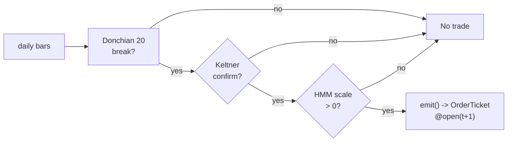

# T019 — Donchian/Keltner Breakout + Vol Sizing

> **Reviewer card.** Classic trend breakout (Turtle): `20`-day Donchian channel breaks (S022) confirmed by Keltner/ATR expansion (S023), sized by volatility (S079); the vol-regime gate scales the classic `1`%-risk unit [default]. Provenance **[P]**.
>
> Edge verdict: **AFTER-COST-EDGE** — Hurst et al.: trend-following Sharpe ~0.8–1.0 across a century of futures [documented]; the Turtle 20/55-day rules are practitioner — this module ports the geometry to equities with vol sizing [documented].
>
> After-cost: **BEFORE-COST** — one-sentence verdict: the century of trend evidence is futures, not single-name equities — the equity port is the unproven claim.
>
> Tier **S** · prototype 20–40 h [example] · loaded cost $3,000–6,000 [example] · latency bar / daily · risk medium (trend breakouts, whipsaw).

> Capacity $5–50M/day notional [example] — daily bars, diversified names; vol sizing scales · Executability: Feasible: Donchian/Keltner state machine on daily bars; any retail platform.

## §1  Identity & provenance

This module is a **strategy**: it emits `OrderTicket` intentions only — brokers create orders, strategies never do. Family **D  # breakout / session-pattern**, batch **TB4**, provenance **P**.

**Lede.** Classic trend breakout (Turtle): `20`-day Donchian channel breaks (S022) confirmed by Keltner/ATR expansion (S023), sized by volatility (S079); the vol-regime gate scales the classic `1`%-risk unit [default]. Provenance **[P]**.

**When it dies.** Range-bound regimes; P(vol) ≥ `0.80` [example]; crowded breakout levels.

**Regime gates (provisional).** R001 elevated RV degrades (breakouts fail); halted names excluded.

**Prototype scope.** Donchian/Keltner machine + ATR sizing + HMM gate + kill-switch.

## §1.5  Escalation gate

Cheapest viable path: **Polygon.io Stocks Basic** — daily OHLCV bars at ~$30–100/mo [unverified]. build the channel machine on a cheap bar feed; buy nothing.

Resource budget: `1` core, `<1` GB RAM [internal-est] [internal-est] · compute pattern `per_bar`.

Explicitly out of scope (phase two): 55-day system 2 (phase `2`); futures port; portfolio heat beyond `6` units [default].

Escalation gate: universe beyond US equities [default]; intraday breakout (phase 2) — crossing it requires re-review of §T7 and §T8.

## §T0  Contract — strategies emit intentions, brokers create orders

This strategy's sole output is a list of `OrderTicket` intentions. It never places, routes, or confirms an order. Every ticket carries `parent_signal` (the upstream signal id and its `computed_at`), an `intent_ts`, and a `tif`. The backtest harness fills tickets strictly after the signal bar (`fill_event > signal_event`, t->t+1 causality); any fill timestamped at or before its signal bar is a harness bug and trips the kill switch.

State variables carried between bars: ``donch_hi`, `donch_lo`, `atr`, `p_vol`, `scale`, `units`, `position`, `module_state``.

## §T1  Strategy thesis & edge

**Thesis.** Classic trend breakout (Turtle): `20`-day Donchian channel breaks (S022) confirmed by Keltner/ATR expansion (S023), sized by volatility (S079); the vol-regime gate scales the classic `1`%-risk unit [default]. Provenance **[P]**.

**Edge verdict: AFTER-COST-EDGE** — Hurst et al.: trend-following Sharpe ~0.8–1.0 across a century of futures [documented]; the Turtle 20/55-day rules are practitioner — this module ports the geometry to equities with vol sizing [documented].

**After-cost verdict: BEFORE-COST** — one-sentence verdict: the century of trend evidence is futures, not single-name equities — the equity port is the unproven claim.

**Risk summary.** Whipsaw in range-bound tapes; the breakout fails; vol-regime misclassification.

**Math.**

```text
Donchian channel: `donch_hi = max high(20)`, `donch_lo = min
low(20)` [example] (S022). Keltner: `EMA(20) ± 1.5× ATR(20)` [example] (S023).
Turtle unit: `N = 1% equity / (2× ATR)` [example]. HMM vol gate (S079): scale
`1.0 / 0.5 / 0.0`. Modeled edge `edge_bps = 2.0 × ATR_bps × 0.3` [example].
```

**Pseudocode (normative).**

```text
function emit(state, signals, bars, cfg) -> list[OrderTicket]:
    assert bars non-empty else return UNKNOWN                       # F1
    t = bars[-1]   # newest daily bar, labeled by open time
    dh = signals['S022'].donch_hi; kl = signals['S023']
    pv = signals['S079'].p_vol
    assert isfinite(dh) and isfinite(kl.upper) and isfinite(pv) else return UNKNOWN  # F2

    edge_bps = 2.0 * signals['S023'].atr_bps * 0.3                  # [example]
    cost_ok = expected_cost_bps(notional, adv_pct, venue, side, urgency) <= cfg.cost_gate_k * edge_bps
    # ^^^ normative cost-gate predicate: expected_cost_bps(...) <= k * edge_bps

    scale = 1.0 if pv < cfg.p_vol_half else 0.5 if pv < cfg.p_vol_susp else 0.0  # [example]
    tickets = []
    if state.position == 0 and scale > 0 and cost_ok:
        if t.close > dh and t.close > kl.upper:
            tickets = [ticket(side='BUY', qty=size(scale_as_vol=scale), limit=open(t+1), tif='DAY',
                              parent_signal=f"S022@{t.bar_open_ts}")]
        elif t.close < signals['S022'].donch_lo and t.close < kl.lower and locate_ok():
            tickets = [ticket(side='SELL', qty=size(...), limit=open(t+1), tif='DAY',
                              parent_signal=f"S022@{t.bar_open_ts}")]
    else:
        if exit_trigger(t, state, cfg): tickets = [flatten_ticket(state)]
    for tk in tickets: log_decision(tk, inputs_hash, params_hash)  # C5 / App. g
    assert fill.event_ts > t.bar_close_ts for any fill             # t->t+1 causality
    return tickets
```

## §T2  Signal stack — dependencies & data rights

| Signal | Role | Contract |
|---|---|---|
| `S022` | trigger | close beyond the 20-day Donchian channel [example]; the breakout |
| `S023` | confirm | Keltner confirmation (close beyond 1.5× ATR band [example]); the volatility breakout agrees |
| `S079` | gate | scale 1.0 / 0.5 / 0.0 at P(vol) thresholds 0.60 / 0.80 [example] |

Max dependency depth: `2` [default].

**Schema mapping (canonical).**

| Vendor (Polygon.io Stocks) | Canonical |
|---|---|
| `t` (ms) | `bar_open_ts` (int64 ns UTC; bar labeled by open time) |
| `o, h, l, c` | `open, high, low, close` |
| `v` | `volume` |

Staleness: max skew `5 s` [default] · jitter budget `30 s` [default] · TTL `120 s` [default] · cadence `per_bar (daily)` · tz `America/New_York`.

**Inputs that break the module.**

| Input failure | Module state | Alert |
|---|---|---|
| Keltner disagrees (gate) [example] | `DEGRADED` (no trade) | log |
| P(vol) >= 0.80 (gate) [example] | `DEGRADED` (no trade) | notify |
| ATR incalculable | `UNKNOWN` | page |

**Data rights.** US equities daily bars via Polygon.io Stocks, `rights: licensed`;
research + production; fixtures synthetic; entitlement = professional/internal;
derived features ours. Entitlement-class change → §1.5 escalation gate.

**Build vs buy.** Build the channel machine on a cheap bar feed; buy nothing — the
vol sizing is the IP.

**Local build.** Feasible. Donchian/Keltner/ATR are rolling computations; the
daily close loop is trivial.

**Data dictionary (canonical fields).**

| Field | Type | Cadence | Tier | Notes |
|---|---|---|---|---|
| `Daily OHLCV bars` | float/int | daily | Tier 1 | Donchian/Keltner/ATR |
| `2-year daily history` | float/int | daily | Tier 1 | HMM calibration |

## §T3  Entry / exit / sizing & worked example

**Entry rule.**

```text
ENTER_LONG  := (close > donch_hi) AND (close > keltner_upper)
               AND (P_vol < p_vol_susp) AND (expected_cost_bps(...) <= cost_gate_k * edge_bps)
ENTER_SHORT := (close < donch_lo) AND (close < keltner_lower)
               AND (P_vol < p_vol_susp) AND (locate_ok)
               AND (expected_cost_bps(...) <= cost_gate_k * edge_bps)
FLAT        := otherwise
```

**Exit rule.**

```text
EXIT := (close back inside the 10-day Donchian [example]) [Turtle exit]
        OR (2× ATR stop) [stop] OR (P_vol >= 0.80 → unwind)
        OR (module_state != OK)
```

**Cooldown.** `0` s [default] after every exit (C10).

**Sizing function (normative).**

```python
def shares(risk_budget_R, stop_distance, vol_estimate, ADV_cap, cost):
    # Turtle unit: risk 1% of equity per unit; stop_distance = 2x ATR in $/share
    # scale from the HMM gate passed in vol_estimate [default]
    n = risk_budget_R / max(stop_distance, 1e-9)   # [default] floor below
    n = n * vol_estimate                           # HMM scale 1.0/0.5/0.0 [example]
    n = min(n, ADV_cap * 0.01)                    # 1% ADV [default]
    n = min(n * 50.0, 10000000.0) / 50.0         # $10M gross cap [default]
    return int(n)
```

**Risk limits.**

| Limit | Value |
|---|---|
| Per-trade risk | `1`% of equity per unit [example] — the Turtle unit |
| Max units per name | `4` [example] |
| Max portfolio units | `12` [example] |
| Regime suspend | P(vol) ≥ `0.80` [example] → unwind |

**Worked example (fixture-backed, from `fixtures/T019_tape.csv` trade 1).**

Trade 1: `BUY` `500` shares [example] @ `50.2` [example], exit `54.8` [example] (`10-day Donchian exit`). Gross P&L = `2300.00` [measured] dollars. Cost stack = `10.0` bps [example] → `25.10` [measured] dollars on `25100.00` [example] notional. Net = `2274.90` [measured] dollars. The fixture's expected CSV carries the same arithmetic for all six trades; the per-module test recomputes it from the tape and asserts equality.

**Flow.**


## §T4  Parameters

| Parameter | Key | Default | Provenance | Sensitivity |
|---|---|---|---|---|
| Donchian period | `donch_period` | `20` | [default] | high |
| Keltner multiple | `keltner_mult` | `1.5`× ATR | [default] | high |
| ATR period | `atr_period` | `20` | [default] | medium |
| Risk per unit | `risk_pct` | `1`% | [default] | high |
| Stop ATR multiple | `stop_atr_mult` | `2.0`× | [default] | high |
| Cost-gate k | `cost_gate_k` | `0.5` | [default] | high |

## §T5  Costs — the callable is the single source of truth

| Component | bps | Basis |
|---|---|---|
| Spread | `4.0` | [example] 1¢ assumed spread at $50: half-spread per aggressive leg × 2 legs |
| Fees | `2.0` | [example] $0.005/share each way at $50 = 1 bps/leg |
| Borrow | `0.0` | [default] long-breakout reference; shorts add C7 |
| Impact | `4.0` | [example] breakout chasing — 2¢ adverse on a $50 name |
| **Total** | `10.0` | [example] reference stack |

Fee schedule as of `2026-09-01` [example] · venue `XNAS / SIP daily bars [example]` · side `taker` · borrow `0.0` bps/day [example] — reference build is long-breakout; short variant models borrow explicitly.

```python
def expected_cost_bps(notional, adv_pct, venue, side, urgency) -> float:
    """Callable cost model - T019 COST block (single source of truth)."""
    spread_bps = 4.0    # [example] 1c assumed spread @ $50: half/aggressive leg x 2
    fee_bps = 2.0       # [example] $0.005/share each way @ $50 = 1 bps/leg
    borrow_bps = 0.0    # [default] long-breakout reference; shorts add C7
    impact_bps = 4.0    # [example] breakout chasing: 2c adverse @ $50
    return spread_bps + fee_bps + borrow_bps + impact_bps
```

**Normative cost-gate predicate (C3):** `expected_cost_bps(...) <= k * edge_bps` — no ticket is emitted unless the callable cost clears this gate. The predicate appears verbatim in the §T1 pseudocode and is asserted by the per-module test.

## §T6  Execution assumptions

| Aspect | Assumption |
|---|---|
| Latency | daily close; fill at next-day open |
| Partial fills | oldest `intent_ts` first (FIFO) |
| Impact | `4` bps modeled [example] — breakout chasing |
| Adverse fill | the breakout fails — the `2`× ATR stop [default] is the control |

## §T7  Risk contract & kill switch

Per-trade R: `1`% of equity per unit [example] (Turtle risk unit) · daily loss stop: `-2`% of equity [example] then dark · max gross: `$10M` notional [example] · max adverse per trade: `2.0`x ATR stop [default].

Enforcement: `intraday-hard` [default]. Calibration recipe: Donchian/ATR on `250`-day history [default]; HMM on `2` years [default]; re-pin fee schedule monthly [default].

**Kill switch: `ARMED` → `TRIPPED` → `RECOVERY` → `ARMED`.**

Trip conditions:

- 4 units in one name [example]
- 12 units portfolio [example]
- clock skew > 50 ms [example]

On trip: the module stops emitting tickets immediately, flattens managed positions per the exit rule, and pages. `RECOVERY` requires manual review, cooldown expiry, and healthy feeds; only then does the module return to `ARMED`. The per-module test drives the full transition cycle.

**Ops.** Schedule: Daily close: evaluate breaks, fill at next-day open; pyramiding per Turtle rules (phase `2`); flat on regime suspend · budget: `1` vCPU, `1` GB RAM [internal-est] [internal-est] · env: `POLYGON_API_KEY`.

**Universe.** US equities, price > `$10`, ADV > `1`M shares [example]. Signal:
close beyond the `20`-day Donchian channel with Keltner confirm [example].
Daily. Exclude: earnings weeks, halts.

## §T8  Compliance (C1–C10+)

- **C1** | No orders: the strategy emits `OrderTicket` intentions only; the broker creates orders.
- **C2** | Kill switch: `ARMED` → `TRIPPED` → `RECOVERY` → `ARMED` on the trip conditions in §T7.
- **C3** | Cost gate: `expected_cost_bps(...) <= k * edge_bps` before any ticket (see §T5).
- **C4** | Causality: `fill_event > signal_event` (t->t+1); no signal-bar fills, ever.
- **C5** | Decision log: every ticket logged with inputs hash and params hash (see App. g).
- **C6** | Staleness: inputs older than the TTL → `UNKNOWN`, no tickets.
- **C7** | Short discipline: `locate_ok` required before any short ticket.
- **C8** | Cooldown: post-exit cooldown enforced in seconds; no re-entry inside it.
- **C9** | Session flatten: no uncommanded overnight carry.
- **C10** | Position caps: per-trade R, daily loss stop, and max gross enforced.
- **C11 | Unit limits: trigger = `4` units one name or `12` portfolio [example] → check = unit count → action = veto pyramiding → log = `COMPLIANCE_BLOCK`**
- **C12 | Regime unwind: trigger = P(vol) ≥ `0.80` [example] → check = S079 → action = unwind → log = `GATE_VETO`**

## §T9  Evidence, failures & regime gates

**Evidence (cost-level tokens; every statistic tagged).**

| Source | Sample | Finding | Cost level | Caveat |
|---|---|---|---|---|
| Hurst, Ooi & Pedersen (2017) [documented] | futures, `1880`–`2016` [documented] | composite `7.3`% annualized excess return at `10`% vol target, positive every decade since `1880` [documented] | after-cost | futures, not single-name equities — the equity port is unproven |
| Faith (2007) [documented] | (practitioner book) | Turtle 20/55-day rules + 1%-risk unit system description [documented] | `BEFORE-COST` (system description) | practitioner book — the geometry, not a P&L |

**Where this module is known to fail.** range-bound tapes, crowded breakout levels, vol-regime misclassification, whipsaw.

**Failure modes (detect → action → recovery).**

| # | Failure | Detect → action → recovery | Executable check |
|---|---|---|---|
| 1 | Whipsaw | detect: `3` consecutive failed breaks [example] → action: stand down → recovery: next session | `failed_breaks < 3` |
| 2 | Regime suspend | detect: P(vol) >= `0.80` → action: unwind (C12) → recovery: regime normal [default] | `p_vol < 0.80` |
| 3 | Unit limit | detect: `4` units one name → action: veto pyramiding (C11) → recovery: exit frees units [default] | `units < 4` |
| 4 | Cost blowup | detect: cost gate failing → action: stand down → recovery: re-pin [default] | `expected_cost_bps(...) <= k * edge_bps` |
| 5 | Lookahead in channels | detect: channel uses future → action: halt, fix → recovery: no-signal-bar-fills test [default] | `all(fill_ts > signal_ts)` |

**Regime gates.**

| Regime | Effect | Mechanism | Condition | Action | Latency | Fallback |
|---|---|---|---|---|---|---|
| R001 | degrades | elevated RV: breakouts fail | p_vol >= 0.60 [default] | halve | 1 bar [default] | veto |
| R001 | inverts | extreme RV | p_vol >= 0.80 [default] | veto | 0 [default] | veto |
| R-halt | inverts | halt/auction state | state != CONTINUOUS_TRADING [default] | veto | 0 [default] | veto |

**Robustness.** The vol sizing is the strategy: `risk_pct` in `0.5`–`2`% [default]
[example] is the calibration surface. `donch_period` in `15`–`30` [example]
trades frequency for trend capture. Purged/embargoed OOS per S088.

**What the optimistic case assumes (and we do not).** (1) the century of trend evidence is futures — the equity port is
the unproven claim; (2) whipsaw assumed to be controlled by the Keltner
confirm — it is imperfect; (3) impact `4` bps [example] — flagged.

## §T10  Unverified leads & what would change our mind

- Turtle-system equity P&L claims from practitioner sources — the futures evidence is documented; the equity port is the unproven claim.

What would change our mind: a purged/embargoed walk-forward with full costs that survives the S088 honesty protocol; a documented after-cost P&L from the cited authors' own implementations; or a regime-gated replication that holds outside the original sample.

## AI build prompt

```text
Build the T019 (Donchian/Keltner Breakout + Vol Sizing) strategy module from this specification.
Hard constraints:
- The strategy emits OrderTicket intentions ONLY; it never creates orders (C1).
- Causality: fill_event > signal_event (t->t+1); no signal-bar fills (C4).
- Cost gate: expected_cost_bps(...) <= k * edge_bps before any ticket (C3).
- Kill switch ARMED -> TRIPPED -> RECOVERY -> ARMED on the §T7 trip conditions (C2).
- Every numeric literal in prose carries an honesty tag [documented]/[measured]/[example]/[unverified]/[default]/[internal-est]; exempt identifiers only.
- Sources must be real and cited with cost-level tokens; chatbot-only material goes to §T10.
Config surface:
- donch_period (float): default 20.0, range 10–55 [default]
- keltner_mult (float): default 1.5, range 1.0–2.5 [default]
- atr_period (float): default 20.0, range 10–30 [default]
- risk_pct (float): default 0.01, range 0.005–0.02 [default]
- p_vol_half (float): default 0.60, range 0.5–0.9 [default]
- p_vol_susp (float): default 0.80, range 0.6–0.95 [default]
- stop_atr_mult (float): default 2.0, range 1.0–3.0 [default]
- cooldown_s (float): default 0.0, range 0–3,600 [default]
- cost_gate_k (float): default 0.5, range 0.1–2.0 [default]
Entry rule:
ENTER_LONG  := (close > donch_hi) AND (close > keltner_upper)
               AND (P_vol < p_vol_susp) AND (expected_cost_bps(...) <= cost_gate_k * edge_bps)
ENTER_SHORT := (close < donch_lo) AND (close < keltner_lower)
               AND (P_vol < p_vol_susp) AND (locate_ok)
               AND (expected_cost_bps(...) <= cost_gate_k * edge_bps)
FLAT        := otherwise
Exit rule:
EXIT := (close back inside the 10-day Donchian [example]) [Turtle exit]
        OR (2× ATR stop) [stop] OR (P_vol >= 0.80 → unwind)
        OR (module_state != OK)
Sizing: implement the §T3 sizing_fn verbatim; enforce the §T7 risk contract.
Deliverables: the module markdown (all sections §1–§T10), the fixture tape CSV
(fixtures/T019_tape.csv), the expected CSV (fixtures/T019_expected.csv), and
the per-module test (modules/tests/test_T019.py) covering fixture arithmetic,
causality, the cost gate, the kill-switch cycle, invalid→UNKNOWN, and the callable signature.
```
