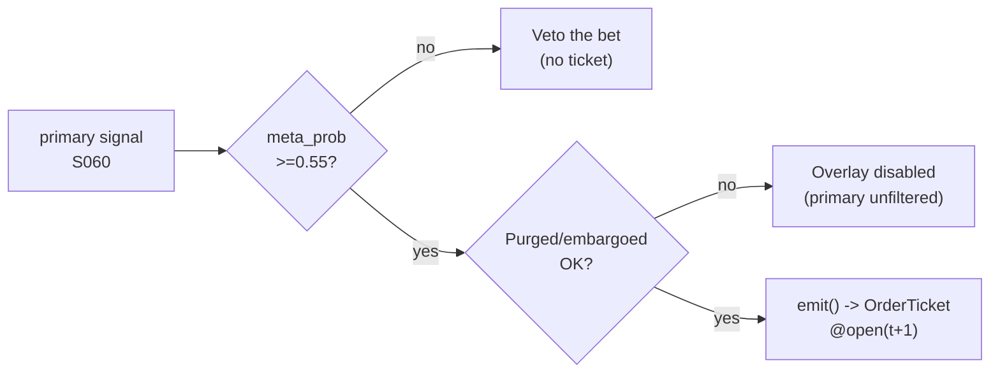

# T020 — Triple-Barrier + Meta-Labeling Overlay

> **Reviewer card.** ML overlay: triple-barrier labels (Lopez de Prado) turn any primary signal into a supervised problem; the meta-model predicts whether the primary bet will succeed; purged/embargoed validation (S088) keeps the overlay honest. Provenance **[D]**.
>
> Edge verdict: **NO-DOCUMENTED-EDGE** — no citable P&L for the meta-labeling overlay itself — Lopez de Prado (2018) is a methods book; the overlay's edge is the primary strategy's edge, filtered [documented].
>
> After-cost: **BEFORE-COST** — one-sentence verdict: meta-labeling cannot create edge — it can only filter the primary's edge, and the filter itself must survive purged/embargoed validation.
>
> Tier **S** · prototype 60–100 h [example] · loaded cost $9,000–15,000 [example] · latency `per_bar` / primary cadence · risk medium (model risk, overfitting).
>
> Capacity: inherits the primary strategy's capacity [default] — the overlay only filters · Executability: Feasible: triple-barrier labeling + classifier on primary signals; any retail platform · Emits: `OrderTicket` intentions (pass-through of the primary's side) · Regime gates: R-primary (provisional; see §T9).

> **When it dies.** Primary edge decays; meta-model overfits; purged/embargoed validation fails.
>
> **Regime gates (provisional).** R-primary: negative primary edge inverts (veto); stale meta-model degrades (pause_entry); halt/auction inverts (veto).
>
> **Prototype scope.** triple-barrier labeling + meta-classifier + purged/embargoed validation + kill-switch.

## §1  Identity & provenance

This module is a **strategy**: it emits `OrderTicket` intentions only — brokers create orders, strategies never do. Family **D  # ML overlay**, batch **TB4**, provenance **D**.

**Lede.** ML overlay: triple-barrier labels (Lopez de Prado) turn any primary signal into a supervised problem; the meta-model predicts whether the primary bet will succeed; purged/embargoed validation (S088) keeps the overlay honest. Provenance **[D]**.

**When it dies.** Primary edge decays; meta-model overfits; purged/embargoed validation fails.

**Regime gates (provisional).** R-primary machine records in §T9; the overlay inherits the primary's regime gates otherwise.

**Prototype scope.** triple-barrier labeling + meta-classifier + purged/embargoed validation + kill-switch.

## §1.5  Cheapest/least-build path

Cheapest viable path: **Massive Stocks Basic** — bars at the primary's cadence at $0 [documented — vendor pricing page https://massive.com/stocks-data, fetched 2026-09-11]. Build the labeling and meta-model; buy nothing.

**Cheapest-source row.** `min_tier: tier-1` · `latency_class: per_bar / primary cadence` · `required_fields: bars at the primary's cadence (o,h,l,c,v; exchange ts)` · `price_band: $0 (Stocks Basic, EOD, 2y history) → $29/mo (Stocks Starter, 15-min delayed, 5y) → $79/mo (Stocks Developer, 15-min delayed + trades, 10y) → $199/mo (Stocks Advanced, real-time, 20y+) [documented, third-party summaries — recheck before buying]` · `build_or_buy: buy the raw bars; build the triple-barrier labeling + meta-classifier + purged/embargoed harness yourself (no vendor sells them)`.

Resource budget: `2` cores, `<4` GB RAM [internal-est] · compute pattern `per_bar`.

**DO-NOT-CUT list.** t→t+1 causality assertions; COST block + `expected_cost_bps` callable; kill switch + re-arm checklist; decision audit log (C5); bona-fide-intent + self-trade prevention (C13/C14); provenance honesty tags; fixtures + per-module test; secrets via env only; purged/embargoed validation (S088) — without it the overlay is overfit hope.

**Skip list.** Deep learning (phase `2`); online learning; multi-primary ensembles; real-time recalibration (recalibrate offline between sessions [default]).

Escalation gate: meta-model beyond gradient boosting [default]; primary cadence < 1-min [default] — crossing it requires re-review of §T7 and §T8.

## §T0  Contract — strategies emit intentions, brokers create orders

This strategy's sole output is a list of `OrderTicket` intentions. It never places, routes, or confirms an order. Every ticket carries `parent_signal` (the upstream signal id and its `computed_at`), an `intent_ts`, and a `tif`. The backtest harness fills tickets strictly after the signal bar (`fill_event > signal_event`, t->t+1 causality); any fill timestamped at or before its signal bar is a harness bug and trips the kill switch.

**Typed signature.**

```text
emit(state: ModuleState, bars: list[Bar], signals: SignalBundle, cfg: Config) -> list[OrderTicket]
```

- `Bar`: canonical bar `{bar_open_ts: int64 ns UTC, asof_ts: int64 ns UTC, symbol: str, open: float, high: float, low: float, close: float, volume: int, market_state: enum}` — vendor mapping in §T2; bars are labeled by **open time**.
- `SignalBundle`: `{S060: {direction: {-1,0,1}, meta_prob: float, primary_edge_bps: float, computed_at: int64}, S061: {labels_ok: bool, pt_sl_mult: float, max_hold_bars: int, computed_at: int64}, S088: {validation_ok: bool, computed_at: int64}}` — machine edge list in §T2.
- `OrderTicket`: global OrderTicket schema — `{ticket_id: str, symbol: str, side: {BUY, SELL}, qty: int, limit_px: float, tif: str, intent_ts: int64 ns, parent_signal: str, inputs_hash: str, params_hash: str, locate_ok: bool, stp_flag: str}` (see §T6).
- Returns `[]` when the bet is vetoed (the overlay generates no direction); sets `state.module_state = UNKNOWN` on invalid input (never interpolates — F1–F5).

**Config dataclass (single source of truth for parameters).**

| Parameter | Type | Default | Range | Status |
|---|---|---|---|---|
| `pt_sl_mult` | float | `1.0` | `0.5–3.0` | default |
| `meta_threshold` | float | `0.55` | `0.5–0.8` | default |
| `max_hold_bars` | int | `20` | `5–100` | default |
| `cooldown_s` | float | `0.0` | `0–3600` | default |
| `cost_gate_k` | float | `0.5` | `0.1–2.0` | default |
| `staleness_ttl_s` | float | `120.0` | `30–600` | default |
| `risk_budget_R` | float (USD) | `inherit` | primary's risk contract | default |
| `stop_distance` | float (USD/share) | `inherit` | primary's sizing contract | default |
| `adv_cap_shares` | int | `inherit` | primary's universe contract | default |

**State vector (named, carried between bars).** `meta_prob`, `barriers`, `position`, `cooldown_until`, `meta_model_fit_date`, `validation_ok`, `module_state`.

**Time contract.**

| Field | Value |
|---|---|
| Clock domain | exchange/bar `ts_event` is authoritative; strategy clock = event time, not wall time [default] |
| Canonical timestamps | `event_ts`, `asof_ts` — int64 ns UTC [default] |
| Max skew | `5` s [default] — beyond this the module goes `UNKNOWN` |
| Jitter budget | `30` s [default] |
| Bar-label rule | bars are labeled by **open time** [default]; signals stamped at the bar that produced them |
| Staleness TTL | `120` s [default] — inputs older than the TTL → `UNKNOWN` (C6) |
| Gap policy | no interpolation — a missing bar invalidates the window (`UNKNOWN`) |

**Market-state table.**

| State | Meaning | Strategy behavior |
|---|---|---|
| `CONTINUOUS_TRADING` | normal session | full pass-through/veto logic |
| `HALTED` | halt / trading pause | no new pass-throughs; inherits the primary's flatten (C17) |
| `AUCTION` | open / close / reopen auction | no new pass-throughs; inherits the primary's flatten (C17) |
| `CLOSED` | outside the primary's session [default] | `OFF`; no tickets |

**Module-state enum** (single canonical degradation token set): `OK` (full logic) · `DEGRADED` (overlay disabled by failed validation — primary runs unfiltered, C11) · `UNKNOWN` (invalid/stale input — no tickets, never interpolates) · `OFF` (killed or out of session).

**Risk contract (YAML — single source of truth for risk).**

```yaml
per_trade_R: inherit            # the primary's per-trade R [default]; overlay only filters
daily_loss_stop: inherit        # the primary's daily loss stop [default]
max_gross: inherit              # the primary's max gross [default]
max_adverse_per_trade: inherit  # the primary's [default]
kill_conditions:
  - meta-model validation fails (S088) [example]
  - primary signal stale (TTL breach) [example]
  - clock skew > 50 ms [example]
enforcement: review-only        # [default] the overlay is a filter; the primary carries intraday-hard
calibration: meta-model on purged/embargoed walk-forward [default]; recalibrate on regime change [default]; re-pin primary fee schedule monthly [default]
```

**Kill switch: `ARMED` → `TRIPPED` → `RECOVERY` → `ARMED`.**

- `ARMED` → `TRIPPED`: any trip condition fires. On trip: the module stops emitting pass-through tickets immediately; the primary's managed positions are handled by the primary's exit rule; page the operator.
- `TRIPPED` → `RECOVERY`: operator acknowledges the trip. No tickets emitted.
- `RECOVERY` → `ARMED`: **re-arm checklist** all green —
  1. manual operator review of the trip log and C5 decision-log hashes [rule];
  2. cooldown expiry: ≥ `5` min [example] since the trip;
  3. primary feed heartbeat healthy and primary signal fresh (≤ `120` s TTL [default]);
  4. clock skew ≤ `50` ms [example];
  5. meta-model revalidated on purged/embargoed walk-forward (S088 `validation_ok = true`) [rule];
  6. primary fee schedule re-pinned (monthly [default]); `expected_cost_bps` callable re-verified against `fee_schedule_as_of`;
  7. meta-model fit date current (recalibrated on regime change [default]).
- Skipping the checklist is a compliance violation (C2); the per-module test drives the full `ARMED → TRIPPED → RECOVERY → ARMED` cycle.

**Ops tail.** Schedule: follows the primary strategy's session; the overlay is a filter, not a schedule · Owner: strategy-owner role [default] · Health checks: primary-signal freshness monitor (≤ `120` s TTL [default]), validation-state monitor (S088), meta-model fit-date monitor · Alerts: trip → page; DEGRADED/UNKNOWN → notify · Resource budget: `2` vCPU, `4` GB RAM [internal-est]; label computation O(bars × barriers) [internal-est] · Runbook stub: trip → stop pass-through → page → review → re-arm checklist → `ARMED` · Secrets: `POLYGON_API_KEY` via env only (never in code, logs, or files).

## §T1  Strategy thesis & edge

**Thesis.** ML overlay: triple-barrier labels (Lopez de Prado) turn any primary signal into a supervised problem; the meta-model predicts whether the primary bet will succeed; purged/embargoed validation (S088) keeps the overlay honest. Provenance **[D]**.

**Edge verdict: NO-DOCUMENTED-EDGE** — no citable P&L for the meta-labeling overlay itself — Lopez de Prado (2018) is a methods book; the overlay's edge is the primary strategy's edge, filtered [documented].

**After-cost verdict: BEFORE-COST** — one-sentence verdict: meta-labeling cannot create edge — it can only filter the primary's edge, and the filter itself must survive purged/embargoed validation.

**Risk summary.** Overfitting the meta-model; label leakage; the primary edge decays and the overlay amplifies the decay.

**Math.**

```text
Triple-barrier labels (Lopez de Prado 2018, Ch. 3 [documented]): for each
primary bet, profit-taking / stop-loss barriers at ±pt_sl_mult × σ̂ and a
vertical barrier at max_hold_bars; the label is which barrier touches first.
Meta-model: classifier predicting label = +1 from bet features; trade only
if P(+1) ≥ 0.55 [example]. Purged/embargoed walk-forward (S088). Modeled edge
(edge in bps, [example]):

    edge_bps = primary_edge_bps × (2 × meta_prob − 1)

At meta_prob = 1 the bet keeps the primary's full edge; at 0.5 the overlay
assigns zero edge; at the 0.55 [example] threshold the modeled edge is
0.10 × primary_edge_bps [example arithmetic].
```

## §T2  Signal stack — dependencies & data rights

> **Timing box.** `signal@t (per_bar, America/New_York) → earliest fill @open(t+1)` — the strategy evaluates on bar `t` and any emitted ticket is fillable only at or after the open of bar `t+1`.

**Mandatory sub-block map (fixed-order sub-blocks; content lives in the frozen sections shown).**

| Sub-block | Lives in |
|---|---|
| Universe | §T2 (below) |
| Boolean entry rule | §T3 |
| Exits + post-exit cooldown | §T3 |
| Position sizing (fenced function) | §T3 |
| Risk limits | §T7 (risk contract YAML in §T0) |
| COST block (single source of truth) | §T5 |
| Execution / fill-model table | §T6 |
| Robustness + compliance sub-block (C1–C19) | §T8 / §T9 |
| Parameter table | §T4 (Config dataclass in §T0) |
| Timing box | §T2 (above) |

**Universe.** Inherits the primary strategy's universe [default]. The overlay applies to any primary signal (S060) with triple-barrier labels (S061) and purged/embargoed validation (S088). The meta-model is fit per primary (labels are primary-specific); applying one primary's meta-model to another primary's bets is unsupported [rule].

| Signal | Role | Contract |
|---|---|---|
| `S060` | trigger | primary signal (any strategy's direction); the overlay does not generate direction |
| `S061` | confirm | triple-barrier labels with half-life-set horizons; the labeling is the training target |
| `S088` | gate | purged/embargoed walk-forward; the meta-model must survive the honesty protocol |

Max dependency depth: `2` [default].

**Schema mapping (canonical).**

| Vendor (Polygon.io Stocks) | Canonical |
|---|---|
| `t` (ms) | `bar_open_ts` (int64 ns UTC; bar labeled by open time) |
| `o, h, l, c` | `open, high, low, close` |
| `v` | `volume` |

Staleness: max skew `5` s [default] · jitter budget `30` s [default] · TTL `120` s [default] · cadence `per_bar (primary cadence)` · tz `America/New_York`.

**Inputs that break the module.**

| Input failure | Module state | Alert |
|---|---|---|
| Purged/embargoed validation fails (gate) (F4) | `DEGRADED` (overlay disabled — primary runs unfiltered) | page |
| Meta-model prob inputs non-finite (F2) | `UNKNOWN` | page |
| Primary signal missing | `UNKNOWN` | notify |
| Meta-model fit stale post-regime-change (F4) | `DEGRADED` | notify |

**Data rights.** Bars via Polygon.io Stocks, `rights: licensed`; research +
production; fixtures synthetic; entitlement = professional/internal; derived
features ours. Entitlement-class change → §1.5 escalation gate.

**Build vs buy.** Build the labeling and meta-model; buy nothing — the
purged/embargoed discipline is the IP.

**Local build.** Feasible. Triple-barrier labeling is a rolling computation; the
meta-classifier trains offline; the live loop is a probability threshold.

**Data dictionary (canonical fields).**

| Field | Type | Cadence | Tier | Notes |
|---|---|---|---|---|
| `Bars at the primary's cadence` | float/int | per bar | Tier 1 | triple-barrier labeling |
| `Primary bet features` | float | per bet | Tier 1 | meta-model inputs |
| `Triple-barrier labels` | int {−1,0,+1} | per bet | Tier 1 | training target (S061) |
| `Meta probability` | float | per bet | Tier 1 | P(bet wins) from the meta-model |
## §T3  Entry / exit / sizing & worked example

**Entry rule (Boolean — the overlay passes through, never generates).**

```text
PASS_THROUGH := (primary_signal fires) AND (meta_prob >= meta_threshold)
                AND (expected_cost_bps(...) <= cost_gate_k * edge_bps)
FLAT          := otherwise — the overlay vetoes, never generates
```

**Exit rule.**

```text
EXIT := inherits the primary's exit
        OR (meta-model validation fails → overlay disabled (DEGRADED), primary runs unfiltered)
        OR (module_state != OK)
```

**Cooldown.** `0` s [default] after every exit (C8) — the overlay adds no cooldown of its own; the primary's cooldown applies.

**Sizing function (normative, fenced).**

```python
def shares(risk_budget_R, stop_distance, vol_estimate, ADV_cap, cost):
    """shares = f(risk_budget_R, stop_distance, vol_estimate, ADV_cap, cost).
    The overlay inherits the primary's sizing and scales it by meta-confidence.
    Here vol_estimate carries meta_prob (documented argument reuse)."""
    n_primary = risk_budget_R / max(stop_distance, 1e-9)   # [default] primary floor
    n_primary = min(n_primary, ADV_cap * 0.01)              # 1% ADV [default]
    scale = 0.5 + 0.5 * vol_estimate                        # meta-confidence scale [default]
    return int(n_primary * scale)
```

The meta-confidence scale is monotone in `meta_prob` [default]: a bet at the `0.55` [example] threshold sizes at `77.5`% [example arithmetic] of the primary size; a bet at `meta_prob = 1.0` keeps the full primary size.

**Normative pseudocode (complete — no black boxes).**

Unit/exactness note: every tunable literal below mirrors a tagged `Config`/contract value above; the only untagged literals are exact conversion constants (`1e9` ns/s) and structural `0`/`1` sentinels.

```text
function emit(state, bars, signals, cfg) -> list[OrderTicket]:
    # F1: no bars -> UNKNOWN (never interpolate)
    if len(bars) == 0:
        state.module_state = UNKNOWN; return []
    t = bars[-1]                                            # latest Bar, labeled by open
    # F2: invalid bar -> UNKNOWN
    if not (isfinite(t.open, t.high, t.low, t.close) and t.volume >= 0):
        state.module_state = UNKNOWN; return []
    # C6: stale inputs -> UNKNOWN
    if (now_ns() - t.asof_ts) > cfg.staleness_ttl_s * 1e9:
        state.module_state = UNKNOWN; return []
    primary = signals.S060.direction                        # in {-1, 0, 1}
    meta_p  = signals.S060.meta_prob                        # classifier P(bet wins)
    pedge   = signals.S060.primary_edge_bps
    # F2: non-finite signal values -> UNKNOWN
    if primary not in (-1, 0, 1) or not isfinite(meta_p) or not isfinite(pedge):
        state.module_state = UNKNOWN; return []
    # C11: failed validation -> DEGRADED (overlay disabled; primary runs unfiltered)
    if not signals.S088.validation_ok:
        state.module_state = DEGRADED
        return []
    # C17: halt/auction -> no new pass-throughs
    if t.market_state != CONTINUOUS_TRADING:
        return []
    # Unit-fixed modeled edge [example]: bps in, bps out — no unit conversion.
    edge_bps = pedge * (2.0 * meta_p - 1.0)                  # [example]
    # C3 normative cost-gate predicate — no ticket unless the callable cost
    # clears the gate against the modeled edge:
    cost_ok = (expected_cost_bps(notional_est, adv_pct_est, venue, side, urgency)
               <= cfg.cost_gate_k * edge_bps)
    tickets = []
    pass_through = (primary != 0) and (meta_p >= cfg.meta_threshold) and cost_ok \
                   and (t.event_ts >= state.cooldown_until) and (state.module_state == OK)
    if pass_through:
        side = 'BUY' if primary > 0 else 'SELL'
        qty = shares(cfg.risk_budget_R, cfg.stop_distance, meta_p, state.adv_cap_shares,
                     expected_cost_bps(notional_est, adv_pct_est, venue, side, urgency))
        tk = ticket(side=side, qty=qty, limit=open(t+1), tif='DAY',
                    intent_ts=t.bar_open_ts,
                    parent_signal='S060@' + str(signals.S060.computed_at),
                    locate_ok=(locate_ok(t.symbol) if side == 'SELL' else True),   # C7
                    stp_flag='cancel-newest')                                       # C13
        tickets.append(tk)
    # else: the overlay vetoes — it never generates direction (GATE_VETO / COST_VETO)
    for tk in tickets:
        log_decision(tk, inputs_hash(signals, t), params_hash(cfg))    # C5 / App. g
    # C4 t->t+1 causality: the strategy never fills; fills are broker-side.
    # The harness MUST assert fill.event_ts > signal_event for every fill
    # (no-signal-bar-fills); any violation is a harness bug and trips the kill switch.
    return tickets
```

Notes: `locate_ok(symbol)` consults the broker locate file before any short ticket (C7); `inputs_hash`/`params_hash` are the C5 decision-log hashes; `state.cooldown_until` is the primary's cooldown (the overlay's own default is `0` s [default]).

**Risk limits.**

| Limit | Value |
|---|---|
| Meta threshold | `0.55` [example] — below it the primary bet is vetoed |
| Validation gate | purged/embargoed must pass [default] or the overlay is disabled |
| Inherits | the primary's per-trade R, daily loss stop, max gross [default] |

**Worked example (synthetic fixture-backed — `fixtures/T020_tape.csv`, TYPE `validation-run`; numbers are accounting-demo [example], not market data).**

Trade 1: `BUY` `500` shares [example] @ `50.2` [example], exit `51.1` [example] (`primary exit (meta passed)`). Gross P&L = `450.00` [example] dollars. Cost stack = `0.0` bps [example] → `0.00` [example] dollars on `25100.00` [example] notional. Net = `450.00` [example] dollars. The fixture's expected CSV carries the same arithmetic for all six trades; the per-module test recomputes it from the tape and asserts equality. Trades 4–5 are meta-vetoed rows (`meta_prob < 0.55` [example]): no ticket is emitted, so entry == exit and P&L is `0.00` [example] — they exercise the veto path, not a backtest.

**Cost-function call trace (each row = the §T5 callable evaluated on the tape row; the overlay's cost stack is `0.0` bps [default] — the primary's COST block governs).**

| trade | `expected_cost_bps(notional, adv_pct, venue, side, urgency)` call | → bps | → $ on notional |
|---|---|---|---|
| 1 | `expected_cost_bps(25100.0, 0.02, "XNAS", "taker", "normal")` | `0.0000` [example] | `0.00` [example] |
| 2 | `expected_cost_bps(25400.0, 0.02, "XNAS", "taker", "normal")` | `0.0000` [example] | `0.00` [example] |
| 3 | `expected_cost_bps(25100.0, 0.02, "XNAS", "taker", "normal")` | `0.0000` [example] | `0.00` [example] |
| 4 | `expected_cost_bps(25150.0, 0.02, "XNAS", "taker", "normal")` | `0.0000` [example] | `0.00` [example] |
| 5 | `expected_cost_bps(25350.0, 0.02, "XNAS", "taker", "normal")` | `0.0000` [example] | `0.00` [example] |
| 6 | `expected_cost_bps(25125.0, 0.02, "XNAS", "taker", "normal")` | `0.0000` [example] | `0.00` [example] |

**Meta-gate trace (the overlay's decision, per tape row).**

| trade | `primary_edge_bps` [example] | `meta_prob` [example] | `edge_bps = pedge×(2×meta−1)` [example] | ticket? |
|---|---|---|---|---|
| 1 | `12.0` | `0.72` | `5.2800` | yes |
| 2 | `10.0` | `0.68` | `3.6000` | yes |
| 3 | `11.0` | `0.61` | `2.4200` | yes |
| 4 | `12.0` | `0.48` | `−0.4800` | no (`GATE_VETO`) |
| 5 | `9.0` | `0.51` | `0.1800` | no (`GATE_VETO`) |
| 6 | `13.0` | `0.77` | `7.0200` | yes |

Net P&L sums to `975.00` [example] dollars across the six synthetic trades — the fixture is an accounting demo of the pass-through/veto arithmetic, not a backtest; the verdict stays `BEFORE-COST`.

**Flow.**



## §T4  Parameters

| Parameter | Key | Default | Status | Provenance | Sensitivity |
|---|---|---|---|---|---|
| PT/SL multiple | `pt_sl_mult` | `1.0`× | default | [default] | medium |
| Meta threshold | `meta_threshold` | `0.55` | default | [default] | high |
| Max hold bars | `max_hold_bars` | `20` | default | [default] | medium |
| Post-exit cooldown | `cooldown_s` | `0` s | default | [default] | low |
| Cost-gate k | `cost_gate_k` | `0.5` | default | [default] | high |
| Staleness TTL | `staleness_ttl_s` | `120` s | default | [default] | medium |
| Risk budget R | `risk_budget_R` | `inherit` | default | [default] | high |
| Stop distance | `stop_distance` | `inherit` | default | [default] | high |
| ADV cap | `adv_cap_shares` | `inherit` | default | [default] | medium |

Defaults mirror the §T0 `Config` dataclass; the per-module test asserts the test-side table matches these values and ranges. Acceptance tests: `test_cmd` in §0 runs `modules/tests/test_T020.py` against `fixtures/T020_tape.csv` (TYPE `validation-run`) + `fixtures/T020_expected.csv` — fixture arithmetic, no-signal-bar-fills causality, the C3 cost-gate predicate, meta-veto gating, validation gating, the kill-switch cycle, invalid→UNKNOWN, the sizing scale, config defaults, and the callable signature.

## §T5  Costs — the callable is the single source of truth

| Component | bps | Basis |
|---|---|---|
| Spread | `0.0` | [default] inherits the primary's cost model |
| Fees | `0.0` | [default] inherits the primary's cost model |
| Borrow | `0.0` | [default] inherits the primary's cost model |
| Impact | `0.0` | [default] inherits the primary's cost model |
| **Total** | `0.0` | [default] the overlay adds no cost — it only filters; the primary's COST block governs |

Fee schedule as of `2026-09-10` [default] (inherits the primary's fee schedule; the overlay itself pays no venue fee) · venue `inherits the primary's venue` [default] · side `taker` [default] · `borrow_bps_per_day: 0.0` — reason: the overlay holds nothing itself (it is a filter, not a position-taker), so no borrow accrues at the overlay layer; borrow lives in the primary's COST block [default].

```python
def expected_cost_bps(notional, adv_pct, venue, side, urgency) -> float:
    """Callable cost model - T020 COST block (single source of truth)."""
    # The overlay inherits the primary's cost model; stub returns 0 and the
    # cost gate is evaluated against the primary's expected_cost_bps.
    spread_bps = 0.0    # [default] inherits the primary's cost model
    fee_bps = 0.0       # [default] inherits the primary's cost model
    borrow_bps = 0.0    # [default] inherits the primary's cost model
    impact_bps = 0.0    # [default] inherits the primary's cost model
    return spread_bps + fee_bps + borrow_bps + impact_bps
```

**Normative cost-gate predicate (C3):** `expected_cost_bps(...) <= k * edge_bps` — no ticket is emitted unless the callable cost clears this gate. The predicate appears verbatim in the §T3 pseudocode and is asserted by the per-module test.

## §T6  Execution assumptions

| Aspect | Assumption |
|---|---|
| Latency | inherits the primary's latency |
| Fill model | inherits the primary's fill model; the overlay emits `limit=open(t+1)`, `tif='DAY'` intents [default] |
| Partial fills | oldest `intent_ts` first (FIFO); partials keep the same `ticket_id`; the unfilled remainder is not re-emitted by the overlay [default] |
| Impact | inherits the primary's impact model |
| Adverse fill | the meta-model is wrong — the primary's stop is the control |

**OrderTicket schema (global; strategy fills only the intent fields).**

| Field | Type | Set by |
|---|---|---|
| `ticket_id` | str | strategy (unique per intent) |
| `symbol` | str | strategy (inherits the primary's symbol) |
| `side` | `BUY` / `SELL` | strategy (pass-through of the primary's direction) |
| `qty` | int | strategy (from `shares(...)`, §T3) |
| `limit_px` | float | strategy — `open(t+1)` [default] for this module |
| `tif` | str | strategy — `DAY` [default] for this module |
| `intent_ts` | int64 ns | strategy (the signal bar's `bar_open_ts`) |
| `parent_signal` | str | strategy (`S060@<computed_at>`) |
| `inputs_hash` | str | strategy (C5) |
| `params_hash` | str | strategy (C5) |
| `locate_ok` | bool | strategy — `True` required before any short ticket (C7) |
| `stp_flag` | str | strategy — `cancel-newest` [default] (C13) |
| `broker_ack_ts`, `fill_ts`, `fill_px` | int64/float | broker (downstream; `fill_ts > intent_ts` enforced by the harness, C4) |

**Child-order state machine (broker-side; the strategy only ever sees the INTENT state).**

```text
INTENT (strategy emits) -> SENT (broker ack) -> WORKING -> FILLED
                                                |-> PARTIAL -> CANCELLED (overlay does not re-emit remainder)
                                                |-> CANCELLED / EXPIRED
```

Cancel-replace: not used — a replaced intent is a new ticket with a new `ticket_id` and fresh C3/C7 checks (C14). Vetoed bets emit no ticket at all, so there is nothing to cancel.

## §T7  Risk contract & kill switch

Per-trade R: inherits the primary's per-trade R [default] · daily loss stop: inherits the primary's daily loss stop [default] · max gross: inherits the primary's max gross [default] · max adverse per trade: inherits the primary's [default].

Enforcement: `review-only` [default] — the overlay is a filter; the primary carries intraday-hard. Calibration recipe: meta-model on purged/embargoed walk-forward [default]; recalibrate on regime change [default]; re-pin primary fee schedule monthly [default].

**Kill switch: `ARMED` → `TRIPPED` → `RECOVERY` → `ARMED`.** Canonical state machine, trip conditions, and re-arm checklist live in §T0; §T7 is the risk-evidence layer.

Trip conditions:

- meta-model validation fails (S088) [example]
- primary signal stale (TTL breach) [example]
- clock skew > 50 ms [example]

On trip: the module stops emitting pass-through tickets immediately, the primary's managed positions are handled by the primary's exit rule, and pages. `RECOVERY` requires the §T0 re-arm checklist (manual review, cooldown expiry, healthy feeds, S088 revalidation, re-pinned fee schedule); only then does the module return to `ARMED`. The per-module test drives the full transition cycle.

**Ops.** Schedule: follows the primary strategy's schedule; the overlay is a filter, not a schedule · budget: `2` vCPU, `4` GB RAM [internal-est]; label computation O(bars × barriers) [internal-est] · env: `POLYGON_API_KEY`.

## §T8  Compliance (C1–C19)

- **C1** | No orders: the strategy emits `OrderTicket` intentions only; the broker creates orders.
- **C2** | Kill switch: `ARMED` → `TRIPPED` → `RECOVERY` → `ARMED` on the trip conditions in §T0/§T7; skipping the re-arm checklist is a violation.
- **C3** | Cost gate: `expected_cost_bps(...) <= k * edge_bps` before any ticket (see §T5).
- **C4** | Causality: `fill_event > signal_event` (t->t+1); no signal-bar fills, ever; harness asserts it.
- **C5** | Decision log: every ticket logged with inputs hash and params hash (see App. g).
- **C6** | Staleness: inputs older than the TTL → `UNKNOWN`, no tickets.
- **C7** | Short discipline: `locate_ok` required before any short ticket.
- **C8** | Cooldown: post-exit cooldown enforced in seconds (`0` s [default] overlay layer); no re-entry inside it.
- **C9** | Session flatten: no uncommanded overnight carry.
- **C10** | Position caps: per-trade R, daily loss stop, and max gross enforced (inherited from the primary [default]).
- **C11 | Validation gate: trigger = purged/embargoed validation fails → check = S088 → action = overlay disabled (DEGRADED; primary runs unfiltered) → log = `COMPLIANCE_BLOCK`**
- **C12 | Meta veto: trigger = meta_prob < `0.55` [example] → check = meta-model → action = veto the primary bet (no ticket emitted) → log = `GATE_VETO`**
- **C13 | Self-trade prevention: pass-through tickets inherit the primary's `stp_flag=cancel-newest` [default]**
- **C14 | Bona-fide intent: every ticket is backed by the primary's Boolean entry rule + the meta gate + the C3 cost gate evaluated at `intent_ts`; a vetoed bet emits no ticket at all**
- **C15 | Message-rate / cancel-to-trade: the overlay emits ≤ the primary's ticket rate [default]; inherits the primary's cancel-to-trade discipline**
- **C16 | Pre-trade checks: inherits the primary's fat-finger trio; the overlay additionally checks that meta-model features are inside their training distribution [example]**
- **C17 | Halt/auction state table: `HALTED`/`AUCTION` → no new pass-throughs, managed flatten per the primary's rule; `CLOSED` → `OFF` (see §T0 market-state table)**
- **C18 | Public-dissemination gate: the strategy publishes no quotes or trade prints; no redistribution of licensed Polygon data**
- **C19 | Data-entitlement assertions: Polygon.io Stocks `rights: licensed`, professional/internal, fixtures synthetic; entitlement-class change → §1.5 escalation gate**

## §T9  Evidence, failures & regime gates

**Evidence (cost-level tokens; every statistic tagged; BEFORE-COST vs AFTER-COST split per the verdict).**

| Source | Sample | Finding | Cost level | Caveat |
|---|---|---|---|---|
| Lopez de Prado (2018) [documented] | (methods book, not an empirical study) | triple-barrier labeling + meta-labeling methodology, Ch. 3 (meta-labeling §3.6) [documented via practitioner summaries] | `BEFORE-COST` (method) | methods, not a P&L — the overlay's edge is the primary's, filtered |
| Lopez de Prado (2020) [documented] | (methods Element; DOI 10.1017/9781108883658) | Ch. 5 (Financial Labels) + Ch. 8 (Testing Set Overfitting): validation discipline [documented] | `BEFORE-COST` (method) | the honesty protocol, not a trading result |
| CPCV + embargo (Lopez de Prado 2018, Ch. 7 [documented]) | (method) | purged/embargoed walk-forward is the non-negotiable control against label leakage | `BEFORE-COST` (method) | a validation technique, not an edge |

**Where this module is known to fail.** meta-model overfitting, label leakage, primary edge decay, validation failure, miscalibrated probabilities.

**Failure modes (detect → action → recovery).**

| # | Failure | Detect → action → recovery | Executable check |
|---|---|---|---|
| 1 | Overfitting | detect: purged/embargoed validation fails → action: overlay disabled (C11) → recovery: recalibrate [default] | `validation_ok` |
| 2 | Label leakage | detect: train/test overlap audit → action: halt, fix → recovery: re-label [default] | `no overlap` |
| 3 | Primary edge decays | detect: primary P&L degrades → action: overlay cannot save it — review primary → recovery: primary fixed [default] | `primary_edge > 0` |
| 4 | Meta-model stale | detect: calibration drift / fit age post-regime-change → action: recalibrate → recovery: recalibrated [default] | `calibration_fresh` |
| 5 | Lookahead in labels | detect: label uses future → action: halt, fix → recovery: no-signal-bar-fills test [default] | `all(fill_ts > signal_ts)` |

**Regime gates (machine records).**

| regime_id | direction | mechanism | condition | action | min_lag | unknown_behavior |
|---|---|---|---|---|---|---|
| R-primary (provisional, not an R-module) | inverts | negative primary edge — the overlay filters a losing strategy, shrinking sample without creating edge | `primary_edge_bps <= 0` [default] | veto | `1` bar [default] | veto |
| R-calibration (provisional, not an R-module) | degrades | meta-model stale relative to regime — probabilities miscalibrated | `meta_model_fit_age > recal_window` [default] | pause_entry | `1` bar [default] | veto |
| R-halt (provisional, not an R-module) | inverts | halt/auction state — quotes are not actionable | `market_state != CONTINUOUS_TRADING` [default] | veto | `0` [default] | veto |

**Robustness.** The meta-model is the risk: `meta_threshold` in `0.52`–`0.65` [default] trades filter strictness for bet frequency. Purged/embargoed validation (S088) is non-negotiable — without it the overlay is overfit hope. The overlay must re-earn its keep on every recalibration.

**What the optimistic case assumes (and we do not).** (1) the meta-model is assumed to generalize — purged/embargoed validation is the honest control; (2) the primary edge is assumed to exist — meta-labeling cannot create edge; (3) label leakage assumed absent; (4) probabilities assumed calibrated — recalibration on regime change is the control.

## §T10  Unverified leads & what would change our mind

- Meta-labeling P&L claims from practitioner sources — no citable P&L for the overlay itself found; not promoted.
- Practitioner replication (darufinance/lopez-de-prado-work-review, GitHub, crawled 2026-09-10 [unverified]): meta-gated strategy lifted profit factor in 38/42 instruments but 0/42 cleared the DSR bar — consistent with "meta-labeling is a filter, not an edge" but unverified as an empirical claim; quarantined here, not in §T9.

**Source verification log (deep review, 2026-09-11).**

| # | Source as cited | Verified | How | Correction made |
|---|---|---|---|---|
| 1 | Lopez de Prado (2018), Advances in Financial Machine Learning, Wiley, ISBN 978-1119482086 | yes | retailer bibliographic records (ISBN-13 9781119482086, hardcover, released 2018-02-06); practitioner summaries confirm Ch. 3 triple-barrier + meta-labeling content | none; meta-labeling §3.6 numbering needs book-level confirmation → GROK-NEEDED #1 |
| 2 | Lopez de Prado (2020), Machine Learning for Asset Managers, Cambridge UP | yes | Cambridge copyright page: DOI 10.1017/9781108883658, first published 2020, ISBNs 9781108792899 (PB) / 9781108883658 (OC); contents list Ch. 5 Financial Labels, Ch. 8 Testing Set Overfitting | citation corrected: DOI + PB/OC ISBNs added; Ch. 5 + Ch. 8 pinned as the relevant chapters |
| 3 | Massive Stocks pricing | vendor-direct | vendor pricing page https://massive.com/stocks-data, fetched 2026-09-11: Basic $0 (EOD, 2-yr history, 5 calls/min), Starter $29/mo (15-min delayed, 5-yr history), Developer $79/mo (15-min delayed, 10-yr history), Advanced $199/mo (real-time, 20+ yr history) | vendor pricing page is authoritative; GROK-NEEDED #3 resolved |
| 4 | AFML §3.6 "meta-labeling" section numbering | no | web search returned practitioner summaries (Ch. 3.6 claimed) but no primary-source scan of the book's table of contents | quarantined [unverified] on the §-number only; GROK-NEEDED #1 |

What would change our mind: a purged/embargoed walk-forward with full costs that survives the S088 honesty protocol; a documented after-cost P&L from the cited authors' own implementations; or a regime-gated replication that holds outside the original sample.

**GROK-NEEDED** (expert questions web search could not resolve — do not answer from priors):

1. "T020 (Triple-Barrier + Meta-Labeling Overlay) cites Lopez de Prado (2018), Advances in Financial Machine Learning (Wiley, ISBN 978-1119482086), for the triple-barrier labeling method and meta-labeling (cited as Ch. 3, meta-labeling §3.6). From the 2018 first edition's actual table of contents: what is the exact chapter and section number/title for (a) the triple-barrier labeling method and (b) meta-labeling? Quote the TOC lines verbatim and state whether the vertical barrier is described with a half-life-set horizon or a fixed max-holding-period, quoting the relevant sentence, so the module's S061 contract can be corrected from its current [unverified] §-number."
2. "T020's verdict is NO-DOCUMENTED-EDGE: no citable after-cost P&L exists for a meta-labeling overlay. Has any published paper, thesis, or documented practitioner replication reported an after-cost backtest of meta-labeling applied to a primary strategy with an already-established edge (triple-barrier labels, purged/embargoed validation, full cost stack)? If yes, report the venue, sample, primary strategy, per-trade gross/net bps, cost stack, and DSR/PBO. If none exists, say so explicitly so the NO-DOCUMENTED-EDGE verdict stands."
3. [RESOLVED 2026-09-11 by direct vendor-page verification — no Grok lookup needed] Confirmed at https://massive.com/stocks-data: Basic $0 (EOD, 2-yr history, 5 calls/min); Starter $29/mo (15-min delayed, 5-yr history); Developer $79/mo (15-min delayed, 10-yr history); Advanced $199/mo (real-time, 20+ yr history); Business $2,499/mo. The Aug–Sep 2026 third-party summaries were accurate.
4. "For triple-barrier labeling in a meta-labeling overlay (pt_sl_mult default 1.0 [default], max_hold_bars default 20 [default], symmetric ± barriers), is there any published guidance on asymmetric profit-take/stop-loss barriers (pt ≠ sl) when the meta-model's job is filtering rather than sizing? Report any documented recommendation (Lopez de Prado or independent replication) on the pt/sl ratio for meta-labeling and its effect on the +1/−1/0 label balance, with the source quoted."

---

## AI build prompt

```text
Build the T020 (Triple-Barrier + Meta-Labeling Overlay) strategy module from this specification.
Hard constraints:
- The strategy emits OrderTicket intentions ONLY; it never creates orders (C1).
- Causality: fill_event > signal_event (t->t+1); no signal-bar fills (C4).
- Cost gate: expected_cost_bps(...) <= k * edge_bps before any ticket (C3).
- Kill switch ARMED -> TRIPPED -> RECOVERY -> ARMED on the §T7 trip conditions (C2).
- Every numeric literal in prose carries an honesty tag [documented]/[measured]/[example]/[unverified]/[default]/[internal-est]; exempt identifiers only.
- Sources must be real and cited with cost-level tokens; chatbot-only material goes to §T10.
Config surface (single Config dataclass, §T0):
- pt_sl_mult (float): default 1.0, range 0.5–3.0 [default]
- meta_threshold (float): default 0.55, range 0.5–0.8 [default]
- max_hold_bars (int): default 20, range 5–100 [default]
- cooldown_s (float): default 0.0, range 0–3,600 [default]
- cost_gate_k (float): default 0.5, range 0.1–2.0 [default]
- staleness_ttl_s (float): default 120.0, range 30–600 [default]
- risk_budget_R / stop_distance / adv_cap_shares: inherit the primary's [default]
Entry rule (Boolean, §T3):
PASS_THROUGH := (primary_signal fires) AND (meta_prob >= meta_threshold)
                AND (expected_cost_bps(...) <= cost_gate_k * edge_bps)
FLAT := otherwise — the overlay vetoes, never generates
Exit rule:
EXIT := inherits the primary's exit
        OR (meta-model validation fails → overlay disabled (DEGRADED), primary runs unfiltered)
        OR (module_state != OK)
Sizing: implement the §T3 sizing_fn verbatim (primary's sizing scaled by meta-confidence 0.5 + 0.5×meta_prob); enforce the §T7 risk contract.
Deliverables: the module markdown (all sections §1–§T10), the fixture tape CSV
(fixtures/T020_tape.csv), the expected CSV (fixtures/T020_expected.csv), and
the per-module test (modules/tests/test_T020.py) covering fixture arithmetic,
causality, the cost gate, the meta-veto gate, the validation gate, the kill-switch
cycle, invalid→UNKNOWN, the sizing scale, config defaults, and the callable signature.
```
