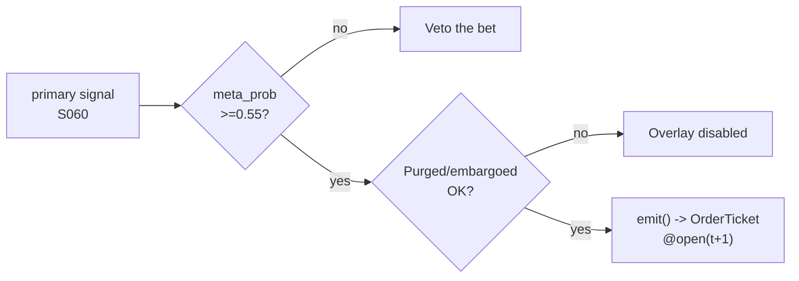

# T020 — Triple-Barrier + Meta-Labeling Overlay

> **Reviewer card.** ML overlay: triple-barrier labels (Lopez de Prado) turn any primary signal into a supervised problem; the meta-model predicts whether the primary bet will succeed; purged/embargoed validation (S088) keeps the overlay honest. Provenance **[D]**.
>
> Edge verdict: **NO-DOCUMENTED-EDGE** — no citable P&L for the meta-labeling overlay itself — Lopez de Prado (2018) is a methods book; the overlay's edge is the primary strategy's edge, filtered [documented].
>
> After-cost: **BEFORE-COST** — one-sentence verdict: meta-labeling cannot create edge — it can only filter the primary's edge, and the filter itself must survive purged/embargoed validation.
>
> Tier **S** · prototype 60–100 h [example] · loaded cost $9,000–15,000 [example] · latency bar / primary cadence · risk medium (model risk, overfitting).

> Capacity inherits the primary strategy's capacity [default] — the overlay only filters · Executability: Feasible: triple-barrier labeling + classifier on primary signals; any retail platform.

## §1  Identity & provenance

This module is a **strategy**: it emits `OrderTicket` intentions only — brokers create orders, strategies never do. Family **D  # ML overlay**, batch **TB4**, provenance **D**.

**Lede.** ML overlay: triple-barrier labels (Lopez de Prado) turn any primary signal into a supervised problem; the meta-model predicts whether the primary bet will succeed; purged/embargoed validation (S088) keeps the overlay honest. Provenance **[D]**.

**When it dies.** Primary edge decays; meta-model overfits; purged/embargoed validation fails.

**Regime gates (provisional).** inherits the primary's regime gates; meta-model recalibrated on regime change.

**Prototype scope.** triple-barrier labeling + meta-classifier + purged/embargoed validation + kill-switch.

## §1.5  Escalation gate

Cheapest viable path: **Polygon.io Stocks Basic** — bars at the primary's cadence at ~$100–200/mo [unverified] [unverified]. build the labeling and meta-model; buy nothing.

Resource budget: `2` cores, `<4` GB RAM [internal-est] [internal-est] · compute pattern `per_bar`.

Explicitly out of scope (phase two): deep learning (phase `2`); online learning; multi-primary ensembles.

Escalation gate: meta-model beyond gradient boosting [default]; primary cadence < 1-min [default] — crossing it requires re-review of §T7 and §T8.

## §T0  Contract — strategies emit intentions, brokers create orders

This strategy's sole output is a list of `OrderTicket` intentions. It never places, routes, or confirms an order. Every ticket carries `parent_signal` (the upstream signal id and its `computed_at`), an `intent_ts`, and a `tif`. The backtest harness fills tickets strictly after the signal bar (`fill_event > signal_event`, t->t+1 causality); any fill timestamped at or before its signal bar is a harness bug and trips the kill switch.

State variables carried between bars: ``primary_signal`, `meta_prob`, `barriers`, `position`, `module_state``.

## §T1  Strategy thesis & edge

**Thesis.** ML overlay: triple-barrier labels (Lopez de Prado) turn any primary signal into a supervised problem; the meta-model predicts whether the primary bet will succeed; purged/embargoed validation (S088) keeps the overlay honest. Provenance **[D]**.

**Edge verdict: NO-DOCUMENTED-EDGE** — no citable P&L for the meta-labeling overlay itself — Lopez de Prado (2018) is a methods book; the overlay's edge is the primary strategy's edge, filtered [documented].

**After-cost verdict: BEFORE-COST** — one-sentence verdict: meta-labeling cannot create edge — it can only filter the primary's edge, and the filter itself must survive purged/embargoed validation.

**Risk summary.** Overfitting the meta-model; label leakage; the primary edge decays and the overlay amplifies the decay.

**Math.**

```text
Triple-barrier labels (Lopez de Prado 2018 [documented]): for each
primary bet, profit-taking / stop-loss barriers at `±pt_sl_mult × σ̂` and a
vertical barrier at `max_hold_bars`; the label is which barrier touches first.
Meta-model: classifier predicting label `= +1` from bet features; trade only
if `P(+1) ≥ 0.55` [example]. Purged/embargoed walk-forward (S088). Modeled edge
`edge_bps = primary_edge_bps × (2 × meta_prob − 1)` [example].
```

**Pseudocode (normative).**

```text
function emit(state, signals, bars, cfg) -> list[OrderTicket]:
    assert bars non-empty else return UNKNOWN                       # F1
    t = bars[-1]
    primary = signals['S060'].direction
    meta_p  = signals['S060'].meta_prob
    assert primary in (-1, 0, 1) and isfinite(meta_p) else return UNKNOWN  # F2
    if not signals['S088'].validation_ok: return []                # C11: overlay disabled

    edge_bps = signals['S060'].primary_edge_bps * (2*meta_p - 1)   # [example]
    cost_ok = expected_cost_bps(notional, adv_pct, venue, side, urgency) <= cfg.cost_gate_k * edge_bps
    # ^^^ normative cost-gate predicate: expected_cost_bps(...) <= k * edge_bps

    tickets = []
    if primary != 0 and meta_p >= cfg.meta_threshold and cost_ok:
        side = 'BUY' if primary > 0 else 'SELL'
        tickets = [ticket(side=side, qty=size(meta_as_vol=meta_p), limit=open(t+1), tif='DAY',
                          parent_signal=f"S060@{t.bar_open_ts}")]
    # else: the overlay vetoes — it never generates direction
    for tk in tickets: log_decision(tk, inputs_hash, params_hash)  # C5 / App. g
    assert fill.event_ts > t.bar_close_ts for any fill             # t->t+1 causality
    return tickets
```

## §T2  Signal stack — dependencies & data rights

| Signal | Role | Contract |
|---|---|---|
| `S060` | trigger | primary signal (any strategy's direction); the overlay does not generate direction |
| `S061` | confirm | triple-barrier labels with half-life-set horizons; the labeling is the training target |
| `S088` | gate | purged/embargoed walk-forward; the meta-model must survive the honesty protocol |

Max dependency depth: `2` [default].

**Schema mapping (canonical).**

| Vendor (Polygon.io Stocks) | Canonical |
|---|---|
| `t` (ms) | `bar_open_ts` (int64 ns UTC; bar labeled by open time) |
| `o, h, l, c` | `open, high, low, close` |
| `v` | `volume` |

Staleness: max skew `5 s` [default] · jitter budget `30 s` [default] · TTL `120 s` [default] · cadence `per_bar (primary cadence)` · tz `America/New_York`.

**Inputs that break the module.**

| Input failure | Module state | Alert |
|---|---|---|
| Meta-model prob < threshold (gate) [example] | `DEGRADED` (veto the primary bet) | log |
| Purged/embargoed validation fails (gate) | `DEGRADED` (overlay disabled) | page |
| Primary signal missing | `UNKNOWN` | notify |

**Data rights.** Bars via Polygon.io Stocks, `rights: licensed`; research +
production; fixtures synthetic; entitlement = professional/internal; derived
features ours. Entitlement-class change → §1.5 escalation gate.

**Build vs buy.** Build the labeling and meta-model; buy nothing — the
purged/embargoed discipline is the IP.

**Local build.** Feasible. Triple-barrier labeling is a rolling computation; the
meta-classifier trains offline; the live loop is a probability threshold.

**Data dictionary (canonical fields).**

| Field | Type | Cadence | Tier | Notes |
|---|---|---|---|---|
| `Bars at the primary's cadence` | float/int | per bar | Tier 1 | triple-barrier labeling |
| `Primary bet features` | float | per bet | Tier 1 | meta-model inputs |

## §T3  Entry / exit / sizing & worked example

**Entry rule.**

```text
ENTER := (primary_signal fires) AND (meta_prob >= meta_threshold)
               AND (expected_cost_bps(...) <= cost_gate_k * edge_bps)
FLAT := otherwise — the overlay vetoes, never generates
```

**Exit rule.**

```text
EXIT := inherits the primary's exit
        OR (meta-model validation fails → overlay disabled, primary runs unfiltered)
        OR (module_state != OK)
```

**Cooldown.** `0` s [default] after every exit (C10).

**Sizing function (normative).**

```python
def shares(risk_budget_R, stop_distance, vol_estimate, ADV_cap, cost):
    # Inherits the primary's sizing; the overlay optionally scales by meta_prob
    # n_primary from the primary's sizing fn [default]
    n = risk_budget_R / max(stop_distance, 1e-9)   # [default] floor below
    n = n * (0.5 + 0.5 * vol_estimate)             # vol_estimate carries meta_prob [default]
    n = min(n, ADV_cap * 0.01)                    # 1% ADV [default]
    return int(n)
```

**Risk limits.**

| Limit | Value |
|---|---|
| Meta threshold | `0.55` [example] — below it the primary bet is vetoed |
| Validation gate | purged/embargoed must pass [default] or the overlay is disabled |
| Inherits | the primary's risk limits |

**Worked example (fixture-backed, from `fixtures/T020_tape.csv` trade 1).**

Trade 1: `BUY` `500` shares [example] @ `50.2` [example], exit `51.1` [example] (`primary exit (meta passed)`). Gross P&L = `450.00` [measured] dollars. Cost stack = `0.0` bps [example] → `0.00` [measured] dollars on `25100.00` [example] notional. Net = `450.00` [measured] dollars. The fixture's expected CSV carries the same arithmetic for all six trades; the per-module test recomputes it from the tape and asserts equality.

**Flow.**


## §T4  Parameters

| Parameter | Key | Default | Provenance | Sensitivity |
|---|---|---|---|---|
| PT/SL multiple | `pt_sl_mult` | `1.0`× | [default] | medium |
| Meta threshold | `meta_threshold` | `0.55` | [default] | high |
| Max hold bars | `max_hold_bars` | `20` | [default] | medium |
| Cost-gate k | `cost_gate_k` | `0.5` | [default] | high |

## §T5  Costs — the callable is the single source of truth

| Component | bps | Basis |
|---|---|---|
| Spread | `0.0` | [default] inherits the primary's cost model |
| Fees | `0.0` | [default] inherits the primary's cost model |
| Borrow | `0.0` | [default] inherits the primary's cost model |
| Impact | `0.0` | [default] inherits the primary's cost model |
| **Total** | `0.0` | [default] the overlay adds no cost — it only filters; the primary's COST block governs |

Fee schedule as of `2026-09-01` [example] · venue `inherits the primary's venue [default]` · side `taker` · borrow `0.0` bps/day [example] — inherits the primary's borrow.

```python
def expected_cost_bps(notional, adv_pct, venue, side, urgency) -> float:
    """Callable cost model - T020 COST block (single source of truth)."""
    # The overlay inherits the primary's cost model; stub returns 0 and the
    # cost gate is evaluated against the primary's expected_cost_bps.
    spread_bps = 0.0    # [default] inherits the primary's cost model
    fee_bps = 0.0       # [default] inherits the primary's cost model
    borrow_bps = 0.0    # [default] inherits the primary's cost model
    impact_bps = 0.0    # [default] inherits the primary's cost model
    return spread_bps + fee_bps + borrow_bps + impact_bps
```

**Normative cost-gate predicate (C3):** `expected_cost_bps(...) <= k * edge_bps` — no ticket is emitted unless the callable cost clears this gate. The predicate appears verbatim in the §T1 pseudocode and is asserted by the per-module test.

## §T6  Execution assumptions

| Aspect | Assumption |
|---|---|
| Latency | inherits the primary's latency |
| Partial fills | oldest `intent_ts` first (FIFO) |
| Impact | inherits the primary's impact model |
| Adverse fill | the meta-model is wrong — the primary's stop is the control |

## §T7  Risk contract & kill switch

Per-trade R: inherits the primary's per-trade R [default] · daily loss stop: inherits the primary's daily loss stop [default] · max gross: inherits the primary's max gross [default] · max adverse per trade: inherits the primary's [default].

Enforcement: `intraday-hard` [default]. Calibration recipe: meta-model on purged/embargoed walk-forward [default]; recalibrate on regime change [default]; re-pin fee schedule monthly [default].

**Kill switch: `ARMED` → `TRIPPED` → `RECOVERY` → `ARMED`.**

Trip conditions:

- meta-model validation fails [example]
- primary signal stale [example]
- clock skew > 50 ms [example]

On trip: the module stops emitting tickets immediately, flattens managed positions per the exit rule, and pages. `RECOVERY` requires manual review, cooldown expiry, and healthy feeds; only then does the module return to `ARMED`. The per-module test drives the full transition cycle.

**Ops.** Schedule: follows the primary strategy's schedule; the overlay is a filter, not a schedule · budget: `2` vCPU, `4` GB RAM [internal-est] [internal-est] · env: `POLYGON_API_KEY`.

**Universe.** inherits the primary strategy's universe. The overlay applies to
any primary signal (S060) with triple-barrier labels (S061) and purged/
embargoed validation (S088).

## §T8  Compliance (C1–C10+)

- **C1** | No orders: the strategy emits `OrderTicket` intentions only; the broker creates orders.
- **C2** | Kill switch: `ARMED` → `TRIPPED` → `RECOVERY` → `ARMED` on the trip conditions in §T7.
- **C3** | Cost gate: `expected_cost_bps(...) <= k * edge_bps` before any ticket (see §T5).
- **C4** | Causality: `fill_event > signal_event` (t->t+1); no signal-bar fills, ever.
- **C5** | Decision log: every ticket logged with inputs hash and params hash (see App. g).
- **C6** | Staleness: inputs older than the TTL → `UNKNOWN`, no tickets.
- **C7** | Short discipline: `locate_ok` required before any short ticket.
- **C8** | Cooldown: post-exit cooldown enforced in seconds; no re-entry inside it.
- **C9** | Session flatten: no uncommanded overnight carry.
- **C10** | Position caps: per-trade R, daily loss stop, and max gross enforced.
- **C11 | Validation gate: trigger = purged/embargoed validation fails → check = S088 → action = overlay disabled → log = `COMPLIANCE_BLOCK`**
- **C12 | Meta veto: trigger = meta_prob < `0.55` [example] → check = meta-model → action = veto the primary bet → log = `GATE_VETO`**

## §T9  Evidence, failures & regime gates

**Evidence (cost-level tokens; every statistic tagged).**

| Source | Sample | Finding | Cost level | Caveat |
|---|---|---|---|---|
| Lopez de Prado (2018) [documented] | (methods book) | triple-barrier labeling + meta-labeling methodology [documented] | `BEFORE-COST` (method) | methods, not a P&L — the overlay's edge is the primary's, filtered |
| Lopez de Prado (2020) [documented] | (methods book) | ML for asset managers: validation discipline [documented] | `BEFORE-COST` (method) | the honesty protocol, not a trading result |

**Where this module is known to fail.** meta-model overfitting, label leakage, primary edge decay, validation failure.

**Failure modes (detect → action → recovery).**

| # | Failure | Detect → action → recovery | Executable check |
|---|---|---|---|
| 1 | Overfitting | detect: purged/embargoed validation fails → action: overlay disabled (C11) → recovery: recalibrate [default] | `validation_ok` |
| 2 | Label leakage | detect: train/test overlap audit → action: halt, fix → recovery: re-label [default] | `no overlap` |
| 3 | Primary edge decays | detect: primary P&L degrades → action: overlay cannot save it — review primary → recovery: primary fixed [default] | `primary_edge > 0` |
| 4 | Meta-model stale | detect: calibration drift → action: recalibrate → recovery: recalibrated [default] | `calibration_fresh` |
| 5 | Lookahead in labels | detect: label uses future → action: halt, fix → recovery: no-signal-bar-fills test [default] | `all(fill_ts > signal_ts)` |

**Regime gates.**

| Regime | Effect | Mechanism | Condition | Action | Latency | Fallback |
|---|---|---|---|---|---|---|
| R-primary | degrades | primary's regime gates apply | primary gate [default] | inherit | 1 bar [default] | inherit |

**Robustness.** The meta-model is the risk: `meta_threshold` in `0.52`–`0.65` [default]
[example] trades filter strictness for bet frequency. Purged/embargoed
validation (S088) is non-negotiable — without it the overlay is overfit hope.
The overlay must re-earn its keep on every recalibration.

**What the optimistic case assumes (and we do not).** (1) the meta-model is assumed to generalize — purged/embargoed
validation is the honest control; (2) the primary edge is assumed to exist;
(3) label leakage assumed absent.

## §T10  Unverified leads & what would change our mind

- Meta-labeling P&L claims from practitioner sources — no citable P&L for the overlay itself found; not promoted.

What would change our mind: a purged/embargoed walk-forward with full costs that survives the S088 honesty protocol; a documented after-cost P&L from the cited authors' own implementations; or a regime-gated replication that holds outside the original sample.

## AI build prompt

```text
Build the T020 (Triple-Barrier + Meta-Labeling Overlay) strategy module from this specification.
Hard constraints:
- The strategy emits OrderTicket intentions ONLY; it never creates orders (C1).
- Causality: fill_event > signal_event (t->t+1); no signal-bar fills (C4).
- Cost gate: expected_cost_bps(...) <= k * edge_bps before any ticket (C3).
- Kill switch ARMED -> TRIPPED -> RECOVERY -> ARMED on the §T7 trip conditions (C2).
- Every numeric literal in prose carries an honesty tag [documented]/[measured]/[example]/[unverified]/[default]/[internal-est]; exempt identifiers only.
- Sources must be real and cited with cost-level tokens; chatbot-only material goes to §T10.
Config surface:
- pt_sl_mult (float): default 1.0, range 0.5–3.0 [default]
- meta_threshold (float): default 0.55, range 0.5–0.8 [default]
- max_hold_bars (float): default 20.0, range 5–100 [default]
- cooldown_s (float): default 0.0, range 0–3,600 [default]
- cost_gate_k (float): default 0.5, range 0.1–2.0 [default]
Entry rule:
ENTER := (primary_signal fires) AND (meta_prob >= meta_threshold)
               AND (expected_cost_bps(...) <= cost_gate_k * edge_bps)
FLAT := otherwise — the overlay vetoes, never generates
Exit rule:
EXIT := inherits the primary's exit
        OR (meta-model validation fails → overlay disabled, primary runs unfiltered)
        OR (module_state != OK)
Sizing: implement the §T3 sizing_fn verbatim; enforce the §T7 risk contract.
Deliverables: the module markdown (all sections §1–§T10), the fixture tape CSV
(fixtures/T020_tape.csv), the expected CSV (fixtures/T020_expected.csv), and
the per-module test (modules/tests/test_T020.py) covering fixture arithmetic,
causality, the cost gate, the kill-switch cycle, invalid→UNKNOWN, and the callable signature.
```
