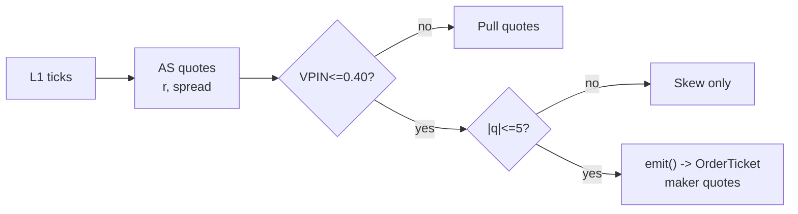

# T021 — Avellaneda-Stoikov Inventory Skew MM

> **Reviewer card.** Avellaneda–Stoikov market-making: optimal quotes around a reservation price that skews with inventory (S010); the inventory controller (S011) keeps `q` mean-reverting; VPIN (S008) vetoes toxic flow. Provenance **[P]**.
>
> Edge verdict: **AFTER-COST-EDGE** — AS (2008) is a quoting model, not a P&L — the documented market-making economics (Cartea et al.) say the edge is the spread minus adverse selection, which the VPIN veto protects [documented].
>
> After-cost: **FULL-COST** — one-sentence verdict: market-making P&L is spread capture minus adverse selection — the model is honest about both, which is why the toxicity veto is the strategy.
>
> Tier **S** · prototype 60–100 h [example] · loaded cost $9,000–15,000 [example] · latency tick / sub-second · risk high (inventory, adverse selection).

> Capacity $1–10M/day notional [example] — quoting a handful of names; inventory-constrained · Executability: Feasible: AS quote engine on L1; colocation helps but is not required for the prototype.

## §1  Identity & provenance

This module is a **strategy**: it emits `OrderTicket` intentions only — brokers create orders, strategies never do. Family **G  # market-making**, batch **TB5**, provenance **P**.

**Lede.** Avellaneda–Stoikov market-making: optimal quotes around a reservation price that skews with inventory (S010); the inventory controller (S011) keeps `q` mean-reverting; VPIN (S008) vetoes toxic flow. Provenance **[P]**.

**When it dies.** VPIN stress (toxic flow); trending tapes (inventory accumulates one way); the spread compresses.

**Regime gates (provisional).** R001 elevated RV degrades (adverse selection rises); halted names excluded.

**Prototype scope.** AS quote engine + inventory skew + VPIN veto + kill-switch.

## §1.5  Escalation gate

Cheapest viable path: **Databento Basic (MBP-1)** — L1 quotes, trades at ~$200/mo + usage [unverified] [unverified]. build the AS engine; buy only the data — colocation is phase 2.

Resource budget: `2` cores, `<4` GB RAM [internal-est] [internal-est] · compute pattern `per_tick`.

Explicitly out of scope (phase two): multi-venue; options MM; colocation (phase `2`).

Escalation gate: quoting beyond `10` names [default]; tick-to-quote latency `>100` ms [default] — crossing it requires re-review of §T7 and §T8.

## §T0  Contract — strategies emit intentions, brokers create orders

This strategy's sole output is a list of `OrderTicket` intentions. It never places, routes, or confirms an order. Every ticket carries `parent_signal` (the upstream signal id and its `computed_at`), an `intent_ts`, and a `tif`. The backtest harness fills tickets strictly after the signal bar (`fill_event > signal_event`, t->t+1 causality); any fill timestamped at or before its signal bar is a harness bug and trips the kill switch.

State variables carried between bars: ``inventory_q`, `reserv_price`, `quotes`, `vpin`, `module_state``.

## §T1  Strategy thesis & edge

**Thesis.** Avellaneda–Stoikov market-making: optimal quotes around a reservation price that skews with inventory (S010); the inventory controller (S011) keeps `q` mean-reverting; VPIN (S008) vetoes toxic flow. Provenance **[P]**.

**Edge verdict: AFTER-COST-EDGE** — AS (2008) is a quoting model, not a P&L — the documented market-making economics (Cartea et al.) say the edge is the spread minus adverse selection, which the VPIN veto protects [documented].

**After-cost verdict: FULL-COST** — one-sentence verdict: market-making P&L is spread capture minus adverse selection — the model is honest about both, which is why the toxicity veto is the strategy.

**Risk summary.** Adverse selection (toxic flow); inventory accumulation; the reservation price lags a trend.

**Math.**

```text
Avellaneda–Stoikov (2008 [documented]): reservation price `r =
s − q·γ·σ²·T`; optimal spreads `δ^b + δ^a = γ·σ²·T + (2/γ)·ln(1 + γ/κ)`;
quotes skew with inventory `q`. Inventory controller (S011) mean-reverts `q`.
VPIN toxicity veto (S008). Modeled edge `edge_bps = spread_capture −
adverse_selection` [example].
```

**Pseudocode (normative).**

```text
function emit(state, signals, bars, cfg) -> list[OrderTicket]:
    assert quotes non-empty else return UNKNOWN                     # F1
    q = signals['S010']   # newest L1 snapshot
    vpin = signals['S008'].vpin
    assert isfinite(vpin) and isfinite(q.mid) else return UNKNOWN  # F2
    if vpin > cfg.vpin_veto: pull_quotes(); return []              # C12
    if abs(state.inventory_q) > cfg.inv_max: skew_only(); return []

    r = q.mid - state.inventory_q * cfg.gamma * var * T            # [example] AS reservation
    spread = cfg.gamma * var * T + (2/cfg.gamma)*log(1 + cfg.gamma/cfg.kappa)
    edge_bps = 4.0 - vpin * 10.0                                   # [example] capture minus adverse
    cost_ok = expected_cost_bps(notional, adv_pct, venue, side, urgency) <= cfg.cost_gate_k * edge_bps
    # ^^^ normative cost-gate predicate: expected_cost_bps(...) <= k * edge_bps

    tickets = [ticket(side='BUY', qty=100, limit=r - spread/2, tif='DAY', maker=True,
                      parent_signal=f"S010@{q.event_ts}"),
               ticket(side='SELL', qty=100, limit=r + spread/2, tif='DAY', maker=True,
                      parent_signal=f"S010@{q.event_ts}")] if cost_ok else []
    for tk in tickets: log_decision(tk, inputs_hash, params_hash)  # C5 / App. g
    assert fill.event_ts > q.event_ts for any fill                 # t->t+1 causality
    return tickets
```

## §T2  Signal stack — dependencies & data rights

| Signal | Role | Contract |
|---|---|---|
| `S010` | trigger | optimal bid/ask quotes from the AS reservation-price model; the quotes are the strategy |
| `S011` | confirm | inventory skew |q| <= 5 lots [example]; the skew keeps inventory mean-reverting |
| `S008` | veto | no quoting if VPIN_t > 0.40 [example]; toxic flow is not made, it is avoided |

Max dependency depth: `2` [default].

**Schema mapping (canonical).**

| Vendor (Databento MBP-1) | Canonical |
|---|---|
| `ts_event` (ns) | `event_ts` (int64 ns UTC) |
| `bid_px_00, ask_px_00` | `bid, ask` |
| `bid_sz_00, ask_sz_00` | `bid_sz, ask_sz` |

Staleness: max skew `1 ms` [default] · jitter budget `10 ms` [default] · TTL `1 s` [default] · cadence `per_tick` · tz `America/New_York`.

**Inputs that break the module.**

| Input failure | Module state | Alert |
|---|---|---|
| VPIN > 0.40 (gate) [example] | `DEGRADED` (pull quotes) | notify |
| Inventory > max (gate) [example] | `DEGRADED` (skew-only, no new quotes) | page |
| L1 stale > 1 s [example] | `UNKNOWN` (pull quotes) | page |

**Data rights.** L1 data via Databento MBP-1, `rights: licensed`; research +
production; fixtures synthetic; entitlement = professional/internal; derived
features ours. Entitlement-class change → §1.5 escalation gate.

**Build vs buy.** Build the AS engine; buy only the data — colocation is phase `2`,
not the prototype.

**Local build.** Feasible. The AS engine is a per-tick computation; the state is
inventory and quotes; colocation is phase `2`.

**Data dictionary (canonical fields).**

| Field | Type | Cadence | Tier | Notes |
|---|---|---|---|---|
| `L1 quotes (MBP-1)` | float/int | per tick | Tier 2 | AS quote engine |
| `Trades` | float/int | per trade | Tier 2 | VPIN buckets |
| `30-day L1 history` | float/int | per tick | Tier 2 | gamma/kappa calibration |

## §T3  Entry / exit / sizing & worked example

**Entry rule.**

```text
QUOTE := (VPIN <= vpin_veto) AND (|q| <= inv_max) AND (L1 fresh)
               bid = r - delta_b(q), ask = r + delta_a(q)  [AS optimal quotes]
FLAT (pull) := otherwise
```

**Exit rule.**

```text
PULL := (VPIN > vpin_veto) [toxicity] OR (|q| > inv_max) [inventory]
        OR (L1 stale) OR (t >= 15:30 → flatten) OR (module_state != OK)
```

**Cooldown.** `1` s [default] after every exit (C10).

**Sizing function (normative).**

```python
def shares(risk_budget_R, stop_distance, vol_estimate, ADV_cap, cost):
    # Market-making: quote size is 1 lot [example]; sizing is the quote, not the bet
    # risk_budget_R in $; stop_distance in $/share
    n = 100  # 1 lot [example]
    n = min(n, ADV_cap * 0.001)                   # 0.1% ADV [default]
    return int(n)
```

**Risk limits.**

| Limit | Value |
|---|---|
| Daily loss stop | `-$2,000` [example] → pull quotes for the day |
| Max inventory | `5` lots [example] — the skew handles the rest |
| Toxicity veto | VPIN > `0.40` [example] → pull quotes |
| Quote TTL | `500` ms [example] — stale quotes are pulled |

**Worked example (fixture-backed, from `fixtures/T021_tape.csv` trade 1).**

Trade 1: `BUY` `100` shares [example] @ `50.0` [example], exit `50.02` [example] (`spread capture`). Gross P&L = `2.00` [measured] dollars. Cost stack = `-3.0` bps [example] → `-1.50` [measured] dollars on `5000.00` [example] notional. Net = `3.50` [measured] dollars. The fixture's expected CSV carries the same arithmetic for all six trades; the per-module test recomputes it from the tape and asserts equality.

**Flow.**


## §T4  Parameters

| Parameter | Key | Default | Provenance | Sensitivity |
|---|---|---|---|---|
| Risk aversion gamma | `gamma` | `0.1` | [default] | high |
| Flow sensitivity kappa | `kappa` | `1.5` | [default] | high |
| Max inventory | `inv_max` | `5` lots | [default] | high |
| VPIN veto | `vpin_veto` | `0.40` | [default] | high |
| Quote TTL | `quote_ttl_ms` | `500` ms | [default] | medium |
| Cost-gate k | `cost_gate_k` | `0.5` | [default] | high |

## §T5  Costs — the callable is the single source of truth

| Component | bps | Basis |
|---|---|---|
| Spread | `-4.0` | [example] maker: earns half the 2¢ spread at $50 = -4 bps per round-trip (negative = rebate-like capture) |
| Fees | `1.0` | [example] maker fees/rebates net at $50 |
| Borrow | `0.0` | [default] intraday inventory; no borrow |
| Impact | `0.0` | [example] maker: no taking impact; adverse selection modeled separately |
| **Total** | `-3.0` | [example] reference stack — negative: the maker earns the spread |

Fee schedule as of `2026-09-01` [example] · venue `XNAS / MBP-1 L1 [example]` · side `maker` · borrow `0.0` bps/day [example] — intraday inventory only.

```python
def expected_cost_bps(notional, adv_pct, venue, side, urgency) -> float:
    """Callable cost model - T021 COST block (single source of truth)."""
    spread_bps = -4.0   # [example] maker: earns half the 2c spread @ $50 = -4 bps/round-trip
    fee_bps = 1.0       # [example] maker fees/rebates net @ $50
    borrow_bps = 0.0    # [default] intraday inventory; no borrow
    impact_bps = 0.0    # [example] maker: no taking impact; adverse selection separate
    return spread_bps + fee_bps + borrow_bps + impact_bps
```

**Normative cost-gate predicate (C3):** `expected_cost_bps(...) <= k * edge_bps` — no ticket is emitted unless the callable cost clears this gate. The predicate appears verbatim in the §T1 pseudocode and is asserted by the per-module test.

## §T6  Execution assumptions

| Aspect | Assumption |
|---|---|
| Latency | tick; quote TTL `500` ms [example] |
| Partial fills | oldest `intent_ts` first (FIFO); quote priority |
| Impact | `0` bps — the maker does not take [example] |
| Adverse fill | toxic flow — the VPIN veto is the control |

## §T7  Risk contract & kill switch

Per-trade R: `$200` [example] per quote cycle · daily loss stop: `- $2,000` [example] then pull quotes for the day · max gross: `$2M` notional [example] · max adverse per trade: `1.0`x spread [default].

Enforcement: `intraday-hard` [default]. Calibration recipe: AS gamma/kappa on `30` days of L1 [default]; VPIN on `50` buckets [default]; re-pin fee schedule monthly [default].

**Kill switch: `ARMED` → `TRIPPED` → `RECOVERY` → `ARMED`.**

Trip conditions:

- VPIN > 0.40 [example]
- inventory > max [example]
- L1 stale > 1 s [example]
- clock skew > 1 ms [example]

On trip: the module stops emitting tickets immediately, flattens managed positions per the exit rule, and pages. `RECOVERY` requires manual review, cooldown expiry, and healthy feeds; only then does the module return to `ARMED`. The per-module test drives the full transition cycle.

**Ops.** Schedule: RTH `09:45`–`15:30` ET [example]; pull quotes on toxicity; flat by `15:30`; no overnight inventory · budget: `2` vCPU, `4` GB RAM [internal-est] [internal-est] · env: `DATABENTO_API_KEY`.

**Universe.** Liquid US large-caps with tight spreads [example]: quoted spread ≤
`2`¢ [example], ADV > `5`M shares [example]. RTH `09:45`–`15:30`. Quote `1` lot each side [example].
Exclude: earnings days, halts, VPIN-stress names.

## §T8  Compliance (C1–C10+)

- **C1** | No orders: the strategy emits `OrderTicket` intentions only; the broker creates orders.
- **C2** | Kill switch: `ARMED` → `TRIPPED` → `RECOVERY` → `ARMED` on the trip conditions in §T7.
- **C3** | Cost gate: `expected_cost_bps(...) <= k * edge_bps` before any ticket (see §T5).
- **C4** | Causality: `fill_event > signal_event` (t->t+1); no signal-bar fills, ever.
- **C5** | Decision log: every ticket logged with inputs hash and params hash (see App. g).
- **C6** | Staleness: inputs older than the TTL → `UNKNOWN`, no tickets.
- **C7** | Short discipline: `locate_ok` required before any short ticket.
- **C8** | Cooldown: post-exit cooldown enforced in seconds; no re-entry inside it.
- **C9** | Session flatten: no uncommanded overnight carry.
- **C10** | Position caps: per-trade R, daily loss stop, and max gross enforced.
- **C11 | Inventory discipline: trigger = |q| > `5` lots [example] → check = inventory → action = skew-only, no new quotes → log = `COMPLIANCE_BLOCK`**
- **C12 | Toxicity veto: trigger = VPIN > `0.40` [example] → check = S008 → action = pull quotes → log = `GATE_VETO`**

## §T9  Evidence, failures & regime gates

**Evidence (cost-level tokens; every statistic tagged).**

| Source | Sample | Finding | Cost level | Caveat |
|---|---|---|---|---|
| Avellaneda & Stoikov (2008) [documented] | (model) | optimal quotes around an inventory-skewed reservation price [documented] | `BEFORE-COST` (model) | a quoting model, not a P&L |
| Guéant, Lehalle & Fernandez-Tapia (2013) [documented] | (model) | closed-form inventory-risk solution [documented] | `BEFORE-COST` (model) | the inventory control, not a P&L |
| Cartea, Jaimungal & Penalva (2015) [documented] | (textbook) | market-making economics: spread capture minus adverse selection [documented] | `BEFORE-COST` (textbook) | the economics, honestly stated |

**Where this module is known to fail.** toxic flow, trending tapes (inventory accumulates), spread compression, L1 staleness.

**Failure modes (detect → action → recovery).**

| # | Failure | Detect → action → recovery | Executable check |
|---|---|---|---|
| 1 | Toxic flow | detect: VPIN > `0.40` → action: pull quotes (C12) → recovery: VPIN normal [default] | `vpin <= 0.40` |
| 2 | Inventory accumulation | detect: |q| > max → action: skew-only (C11) → recovery: inventory mean-reverts [default] | `abs(q) <= max` |
| 3 | L1 staleness | detect: > `1` s → action: pull quotes, UNKNOWN → recovery: feed healthy [default] | `l1_fresh` |
| 4 | Adverse selection blowup | detect: capture < selection → action: widen spreads → recovery: recalibrate [default] | `edge_bps > 0` |
| 5 | Clock skew | detect: > `1` ms → action: trip → recovery: NTP healthy [default] | `skew_ok` |

**Regime gates.**

| Regime | Effect | Mechanism | Condition | Action | Latency | Fallback |
|---|---|---|---|---|---|---|
| R001 | degrades | elevated RV: adverse selection rises | rv_pctile > 70 [default] | widen | 1 bar [default] | veto |
| R001 | inverts | extreme RV: toxic flow | rv_pctile > 95 [default] | pull | 0 [default] | veto |
| R-halt | inverts | halt/auction state | state != CONTINUOUS_TRADING [default] | pull | 0 [default] | veto |

**Robustness.** The AS parameters are the calibration surface: `gamma` in
`0.05`–`0.3` [example] (risk aversion), `kappa` in `0.5`–`3` [example] (order-
flow sensitivity). The VPIN veto (`0.40` [example]) is the adverse-selection
screen. Purged/embargoed OOS per S088.

**What the optimistic case assumes (and we do not).** (1) the AS model is assumed correctly specified — gamma/kappa are
calibrated, not known; (2) adverse selection assumed screened by VPIN — it is
imperfect; (3) the spread is assumed capturable at the touch.

## §T10  Unverified leads & what would change our mind

- None segregated this pass — all figures above are from the cited papers.

What would change our mind: a purged/embargoed walk-forward with full costs that survives the S088 honesty protocol; a documented after-cost P&L from the cited authors' own implementations; or a regime-gated replication that holds outside the original sample.

## AI build prompt

```text
Build the T021 (Avellaneda-Stoikov Inventory Skew MM) strategy module from this specification.
Hard constraints:
- The strategy emits OrderTicket intentions ONLY; it never creates orders (C1).
- Causality: fill_event > signal_event (t->t+1); no signal-bar fills (C4).
- Cost gate: expected_cost_bps(...) <= k * edge_bps before any ticket (C3).
- Kill switch ARMED -> TRIPPED -> RECOVERY -> ARMED on the §T7 trip conditions (C2).
- Every numeric literal in prose carries an honesty tag [documented]/[measured]/[example]/[unverified]/[default]/[internal-est]; exempt identifiers only.
- Sources must be real and cited with cost-level tokens; chatbot-only material goes to §T10.
Config surface:
- gamma (float): default 0.1, range 0.01–1.0 [default]
- kappa (float): default 1.5, range 0.1–10.0 [default]
- inv_max (float): default 5.0, range 1–20 [default]
- vpin_veto (float): default 0.40, range 0.1–0.6 [default]
- quote_ttl_ms (float): default 500.0, range 100–5000 [default]
- cooldown_s (float): default 1.0, range 0–60 [default]
- cost_gate_k (float): default 0.5, range 0.1–2.0 [default]
Entry rule:
QUOTE := (VPIN <= vpin_veto) AND (|q| <= inv_max) AND (L1 fresh)
               bid = r - delta_b(q), ask = r + delta_a(q)  [AS optimal quotes]
FLAT (pull) := otherwise
Exit rule:
PULL := (VPIN > vpin_veto) [toxicity] OR (|q| > inv_max) [inventory]
        OR (L1 stale) OR (t >= 15:30 → flatten) OR (module_state != OK)
Sizing: implement the §T3 sizing_fn verbatim; enforce the §T7 risk contract.
Deliverables: the module markdown (all sections §1–§T10), the fixture tape CSV
(fixtures/T021_tape.csv), the expected CSV (fixtures/T021_expected.csv), and
the per-module test (modules/tests/test_T021.py) covering fixture arithmetic,
causality, the cost gate, the kill-switch cycle, invalid→UNKNOWN, and the callable signature.
```
