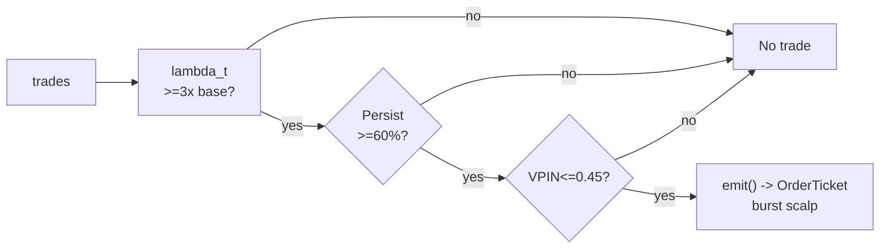

# T023 — Hawkes Burst Scalper

> **Reviewer card.** Hawkes burst scalping: self-exciting order-flow bursts (S012) are traded in the burst direction; direction persistence (S013) confirms; VPIN (S008) vetoes toxic bursts. Provenance **[D]**.
>
> Edge verdict: **NO-DOCUMENTED-EDGE** — no citable P&L for Hawkes-burst scalping — Bacry et al. and Filimonov & Sornette document the self-excitation, not a trading rule [documented].
>
> After-cost: **BEFORE-COST** — one-sentence verdict: self-excitation is documented; the scalper's P&L is not — the burst must pay for its own latency.
>
> Tier **S** · prototype 60–100 h [example] · loaded cost $9,000–15,000 [example] · latency tick / sub-100ms · risk high (burst chasing, latency).

> Capacity $1–5M/day notional [example] — burst scalps are tiny and latency-bound · Executability: Feasible: Hawkes intensity on trade arrivals; colocation helps; the prototype runs on L1.

## §1  Identity & provenance

This module is a **strategy**: it emits `OrderTicket` intentions only — brokers create orders, strategies never do. Family **H  # HFT / toxicity-aware**, batch **TB5**, provenance **D**.

**Lede.** Hawkes burst scalping: self-exciting order-flow bursts (S012) are traded in the burst direction; direction persistence (S013) confirms; VPIN (S008) vetoes toxic bursts. Provenance **[D]**.

**When it dies.** VPIN stress; the burst mean-reverts faster than the fill; latency > `100` ms [example].

**Regime gates (provisional).** R001 elevated RV amplifies (bursts are bigger); halted names excluded.

**Prototype scope.** Hawkes intensity + direction persistence + VPIN veto + kill-switch.

## §1.5  Escalation gate

Cheapest viable path: **Databento Basic (MBP-1)** — trades, L1 quotes at ~$200/mo + usage [unverified] [unverified]. build the Hawkes engine; buy only the data.

Resource budget: `2` cores, `<4` GB RAM [internal-est] [internal-est] · compute pattern `per_tick`.

Explicitly out of scope (phase two): mutually exciting (cross-asset); L2 Hawkes (phase `2`).

Escalation gate: tick-to-trade latency `>100` ms [default]; bursts beyond `10` names [default] — crossing it requires re-review of §T7 and §T8.

## §T0  Contract — strategies emit intentions, brokers create orders

This strategy's sole output is a list of `OrderTicket` intentions. It never places, routes, or confirms an order. Every ticket carries `parent_signal` (the upstream signal id and its `computed_at`), an `intent_ts`, and a `tif`. The backtest harness fills tickets strictly after the signal bar (`fill_event > signal_event`, t->t+1 causality); any fill timestamped at or before its signal bar is a harness bug and trips the kill switch.

State variables carried between bars: ``lambda_t`, `baseline`, `persistence`, `vpin`, `cooldown_until`, `position`, `module_state``.

## §T1  Strategy thesis & edge

**Thesis.** Hawkes burst scalping: self-exciting order-flow bursts (S012) are traded in the burst direction; direction persistence (S013) confirms; VPIN (S008) vetoes toxic bursts. Provenance **[D]**.

**Edge verdict: NO-DOCUMENTED-EDGE** — no citable P&L for Hawkes-burst scalping — Bacry et al. and Filimonov & Sornette document the self-excitation, not a trading rule [documented].

**After-cost verdict: BEFORE-COST** — one-sentence verdict: self-excitation is documented; the scalper's P&L is not — the burst must pay for its own latency.

**Risk summary.** Burst exhaustion (the burst is the top); latency (the burst is gone before you arrive); toxic bursts.

**Math.**

```text
Hawkes intensity `λ_t = μ + Σ α·e^{−β(t−t_i)}` over trade
arrivals (Hawkes 1971 [documented]; Bacry et al. 2013 [documented]). Burst:
`λ_t ≥ 3× baseline` [example] (S012). Direction persistence: fraction of
burst trades in the majority direction `≥ 60`% [example] (S013). VPIN veto
(S008). Modeled edge `edge_bps = burst_move_bps × 0.5` [example].
```

**Pseudocode (normative).**

```text
function emit(state, signals, bars, cfg) -> list[OrderTicket]:
    assert trades non-empty else return UNKNOWN                     # F1
    tr = signals['S012']   # newest trade with Hawkes intensity
    vpin = signals['S008'].vpin
    assert isfinite(tr.lambda_t) and isfinite(vpin) else return UNKNOWN  # F2
    if vpin > cfg.vpin_veto: return []                            # C12
    if tr.event_ts < state.cooldown_until: return []               # C10/C11

    edge_bps = tr.burst_move_bps * 0.5                             # [example]
    cost_ok = expected_cost_bps(notional, adv_pct, venue, side, urgency) <= cfg.cost_gate_k * edge_bps
    # ^^^ normative cost-gate predicate: expected_cost_bps(...) <= k * edge_bps

    tickets = []
    if tr.lambda_t >= cfg.burst_mult * tr.baseline and tr.persistence >= cfg.persist_min and cost_ok:
        side = 'BUY' if tr.direction > 0 else 'SELL'
        tickets = [ticket(side=side, qty=100, limit=touch(tr), tif='DAY',
                          parent_signal=f"S012@{tr.event_ts}")]
        state.cooldown_until = tr.event_ts + cfg.cooldown_s * 1e9
    for tk in tickets: log_decision(tk, inputs_hash, params_hash)  # C5 / App. g
    assert fill.event_ts > tr.event_ts for any fill               # t->t+1 causality
    return tickets
```

## §T2  Signal stack — dependencies & data rights

| Signal | Role | Contract |
|---|---|---|
| `S012` | trigger | Hawkes intensity λ_t >= 3× baseline [example]; the burst is the signal |
| `S013` | confirm | burst direction persistence >= 60% [example]; the burst must have a direction |
| `S008` | veto | no trading if VPIN_t > 0.45 [example]; toxic bursts are not traded |

Max dependency depth: `2` [default].

**Schema mapping (canonical).**

| Vendor (Databento MBP-1) | Canonical |
|---|---|
| `ts_event` (ns) | `event_ts` (int64 ns UTC) |
| `bid_px_00, ask_px_00` | `bid, ask` |
| `price, size` (trades) | `trade_px, trade_sz` |

Staleness: max skew `1 ms` [default] · jitter budget `10 ms` [default] · TTL `1 s` [default] · cadence `per_tick` · tz `America/New_York`.

**Inputs that break the module.**

| Input failure | Module state | Alert |
|---|---|---|
| VPIN > 0.45 (gate) [example] | `DEGRADED` (no burst trades) | notify |
| Persistence < 60% (gate) [example] | `DEGRADED` (no trade) | log |
| Trade feed stale > 1 s [example] | `UNKNOWN` | page |

**Data rights.** Trade data via Databento MBP-1, `rights: licensed`; research +
production; fixtures synthetic; entitlement = professional/internal; derived
features ours. Entitlement-class change → §1.5 escalation gate.

**Build vs buy.** Build the Hawkes engine; buy only the data — the burst threshold
is the IP.

**Local build.** Feasible. Hawkes intensity is a per-trade recursion; the state
is the intensity and the cooldown.

**Data dictionary (canonical fields).**

| Field | Type | Cadence | Tier | Notes |
|---|---|---|---|---|
| `Trades (MBP-1)` | float/int | per trade | Tier 2 | Hawkes intensity |
| `L1 quotes` | float/int | per tick | Tier 2 | touch pricing |
| `30-day trade history` | float/int | per trade | Tier 2 | kernel calibration |

## §T3  Entry / exit / sizing & worked example

**Entry rule.**

```text
ENTER := (λ_t >= burst_mult × baseline) AND (persistence >= persist_min)
               AND (VPIN <= vpin_veto) AND (expected_cost_bps(...) <= cost_gate_k * edge_bps)
               direction := burst direction
FLAT := otherwise
```

**Exit rule.**

```text
EXIT := (hold_ms elapsed) [the burst is the trade]
        OR (λ_t < baseline) [burst exhausted] OR (VPIN > vpin_veto → flatten)
        OR (module_state != OK)
```

**Cooldown.** `5` s [default] after every exit (C10).

**Sizing function (normative).**

```python
def shares(risk_budget_R, stop_distance, vol_estimate, ADV_cap, cost):
    # Burst scalp: 1 lot [example]; sizing is fixed, the edge is the timing
    n = 100  # 1 lot [example]
    n = min(n, ADV_cap * 0.001)                   # 0.1% ADV [default]
    return int(n)
```

**Risk limits.**

| Limit | Value |
|---|---|
| Daily loss stop | `-$1,500` [example] → dark for the day |
| Max one burst scalp | `1` lot [example] |
| Toxicity veto | VPIN > `0.45` [example] → no burst trades |
| Post-burst cooldown | `5` s [example] — C10 |

**Worked example (fixture-backed, from `fixtures/T023_tape.csv` trade 1).**

Trade 1: `BUY` `100` shares [example] @ `50.02` [example], exit `50.08` [example] (`hold 500ms`). Gross P&L = `6.00` [measured] dollars. Cost stack = `14.0` bps [example] → `7.00` [measured] dollars on `5002.00` [example] notional. Net = `-1.00` [measured] dollars. The fixture's expected CSV carries the same arithmetic for all six trades; the per-module test recomputes it from the tape and asserts equality.

**Flow.**


## §T4  Parameters

| Parameter | Key | Default | Provenance | Sensitivity |
|---|---|---|---|---|
| Burst multiple | `burst_mult` | `3.0`× | [default] | high |
| Persistence min | `persist_min` | `60`% | [default] | high |
| VPIN veto | `vpin_veto` | `0.45` | [default] | high |
| Hold ms | `hold_ms` | `500` ms | [default] | medium |
| Post-burst cooldown | `cooldown_s` | `5` s | [default] | low |
| Cost-gate k | `cost_gate_k` | `0.5` | [default] | high |

## §T5  Costs — the callable is the single source of truth

| Component | bps | Basis |
|---|---|---|
| Spread | `8.0` | [example] $0.02 assumed spread at $50: half-spread per aggressive leg × 2 legs (taker scalp) |
| Fees | `2.0` | [example] $0.005/share each way at $50 = 1 bps/leg |
| Borrow | `0.0` | [default] intraday scalp; no borrow |
| Impact | `4.0` | [example] burst chasing — 2¢ adverse on a $50 name |
| **Total** | `14.0` | [example] reference stack |

Fee schedule as of `2026-09-01` [example] · venue `XNAS / MBP-1 [example]` · side `taker` · borrow `0.0` bps/day [example] — intraday scalp only.

```python
def expected_cost_bps(notional, adv_pct, venue, side, urgency) -> float:
    """Callable cost model - T023 COST block (single source of truth)."""
    spread_bps = 8.0    # [example] $0.02 assumed spread @ $50: half/aggressive x 2 (taker)
    fee_bps = 2.0       # [example] $0.005/share each way @ $50 = 1 bps/leg
    borrow_bps = 0.0    # [default] intraday scalp; no borrow
    impact_bps = 4.0    # [example] burst chasing: 2c adverse @ $50
    return spread_bps + fee_bps + borrow_bps + impact_bps
```

**Normative cost-gate predicate (C3):** `expected_cost_bps(...) <= k * edge_bps` — no ticket is emitted unless the callable cost clears this gate. The predicate appears verbatim in the §T1 pseudocode and is asserted by the per-module test.

## §T6  Execution assumptions

| Aspect | Assumption |
|---|---|
| Latency | tick; tick-to-trade `>100` ms kills the edge [example] |
| Partial fills | oldest `intent_ts` first (FIFO) |
| Impact | `4` bps modeled [example] — burst chasing |
| Adverse fill | the burst is the top — the hold-ms exit is the control |

## §T7  Risk contract & kill switch

Per-trade R: `$150` [example] per burst scalp · daily loss stop: `- $1,500` [example] then dark for the day · max gross: `$1M` notional [example] · max adverse per trade: `1.0`x burst move [default].

Enforcement: `intraday-hard` [default]. Calibration recipe: Hawkes kernel on `30` days of trades [default]; persistence on `30` days [default]; re-pin fee schedule monthly [default].

**Kill switch: `ARMED` → `TRIPPED` → `RECOVERY` → `ARMED`.**

Trip conditions:

- VPIN > 0.45 [example]
- trade feed stale > 1 s [example]
- clock skew > 1 ms [example]
- tick-to-trade > 100 ms [example]

On trip: the module stops emitting tickets immediately, flattens managed positions per the exit rule, and pages. `RECOVERY` requires manual review, cooldown expiry, and healthy feeds; only then does the module return to `ARMED`. The per-module test drives the full transition cycle.

**Ops.** Schedule: RTH `09:45`–`15:30` ET [example]; burst scalps only; flat by `15:30`; no overnight · budget: `2` vCPU, `4` GB RAM [internal-est] [internal-est] · env: `DATABENTO_API_KEY`.

**Universe.** Liquid US large-caps [example]: ADV > `5`M shares [example], quoted spread ≤
`2`¢. RTH `09:45`–`15:30`. Scalp `1` lot per burst [example]. Exclude: earnings
days, halts, VPIN-stress names.

## §T8  Compliance (C1–C10+)

- **C1** | No orders: the strategy emits `OrderTicket` intentions only; the broker creates orders.
- **C2** | Kill switch: `ARMED` → `TRIPPED` → `RECOVERY` → `ARMED` on the trip conditions in §T7.
- **C3** | Cost gate: `expected_cost_bps(...) <= k * edge_bps` before any ticket (see §T5).
- **C4** | Causality: `fill_event > signal_event` (t->t+1); no signal-bar fills, ever.
- **C5** | Decision log: every ticket logged with inputs hash and params hash (see App. g).
- **C6** | Staleness: inputs older than the TTL → `UNKNOWN`, no tickets.
- **C7** | Short discipline: `locate_ok` required before any short ticket.
- **C8** | Cooldown: post-exit cooldown enforced in seconds; no re-entry inside it.
- **C9** | Session flatten: no uncommanded overnight carry.
- **C10** | Position caps: per-trade R, daily loss stop, and max gross enforced.
- **C11 | Burst discipline: trigger = second scalp within `5` s [example] → check = cooldown → action = veto → log = `GATE_VETO`**
- **C12 | Toxicity veto: trigger = VPIN > `0.45` [example] → check = S008 → action = no burst trades → log = `GATE_VETO`**

## §T9  Evidence, failures & regime gates

**Evidence (cost-level tokens; every statistic tagged).**

| Source | Sample | Finding | Cost level | Caveat |
|---|---|---|---|---|
| Hawkes (1971) [documented] | (theory) | self-exciting point processes [documented] | `BEFORE-COST` (theory) | the intensity model, not a trading rule |
| Bacry et al. (2013) [documented] | (model) | mutually exciting processes for microstructure noise [documented] | `BEFORE-COST` (model) | the microstructure model, not a P&L |
| Filimonov & Sornette (2012) [documented] | S&P 500 futures | reflexivity quantified; endogeneity rising [documented] | `BEFORE-COST` (measurement) | self-excitation documented; no trading rule |

**Where this module is known to fail.** burst exhaustion, latency, toxic bursts, VPIN stress.

**Failure modes (detect → action → recovery).**

| # | Failure | Detect → action → recovery | Executable check |
|---|---|---|---|
| 1 | Burst exhaustion | detect: λ_t < baseline → action: exit → recovery: next burst [default] | `lambda >= baseline` |
| 2 | Toxic burst | detect: VPIN > `0.45` → action: no trades (C12) → recovery: VPIN normal [default] | `vpin <= 0.45` |
| 3 | Latency blowup | detect: tick-to-trade > `100` ms → action: trip → recovery: latency normal [default] | `latency_ok` |
| 4 | Feed staleness | detect: > `1` s → action: UNKNOWN → recovery: feed healthy [default] | `feed_fresh` |
| 5 | Clock skew | detect: > `1` ms → action: trip → recovery: NTP healthy [default] | `all(fill_ts > signal_ts)` |

**Regime gates.**

| Regime | Effect | Mechanism | Condition | Action | Latency | Fallback |
|---|---|---|---|---|---|---|
| R001 | amplifies | elevated RV: bursts are bigger | rv_pctile > 70 [default] | trade | 1 bar [default] | veto |
| R001 | degrades | extreme RV: toxic bursts | rv_pctile > 95 [default] | veto | 0 [default] | veto |
| R-halt | inverts | halt/auction state | state != CONTINUOUS_TRADING [default] | veto | 0 [default] | veto |

**Robustness.** The burst threshold is the calibration surface: `burst_mult` in
`2`–`5`× [example] trades frequency for burst quality. `hold_ms` in `200`–
`1000` [example] is the exit surface. Purged/embargoed OOS per S088.

**What the optimistic case assumes (and we do not).** (1) the burst is assumed to persist for the hold — it often does
not; (2) latency assumed `<100` ms [example] — the edge dies above it;
(3) the burst direction is assumed tradeable at the touch.

## §T10  Unverified leads & what would change our mind

- Hawkes-burst scalping P&L claims from practitioner sources — no citable P&L found; not promoted.

What would change our mind: a purged/embargoed walk-forward with full costs that survives the S088 honesty protocol; a documented after-cost P&L from the cited authors' own implementations; or a regime-gated replication that holds outside the original sample.

## AI build prompt

```text
Build the T023 (Hawkes Burst Scalper) strategy module from this specification.
Hard constraints:
- The strategy emits OrderTicket intentions ONLY; it never creates orders (C1).
- Causality: fill_event > signal_event (t->t+1); no signal-bar fills (C4).
- Cost gate: expected_cost_bps(...) <= k * edge_bps before any ticket (C3).
- Kill switch ARMED -> TRIPPED -> RECOVERY -> ARMED on the §T7 trip conditions (C2).
- Every numeric literal in prose carries an honesty tag [documented]/[measured]/[example]/[unverified]/[default]/[internal-est]; exempt identifiers only.
- Sources must be real and cited with cost-level tokens; chatbot-only material goes to §T10.
Config surface:
- burst_mult (float): default 3.0, range 1.5–10.0 [default]
- persist_min (float): default 0.60, range 0.5–0.9 [default]
- vpin_veto (float): default 0.45, range 0.1–0.6 [default]
- hold_ms (float): default 500.0, range 100–5000 [default]
- cooldown_s (float): default 5.0, range 0–60 [default]
- cost_gate_k (float): default 0.5, range 0.1–2.0 [default]
Entry rule:
ENTER := (λ_t >= burst_mult × baseline) AND (persistence >= persist_min)
               AND (VPIN <= vpin_veto) AND (expected_cost_bps(...) <= cost_gate_k * edge_bps)
               direction := burst direction
FLAT := otherwise
Exit rule:
EXIT := (hold_ms elapsed) [the burst is the trade]
        OR (λ_t < baseline) [burst exhausted] OR (VPIN > vpin_veto → flatten)
        OR (module_state != OK)
Sizing: implement the §T3 sizing_fn verbatim; enforce the §T7 risk contract.
Deliverables: the module markdown (all sections §1–§T10), the fixture tape CSV
(fixtures/T023_tape.csv), the expected CSV (fixtures/T023_expected.csv), and
the per-module test (modules/tests/test_T023.py) covering fixture arithmetic,
causality, the cost gate, the kill-switch cycle, invalid→UNKNOWN, and the callable signature.
```
