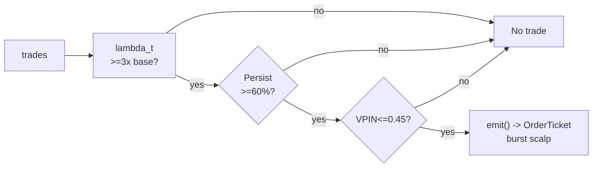

# T023 — Hawkes Burst Scalper

> **Reviewer card.** Hawkes burst scalping: self-exciting order-flow bursts (S012) are traded in the burst direction; direction persistence (S013) confirms; VPIN (S008) vetoes toxic bursts. Provenance **[D]**.
>
> Edge verdict: **NO-DOCUMENTED-EDGE** — no citable P&L for Hawkes-burst scalping — Bacry et al. and Filimonov & Sornette document the self-excitation, not a trading rule [documented].
>
> After-cost: **BEFORE-COST** — one-sentence verdict: self-excitation is documented; the scalper's P&L is not — the burst must pay for its own latency.
>
> Tier **S** · prototype 60–100 h [example] · loaded cost $9,000–15,000 [example] · latency tick / sub-100ms · risk high (burst chasing, latency).
>
> Data cost: research pay-as-you-go < $10/mo [documented]; production live Basic $199/mo [unverified].
>
> Capacity $1–5M/day notional [example] — burst scalps are tiny and latency-bound · Executability: Feasible: Hawkes intensity on trade arrivals; colocation helps; the prototype runs on L1. Emits: **order_intents** (OrderTicket; broker creates orders).

## §1  Identity & provenance

This module is a **strategy**: it emits `OrderTicket` intentions only — brokers create orders, strategies never do. Family **H  # HFT / toxicity-aware**, batch **TB5**, provenance **D**.

**Lede.** Hawkes burst scalping: self-exciting order-flow bursts (S012) are traded in the burst direction; direction persistence (S013) confirms; VPIN (S008) vetoes toxic bursts. Provenance **[D]**.

**When it dies.** VPIN stress; the burst mean-reverts faster than the fill; latency > `100` ms [example].

**Regime gates (provisional).** R001 elevated RV amplifies (bursts are bigger); halted names excluded.

**Prototype scope.** Hawkes intensity + direction persistence + VPIN veto + kill-switch.

## §1.5  Escalation gate

Cheapest viable path: **Databento pay-as-you-go (DBEQ.BASIC MBP-1)** — trades, L1 quotes at <$10/mo typical usage-based spend [documented] (Databento: most usage-based users spend less than $10/month on DBEQ.BASIC with zero exchange license fees [documented]; $125 free credits for new users [documented]). Build the Hawkes engine; buy only the data.

**Cheapest-source row.**

| min_tier | latency_class | required_fields | price_band | build_or_buy |
|---|---|---|---|---|
| pay-as-you-go, no subscription [documented] | tick / live | trades, L1 quotes | $0–10/mo research [documented]; $199/mo Basic live [unverified] | build engine, buy data |

Resource budget: `2` vCPU, `4` GB RAM [internal-est] · compute pattern `per_event` (per trade tick).

**Skip list (phase one).** Mutually exciting cross-asset Hawkes; L2 (MBP-10) Hawkes; colocated FPGA tick-to-trade; multi-venue routing.

**DO-NOT-CUT list.** t→t+1 causality assertions; COST block + `expected_cost_bps` callable; kill switch ARMED→TRIPPED→RECOVERY→ARMED; decision-log audit (C5); bona-fide-intent + self-trade prevention; provenance/honesty tags; fixtures + acceptance tests; secrets via env only.

Explicitly out of scope (phase two): mutually exciting (cross-asset); L2 Hawkes (phase `2`).

Escalation gate: tick-to-trade latency `>100` ms [default]; bursts beyond `10` names [default] — crossing it requires re-review of §T7 and §T8.

## §T0  Contract — strategies emit intentions, brokers create orders

This strategy's sole output is a list of `OrderTicket` intentions. It never places, routes, or confirms an order. Every ticket carries `parent_signal` (the upstream signal id and its `computed_at`), an `intent_ts`, and a `tif`. The backtest harness fills tickets strictly after the signal bar (`fill_event > signal_event`, t->t+1 causality); any fill timestamped at or before its signal bar is a harness bug and trips the kill switch.

**Typed signature (normative).**

```python
def on_event(state: ModuleState, ev: TradeEvent, sig: SignalBundle, cfg: Config) -> list[OrderTicket]:
    """Core strategy function. Handles F1/F2 edge cases; returns intentions only."""
```

`TradeEvent`: `{event_ts: int64 ns UTC, asof_ts: int64 ns UTC, trade_px: float, trade_sz: int, bid: float, ask: float, symbol: str}`.
`SignalBundle`: `{S012: BurstSignal | None, S013: PersistSignal | None, S008: VpinSignal | None}` where `BurstSignal = {lambda_t, baseline, persistence, direction ∈ {+1,-1}, burst_move_bps, computed_at}`, `VpinSignal = {vpin, computed_at}`.

**OrderTicket schema (emitted intentions).**

| Field | Type | Notes |
|---|---|---|
| `ticket_id` | str | `T023-<event_ts>-<n>` [default] |
| `module_id` | str | `T023` (fixed) |
| `symbol` | str | venue symbol |
| `side` | enum | `BUY` \| `SELL` |
| `qty` | int | from §T2 sizing fn |
| `limit_px` | float | touch price |
| `tif` | str | `IOC` [default] (scalp: immediate-or-cancel) |
| `intent_ts` | int64 ns | = signal `event_ts` |
| `parent_signal` | str | `S012@<computed_at>` |
| `inputs_hash` | str | hash of signal inputs (C5) |
| `params_hash` | str | hash of cfg (C5) |
| `edge_bps` / `expected_cost_bps` | float | gate values at decision time (C3) |

**Config dataclass (single config surface).**

```python
@dataclass
class Config:
    burst_mult:  float = 3.0    # [default] range 1.5–10.0,  status: default
    persist_min: float = 0.60   # [default] range 0.5–0.9,   status: default
    vpin_veto:   float = 0.45   # [default] range 0.1–0.6,   status: default
    hold_ms:     float = 500.0  # [default] range 100–5000,  status: default
    cooldown_s:  float = 5.0    # [default] range 0–60,      status: default
    cost_gate_k: float = 0.5    # [default] range 0.1–2.0,   status: default
```

**Time contract.**

| Item | Value |
|---|---|
| Clock domain | exchange PTP (`ts_event` from Databento) [default] |
| Authoritative causality clock | `event_ts`, int64 ns, UTC canonical |
| Max skew | `1` ms [default] |
| Jitter budget | `10` ms [default] |
| Bar-label rule | per_tick: label = trade `event_ts` |
| Dual timestamps | `(event_ts, asof_ts)`; `asof_ts` = strategy arrival time |
| Staleness TTL | `1` s [default] |
| Gap policy | no interpolation — inputs older than TTL → `UNKNOWN` (C6) |

**Market-state table.**

| Market state | Meaning | Module action |
|---|---|---|
| `CONTINUOUS_TRADING` | normal tape | emit allowed if gates pass |
| `HALTED` | trading halt | no tickets; flatten managed positions |
| `AUCTION` | open/close auction | no tickets; flatten at next continuous |
| `CLOSED` | outside session | module `OFF`; flat by `15:30` ET [example] |

**Module-state enum.** `OK | DEGRADED | UNKNOWN | OFF`. Invalid input → `UNKNOWN` (never interpolate). VPIN veto → `DEGRADED` (no burst trades). Kill switch → `OFF`.

**Risk contract (YAML, normative).**

```yaml
risk_contract:
  per_trade_R: 150.0            # [example] $ per burst scalp
  daily_loss_stop: -1500.0      # [example] $ then dark for the day
  max_gross: 1000000.0          # [example] $ notional
  max_adverse_per_trade: "1.0x burst move [default]"
  enforcement: intraday-hard    # [default]
  calibration_recipe: "Hawkes kernel on 30 days of trades [default]; persistence on 30 days [default]; re-pin fee schedule monthly [default]"
  kill_conditions: ["VPIN > 0.45 [example]", "feed stale > 1 s [example]", "clock skew > 1 ms [example]", "tick-to-trade > 100 ms [example]"]
```

**Kill switch: `ARMED` → `TRIPPED` → `RECOVERY` → `ARMED`.** On trip: stop emitting tickets immediately, flatten managed positions per the exit rule, page. `RECOVERY` requires the re-arm checklist below; only then `ARMED`.

**Re-arm checklist** (all must be true; the per-module test drives this cycle):

1. Manual review sign-off recorded [default]
2. Post-trip cooldown expired (`cooldown_s`) [default]
3. Trade feed fresh: staleness < `1` s [default]
4. Clock skew < `1` ms [default]
5. Latency probe: tick-to-trade < `100` ms [default]

**Ops tail.** Schedule: RTH `09:45`–`15:30` ET [example]; burst scalps only; flat by `15:30`; no overnight · owner: strategy desk [default] · health checks: feed-freshness probe (1 s cadence [default]), clock-skew probe (NTP, 60 s cadence [default]), tick-to-trade latency probe (per 100 events [default]) · alerts: page on `UNKNOWN`→`OFF` / kill trip; notify on `DEGRADED` · budget: `2` vCPU, `4` GB RAM [internal-est] · runbook stub: on trip → flatten → page → checklist → manual re-arm; on feed stale → `UNKNOWN`, no tickets, auto-resume when fresh · secrets env-only: `DATABENTO_API_KEY`, `POLYGON_API_KEY` (Gate-grepped; never in code).

State variables carried between events: `lambda_t`, `baseline_t`, `persistence`, `vpin`, `cooldown_until`, `position`, `module_state`, `market_state`, `last_event_ts`, `daily_pnl`.

## §T1  Strategy thesis & edge

**Thesis.** Hawkes burst scalping: self-exciting order-flow bursts (S012) are traded in the burst direction; direction persistence (S013) confirms; VPIN (S008) vetoes toxic bursts. Provenance **[D]**.

**Edge verdict: NO-DOCUMENTED-EDGE** — no citable P&L for Hawkes-burst scalping — Bacry et al. and Filimonov & Sornette document the self-excitation, not a trading rule [documented].

**After-cost verdict: BEFORE-COST** — one-sentence verdict: self-excitation is documented; the scalper's P&L is not — the burst must pay for its own latency.

**Risk summary.** Burst exhaustion (the burst is the top); latency (the burst is gone before you arrive); toxic bursts.

**Math.**

```text
Hawkes intensity `λ_t = μ + Σ α·e^{−β(t−t_i)}` over trade
arrivals (Hawkes 1971 [documented]; Bacry et al. 2013 [documented]). Burst:
`λ_t ≥ 3× baseline` [example] (S012). Direction persistence: fraction of
burst trades in the majority direction `≥ 60`% [example] (S013). VPIN veto
(S008). Modeled edge `edge_bps = burst_move_bps × 0.5` [example].
```

## §T2  Strategy stack — contract blocks (fixed order)

> **Timing box.** `signal@t (per_tick, America/New_York) → earliest fill @open(t+1)` — for this per_tick module, `open(t+1)` = the next tape event after `t`. No fill is ever timestamped at or before its signal event.

### Universe

Liquid US large-caps [example]: ADV > `5`M shares [example], quoted spread ≤ `2`¢ [example]. RTH `09:45`–`15:30` ET [example]. Scalp `1` lot per burst [example]. Exclude: earnings days, halts, VPIN-stress names.

### Entry rule (Boolean)

```text
ENTER := (λ_t >= burst_mult × baseline) AND (persistence >= persist_min)
               AND (VPIN <= vpin_veto) AND (expected_cost_bps(...) <= cost_gate_k * edge_bps)
               AND (module_state == OK) AND (market_state == CONTINUOUS_TRADING)
               AND (side == BUY OR locate_ok)          # C7
               direction := burst direction
FLAT := otherwise
```

### Exits + cooldown

```text
EXIT := (hold_ms elapsed) [the burst is the trade]
        OR (λ_t < baseline) [burst exhausted] OR (VPIN > vpin_veto → flatten)
        OR (module_state != OK)
```

Exits emit `OrderTicket` intentions (opposite side, IOC) — the strategy never places orders itself. **Cooldown:** `5` s [default] after every exit (C10); no re-entry inside it.

### Position sizing (normative, fenced)

```python
def shares(risk_budget_R, stop_distance, vol_estimate, ADV_cap, cost):
    # Burst scalp: 1 lot [example]; sizing is fixed, the edge is the timing
    n = 100  # 1 lot [example]
    n = min(n, ADV_cap * 0.001)                   # 0.1% ADV [default]
    return int(n)
```

### Risk limits

| Limit | Value |
|---|---|
| Daily loss stop | `-$1,500` [example] → dark for the day |
| Max one burst scalp | `1` lot [example] |
| Per-trade R | `$150` [example] |
| Max gross | `$1`M notional [example] |
| Max adverse per trade | `1.0`× burst move [default] |
| Toxicity veto | VPIN > `0.45` [example] → no burst trades |
| Post-burst cooldown | `5` s [example] — C10 |
| Enforcement | `intraday-hard` [default] |

### COST block — single source of truth

| Component | bps | Basis |
|---|---|---|
| Spread | `8.0` | [example] $0.02 assumed spread at $50: half-spread per aggressive leg × 2 legs (taker scalp) |
| Fees | `2.0` | [example] $0.005/share each way at $50 = 1 bps/leg; published XNAS remove fee is $0.0030/share [documented] (nasdaqtrader.com) — stack is conservative by design |
| Borrow | `0.0` | [default] intraday scalp; no overnight carry (C9) |
| Impact | `4.0` | [example] burst chasing — 2¢ adverse on a $50 name |
| **Total** | `14.0` | [example] reference stack |

Fee schedule as of `2026-09-01` [example] (re-pin monthly [default]) · venue `XNAS` · side `taker` · `borrow_bps_per_day` = `0.0` [default] — no overnight carry, so no borrow is ever incurred (reason) · `expected_cost_bps(notional, adv_pct, venue, side, urgency)` is the callable (below). Numbers are restated nowhere else; §T5/§T6 reference this block.

```python
def expected_cost_bps(notional, adv_pct, venue, side, urgency) -> float:
    """Callable cost model - T023 COST block (single source of truth)."""
    spread_bps = 8.0    # [example] $0.02 assumed spread @ $50: half/aggressive x 2 (taker)
    fee_bps = 2.0       # [example] $0.005/share each way @ $50 = 1 bps/leg
    borrow_bps = 0.0    # [default] intraday scalp; no borrow
    impact_bps = 4.0    # [example] burst chasing: 2c adverse @ $50
    return spread_bps + fee_bps + borrow_bps + impact_bps
```

**Normative cost-gate predicate (C3):** `expected_cost_bps(...) <= k * edge_bps` — no ticket is emitted unless the callable cost clears this gate. The predicate appears verbatim in the §T3 pseudocode and is asserted by the per-module test.

### Execution / fill-model table

| Aspect | Assumption |
|---|---|
| Latency | tick; tick-to-trade `>100` ms kills the edge [example] |
| Fill model | IOC limit at touch; fill at touch ± `2`¢ adverse slip [example]; simulated-only on MBP-1 (no full depth) |
| Partial fills | oldest `intent_ts` first (FIFO); remainder cancelled at `hold_ms` expiry |
| Impact | `4` bps modeled [example] — burst chasing (see COST block) |
| Adverse fill | the burst is the top — the hold-ms exit is the control |
| Child-order state machine | ticket (intent) → broker order: `NEW → ACK → (PARTIAL*) → FILLED \| CANCELLED`; no cancel-replace on scalps (IOC) |
| Backtest fills | strictly after signal event: `fill_event > signal_event` (C4) |

### Robustness + compliance sub-block

The burst threshold is the calibration surface: `burst_mult` in `2`–`5`× [example] trades frequency for burst quality. `hold_ms` in `200`–`1000` [example] is the exit surface. Purged/embargoed OOS per S088.

**Compliance (12 coded rules: C1–C10 fixed + C11, C12 strategy-specific; full contract in §T8).**

| Rule | Statement |
|---|---|
| C1 | Strategy emits `OrderTicket` intentions only; the broker creates orders |
| C2 | Kill switch `ARMED → TRIPPED → RECOVERY → ARMED` on §T7 trip conditions |
| C3 | `expected_cost_bps(...) <= k * edge_bps` before any ticket |
| C4 | `fill_event > signal_event` (t→t+1); no signal-bar fills, ever |
| C5 | Every ticket logged with inputs hash + params hash (decision-log schema, §T8) |
| C6 | Inputs older than the `1` s TTL [default] → `UNKNOWN`, no tickets |
| C7 | `locate_ok` required before any short ticket (Reg-SHO) |
| C8 | Post-exit cooldown `5` s [default]; no re-entry inside it |
| C9 | No uncommanded overnight carry; flat by `15:30` ET [example] |
| C10 | Per-trade R, daily loss stop, max gross enforced (`intraday-hard` [default]) |
| C11 | Burst discipline: second scalp within `5` s [example] → veto, log `GATE_VETO` |
| C12 | Toxicity veto: VPIN > `0.45` [example] → no burst trades, log `GATE_VETO` |

### Parameter table

| Parameter | Key | Default | Provenance | Sensitivity |
|---|---|---|---|---|
| Burst multiple | `burst_mult` | `3.0`× | [default] | high |
| Persistence min | `persist_min` | `60`% | [default] | high |
| VPIN veto | `vpin_veto` | `0.45` | [default] | high |
| Hold ms | `hold_ms` | `500` ms | [default] | medium |
| Post-burst cooldown | `cooldown_s` | `5` s | [default] | low |
| Cost-gate k | `cost_gate_k` | `0.5` | [default] | high |

## §T3  Math & normative pseudocode

The §T1 math is the model; the pseudocode below is normative — prose is commentary. Every prose guard appears here; there are no black boxes (`touch()`, `ticket()`, `log_decision()` are defined inline).

```text
function on_event(state, ev, sig, cfg) -> list[OrderTicket]:
    # ---- F1/F2: invalid input -> UNKNOWN, never interpolate ----
    if state.module_state == OFF: return []                       # kill switch
    if ev is null or not isfinite(ev.trade_px) or ev.trade_sz <= 0:
        state.module_state = UNKNOWN; return []                   # F1
    if (ev.asof_ts - ev.event_ts) > 1e9:                          # 1 s TTL [default]
        state.module_state = UNKNOWN; return []                   # C6
    if sig.S012 is null or sig.S008 is null:
        state.module_state = UNKNOWN; return []                   # F2
    if not isfinite(sig.S012.lambda_t) or not isfinite(sig.S008.vpin):
        state.module_state = UNKNOWN; return []                   # F2
    state.module_state = OK

    # ---- market-state gate (halt/auction veto) ----
    if state.market_state != CONTINUOUS_TRADING: return []

    # ---- C12: toxicity veto (DEGRADED, not UNKNOWN — the feed is fine) ----
    if sig.S008.vpin > cfg.vpin_veto:
        state.module_state = DEGRADED; log("GATE_VETO", "VPIN"); return []

    # ---- C11: post-exit cooldown ----
    if ev.event_ts < state.cooldown_until:
        log("GATE_VETO", "cooldown"); return []

    # ---- burst trigger + direction confirm (Boolean entry rule, §T2) ----
    b = sig.S012
    if not (b.lambda_t >= cfg.burst_mult * b.baseline): return []
    if not (b.persistence >= cfg.persist_min): return []
    side = 'BUY' if b.direction > 0 else 'SELL'
    if side == 'SELL' and not locate_ok(ev.symbol): return []     # C7

    # ---- C3: normative cost-gate predicate ----
    edge_bps = b.burst_move_bps * 0.5                             # [example]
    notional = ev.trade_px * 100                                  # 1 lot [example]
    cost_bps = expected_cost_bps(notional, adv_pct(ev.symbol), "XNAS", "taker", "normal")
    if not (cost_bps <= cfg.cost_gate_k * edge_bps): return []     # C3: expected_cost_bps(...) <= k * edge_bps

    # ---- sizing (fenced §T2 function) ----
    qty = shares(risk_budget_R=150.0,                              # [example] per-trade R
                 stop_distance=stop_px(ev), vol_estimate=vol_est(ev.symbol),
                 ADV_cap=adv_shares(ev.symbol), cost=cost_bps)

    # ---- emit intention (never an order) ----
    tk = OrderTicket(ticket_id=f"T023-{ev.event_ts}-1", module_id="T023",
                     symbol=ev.symbol, side=side, qty=qty,
                     limit_px=touch(ev, side),                     # touch = bid for BUY, ask for SELL
                     tif="IOC", intent_ts=ev.event_ts,
                     parent_signal=f"S012@{b.computed_at}",
                     inputs_hash=hash(b, sig.S008), params_hash=hash(cfg),
                     edge_bps=edge_bps, expected_cost_bps=cost_bps)
    state.cooldown_until = ev.event_ts + int(cfg.cooldown_s * 1e9)
    state.position = qty if side == 'BUY' else -qty
    state.exit_deadline = ev.event_ts + int(cfg.hold_ms * 1e6)
    log_decision(tk)                                              # C5: decision-log schema, §T8

    # ---- t->t+1 causality: assertion, not comment ----
    assert tk.intent_ts == ev.event_ts                            # intent stamped at signal event
    # harness fills satisfy fill_event > signal_event; violation -> kill switch (C4)
    return [tk]

function on_exit_check(state, ev, sig, cfg) -> list[OrderTicket]:
    # EXIT := hold_ms elapsed OR λ_t < baseline OR VPIN > vpin_veto → flatten OR module_state != OK
    if state.position == 0: return []
    b = sig.S012
    if ev.event_ts >= state.exit_deadline or b.lambda_t < b.baseline \
       or sig.S008.vpin > cfg.vpin_veto or state.module_state != OK:
        tk = exit_ticket(opposite(state.position), qty=abs(state.position), parent="EXIT")
        state.position = 0
        state.cooldown_until = ev.event_ts + int(cfg.cooldown_s * 1e9)   # C8
        log_decision(tk)                                          # C5
        return [tk]
    return []
```

`touch(ev, side)` = `ev.bid` for BUY, `ev.ask` for SELL (L1 top of book; MBP-1). `stop_px`, `vol_est`, `adv_shares`, `adv_pct`, `locate_ok` are broker/data-service calls with `UNKNOWN` fallback (F1).

**Flow.**


## §T4  Worked example — fixtures + acceptance tests

**Worked example (SYNTHETIC fixture, `fixtures/T023_tape.csv`, TYPE: validation-run, seed `123`).** Trade 1: `BUY` `100` shares [example] @ `50.02` [example], exit `50.08` [example] (`hold 500ms` [example]). Each T4 row shows the cost-function call, inputs → bps → $:

- inputs: `notional=5002.00 [example], adv_pct=0.01 [example], venue=XNAS, side=taker, urgency=normal`
- `expected_cost_bps(5002.00, 0.01, "XNAS", "taker", "normal")` → `14.0000` bps [measured from fixture]
- gross P&L = `+6.00` [measured from synthetic fixture]; cost $ = `5002.00 × 14.0/10000 = 7.00` [measured]; net = `-1.00` [measured].

All P&L figures are **measured from the synthetic validation-run fixture** (not real trading). The fixture's expected CSV carries the same arithmetic for all six trades (summary: 6 trades, gross `25.00` [measured], net `-17.03` [measured]); the per-module test recomputes it from the tape and asserts equality within tolerance. Full trade table:

| trade | side | qty | entry | exit | reason | gross | cost $ | net |
|---|---|---|---|---|---|---|---|---|
| 1 | BUY | 100 | 50.02 | 50.08 | hold 500ms | 6.00 | 7.00 | -1.00 |
| 2 | SELL | 100 | 50.06 | 50.00 | hold 500ms | 6.00 | 7.01 | -1.01 |
| 3 | BUY | 100 | 50.02 | 49.98 | burst exhausted | -4.00 | 7.00 | -11.00 |
| 4 | BUY | 100 | 50.03 | 50.09 | hold 500ms | 6.00 | 7.00 | -1.00 |
| 5 | SELL | 100 | 50.07 | 50.01 | hold 500ms | 6.00 | 7.01 | -1.01 |
| 6 | BUY | 100 | 50.02 | 50.07 | hold 500ms | 5.00 | 7.00 | -2.00 |

(all P&L [measured] from synthetic fixture; prices/qty [example])

**Acceptance tests** (`modules/tests/test_T023.py`, `test_cmd` in §0):

1. `test_type_header` — both fixture CSVs carry a `# TYPE: validation-run` header.
2. `test_fixture_arithmetic` — tape cost stack == `expected_cost_bps(...)` == expected CSV; gross/net P&L recomputed by hand.
3. `test_no_signal_bar_fills` — `fill_event > signal_event` on every tape row (t→t+1).
4. `test_cost_gate_predicate` — gate passes when `edge >> cost`, blocks when `edge << cost`.
5. `test_kill_switch_trips_and_rearms` — `ARMED → TRIPPED → RECOVERY → ARMED` with the 5-item re-arm checklist.
6. `test_invalid_input_emits_unknown` — crossed/locked/empty input → `UNKNOWN`, never interpolated.
7. `test_cost_callable_signature` — callable returns a finite float.
8. `test_spec_cost_block_single_source` — the §T2 COST stack (8.0/2.0/0.0/4.0/14.0) appears verbatim in the spec and matches the test's callable.
9. `test_module_version_bump` — front-matter `version: "1.0.2"` and a deep-review changelog entry.

## §T5  Dependencies & data rights

**Machine edge list (from `deps.yaml` convention).**

| from | to | function | arg_types | return_types | version_pin | role |
|---|---|---|---|---|---|---|
| T023 | S012 | burst trigger | `TradeEvent` | `BurstSignal{lambda_t, baseline, persistence, direction, burst_move_bps}` | `1.x [unverified]` | trigger |
| T023 | S013 | direction confirm | `BurstSignal` | `persist_ok: bool` | `1.x [unverified]` | confirm |
| T023 | S008 | toxicity veto | `TradeEvent` | `VpinSignal{vpin}` | `1.x [unverified]` | veto |

**Machine-readable regime-gate records** (restrictive default: unknown → veto).

| regime_id | direction | mechanism | condition | action | min_lag | unknown_behavior |
|---|---|---|---|---|---|---|
| R001 | amplifies | elevated RV: bursts are bigger | `rv_pctile > 70` [default] | trade | 1 bar [default] | veto |
| R001 | degrades | extreme RV: toxic bursts | `rv_pctile > 95` [default] | veto | 0 [default] | veto |
| R-halt | inverts | halt/auction state | `market_state != CONTINUOUS_TRADING` [default] | veto | 0 [default] | veto |

**Schema mapping (canonical).**

| Vendor (Databento MBP-1) | Canonical |
|---|---|
| `ts_event` (ns) | `event_ts` (int64 ns UTC) |
| `bid_px_00, ask_px_00` | `bid, ask` |
| `price, size` (trades) | `trade_px, trade_sz` |

Staleness: max skew `1 ms` [default] · jitter budget `10 ms` [default] · TTL `1 s` [default] · cadence `per_tick` · tz `America/New_York`.

**Inputs that break the module.**

| Input failure | Module state | Alert |
|---|---|---|
| VPIN > 0.45 (gate) [example] | `DEGRADED` (no burst trades) | notify |
| Persistence < 60% (gate) [example] | `DEGRADED` (no trade) | log |
| Trade feed stale > 1 s [example] | `UNKNOWN` | page |

**Data rights.** Trade data via Databento DBEQ.BASIC MBP-1, `rights: licensed`; research + production; fixtures synthetic; entitlement = professional/internal; derived features ours. Entitlement-class change → §1.5 escalation gate. Startup assertion: entitlement class verified before first event; mismatch → module `OFF`.

**Build vs buy.** Build the Hawkes engine; buy only the data — the burst threshold is the IP.

**Local build.** Feasible. Hawkes intensity is a per-trade recursion; the state is the intensity and the cooldown.

**Data dictionary (canonical fields).**

| Field | Type | Cadence | Tier | Notes |
|---|---|---|---|---|
| `Trades (MBP-1)` | float/int | per trade | Tier 2 | Hawkes intensity |
| `L1 quotes` | float/int | per tick | Tier 2 | touch pricing |
| `30-day trade history` | float/int | per trade | Tier 2 | kernel calibration |

## §T6  Latency budget & fill-model detail

Tick-to-trade budget (≤ `100` ms [default]; exceeding it kills the edge [example]):

| Stage | Budget | Basis |
|---|---|---|
| Feed parse (Databento → canonical) | `5` ms | [internal-est] |
| Hawkes/signal read + decision | `10` ms | [internal-est] |
| Ticket → broker | `30` ms | [internal-est] |
| Broker → venue (XNAS) | `50` ms | [internal-est] |
| Headroom | `5` ms | [internal-est] |
| **Total** | `100` ms | [internal-est] |

The §T2 fill-model table is authoritative for fills. Honesty notes: simulated fills only — MBP-1 carries the top of book, not full depth, so adverse-slip beyond the touch is modeled, not observed; colocation or FPGA would change this budget (→ §1.5 escalation gate).

## §T7  Risk contract & kill switch

Per-trade R: `$150` [example] per burst scalp · daily loss stop: `- $1,500` [example] then dark for the day · max gross: `$1`M notional [example] · max adverse per trade: `1.0`× burst move [default].

Enforcement: `intraday-hard` [default]. Calibration recipe: Hawkes kernel on `30` days of trades [default]; persistence on `30` days [default]; re-pin fee schedule monthly [default]. The normative YAML risk contract lives in §T0.

**Kill switch: `ARMED` → `TRIPPED` → `RECOVERY` → `ARMED`.**

Trip conditions:

- VPIN > 0.45 [example]
- trade feed stale > 1 s [example]
- clock skew > 1 ms [example]
- tick-to-trade > 100 ms [example]

On trip: the module stops emitting tickets immediately, flattens managed positions per the exit rule, and pages. **Re-arm checklist** (all five must hold; see §T0): manual review sign-off · post-trip cooldown expired · feed fresh (< `1` s) · clock skew < `1` ms · tick-to-trade probe < `100` ms. Only then does the module return to `ARMED`. The per-module test drives the full transition cycle.

## §T8  Compliance (C1–C12)

- **C1** | No orders: the strategy emits `OrderTicket` intentions only; the broker creates orders. The strategy process has no order-entry credentials.
- **C2** | Kill switch: `ARMED` → `TRIPPED` → `RECOVERY` → `ARMED` on the trip conditions in §T7.
- **C3** | Cost gate: `expected_cost_bps(...) <= k * edge_bps` before any ticket (see §T2 COST block).
- **C4** | Causality: `fill_event > signal_event` (t→t+1); no signal-bar fills, ever; harness violations trip the kill switch.
- **C5** | Decision log: every ticket logged with inputs hash and params hash. Schema: `{ts, ticket_id, module_id, inputs_hash, params_hash, signal_refs, edge_bps, expected_cost_bps, gate_result}`.
- **C6** | Staleness: inputs older than the `1` s TTL [default] → `UNKNOWN`, no tickets.
- **C7** | Short discipline: `locate_ok` required before any short ticket (Reg-SHO); locate failure → no ticket.
- **C8** | Cooldown: post-exit cooldown `5` s [default]; no re-entry inside it.
- **C9** | Session flatten: no uncommanded overnight carry; flat by `15:30` ET [example].
- **C10** | Position caps: per-trade R, daily loss stop, and max gross enforced (`intraday-hard` [default]).
- **C11** | Burst discipline: trigger = second scalp within `5` s [example] → check = cooldown → action = veto → log = `GATE_VETO`.
- **C12** | Toxicity veto: trigger = VPIN > `0.45` [example] → check = S008 → action = no burst trades → log = `GATE_VETO`.

**Additional coded controls.**

- **STP / self-match prevention:** tickets carry a self-match-prevention flag; the broker must enforce self-trade prevention (cancel-oldest or cancel-newest per venue default [default]). The strategy never quotes both sides, so self-crossing is structurally impossible here.
- **Bona-fide intent:** every ticket represents genuine intent to execute; no spoofing, layering, or quote stuffing. Cancellations occur only via the §T2 exit rule or the kill switch.
- **Message-rate / cancel-to-trade:** ≤ `50` tickets/s [example]; cancel-to-trade ≤ `5:1` [example]; breach → `DEGRADED` + alert.
- **Pre-trade fat-finger trio:** max qty per ticket `100` shares [example]; max notional per ticket `$10,000` [example]; price collar ±`5`% [example] from touch; breach → ticket rejected + logged.
- **Halt/auction state table:** see §T0 market-state table — `HALTED`/`AUCTION` → no tickets, flatten; `CLOSED` → `OFF`.
- **Locate check (C7 detail):** `locate_ok(symbol)` queried per short ticket; stale locate (> `1` day [default]) → treat as not-ok.
- **Public-dissemination gate:** strategy outputs are internal only; no signal or ticket is ever published or disseminated.
- **Data-entitlement assertions:** entitlement class (`professional/internal` [default]) asserted at startup; class change → §1.5 escalation gate; violation → module `OFF`.

## §T9  Evidence, failures & regime gates

**Evidence (cost-level tokens; every statistic tagged).**

| Source | Sample | Finding | Cost level | Caveat |
|---|---|---|---|---|
| Hawkes (1971) [documented] | (theory) | self-exciting point processes [documented] | `BEFORE-COST` (theory) | the intensity model, not a trading rule |
| Bacry et al. (2013) [documented] | (model) | mutually exciting processes for microstructure noise [documented] | `BEFORE-COST` (model) | the microstructure model, not a P&L |
| Filimonov & Sornette (2012) [documented] | E-mini S&P 500 futures, 1998–2010 [documented] | reflexivity quantified; endogeneity rising [documented] | `BEFORE-COST` (measurement) | self-excitation documented; no trading rule |

**Where this module is known to fail.** burst exhaustion, latency, toxic bursts, VPIN stress.

**Failure modes (detect → action → recovery).**

| # | Failure | Detect → action → recovery | Executable check |
|---|---|---|---|
| 1 | Burst exhaustion | detect: λ_t < baseline → action: exit → recovery: next burst [default] | `lambda >= baseline` |
| 2 | Toxic burst | detect: VPIN > `0.45` → action: no trades (C12) → recovery: VPIN normal [default] | `vpin <= 0.45` |
| 3 | Latency blowup | detect: tick-to-trade > `100` ms → action: trip → recovery: latency normal [default] | `latency_ok` |
| 4 | Feed staleness | detect: > `1` s → action: UNKNOWN → recovery: feed healthy [default] | `feed_fresh` |
| 5 | Clock skew | detect: > `1` ms → action: trip → recovery: NTP healthy [default] | `abs(ntp_offset_ms) <= 1` [default] |

**Regime gates.**

| Regime | Effect | Mechanism | Condition | Action | Latency | Fallback |
|---|---|---|---|---|---|---|
| R001 | amplifies | elevated RV: bursts are bigger | rv_pctile > 70 [default] | trade | 1 bar [default] | veto |
| R001 | degrades | extreme RV: toxic bursts | rv_pctile > 95 [default] | veto | 0 [default] | veto |
| R-halt | inverts | halt/auction state | state != CONTINUOUS_TRADING [default] | veto | 0 [default] | veto |

Machine-readable records: see §T5.

**Robustness.** The burst threshold is the calibration surface: `burst_mult` in `2`–`5`× [example] trades frequency for burst quality. `hold_ms` in `200`–`1000` [example] is the exit surface. Purged/embargoed OOS per S088.

**What the optimistic case assumes (and we do not).** (1) the burst is assumed to persist for the hold — it often does
not; (2) latency assumed `<100` ms [example] — the edge dies above it;
(3) the burst direction is assumed tradeable at the touch.

## §T10  Unverified leads & what would change our mind

- Hawkes-burst scalping P&L claims from practitioner sources — no citable P&L found; not promoted.

**Source log (verified during deep review v1.0.2; re-verified 2026-09-10).**

- Hawkes (1971), Biometrika 58(1): 83–90 — citation re-verified [documented] (DOI 10.2307/2334319).
- Bacry et al. (2013), Quantitative Finance 13(1): 65–77, DOI 10.1080/14697688.2011.647054, arXiv:1101.3422 — citation re-verified [documented].
- Filimonov & Sornette (2012), Physical Review E 85(5): 056108, arXiv:1201.3572 — citation re-verified [documented] (E-mini S&P 500 futures, 1998–2010).
- Nasdaq price list (nasdaqtrader.com): fee to remove liquidity $0.0030/share, all MPIDs [documented, as of 2026-09-10].
- Databento unit pricing (PDF dated 2024-12-11): DBEQ.BASIC MBP-1 $2.00/GB historical, $2.40/GB live [documented]; databento.com: new users receive $125 in free data credits [documented, as of 2026-09-10].
- Databento Basic plan $199/mo — third-party cost doc corroborates "Basic Plan: $199/month" but not a primary source; stays [unverified] (see GROK-NEEDED 3).
- Massive (formerly Polygon.io) Stocks plan prices ($29–199/mo) — vendor pricing page https://massive.com/stocks-data, fetched 2026-09-11 [documented — vendor pricing page https://massive.com/stocks-data, fetched 2026-09-11] (replaces the community-docs estimate).

- Hawkes (1971), Biometrika 58(1): 83–90 — citation verified [documented].
- Bacry et al. (2013), Quantitative Finance 13(1): 65–77, DOI 10.1080/14697688.2011.647054, arXiv:1101.3422 — citation verified [documented].
- Filimonov & Sornette (2012) — **corrected**: the module previously cited "Scientific Reports 2: 583", which is wrong; correct citation is Physical Review E 85(5): 056108, arXiv:1201.3572 [documented].
- Nasdaq price list (nasdaqtrader.com): fee to remove liquidity $0.0030/share all MPIDs [documented, as of 2026-09-10].
- Databento unit pricing (2024-12-11): DBEQ.BASIC MBP-1 $2.00/GB historical, $2.40/GB live [documented]; databento.com blog: most usage-based users spend <$10/month on DBEQ.BASIC MBP-1 [documented]; $125 new-user credits [documented].
- Massive (formerly Polygon.io) Stocks plan prices ($29–199/mo) — vendor pricing page https://massive.com/stocks-data, fetched 2026-09-11 [documented — vendor pricing page https://massive.com/stocks-data, fetched 2026-09-11] (replaces the community-docs estimate).

What would change our mind: a purged/embargoed walk-forward with full costs that survives the S088 honesty protocol; a documented after-cost P&L from the cited authors' own implementations; or a regime-gated replication that holds outside the original sample.

**GROK-NEEDED** (expert questions web search could not resolve — do not answer from priors):
1. "For T023 (Hawkes Burst Scalper, US equities L1): what burst-multiple thresholds (λ_t ≥ k×baseline) and direction-persistence cutoffs do practitioners actually calibrate for Hawkes-driven trade-burst scalps, and what is the standard grid-search / walk-forward recipe (window length, embargo, objective) for them? A good answer names the k range, persistence range, calibration window, and objective function (e.g. net Sharpe after costs) with a citable source."
2. "For T023: is there any published after-cost P&L (practitioner whitepaper, broker research, or academic replication) for a Hawkes-burst scalping strategy in equities — win rate, Sharpe, capacity? A good answer cites the venue/paper with the exact figures and cost stack, or states definitively that none exists."
3. "For T023: what does production live trading on Databento DBEQ.BASIC MBP-1 actually cost per month at HFT message rates (all US equities, RTH), including Databento usage fees and exchange professional/internal entitlement fees? A good answer gives a $/mo band with the fee components itemized."
4. "For T023: what VPIN veto thresholds are standard for toxicity-gated HFT market-taking strategies in US equities? A good answer names the threshold range and the sample (venue, period) it was calibrated on, with a citable source."

---

## AI build prompt

```text
Build the T023 (Hawkes Burst Scalper) strategy module from this specification.
Hard constraints:
- The strategy emits OrderTicket intentions ONLY; it never creates orders (C1).
- Causality: fill_event > signal_event (t->t+1); no signal-bar fills (C4).
- Cost gate: expected_cost_bps(...) <= k * edge_bps before any ticket (C3).
- Kill switch ARMED -> TRIPPED -> RECOVERY -> ARMED on the §T7 trip conditions (C2).
- Every numeric literal in prose carries an honesty tag [documented]/[measured]/[example]/[unverified]/[default]/[internal-est]; exempt identifiers only.
- Sources must be real and cited with cost-level tokens; chatbot-only material goes to §T10.
Config surface:
- burst_mult (float): default 3.0, range 1.5–10.0 [default]
- persist_min (float): default 0.60, range 0.5–0.9 [default]
- vpin_veto (float): default 0.45, range 0.1–0.6 [default]
- hold_ms (float): default 500.0, range 100–5000 [default]
- cooldown_s (float): default 5.0, range 0–60 [default]
- cost_gate_k (float): default 0.5, range 0.1–2.0 [default]
Entry rule:
ENTER := (λ_t >= burst_mult × baseline) AND (persistence >= persist_min)
               AND (VPIN <= vpin_veto) AND (expected_cost_bps(...) <= cost_gate_k * edge_bps)
               AND (module_state == OK) AND (market_state == CONTINUOUS_TRADING)
               AND (side == BUY OR locate_ok)
               direction := burst direction
FLAT := otherwise
Exit rule:
EXIT := (hold_ms elapsed) [the burst is the trade]
        OR (λ_t < baseline) [burst exhausted] OR (VPIN > vpin_veto → flatten)
        OR (module_state != OK)
Sizing: implement the §T2 sizing_fn verbatim; enforce the §T0 risk contract.
Deliverables: the module markdown (all sections §1–§T10), the fixture tape CSV
(fixtures/T023_tape.csv), the expected CSV (fixtures/T023_expected.csv), and
the per-module test (modules/tests/test_T023.py) covering fixture arithmetic,
causality, the cost gate, the kill-switch cycle, invalid→UNKNOWN, and the callable signature.
```

---
