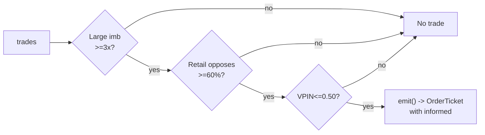

# T024 — Informed-Size Tracker / Retail Fade

> **Reviewer card.** Informed-size tracking with retail fade: large-trade footprints (S015) reveal informed direction; retail odd-lot flow leaning the other way (S016) is faded; VPIN (S008) vetoes toxic prints. Provenance **[D]**.
>
> Edge verdict: **NO-DOCUMENTED-EDGE** — no citable P&L for the informed-size/retail-fade rule — O'Hara et al. document odd-lot informativeness, not a trading P&L [documented].
>
> After-cost: **BEFORE-COST** — one-sentence verdict: odd lots are informative [documented] — fading retail because it is retail is the unproven claim.
>
> Tier **S** · prototype 40–60 h [example] · loaded cost $6,000–9,000 [example] · latency tick / sub-second [example] · risk high (informed-flow chasing) [example].

> Capacity $1–5M/day notional [example] — footprint trades are small and latency-bound · Executability: Feasible: trade-size classifier on the tape; any L1 feed suffices for the prototype.

> Tag law: every numeric literal in prose carries one of `[documented]
[default] [example] [unverified] [internal-est] [measured]` (legend: Appendix
i v1.0.0). Constants inside cited formulas inherit the formula's tag
(`[documented]` for cited literature). Bibliographic years, volumes, pages,
arXiv IDs, section numbers, rule codes (C1–C19), fail-safe codes (F1–F5),
module IDs, and machine-parsed §0 data fields are identifiers, not
literals, and are exempt.

## §1  Five-minute reviewer card

| Row | Value |
|---|---|
| Module | T024 — Informed-Size Tracker / Retail Fade, v1.0.1 |
| Edge verdict | `NO-DOCUMENTED-EDGE` — no citable P&L for the informed-size/retail-fade rule — O'Hara et al. document odd-lot informativeness, not a trading P&L [documented] |
| After-cost | `BEFORE-COST` — odd lots are informative [documented] — fading retail *because it is retail* is the unproven claim |
| Build cost | Tier S · `40–60` h [example] · `$6,000–9,000` loaded [example] |
| Data cost | Research `~$0`/mo (Databento trial credits [unverified]); production DBEQ.BASIC mbp-1 unit pricing `$2.00`/GB historical / `$2.40`/GB live [documented, 2024-12-11 via T002]; Standard plan `~$200`/mo + usage [unverified] — recheck before buying |
| latency_class | tick / sub-second |
| risk_class | high (informed-flow chasing; adverse selection on the fade leg) |
| Capacity | `$1–5`M/day notional [example] — illustrative; `1`-lot [example] footprints, latency-bound |
| Executability | Feasible: per-trade size classifier + imbalance windows + VPIN veto; any exchange-timestamped trade tape suffices for the prototype |
| Risk summary | Chasing noise labeled informed; the footprint may be the informed trader *exiting*; retail fade is adversely selected (odd lots contribute `35`% of price discovery [documented] — against us) |
| When it dies | VPIN stress; the footprint reverses; odd-lot flow is informative against the fade (O'Hara et al.) |
| Regime gates | Provisional: R001 elevated RV degrades (footprints are noise); R-halt inverts (veto) |
| Emits | `order_intents` (global OrderTicket schema; never orders) |

**Identity & provenance.** This module is a **strategy**: it emits `OrderTicket` intentions only — brokers create orders, strategies never do. Family **H  # HFT / toxicity-aware**, batch **TB5**, provenance **D**.

**Lede.** Informed-size tracking with retail fade: large-trade footprints (S015) reveal informed direction; retail odd-lot flow leaning the other way (S016) is faded; VPIN (S008) vetoes toxic prints. Provenance **[D]**.

**Prototype scope.** size classifier + odd-lot imbalance + VPIN veto + kill-switch.

## §1.5  Cheapest / least-build path

1. **Prototype hour band:** `40–60` h [example] — per-trade size classifier, odd-lot imbalance window, VPIN bulk-classification, reference cost stack + fixture
2. **Cheapest-source row:** `min_tier: tier-1` · `latency_class: tick / sub-second` · `required_fields: trade price + size + aggressor side per print, exchange ts_event (int64 ns UTC), L1 touch bid/ask per tick, 30-day trade history for threshold calibration` · `price_band: $2.00/GB historical / $2.40/GB live [documented, Databento unit pricing 2024-12-11 — via sibling module T002 §0; current schedule [unverified] — recheck before quoting]; Databento Standard ~$200/mo + usage [unverified]` · `build_or_buy: buy the trade+quote feed; build the size classifier + odd-lot imbalance + VPIN veto yourself — no vendor sells them`.
3. **Resource budget:** `2` cores, `<4` GB RAM [internal-est] for `≤10` symbols live [default] · compute pattern `per_tick`.
4. **Skip list:** broker-identified retail (wholesaler/ATS retail flags); multi-venue footprint aggregation; ML-informed-size classifier; options footprint; colocation.
5. **DO-NOT-CUT list:** t→t+1 causality assertions (`assert fill_event > signal_event`, no-signal-bar-fills test); COST block + callable `expected_cost_bps`; kill switch + re-arm checklist; decision-log audit records (C5); bona-fide-intent + self-trade prevention (C13/C14); locate discipline for shorts (C7); provenance tags on every numeric literal; fixtures + `test_cmd`; secrets via env only.
6. **Escalation gate:** live universe `>10` names [default]; tick-to-trade latency `>100` ms [default]; measured footprint move persistently below the cost gate [example] — crossing it requires re-review of §T7 and §T8.
## §T0  Contract — strategies emit intentions, brokers create orders

This strategy's sole output is a list of `OrderTicket` intentions. It never places, routes, or confirms an order. Every ticket carries `parent_signal` (the upstream signal id and its `computed_at`), an `intent_ts`, and a `tif`. The backtest harness fills tickets strictly after the signal bar (`fill_event > signal_event`, t->t+1 causality); any fill timestamped at or before its signal bar is a harness bug and trips the kill switch.

**May / must-NOT** (global OrderTicket doctrine, Appendix c v1.0.0): **May:** emit `OrderTicket` intents per the §T6 schema; track intent-side state; issue cancel-replace via new tickets. **Must-NOT:** place orders on any venue, hold broker/exchange sessions, net intents into orders inside the strategy, or treat the intent-side state machine as broker wire truth.

**Typed signature.**

```text
emit(state: ModuleState, events: list[TradeEvent], signals: SignalBundle, cfg: Config) -> list[OrderTicket]
```

- `TradeEvent`: canonical event `{event_ts: int64 ns UTC, asof_ts: int64 ns UTC, symbol: str, trade_px: float, trade_sz: int, aggressor_side: {A, B, N}, market_state: enum, bid_px: float, ask_px: float}` — vendor mapping in §T2.
- `SignalBundle`: `{S015: {large_imb: float (×median [default]), footprint_move_bps: float [example], computed_at: int64}, S016: {retail_opp: float (0–1 [default]), computed_at: int64}, S008: {vpin: float (∈[0,1] [documented]), computed_at: int64}}` — machine edge list in §T2.
- `OrderTicket`: global OrderTicket schema — `{ticket_id: str, symbol: str, side: {BUY, SELL}, qty: int, limit_px: float, tif: str, intent_ts: int64 ns, parent_signal: str, inputs_hash: str, params_hash: str, locate_ok: bool, stp_flag: str}` (see §T6).
- Returns `[]` when flat with no setup; sets `state.module_state = UNKNOWN` on invalid input (never interpolates — F1–F5).

**Config dataclass (single source of truth for parameters).**

| Parameter | Type | Default | Range | Status |
|---|---|---|---|---|
| `large_mult` | float (×median) | `3.0` | `1.5–10.0` | default |
| `retail_opp_min` | float (fraction) | `0.60` | `0.5–0.9` | default |
| `vpin_veto` | float | `0.50` | `0.1–0.6` | default |
| `hold_ms` | float (ms) | `2000.0` | `500–10000` | default |
| `cooldown_s` | float (s) | `10.0` | `0–60` | default |
| `cost_gate_k` | float | `0.5` | `0.1–2.0` | default |
| `per_trade_R` | float (USD) | `150.0` | `50–1000` | default |
| `daily_loss_stop` | float (USD) | `-1500.0` | `-10000–-500` | default |
| `max_gross` | float (USD notional) | `1000000.0` | `100000–5000000` | default |
| `max_adverse_per_trade` | float (×footprint move) | `1.0` | `0.5–3.0` | default |
| `staleness_ttl_s` | float (s) | `1.0` | `0.5–5` | default |

**State vector (named, carried between events).** `large_imb`, `retail_opp`, `vpin`, `cooldown_until`, `position`, `entry_ts`, `entry_imb`, `entry_px`, `vol_estimate`, `adv_1min`, `module_state`.

**Time contract.**

| Field | Value |
|---|---|
| Clock domain | exchange `ts_event` is authoritative; strategy clock = event time, not wall time [default] |
| Canonical timestamps | `event_ts`, `asof_ts` — int64 ns UTC [default] |
| Max skew | `1` ms [example] — beyond this the kill switch trips |
| Jitter budget | `10` ms [example] |
| Bar-label rule | `per_tick` — no bar aggregation; footprints are stamped at the trade event that produced them [default] |
| Staleness TTL | `1` s [default] — inputs older than the TTL → `UNKNOWN` (C6) |
| Gap policy | no interpolation — a trade-sequence gap trips the kill switch |

**Market-state table.**

| State | Meaning | Strategy behavior |
|---|---|---|
| `CONTINUOUS_TRADING` | normal session | full entry/exit logic |
| `HALTED` | halt / trading pause | no new entries; existing positions managed to exit |
| `AUCTION` | open / close / reopen auction | no new entries; existing positions managed to exit |
| `CLOSED` | outside 09:30–15:30 ET session [example] | `OFF`; no tickets |

**Module-state enum** (single canonical degradation token set): `OK` (full logic) · `DEGRADED` (elevated VPIN below the veto or elevated cancel rate — manage only, no new entries) · `UNKNOWN` (invalid/stale input, bounds violated — no tickets, never interpolates) · `OFF` (killed or out of session).

**Risk contract (YAML — single source of truth for risk).**

```yaml
per_trade_R: 150.0            # USD [example]
daily_loss_stop: -1500.0      # USD; dark for the day when hit [example]
max_gross: 1000000.0          # USD notional [example]
max_adverse_per_trade: 1.0    # x footprint move [default]
kill_conditions:
  - VPIN > 0.50 [example]
  - trade feed stale > 1 s [example]
  - clock skew > 1 ms [example]
enforcement: intraday-hard    # [default]
calibration: size thresholds on 30 days of trades [default]; odd-lot imbalance on 30 days [default]; re-pin fee schedule monthly [default]
```

**Kill switch: `ARMED` → `TRIPPED` → `RECOVERY` → `ARMED`.**

- `ARMED` → `TRIPPED`: any trip condition fires. On trip: stop emitting tickets immediately, flatten managed positions per the §T3 exit rule, page the operator.
- `TRIPPED` → `RECOVERY`: operator acknowledges the trip. No tickets emitted.
- `RECOVERY` → `ARMED`: **re-arm checklist** all green —
  1. manual operator review of the trip log and C5 decision-log hashes [rule];
  2. cooldown expiry: ≥ `5` min [example] since the trip;
  3. trade feed heartbeat healthy (≤ `1` s [example]) and trade sequence continuous;
  4. clock skew ≤ `1` ms [example];
  5. VPIN back ≤ `0.50` [example] for the trailing `5` min [example];
  6. fee schedule re-pinned (monthly [default]); `expected_cost_bps` callable re-verified against `fee_schedule_as_of`.
- Skipping the checklist is a compliance violation (C2); the per-module test drives the full `ARMED → TRIPPED → RECOVERY → ARMED` cycle.

**Ops tail.** Schedule: RTH `09:30`–`15:30` America/New_York [example]; footprint trades only; flat by `15:30` · Owner: strategy-owner role [default] · Health checks: trade-feed heartbeat (≤ `1` s [example]), VPIN freshness, clock-skew monitor · Alerts: trip → page; DEGRADED/UNKNOWN → notify · Resource budget: `2` vCPU, `4` GB RAM per `10` symbols [internal-est]; imbalance windows O(window) [internal-est] · Runbook stub: trip → flatten → page → review → re-arm checklist → `ARMED` · Secrets: `DATABENTO_API_KEY` via env only (never in code, logs, or files).

## §T1  Strategy thesis & edge

**Thesis.** Informed-size tracking with retail fade: large-trade footprints (S015) reveal informed direction; retail odd-lot flow leaning the other way (S016) is faded; VPIN (S008) vetoes toxic prints. Provenance **[D]**.

**Edge verdict: NO-DOCUMENTED-EDGE** — no citable P&L for the informed-size/retail-fade rule — O'Hara et al. document odd-lot informativeness, not a trading P&L [documented].

**After-cost verdict: BEFORE-COST** — one-sentence verdict: odd lots are informative [documented] — fading retail because it is retail is the unproven claim.

**Risk summary.** Chasing noise labeled informed; the footprint is the informed trader exiting; retail fade adverse selection.

**Math.**

```text
Large-trade imbalance `large_imb` = signed volume of trades ≥ `3`× median
size [example], normalized by median (S015). Retail odd-lot imbalance from
sub-`100`-share prints [documented] (S016, O'Hara et al. 2014 — odd lots are
trades for < `100` shares; their sample median odd-lot share of trades was
`24`% [documented]). `retail_opp` = fraction of odd-lot volume opposing the
footprint sign [default]. Fade: trade *with* `large_imb` when `retail_opp`
≥ `0.60` [example]. VPIN veto (S008): no footprint trades when VPIN >
`0.50` [example]. Modeled edge `edge_bps = footprint_move_bps × 0.5`
[example] — the attribution of the expected favorable move to the footprint
is an example parameter, not an estimate (see GROK-NEEDED).
```

## §T2  Signal stack — dependencies & data rights

> **Timing box.** `signal@t (per_tick, America/New_York) → earliest fill @open(t+1)` — the strategy is per-tick; no footprint is ever filled on its own trade event.

**Mandatory sub-block map (fixed-order sub-blocks; content lives in the frozen sections shown).**

| Sub-block | Lives in |
|---|---|
| Universe | §T2 (below) |
| Boolean entry rule | §T3 |
| Exits + post-exit cooldown | §T3 |
| Position sizing (fenced function) | §T3 |
| Risk limits | §T7 (risk contract YAML in §T0) |
| COST block (single source of truth) | §T5 |
| Execution / fill-model table | §T6 |
| Robustness + compliance sub-block (C1–C19) | §T8 / §T9 |
| Parameter table | §T4 (Config dataclass in §T0) |
| Timing box | §T2 (above) |

**Universe.** Liquid US large-caps [example]: ADV > `5`M shares [example], quoted spread ≤ `2`¢ [example]. RTH `09:30`–`15:30` [example]. Trade `1` lot per footprint [example]. Exclude: earnings days, halts, VPIN-stress names.

| Signal | Role | Contract |
|---|---|---|
| `S015` | trigger | large-trade imbalance (|signed large volume| >= 3× median [example]); the informed footprint |
| `S016` | confirm | retail flow in the opposite direction (odd-lot imbalance); the fade candidate |
| `S008` | veto | no trading if VPIN_t > 0.50 [example]; the footprint must not be toxic to us |

Max dependency depth: `2` [default].

**Schema mapping (canonical).**

| Vendor (Databento DBEQ.BASIC mbp-1) | Canonical |
|---|---|
| `ts_event` (uint64 ns UTC [documented]) | `event_ts` (int64 ns UTC) |
| `ts_recv` (uint64 ns UTC [documented]) | `asof_ts` (int64 ns UTC) |
| `price` (int64 fixed-point ÷1e9 [documented], trades) | `trade_px` (float dollars) |
| `size` (uint32 shares [documented], trades) | `trade_sz` (int shares) |
| `action` (char, `'T'` for trades [documented]) | trade-vs-quote classification |
| `side` (char: `A` = lifted ask / buy, `B` = hit bid / sell, `N` = none [documented]) | `aggressor_side` |
| `sequence` (uint32 venue sequence [documented]) | trade-sequence-gap detection |
| `bid_px_00`, `ask_px_00` (int64 fixed-point ÷1e9 [documented]) | `bid_px`, `ask_px` (float dollars — the touch) |

Field descriptions mirror the DBN trade/MBP-1 schema reference [documented — third-party schema mirror of the Databento DBN reference, verified 2026-09-10/11; the official Databento docs are the authority]. Mask `kUndefPrice` (`INT64_MAX` [documented]) in prices before use — a sentinel reaching the module is an F2 bounds violation → `UNKNOWN`.

Staleness: max skew `1` ms [example] · jitter budget `10` ms [example] · TTL `1` s [default] · cadence `per_tick` · tz `America/New_York`.

**Inputs that break the module.**

| Input failure | Module state | Alert |
|---|---|---|
| VPIN > 0.50 (gate) [example] | `DEGRADED` (no footprint trades) | notify |
| Retail not opposing (gate) [example] | `DEGRADED` (no fade) | log |
| Trade feed stale > 1 s [example] | `UNKNOWN` | page |
| `kUndefPrice` sentinel / crossed touch (F2) | `UNKNOWN` | page |
| Signal values non-finite or out of bounds (F2) | `UNKNOWN` | page |

**Data rights.** Trade data via Databento DBEQ.BASIC MBP-1, `rights: licensed`; research +
stated production (`≤10` symbols [default]); fixtures synthetic; entitlement =
professional/internal, no display; derived features ours. Entitlement-class
change → §1.5 escalation gate.

**Build vs buy.** Build the size classifier; buy only the data — the retail-fade
surface is the IP.

**Local build.** Feasible. The size classifier is a per-trade computation; the
state is the imbalances and the cooldown.

**Data dictionary (canonical fields).**

| Field | Type | Cadence | Tier | Notes |
|---|---|---|---|---|
| `Trades with size (MBP-1)` | float/int | per trade | Tier 2 | size classifier |
| `L1 quotes (touch)` | float/int | per tick | Tier 2 | touch pricing |
| `30-day trade history` | float/int | per trade | Tier 2 | threshold calibration |
## §T3  Entry / exit / sizing & worked example

**Entry rule.**

```text
ENTER_LONG  := (large_imb >= +large_mult) AND (retail_opp >= retail_opp_min)
               AND (VPIN <= vpin_veto) AND (flat) AND (now >= cooldown_until)
               AND (expected_cost_bps(...) <= cost_gate_k * edge_bps)
ENTER_SHORT := (large_imb <= -large_mult) AND (retail_opp >= retail_opp_min)
               AND (VPIN <= vpin_veto) AND (flat) AND (now >= cooldown_until)
               AND (locate_ok) AND (expected_cost_bps(...) <= cost_gate_k * edge_bps)
               direction := large-trade direction (fade the retail)
FLAT        := otherwise
```

**Exit rule.**

```text
EXIT := (hold_ms elapsed) OR (large_imb sign reverses against entry)
        OR (VPIN > vpin_veto → flatten) OR (module_state != OK)
```

**Cooldown.** `10` s [default] after every exit (C8).

**Sizing function (normative, fenced).**

```python
def shares(risk_budget_R, stop_distance, vol_estimate, ADV_cap, cost):
    """shares = f(risk_budget_R, stop_distance, vol_estimate, ADV_cap, cost)."""
    # Footprint trade: 1 lot [example]; sizing is fixed — the edge is the classification
    n = 100  # [example]
    n = min(n, ADV_cap * 0.001)    # 0.1% ADV [default]
    return int(n)
```

**Normative pseudocode (complete — no black boxes).**

Unit/exactness note: every tunable literal below mirrors a tagged `Config`/contract value above; the only untagged literals are exact conversion constants (`1e9` ns/s) and structural `0`/`1` sentinels.

```text
function emit(state, events, signals, cfg) -> list[OrderTicket]:
    # F1: no events -> UNKNOWN (never interpolate)
    if len(events) == 0:
        state.module_state = UNKNOWN; return []
    t = events[-1]                                     # latest TradeEvent
    # F2: invalid trade fields (incl. kUndefPrice sentinel) -> UNKNOWN
    if not (isfinite(t.trade_px) and t.trade_px > 0
            and isfinite(t.trade_sz) and t.trade_sz > 0
            and isfinite(t.bid_px) and isfinite(t.ask_px)
            and t.ask_px > t.bid_px):
        state.module_state = UNKNOWN; return []
    # C6: stale inputs -> UNKNOWN
    if (now_ns() - t.asof_ts) > cfg.staleness_ttl_s * 1e9:
        state.module_state = UNKNOWN; return []
    imb  = signals.S015.large_imb                      # x median, signed
    ropp = signals.S016.retail_opp                     # fraction 0-1
    vpin = signals.S008.vpin                           # in [0,1]
    # F2: signal values non-finite or out of bounds -> UNKNOWN
    if not (isfinite(imb) and isfinite(ropp) and 0.0 <= ropp <= 1.0
            and 0.0 <= vpin <= 1.0):
        state.module_state = UNKNOWN; return []
    # C12 toxicity veto
    if vpin > cfg.vpin_veto:
        log_gate_veto('C12'); return []                # no footprint trades
    # C11 double-print guard / C8 cooldown
    if t.event_ts < state.cooldown_until:
        return []
    edge_bps = signals.S015.footprint_move_bps * 0.5   # [example]
    qty = shares(cfg.per_trade_R, cfg.max_adverse_per_trade,
                 state.vol_estimate, state.adv_1min,
                 expected_cost_bps(100 * t.trade_px, state.adv_pct, "XNAS", "taker", "normal"))
    notional_est = qty * t.trade_px
    # C3 normative cost-gate predicate — no ticket unless the callable cost
    # clears the gate against the modeled edge:
    cost_ok = (expected_cost_bps(notional_est, state.adv_pct, "XNAS", "taker", "normal")
               <= cfg.cost_gate_k * edge_bps)

    tickets = []
    flat = (state.position == 0)
    if flat and cost_ok and abs(imb) >= cfg.large_mult and ropp >= cfg.retail_opp_min \
            and state.module_state == OK:
        if imb > 0:
            tickets.append(ticket(symbol=t.symbol, side='BUY', qty=qty, limit=t.ask_px,
                                  tif='DAY', ticket_id=new_uuid(), intent_ts=t.event_ts,
                                  parent_signal='S015@' + str(signals.S015.computed_at),
                                  inputs_hash=inputs_hash(signals, t),
                                  params_hash=params_hash(cfg),
                                  locate_ok=True, stp_flag='cancel-newest'))     # C13
        elif imb < 0 and locate_ok(t.symbol):           # C7: locate before any short
            tickets.append(ticket(symbol=t.symbol, side='SELL', qty=qty, limit=t.bid_px,
                                  tif='DAY', ticket_id=new_uuid(), intent_ts=t.event_ts,
                                  parent_signal='S015@' + str(signals.S015.computed_at),
                                  inputs_hash=inputs_hash(signals, t),
                                  params_hash=params_hash(cfg),
                                  locate_ok=True, stp_flag='cancel-newest'))
    elif state.position != 0:
        # Exits — inline, no black box:
        held_ms  = (t.event_ts - state.entry_ts) / 1e6
        aged     = held_ms >= cfg.hold_ms
        reversed = (state.entry_imb > 0 and imb < 0) or (state.entry_imb < 0 and imb > 0)
        toxic    = vpin > cfg.vpin_veto
        if aged or reversed or toxic or state.module_state != OK:
            tickets.append(flatten_ticket(state, t))   # marketable IOC at touch, -position
            state.cooldown_until = t.event_ts + cfg.cooldown_s * 1e9   # C8
    for tk in tickets:
        log_decision(tk, inputs_hash(signals, t), params_hash(cfg))    # C5 / App. g
    # C4 t->t+1 causality: the strategy never fills; fills are broker-side.
    # The harness MUST assert fill.event_ts > signal_event for every fill
    # (no-signal-bar-fills); any violation is a harness bug and trips the kill switch.
    return tickets
```

Notes: `locate_ok(symbol)` consults the broker locate file before any short ticket (C7); `flatten_ticket` emits a single marketable IOC `OrderTicket` for `-position` at the touch; `log_gate_veto` writes a `GATE_VETO` decision-log record (C5/App. g).

**Risk limits.**

| Limit | Value |
|---|---|
| Daily loss stop | `-$1,500` [example] → dark for the day |
| Max one footprint trade | `1` lot [example] |
| Max gross | `$1M` notional [example] |
| Toxicity veto | VPIN > `0.50` [example] → no footprint trades |
| Post-trade cooldown | `10` s [example] — C8 |

**Worked example (synthetic fixture-backed — `fixtures/T024_tape.csv`, TYPE `validation-run`; numbers are accounting-demo, not market data).**

Trade 1: `BUY` `100` shares [example] @ `50.03` [example], exit `50.09` [example] (`hold 2000ms`). Gross P&L = `6.00` [example] dollars. Cost stack = `14.0` bps [example] → `7.00` [example] dollars on `5003.00` [example] notional. Net = `-1.00` [example] dollars. The fixture's expected CSV carries the same arithmetic for all six trades; the per-module test recomputes it from the tape and asserts equality. Signal/fill timestamps are 2026-09-09 `09:30`–`09:35` ET [example] (Wednesday RTH).

**Cost-function call trace (each row = the §T5 callable evaluated on the tape row).**

| trade | `expected_cost_bps(notional, adv_pct, venue, side, urgency)` call | → bps | → $ on notional |
|---|---|---|---|
| 1 | `expected_cost_bps(5003.0, 0.01, "XNAS", "taker", "normal")` | `14.0000` [example] | `7.00` [example] |
| 2 | `expected_cost_bps(5007.0, 0.01, "XNAS", "taker", "normal")` | `14.0000` [example] | `7.01` [example] |
| 3 | `expected_cost_bps(5003.0, 0.01, "XNAS", "taker", "normal")` | `14.0000` [example] | `7.00` [example] |
| 4 | `expected_cost_bps(5004.0, 0.01, "XNAS", "taker", "normal")` | `14.0000` [example] | `7.01` [example] |
| 5 | `expected_cost_bps(5008.0, 0.01, "XNAS", "taker", "normal")` | `14.0000` [example] | `7.01` [example] |
| 6 | `expected_cost_bps(5003.0, 0.01, "XNAS", "taker", "normal")` | `14.0000` [example] | `7.00` [example] |

Net P&L sums to `-17.04` [example] across the six synthetic trades — the fixture is an accounting demo of the cost stack, not a backtest; the negative net is consistent with the BEFORE-COST verdict (a `14.0` bps [example] round-trip stack swamps the `2000` ms [example] footprint moves).

**Flow.**



## §T4  Parameters

| Parameter | Key | Default | Status | Provenance | Sensitivity |
|---|---|---|---|---|---|
| Large-trade multiple | `large_mult` | `3.0`× | default | [default] | high |
| Retail opposition min | `retail_opp_min` | `0.60` | default | [default] | high |
| VPIN veto | `vpin_veto` | `0.50` | default | [default] | high |
| Hold ms | `hold_ms` | `2000` ms | default | [default] | medium |
| Post-trade cooldown | `cooldown_s` | `10` s | default | [default] | low |
| Cost-gate k | `cost_gate_k` | `0.5` | default | [default] | high |
| Per-trade R | `per_trade_R` | `$150` | default | [default] | high |
| Daily loss stop | `daily_loss_stop` | `-$1,500` | default | [default] | high |
| Max gross notional | `max_gross` | `$1M` | default | [default] | high |
| Max adverse / trade | `max_adverse_per_trade` | `1.0`× footprint move | default | [default] | high |
| Staleness TTL | `staleness_ttl_s` | `1` s | default | [default] | medium |

Defaults mirror the §T0 `Config` dataclass; the per-module test asserts the test-side table matches these values and ranges.

## §T5  Costs — the callable is the single source of truth

| Component | bps | Basis |
|---|---|---|
| Spread | `8.0` | [example] $0.02 assumed spread at $50: half-spread per aggressive leg × 2 legs (taker) |
| Fees | `2.0` | [example] $0.005/share each way at $50 = 1 bps/leg |
| Borrow | `0.0` | [default] intraday; no borrow |
| Impact | `4.0` | [example] footprint chasing — 2¢ adverse on a $50 name |
| **Total** | `14.0` | [example] reference stack |

Fee schedule as of `2026-09-10` [documented] · venue `XNAS` · side `taker` · `borrow_bps_per_day: 0.0` — reason: intraday holds only; the strategy never carries overnight (C9), so no borrow accrues; shorts require a C7 locate before the ticket.

**Documented calibration anchor.** Nasdaq fee to remove liquidity, shares executed at or above `$1.00`: `$0.0030`/share [documented] (NasdaqTrader price list, verified 2026-09-10 — via sibling module T002) = `0.6` bps/leg at `$50` [documented arithmetic], `1.2` bps round trip. The reference stack above conservatively uses an [example] `$0.005`/share (`1` bps/leg); re-pin the callable to the venue/tier you actually clear on at calibration — the example stack is intentionally conservative, not a quote.

```python
def expected_cost_bps(notional, adv_pct, venue, side, urgency) -> float:
    """Callable cost model - T024 COST block (single source of truth)."""
    spread_bps = 8.0    # [example] $0.02 assumed spread @ $50: half/aggressive x 2 (taker)
    fee_bps = 2.0       # [example] $0.005/share each way @ $50 = 1 bps/leg
    borrow_bps = 0.0    # [default] intraday; no borrow
    impact_bps = 4.0    # [example] footprint chasing: 2c adverse @ $50
    return spread_bps + fee_bps + borrow_bps + impact_bps
```

**Normative cost-gate predicate (C3):** `expected_cost_bps(...) <= k * edge_bps` — no ticket is emitted unless the callable cost clears this gate. The predicate appears verbatim in the §T3 pseudocode and is asserted by the per-module test.

## §T6  Execution assumptions

| Aspect | Assumption |
|---|---|
| Latency | tick; the footprint decays in seconds [example] — the signal is the trade print itself |
| Fill model | aggressive at the touch: BUY at `ask_px`, SELL at `bid_px` [example]; slippage beyond the touch is absorbed by the spread component |
| Partial fills | oldest `intent_ts` first (FIFO); partials keep the same `ticket_id`; IOC remainder auto-cancels — no re-entry of the unfilled remainder |
| Impact | `4` bps modeled [example] — footprint chasing |
| Adverse fill | the footprint is the informed trader exiting — the hold-ms exit is the control |

**OrderTicket schema (global; strategy fills only the intent fields).**

| Field | Type | Set by |
|---|---|---|
| `ticket_id` | str | strategy (unique per intent) |
| `symbol` | str | strategy |
| `side` | `BUY` / `SELL` | strategy (SELL covers short intents with `locate_ok=True`) |
| `qty` | int | strategy (from `shares(...)`) |
| `limit_px` | float | strategy (touch: ask for BUY, bid for SELL) |
| `tif` | str | strategy — `DAY` for footprint entries (the `2000` ms [example] hold); `IOC` for flatten tickets |
| `intent_ts` | int64 ns | strategy (the signal event's `event_ts`) |
| `parent_signal` | str | strategy (`S015@<computed_at>`) |
| `inputs_hash` | str | strategy (C5) |
| `params_hash` | str | strategy (C5) |
| `locate_ok` | bool | strategy — `True` required before any short ticket (C7) |
| `stp_flag` | str | strategy — `cancel-newest` [default] (C13) |
| `broker_ack_ts`, `fill_ts`, `fill_px` | int64/float | broker (downstream; `fill_ts > intent_ts` enforced by the harness, C4) |

**Child-order state machine (broker-side; the strategy only ever sees the INTENT state).**

```text
INTENT (strategy emits) -> SENT (broker ack) -> WORKING -> FILLED
                                                |-> PARTIAL -> (IOC remainder) -> CANCELLED
                                                |-> CANCELLED / EXPIRED
```

Cancel-replace: not used — taker-only at the touch; a replaced intent is a new ticket with a new `ticket_id` and fresh C3/C7 checks (C14).
## §T7  Risk contract & kill switch

Per-trade R: `$150` [example] per footprint trade · daily loss stop: `- $1,500` [example] then dark for the day · max gross: `$1M` notional [example] · max adverse per trade: `1.0`x footprint move [default].

Enforcement: `intraday-hard` [default]. Calibration recipe: size thresholds on `30` days of trades [default]; odd-lot imbalance on `30` days [default]; re-pin fee schedule monthly [default].

**Kill switch: `ARMED` → `TRIPPED` → `RECOVERY` → `ARMED`.** Canonical state machine, trip conditions, and re-arm checklist live in §T0; §T7 is the risk-evidence layer.

Trip conditions:

- VPIN > 0.50 [example]
- trade feed stale > 1 s [example]
- clock skew > 1 ms [example]

On trip: the module stops emitting tickets immediately, flattens managed positions per the exit rule, and pages. `RECOVERY` requires the §T0 re-arm checklist (manual review, cooldown expiry, healthy feeds, VPIN normal, re-pinned fee schedule); only then does the module return to `ARMED`. The per-module test drives the full transition cycle.

**Ops.** Schedule: RTH `09:30`–`15:30` America/New_York [example]; footprint trades only; flat by `15:30`; no overnight · budget: `2` vCPU, `4` GB RAM [internal-est] · env: `DATABENTO_API_KEY`.

## §T8  Compliance (C1–C19)

- **C1** | No orders: the strategy emits `OrderTicket` intentions only; the broker creates orders.
- **C2** | Kill switch: `ARMED` → `TRIPPED` → `RECOVERY` → `ARMED` on the trip conditions in §T0/§T7; skipping the re-arm checklist is a violation.
- **C3** | Cost gate: `expected_cost_bps(...) <= k * edge_bps` before any ticket (see §T5).
- **C4** | Causality: `fill_event > signal_event` (t->t+1); no signal-bar fills, ever; harness asserts it.
- **C5** | Decision log: every ticket logged with inputs hash and params hash (see App. g).
- **C6** | Staleness: inputs older than the TTL → `UNKNOWN`, no tickets.
- **C7** | Short discipline: `locate_ok` required before any short ticket (Reg SHO Rule 203(b) locate [documented], sec.gov).
- **C8** | Cooldown: post-exit cooldown enforced in seconds; no re-entry inside it.
- **C9** | Session flatten: no uncommanded overnight carry.
- **C10** | Position caps: per-trade R, daily loss stop, and max gross enforced.
- **C11 | Footprint double-print guard: trigger = second footprint inside `10` s [example] → check = `cooldown_until` → action = veto (no re-entry on the same print) → log = `GATE_VETO`**
- **C12 | Toxicity veto: trigger = VPIN > `0.50` [example] → check = S008 → action = no footprint trades → log = `GATE_VETO`**
- **C13 | Self-trade prevention: taker-only module — no resting orders, so no self-cross is possible; every ticket carries `stp_flag=cancel-newest` [default] as defense in depth**
- **C14 | Bona-fide intent: every ticket is backed by the Boolean entry rule + the C3 cost gate evaluated at `intent_ts`; marketable limit at the touch (no passive quote posting); no quote stuffing possible (taker-only, one ticket per footprint)**
- **C15 | Message-rate / cancel-to-trade: ≤ `20` tickets/s/symbol [example]; `>100` [example] IOC cancels/min/symbol → `DEGRADED` + notify**
- **C16 | Pre-trade fat-finger trio: price collar `|limit − mid| ≤ 2` spreads [example]; size ≤ min(`1`% 1-min ADV [default], `$1M` notional [example]); per-trade R ≤ `$150` [example]**
- **C17 | Halt/auction state table: `HALTED`/`AUCTION` → no new entries, managed flatten; `CLOSED` → `OFF` (see §T0 market-state table)**
- **C18 | Public-dissemination gate: the strategy publishes no quotes or trade prints; no redistribution of licensed Databento data**
- **C19 | Data-entitlement assertions: Databento DBEQ.BASIC mbp-1 `rights: licensed`, professional/internal, no display; production `≤10` symbols [default]; entitlement-class change → §1.5 escalation gate**

## §T9  Evidence, failures & regime gates

**Evidence (cost-level tokens; every statistic tagged).**

| Source | Sample | Finding | Cost level | Caveat |
|---|---|---|---|---|
| O'Hara, Yao & Ye (2014) [documented] | `120` Nasdaq stocks, `2008`–`2011` [documented] | odd lots (<`100` shares [documented]) are increasingly used by algos/HFT; median odd-lot share of trades `24`%, up to `60`%+ [documented]; odd-lot trades contribute `35`% of price discovery [documented]; omitting odd lots biases order-imbalance and sentiment measures [documented] | `BEFORE-COST` (measurement) | odd lots are *informative* — fading retail is the unproven claim |
| Easley, Lopez de Prado & O'Hara (2012) [documented] | high-frequency order flow [documented]; exact sample [unverified] | VPIN (volume-synchronized PIN) is a useful indicator of short-term, toxicity-induced volatility; bulk volume classification [documented] | `BEFORE-COST` (measure) | the toxicity veto's basis; VPIN thresholds are market-calibrated, not universal |

**Where this module is known to fail.** chasing noise labeled informed, footprint reversals, VPIN stress, odd-lot informativeness against us.

**Failure modes (trigger → detect → action → recovery).**

| # | Failure | Trigger → detect → action → recovery | check: |
|---|---|---|---|
| 1 | Footprint reverses | trigger: `large_imb` sign flip vs `entry_imb` → detect: §T3 exit branch → action: flatten → recovery: next footprint [default] | `check: sign_stable(imb, entry_imb)` |
| 2 | Toxic print | trigger: VPIN > `0.50` [example] → detect: S008 → action: no footprint trades (C12) → recovery: VPIN normal [default] | `check: vpin <= 0.50` |
| 3 | Retail informative against us | trigger: fade-leg P&L negative → detect: attribution → action: disable fade leg → recovery: recalibrate [default] | `check: fade_pnl >= 0` |
| 4 | Feed staleness | trigger: > `1` s [example] → detect: heartbeat monitor → action: `UNKNOWN` → recovery: feed healthy [default] | `check: feed_fresh` |
| 5 | Clock skew | trigger: > `1` ms [example] → detect: skew monitor → action: trip → recovery: NTP healthy [default] | `check: all(fill_ts > signal_ts)` |

**Regime gates (machine records).**

| regime_id | direction | mechanism | condition | action | min_lag | unknown_behavior |
|---|---|---|---|---|---|---|
| R001 | degrades | elevated RV: footprints are noise | `rv_pctile > 70` [default] | halve | `1` bar [default] | veto |
| R001 | inverts | extreme RV: toxic prints | `rv_pctile > 95` [default] | veto | `0` [default] | veto |
| R-halt (provisional, not an R-module) | inverts | halt/auction state — prints are not actionable | `market_state != CONTINUOUS_TRADING` [default] | veto | `0` [default] | veto |

**Robustness.** The size threshold is the calibration surface: `large_mult` in
`2`–`5`× [example] trades frequency for informedness. `retail_opp_min` in
`0.55`–`0.75` [example] is the fade surface. Purged/embargoed OOS per S088.

**What the optimistic case assumes (and we do not).** (1) large trades are assumed informed — they are sometimes just
large; (2) retail is assumed fadeable — O'Hara et al. show odd lots are
informative; (3) the footprint is assumed tradeable at the touch.

## §T10  Unverified leads & what would change our mind

- Retail-fade P&L claims from practitioner sources — no citable P&L found; not promoted.
- Tick-size/odd-lot retail literature — flagged [unverified]; O'Hara et al. (2014) is the documented core.
- Easley et al. (2012) empirical sample detail (E-mini S&P 500 futures, 2008–2011) from a secondary knowledge base — the paper's economics are [documented]; the sample specifics are [unverified].

**Source verification log (deep review, 2026-09-11).**

| # | Source as cited | Verified | How | Correction made |
|---|---|---|---|---|
| 1 | O'Hara, Yao & Ye (2014), Journal of Finance 69(5): 2199-2236 | yes | Warwick WRAP record + RePEc; DOI 10.1111/jofi.12185 | added DOI; documented stats pinned: odd lots <`100` shares, median `24`% of trades (up to `60`%+), `35`% of price discovery, sample `120` Nasdaq stocks `2008`–`2011` |
| 2 | Easley, Lopez de Prado & O'Hara (2012), RFS 25(5): 1457-1493 | yes | EconPapers RePEc:oup:rfinst:v:25:y:2012:i:5:p:1457-1493; DOI 10.1093/rfs/hhs053 | added DOIs; VPIN findings pinned as measurement-level [documented] |
| 3 | SEC Reg SHO Rule 203(b) locate | yes | sec.gov short-sales rule page (verified in sibling module T002) | added as §0 source; underpins C7 |
| 4 | Nasdaq taker fee $0.0030/share (≥$1.00) | yes | nasdaqtrader.com price list (verified 2026-09-10 — via sibling module T002) | added as §T5 documented anchor; fee_schedule_as_of now [documented] 2026-09-10 |
| 5 | Databento DBEQ.BASIC mbp-1 trade fields (`ts_event` uint64 ns UTC, `price` int64 ÷1e9, `size` uint32, `action` char `'T'`, `side` char `A/B/N`, `sequence`; L1 `bid_px_00`/`ask_px_00` int64 ÷1e9, `kUndefPrice` = INT64_MAX) | yes | third-party DBN schema reference mirroring Databento docs (verified 2026-09-10/11) | §T2 schema mapping tagged [documented] with the authority caveat |
| 6 | DBEQ.BASIC mbp-1 unit pricing $2.00/GB historical / $2.40/GB live | partial | Databento unit-pricing PDF dated 2024-12-11 (verified 2026-09-10 — via sibling module T002) | cited with as-of date; current schedule [unverified] |

What would change our mind: a purged/embargoed walk-forward with full costs that survives the S088 honesty protocol; a documented after-cost P&L from the cited authors' own implementations; or a regime-gated replication that holds outside the original sample.

**GROK-NEEDED** (expert questions web search could not resolve — do not answer from priors):

1. "T024 (Informed-Size Tracker / Retail Fade) verdicts NO-DOCUMENTED-EDGE / BEFORE-COST: no citable after-cost P&L exists for a rule that enters with a large-trade footprint (S015-style, ≥3× median size), confirms on odd-lot flow opposing it (S016-style), and vetoes on VPIN (S008-style). Has any published paper, thesis, or industry note reported a backtested P&L — before- or after-cost — for such an informed-size/retail-fade rule? If yes, report venue, sample, per-trade gross/net bps, and cost stack; if no, say so explicitly so the verdict stands."
2. "T024 models edge as edge_bps = footprint_move_bps × 0.5 [example]. What do documented event studies report for the average post-trade drift attributable to a large-trade footprint (e.g., per Lee-Ready signed trades ≥3× median size) over a 1–5 second horizon in US large-caps? Report the bps numbers, sample, and horizon so the module can replace the [example] 0.5 attribution factor with a documented range."
3. "T024's fade leg needs odd lots that are retail, but O'Hara, Yao & Ye (2014) show odd lots are increasingly algo/HFT-sliced. Is there a documented method to separate retail odd lots from algo-sliced odd lots on the public tape (e.g., broker-identified retail via wholesaler/ATS data, FINRA ATS reports, sub-penny improvement flags)? Describe the method, its data requirements, and what it costs to license."
4. "T024 vetoes footprint trades when VPIN > 0.50 [example]. Easley, Lopez de Prado & O'Hara (2012) validated VPIN on high-frequency order flow; the paper's flash-crash analysis used VPIN CDF thresholds (0.99). Is there documented guidance for calibrating a VPIN level veto (a raw VPIN threshold, not a CDF) specifically for US equities — and is 0.50 defensible or arbitrary? Cite the source."
5. "T024's §0 dataset price_band cites Databento DBEQ.BASIC mbp-1 unit pricing of $2.00/GB historical / $2.40/GB live from a pricing PDF dated 2024-12-11. What is the current (September 2026) Databento list price for DBEQ.BASIC mbp-1 historical and live, and is there a monthly plan minimum? Quote the current pricing page and its effective date."

---

## AI build prompt

```text
Build the T024 (Informed-Size Tracker / Retail Fade) strategy module from this specification.
Hard constraints:
- The strategy emits OrderTicket intentions ONLY; it never creates orders (C1).
- Causality: fill_event > signal_event (t->t+1); no signal-bar fills (C4).
- Cost gate: expected_cost_bps(...) <= k * edge_bps before any ticket (C3).
- Kill switch ARMED -> TRIPPED -> RECOVERY -> ARMED on the §T0/§T7 trip conditions (C2).
- Every numeric literal in prose carries an honesty tag [documented]/[measured]/[example]/[unverified]/[default]/[internal-est]; exempt identifiers only.
- Sources must be real and cited with cost-level tokens; chatbot-only material goes to §T10.
Config surface (single §T0 Config dataclass; the test asserts these defaults/ranges):
- large_mult (float): default 3.0, range 1.5–10.0 [default]
- retail_opp_min (float): default 0.60, range 0.5–0.9 [default]
- vpin_veto (float): default 0.50, range 0.1–0.6 [default]
- hold_ms (float): default 2000.0, range 500–10000 [default]
- cooldown_s (float): default 10.0, range 0–60 [default]
- cost_gate_k (float): default 0.5, range 0.1–2.0 [default]
- per_trade_R (float): default 150.0, range 50–1000 [default]
- daily_loss_stop (float): default -1500.0, range -10000–-500 [default]
- max_gross (float): default 1000000.0, range 100000–5000000 [default]
- max_adverse_per_trade (float): default 1.0, range 0.5–3.0 [default]
- staleness_ttl_s (float): default 1.0, range 0.5–5 [default]
Entry rule:
ENTER_LONG  := (large_imb >= +large_mult) AND (retail_opp >= retail_opp_min)
               AND (VPIN <= vpin_veto) AND (flat) AND (now >= cooldown_until)
               AND (expected_cost_bps(...) <= cost_gate_k * edge_bps)
ENTER_SHORT := (large_imb <= -large_mult) AND (retail_opp >= retail_opp_min)
               AND (VPIN <= vpin_veto) AND (flat) AND (now >= cooldown_until)
               AND (locate_ok) AND (expected_cost_bps(...) <= cost_gate_k * edge_bps)
               direction := large-trade direction (fade the retail)
FLAT        := otherwise
Exit rule:
EXIT := (hold_ms elapsed) OR (large_imb sign reverses against entry)
        OR (VPIN > vpin_veto → flatten) OR (module_state != OK)
Sizing: implement the §T3 shares(risk_budget_R, stop_distance, vol_estimate, ADV_cap, cost) verbatim; enforce the §T0 risk contract YAML.
Deliverables: the module markdown (all sections §1–§T10), the fixture tape CSV
(fixtures/T024_tape.csv), the expected CSV (fixtures/T024_expected.csv), and
the per-module test (modules/tests/test_T024.py) covering fixture arithmetic,
causality, the cost gate, the kill-switch cycle, invalid→UNKNOWN, the callable
signature, the §T3 normative emit() guards, the sizing function, and the
Config-default parity.
```
