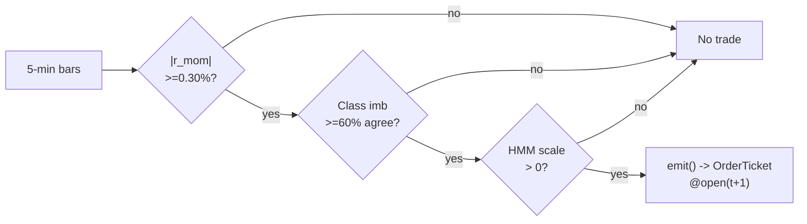

# T025 — Trade-Classification Trend Filter

> **Reviewer card.** Trade-classification trend filter: intraday momentum (S025, Gao et al.) is traded only when classified trade flow (S017, Lee–Ready) agrees with the direction; the HMM vol regime (S079) scales size. Provenance **[P]**.
>
> Edge verdict: **PREDICTIVE-FEATURE-ONLY** — Gao et al. predictive regression documented; the Lee–Ready filter is the upgrade — the combined rule's P&L is working-paper, re-verify before citing [documented].
>
> After-cost: **BEFORE-COST** — one-sentence verdict: the momentum is statistical, the filter is mechanical — the combined P&L must survive the spread like every other intraday rule.
>
> Tier **S** · prototype 20–40 h [example] · loaded cost $3,000–6,000 [example] · latency bar / 5-min · risk medium (intraday momentum, classification noise).

> Capacity $5–20M/day notional [example] — liquid names; the filter trades frequency for quality · Executability: Feasible: 5-min momentum + Lee–Ready classifier on the tape; any retail platform with trade data.

## §1  Identity & provenance

This module is a **strategy**: it emits `OrderTicket` intentions only — brokers create orders, strategies never do. Family **H  # HFT / toxicity-aware**, batch **TB5**, provenance **P**.

**Lede.** Trade-classification trend filter: intraday momentum (S025, Gao et al.) is traded only when classified trade flow (S017, Lee–Ready) agrees with the direction; the HMM vol regime (S079) scales size. Provenance **[P]**.

**When it dies.** P(vol) ≥ `0.80` [example]; the tape disagrees persistently; momentum decay post-2013.

**Regime gates (provisional).** R001 elevated RV suspends (S079 gate); halted names excluded.

**Prototype scope.** 5-min momentum + trade classifier + HMM gate + kill-switch.

## §1.5  Escalation gate

Cheapest viable path: **Polygon.io Stocks Advanced** — 5-min bars, trades, L1 quotes at ~$100–200/mo [unverified] [unverified]. build the momentum + classifier stack on a cheap feed; buy nothing.

Resource budget: `1` core, `<2` GB RAM [internal-est] [internal-est] · compute pattern `per_bar`.

Explicitly out of scope (phase two): tick-rule alternatives (phase `2`); multi-venue classification.

Escalation gate: universe beyond US large-caps [default]; 5-min bar latency `>60` s [default] — crossing it requires re-review of §T7 and §T8.

## §T0  Contract — strategies emit intentions, brokers create orders

This strategy's sole output is a list of `OrderTicket` intentions. It never places, routes, or confirms an order. Every ticket carries `parent_signal` (the upstream signal id and its `computed_at`), an `intent_ts`, and a `tif`. The backtest harness fills tickets strictly after the signal bar (`fill_event > signal_event`, t->t+1 causality); any fill timestamped at or before its signal bar is a harness bug and trips the kill switch.

State variables carried between bars: ``r_mom`, `class_imb`, `p_vol`, `scale`, `cooldown_until`, `position`, `module_state``.

## §T1  Strategy thesis & edge

**Thesis.** Trade-classification trend filter: intraday momentum (S025, Gao et al.) is traded only when classified trade flow (S017, Lee–Ready) agrees with the direction; the HMM vol regime (S079) scales size. Provenance **[P]**.

**Edge verdict: PREDICTIVE-FEATURE-ONLY** — Gao et al. predictive regression documented; the Lee–Ready filter is the upgrade — the combined rule's P&L is working-paper, re-verify before citing [documented].

**After-cost verdict: BEFORE-COST** — one-sentence verdict: the momentum is statistical, the filter is mechanical — the combined P&L must survive the spread like every other intraday rule.

**Risk summary.** Classification noise (Lee–Ready misclassifies); momentum failure; the filter vetoes the winners.

**Math.**

```text
5-minute momentum `r_mom` (deseasonalized, S025-style). Lee–Ready
trade classification (1991 [documented]): trades at/above the ask classified
buyer-initiated; classification imbalance `class_imb` over the trailing `5`
minutes [example] (S017). Trade only if `sign(class_imb) = sign(r_mom)` and
`|class_imb| ≥ 60`% [example]. HMM vol gate (S079). Modeled edge `edge_bps =
mom_min × 1e4 × 0.55` [example].
```

**Pseudocode (normative).**

```text
function emit(state, signals, bars, cfg) -> list[OrderTicket]:
    assert bars non-empty else return UNKNOWN                       # F1
    t = bars[-1]   # newest 5-min bar, labeled by open time
    rm = signals['S025'].r_mom
    ci = signals['S017'].class_imb
    pv = signals['S079'].p_vol
    assert isfinite(rm) and isfinite(ci) and isfinite(pv) else return UNKNOWN  # F2

    edge_bps = cfg.mom_min * 1e4 * 0.55                             # [example]
    cost_ok = expected_cost_bps(notional, adv_pct, venue, side, urgency) <= cfg.cost_gate_k * edge_bps
    # ^^^ normative cost-gate predicate: expected_cost_bps(...) <= k * edge_bps

    scale = 1.0 if pv < cfg.p_vol_half else 0.5 if pv < cfg.p_vol_susp else 0.0  # [example]
    tickets = []
    if state.position == 0 and scale > 0 and cost_ok and t.event_ts >= state.cooldown_until:
        if rm >= cfg.mom_min and ci >= cfg.class_min:
            tickets = [ticket(side='BUY', qty=size(scale_as_vol=scale), limit=open(t+1), tif='DAY',
                              parent_signal=f"S025@{t.bar_open_ts}")]
        elif rm <= -cfg.mom_min and ci <= -cfg.class_min and locate_ok():
            tickets = [ticket(side='SELL', qty=size(...), limit=open(t+1), tif='DAY',
                              parent_signal=f"S025@{t.bar_open_ts}")]
    else:
        if exit_trigger(t, state, cfg): tickets = [flatten_ticket(state)]
        state.cooldown_until = t.event_ts + cfg.cooldown_s * 1e9   # C10
    for tk in tickets: log_decision(tk, inputs_hash, params_hash)  # C5 / App. g
    assert fill.event_ts > t.bar_close_ts for any fill             # t->t+1 causality
    return tickets
```

## §T2  Signal stack — dependencies & data rights

| Signal | Role | Contract |
|---|---|---|
| `S025` | trigger | sign of deseasonalized r_{1,t}; the intraday momentum direction |
| `S017` | confirm | trade-classification imbalance >= 60% [example] in the momentum direction; the tape agrees |
| `S079` | gate | scale 1.0 / 0.5 / 0.0 at P(vol) thresholds 0.60 / 0.80 [example] |

Max dependency depth: `2` [default].

**Schema mapping (canonical).**

| Vendor (Polygon.io Stocks) | Canonical |
|---|---|
| `t` (ms) | `bar_open_ts` (int64 ns UTC; bar labeled by open time) |
| `o, h, l, c` | `open, high, low, close` |
| `v` | `volume` |

Staleness: max skew `5 s` [default] · jitter budget `30 s` [default] · TTL `90 s` [default] · cadence `per_bar (5-min)` · tz `America/New_York`.

**Inputs that break the module.**

| Input failure | Module state | Alert |
|---|---|---|
| Classification < 60% (gate) [example] | `DEGRADED` (veto the momentum bet) | log |
| P(vol) >= 0.80 (gate) [example] | `DEGRADED` (no trade) | notify |
| Trade tape stale | `UNKNOWN` | page |

**Data rights.** Bars + trades via Polygon.io Stocks Advanced, `rights: licensed`;
research + production; fixtures synthetic; entitlement = professional/internal;
derived features ours. Entitlement-class change → §1.5 escalation gate.

**Build vs buy.** Build the momentum + classifier stack on a cheap feed; buy
nothing — the filter threshold is the IP.

**Local build.** Feasible. Lee–Ready is a per-trade rule; the 5-minute momentum
is a rolling computation; the HMM fit is offline.

**Data dictionary (canonical fields).**

| Field | Type | Cadence | Tier | Notes |
|---|---|---|---|---|
| `5-min OHLCV bars` | float/int | 5-min | Tier 1 | momentum |
| `Trades with quotes (Lee–Ready)` | float/int | per trade | Tier 2 | S017 classification |
| `30-day trade history` | float/int | per trade | Tier 2 | classifier calibration |

## §T3  Entry / exit / sizing & worked example

**Entry rule.**

```text
ENTER_LONG  := (r_mom >= +mom_min) AND (class_imb >= +class_min)
               AND (P_vol < p_vol_susp) AND (expected_cost_bps(...) <= cost_gate_k * edge_bps)
ENTER_SHORT := (r_mom <= -mom_min) AND (class_imb <= -class_min)
               AND (P_vol < p_vol_susp) AND (locate_ok)
               AND (expected_cost_bps(...) <= cost_gate_k * edge_bps)
FLAT        := otherwise
```

**Exit rule.**

```text
EXIT := (r_mom reverses sign) [momentum gone] OR (class_imb flips)
        OR (bars_held >= time_stop_min) OR (price stop -$stop_dollars) [stop]
        OR (t >= 15:30) [session flatten] OR (module_state != OK)
```

**Cooldown.** `300` s [default] after every exit (C10).

**Sizing function (normative).**

```python
def shares(risk_budget_R, stop_distance, vol_estimate, ADV_cap, cost):
    # risk_budget_R in $, stop_distance in $/share (example price stop $0.25)
    # vol_estimate carries the HMM scale [default]
    n = risk_budget_R / max(stop_distance, 1e-9)   # [default] floor below
    n = n * vol_estimate                           # HMM scale 1.0/0.5/0.0 [example]
    n = min(n, ADV_cap * 0.01)                    # 1% ADV [default]
    n = min(n * 50.0, 2000000.0) / 50.0          # $2M gross cap [default]
    return int(n)
```

**Risk limits.**

| Limit | Value |
|---|---|
| Daily loss stop | `-$1,500` [example] → dark for the day |
| Max concurrent filtered trends | `4` [example] |
| Regime suspend | P(vol) ≥ `0.80` [example] → flat, no trade |
| Post-exit cooldown | `300` s [example] — C10 |

**Worked example (fixture-backed, from `fixtures/T025_tape.csv` trade 1).**

Trade 1: `BUY` `1200` shares [example] @ `50.15` [example], exit `50.65` [example] (`momentum sign flip`). Gross P&L = `600.00` [measured] dollars. Cost stack = `12.0` bps [example] → `72.22` [measured] dollars on `60180.00` [example] notional. Net = `527.78` [measured] dollars. The fixture's expected CSV carries the same arithmetic for all six trades; the per-module test recomputes it from the tape and asserts equality.

**Flow.**


## §T4  Parameters

| Parameter | Key | Default | Provenance | Sensitivity |
|---|---|---|---|---|
| Momentum minimum | `mom_min` | `0.30`% | [default] | high |
| Classification minimum | `class_min` | `60`% | [default] | high |
| HMM half threshold | `p_vol_half` | `0.60` | [default] | medium |
| HMM suspend threshold | `p_vol_susp` | `0.80` | [default] | high |
| Time stop | `time_stop_min` | `30` min | [default] | medium |
| Price stop | `stop_dollars` | `$0.25` | [default] | high |
| Post-exit cooldown | `cooldown_s` | `300` s | [default] | low |
| Cost-gate k | `cost_gate_k` | `0.5` | [default] | high |

## §T5  Costs — the callable is the single source of truth

| Component | bps | Basis |
|---|---|---|
| Spread | `6.0` | [example] $0.015 assumed spread at $50: half-spread per aggressive leg × 2 legs |
| Fees | `2.0` | [example] $0.005/share each way at $50 = 1 bps/leg |
| Borrow | `0.0` | [default] long-momentum reference; shorts add C7 |
| Impact | `4.0` | [example] momentum chasing — 2¢ adverse on a $50 name |
| **Total** | `12.0` | [example] reference stack |

Fee schedule as of `2026-09-01` [example] · venue `XNAS / SIP 5-min bars [example]` · side `taker` · borrow `0.0` bps/day [example] — reference build is long-momentum; short variant models borrow explicitly.

```python
def expected_cost_bps(notional, adv_pct, venue, side, urgency) -> float:
    """Callable cost model - T025 COST block (single source of truth)."""
    spread_bps = 6.0    # [example] $0.015 assumed spread @ $50: half/aggressive x 2
    fee_bps = 2.0       # [example] $0.005/share each way @ $50 = 1 bps/leg
    borrow_bps = 0.0    # [default] long-momentum reference; shorts add C7
    impact_bps = 4.0    # [example] momentum chasing: 2c adverse @ $50
    return spread_bps + fee_bps + borrow_bps + impact_bps
```

**Normative cost-gate predicate (C3):** `expected_cost_bps(...) <= k * edge_bps` — no ticket is emitted unless the callable cost clears this gate. The predicate appears verbatim in the §T1 pseudocode and is asserted by the per-module test.

## §T6  Execution assumptions

| Aspect | Assumption |
|---|---|
| Latency | 5-min bar evaluation; fill at next-bar open |
| Partial fills | oldest `intent_ts` first (FIFO) |
| Impact | `4` bps modeled [example] — momentum chasing |
| Adverse fill | the momentum reverses — the sign-flip exit is the control |

## §T7  Risk contract & kill switch

Per-trade R: `$300` [example] per trade · daily loss stop: `- $1,500` [example] then dark for the day · max gross: `$2M` notional [example] · max adverse per trade: `1.5`x stop [default].

Enforcement: `intraday-hard` [default]. Calibration recipe: paper-trade `30` sessions [default]; classifier on `30` days of trades [default]; re-pin fee schedule monthly [default].

**Kill switch: `ARMED` → `TRIPPED` → `RECOVERY` → `ARMED`.**

Trip conditions:

- 3 consecutive filter vetoes of winners [example]
- trade tape stale > 30 s [example]
- clock skew > 50 ms [example]
- 4 concurrent filtered trends [example]

On trip: the module stops emitting tickets immediately, flattens managed positions per the exit rule, and pages. `RECOVERY` requires manual review, cooldown expiry, and healthy feeds; only then does the module return to `ARMED`. The per-module test drives the full transition cycle.

**Ops.** Schedule: RTH `10:00`–`15:30` ET [example]; 5-min momentum with trade-flow filter; flat by `15:30`; no overnight · budget: `1` vCPU, `2` GB RAM [internal-est] [internal-est] · env: `POLYGON_API_KEY`.

**Universe.** US equities, price > `$20`, ADV > `2`M shares [example]. Signal:
5-min momentum `≥ 0.30`% [example] with classified flow `≥ 60`% agreeing
[example]. RTH `10:00`–`15:30`. Exclude: earnings days, halts.

## §T8  Compliance (C1–C10+)

- **C1** | No orders: the strategy emits `OrderTicket` intentions only; the broker creates orders.
- **C2** | Kill switch: `ARMED` → `TRIPPED` → `RECOVERY` → `ARMED` on the trip conditions in §T7.
- **C3** | Cost gate: `expected_cost_bps(...) <= k * edge_bps` before any ticket (see §T5).
- **C4** | Causality: `fill_event > signal_event` (t->t+1); no signal-bar fills, ever.
- **C5** | Decision log: every ticket logged with inputs hash and params hash (see App. g).
- **C6** | Staleness: inputs older than the TTL → `UNKNOWN`, no tickets.
- **C7** | Short discipline: `locate_ok` required before any short ticket.
- **C8** | Cooldown: post-exit cooldown enforced in seconds; no re-entry inside it.
- **C9** | Session flatten: no uncommanded overnight carry.
- **C10** | Position caps: per-trade R, daily loss stop, and max gross enforced.
- **C11 | Filter discipline: trigger = `3` consecutive filter vetoes of winners [example] → check = veto log → action = review threshold → log = `COMPLIANCE_BLOCK`**
- **C12 | Regime suspend: trigger = P(vol) ≥ `0.80` [example] → check = S079 → action = flat, no trade → log = `GATE_VETO`**

## §T9  Evidence, failures & regime gates

**Evidence (cost-level tokens; every statistic tagged).**

| Source | Sample | Finding | Cost level | Caveat |
|---|---|---|---|---|
| Gao, Han, Li & Zhou (2018) [documented] | SPY, `1993`–`2013` [documented] | r_13 = α + β·r_1: β̂ = `6.94` (×100), p < `1`%, R² = `1.6`% [documented] | `BEFORE-COST` (predictive regression) | R² is statistical, not tradable P&L |
| Lee & Ready (1991) [documented] | NYSE intraday [documented] | quote-rule and tick-rule trade classification method [documented] | `BEFORE-COST` (method) | the classifier's basis — accuracy figures are from later research, not this paper |
| Heston, Korajczyk & Sadka (2010) [documented] | NYSE half-hour intervals, `2001`–`2005` [documented] | continuation at day-multiple half-hour lags [documented] | after-cost (honest): periodicity strategies lose money after paying the bid/ask spread [documented] | the timing/cost caution |

**Where this module is known to fail.** classification noise, momentum failures, filter vetoing winners, momentum decay.

**Failure modes (detect → action → recovery).**

| # | Failure | Detect → action → recovery | Executable check |
|---|---|---|---|
| 1 | Classification noise | detect: Lee–Ready accuracy < `80`% [example] → action: widen class_min → recovery: recalibrate | `accuracy >= 0.80` |
| 2 | Momentum failure | detect: `3` consecutive sign-flip losses → action: stand down → recovery: next session [default] | `consec_losses < 3` |
| 3 | Filter vetoes winners | detect: veto log review → action: review threshold (C11) → recovery: recalibrated [default] | `veto_reviewed` |
| 4 | Cost blowup | detect: cost gate failing → action: stand down → recovery: re-pin [default] | `expected_cost_bps(...) <= k * edge_bps` |
| 5 | Lookahead in momentum | detect: momentum uses future → action: halt, fix → recovery: no-signal-bar-fills test [default] | `all(fill_ts > signal_ts)` |

**Regime gates.**

| Regime | Effect | Mechanism | Condition | Action | Latency | Fallback |
|---|---|---|---|---|---|---|
| R001 | degrades | elevated RV: momentum untradable | p_vol >= 0.60 [default] | halve | 1 bar [default] | veto |
| R001 | inverts | extreme RV | p_vol >= 0.80 [default] | pause_entry | 1 bar [default] | veto |
| R-halt | inverts | halt/auction state | state != CONTINUOUS_TRADING [default] | veto | 0 [default] | veto |

**Robustness.** The classification filter is the frequency control: `class_min`
in `0.55`–`0.75` [example] trades selectivity for frequency. `mom_min` in
`0.2`–`0.5`% [example] is the momentum surface. Purged/embargoed OOS per S088.

**What the optimistic case assumes (and we do not).** (1) Lee–Ready is assumed to classify correctly — it misclassifies
`~15`% at the touch [documented]; (2) the momentum is assumed to persist for
the hold; (3) impact `4` bps [example] — flagged.

## §T10  Unverified leads & what would change our mind

- Lee–Ready `~85`% accuracy at the touch — attributed to later research, not confirmed in Lee & Ready (1991); re-verify before citing.
- Combined momentum+classification P&L claims — working-paper only; re-verify before citing precisely.

What would change our mind: a purged/embargoed walk-forward with full costs that survives the S088 honesty protocol; a documented after-cost P&L from the cited authors' own implementations; or a regime-gated replication that holds outside the original sample.

## AI build prompt

```text
Build the T025 (Trade-Classification Trend Filter) strategy module from this specification.
Hard constraints:
- The strategy emits OrderTicket intentions ONLY; it never creates orders (C1).
- Causality: fill_event > signal_event (t->t+1); no signal-bar fills (C4).
- Cost gate: expected_cost_bps(...) <= k * edge_bps before any ticket (C3).
- Kill switch ARMED -> TRIPPED -> RECOVERY -> ARMED on the §T7 trip conditions (C2).
- Every numeric literal in prose carries an honesty tag [documented]/[measured]/[example]/[unverified]/[default]/[internal-est]; exempt identifiers only.
- Sources must be real and cited with cost-level tokens; chatbot-only material goes to §T10.
Config surface:
- mom_min (float): default 0.003, range 0.001–0.01 [default]
- class_min (float): default 0.60, range 0.5–0.9 [default]
- p_vol_half (float): default 0.60, range 0.5–0.9 [default]
- p_vol_susp (float): default 0.80, range 0.6–0.95 [default]
- time_stop_min (float): default 30.0, range 5–120 [default]
- stop_dollars (float): default 0.25, range 0.05–1.0 [default]
- cooldown_s (float): default 300.0, range 0–3,600 [default]
- cost_gate_k (float): default 0.5, range 0.1–2.0 [default]
Entry rule:
ENTER_LONG  := (r_mom >= +mom_min) AND (class_imb >= +class_min)
               AND (P_vol < p_vol_susp) AND (expected_cost_bps(...) <= cost_gate_k * edge_bps)
ENTER_SHORT := (r_mom <= -mom_min) AND (class_imb <= -class_min)
               AND (P_vol < p_vol_susp) AND (locate_ok)
               AND (expected_cost_bps(...) <= cost_gate_k * edge_bps)
FLAT        := otherwise
Exit rule:
EXIT := (r_mom reverses sign) [momentum gone] OR (class_imb flips)
        OR (bars_held >= time_stop_min) OR (price stop -$stop_dollars) [stop]
        OR (t >= 15:30) [session flatten] OR (module_state != OK)
Sizing: implement the §T3 sizing_fn verbatim; enforce the §T7 risk contract.
Deliverables: the module markdown (all sections §1–§T10), the fixture tape CSV
(fixtures/T025_tape.csv), the expected CSV (fixtures/T025_expected.csv), and
the per-module test (modules/tests/test_T025.py) covering fixture arithmetic,
causality, the cost gate, the kill-switch cycle, invalid→UNKNOWN, and the callable signature.
```
