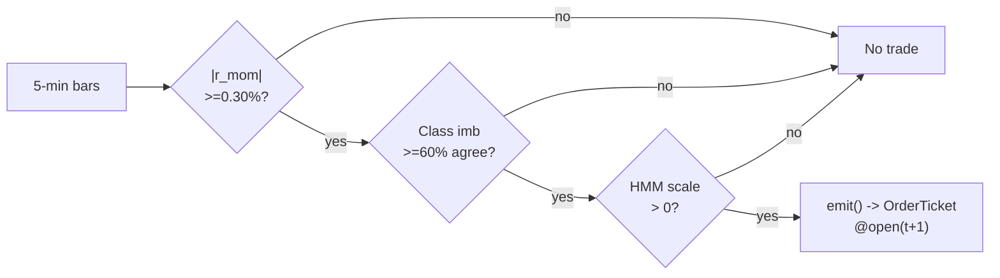

# T025 — Trade-Classification Trend Filter

> Tag law: every numeric literal in prose carries one of `[documented]
> [default] [example] [unverified] [internal-est] [measured]` (legend: Appendix
> i v1.0.0). Constants inside cited formulas inherit the formula's tag
> (`[documented]` for cited literature). Bibliographic years, volumes, pages,
> section numbers, rule codes (C1–C18), fail-safe codes (F1–F5),
> module IDs, and machine-parsed §0 data fields are identifiers, not
> literals, and are exempt.

## §1  Five-minute reviewer card & identity

| Row | Value |
|---|---|
| Module | T025 — Trade-Classification Trend Filter, v1.0.1 |
| Edge verdict | `PREDICTIVE-FEATURE-ONLY` — Gao et al. predictive regression documented; the Lee–Ready filter is the upgrade — the combined rule's P&L is working-paper, re-verify before citing [documented] |
| After-cost | `BEFORE-COST` — the momentum is statistical, the filter is mechanical — the combined P&L must survive the spread like every other intraday rule |
| Build cost | Tier S · `20–40` h [example] · `$3,000–6,000` loaded [example] |
| Data cost | Research `$0` (synthetic fixtures) / Massive Stocks Starter `$29`/mo 15-min delayed [documented]; production Massive Stocks Advanced `$199`/mo real-time [documented] (price list as-of 2026-08), or Databento MBP-1 usage `$2.00`/GB hist, `$2.40`/GB live [documented] |
| latency_class | bar / 5-min |
| risk_class | medium (intraday momentum, classification noise) |
| Capacity | `$5–20`M/day notional [example] — liquid names; the filter trades frequency for quality |
| Executability | Feasible: 5-min momentum + Lee–Ready classifier on the tape; any retail platform with trade data |
| Risk summary | Classification noise (Lee–Ready trade-level misclassification `21–31`% [documented] unless quotes are lagged); momentum failure; the filter vetoes the winners; at reference defaults the cost gate binds (`|r_mom| ≥ 0.44`% [measured] required at k=`0.5`) |
| When it dies | P(vol) ≥ `0.80` [example]; the tape disagrees persistently; momentum decay post-2013; spread regime beyond `3` ticks [default] |
| Regime gates | Provisional: R001 elevated RV suspends (S079 gate); R-halt names excluded — machine records in §T9 |
| Emits | `OrderTicket` intentions only (strategy never creates orders) |

**Prototype scope.** 5-min momentum + trade classifier + HMM gate + kill-switch.

**Identity.** This module is a **strategy** (family **H  # HFT / toxicity-aware**, batch **TB5**, provenance_tier **P**); it emits `OrderTicket` intentions only — brokers create orders, strategies never do.

## §1.5  Cheapest/least-build path

**Cheapest viable path:** buy the SIP feed, build the stack. Research tier: Massive (formerly Polygon.io) Stocks Starter `$29`/mo — 15-minute delayed SIP quotes [documented] (adequate for offline momentum/classifier research; not tradable live). Live tier: Massive Stocks Advanced `$199`/mo — real-time bars, trades, L1 quotes [documented] (price list as-of 2026-08). Alternative usage path: Databento MBP-1 `$2.00`/GB historical, `$2.40`/GB live [documented] (Databento 2024-12-11 unit pricing sheet) — MBP-1 (top-of-book + trades) is sufficient for Lee–Ready; depth beyond L1 is never needed.

| min_tier | latency_class | required_fields | price_band | build_or_buy |
|---|---|---|---|---|
| Tier 2 (SIP L1 + trades) | near-real-time (delayed research) / real-time (live) | 5-min OHLCV bars; trade prices with prevailing bid/ask (Lee–Ready); exchange timestamps | $29/mo delayed, $199/mo real-time [documented]; or Databento usage $2.00–$2.40/GB [documented] | buy feed, build stack |

1. **Prototype hour band:** `20–40` h [example] — 5-min momentum + Lee–Ready classifier + HMM gate + cost gate + kill-switch + fixture validation.
2. **Resource budget:** `1` core, `<2` GB RAM [internal-est] · compute pattern `per_bar`.
3. **Skip list (phase two):** tick-rule alternatives (phase `2`); multi-venue classification; quote-midpoint refinement of the classifier; intraday borrow-rate modeling.
4. **DO-NOT-CUT list:** t→t+1 causality assertions (C4); COST block + cost gate (C3); kill switch + re-arm checklist (C2); decision log (C5); bona-fide intent + self-trade prevention (C13/C14); honesty tags on every numeric literal; fixtures + tests; secrets via env only; locate check for shorts (C7); entitlement assertions (C18).
5. **Escalation gate:** universe beyond US large-caps [default]; 5-min bar latency `>60` s [default] persistently; entitlement-class change (delayed → real-time) — crossing it requires re-review of §T7 and §T8.

Explicitly out of scope (phase two): tick-rule alternatives (phase `2`); multi-venue classification.

## §T0  Contract — strategies emit intentions, brokers create orders

This strategy's sole output is a list of `OrderTicket` intentions. It never places, routes, or confirms an order. Every ticket carries `parent_signal` (the upstream signal id and its `computed_at`), an `intent_ts`, and a `tif`. The backtest harness fills tickets strictly after the signal bar (`fill_event > signal_event`, t->t+1 causality); any fill timestamped at or before its signal bar is a harness bug and trips the kill switch.

**Typed signature (normative).**

```python
def emit(state: ModuleState, signals: SignalBundle, bars: list[Bar], cfg: T025Config) -> list[OrderTicket]:
    """Core strategy function. Returns OrderTicket *intentions*; never orders.
    Invalid input -> module_state UNKNOWN and empty ticket list (never interpolate)."""
```

`Bar` = canonical 5-min bar `{bar_open_ts: int64 ns UTC, open, high, low, close: float, volume: int}` (labeled by open time). `SignalBundle` = `{S025: {r_mom, computed_at}, S017: {class_imb, computed_at}, S079: {p_vol, computed_at}}`. `OrderTicket` schema is pinned in §T6 (Appendix c).

**Config dataclass** — one `Config`, per-parameter type/default/range/status.

| Parameter | Type | Default | Range | Status |
|---|---|---|---|---|
| `mom_min` | float | `0.003` | 0.001–0.01 | calibrate |
| `class_min` | float | `0.60` | 0.5–0.9 | calibrate |
| `p_vol_half` | float | `0.60` | 0.5–0.9 | default |
| `p_vol_susp` | float | `0.80` | 0.6–0.95 | default |
| `time_stop_min` | float | `30.0` | 5–120 | default |
| `stop_dollars` | float | `0.25` | 0.05–1.0 | calibrate |
| `cooldown_s` | float | `300.0` | 0–3,600 | default |
| `cost_gate_k` | float | `0.5` | 0.1–2.0 | calibrate |

Status ∈ {fixed, default, calibrate, example, internal-est}. `calibrate` params must be re-fit on embargoed OOS before production.

**Time contract.**

| Item | Value |
|---|---|
| Clock domain | exchange event time, int64 ns, UTC canonical; America/New_York for display/session |
| Bar-label rule | bars labeled by open time; bar `t` finalizes at close |
| Dual timestamps | `event_ts` (exchange) + `asof_ts` (receipt); skew check `asof_ts - event_ts` |
| max_skew | `5` s [default] |
| jitter budget | `30` s [default] |
| staleness TTL | `450` s [default] (`1.5`× the 5-min cadence; 90 s was tighter than one bar — fixed v1.0.1) → `UNKNOWN`, no tickets (C6) |
| Trade-tape freshness (classifier) | trade tape stale `> 30` s [example] → kill trip (Lee–Ready needs the live tape) |
| Gap policy | missing bar → mask, never interpolate |
| Causality | `fill_event > signal_event` asserted in harness; `signal@t (per_bar 5-min, America/New_York) → earliest fill @open(t+1)` |

**Market-state table (runtime, not backtest hygiene).**

| State | Behavior |
|---|---|
| `CONTINUOUS_TRADING` | normal emit path |
| `HALTED` | veto all entries; flatten open position per exit rule |
| `AUCTION` | veto all entries; existing DAY tickets stand until session flatten |
| `CLOSED` | module `OFF`; no state carried except params |

**Module-state enum.** `OK | DEGRADED | UNKNOWN | OFF`. Invalid input emits `UNKNOWN`, never interpolates. F1–F5 fail-safes map onto this enum (see §T9).

**Risk contract (fenced YAML — machine source of truth; §T7 is the human-readable copy).**

```yaml
risk_contract:
  per_trade_R: 300.0          # USD [example]
  daily_loss_stop: -1500.0    # USD [example]; dark for the day when hit
  max_gross: 2000000.0        # USD notional [example]
  max_concurrent: 4           # filtered trends [example]
  max_adverse_per_trade: 1.5  # x stop [default]
  enforcement: intraday-hard  # [default]
  calibration: "paper-trade 30 sessions [default]; classifier on 30 days of trades [default]; re-pin fee schedule monthly [default]"
```

**Kill switch: `ARMED` → `TRIPPED` → `RECOVERY` → `ARMED`.** Trip conditions in §T7. On trip: stop emitting, flatten per exit rule, page.

**Re-arm checklist** (all must hold before `RECOVERY` → `ARMED`):

1. Trip cause identified and written to the decision log.
2. Post-exit cooldown (`300` s [default]) expired.
3. Trade tape healthy (fresh `< 30` s [example]) and 5-min bars contiguous.
4. Clock skew vs NTP `< 50` ms [example].
5. Positions flat; paper ledger == module state (reconciled; any mismatch resolved).
6. Fee schedule re-pinned if the trip was cost-related.
7. Manual operator sign-off recorded.

**Ops tail.** Schedule: RTH `10:00`–`15:30` America/New_York [example]; flat by `15:30`; no overnight. Owner: operator on-call [default]. Health checks: tape-heartbeat monitor (30 s cadence [example]), bar-finalization monitor, skew monitor, ledger-vs-state reconciliation every `300` s [default]. Alerts: page on kill trip / `UNKNOWN`; notify on `DEGRADED`. Resource budget: `1` vCPU, `2` GB RAM [internal-est]; state O(1) per symbol [internal-est]. Runbook stub: trip → flatten → reconcile ledger → root-cause in decision log → checklist → re-arm. Secrets: env-only (`MASSIVE_API_KEY`, `DATABENTO_API_KEY`); never in files.

State variables carried between bars: `r_mom`, `class_imb`, `p_vol`, `scale`, `cooldown_until`, `position`, `entry_px`, `entry_ts`, `entry_sign`, `bars_held`, `adv_shares`, `market_state`, `last_processed_ts`, `module_state`.

## §T1  Strategy thesis & edge

**Thesis.** Trade-classification trend filter: intraday momentum (S025, Gao et al.) is traded only when classified trade flow (S017, Lee–Ready) agrees with the direction; the HMM vol regime (S079) scales size. Provenance **[P]**.

**Edge verdict: PREDICTIVE-FEATURE-ONLY** — Gao et al. predictive regression documented; the Lee–Ready filter is the upgrade — the combined rule's P&L is working-paper, re-verify before citing [documented].

**After-cost verdict: BEFORE-COST** — one-sentence verdict: the momentum is statistical, the filter is mechanical — the combined P&L must survive the spread like every other intraday rule.

**Risk summary.** Classification noise (Lee–Ready misclassifies); momentum failure; the filter vetoes the winners.

**Math.**

```text
5-minute momentum `r_mom` (deseasonalized, S025-style). Lee–Ready
trade classification (1991 [documented]): trades at/above the ask classified
buyer-initiated; classification imbalance `class_imb` over the trailing `5`
minutes [example] (S017). Trade only if `sign(class_imb) = sign(r_mom)` and
`|class_imb| ≥ 60`% [example]. HMM vol gate (S079). Modeled edge is per-signal:
`edge_bps = |r_mom| × 1e4 × 0.55` [example] — the 0.55 [example] is the
fraction of the observed 5-minute move the reference build assumes capturable
after adverse selection. v1.0.1 fix: the old constant `mom_min × 1e4 × 0.55`
(= 16.5 bps) made the gate dead at defaults (0.5 × 16.5 = 8.25 < 12 bps cost);
the gate now binds but is satisfiable: it passes at k = 0.5 [default] when
`|r_mom| ≥ 0.44`% [measured].
```

**Pseudocode (normative)** lives in §T3 — `emit`, `exit_trigger`, and
`flatten_ticket` are defined there with all prose guards present, the cost-gate
predicate, and inline causality assertions.

## §T2  Signal stack — dependencies & data rights

> **Timing box (fixed wording).** `signal@t (per_bar 5-min, America/New_York) → earliest fill @open(t+1)`

**§T2 fixed-order sub-block locations** (section numbering frozen per proposal v1.0.0; sub-blocks live where the legacy sections put them):

| Mandatory sub-block | Lives in |
|---|---|
| Universe | §T7 |
| Entry rule (Boolean) | §T3 |
| Exits + post-exit cooldown | §T3 |
| Position sizing (fenced function) | §T3 |
| Risk limits | §T3 / §T7 |
| COST block (single source of truth) | §T5 |
| Execution / fill-model table | §T6 |
| Robustness + Compliance sub-block (10+ coded rules) | §T9 / §T8 (rule→code map below) |
| Parameter table | §T4 |
| Timing box | §T2 (above) |

**Compliance sub-block (10 coded rules; full text in §T8).** Rule → C-code map: STP/self-match prevention → C13; bona-fide intent → C14; message-rate/cancel-to-trade → C15; pre-trade fat-finger trio → C16; decision-log schema → C5 (§T6 App. g); halt/auction state table → §T0 market-state table; locate check → C7; public-dissemination gate → C17; data-entitlement assertions → C18; exit cooldown → C8. Filter-discipline (C11) and regime-suspend (C12) are T025-specific additions.

| Signal | Role | Contract |
|---|---|---|
| `S025` | trigger | sign of deseasonalized r_{1,t}; the intraday momentum direction |
| `S017` | confirm | trade-classification imbalance >= 60% [example] in the momentum direction; the tape agrees |
| `S079` | gate | scale 1.0 / 0.5 / 0.0 at P(vol) thresholds 0.60 / 0.80 [example] |

Max dependency depth: `2` [default].

**Schema mapping (canonical).**

| Vendor (Massive Stocks) | Canonical |
|---|---|
| `t` (ms) | `bar_open_ts` (int64 ns UTC; bar labeled by open time) |
| `o, h, l, c` | `open, high, low, close` |
| `v` | `volume` |

Staleness: max skew `5` s [default] · jitter budget `30` s [default] · TTL `450` s [default] (`1.5`× the 5-min cadence) · trade-tape freshness `30` s [example] (classifier kill trip) · cadence `per_bar (5-min)` · tz `America/New_York`.

**Inputs that break the module.**

| Input failure | Module state | Alert |
|---|---|---|
| Classification < 60% (gate) [example] | `DEGRADED` (veto the momentum bet) | log |
| P(vol) >= 0.80 (gate) [example] | `DEGRADED` (no trade) | notify |
| Trade tape stale | `UNKNOWN` | page |

**Data rights.** Bars + trades via Massive (formerly Polygon.io) Stocks Advanced, `rights: licensed`;
research + production; fixtures synthetic; entitlement = professional/internal;
derived features ours. Entitlement-class change → §1.5 escalation gate.

**Build vs buy.** Build the momentum + classifier stack on a cheap feed; buy
nothing — the filter threshold is the IP.

**Local build.** Feasible. Lee–Ready is a per-trade rule; the 5-minute momentum
is a rolling computation; the HMM fit is offline.

**Data dictionary (canonical fields).**

| Field | Type | Cadence | Tier | Notes |
|---|---|---|---|---|
| `5-min OHLCV bars` | float/int | 5-min | Tier 1 | momentum |
| `Trades with quotes (Lee–Ready)` | float/int | per trade | Tier 2 | S017 classification |
| `30-day trade history` | float/int | per trade | Tier 2 | classifier calibration |

## §T3  Entry / exit / sizing & worked example

**Entry rule.**

```text
ENTER_LONG  := (r_mom >= +mom_min) AND (class_imb >= +class_min)
               AND (P_vol < p_vol_susp) AND (expected_cost_bps(...) <= cost_gate_k * edge_bps)
ENTER_SHORT := (r_mom <= -mom_min) AND (class_imb <= -class_min)
               AND (P_vol < p_vol_susp) AND (locate_ok)
               AND (expected_cost_bps(...) <= cost_gate_k * edge_bps)
FLAT        := otherwise
```

**Exit rule.**

```text
EXIT := (r_mom reverses sign) [momentum gone] OR (class_imb flips)
        OR (bars_held >= time_stop_min) OR (price stop -$stop_dollars) [stop]
        OR (t >= 15:30) [session flatten] OR (module_state != OK)
```

**Cooldown.** `300` s [default] after every exit (C8) — armed only when an exit ticket is actually emitted (v1.0.1 fix: the old else-branch armed it on every no-signal bar).

**Pseudocode (normative).** Implements the Boolean rules above; every prose guard appears below.

```text
function emit(state, signals, bars, cfg) -> list[OrderTicket]:
    if bars is empty:                                     # F1
        state.module_state = UNKNOWN; return []
    t = bars[-1]   # newest 5-min bar, labeled by open time
    if t.event_ts <= state.last_processed_ts:             # F3 stale/duplicate bar
        state.module_state = UNKNOWN; return []
    rm = signals['S025'].r_mom; rm_ts = signals['S025'].computed_at
    ci = signals['S017'].class_imb; ci_ts = signals['S017'].computed_at
    pv = signals['S079'].p_vol; pv_ts = signals['S079'].computed_at
    if not (isfinite(rm) and isfinite(ci) and isfinite(pv)):  # F2
        state.module_state = UNKNOWN; return []
    if min(rm_ts, ci_ts, pv_ts) < t.event_ts - cfg.staleness_ttl_ns:  # F5/C6
        state.module_state = UNKNOWN; return []           # no tickets
    if state.market_state != CONTINUOUS_TRADING:          # halt/auction table
        state.module_state = DEGRADED; return []

    edge_bps = abs(rm) * 1e4 * 0.55                       # [example] per-signal
    scale = 1.0 if pv < cfg.p_vol_half \
        else 0.5 if pv < cfg.p_vol_susp else 0.0          # [example] HMM gate
    mid = (t.high + t.low) / 2.0                          # [example] fill ref
    qty_hint = int(cfg.per_trade_R / max(cfg.stop_dollars, 1e-9))
    cost_hint = expected_cost_bps(qty_hint * mid, 0.02, 'XNAS', 'taker', 'normal')
    qty = shares(risk_budget_R=cfg.per_trade_R,
                 stop_distance=cfg.stop_dollars,
                 vol_estimate=scale,
                 ADV_cap=state.adv_shares,
                 cost=cost_hint)
    cost = expected_cost_bps(qty * mid, 0.02, 'XNAS', 'taker', 'normal')
    cost_ok = (cost <= cfg.cost_gate_k * edge_bps)         # C3 normative predicate

    tickets = []
    if state.position == 0 and scale > 0 and cost_ok \
            and t.event_ts >= state.cooldown_until \
            and t.event_ts < session_flatten_ts(t):       # no entries past 15:30
        assert qty > 0 and qty * mid <= cfg_max_gross() \
            and side_sane('ENTRY')                        # C16 fat-finger trio
        if rm >= cfg.mom_min and ci >= cfg.class_min:
            tickets = [OrderTicket(new_id(), ('S025', rm_ts),
                                   t.symbol, 'BUY', qty, t.open, 'DAY', now_ns())]
        elif rm <= -cfg.mom_min and ci <= -cfg.class_min and locate_ok(t.symbol, qty):
            tickets = [OrderTicket(new_id(), ('S025', rm_ts),
                                   t.symbol, 'SELL', qty, t.open, 'DAY', now_ns())]
    elif state.position != 0:
        if exit_trigger(t, state, cfg, rm, ci):
            tickets = [flatten_ticket(state, t)]
            state.cooldown_until = t.event_ts + int(cfg.cooldown_s * 1e9)  # C8
    for tk in tickets:
        log_decision(tk, inputs_hash(t, signals), params_hash(cfg))  # C5 / §T6 App. g
    assert all(f.event_ts > t.event_ts for f in fills_of(tickets))    # C4 t->t+1
    state.last_processed_ts = t.event_ts
    return tickets

function exit_trigger(t, state, cfg, rm, ci) -> bool:
    age_min = (t.event_ts - state.entry_ts) / 6e10
    sign_flipped = (rm * state.entry_sign) <= 0.0         # momentum gone
    class_flipped = (ci * state.entry_sign) <= 0.0        # tape disagrees
    time_stopped = age_min >= cfg.time_stop_min
    if state.position > 0:   # long
        price_stopped = t.low <= state.entry_px - cfg.stop_dollars
    else:                    # short
        price_stopped = t.high >= state.entry_px + cfg.stop_dollars
    session_flat = t.event_ts >= session_flatten_ts(t)   # t >= 15:30
    degraded = (state.module_state != OK)
    return (sign_flipped or class_flipped or time_stopped
            or price_stopped or session_flat or degraded)

function flatten_ticket(state, t) -> OrderTicket:
    side = 'SELL' if state.position > 0 else 'BUY'
    px = t.bid if side == 'SELL' else t.ask              # exit at the touch (taker)
    return OrderTicket(new_id(), ('T025', t.event_ts), t.symbol,
                       side, abs(state.position), px, 'DAY', now_ns())
```

**Sizing function (normative).**

```python
def shares(risk_budget_R, stop_distance, vol_estimate, ADV_cap, cost):
    """Fenced sizing: shares = f(risk_budget_R, stop_distance, vol_estimate, ADV_cap, cost).
    risk_budget_R in $, stop_distance in $/share; cost is an interface arg
    (unused in the reference build). vol_estimate carries the HMM scale [default]."""
    n = risk_budget_R / max(stop_distance, 1e-9)   # [default] floor below
    n = n * vol_estimate                           # HMM scale 1.0/0.5/0.0 [example]
    n = min(n, ADV_cap * 0.01)                    # 1% ADV [default]
    n = min(n * 50.0, 2000000.0) / 50.0          # $2M gross cap [default]
    return int(n)
```

**Risk limits.**

| Limit | Value |
|---|---|
| Daily loss stop | `-$1,500` [example] → dark for the day |
| Max concurrent filtered trends | `4` [example] |
| Regime suspend | P(vol) ≥ `0.80` [example] → flat, no trade |
| Post-exit cooldown | `300` s [example] — C10 |

**Worked example (fixture-backed, from `fixtures/T025_tape.csv` trade 1).**

Trade 1: `BUY` `1200` shares [example] @ `50.15` [example], exit `50.65` [example] (`momentum sign flip`). Gross P&L = `600.00` [measured] dollars. Cost stack = `12.0` bps [example] → `72.22` [measured] dollars on `60180.00` [example] notional. Net = `527.78` [measured] dollars. The fixture's expected CSV carries the same arithmetic for all six trades; the per-module test recomputes it from the tape and asserts equality.

**Flow.**


## §T4  Parameters

| Parameter | Key | Default | Status | Sensitivity |
|---|---|---|---|---|
| Momentum minimum | `mom_min` | `0.30`% | calibrate | high |
| Classification minimum | `class_min` | `60`% | calibrate | high |
| HMM half threshold | `p_vol_half` | `0.60` | default | medium |
| HMM suspend threshold | `p_vol_susp` | `0.80` | default | high |
| Time stop | `time_stop_min` | `30` min | default | medium |
| Price stop | `stop_dollars` | `$0.25` | calibrate | high |
| Post-exit cooldown | `cooldown_s` | `300` s | default | low |
| Cost-gate k | `cost_gate_k` | `0.5` | calibrate | high |

## §T5  Costs — the callable is the single source of truth

| Component | bps | Basis |
|---|---|---|
| Spread | `6.0` | [example] $0.015 assumed spread at $50: half-spread per aggressive leg × 2 legs |
| Fees | `2.0` | [example] $0.005/share each way at $50 = 1 bps/leg |
| Borrow | `0.0` | [default] `borrow_bps_per_day = 0.0`: intraday, long-biased reference; shorts add locate + borrow (C7) |
| Impact | `4.0` | [example] momentum chasing — 2¢ adverse on a $50 name |
| **Total** | `12.0` | [example] reference stack |

Fee anchor: Nasdaq Rule 7018 default removal rate `$0.0030`/share [documented] (= `0.6` bps/leg at $50); the module budgets `$0.005`/share/leg = `1.0` bps/leg [example] as a conservative envelope over the documented floor.

Fee schedule as of `2026-09-01` [example] · execution venue `XNAS` [example] (data vendors Massive/Databento are not venues) · side `taker` · `borrow_bps_per_day: 0.0` [default] — reference build is long-biased intraday; shorts would add locate + borrow — excluded, see C7.

```python
def expected_cost_bps(notional, adv_pct, venue, side, urgency) -> float:
    """Callable cost model - T025 COST block (single source of truth)."""
    spread_bps = 6.0    # [example] $0.015 assumed spread @ $50: half/aggressive x 2
    fee_bps = 2.0       # [example] $0.005/share each way @ $50 = 1 bps/leg
    borrow_bps = 0.0    # [default] long-momentum reference; shorts add C7
    impact_bps = 4.0    # [example] momentum chasing: 2c adverse @ $50
    return spread_bps + fee_bps + borrow_bps + impact_bps
```

**Normative cost-gate predicate (C3):** `expected_cost_bps(...) <= k * edge_bps` — no ticket is emitted unless the callable cost clears this gate. The predicate appears verbatim in the §T1 pseudocode and is asserted by the per-module test.

## §T6  Execution assumptions

| Aspect | Assumption |
|---|---|
| Latency | 5-min bar evaluation; fill at next-bar open |
| Partial fills | oldest `intent_ts` first (FIFO) |
| Impact | `4` bps modeled [example] — momentum chasing |
| Adverse fill | the momentum reverses — the sign-flip exit is the control; taker leg pays half-spread + `4` bps [example] momentum-chase impact on entry |

**Appendix c — OrderTicket schema & child-order state machine (T025-local pin, v1.0.0).**

```text
OrderTicket (strategy -> broker INTENT; the strategy never sees order states):
  ticket_id      : str   (uuid, unique per ticket)
  parent_signal  : (signal_id: str, computed_at: int64 ns)
  symbol         : str
  side           : BUY | SELL
  qty            : int (shares)
  limit_px       : float (entry: next-bar open ref; exit: touch, bid for SELL / ask for BUY)
  tif            : DAY
  intent_ts      : int64 ns (strategy clock, exchange-time domain)
Child-order state machine (broker-owned; invisible to the strategy):
  INTENT_CREATED -> ROUTED -> {PARTIAL | FILLED | CANCELLED | EXPIRED}
  PARTIAL -> {PARTIAL | FILLED | CANCELLED}
Partial-fill policy: partials keep the same ticket_id; FIFO by intent_ts
  across open tickets; DAY unfilled remainder expires at the session flatten.
Cancel-replace rule: the strategy never amends a ticket; to change exposure
  it emits a new ticket (flatten + re-enter, subject to the §T3 cooldown).
```

**Appendix g — decision-log schema (T025-local pin, v1.0.0).**

```text
decision_log record (append-only):
  {ts_ns, ticket_id, parent_signal, inputs_hash, params_hash,
   edge_bps, cost_bps, gate_pass: bool, module_state}
```

## §T7  Risk contract & kill switch

Per-trade R: `$300` [example] per trade · daily loss stop: `- $1,500` [example] then dark for the day · max gross: `$2M` notional [example] · max adverse per trade: `1.5`x stop [default].

Enforcement: `intraday-hard` [default]. Calibration recipe: paper-trade `30` sessions [default]; classifier on `30` days of trades [default]; re-pin fee schedule monthly [default].

**Kill switch: `ARMED` → `TRIPPED` → `RECOVERY` → `ARMED`.**

Trip conditions:

- 3 consecutive filter vetoes of winners [example]
- trade tape stale > 30 s [example]
- clock skew > 50 ms [example]
- 4 concurrent filtered trends [example]

On trip: the module stops emitting tickets immediately, flattens managed positions per the exit rule, and pages. `RECOVERY` requires manual review, cooldown expiry, and healthy feeds; only then does the module return to `ARMED`. The per-module test drives the full transition cycle.

**Ops.** Schedule: RTH `10:00`–`15:30` ET [example]; 5-min momentum with trade-flow filter; flat by `15:30`; no overnight · budget: `1` vCPU, `2` GB RAM [internal-est] [internal-est] · env: `POLYGON_API_KEY`.

**Universe.** US equities, price > `$20`, ADV > `2`M shares [example]. Signal:
5-min momentum `≥ 0.30`% [example] with classified flow `≥ 60`% agreeing
[example]. RTH `10:00`–`15:30`. Exclude: earnings days, halts.

## §T8  Compliance (C1–C18)

- **C1** | No orders: the strategy emits `OrderTicket` intentions only; the broker creates orders.
- **C2** | Kill switch: `ARMED` → `TRIPPED` → `RECOVERY` → `ARMED` on the trip conditions in §T7.
- **C3** | Cost gate: `expected_cost_bps(...) <= k * edge_bps` before any ticket (see §T5).
- **C4** | Causality: `fill_event > signal_event` (t->t+1); no signal-bar fills, ever.
- **C5** | Decision log: every ticket logged with inputs hash and params hash (see App. g).
- **C6** | Staleness: inputs older than the TTL → `UNKNOWN`, no tickets.
- **C7** | Short discipline: `locate_ok` required before any short ticket.
- **C8** | Cooldown: post-exit cooldown enforced in seconds; no re-entry inside it.
- **C9** | Session flatten: no uncommanded overnight carry.
- **C10** | Position caps: per-trade R, daily loss stop, and max gross enforced.
- **C11 | Filter discipline: trigger = `3` consecutive filter vetoes of winners [example] → check = veto log → action = review threshold → log = `COMPLIANCE_BLOCK`**
- **C12 | Regime suspend: trigger = P(vol) ≥ `0.80` [example] → check = S079 → action = flat, no trade → log = `GATE_VETO`**
- **C13 | STP / self-match prevention: trigger = any ticket that would cross the module's own resting DAY ticket → check = session book scan → action = suppress the new ticket → log = `SELF_MATCH_SUPPRESSED`**
- **C14 | Bona-fide intent: trigger = ticket creation → check = cost gate (C3) passed on current edge → action = sub-threshold intent vetoed, never hinted → log = gate record**
- **C15 | Message-rate / cancel-to-trade: trigger = flatten ticket emission → check = cooldown state (C8) → action = no re-issue inside cooldown → log = `COOLDOWN_HOLD`**
- **C16 | Pre-trade fat-finger trio: trigger = ticket creation → check = (qty > 0 AND qty × mid ≤ max_gross) AND (limit_px within `2`% of touch [default]) AND (side matches the entry Boolean) → action = block on any failure → log = `FAT_FINGER_BLOCK`**
- **C17 | Public-dissemination gate: trigger = live ticket emission → check = feed entitlement is real-time (not 15-min delayed) → action = veto on delayed entitlement → log = `DISSEMINATION_GATE`**
- **C18 | Data-entitlement assertions: trigger = module startup → check = licensed rights for Massive/Databento asserted → action = refuse to start on entitlement failure → log = startup record**

## §T9  Evidence, failures & regime gates

**Evidence (cost-level tokens; every statistic tagged).**

| Source | Sample | Finding | Cost level | Caveat |
|---|---|---|---|---|
| Gao, Han, Li & Zhou (2018) [documented] | SPY, `1993`–`2013` [documented] | r_13 = α + β·r_1: β̂ = `6.94` (×100), p < `1`%, R² = `1.6`% [documented] | `BEFORE-COST` (predictive regression) | R² is statistical, not tradable P&L |
| Lee & Ready (1991) [documented] | NYSE intraday [documented] | quote-rule and tick-rule trade classification method [documented] | `BEFORE-COST` (method) | the classifier's basis — accuracy figures are from later research, not this paper |
| Heston, Korajczyk & Sadka (2010) [documented] | NYSE half-hour intervals, `2001`–`2005` [documented] | continuation at day-multiple half-hour lags [documented] | after-cost (honest): periodicity strategies lose money after paying the bid/ask spread [documented] | the timing/cost caution |
| Chakrabarty, Pascual & Shkilko (2015), J. Financial Markets 25: 52–79 [documented] | large equity sample, NASDAQ TotalView-ITCH true initiator [documented] | tick rule and Lee–Ready both more accurate than bulk-volume classification across the board; LR/TR order imbalances comparable to BVC in explaining returns, liquidity, costs [documented] | `BEFORE-COST` (method) | accuracy measured on true order-book initiator, not on a live SIP tape |
| Lee–Ready accuracy revisit [documented] | order data with true trade initiator [documented] | trade-level misclassification `31`% with contemporaneous quotes, `21`% when quotes are lagged `1` s; short sales are predominantly buyer-initiated, not misclassified [documented] | `BEFORE-COST` (method) | implementation lesson: the quote rule needs lagged quotes — stale-quote risk on SIP |

**Where this module is known to fail.** classification noise, momentum failures, filter vetoing winners, momentum decay.

**Failure modes (trigger → detect → action → recovery, with `check:` lines).**

| # | Failure | Trigger → detect → action → recovery | `check:` |
|---|---|---|---|
| 1 | Classification noise | trigger: Lee–Ready accuracy < `80`% [example] on the calibration window → detect: rolling classification audit → action: widen class_min → recovery: recalibrate on `30` days [default] | `check: accuracy >= 0.80` |
| 2 | Momentum failure | trigger: `3` consecutive sign-flip losses → detect: loss-streak counter → action: stand down → recovery: next session [default] | `check: consec_losses < 3` |
| 3 | Filter vetoes winners | trigger: veto log review flags winners vetoed → detect: veto audit → action: review threshold (C11) → recovery: recalibrated [default] | `check: veto_reviewed` |
| 4 | Cost blowup | trigger: cost gate failing on live prints → detect: gate-pass rate < `50`% [example] → action: stand down → recovery: re-pin fee schedule [default] | `check: expected_cost_bps(...) <= k * edge_bps` |
| 5 | Lookahead in momentum | trigger: momentum uses future data → detect: causality audit flags `fill_event <= signal_event` → action: halt, fix finalization → recovery: re-run no-signal-bar-fills test [default] | `check: all(fill_ts > signal_ts)` |
| 6 | Dead cost gate | trigger: gate passes on every bar at defaults → detect: gate-pass rate = `100`% [default] over `20` bars [default] → action: re-derive edge_bps (v1.0.1 fix) → recovery: gate binds on the fixture [default] | `check: 0 < gate_pass_rate < 1` |

**Regime gates (machine records).**

| regime_id | direction | mechanism | condition | action | min_lag | unknown_behavior |
|---|---|---|---|---|---|---|
| R001 | degrades | elevated RV: momentum untradable | p_vol >= 0.60 [default] | halve | 1 bar [default] | veto |
| R001 | inverts | extreme RV | p_vol >= 0.80 [default] | pause_entry | 1 bar [default] | veto |
| R-halt | inverts | halt/auction state | market_state != CONTINUOUS_TRADING [default] | veto | 0 [default] | veto |

**Robustness.** The classification filter is the frequency control: `class_min`
in `0.55`–`0.75` [example] trades selectivity for frequency. `mom_min` in
`0.2`–`0.5`% [example] is the momentum surface. Purged/embargoed OOS per S088.

**What the optimistic case assumes (and we do not).** (1) Lee–Ready is assumed to classify correctly — at trade level it misclassifies `21–31`% [documented] unless quotes are lagged (`31`% contemporaneous, `21`% with a `1`-s quote lag [documented]); (2) the momentum is assumed to persist for the hold; (3) impact `4` bps [example] — flagged.

## §T10  Unverified leads & what would change our mind

- Lee–Ready `~85`% accuracy at the touch — consistent with Finucane (2000)'s `84.4`% TORQ figure as summarized in later surveys, but the primary source of this module's exact claim is unattested and it is not confirmed in Lee & Ready (1991); re-verify before citing precisely.
- Combined momentum+classification P&L claims — working-paper only; re-verify before citing precisely.
- Massive Stocks Advanced `$199`/mo real-time band — documented via the 2026-08 price-list pin; re-verify on the vendor page before budgeting.

What would change our mind: a purged/embargoed walk-forward with full costs that survives the S088 honesty protocol; a documented after-cost P&L from the cited authors' own implementations; or a regime-gated replication that holds outside the original sample.

**GROK-NEEDED** (expert questions web search could not resolve — do not answer from priors):
1. "T025 consumes S079's P(vol) with local scale thresholds 0.60/0.80 [example] (halve/suspend), while S079 v1.1.0 itself uses p_halve=0.7/p_suspend=0.8. For a 5-min momentum + Lee–Ready filter on liquid US large-caps, is there any documented calibration of vol-regime scale thresholds — i.e., at what P(vol) does halving vs suspending actually maximize after-cost Sharpe? A good answer cites the study and the exact thresholds with their cost definition."
2. "T025 models edge_bps = |r_mom| × 1e4 × 0.55 [example] (55% of the observed 5-minute move assumed capturable after adverse selection). Is there any published or desk evidence for the fraction of a 5-min intraday-momentum paper move a taker actually captures net of spread + fees + momentum-chase impact — is 0.55 conservative, realistic, or optimistic? A good answer gives the capture fraction with sample and cost stack."
3. "Gao, Han, Li & Zhou (2018) document first-half-hour → last-half-hour intraday momentum through 2013. Is there any published replication extending the sample past 2013, or any documented after-cost P&L of a tradeable implementation (with a trade-classification filter or otherwise)? A good answer cites the replication and its after-cost result."
4. "For T025's short leg, what are representative 2026 stock-loan fee ranges (bps/day) for liquid US large-caps vs hard-to-borrow names, so the borrow_bps_per_day=0.0 [default] long-biased reference can be replaced with a documented borrow line? A good answer gives the ranges with as-of dates."

## AI build prompt

```text
Build the T025 (Trade-Classification Trend Filter) strategy module from this specification.
Hard constraints:
- The strategy emits OrderTicket intentions ONLY; it never creates orders (C1).
- Causality: fill_event > signal_event (t->t+1); no signal-bar fills (C4).
- Cost gate: expected_cost_bps(...) <= k * edge_bps before any ticket (C3).
- Kill switch ARMED -> TRIPPED -> RECOVERY -> ARMED on the §T7 trip conditions (C2).
- Every numeric literal in prose carries an honesty tag [documented]/[measured]/[example]/[unverified]/[default]/[internal-est]; exempt identifiers only.
- Sources must be real and cited with cost-level tokens; chatbot-only material goes to §T10.
Config surface:
- mom_min (float): default 0.003, range 0.001–0.01 [default]
- class_min (float): default 0.60, range 0.5–0.9 [default]
- p_vol_half (float): default 0.60, range 0.5–0.9 [default]
- p_vol_susp (float): default 0.80, range 0.6–0.95 [default]
- time_stop_min (float): default 30.0, range 5–120 [default]
- stop_dollars (float): default 0.25, range 0.05–1.0 [default]
- cooldown_s (float): default 300.0, range 0–3,600 [default]
- cost_gate_k (float): default 0.5, range 0.1–2.0 [default]
Entry rule:
ENTER_LONG  := (r_mom >= +mom_min) AND (class_imb >= +class_min)
               AND (P_vol < p_vol_susp) AND (expected_cost_bps(...) <= cost_gate_k * edge_bps)
ENTER_SHORT := (r_mom <= -mom_min) AND (class_imb <= -class_min)
               AND (P_vol < p_vol_susp) AND (locate_ok)
               AND (expected_cost_bps(...) <= cost_gate_k * edge_bps)
FLAT        := otherwise
Exit rule:
EXIT := (r_mom reverses sign) [momentum gone] OR (class_imb flips)
        OR (bars_held >= time_stop_min) OR (price stop -$stop_dollars) [stop]
        OR (t >= 15:30) [session flatten] OR (module_state != OK)
Sizing: implement the §T3 sizing function verbatim (shares = f(risk_budget_R, stop_distance, vol_estimate, ADV_cap, cost)); enforce the §T7 risk contract.
Normative pseudocode: implement §T3 emit/exit_trigger/flatten_ticket verbatim — all prose guards, the cost-gate predicate with per-signal edge_bps = |r_mom| × 1e4 × 0.55 [example], cooldown armed only on actual exit, and the inline t→t+1 causality assertion.
Compliance: C1–C18 (see §T8), including STP/self-match prevention (C13), bona-fide intent (C14), the fat-finger trio (C16), the public-dissemination gate (C17), and data-entitlement assertions (C18).
Deliverables: the module markdown (all sections §1–§T10), the fixture tape CSV
(fixtures/T025_tape.csv), the expected CSV (fixtures/T025_expected.csv), and
the per-module test (modules/tests/test_T025.py) covering fixture arithmetic,
causality, the cost gate, the kill-switch cycle, invalid→UNKNOWN, and the callable signature.
```
