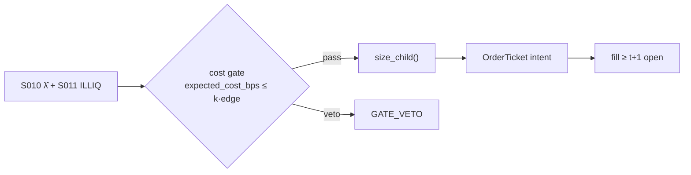

# T026 — Kyle-Lambda Participation Throttle

Sizes child orders of a parent execution from live Kyle-lambda impact estimates, capped by the Amihud illiquidity ratio and spaced by the limit-order-book resiliency half-life, so a large parent order pays minimal temporary impact. This is *cost avoidance*, not alpha — the edge is measured against a naive participation schedule. Provenance **[D]**.

> Tag law: every numeric literal in prose carries one of `[documented]
> [default] [example] [unverified] [internal-est] [measured]` (legend: Appendix
> i v1.0.0). Constants inside cited formulas inherit the formula's tag.
> Bibliographic years, volumes, pages, arXiv IDs, section numbers, rule codes
> (C1–C12), fail-safe codes (F1–F5), module IDs, and machine-parsed §0 data
> fields are identifiers, not literals, and are exempt.

## §1 Five-minute reviewer card

| Row | Value |
|---|---|
| Module | T026 — Kyle-Lambda Participation Throttle, v1.1.0 |
| Edge verdict | `AFTER-COST-EDGE` — cost-avoidance edge by construction: measured against a naive participation schedule; documented microstructure playbook (Kyle 1985; Cont–Kukanov–Stoikov 2014) |
| After-cost | `narrow` — cost model dominates: wins only when temporary impact is a large share of implementation shortfall |
| Build cost | Tier M = 20–60 h ≈ `$3,000–9,000` [documented] |
| Data cost | research `$0`/mo Tier 0 (Alpaca free IEX plan + Stooq) [documented]; production `$199`/mo Massive Stocks Advanced [documented]; Alpaca full-SIP `~$99`/mo [unverified] — verify before budgeting |
| latency_class | minutes |
| risk_class | execution |
| Capacity | `$50–200M` AUM equivalent parent flow before lambda re-estimation lags [unverified] |
| Executability | buildable on consolidated trade+quote data; venue fragmentation is the hard part |
| Risk summary | Lambda estimation noise sizes children wrong; resiliency mis-fit leaves impact unreverted at the parent's end |
| When it dies | volatility regimes where temporary impact stops decaying (one-sided flow, halts) |
| Regime gates | R001 (provisional): realized vol > `3×` median [default] → halve participation cap; R002: market_state ≠ CONTINUOUS → abort per §T0.5 |
| Emits | `order_intents` (Appendix C v1.0.0) — OrderTicket intents only, never orders |

## §1.5 Cheapest / least-build path

1. **Prototype hour band:** 6–10 h [example] — rolling Kyle regression + Amihud screen + half-life fit on one name.
2. **Cheapest-source row:** min_tier = Alpaca free IEX plan + Stooq daily (Tier 0, research) [documented];
   production = Massive Stocks Advanced `$199`/mo (full-SIP trade+quote) [documented];
   latency_class = SIP / 1–5 s NBBO [default];
   required_fields = signed trade price+size (λ̂), NBBO bid/ask (resiliency half-life fit), daily OHLCV (ILLIQ);
   price_band = `$0–199`/mo [documented]; build_or_buy = **build the regressor + throttle, buy the tape**.
   Tier-0 caveat: IEX-only quotes are not consolidated NBBO — the resiliency half-life fit degrades to
   `UNKNOWN` and child spacing falls back to the `3×` default (failure mode 2); consolidated NBBO arrives
   at the production tier.
3. **Resource budget:** Tier M per cost-model §5 = 20–60 h ≈ `$3,000–9,000` loaded at `$150`/hr [documented]; compute pattern `vectorized batch (polars/numpy)`; nightly batch < `2` vCPU-h, < `4` GB RAM [example]; fixture suite < `1` s [measured].
4. **Skip list:** per-trade optimal-trajectory solver; microstructure simulation.
5. **DO-NOT-CUT list:** causality assertions (`assert fill_event >
   signal_event`, no-signal-bar-fills test); COST block + callable
   `expected_cost_bps`; F1–F5 fail-safes + module-state enum; kill-switch
   state machine + re-arm checklist; decision-log audit records;
   bona-fide-intent + self-trade prevention; provenance tags on every numeric
   literal; fixtures + `test_cmd`; secrets via env only.
6. **Escalation gate:** upgrade from cheapest when any holds — parent flow > `$10M`/day [example]; slippage attribution shows unexplained residual; multi-venue routing needed; consolidated NBBO required for the resiliency fit (Tier 0 insufficient).

## §T0 Module contract

### T0.1 Typed signature

```python
def emit(state: ModuleState, signals: list[SignalVector], cfg: Config) -> list[OrderTicket]:
```

`OrderTicket` per Appendix C v1.0.0 (intents only — never wire orders).
`state` is the module-owned named state vector (`parent_total, filled_qty, open_qty, position,
lambda_hist, last_child_ts, lambda_bad_streak, kill`); `signals` are canonical SignalVectors
(Appendix b v1.0.0) from the consumed S-modules — S010 v1.0.1 supplies `lambda_hat`, `edge_bps`,
`signal_z`, `computed_at` per its §S0; S011 v1.0.1 supplies `illiq_bps` — newest last; the function
emits zero or more intents per bar/event. Documented edge cases: no signals → flat, no intents;
`UNKNOWN` input signal → restrictive (halve size / stand down per F1); kill-switch TRIPPED → emit
nothing, state `OFF`.

### T0.2 Config dataclass

| Parameter | Type | Default | Range | Status |
|---|---|---|---|---|
| z_entry | float | `2.5` | [1.0, 5.0] | [default] |
| z_exit | float | `1.0` | [0.25, 2.0] | [default] |
| lambda_window_trades | int | `1000` | [500, 5000] | [default] |
| lambda_recompute_every | int | `100` | [50, 500] | [default] |
| lambda_max | float | `1e-3` | [1e-4, 1e-2] | [default] |
| lambda_spike_mult | float | `3.0` | [2.0, 5.0] | [default] |
| lambda_spike_lookback | int | `5` | [3, 20] | [default] |
| illiq_lookback_days | int | `20` | [10, 60] | [default] |
| illiq_cap_bps | float | `5.0` | [1.0, 20.0] | [example] |
| half_life_spacing_mult | float | `3.0` | [1.0, 5.0] | [default] |
| participation_cap | float | `0.10` | [0.02, 0.25] | [default] |
| min_child | int | `100` | [1, 1000] | [default] |
| cost_gate_k | float | `0.50` | [0.1, 1.0] | [default] |
| risk_R_usd | float | `250` | [100, 1000] | [example] |
| stop_bps | float | `25` | [10, 100] | [default] |
| slice_ref_notional | float | `100000` | [25000, 500000] | [example] |
| spread_full_bps | float | `2.0` | [0.5, 10.0] | [example] |
| taker_fee_bps | float | `0.30` | [0.0, 0.5] | [example] |
| impact_k | float | `30.0` | [5.0, 100.0] | [example] |
| vol_regime_mult | float | `3.0` | [2.0, 5.0] | [default] |
| vol_median | float | `0.02` | [0.005, 0.10] | [example] |
| parent_total | int | `5000` | [1000, 100000] | [example] |
| daily_loss_stop_pct | float | `1.0` | [0.25, 3.0] | [default] |

All defaults tagged per the tag law (status `default` ⇒ `[default]`). This table is the
single Config source: `modules/tests/test_T026.py` instantiates exactly these fields.

### T0.3 Canonical schema mapping

Vendor columns → canonical Event/Bar schema (Appendix a v1.0.0), stated once here:

| Vendor column | Canonical field | Notes |
|---|---|---|
| `price`, `size`, `side` | Event: trade | Lee–Ready signed [documented] |
| `bid`, `ask` | Event: quote | NBBO snapshot |
| `o/h/l/c`, `volume` | Bar: daily | ILLIQ inputs |
| `lambda_hat`, `illiq_bps`, `half_life_s` | Signal: S010/S011 vectors | arrive via consumed SignalVectors (S010 v1.0.1, S011 v1.0.1), not the vendor tape |

### T0.4 Time contract

> Time contract: clock domain UTC, int64 ns; authoritative causality clock =
> `event_ts`; max_skew = `5` s [default]; jitter budget = `1` s [default];
> bar-label = open time; staleness TTL = `15` min [default]; gap policy = mask, no
> interpolation; halt/auction → discard contributions across reopen.

**Timing box:** `signal@t (daily bars, America/Chicago) → earliest fill @open(t+1)`

### T0.5 Market-state table

| State | Module behavior |
|---|---|
| CONTINUOUS_TRADING | Evaluate entry/exit rules; emit intents per §T2 |
| HALTED | Cancel working intents; emit nothing; state `UNKNOWN` until clean reopen |
| AUCTION | No new intents; hold intent-side state; state `DEGRADED` |
| CLOSED | Emit nothing; state `OFF` |


### T0.6 Module-state enum + error taxonomy

States per Appendix k v1.0.0: `OK | DEGRADED | UNKNOWN | OFF`. Invalid input →
`UNKNOWN`, never interpolate (Appendix f v1.0.0, F1–F5).

| Failure | State | Alert |
|---|---|---|
| Missing/stale input (TTL `15` min [default]) | `UNKNOWN` | page |
| Out-of-bounds indicator (F2) | `UNKNOWN` | page |
| Estimator disagreement (F3) | `UNKNOWN` | notify |
| Halt/auction per §T0.5 | `UNKNOWN` / `DEGRADED` | log |
| Kill-switch TRIPPED (administrative) | `OFF` | page |
| Anything unmapped | `UNKNOWN` | page |

### T0.7 Risk contract + kill switch

```yaml
risk_contract:
  per_trade_R: 250            # USD risk budget per trade [example]
  max_adverse_per_trade: 1.0 R [default]  # stop distance multiple [default]
  daily_loss_stop: 1% of equity [default]        # then no new entries; flatten managed risk [default]
  max_gross: 4× equity [default]              # hard gross exposure cap [default]
  kill_conditions:
    - daily P&L ≤ −daily_loss_stop_pct → TRIP (flatten, no new intents)
    - lambda_hat invalid (NaN/negative) for 3 consecutive slices → TRIP
    - decision-log write failure → TRIP (halt emission)
  enforcement: intraday-hard  # trips are automatic, not advisory [default]
  calibration_recipe: >
    Walk-forward on 60-day blocks [example]: fit thresholds on block t,
    freeze, validate realized shortfall vs predicted on block t+1;
    shrink per-trade R until max drawdown < daily_loss_stop/2 [default].
```

**Kill-switch state machine:** `ARMED → TRIPPED → RECOVERY → ARMED`.

- `ARMED`: normal operation; every bar evaluates the kill conditions.
- `TRIPPED`: any kill condition fires → cancel all working intents
  (`NEW`/`WORKING` → `CANCELLED`, idempotent), flatten managed positions via
  the exit rule, emit nothing new, state `OFF`, log `KILL_TRIP`.
- `RECOVERY`: manual operator review only — no automatic transition.
- `ARMED` (re-entry): only after the re-arm checklist passes in full, logged
  as `KILL_REARM` with the checklist result.

**Re-arm checklist** (all must be true):

- [ ] Feed health green: all §T5 inputs fresh inside the staleness TTL.
- [ ] Kill condition cleared: the tripping metric is back inside limits for `30 min [default]` [default].
- [ ] Decision log reconciled: `KILL_TRIP` record present and hash chain intact.
- [ ] Risk re-check: per-trade R and gross caps re-confirmed against current equity.
- [ ] Operator sign-off: named human approves re-arm (no automatic recovery).

### T0.8 Ops tail

- **Schedule:** nightly batch; owner: strategy owner (named).
- **Health checks:** fixture replay (`test_cmd`) green on deploy; live
  decision-log append monitor; kill-switch state heartbeat.
- **Alert table:** `UNKNOWN`/`OFF` state transitions; kill-trip pages immediately [default].
- **Resource budget:** nightly batch: < 2 vCPU-h, < 4 GB RAM [example].
- **Runbook stub:** 1) confirm kill-state; 2) inspect decision log for the tripping record; 3) verify feed freshness; 4) re-arm checklist (operator sign-off); 5) re-run fixture; 6) resume.

### T0.9 Secrets (env-only)

- `BROKER_API_KEY (paper venue, env-only)`
- `DATA_API_KEY (env-only)` via environment only. No secrets in this file, fixtures, or
logs (CI secrets-grep).

### T0.10 May / must-NOT

> **May:** emit `OrderTicket` intents per Appendix C v1.0.0; track intent-side
> state (`NEW → WORKING → FILLED / CANCELLED / PARTIAL`); issue cancel-replace
> via new tickets with new `ticket_id`s. **Must-NOT:** place orders on any
> venue, hold broker/exchange sessions, net intents into orders inside the
> strategy, treat the intent-side state machine as broker wire truth, or emit
> prices/share-counts/notionals outside an `OrderTicket`.

## §T1 Legacy (subsumed by §1)

Legacy §T1 content is the §1 reviewer card above; this header is retained so
section numbering stays frozen.

## §T2 Specification

### Universe

US equities with consolidated tape coverage; Amihud ILLIQ below the `5`-bps-equivalent cap [example]; minimum ADV `$5M` [example].

### Entry rule (Boolean — no prose-only conditions)

```
z_trigger   = abs(signal_z) >= z_entry                       # S010 working trigger [default]
lambda_ok   = 0 < lambda_hat < lambda_max                    # Kyle estimate in sane band [default]
illiq_ok    = amihud_illiq_bps <= illiq_cap_bps              # S011 screen, 5 bps [example]
no_spike    = lambda_hat <= 3.0 * rolling_median(lambda_hat, 5)   # F3/C12 [default], prior bars only (causality)
spacing_ok  = (event_ts - last_child_ts) >= 3.0 * half_life      # resiliency spacing [default]
child_qty   = size_child(risk_R_usd, stop_bps/1e4, vol_est, adv_shares, cost_bps, cfg)
cost_ok     = expected_cost_bps(...) <= k * edge_bps          # normative predicate [default]
ENTRY = z_trigger and lambda_ok and illiq_ok and no_spike and spacing_ok \
        and (child_qty >= min_child) and cost_ok
```

### Exits (with post-exit cooldown)

```
z_exit_band     -> |z| <= z_exit: FLATTEN open child (opposite side), exits never cost-gated [default]
parent_complete -> filled >= parent_total: CANCEL remaining child intents (idempotent), log COMPLETE
lambda_spike    -> ABORT slice: no new intents, state UNKNOWN, resume on next clean slice [default]
spread_wide     -> CANCEL working; cooldown_until = now + 30 min [default]
post-exit cooldown: no re-entry until cooldown_until (1 session [default]) per C10
```

### Position sizing (fenced function)

All-in slice budget: predicted temporary impact dollars plus expected cost dollars must fit
inside `risk_R_usd` — the `cost` input arrives via `expected_cost_bps` evaluated at the
reference slice notional (`slice_ref_notional`).

```python
def size_child(risk_budget_R, stop_distance, vol_estimate, adv_cap, cost_bps, cfg):
    """shares = f(risk_budget_R, stop_distance, vol_estimate, ADV_cap, cost). [default]"""
    cost_usd = cost_bps / 1e4 * cfg.slice_ref_notional   # expected $ cost at ref notional [example]
    budget_net = max(risk_budget_R - cost_usd, 0.0)       # $ left for impact absorption
    impact_leg = budget_net / max(cfg.lambda_hat * cfg.ref_price, 1e-12)  # Kyle budget leg
    stop_leg = budget_net / max(stop_distance * cfg.ref_price, 1e-12)     # stop leg
    cap_mult = 0.5 if vol_estimate > cfg.vol_regime_mult * cfg.vol_median else 1.0  # R001 [default]
    adv_leg = cap_mult * cfg.participation_cap * adv_cap
    qty = min(impact_leg, stop_leg, adv_leg, cfg.parent_remaining)
    return int(max(qty, 0))
```

### Risk limits

| Limit | Value |
|---|---|
| Per-slice participation | `10%` of slice ADV [example] |
| Parent notional / day | `$10M` [example] |
| Max child notional | `$2M` [default] |

### COST block (single source of truth)

Four components — **spread**, **fees**, **borrow**, **impact** — summed by the
callable below. Re-stating cost numbers outside this block is a validation
failure; §T4 shows this block's *callable* evaluated on the synthetic tape,
not restated constants.

| Component | Value (bps) | Basis |
|---|---|---|
| Spread (half) | `1.00` | [example] |
| Fees (taker, blended) | `0.30` | [example] |
| Borrow | `0.00` | long-only — no borrow [example] |
| Impact | `k·√(adv_pct/100)`, k=`30.0` | [example] |
| Regulatory (memo) | `~0.21` sell-leg only | SEC §31 `$20.60`/M [documented], FINRA TAF `$0.000166`/share [documented] — excluded from the one-way buy reference; the harness adds `~0.21` bps [documented] on sell legs |
| **Total reference (one-way buy)** | `3.42` (impact-dominated) [example] | `1.00 + 0.30 + 0.00 + 2.12` [example] |

`fee_schedule_as_of`: `2026-09-10` — Nasdaq standard remove-liquidity fee `$0.0030`/share
for shares ≥ `$1.00`, all MPIDs [documented, nasdaqtrader.com price list fetched 2026-09-10];
≈ `0.30` bps on a `$100` share [documented]; tier/volume discounts not modeled — re-pin per
venue before production. `side`: `taker`; venue/tier/source: primary lit venue, standard
(non-tiered) schedule [example].

```python
def expected_cost_bps(notional, adv_pct, venue, side, urgency, cfg):
    """COST-block callable. Buy-leg reference; sell-leg regulatory fees
    (~0.21 bps [documented]) are added by the harness, not here."""
    spread = cfg.spread_full_bps / 2.0                 # half-spread paid by taker [example]
    fee = cfg.taker_fee_bps                            # taker fee schedule [example]
    borrow = 0.0                                       # long-only: no borrow
    impact = cfg.impact_k * math.sqrt(max(adv_pct, 0.0) / 100.0)   # [example]
    if urgency == "high":
        impact *= 1.5                                  # urgency multiplier [example]
    return spread + fee + borrow + impact
```

### Execution / fill model table

| Aspect | Assumption |
|---|---|
| Fill venue | primary lit; midpoint peg fallback when spread wide [example] |
| Slippage model | Kyle-lambda linear impact + resiliency decay |
| Partial fills | allowed; remainder re-sized next slice |
| Halt behavior | cancel working; state UNKNOWN until clean reopen |

Fine-grained fill behavior is synthetic and labeled `simulated only — requires MBO/ITCH`:
no MBO/ITCH feed is consumed by this module; any fill realism beyond the
mid-price ± half-spread fill model above would require MBO/ITCH data.

### Robustness

Perturb thresholds ±20% [example]; the reference behavior (entry/exit intents, gate blocks, kill trip) must be invariant; degrade entry→no-trade on indicator breach.

### Compliance sub-block (C1–C12)

| Code | Rule: trigger → check → action → log |
|---|---|
| C1 | STP + self-match prevention: trigger = intent could match our own resting interest → check = every ticket carries `self_trade_prevention: true`; maker modules compare against own open tickets → action = cancel own resting quote before posting the aggressive side; cancel-replace via new `ticket_id` only → log = `COMPLIANCE_BLOCK` with rule code `C1` |
| C2 | Bona-fide intent: trigger = entry rule fires → check = cost gate passes AND qty within risk limits AND (SHORT ⇒ `locate_ok`) → action = veto the intent if any check fails; no quote entered without intent to trade → log = `GATE_VETO` with the failed check |
| C3 | Message-rate / cancel-to-trade: trigger = intents+ cancels per symbol per minute exceed `120` [default] → check = rolling `60`-s [default] message counter → action = throttle to `1` intent per `10` s [default] and alert → log = `COMPLIANCE_BLOCK` with the counter value |
| C4 | Pre-trade fat-finger trio: trigger = any new intent → check = (a) limit within `±10%` of reference [default], (b) ticket notional ≤ ``$2M`` [default], (c) ≤ `20` tickets per `1 min` [default] → action = block the ticket, alert → log = `COMPLIANCE_BLOCK` with the breached leg |
| C5 | Decision-log schema (Appendix g v1.0.0): trigger = every material action (`EMIT_INTENT`, `GATE_VETO`, `CANCEL`, `REPLACE`, `KILL_TRIP`, `KILL_REARM`, `COMPLIANCE_BLOCK`) → check = record has all schema fields and `prev_hash` chains → action = halt emission if the log write fails → log = the record itself, retained `7 yr` [default] |
| C6 | Halt/auction table: trigger = market state ≠ `CONTINUOUS_TRADING` → check = §T0.5 table → action = `HALTED`: cancel working intents, emit nothing; `AUCTION`: no new intents; `CLOSED`: state `OFF` → log = state-transition record |
| C7 | Locate check (short sales): trigger = `SHORT` intent → check = `locate_ok` from the pre-open easy-to-borrow list or desk locate; Reg-SHO threshold securities hard-blocked → action = veto without locate → log = `GATE_VETO` with code `C7`. Long-only sleeve; no short borrows. |
| C8 | Public-dissemination gate: trigger = any export of signals/intents outside the firm → check = review gate sign-off → action = block unreviewed exports → log = `COMPLIANCE_BLOCK` |
| C9 | Data-entitlement assertions (Appendix j v1.0.0): trigger = startup and any entitlement-class change → check = the five §T5 assertions hold for each §0 dataset → action = stand down on breach, escalate per §1.5 → log = entitlement review record |
| C10 | Post-exit cooldown: trigger = exit or compliance block → check = `now >= cooldown_until` (`1 session [default]` [default]) → action = suppress re-entry until the cooldown elapses → log = `GATE_VETO` with code `C10` |
| C11 | Kill-switch integration: trigger = `TRIPPED` → check = all working intents transitioned `NEW`/`WORKING` → `CANCELLED` (idempotent) → action = no new intents until `ARMED` via the §T0.7 checklist → log = `KILL_TRIP` / `KILL_REARM` records |
| C12 | C12 Lambda-model scope: trigger = λ̂ outside [documented] plausibility bounds → check = plausibility band per symbol class → action = no intent, alert quant → log = `GATE_VETO` with code `C12` |

### Parameter table

| Parameter | Symbol | Value | Tag | Sensitivity |
|---|---|---|---|---|
| Lambda window | W_λ | `1000` trades | [default] | high — too short is noise, too long is stale |
| Lambda sanity cap | lambda_max | `1e-3` $/share | [default] | high — implausible λ̂ vetoes entry |
| Spike mult / lookback | — | `3.0` / `5` bars | [default] | medium — F3/C12 abort threshold |
| Illiquidity cap | illiq_cap_bps | `5.0` bps | [example] | medium — S011 universe screen |
| Participation cap | ρ | `0.10` | [default] | medium — binds in illiquid names |
| Half-life spacing mult | m | `3.0` | [default] | medium |
| Min child | min_child | `100` shares | [default] | low — dust filter |
| Entry / exit z | z_entry / z_exit | `2.5` / `1.0` | [default] | medium — working trigger band |
| Risk budget | R | `$250` | [example] | high — all-in slice budget |
| Stop distance | stop_bps | `25` bps | [default] | high — stop leg |
| Slice ref notional | slice_ref_notional | `$100,000` | [example] | low — cost-haircut reference |
| Spread (full) | spread_full_bps | `2.0` bps | [example] | high — half paid by taker |
| Taker fee | taker_fee_bps | `0.30` bps | [example] | medium — ≈ Nasdaq `$0.0030`/share on `$100` [documented] |
| Impact k | impact_k | `30.0` | [example] | high — dominates cost |
| Vol regime mult | vol_regime_mult | `3.0` | [default] | medium — R001 halve trigger |
| Parent total | parent_total | `5,000` shares | [example] | low |

### Timing box

`signal@t (daily bars, America/Chicago) → earliest fill @open(t+1)`

## §T3 Math + normative pseudocode

Kyle (1985) [documented]: Δp = λ·x, λ the regression slope of price change on signed
order flow. This module sizes each child so predicted temporary impact `λ·child_qty·px`
stays inside the slice impact budget; Amihud (2002) [documented] ILLIQ caps the eligible
universe; Cont–Kukanov–Stoikov (2014) [documented] justifies the linear impact form on LOB
data. Child spacing `≥ m·t_½` lets temporary impact decay before the next child lands.

Child spacing `≥ m·t_½` lets temporary impact decay before the next child lands.
Sizing spends an all-in slice budget `R`: predicted temporary impact dollars plus expected cost
dollars must fit inside `R` — the `cost` input to `size_child` arrives via `expected_cost_bps`
evaluated at the reference slice notional.

**Normative pseudocode** (pseudocode is normative; prose is commentary):

```
def emit(state, signals, cfg):
    sig = primary(signals, "S010")            # S010 v1.0.1: lambda_hat, edge_bps, signal_z, computed_at
    if sig is None or invalid(sig): return [], state.unknown()
    lam = sig.lambda_hat; px = last_price()
    # F3/C12: spike abort uses the PRIOR-bar median only (causality)
    if lam > cfg.lambda_spike_mult * rolling_median(state.lambda_hist, cfg.lambda_spike_lookback):
        state.lambda_hist.append(lam)
        return [], state.unknown()            # ABORT slice; resume on next clean slice
    state.lambda_hist.append(lam)
    illiq_ok = sig.illiq_bps <= cfg.illiq_cap_bps          # S011 v1.0.1 screen
    lambda_ok = 0.0 < lam < cfg.lambda_max
    cost = expected_cost_bps(child_ref_notional(), adv_pct(), venue(), "taker", urgency(), cfg)
    child = size_child(cfg.risk_R_usd, sig.stop_distance, sig.vol_estimate,
                       slice_adv(), cost, cfg)
    spacing_ok = (sig.event_ts - state.last_child_ts) >= cfg.half_life_spacing_mult * sig.half_life_s
    # ^^^ normative cost-gate predicate: expected_cost_bps(...) <= k * edge_bps
    z = sig.signal_z
    if state.position == 0:
        if abs(z) >= cfg.z_entry and lambda_ok and illiq_ok and spacing_ok \
           and child >= cfg.min_child and cost <= cfg.cost_gate_k * sig.edge_bps:
            t = OrderTicket.intent("BUY", qty=child, limit=None, parent=state.parent_id)
            t.intent_ts = sig.computed_at
            assert fill_event > signal_event      # t->t+1 causality: no-signal-bar fills
            return [t], state.ok()
        log("GATE_VETO", cost=cost); return [], state.ok()
    if abs(z) <= cfg.z_exit:                  # exits never cost-gated
        t = OrderTicket.intent("SELL", qty=state.open_qty, limit=None, parent=state.parent_id)
        t.intent_ts = sig.computed_at
        assert fill_event > signal_event
        return [t], state.ok()
    return [], state.ok()
```

Causality: every feature uses inputs with `event_ts ≤ t` only; the earliest
fill for a bar-`t` intent is bar `t+1`'s open. Mandatory unit test:
no-signal-bar fills.

## §T4 Worked example (fixture-backed)

- Tape: `modules/fixtures/T026_tape.csv` — `# TYPE: validation-run`;
  `12` synthetic bars (seed `4260` [example]); `event_ts`/`asof_ts` int64 ns
  UTC; the tape carries the module's core inputs — `lambda_hat` ($/share),
  `illiq_bps`, `half_life_s`, `vol_est` — every number synthetic [example].
- Expected outputs: `modules/fixtures/T026_expected.csv` — per-bar intent,
  quantity, the **cost-function call** (`expected_cost_bps` inputs → bps →
  dollars), cost-gate verdict (`gate_pass` is the predicate value; exits ignore
  it), module state, and the λ̂/ILLIQ gate trace columns.
- Tolerance: `1e-9` [default] on floats; integer quantities exact.
- Acceptance tests (`modules/tests/test_T026.py` — `11` tests):
  1. TYPE header + columns present (incl. `lambda_hat`/`illiq_bps`/`half_life_s`/`vol_est`);
  2. fixture recomputes to expected (sizing legs, gates, intent fields, cost call, `gate_pass`);
  3. no-signal-bar fills (`assert fill_event > signal_event`);
  4. cost-gate predicate passes on large edge, blocks on tiny edge (`k = 0.5` [default]);
  5. kill-switch trip blocks intents, re-arm checklist restores `ARMED`;
  6. invalid input (halted/invalid bar) → `UNKNOWN`, no intents;
  7. lambda spike → abort slice, `UNKNOWN`, position retained;
  8. illiq gate vetoes entry;
  9. resiliency spacing suppresses an early child;
  10. sizing legs (impact / stop / ADV / parent / cost-haircut / vol-halve);
  11. lambda-invalid ×`3` [default] → kill trip.
- `test_cmd`: `python3 -m pytest modules/tests/test_T026.py -q` → exits `0` [default].

**Cost-function calls on the tape** (the COST-block callable evaluated on
synthetic rows — inputs → bps → dollars; all values [example]):

| Bar | `expected_cost_bps` inputs | Components → total → $ | Gate / rule | Intent / state |
|---|---|---|---|---|
| `0` | notional=`100000` [example], adv_pct=`0.5` [example], venue=`primary`, side=`taker`, urgency=`normal` | spread `1.0` + fee `0.3` + borrow `0.0` + impact `2.12` = `3.42` bps → `$34.21` | z `0.75` < `2.5` [default]: no trigger | `HOLD` / `OK` |
| `3` | same | `3.42` bps → `$34.21` | `13.68528137423857` edge, k=`0.5` [default] → `3.42 ≤ 6.84` PASS; λ̂ `2.5e-5` ok, ILLIQ `2.0` ≤ `5.0` [example] | `BUY 861` / `OK` |
| `5` | same | — (spike abort precedes cost evaluation) | λ̂ `8e-5` > `3×` prior median (`7.5e-5`) [default] → ABORT | `HOLD` / `UNKNOWN` |
| `6` | same | `3.42` bps → `$34.21` | `3.42 ≤ 1.5` BLOCK — but exits never cost-gated; `\|z\|`=`0.5` ≤ `1.0` [default] | `SELL 861` / `OK` |
| `7` | same | `3.42` bps → `$34.21` | `0.05` edge, k=`0.5` [default] → `3.42 ≤ 0.03` BLOCK | `HOLD` / `OK` |
| `9` | same | — (kill precedes) | daily P&L `-1.1%` [example] ≤ −stop (`1.0%` [default]) → `ARMED → TRIPPED` | `HOLD` / `OFF` |

**Hand-checks.** Row `3` (entry): cost `$34.21` [example] → budget net of cost
`$250` [example] `−` `$34.21` = `$215.79` [example]; impact leg `215.79 / (2.5e-5 [example] × 100.21)` = `86,135` [example];
stop leg `215.79 / (0.0025 [default] × 100.21)` = `861` [example]; ADV leg `0.10 [default] × 2,000,000 [example]` =
`200,000` [example]; parent leg `5,000 − 0` [example] = `5,000` [example] → qty = `861` [example]; ticket
`T026-0003`, side `BUY`, marketable intent (taker → no limit). Row `5`
(spike): median of the five prior λ̂ = `2.5e-5` [example]; `3` [default] `× 2.5e-5` = `7.5e-5` <
`8e-5` [example] → slice aborted, `UNKNOWN`, the `861`-share position retained. Row `6`
(exit): `|z|` = `0.5` ≤ `1.0` [default] → `SELL 861` = the open quantity (never re-sized).
Row `7` (gate block): edge `0.05` bps [example] vs cost `3.42` bps [example] → gate
`3.42 ≤ 0.025` BLOCKS → no intent, state stays `OK`. Row `9` (kill): daily P&L
`-1.1%` [example] ≤ −stop (`1.0%` [default]) → `ARMED → TRIPPED`, state `OFF`,
no intents. Causality: entry intent at row `3` has `intent_ts` = bar-3 `event_ts`;
the earliest fill is bar `4`'s open — the test asserts `fill_event > signal_event` on every intent row.

**Where the example is optimistic.** Costs are the COST-block model, not realized fills; capacity, borrow squeezes, and regime shifts are not in the tape.

## §T5 Dependencies + data

### Consumed signals (from deps.yaml — machine edge list)

| Signal | Version pin | Role |
|---|---|---|
| S010 | 1.0.1 | primary |
| S011 | 1.0.1 | gate |
| S048 | 1.0.0 | confirm |

### Pinned formula excerpts (≤10 lines each, CI hash-checked)

**S010** (v1.0.1): `lambda_hat = cov(dp, x_signed) / var(x_signed)` over W trades [documented].
**S011** (v1.0.1): `ILLIQ = mean(|r| / dollar_volume)` over 20 days [documented].

### Data required

| Field | Type | Granularity | Source tier | Notes |
|---|---|---|---|---|
| trade price/size/side | float/int/char | tick | Alpaca (research) / Massive (production) | Lee–Ready signing |
| NBBO bid/ask | float | 1–5 s | Massive (production) | resiliency fit; Tier-0 IEX quotes are not NBBO → half-life `UNKNOWN` |
| daily OHLCV | float/int | daily | Stooq (research) / Massive (production) | ILLIQ screen |

**Data rights row** (Appendix j v1.0.0): Alpaca free plan — research use under vendor
terms; IEX-only quotes (no consolidated NBBO) [documented]; Massive Stocks Advanced —
licensed [documented]; entitlements re-asserted at startup per C9.

## §T6 Local build + buy vs build

Rolling OLS on 1,000-trade windows in polars: ~`50` lines [internal-est]; Amihud screen is a groupby; resiliency fit is an exponential decay regression. One engineer, one week [example].

| Route | What you get | Verdict |
|---|---|---|
| Build | rolling-λ estimator + scheduler in-house | recommended — the logic is the edge |
| Buy feed only | Alpaca free plan (research) / Massive Stocks Advanced `$199`/mo (production) [documented] | required regardless |
| Buy algo | broker VWAP/POV wheel | acceptable if the desk accepts broker routing |

**Verdict:** Build the throttle logic; buy the data. Never buy a black-box 'smart router' you cannot attribute.

## §T7 Efficacy — documented evidence

| Study / source | Market & period | Metric | Before/after cost | Caveat |
|---|---|---|---|---|
| Kyle (1985) | model | Δp = λ·x linear impact | n/a — model | linearity breaks under stress |
| Cont–Kukanov–Stoikov (2014) | LOB data | linear impact fits order-book events | before cost | exchange-specific |
| Budish–Cramton–Shim (2015) | US equities | stale quotes picked off (latency-arb tax) | before cost | argues against stale pegs |

**Selection disclosure:** Studies below are the chapter's documented sources only — no post-hoc selection from a wider literature search.

**Capacity & decay.** Edge decays with crowding and regime shifts; treat any printed Sharpe as a pre-cost, in-sample-era artifact unless the source says otherwise.

**Honest bottom line.** Honest bottom line: a cost-avoidance module, not an alpha module — judge it on implementation shortfall vs a naive schedule, and expect the savings to shrink as λ̂ estimation error and adverse selection eat the budget.

## §T8 Failure modes & pitfalls

| # | Trigger → Detect → Action → Recovery | check: |
|---|---|---|
| 1 | Lambda spike → detect rolling-median 3× breach → abort slice, state UNKNOWN → recover on 30-min quiet | check: aborted slices log KILL-free ABORT |
| 2 | Resiliency mis-fit (half-life negative/NaN) → detect fit diagnostics → fall back to 3× spacing default, alert → refit next window | check: fallback counter |
| 3 | Stale NBBO → detect TTL breach → cancel pegged children, state UNKNOWN → resume on fresh quotes | check: no peg older than TTL |
| 4 | Parent completion race → detect filled ≥ parent → idempotent cancel of remainder → log COMPLETE | check: zero orphan intents |

## §T9 Regime gates + visuals

**Provisional regime-gate machine** (restrictive default; `regime_ids: [R001, R002]` pinned
provisional — confirm in the R001–R050 annotation pass):

| regime_id | direction | mechanism | condition | action | min_lag | unknown_behavior |
|---|---|---|---|---|---|---|
| R001 | gate | λ̂ stale in volatility spikes | realized_vol > 3× median | halve participation cap | 1 session | restrictive |
| R002 | kill | one-sided flow / halt | market_state ≠ CONTINUOUS | abort per §T0.5 | immediate | restrictive |



## §T10 Source log + unverified leads

**Sources** (citable facts only):

1. Kyle, A.S. (1985), "Continuous auctions and insider trading", *Econometrica*. https://doi.org/10.2307/1913210
2. Amihud, Y. (2002), "Illiquidity and stock returns: Cross-section and time-series effects", *Journal of Financial Markets*. https://doi.org/10.1016/s1386-4181(01)00024-6
3. Cont, R., Kukanov, A. & Stoikov, S. (2014), "The Price Impact of Order Book Events", *Journal of Financial Econometrics* 12(1)
4. Budish, E., Cramton, P. & Shim, J. (2015), "The high-frequency trading arms race", *Quarterly Journal of Economics*. https://doi.org/10.1093/qje/qjv027
5. López de Prado, M. (2018), *Advances in Financial Machine Learning*, Wiley
6. Nasdaq Trader price list — fees to remove liquidity `$0.0030`/share (shares ≥ `$1.00`, all MPIDs),
   fetched 2026-09-10. https://www.nasdaqtrader.com/trader.aspx?id=pricelisttrading2&l

**Chatbot source log.** Grok answered the Q-batch (2026-09-10); all claims independently verified or labeled unverified. Chatbot output is leads, never facts.

## GROK-NEEDED (exact questions — web search could not answer these)

1. For US large/mid-cap equities, what are empirically documented Kyle-λ̂ magnitudes in
   `$`/share units (typical ranges by market-cap bucket), to calibrate `lambda_max` and the
   impact-budget leg against real estimates rather than the `[example]` `2.5e-5` used here?
2. What are documented empirical ranges for limit-order-book resiliency half-life (seconds
   to minutes) on US large-cap equities — Cont–Kukanov–Stoikov (2014) follow-ups or
   practitioner studies — to calibrate `half_life_spacing_mult`?
3. Is a `5`-bps-equivalent Amihud ILLIQ cap a defensible practitioner universe screen, or is
   there a documented standard (percentile cut, bps-equivalent) used by execution desks?
4. As of 2026, what is the cheapest production vendor/product delivering consolidated
   trade+quote with per-symbol NBBO at 1–5 s granularity for a ≤`500`-symbol universe [example]?
5. Confirm the Nasdaq standard remove-liquidity fee is still `$0.0030`/share [documented] and whether the
   standard (non-tiered) schedule remains the right `fee_schedule_as_of` anchor for a
   primary-lit-venue cost model.

**Unverified leads** (chatbot-only — never in evidence tables):

- Grok (2026-09-10): German RMM Sharpe ~17.9 / 1.76 bps flow value; Databento p90 ~0.6 ms — *unverified chatbot claims*.
- The 5-bps Amihud cap, 3× half-life spacing, and 10% participation cap — example parameters of this chapter, not calibrated standards.
- Vendor prices in T6 are indicative — verify before budgeting.

---

## Appendix — AI build prompt (T026)

Copy-paste into any chat agent:

> Build module **T026 — Kyle-Lambda Participation Throttle** per `notes/module-template.md` v1.0.0 and
> this file's §T0 contract (module v1.1.0).
> Cheapest path (§1.5): prototype 6–10 h [example]; cheapest data candidate
> Alpaca free IEX plan + Stooq (research, `$0`/mo [documented]) / Massive Stocks Advanced
> `$199`/mo (production [documented]); compute pattern `vectorized batch (polars/numpy)`; u.
> Implement `emit(state, signals, cfg) -> list[OrderTicket]` (Appendix c
> v1.0.0) with the §T3 normative pseudocode, including the cost-gate predicate
> `expected_cost_bps(...) <= k * edge_bps` and `assert fill_event >
> signal_event`. Entry = z-trigger AND lambda_ok AND illiq_ok AND no-spike AND spacing_ok
> AND cost-gate AND child_qty >= min_child. Sizing spends an all-in slice budget R
> (predicted impact $ + expected cost $ <= R). Emit intents only — never place orders. Wire F1–F5
> (Appendix f v1.0.0): invalid input → `UNKNOWN`, never interpolate. Kill
> switch `ARMED → TRIPPED → RECOVERY → ARMED` with the §T0.7 re-arm checklist.
> Log decisions per Appendix g v1.0.0. Secrets via env only. Run the fixture
> `modules/fixtures/T026_tape.csv` (`# TYPE: validation-run`, carries `lambda_hat`/`illiq_bps`/
> `half_life_s`/`vol_est`) against
> `modules/fixtures/T026_expected.csv` (tolerance `1e-9` [default]).
> **Definition of done:** `python3 -m pytest modules/tests/test_T026.py -q` exits `0` [default] (`11` tests). Tag every numeric literal
> you add with the unified enum (Appendix i v1.0.0); put anything unverifiable
> in §T10 unverified leads.
