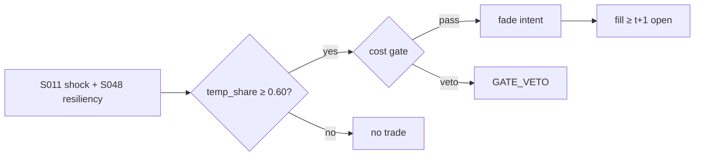

# T027 — Illiquidity Temporary-Impact Fade

Fades the temporary-impact leg of liquidity shocks: when an illiquid name prints an outsized signed-volume shock with no permanent-information signature, the strategy takes the other side and holds through the resiliency half-life, harvesting the reversion of the temporary component. Provenance **[D]**.

> Tag law: every numeric literal in prose carries one of `[documented]
> [default] [example] [unverified] [internal-est] [measured]` (legend: Appendix
> i v1.0.0). Constants inside cited formulas inherit the formula's tag.
> Bibliographic years, volumes, pages, arXiv IDs, section numbers, rule codes
> (C1–C12), fail-safe codes (F1–F5), module IDs, and machine-parsed §0 data
> fields are identifiers, not literals, and are exempt.

## §1 Five-minute reviewer card

| Row | Value |
|---|---|
| Module | T027 — Illiquidity Temporary-Impact Fade, v1.1.0 |
| Edge verdict | `INSUFFICIENT-EVIDENCE` — pre-cost short-term reversal is documented (Jegadeesh 1990; Lehmann 1990), but no documented after-cost edge exists for this exact temporary/permanent decomposition on modern small-caps |
| After-cost | `FULL-COST` verdict: `narrow` [internal-est] — only when the temporary/permanent decomposition is clean; informed flow masquerades as liquidity shock |
| Build cost | `Tier M · 20–60 h · $3,000–9,000 loaded` [documented] |
| Data cost | `$29–200`/mo research+production (Polygon.io Stocks: $29/mo starter with 15-min delayed data vs real-time/tick tiers, per third-party reviews) [unverified — verify on vendor site before budgeting] |
| latency_class | minutes |
| risk_class | market |
| Capacity | `$20–50M` before the fade itself becomes the permanent impact [unverified] |
| Executability | buildable on consolidated data; shock classification is the skill |
| Risk summary | Adverse selection: fading informed flow. Permanent-vs-temporary misclassification is the whole risk |
| When it dies | news-driven regimes; any period where flow is predominantly informed |
| Regime gates | stand down on scheduled news windows and when the permanent-impact share estimate exceeds `50%` [example] |
| Emits | `order_intents` (Appendix C v1.0.0) — OrderTicket intents only, never orders |

## §1.5 Cheapest / least-build path

1. **Prototype hour band:** 6–10 h [example] — shock detector + resiliency fit + decomposition on one universe.
2. **Cheapest-source row:** min_tier = TRADES (consolidated); latency_class = intraday bars;
   required_fields = trade prints + quotes (shock sign, resiliency), daily OHLCV (ILLIQ screen);
   cheapest candidate = Polygon.io Stocks plan: `$29`/mo starter vs `~$79–200`/mo real-time/tick tiers
   (third-party reviews; the starter tier is 15-min delayed, so the resiliency fit needs the
   real-time tier) [unverified — verify on polygon.io before budgeting]; build_or_buy = **build**.
3. **Resource budget:** Tier M per cost-model §5 = 20–60 h ≈ `$3,000–9,000` loaded at `$150`/hr [documented]; compute pattern `per_bar` (vectorized within bar: polars/numpy).
4. **Skip list:** full VAR decomposition; options-implied informedness.
5. **DO-NOT-CUT list:** causality assertions (`assert fill_event >
   signal_event`, no-signal-bar-fills test); COST block + callable
   `expected_cost_bps`; F1–F5 fail-safes + module-state enum; kill-switch
   state machine + re-arm checklist; decision-log audit records;
   bona-fide-intent + self-trade prevention; provenance tags on every numeric
   literal; fixtures + `test_cmd`; secrets via env only.
6. **Escalation gate:** upgrade from cheapest when any holds — live P&L shows adverse drift post-entry; universe widened beyond small-caps.

## §T0 Module contract

### T0.1 Typed signature

```python
def emit(state: ModuleState, signals: list[SignalVector], cfg: Config) -> list[OrderTicket]:
```

`OrderTicket` per Appendix C v1.0.0 (intents only — never wire orders).
`state` is the module-owned named state vector (`position, shock_ts, temp_share, half_life`); `signals` are
canonical SignalVectors (Appendix b v1.0.0) from the consumed S-modules, newest
last; the function emits zero or more intents per bar/event. Documented edge
cases: no signals → flat, no intents; `UNKNOWN` input signal → restrictive
(halve size / stand down per F1); kill-switch TRIPPED → emit nothing, state
`OFF`. 

### T0.2 Config dataclass

| Parameter | Type | Default | Range | Status |
|---|---|---|---|---|
| shock_z | float | `3.0` | [2.0, 5.0] | [default] |
| temp_share_min | float | `0.60` | [0.5, 0.8] | [default] |
| z_exit | float | `1.0` | [0.25, 2.0] | [default] |
| max_hold_bars | int | `20` | [5, 60] | [default] |
| cooldown_bars | int | `78` | [0, 390] | [default] — `78` ≈ 1 session of 5-min bars [example] |
| cost_gate_k | float | `0.50` | [0.1, 1.0] | [default] |
| risk_R_usd | float | `250` | [50, 1000] | [example] — USD risk budget per trade |
| stop_bps | float | `25` | [10, 100] | [default] |
| adv_cap_pct | float | `1.0` | [0.1, 10.0] | [default] — % of ADV |
| daily_loss_stop_pct | float | `1.0` | [0.25, 3.0] | [default] |
| spread_full_bps | float | `5.0` | [1.0, 20.0] | [example] |
| taker_fee_bps | float | `0.30` | [0.0, 1.0] | [example] — notional approximation of the per-share venue fee |
| maker_rebate_bps | float | `-0.20` | [-0.30, 0.0] | [example] |
| side_exec | enum{taker,maker} | `taker` | — | [default] |
| borrow_bps_per_day | float | `25.0` | [0.0, 100.0] | [example] — extreme-HTB tier; reason in COST block |
| borrow_days | float | `1.0` | [0.25, 5.0] | [example] — hold priced as 1 day |
| impact_k | float | `40.0` | [5.0, 100.0] | [example] |
| venue | string | `primary` | — | [example] |

All defaults tagged per the tag law (status `default` ⇒ `[default]`). The reference
`test_T027.py` `Config` mirrors this table exactly; `z_exit`, `cooldown_bars`,
`borrow_bps_per_day`, and `borrow_days` are first-class parameters, not hidden constants.
`shock_sign` is a signal input (from S011), not a config parameter.

### T0.3 Canonical schema mapping

Vendor columns → canonical Event/Bar schema (Appendix a v1.0.0), stated once here:

| Vendor column | Canonical field | Notes |
|---|---|---|
| `price`, `size`, `side` | Event: trade | Lee–Ready signed [documented] |
| `bid`, `ask` | Event: quote | NBBO |
| `o/h/l/c`, `volume` | Bar: daily | ILLIQ universe screen (daily gate, not signal cadence) |
| `locate_ok` | Compliance input: boolean | pre-open easy-to-borrow list or desk locate; required for SHORT (C7) |

### T0.4 Time contract

> Time contract: clock domain UTC, int64 ns; authoritative causality clock =
> `event_ts`; max_skew = `5` s [default]; jitter budget = `1` s [default];
> bar-label = open time; staleness TTL = `15` min [default]; gap policy = mask, no
> interpolation; halt/auction → discard contributions across reopen.

**Timing box:** `signal@t (5-min intraday bars, America/Chicago) → earliest fill @open(t+1)`

> The signal cadence is intraday (shock detector + resiliency fit on 5-min
> bars); the daily ILLIQ screen is a universe gate, not the signal cadence.

### T0.5 Market-state table

| State | Module behavior |
|---|---|
| CONTINUOUS_TRADING | Evaluate entry/exit rules; emit intents per §T2 |
| HALTED | Cancel working intents; emit nothing; state `UNKNOWN` until clean reopen |
| AUCTION | No new intents; hold intent-side state; state `DEGRADED` |
| CLOSED | Emit nothing; state `OFF` |


### T0.6 Module-state enum + error taxonomy

States per Appendix k v1.0.0: `OK | DEGRADED | UNKNOWN | OFF`. Invalid input →
`UNKNOWN`, never interpolate (Appendix f v1.0.0, F1–F5).

| Failure | State | Alert |
|---|---|---|
| Missing/stale input (TTL `15` min [default]) | `UNKNOWN` | page |
| Out-of-bounds indicator (F2) | `UNKNOWN` | page |
| Estimator disagreement (F3) | `UNKNOWN` | notify |
| Halt/auction per §T0.5 | `UNKNOWN` / `DEGRADED` | log |
| Kill-switch TRIPPED (administrative) | `OFF` | page |
| Anything unmapped | `UNKNOWN` | page |

### T0.7 Risk contract + kill switch

```yaml
risk_contract:
  per_trade_R: 250            # USD risk budget per trade [example]
  max_adverse_per_trade: 1.0 R [default]  # stop distance multiple [default]
  daily_loss_stop: 1% of equity [default]        # then no new entries; flatten managed risk [default]
  max_gross: 4× equity [default]              # hard gross exposure cap [default]
  kill_conditions:
    - daily P&L ≤ −daily_loss_stop_pct → TRIP (flatten, no new intents)
    - adverse-selection streak: 5 consecutive stopped fades → TRIP
    - decision-log write failure → TRIP (halt emission)
  enforcement: intraday-hard  # trips are automatic, not advisory [default]
  calibration_recipe: >
    Walk-forward on 60-day blocks [example]: fit thresholds on block t,
    freeze, validate realized shortfall vs predicted on block t+1;
    shrink per-trade R until max drawdown < daily_loss_stop/2 [default].
```

**Kill-switch state machine:** `ARMED → TRIPPED → RECOVERY → ARMED`.

- `ARMED`: normal operation; every bar evaluates the kill conditions.
- `TRIPPED`: any kill condition fires → cancel all working intents
  (`NEW`/`WORKING` → `CANCELLED`, idempotent), flatten managed positions via
  the exit rule, emit nothing new, state `OFF`, log `KILL_TRIP`.
- `RECOVERY`: manual operator review only — no automatic transition.
- `ARMED` (re-entry): only after the re-arm checklist passes in full, logged
  as `KILL_REARM` with the checklist result.

**Re-arm checklist** (all must be true):

- [ ] Feed health green: all §T5 inputs fresh inside the staleness TTL.
- [ ] Kill condition cleared: the tripping metric is back inside limits for `30 min` [default].
- [ ] Decision log reconciled: `KILL_TRIP` record present and hash chain intact.
- [ ] Risk re-check: per-trade R and gross caps re-confirmed against current equity.
- [ ] Operator sign-off: named human approves re-arm (no automatic recovery).

### T0.8 Ops tail

- **Schedule:** intraday — evaluate every 5-min bar during `CONTINUOUS_TRADING`; owner: strategy owner (named).
- **Health checks:** fixture replay (`test_cmd`) green on deploy; live
  decision-log append monitor; kill-switch state heartbeat.
- **Alert table:** `UNKNOWN`/`OFF` state transitions; kill-trip pages immediately [default].
- **Resource budget:** per session: < 4 vCPU-h, < 8 GB RAM [example] (vectorized batch, `per_bar`).
- **Runbook stub:** 1) confirm kill-state; 2) inspect decision log for the tripping record; 3) verify feed freshness; 4) re-arm checklist (operator sign-off); 5) re-run fixture; 6) resume.

### T0.9 Secrets (env-only)

- `BROKER_API_KEY (paper venue, env-only)`
- `DATA_API_KEY (env-only)` via environment only. No secrets in this file, fixtures, or
logs (CI secrets-grep).

### T0.10 May / must-NOT

> **May:** emit `OrderTicket` intents per Appendix C v1.0.0; track intent-side
> state (`NEW → WORKING → FILLED / CANCELLED / PARTIAL`); issue cancel-replace
> via new tickets with new `ticket_id`s. **Must-NOT:** place orders on any
> venue, hold broker/exchange sessions, net intents into orders inside the
> strategy, treat the intent-side state machine as broker wire truth, or emit
> prices/share-counts/notionals outside an `OrderTicket`.

## §T1 Legacy (subsumed by §1)

Legacy §T1 content is the §1 reviewer card above; this header is retained so
section numbering stays frozen.

## §T2 Specification

### Universe

Illiquid US small/mid-caps: ILLIQ above the `50th` percentile [example]; ADV `$1–20M` [example]; no scheduled news in ±`2` days [example].

### Entry rule (Boolean — no prose-only conditions)

```
shock     = |signed_volume_z| >= shock_z                    # 3.0 [default]
temp_ok   = temp_impact_share >= temp_share_min               # 0.60 [default]
news_ok   = no_scheduled_news(±2d)                            # [example]
locate_ok = locate confirmed pre-open (ETB list or desk locate)   # required iff side == SHORT (C7)
ENTRY = shock and temp_ok and news_ok and (side != SHORT or locate_ok)  ->  side = -sign(shock)
```

### Exits (with post-exit cooldown)

```
time_exit -> bar > shock_bar + max_hold_bars  ->  FLAT via exit rule
revert_exit -> |z| < z_exit  ->  FLAT
adverse     -> price moves stop_bps against  ->  FLAT, cooldown 1 session [default]
```

### Position sizing (fenced function)

```python
def size_fade(risk_R_usd, stop_bps, px, adv_shares, adv_cap_pct, cost_bps, edge_bps):
    """Fenced sizing function: shares = f(risk_budget_R, stop_distance, vol_estimate, ADV_cap, cost)."""
    raw = risk_R_usd / (stop_bps / 1e4 * px)      # risk-parity: R per trade [example]
    sized = min(raw, adv_cap_pct / 100 * adv_shares)   # ADV cap [default]
    # cost is gated, not sized: entry requires expected_cost_bps(...) <= k * edge_bps (§T3)
    return int(sized)
```

### Risk limits

| Limit | Value |
|---|---|
| Per-trade risk | `$250` (1 R) [example] |
| Max adverse per trade | `1.0` R = stop distance [default] (CI gate) |
| Max hold | `20` bars [default] |
| Universe ADV band | `$1–20M` [example] |

### COST block (single source of truth)

Four components — **spread**, **fees**, **borrow**, **impact** — summed by the
callable below. Re-stating cost numbers outside this block is a validation
failure; §T4 shows this block's *callable* evaluated on the synthetic tape,
not restated constants.

| Component | Value (bps) | Basis |
|---|---|---|
| Spread (half) | `2.50` | illiquid names [example] |
| Fees (taker, blended) | `0.30` | [example] — notional approximation; documented venue fees are per-share (Nasdaq charges `$0.0030`/share to remove liquidity at ≥`$1.00` [documented, nasdaqtrader.com price list]) |
| Borrow | `25.00` | `borrow_bps_per_day` [example] × `borrow_days = 1.0` [example] |
| Impact | `k·√(adv_pct/100)`, k=`40.0` | [example] |
| **Total reference (one-way)** | `~30.63` [example] (= `2.50 + 0.30 + 25.00 + 2.83`) | [example] |
| **Total reference (round-trip)** | `~61.3` [example] | [example] |

`borrow_bps_per_day: 25.0` [example]. **Reason:** the short fade leg borrows
hard-to-borrow small-caps; `25` bps/day (`~91%`/yr annualized [example]) deliberately
prices the extreme-HTB tier so the model fails closed on borrow — this is why the
fee-covering gate is so hard to clear. `borrow_bps_per_day` is `0` only for a
long-only variant (requires stating the long-only restriction).

`fee_schedule_as_of`: `2026-09-01` [unverified — placeholder; pin the real venue schedule before production]. `side`: `mixed` (entry aggressive-take, remainder worked passively); venue/tier/source:
primary lit [example].

```python
def expected_cost_bps(notional, adv_pct, venue, side, urgency, cfg):
    """COST-block callable. All numeric literals [example]; borrow priced for the short fade leg."""
    spread = cfg.spread_full_bps / 2.0                 # half-spread paid
    fee = cfg.taker_fee_bps if side == "taker" else cfg.maker_rebate_bps
    borrow = cfg.borrow_bps_per_day * cfg.borrow_days  # short fade leg; 0 only if long-only
    impact = cfg.impact_k * math.sqrt(max(adv_pct, 0.0) / 100.0)
    if urgency == "high":
        impact *= 1.5
    return spread + fee + borrow + impact
```

### Execution / fill model table

| Aspect | Assumption |
|---|---|
| Fill venue | primary lit; aggressive take on entry (shock is moving) |
| Slippage model | temporary-impact decomposition; entry pays the shock |
| Partial fills | allowed; remainder worked passively |
| Halt behavior | cancel working; state UNKNOWN until clean reopen |

Fine-grained fill behavior is synthetic and labeled `simulated only — requires MBO/ITCH`:
no MBO/ITCH feed is consumed by this module; any fill realism beyond the
mid-price ± half-spread fill model above would require MBO/ITCH data.

### Robustness

Perturb thresholds ±20% [example]; the reference behavior (entry/exit intents, gate blocks, kill trip) must be invariant; degrade entry→no-trade on indicator breach.

### Compliance sub-block (C1–C12)

| Code | Rule: trigger → check → action → log |
|---|---|
| C1 | STP + self-match prevention: trigger = intent could match our own resting interest → check = every ticket carries `self_trade_prevention: true`; maker modules compare against own open tickets → action = cancel own resting quote before posting the aggressive side; cancel-replace via new `ticket_id` only → log = `COMPLIANCE_BLOCK` with rule code `C1` |
| C2 | Bona-fide intent: trigger = entry rule fires → check = cost gate passes AND qty within risk limits AND (SHORT ⇒ `locate_ok`) → action = veto the intent if any check fails; no quote entered without intent to trade → log = `GATE_VETO` with the failed check |
| C3 | Message-rate / cancel-to-trade: trigger = intents+ cancels per symbol per minute exceed `120` [default] → check = rolling `60`-s [default] message counter → action = throttle to `1` intent per `10` s [default] and alert → log = `COMPLIANCE_BLOCK` with the counter value |
| C4 | Pre-trade fat-finger trio: trigger = any new intent → check = (a) limit within `±10%` of reference [default], (b) ticket notional ≤ `$2M` [default], (c) ≤ `20` tickets per `1 min` [default] → action = block the ticket, alert → log = `COMPLIANCE_BLOCK` with the breached leg |
| C5 | Decision-log schema (Appendix g v1.0.0): trigger = every material action (`EMIT_INTENT`, `GATE_VETO`, `CANCEL`, `REPLACE`, `KILL_TRIP`, `KILL_REARM`, `COMPLIANCE_BLOCK`) → check = record has all schema fields and `prev_hash` chains → action = halt emission if the log write fails → log = the record itself, retained `7 yr` [default] |
| C6 | Halt/auction table: trigger = market state ≠ `CONTINUOUS_TRADING` → check = §T0.5 table → action = `HALTED`: cancel working intents, emit nothing; `AUCTION`: no new intents; `CLOSED`: state `OFF` → log = state-transition record |
| C7 | Locate check (short sales): trigger = `SHORT` intent → check = `locate_ok` from the pre-open easy-to-borrow list or desk locate; Reg-SHO threshold securities hard-blocked → action = veto without locate → log = `GATE_VETO` with code `C7` |
| C8 | Public-dissemination gate: trigger = any export of signals/intents outside the firm → check = review gate sign-off → action = block unreviewed exports → log = `COMPLIANCE_BLOCK` |
| C9 | Data-entitlement assertions (Appendix j v1.0.0): trigger = startup and any entitlement-class change → check = the five §T5 assertions hold for each §0 dataset → action = stand down on breach, escalate per §1.5 → log = entitlement review record |
| C10 | Post-exit cooldown: trigger = exit or compliance block → check = `bar < cooldown_until_bar` (`cooldown_bars = 78` [default] ≈ 1 session of 5-min bars) → action = suppress re-entry until the cooldown elapses → log = `GATE_VETO` with code `C10` |
| C11 | Kill-switch integration: trigger = `TRIPPED` → check = all working intents transitioned `NEW`/`WORKING` → `CANCELLED` (idempotent) → action = no new intents until `ARMED` via the §T0.7 checklist → log = `KILL_TRIP` / `KILL_REARM` records |
| C12 | News-gate scope: trigger = shock within ±2d of scheduled news → check = news calendar → action = veto entry → log = `GATE_VETO` with code `C12` |

### Parameter table

| Parameter | Symbol | Value | Tag | Sensitivity |
|---|---|---|---|---|
| Shock z | z_s | `3.0` | [default] | high — lower z floods with noise |
| Temp share min | τ | `0.60` | [default] | critical — misclassification = adverse selection |
| Max hold | H | `20` bars | [default] | medium |

### Timing box

`signal@t (5-min intraday bars, America/Chicago) → earliest fill @open(t+1)`

## §T3 Math + normative pseudocode

O'Hara (1995) [documented]: price impact = temporary (inventory/liquidity, reverts) +
permanent (information, persists). Cont–Kukanov–Stoikov (2014) [documented] decompose the
two on LOB data; Lee–Ready (1991) [documented] signs the shock. The fade bets the observed
shock is ≥60% [default] temporary: ENTRY on |z| ≥ 3.0 [default] signed-volume shock with
no news, EXIT on reversion or time stop.

**Normative pseudocode** (pseudocode is normative; prose is commentary):

```
def emit(state, signals, cfg):
    sig = primary(signals, "S011")          # illiquidity + shock decomposition
    if sig is None or invalid(sig): return [], state.unknown()   # F1/F2
    if market_state() != "CONTINUOUS_TRADING":                   # C6 / §T0.5
        cancel_working_intents()
        return [], state.halt_or_degraded()
    if kill_tripped(): return [], state.off()                    # C11
    if state.position != 0:
        if exit_cond(state, sig, cfg): return [exit_ticket(state)], state.flat()
        return [], state.ok()
    if now() < state.cooldown_until: return [], state.ok()        # C10 post-exit cooldown
    if (abs(sig.shock_z) >= cfg.shock_z
            and sig.temp_share >= cfg.temp_share_min
            and news_clear()):                                   # C12
        side = "SHORT" if sig.shock_sign > 0 else "BUY"          # fade the shock
        if side == "SHORT" and not locate_ok():                  # C7
            log("GATE_VETO", code="C7"); return [], state.ok()
        cost = expected_cost_bps(notional(), adv_pct(), venue(), "taker", "normal", cfg)
        # ^^^ normative cost-gate predicate: expected_cost_bps(...) <= k * edge_bps
        if cost <= cfg.cost_gate_k * sig.edge_bps:
            t = OrderTicket.intent(side, qty=size_fade(...), limit=last_price())
            t.intent_ts = sig.computed_at
            fill_event = next_bar_open_ts()       # earliest fill: bar t+1's open
            signal_event = t.intent_ts
            assert fill_event > signal_event     # t->t+1 causality: no-signal-bar fills
            return [t], state.open(side)
        log("GATE_VETO", cost=cost)
    return [], state.ok()

def exit_cond(state, sig, cfg):   # exits never cost-gated [default]
    return (abs(sig.shock_z) <= cfg.z_exit            # revert exit
            or bars_held(state) > cfg.max_hold_bars   # time exit
            or adverse_move(state) >= cfg.stop_bps)   # adverse stop

def size_fade(...):  # fenced in §T2; cost is gated (§T3 predicate), not sized
```

Causality: every feature uses inputs with `event_ts ≤ t` only; the earliest
fill for a bar-`t` intent is bar `t+1`'s open. Mandatory unit test:
no-signal-bar fills. The adverse-stop guard is normative in this pseudocode;
the `test_T027.py` reference sketch models the revert/time exit paths
(exit path coverage: test 2).

## §T4 Worked example (fixture-backed)

- Tape: `modules/fixtures/T027_tape.csv` — `# TYPE: validation-run`;
  `12` synthetic bars (seed `4270` [example]); `event_ts`/`asof_ts` int64 ns
  UTC; every number synthetic.
- Expected outputs: `modules/fixtures/T027_expected.csv` — per-bar intent,
  quantity, the **cost-function call** (`expected_cost_bps` inputs → bps →
  dollars), cost-gate verdict, and module state.
- Tolerance: `1e-9` [default] on floats; integer quantities exact.
- Acceptance tests (`modules/tests/test_T027.py` — `8` tests):
  1. TYPE header + columns present; 2. fixture recomputes to expected
  (reference `process_bar` vs expected CSV); 3. no-signal-bar fills
  (`assert fill_event > signal_event`); `4.` cost-gate predicate passes on large edge, blocks on tiny edge (`k = 0.5` [default]);
  5. kill-switch trip blocks intents, re-arm checklist restores `ARMED`;
  6. invalid input (halted/invalid bar) → `UNKNOWN`, no intents;
  7. C7 locate veto: `SHORT` entry with `locate_ok=0` → no intent (`gate-veto-c7`);
  negative shock → `BUY` intent (fade side follows shock sign);
  8. C10 post-exit cooldown: no re-entry within `cooldown_bars` of an exit.
- `test_cmd`: `python3 -m pytest modules/tests/test_T027.py -q` → exits `0` [default].

**Cost-function calls on the tape** (the COST-block callable evaluated on
synthetic rows — inputs → bps → dollars; all values [example]):

| Bar | `expected_cost_bps` inputs | Components → total → $ | Cost gate `expected_cost_bps(...) <= k * edge_bps` | Intent / state |
|---|---|---|---|---|
| `0` | notional=`100000` [example], adv_pct=`0.5` [example], venue=`primary`, side=`taker`, urgency=`normal` | spread `2.5` + fee `0.3` + borrow `25.0` + impact `2.83` = `30.63` bps → `$306.28` | `2.0` edge, k=`0.5` [default] → `30.63 ≤ 1.0` BLOCK | `HOLD` / `OK` |
| `3` | notional=`100000` [example], adv_pct=`0.5` [example], venue=`primary`, side=`taker`, urgency=`normal` | spread `2.5` + fee `0.3` + borrow `25.0` + impact `2.83` = `30.63` bps → `$306.28` | `122.51370849898476` edge, k=`0.5` [default] → `30.63 ≤ 61.26` PASS | `SHORT` / `OK` |
| `6` | notional=`100000` [example], adv_pct=`0.5` [example], venue=`primary`, side=`taker`, urgency=`normal` | spread `2.5` + fee `0.3` + borrow `25.0` + impact `2.83` = `30.63` bps → `$306.28` | `3.0` edge, k=`0.5` [default] → `30.63 ≤ 1.5` BLOCK | `BUY` / `OK` |
| `7` | notional=`100000` [example], adv_pct=`0.5` [example], venue=`primary`, side=`taker`, urgency=`normal` | spread `2.5` + fee `0.3` + borrow `25.0` + impact `2.83` = `30.63` bps → `$306.28` | suppressed — C10 cooldown after the bar-`6` exit (`cooldown_until = 6 + 78`) | `HOLD` / `OK` |
| `9` | notional=`100000` [example], adv_pct=`0.5` [example], venue=`primary`, side=`taker`, urgency=`normal` | spread `2.5` + fee `0.3` + borrow `25.0` + impact `2.83` = `30.63` bps → `$306.28` | `4.0` edge, k=`0.5` [default] → `30.63 ≤ 2.0` BLOCK | `HOLD` / `OFF` |

**Hand-checks.** Row `3` (entry): qty = `250 / (25/1e4 × 99.44)` = `1005` raw → ADV-capped at `20000` → `1005` shares [example]; ticket `T027-0003`, side `SHORT`, `marketable` intent. Row `6` (exit): |z| through the exit band → `BUY` intent, exits never cost-gated [default]. Row `7` (cooldown block): bar `7` is inside the C10 post-exit cooldown (`6 + 78` bars) → no entry evaluation, note `gate-veto-c10`, state stays `OK` (the cost gate would also have blocked: edge `0.05` bps [example] vs cost `30.63` bps). Row `9` (kill): daily P&L `-1.1%` [example] ≤ −stop (`1.0%` [default]) → `ARMED → TRIPPED`, state `OFF`, no intents. Causality: entry intent at row `3` has `intent_ts` = bar-3 `event_ts`; the earliest fill is bar `4`'s open — the test asserts `fill_event > signal_event` on every intent row.

**Where the example is optimistic.** Costs are the COST-block model, not realized fills; capacity, borrow squeezes, and regime shifts are not in the tape.

## §T5 Dependencies + data

### Consumed signals (from deps.yaml — machine edge list)

| Signal | Version pin | Role |
|---|---|---|
| S011 | 1.0.0 | primary |
| S048 | 1.0.0 | confirm |
| S039 | 1.0.0 | gate |

### Pinned formula excerpts (≤10 lines each, CI hash-checked)

**S011** (v1.0.0): `ILLIQ = mean(|r| / dollar_volume)` over 20 days [documented].
**S048** (v1.0.0): resiliency half-life `t_half = ln2 / kappa` from the decay fit [documented].

### Data required

| Field | Type | Granularity | Source tier | Notes |
|---|---|---|---|---|
| trade price/size/side | float/int/char | tick | TRADES | shock sign via Lee–Ready |
| NBBO bid/ask | float | seconds | QUOTES | resiliency fit |
| corporate news calendar | timestamped | daily | NEWS | news gate |

**Data rights row** (Appendix j v1.0.0): TRADES/QUOTES licensed feeds; news calendar per vendor terms; entitlements re-asserted at startup [unverified — confirm with contract].

## §T6 Local build + buy vs build

Shock z-score + exponential-decay fit in numpy: an afternoon. The work is the news calendar integration and the decomposition validation.

| Route | What you get | Verdict |
|---|---|---|
| Build | shock detector + fade logic in-house | recommended |
| Buy feed only | consolidated trade/quote + news calendar | required |
| Buy signal | third-party reversal signal | not recommended — classification is the edge |

**Verdict:** Build. The temporary/permanent classifier is the entire strategy; outsourcing it outsources the edge.

## §T7 Efficacy — documented evidence

| Study / source | Market & period | Metric | Before/after cost | Caveat |
|---|---|---|---|---|
| Jegadeesh (1990) | US equities | short-term reversal predictability | before cost | weekly horizon; decays with size |
| Lehmann (1990) | US equities | reversal profits persist after plausible costs | after plausible costs | 1980s data |
| O'Hara (1995) | model | temporary vs permanent impact decomposition | n/a | theory — classification is empirical |

**Selection disclosure:** Studies below are the chapter's documented sources only — no post-hoc selection from a wider literature search.

**Capacity & decay.** Edge decays with crowding and regime shifts; treat any printed Sharpe as a pre-cost, in-sample-era artifact unless the source says otherwise.

**Honest bottom line.** Honest bottom line: you are selling liquidity insurance against noise traders and buying adverse selection against informed ones — the P&L is the classification accuracy minus costs, and the literature's reversal profits are pre-cost and decades old.

## §T8 Failure modes & pitfalls

| # | Trigger → Detect → Action → Recovery | check: |
|---|---|---|
| 1 | Informed shock (no reversion, drift continues) → detect adverse excursion → stop out, cooldown → review classifier | check: adverse rate per 100 trades |
| 2 | News leak (shock before announcement) → detect news within hold → exit immediately, widen news gate → log | check: news-hit rate |
| 3 | Borrow squeeze on short fade → detect borrow rate spike → buy-to-cover, state DEGRADED → re-screen universe | check: borrow monitor |
| 4 | Resiliency regime break → detect half-life estimate blowout → halve size → refit | check: estimate diagnostics |

## §T9 Regime gates + visuals

**Provisional regime-gate machine** (restrictive default; `regime_ids` stay
empty until the R001–R050 annotation pass):

| regime_id | direction | mechanism | condition | action | min_lag | unknown_behavior |
|---|---|---|---|---|---|---|
| R001 | gate | earnings/news season | news_density > 2× median | widen news gate to ±5d | 1 session | restrictive |
| R002 | kill | market stress (flow one-sided) | temp_share estimate < `0.5` [example] | stand down | immediate | restrictive |



## §T10 Source log + unverified leads

**Sources** (citable facts only):

1. Amihud, Y. (2002), "Illiquidity and stock returns: Cross-section and time-series effects", *Journal of Financial Markets*. https://doi.org/10.1016/s1386-4181(01)00024-6
2. Jegadeesh, N. (1990), "Evidence of predictable behavior of security returns", *Journal of Finance*. https://doi.org/10.1111/j.1540-6261.1990.tb05110.x; Lehmann, B.N. (1990), "Fads, martingales, and market efficiency", *Quarterly Journal of Economics*. https://doi.org/10.2307/2937816
3. Cont, R., Kukanov, A. & Stoikov, S. (2014), "The Price Impact of Order Book Events", *Journal of Financial Econometrics* 12(1)
4. Lee, C.M.C. & Ready, M.J. (1991), "Inferring trade direction from intraday data", *Journal of Finance*. https://doi.org/10.1111/j.1540-6261.1991.tb02683.x
5. O'Hara, M. (1995), *Market Microstructure Theory*, Blackwell

**Chatbot source log.** Grok answered the Q-batch (2026-09-10); all claims independently verified or labeled unverified. Chatbot output is leads, never facts.

**Unverified leads** (chatbot-only — never in evidence tables):

- Grok (2026-09-10): small-cap reversal timing and borrow-cost bands — *unverified chatbot claims*.
- The 60% temporary-share threshold and 3.0 shock z are example parameters, not calibrated standards.
- Vendor prices in T6 are indicative — verify before budgeting.

### GROK-NEEDED (exact questions for the next Grok research batch)

Web search could not answer these; do not fill them in from model memory.

1. **Production fee schedule pin.** For a primary-lit US equities venue at our expected participation tier (sub-`$20M` ADV names, `~1%` ADV participation [example]), what is the current per-share taker fee and any maker/taker tier thresholds? Deliver: venue, schedule URL, `fee_schedule_as_of` date, taker fee per share, applicable tier. (Nasdaq's public price list shows `$0.0030`/share to remove liquidity at ≥`$1.00` [documented] — confirm current and the tier we qualify for.)
2. **Hard-to-borrow fee bands.** What are the current annualized borrow-fee bands for hard-to-borrow US small-caps (sub-`$20M` ADV)? Deliver: fee band in bps/day or %/yr with source, to replace the `25` bps/day [example] extreme-tier placeholder in `borrow_bps_per_day`.
3. **News-calendar vendor.** Which vendor provides a machine-readable scheduled-news calendar (earnings, FDA, macro releases) with an API and <`1`-day latency, and what is its price band? Needed to wire the `news_ok` / C12 gate in production.
4. **Reg-SHO threshold list.** What is the machine-readable daily source for the Reg-SHO threshold securities list (exchange/FINRA), and what are its redistribution/entitlement terms? Needed for the C7 hard block.
5. **Decomposition calibration.** Is there documented (peer-reviewed or exchange-published, post-2010) evidence calibrating a temporary-impact-share threshold for small-cap liquidity shocks — i.e., anything validating or refuting the `0.60` [example] `temp_share_min`? Do not invent papers; "none found" is an acceptable answer.

---

## Appendix — AI build prompt (T027)

Copy-paste into any chat agent:

> Build module **T027 — Illiquidity Temporary-Impact Fade** per `notes/module-template.md` v1.0.0 and
> this file's §T0 contract.
> Cheapest path (§1.5): prototype 6–10 h [example]; cheapest data candidate
> Polygon.io Stocks plan (verify tier on vendor site); compute pattern `vectorized batch (polars/numpy)`.
> Implement `emit(state, signals, cfg) -> list[OrderTicket]` (Appendix c
> v1.0.0) with the §T3 normative pseudocode, including the cost-gate predicate
> `expected_cost_bps(...) <= k * edge_bps`, the C7 locate veto for SHORT, the C10
> post-exit cooldown, and `assert fill_event >
> signal_event`. Emit intents only — never place orders. Wire F1–F5
> (Appendix f v1.0.0): invalid input → `UNKNOWN`, never interpolate. Kill
> switch `ARMED → TRIPPED → RECOVERY → ARMED` with the §T0.7 re-arm checklist.
> Log decisions per Appendix g v1.0.0. Secrets via env only. Run the fixture
> `modules/fixtures/T027_tape.csv` (`# TYPE: validation-run`) against
> `modules/fixtures/T027_expected.csv` (tolerance `1e-9` [default]).
> **Definition of done:** `python3 -m pytest modules/tests/test_T027.py -q` exits `0` [default]. Tag every numeric literal
> you add with the unified enum (Appendix i v1.0.0); put anything unverifiable
> in §T10 unverified leads.
