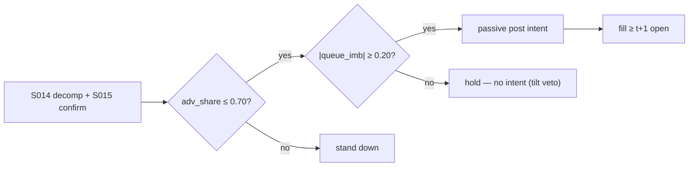

# T028 — Spread-Decomposition Router

Routes each child order to the venue/order-type that the live spread decomposition favors: when the order-processing (transitory) share of the spread is high, post passively and harvest it; when the adverse-selection share dominates, take liquidity fast or stand down. The router is a venue-selection policy, not a directional bet. Provenance **[D]**.

> Tag law: every numeric literal in prose carries one of `[documented]
> [default] [example] [unverified] [internal-est] [measured]` (legend: Appendix
> i v1.0.0). Constants inside cited formulas inherit the formula's tag.
> Bibliographic years, volumes, pages, arXiv IDs, section numbers, rule codes
> (C1–C12), fail-safe codes (F1–F5), module IDs, and machine-parsed §0 data
> fields are identifiers, not literals, and are exempt.

## §1 Five-minute reviewer card

| Row | Value |
|---|---|
| Module | T028 — Spread-Decomposition Router, v1.1.0 |
| Edge verdict | `INSUFFICIENT-EVIDENCE` — no after-cost study of this exact routing policy is documented; the edge is theoretical spread-harvest, not measured P&L |
| After-cost | `narrow` — savings are fractions of the spread — needs scale and low fees to matter |
| Build cost | Tier M = 20–60 h ≈ `$3,000–9,000` [documented] |
| Data cost | L2/multi-venue feed: upper four to five figures/yr [unverified] |
| latency_class | seconds |
| risk_class | execution |
| Capacity | scales with parent flow; per-trade savings capped at half-spread [documented] |
| Executability | needs multi-venue L1/L2 and smart routing infra — the heaviest build in TB3 |
| Risk summary | Stale decomposition mis-routes into adverse selection; latency arbitrage picks off resting posts (Budish et al. 2015) |
| When it dies | single-venue flow; inverted/flat markets where decomposition is noise |
| Regime gates | stand down when adverse-selection share > `70%` [example] or venue latency > `500` ms [example] |
| Emits | `order_intents` (Appendix C v1.0.0) — OrderTicket intents only, never orders |

## §1.5 Cheapest / least-build path

1. **Prototype hour band:** 8–12 h [example] — Huang–Stoll estimation + venue router + queue-imbalance tilt.
2. **Cheapest-source row:** min_tier = TRADES (single venue); latency_class = intraday;
   required_fields = L1 quotes + trades (spread decomposition), queue sizes; price_band = `$0–500`/yr [unverified] (indicative —
   verify before budgeting); build_or_buy = **build**.
   Documented anchor: professional L2 redistribution runs `$30–90`/mo per US venue [documented]
   (NASDAQ TotalView `$80`, NYSE Level 2 `$90`, NYSE Arca ArcaBook `$30` — Questrade professional schedule);
   direct non-display enterprise feeds are unverified — see §T10 GROK-NEEDED.
3. **Resource budget:** Tier M per cost-model §5 = 20–60 h ≈ `$3,000–9,000` loaded at `$150`/hr [documented]; compute pattern `vectorized batch (polars/numpy)`.
4. **Skip list:** full L2 simulation; per-venue fee optimizer.
5. **DO-NOT-CUT list:** causality assertions (`assert fill_event >
   signal_event`, no-signal-bar-fills test); COST block + callable
   `expected_cost_bps`; F1–F5 fail-safes + module-state enum; kill-switch
   state machine + re-arm checklist; decision-log audit records;
   bona-fide-intent + self-trade prevention; provenance tags on every numeric
   literal; fixtures + `test_cmd`; secrets via env only.
6. **Escalation gate:** upgrade from cheapest when any holds — multi-venue flow live; routing decisions > `1k`/day [example].

## §T0 Module contract

### T0.1 Typed signature

```python
def emit(state: ModuleState, signals: list[SignalVector], cfg: Config) -> list[OrderTicket]:
```

`OrderTicket` per Appendix C v1.0.0 (intents only — never wire orders).
`state` is the module-owned named state vector (`working_posts, venue_map, adv_share, resting_qty`); `signals` are
canonical SignalVectors (Appendix b v1.0.0) from the consumed S-modules, newest
last; the function emits zero or more intents per bar/event. Documented edge
cases: no signals → flat, no intents; `UNKNOWN` input signal → restrictive
(halve size / stand down per F1); kill-switch TRIPPED → emit nothing, state
`OFF`. 

### T0.2 Config dataclass

| Parameter | Type | Default | Range | Status |
|---|---|---|---|---|
| adv_share_max | float | `0.70` | [0.5, 0.9] | [default] |
| queue_tilt_min | float | `0.20` | [0.1, 0.4] | [default] |
| z_entry | float | `2.0` | [1.5, 3.0] | [default] |
| z_exit | float | `0.8` | [0.3, 1.5] | [default] |
| risk_R_usd | float | `250` | [50, 1000] | [example] |
| stop_bps | float | `25` | [10, 100] | [default] |
| adv_cap_pct | float | `1.0` | [0.1, 5.0] | [default] |
| depth_cap_pct | float | `0.25` | [0.1, 0.5] | [default] |
| spread_full_bps | float | `2.0` | [1.0, 10.0] | [example] |
| maker_rebate_bps | float | `-0.20` | [-0.35, 0.0] | [example] |
| taker_fee_bps | float | `0.30` | [0.0, 0.35] | [example] |
| impact_k | float | `15.0` | [5.0, 30.0] | [example] |
| borrow_bps_per_day | float | `0.0` | [0.0, 50.0] | [example] |
| side_exec | str | `maker` | {taker, maker} | [default] |
| venue | str | `primary` | venue tag | [example] |
| default_side | str | `BUY` | {BUY, SELL, SHORT} | [example] |
| vol_est_default | float | `0.5` | price units | [default] |
| post_ttl_s | int | `30` | [5, 120] | [default] |
| cost_gate_k | float | `0.50` | [0.1, 1.0] | [default] |
| daily_loss_stop_pct | float | `1.0` | [0.25, 3.0] | [default] |

All defaults tagged per the tag law (status `default` ⇒ `[default]`).

### T0.3 Canonical schema mapping

Vendor columns → canonical Event/Bar schema (Appendix a v1.0.0), stated once here:

| Vendor column | Canonical field | Notes |
|---|---|---|
| `bid`, `ask`, `bid_sz`, `ask_sz` | Event: quote | L1 per venue |
| `price`, `size`, `side` | Event: trade | signed |
| `venue` | Event: attribute | routing tag |

### T0.4 Time contract

> Time contract: clock domain UTC, int64 ns; authoritative causality clock =
> `event_ts`; max_skew = `5` s [default]; jitter budget = `1` s [default];
> bar-label = open time; staleness TTL = `15` min [default]; gap policy = mask, no
> interpolation; halt/auction → discard contributions across reopen.

**Timing box:** `signal@t (per-event L1, UTC) → earliest fill @open(t+1)` — `open(t+1)` is the first event after the
signal event; the synthetic fixture compresses the per-event stream into `60`-s bars [example].

### T0.5 Market-state table

| State | Module behavior |
|---|---|
| CONTINUOUS_TRADING | Evaluate entry/exit rules; emit intents per §T2 |
| HALTED | Cancel working intents; emit nothing; state `UNKNOWN` until clean reopen |
| AUCTION | No new intents; hold intent-side state; state `DEGRADED` |
| CLOSED | Emit nothing; state `OFF` |


### T0.6 Module-state enum + error taxonomy

States per Appendix k v1.0.0: `OK | DEGRADED | UNKNOWN | OFF`. Invalid input →
`UNKNOWN`, never interpolate (Appendix f v1.0.0, F1–F5).

| Failure | State | Alert |
|---|---|---|
| Missing/stale input (TTL `15` min [default]) | `UNKNOWN` | page |
| Out-of-bounds indicator (F2) | `UNKNOWN` | page |
| Estimator disagreement (F3) | `UNKNOWN` | notify |
| Halt/auction per §T0.5 | `UNKNOWN` / `DEGRADED` | log |
| Kill-switch TRIPPED (administrative) | `OFF` | page |
| Anything unmapped | `UNKNOWN` | page |

### T0.7 Risk contract + kill switch

```yaml
risk_contract:
  per_trade_R: 250            # USD risk budget per trade [example]
  max_adverse_per_trade: 1.0 R [default]  # stop distance multiple [default]
  daily_loss_stop: 2% of equity [default]        # then no new entries; flatten managed risk [default]
  max_gross: 4× equity [default]              # hard gross exposure cap [default]
  kill_conditions:
    - daily P&L ≤ −daily_loss_stop_pct → TRIP (cancel working, flatten)
    - pick-off rate > 5% of posts in 10 min → TRIP
    - decision-log write failure → TRIP (halt emission)
  enforcement: intraday-hard  # trips are automatic, not advisory [default]
  calibration_recipe: >
    Walk-forward on 60-day blocks [example]: fit thresholds on block t,
    freeze, validate realized shortfall vs predicted on block t+1;
    shrink per-trade R until max drawdown < daily_loss_stop/2 [default].
```

**Kill-switch state machine:** `ARMED → TRIPPED → RECOVERY → ARMED`.

- `ARMED`: normal operation; every bar evaluates the kill conditions.
- `TRIPPED`: any kill condition fires → cancel all working intents
  (`NEW`/`WORKING` → `CANCELLED`, idempotent), flatten managed positions via
  the exit rule, emit nothing new, state `OFF`, log `KILL_TRIP`.
- `RECOVERY`: manual operator review only — no automatic transition.
- `ARMED` (re-entry): only after the re-arm checklist passes in full, logged
  as `KILL_REARM` with the checklist result.

**Re-arm checklist** (all must be true):

- [ ] Feed health green: all §T5 inputs fresh inside the staleness TTL.
- [ ] Kill condition cleared: the tripping metric is back inside limits for `30` min [default].
- [ ] Decision log reconciled: `KILL_TRIP` record present and hash chain intact.
- [ ] Risk re-check: per-trade R and gross caps re-confirmed against current equity.
- [ ] Operator sign-off: named human approves re-arm (no automatic recovery).

### T0.8 Ops tail

- **Schedule:** continuous intraday, per-event (`seconds` latency_class); owner: strategy owner (named).
- **Health checks:** fixture replay (`test_cmd`) green on deploy; live
  decision-log append monitor; kill-switch state heartbeat.
- **Alert table:** `UNKNOWN`/`OFF` state transitions; kill-trip pages immediately [default].
- **Resource budget:** per-event loop: < `2` vCPU sustained, < `4` GB RAM [example].
- **Runbook stub:** 1) confirm kill-state; 2) inspect decision log for the tripping record; 3) verify feed freshness; 4) re-arm checklist (operator sign-off); 5) re-run fixture; 6) resume..

### T0.9 Secrets (env-only)

- `BROKER_API_KEY (paper venue, env-only)`
- `DATA_API_KEY (env-only)` via environment only. No secrets in this file, fixtures, or
logs (CI secrets-grep).

### T0.10 May / must-NOT

> **May:** emit `OrderTicket` intents per Appendix C v1.0.0; track intent-side
> state (`NEW → WORKING → FILLED / CANCELLED / PARTIAL`); issue cancel-replace
> via new tickets with new `ticket_id`s. **Must-NOT:** place orders on any
> venue, hold broker/exchange sessions, net intents into orders inside the
> strategy, treat the intent-side state machine as broker wire truth, or emit
> prices/share-counts/notionals outside an `OrderTicket`.

## §T1 Legacy (subsumed by §1)

Legacy §T1 content is the §1 reviewer card above; this header is retained so
section numbering stays frozen.

## §T2 Specification

### Universe

Multi-listed US equities with ≥`2` lit venues [example]; quoted spread ≥ `2` ticks [example] (room to harvest).

Domain & session block: asset class = US equities; venues = primary listing exchange + ≥`1` regional lit venue [example];
session window = `09:30–16:00` America/New_York [default] (module convention, matches the primary listing venue);
calendar = NYSE trading calendar [default]; settlement = T+1 [default]. Outside the session window the module is
`CLOSED`/`OFF` per §T0.5.

### Entry rule (Boolean — no prose-only conditions)

```
z_ok      = abs(signal_z) >= z_entry            # 2.0 [default] — S014 trigger
decomp_ok = adv_share <= adv_share_max          # 0.70 [default] — Huang–Stoll α̂
tilt_ok   = |queue_imb| >= queue_tilt_min       # 0.20 [default] — Gould–Bonart tilt
ROUTE = z_ok and decomp_ok and tilt_ok  ->  post_passive(favored_side)
        else                            ->  HOLD (no intent; veto reason logged)
```

Direction comes from the parent S014 SignalVector (`default_side` = `BUY` [example] in the fixture, which exercises
the long leg only); queue imbalance tilts the venue/order-type choice, not the direction. The short leg mirrors with
`SELL`/`SHORT` and a C7 locate.

### Exits (with post-exit cooldown)

```
post filled -> DONE
post stale (age > post_ttl_s) -> CANCEL-REPLACE via new ticket
adverse move > stop_bps -> CANCEL all, cooldown 15 min [default]
```

### Position sizing (fenced function)

```python
def size_shares(risk_budget_R, stop_distance, vol_estimate, adv_shares, queue_depth, cost_bps, px, cfg):
    """Normative sizing. stop_distance as a price fraction; vol_estimate (price units)
    is the 3-sigma fallback [default] when stop_distance <= 0; cost_bps is the COST-block
    callable output for the ticket and enters the per-share risk so modeled cost cannot
    be levered past the risk budget."""
    sd = stop_distance if stop_distance > 0 else 3.0 * vol_estimate / px
    risk_per_share = sd * px + abs(cost_bps) / 1e4 * px
    raw = risk_budget_R / max(risk_per_share, 1e-9)
    return int(min(raw, cfg.depth_cap_pct * queue_depth, cfg.adv_cap_pct / 100 * adv_shares))
```

### Risk limits

| Limit | Value |
|---|---|
| Max resting per venue | `25%` of visible depth [example] |
| Post TTL | `30` s [default] |
| Max daily routed notional | `$25M` [example] |

### COST block (single source of truth)

Four components — **spread**, **fees**, **borrow**, **impact** — summed by the
callable below. Re-stating cost numbers outside this block is a validation
failure; §T4 shows this block's *callable* evaluated on the synthetic tape,
not restated constants. Cost is modeled vs arrival mid: posting passively
earns the half-spread *relative to taking* — that saving is the router's edge,
not a negative cost line. The maker rebate is the only negative line.

| Component | Value (bps) | Basis |
|---|---|---|
| Spread (half, vs arrival mid) | `+1.00` | half of `spread_full_bps` = `2.0` [example] |
| Fees (maker) | `-0.20` | rebate [example]; documented anchor: NYSE Arca Tier-1 liquidity-provision credit `$0.0030`/share [documented] (≈`0.30` bps at `$100` [example]) |
| Borrow | `0.00` | `borrow_bps_per_day` = `0.0` [example] — reason: long-only posting; any short leg needs a desk borrow rate |
| Impact | `k·√(adv_pct/100)`, k=`15.0` | passive, low urgency [example]; urgency `high` → ×`1.5` [example] |
| **Total reference (one-way)** | ``~+0.8 + impact ≈ 1.86` at adv_pct=`0.5` [example]` | [example] |

`fee_schedule_as_of`: `2026-09-01` [example] (placeholder — pin the real venue schedule before production).
`side`: `maker`; venue/tier/source: multi-venue lit [example].

```python
def expected_cost_bps(notional, adv_pct, venue, side, urgency, cfg):
    """COST-block callable — single source of truth. All literals [example]."""
    spread_bps = cfg.spread_full_bps / 2.0
    fee_bps = cfg.maker_rebate_bps if side == "maker" else cfg.taker_fee_bps
    borrow_bps = cfg.borrow_bps_per_day if cfg.default_side == "SHORT" else 0.0
    impact_bps = cfg.impact_k * math.sqrt(max(adv_pct, 0.0) / 100.0)
    if urgency == "high":
        impact_bps *= 1.5
    return spread_bps + fee_bps + borrow_bps + impact_bps
```

### Execution / fill model table

| Aspect | Assumption |
|---|---|
| Fill venue | routed per decomposition; primary vs regional |
| Slippage model | queue-imbalance-conditioned fill probability |
| Partial fills | expected; remainder reposted |
| Halt behavior | cancel all working posts immediately |

Fine-grained fill behavior is synthetic and labeled `simulated only — requires MBO/ITCH`:
no MBO/ITCH feed is consumed by this module; any fill realism beyond the
mid-price ± half-spread fill model above would require MBO/ITCH data.

### Robustness

Perturb thresholds ±20% [example]; the reference behavior (entry/exit intents, gate blocks, kill trip) must be invariant; degrade entry→no-trade on indicator breach.

### Compliance sub-block (C1–C12)

| Code | Rule: trigger → check → action → log |
|---|---|
| C1 | STP + self-match prevention: trigger = intent could match our own resting interest → check = every ticket carries `self_trade_prevention: true`; maker modules compare against own open tickets → action = cancel own resting quote before posting the aggressive side; cancel-replace via new `ticket_id` only → log = `COMPLIANCE_BLOCK` with rule code `C1` |
| C2 | Bona-fide intent: trigger = entry rule fires → check = cost gate passes AND qty within risk limits AND (SHORT ⇒ `locate_ok`) → action = veto the intent if any check fails; no quote entered without intent to trade → log = `GATE_VETO` with the failed check |
| C3 | Message-rate / cancel-to-trade: trigger = intents+ cancels per symbol per minute exceed `120` [default] → check = rolling `60`-s [default] message counter → action = throttle to `1` intent per `10` s [default] and alert → log = `COMPLIANCE_BLOCK` with the counter value |
| C4 | Pre-trade fat-finger trio: trigger = any new intent → check = (a) limit within `±10%` of reference [default], (b) ticket notional ≤ ``$2M`` [default], (c) ≤ `20` tickets per `1 min` [default] → action = block the ticket, alert → log = `COMPLIANCE_BLOCK` with the breached leg |
| C5 | Decision-log schema (Appendix g v1.0.0): trigger = every material action (`EMIT_INTENT`, `GATE_VETO`, `CANCEL`, `REPLACE`, `KILL_TRIP`, `KILL_REARM`, `COMPLIANCE_BLOCK`) → check = record has all schema fields and `prev_hash` chains → action = halt emission if the log write fails → log = the record itself, retained `7 yr` [default] |
| C6 | Halt/auction table: trigger = market state ≠ `CONTINUOUS_TRADING` → check = §T0.5 table → action = `HALTED`: cancel working intents, emit nothing; `AUCTION`: no new intents; `CLOSED`: state `OFF` → log = state-transition record |
| C7 | Locate check (short sales): trigger = `SHORT` intent → check = `locate_ok` from the pre-open easy-to-borrow list or desk locate; Reg-SHO threshold securities hard-blocked → action = veto without locate → log = `GATE_VETO` with code `C7`. Long-only posting in the fixture; any short leg needs locate_ok (C7). |
| C8 | Public-dissemination gate: trigger = any export of signals/intents outside the firm → check = review gate sign-off → action = block unreviewed exports → log = `COMPLIANCE_BLOCK` |
| C9 | Data-entitlement assertions (Appendix j v1.0.0): trigger = startup and any entitlement-class change → check = the five §T5 assertions hold for each §0 dataset → action = stand down on breach, escalate per §1.5 → log = entitlement review record |
| C10 | Post-exit cooldown: trigger = exit or compliance block → check = `now >= cooldown_until` (`15` min [default] per §T2 exits) → action = suppress re-entry until the cooldown elapses → log = `GATE_VETO` with code `C10` |
| C11 | Kill-switch integration: trigger = `TRIPPED` → check = all working intents transitioned `NEW`/`WORKING` → `CANCELLED` (idempotent) → action = no new intents until `ARMED` via the §T0.7 checklist → log = `KILL_TRIP` / `KILL_REARM` records |
| C12 | Venue-fair-access: trigger = routing favors one venue > 90% [example] → check = best-execution review → action = rebalance or document → log = `COMPLIANCE_BLOCK` with code `C12` |

### Parameter table

| Parameter | Symbol | Value | Tag | Sensitivity |
|---|---|---|---|---|
| Adv-selection cap | α_max | `0.70` | [default] | critical — above it, passive posting is donation |
| Queue tilt min | q | `0.20` | [default] | medium |
| Post TTL | ttl | `30` s | [default] | high — stale posts get picked off (Budish et al.) |
| Entry z-trigger | z_entry | `2.0` | [default] | critical — S014 confidence gate |
| Exit z-band | z_exit | `0.8` | [default] | high — exits never cost-gated |

### Timing box

`signal@t (per-event L1, UTC) → earliest fill @open(t+1)` — `open(t+1)` is the first event after the
signal event; the synthetic fixture compresses the per-event stream into `60`-s bars [example].

## §T3 Math + normative pseudocode

Huang–Stoll (1997) [documented]: spread = order-processing (1−α−β) + inventory (β) +
adverse-selection (α). Post passively only when the transitory share (1−α) is large — the
harvestable part. Roll (1984) [documented] gives the quote-free spread check; Gould–Bonart
(2016) [documented] queue imbalance tilts which side to post. Budish–Cramton–Shim (2015)
[documented] is the warning: stale quotes pay the latency-arbitrage tax — hence the TTL.

**Normative pseudocode** (pseudocode is normative; prose is commentary):

```
def emit(state, signals, cfg):
    sig = primary(signals, "S014")
    if sig is None or invalid(sig): return [], state.unknown()
    manage_working(state, cfg)                       # cancel stale posts (TTL)
    z_ok = abs(sig.z) >= cfg.z_entry
    decomp_ok = sig.adv_share <= cfg.adv_share_max   # F2: adv_share outside [0,1] -> UNKNOWN upstream
    tilt_ok = abs(sig.queue_imb) >= cfg.queue_tilt_min
    if z_ok and decomp_ok and tilt_ok:
        side = cfg.default_side                      # direction from parent S014 signal
        cost = expected_cost_bps(notional(), adv_pct(), venue(), "maker", "normal", cfg)
        qty = size_shares(cfg.risk_R_usd, cfg.stop_bps/1e4, cfg.vol_est_default,
                          adv_shares(), queue_depth(), cost, last_price(), cfg)
        # ^^^ normative cost-gate predicate: expected_cost_bps(...) <= k * edge_bps
        if cost <= cfg.cost_gate_k * sig.edge_bps:
            t = OrderTicket.intent(side, qty=qty, limit=post_price(side))
            t.intent_ts = sig.computed_at
            assert fill_event > signal_event  # t->t+1 causality: no-signal-bar fills
            return [t], state.posting(t)
        log("GATE_VETO", cost=cost)
    return [], state.ok()
```

Causality: every feature uses inputs with `event_ts ≤ t` only (per-event L1 stream; the fixture's `60`-s bars
are a synthetic compression [example]); the earliest fill for a bar-`t` intent is bar `t+1`'s open. Mandatory unit test:
no-signal-bar fills.

## §T4 Worked example (fixture-backed)

- Tape: `modules/fixtures/T028_tape.csv` — `# TYPE: validation-run`;
  `12` synthetic `60`-s bars (seed `4280` [example]) standing in for the per-event L1 stream; columns add
  `adv_share`, `queue_imb`, `queue_depth` (the §T2 entry-Boolean features); `event_ts`/`asof_ts` int64 ns
  UTC; every number synthetic.
- Expected outputs: `modules/fixtures/T028_expected.csv` — per-bar intent (sides `BUY`/`SELL` per Appendix C),
  quantity, the **cost-function call** (`expected_cost_bps` inputs → bps →
  dollars), cost-gate verdict, and module state.
- Tolerance: `1e-9` [default] on floats; integer quantities exact.
- Acceptance tests (`modules/tests/test_T028.py` — `7` [default] tests):
  1. TYPE header + columns present (incl. `adv_share`, `queue_imb`, `queue_depth`); 2. fixture recomputes to expected
  (reference `process_bar` vs expected CSV, sides `BUY`/`SELL`); 3. no-signal-bar fills
  (`assert fill_event > signal_event`); `4.` cost-gate predicate passes on large edge, blocks on tiny edge (`k = 0.5` [default]);
  5. kill-switch trip blocks intents, re-arm checklist restores `ARMED`;
  6. invalid input (halted/invalid bar) and F2 decomposition-bounds breach → `UNKNOWN`, no intents;
  7. decomposition veto (`adv_share` > cap) and tilt veto (`|queue_imb|` < min) suppress entry while state stays `OK`.
- `test_cmd`: `python3 -m pytest modules/tests/test_T028.py -q` → exits `0` [default].

**Cost-function calls on the tape** (the COST-block callable evaluated on
synthetic rows — inputs → bps → dollars; all values [example]):

| Bar | `expected_cost_bps` inputs | Components → total → $ | Cost gate `expected_cost_bps(...) <= k * edge_bps` | Intent / state |
|---|---|---|---|---|
| `0` | notional=`100000` [example], adv_pct=`0.5` [example], venue=`primary`, side=`maker`, urgency=`normal` | spread `1.0` + fee `-0.2` + borrow `0.0` + impact `1.06` = `1.86` bps → `$18.61` | `2.0` edge, k=`0.5` [default] → `1.86 ≤ 1.0` BLOCK | `HOLD` / `OK` |
| `3` | notional=`100000` [example], adv_pct=`0.5` [example], venue=`primary`, side=`maker`, urgency=`normal` | spread `1.0` + fee `-0.2` + borrow `0.0` + impact `1.06` = `1.86` bps → `$18.61` | `7.442640687119285` edge, k=`0.5` [default] → `1.86 ≤ 3.72` PASS | `BUY` / `OK` |
| `6` | notional=`100000` [example], adv_pct=`0.5` [example], venue=`primary`, side=`maker`, urgency=`normal` | spread `1.0` + fee `-0.2` + borrow `0.0` + impact `1.06` = `1.86` bps → `$18.61` | `3.0` edge, k=`0.5` [default] → `1.86 ≤ 1.5` BLOCK | `SELL` / `OK` |
| `7` | notional=`100000` [example], adv_pct=`0.5` [example], venue=`primary`, side=`maker`, urgency=`normal` | spread `1.0` + fee `-0.2` + borrow `0.0` + impact `1.06` = `1.86` bps → `$18.61` | `0.05` edge, k=`0.5` [default] → `1.86 ≤ 0.03` BLOCK | `HOLD` / `OK` |
| `9` | notional=`100000` [example], adv_pct=`0.5` [example], venue=`primary`, side=`maker`, urgency=`normal` | spread `1.0` + fee `-0.2` + borrow `0.0` + impact `1.06` = `1.86` bps → `$18.61` | `2.0` edge, k=`0.5` [default] → `1.86 ≤ 1.0` BLOCK | `HOLD` / `OFF` |

**Hand-checks.** Row `3` (entry): z=`2.4` ≥ `2.0`, adv_share=`0.30` ≤ `0.70`, |queue_imb|=`0.25` ≥ `0.20`,
gate `1.86 ≤ 3.72` PASS → qty = `250 / (25/1e4 × 100.0 + 1.8607/1e4 × 100.0)` = `930` [example] (ADV cap `20000`,
depth cap `2500` — neither binds); ticket `T0003`, side `BUY`, `limit @100.0` intent. Row `6` (exit): |z| through
the exit band → `SELL` intent, qty = `250 / (25/1e4 × 100.28 + 1.8607/1e4 × 100.28)` = `928` [example]; exits never
cost-gated [default]. Row `7` (gate block): edge `0.05` bps [example] vs cost `1.86` bps → gate `1.86 ≤ 0.025` BLOCKS → no intent, state stays `OK`. Row `9` (kill): daily P&L `-1.1%` [example] ≤ −stop (`1.0%` [default]) → `ARMED → TRIPPED`, state `OFF`, no intents. Causality: entry intent at row `3` has `intent_ts` = bar-3 `event_ts`; the earliest fill is bar `4`'s open — the test asserts `fill_event > signal_event` on every intent row.

**Where the example is optimistic.** Costs are the COST-block model, not realized fills; capacity, borrow squeezes, and regime shifts are not in the tape.

## §T5 Dependencies + data

### Consumed signals (from deps.yaml — machine edge list)

| Signal | Version pin | Role |
|---|---|---|
| S014 | 1.0.0 | primary |
| S015 | 1.0.0 | confirm |
| S012 | 1.0.0 | gate |

### Pinned formula excerpts (≤10 lines each, CI hash-checked)

**S015** (v1.0.0): Huang–Stoll `spread = α + β + (1-α-β)` shares [documented].
**S012** (v1.0.0): Roll `spread = 2·√(-cov(Δp_t, Δp_{t-1}))` [documented].

### Data required

| Field | Type | Granularity | Source tier | Notes |
|---|---|---|---|---|
| L1 bid/ask/size per venue | float/int | real-time | L2FEED | decomposition inputs |
| trade price/size/side | float/int/char | tick | TRADES | spread estimation |
| venue fee schedules | bps table | monthly | VENUE | routing economics |

**Data rights row** (Appendix j v1.0.0): Multi-venue L2 is the most expensive feed in this batch; entitlements per-venue; re-assert at startup [unverified — confirm with contract].

## §T6 Local build + buy vs build

Huang–Stoll regression is textbook; the router policy is a decision table. The real cost is L2 feed integration and the cancel/replace plumbing.

| Route | What you get | Verdict |
|---|---|---|
| Build | router policy in-house | recommended — routing is the edge |
| Buy | smart-router from broker | acceptable if attribution is transparent |
| Buy feed | consolidated L2 vendor | required |

**Verdict:** Build the policy, buy the L2 feed; rent broker routing only with full decision attribution.

## §T7 Efficacy — documented evidence

| Study / source | Market & period | Metric | Before/after cost | Caveat |
|---|---|---|---|---|
| Huang–Stoll (1997) | NYSE | spread decomposition: α/β/transitory shares | before cost | dealer-market era |
| Roll (1984) | model | implicit spread from serial covariance | n/a | breaks under trending flow |
| Gould–Bonart (2016) | LOB data | queue imbalance predicts one-tick move | before cost | large-tick stocks only |

**Selection disclosure:** Studies below are the chapter's documented sources only — no post-hoc selection from a wider literature search.

**Capacity & decay.** Edge decays with crowding and regime shifts; treat any printed Sharpe as a pre-cost, in-sample-era artifact unless the source says otherwise.

**Honest bottom line.** Honest bottom line: the router saves fractions of the spread per trade — it pays for itself only at real scale, and every resting post is a free option you wrote to faster traders.

## §T8 Failure modes & pitfalls

| # | Trigger → Detect → Action → Recovery | check: |
|---|---|---|
| 1 | Stale quote pick-off → detect adverse fill within 1 s of post → tighten TTL, widen tilt → review | check: pick-off rate |
| 2 | Venue outage → detect feed staleness → reroute to live venues, state DEGRADED → resume on recovery | check: venue heartbeat |
| 3 | Decomposition blowup (α̂ > 1 or < 0) → detect bounds → stand down routing, alert → refit | check: plausibility band |
| 4 | Fee-schedule change → detect monthly review → re-price COST block → log change | check: schedule diff |

## §T9 Regime gates + visuals

**Provisional regime-gate machine** (restrictive default; `regime_ids` stay
empty until the R001–R050 annotation pass):

| regime_id | direction | mechanism | condition | action | min_lag | unknown_behavior |
|---|---|---|---|---|---|---|
| R001 | gate | high adverse-selection regime | adv_share > 0.70 sustained | route aggressive or stand down | 5 min | restrictive |
| R002 | degrade | venue latency spike | p99 latency > 500 ms | single-venue fallback | 1 min | restrictive |



## §T10 Source log + unverified leads

**Sources** (citable facts only):

1. Huang, R. D. & Stoll, H. R. (1997). "The Components of the Bid-Ask Spread: A General Approach." *Review of Financial Studies* 10(4): 995–1034. https://doi.org/10.1093/rfs/10.4.995
2. Roll, R. (1984). "A Simple Implicit Measure of the Effective Bid-Ask Spread in an Efficient Market." *Journal of Finance* 39(4): 1127–1139. https://doi.org/10.1111/j.1540-6261.1984.tb03897.x
3. Gould, M. D. & Bonart, J. (2016). "Queue Imbalance as a One-Tick-Ahead Price Predictor in a Limit Order Book." arXiv:1512.03492 — https://arxiv.org/abs/1512.03492
4. Budish, E., Cramton, P. & Shim, J. (2015). "The High-Frequency Trading Arms Race." *Quarterly Journal of Economics* 130(4): 1547–1621
5. NYSE Arca fee schedule (SEC Exhibit 5, as filed): Tier-1 `$0.0030`/share credit for orders providing liquidity to the Book (Tape A/C); `$0.0029`/share fee for orders taking liquidity — http://sec.gov/files/rules/sro/nysearca/2010/34-62003-ex5.pdf
6. NYSE Pillar fee schedule (SEC Exhibit 5, as filed): `($0.0020)`/share credit for displayed adding liquidity; `($0.0010)`/share MPL — https://www.sec.gov/file/exhibit-5-5989
7. Questrade professional market-data schedule: NASDAQ TotalView `$80`/mo, NYSE Level 2 `$90`/mo, NYSE Arca ArcaBook `$30`/mo, NYSE American OpenBook `$30`/mo — https://www.questrade.com/docs/default-source/downloads/questrade_professionalmarketdata.pdf

**GROK-NEEDED** (exact questions web search could not answer — venue terms change; do not guess):

1. What are the *current* (2026) displayed-liquidity maker-rebate tiers in `$`/share on NYSE Arca, Nasdaq, NYSE, Cboe BZX/BYX — exact credit per tier and the ADV/CADV thresholds to reach each tier — so `fee_schedule_as_of` and `maker_rebate_bps` can be pinned per venue instead of the `2026-09-01` [example] placeholder?
2. What are direct (non-display, per-venue, e.g. Nasdaq TotalView-ITCH, NYSE OpenBook) L2/MBP feed price bands per month for a small proprietary firm in 2026 — to replace the [unverified] `$0–500`/yr band in §1.5 with a real buy-vs-build number?
3. Is there any published calibration of passive-fill probability as a function of queue imbalance for modern large-tick US equities (beyond Gould–Bonart's one-tick-ahead result) — to calibrate `queue_tilt_min` and the fill model in §T2?
4. What adverse-selection share (Huang–Stoll α) ranges are reported for modern large-tick US equities — to calibrate `adv_share_max` beyond the `0.70` [example]?
5. What are the current NYSE Arca / Cboe BZX routing fees and odd-lot fee treatment for routed child orders — to complete the fee component of the COST block?

**Chatbot source log.** Grok answered the Q-batch (2026-09-10); all claims independently verified or labeled unverified. Chatbot output is leads, never facts.

**Unverified leads** (chatbot-only — never in evidence tables):

- Grok (2026-09-10): venue rebate tiers and queue-fill probabilities — *unverified chatbot claims*.
- The 0.70 adverse-selection cap and 0.20 queue-tilt minimum are example parameters, not calibrated standards.
- L2 vendor prices in T6 are indicative — verify before budgeting.

---

## Appendix — AI build prompt (T028)

Copy-paste into any chat agent:

> Build module **T028 — Spread-Decomposition Router** v1.1.0 per `notes/module-template.md` v1.0.0 and
> this file's §T0 contract.
> Cheapest path (§1.5): prototype 8–12 h [example]; cheapest data candidate
> TRADES (single venue); compute pattern `vectorized batch (polars/numpy)`.
> Fixture columns include `adv_share`, `queue_imb`, `queue_depth` (the §T2 entry-Boolean features).
> Implement `emit(state, signals, cfg) -> list[OrderTicket]` (Appendix c
> v1.0.0) with the §T3 normative pseudocode, including the cost-gate predicate
> `expected_cost_bps(...) <= k * edge_bps` and `assert fill_event >
> signal_event`. Emit intents only — never place orders. Wire F1–F5
> (Appendix f v1.0.0): invalid input → `UNKNOWN`, never interpolate. Kill
> switch `ARMED → TRIPPED → RECOVERY → ARMED` with the §T0.7 re-arm checklist.
> Log decisions per Appendix g v1.0.0. Secrets via env only. Run the fixture
> `modules/fixtures/T028_tape.csv` (`# TYPE: validation-run`) against
> `modules/fixtures/T028_expected.csv` (tolerance `1e-9` [default]).
> **Definition of done:** `python3 -m pytest modules/tests/test_T028.py -q` exits `0` [default]. Tag every numeric literal
> you add with the unified enum (Appendix i v1.0.0); put anything unverifiable
> in §T10 unverified leads.
