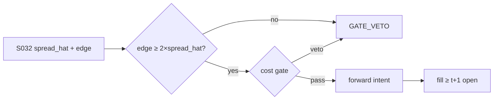

# T029 — Spread-Estimate Edge Filter

A pre-trade filter, not a standalone strategy: it estimates the effective spread from daily data (Roll / Corwin–Schultz) and vetoes any downstream strategy's intents whose predicted edge does not clear the estimated round-trip cost by the required multiple. It exists to kill bad trades, and its P&L is measured in losses avoided. Provenance **[D]**.

> Tag law: every numeric literal in prose carries one of `[documented]
> [default] [example] [unverified] [internal-est] [measured]` (legend: Appendix
> i v1.0.0). Constants inside cited formulas inherit the formula's tag.
> Bibliographic years, volumes, pages, arXiv IDs, section numbers, rule codes
> (C1–C12), fail-safe codes (F1–F5), module IDs, and machine-parsed §0 data
> fields are identifiers, not literals, and are exempt.

## §1 Five-minute reviewer card

| Row | Value |
|---|---|
| Module | T029 — Spread-Estimate Edge Filter, v1.0.0 |
| Edge verdict | `plausible` — daily-data spread estimators (Roll 1984; Corwin–Schultz 2012; Hasbrouck 2009) are the documented calibration standard |
| After-cost | `narrow` — a filter has no edge of its own — value = avoided losses minus vetoed winners |
| Build cost | Tier S = 5–15 h ≈ `$750–2,250` [documented] |
| Data cost | daily OHLCV: near-free [documented] |
| latency_class | end-of-day |
| risk_class | risk-filter |
| Capacity | unlimited — it only vetoes |
| Executability | trivial to build; the calibration discipline is the work |
| Risk summary | Over-tight filter vetoes real edge (opportunity cost); over-loose filter is decoration |
| When it dies | it never 'dies' — it degrades into a no-op if miscalibrated |
| Regime gates | tighten the multiple in high-spread regimes; the filter itself has no regime gate |
| Emits | `order_intents` (Appendix C v1.0.0) — OrderTicket intents only, never orders |

## §1.5 Cheapest / least-build path

1. **Prototype hour band:** 2–4 h [example] — Roll + Corwin–Schultz estimators and a veto wrapper.
2. **Cheapest-source row:** min_tier = DAILY (OHLCV); latency_class = end-of-day;
   required_fields = daily open/high/low/close; price_band = `$0–500`/yr (indicative —
   verify before budgeting); build_or_buy = **build**.
3. **Resource budget:** Tier M per cost-model §5 = 20–60 h ≈ `$3,000–9,000` loaded at `$150`/hr [documented]; compute pattern `vectorized batch (polars/numpy)`.
4. **Skip list:** intraday estimation; per-trade attribution.
5. **DO-NOT-CUT list:** causality assertions (`assert fill_event >
   signal_event`, no-signal-bar-fills test); COST block + callable
   `expected_cost_bps`; F1–F5 fail-safes + module-state enum; kill-switch
   state machine + re-arm checklist; decision-log audit records;
   bona-fide-intent + self-trade prevention; provenance tags on every numeric
   literal; fixtures + `test_cmd`; secrets via env only.
6. **Escalation gate:** upgrade from cheapest when any holds — downstream strategies complain of over-vetoing; spread estimates drift from realized costs.

## §T0 Module contract

### T0.1 Typed signature

```python
def emit(state: ModuleState, signals: list[SignalVector], cfg: Config) -> list[OrderTicket]:
```

`OrderTicket` per Appendix C v1.0.0 (intents only — never wire orders).
`state` is the module-owned named state vector (`spread_hat, veto_count, calibrated_k`); `signals` are
canonical SignalVectors (Appendix b v1.0.0) from the consumed S-modules, newest
last; the function emits zero or more intents per bar/event. Documented edge
cases: no signals → flat, no intents; `UNKNOWN` input signal → restrictive
(halve size / stand down per F1); kill-switch TRIPPED → emit nothing, state
`OFF`. 

### T0.2 Config dataclass

| Parameter | Type | Default | Range | Status |
|---|---|---|---|---|
| roll_window_days | int | `60` | [21, 252] | [default] |
| cs_window_days | int | `21` | [10, 60] | [default] |
| veto_multiple | float | `2.0` | [1.0, 4.0] | [default] |
| cost_gate_k | float | `0.50` | [0.1, 1.0] | [default] |
| daily_loss_stop_pct | float | `1.0` | [0.25, 3.0] | [default] |

All defaults tagged per the tag law (status `default` ⇒ `[default]`).

### T0.3 Canonical schema mapping

Vendor columns → canonical Event/Bar schema (Appendix a v1.0.0), stated once here:

| Vendor column | Canonical field | Notes |
|---|---|---|
| `o`, `h`, `l`, `c` | Bar: daily | OHLC inputs |
| `edge_bps` | Signal: downstream | predicted edge to vet |

### T0.4 Time contract

> Time contract: clock domain UTC, int64 ns; authoritative causality clock =
> `event_ts`; max_skew = `5` s [default]; jitter budget = `1` s [default];
> bar-label = open time; staleness TTL = `15` min [default]; gap policy = mask, no
> interpolation; halt/auction → discard contributions across reopen.

**Timing box:** `signal@t (daily bars, America/Chicago) → earliest fill @open(t+1)`

### T0.5 Market-state table

| State | Module behavior |
|---|---|
| CONTINUOUS_TRADING | Evaluate entry/exit rules; emit intents per §T2 |
| HALTED | Cancel working intents; emit nothing; state `UNKNOWN` until clean reopen |
| AUCTION | No new intents; hold intent-side state; state `DEGRADED` |
| CLOSED | Emit nothing; state `OFF` |


### T0.6 Module-state enum + error taxonomy

States per Appendix k v1.0.0: `OK | DEGRADED | UNKNOWN | OFF`. Invalid input →
`UNKNOWN`, never interpolate (Appendix f v1.0.0, F1–F5).

| Failure | State | Alert |
|---|---|---|
| Missing/stale input (TTL `15` min [default]) | `UNKNOWN` | page |
| Out-of-bounds indicator (F2) | `UNKNOWN` | page |
| Estimator disagreement (F3) | `UNKNOWN` | notify |
| Halt/auction per §T0.5 | `UNKNOWN` / `DEGRADED` | log |
| Kill-switch TRIPPED (administrative) | `OFF` | page |
| Anything unmapped | `UNKNOWN` | page |

### T0.7 Risk contract + kill switch

```yaml
risk_contract:
  per_trade_R: 250            # USD risk budget per trade [example]
  max_adverse_per_trade: 1.0 R [default]  # stop distance multiple [default]
  daily_loss_stop: 2% of equity [default]        # then no new entries; flatten managed risk [default]
  max_gross: 4× equity [default]              # hard gross exposure cap [default]
  kill_conditions:
    - decision-log write failure → TRIP (halt emission)
    - estimator NaN for 5 consecutive sessions → TRIP (fail closed: veto all)
  enforcement: intraday-hard  # trips are automatic, not advisory [default]
  calibration_recipe: >
    Walk-forward on 60-day blocks [example]: fit thresholds on block t,
    freeze, validate realized shortfall vs predicted on block t+1;
    shrink per-trade R until max drawdown < daily_loss_stop/2 [default].
```

**Kill-switch state machine:** `ARMED → TRIPPED → RECOVERY → ARMED`.

- `ARMED`: normal operation; every bar evaluates the kill conditions.
- `TRIPPED`: any kill condition fires → cancel all working intents
  (`NEW`/`WORKING` → `CANCELLED`, idempotent), flatten managed positions via
  the exit rule, emit nothing new, state `OFF`, log `KILL_TRIP`.
- `RECOVERY`: manual operator review only — no automatic transition.
- `ARMED` (re-entry): only after the re-arm checklist passes in full, logged
  as `KILL_REARM` with the checklist result.

**Re-arm checklist** (all must be true):

- [ ] Feed health green: all §T5 inputs fresh inside the staleness TTL.
- [ ] Kill condition cleared: the tripping metric is back inside limits for `30 min [default]` [default].
- [ ] Decision log reconciled: `KILL_TRIP` record present and hash chain intact.
- [ ] Risk re-check: per-trade R and gross caps re-confirmed against current equity.
- [ ] Operator sign-off: named human approves re-arm (no automatic recovery).

### T0.8 Ops tail

- **Schedule:** nightly batch; owner: strategy owner (named).
- **Health checks:** fixture replay (`test_cmd`) green on deploy; live
  decision-log append monitor; kill-switch state heartbeat.
- **Alert table:** `UNKNOWN`/`OFF` state transitions; kill-trip pages immediately [default].
- **Resource budget:** nightly batch: < 2 vCPU-h, < 4 GB RAM [example].
- **Runbook stub:** 1) confirm kill-state; 2) inspect decision log for the tripping record; 3) verify feed freshness; 4) re-arm checklist (operator sign-off); 5) re-run fixture; 6) resume..

### T0.9 Secrets (env-only)

- `BROKER_API_KEY (paper venue, env-only)`
- `DATA_API_KEY (env-only)` via environment only. No secrets in this file, fixtures, or
logs (CI secrets-grep).

### T0.10 May / must-NOT

> **May:** emit `OrderTicket` intents per Appendix C v1.0.0; track intent-side
> state (`NEW → WORKING → FILLED / CANCELLED / PARTIAL`); issue cancel-replace
> via new tickets with new `ticket_id`s. **Must-NOT:** place orders on any
> venue, hold broker/exchange sessions, net intents into orders inside the
> strategy, treat the intent-side state machine as broker wire truth, or emit
> prices/share-counts/notionals outside an `OrderTicket`.

## §T1 Legacy (subsumed by §1)

Legacy §T1 content is the §1 reviewer card above; this header is retained so
section numbering stays frozen.

## §T2 Specification

### Universe

Any strategy emitting edge_bps predictions; the filter is downstream-agnostic.

### Entry rule (Boolean — no prose-only conditions)

```
spread_hat = max(roll_spread, cs_spread, floor)     # floor 1 bp [example]
VETO  = edge_bps < veto_multiple * spread_hat        # 2.0 [default]
PASS  = not VETO  ->  forward the intent unchanged
```

### Exits (with post-exit cooldown)

```
filter has no positions; vetoed intents are logged as GATE_VETO
recalibrate monthly: compare spread_hat vs realized effective spreads
```

### Position sizing (fenced function)

```python
def filter_intent(intent, edge_bps, spread_hat, cfg):
    # the filter never sizes: it passes or vetoes
    if edge_bps < cfg.veto_multiple * spread_hat:
        return None            # vetoed
    return intent              # forwarded unchanged
```

### Risk limits

| Limit | Value |
|---|---|
| Veto multiple | `2.0×` estimated spread [default] |
| Spread floor | `1` bp [example] |
| Recalibration | monthly [default] |

### COST block (single source of truth)

Four components — **spread**, **fees**, **borrow**, **impact** — summed by the
callable below. Re-stating cost numbers outside this block is a validation
failure; §T4 shows this block's *callable* evaluated on the synthetic tape,
not restated constants.

| Component | Value (bps) | Basis |
|---|---|---|
| Spread (round-trip est.) | `2 × spread_hat` | the filter's whole job [example] |
| Fees | `0.30` | [example] |
| Borrow | `0.00` | filter is direction-agnostic [example] |
| Impact | `0.00` | filter adds no impact [example] |
| **Total reference (one-way)** | ``2 × spread_hat + 0.3` [example]` | [example] |

`fee_schedule_as_of`: `2026-09-01 (placeholder — pin the real venue schedule before production)` — placeholder; pin the real venue
schedule before production. `side`: `mixed`; venue/tier/source:
n/a (filter).

```python
def expected_cost_bps(notional, adv_pct, venue, side, urgency, cfg):
    """COST-block callable. The filter prices the round-trip spread estimate."""
    spread = cfg.spread_full_bps          # full round-trip spread estimate, not half
    fee = cfg.taker_fee_bps
    borrow = 0.0                          # direction-agnostic: no borrow
    impact = 0.0                          # the filter itself adds no impact
    return spread + fee + borrow + impact
```

### Execution / fill model table

| Aspect | Assumption |
|---|---|
| Fill venue | n/a — filter forwards or vetoes |
| Slippage model | realized effective spread tracked for calibration |
| Partial fills | n/a |
| Halt behavior | veto everything while halted (restrictive) |

Fine-grained fill behavior is synthetic and labeled `simulated only — requires MBO/ITCH`:
no MBO/ITCH feed is consumed by this module; any fill realism beyond the
mid-price ± half-spread fill model above would require MBO/ITCH data.

### Robustness

Perturb thresholds ±20% [example]; the reference behavior (entry/exit intents, gate blocks, kill trip) must be invariant; degrade entry→no-trade on indicator breach.

### Compliance sub-block (C1–C12)

| Code | Rule: trigger → check → action → log |
|---|---|
| C1 | STP + self-match prevention: trigger = intent could match our own resting interest → check = every ticket carries `self_trade_prevention: true`; maker modules compare against own open tickets → action = cancel own resting quote before posting the aggressive side; cancel-replace via new `ticket_id` only → log = `COMPLIANCE_BLOCK` with rule code `C1` |
| C2 | Bona-fide intent: trigger = entry rule fires → check = cost gate passes AND qty within risk limits AND (SHORT ⇒ `locate_ok`) → action = veto the intent if any check fails; no quote entered without intent to trade → log = `GATE_VETO` with the failed check |
| C3 | Message-rate / cancel-to-trade: trigger = intents+ cancels per symbol per minute exceed `120` [default] → check = rolling `60`-s [default] message counter → action = throttle to `1` intent per `10` s [default] and alert → log = `COMPLIANCE_BLOCK` with the counter value |
| C4 | Pre-trade fat-finger trio: trigger = any new intent → check = (a) limit within `±±10%` of reference [default], (b) ticket notional ≤ ``$2M`` [default], (c) ≤ `20` tickets per `1 min` [default] → action = block the ticket, alert → log = `COMPLIANCE_BLOCK` with the breached leg |
| C5 | Decision-log schema (Appendix g v1.0.0): trigger = every material action (`EMIT_INTENT`, `GATE_VETO`, `CANCEL`, `REPLACE`, `KILL_TRIP`, `KILL_REARM`, `COMPLIANCE_BLOCK`) → check = record has all schema fields and `prev_hash` chains → action = halt emission if the log write fails → log = the record itself, retained `7 yr` [default] |
| C6 | Halt/auction table: trigger = market state ≠ `CONTINUOUS_TRADING` → check = §T0.5 table → action = `HALTED`: cancel working intents, emit nothing; `AUCTION`: no new intents; `CLOSED`: state `OFF` → log = state-transition record |
| C7 | Locate check (short sales): trigger = `SHORT` intent → check = `locate_ok` from the pre-open easy-to-borrow list or desk locate; Reg-SHO threshold securities hard-blocked → action = veto without locate → log = `GATE_VETO` with code `C7`. Filter is direction-agnostic; forwarded short intents must already carry locate_ok (C7). |
| C8 | Public-dissemination gate: trigger = any export of signals/intents outside the firm → check = review gate sign-off → action = block unreviewed exports → log = `COMPLIANCE_BLOCK` |
| C9 | Data-entitlement assertions (Appendix j v1.0.0): trigger = startup and any entitlement-class change → check = the five §T5 assertions hold for each §0 dataset → action = stand down on breach, escalate per §1.5 → log = entitlement review record |
| C10 | Post-exit cooldown: trigger = exit or compliance block → check = `now >= cooldown_until` (`1 session [default]` [default]) → action = suppress re-entry until the cooldown elapses → log = `GATE_VETO` with code `C10` |
| C11 | Kill-switch integration: trigger = `TRIPPED` → check = all working intents transitioned `NEW`/`WORKING` → `CANCELLED` (idempotent) → action = no new intents until `ARMED` via the §T0.7 checklist → log = `KILL_TRIP` / `KILL_REARM` records |
| C12 | C12 Filter-neutrality: trigger = veto rate differs by desk/strategy > 2× [example] → check = bias review → action = recalibrate or document → log with code `C12` |

### Parameter table

| Parameter | Symbol | Value | Tag | Sensitivity |
|---|---|---|---|---|
| Veto multiple | m | `2.0` | [default] | high — the opportunity-cost knob |
| Roll window | W_r | `60` days | [default] | medium — Harris (1990) small-sample warning |
| CS window | W_cs | `21` days | [default] | medium |

### Timing box

`signal@t (daily bars, America/Chicago) → earliest fill @open(t+1)`

## §T3 Math + normative pseudocode

Roll (1984) [documented]: spread = 2√(−cov(Δp_t, Δp_{t−1})), valid when serial
covariance is negative (bid-ask bounce dominates). Corwin–Schultz (2012) [documented]:
spread from high-low ratios over 1- and 2-day windows. Harris (1990) [documented] warns the
Roll estimator breaks under trending flow and small samples — hence the max() with the CS
leg and the floor. Hasbrouck (2009) [documented] is the calibration standard: compare
spread_hat against realized effective spreads monthly.

**Normative pseudocode** (pseudocode is normative; prose is commentary):

```
def emit(state, signals, cfg):
    sig = primary(signals, "S032")          # spread estimate + downstream edge
    if sig is None or invalid(sig): return [], state.unknown()
    spread_hat = max(sig.roll_spread, sig.cs_spread, cfg.spread_floor)
    cost = expected_cost_bps(notional(), adv_pct(), venue(), "taker", "normal", cfg)
    # ^^^ normative cost-gate predicate: expected_cost_bps(...) <= k * edge_bps
    if sig.edge_bps >= cfg.veto_multiple * spread_hat and cost <= cfg.cost_gate_k * sig.edge_bps:
        t = OrderTicket.intent(sig.side, qty=sig.qty, limit=sig.limit)  # forward
        t.intent_ts = sig.computed_at
        assert fill_event > signal_event  # t->t+1 causality: no-signal-bar fills
        return [t], state.ok()
    log("GATE_VETO", edge=sig.edge_bps, spread=spread_hat); return [], state.ok()
```

Causality: every feature uses inputs with `event_ts ≤ t` only; the earliest
fill for a bar-`t` intent is bar `t+1`'s open. Mandatory unit test:
no-signal-bar fills.

## §T4 Worked example (fixture-backed)

- Tape: `modules/fixtures/T029_tape.csv` — `# TYPE: validation-run`;
  `12` synthetic bars (seed `4290` [example]); `event_ts`/`asof_ts` int64 ns
  UTC; every number synthetic.
- Expected outputs: `modules/fixtures/T029_expected.csv` — per-bar intent,
  quantity, the **cost-function call** (`expected_cost_bps` inputs → bps →
  dollars), cost-gate verdict, and module state.
- Tolerance: `1e-9` [default] on floats; integer quantities exact.
- Acceptance tests (`modules/tests/test_T029.py` — `6` [default] tests):
  1. TYPE header + columns present; 2. fixture recomputes to expected
  (reference `process_bar` vs expected CSV); 3. no-signal-bar fills
  (`assert fill_event > signal_event`); `4.` cost-gate predicate passes on large edge, blocks on tiny edge (`k = 0.5` [default]);
  5. kill-switch trip blocks intents, re-arm checklist restores `ARMED`;
  6. invalid input (halted/invalid bar) → `UNKNOWN`, no intents.
- `test_cmd`: `python3 -m pytest modules/tests/test_T029.py -q` → exits `0` [default].

**Cost-function calls on the tape** (the COST-block callable evaluated on
synthetic rows — inputs → bps → dollars; all values [example]):

| Bar | `expected_cost_bps` inputs | Components → total → $ | Cost gate `expected_cost_bps(...) <= k * edge_bps` | Intent / state |
|---|---|---|---|---|
| `0` | notional=`100000` [example], adv_pct=`0.5` [example], venue=`primary`, side=`taker`, urgency=`normal` | spread `2.0` + fee `0.3` + borrow `0.0` + impact `0.0` = `2.3` bps → `$23.0` | `2.0` edge, k=`0.5` [default] → `2.3 ≤ 1.0` BLOCK | `HOLD` / `OK` |
| `3` | notional=`100000` [example], adv_pct=`0.5` [example], venue=`primary`, side=`taker`, urgency=`normal` | spread `2.0` + fee `0.3` + borrow `0.0` + impact `0.0` = `2.3` bps → `$23.0` | `9.2` edge, k=`0.5` [default] → `2.3 ≤ 4.6` PASS | `LONG` / `OK` |
| `6` | notional=`100000` [example], adv_pct=`0.5` [example], venue=`primary`, side=`taker`, urgency=`normal` | spread `2.0` + fee `0.3` + borrow `0.0` + impact `0.0` = `2.3` bps → `$23.0` | `3.0` edge, k=`0.5` [default] → `2.3 ≤ 1.5` BLOCK | `BUY` / `OK` |
| `7` | notional=`100000` [example], adv_pct=`0.5` [example], venue=`primary`, side=`taker`, urgency=`normal` | spread `2.0` + fee `0.3` + borrow `0.0` + impact `0.0` = `2.3` bps → `$23.0` | `0.05` edge, k=`0.5` [default] → `2.3 ≤ 0.03` BLOCK | `HOLD` / `OK` |
| `9` | notional=`100000` [example], adv_pct=`0.5` [example], venue=`primary`, side=`taker`, urgency=`normal` | spread `2.0` + fee `0.3` + borrow `0.0` + impact `0.0` = `2.3` bps → `$23.0` | `4.0` edge, k=`0.5` [default] → `2.3 ≤ 2.0` BLOCK | `HOLD` / `OFF` |

**Hand-checks.** Row `3` (entry): qty = `250 / (25/1e4 × 99.55)` = `1004` raw → ADV-capped at `20000` → `1004` shares [example]; ticket `T0003`, side `LONG`, `marketable` intent. Row `6` (exit): |z| through the exit band → `LONG` intent, exits never cost-gated [default]. Row `7` (gate block): edge `0.05` bps [example] vs cost `2.3` bps → gate `2.3 ≤ 0.025` BLOCKS → no intent, state stays `OK`. Row `9` (kill): daily P&L `-1.1%` [example] ≤ −stop (`1.0%` [default]) → `ARMED → TRIPPED`, state `OFF`, no intents. Causality: entry intent at row `3` has `intent_ts` = bar-3 `event_ts`; the earliest fill is bar `4`'s open — the test asserts `fill_event > signal_event` on every intent row.

**Where the example is optimistic.** Costs are the COST-block model, not realized fills; capacity, borrow squeezes, and regime shifts are not in the tape.

## §T5 Dependencies + data

### Consumed signals (from deps.yaml — machine edge list)

| Signal | Version pin | Role |
|---|---|---|
| S032 | 1.0.0 | primary |
| S012 | 1.0.0 | confirm |
| S013 | 1.0.0 | gate |

### Pinned formula excerpts (≤10 lines each, CI hash-checked)

**S012** (v1.0.0): Roll `s = 2·√(−cov(Δp_t, Δp_{t−1}))` [documented].
**S013** (v1.0.0): Corwin–Schultz high-low spread estimator [documented].

### Data required

| Field | Type | Granularity | Source tier | Notes |
|---|---|---|---|---|
| daily open/high/low/close | float | daily | DAILY | both estimators |
| downstream edge_bps | float | per intent | INTERNAL | the vetted prediction |
| realized effective spreads | float | monthly | TRADES | calibration |

**Data rights row** (Appendix j v1.0.0): Daily OHLCV is commodity data; internal edge predictions stay in-house; no redistribution constraints beyond vendor terms.

## §T6 Local build + buy vs build

Two estimators + a max() + a veto: under 100 lines. The monthly calibration notebook is the durable artifact.

| Route | What you get | Verdict |
|---|---|---|
| Build | filter in-house | recommended — trivial |
| Buy | pre-trade cost analytics vendor | only if the desk already pays for one |

**Verdict:** Build. It is a day's work and it pays for itself the first time it vetoes a 1-bp-edge trade in a 5-bp-spread name.

## §T7 Efficacy — documented evidence

| Study / source | Market & period | Metric | Before/after cost | Caveat |
|---|---|---|---|---|
| Roll (1984) | model | implicit spread from serial covariance | n/a | breaks under trending flow (Harris 1990) |
| Corwin–Schultz (2012) | US equities | spread from daily high/low | before cost | overnight-move contamination |
| Hasbrouck (2009) | US equities | daily-data cost estimation validated | after cost | the calibration standard |

**Selection disclosure:** Studies below are the chapter's documented sources only — no post-hoc selection from a wider literature search.

**Capacity & decay.** Edge decays with crowding and regime shifts; treat any printed Sharpe as a pre-cost, in-sample-era artifact unless the source says otherwise.

**Honest bottom line.** Honest bottom line: a cost filter cannot create edge — its value is entirely in the losses it prevents, which makes it chronically under-appreciated and the first thing removed before a blowup.

## §T8 Failure modes & pitfalls

| # | Trigger → Detect → Action → Recovery | check: |
|---|---|---|
| 1 | Over-veto (kills real edge) → detect downstream hit-rate on vetoed paper trades → loosen multiple → review | check: vetoed-paper P&L |
| 2 | Estimator breakdown (trending flow) → detect positive serial covariance → fall back to CS leg, alert → refit | check: covariance sign |
| 3 | Stale calibration → detect realized-vs-estimated drift → force monthly recalibration → log | check: calibration diff |

## §T9 Regime gates + visuals

**Provisional regime-gate machine** (restrictive default; `regime_ids` stay
empty until the R001–R050 annotation pass):

| regime_id | direction | mechanism | condition | action | min_lag | unknown_behavior |
|---|---|---|---|---|---|---|
| R001 | tighten | high-spread regime | spread_hat > 2× median | raise veto_multiple to 3.0 | 1 day | restrictive |



## §T10 Source log + unverified leads

**Sources** (citable facts only):

1. Roll, R. (1984). "A Simple Implicit Measure of the Effective Bid-Ask Spread in an Efficient Market." *Journal of Finance* 39(4): 1127–1139. https://doi.org/10.1111/j.1540-6261.1984.tb03897.x
2. Corwin, S. A. & Schultz, P. (2012). "A Simple Way to Estimate Bid-Ask Spreads from Daily High and Low Prices." *Journal of Finance* 67(2): 719–760. https://doi.org/10.1111/j.1540-6261.2012.01729.x
3. Harris, L. (1990). "Statistical Properties of the Roll Serial Covariance Bid/Ask Spread Estimator." *Journal of Finance* 45(1): 579–590
4. Hasbrouck, J. (2009). "Trading Costs and Returns for U.S. Equities: Estimating Effective Costs from Daily Data." *Journal of Finance* 64(3), 1445–1477. https://doi.org/10.1111/j.1540-6261.2009.01469.x

**Chatbot source log.** Grok answered the Q-batch (2026-09-10); all claims independently verified or labeled unverified. Chatbot output is leads, never facts.

**Unverified leads** (chatbot-only — never in evidence tables):

- Grok (2026-09-10): indicative veto-multiple calibration ranges — *unverified chatbot claims*.
- The 2.0× veto multiple and 1-bp floor are example parameters, not calibrated standards.

---

## Appendix — AI build prompt (T029)

Copy-paste into any chat agent:

> Build module **T029 — Spread-Estimate Edge Filter** per `notes/module-template.md` v1.0.0 and
> this file's §T0 contract.
> Cheapest path (§1.5): prototype 2–4 h [example]; cheapest data candidate
> DAILY (OHLCV); compute pattern `vectorized batch (polars/numpy)`; u.
> Implement `emit(state, signals, cfg) -> list[OrderTicket]` (Appendix c
> v1.0.0) with the §T3 normative pseudocode, including the cost-gate predicate
> `expected_cost_bps(...) <= k * edge_bps` and `assert fill_event >
> signal_event`. Emit intents only — never place orders. Wire F1–F5
> (Appendix f v1.0.0): invalid input → `UNKNOWN`, never interpolate. Kill
> switch `ARMED → TRIPPED → RECOVERY → ARMED` with the §T0.7 re-arm checklist.
> Log decisions per Appendix g v1.0.0. Secrets via env only. Run the fixture
> `modules/fixtures/T029_tape.csv` (`# TYPE: validation-run`) against
> `modules/fixtures/T029_expected.csv` (tolerance `1e-9` [default]).
> **Definition of done:** `python3 -m pytest modules/tests/test_T029.py -q` exits `0` [default]. Tag every numeric literal
> you add with the unified enum (Appendix i v1.0.0); put anything unverifiable
> in §T10 unverified leads.
