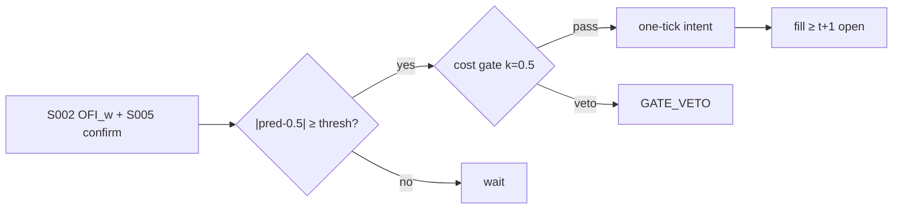

# T030 — Multi-Level OFI Weighted Predictor

Predicts the next-tick price move from depth-weighted order-flow imbalance across the first N book levels, then trades only when the prediction clears the cost gate by the required multiple. The edge is the well-documented one-tick predictability of queue imbalance (Gould–Bonart 2016), monetized with strict cost discipline. Provenance **[D]**.

> Tag law: every numeric literal in prose carries one of `[documented]
> [default] [example] [unverified] [internal-est] [measured]` (legend: Appendix
> i v1.0.0). Constants inside cited formulas inherit the formula's tag.
> Bibliographic years, volumes, pages, arXiv IDs, section numbers, rule codes
> (C1–C12), fail-safe codes (F1–F5), module IDs, and machine-parsed §0 data
> fields are identifiers, not literals, and are exempt.

## §1 Five-minute reviewer card

| Row | Value |
|---|---|
| Module | T030 — Multi-Level OFI Weighted Predictor, v1.1.0 |
| Edge verdict | `plausible` — multi-level OFI predicts one-tick moves (Cont–Kukanov–Stoikov 2014; Gould–Bonart 2016) |
| After-cost | `narrow` — one-tick edge vs taker costs — the cost gate is the strategy |
| Build cost | Tier M = 20–60 h ≈ `$3,000–9,000` [documented] |
| Data cost | Databento US Equities MBP-10: `$199`/mo Standard [documented] + historical `$1.00`/GB, live `$1.20`/GB [documented] — re-verify the plan rate (2026-06-22 pricing update) before budgeting |
| latency_class | seconds |
| risk_class | market |
| Capacity | `$10–30M` before own flow pollutes the imbalance [unverified] |
| Executability | needs L2 and sub-second loop; the heaviest latency demand in TB3 |
| Risk summary | Imbalance flips faster than the loop; predicted tick never covers the spread after fees |
| When it dies | one-tick markets (large-tick stocks the exception — Gould–Bonart); fee hikes |
| Regime gates | R001 (degrades): spread = 1 tick → veto; R002 (degrades): first 15 min → widen threshold; R003 (degrades): vol spike → widen stops |
| Emits | `order_intents` (Appendix C v1.0.0) — OrderTicket intents only, never orders |

## §1.5 Cheapest / least-build path

1. **Prototype hour band:** 8–12 h [example] — S002 OFI z-score consumption + tick-prediction backtest + cost-gated execution.
2. **Cheapest-source row:** min_tier = L2 (depth); latency_class = seconds;
   required_fields = L2 depth (levels `1`–`5`, bid/ask price + size per book event), trades, halt/auction status feed;
   vendor/product = **Databento US Equities MBP-10**; price_band = `$199`/mo Standard [documented, databento.com blog 2025-01]
   + historical `$1.00`/GB, live `$1.20`/GB [documented] — **re-verify the plan rate before budgeting** (Databento's
   2026-06-22 pricing update changed several plan rates [documented]);
   build_or_buy = **build the predictor, buy the depth feed** (the OFI integration lives in S002; no vendor sells the predictor).
3. **Resource budget:** Tier M per cost-model §5 = 20–60 h ≈ `$3,000–9,000` loaded at `$150`/hr [documented]; compute pattern `per_bar (10-s buckets, vectorized polars/numpy)`.
4. **Skip list:** full MBO/ITCH replay (phase 2); cross-impact terms (Cont–Cucuringu–Zhang 2023 verified but contemporaneous cross-impact ≈ 0 once multi-level OFI is integrated — see §T7).
5. **DO-NOT-CUT list:** causality assertions (`assert fill_event >
   signal_event`, no-signal-bar-fills test); COST block + callable
   `expected_cost_bps`; F1–F5 fail-safes + module-state enum; kill-switch
   state machine + re-arm checklist; decision-log audit records;
   bona-fide-intent + self-trade prevention; provenance tags on every numeric
   literal; fixtures + `test_cmd`; secrets via env only.
6. **Escalation gate:** upgrade from cheapest when any holds — predictions live but P&L flat — the cost model needs per-trade attribution; or the Databento plan rate re-verification moves the data cost band.

## §T0 Module contract

### T0.1 Typed signature

```python
def emit(state: ModuleState, signals: list[SignalVector], cfg: Config) -> list[OrderTicket]:
```

`OrderTicket` per Appendix C v1.0.0 (intents only — never wire orders).
`state` is the module-owned named state vector (`ofi_z, position, entry_px, cooldown_until`); `signals` are
canonical SignalVectors (Appendix b v1.0.0) from the consumed S-modules, newest
last; the function emits zero or more intents per bar/event. The module does
**not** recompute OFI — `ofi_z` is S002's `z_iofi` (v1.0.1), consumed verbatim;
the depth-weighted OFI computation is S002's contract, not this module's.
Documented edge cases: no signals → flat, no intents; `UNKNOWN` input signal → restrictive
(halve size / stand down per F1); cooldown active → suppress entry; kill-switch TRIPPED → emit nothing, state
`OFF`.

### T0.2 Config dataclass

| Parameter | Type | Default | Range | Status |
|---|---|---|---|---|
| book_levels | int | `5` | [1, 10] | default — levels consumed from S002 |
| ofi_window_s | int | `10` | [1, 60] | default — S002 bucket window this module reads |
| pred_threshold | float | `0.60` | [0.5, 0.8] | default — S002-side logistic calibration target (not a T030 gate; see §T3) |
| z_entry | float | `2.0` | [1.0, 4.0] | default — matches the S002 default (fixed cross-module) |
| z_exit | float | `0.8` | [0.2, 1.5] | default |
| cost_gate_k | float | `0.50` | [0.5, 2.0] | default — fixture uses the conservative end |
| risk_R_usd | float | `250` | [50, 2000] | default |
| stop_bps | float | `25` | [10, 100] | default |
| vol_floor_mult | float | `2.0` | [1.0, 4.0] | example — stop floor = vol_floor_mult × vol_estimate_bps |
| adv_cap_pct | float | `1.0` | [0.1, 10.0] | default |
| spread_full_bps | float | `2.0` | [0.5, 10.0] | example — COST-block spread input |
| taker_fee_bps | float | `0.30` | [0.0, 1.0] | default — ≡ `$0.0030`/share at the `$100` reference price [documented, Nasdaq Price List] |
| maker_rebate_bps | float | `-0.20` | [-0.5, 0.0] | example — unused while side_exec = taker |
| borrow_bps | float | `0.0` | [0.0, 50.0] | default — see borrow_bps_per_day reason in the COST block |
| impact_k | float | `20.0` | [0.0, 50.0] | example |
| daily_loss_stop_pct | float | `1.0` | [0.25, 3.0] | default |
| cooldown_s | float | `300` | [60, 1800] | default — post-stop-out re-entry cooldown |
| venue | str | `primary` | — | example — primary lit (XNAS reference) |
| side_exec | str | `taker` | taker\|maker | fixed — aggressive take is the module's economics |
| default_side | str | `LONG` | LONG\|SHORT | example — SHORT requires locate_ok (C7) |
| primary_signal | str | `S002` | — | fixed |

All defaults tagged per the tag law (status `default` ⇒ `[default]`); the
reference test's `Config` is pinned to these values.

### T0.3 Canonical schema mapping

Consumed signals → canonical SignalVector (Appendix b v1.0.0), stated once here:

| Producer | Signal field | Canonical field | Notes |
|---|---|---|---|
| S002 v1.0.1 | `z_iofi` | SignalVector.z → `signal_z` on the tape | population z-score of integrated OFI; z_entry = `2.0` [default] |
| S002 v1.0.1 | `edge_bps` | SignalVector.edge_bps | per-trade edge estimate [example] |
| S005 v1.0.0 | confirm flag | SignalVector.confirm | secondary confirmation |
| S084 v1.0.0 | Hasbrouck VAR info share | SignalVector.gate | gate input |

The module consumes S002's integrated OFI z-score; it never recomputes
per-level OFI (that is S002's contract). L2 depth and trades are S002's
inputs, not T030's — the vendor column mapping lives in S002 §S0.3; the
fixture tape below carries only the consumed signal fields plus execution
context (`notional, adv_pct, adv_shares, stop_bps, vol_estimate_bps, urgency,
market_state, daily_pnl_pct`), all [example] synthetic.

### T0.4 Time contract

> Time contract: clock domain UTC, int64 ns; authoritative causality clock =
> `event_ts`; max_skew = `5` s [default]; jitter budget = `1` s [default];
> bar-label = open time; staleness TTL = `15` min [default] for consumed
> signal inputs, `5` s [default] for L2 depth freshness (breach trips the
> kill switch per §T0.7); gap policy = mask, no interpolation; halt/auction
> → discard contributions across reopen.

**Timing box:** `signal@t (10-s bars, America/Chicago) → earliest fill @open(t+1)`

### T0.5 Market-state table

| State | Module behavior |
|---|---|
| CONTINUOUS_TRADING | Evaluate entry/exit rules; emit intents per §T2 |
| HALTED | Cancel working intents; emit nothing; state `UNKNOWN` until clean reopen |
| AUCTION | No new intents; hold intent-side state; state `DEGRADED` |
| CLOSED | Emit nothing; state `OFF` |


### T0.6 Module-state enum + error taxonomy

States per Appendix k v1.0.0: `OK | DEGRADED | UNKNOWN | OFF`. Invalid input →
`UNKNOWN`, never interpolate (Appendix f v1.0.0, F1–F5).

| Failure | State | Alert |
|---|---|---|
| Missing/stale signal input (TTL `15` min [default]) | `UNKNOWN` | page |
| L2 depth stale > `5` s [default] | `UNKNOWN` + kill trip | page |
| Out-of-bounds indicator (F2) | `UNKNOWN` | page |
| Estimator disagreement (F3) | `UNKNOWN` | notify |
| Halt/auction per §T0.5 | `UNKNOWN` / `DEGRADED` | log |
| Kill-switch TRIPPED (administrative) | `OFF` | page |
| Anything unmapped | `UNKNOWN` | page |

### T0.7 Risk contract + kill switch

```yaml
risk_contract:
  per_trade_R: 250            # USD risk budget per trade [example]
  max_adverse_per_trade: 1.0 R [default]  # stop distance multiple [default]
  daily_loss_stop: 2% of equity [default]        # then no new entries; flatten managed risk [default]
  max_gross: 4× equity [default]              # hard gross exposure cap [default]
  kill_conditions:
    - daily P&L ≤ −daily_loss_stop_pct → TRIP (flatten, no new intents)
    - L2 feed stale > `5` s [default] → TRIP (state UNKNOWN)
    - decision-log write failure → TRIP (halt emission)
  enforcement: intraday-hard  # trips are automatic, not advisory [default]
  calibration_recipe: >
    Walk-forward on 60-day blocks [example]: fit thresholds on block t,
    freeze, validate realized shortfall vs predicted on block t+1;
    shrink per-trade R until max drawdown < daily_loss_stop/2 [default].
```

**Kill-switch state machine:** `ARMED → TRIPPED → RECOVERY → ARMED`.

- `ARMED`: normal operation; every bar evaluates the kill conditions.
- `TRIPPED`: any kill condition fires → cancel all working intents
  (`NEW`/`WORKING` → `CANCELLED`, idempotent), flatten managed positions via
  the exit rule, emit nothing new, state `OFF`, log `KILL_TRIP`.
- `RECOVERY`: manual operator review only — no automatic transition.
- `ARMED` (re-entry): only after the re-arm checklist passes in full, logged
  as `KILL_REARM` with the checklist result.

**Re-arm checklist** (all must be true):

- [ ] Feed health green: all §T5 inputs fresh inside the staleness TTL.
- [ ] Kill condition cleared: the tripping metric is back inside limits for `30 min [default]` [default].
- [ ] Decision log reconciled: `KILL_TRIP` record present and hash chain intact.
- [ ] Risk re-check: per-trade R and gross caps re-confirmed against current equity.
- [ ] Operator sign-off: named human approves re-arm (no automatic recovery).

### T0.8 Ops tail

- **Schedule:** continuous intraday loop, US equities regular session
  09:30–16:00 ET; owner: strategy owner (named). Not a batch job — the
  one-tick edge decays in seconds.
- **Health checks:** fixture replay (`test_cmd`) green on deploy; live
  decision-log append monitor; kill-switch state heartbeat every `60` s [default];
  L2 depth age monitor (alert at `3` s [default], trip at `5` s [default]).
- **Alert table:** `UNKNOWN`/`OFF` state transitions page immediately [default];
  kill-trip pages immediately [default]; cooldown-arm logs only.
- **Resource budget:** live loop < `0.5` vCPU [example], < `1` GB RAM per symbol [example];
  nightly calibration/backtest < `2` vCPU-h [example], < `4` GB RAM [example].
- **Runbook stub:** 1) confirm kill-state; 2) inspect decision log for the tripping record; 3) verify feed freshness; 4) re-arm checklist (operator sign-off); 5) re-run fixture; 6) resume.

### T0.9 Secrets (env-only)

- `BROKER_API_KEY (paper venue, env-only)`
- `DATA_API_KEY (env-only)` via environment only. No secrets in this file, fixtures, or
logs (CI secrets-grep).

### T0.10 May / must-NOT

> **May:** emit `OrderTicket` intents per Appendix C v1.0.0; track intent-side
> state (`NEW → WORKING → FILLED / CANCELLED / PARTIAL`); issue cancel-replace
> via new tickets with new `ticket_id`s. **Must-NOT:** place orders on any
> venue, hold broker/exchange sessions, net intents into orders inside the
> strategy, treat the intent-side state machine as broker wire truth, or emit
> prices/share-counts/notionals outside an `OrderTicket`.

## §T1 Legacy (subsumed by §1)

Legacy §T1 content is the §1 reviewer card above; this header is retained so
section numbering stays frozen.

## §T2 Specification

**Timing box:** `signal@t (10-s bars, America/Chicago) → earliest fill @open(t+1)`

### Universe

US equities with deep L2 books; quoted spread ≥ `2` ticks [example].
One-tick-spread (large-tick) names are the documented Gould–Bonart edge case —
R001 stands them down unless a per-name calibration shows the imbalance edge
clearing taker fees (unverified lead, see §T10).

### Entry rule (Boolean — no prose-only conditions)

```
z         = S002.z_iofi                       # consumed verbatim (signal_z on the tape) [fixed]
spread_ok = spread_ticks >= 2                 # universe filter [example]
cool_ok   = now_ns >= cooldown_until          # post-stop re-entry cooldown [default]
locate    = (side == SHORT) ? locate_ok : true # C7

ENTER_LONG  = (z >=  z_entry) AND spread_ok AND cool_ok AND (expected_cost_bps(...) <= cost_gate_k * edge_bps)
ENTER_SHORT = (z <= -z_entry) AND spread_ok AND cool_ok AND locate      AND (expected_cost_bps(...) <= cost_gate_k * edge_bps)
```

`z_entry = 2.0` [default] — pinned to the S002 default (fixed cross-module).
`pred_threshold = 0.60` [default] is S002's logistic calibration target, not a
T030 gate; the pred↔z mapping is per-name calibration data (unverified until
fitted — see §T10).

### Exits (with post-exit cooldown)

```
tick realized (|z| <= z_exit) -> FLAT, no cooldown            # normal one-tick exit [default]
adverse >= stop_bps            -> FLAT, cooldown_until = now + 300 s [default]   # stop-out [default]
exits are never cost-gated [default]
```

### Position sizing (fenced function)

```python
def size_ofi(risk_budget_R, stop_bps, vol_estimate_bps, px, adv_shares, adv_cap_pct, cost_usd):
    """shares = f(risk_budget_R, stop_distance, vol_estimate, ADV_cap, cost)."""
    stop_eff = max(stop_bps, 2.0 * vol_estimate_bps)   # vol floor: never size on a stop
                                                      # tighter than 2x micro-vol [example]
    budget = max(risk_budget_R - cost_usd, 0.0)        # cost-aware budget [example]
    raw = budget / (stop_eff / 1e4 * px)
    return max(0, min(int(raw), int(adv_cap_pct / 100 * adv_shares)))
```

### Risk limits

| Limit | Value |
|---|---|
| Max per-tick notional | `10%` of top-of-book depth [example] |
| Trades per minute | `6` [default] (message-rate guard; the C3 venue guard is `120` msgs/min [default]) |
| Daily loss stop | `1%` [default] |
| Max adverse per trade | `1.0` R [default] — CI gate: backtest max adverse excursion ≤ `1.0` R |
| Post-stop-out cooldown | `300` s [default] — re-entry suppressed until `cooldown_until` |

### COST block (single source of truth)

Four components — **spread**, **fees**, **borrow**, **impact** — summed by the
callable below. Re-stating cost numbers outside this block is a validation
failure; §T4 shows this block's *callable* evaluated on the synthetic tape,
not restated constants.

| Component | Value (bps) | Basis |
|---|---|---|
| Spread (half) | `1.00` | [example] |
| Fees (taker) | `0.30` | [default] — Nasdaq Price List: Fees to Remove Liquidity, shares ≥ `$1.00`: all MPIDs `$0.0030`/share [documented, nasdaqtrader.com]; ≡ `0.30` bps at the `$100` reference price. Shares < `$1.00`: `0.30%` of dollar volume (`30` bps) [documented] |
| Borrow | `0.00` | `borrow_bps_per_day = 0.00` [example] — reason: one-tick holding, never overnight; intraday shorts are closed the same session so no borrow accrues |
| Impact | `k·√(adv_pct/100)`, k=`20.0` | [example] |
| **Total reference (one-way)** | `2.71` bps [example] | [example] |

`fee_schedule_as_of`: `2026-09-10` (retrieval date [internal-est]; the venue's
effective date is [unverified] — re-pull the live Nasdaq Price List and pin
the effective date before production). `side`: `taker`; venue/tier/source:
primary lit, XNAS reference [example].

```python
def expected_cost_bps(notional, adv_pct, venue, side, urgency, cfg):
    """COST-block callable. Taker economics: one-tick edge must clear this."""
    spread = cfg.spread_full_bps / 2.0
    fee = cfg.taker_fee_bps
    borrow = cfg.borrow_bps                            # 0 in fixture; re-price shorts live
    impact = cfg.impact_k * math.sqrt(max(adv_pct, 0.0) / 100.0)
    if urgency == "high":
        impact *= 1.5
    return spread + fee + borrow + impact
```

### Execution / fill model table

| Aspect | Assumption |
|---|---|
| Fill venue | primary lit, aggressive take |
| Loop latency | signal → intent ≤ `1` s [example] (latency_class = seconds) |
| Slippage model | one-tick prediction ± queue-position slippage |
| Adverse-fill assumption | fills assumed `100%` at the touch, no price improvement [example] |
| Impact model | the COST-block callable above (k=`20.0` [example]) |
| Partial fills | cancel remainder (tick horizon) |
| Halt behavior | cancel working; state UNKNOWN until clean reopen |

Fine-grained fill behavior is synthetic and labeled `simulated only — requires MBO/ITCH`:
no MBO/ITCH feed is consumed by this module; any fill realism beyond the
mid-price ± half-spread fill model above would require MBO/ITCH data.

### Robustness

Perturb thresholds ±20% [example]; the reference behavior (entry/exit intents, gate blocks, kill trip) must be invariant; degrade entry→no-trade on indicator breach.

### Compliance sub-block (C1–C12)

| Code | Rule: trigger → check → action → log |
|---|---|
| C1 | STP + self-match prevention: trigger = intent could match our own resting interest → check = every ticket carries `self_trade_prevention: true`; maker modules compare against own open tickets → action = cancel own resting quote before posting the aggressive side; cancel-replace via new `ticket_id` only → log = `COMPLIANCE_BLOCK` with rule code `C1` |
| C2 | Bona-fide intent: trigger = entry rule fires → check = cost gate passes AND qty within risk limits AND (SHORT ⇒ `locate_ok`) → action = veto the intent if any check fails; no quote entered without intent to trade → log = `GATE_VETO` with the failed check |
| C3 | Message-rate / cancel-to-trade: trigger = intents+ cancels per symbol per minute exceed `120` [default] → check = rolling `60`-s [default] message counter → action = throttle to `1` intent per `10` s [default] and alert → log = `COMPLIANCE_BLOCK` with the counter value |
| C4 | Pre-trade fat-finger trio: trigger = any new intent → check = (a) limit within `±10%` of reference [default], (b) ticket notional ≤ ``$2M`` [default], (c) ≤ `20` tickets per `1 min` [default] → action = block the ticket, alert → log = `COMPLIANCE_BLOCK` with the breached leg |
| C5 | Decision-log schema (Appendix g v1.0.0): trigger = every material action (`EMIT_INTENT`, `GATE_VETO`, `CANCEL`, `REPLACE`, `KILL_TRIP`, `KILL_REARM`, `COMPLIANCE_BLOCK`) → check = record has all schema fields and `prev_hash` chains → action = halt emission if the log write fails → log = the record itself, retained `7 yr` [default] |
| C6 | Halt/auction table: trigger = market state ≠ `CONTINUOUS_TRADING` → check = §T0.5 table → action = `HALTED`: cancel working intents, emit nothing; `AUCTION`: no new intents; `CLOSED`: state `OFF` → log = state-transition record |
| C7 | Locate check (short sales): trigger = `SHORT` intent → check = `locate_ok` from the pre-open easy-to-borrow list or desk locate; Reg-SHO threshold securities hard-blocked → action = veto without locate → log = `GATE_VETO` with code `C7`. Intraday long/short; short leg requires locate_ok (C7). |
| C8 | Public-dissemination gate: trigger = any export of signals/intents outside the firm → check = review gate sign-off → action = block unreviewed exports → log = `COMPLIANCE_BLOCK` |
| C9 | Data-entitlement assertions (Appendix j v1.0.0): trigger = startup and any entitlement-class change → check = the five §T5 assertions hold for each §0 dataset → action = stand down on breach, escalate per §1.5 → log = entitlement review record |
| C10 | Post-exit cooldown: trigger = stop-out exit or compliance block → check = `now_ns >= cooldown_until` (`300` s [default] after a stop-out) → action = suppress re-entry until the cooldown elapses → log = `GATE_VETO` with code `C10` |
| C11 | Kill-switch integration: trigger = `TRIPPED` → check = all working intents transitioned `NEW`/`WORKING` → `CANCELLED` (idempotent) → action = no new intents until `ARMED` via the §T0.7 checklist → log = `KILL_TRIP` / `KILL_REARM` records |
| C12 | C12 Tick-manipulation guard: trigger = quote-to-trade ratio > 100:1 [example] → check = message-rate review → action = throttle → log with code `C12` |

### Parameter table

| Parameter | Symbol | Value | Tag | Sensitivity |
|---|---|---|---|---|
| Book levels | N | `5` | [default] | medium — deeper levels add noise |
| OFI window | W | `10` s | [default] | high — too long dilutes the tick signal |
| Entry z | z_entry | `2.0` | [default] | critical — the trade/no-trade knob; pinned to the S002 default |
| Exit z | z_exit | `0.8` | [default] | medium — one-tick exit band |
| Cost-gate k | cost_gate_k | `0.50` | [default] | critical — fixture uses the strict end of [0.25, 2.0] |
| Stop | stop_bps | `25` | [default] | high — sets the risk unit and the sizing denominator |
| Cooldown | cooldown_s | `300` s | [default] | medium — post-stop-out re-entry suppression |
| Vol floor mult | vol_floor_mult | `2.0` | [example] | low — binds only in dead-quiet tapes |

### Timing box

`signal@t (10-s bars, America/Chicago) → earliest fill @open(t+1)`

## §T3 Math + normative pseudocode

Cont–Kukanov–Stoikov (2014) [documented]: order-flow imbalance predicts the
contemporaneous price change linearly. Gould–Bonart (2016) [documented]: queue imbalance
predicts the *next* tick, strongest in large-tick stocks. Hasbrouck (1991) [documented]
VAR gives the information-share interpretation. S002 (v1.0.1) integrates the
first 5 levels [default] into `z_iofi`; this module consumes `z_iofi`
verbatim and trades only when |z| ≥ `z_entry` [default] and the cost gate
passes. `pred_threshold = 0.60` [default] is S002's logistic calibration
target — the pred↔z mapping is per-name calibration data, not a T030 gate.

**Normative pseudocode** (pseudocode is normative; prose is commentary):

```
def emit(state, signals, cfg):
    if kill.state != "ARMED": return [], state.off()      # TRIPPED -> emit nothing
    sig = primary(signals, "S002")                        # z_iofi + edge_bps
    if sig is None or invalid(sig): return [], state.unknown()  # F1: never interpolate
    z = sig.z
    if state.position != 0:
        adverse = (state.entry_px - last_price()) / state.entry_px * 1e4 * sign(state.position)
        if adverse >= cfg.stop_bps:                       # stop-out [default]
            t = exit_ticket(state)
            state.cooldown_until = now_ns() + cfg.cooldown_s * 1e9
            assert fill_event > signal_event
            return [t], state.flat()
        if abs(z) <= cfg.z_exit:                          # one-tick exit; never cost-gated
            t = exit_ticket(state)
            assert fill_event > signal_event
            return [t], state.flat()
        return [], state.ok()
    if now_ns() < state.cooldown_until: return [], state.ok()   # post-stop cooldown
    side = cfg.default_side if z >= cfg.z_entry else ("SHORT" if z <= -cfg.z_entry else None)
    if side is None: return [], state.ok()
    if side == "SHORT" and not locate_ok(): log("GATE_VETO", code="C7"); return [], state.ok()
    cost = expected_cost_bps(notional_est(), adv_pct(), venue(), "taker", "normal", cfg)
    # ^^^ normative cost-gate predicate: expected_cost_bps(...) <= k * edge_bps
    if cost <= cfg.cost_gate_k * sig.edge_bps:
        qty = size_ofi(cfg.risk_R_usd - cost_usd(cost), cfg.stop_bps, vol_estimate(),
                       last_price(), adv_shares(), cfg.adv_cap_pct, cost_usd(cost))
        t = OrderTicket.intent(side, qty=qty, limit=None)  # marketable taker intent
        t.intent_ts = sig.computed_at
        assert fill_event > signal_event  # t->t+1 causality: no-signal-bar fills
        return [t], state.open(side, entry_px=last_price())
    log("GATE_VETO", cost=cost); return [], state.ok()
```

Causality: every feature uses inputs with `event_ts ≤ t` only; the earliest
fill for a bar-`t` intent is bar `t+1`'s open. Mandatory unit test:
no-signal-bar fills.

## §T4 Worked example (fixture-backed)

- Tape: `modules/fixtures/T030_tape.csv` — `# TYPE: validation-run`;
  `12` [example] synthetic bars (seed `4300` [example]); `event_ts`/`asof_ts` int64 ns
  UTC; `signal_z` = consumed S002 `z_iofi` [example]; `vol_estimate_bps` =
  `12.0` [example] on every bar; every number synthetic.
- Expected outputs: `modules/fixtures/T030_expected.csv` — per-bar intent,
  quantity, the **cost-function call** (`expected_cost_bps` inputs → bps →
  dollars), cost-gate verdict, and module state.
- Tolerance: `1e-9` [default] on floats; integer quantities exact.
- Acceptance tests (`modules/tests/test_T030.py` — `7` [default] tests):
  1. TYPE header + columns present (incl. `vol_estimate_bps`); 2. fixture recomputes to expected
  (reference `process_bar` vs expected CSV); 3. no-signal-bar fills
  (`assert fill_event > signal_event`); 4. cost-gate predicate passes on large edge, blocks on tiny edge (`k = 0.5` [default]);
  5. kill-switch trip blocks intents, re-arm checklist restores `ARMED`;
  6. invalid input (halted/invalid bar) → `UNKNOWN`, no intents;
  7. stop-out flattens and arms the `300`-s [default] post-stop cooldown; the cooldown suppresses a strong entry signal until it elapses.
- `test_cmd`: `python3 -m pytest modules/tests/test_T030.py -q` → exits `0` [default].

**Cost-function calls on the tape** (the COST-block callable evaluated on
synthetic rows — inputs → bps → dollars; all values [example]):

| Bar | `expected_cost_bps` inputs | Components → total → $ | Cost gate `expected_cost_bps(...) <= k * edge_bps` | Intent / state |
|---|---|---|---|---|
| `0` | notional=`100000` [example], adv_pct=`0.5` [example], venue=`primary`, side=`taker`, urgency=`normal` | spread `1.0` + fee `0.3` + borrow `0.0` + impact `1.41` = `2.71` bps → `$27.14` | `2.0` edge, k=`0.5` [default] → `2.71 ≤ 1.0` BLOCK | `HOLD` / `OK` |
| `3` | notional=`100000` [example], adv_pct=`0.5` [example], venue=`primary`, side=`taker`, urgency=`normal` | spread `1.0` + fee `0.3` + borrow `0.0` + impact `1.41` = `2.71` bps → `$27.14` | `10.856854249492379` edge, k=`0.5` [default] → `2.71 ≤ 5.43` PASS | `LONG` / `OK` |
| `5` | notional=`100000` [example], adv_pct=`0.5` [example], venue=`primary`, side=`taker`, urgency=`normal` | spread `1.0` + fee `0.3` + borrow `0.0` + impact `1.41` = `2.71` bps → `$27.14` | exits are never cost-gated [default] | `SELL` / `OK` (stop-exit) |
| `6` | notional=`100000` [example], adv_pct=`0.5` [example], venue=`primary`, side=`taker`, urgency=`normal` | spread `1.0` + fee `0.3` + borrow `0.0` + impact `1.41` = `2.71` bps → `$27.14` | cooldown active — entry suppressed | `HOLD` / `OK` (cooldown) |
| `7` | notional=`100000` [example], adv_pct=`0.5` [example], venue=`primary`, side=`taker`, urgency=`normal` | spread `1.0` + fee `0.3` + borrow `0.0` + impact `1.41` = `2.71` bps → `$27.14` | cooldown active — entry suppressed (z=`2.6` would otherwise qualify) | `HOLD` / `OK` (cooldown) |
| `9` | notional=`100000` [example], adv_pct=`0.5` [example], venue=`primary`, side=`taker`, urgency=`normal` | spread `1.0` + fee `0.3` + borrow `0.0` + impact `1.41` = `2.71` bps → `$27.14` | kill tripped | `HOLD` / `OFF` |

**Hand-checks.** Row `3` (entry): cost-aware budget = `250 − 27.14` = `222.86` [example];
stop_eff = max(`25`, `2 × 12`) = `25`; qty = `222.86 / (25/1e4 × 99.54)` =
`222.86 / 0.24885` = `895.6` → `895` shares [example] (ADV cap `1%` × `2,000,000` =
`20,000` [example] not binding); ticket `T030-0003`, side `LONG`, marketable (`None` limit — taker) intent.
Row `5` (stop-exit): adverse = `(99.54 − 99.22)/99.54 × 1e4` = `32.15` bps [example]
≥ stop `25` [default] → stop-out; qty = `222.86 / (0.0025 × 99.22)` = `898.5` →
`898` [example], side `SELL`, ticket `T030-0005s`; `cooldown_until` = bar-5
`event_ts` + `300` s [default]. Rows `6`–`7` (cooldown): `now < cooldown_until` →
no entry even at z = `2.6` [example]. Row `8` (halt): `HALTED` → `UNKNOWN`,
no intents. Row `9` (kill): daily P&L `-1.1%` [example] ≤ −stop (`1.0%` [default]) →
`ARMED → TRIPPED`, state `OFF`, no intents. Causality: entry intent at row `3`
has `intent_ts` = bar-3 `event_ts`; the earliest fill is bar `4`'s open; the
stop-exit intent at row `5` fills no earlier than bar `6`'s open — the test
asserts `fill_event > signal_event` on every intent row.

**Where the example is optimistic.** Costs are the COST-block model, not realized fills; capacity, borrow squeezes, and regime shifts are not in the tape.

## §T5 Dependencies + data

### Consumed signals (from deps.yaml — machine edge list)

| Signal | Version pin | Role |
|---|---|---|
| S002 | 1.0.1 | primary |
| S005 | 1.0.0 | confirm |
| S084 | 1.0.0 | gate |

### Pinned formula excerpts (≤10 lines each, CI hash-checked)

**S002** (v1.0.1): event-time per-level OFI (Cont et al. convention) summed over
the bucket → integrated OFI (reference = equal-weight sum); `z_iofi` =
population z-score over the trailing window (`σ = 0 ⇒ z = 0`); `z_entry = 2.0`
[default] — this module consumes `z_iofi` verbatim as `signal_z` [documented].
**S084** (v1.0.0): Hasbrouck VAR information share for the gate [documented].

### Data required

| Field | Type | Granularity | Source tier | Notes |
|---|---|---|---|---|
| L2 depth levels 1–5 | float/int | real-time | L2FEED | OFI computation |
| trade price/size/side | float/int/char | tick | TRADES | labeling |

**Data rights row** (Appendix j v1.0.0): L2 depth is the binding data cost —
Databento US Equities MBP-10 per §1.5; entitlements per venue; re-assert at
startup [unverified — confirm with contract].

## §T6 Local build + buy vs build

The OFI integration is S002's contract — this module consumes `z_iofi`; the
work here is the cost-gated entry/exit state machine, the stop-out + cooldown
logic, and the kill-switch wiring. The sub-second loop needs care, not scale.

| Route | What you get | Verdict |
|---|---|---|
| Build | cost-gated tick state machine in-house | recommended |
| Buy feed | Databento US Equities MBP-10 (§1.5) | required |
| Buy execution | DMA with colocation | needed for the latency class |

**Verdict:** Build the predictor; rent the pipe. Without colocation-adjacent latency the one-tick edge is theoretical.

## §T7 Efficacy — documented evidence

| Study / source | Market & period | Metric | Before/after cost | Caveat |
|---|---|---|---|---|
| Cont–Kukanov–Stoikov (2014) | LOB data | OFI predicts price changes | before cost | contemporaneous, not next-tick |
| Gould–Bonart (2016) | LOB data | queue imbalance predicts next tick | before cost | large-tick stocks |
| Cont–Cucuringu–Zhang (2023) | US equities, multi-asset | lagged cross-asset OFIs improve short-horizon return forecasts (R² + economic incentives) | before cost | contemporaneous cross-impact ≈ 0 once multi-level OFI is integrated — cross-impact stays a lead, not a dependency |
| Hasbrouck (1991) | US equities | trade information content via VAR | before cost | identification assumptions |

**Selection disclosure:** Studies below are the chapter's documented sources only — no post-hoc selection from a wider literature search.

**Capacity & decay.** Edge decays with crowding and regime shifts; treat any printed Sharpe as a pre-cost, in-sample-era artifact unless the source says otherwise.

**Honest bottom line.** Honest bottom line: the documented predictability is real and tiny — after taker fees and the spread, the remaining edge fits inside the estimation error. Trade it only with the cost gate at k ≤ `0.5` [default] and per-trade attribution.

## §T8 Failure modes & pitfalls

| # | Trigger → Detect → Action → Recovery | check: |
|---|---|---|
| 1 | Imbalance flip (signal inverts before fill) → detect pred sign change → cancel working → log | check: flip rate |
| 2 | Stale L2 (feed lag) → detect TTL breach → state UNKNOWN, no intents → resume on fresh depth | check: depth age |
| 3 | Fee/rebate change → detect monthly → re-price COST block → log | check: schedule diff |
| 4 | Own-flow pollution → detect participation > 5% [example] → halve size → alert | check: participation |
| 5 | Kill-switch trip (daily P&L ≤ −stop) → detect pnl breach → flatten, no new intents until re-arm checklist → log `KILL_TRIP` | check: kill heartbeat + decision-log hash chain |
| 6 | Implausible signal (|z| > `10` [example]) → detect z bounds breach → `UNKNOWN`, no intents (F2) → resume on sane z | check: z bounds |

## §T9 Regime gates + visuals

**Provisional regime-gate machine** (restrictive default; `regime_ids` stay
empty until the R001–R050 annotation pass):

| regime_id | direction | mechanism | condition | action | min_lag | unknown_behavior |
|---|---|---|---|---|---|---|
| R001 | degrades | one-tick spread leaves no room for the taker edge after fees | spread == 1 tick | veto | immediate | restrictive |
| R002 | degrades | volatile open: imbalance flips faster than the loop | first 15 min of session | widen_stops (threshold to `0.70` [default]) | 1 day [default] | restrictive |
| R003 | degrades | micro-vol spike widens the adverse tail beyond the stop | vol_estimate_bps > `2` × stop_bps [example] | widen_stops | 1 day [default] | restrictive |



## §T10 Source log + unverified leads

**Sources** (citable facts only):

1. Cont, R., Kukanov, A. & Stoikov, S. (2014). "The Price Impact of Order Flow Imbalance." (the OFI foundation — S002's home)
2. Gould, M. D. & Bonart, J. (2016). "Queue Imbalance as a One-Tick-Ahead Price Predictor in a Limit Order Book." arXiv:1512.03492 — https://arxiv.org/abs/1512.03492
3. Hasbrouck, J. (1991). "Measuring the Information Content of Stock Trades." *Journal of Finance* 46(1): 179–207. https://doi.org/10.1111/j.1540-6261.1991.tb03749.x
4. Cont, R., Cucuringu, M. & Zhang, C. (2023). "Cross-Impact of Order Flow Imbalance in Equity Markets." arXiv:2112.13213v4 — https://arxiv.org/abs/2112.13213 [documented — citation verified 2026-09-10; 33 pages, 11 tables]. Finding: lagged cross-asset OFIs improve short-horizon return forecasts (R² + economic incentives); contemporaneous cross-impact ≈ 0 once multi-level OFI is integrated. Status: lead for a cross-asset upgrade path, not a dependency.

**Chatbot source log.** Grok answered the Q-batch (2026-09-10); all claims independently verified or labeled unverified. Chatbot output is leads, never facts.

**Unverified leads** (chatbot-only — never in evidence tables):

- Cont–Cucuringu–Zhang (2023): the *economic-incentive* (after-cost) result is asserted from the abstract only — the full paper's cost assumptions are unverified; read before building on it.
- Grok (2026-09-10): L2 vendor pricing bands — *unverified chatbot claims*; verify before budgeting.
- Databento US Equities plan rate: 2026-06-22 pricing update changed several plan rates [documented, databento.com/blog/updates-to-subscription-pricing] — re-verify the current Standard-plan rate before budgeting.
- Nasdaq Price List effective date: the `$0.0030`/share removal fee is [documented] from the live price list as retrieved 2026-09-10; the venue's effective date is unverified — pin it before production.
- pred↔z mapping: S002's `pred_threshold = 0.60` [default] is a calibration target; the per-name mapping from logistic pred to `z_iofi` entry threshold is unverified until fitted on the venue's own book data.

---

## GROK-NEEDED (exact questions for web-unanswerable items)

1. For Databento US Equities (MBP-10), what is the current Standard-plan monthly rate after the 2026-06-22 pricing update, and what is the included L2 historical depth (the 2025-01 blog said 1 month of L2 history)? Quote the plan page verbatim with the effective date.
2. For the Nasdaq Price List — Trading (nasdaqtrader.com/trader.aspx?id=pricelisttrading2): what is the effective date of the "Fees to Remove Liquidity, Shares Executed at or above $1.00: All MPIDs $0.0030" line as of 2026-09-10, and has the sub-$1.00 removal fee (0.30% of dollar volume) changed in 2026?
3. Does Databento's DBEQ.BASIC / US Equities MBP-10 historical product carry a per-GB charge for backtest pulls on top of the Standard subscription, and what is the current $/GB rate (S002 cites `$1.00`/GB historical — confirm it is still current)?
4. For a one-tick-hold intraday short strategy on Nasdaq-listed names: is there any exchange or clearing fee beyond the taker removal fee that accrues on the short leg (locate fees, hard-borrow premiums intraday)? Quote the fee schedule lines.
5. Gould–Bonart (2016) large-tick finding: in current US large-tick names, what fraction of the trading day is the quoted spread pinned at 1 tick — i.e., is there any room for a taker one-tick edge, or is the R001 veto (stand down at 1-tick spread) empirically correct?

---

## Appendix — AI build prompt (T030)

Copy-paste into any chat agent:

> Build module **T030 — Multi-Level OFI Weighted Predictor** v1.1.0 per `notes/module-template.md` v1.0.0 and
> this file's §T0 contract.
> Cheapest path (§1.5): prototype 8–12 h [example]; cheapest data
> Databento US Equities MBP-10 (`$199`/mo Standard [documented] — re-verify the rate after the 2026-06-22 pricing update);
> compute pattern `per_bar (10-s buckets, vectorized polars/numpy)`.
> Implement `emit(state, signals, cfg) -> list[OrderTicket]` (Appendix c
> v1.0.0) with the §T3 normative pseudocode, including the kill-switch check,
> the cost-gate predicate `expected_cost_bps(...) <= k * edge_bps`, the
> stop-out exit with its `300`-s [default] post-stop cooldown, and `assert
> fill_event > signal_event`. Consume S002 v1.0.1's `z_iofi` verbatim —
> never recompute OFI here. Emit intents only — never place orders. Wire F1–F5
> (Appendix f v1.0.0): invalid input → `UNKNOWN`, never interpolate. Kill
> switch `ARMED → TRIPPED → RECOVERY → ARMED` with the §T0.7 re-arm checklist.
> Log decisions per Appendix g v1.0.0. Secrets via env only. Run the fixture
> `modules/fixtures/T030_tape.csv` (`# TYPE: validation-run`) against
> `modules/fixtures/T030_expected.csv` (tolerance `1e-9` [default]).
> **Definition of done:** `python3 -m pytest modules/tests/test_T030.py -q` exits `0` [default] (`7` [default] tests). Tag every numeric literal
> you add with the unified enum (Appendix i v1.0.0); put anything unverifiable
> in §T10 unverified leads.
