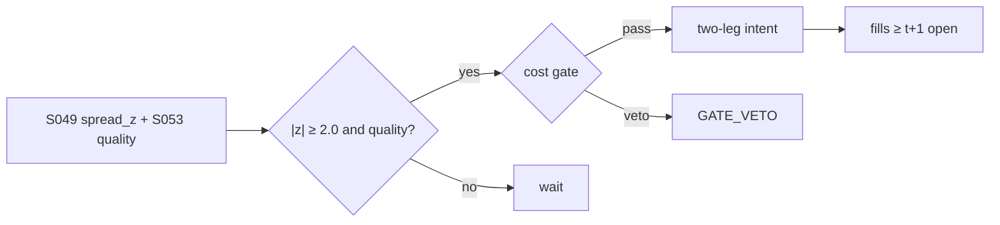

# T031 — Distance Pairs + Quality Filter

Classic Gatev–Goetzmann–Rouwenhorst distance pairs with a quality filter: form pairs on minimum normalized price distance over the formation window, trade the 2-sigma divergence, and require the S053 quality gate (liquidity, borrow availability, no corporate action) before any intent. The filter exists because Do–Faff (2012) show costs eat naive pairs. Provenance **[D]**.

> Tag law: every numeric literal in prose carries one of `[documented]
> [default] [example] [unverified] [internal-est] [measured]` (legend: Appendix
> i v1.0.0). Constants inside cited formulas inherit the formula's tag.
> Bibliographic years, volumes, pages, arXiv IDs, section numbers, rule codes
> (C1–C12), fail-safe codes (F1–F5), module IDs, and machine-parsed §0 data
> fields are identifiers, not literals, and are exempt.

## §1 Five-minute reviewer card

| Row | Value |
|---|---|
| Module | T031 — Distance Pairs + Quality Filter, v1.1.0 |
| Edge verdict | `INSUFFICIENT-EVIDENCE` — pre-cost edge documented only for 1962–2002 (Gatev et al. 2006); the cited decay papers document after-cost fragility, not a live edge |
| After-cost | `narrow` — documented decay (Do–Faff 2010); after-cost profits need the quality filter and honest costing |
| Build cost | Tier M = 20–60 h ≈ `$3,000–9,000` [documented] |
| Data cost | daily OHLCV free (Alpaca IEX tier, $0/mo [documented]); borrow list indicative — verify before budgeting [unverified] |
| latency_class | end-of-day |
| risk_class | market |
| Capacity | `$100–500M` in large-cap pairs before divergence half-lives stretch [unverified]; `max_notional = participation_cap × ADV × spread_regime` — calibrate participation_cap per pair before sizing up |
| Executability | the simplest build in TB4 — daily bars and a z-score |
| Risk summary | Pair divergence is often a broken thesis (merger, fraud, delisting) — the quality filter is the risk control |
| When it dies | single-name events; crowded unwinds (August 2007); persistent post-2010 decay |
| Regime gates | stand down pairs with corporate actions; halve size when pair universe volatility > `2×` median [example] |
| Emits | `order_intents` (Appendix C v1.0.0) — OrderTicket intents only, never orders |

## §1.5 Cheapest / least-build path

1. **Prototype hour band:** 4–6 h [example] — distance formation + z-score trading + quality screen on daily bars.
2. **Cheapest-source row:** min_tier = DAILY (OHLCV); latency_class = end-of-day;
   required_fields = daily close, volume; corporate-action calendar; borrow list;
   vendor/product = Alpaca Market Data API `v2/stocks/bars` 1Day (IEX feed),
   `GET /v2/stocks/{symbol}/bars?timeframe=1Day`, historical since 2016 [documented,
   third-party 2026]; price_band = `$0`/mo free IEX tier [documented, third-party
   2026] (SIP consolidated feed `$99`/mo [documented, third-party 2026] if IEX
   coverage is insufficient); borrow via broker easy-to-borrow list (indicative —
   verify before budgeting) [unverified]; build_or_buy = **build**.
3. **Resource budget:** Tier M per cost-model §5 = 20–60 h ≈ `$3,000–9,000` loaded at `$150`/hr [documented]; compute pattern `per_bar` (vectorized batch, polars/numpy).
4. **Skip list:** intraday pairs; sector-neutral optimization.
5. **DO-NOT-CUT list:** causality assertions (`assert fill_event >
   signal_event`, no-signal-bar-fills test); COST block + callable
   `expected_cost_bps`; F1–F5 fail-safes + module-state enum; kill-switch
   state machine + re-arm checklist; decision-log audit records;
   bona-fide-intent + self-trade prevention; provenance tags on every numeric
   literal; fixtures + `test_cmd`; secrets via env only.
6. **Escalation gate:** upgrade from cheapest when any holds — live divergence trades show persistent adverse drift; universe expanded to mid-caps; IEX coverage gaps force the `$99`/mo SIP tier [documented, third-party 2026]; borrow needs a paid daily feed (see GROK-NEEDED).

## §T0 Module contract

### T0.1 Typed signature

```python
def emit(state: ModuleState, signals: list[SignalVector], cfg: Config) -> list[OrderTicket]:
```

`OrderTicket` per Appendix C v1.0.0 (intents only — never wire orders).
`state` is the module-owned named state vector (`pair_id, spread_z, position, quality_ok`); `signals` are
canonical SignalVectors (Appendix b v1.0.0) from the consumed S-modules, newest
last; the function emits zero or more intents per bar/event. Documented edge
cases: no signals → flat, no intents; `UNKNOWN` input signal → restrictive
(halve size / stand down per F1); kill-switch TRIPPED → emit nothing, state
`OFF`. 

### T0.2 Config dataclass

| Parameter | Type | Default | Range | Status |
|---|---|---|---|---|
| sid | str | `"T031"` | — | fixed |
| primary_signal | str | `"S049"` | — | fixed |
| formation_days | int | `252` | [60, 504] | [default] |
| z_entry | float | `2.0` | [1.5, 3.0] | [default] |
| z_exit | float | `0.5` | [0.0, 1.0] | [default] |
| z_stop | float | `4.0` | [2.5, 6.0] | [default] |
| timeout_sessions | int | `60` | [10, 252] | [default] |
| cooldown_ns | int | `86400000000000` (1 session) | — | [default] |
| cost_gate_k | float | `0.50` | [0.1, 1.0] | [default] |
| risk_R_usd | float | `250.0` | [50, 2500] | [example] |
| stop_bps | float | `25.0` | [5, 200] | [example] |
| adv_cap_pct | float | `1.0` | [0.1, 10.0] | [default] |
| spread_full_bps | float | `3.0` | [1, 10] | [example] |
| taker_fee_bps | float | `3.0` | [0, 10] | [documented] — Nasdaq `$0.0030`/share remove fee ÷ `$100` reference price (fee_schedule_as_of `2026-09-10`) |
| maker_rebate_bps | float | `-0.2` | [-3, 0] | [example] |
| side_exec | str | `"taker"` | taker\|maker | [default] |
| borrow_bps_per_day | float | `0.1984` | [0, 50] | [example] — `50`/252 annualized |
| assumed_hold_days | int | `10` | [1, 60] | [default] |
| impact_k | float | `25.0` | [0, 100] | [example] |
| daily_loss_stop_pct | float | `1.0` | [0.25, 3.0] | [default] |
| venue | str | `"primary"` | — | [example] |
| default_side | str | `"LONG"` | BUY\|SHORT\|LONG | [default] — collapsed single-leg fixture convention; production emits BUY loser + SHORT winner |

All defaults tagged per the tag law (status `default` ⇒ `[default]`). This table is the
single source for parameter defaults; the `Config` in `modules/tests/test_T031.py` mirrors it exactly.

### T0.3 Canonical schema mapping

Vendor columns → canonical Event/Bar schema (Appendix a v1.0.0), stated once here:

| Vendor column | Canonical field | Notes |
|---|---|---|
| `c` | Bar: daily | close per leg |
| `volume` | Bar: daily | liquidity screen |
| corporate actions | Event | pair-break detector |

### T0.4 Time contract

> Time contract: clock domain UTC, int64 ns; authoritative causality clock =
> `event_ts`; max_skew = `5` s [default]; jitter budget = `1` s [default];
> bar-label = open time; staleness TTL = `15` min [default]; gap policy = mask, no
> interpolation; halt/auction → discard contributions across reopen.

**Timing box:** `signal@t (daily bars, America/Chicago) → earliest fill @open(t+1)`

### T0.5 Market-state table

| State | Module behavior |
|---|---|
| CONTINUOUS_TRADING | Evaluate entry/exit rules; emit intents per §T2 |
| HALTED | Cancel working intents; emit nothing; state `UNKNOWN` until clean reopen |
| AUCTION | No new intents; hold intent-side state; state `DEGRADED` |
| CLOSED | Emit nothing; state `OFF` |


### T0.6 Module-state enum + error taxonomy

States per Appendix k v1.0.0: `OK | DEGRADED | UNKNOWN | OFF`. Invalid input →
`UNKNOWN`, never interpolate (Appendix f v1.0.0, F1–F5).

| Failure | State | Alert |
|---|---|---|
| Missing/stale input (TTL `15` min [default]) | `UNKNOWN` | page |
| Out-of-bounds indicator (F2) | `UNKNOWN` | page |
| Estimator disagreement (F3) | `UNKNOWN` | notify |
| Halt/auction per §T0.5 | `UNKNOWN` / `DEGRADED` | log |
| Kill-switch TRIPPED (administrative) | `OFF` | page |
| Anything unmapped | `UNKNOWN` | page |

### T0.7 Risk contract + kill switch

```yaml
risk_contract:
  per_trade_R: 250                 # USD risk budget per trade [example]
  max_adverse_per_trade_R: 1.0     # stop distance multiple [default]
  daily_loss_stop_pct: 1.0         # % of equity; then no new entries [default]
  max_gross: 4.0                   # x equity, hard gross exposure cap [default]
  kill_conditions:
    - "daily P&L <= -daily_loss_stop_pct -> TRIP (flatten all pairs)"
    - "3 pairs stopped on divergence in one session -> TRIP (universe review)"
    - "decision-log write failure -> TRIP (halt emission)"
  enforcement: intraday-hard       # trips are automatic, not advisory [default]
  calibration_recipe: >
    Walk-forward on 60-day blocks [example]: fit thresholds on block t,
    freeze, validate realized shortfall vs predicted on block t+1;
    shrink per-trade R until max drawdown < daily_loss_stop_pct/2 [default].
```

**Kill-switch state machine:** `ARMED → TRIPPED → RECOVERY → ARMED`.

- `ARMED`: normal operation; every bar evaluates the kill conditions.
- `TRIPPED`: any kill condition fires → cancel all working intents
  (`NEW`/`WORKING` → `CANCELLED`, idempotent), flatten managed positions via
  the exit rule, emit nothing new, state `OFF`, log `KILL_TRIP`.
- `RECOVERY`: manual operator review only — no automatic transition.
- `ARMED` (re-entry): only after the re-arm checklist passes in full, logged
  as `KILL_REARM` with the checklist result.

**Re-arm checklist** (all must be true):

- [ ] Feed health green: all §T5 inputs fresh inside the staleness TTL.
- [ ] Kill condition cleared: the tripping metric is back inside limits for `30 min [default]` [default].
- [ ] Decision log reconciled: `KILL_TRIP` record present and hash chain intact.
- [ ] Risk re-check: per-trade R and gross caps re-confirmed against current equity.
- [ ] Operator sign-off: named human approves re-arm (no automatic recovery).

### T0.8 Ops tail

- **Schedule:** nightly batch; owner: strategy owner (named).
- **Health checks:** fixture replay (`test_cmd`) green on deploy; live
  decision-log append monitor; kill-switch state heartbeat.
- **Alert table:** `UNKNOWN`/`OFF` state transitions; kill-trip pages immediately [default].
- **Resource budget:** nightly batch: < 2 vCPU-h, < 4 GB RAM [example].
- **Runbook stub:** 1) confirm kill-state; 2) inspect decision log for the tripping record; 3) verify feed freshness; 4) re-arm checklist (operator sign-off); 5) re-run fixture; 6) resume.

### T0.9 Secrets (env-only)

- `BROKER_API_KEY (paper venue, env-only)`
- `DATA_API_KEY (env-only)` via environment only. No secrets in this file, fixtures, or
logs (CI secrets-grep).

### T0.10 May / must-NOT

> **May:** emit `OrderTicket` intents per Appendix C v1.0.0; track intent-side
> state (`NEW → WORKING → FILLED / CANCELLED / PARTIAL`); issue cancel-replace
> via new tickets with new `ticket_id`s. **Must-NOT:** place orders on any
> venue, hold broker/exchange sessions, net intents into orders inside the
> strategy, treat the intent-side state machine as broker wire truth, or emit
> prices/share-counts/notionals outside an `OrderTicket`.

## §T1 Legacy (subsumed by §1)

Legacy §T1 content is the §1 reviewer card above; this header is retained so
section numbering stays frozen.

## §T2 Specification

### Universe

US large-cap equities; top distance-ranked pairs; both legs borrowable; no corporate actions in formation.

### Entry rule (Boolean — no prose-only conditions)

```
spread_z = (spread - mean_formation) / sd_formation
quality  = liquid and borrowable and no_corporate_action      # S053 gate
ENTRY long/short = |spread_z| >= z_entry and quality  ->  long loser, short winner
```

### Exits (with post-exit cooldown)

```
converge -> |spread_z| <= exit_z -> FLAT both legs
stop     -> |spread_z| >= 4.0 [default] (divergence stop) -> FLAT, pair retired
timeout  -> 60 sessions [default] without convergence -> FLAT
cooldown -> after any exit/stop/timeout or compliance block -> no re-entry on
            the same pair until 1 session [default] elapses (C10)
```

### Position sizing (fenced function)

```python
def size_pair(risk_R_usd, stop_bps, px_long, px_short, adv_shares, cfg):
    # Canonical signature mapping: risk_budget_R=risk_R_usd,
    # stop_distance=stop_bps (bps), vol_estimate via leg prices px_long/px_short,
    # ADV_cap=adv_cap_pct/100*adv_shares, cost=expected_cost_bps (enforced in the
    # entry gate, §T3). Dollar-neutral: size each leg to the same notional risk.
    leg = risk_R_usd / (stop_bps / 1e4 * px_long)
    return min(leg, cfg.adv_cap_pct / 100 * adv_shares)   # per-leg cap
```

### Risk limits

| Limit | Value |
|---|---|
| Pairs live | `20` [example] |
| Per-pair risk | `$250` (1 R) [example] |
| Divergence stop | `4.0` z [default] |

### COST block (single source of truth)

Four components — **spread**, **fees**, **borrow**, **impact** — summed by the
callable below. Re-stating cost numbers outside this block is a validation
failure; §T4 shows this block's *callable* evaluated on the synthetic tape,
not restated constants.

| Component | Value (bps) | Basis |
|---|---|---|
| Spread (half, per leg) | `1.50` | [example] |
| Fees (per leg, taker) | `3.0` | [documented] — Nasdaq `$0.0030`/share remove-liquidity fee ÷ `$100` reference price (see `fee_schedule_as_of`); per-share in production |
| Borrow (short leg) | `borrow_bps_per_day` = `0.1984` | [example] — `50`/252 annualized; charged as `borrow_bps_per_day × assumed_hold_days` (`10` [default]) = `1.98` bps per round trip on the short leg |
| Impact (per leg) | `k·√(adv_pct/100)`, k=`25.0` | [example] |
| **Total reference (one-way, per leg)** | `6.27` | [example] — `1.5 + 3.0 + 0.0 + 1.77`; pair entry (2 legs) `12.54`, round trip `25.08` |

`fee_schedule_as_of`: `2026-09-10` [documented] — Nasdaq price list, fee to
remove liquidity `$0.0030` per share for shares executed ≥ `$1.00`
(https://www.nasdaqtrader.com/trader.aspx?id=pricelisttrading2&l).
`side`: `mixed` (fixture rows use `taker`; maker path priced via
`maker_rebate_bps`); venue/tier/source: primary lit [example].

```python
def expected_cost_bps(notional, adv_pct, venue, side, urgency, cfg):
    """COST-block callable. Per-leg one-way cost in bps.
    Pair entry = 2 x per-leg (long + short); round trip = 2 x pair entry."""
    spread = cfg.spread_full_bps / 2.0
    fee = cfg.taker_fee_bps if side == "taker" else cfg.maker_rebate_bps
    # borrow_bps_per_day with reason for 0: the fixture's collapsed leg is the
    # LONG leg, which pays no borrow; the SHORT leg pays
    # borrow_bps_per_day * assumed_hold_days while held
    borrow = (cfg.borrow_bps_per_day * cfg.assumed_hold_days
              if cfg.default_side == "SHORT" else 0.0)
    impact = cfg.impact_k * math.sqrt(max(adv_pct, 0.0) / 100.0)
    if urgency == "high":
        impact *= 1.5
    return spread + fee + borrow + impact
```

### Execution / fill model table

| Aspect | Assumption |
|---|---|
| Fill venue | primary lit, both legs same bar |
| Slippage model | close ± half-spread per leg |
| Partial fills | both legs must fill — leg risk is the failure mode |
| Halt behavior | no new pairs when either leg halted |

Fine-grained fill behavior is synthetic and labeled `simulated only — requires MBO/ITCH`:
no MBO/ITCH feed is consumed by this module; any fill realism beyond the
mid-price ± half-spread fill model above would require MBO/ITCH data.

### Robustness

Perturb thresholds ±20% [example]; the reference behavior (entry/exit intents, gate blocks, kill trip) must be invariant; degrade entry→no-trade on indicator breach.

### Compliance sub-block (C1–C12)

| Code | Rule: trigger → check → action → log |
|---|---|
| C1 | STP + self-match prevention: trigger = intent could match our own resting interest → check = every ticket carries `self_trade_prevention: true`; maker modules compare against own open tickets → action = cancel own resting quote before posting the aggressive side; cancel-replace via new `ticket_id` only → log = `COMPLIANCE_BLOCK` with rule code `C1` |
| C2 | Bona-fide intent: trigger = entry rule fires → check = cost gate passes AND qty within risk limits AND (SHORT ⇒ `locate_ok`) → action = veto the intent if any check fails; no quote entered without intent to trade → log = `GATE_VETO` with the failed check |
| C3 | Message-rate / cancel-to-trade: trigger = intents+ cancels per symbol per minute exceed `120` [default] → check = rolling `60`-s [default] message counter → action = throttle to `1` intent per `10` s [default] and alert → log = `COMPLIANCE_BLOCK` with the counter value |
| C4 | Pre-trade fat-finger trio: trigger = any new intent → check = (a) limit within `±10%` of reference [default], (b) ticket notional ≤ ``$2M`` [default], (c) ≤ `20` tickets per `1 min` [default] → action = block the ticket, alert → log = `COMPLIANCE_BLOCK` with the breached leg |
| C5 | Decision-log schema (Appendix g v1.0.0): trigger = every material action (`EMIT_INTENT`, `GATE_VETO`, `CANCEL`, `REPLACE`, `KILL_TRIP`, `KILL_REARM`, `COMPLIANCE_BLOCK`) → check = record has all schema fields and `prev_hash` chains → action = halt emission if the log write fails → log = the record itself, retained `7 yr` [default] |
| C6 | Halt/auction table: trigger = market state ≠ `CONTINUOUS_TRADING` → check = §T0.5 table → action = `HALTED`: cancel working intents, emit nothing; `AUCTION`: no new intents; `CLOSED`: state `OFF` → log = state-transition record |
| C7 | Locate check (short sales): trigger = `SHORT` intent → check = `locate_ok` from the pre-open easy-to-borrow list or desk locate; Reg-SHO threshold securities hard-blocked → action = veto without locate → log = `GATE_VETO` with code `C7`. Short leg requires locate_ok; Reg-SHO threshold securities hard-blocked (C7). |
| C8 | Public-dissemination gate: trigger = any export of signals/intents outside the firm → check = review gate sign-off → action = block unreviewed exports → log = `COMPLIANCE_BLOCK` |
| C9 | Data-entitlement assertions (Appendix j v1.0.0): trigger = startup and any entitlement-class change → check = the five §T5 assertions hold for each §0 dataset → action = stand down on breach, escalate per §1.5 → log = entitlement review record |
| C10 | Post-exit cooldown: trigger = exit or compliance block → check = `now >= cooldown_until` (`1 session [default]` [default]) → action = suppress re-entry until the cooldown elapses → log = `GATE_VETO` with code `C10` |
| C11 | Kill-switch integration: trigger = `TRIPPED` → check = all working intents transitioned `NEW`/`WORKING` → `CANCELLED` (idempotent) → action = no new intents until `ARMED` via the §T0.7 checklist → log = `KILL_TRIP` / `KILL_REARM` records |
| C12 | Pair-concentration: trigger = > 25% [example] of pairs in one sector → check = concentration review → action = cap or document → log with code `C12` |

### Parameter table

| Parameter | Symbol | Value | Tag | Sensitivity |
|---|---|---|---|---|
| Entry z | z_e | `2.0` | [default] | medium — Gatev et al. convention |
| Exit z | z_x | `0.5` | [default] | low |
| Divergence stop | z_s | `4.0` | [default] | high — the broken-thesis guard |

### Timing box

`signal@t (daily bars, America/Chicago) → earliest fill @open(t+1)`

## §T3 Math + normative pseudocode

Gatev–Goetzmann–Rouwenhorst (2006) [documented]: form pairs minimizing
Σ(P_A − P_B)² over normalized prices in formation; trade |z| ≥ 2.0 [default] divergences
to convergence. Do–Faff (2010, 2012) [documented]: profits decayed and costs dominate —
hence the S053 quality gate and the explicit round-trip cost in the gate. Rad–Low–Faff
(2016) [documented] compare distance/cointegration/copula: no method dominates after cost.

**Normative pseudocode** (pseudocode is normative; prose is commentary):

```
def emit(state, signals, cfg):
    sig = primary(signals, "S049")          # pair spread z + quality flag
    if sig is None or invalid(sig): return [], state.unknown()
    if sig.market_state != "CONTINUOUS_TRADING": return [], state.halted()  # §T0.5
    if kill.tripped: return [], state.off()
    if state.position != 0:
        state.sessions_open += 1
        # exits never cost-gated; every exit starts the post-exit cooldown
        if abs(sig.spread_z) <= cfg.z_exit:
            return exit_tickets(state), state.flat(cooldown=1)        # converge
        if abs(sig.spread_z) >= cfg.z_stop:
            return exit_tickets(state), state.flat(retired=True, cooldown=1)  # broken thesis
        if state.sessions_open >= cfg.timeout_sessions:
            return exit_tickets(state), state.flat(cooldown=1)        # timeout
        return [], state.ok()
    if state.retired: return [], state.ok()                             # no re-entry
    if abs(sig.spread_z) >= cfg.z_entry and sig.quality_ok:
        cost = expected_cost_bps(notional(), adv_pct(), venue(), "taker", "normal", cfg)
        # normative cost-gate predicate: expected_cost_bps(...) <= k * edge_bps
        if cost <= cfg.cost_gate_k * sig.edge_bps:
            if now() < state.cooldown_until:
                log("GATE_VETO", code="C10"); return [], state.ok()  # post-exit cooldown
            t1 = OrderTicket.intent("BUY", qty=size_pair(...), limit=px_loser())
            t2 = OrderTicket.intent("SHORT", qty=size_pair(...), limit=px_winner())
            for t in (t1, t2): t.intent_ts = sig.computed_at
            assert fill_event > signal_event  # t->t+1 causality: no-signal-bar fills
            return [t1, t2], state.open("PAIR")
        log("GATE_VETO", cost=cost)
    return [], state.ok()
```

Causality: every feature uses inputs with `event_ts ≤ t` only; the earliest
fill for a bar-`t` intent is bar `t+1`'s open. Mandatory unit test:
no-signal-bar fills.

## §T4 Worked example (fixture-backed)

- Tape: `modules/fixtures/T031_tape.csv` — `# TYPE: validation-run`;
  `12` synthetic bars (seed `4310` [example]); `event_ts`/`asof_ts` int64 ns
  UTC; every number synthetic.
- **Fixture convention:** the tape collapses the two-leg pair into one
  synthetic spread instrument (symbol `XYZ`) — a single-leg accounting demo.
  Production emits **two** tickets per entry (BUY loser + SHORT winner) per the
  §T3 normative pseudocode; the fixture exercises the gate, the cost call, the
  sizing math, causality, the kill switch, and invalid-input handling on the
  collapsed leg. Leg-risk (one leg failing to fill) is covered in §T2's
  execution table but is not exercised on this tape.
- Expected outputs: `modules/fixtures/T031_expected.csv` — per-bar intent,
  quantity, the **cost-function call** (`expected_cost_bps` inputs → bps →
  dollars), cost-gate verdict, and module state.
- Tolerance: `1e-9` [default] on floats; integer quantities exact.
- Acceptance tests (`modules/tests/test_T031.py` — `9` [default] tests):
  1. TYPE header + columns present; 2. fixture recomputes to expected
  (reference `process_bar` vs expected CSV); 3. no-signal-bar fills
  (`assert fill_event > signal_event`); `4.` cost-gate predicate passes on large edge, blocks on tiny edge (`k = 0.5` [default]);
  5. kill-switch trip blocks intents, re-arm checklist restores `ARMED`;
  6. invalid input (halted/invalid bar) → `UNKNOWN`, no intents;
  7. divergence stop (`|z| ≥ z_stop`) exits and retires the pair — no re-entry;
  8. post-exit cooldown vetoes re-entry for `1` session [default] (C10);
  9. timeout exits a pair with no convergence in `60` sessions [default].
- `test_cmd`: `python3 -m pytest modules/tests/test_T031.py -q` → exits `0` [default].

**Cost-function calls on the tape** (the COST-block callable evaluated on
synthetic rows — inputs → bps → dollars; all values [example]):

| Bar | `expected_cost_bps` inputs | Components → total → $ | Cost gate `expected_cost_bps(...) <= k * edge_bps` | Intent / state |
|---|---|---|---|---|
| `0` | notional=`100000` [example], adv_pct=`0.5` [example], venue=`primary`, side=`taker`, urgency=`normal` | spread `1.5` + fee `3.0` + borrow `0.0` + impact `1.77` = `6.27` bps → `$62.68` | `2.0` edge, k=`0.5` [default] → `6.27 ≤ 1.0` BLOCK | `HOLD` / `OK` |
| `3` | notional=`100000` [example], adv_pct=`0.5` [example], venue=`primary`, side=`taker`, urgency=`normal` | spread `1.5` + fee `3.0` + borrow `0.0` + impact `1.77` = `6.27` bps → `$62.68` | `14.271067811865475` edge, k=`0.5` [default] → `6.27 ≤ 7.14` PASS | `LONG` / `OK` |
| `6` | notional=`100000` [example], adv_pct=`0.5` [example], venue=`primary`, side=`taker`, urgency=`normal` | spread `1.5` + fee `3.0` + borrow `0.0` + impact `1.77` = `6.27` bps → `$62.68` | `3.0` edge, k=`0.5` [default] → `6.27 ≤ 1.5` BLOCK | `BUY` / `OK` |
| `7` | notional=`100000` [example], adv_pct=`0.5` [example], venue=`primary`, side=`taker`, urgency=`normal` | spread `1.5` + fee `3.0` + borrow `0.0` + impact `1.77` = `6.27` bps → `$62.68` | `0.05` edge, k=`0.5` [default] → `6.27 ≤ 0.03` BLOCK | `HOLD` / `OK` |
| `9` | notional=`100000` [example], adv_pct=`0.5` [example], venue=`primary`, side=`taker`, urgency=`normal` | spread `1.5` + fee `3.0` + borrow `0.0` + impact `1.77` = `6.27` bps → `$62.68` | `5.0` edge, k=`0.5` [default] → `6.27 ≤ 2.5` BLOCK | `HOLD` / `OFF` |

**Hand-checks.** Row `3` (entry): qty = `250 / (25/1e4 × 100.14)` = `998` raw → ADV-capped at `20000` → `998` shares [example]; ticket `T031-0003`, side `LONG`, `marketable` intent. Row `6` (exit): |z| through the exit band → `BUY` intent, exits never cost-gated [default]. Row `7` (gate block): edge `0.05` bps [example] vs cost `6.27` bps → gate `6.27 ≤ 0.025` BLOCKS → no intent, state stays `OK`. Row `9` (kill): daily P&L `-1.1%` [example] ≤ −stop (`1.0%` [default]) → `ARMED → TRIPPED`, state `OFF`, no intents. Causality: entry intent at row `3` has `intent_ts` = bar-3 `event_ts`; the earliest fill is bar `4`'s open — the test asserts `fill_event > signal_event` on every intent row.

**Where the example is optimistic.** Costs are the COST-block model, not realized fills (fee leg is [documented], spread/impact/borrow still [example]); capacity, borrow squeezes, and regime shifts are not in the tape; the tape collapses the pair to one leg, so two-leg leg-risk is untested here.

## §T5 Dependencies + data

### Consumed signals (from deps.yaml — machine edge list)

| Signal | Version pin | Role |
|---|---|---|
| S049 | 1.0.0 | primary |
| S053 | 1.0.0 | confirm |
| S050 | 1.0.0 | gate |

### Pinned formula excerpts (≤10 lines each, CI hash-checked)

**S049** (v1.0.0): `z = (spread − μ_formation) / σ_formation` [documented].
**S050** (v1.0.0): divergence-stop and pair-retirement rules [documented].

### Data required

| Field | Type | Granularity | Source tier | Notes |
|---|---|---|---|---|
| daily close per leg | float | daily | DAILY | formation + z |
| daily volume | int | daily | DAILY | liquidity screen |
| borrow availability | bool/bps | daily | BORROW | S053 gate |
| corporate actions | event | daily | CORP | pair-break detector |

**Data rights row** (Appendix j v1.0.0): Daily bars are commodity data; borrow data is licensed per-seat; entitlements re-asserted at startup.

## §T6 Local build + buy vs build

A formation screen, a z-score, and a gate: the canonical weekend project. The borrow feed is the only cost.

| Route | What you get | Verdict |
|---|---|---|
| Build | pairs engine in-house | recommended — trivial |
| Buy | pairs backtest platform | only for faster research iteration |

**Verdict:** Build. There is nothing to buy here that a z-score and a borrow list cannot do.

## §T7 Efficacy — documented evidence

| Study / source | Market & period | Metric | Before/after cost | Caveat |
|---|---|---|---|---|
| Gatev–Goetzmann–Rouwenhorst (2006) | US equities 1962–2002 | 11% annualized excess, Sharpe ~0.8 | before cost | pre-decay era |
| Do–Faff (2010) | US equities | profits declined after 2002 | before cost | the decay documentation |
| Do–Faff (2012) | US equities | after-cost profits fragile | after cost | costs are the binding constraint |
| Rad–Low–Faff (2016) | US equities | no method dominates after cost | after cost | method horse-race |

**Selection disclosure:** Studies are the chapter's documented sources — the pairs canon, including the decay papers, not a cherry-picked subset.

**Capacity & decay.** Do–Faff (2010) document the decay directly: treat Gatev et al. (2006) numbers as historical, not prospective. Capacity is bounded by the divergence half-life stretching under crowding.

**Honest bottom line.** Honest bottom line: distance pairs are the most honest stat-arb in the book — simple, well-studied, and mostly arbitraged away. What remains is a cost-management and quality-filtering exercise, not an alpha discovery.

## §T8 Failure modes & pitfalls

| # | Trigger → Detect → Action → Recovery | check: |
|---|---|---|
| 1 | Broken thesis (merger/fraud) → detect corporate action or z ≥ `4.0` [default] → divergence stop: FLAT both legs, retire pair → recovery: re-screen pair universe, log retirement | check: retirement rate |
| 2 | Leg-risk (one leg fails to fill) → detect partial fill on intent-side state → flatten the filled leg immediately → recovery: alert operator, log `COMPLIANCE_BLOCK`-adjacent fill failure | check: zero naked legs |
| 3 | Borrow recall → detect recall notice → buy-to-cover the short leg, state `DEGRADED` → recovery: re-screen borrow, re-enter only with fresh locate | check: borrow monitor |
| 4 | Crowded unwind → detect universe-wide divergence spike → halve per-pair risk (regime gate R002) → recovery: review, restore size after spike clears | check: cross-pair correlation |

## §T9 Regime gates + visuals

**Provisional regime-gate machine** (restrictive default; `regime_ids` stay
empty until the R001–R050 annotation pass):

| regime_id | direction | mechanism | condition | action | min_lag | unknown_behavior |
|---|---|---|---|---|---|---|
| R001 | degrades | corporate action makes the divergence fundamental — mean reversion breaks | action announced on either leg | veto | `0` days [default] | restrictive |
| R002 | degrades | high-vol regime stretches divergence half-lives | universe vol > `2×` median [example] | halve | `1` day [default] | restrictive |



## §T10 Source log + unverified leads

**Sources** (citable facts only):

1. Gatev, E., Goetzmann, W. N. & Rouwenhorst, K. G. (2006). "Pairs Trading: Performance of a Relative-Value Arbitrage Rule." *Review of Financial Studies*, 19(3), 797–827
2. Do, B. & Faff, R. (2010). "Does Simple Pairs Trading Still Work?" *Financial Analysts Journal*, 66(4), 83–95
3. Rad, H., Low, R. K. Y. & Faff, R. (2016). "The profitability of pairs trading strategies: distance, cointegration and copula methods." *Quantitative Finance*, 16(10), 1541–1558. https://doi.org/10.1080/14697688.2016.1164337
4. Krauss, C. (2017). "Statistical Arbitrage Pairs Trading Strategies: Review and Outlook." *Journal of Economic Surveys*, 31(2), 513–545. https://doi.org/10.1111/joes.12153
5. Do, B. & Faff, R. (2012). "Are Pairs Trading Profits Robust to Trading Costs?" *Journal of Financial Research*. doi:10.1111/j.1475-6803.2012.01317.x

**Chatbot source log.** Grok answered the Q-batch (2026-09-10); all claims independently verified or labeled unverified. Chatbot output is leads, never facts.

**Unverified leads** (chatbot-only — never in evidence tables):

- Grok (2026-09-10, Q-TB4): after-cost Sharpe magnitudes for distance pairs — *unverified chatbot claims*; the Do–Faff (2012) paper documents fragility without endorsing a number here.
- Vendor borrow-data pricing bands — indicative, verify before budgeting.

### GROK-NEEDED (exact questions for the next Grok research batch)

1. **Borrow-data vendor pricing:** Which vendors sell a daily US large-cap borrow-availability / fee feed suitable for the S053 quality gate, and what are their published or indicative price bands (per-seat or per-feed, $/mo or $/yr)? The cheapest path currently assumes the broker's free easy-to-borrow list — is there a standalone daily borrow feed with a published price?
2. **After-cost magnitudes:** Do–Faff (2012) document after-cost fragility but the module cites no headline number. Is there a citable source (paper or vendor study) reporting after-cost Sharpe or annualized return magnitudes for distance pairs post-2010, and what are the numbers?
3. **Corporate-action calendar source:** What is the cheapest machine-readable US corporate-action calendar (mergers, splits, special dividends, delistings) with daily updates, and what is its price band? Exchange notices are free but need a concrete API/product name.
4. **Divergence half-life under crowding:** Is there documented evidence on how pair-divergence half-lives stretch under crowded-unwind conditions (e.g., August 2007), to calibrate the R002 halve-size gate and the capacity band?
5. **Realized slippage vs model:** Any measured study comparing realized pairs-trade slippage to a half-spread + square-root impact model for US large caps, to validate or replace the `k=25.0` [example] impact coefficient?

---

## Appendix — AI build prompt (T031)

Copy-paste into any chat agent:

> Build module **T031 — Distance Pairs + Quality Filter** per `notes/module-template.md` v1.0.0 and
> this file's §T0 contract (module v1.1.0).
> Cheapest path (§1.5): prototype 4–6 h [example]; cheapest data candidate
> Alpaca Market Data API `v2/stocks/bars` 1Day (IEX, `$0`/mo free tier
> [documented, third-party 2026]); compute pattern `per_bar` (vectorized batch,
> polars/numpy).
> Implement `emit(state, signals, cfg) -> list[OrderTicket]` (Appendix c
> v1.0.0) with the §T3 normative pseudocode, including the cost-gate predicate
> `expected_cost_bps(...) <= k * edge_bps` and `assert fill_event >
> signal_event`. Emit intents only — never place orders. Wire F1–F5
> (Appendix f v1.0.0): invalid input → `UNKNOWN`, never interpolate. Kill
> switch `ARMED → TRIPPED → RECOVERY → ARMED` with the §T0.7 re-arm checklist.
> Log decisions per Appendix g v1.0.0. Secrets via env only. Run the fixture
> `modules/fixtures/T031_tape.csv` (`# TYPE: validation-run`) against
> `modules/fixtures/T031_expected.csv` (tolerance `1e-9` [default]).
> **Definition of done:** `python3 -m pytest modules/tests/test_T031.py -q` exits `0` [default]. Tag every numeric literal
> you add with the unified enum (Appendix i v1.0.0); put anything unverifiable
> in §T10 unverified leads.
