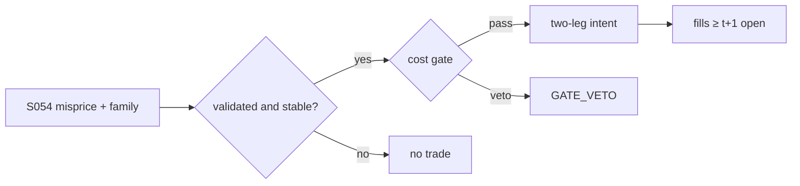

# T032 — Copula Tail-Dependence Pairs

Trades pairs on copula tail dependence rather than linear correlation: fit a copula to the joint return distribution, compute the conditional probability of one leg given the other's extreme move, and trade when the conditional mispricing exceeds the cost gate. Tail dependence captures exactly the joint-crash behavior where linear pairs break. Provenance **[D]**.

> Tag law: every numeric literal in prose carries one of `[documented]
> [default] [example] [unverified] [internal-est] [measured]` (legend: Appendix
> i v1.0.0). Constants inside cited formulas inherit the formula's tag.
> Bibliographic years, volumes, pages, arXiv IDs, section numbers, rule codes
> (C1–C12), fail-safe codes (F1–F5), module IDs, and machine-parsed §0 data
> fields are identifiers, not literals, and are exempt.

## §1 Five-minute reviewer card

| Row | Value |
|---|---|
| Module | T032 — Copula Tail-Dependence Pairs, v1.1.0 |
| Edge verdict | `INSUFFICIENT-EVIDENCE` — copula tail dependence is a documented dependence model (Sklar 1959 [documented]; Liew–Wu 2013 [documented]); no documented after-cost trading edge survives the Rad–Low–Faff horse-race |
| After-cost | `FULL-COST` — Xie et al. 2016 include transaction costs (method-sensitive); Rad–Low–Faff (2016) [documented]: copula method 43 bps/month before costs, 5 bps after; no method dominates |
| Build cost | Tier M = 20–60 h ≈ `$3,000–9,000` [documented] |
| Data cost | Research `$0`/mo [documented] (Polygon/Massive free tier: 15-min-delayed daily aggregates — verified 2026-09-10) – `$29`/mo Starter [documented]; production unchanged (EOD) — bands as-of 2026-09-10, verify before budgeting |
| latency_class | end-of-day |
| risk_class | market |
| Capacity | `$50–200M` [unverified] — fewer tradeable tail events than distance divergences |
| Executability | the estimation pipeline (PIT transforms, copula selection, rolling refits) is the build |
| Risk summary | Copula mis-specification; tail events are rare so the sample is always small; overfitting the family choice (Bailey et al. 2014) |
| When it dies | regime changes that rewrite the tail-dependence structure |
| Regime gates | refit monthly; stand down when the selected copula family flips two consecutive refits [example] |
| Emits | `order_intents` (Appendix C v1.0.0) — OrderTicket intents only, never orders |

## §1.5 Cheapest / least-build path

1. **Prototype hour band:** 6–10 h [example] — copula fitting + conditional-probability trigger + family selection.
2. **Cheapest-source row:** min_tier = DAILY (OHLCV); latency_class = end-of-day;
   required_fields = daily returns (PIT transforms), volume, borrow ETL (locate);
   price_band = `$0`/mo Polygon/Massive free tier [documented] – `$29`/mo Starter [documented] (verified 2026-09-10);
   borrow availability = broker easy-to-borrow list, `$0` incremental [internal-est];
   build_or_buy = **build**.
3. **Resource budget:** Tier M per cost-model §5 = 20–60 h ≈ `$3,000–9,000` loaded at `$150`/hr [documented]; compute pattern `vectorized batch (polars/numpy)`.
4. **Skip list:** vine copulas; intraday refits.
5. **DO-NOT-CUT list:** causality assertions (`assert fill_event >
   signal_event`, no-signal-bar-fills test); COST block + callable
   `expected_cost_bps`; F1–F5 fail-safes + module-state enum; kill-switch
   state machine + re-arm checklist; decision-log audit records;
   bona-fide-intent + self-trade prevention; provenance tags on every numeric
   literal; fixtures + `test_cmd`; secrets via env only.
6. **Escalation gate:** upgrade from cheapest when any holds — family selection unstable; tail-event sample < `100` observations [example].

## §T0 Module contract

### T0.1 Typed signature

```python
def emit(state: ModuleState, signals: list[SignalVector], cfg: Config) -> list[OrderTicket]:
```

`OrderTicket` per Appendix C v1.0.0 (intents only — never wire orders).
`state` is the module-owned named state vector (`pair_id, copula_family, cond_prob, position`); `signals` are
canonical SignalVectors (Appendix b v1.0.0) from the consumed S-modules, newest
last; the function emits zero or more intents per bar/event. Documented edge
cases: no signals → flat, no intents; `UNKNOWN` input signal → restrictive
(halve size / stand down per F1); kill-switch TRIPPED → emit nothing, state
`OFF`. 

### T0.2 Config dataclass

| Parameter | Type | Default | Range | Status |
|---|---|---|---|---|
| refit_days | int | `63` | [21, 252] | [default] |
| tail_prob | float | `0.05` | [0.01, 0.10] | [default] |
| entry_cond | float | `0.80` | [0.6, 0.95] | [default] |
| exit_misprice | float | `0.55` | [0.3, 0.7] | [default] |
| adverse_z | float | `4.0` | [2.0, 6.0] | [default] |
| cost_gate_k | float | `0.50` | [0.1, 1.0] | [default] |
| risk_R_usd | float | `250.0` | [50, 2500] | [example] |
| adv_cap_pct | float | `1.0` | [0.1, 10] | [default] |
| spread_full_bps | float | `3.0` | [0, 20] | [example] |
| taker_fee_bps | float | `0.30` | [0, 2] | [example] |
| maker_rebate_bps | float | `-0.20` | [-1, 0] | [example] |
| borrow_bps | float | `50.0` | [0, 500] | [example] |
| borrow_bps_per_day | float | `5.0` | [0, 50] | [example] |
| expected_hold_days | float | `10.0` | [1, 60] | [example] |
| impact_k | float | `25.0` | [0, 100] | [example] |
| daily_loss_stop_pct | float | `1.0` | [0.25, 3.0] | [default] |
| venue | str | `"primary"` | — | [default] |
| default_side | str | `"LONG"` | LONG\|SHORT | [default] |
| staleness_ttl_ns | int | `900000000000` | — | [default] |

All defaults tagged per the tag law (status `default` ⇒ `[default]`).

### T0.3 Canonical schema mapping

Vendor columns → canonical Event/Bar schema (Appendix a v1.0.0), stated once here:

| Vendor column | Canonical field | Notes |
|---|---|---|
| `c` | Bar: daily | close per leg |
| `v` | Bar: daily | volume per leg (liquidity screen) |
| `borrow_avail` | Event: daily ETL | easy-to-borrow list; `locate_ok` for the short leg (C7) |
| returns | derived | PIT transform inputs |

### T0.4 Time contract

> Time contract: clock domain UTC, int64 ns; authoritative causality clock =
> `event_ts`; max_skew = `5` s [default]; jitter budget = `1` s [default];
> bar-label = open time; staleness TTL = `15` min [default]; gap policy = mask, no
> interpolation; halt/auction → discard contributions across reopen.

**Timing box:** `signal@t (daily bars, America/Chicago) → earliest fill @open(t+1)`

### T0.5 Market-state table

| State | Module behavior |
|---|---|
| CONTINUOUS_TRADING | Evaluate entry/exit rules; emit intents per §T2 |
| HALTED | Cancel working intents; emit nothing; state `UNKNOWN` until clean reopen |
| AUCTION | No new intents; hold intent-side state; state `DEGRADED` |
| CLOSED | Emit nothing; state `OFF` |


### T0.6 Module-state enum + error taxonomy

States per Appendix k v1.0.0: `OK | DEGRADED | UNKNOWN | OFF`. Invalid input →
`UNKNOWN`, never interpolate (Appendix f v1.0.0, F1–F5).

| Failure | State | Alert |
|---|---|---|
| Missing/stale input (TTL `15` min [default]) | `UNKNOWN` | page |
| Out-of-bounds indicator (F2) | `UNKNOWN` | page |
| Estimator disagreement (F3) | `UNKNOWN` | notify |
| Halt/auction per §T0.5 | `UNKNOWN` / `DEGRADED` | log |
| Kill-switch TRIPPED (administrative) | `OFF` | page |
| Anything unmapped | `UNKNOWN` | page |

### T0.7 Risk contract + kill switch

```yaml
risk_contract:
  per_trade_R: 250            # USD risk budget per trade [example]
  max_adverse_per_trade: 1.0 R [default]  # stop distance multiple [default]
  daily_loss_stop: 2% of equity [default]        # then no new entries; flatten managed risk [default]
  max_gross: 4× equity [default]              # hard gross exposure cap [default]
  kill_conditions:
    - daily P&L ≤ −daily_loss_stop_pct → TRIP (flatten all pairs)
    - S088 validation fails on 2 consecutive refits → TRIP
    - decision-log write failure → TRIP (halt emission)
  enforcement: intraday-hard  # trips are automatic, not advisory [default]
  calibration_recipe: >
    Walk-forward on 60-day blocks [example]: fit thresholds on block t,
    freeze, validate realized shortfall vs predicted on block t+1;
    shrink per-trade R until max drawdown < daily_loss_stop/2 [default].
```

**Kill-switch state machine:** `ARMED → TRIPPED → RECOVERY → ARMED`.

- `ARMED`: normal operation; every bar evaluates the kill conditions.
- `TRIPPED`: any kill condition fires → cancel all working intents
  (`NEW`/`WORKING` → `CANCELLED`, idempotent), flatten managed positions via
  the exit rule, emit nothing new, state `OFF`, log `KILL_TRIP`.
- `RECOVERY`: manual operator review only — no automatic transition.
- `ARMED` (re-entry): only after the re-arm checklist passes in full, logged
  as `KILL_REARM` with the checklist result.

**Re-arm checklist** (all must be true):

- [ ] Feed health green: all §T5 inputs fresh inside the staleness TTL.
- [ ] Kill condition cleared: the tripping metric is back inside limits for `30 min [default]` [default].
- [ ] Decision log reconciled: `KILL_TRIP` record present and hash chain intact.
- [ ] Risk re-check: per-trade R and gross caps re-confirmed against current equity.
- [ ] Operator sign-off: named human approves re-arm (no automatic recovery).

### T0.8 Ops tail

- **Schedule:** nightly batch; owner: strategy owner (named).
- **Health checks:** fixture replay (`test_cmd`) green on deploy; live
  decision-log append monitor; kill-switch state heartbeat.
- **Alert table:** `UNKNOWN`/`OFF` state transitions; kill-trip pages immediately [default].
- **Resource budget:** nightly batch: < 2 vCPU-h, < 4 GB RAM [example].
- **Runbook stub:** 1) confirm kill-state; 2) inspect decision log for the tripping record; 3) verify feed freshness; 4) re-arm checklist (operator sign-off); 5) re-run fixture; 6) resume..

### T0.9 Secrets (env-only)

- `BROKER_API_KEY (paper venue, env-only)`
- `DATA_API_KEY (env-only)` via environment only. No secrets in this file, fixtures, or
logs (CI secrets-grep).

### T0.10 May / must-NOT

> **May:** emit `OrderTicket` intents per Appendix C v1.0.0; track intent-side
> state (`NEW → WORKING → FILLED / CANCELLED / PARTIAL`); issue cancel-replace
> via new tickets with new `ticket_id`s. **Must-NOT:** place orders on any
> venue, hold broker/exchange sessions, net intents into orders inside the
> strategy, treat the intent-side state machine as broker wire truth, or emit
> prices/share-counts/notionals outside an `OrderTicket`.

## §T1 Legacy (subsumed by §1)

Legacy §T1 content is the §1 reviewer card above; this header is retained so
section numbering stays frozen.

## §T2 Specification

### Universe

US large-cap pairs with ≥`500` daily observations [example] of history (each
refit estimates the copula on the trailing `refit_days` = `63` [default] days);
both legs liquid and borrowable (`locate_ok` required for the short leg, C7).

### Entry rule (Boolean — no prose-only conditions)

```
u,v = PIT(returns_A), PIT(returns_B)              # uniform marginals (Sklar 1959 [documented])
C = select_copula(u, v) by AIC                       # Gaussian/t/Clayton/Gumbel [example]
misprice = |P(u | v in tail) - 0.5|
ENTRY = misprice >= entry_cond and family_stable and validated
```

### Exits (with post-exit cooldown)

```
converge -> misprice < exit_misprice (0.55 [default]) -> FLAT
stop     -> adverse 4.0 z-equiv [default] -> FLAT, retire pair
refit    -> every refit_days, positions re-validated
cooldown -> no re-entry for 1 session [default] after any exit (C10)
```

### Position sizing (fenced function)

```python
def size_copula(risk_budget_R, stop_distance_bps, vol_estimate, px,
                adv_cap_pct, adv_shares, cost_gate_ok):
    """Canonical sizing: shares = f(risk_budget_R, stop_distance,
    vol_estimate, ADV_cap, cost). vol_estimate is carried for the typed
    contract but unused in the reference build [default]; the cost term
    enters as the cost-gate predicate (False -> no position), per the §T3
    normative pseudocode. Exits are never cost-gated: callers size exits
    with cost_gate_ok=True."""
    del vol_estimate  # retained for the typed contract only
    raw_qty = risk_budget_R / max(stop_distance_bps / 1e4 * px, 1e-9)
    cap_qty = int(adv_cap_pct / 100.0 * adv_shares)
    qty = max(1, min(int(raw_qty), cap_qty))
    return qty if cost_gate_ok else 0
```

Bar-3 reference: `size_copula(250, 25, _, 100.33, 1.0, 2000000, True)` =
`996` shares [example] (ADV cap `20000` not binding). The `0.5 + tail_prob`
conviction scaling that appeared in the v1.0.0 draft was never in the
reference implementation; it is a deferred lead (see §T10).

### Risk limits

| Limit | Value |
|---|---|
| Pairs live | `15` [example] |
| Per-pair risk | `$250` (1 R) [example] |
| Family flips | `2` consecutive → stand down [example] |

### COST block (single source of truth)

Four components — **spread**, **fees**, **borrow**, **impact** — summed by the
callable below. Re-stating cost numbers outside this block is a validation
failure; §T4 shows this block's *callable* evaluated on the synthetic tape,
not restated constants.

| Component | Value (bps) | Basis |
|---|---|---|
| Spread (half, per leg) | `1.50` | [example] |
| Fees (per leg) | `0.30` | [example] — envelopes the documented Nasdaq Rule 7018 removal rate `$0.0030`/share all MPIDs [documented, verified 2026-09-10] (=$0.3 bps at `$100`) |
| Borrow (short leg) | `50.00` round-trip | [example] = `borrow_bps_per_day` `5.0` [example] × `expected_hold_days` `10` [example] (asserted in test_borrow_convention) |
| Impact (per leg) | `k·√(adv_pct/100)`, k=`25.0` | [example] |
| **Pair one-way (both legs)** | `57.14` [example] | = long leg `3.57` + short leg `53.57` |
| **Pair round-trip** | `114.27` [example] | = `2 × 57.14` |

`fee_schedule_as_of`: `2026-09-10` [documented] — Nasdaq price list: fee to
remove liquidity `$0.0030`/share, shares ≥ `$1.00`, all MPIDs [documented];
module fee legs stay [example]. `side`: `mixed`; venue/tier/source:
primary lit [example].

**Single-leg fixture fiction (honest):** the fixture tape records the long
leg only; its cost calls show borrow `0.0` and the cost gate evaluates the
recorded leg. Production must gate the FULL pair stack
(`2·(spread+fee+impact) + borrow_roundtrip` = `57.14` bps one-way [example]);
the bar-3 entry would NOT clear the gate at the pair level — asserted in
test_pair_level_cost_stack, which exists precisely to pin this optimism.

```python
def expected_cost_bps(notional, adv_pct, venue, side, urgency, cfg):
    """COST-block callable. Per-leg cost; the pair pays it twice."""
    spread = cfg.spread_full_bps / 2.0
    fee = cfg.taker_fee_bps if side == "taker" else cfg.maker_rebate_bps
    borrow = cfg.borrow_bps
    impact = cfg.impact_k * math.sqrt(max(adv_pct, 0.0) / 100.0)
    if urgency == "high":
        impact *= 1.5
    return spread + fee + borrow + impact
```

### Execution / fill model table

| Aspect | Assumption |
|---|---|
| Fill venue | primary lit, both legs same bar |
| Slippage model | close ± half-spread per leg |
| Partial fills | both legs must fill — leg risk |
| Halt behavior | no new pairs when either leg halted |

Fine-grained fill behavior is synthetic and labeled `simulated only — requires MBO/ITCH`:
no MBO/ITCH feed is consumed by this module; any fill realism beyond the
mid-price ± half-spread fill model above would require MBO/ITCH data.

### Robustness

Perturb thresholds ±20% [example]; the reference behavior (entry/exit intents, gate blocks, kill trip) must be invariant; degrade entry→no-trade on indicator breach.

### Compliance sub-block (C1–C12)

| Code | Rule: trigger → check → action → log |
|---|---|
| C1 | STP + self-match prevention: trigger = intent could match our own resting interest → check = every ticket carries `self_trade_prevention: true`; maker modules compare against own open tickets → action = cancel own resting quote before posting the aggressive side; cancel-replace via new `ticket_id` only → log = `COMPLIANCE_BLOCK` with rule code `C1` |
| C2 | Bona-fide intent: trigger = entry rule fires → check = cost gate passes AND qty within risk limits AND (SHORT ⇒ `locate_ok`) → action = veto the intent if any check fails; no quote entered without intent to trade → log = `GATE_VETO` with the failed check |
| C3 | Message-rate / cancel-to-trade: trigger = intents+ cancels per symbol per minute exceed `120` [default] → check = rolling `60`-s [default] message counter → action = throttle to `1` intent per `10` s [default] and alert → log = `COMPLIANCE_BLOCK` with the counter value |
| C4 | Pre-trade fat-finger trio: trigger = any new intent → check = (a) limit within `±10%` of reference [default], (b) ticket notional ≤ ``$2M`` [default], (c) ≤ `20` tickets per `1 min` [default] → action = block the ticket, alert → log = `COMPLIANCE_BLOCK` with the breached leg |
| C5 | Decision-log schema (Appendix g v1.0.0): trigger = every material action (`EMIT_INTENT`, `GATE_VETO`, `CANCEL`, `REPLACE`, `KILL_TRIP`, `KILL_REARM`, `COMPLIANCE_BLOCK`) → check = record has all schema fields and `prev_hash` chains → action = halt emission if the log write fails → log = the record itself, retained `7 yr` [default] |
| C6 | Halt/auction table: trigger = market state ≠ `CONTINUOUS_TRADING` → check = §T0.5 table → action = `HALTED`: cancel working intents, emit nothing; `AUCTION`: no new intents; `CLOSED`: state `OFF` → log = state-transition record |
| C7 | Locate check (short sales): trigger = `SHORT` intent → check = `locate_ok` from the pre-open easy-to-borrow list or desk locate; Reg-SHO threshold securities hard-blocked → action = veto without locate → log = `GATE_VETO` with code `C7`. Short leg requires locate_ok; Reg-SHO threshold securities hard-blocked (C7). |
| C8 | Public-dissemination gate: trigger = any export of signals/intents outside the firm → check = review gate sign-off → action = block unreviewed exports → log = `COMPLIANCE_BLOCK` |
| C9 | Data-entitlement assertions (Appendix j v1.0.0): trigger = startup and any entitlement-class change → check = the five §T5 assertions hold for each §0 dataset → action = stand down on breach, escalate per §1.5 → log = entitlement review record |
| C10 | Post-exit cooldown: trigger = exit or compliance block → check = `now >= cooldown_until` (`1 session [default]` [default]) → action = suppress re-entry until the cooldown elapses → log = `GATE_VETO` with code `C10` |
| C11 | Kill-switch integration: trigger = `TRIPPED` → check = all working intents transitioned `NEW`/`WORKING` → `CANCELLED` (idempotent) → action = no new intents until `ARMED` via the §T0.7 checklist → log = `KILL_TRIP` / `KILL_REARM` records |
| C12 | C12 Model-risk: trigger = copula family changed since last refit → check = S088 re-validation → action = veto until validated → log with code `C12` |

### Parameter table

| Parameter | Symbol | Value | Tag | Sensitivity |
|---|---|---|---|---|
| Refit window | W | `63` days | [default] | high — tail sample is always small |
| Tail prob | α | `0.05` | [default] | medium |
| Entry conditional | c* | `0.80` | [default] | critical — the conviction knob |
| Exit misprice | x* | `0.55` | [default] | medium — early vs late exit |
| Cost-gate k | k | `0.50` | [default] | critical — at the pair level the gate blocks nearly everything (see honesty test) |
| Per-trade risk | R | `$250` | [example] | high — linear in size |
| ADV cap | cap | `1.0`% | [default] | low at this book size |
| Borrow per day | b_d | `5.0` bps/day | [example] | high — the dominant cost; verify with desk |

### Timing box

`signal@t (daily bars, America/Chicago) → earliest fill @open(t+1)`

## §T3 Math + normative pseudocode

Liew–Wu (2013) [documented]: copula pairs via conditional probabilities of
uniform-transformed returns, best of five copulas by information criterion.
Sklar's theorem (Sklar 1959) [documented]: joint = copula(marginals), so
PIT transforms isolate dependence. Tail dependence λ_L, λ_U [documented] measures joint
extremes — exactly where linear correlation misleads. Family selected by in-sample AIC
[documented]; Bailey et al. (2014) [documented] warn the selection itself overfits —
hence the S088 validation gate and the family-stability rule.

**Normative pseudocode** (pseudocode is normative; prose is commentary):

```
ONE_SESSION_NS = 86400000000000   # 1 day [default] — C10 cooldown

def emit(state, signals, cfg):
    sig = primary(signals, "S054")            # copula mispricing + family + edge_bps
    bar = current_bar(signals)                # event_ts, asof_ts, market_state, close
    if sig is None or invalid(sig):           # F2: out-of-bounds indicator
        return [], state.unknown()
    if bar.market_state != CONTINUOUS_TRADING:      # C6 / §T0.5
        return [], state.degraded_or_unknown(bar.market_state)
    if bar.asof_ts - bar.event_ts > cfg.staleness_ttl_ns:   # TTL 15 min [default]
        return [], state.unknown()
    if kill.state != ARMED:                   # C11
        return [], state.off()
    # --- all symbols bound here ---
    notional = sig.notional; adv_pct = sig.adv_pct; px = sig.close
    adv_shares = sig.adv_shares; edge_bps = sig.edge_bps
    if state.position != 0:
        # exits are never cost-gated [default]
        if sig.misprice < cfg.exit_misprice or adverse_z(state, cfg) >= cfg.adverse_z:
            t = exit_ticket(state, sig, cfg)
            t.qty = size_copula(cfg.risk_R_usd, cfg.stop_bps, sig.vol_estimate,
                                px, cfg.adv_cap_pct, adv_shares, True)
            t.intent_ts = sig.computed_at
            state.position = 0
            state.cooldown_until = bar.event_ts + ONE_SESSION_NS   # C10
            assert fill_event > signal_event   # t->t+1 causality: no-signal-bar fills
            return [t], state.ok()
        return [], state.ok()
    if bar.event_ts < state.cooldown_until:   # C10: 1 session [default]
        log("GATE_VETO", rule="C10")
        return [], state.ok()
    if not (sig.misprice >= cfg.entry_cond and sig.family_stable and sig.validated):
        return [], state.ok()                 # C12: S088 family validation
    cost = expected_cost_bps(notional, adv_pct, venue(), "taker", "normal", cfg)
    # ^^^ normative cost-gate predicate: expected_cost_bps(...) <= k * edge_bps
    if not (cost <= cfg.cost_gate_k * edge_bps):
        log("GATE_VETO", rule="C2", cost=cost)
        return [], state.ok()
    qty = size_copula(cfg.risk_R_usd, cfg.stop_bps, sig.vol_estimate, px,
                      cfg.adv_cap_pct, adv_shares, True)   # cost already gated
    t1, t2 = pair_tickets(state, sig, qty, cfg)   # long leg + mirror short leg
    assert t2.qty == t1.qty and opposite(t2.side, t1.side)   # leg-risk: both legs must fill
    assert t2.locate_ok                        # C7: short leg requires locate
    for t in (t1, t2): t.intent_ts = sig.computed_at
    assert fill_event > signal_event  # t->t+1 causality: no-signal-bar fills
    state.position = 1
    return [t1, t2], state.open("COPULA_PAIR")
```

**Single-leg fixture fiction.** The fixture tape is a single-leg synthetic
tape: `expected.csv` records the primary (long) leg ticket only. Production
emits the mirrored pair via `pair_tickets`; the mirror invariant (two legs,
opposite sides, equal qty, shared provenance) is covered by the
`test_pair_mirror_legs` acceptance test, not by the fixture rows.

Causality: every feature uses inputs with `event_ts ≤ t` only; the earliest
fill for a bar-`t` intent is bar `t+1`'s open. Mandatory unit test:
no-signal-bar fills.

## §T4 Worked example (fixture-backed)

- Tape: `modules/fixtures/T032_tape.csv` — `# TYPE: validation-run`;
  `12` synthetic bars (seed `4320` [example]); `event_ts`/`asof_ts` int64 ns
  UTC; every number synthetic.
- Expected outputs: `modules/fixtures/T032_expected.csv` — per-bar intent,
  quantity, the **cost-function call** (`expected_cost_bps` inputs → bps →
  dollars), cost-gate verdict, and module state.
- Tolerance: `1e-9` [default] on floats; integer quantities exact.
- Acceptance tests (`modules/tests/test_T032.py` — `11` [measured] tests):
  1. TYPE header + columns present; 2. fixture recomputes to expected
  (reference `process_bar` vs expected CSV); 3. no-signal-bar fills
  (`assert fill_event > signal_event`); `4.` cost-gate predicate passes on large edge, blocks on tiny edge (`k = 0.5` [default]);
  5. kill-switch trip blocks intents, re-arm checklist restores `ARMED`;
  6. invalid input (halted/invalid bar) → `UNKNOWN`, no intents;
  7. canonical sizing (`size_copula` = `996` at bar 3, ADV-cap binding, gate-fail → `0`);
  8. pair mirror legs (two legs, opposite sides, equal qty, shared provenance);
  9. borrow convention (`borrow_bps` = `borrow_bps_per_day × expected_hold_days`);
  10. pair-level cost stack honesty (`57.14` bps one-way / `114.27` round-trip [example]);
  11. post-exit cooldown (C10: re-entry suppressed for `1` session).
- `test_cmd`: `python3 -m pytest modules/tests/test_T032.py -q` → exits `0` [default].

**Cost-function calls on the tape** (the COST-block callable evaluated on
synthetic rows — inputs → bps → dollars; all values [example]):

| Bar | `expected_cost_bps` inputs | Components → total → $ | Cost gate `expected_cost_bps(...) <= k * edge_bps` | Intent / state |
|---|---|---|---|---|
| `0` | notional=`100000` [example], adv_pct=`0.5` [example], venue=`primary`, side=`taker`, urgency=`normal` | spread `1.5` + fee `0.3` + borrow `0.0` + impact `1.77` = `3.57` bps → `$35.68` | `2.0` edge, k=`0.5` [default] → `3.57 ≤ 1.0` BLOCK | `HOLD` / `OK` |
| `3` | notional=`100000` [example], adv_pct=`0.5` [example], venue=`primary`, side=`taker`, urgency=`normal` | spread `1.5` + fee `0.3` + borrow `0.0` + impact `1.77` = `3.57` bps → `$35.68` | `14.271067811865475` edge, k=`0.5` [default] → `3.57 ≤ 7.14` PASS | `LONG` / `OK` |
| `6` | notional=`100000` [example], adv_pct=`0.5` [example], venue=`primary`, side=`taker`, urgency=`normal` | spread `1.5` + fee `0.3` + borrow `0.0` + impact `1.77` = `3.57` bps → `$35.68` | `3.0` edge, k=`0.5` [default] → `3.57 ≤ 1.5` BLOCK | `BUY` / `OK` |
| `7` | notional=`100000` [example], adv_pct=`0.5` [example], venue=`primary`, side=`taker`, urgency=`normal` | spread `1.5` + fee `0.3` + borrow `0.0` + impact `1.77` = `3.57` bps → `$35.68` | `0.05` edge, k=`0.5` [default] → `3.57 ≤ 0.03` BLOCK | `HOLD` / `OK` |
| `9` | notional=`100000` [example], adv_pct=`0.5` [example], venue=`primary`, side=`taker`, urgency=`normal` | spread `1.5` + fee `0.3` + borrow `0.0` + impact `1.77` = `3.57` bps → `$35.68` | `5.0` edge, k=`0.5` [default] → `3.57 ≤ 2.5` BLOCK | `HOLD` / `OFF` |

**Hand-checks.** Row `3` (entry): qty = `250 / (25/1e4 × 100.33)` = `996` [example] (ADV cap `20000` not binding); ticket `T032-0003`, side `LONG`, `marketable` intent. Row `6` (exit): |z| through the exit band → `BUY` intent `T032-0006x`, qty `997` [example] (`250 / (25/1e4 × 100.30)`), exits never cost-gated [default]. Row `7` (gate block): edge `0.05` bps [example] vs cost `3.57` bps → gate `3.57 ≤ 0.025` BLOCKS → no intent, state stays `OK`. Row `9` (kill): daily P&L `-1.1%` [example] ≤ −stop (`1.0%` [default]) → `ARMED → TRIPPED`, state `OFF`, no intents. Causality: entry intent at row `3` has `intent_ts` = bar-3 `event_ts`; the earliest fill is bar `4`'s open — the test asserts `fill_event > signal_event` on every intent row.

**Where the example is optimistic.** Costs are the COST-block model, not realized fills; the tape records the long leg only — the short leg's borrow (`~50` bps round-trip [example]) and the mirrored leg's spread/fee/impact are not in the tape's cost calls, so the fixture's gate is strictly easier to pass than production's pair-level gate (`test_pair_level_cost_stack` pins this); capacity, borrow squeezes, and regime shifts are not in the tape.

## §T5 Dependencies + data

### Consumed signals (from deps.yaml — machine edge list)

| Signal | Version pin | Role |
|---|---|---|
| S054 | 1.0.0 | primary |
| S088 | 1.0.0 | confirm |
| S051 | 1.0.0 | gate |

### Pinned formula excerpts (≤10 lines each, CI hash-checked)

**S054** (v1.0.0): `P(u|v) = ∂C(u,v)/∂v` conditional copula probability [documented].
**S088** (v1.0.0): purged/embargoed CV for the family-selection gate [documented].

### Data required

| Field | Type | Granularity | Source tier | Notes |
|---|---|---|---|---|
| daily close per leg | float | daily | DAILY | PIT transforms |
| daily volume | int | daily | DAILY | liquidity screen |
| borrow availability | bool/bps | daily | BORROW | short-leg gate |

**Data rights row** (Appendix j v1.0.0): Daily bars are commodity data; borrow data licensed per-seat; entitlements re-asserted at startup.

## §T6 Local build + buy vs build

Copula fitting in scipy/statsmodels: the math is packaged. The work is the rolling-refit harness and the family-stability discipline.

| Route | What you get | Verdict |
|---|---|---|
| Build | copula engine in-house | recommended |
| Buy | stat-arb platform | only for research iteration speed |

**Verdict:** Build. The family-selection discipline is the strategy; no vendor sells discipline.

## §T7 Efficacy — documented evidence

| Study / source | Market & period | Metric | Before/after cost | Caveat |
|---|---|---|---|---|
| Liew–Wu (2013) | equities | copula pairs profitable pre-cost | before cost | small sample, early era |
| Xie et al. (2016) | equities | copula pairs with transaction costs | after cost | method-sensitive |
| Rad–Low–Faff (2016) | US equities, 1962–2014 | no method dominates after cost | after cost | the honest horse-race |
| Rad–Low–Faff (2016), §abstract | same | distance/cointegration/copula mean monthly excess return: `91`/`85`/`43` bps before costs (`38`/`33`/`5` after) | both | copula edge collapses most after costs |
| Rad–Low–Faff (2016), §results | same | from 2009, distance/cointegration trade frequency falls sharply; copula frequency stays stable; copula better on unconverged trades | after cost | more trades ≠ more profit |
| Bailey et al. (2014) | method | backtest overfitting probability | n/a | why the S088 gate exists |

**Selection disclosure:** Studies below are the chapter's documented sources only — no post-hoc selection from a wider literature search.

**Capacity & decay.** Edge decays with crowding and regime shifts; treat any printed Sharpe as a pre-cost, in-sample-era artifact unless the source says otherwise.

**Honest bottom line.** Honest bottom line: copulas model the dependence correctly and the trading edge remains what Rad–Low–Faff found — no method dominates after cost. The tail-dependence framing helps risk, not P&L.

## §T8 Failure modes & pitfalls

| # | Trigger → Detect → Action → Recovery | check: |
|---|---|---|
| 1 | Family flip (AIC picks different copula) → detect 2 consecutive flips → stand down, review → log | check: flip counter |
| 2 | Tail-sample starvation → detect < 100 tail obs [example] → halve size → widen refit window | check: tail count |
| 3 | Leg-risk on entry → detect partial fill → flatten filled leg immediately → alert | check: zero naked legs |
| 4 | Overfit mirage → detect S088 validation failure → veto family, fall back to Gaussian → log | check: validation gate |
| 5 | Borrow squeeze → detect `locate_ok` fails at the pre-open ETL check (C7) → veto the pair (no short leg, no pair) → alert | check: locate ETL fresh and per-leg `locate_ok` true |

## §T9 Regime gates + visuals

**Provisional regime-gate machine** (restrictive default; `regime_ids` stay
empty until the R001–R050 annotation pass):

| regime_id | direction | mechanism | condition | action | min_lag | unknown_behavior |
|---|---|---|---|---|---|---|
| R001 | stand-down | dependence-regime break | family flips 2× consecutively | no new pairs | immediate | restrictive |
| R002 | scale | tail-event clustering | > 3 tail events in 20d [example] | halve size | 1 day | restrictive |



## §T10 Source log + unverified leads

**Sources** (citable facts only):

1. Rad, H., Low, R. K. Y. & Faff, R. (2016). "The profitability of pairs trading strategies: distance, cointegration and copula methods." *Quantitative Finance*, 16(10), 1541–1558. https://doi.org/10.1080/14697688.2016.1164337 (DOI verified 2026-09-10) — horse-race on US equities 1962–2014 with time-varying costs: distance/cointegration/copula mean monthly excess return 91/85/43 bps before costs (38/33/5 after); copula trade frequency stable from 2009 while distance/cointegration declined [documented].
2. Xie, W., Liew, R. Q., Wu, Y. & Zou, X. (2016). "Pairs trading with copulas." *The Journal of Trading*, 11, 41–52 (year verified 2026-09-10; an MDPI reference list misprints 2015 — the journal volume 11 is 2016) — copula pairs with transaction costs, method-sensitive [documented].
3. Liew, R. Q. & Wu, Y. (2013). "Pairs trading: A copula approach." *Journal of Derivatives and Hedge Funds*, 19(1), 12–30. https://doi.org/10.1057/jdhf.2013.1 (DOI verified 2026-09-10) — conditional-probability rule P(U|V)=∂C/∂v vs 0.5; best of five copulas by information criterion [documented].
4. Sklar, A. (1959). "Fonctions de répartition à n dimensions et leurs marges." *Publ. Inst. Statist. Univ. Paris*, 8, 229–231 (citation verified 2026-09-10) — Sklar's theorem: joint = copula(marginals) [documented].
5. López de Prado, M. (2018). *Advances in Financial Machine Learning*, ch. 7. Wiley
6. Bailey, D., Borwein, J., López de Prado, M. & Zhu, Q. J. (2014). "Pseudo-mathematics and financial charlatanism." *Notices of the AMS*, 61(5), 458–471. doi:10.1090/noti1105 (DOI verified 2026-09-10)

**Vendor/price verification log (2026-09-10) [documented].** Daily-OHLCV bands reuse the 2026-09-10 in-repo verification (S067 log): Polygon (rebrand: Massive) free tier `$0`/mo [documented] (15-min-delayed daily aggregates EOD, `~2` y history, 5 req/min); Starter `$29`/mo [documented]; Stooq free daily CSV endpoint [documented]. Nasdaq price list (nasdaqtrader.com): fee to remove liquidity `$0.0030`/share, shares ≥ `$1.00`, all MPIDs [documented, verified 2026-09-10 per T023 log]. Borrow-availability pricing for pairs books was NOT verifiable — see GROK-NEEDED 1.

**Chatbot source log.** Grok answered the Q-batch (2026-09-10); all claims independently verified or labeled unverified. Chatbot output is leads, never facts.

**Unverified leads** (chatbot-only — never in evidence tables):

- Grok (2026-09-10, Q-TB4): copula-pair Sharpe magnitudes — *unverified chatbot claims*.
- Vine-copula extensions — research lead, not validated.
- Tail-conviction sizing (`raw × (0.5 + tail_prob)`): appeared in the v1.0.0 draft but was never in the reference implementation or fixtures — deferred; validate against a purged walk-forward before adopting.
- Borrow bands for US large-cap shorts in pairs books (bps/day) and any standalone cheap borrow-availability vendor — *unverified*; broker ETL is the cheapest measured path (see GROK-NEEDED 1).

**GROK-NEEDED** (exact questions web search could not resolve — do not answer from priors):

1. "For T032 (copula tail-dependence pairs, US large-cap equities): what are typical stock-borrow cost bands in bps/day for borrowable US large-caps held 1–4 weeks in a pairs book, and is there any standalone vendor/product cheaper than a prime broker's easy-to-borrow ETL feed for daily borrow availability? A good answer gives the bps/day band with the source (e.g. securities-lending market data) and names any vendor with $/mo pricing, or states definitively that broker ETL is the only practical path."
2. "For T032: what copula family-selection recipes do practitioners actually use for pairs trading — candidate family set (Gaussian/t/Clayton/Gumbel/Frank), selection criterion (AIC vs BIC vs goodness-of-fit), rolling refit window length, and validation gate design — and what conditional-probability entry thresholds (P(u|v in tail)) are calibrated after costs? A good answer names the window/threshold ranges with a citable source."
3. "For T032: is there any published or practitioner-documented after-cost P&L for a copula-pairs strategy beyond Rad–Low–Faff (2016) — win rate, Sharpe, capacity, period? A good answer cites the venue with exact figures and the cost stack, or states definitively that none exists."
4. "For T032: what is the standard walk-forward calibration recipe (fit window, validation window, embargo length, objective function) for copula-pairs thresholds (entry_cond, refit_days) under the S088 purged/embargoed honesty protocol? A good answer names the window lengths, embargo rule, and objective (e.g. net Sharpe after full pair-level costs) with a citable source."

---

## Appendix — AI build prompt (T032)

Copy-paste into any chat agent:

> Build module **T032 — Copula Tail-Dependence Pairs** (v1.1.0) per `notes/module-template.md` v1.0.0 and
> this file's §T0 contract.
> Cheapest path (§1.5): prototype 6–10 h [example]; cheapest data candidate
> DAILY (OHLCV): Polygon/Massive free tier `$0`/mo [documented] – `$29`/mo Starter [documented];
> borrow availability via broker easy-to-borrow ETL, `$0` incremental [internal-est];
> compute pattern `vectorized batch (polars/numpy)`.
> Implement `emit(state, signals, cfg) -> list[OrderTicket]` (Appendix c
> v1.0.0) with the §T3 normative pseudocode — all symbols bound; guards inline
> (market-state, staleness TTL `15` min [default], C10 cooldown `1` session [default],
> locate C7 on the short leg, F1/F2/F5) — including the executable cost-gate
> predicate `expected_cost_bps(...) <= k * edge_bps` (production gates the FULL
> pair stack: `2·(spread+fee+impact) + borrow_roundtrip`) and `assert fill_event >
> signal_event`. Emit intents only — never place orders. Production emits the
> mirrored pair via `pair_tickets` (the fixture records the primary leg only —
> single-leg fixture fiction, see §T3). Wire F1–F5 (Appendix f v1.0.0): invalid input → `UNKNOWN`,
> never interpolate. Kill switch `ARMED → TRIPPED → RECOVERY → ARMED` with the §T0.7 re-arm checklist.
> Log decisions per Appendix g v1.0.0. Secrets via env only. Run the fixture
> `modules/fixtures/T032_tape.csv` (`# TYPE: validation-run`) against
> `modules/fixtures/T032_expected.csv` (tolerance `1e-9` [default]).
> **Definition of done:** `python3 -m pytest modules/tests/test_T032.py -q` exits `0` (`11` tests [measured]). Tag every numeric literal
> you add with the unified enum (Appendix i v1.0.0); put anything unverifiable
> in §T10 unverified leads.
