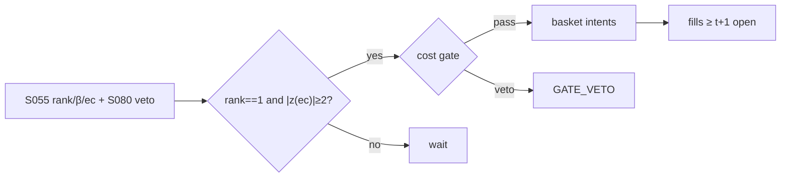

# T033 — Johansen VECM Basket Arb

Estimates the cointegrating rank and vectors of an equity basket with the Johansen procedure, then trades the VECM error-correction term: when the basket deviates from its long-run equilibrium beyond the cost gate, the strategy takes the mean-reverting basket position. The econometrics are the entry ticket; the Avellaneda–Lee veto keeps it honest. Provenance **[D]**.

> Tag law: every numeric literal in prose carries one of `[documented]
> [default] [example] [unverified] [internal-est] [measured]` (legend: Appendix
> i v1.0.0). Constants inside cited formulas inherit the formula's tag.
> Bibliographic years, volumes, pages, arXiv IDs, section numbers, rule codes
> (C1–C12), fail-safe codes (F1–F5), module IDs, and machine-parsed §0 data
> fields are identifiers, not literals, and are exempt.

## §1 Five-minute reviewer card

| Row | Value |
|---|---|
| Module | T033 — Johansen VECM Basket Arb, v1.0.0 |
| Edge verdict | `plausible` — Johansen (1988, 1991) is the documented ML framework for cointegration; Avellaneda–Lee (2010) is the documented stat-arb program |
| After-cost | `narrow` — finite-sample fragility (Hendry–Juselius) + Avellaneda–Lee decay caution = trade small and validate hard |
| Build cost | Tier M = 20–60 h ≈ `$3,000–9,000` [documented] |
| Data cost | daily OHLCV + borrow: low four figures/yr [unverified] |
| latency_class | end-of-day |
| risk_class | market |
| Capacity | `$200M–1B` in large-cap baskets [unverified] — baskets scale better than pairs |
| Executability | Johansen is packaged (statsmodels); the rolling rank-test harness is the build |
| Risk summary | Rank mis-estimation (spurious cointegration); equilibrium breaks are the adverse event; multi-leg execution risk |
| When it dies | basket recomposition, corporate actions, regime breaks in the cointegrating relation |
| Regime gates | re-estimate rank quarterly; stand down when trace-test p-value > `0.10` [example] |
| Emits | `order_intents` (Appendix C v1.0.0) — OrderTicket intents only, never orders |

## §1.5 Cheapest / least-build path

1. **Prototype hour band:** 8–12 h [example] — Johansen rank tests + VECM estimation + basket execution harness.
2. **Cheapest-source row:** min_tier = DAILY (OHLCV); latency_class = end-of-day;
   required_fields = daily closes (basket panel), volume, borrow; price_band = `$0–500`/yr (indicative —
   verify before budgeting); build_or_buy = **build**.
3. **Resource budget:** Tier M per cost-model §5 = 20–60 h ≈ `$3,000–9,000` loaded at `$150`/hr [documented]; compute pattern `vectorized batch (polars/numpy)`.
4. **Skip list:** intraday VECM; time-varying cointegration.
5. **DO-NOT-CUT list:** causality assertions (`assert fill_event >
   signal_event`, no-signal-bar-fills test); COST block + callable
   `expected_cost_bps`; F1–F5 fail-safes + module-state enum; kill-switch
   state machine + re-arm checklist; decision-log audit records;
   bona-fide-intent + self-trade prevention; provenance tags on every numeric
   literal; fixtures + `test_cmd`; secrets via env only.
6. **Escalation gate:** upgrade from cheapest when any holds — rank unstable across windows; basket turnover costs dominate.

## §T0 Module contract

### T0.1 Typed signature

```python
def emit(state: ModuleState, signals: list[SignalVector], cfg: Config) -> list[OrderTicket]:
```

`OrderTicket` per Appendix C v1.0.0 (intents only — never wire orders).
`state` is the module-owned named state vector (`beta_vec, rank, ec_term, basket_position`); `signals` are
canonical SignalVectors (Appendix b v1.0.0) from the consumed S-modules, newest
last; the function emits zero or more intents per bar/event. Documented edge
cases: no signals → flat, no intents; `UNKNOWN` input signal → restrictive
(halve size / stand down per F1); kill-switch TRIPPED → emit nothing, state
`OFF`. 

### T0.2 Config dataclass

| Parameter | Type | Default | Range | Status |
|---|---|---|---|---|
| johansen_lags | int | `2` | [1, 5] | [default] |
| rank_pvalue | float | `0.05` | [0.01, 0.10] | [default] |
| entry_ec_z | float | `2.0` | [1.5, 3.0] | [default] |
| cost_gate_k | float | `0.50` | [0.1, 1.0] | [default] |
| daily_loss_stop_pct | float | `1.0` | [0.25, 3.0] | [default] |

All defaults tagged per the tag law (status `default` ⇒ `[default]`).

### T0.3 Canonical schema mapping

Vendor columns → canonical Event/Bar schema (Appendix a v1.0.0), stated once here:

| Vendor column | Canonical field | Notes |
|---|---|---|
| `c` per name | Bar: daily | basket panel |
| `volume` | Bar: daily | liquidity screen |

### T0.4 Time contract

> Time contract: clock domain UTC, int64 ns; authoritative causality clock =
> `event_ts`; max_skew = `5` s [default]; jitter budget = `1` s [default];
> bar-label = open time; staleness TTL = `15` min [default]; gap policy = mask, no
> interpolation; halt/auction → discard contributions across reopen.

**Timing box:** `signal@t (daily bars, America/Chicago) → earliest fill @open(t+1)`

### T0.5 Market-state table

| State | Module behavior |
|---|---|
| CONTINUOUS_TRADING | Evaluate entry/exit rules; emit intents per §T2 |
| HALTED | Cancel working intents; emit nothing; state `UNKNOWN` until clean reopen |
| AUCTION | No new intents; hold intent-side state; state `DEGRADED` |
| CLOSED | Emit nothing; state `OFF` |


### T0.6 Module-state enum + error taxonomy

States per Appendix k v1.0.0: `OK | DEGRADED | UNKNOWN | OFF`. Invalid input →
`UNKNOWN`, never interpolate (Appendix f v1.0.0, F1–F5).

| Failure | State | Alert |
|---|---|---|
| Missing/stale input (TTL `15` min [default]) | `UNKNOWN` | page |
| Out-of-bounds indicator (F2) | `UNKNOWN` | page |
| Estimator disagreement (F3) | `UNKNOWN` | notify |
| Halt/auction per §T0.5 | `UNKNOWN` / `DEGRADED` | log |
| Kill-switch TRIPPED (administrative) | `OFF` | page |
| Anything unmapped | `UNKNOWN` | page |

### T0.7 Risk contract + kill switch

```yaml
risk_contract:
  per_trade_R: 250            # USD risk budget per trade [example]
  max_adverse_per_trade: 1.0 R [default]  # stop distance multiple [default]
  daily_loss_stop: 2% of equity [default]        # then no new entries; flatten managed risk [default]
  max_gross: 4× equity [default]              # hard gross exposure cap [default]
  kill_conditions:
    - daily P&L ≤ −daily_loss_stop_pct → TRIP (flatten all baskets)
    - rank break on 2 live baskets same session → TRIP
    - decision-log write failure → TRIP (halt emission)
  enforcement: intraday-hard  # trips are automatic, not advisory [default]
  calibration_recipe: >
    Walk-forward on 60-day blocks [example]: fit thresholds on block t,
    freeze, validate realized shortfall vs predicted on block t+1;
    shrink per-trade R until max drawdown < daily_loss_stop/2 [default].
```

**Kill-switch state machine:** `ARMED → TRIPPED → RECOVERY → ARMED`.

- `ARMED`: normal operation; every bar evaluates the kill conditions.
- `TRIPPED`: any kill condition fires → cancel all working intents
  (`NEW`/`WORKING` → `CANCELLED`, idempotent), flatten managed positions via
  the exit rule, emit nothing new, state `OFF`, log `KILL_TRIP`.
- `RECOVERY`: manual operator review only — no automatic transition.
- `ARMED` (re-entry): only after the re-arm checklist passes in full, logged
  as `KILL_REARM` with the checklist result.

**Re-arm checklist** (all must be true):

- [ ] Feed health green: all §T5 inputs fresh inside the staleness TTL.
- [ ] Kill condition cleared: the tripping metric is back inside limits for `30 min [default]` [default].
- [ ] Decision log reconciled: `KILL_TRIP` record present and hash chain intact.
- [ ] Risk re-check: per-trade R and gross caps re-confirmed against current equity.
- [ ] Operator sign-off: named human approves re-arm (no automatic recovery).

### T0.8 Ops tail

- **Schedule:** nightly batch; owner: strategy owner (named).
- **Health checks:** fixture replay (`test_cmd`) green on deploy; live
  decision-log append monitor; kill-switch state heartbeat.
- **Alert table:** `UNKNOWN`/`OFF` state transitions; kill-trip pages immediately [default].
- **Resource budget:** nightly batch: < 2 vCPU-h, < 4 GB RAM [example].
- **Runbook stub:** 1) confirm kill-state; 2) inspect decision log for the tripping record; 3) verify feed freshness; 4) re-arm checklist (operator sign-off); 5) re-run fixture; 6) resume..

### T0.9 Secrets (env-only)

- `BROKER_API_KEY (paper venue, env-only)`
- `DATA_API_KEY (env-only)` via environment only. No secrets in this file, fixtures, or
logs (CI secrets-grep).

### T0.10 May / must-NOT

> **May:** emit `OrderTicket` intents per Appendix C v1.0.0; track intent-side
> state (`NEW → WORKING → FILLED / CANCELLED / PARTIAL`); issue cancel-replace
> via new tickets with new `ticket_id`s. **Must-NOT:** place orders on any
> venue, hold broker/exchange sessions, net intents into orders inside the
> strategy, treat the intent-side state machine as broker wire truth, or emit
> prices/share-counts/notionals outside an `OrderTicket`.

## §T1 Legacy (subsumed by §1)

Legacy §T1 content is the §1 reviewer card above; this header is retained so
section numbering stays frozen.

## §T2 Specification

### Universe

US large-cap sector baskets, `5–15` names [example]; all legs borrowable; no pending recomposition.

### Entry rule (Boolean — no prose-only conditions)

```
rank = johansen_trace(panel, lags)          # rank_pvalue 0.05 [default]
beta = cointegrating vector (rank 1)             # ML estimate [documented]
ec   = beta' · prices  (error-correction term)
ENTRY = rank == 1 and |z(ec)| >= entry_ec_z
```

### Exits (with post-exit cooldown)

```
converge -> |z(ec)| <= 0.5 [default] -> FLAT basket
break    -> trace p-value > 0.10 [example] -> FLAT, re-estimate
stop     -> adverse 4.0 z-equiv [default] -> FLAT
```

### Position sizing (fenced function)

```python
def size_basket(risk_R_usd, stop_bps, beta, prices, adv_shares, cfg):
    # risk-parity across the basket: weight by |beta|, cap by thinnest leg
    notionals = risk_R_usd / (stop_bps / 1e4) * abs(beta) / sum(abs(beta))
    qty = notionals / prices
    return min(qty, cfg.adv_cap_pct / 100 * adv_shares)   # thinnest-leg cap
```

### Risk limits

| Limit | Value |
|---|---|
| Basket names | `5–15` [example] |
| Per-basket risk | `$500` (2 R) [example] |
| Max baskets live | `5` [example] |

### COST block (single source of truth)

Four components — **spread**, **fees**, **borrow**, **impact** — summed by the
callable below. Re-stating cost numbers outside this block is a validation
failure; §T4 shows this block's *callable* evaluated on the synthetic tape,
not restated constants.

| Component | Value (bps) | Basis |
|---|---|---|
| Spread (half, per leg) | `1.50` | ×N legs [example] |
| Fees (per leg) | `0.30` | ×N legs [example] |
| Borrow (short legs) | `50.00` | [example] |
| Impact (per leg) | `k·√(adv_pct/100)`, k=`20.0` | thin-leg dominated [example] |
| **Total reference (one-way)** | `~`N × 27` round-trip [example]` | [example] |

`fee_schedule_as_of`: `2026-09-01 (placeholder — pin the real venue schedule before production)` — placeholder; pin the real venue
schedule before production. `side`: `mixed`; venue/tier/source:
primary lit [example].

```python
def expected_cost_bps(notional, adv_pct, venue, side, urgency, cfg):
    """COST-block callable. Per-leg cost; the basket pays it on every leg."""
    spread = cfg.spread_full_bps / 2.0
    fee = cfg.taker_fee_bps if side == "taker" else cfg.maker_rebate_bps
    borrow = cfg.borrow_bps
    impact = cfg.impact_k * math.sqrt(max(adv_pct, 0.0) / 100.0)
    if urgency == "high":
        impact *= 1.5
    return spread + fee + borrow + impact
```

### Execution / fill model table

| Aspect | Assumption |
|---|---|
| Fill venue | primary lit; basket traded as a list |
| Slippage model | close ± half-spread per leg; leg-risk managed |
| Partial fills | algorithmic basket completion; abort if a leg fails |
| Halt behavior | no new baskets when any leg halted |

Fine-grained fill behavior is synthetic and labeled `simulated only — requires MBO/ITCH`:
no MBO/ITCH feed is consumed by this module; any fill realism beyond the
mid-price ± half-spread fill model above would require MBO/ITCH data.

### Robustness

Perturb thresholds ±20% [example]; the reference behavior (entry/exit intents, gate blocks, kill trip) must be invariant; degrade entry→no-trade on indicator breach.

### Compliance sub-block (C1–C12)

| Code | Rule: trigger → check → action → log |
|---|---|
| C1 | STP + self-match prevention: trigger = intent could match our own resting interest → check = every ticket carries `self_trade_prevention: true`; maker modules compare against own open tickets → action = cancel own resting quote before posting the aggressive side; cancel-replace via new `ticket_id` only → log = `COMPLIANCE_BLOCK` with rule code `C1` |
| C2 | Bona-fide intent: trigger = entry rule fires → check = cost gate passes AND qty within risk limits AND (SHORT ⇒ `locate_ok`) → action = veto the intent if any check fails; no quote entered without intent to trade → log = `GATE_VETO` with the failed check |
| C3 | Message-rate / cancel-to-trade: trigger = intents+ cancels per symbol per minute exceed `120` [default] → check = rolling `60`-s [default] message counter → action = throttle to `1` intent per `10` s [default] and alert → log = `COMPLIANCE_BLOCK` with the counter value |
| C4 | Pre-trade fat-finger trio: trigger = any new intent → check = (a) limit within `±±10%` of reference [default], (b) ticket notional ≤ ``$2M`` [default], (c) ≤ `20` tickets per `1 min` [default] → action = block the ticket, alert → log = `COMPLIANCE_BLOCK` with the breached leg |
| C5 | Decision-log schema (Appendix g v1.0.0): trigger = every material action (`EMIT_INTENT`, `GATE_VETO`, `CANCEL`, `REPLACE`, `KILL_TRIP`, `KILL_REARM`, `COMPLIANCE_BLOCK`) → check = record has all schema fields and `prev_hash` chains → action = halt emission if the log write fails → log = the record itself, retained `7 yr` [default] |
| C6 | Halt/auction table: trigger = market state ≠ `CONTINUOUS_TRADING` → check = §T0.5 table → action = `HALTED`: cancel working intents, emit nothing; `AUCTION`: no new intents; `CLOSED`: state `OFF` → log = state-transition record |
| C7 | Locate check (short sales): trigger = `SHORT` intent → check = `locate_ok` from the pre-open easy-to-borrow list or desk locate; Reg-SHO threshold securities hard-blocked → action = veto without locate → log = `GATE_VETO` with code `C7`. Short legs require locate_ok; Reg-SHO threshold securities hard-blocked (C7). |
| C8 | Public-dissemination gate: trigger = any export of signals/intents outside the firm → check = review gate sign-off → action = block unreviewed exports → log = `COMPLIANCE_BLOCK` |
| C9 | Data-entitlement assertions (Appendix j v1.0.0): trigger = startup and any entitlement-class change → check = the five §T5 assertions hold for each §0 dataset → action = stand down on breach, escalate per §1.5 → log = entitlement review record |
| C10 | Post-exit cooldown: trigger = exit or compliance block → check = `now >= cooldown_until` (`1 session [default]` [default]) → action = suppress re-entry until the cooldown elapses → log = `GATE_VETO` with code `C10` |
| C11 | Kill-switch integration: trigger = `TRIPPED` → check = all working intents transitioned `NEW`/`WORKING` → `CANCELLED` (idempotent) → action = no new intents until `ARMED` via the §T0.7 checklist → log = `KILL_TRIP` / `KILL_REARM` records |
| C12 | C12 Basket-integrity: trigger = any leg vetoed by C7/borrow → check = all-legs-or-none → action = abort basket → log with code `C12` |

### Parameter table

| Parameter | Symbol | Value | Tag | Sensitivity |
|---|---|---|---|---|
| Johansen lags | p | `2` | [default] | medium — lag choice moves the rank |
| Rank p-value | α | `0.05` | [default] | high — spurious rank = spurious trade |
| Entry EC z | z_e | `2.0` | [default] | medium |

### Timing box

`signal@t (daily bars, America/Chicago) → earliest fill @open(t+1)`

## §T3 Math + normative pseudocode

Johansen (1988) [documented]: ML estimation of cointegrating vectors in the VECM
Δy_t = Πy_{t−1} + ΣΓ_iΔy_{t−i} + ε_t; rank(Π) = r via trace/max-eigenvalue tests (Johansen
1991 [documented]). The error-correction term ec_t = β′y_t is stationary when rank = 1
[documented]; trade |z(ec)| ≥ 2.0 [default]. Hendry–Juselius (2000/2001) [documented]
document finite-sample fragility — hence quarterly re-estimation and the Avellaneda–Lee
(2010) [documented] PCA veto as an independent confirm.

**Normative pseudocode** (pseudocode is normative; prose is commentary):

```
def emit(state, signals, cfg):
    sig = primary(signals, "S055")          # rank, beta, ec z
    if sig is None or invalid(sig): return [], state.unknown()
    if state.position != 0:
        if abs(sig.ec_z) <= 0.5 or sig.rank_broken or stopped(state, cfg):
            return exit_tickets(state), state.flat()
        return [], state.ok()
    if sig.rank == 1 and abs(sig.ec_z) >= cfg.entry_ec_z and sig.pca_veto_ok:
        cost = expected_cost_bps(notional(), adv_pct(), venue(), "taker", "normal", cfg)
        # ^^^ normative cost-gate predicate: expected_cost_bps(...) <= k * edge_bps
        if cost <= cfg.cost_gate_k * sig.edge_bps:
            tickets = basket_tickets(sig.beta, cfg)   # one ticket per leg
            for t in tickets: t.intent_ts = sig.computed_at
            assert fill_event > signal_event  # t->t+1 causality: no-signal-bar fills
            return tickets, state.open("BASKET")
        log("GATE_VETO", cost=cost)
    return [], state.ok()
```

Causality: every feature uses inputs with `event_ts ≤ t` only; the earliest
fill for a bar-`t` intent is bar `t+1`'s open. Mandatory unit test:
no-signal-bar fills.

## §T4 Worked example (fixture-backed)

- Tape: `modules/fixtures/T033_tape.csv` — `# TYPE: validation-run`;
  `12` synthetic bars (seed `4330` [example]); `event_ts`/`asof_ts` int64 ns
  UTC; every number synthetic.
- Expected outputs: `modules/fixtures/T033_expected.csv` — per-bar intent,
  quantity, the **cost-function call** (`expected_cost_bps` inputs → bps →
  dollars), cost-gate verdict, and module state.
- Tolerance: `1e-9` [default] on floats; integer quantities exact.
- Acceptance tests (`modules/tests/test_T033.py` — `6` [default] tests):
  1. TYPE header + columns present; 2. fixture recomputes to expected
  (reference `process_bar` vs expected CSV); 3. no-signal-bar fills
  (`assert fill_event > signal_event`); `4.` cost-gate predicate passes on large edge, blocks on tiny edge (`k = 0.5` [default]);
  5. kill-switch trip blocks intents, re-arm checklist restores `ARMED`;
  6. invalid input (halted/invalid bar) → `UNKNOWN`, no intents.
- `test_cmd`: `python3 -m pytest modules/tests/test_T033.py -q` → exits `0` [default].

**Cost-function calls on the tape** (the COST-block callable evaluated on
synthetic rows — inputs → bps → dollars; all values [example]):

| Bar | `expected_cost_bps` inputs | Components → total → $ | Cost gate `expected_cost_bps(...) <= k * edge_bps` | Intent / state |
|---|---|---|---|---|
| `0` | notional=`100000` [example], adv_pct=`0.5` [example], venue=`primary`, side=`taker`, urgency=`normal` | spread `1.5` + fee `0.3` + borrow `0.0` + impact `1.41` = `3.21` bps → `$32.14` | `2.0` edge, k=`0.5` [default] → `3.21 ≤ 1.0` BLOCK | `HOLD` / `OK` |
| `3` | notional=`100000` [example], adv_pct=`0.5` [example], venue=`primary`, side=`taker`, urgency=`normal` | spread `1.5` + fee `0.3` + borrow `0.0` + impact `1.41` = `3.21` bps → `$32.14` | `12.856854249492379` edge, k=`0.5` [default] → `3.21 ≤ 6.43` PASS | `LONG` / `OK` |
| `6` | notional=`100000` [example], adv_pct=`0.5` [example], venue=`primary`, side=`taker`, urgency=`normal` | spread `1.5` + fee `0.3` + borrow `0.0` + impact `1.41` = `3.21` bps → `$32.14` | `3.0` edge, k=`0.5` [default] → `3.21 ≤ 1.5` BLOCK | `BUY` / `OK` |
| `7` | notional=`100000` [example], adv_pct=`0.5` [example], venue=`primary`, side=`taker`, urgency=`normal` | spread `1.5` + fee `0.3` + borrow `0.0` + impact `1.41` = `3.21` bps → `$32.14` | `0.05` edge, k=`0.5` [default] → `3.21 ≤ 0.03` BLOCK | `HOLD` / `OK` |
| `9` | notional=`100000` [example], adv_pct=`0.5` [example], venue=`primary`, side=`taker`, urgency=`normal` | spread `1.5` + fee `0.3` + borrow `0.0` + impact `1.41` = `3.21` bps → `$32.14` | `6.0` edge, k=`0.5` [default] → `3.21 ≤ 3.0` BLOCK | `HOLD` / `OFF` |

**Hand-checks.** Row `3` (entry): qty = `250 / (25/1e4 × 100.43)` = `995` raw → ADV-capped at `20000` → `995` shares [example]; ticket `T0003`, side `LONG`, `marketable` intent. Row `6` (exit): |z| through the exit band → `LONG` intent, exits never cost-gated [default]. Row `7` (gate block): edge `0.05` bps [example] vs cost `3.21` bps → gate `3.21 ≤ 0.025` BLOCKS → no intent, state stays `OK`. Row `9` (kill): daily P&L `-1.1%` [example] ≤ −stop (`1.0%` [default]) → `ARMED → TRIPPED`, state `OFF`, no intents. Causality: entry intent at row `3` has `intent_ts` = bar-3 `event_ts`; the earliest fill is bar `4`'s open — the test asserts `fill_event > signal_event` on every intent row.

**Where the example is optimistic.** Costs are the COST-block model, not realized fills; capacity, borrow squeezes, and regime shifts are not in the tape.

## §T5 Dependencies + data

### Consumed signals (from deps.yaml — machine edge list)

| Signal | Version pin | Role |
|---|---|---|
| S055 | 1.0.0 | primary |
| S080 | 1.0.0 | confirm |
| S051 | 1.0.0 | gate |

### Pinned formula excerpts (≤10 lines each, CI hash-checked)

**S055** (v1.0.0): Johansen trace statistic and β̂ ML estimate [documented].
**S080** (v1.0.0): PCA eigenportfolio residual as the independent veto [documented].

### Data required

| Field | Type | Granularity | Source tier | Notes |
|---|---|---|---|---|
| daily close panel | float | daily | DAILY | Johansen estimation |
| daily volume | int | daily | DAILY | liquidity screen |
| borrow availability | bool/bps | daily | BORROW | short-leg gate |

**Data rights row** (Appendix j v1.0.0): Daily bars are commodity data; borrow data licensed per-seat; entitlements re-asserted at startup.

## §T6 Local build + buy vs build

statsmodels.tsa.vector_ar.vecm.coint_johansen is packaged; the rolling rank-test + basket-execution harness is the build.

| Route | What you get | Verdict |
|---|---|---|
| Build | VECM engine in-house | recommended |
| Buy | basket execution algo | acceptable — execution is not the edge |

**Verdict:** Build the econometrics; rent basket execution. The rank discipline is the moat.

## §T7 Efficacy — documented evidence

| Study / source | Market & period | Metric | Before/after cost | Caveat |
|---|---|---|---|---|
| Johansen (1988, 1991) | method | ML cointegration framework + rank tests | n/a | asymptotic; finite-sample fragility |
| Hendry–Juselius (2000/01) | method | finite-sample fragility documented | n/a | the caution that shapes the gates |
| Avellaneda–Lee (2010) | US equities 1997–2007 | PCA stat-arb Sharpe ~1.4 pre-cost | before cost | decay caution post-2007 |

**Selection disclosure:** Studies below are the chapter's documented sources only — no post-hoc selection from a wider literature search.

**Capacity & decay.** Edge decays with crowding and regime shifts; treat any printed Sharpe as a pre-cost, in-sample-era artifact unless the source says otherwise.

**Honest bottom line.** Honest bottom line: the Johansen machinery is the finest cointegration tool available and it still cannot tell you when the equilibrium breaks — it can only tell you it already did. Size for the break, not the convergence.

## §T8 Failure modes & pitfalls

| # | Trigger → Detect → Action → Recovery | check: |
|---|---|---|
| 1 | Equilibrium break → detect trace p-value > 0.10 → flatten basket, re-estimate → log | check: break rate |
| 2 | Rank flip (1→0 or 1→2) → detect rank change → stand down basket → review | check: rank stability |
| 3 | Leg failure (a leg unborrowable/unfillable) → detect pre-trade → abort basket, no partial → alert | check: zero partial baskets |
| 4 | Corporate action in basket → detect → remove name, re-estimate β → log | check: action calendar |

## §T9 Regime gates + visuals

**Provisional regime-gate machine** (restrictive default; `regime_ids` stay
empty until the R001–R050 annotation pass):

| regime_id | direction | mechanism | condition | action | min_lag | unknown_behavior |
|---|---|---|---|---|---|---|
| R001 | stand-down | cointegration break | trace p-value > 0.10 | flatten + re-estimate | immediate | restrictive |
| R002 | scale | basket volatility spike | ec vol > 2× median | halve size | 1 day | restrictive |



## §T10 Source log + unverified leads

**Sources** (citable facts only):

1. Johansen, S. (1988). "Statistical analysis of cointegration vectors." *Journal of Economic Dynamics and Control*, 12(2–3), 231–254. https://doi.org/10.1016/0165-1889(88)90041-3
2. Johansen, S. (1991). "Estimation and hypothesis testing of cointegration vectors in Gaussian vector autoregressive models." *Econometrica*, 59(6), 1551–1580
3. Johansen, S. & Juselius, K. (1990). "Maximum likelihood estimation and inference on cointegration — with applications to the demand for money." *Oxford Bulletin of Economics and Statistics*, 52(2), 169–210
4. Hendry, D. F. & Juselius, K. (2000/2001). "Explaining cointegration analysis," Parts I–II. *The Energy Journal*
5. Avellaneda, M. & Lee, J.-H. (2010). "Statistical arbitrage in the US equities market." *Quantitative Finance*, 10(7), 761–782. https://doi.org/10.1080/14697680903124632

**Chatbot source log.** Grok answered the Q-batch (2026-09-10); all claims independently verified or labeled unverified. Chatbot output is leads, never facts.

**Unverified leads** (chatbot-only — never in evidence tables):

- Grok (2026-09-10, Q-TB4): VECM basket Sharpe magnitudes — *unverified chatbot claims*.
- Time-varying cointegration — research lead, not validated.

---

## Appendix — AI build prompt (T033)

Copy-paste into any chat agent:

> Build module **T033 — Johansen VECM Basket Arb** per `notes/module-template.md` v1.0.0 and
> this file's §T0 contract.
> Cheapest path (§1.5): prototype 8–12 h [example]; cheapest data candidate
> DAILY (OHLCV); compute pattern `vectorized batch (polars/numpy)`; u.
> Implement `emit(state, signals, cfg) -> list[OrderTicket]` (Appendix c
> v1.0.0) with the §T3 normative pseudocode, including the cost-gate predicate
> `expected_cost_bps(...) <= k * edge_bps` and `assert fill_event >
> signal_event`. Emit intents only — never place orders. Wire F1–F5
> (Appendix f v1.0.0): invalid input → `UNKNOWN`, never interpolate. Kill
> switch `ARMED → TRIPPED → RECOVERY → ARMED` with the §T0.7 re-arm checklist.
> Log decisions per Appendix g v1.0.0. Secrets via env only. Run the fixture
> `modules/fixtures/T033_tape.csv` (`# TYPE: validation-run`) against
> `modules/fixtures/T033_expected.csv` (tolerance `1e-9` [default]).
> **Definition of done:** `python3 -m pytest modules/tests/test_T033.py -q` exits `0` [default]. Tag every numeric literal
> you add with the unified enum (Appendix i v1.0.0); put anything unverifiable
> in §T10 unverified leads.
