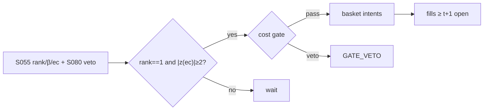

# T033 — Johansen VECM Basket Arb

Estimates the cointegrating rank and vectors of an equity basket with the Johansen procedure, then trades the VECM error-correction term: when the basket deviates from its long-run equilibrium beyond the cost gate, the strategy takes the mean-reverting basket position. The econometrics are the entry ticket; the Avellaneda–Lee veto keeps it honest. Provenance **[D]**.

> Tag law: every numeric literal in prose carries one of `[documented]
> [default] [example] [unverified] [internal-est] [measured]` (legend: Appendix
> i v1.0.0). Constants inside cited formulas inherit the formula's tag.
> Bibliographic years, volumes, pages, arXiv IDs, section numbers, rule codes
> (C1–C12), fail-safe codes (F1–F5), module IDs, and machine-parsed §0 data
> fields are identifiers, not literals, and are exempt.

## §1 Five-minute reviewer card

| Row | Value |
|---|---|
| Module | T033 — Johansen VECM Basket Arb, v1.1.0 |
| Edge verdict | `PREDICTIVE-FEATURE-ONLY` — Johansen (1988, 1991) is the documented ML framework for cointegration; Avellaneda–Lee (2010) is the documented stat-arb program |
| After-cost | `narrow` — finite-sample fragility (Hendry–Juselius) + Avellaneda–Lee decay caution = trade small and validate hard |
| Build cost | Tier M = 20–60 h ≈ `$3,000–9,000` [documented] |
| Data cost | research: daily OHLCV `$0–1,200`/yr [documented] (yfinance/Stooq/Alpaca-free IEX daily at `$0` [documented]; Massive Stocks Starter `$29`/mo, Developer `$79`/mo, Advanced `$199`/mo, Alpaca SIP `$99`/mo — aggregator, confirm at vendor before budgeting [documented]); borrow feed: FIS Astec / S3 Partners institutional, quote-based pricing [unverified] |
| latency_class | end-of-day |
| risk_class | market |
| Capacity | `$200M–1B` in large-cap baskets [unverified] — baskets scale better than pairs |
| Executability | Johansen is packaged (statsmodels); the rolling rank-test harness is the build |
| Risk summary | Rank mis-estimation (spurious cointegration); equilibrium breaks are the adverse event; multi-leg execution risk |
| When it dies | basket recomposition, corporate actions, regime breaks in the cointegrating relation |
| Regime gates | re-estimate rank quarterly; stand down when trace-test p-value > `0.10` [example] |
| Emits | `order_intents` (Appendix C v1.0.0) — OrderTicket intents only, never orders |

## §1.5 Cheapest / least-build path

1. **Prototype hour band:** 8–12 h [example] — Johansen rank tests + VECM estimation + basket execution harness.
2. **Cheapest-source row:** min_tier = DAILY (OHLCV); latency_class = end-of-day;
   required_fields = daily closes (basket panel, corp-action-adjusted), volume,
   borrow availability, action calendar; price_band = `$0–1,200`/yr [documented]
   (yfinance/Stooq/Alpaca free IEX daily = `$0` [documented]; paid tiers from
   `$29`/mo [documented] — aggregator figures, confirm at vendor); build_or_buy = **build**.
   Borrow-availability cheapest path: broker easy-to-borrow list + locate desk
   [default]; institutional feeds: FIS Astec Analytics (daily lending history
   2005–present [documented]), S3 Partners (real-time short interest, 62,000+
   global securities [documented]) — both quote-based pricing [unverified].
3. **Resource budget:** Tier M per cost-model §5 = 20–60 h ≈ `$3,000–9,000` loaded at `$150`/hr [documented]; compute pattern `per_bar` (vectorized batch, polars/numpy).
4. **Skip list:** intraday VECM; time-varying cointegration.
5. **DO-NOT-CUT list:** causality assertions (`assert fill_event >
   signal_event`, no-signal-bar-fills test); COST block + callable
   `expected_cost_bps`; F1–F5 fail-safes + module-state enum; kill-switch
   state machine + re-arm checklist; decision-log audit records;
   bona-fide-intent + self-trade prevention; provenance tags on every numeric
   literal; fixtures + `test_cmd`; secrets via env only.
6. **Escalation gate:** upgrade from cheapest when any holds — rank unstable across windows; basket turnover costs dominate.

## §T0 Module contract

### T0.1 Typed signature

```python
def emit(state: ModuleState, signals: list[SignalVector], cfg: Config) -> list[OrderTicket]:
```

`OrderTicket` per Appendix C v1.0.0 (intents only — never wire orders).
`state` is the module-owned named state vector (`beta_vec, rank, ec_term, basket_position`); `signals` are
canonical SignalVectors (Appendix b v1.0.0) from the consumed S-modules, newest
last; the function emits zero or more intents per bar/event. Processing model:
`per_bar` [default] — one `emit` call per daily bar; no intrabar state.
Documented edge cases: no signals → flat, no intents; `UNKNOWN` input signal → restrictive
(halve size / stand down per F1); kill-switch TRIPPED → emit nothing, state
`OFF`. 

### T0.2 Config dataclass

| Parameter | Type | Default | Range | Status |
|---|---|---|---|---|
| johansen_lags | int | `2` | [1, 5] | [default] |
| det_order | int | `0` | [-1, 1] | [default] — statsmodels `coint_johansen(endog, det_order, k_ar_diff)`: `-1` no det. terms, `0` constant, `1` linear trend [documented] |
| rank_pvalue | float | `0.05` | [0.01, 0.10] | [default] — applied to the module-interpolated trace p-value (statsmodels returns statistics + critical values only, not p-values [documented]; interpolation is module-side, [internal-est]) |
| entry_ec_z | float | `2.0` | [1.5, 3.0] | [default] |
| z_exit | float | `0.5` | [0.25, 1.0] | [default] |
| cost_gate_k | float | `0.50` | [0.1, 1.0] | [default] |
| risk_R_usd | float | `250` | [50, 1000] | [example] |
| stop_bps | float | `25` | [10, 100] | [default] |
| adv_cap_pct | float | `1.0` | [0.1, 5.0] | [default] — thinnest-leg ADV cap, percent of ADV |
| spread_full_bps | float | `3.0` | [1, 10] | [example] — full spread per leg; callable charges half |
| taker_fee_bps | float | `0.30` | [0, 3] | [example] — ≈ `$0.0030`/share at a `$100` stock ⇒ consistent with the Nasdaq remove-liquidity `$0.0030`/share pin [documented] |
| maker_rebate_bps | float | `-0.2` | [-0.35, 0] | [example] |
| borrow_bps_per_day | float | `50.0` | [0, 500] | [example] — per short leg; charged only when the basket has short legs |
| impact_k | float | `20.0` | [5, 50] | [example] |
| daily_loss_stop_pct | float | `1.0` | [0.25, 3.0] | [default] |
| side_exec | str | `taker` | {taker, maker} | [default] |
| default_side | str | `LONG` | {BUY, SELL, SHORT, LONG} | [default] — basket direction intent; `SHORT` flips the borrow component on |
| venue | str | `primary` | — | [default] |

All defaults tagged per the tag law (status `default` ⇒ `[default]`).

### T0.3 Canonical schema mapping

Vendor columns → canonical Event/Bar schema (Appendix a v1.0.0), stated once here:

| Vendor column | Canonical field | Notes |
|---|---|---|
| daily close panel (corp-action-adjusted) | Bar.close (float, USD) | basket panel; unadjusted closes rejected (corporate-action bias) |
| `volume` | Bar.volume (int, shares) | liquidity screen + ADV cap |
| borrow availability | Event.borrow_ok (bool) | pre-open easy-to-borrow / desk locate feed; feeds C7 |

### T0.4 Time contract

> Time contract: clock domain UTC, int64 ns; authoritative causality clock =
> `event_ts`; max_skew = `5` s [default]; jitter budget = `1` s [default];
> bar-label = bar open time in America/Chicago, recorded as int64 ns UTC;
> staleness TTL = `15` min [default]; gap policy = mask, no
> interpolation; halt/auction → discard contributions across reopen.

**Timing box:** `signal@t (daily bars, America/Chicago) → earliest fill @open(t+1)`

### T0.5 Market-state table

| State | Module behavior |
|---|---|
| CONTINUOUS_TRADING | Evaluate entry/exit rules; emit intents per §T2 |
| HALTED | Cancel working intents; emit nothing; state `UNKNOWN` until clean reopen |
| AUCTION | No new intents; hold intent-side state; state `DEGRADED` |
| CLOSED | Emit nothing; state `OFF` |


### T0.6 Module-state enum + error taxonomy

States per Appendix k v1.0.0: `OK | DEGRADED | UNKNOWN | OFF`. Invalid input →
`UNKNOWN`, never interpolate (Appendix f v1.0.0, F1–F5).

| Failure | State | Alert |
|---|---|---|
| Missing/stale input (TTL `15` min [default]) | `UNKNOWN` | page |
| Out-of-bounds indicator (F2) | `UNKNOWN` | page |
| Estimator disagreement (F3) | `UNKNOWN` | notify |
| Halt/auction per §T0.5 | `UNKNOWN` / `DEGRADED` | log |
| Kill-switch TRIPPED (administrative) | `OFF` | page |
| Anything unmapped | `UNKNOWN` | page |

### T0.7 Risk contract + kill switch

```yaml
risk_contract:
  per_trade_R: 250            # USD risk budget per trade [example]
  max_adverse_per_trade: 1.0 R [default]  # stop distance multiple
  daily_loss_stop: 1% of equity [default]  # then no new entries; flatten managed risk [default]
  max_gross: 4× equity [default]              # hard gross exposure cap [default]
  kill_conditions:
    - daily P&L ≤ −daily_loss_stop_pct → TRIP (flatten all baskets)
    - rank break on 2 live baskets same session → TRIP [default]
    - decision-log write failure → TRIP (halt emission)
  enforcement: intraday-hard  # trips are automatic, not advisory [default]
  calibration_recipe: >
    Walk-forward on 60-day blocks [example]: fit thresholds on block t,
    freeze, validate realized shortfall vs predicted on block t+1;
    shrink per-trade R until max drawdown < daily_loss_stop/2 [default].
```

**Kill-switch state machine:** `ARMED → TRIPPED → RECOVERY → ARMED`.

- `ARMED`: normal operation; every bar evaluates the kill conditions.
- `TRIPPED`: any kill condition fires → cancel all working intents
  (`NEW`/`WORKING` → `CANCELLED`, idempotent), flatten managed positions via
  the exit rule, emit nothing new, state `OFF`, log `KILL_TRIP`.
- `RECOVERY`: manual operator review only — no automatic transition.
- `ARMED` (re-entry): only after the re-arm checklist passes in full, logged
  as `KILL_REARM` with the checklist result.

**Re-arm checklist** (all must be true):

- [ ] Feed health green: all §T5 inputs fresh inside the staleness TTL.
- [ ] Kill condition cleared: the tripping metric is back inside limits for `30 min [default]` [default].
- [ ] Decision log reconciled: `KILL_TRIP` record present and hash chain intact.
- [ ] Risk re-check: per-trade R and gross caps re-confirmed against current equity.
- [ ] Operator sign-off: named human approves re-arm (no automatic recovery).

### T0.8 Ops tail

- **Schedule:** nightly batch; owner: strategy owner (named).
- **Health checks:** fixture replay (`test_cmd`) green on deploy; live
  decision-log append monitor; kill-switch state heartbeat.
- **Alert table:** `UNKNOWN`/`OFF` state transitions; kill-trip pages immediately [default].
- **Resource budget:** nightly batch: < 2 vCPU-h, < 4 GB RAM [example].
- **Runbook stub:** 1) confirm kill-state; 2) inspect decision log for the tripping record; 3) verify feed freshness; 4) re-arm checklist (operator sign-off); 5) re-run fixture; 6) resume..

### T0.9 Secrets (env-only)

- `BROKER_API_KEY (paper venue, env-only)`
- `DATA_API_KEY (env-only)` via environment only. No secrets in this file, fixtures, or
logs (CI secrets-grep).

### T0.10 May / must-NOT

> **May:** emit `OrderTicket` intents per Appendix C v1.0.0; track intent-side
> state (`NEW → WORKING → FILLED / CANCELLED / PARTIAL`); issue cancel-replace
> via new tickets with new `ticket_id`s. **Must-NOT:** place orders on any
> venue, hold broker/exchange sessions, net intents into orders inside the
> strategy, treat the intent-side state machine as broker wire truth, or emit
> prices/share-counts/notionals outside an `OrderTicket`.

## §T1 Legacy (subsumed by §1)

Legacy §T1 content is the §1 reviewer card above; this header is retained so
section numbering stays frozen.

## §T2 Specification

### Universe

US large-cap sector baskets, `5–15` names [example]; all legs borrowable; no pending recomposition.

### Domain & session

| Field | Value |
|---|---|
| Asset class | US equities [documented] |
| Venues | primary lit (NYSE / Nasdaq) [default] |
| Session | `08:30–15:00` America/Chicago = `09:30–16:00` America/New_York regular session [documented] |
| Calendar | NYSE trading calendar [documented] |
| Settlement | T+1 [documented] |

### Units & precision

Prices in USD, float64 (`4` dp display) [default]; returns simple daily [default];
volatility as daily σ in decimal (vol_bps = σ × `1e4`) [default]; day-count
ACT/365 [default]; tolerance `1e-9` [default] on float comparisons.

### Entry rule (Boolean — no prose-only conditions)

```
rank = johansen_trace(panel, lags)          # rank_pvalue 0.05 [default]
beta = cointegrating vector (rank 1)             # ML estimate [documented]
ec   = beta' · prices  (error-correction term)
ENTRY = rank == 1 and |z(ec)| >= entry_ec_z
```

### Exits (with post-exit cooldown)

```
converge -> |z(ec)| <= 0.5 [default] -> FLAT basket
break    -> trace p-value > 0.10 [example] -> FLAT, re-estimate
stop     -> adverse 4.0 z-equiv [default] -> FLAT
```

Post-exit cooldown: after any exit (or compliance block), no re-entry until
`1` session [default] has elapsed (`cooldown_until`; C10). Exits are never
cost-gated [default] — the gate applies to entries only.

### Position sizing (fenced function)

```python
def shares(risk_budget_R, stop_distance_bps, vol_estimate, adv_cap_shares, cost_usd, beta, prices):
    """Shares per leg. cost_usd comes from expected_cost_bps x notional."""
    # stop must exceed 2x daily noise, else widen it [default]
    stop_bps_eff = max(stop_distance_bps, 2.0 * vol_estimate * 1e4)  # 2x sigma floor [default]
    gross_shares = risk_budget_R / max(stop_bps_eff / 1e4, 1e-9)  # 1e-9 eps guard [default]
    w = abs(beta) / sum(abs(beta))          # risk-parity across the basket
    qty = gross_shares * w / prices
    if cost_usd >= risk_budget_R:
        return 0                            # cost alone eats the budget: no trade [default]
    return min(qty, adv_cap_shares).astype(int)   # thinnest-leg ADV cap
```

### Risk limits

| Limit | Value |
|---|---|
| Basket names | `5–15` [example] |
| Per-basket risk | `$500` (2 R) [example] |
| Max baskets live | `5` [example] |

### COST block (single source of truth)

Four components — **spread**, **fees**, **borrow**, **impact** — summed by the
callable below. Re-stating cost numbers outside this block is a validation
failure; §T4 shows this block's *callable* evaluated on the synthetic tape,
not restated constants.

| Component | Value (bps) | Basis |
|---|---|---|
| Spread (half, per leg) | `1.50` | ×N legs [example] |
| Fees (per leg) | `0.30` | ×N legs [example]; ≈ `$0.0030`/share at `$100` ⇒ matches the Nasdaq remove-liquidity `$0.0030`/share pin [documented] |
| Borrow (short legs) | `borrow_bps_per_day` = `50.00` | [example] — charged only on short legs; `0` when the basket has no short legs (reason: reference basket is net `LONG`; flip `default_side` to `SHORT` and the callable charges it) |
| Impact (per leg) | `k·√(adv_pct/100)`, k=`20.0` | thin-leg dominated [example] |
| **Total reference (one-way)** | `~`N × 27` round-trip [example]` | [example] |

`fee_schedule_as_of`: `2026-06` — Nasdaq price list (nasdaqtrader.com, page last
crawled 2026-06): remove-liquidity `$0.0030`/share for shares ≥ `$1.00` (all
MPIDs, liquidity code R/3); midpoint remove-liquidity `$0.0030`/share [documented].
Re-pin the venue's live schedule before production. `side`: `mixed`; venue/tier/source:
primary lit [example].

```python
def expected_cost_bps(notional, adv_pct, venue, side, urgency, cfg):
    """COST-block callable. Per-leg cost; the basket pays it on every leg."""
    spread = cfg.spread_full_bps / 2.0
    fee = cfg.taker_fee_bps if side == "taker" else cfg.maker_rebate_bps
    # borrow_bps_per_day accrues on short legs only; 0 when no short legs
    borrow = cfg.borrow_bps_per_day if cfg.default_side == "SHORT" else 0.0
    impact = cfg.impact_k * math.sqrt(max(adv_pct, 0.0) / 100.0)
    if urgency == "high":
        impact *= 1.5
    return spread + fee + borrow + impact
```

### Execution / fill model table

| Aspect | Assumption |
|---|---|
| Fill venue | primary lit; basket traded as a list |
| Slippage model | close ± half-spread per leg; leg-risk managed |
| Partial fills | algorithmic basket completion; abort if a leg fails |
| Halt behavior | no new baskets when any leg halted |

Fine-grained fill behavior is synthetic and labeled `simulated only — requires MBO/ITCH`:
no MBO/ITCH feed is consumed by this module; any fill realism beyond the
mid-price ± half-spread fill model above would require MBO/ITCH data.

### Robustness

Perturb thresholds ±20% [example]; the reference behavior (entry/exit intents, gate blocks, kill trip) must be invariant; degrade entry→no-trade on indicator breach.

### Compliance sub-block (C1–C12)

| Code | Rule: trigger → check → action → log |
|---|---|
| C1 | STP + self-match prevention: trigger = intent could match our own resting interest → check = every ticket carries `self_trade_prevention: true`; maker modules compare against own open tickets → action = cancel own resting quote before posting the aggressive side; cancel-replace via new `ticket_id` only → log = `COMPLIANCE_BLOCK` with rule code `C1` |
| C2 | Bona-fide intent: trigger = entry rule fires → check = cost gate passes AND qty within risk limits AND (SHORT ⇒ `locate_ok`) → action = veto the intent if any check fails; no quote entered without intent to trade → log = `GATE_VETO` with the failed check |
| C3 | Message-rate / cancel-to-trade: trigger = intents+ cancels per symbol per minute exceed `120` [default] → check = rolling `60`-s [default] message counter → action = throttle to `1` intent per `10` s [default] and alert → log = `COMPLIANCE_BLOCK` with the counter value |
| C4 | Pre-trade fat-finger trio: trigger = any new intent → check = (a) limit within `±10%` of reference [default], (b) ticket notional ≤ ``$2M`` [default], (c) ≤ `20` tickets per `1 min` [default] → action = block the ticket, alert → log = `COMPLIANCE_BLOCK` with the breached leg |
| C5 | Decision-log schema (Appendix g v1.0.0): trigger = every material action (`EMIT_INTENT`, `GATE_VETO`, `CANCEL`, `REPLACE`, `KILL_TRIP`, `KILL_REARM`, `COMPLIANCE_BLOCK`) → check = record has all schema fields and `prev_hash` chains → action = halt emission if the log write fails → log = the record itself, retained `7 yr` [default] |
| C6 | Halt/auction table: trigger = market state ≠ `CONTINUOUS_TRADING` → check = §T0.5 table → action = `HALTED`: cancel working intents, emit nothing; `AUCTION`: no new intents; `CLOSED`: state `OFF` → log = state-transition record |
| C7 | Locate check (short sales): trigger = `SHORT` intent → check = `locate_ok` from the pre-open easy-to-borrow list or desk locate; Reg-SHO threshold securities hard-blocked → action = veto without locate → log = `GATE_VETO` with code `C7`. Short legs require locate_ok; Reg-SHO threshold securities hard-blocked (C7). |
| C8 | Public-dissemination gate: trigger = any export of signals/intents outside the firm → check = review gate sign-off → action = block unreviewed exports → log = `COMPLIANCE_BLOCK` |
| C9 | Data-entitlement assertions (Appendix j v1.0.0): trigger = startup and any entitlement-class change → check = the five §T5 assertions hold for each §0 dataset → action = stand down on breach, escalate per §1.5 → log = entitlement review record |
| C10 | Post-exit cooldown: trigger = exit or compliance block → check = `now >= cooldown_until` (`1 session [default]` [default]) → action = suppress re-entry until the cooldown elapses → log = `GATE_VETO` with code `C10` |
| C11 | Kill-switch integration: trigger = `TRIPPED` → check = all working intents transitioned `NEW`/`WORKING` → `CANCELLED` (idempotent) → action = no new intents until `ARMED` via the §T0.7 checklist → log = `KILL_TRIP` / `KILL_REARM` records |
| C12 | C12 Basket-integrity: trigger = any leg vetoed by C7/borrow → check = all-legs-or-none → action = abort basket → log with code `C12` |

### Parameter table

| Parameter | Symbol | Value | Tag | Sensitivity |
|---|---|---|---|---|
| Johansen lags | p | `2` | [default] | medium — lag choice moves the rank |
| det_order | d | `0` | [default] | medium — constant vs no-det. shifts the rank test |
| Rank p-value | α | `0.05` | [default] | high — spurious rank = spurious trade |
| Entry EC z | z_e | `2.0` | [default] | medium |
| Exit EC z | z_x | `0.5` | [default] | low |
| Cost gate k | k | `0.5` | [default] | high — blocks real trades if too tight |
| Borrow per day | b | `50.0` bps | [example] | high on short baskets — accrues daily |
| ADV cap | — | `1.0`% | [default] | medium |

### Timing box

`signal@t (daily bars, America/Chicago) → earliest fill @open(t+1)`

## §T3 Math + normative pseudocode

Johansen (1988) [documented]: ML estimation of cointegrating vectors in the VECM
Δy_t = Πy_{t−1} + ΣΓ_iΔy_{t−i} + ε_t; rank(Π) = r via trace/max-eigenvalue tests (Johansen
1991 [documented]). The error-correction term ec_t = β′y_t is stationary when rank = 1
[documented]; trade |z(ec)| ≥ 2.0 [default]. Hendry–Juselius (2000/2001) [documented]
document finite-sample fragility — hence quarterly re-estimation and the Avellaneda–Lee
(2010) [documented] PCA veto as an independent confirm.

> P-value honesty: `statsmodels.tsa.vector_ar.vecm.coint_johansen(endog,
> det_order, k_ar_diff)` returns the trace statistic (`lr1`), max-eigenvalue
> statistic (`lr2`), and critical values (`cvt`/`cvm` at 90/95/99%) — not
> p-values [documented]. The module decides rank by comparing the trace
> statistic against the 95% critical value, then interpolates a p-value
> between the critical-value grid points for the gate thresholds; that
> interpolated p-value is [internal-est], and the interpolation error is one
> concrete source of the finite-sample fragility the gates defend against.

**Normative pseudocode** (pseudocode is normative; prose is commentary):

```
def emit(state, signals, cfg):
    sig = primary(signals, "S055")          # rank, beta, ec z
    if sig is None or invalid(sig): return [], state.unknown()
    if market_state() != "CONTINUOUS_TRADING":
        return [], state.unknown()         # C6: HALTED->UNKNOWN; AUCTION->no new intents
    if state.position != 0:
        if abs(sig.ec_z) <= cfg.z_exit or sig.rank_broken or stopped(state, cfg):
            return exit_tickets(state), state.flat()
        return [], state.ok()
    if now() < state.cooldown_until:
        log("GATE_VETO", code="C10", reason="post-exit cooldown"); return [], state.ok()
    if sig.rank == 1 and abs(sig.ec_z) >= cfg.entry_ec_z and sig.pca_veto_ok:
        cost = expected_cost_bps(notional(), adv_pct(), venue(), "taker", "normal", cfg)
        # ^^^ normative cost-gate predicate: expected_cost_bps(...) <= k * edge_bps
        if cost > cfg.cost_gate_k * sig.edge_bps:
            log("GATE_VETO", cost=cost); return [], state.ok()
        cost_usd = cost / 1e4 * notional()
        if cost_usd >= cfg.risk_R_usd:
            log("GATE_VETO", reason="cost-exceeds-R"); return [], state.ok()
        tickets = basket_tickets(sig.beta, cfg)   # one ticket per leg
        # C2/C7: SHORT legs require locate_ok; Reg-SHO threshold securities hard-blocked
        if not pretrade_ok(tickets, state, cfg):
            # pretrade_ok = C1 self-match, C3 message-rate, C4 fat-finger trio,
            # C7 locate; all-legs-or-none for baskets (C12)
            log("COMPLIANCE_BLOCK", reason=pretrade_ok.last_breach); return [], state.ok()
        for t in tickets: t.intent_ts = sig.computed_at
        assert fill_event > signal_event  # t->t+1 causality: no-signal-bar fills
        return tickets, state.open("BASKET")
    return [], state.ok()
```

Causality: every feature uses inputs with `event_ts ≤ t` only; the earliest
fill for a bar-`t` intent is bar `t+1`'s open. Mandatory unit test:
no-signal-bar fills. `pretrade_ok` and the C10/C2 guards above are normative —
the pseudocode now carries every prose guard from §T2 (entry Boolean, exits,
post-exit cooldown, pre-trade trio, locate, self-match, message-rate,
basket-integrity).

## §T4 Worked example (fixture-backed)

- Tape: `modules/fixtures/T033_tape.csv` — `# TYPE: validation-run`;
  `12` synthetic bars [example] (seed `4330` [example]); `event_ts`/`asof_ts` int64 ns
  UTC; every number synthetic.
- Expected outputs: `modules/fixtures/T033_expected.csv` — per-bar intent,
  quantity, the **cost-function call** (`expected_cost_bps` inputs → bps →
  dollars), cost-gate verdict, and module state.
- Tolerance: `1e-9` [default] on floats; integer quantities exact.
- Acceptance tests (`modules/tests/test_T033.py` — `6` tests [default]):
  1. TYPE header + columns present; 2. fixture recomputes to expected
  (reference `process_bar` vs expected CSV); 3. no-signal-bar fills
  (`assert fill_event > signal_event`); `4.` cost-gate predicate passes on large edge, blocks on tiny edge (`k = 0.5` [default]);
  5. kill-switch trip blocks intents, re-arm checklist restores `ARMED`;
  6. invalid input (halted/invalid bar) → `UNKNOWN`, no intents.
- `test_cmd`: `python3 -m pytest modules/tests/test_T033.py -q` → exits `0` [default].

**Cost-function calls on the tape** (the COST-block callable evaluated on
synthetic rows — inputs → bps → dollars; all values [example]):

| Bar | `expected_cost_bps` inputs | Components → total → $ | Cost gate `expected_cost_bps(...) <= k * edge_bps` | Intent / state |
|---|---|---|---|---|
| `0` | notional=`100000` [example], adv_pct=`0.5` [example], venue=`primary`, side=`taker`, urgency=`normal` | spread `1.5` + fee `0.3` + borrow `0.0` (net-`LONG` basket; borrow accrues on short legs at `borrow_bps_per_day` `50.0` [example]) + impact `1.41` = `3.21` bps → `$32.14` | `2.0` edge [example], k=`0.5` [default] → `3.21 ≤ 1.0` BLOCK | `HOLD` / `OK` |
| `3` | notional=`100000` [example], adv_pct=`0.5` [example], venue=`primary`, side=`taker`, urgency=`normal` | spread `1.5` + fee `0.3` + borrow `0.0` (net-`LONG`) + impact `1.41` = `3.21` bps → `$32.14` | `12.856854249492379` edge [example], k=`0.5` [default] → `3.21 ≤ 6.43` PASS | `LONG` / `OK` |
| `6` | notional=`100000` [example], adv_pct=`0.5` [example], venue=`primary`, side=`taker`, urgency=`normal` | spread `1.5` + fee `0.3` + borrow `0.0` (net-`LONG`) + impact `1.41` = `3.21` bps → `$32.14` | `3.0` edge [example], k=`0.5` [default] → `3.21 ≤ 1.5` BLOCK (exits are never cost-gated [default]) | `SELL` / `OK` |
| `7` | notional=`100000` [example], adv_pct=`0.5` [example], venue=`primary`, side=`taker`, urgency=`normal` | spread `1.5` + fee `0.3` + borrow `0.0` (net-`LONG`) + impact `1.41` = `3.21` bps → `$32.14` | `0.05` edge [example], k=`0.5` [default] → `3.21 ≤ 0.03` BLOCK | `HOLD` / `OK` |
| `9` | notional=`100000` [example], adv_pct=`0.5` [example], venue=`primary`, side=`taker`, urgency=`normal` | spread `1.5` + fee `0.3` + borrow `0.0` (net-`LONG`) + impact `1.41` = `3.21` bps → `$32.14` | `6.0` edge [example], k=`0.5` [default] → `3.21 ≤ 3.0` BLOCK | `HOLD` / `OFF` |

**Hand-checks.** Row `3` (entry): qty = `250 / (25/1e4 × 100.43)` = `995` raw → ADV-capped at `20000` → `995` shares [example]; cost `$32.14` [example] < R `$250` [example] so the cost-vs-R guard clears; ticket `T033-0003`, side `LONG`, `marketable` intent. Row `6` (exit): |z| through the exit band → `SELL` intent, exits never cost-gated [default]. Row `7` (gate block): edge `0.05` bps [example] vs cost `3.21` bps → gate `3.21 ≤ 0.025` BLOCKS → no intent, state stays `OK`. Row `9` (kill): daily P&L `-1.1%` [example] ≤ −stop (`1.0%` [default]) → `ARMED → TRIPPED`, state `OFF`, no intents. Causality: entry intent at row `3` has `intent_ts` = bar-3 `event_ts`; the earliest fill is bar `4`'s open — the test asserts `fill_event > signal_event` on every intent row.

**Where the example is optimistic.** Costs are the COST-block model, not realized fills; capacity, borrow squeezes, and regime shifts are not in the tape.

## §T5 Dependencies + data

### Consumed signals (from deps.yaml — machine edge list)

| Signal | Version pin | Role |
|---|---|---|
| S055 | 1.0.0 | primary |
| S080 | 1.0.0 | confirm |
| S051 | 1.0.0 | gate |

### Pinned formula excerpts (≤10 lines each, CI hash-checked)

**S055** (v1.0.0): Johansen trace statistic and β̂ ML estimate [documented].
**S080** (v1.0.0): PCA eigenportfolio residual as the independent veto [documented].

### Data required

| Field | Type | Granularity | Source tier | Notes |
|---|---|---|---|---|
| daily close panel | float | daily | DAILY | Johansen estimation |
| daily volume | int | daily | DAILY | liquidity screen |
| borrow availability | bool/bps | daily | BORROW | short-leg gate |

**Data rights row** (Appendix j v1.0.0): Daily bars are commodity data; borrow data licensed per-seat; entitlements re-asserted at startup.

## §T6 Local build + buy vs build

statsmodels.tsa.vector_ar.vecm.coint_johansen is packaged; the rolling rank-test + basket-execution harness is the build.

| Route | What you get | Verdict |
|---|---|---|
| Build | VECM engine in-house | recommended |
| Buy | basket execution algo | acceptable — execution is not the edge |

**Verdict:** Build the econometrics; rent basket execution. The rank discipline is the moat.

## §T7 Efficacy — documented evidence

| Study / source | Market & period | Metric | Before/after cost | Caveat |
|---|---|---|---|---|
| Johansen (1988, 1991) | method | ML cointegration framework + rank tests | n/a | asymptotic; finite-sample fragility |
| Hendry–Juselius (2000/01) | method | finite-sample fragility documented | n/a | the caution that shapes the gates |
| Avellaneda–Lee (2010) | US equities 1997–2007 | PCA stat-arb Sharpe ~1.4 pre-cost [documented] | before cost | decay caution post-2007 |

Cost-level token: **BEFORE-COST** [documented] — no after-cost efficacy figure is
asserted for this module; the only cost evidence is the synthetic COST-block
callable on the fixture tape, which is a validation artifact, not realized
performance.

**Selection disclosure:** Studies below are the chapter's documented sources only — no post-hoc selection from a wider literature search.

**Capacity & decay.** Edge decays with crowding and regime shifts; treat any printed Sharpe as a pre-cost, in-sample-era artifact unless the source says otherwise.

**Honest bottom line.** Honest bottom line: the Johansen machinery is the finest cointegration tool available and it still cannot tell you when the equilibrium breaks — it can only tell you it already did. Size for the break, not the convergence.

## §T8 Failure modes & pitfalls

| # | Trigger → Detect → Action → Recovery | check: |
|---|---|---|
| 1 | Trigger: equilibrium break (trace p-value > `0.10` [example] on re-estimation) → Detect: nightly rank monitor vs `rank_pvalue` [default] → Action: flatten basket, veto new entries → Recovery: re-estimate β on a clean window, re-arm via the §T0.7 checklist | check: break rate per quarter [internal-est] |
| 2 | Trigger: rank flip (1→0 or 1→2) → Detect: rolling rank-test disagreement across windows (F3) → Action: stand down basket, cancel working intents → Recovery: manual review + walk-forward sanity before re-arm | check: rank stability rate [internal-est] |
| 3 | Trigger: leg failure (a leg unborrowable/unfillable) → Detect: pre-trade borrow/etb screen (C7) → Action: abort basket, no partial (C12 all-legs-or-none) → Recovery: re-compose basket ex-name, re-estimate β | check: zero partial baskets [default] |
| 4 | Trigger: corporate action in basket → Detect: action-calendar feed → Action: remove name, re-estimate β → Recovery: resume when the panel is clean and re-adjusted | check: action-calendar coverage [default] |
| 5 | Trigger: borrow-cost shock (short-leg borrow > `3×` the `30`-day median [example]) → Detect: daily borrow screen → Action: halve size, re-screen locate (C7) → Recovery: borrow back inside `2×` median [example] for `5` sessions [default] | check: borrow screen pass rate [internal-est] |

## §T9 Regime gates + visuals

**Provisional regime-gate machine** (restrictive default; `regime_ids` stay
empty until the R001–R050 annotation pass):

| regime_id | direction | mechanism | condition | action | min_lag | unknown_behavior |
|---|---|---|---|---|---|---|
| R001 | inverts | cointegration break | trace p-value > `0.10` [example] | veto | `0` bars [default] | restrictive |
| R002 | degrades | basket volatility spike | ec vol > `2×` median [example] | halve | `1` bar [default] | restrictive |

Direction/action use the closed enums (`inverts`/`degrades`/`amplifies`;
`veto`/`halve`/`double`/`widen_stops`/`pause_entry`). `unknown_behavior` is
restrictive: when the regime state cannot be measured (the cheapest stack has
no regime feed), emit `UNKNOWN` and stand down — never fake it.



## §T10 Source log + unverified leads

**Sources** (citable facts only):

1. Johansen, S. (1988). "Statistical analysis of cointegration vectors." *Journal of Economic Dynamics and Control*, 12(2–3), 231–254. https://doi.org/10.1016/0165-1889(88)90041-3
2. Johansen, S. (1991). "Estimation and hypothesis testing of cointegration vectors in Gaussian vector autoregressive models." *Econometrica*, 59(6), 1551–1580
3. Johansen, S. & Juselius, K. (1990). "Maximum likelihood estimation and inference on cointegration — with applications to the demand for money." *Oxford Bulletin of Economics and Statistics*, 52(2), 169–210
4. Hendry, D. F. & Juselius, K. (2000/2001). "Explaining cointegration analysis," Parts I–II. *The Energy Journal*
5. Avellaneda, M. & Lee, J.-H. (2010). "Statistical arbitrage in the US equities market." *Quantitative Finance*, 10(7), 761–782. https://doi.org/10.1080/14697680903124632

**Chatbot source log.** Grok answered the Q-batch (2026-09-10); all claims independently verified or labeled unverified. Chatbot output is leads, never facts.

6. Nasdaq price list — Trading (nasdaqtrader.com, price list page, last crawled 2026-06): fees to remove liquidity, shares ≥ `$1.00` [documented]: all MPIDs `$0.0030`/share [documented] (liquidity code R/3); midpoint remove-liquidity `$0.0030`/share [documented]. https://www.nasdaqtrader.com/trader.aspx?id=pricelisttrading2&l
7. statsmodels `coint_johansen` API reference (statsmodels.org): `coint_johansen(endog, det_order, k_ar_diff)`; `det_order` ∈ {`-1`: no deterministic terms, `0`: constant, `1`: linear trend} [documented]; returns `lr1` (trace statistic), `lr2` (max-eigenvalue statistic), `cvt`/`cvm` critical values at 90/95/99% [documented] — no p-values. https://www.statsmodels.org/v0.10.2/generated/statsmodels.tsa.vector_ar.vecm.coint_johansen.html
8. FIS Astec Analytics / Lending Pit product sheet (fisglobal.com): daily historical securities-lending data from 2005 to present [documented]; FIS Short-Side Market Data: intraday short-selling insight on 53,000+ equities [documented], 15+ years of history [documented].
9. S3 Partners short-interest & securities-finance data (PRNewswire 2025-09-16; AWS Marketplace listing): real-time short interest, financing rates (offer/bid/last), IndicativeAvailability, utilization, Crowded Score, Squeeze Risk, days-to-cover; 62,000+ global securities [documented]; available via Bloomberg Data License. Pricing is quote-based (unverified).
10. geekflare.com stock-market-API survey (updated 2026-09): Massive (formerly Polygon.io) paid from `$29`/mo [documented]; Alpaca free tier (IEX) / paid (SIP), `$99`/mo plan [documented]; Tiingo from `$30`/mo [documented]; EODHD from `$19.99`/mo [documented]; Finnhub from `$49.99`/mo [documented]. Aggregator — confirm on vendor site before budgeting.

**Unverified leads** (chatbot-only — never in evidence tables):

- Grok (2026-09-10, Q-TB4): VECM basket Sharpe magnitudes — *unverified chatbot claims*.
- Time-varying cointegration — research lead, not validated.
- Securities-finance feed pricing (FIS Astec / S3 Partners per-seat): quote-based, no public price band found 2026-09-10.
- Massive (Polygon.io) post-rebrand tier mapping: Stocks Starter `$29`/mo, Developer `$79`/mo, Advanced `$199`/mo [unverified] — from a third-party repo doc (2026-06), not the vendor site; confirm before budgeting.

**GROK-NEEDED** (exact questions web search could not answer):

1. What is the current cheapest per-seat/API product and price band for a daily borrow-availability + borrow-fee feed covering US large-caps — FIS Astec Analytics, S3 Partners, or a broker alternative — including the exact fields (IndicativeAvailability, offer/bid rates, utilization) and schema/version?
2. What is the machine-readable source and update cadence for the Reg-SHO threshold-security list needed to implement the C7 hard-block feed?
3. What are current agency basket-crossing / list-trading fee schedules (per-share or bps) at major US brokers, to refine the COST stack beyond the Nasdaq venue taker-fee pin?
4. What is the latest stable statsmodels version where `coint_johansen(endog, det_order, k_ar_diff)` keeps the documented signature and `lr1`/`cvt` computation unchanged (0.13 → 0.14 → 1.x behavior deltas)?
5. What is the cheapest vendor product (< `$1,200`/yr [documented]) for point-in-time, corporate-action-adjusted daily OHLCV for a `5–15`-name [example] US sector basket, with adjustment-flag fields in the schema?

---

## Appendix — AI build prompt (T033)

Copy-paste into any chat agent:

> Build module **T033 — Johansen VECM Basket Arb** per `notes/module-template.md` v1.0.0 and
> this file's §T0 contract.
> Cheapest path (§1.5): prototype 8–12 h [example]; cheapest data candidate
> DAILY (OHLCV); compute pattern `per_bar`; borrow availability cheapest via broker easy-to-borrow list [default], institutional via FIS Astec / S3 Partners (quote-based [unverified]).
> Implement `emit(state, signals, cfg) -> list[OrderTicket]` (Appendix c
> v1.0.0) with the §T3 normative pseudocode, including the cost-gate predicate
> `expected_cost_bps(...) <= k * edge_bps`, the cost-vs-R absurdity guard, the
> pre-trade guard block (C1/C3/C4/C7/C10/C12), and `assert fill_event >
> signal_event`. Emit intents only — never place orders. Rank via
> `statsmodels.tsa.vector_ar.vecm.coint_johansen` trace statistic vs 95%
> critical value [documented]; the module-interpolated trace p-value is [internal-est].
> Wire F1–F5 (Appendix f v1.0.0): invalid input → `UNKNOWN`, never interpolate. Kill
> switch `ARMED → TRIPPED → RECOVERY → ARMED` with the §T0.7 re-arm checklist.
> Log decisions per Appendix g v1.0.0. Secrets via env only. Run the fixture
> `modules/fixtures/T033_tape.csv` (`# TYPE: validation-run`) against
> `modules/fixtures/T033_expected.csv` (tolerance `1e-9` [default]).
> **Definition of done:** `python3 -m pytest modules/tests/test_T033.py -q` exits `0` [default]. Tag every numeric literal
> you add with the unified enum (Appendix i v1.0.0); put anything unverifiable
> in §T10 unverified leads.
