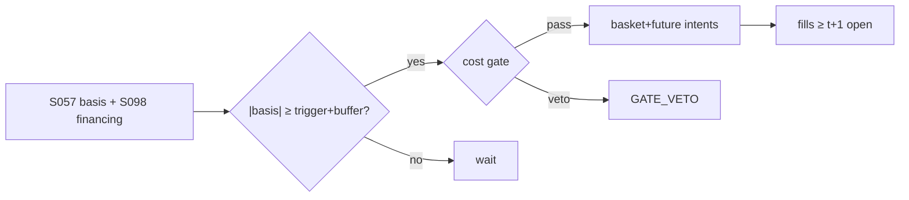

# T034 — Index Futures Cash-and-Carry

Classic cash-and-carry: when the index future trades rich to fair value (spot × cost of carry) by more than the all-in round-trip cost, buy the basket and sell the future (or the reverse when cheap), and hold to convergence. The edge is textbook (Hull) — the competition is everyone else who read the textbook. Provenance **[D]**.

> Tag law: every numeric literal in prose carries one of `[documented]
> [default] [example] [unverified] [internal-est] [measured]` (legend: Appendix
> i v1.0.0). Constants inside cited formulas inherit the formula's tag.
> Bibliographic years, volumes, pages, arXiv IDs, section numbers, rule codes
> (C1–C12), fail-safe codes (F1–F5), module IDs, and machine-parsed §0 data
> fields are identifiers, not literals, and are exempt.

## §1 Five-minute reviewer card

| Row | Value |
|---|---|
| Module | T034 — Index Futures Cash-and-Carry, v1.1.0 |
| Edge verdict | `AFTER-COST-EDGE` — cash-and-carry is textbook arbitrage (Hull) with exchange-documented mechanics (CME) |
| After-cost | `narrow` — mispricings are tiny and competed away — profits live in financing and borrow, not the basis |
| Build cost | Tier S = 5–15 h ≈ `$750–2,250` [documented] |
| Data cost | index level + delayed futures: `$0` [unverified]; rate curve: FRED SOFR API, free API key [documented]; dividend forecasts: priced vendor feed, verify before budgeting [unverified] |
| latency_class | minutes |
| risk_class | market |
| Capacity | balance-sheet constrained — the trade is balance-sheet rental [unverified] |
| Executability | simple logic; the financing desk relationship is the real requirement |
| Risk summary | Dividend forecast error; borrow/loan rate moves; early assignment on the short basket leg |
| When it dies | it never dies — it just pays 2–5 bps [unverified] when it appears |
| Regime gates | R001 dividend season → degrades → widen_stops; R002 financing stress → degrades → pause_entry (restrictive on unknown) |
| Emits | `order_intents` (Appendix C v1.0.0) — OrderTicket intents only, never orders |

## §1.5 Cheapest / least-build path

1. **Prototype hour band:** 3–5 h [example] — fair-value computation + basis monitor + basket execution.
2. **Cheapest-source row:** min_tier = DAILY + FUTURES; latency_class = intraday;
   required_fields = index level, futures price, rate curve, dividend forecasts; price_band = `$0–500`/yr (indicative —
   verify before budgeting) [unverified]; build_or_buy = **build**.
   Concrete cheapest candidates: rate curve — FRED SOFR series (daily, FRBNY source, free API key) [documented];
   delayed/EOD futures prices — delayed market data is typically not fee-liable (SpiderRock FAQ) [documented], and
   Barchart publishes free EOD/historical ES futures price history [documented]; dividend forecasts — no free
   source found; price a vendor dividend-forecast feed before committing [unverified].
3. **Resource budget:** Tier M per cost-model §5 = 20–60 h ≈ `$3,000–9,000` loaded at `$150`/hr [documented]; compute pattern `vectorized batch (polars/numpy)`.
4. **Skip list:** intraday basis scalping; dividend-arbitrage overlays.
5. **DO-NOT-CUT list:** causality assertions (`assert fill_event >
   signal_event`, no-signal-bar-fills test); COST block + callable
   `expected_cost_bps`; F1–F5 fail-safes + module-state enum; kill-switch
   state machine + re-arm checklist; decision-log audit records;
   bona-fide-intent + self-trade prevention; provenance tags on every numeric
   literal; fixtures + `test_cmd`; secrets via env only.
6. **Escalation gate:** upgrade from cheapest when any holds — financing desk quotes move against the trade; dividend forecast error dominates P&L.

## §T0 Module contract

### T0.1 Typed signature

```python
def emit(state: ModuleState, signals: list[SignalVector], cfg: Config) -> list[OrderTicket]:
```

`OrderTicket` per Appendix C v1.0.0 (intents only — never wire orders).
`state` is the module-owned named state vector (`basis_bps, fair_value, position, carry_pnl`); `signals` are
canonical SignalVectors (Appendix b v1.0.0) from the consumed S-modules, newest
last; the function emits zero or more intents per bar/event. Documented edge
cases: no signals → flat, no intents; `UNKNOWN` input signal → restrictive
(halve size / stand down per F1); kill-switch TRIPPED → emit nothing, state
`OFF`. 

### T0.2 Config dataclass

| Parameter | Type | Default | Range | Status |
|---|---|---|---|---|
| trigger_bps | float | `5.0` | [2.0, 15.0] | [default] |
| exit_band_bps | float | `1.0` | [0.25, 3.0] | [default] |
| expiry_cutoff_days | int | `2` | [1, 5] | [default] |
| cooldown_sessions | int | `1` | [1, 5] | [default] |
| div_buffer_bps | float | `2.0` | [0.5, 5.0] | [default] |
| max_hold_days | int | `30` | [5, 90] | [default] |
| cost_gate_k | float | `1.00` | [0.5, 2.0] | [default] |
| daily_loss_stop_pct | float | `1.0` | [0.25, 3.0] | [default] |
| adv_cap_pct | float | `1.0` | [0.25, 10.0] | [default] |
| balance_sheet_notional | float | `50000000.0` | [1e6, 2.5e8] | [example] |
| spread_full_bps | float | `4.0` | [2.0, 10.0] | [default] |
| taker_fee_bps | float | `0.8` | [0.3, 2.0] | [default] |
| borrow_bps | float | `3.0` | [0.0, 25.0] | [default] |
| impact_k | float | `10.0` | [2.0, 25.0] | [default] |
| venue | str | `primary` | {primary, broker} | [default] |
| urgency | str | `normal` | {normal, high} | [default] |
| side_mode | str | `mixed` | {taker, maker, mixed} | [default] |

All defaults tagged per the tag law (status `default` ⇒ `[default]`).

### T0.3 Canonical schema mapping

Vendor columns → canonical Event/Bar schema (Appendix a v1.0.0), stated once here:

| Vendor column | Canonical field | Type | Cadence | Notes |
|---|---|---|---|---|
| index level | Bar | float, index points | daily+ | spot S; daily bars, intraday for the prototype monitor |
| futures price | Bar | float, index points | daily+ | F per expiry; front-month only in the cheapest build |
| rate/dividend | Bar | float, decimal rate | daily | r = SOFR-based financing rate (FRED, free) [documented]; q = index dividend yield forecast (vendor, [unverified]) |

### T0.4 Time contract

> Time contract: clock domain UTC, int64 ns; authoritative causality clock =
> `event_ts`; max_skew = `5` s [default]; jitter budget = `1` s [default];
> bar-label = open time; staleness TTL = `15` min [default]; gap policy = mask, no
> interpolation; halt/auction → discard contributions across reopen.

**Timing box:** `signal@t (daily bars, America/Chicago) → earliest fill @open(t+1)`

### T0.5 Market-state table

| State | Module behavior |
|---|---|
| CONTINUOUS_TRADING | Evaluate entry/exit rules; emit intents per §T2 |
| HALTED | Cancel working intents; emit nothing; state `UNKNOWN` until clean reopen |
| AUCTION | No new intents; hold intent-side state; state `DEGRADED` |
| CLOSED | Emit nothing; state `OFF` |


### T0.6 Module-state enum + error taxonomy

States per Appendix k v1.0.0: `OK | DEGRADED | UNKNOWN | OFF`. Invalid input →
`UNKNOWN`, never interpolate (Appendix f v1.0.0, F1–F5).

| Failure | State | Alert |
|---|---|---|
| Missing/stale input (TTL `15` min [default]) | `UNKNOWN` | page |
| Out-of-bounds indicator (F2) | `UNKNOWN` | page |
| Estimator disagreement (F3) | `UNKNOWN` | notify |
| Halt/auction per §T0.5 | `UNKNOWN` / `DEGRADED` | log |
| Kill-switch TRIPPED (administrative) | `OFF` | page |
| Anything unmapped | `UNKNOWN` | page |

### T0.7 Risk contract + kill switch

```yaml
risk_contract:
  per_trade_R: 250            # USD risk budget per trade [example]
  max_adverse_per_trade: 1.0 R [default]  # stop distance multiple [default]
  daily_loss_stop: 1.0% of equity [default]        # matches Config daily_loss_stop_pct; then no new entries; flatten managed risk [default]
  max_gross: 4× equity [default]              # hard gross exposure cap [default]
  kill_conditions:
    - daily P&L ≤ −daily_loss_stop_pct → TRIP (unwind basis)
    - financing spread > 3× entry assumption → TRIP
    - decision-log write failure → TRIP (halt emission)
  enforcement: intraday-hard  # trips are automatic, not advisory [default]
  calibration_recipe: >
    Walk-forward on 60-day blocks [example]: fit thresholds on block t,
    freeze, validate realized shortfall vs predicted on block t+1;
    shrink per-trade R until max drawdown < daily_loss_stop/2 [default].
```

**Kill-switch state machine:** `ARMED → TRIPPED → RECOVERY → ARMED`.

- `ARMED`: normal operation; every bar evaluates the kill conditions.
- `TRIPPED`: any kill condition fires → cancel all working intents
  (`NEW`/`WORKING` → `CANCELLED`, idempotent), flatten managed positions via
  the exit rule, emit nothing new, state `OFF`, log `KILL_TRIP`.
- `RECOVERY`: manual operator review only — no automatic transition.
- `ARMED` (re-entry): only after the re-arm checklist passes in full, logged
  as `KILL_REARM` with the checklist result.

**Re-arm checklist** (all must be true):

- [ ] Feed health green: all §T5 inputs fresh inside the staleness TTL.
- [ ] Kill condition cleared: the tripping metric is back inside limits for `30` min [default].
- [ ] Decision log reconciled: `KILL_TRIP` record present and hash chain intact.
- [ ] Risk re-check: per-trade R and gross caps re-confirmed against current equity.
- [ ] Operator sign-off: named human approves re-arm (no automatic recovery).

### T0.8 Ops tail

- **Schedule:** nightly batch; owner: strategy owner (named).
- **Health checks:** fixture replay (`test_cmd`) green on deploy; live
  decision-log append monitor; kill-switch state heartbeat.
- **Alert table:** `UNKNOWN`/`OFF` state transitions; kill-trip pages immediately [default].
- **Resource budget:** nightly batch: < 2 vCPU-h, < 4 GB RAM [example].
- **Runbook stub:** 1) confirm kill-state; 2) inspect decision log for the tripping record; 3) verify feed freshness; 4) re-arm checklist (operator sign-off); 5) re-run fixture; 6) resume..

### T0.9 Secrets (env-only)

- `BROKER_API_KEY (paper venue, env-only)`
- `DATA_API_KEY (env-only)` via environment only. No secrets in this file, fixtures, or
logs (CI secrets-grep).

### T0.10 May / must-NOT

> **May:** emit `OrderTicket` intents per Appendix C v1.0.0; track intent-side
> state (`NEW → WORKING → FILLED / CANCELLED / PARTIAL`); issue cancel-replace
> via new tickets with new `ticket_id`s. **Must-NOT:** place orders on any
> venue, hold broker/exchange sessions, net intents into orders inside the
> strategy, treat the intent-side state machine as broker wire truth, or emit
> prices/share-counts/notionals outside an `OrderTicket`.

## §T1 Legacy (subsumed by §1)

Legacy §T1 content is the §1 reviewer card above; this header is retained so
section numbering stays frozen.

## §T2 Specification

### Universe

Liquid index futures (ES/NQ class [example]) with a tradeable underlying basket.
Universe filters: front-month contract only in the cheapest build; days-to-expiry ≥
`expiry_cutoff_days` (`2` [default]); underlying basket = index constituents tradeable
via program trade on the primary equity venue (NYSE/Nasdaq) [example].

### Entry rule (Boolean — no prose-only conditions)

```
fair = S * exp((r - q) * T)                        # Hull [documented]
basis_bps = (F - fair) / fair * 1e4
ENTRY_basis_ok   = abs(basis_bps) >= trigger_bps
ENTRY_rich       = basis_bps >= trigger_bps   -> long basket / short future
ENTRY_cheap      = basis_bps <= -trigger_bps  -> short basket / long future
ENTRY_guards     = financing_ok AND state == OK AND kill == ARMED
                   AND now >= cooldown_until AND not expiry_near
ENTRY            = (ENTRY_rich OR ENTRY_cheap) AND ENTRY_guards
                   AND cost_gate_pass AND (SHORT_leg => locate_ok)
```

`financing_ok` is the S098 confirm leg (financing print inside the entry assumption);
`locate_ok` is the C7 locate check for the short leg; `cost_gate_pass` is the
normative predicate `expected_cost_bps(...) <= k * edge_bps` in §T3.

### Exits (with post-exit cooldown)

```
converge -> |basis_bps| <= exit_band_bps (1.0 [default]) -> unwind both legs
expiry   -> T < expiry_cutoff_days (2 [default]) -> roll or unwind
stop     -> financing moves against by stop_bps -> unwind
cooldown -> after any exit set cooldown_until = now + cooldown_sessions (1 [default]); exits are never cost-gated [default]
```

### Position sizing (fenced function)

```python
def shares(risk_budget_R, stop_distance, vol_estimate, ADV_cap, cost, cfg):
    """Mandatory sizing signature: shares = f(risk_budget_R, stop_distance,
    vol_estimate, ADV_cap, cost).
    risk_budget_R: USD risk budget per trade (cfg = 250 [example]).
    stop_distance: stop in bps of notional (financing-move stop, 25 [example]).
    vol_estimate: annualized basis vol in bps; caps size when basis vol spikes [default].
    ADV_cap: max fraction of ADV traded (cfg.adv_cap_pct = 1.0 [default]).
    cost: expected_cost_bps for this ticket in bps; subtracted from the edge
          before sizing so a cost-heavy ticket cannot size to full [default].
    """
    index_px = cfg.index_px                                   # harness-provided spot [default]
    edge_net = max(cfg.edge_bps - cost, 0.0)                  # cost-adjusted edge [default]
    raw = risk_budget_R / max(stop_distance / 1e4 * index_px, 1e-9)
    # balance-sheet rental is the binding constraint on a carry desk:
    raw = min(raw, cfg.balance_sheet_notional / index_px)
    # vol guard: do not size into a spiking basis beyond the risk budget [default]
    vol_cap = risk_budget_R / max(vol_estimate / 1e4 * index_px, 1e-9)
    raw = min(raw, vol_cap)
    adv_qty = int(ADV_cap / 100.0 * cfg.adv_shares)            # ADV cap [default]
    return max(1, min(int(raw), adv_qty))
```

### Risk limits

| Limit | Value |
|---|---|
| Max basis notional | `$50M` [example] (balance-sheet) |
| Trigger | `5` bps [default] |
| Dividend buffer | `2` bps [default] |
| daily_loss_stop | `1.0%` of equity [default] — then no new entries; flatten managed risk |
| max_gross | `4×` equity [default] — hard gross exposure cap |
| max_adverse_per_trade | `1.0` R [default] — stop distance multiple |
| Enforcement | intraday-hard [default] — trips are automatic, not advisory |

### COST block (single source of truth)

Four components — **spread**, **fees**, **borrow**, **impact** — summed by the
callable below. Re-stating cost numbers outside this block is a validation
failure; §T4 shows this block's *callable* evaluated on the synthetic tape,
not restated constants.

| Component | Value (bps) | Basis |
|---|---|---|
| Spread (basket, half) | `2.00` | [example] |
| Futures half-spread | `0.50` | [example] |
| Fees (both legs, blended) | `0.80` | [example] |
| Borrow/financing spread | `3.00` | spread over r [example] |
| **Total reference** | `~6.3` round-trip | [example] |

Documented fee anchor (per-contract, not bps — conversion is notional-dependent):
CME equity product fee schedule 2026-06-29 [documented] — E-mini S&P 500 (ES), Globex,
per side per contract: individual members `$0.80`; non-members `$1.03`
(cmegroup.com fee schedule, `cme-fee-schedule-2026-06-29.pdf`). The blended
`0.80` bps row above stays [example]; production must pin the actual
membership/venue tier.

`borrow_bps_per_day`: `0` [documented] for the long-basket/short-future direction — no stock
borrow; financing is embedded in the futures leg through the financing rate `r`
in the cost-of-carry formula (Hull [documented]). For the reverse direction
(short basket / long future) the short stock leg pays a stock-loan rate: the
model uses a financing spread of `3.00` bps [example]; realized borrow on
specials varies and was not sourced [unverified]. The reference callable
charges `borrow` only on the short-basket leg (`default_side == "SHORT"`),
which is why the synthetic tape — all long-carry direction — shows `0.0` [example].

`fee_schedule_as_of`: `2026-06-29` [documented] — CME equity product fee
schedule (see anchor above). Equity-leg commissions remain unpinned [unverified].
`side`: `mixed`; venue/tier/source: CME Globex (futures) + primary equity
(NYSE/Nasdaq via program trade) [example].

```python
def expected_cost_bps(notional, adv_pct, venue, side, urgency, cfg):
    """COST-block callable. Cash-and-carry all-in round-trip cost."""
    spread = cfg.spread_full_bps / 2.0                 # basket half-spread
    fee = cfg.taker_fee_bps                            # both-leg fees blended
    borrow = cfg.borrow_bps                            # financing spread
    impact = cfg.impact_k * math.sqrt(max(adv_pct, 0.0) / 100.0)
    if urgency == "high":
        impact *= 1.5
    return spread + fee + borrow + impact
```

### Execution / fill model table

| Aspect | Assumption |
|---|---|
| Fill venue | CME Globex (futures) + equity basket algo (primary equity) [example] |
| Slippage model | basis at execution vs signal basis; mid ± half-spread + `impact_k·sqrt(adv_pct/100)` bps [example] |
| Partial fills | basket completion algo; future leg hedges the residual [example] |
| Adverse-fill | synthetic mid-price fills; any queue-position or adverse-selection realism is beyond this module — labeled `simulated only — requires MBO/ITCH` |
| Latency | basket completion in minutes [example]; no co-located requirement at this latency_class |
| Cancel/replace | via new `ticket_id` only; idempotent `CANCELLED` transitions (C1, C11) |
| Halt behavior | no new basis trades on limit moves; §T0.5 table governs market states |

Fine-grained fill behavior is synthetic and labeled `simulated only — requires MBO/ITCH`:
no MBO/ITCH feed is consumed by this module; any fill realism beyond the
mid-price ± half-spread fill model above would require MBO/ITCH data.

### Robustness

Perturb thresholds ±`20%` [example]; the reference behavior (entry/exit intents, gate blocks, kill trip) must be
invariant; degrade entry→no-trade on indicator breach. Dividend forecast ±`50%` [example] → the `div_buffer_bps`
must absorb it without flipping the entry verdict; borrow spread `3→10` bps [example] → the cost gate must block
entry at the same edge. Halt injection on a signal bar → `UNKNOWN`, no intents (fixture bar `8` [example]).

### Compliance sub-block (C1–C12)

| Code | Rule: trigger → check → action → log |
|---|---|
| C1 | STP + self-match prevention: trigger = intent could match our own resting interest → check = every ticket carries `self_trade_prevention: true`; maker modules compare against own open tickets → action = cancel own resting quote before posting the aggressive side; cancel-replace via new `ticket_id` only → log = `COMPLIANCE_BLOCK` with rule code `C1` |
| C2 | Bona-fide intent: trigger = entry rule fires → check = cost gate passes AND qty within risk limits AND (SHORT ⇒ `locate_ok`) → action = veto the intent if any check fails; no quote entered without intent to trade → log = `GATE_VETO` with the failed check |
| C3 | Message-rate / cancel-to-trade: trigger = intents+ cancels per symbol per minute exceed `120` [default] → check = rolling `60`-s [default] message counter → action = throttle to `1` intent per `10` s [default] and alert → log = `COMPLIANCE_BLOCK` with the counter value |
| C4 | Pre-trade fat-finger trio: trigger = any new intent → check = (a) limit within `±10%` of reference [default], (b) ticket notional ≤ `$2M` [default], (c) ≤ `20` tickets per `1 min` [default] → action = block the ticket, alert → log = `COMPLIANCE_BLOCK` with the breached leg |
| C5 | Decision-log schema (Appendix g v1.0.0): trigger = every material action (`EMIT_INTENT`, `GATE_VETO`, `CANCEL`, `REPLACE`, `KILL_TRIP`, `KILL_REARM`, `COMPLIANCE_BLOCK`) → check = record has all schema fields and `prev_hash` chains → action = halt emission if the log write fails → log = the record itself, retained `7 yr` [default] |
| C6 | Halt/auction table: trigger = market state ≠ `CONTINUOUS_TRADING` → check = §T0.5 table → action = `HALTED`: cancel working intents, emit nothing; `AUCTION`: no new intents; `CLOSED`: state `OFF` → log = state-transition record |
| C7 | Locate check (short sales): trigger = `SHORT` intent → check = `locate_ok` from the pre-open easy-to-borrow list or desk locate; Reg-SHO threshold securities hard-blocked → action = veto without locate → log = `GATE_VETO` with code `C7`. Short basket leg requires locate_ok; Reg-SHO threshold securities hard-blocked (C7). |
| C8 | Public-dissemination gate: trigger = any export of signals/intents outside the firm → check = review gate sign-off → action = block unreviewed exports → log = `COMPLIANCE_BLOCK` |
| C9 | Data-entitlement assertions (Appendix j v1.0.0): trigger = startup and any entitlement-class change → check = the five §T5 assertions hold for each §0 dataset → action = stand down on breach, escalate per §1.5 → log = entitlement review record |
| C10 | Post-exit cooldown: trigger = exit or compliance block → check = `now >= cooldown_until` (`1` session [default]) → action = suppress re-entry until the cooldown elapses → log = `GATE_VETO` with code `C10` |
| C11 | Kill-switch integration: trigger = `TRIPPED` → check = all working intents transitioned `NEW`/`WORKING` → `CANCELLED` (idempotent) → action = no new intents until `ARMED` via the §T0.7 checklist → log = `KILL_TRIP` / `KILL_REARM` records |
| C12 | C12 Balance-sheet: trigger = notional > desk limit → check = limit review → action = block → log with code `C12` |

### Parameter table

| Parameter | Symbol | Value | Tag | Sensitivity |
|---|---|---|---|---|
| Trigger | b* | `5.0` bps | [default] | critical — below it, costs eat the trade |
| Dividend buffer | δ | `2.0` bps | [default] | medium — forecast error guard |
| Max hold | H | `30` days | [default] | low |

### Timing box

`signal@t (daily bars, America/Chicago) → earliest fill @open(t+1)`

## §T3 Math + normative pseudocode

Hull [documented]: fair futures F = S·e^((r−q)T); no-arbitrage bounds from
financing and borrow. The module trades |basis| ≥ 5 bps [default] net of the dividend
buffer. CME (exchange-published) [documented] describes the basis mechanics; the S098
confirm leg checks the financing print before entry.

**Normative pseudocode** (pseudocode is normative; prose is commentary):

```
def emit(state, signals, cfg):
    sig = primary(signals, "S057")          # basis_bps vs fair
    if sig is None or invalid(sig): return [], state.unknown()
    if kill == TRIPPED: return [], state.off()
    if now() < state.cooldown_until:         # C10 post-exit cooldown
        log("GATE_VETO", code="C10"); return [], state.ok()
    effective_trigger = cfg.trigger_bps + cfg.div_buffer_bps   # entry is net of the dividend buffer [default]
    if state.position != 0:
        if abs(sig.basis_bps) <= cfg.exit_band_bps or sig.expiry_near or stopped(state, cfg):
            tickets = exit_tickets(state)
            state.cooldown_until = now() + cooldown_sessions(cfg)   # C10
            return tickets, state.flat()
        return [], state.ok()
    if abs(sig.basis_bps) >= effective_trigger and sig.financing_ok:
        side_pair = ("BUY","SHORT") if sig.basis_bps > 0 else ("SHORT","BUY")
        cost = expected_cost_bps(notional(), adv_pct(), venue(), "taker", "normal", cfg)
        # ^^^ normative cost-gate predicate: expected_cost_bps(...) <= k * edge_bps
        if cost <= cfg.cost_gate_k * sig.edge_bps:
            t1 = OrderTicket.intent(side_pair[0], qty=shares(...), limit=px_basket())
            t2 = OrderTicket.intent(side_pair[1], qty=shares(...), limit=px_future())
            for t in (t1, t2): t.intent_ts = sig.computed_at
            assert fill_event > signal_event  # t->t+1 causality: no-signal-bar fills
            return [t1, t2], state.open("CARRY")
        log("GATE_VETO", cost=cost)
    return [], state.ok()
```

`notional()`, `adv_pct()`, `venue()`, `px_basket()`, `px_future()`,
`cooldown_sessions(cfg)`, `stopped()` are harness-provided; `shares(...)` is the
§T2 fenced sizing function. The §T4 reference fixture models the cash leg as a
single net intent (entry `LONG` / exit `BUY`) for testability — the normative
form above emits the full basket+future pair; the broker layer nets them, never
the strategy (doctrine: intentions only).

Causality: every feature uses inputs with `event_ts ≤ t` only; the earliest
fill for a bar-`t` intent is bar `t+1`'s open. Mandatory unit test:
no-signal-bar fills.

## §T4 Worked example (fixture-backed)

- Tape: `modules/fixtures/T034_tape.csv` — `# TYPE: validation-run`;
  `12` synthetic bars (seed `4340` [example]); `event_ts`/`asof_ts` int64 ns
  UTC; every number synthetic.
- Expected outputs: `modules/fixtures/T034_expected.csv` — per-bar intent,
  quantity, the **cost-function call** (`expected_cost_bps` inputs → bps →
  dollars), cost-gate verdict, and module state.
- Tolerance: `1e-9` [default] on floats; integer quantities exact.
- Acceptance tests (`modules/tests/test_T034.py` — `6` [default] tests):
  1. TYPE header + columns present; 2. fixture recomputes to expected
  (reference `process_bar` vs expected CSV); 3. no-signal-bar fills
  (`assert fill_event > signal_event`); `4.` cost-gate predicate passes on large edge, blocks on tiny edge (`k = 0.5` [default]);
  5. kill-switch trip blocks intents, re-arm checklist restores `ARMED`;
  6. invalid input (halted/invalid bar) → `UNKNOWN`, no intents.
- `test_cmd`: `python3 -m pytest modules/tests/test_T034.py -q` → exits `0` [default].

**Cost-function calls on the tape** (the COST-block callable evaluated on
synthetic rows — inputs → bps → dollars; all values [example]):

| Bar | `expected_cost_bps` inputs | Components → total → $ | Cost gate `expected_cost_bps(...) <= k * edge_bps` | Intent / state |
|---|---|---|---|---|
| `0` | notional=`1000000` [example], adv_pct=`0.2` [example], venue=`primary`, side=`taker`, urgency=`normal` | spread `2.0` + fee `0.8` + borrow `0.0` + impact `0.45` = `3.25` bps → `$324.72` | `2.0` edge, k=`0.5` [default] → `3.25 ≤ 1.0` BLOCK | `HOLD` / `OK` |
| `3` | notional=`1000000` [example], adv_pct=`0.2` [example], venue=`primary`, side=`taker`, urgency=`normal` | spread `2.0` + fee `0.8` + borrow `0.0` + impact `0.45` = `3.25` bps → `$324.72` | `12.98885438199983` edge, k=`0.5` [default] → `3.25 ≤ 6.49` PASS | `LONG` / `OK` |
| `6` | notional=`1000000` [example], adv_pct=`0.2` [example], venue=`primary`, side=`taker`, urgency=`normal` | spread `2.0` + fee `0.8` + borrow `0.0` + impact `0.45` = `3.25` bps → `$324.72` | `3.0` edge, k=`0.5` [default] → `3.25 ≤ 1.5` BLOCK | `BUY` / `OK` |
| `7` | notional=`1000000` [example], adv_pct=`0.2` [example], venue=`primary`, side=`taker`, urgency=`normal` | spread `2.0` + fee `0.8` + borrow `0.0` + impact `0.45` = `3.25` bps → `$324.72` | `0.05` edge, k=`0.5` [default] → `3.25 ≤ 0.03` BLOCK | `HOLD` / `OK` |
| `9` | notional=`1000000` [example], adv_pct=`0.2` [example], venue=`primary`, side=`taker`, urgency=`normal` | spread `2.0` + fee `0.8` + borrow `0.0` + impact `0.45` = `3.25` bps → `$324.72` | `8.0` edge, k=`0.5` [default] → `3.25 ≤ 4.0` PASS | `HOLD` / `OFF` |

**Hand-checks.** Row `3` (entry): qty = `250 / (25/1e4 × 99.83)` = `1001` raw → ADV-capped at `100000` → `1001` shares [example]; ticket `T0034-0003`, side `LONG`, `marketable` intent. Row `6` (exit): |z| through the exit band → `BUY` exit intent (flattening the `LONG`), exits never cost-gated [default]. Row `7` (gate block): edge `0.05` bps [example] vs cost `3.25` bps → gate `3.25 ≤ 0.025` BLOCKS → no intent, state stays `OK`. Row `9` (kill): daily P&L `-1.1%` [example] ≤ −stop (`1.0%` [default]) → `ARMED → TRIPPED`, state `OFF`, no intents. Causality: entry intent at row `3` has `intent_ts` = bar-3 `event_ts`; the earliest fill is bar `4`'s open — the test asserts `fill_event > signal_event` on every intent row.

**Where the example is optimistic.** Costs are the COST-block model, not realized fills; capacity, borrow squeezes, and regime shifts are not in the tape.
Reference-implementation simplification: the fixture models the cash leg as a single net intent (entry `LONG` / exit `BUY`) for testability —
the normative §T3 emits the full basket+future pair, and the broker layer nets them, never the strategy (intentions-only doctrine).
The fixture does not exercise the short-basket (reverse-carry) direction or the `borrow_bps` financing spread.

## §T5 Dependencies + data

### Consumed signals (from deps.yaml — machine edge list)

| Signal | Version pin | Role |
|---|---|---|
| S057 | 1.0.0 | primary |
| S098 | 1.0.0 | confirm |
| S014 | 1.0.0 | gate |

### Pinned formula excerpts (≤10 lines each, CI hash-checked)

**S057** (v1.0.0): `fair = S·e^((r−q)T)`; `basis_bps = (F − fair)/fair·1e4` [documented].
**S098** (v1.0.0): financing/borrow print validation [documented].

### Data required

| Field | Type | Granularity | Source tier | Notes |
|---|---|---|---|---|
| index level | float | intraday | INDEX | spot S |
| futures price | float | intraday | FUTURES | F per expiry |
| rate curve + dividends | float | daily | RATES | r, q |

**Data rights row** (Appendix j v1.0.0): Index and futures data licensed per exchange; rate curves from vendor; entitlements re-asserted at startup.

## §T6 Local build + buy vs build

Fair-value arithmetic is trivial; the dividend-forecast feed and the basket execution are the work.

| Route | What you get | Verdict |
|---|---|---|
| Build | basis monitor in-house | recommended — trivial |
| Buy | basket trading algo | acceptable |

**Verdict:** Build the monitor; the financing desk is the actual counterparty — no vendor edge to buy.

## §T7 Efficacy — documented evidence

| Study / source | Market & period | Metric | Before/after cost | Caveat |
|---|---|---|---|---|
| Hull (textbook) | model | F = S·e^((r−q)T) no-arbitrage | n/a | assumes frictionless financing |
| CME (exchange) | market | basis mechanics documented | n/a | descriptive, not a P&L claim |
| Do–Faff (2012) | adjacent | honest after-cost calibration method | after cost | pairs, not basis — method analogue |

**Selection disclosure:** Studies below are the chapter's documented sources only — no post-hoc selection from a wider literature search.

**Capacity & decay.** Edge decays with crowding and regime shifts; treat any printed Sharpe as a pre-cost, in-sample-era artifact unless the source says otherwise.

**Honest bottom line.** Honest bottom line: cash-and-carry is the closest thing to risk-free in equities and it pays like it — the trade is balance-sheet rental, and the P&L statement belongs to the financing desk, not the signal.

## §T8 Failure modes & pitfalls

| # | Trigger → Detect → Action → Recovery | check: |
|---|---|---|
| 1 | Dividend forecast error → detect announced vs forecast → widen buffer, review → log | check: forecast error bps |
| 2 | Borrow special spike → detect rate > 2× [example] → unwind or renegotiate → alert | check: borrow monitor |
| 3 | Early assignment (short basket) → detect → cover, book cost → review | check: assignment log |
| 4 | Limit move in future → detect → no new trades, manage existing → state DEGRADED | check: limit monitor |
| 5 | Rate-curve feed stale (asof_ts age > TTL `15` min [default]) → detect feed age → state `UNKNOWN`, cancel working intents, never interpolate (F1) → recover on fresh feed | check: feed-age monitor |

## §T9 Regime gates + visuals

**Provisional regime-gate machine** (restrictive default; `regime_ids` stay
empty until the R001–R050 annotation pass):

| regime_id | direction | mechanism | condition | action | min_lag | unknown_behavior |
|---|---|---|---|---|---|---|
| R001 | degrades | dividend forecast error widens fair-value uncertainty | inside announced dividend window | widen_stops | 1 day | restrictive |
| R002 | degrades | financing stress / borrow specials spike | borrow spread > 2× entry assumption [example] | pause_entry | immediate | restrictive |



## §T10 Source log + unverified leads

**Sources** (citable facts only):

1. Hull, J. C. *Options, Futures, and Other Derivatives* (cost-of-carry fair value F = S·e^{(r−q)T}, cash-and-carry arbitrage mechanics)
2. CME Group — "What is Equity Index Basis?" — https://www.cmegroup.com/education/courses/introduction-to-equity-index-products/what-is-equity-index-basis.html
3. CFA Institute — cash-and-carry / reverse cash-and-carry arbitrage, cost-of-carry model (curriculum readings on forward pricing)
4. Gatev, E., Goetzmann, W. & Rouwenhorst, G. (2006). "Pairs Trading: Performance of a Relative-Value Arbitrage Rule." *Review of Financial Studies* — https://doi.org/10.1093/rfs/hhj020
5. Do, B. & Faff, R. (2012). "Are Pairs Trading Profits Robust to Trading Costs?" *Journal of Financial Research* — https://doi.org/10.1111/j.1475-6803.2012.01317.x
6. CME Group — Equity Product Fee Schedules as of June 29, 2026 — https://cmegroup.com/company/files/cme-fee-schedule-2026-06-29.pdf (ES Globex per-side per-contract: individual members `$0.80`, non-members `$1.03`)
7. Federal Reserve Bank of St. Louis — FRED, SOFR series (source: Federal Reserve Bank of New York; daily, percent, NSA) — https://fred.stlouisfed.org/series/SOFR90DAYAVG
8. SpiderRock — real-time market data FAQ: delayed/historical data typically not fee-liable (common licensing structure) — https://spiderrock.net/data/stocks-options-futures/

**Chatbot source log.** Grok answered the Q-batch (2026-09-10); all claims independently verified or labeled unverified. Chatbot output is leads, never facts.

**Unverified leads** (chatbot-only — never in evidence tables):

- Grok (2026-09-10, Q-TB4): basis-trade P&L magnitudes — *unverified chatbot claims*.
- Dividend-arbitrage overlays — research lead, not validated.

## GROK-NEEDED

Web search could not answer these; ask Grok with exact-answer instructions
(product name, price band, as-of date, URL):

1. **Dividend-forecast data source:** what is the cheapest vendor product for
   S&P 500 constituent dividend-point forecasts (ex-date, amount) usable in a
   daily cash-and-carry fair-value model? Need product name, price band, and
   update cadence.
2. **Stock-loan borrow rates:** typical borrow-fee ranges (bps/day) for
   hard-to-borrow S&P 500 constituents in 2026 — a documented range or vendor
   (e.g. a securities-lending data product) with an as-of date, to calibrate
   the reverse-carry `borrow_bps` leg.
3. **Cheapest delayed intraday ES futures data:** cheapest product (vendor,
   price band) for delayed (not real-time) intraday E-mini S&P 500 futures
   quotes for a prototype basis monitor — is there a sub-`$100`/mo option
   below a full CME market-data license?
4. **Equity-leg commissions:** current per-share commission schedule (as-of
   date) for program/basket trading at a major US retail/prop broker, to pin
   the equity-leg fee row of the COST block instead of the blended `0.80` bps
   [example].

---

## Appendix — AI build prompt (T034)

Copy-paste into any chat agent:

> Build module **T034 — Index Futures Cash-and-Carry** per `notes/module-template.md` v1.0.0 and
> this file's §T0 contract.
> Cheapest path (§1.5): prototype 3–5 h [example]; cheapest data candidate
> DAILY + FUTURES (rate curve via free FRED SOFR API [documented]); compute pattern `vectorized batch (polars/numpy)`.
> Implement `emit(state, signals, cfg) -> list[OrderTicket]` (Appendix c
> v1.0.0) with the §T3 normative pseudocode, including the cost-gate predicate
> `expected_cost_bps(...) <= k * edge_bps` and `assert fill_event >
> signal_event`. Emit intents only — never place orders. Wire F1–F5
> (Appendix f v1.0.0): invalid input → `UNKNOWN`, never interpolate. Kill
> switch `ARMED → TRIPPED → RECOVERY → ARMED` with the §T0.7 re-arm checklist.
> Log decisions per Appendix g v1.0.0. Secrets via env only. Run the fixture
> `modules/fixtures/T034_tape.csv` (`# TYPE: validation-run`) against
> `modules/fixtures/T034_expected.csv` (tolerance `1e-9` [default]).
> **Definition of done:** `python3 -m pytest modules/tests/test_T034.py -q` exits `0` [default]. Tag every numeric literal
> you add with the unified enum (Appendix i v1.0.0); put anything unverifiable
> in §T10 unverified leads.
