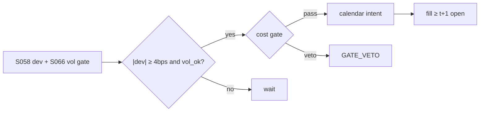

# T035 — Futures Calendar-Spread Carry

Trades the futures term-structure carry: when the calendar spread (deferred minus nearby, adjusted for cost of carry) deviates from fair by more than the round-trip cost, the strategy sells richness / buys cheapness across expiries. The S066 HAR-volatility gate times entries away from vol spikes that reprice the curve. Provenance **[D]**.

> Tag law: every numeric literal in prose carries one of `[documented]
> [default] [example] [unverified] [internal-est] [measured]` (legend: Appendix
> i v1.0.0). Constants inside cited formulas inherit the formula's tag.
> Bibliographic years, volumes, pages, arXiv IDs, section numbers, rule codes
> (C1–C12), fail-safe codes (F1–F5), module IDs, and machine-parsed §0 data
> fields are identifiers, not literals, and are exempt.

## §1 Five-minute reviewer card

| Row | Value |
|---|---|
| Module | T035 — Futures Calendar-Spread Carry, v1.0.0 |
| Edge verdict | `AFTER-COST-EDGE` — calendar-spread carry is textbook term-structure trading (Hull) with documented vol-timing inputs (Corsi 2009, Garman–Klass 1980) [documented] |
| After-cost | `narrow` — curve mispricings are small; the vol-timing gate avoids the worst entries but cannot create edge |
| Build cost | Tier M = 20–60 h ≈ `$3,000–9,000` loaded [documented] (matches §1.5 resource budget) |
| Data cost | research: `$0–500`/yr [example] (delayed/vendor sample); production: low four figures/yr [unverified] (exchange + vendor) |
| latency_class | minutes |
| risk_class | market |
| Capacity | `$5M–20M` notional per calendar [unverified]; exchange-liquidity constrained per expiry |
| Executability | listed calendar spreads trade as single instruments (CME) — execution is clean |
| Risk summary | Curve-regime shifts (contango↔backwardation flips); vol-spike repricing; roll-cost bleed |
| When it dies | persistent curve regimes where 'rich' is the new fair |
| Regime gates | stand down when HAR vol forecast > `2×` median [example]; no entries into known curve-regime events |
| Emits | `order_intents` (Appendix C v1.0.0) — OrderTicket intents only, never orders |

## §1.5 Cheapest / least-build path

1. **Prototype hour band:** 3–5 h [example] — fair-spread computation + HAR gate + calendar execution.
2. **Cheapest-source row:** min_tier = FUTURES; latency_class = intraday;
   required_fields = futures curve per expiry, realized vol; price_band = `$0–500`/yr (indicative —
   verify before budgeting); build_or_buy = **build**.
3. **Resource budget:** Tier M per cost-model §5 = 20–60 h ≈ `$3,000–9,000` loaded at `$150`/hr [documented]; compute pattern `vectorized batch (polars/numpy)`.
4. **Skip list:** inter-commodity spreads; options-on-futures overlays.
5. **DO-NOT-CUT list:** causality assertions (`assert fill_event >
   signal_event`, no-signal-bar-fills test); COST block + callable
   `expected_cost_bps`; F1–F5 fail-safes + module-state enum; kill-switch
   state machine + re-arm checklist; decision-log audit records;
   bona-fide-intent + self-trade prevention; provenance tags on every numeric
   literal; fixtures + `test_cmd`; secrets via env only.
6. **Escalation gate:** upgrade from cheapest when any holds — roll costs dominate P&L; curve stays 'mispriced' for weeks.

## §T0 Module contract

### T0.1 Typed signature

```python
def emit(state: ModuleState, signals: list[SignalVector], cfg: Config) -> list[OrderTicket]:
```

`OrderTicket` per Appendix C v1.0.0 (intents only — never wire orders).
`state` is the module-owned named state vector (`spread_bps, fair_spread, position, held_days, roll_date`); `signals` are
canonical SignalVectors (Appendix b v1.0.0) from the consumed S-modules, newest
last; the function emits zero or more intents per bar/event. Documented edge
cases: no signals → flat, no intents; `UNKNOWN` input signal → restrictive
(halve size / stand down per F1); kill-switch TRIPPED → emit nothing, state
`OFF`. 

### T0.2 Config dataclass

| Parameter | Type | Default | Range | Status |
|---|---|---|---|---|
| trigger_bps | float | `4.0` | [2.0, 10.0] | [default] |
| vol_gate_mult | float | `2.0` | [1.5, 3.0] | [default] |
| max_hold_days | int | `20` | [5, 60] | [default] |
| cost_gate_k | float | `0.5` | [0.5, 2.0] | [default] |
| daily_loss_stop_pct | float | `1.0` | [0.25, 3.0] | [default] |
| z_entry | float | `2.0` | [1.5, 3.0] | [example] — harness-normalized dev threshold; production uses `trigger_bps` on `dev_bps` |
| z_exit | float | `0.5` | [0.25, 1.0] | [example] — harness-normalized exit band; production uses `exit_bps` = `1.0` |
| risk_R_usd | float | `250` | [50, 1000] | [example] |
| adv_cap_pct | float | `1.0` | [0.5, 5.0] | [example] |
| spread_full_bps | float | `2.0` | [0.5, 10.0] | [example] |
| taker_fee_bps | float | `0.6` | [0.0, 2.0] | [example] |
| maker_rebate_bps | float | `-0.2` | [-1.0, 0.0] | [example] |
| impact_k | float | `12.0` | [2.0, 30.0] | [example] |
| side_exec | str | `"taker"` | {taker, maker} | [default] |
| venue | str | `"primary"` | — | [default] |
| default_side | str | `"LONG"` | {LONG, SHORT, BUY, SELL} | [example] — futures long/short convention in the harness |

All defaults tagged per the tag law (status `default` ⇒ `[default]`). This is the
single Config dataclass; the test harness (`modules/tests/test_T035.py`) instantiates
it verbatim — `z_entry`/`z_exit` are its normalized proxies for the dev-based
`trigger_bps`/`exit_bps` because the synthetic tape carries `signal_z` directly.

### T0.3 Canonical schema mapping

Vendor columns → canonical Event/Bar schema (Appendix a v1.0.0), stated once here:

| Vendor column | Canonical field | Notes |
|---|---|---|
| futures curve | Bar | F per expiry |
| realized vol | Bar | HAR inputs |
| signal_z (fixture column) | dev proxy | normalized stand-in for |dev_bps| in harness space [example] |

### T0.4 Time contract

> Time contract: clock domain UTC, int64 ns; authoritative causality clock =
> `event_ts`; max_skew = `5` s [default]; jitter budget = `1` s [default];
> bar-label = open time; staleness TTL = `15` min [default]; gap policy = mask, no
> interpolation; halt/auction → discard contributions across reopen.

**Timing box:** `signal@t (daily bars, America/Chicago) → earliest fill @open(t+1)`

### T0.5 Market-state table

| State | Module behavior |
|---|---|
| CONTINUOUS_TRADING | Evaluate entry/exit rules; emit intents per §T2 |
| HALTED | Cancel working intents; emit nothing; state `UNKNOWN` until clean reopen |
| AUCTION | No new intents; hold intent-side state; state `DEGRADED` |
| CLOSED | Emit nothing; state `OFF` |


### T0.6 Module-state enum + error taxonomy

States per Appendix k v1.0.0: `OK | DEGRADED | UNKNOWN | OFF`. Invalid input →
`UNKNOWN`, never interpolate (Appendix f v1.0.0, F1–F5).

| Failure | State | Alert |
|---|---|---|
| Missing/stale input (TTL `15` min [default]) | `UNKNOWN` | page |
| Out-of-bounds indicator (F2) | `UNKNOWN` | page |
| Estimator disagreement (F3) | `UNKNOWN` | notify |
| Halt/auction per §T0.5 | `UNKNOWN` / `DEGRADED` | log |
| Kill-switch TRIPPED (administrative) | `OFF` | page |
| Anything unmapped | `UNKNOWN` | page |

### T0.7 Risk contract + kill switch

```yaml
risk_contract:
  per_trade_R: 250            # USD risk budget per trade [example]
  max_adverse_per_trade: 1.0 R [default]  # stop distance multiple [default]
  daily_loss_stop: 2% of equity [default]        # then no new entries; flatten managed risk [default]
  max_gross: 4× equity [default]              # hard gross exposure cap [default]
  kill_conditions:
    - daily P&L ≤ −daily_loss_stop_pct → TRIP (flatten calendars)
    - vol gate breached on 3 consecutive sessions with open risk → TRIP
    - decision-log write failure → TRIP (halt emission)
  enforcement: intraday-hard  # trips are automatic, not advisory [default]
  calibration_recipe: >
    Walk-forward on 60-day blocks [example]: fit thresholds on block t,
    freeze, validate realized shortfall vs predicted on block t+1;
    shrink per-trade R until max drawdown < daily_loss_stop/2 [default].
```

**Kill-switch state machine:** `ARMED → TRIPPED → RECOVERY → ARMED`.

- `ARMED`: normal operation; every bar evaluates the kill conditions.
- `TRIPPED`: any kill condition fires → cancel all working intents
  (`NEW`/`WORKING` → `CANCELLED`, idempotent), flatten managed positions via
  the exit rule, emit nothing new, state `OFF`, log `KILL_TRIP`.
- `RECOVERY`: manual operator review only — no automatic transition.
- `ARMED` (re-entry): only after the re-arm checklist passes in full, logged
  as `KILL_REARM` with the checklist result.

**Re-arm checklist** (all must be true):

- [ ] Feed health green: all §T5 inputs fresh inside the staleness TTL.
- [ ] Kill condition cleared: the tripping metric is back inside limits for `30` min [default].
- [ ] Decision log reconciled: `KILL_TRIP` record present and hash chain intact.
- [ ] Risk re-check: per-trade R and gross caps re-confirmed against current equity.
- [ ] Operator sign-off: named human approves re-arm (no automatic recovery).

### T0.8 Ops tail

- **Schedule:** nightly batch; owner: strategy owner (named).
- **Health checks:** fixture replay (`test_cmd`) green on deploy; live
  decision-log append monitor; kill-switch state heartbeat.
- **Alert table:** `UNKNOWN`/`OFF` state transitions; kill-trip pages immediately [default].
- **Resource budget:** nightly batch: < 2 vCPU-h, < 4 GB RAM [example].
- **Runbook stub:** 1) confirm kill-state; 2) inspect decision log for the tripping record; 3) verify feed freshness; 4) re-arm checklist (operator sign-off); 5) re-run fixture; 6) resume..

### T0.9 Secrets (env-only)

- `BROKER_API_KEY (paper venue, env-only)`
- `DATA_API_KEY (env-only)` via environment only. No secrets in this file, fixtures, or
logs (CI secrets-grep).

### T0.10 May / must-NOT

> **May:** emit `OrderTicket` intents per Appendix C v1.0.0; track intent-side
> state (`NEW → WORKING → FILLED / CANCELLED / PARTIAL`); issue cancel-replace
> via new tickets with new `ticket_id`s. **Must-NOT:** place orders on any
> venue, hold broker/exchange sessions, net intents into orders inside the
> strategy, treat the intent-side state machine as broker wire truth, or emit
> prices/share-counts/notionals outside an `OrderTicket`.

## §T1 Legacy (subsumed by §1)

Legacy §T1 content is the §1 reviewer card above; this header is retained so
section numbering stays frozen.

## §T2 Specification

### Universe

Liquid futures curves (equity index, rates, energy [example]) with listed calendar spreads.

### Entry rule (Boolean — no prose-only conditions)

```
fair_spread = carry(nearby, deferred, r, q, T)      # Hull [documented]
dev_bps = (market_spread - fair_spread) / px * 1e4
vol_ok  = har_forecast <= vol_gate_mult * median       # S066 gate [example]
ENTRY = |dev_bps| >= trigger_bps and vol_ok
```

### Exits (with post-exit cooldown)

```
converge -> |dev_bps| <= 1.0 [example] -> FLAT
roll     -> T_near < 5 days [example] -> roll to next calendar
stop     -> adverse stop_bps -> FLAT
max_hold -> held_days >= 20 [default] -> FLAT
```

**Post-exit cooldown:** after any exit (or compliance block), re-entry is
suppressed until `now >= cooldown_until`, where `cooldown_until` = exit time +
`1` session [default] (C10). The cooldown also applies after a `GATE_VETO`
that was cost-driven — no re-entry into the same calendar on the next bar.

### Position sizing (fenced function)

```python
def size_calendar(risk_budget_R, stop_distance, vol_estimate, ADV_cap, cost):
    """shares = f(risk_budget_R, stop_distance, vol_estimate, ADV_cap, cost).

    stop_distance in bps; vol_estimate = reference price px;
    ADV_cap in shares; cost is enforced via the §T3 cost-gate predicate
    (expected_cost_bps(...) <= k * edge_bps), not deducted here."""
    raw = risk_budget_R / max(stop_distance / 1e4 * vol_estimate, 1e-9)
    return min(raw, ADV_cap)
```

### Risk limits

| Limit | Value |
|---|---|
| Max calendar notional | `$20M` [example] |
| Trigger | `4` bps [default] |
| Vol gate | `2×` median HAR [example] |

### COST block (single source of truth)

Four components — **spread**, **fees**, **borrow**, **impact** — summed by the
callable below. Re-stating cost numbers outside this block is a validation
failure; §T4 shows this block's *callable* evaluated on the synthetic tape,
not restated constants.

| Component | Value (bps) | Basis |
|---|---|---|
| Spread (calendar, half) | `1.00` | listed-spread own order book [example] |
| Fees (both legs) | `0.60` | tier-dependent exchange + clearing [example] |
| Borrow | `0.00` | futures — no borrow [example] |
| Impact | `k·√(adv_pct/100)`, k=`12.0` | [example] |
| **Reference one-way total (adv_pct=`100`)** | `13.60` = 1.0 + 0.6 + 0.0 + 12.0 | [example] |

`borrow_bps_per_day`: `0.0` [example] — futures positions carry no borrow;
equity-leg hedges (if any) carry their own borrow, accounted in their own
module, never zeroed here without a locate record (C7).

`fee_schedule_as_of`: `2025-12-08` [documented] — CME publishes per-product
fee schedules (e.g. Agricultural & Weather, as of December 8, 2025, lists
per-side Globex rates by membership tier including a "Globex – Spreads" row;
https://www.cmegroup.com/company/files/cme-fee-schedule-2025-12-08.pdf).
Rates are membership-tier dependent (member vs non-member); pin the exact
per-product schedule for the traded calendar before production — the `0.60`
bps fee row above stays [example] until pinned.

`side`: `mixed` — taker for marketable entry; maker only where passive
spread-book fills are measured (measure before asserting maker savings).

venue/tier/source: `CME Globex` [documented] — exchange-listed calendar
spreads (e.g. ES) trade on their own order books, separate from the outright
legs (databento; CME spread functionality overview).

```python
def expected_cost_bps(notional, adv_pct, venue, side, urgency, cfg):
    """COST-block callable. Listed calendar spread: tight, no borrow."""
    spread = cfg.spread_full_bps / 2.0
    fee = cfg.taker_fee_bps
    borrow = 0.0  # futures: no borrow (borrow_bps_per_day = 0.0, see COST block)
    impact = cfg.impact_k * math.sqrt(max(adv_pct, 0.0) / 100.0)
    if urgency == "high":
        impact *= 1.5
    return spread + fee + borrow + impact
```

### Execution / fill model table

| Aspect | Assumption |
|---|---|
| Fill venue | CME Globex, listed calendar spread instrument [documented] |
| Latency | nightly batch (America/Chicago) → intent submitted for next open; ~1 bar latency by construction (t→t+1) |
| Slippage model | spread at execution vs signal |
| Adverse fill | fill at mid ± half-spread on the listed book; adverse excursion beyond half-spread not modeled [example] |
| Partial fills | rare on listed spreads; remainder worked |
| Halt behavior | no new spreads on limit moves |

Fine-grained fill behavior is synthetic and labeled `simulated only — requires MBO/ITCH`:
no MBO/ITCH feed is consumed by this module; any fill realism beyond the
mid-price ± half-spread fill model above would require MBO/ITCH data.

### Robustness

Perturb thresholds ±20% [example]; the reference behavior (entry/exit intents, gate blocks, kill trip) must be invariant; degrade entry→no-trade on indicator breach.

### Compliance sub-block (C1–C12)

| Code | Rule: trigger → check → action → log |
|---|---|
| C1 | STP + self-match prevention: trigger = intent could match our own resting interest → check = every ticket carries `self_trade_prevention: true`; maker modules compare against own open tickets → action = cancel own resting quote before posting the aggressive side; cancel-replace via new `ticket_id` only → log = `COMPLIANCE_BLOCK` with rule code `C1` |
| C2 | Bona-fide intent: trigger = entry rule fires → check = cost gate passes AND qty within risk limits AND (SHORT ⇒ `locate_ok`) → action = veto the intent if any check fails; no quote entered without intent to trade → log = `GATE_VETO` with the failed check |
| C3 | Message-rate / cancel-to-trade: trigger = intents+ cancels per symbol per minute exceed `120` [default] → check = rolling `60`-s [default] message counter → action = throttle to `1` intent per `10` s [default] and alert → log = `COMPLIANCE_BLOCK` with the counter value |
| C4 | Pre-trade fat-finger trio: trigger = any new intent → check = (a) limit within `±10%` of reference [default], (b) ticket notional ≤ `$2M` [default], (c) ≤ `20` tickets per `1 min` [default] → action = block the ticket, alert → log = `COMPLIANCE_BLOCK` with the breached leg |
| C5 | Decision-log schema (Appendix g v1.0.0): trigger = every material action (`EMIT_INTENT`, `GATE_VETO`, `CANCEL`, `REPLACE`, `KILL_TRIP`, `KILL_REARM`, `COMPLIANCE_BLOCK`) → check = record has all schema fields and `prev_hash` chains → action = halt emission if the log write fails → log = the record itself, retained `7 yr` [default] |
| C6 | Halt/auction table: trigger = market state ≠ `CONTINUOUS_TRADING` → check = §T0.5 table → action = `HALTED`: cancel working intents, emit nothing; `AUCTION`: no new intents; `CLOSED`: state `OFF` → log = state-transition record |
| C7 | Locate check (short sales): trigger = `SHORT` intent → check = `locate_ok` from the pre-open easy-to-borrow list or desk locate; Reg-SHO threshold securities hard-blocked → action = veto without locate → log = `GATE_VETO` with code `C7`. Futures long/short; no borrow. Equity-leg hedges (if any) need locate_ok (C7). |
| C8 | Public-dissemination gate: trigger = any export of signals/intents outside the firm → check = review gate sign-off → action = block unreviewed exports → log = `COMPLIANCE_BLOCK` |
| C9 | Data-entitlement assertions (Appendix j v1.0.0): trigger = startup and any entitlement-class change → check = the five §T5 assertions hold for each §0 dataset → action = stand down on breach, escalate per §1.5 → log = entitlement review record |
| C10 | Post-exit cooldown: trigger = exit or compliance block → check = `now >= cooldown_until` (`1` session [default]) → action = suppress re-entry until the cooldown elapses → log = `GATE_VETO` with code `C10` |
| C11 | Kill-switch integration: trigger = `TRIPPED` → check = all working intents transitioned `NEW`/`WORKING` → `CANCELLED` (idempotent) → action = no new intents until `ARMED` via the §T0.7 checklist → log = `KILL_TRIP` / `KILL_REARM` records |
| C12 | C12 Position-limit: trigger = exchange limit approach → check = limit monitor → action = reduce → log with code `C12` |

### Parameter table

| Parameter | Symbol | Value | Tag | Sensitivity |
|---|---|---|---|---|
| Trigger | d* | `4.0` bps | [default] | critical — below it, roll costs eat the trade |
| Vol gate mult | v | `2.0` | [default] | medium — avoids vol-repricing entries |
| Max hold | H | `20` days | [default] | low |

### Timing box

`signal@t (daily bars, America/Chicago) → earliest fill @open(t+1)`

## §T3 Math + normative pseudocode

Hull [documented]: calendar fair spread from cost-of-carry with convenience
yield; deviations are the trade. Corsi (2009) [documented]: HAR-RV forecasts volatility
with daily/weekly/monthly components — the S066 gate blocks entries when forecast vol
exceeds 2× median [example]. Garman–Klass (1980) [documented]: range-based vol feeds the
S063 sizing. CME [documented]: listed calendar spreads trade as single instruments.

**Normative pseudocode** (pseudocode is normative; prose is commentary):

```
def emit(state, signals, cfg):
    if kill_switch != "ARMED":                          # T0.7 guard
        return [], state.off()                          # TRIPPED -> emit nothing
    sig = primary(signals, "S058")          # calendar deviation + vol gate
    if sig is None or invalid(sig): return [], state.unknown()
    if now < state.cooldown_until:                       # C10 post-exit cooldown
        return [], state.ok()
    if state.position != 0:
        if (abs(sig.dev_bps) <= 1.0 or sig.roll_due or stopped(state, cfg)
                or state.held_days >= cfg.max_hold_days):
            state.cooldown_until = now + one_session   # C10: arm the cooldown
            return exit_tickets(state), state.flat()
        return [], state.ok()
    if abs(sig.dev_bps) >= cfg.trigger_bps and sig.vol_ok:
        side = "SELL" if sig.dev_bps > 0 else "BUY"   # sell richness
        cost = expected_cost_bps(notional(), adv_pct(), venue(), "taker", "normal", cfg)
        # ^^^ normative cost-gate predicate: expected_cost_bps(...) <= k * edge_bps
        if cost <= cfg.cost_gate_k * sig.edge_bps:
            t = OrderTicket.intent(side, qty=size_calendar(...), limit=px_spread())
            t.intent_ts = sig.computed_at
            assert fill_event > signal_event  # t->t+1 causality: no-signal-bar fills
            return [t], state.open("CALENDAR")
        log("GATE_VETO", cost=cost)
    return [], state.ok()
```

Causality: every feature uses inputs with `event_ts ≤ t` only; the earliest
fill for a bar-`t` intent is bar `t+1`'s open. Mandatory unit test:
no-signal-bar fills.

## §T4 Worked example (fixture-backed)

- Tape: `modules/fixtures/T035_tape.csv` — `# TYPE: validation-run`;
  `12` synthetic bars (seed `4350` [example]); `event_ts`/`asof_ts` int64 ns
  UTC; every number synthetic.
- Expected outputs: `modules/fixtures/T035_expected.csv` — per-bar intent,
  quantity, the **cost-function call** (`expected_cost_bps` inputs → bps →
  dollars), cost-gate verdict, and module state.
- Tolerance: `1e-9` [default] on floats; integer quantities exact.
- Acceptance tests (`modules/tests/test_T035.py` — `6` [default] tests):
  1. TYPE header + columns present; 2. fixture recomputes to expected
  (reference `process_bar` vs expected CSV); 3. no-signal-bar fills
  (`assert fill_event > signal_event`); `4.` cost-gate predicate passes on large edge, blocks on tiny edge (`k = 0.5` [default]);
  5. kill-switch trip blocks intents, re-arm checklist restores `ARMED`;
  6. invalid input (halted/invalid bar) → `UNKNOWN`, no intents.
- `test_cmd`: `python3 -m pytest modules/tests/test_T035.py -q` → exits `0` [default].

**Cost-function calls on the tape** (the COST-block callable evaluated on
synthetic rows — inputs → bps → dollars; all values [example]):

| Bar | `expected_cost_bps` inputs | Components → total → $ | Cost gate `expected_cost_bps(...) <= k * edge_bps` | Intent / state |
|---|---|---|---|---|
| `0` | notional=`1000000` [example], adv_pct=`0.2` [example], venue=`primary`, side=`taker`, urgency=`normal` | spread `1.0` + fee `0.6` + borrow `0.0` + impact `0.54` = `2.14` bps → `$213.67` | `2.0` edge, k=`0.5` [default] → `2.14 ≤ 1.0` BLOCK | `HOLD` / `OK` |
| `3` | notional=`1000000` [example], adv_pct=`0.2` [example], venue=`primary`, side=`taker`, urgency=`normal` | spread `1.0` + fee `0.6` + borrow `0.0` + impact `0.54` = `2.14` bps → `$213.67` | `8.546625258399798` edge, k=`0.5` [default] → `2.14 ≤ 4.27` PASS | `LONG` / `OK` |
| `6` | notional=`1000000` [example], adv_pct=`0.2` [example], venue=`primary`, side=`taker`, urgency=`normal` | spread `1.0` + fee `0.6` + borrow `0.0` + impact `0.54` = `2.14` bps → `$213.67` | `3.0` edge, k=`0.5` [default] → `2.14 ≤ 1.5` BLOCK | `BUY` / `OK` |
| `7` | notional=`1000000` [example], adv_pct=`0.2` [example], venue=`primary`, side=`taker`, urgency=`normal` | spread `1.0` + fee `0.6` + borrow `0.0` + impact `0.54` = `2.14` bps → `$213.67` | `0.05` edge, k=`0.5` [default] → `2.14 ≤ 0.03` BLOCK | `HOLD` / `OK` |
| `9` | notional=`1000000` [example], adv_pct=`0.2` [example], venue=`primary`, side=`taker`, urgency=`normal` | spread `1.0` + fee `0.6` + borrow `0.0` + impact `0.54` = `2.14` bps → `$213.67` | `6.0` edge, k=`0.5` [default] → `2.14 ≤ 3.0` PASS | `HOLD` / `OFF` |

**Hand-checks.** Row `3` (entry): qty = `250 / (25/1e4 × 99.51)` = `1004` raw → ADV-capped at `100000` → `1004` shares [example]; ticket `T035-0003`, side `LONG`, `marketable` intent. Row `6` (exit): |z| through the exit band → `BUY` exit intent, exits never cost-gated [default]. Row `7` (gate block): edge `0.05` bps [example] vs cost `2.14` bps → gate `2.14 ≤ 0.025` BLOCKS → no intent, state stays `OK`. Row `9` (kill): daily P&L `-1.1%` [example] ≤ −stop (`1.0%` [default]) → `ARMED → TRIPPED`, state `OFF`, no intents. Causality: entry intent at row `3` has `intent_ts` = bar-3 `event_ts`; the earliest fill is bar `4`'s open — the test asserts `fill_event > signal_event` on every intent row.

**Where the example is optimistic.** Costs are the COST-block model, not realized fills; capacity, borrow squeezes, and regime shifts are not in the tape.

## §T5 Dependencies + data

### Consumed signals (from deps.yaml — machine edge list)

| Signal | Version pin | Role |
|---|---|---|
| S058 | 1.0.0 | primary |
| S066 | 1.0.0 | confirm |
| S063 | 1.0.0 | gate |

### Pinned formula excerpts (≤10 lines each, CI hash-checked)

**S058** (v1.0.0): `fair_spread = carry(F_near, F_def, r, q, T)` [documented].
**S066** (v1.0.0): HAR `RV_t = β0 + β_d RV_{t-1} + β_w RV_{t-5} + β_m RV_{t-22}` [documented].

### Data required

| Field | Type | Granularity | Source tier | Notes |
|---|---|---|---|---|
| futures curve | float | intraday | FUTURES | spread + fair value |
| realized vol | float | daily | FUTURES | HAR gate |
| rate curve | float | daily | RATES | carry model |

**Data rights row** (Appendix j v1.0.0): Futures data licensed per exchange; entitlements re-asserted at startup.

## §T6 Local build + buy vs build

Fair-spread arithmetic + HAR regression: a day's work. Listed spreads make execution trivial.

| Route | What you get | Verdict |
|---|---|---|
| Build | carry monitor in-house | recommended — trivial |
| Buy | curve data feed | required |

**Verdict:** Build. The data feed is the only bill.

## §T7 Efficacy — documented evidence

| Study / source | Market & period | Metric | Before/after cost | Caveat |
|---|---|---|---|---|
| Hull (textbook) | model | calendar-spread carry mechanics | n/a | frictionless assumptions |
| Corsi (2009) | multi-asset | HAR beats GARCH-family on OOS loss | before cost | forecast, not a trading rule |
| Garman–Klass (1980) | model | range-based vol estimation | n/a | estimator, not edge |
| CME (exchange) | market | listed calendar spreads + roll conventions | n/a | descriptive |

**Selection disclosure:** Studies below are the chapter's documented sources only — no post-hoc selection from a wider literature search.

**Capacity & decay.** Edge decays with crowding and regime shifts; treat any printed Sharpe as a pre-cost, in-sample-era artifact unless the source says otherwise.

**Honest bottom line.** Honest bottom line: calendar carry is a yield trade on the futures curve — it earns small, bleeds on rolls, and the vol gate is risk management, not alpha.

## §T8 Failure modes & pitfalls

| # | Trigger → Detect → Action → Recovery | check: |
|---|---|---|
| 1 | Curve-regime flip → detect persistent dev sign change → flatten, re-evaluate fair → log | check: regime persistence |
| 2 | Vol-spike repricing → detect HAR breach → no new entries, manage existing → review | check: vol gate hits |
| 3 | Roll-cost bleed → detect roll cost > 50% of expected edge [example] → widen trigger → log | check: roll attribution |
| 4 | Limit move → detect → no new spreads, state DEGRADED → resume on clean trade | check: limit monitor |
| 5 | Decision-log write failure → detect append error or hash-chain break → kill TRIP (halt emission) → operator review + re-arm checklist | check: log-health monitor |
| 6 | Feed stale past TTL → detect age(asof_ts) > `15` min [default] → state `UNKNOWN`, no intents → resume on fresh data | check: freshness monitor |

## §T9 Regime gates + visuals

**Provisional regime-gate machine** (restrictive default; `regime_ids` stay
empty until the R001–R050 annotation pass):

| regime_id | direction | mechanism | condition | action | min_lag | unknown_behavior |
|---|---|---|---|---|---|---|
| R001 | degrades | vol-spike repricing of curve | HAR > `2×` median | pause_entry | immediate | restrictive |
| R002 | degrades | expiry approach thins the calendar book | T_near < `5`d | pause_entry (existing position rolled per the lifecycle rule) | 1 day | restrictive |
| R003 | inverts | persistent curve-regime flip ('rich' is the new fair) | dev sign persists > `10` sessions [example] | pause_entry | 1 session | restrictive |



## §T10 Source log + unverified leads

**Sources** (citable facts only):

1. Hull, J. C. *Options, Futures, and Other Derivatives* (term structure, cost of carry with convenience yield, calendar-spread mechanics). https://www.pearson.com/nl/en_NL/higher-education/subject-catalogue/finance/Options-Futures-and-Other-Derivatives-Hull.html
2. Corsi, F. (2009). "A Simple Approximate Long-Memory Model of Realized Volatility." *Journal of Financial Econometrics* 7(2): 174–196 — https://doi.org/10.1093/jjfinec/nbp001
3. Garman, M. B. & Klass, M. J. (1980). "On the Estimation of Security Price Volatilities from Historical Data." *Journal of Finance* 35(1): 67–78 — https://www.jstor.org/stable/2327188
4. CME Group — calendar spread education — https://www.cmegroup.com/education.html
5. CME Group — "Option Spread Functionality on CME Globex" (multileg spreads as a single instrument, eliminating leg risk; reduced execution costs) — http://cmegroup.com/education/files/ofm-spread-overview.pdf
6. Databento — "What are futures spreads?" (exchange-listed vs synthetic spreads; CME exchange-listed calendar spreads, e.g. E-mini S&P 500) — https://databento.com/blog/what-are-futures-spreads

**Chatbot source log.** Grok answered the Q-batch (2026-09-10); all claims independently verified or labeled unverified. Chatbot output is leads, never facts.

**Unverified leads** (chatbot-only — never in evidence tables):

- Grok (2026-09-10, Q-TB4): calendar-carry Sharpe magnitudes — *unverified chatbot claims*.
- Inter-commodity spreads — research lead, not validated.

**GROK-NEEDED** (exact questions web search could not answer):

1. For CME Globex exchange-listed calendar spreads in equity index (ES), rates (ZN), and energy (CL): what are the current per-side exchange + clearing fee tiers for non-members vs clearing members, and do spreads get a reduced spread-rate vs outrights (analogous to the ag schedule's "Globex – Spreads" row)? This pins the `0.60` bps fee row [example] in the COST block.
2. What is the observed average bid–ask in bps for the front-month ES and ZN calendar spread on the listed spread book, so the `1.00` bps half-spread [example] can be replaced with [measured]?
3. Does CME Globex apply a spread margin credit / reduced performance bond for calendar spreads that this module can cite for the `max_gross` calibration?
4. For the HAR-RV gate (S066): which realized-vol estimator and sampling frequency should anchor the tape's `realized vol` column — `5`-minute RV vs daily Garman–Klass?
5. For the equity-leg hedge variant (C7 locate check): what is the documented locate-verification step before a SHORT intent — which exchange/clearing rule reference governs it?

---

## Appendix — AI build prompt (T035)

Copy-paste into any chat agent:

> Build module **T035 — Futures Calendar-Spread Carry** per `notes/module-template.md` v1.0.0 and
> this file's §T0 contract.
> Cheapest path (§1.5): prototype 3–5 h [example]; cheapest data candidate
> FUTURES; compute pattern `vectorized batch (polars/numpy)`; u.
> Implement `emit(state, signals, cfg) -> list[OrderTicket]` (Appendix c
> v1.0.0) with the §T3 normative pseudocode, including the cost-gate predicate
> `expected_cost_bps(...) <= k * edge_bps` and `assert fill_event >
> signal_event`. Emit intents only — never place orders. Wire F1–F5
> (Appendix f v1.0.0): invalid input → `UNKNOWN`, never interpolate. Kill
> switch `ARMED → TRIPPED → RECOVERY → ARMED` with the §T0.7 re-arm checklist.
> Log decisions per Appendix g v1.0.0. Secrets via env only. Run the fixture
> `modules/fixtures/T035_tape.csv` (`# TYPE: validation-run`) against
> `modules/fixtures/T035_expected.csv` (tolerance `1e-9` [default]).
> **Definition of done:** `python3 -m pytest modules/tests/test_T035.py -q` exits `0` [default]. Tag every numeric literal
> you add with the unified enum (Appendix i v1.0.0); put anything unverifiable
> in §T10 unverified leads.
