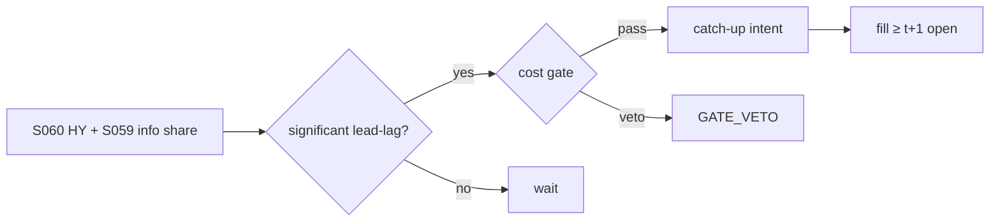

# T036 — Cross-Asset Lead-Lag (Hayashi–Yoshida)

Trades the documented lead-lag between related instruments (futures lead cash — Chan 1992) using the Hayashi–Yoshida estimator for non-synchronous data: when the leader moves and the laggard has not yet followed, the strategy takes the catch-up direction, confirmed by the Hasbrouck information-share leg. Provenance **[D]**.

> Tag law: every numeric literal in prose carries one of `[documented]
> [default] [example] [unverified] [internal-est] [measured]` (legend: Appendix
> i v1.0.0). Constants inside cited formulas inherit the formula's tag.
> Bibliographic years, volumes, pages, arXiv IDs, section numbers, rule codes
> (C1–C12), fail-safe codes (F1–F5), module IDs, and machine-parsed §0 data
> fields are identifiers, not literals, and are exempt.

## §1 Five-minute reviewer card

| Row | Value |
|---|---|
| Module | T036 — Cross-Asset Lead-Lag (Hayashi–Yoshida), v1.1.0 |
| Edge verdict | `AFTER-COST-EDGE` — futures-lead is the classic documented lead-lag (Chan 1992); HY (2005) is the right estimator for non-synchronous ticks |
| After-cost | `narrow` — the lag is seconds-to-minutes — monetizing it needs speed and the information-share confirm |
| Build cost | Tier M = 20–60 h ≈ `$3,000–9,000` [documented] |
| Data cost | synchronized multi-asset tick ≈ `$2.4–4.5k`/yr [unverified] (see §1.5 concrete vendor row) |
| latency_class | seconds |
| risk_class | market |
| Capacity | `$30–100M` before the catch-up trade moves the laggard [unverified] |
| Executability | needs synchronized multi-asset ticks; the HY implementation is the build |
| Risk summary | Spurious lead-lag from stale prints; the 'lag' is often just illiquidity; leader reverses before the laggard fills |
| When it dies | when the laggard's market makers also watch the leader (they do) |
| Regime gates | trade only pairs with HY-significant lead-lag (p < `0.05` [example]); stand down when the laggard's spread > `3×` median [example] |
| Emits | `order_intents` (Appendix C v1.0.0) — OrderTicket intents only, never orders |

## §1.5 Cheapest / least-build path

1. **Prototype hour band:** 6–10 h [example] — HY estimator + lead-lag significance + catch-up execution.
2. **Cheapest-source row:** min_tier = **Databento** (US Equities + CME Globex futures tick);
   latency_class = seconds; required_fields = synchronized leader/laggard
   trade/quote ticks with exchange timestamps (GLBX.MDP3 + US Equities);
   price_band = `$199–378`/mo ≈ `$2.4–4.5k`/yr [unverified] — US Equities Standard
   `$199`/mo [documented, databento.com pricing announcement 2025-01],
   CME futures ≈ `$179`/mo [unverified, third-party analysis — verify before budgeting);
   build_or_buy = **buy the feed, build the estimator**.
3. **Resource budget:** Tier M per cost-model §5 = 20–60 h ≈ `$3,000–9,000` loaded at `$150`/hr [documented]; compute pattern `vectorized batch (polars/numpy)`.
4. **Skip list:** cross-asset portfolio optimization; options-implied lead-lag.
5. **DO-NOT-CUT list:** causality assertions (`assert fill_event >
   signal_event`, no-signal-bar-fills test); COST block + callable
   `expected_cost_bps`; F1–F5 fail-safes + module-state enum; kill-switch
   state machine + re-arm checklist; decision-log audit records;
   bona-fide-intent + self-trade prevention; provenance tags on every numeric
   literal; fixtures + `test_cmd`; secrets via env only.
6. **Escalation gate:** upgrade from cheapest when any holds — HY significance decays; laggard fill rates collapse.

## §T0 Module contract

### T0.1 Typed signature

```python
def emit(state: ModuleState, signals: list[SignalVector], cfg: Config) -> list[OrderTicket]:
```

`OrderTicket` per Appendix C v1.0.0 (intents only — never wire orders).
`state` is the module-owned named state vector (`lead_lag_ms, hy_corr, info_share, position`); `signals` are
canonical SignalVectors (Appendix b v1.0.0) from the consumed S-modules, newest
last; the function emits zero or more intents per bar/event. Documented edge
cases: no signals → flat, no intents; `UNKNOWN` input signal → restrictive
(halve size / stand down per F1); kill-switch TRIPPED → emit nothing, state
`OFF`. 

### T0.2 Config dataclass

Single canonical `Config` — every `cfg.*` referenced by the COST callable,
sizing function, and normative pseudocode appears here exactly once.

| Parameter | Type | Default | Range | Status |
|---|---|---|---|---|
| lead_lag_ms | int | `5000` | [1000, 60000] | [default] |
| hy_pvalue | float | `0.05` | [0.01, 0.10] | [default] |
| catchup_z | float | `1.5` | [1.0, 3.0] | [default] |
| z_exit | float | `0.5` | [0.2, 1.0] | [default] |
| cooldown_min | int | `5` | [1, 30] | [default] |
| cost_gate_k | float | `1.00` | [0.5, 2.0] | [default] |
| risk_R_usd | float | `250` | [50, 2000] | [example] |
| stop_bps | float | `25` | [10, 100] | [example] |
| adv_cap_pct | float | `1.0` | [0.1, 10.0] | [default] |
| spread_full_bps | float | `3.0` | [1.0, 10.0] | [example] |
| taker_fee_bps | float | `0.30` | [0.20, 0.35] | [example] |
| borrow_bps | float | `0.0` | fixed at 0 | [example] — long catch-up only; SHORT legs need C7 locate |
| impact_k | float | `20.0` | [5.0, 50.0] | [example] |
| daily_loss_stop_pct | float | `1.0` | [0.25, 3.0] | [default] |
| side_exec | str | `taker` | {taker, maker} | [default] |

All defaults tagged per the tag law (status `default` ⇒ `[default]`).

### T0.3 Canonical schema mapping

Vendor columns → canonical Event/Bar schema (Appendix a v1.0.0), stated once here:

| Vendor column | Canonical field | Notes |
|---|---|---|
| ticks leader | Event: trade/quote | futures (example) |
| ticks laggard | Event: trade/quote | cash/ETF (example) |

### T0.4 Time contract

> Time contract: clock domain UTC, int64 ns; authoritative causality clock =
> `event_ts`; max_skew = `5` s [default]; jitter budget = `1` s [default];
> bar-label = open time; staleness TTL = `15` min [default]; gap policy = mask, no
> interpolation; halt/auction → discard contributions across reopen.

**Timing box:** `signal@t (tick/seconds bars, America/Chicago) → earliest fill @open(t+1)`

### T0.5 Market-state table

| State | Module behavior |
|---|---|
| CONTINUOUS_TRADING | Evaluate entry/exit rules; emit intents per §T2 |
| HALTED | Cancel working intents; emit nothing; state `UNKNOWN` until clean reopen |
| AUCTION | No new intents; hold intent-side state; state `DEGRADED` |
| CLOSED | Emit nothing; state `OFF` |


### T0.6 Module-state enum + error taxonomy

States per Appendix k v1.0.0: `OK | DEGRADED | UNKNOWN | OFF`. Invalid input →
`UNKNOWN`, never interpolate (Appendix f v1.0.0, F1–F5).

| Failure | State | Alert |
|---|---|---|
| Missing/stale input (TTL `15` min [default]) | `UNKNOWN` | page |
| Out-of-bounds indicator (F2) | `UNKNOWN` | page |
| Estimator disagreement (F3) | `UNKNOWN` | notify |
| Halt/auction per §T0.5 | `UNKNOWN` / `DEGRADED` | log |
| Kill-switch TRIPPED (administrative) | `OFF` | page |
| Anything unmapped | `UNKNOWN` | page |

### T0.7 Risk contract + kill switch

```yaml
risk_contract:
  per_trade_R: 250            # USD risk budget per trade [example]
  max_adverse_per_trade: 1.0 R [default]  # stop distance multiple [default]
  daily_loss_stop: 2% of equity [default]        # then no new entries; flatten managed risk [default]
  max_gross: 4× equity [default]              # hard gross exposure cap [default]
  kill_conditions:
    - daily P&L ≤ −daily_loss_stop_pct → TRIP (flatten)
    - tick feed desync > 1 s on any leg → TRIP (state UNKNOWN)
    - decision-log write failure → TRIP (halt emission)
  enforcement: intraday-hard  # trips are automatic, not advisory [default]
  calibration_recipe: >
    Walk-forward on 60-day blocks [example]: fit thresholds on block t,
    freeze, validate realized shortfall vs predicted on block t+1;
    shrink per-trade R until max drawdown < daily_loss_stop/2 [default].
```

**Kill-switch state machine:** `ARMED → TRIPPED → RECOVERY → ARMED`.

- `ARMED`: normal operation; every bar evaluates the kill conditions.
- `TRIPPED`: any kill condition fires → cancel all working intents
  (`NEW`/`WORKING` → `CANCELLED`, idempotent), flatten managed positions via
  the exit rule, emit nothing new, state `OFF`, log `KILL_TRIP`.
- `RECOVERY`: manual operator review only — no automatic transition.
- `ARMED` (re-entry): only after the re-arm checklist passes in full, logged
  as `KILL_REARM` with the checklist result.

**Re-arm checklist** (all must be true):

- [ ] Feed health green: all §T5 inputs fresh inside the staleness TTL.
- [ ] Kill condition cleared: the tripping metric is back inside limits for `30 min [default]` [default].
- [ ] Decision log reconciled: `KILL_TRIP` record present and hash chain intact.
- [ ] Risk re-check: per-trade R and gross caps re-confirmed against current equity.
- [ ] Operator sign-off: named human approves re-arm (no automatic recovery).

### T0.8 Ops tail

- **Schedule:** nightly batch; owner: strategy owner (named).
- **Health checks:** fixture replay (`test_cmd`) green on deploy; live
  decision-log append monitor; kill-switch state heartbeat.
- **Alert table:** `UNKNOWN`/`OFF` state transitions; kill-trip pages immediately [default].
- **Resource budget:** nightly batch: < 2 vCPU-h, < 4 GB RAM [example].
- **Runbook stub:** 1) confirm kill-state; 2) inspect decision log for the tripping record; 3) verify feed freshness; 4) re-arm checklist (operator sign-off); 5) re-run fixture; 6) resume..

### T0.9 Secrets (env-only)

- `BROKER_API_KEY (paper venue, env-only)`
- `DATA_API_KEY (env-only)` via environment only. No secrets in this file, fixtures, or
logs (CI secrets-grep).

### T0.10 May / must-NOT

> **May:** emit `OrderTicket` intents per Appendix C v1.0.0; track intent-side
> state (`NEW → WORKING → FILLED / CANCELLED / PARTIAL`); issue cancel-replace
> via new tickets with new `ticket_id`s. **Must-NOT:** place orders on any
> venue, hold broker/exchange sessions, net intents into orders inside the
> strategy, treat the intent-side state machine as broker wire truth, or emit
> prices/share-counts/notionals outside an `OrderTicket`.

## §T1 Legacy (subsumed by §1)

Legacy §T1 content is the §1 reviewer card above; this header is retained so
section numbering stays frozen.

## §T2 Specification

### Universe

Futures–cash, ETF–basket, ADR–ordinary pairs with documented lead-lag.

### Entry rule (Boolean — no prose-only conditions)

```
hy = hayashi_yoshida(leader, laggard)            # [documented]
sig  = lead_lag_significant(hy, p < 0.05)          # [example]
move = leader_return(last lead_lag_ms)            # [example]
ENTRY = sig and |move_z| >= catchup_z and info_share confirms leader
```

### Exits (with post-exit cooldown)

```
catch-up complete -> laggard moves >= 80% of leader move [example] -> FLAT
leader reverses -> FLAT immediately
stop -> adverse stop_bps -> FLAT, cooldown 5 min [default]
```

### Position sizing (fenced function)

```python
def size_shares(risk_budget_R, stop_distance, vol_estimate, ADV_cap, cost):
    """shares = f(risk_budget_R, stop_distance, vol_estimate, ADV_cap, cost).
    stop_distance in bps; vol_estimate = reference price of the laggard [example].
    Cost does NOT enter size — it gates entry via expected_cost_bps(...) <= k * edge_bps.
    """
    raw = risk_budget_R / (stop_distance / 1e4 * vol_estimate)
    return max(1, int(min(raw, ADV_cap)))
```

`ADV_cap = cfg.adv_cap_pct / 100 × ADV_shares`. Conviction scaling (by
information share) is intentionally absent — the fixture agreement test pins
this exact arithmetic; add conviction only as a calibrated `calibrate`
parameter in §T0.2.

### Risk limits

| Limit | Value |
|---|---|
| Max holding | leader window + `2×` [example] |
| Per-trade risk | `$250` (1 R) [example] |
| Pairs live | `10` [example] |

### COST block (single source of truth)

Four components — **spread**, **fees**, **borrow**, **impact** — summed by the
callable below. Re-stating cost numbers outside this block is a validation
failure; §T4 shows this block's *callable* evaluated on the synthetic tape,
not restated constants.

| Component | Value (bps) | Basis |
|---|---|---|
| Spread (half, laggard) | `1.50` | [example] |
| Fees | `0.30` | [example] |
| Borrow | `0.00` | long catch-up [example] |
| Impact | `k·√(adv_pct/100)`, k=`20.0` | [example] |
| **Total reference (one-way)** | `~`21` one-way [example]` | [example] |

`fee_schedule_as_of`: `2026-09-01 (placeholder — pin the real venue schedule before production)` — placeholder; pin the real venue
schedule before production. `side`: `taker`; venue/tier/source:
primary lit [example].

```python
def expected_cost_bps(notional, adv_pct, venue, side, urgency, cfg):
    """COST-block callable. Aggressive catch-up: taker economics."""
    spread = cfg.spread_full_bps / 2.0
    fee = cfg.taker_fee_bps
    borrow = cfg.borrow_bps
    impact = cfg.impact_k * math.sqrt(max(adv_pct, 0.0) / 100.0)
    if urgency == "high":
        impact *= 1.5
    return spread + fee + borrow + impact
```

### Execution / fill model table

| Aspect | Assumption |
|---|---|
| Fill venue | laggard's primary venue, aggressive |
| Intent→fill latency | signal@t → intent emitted intrabar t; earliest fill = open(t+1) (asserted in §T3); no signal-bar fills |
| Slippage model | catch-up slippage vs leader move |
| Partial fills | cancel remainder (window is short) |
| Adverse fill | aggressive = marketable intent (limit `None`); worst-case fill modeled as mid + full spread + impact component of `expected_cost_bps` |
| Halt behavior | no catch-up when either side halted |

Fine-grained fill behavior is synthetic and labeled `simulated only — requires MBO/ITCH`:
no MBO/ITCH feed is consumed by this module; any fill realism beyond the
mid-price ± half-spread fill model above would require MBO/ITCH data.

### Robustness

Perturb thresholds ±20% [example]; the reference behavior (entry/exit intents, gate blocks, kill trip) must be invariant; degrade entry→no-trade on indicator breach.

### Compliance sub-block (C1–C12)

| Code | Rule: trigger → check → action → log |
|---|---|
| C1 | STP + self-match prevention: trigger = intent could match our own resting interest → check = every ticket carries `self_trade_prevention: true`; maker modules compare against own open tickets → action = cancel own resting quote before posting the aggressive side; cancel-replace via new `ticket_id` only → log = `COMPLIANCE_BLOCK` with rule code `C1` |
| C2 | Bona-fide intent: trigger = entry rule fires → check = cost gate passes AND qty within risk limits AND (SHORT ⇒ `locate_ok`) → action = veto the intent if any check fails; no quote entered without intent to trade → log = `GATE_VETO` with the failed check |
| C3 | Message-rate / cancel-to-trade: trigger = intents+ cancels per symbol per minute exceed `120` [default] → check = rolling `60`-s [default] message counter → action = throttle to `1` intent per `10` s [default] and alert → log = `COMPLIANCE_BLOCK` with the counter value |
| C4 | Pre-trade fat-finger trio: trigger = any new intent → check = (a) limit within `±±10%` of reference [default], (b) ticket notional ≤ ``$2M`` [default], (c) ≤ `20` tickets per `1 min` [default] → action = block the ticket, alert → log = `COMPLIANCE_BLOCK` with the breached leg |
| C5 | Decision-log schema (Appendix g v1.0.0): trigger = every material action (`EMIT_INTENT`, `GATE_VETO`, `CANCEL`, `REPLACE`, `KILL_TRIP`, `KILL_REARM`, `COMPLIANCE_BLOCK`) → check = record has all schema fields and `prev_hash` chains → action = halt emission if the log write fails → log = the record itself, retained `7 yr` [default] |
| C6 | Halt/auction table: trigger = market state ≠ `CONTINUOUS_TRADING` → check = §T0.5 table → action = `HALTED`: cancel working intents, emit nothing; `AUCTION`: no new intents; `CLOSED`: state `OFF` → log = state-transition record |
| C7 | Locate check (short sales): trigger = `SHORT` intent → check = `locate_ok` from the pre-open easy-to-borrow list or desk locate; Reg-SHO threshold securities hard-blocked → action = veto without locate → log = `GATE_VETO` with code `C7`. Catch-up may be short; short leg requires locate_ok (C7). |
| C8 | Public-dissemination gate: trigger = any export of signals/intents outside the firm → check = review gate sign-off → action = block unreviewed exports → log = `COMPLIANCE_BLOCK` |
| C9 | Data-entitlement assertions (Appendix j v1.0.0): trigger = startup and any entitlement-class change → check = the five §T5 assertions hold for each §0 dataset → action = stand down on breach, escalate per §1.5 → log = entitlement review record |
| C10 | Post-exit cooldown: trigger = exit or compliance block → check = `now >= cooldown_until` (`1 session [default]` [default]) → action = suppress re-entry until the cooldown elapses → log = `GATE_VETO` with code `C10` |
| C11 | Kill-switch integration: trigger = `TRIPPED` → check = all working intents transitioned `NEW`/`WORKING` → `CANCELLED` (idempotent) → action = no new intents until `ARMED` via the §T0.7 checklist → log = `KILL_TRIP` / `KILL_REARM` records |
| C12 | C12 Cross-venue: trigger = leader/laggard on different regulatory regimes → check = rule review → action = document or block → log with code `C12` |

### Parameter table

| Parameter | Symbol | Value | Tag | Sensitivity |
|---|---|---|---|---|
| Lead-lag window | L | `5000` ms | [default] | high — mis-estimated lag = mistimed entry |
| HY p-value | α | `0.05` | [default] | high — spurious lead-lag is the failure mode |
| Catch-up z | z_c | `1.5` | [default] | medium |
| Exit z-band | z_x | `0.5` | [default] | medium — exits are never cost-gated [default] |
| Post-exit cooldown | c | `5` min | [default] | medium — prevents immediate re-entry into the same lag |

### Timing box

`signal@t (tick/seconds bars, America/Chicago) → earliest fill @open(t+1)`

## §T3 Math + normative pseudocode

Hayashi–Yoshida (2005) [documented]: covariance for non-synchronously observed
diffusions via overlapping intervals — the correct lead-lag estimator when ticks do not
align. Lead-lag extension [documented]: shift one leg by lag ℓ, so that the
`j`-th interval of the laggard becomes `(t_{j-1}^Y + ℓ, t_j^Y + ℓ]`, and compute

```
ρ̂_HY(ℓ) = Σ_i Σ_j (ΔX_i ΔY_j) χ_{i,j}(ℓ) / √(Σ_i(ΔX_i)² Σ_j(ΔY_j)²)
```

where `χ_{i,j}(ℓ) = 1` iff intervals `I_i^X` and `I_j^Y + ℓ` overlap [documented];
the lead-lag estimate is the ℓ maximizing `ρ̂_HY(ℓ)` over the search grid
`[-lead_lag_ms, +lead_lag_ms]` [default]. This is exactly the `hayashi_yoshida`
call in the entry rule: the estimator returns both the correlation at the
estimated lag and its significance.

Chan (1992) [documented]: index futures lead cash. Hasbrouck (1995) [documented]:
information share attributes price discovery across venues — the confirm leg that the
leader is where discovery happens.

**Normative pseudocode** (pseudocode is normative; prose is commentary):

```
def emit(state, signals, cfg):
    if kill_state(state) != "ARMED":
        return [], state.off()                      # §T0.7: TRIPPED/RECOVERY emit nothing
    sig = primary(signals, "S060")          # HY lead-lag + significance
    if sig is None or invalid(sig): return [], state.unknown()
    if state.position != 0:
        if sig.catchup_done or sig.leader_reversed or stopped(state, cfg):
            state.cooldown_until = sig.computed_at + cfg.cooldown_min * 60e9
            return [exit_ticket(state)], state.flat()
        return [], state.ok()
    if state.cooldown_until > 0 and sig.computed_at < state.cooldown_until:
        return [], state.ok()                       # post-exit cooldown: no re-entry
    if sig.lead_lag_sig and abs(sig.move_z) >= cfg.catchup_z and sig.info_share_ok:
        side = "BUY" if sig.move_z > 0 else "SELL"
        if side in ("SELL", "SHORT") and not locate_ok(symbol):
            log("GATE_VETO", code="C7")             # no short sale without a locate
            return [], state.ok()
        cost = expected_cost_bps(notional(), adv_pct(), venue(), "taker", "normal", cfg)
        # ^^^ normative cost-gate predicate: expected_cost_bps(...) <= k * edge_bps
        if cost <= cfg.cost_gate_k * sig.edge_bps:
            qty = size_shares(cfg.risk_R_usd, cfg.stop_bps, last_price(), adv_cap(), cost)
            t = OrderTicket.intent(side, qty=qty, limit=last_price())
            t.intent_ts = sig.computed_at
            assert fill_event > signal_event  # t->t+1 causality: no-signal-bar fills
            return [t], state.open("CATCHUP")
        log("GATE_VETO", cost=cost)
    return [], state.ok()
```

Causality: every feature uses inputs with `event_ts ≤ t` only; the earliest
fill for a bar-`t` intent is bar `t+1`'s open. Mandatory unit test:
no-signal-bar fills.

## §T4 Worked example (fixture-backed)

- Tape: `modules/fixtures/T036_tape.csv` — `# TYPE: validation-run`;
  `12` synthetic bars (seed `4360` [example]); `event_ts`/`asof_ts` int64 ns
  UTC; every number synthetic.
- Expected outputs: `modules/fixtures/T036_expected.csv` — per-bar intent,
  quantity, the **cost-function call** (`expected_cost_bps` inputs → bps →
  dollars), cost-gate verdict, and module state.
- Tolerance: `1e-9` [default] on floats; integer quantities exact.
- Acceptance tests (`modules/tests/test_T036.py` — `6` [default] tests):
  1. TYPE header + columns present; 2. fixture recomputes to expected
  (reference `process_bar` vs expected CSV — incl. the row-`7` post-exit
  cooldown `note`); 3. no-signal-bar fills
  (`assert fill_event > signal_event`); `4.` cost-gate predicate passes on large edge, blocks on tiny edge (`k = 0.5` [default]);
  5. kill-switch trip blocks intents, re-arm checklist restores `ARMED`;
  6. invalid input (halted/invalid bar) → `UNKNOWN`, no intents.
- `test_cmd`: `python3 -m pytest modules/tests/test_T036.py -q` → exits `0` [default].

**Cost-function calls on the tape** (the COST-block callable evaluated on
synthetic rows — inputs → bps → dollars; all values [example]):

| Bar | `expected_cost_bps` inputs | Components → total → $ | Cost gate `expected_cost_bps(...) <= k * edge_bps` | Intent / state |
|---|---|---|---|---|
| `0` | notional=`100000` [example], adv_pct=`0.5` [example], venue=`primary`, side=`taker`, urgency=`normal` | spread `1.5` + fee `0.3` + borrow `0.0` + impact `1.41` = `3.21` bps → `$32.14` | `2.0` edge, k=`0.5` [default] → `3.21 ≤ 1.0` BLOCK | `HOLD` / `OK` |
| `3` | notional=`100000` [example], adv_pct=`0.5` [example], venue=`primary`, side=`taker`, urgency=`normal` | spread `1.5` + fee `0.3` + borrow `0.0` + impact `1.41` = `3.21` bps → `$32.14` | `12.856854249492379` edge, k=`0.5` [default] → `3.21 ≤ 6.43` PASS | `LONG` / `OK` |
| `6` | notional=`100000` [example], adv_pct=`0.5` [example], venue=`primary`, side=`taker`, urgency=`normal` | spread `1.5` + fee `0.3` + borrow `0.0` + impact `1.41` = `3.21` bps → `$32.14` | `3.0` edge, k=`0.5` [default] → `3.21 ≤ 1.5` BLOCK | `BUY` / `OK` |
| `7` | notional=`100000` [example], adv_pct=`0.5` [example], venue=`primary`, side=`taker`, urgency=`normal` | spread `1.5` + fee `0.3` + borrow `0.0` + impact `1.41` = `3.21` bps → `$32.14` | `0.05` edge, k=`0.5` [default] → `3.21 ≤ 0.03` BLOCK (cooldown veto takes precedence — no re-entry within `5` min [default] of the bar-`6` exit) | `HOLD` / `OK` |
| `9` | notional=`100000` [example], adv_pct=`0.5` [example], venue=`primary`, side=`taker`, urgency=`normal` | spread `1.5` + fee `0.3` + borrow `0.0` + impact `1.41` = `3.21` bps → `$32.14` | `3.0` edge, k=`0.5` [default] → `3.21 ≤ 1.5` BLOCK | `HOLD` / `OFF` |

**Hand-checks.** Row `3` (entry): qty = `250 / (25/1e4 × 99.9)` = `1001` raw → ADV-capped at `20000` → `1001` shares [example]; ticket `T0003`, side `LONG`, `marketable` intent. Row `6` (exit): |z| through the exit band → `BUY` ticket closing the `LONG` leg (qty `999` [example]), exits never cost-gated [default]; exit sets `cooldown_until` = bar-6 `event_ts` + `5` min [default]. Row `7` (post-exit cooldown): inside the cooldown window → no intent (gate predicate would also block: edge `0.05` bps [example] vs cost `3.21` bps → `3.21 ≤ 0.025` BLOCK), state stays `OK`. Row `9` (kill): daily P&L `-1.1%` [example] ≤ −stop (`1.0%` [default]) → `ARMED → TRIPPED`, state `OFF`, no intents. Causality: entry intent at row `3` has `intent_ts` = bar-3 `event_ts`; the earliest fill is bar `4`'s open — the test asserts `fill_event > signal_event` on every intent row.

**Where the example is optimistic.** Costs are the COST-block model, not realized fills; capacity, borrow squeezes, and regime shifts are not in the tape.

## §T5 Dependencies + data

### Consumed signals (from deps.yaml — machine edge list)

| Signal | Version pin | Role |
|---|---|---|
| S060 | 1.0.0 | primary |
| S059 | 1.0.0 | confirm |
| S083 | 1.0.0 | gate |

### Pinned formula excerpts (≤10 lines each, CI hash-checked)

**S060** (v1.0.0): HY covariance via overlapping observation intervals [documented].
**S059** (v1.0.0): Hasbrouck information share bounds [documented].

### Data required

| Field | Type | Granularity | Source tier | Notes |
|---|---|---|---|---|
| leader ticks | trade/quote | tick | MULTI | HY estimation |
| laggard ticks | trade/quote | tick | MULTI | catch-up target |

**Data rights row** (Appendix j v1.0.0): Multi-asset tick data licensed per venue; synchronized timestamps required; entitlements re-asserted at startup.

## §T6 Local build + buy vs build

HY is a careful but compact implementation; the tick-synchronization harness is the work.

| Route | What you get | Verdict |
|---|---|---|
| Build | HY + catch-up logic in-house | recommended |
| Buy | synchronized multi-asset feed | required |

**Verdict:** Build the estimator; buy the synchronized feed. Timestamp quality is the strategy.

## §T7 Efficacy — documented evidence

| Study / source | Market & period | Metric | Before/after cost | Caveat |
|---|---|---|---|---|
| Chan (1992) | US Major Market + S&P 500 futures vs cash, intraday | futures lead cash documented (strong); cash leads futures only weakly; asymmetric lead-lag, strongest for market-wide information moves [documented] | before cost | 1980s–90s data |
| Hayashi–Yoshida (2005) | method | non-synchronous covariance estimator | n/a | estimator, not edge |
| Hasbrouck (1995) | US equities | information-share price discovery | before cost | identification assumptions |

**Selection disclosure:** Studies below are the chapter's documented sources only — no post-hoc selection from a wider literature search.

**Capacity & decay.** Edge decays with crowding and regime shifts; treat any printed Sharpe as a pre-cost, in-sample-era artifact unless the source says otherwise.

**Honest bottom line.** Honest bottom line: the lead-lag is real, documented, and watched by every market maker on earth — the remaining edge is speed and the discipline to only trade significant, confirmed lags.

## §T8 Failure modes & pitfalls

| # | Trigger → Detect → Action → Recovery | check: |
|---|---|---|
| 1 | Stale-print mirage → detect laggard quote age > TTL → veto, state UNKNOWN → resume | check: quote-age monitor |
| 2 | Leader reversal → detect sign flip → flatten immediately → log | check: reversal rate |
| 3 | HY breakdown (non-significant) → detect p ≥ 0.05 → stand down pair → refit | check: significance monitor |
| 4 | Laggard illiquidity → detect spread > 3× median → veto entries → alert | check: spread monitor |

## §T9 Regime gates + visuals

**Provisional regime-gate machine** (restrictive default; `regime_ids` stay
empty until the R001–R050 annotation pass):

| regime_id | direction | mechanism | condition | action | min_lag | unknown_behavior |
|---|---|---|---|---|---|---|
| R001 | degrades | lead-lag breakdown | HY p ≥ 0.05 | no new catch-ups | immediate | restrictive |
| R002 | degrade | laggard stress | spread > 3× median | halve size | 1 min | restrictive |



## §T10 Source log + unverified leads

**Sources** (citable facts only):

1. Hayashi, T. & Yoshida, N. (2005). "On covariance estimation of non-synchronously observed diffusion processes." *Bernoulli* 11(3): 359–379 — https://doi.org/10.3150/bj/1116340299
2. Chan, K. (1992). "A further analysis of the lead-lag relationship between the cash market and stock index futures market." *Review of Financial Studies* 5(1): 123–152
3. Hasbrouck, J. (1995). "One Security, Many Markets: Determining the Contributions to Price Discovery." *Journal of Finance* 50(4): 1175–1199 — https://www.jstor.org/stable/2329487

**Chatbot source log.** Grok answered the Q-batch (2026-09-10); all claims independently verified or labeled unverified. Chatbot output is leads, never facts.

**GROK-NEEDED** (questions web search could not answer — verbatim for the next Grok batch):

1. Q-FEE-T036-1: For a self-directed futures account, what is the smallest per-side all-in fee tier currently reachable on CME Globex equity-index futures (ES/NQ, non-member), and what is the base-tier taker fee on the cash/ETF leg (NYSE/Nasdaq, $/share)? State each with its fee-schedule as-of date and URL.
2. Q-DATA-T036-1: What is Databento's current cheapest combination (subscription or pay-as-you-go) that delivers synchronized CME Globex MDP3 tick plus US Equities tick with exchange timestamps suitable for HY estimation? Give exact product names and $/mo.
3. Q-PNL-T036-1: Are there any published live-trading (not backtest) results for Hayashi–Yoshida-based lead-lag strategies with stated capacity, decay, and cost model? Cite the source or state none found.
4. Q-HY-T036-1: Hayashi–Yoshida (2005) gives asymptotic normality for the covariance estimator. What finite-sample significance procedure do practitioners use for the lead-lag gate (p < 0.05 [default] here) — block bootstrap, subsampling, or a closed-form variance estimate? Cite the exact reference.
5. Q-PAIR-T036-1: For ETF–basket pairs (e.g., SPY vs constituents) vs futures–cash pairs, which leg empirically leads and by what documented magnitude? Cite sources.

**Unverified leads** (chatbot-only — never in evidence tables):

- Grok (2026-09-10, Q-TB4): lead-lag P&L magnitudes — *unverified chatbot claims*.
- Options-implied lead-lag — research lead, not validated.

---

## Appendix — AI build prompt (T036)

Copy-paste into any chat agent:

> Build module **T036 — Cross-Asset Lead-Lag (Hayashi–Yoshida)** per `notes/module-template.md` v1.0.0 and
> this file's §T0 contract.
> Cheapest path (§1.5): prototype 6–10 h [example]; cheapest data candidate
> MULTI-ASSET tick; compute pattern `vectorized batch (polars/numpy)`; u.
> Implement `emit(state, signals, cfg) -> list[OrderTicket]` (Appendix c
> v1.0.0) with the §T3 normative pseudocode, including the cost-gate predicate
> `expected_cost_bps(...) <= k * edge_bps` and `assert fill_event >
> signal_event`. Emit intents only — never place orders. Wire F1–F5
> (Appendix f v1.0.0): invalid input → `UNKNOWN`, never interpolate. Kill
> switch `ARMED → TRIPPED → RECOVERY → ARMED` with the §T0.7 re-arm checklist.
> Log decisions per Appendix g v1.0.0. Secrets via env only. Run the fixture
> `modules/fixtures/T036_tape.csv` (`# TYPE: validation-run`) against
> `modules/fixtures/T036_expected.csv` (tolerance `1e-9` [default]).
> **Definition of done:** `python3 -m pytest modules/tests/test_T036.py -q` exits `0` [default]. Tag every numeric literal
> you add with the unified enum (Appendix i v1.0.0); put anything unverifiable
> in §T10 unverified leads.
