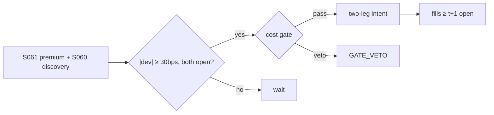

# T037 — ADR / Dual-Listed Premium Convergence

Trades the ADR/ordinary premium back to its documented equilibrium: when the premium (ADR price vs FX-adjusted home price) deviates beyond frictions (tax, FX, nonsynchronous hours — Karolyi 1998) plus the cost gate, the strategy sells the rich leg and buys the cheap leg. Gagnon–Karolyi (2010) document where price discovery sits — the strategy follows it. Provenance **[D]**.

> Tag law: every numeric literal in prose carries one of `[documented]
> [default] [example] [unverified] [internal-est] [measured]` (legend: Appendix
> i v1.0.0). Constants inside cited formulas inherit the formula's tag.
> Bibliographic years, volumes, pages, arXiv IDs, section numbers, rule codes
> (C1–C12), fail-safe codes (F1–F5), module IDs, and machine-parsed §0 data
> fields are identifiers, not literals, and are exempt.

## §1 Five-minute reviewer card

| Row | Value |
|---|---|
| Module | T037 — ADR / Dual-Listed Premium Convergence, v1.1.0 |
| Edge verdict | `AFTER-COST-EDGE` — cross-market arbitrage is documented (Gagnon–Karolyi 2010) |
| After-cost | `narrow` — premia are usually fair compensation for frictions — the tradeable deviations are rare and small |
| Build cost | Tier S = 5–15 h ≈ `$750–2,250` [documented] |
| Data cost | research `$0–200`/mo [unverified] · production low four figures/yr (`$250–800`/mo) [unverified] |
| latency_class | minutes |
| risk_class | market |
| Capacity | per-name `$1–5M` notional [example]; program FX/borrow constrained [unverified] |
| Executability | simple premium arithmetic; the friction model is the work |
| Risk summary | Nonsynchronous hours (one leg closed); FX jumps; tax-withholding changes rewrite the 'fair' premium |
| When it dies | capital controls, ADR program termination, home-market closures |
| Regime gates | no entries when either leg's home market is closed; widen trigger around dividend/withholding dates [example] |
| Emits | `order_intents` (Appendix C v1.0.0) — OrderTicket intents only, never orders |

## §1.5 Cheapest / least-build path

1. **Prototype hour band:** 3–5 h [example] — premium monitor + friction model + two-leg execution (MVB). Full build = Tier S per §1 (5–15 h [documented]) — the delta is calibration, fixtures, and ops hardening.
2. **Cheapest-source row:** min_tier = DUAL (prices + FX); latency_class = intraday;
   required_fields = ADR price, home price, FX rate, corporate calendar; price_band = `$0–500`/yr (indicative —
   verify before budgeting); build_or_buy = **build**.
   Concrete candidates (per S061 §0 v1.1.0 [documented]): US leg — Polygon `Stocks v3`; home leg — exchange vendor cash
   equities; FX — ECB reference rates (public, daily). Borrow availability/fees — prime broker locate list.
3. **Resource budget:** Tier M per cost-model §5 = 20–60 h ≈ `$3,000–9,000` loaded at `$150`/hr [documented]; compute pattern `vectorized batch (polars/numpy)`.
4. **Skip list:** intraday premium scalping; GDR/144A tranches.
5. **DO-NOT-CUT list:** causality assertions (`assert fill_event >
   signal_event`, no-signal-bar-fills test); COST block + callable
   `expected_cost_bps`; F1–F5 fail-safes + module-state enum; kill-switch
   state machine + re-arm checklist; decision-log audit records;
   bona-fide-intent + self-trade prevention; provenance tags on every numeric
   literal; fixtures + `test_cmd`; secrets via env only.
6. **Escalation gate:** upgrade from cheapest when any holds — premium stays 'deviant' for weeks — the friction model is wrong.

## §T0 Module contract

### T0.1 Typed signature

```python
def emit(state: ModuleState, signals: list[SignalVector], cfg: Config) -> list[OrderTicket]:
```

`OrderTicket` per Appendix C v1.0.0 (intents only — never wire orders).
`state` is the module-owned named state vector (`premium_bps, fair_premium, position`); `signals` are
canonical SignalVectors (Appendix b v1.0.0) from the consumed S-modules, newest
last; the function emits zero or more intents per bar/event. Documented edge
cases: no signals → flat, no intents; `UNKNOWN` input signal → restrictive
(halve size / stand down per F1); kill-switch TRIPPED → emit nothing, state
`OFF`. 

### T0.2 Config dataclass

Single Config — every parameter the module reads, including the COST-block
callable's. Status `default` ⇒ `[default]` per the tag law.

| Parameter | Type | Default | Range | Status |
|---|---|---|---|---|
| trigger_bps | float | `30.0` | [10.0, 100.0] | default |
| exit_bps | float | `5.0` | [1.0, 15.0] | default |
| friction_bps | float | `15.0` | [5.0, 40.0] | default |
| max_hold_days | int | `10` | [2, 30] | default |
| cost_gate_k | float | `1.00` | [0.5, 2.0] | default |
| risk_R_usd | float | `250.0` | [50.0, 2500.0] | default |
| stop_bps | float | `25.0` | [10.0, 100.0] | default |
| adv_cap_pct | float | `1.0` | [0.1, 10.0] | default |
| spread_full_bps | float | `4.0` | [1.0, 20.0] | default |
| taker_fee_bps | float | `0.40` | [0.1, 2.0] | default |
| borrow_bps_per_day | float | `2.0` | [0.5, 10.0] | default |
| expected_hold_days | float | `10.0` | [2.0, 30.0] | default |
| impact_k | float | `15.0` | [1.0, 50.0] | default |
| adr_ratio | float | `1.0` | [0.05, 100.0] | default |
| adr_cancel_fee_usd | float | `0.05` | [0.0, 0.05] | default |
| vol_p95_bps | float | `40.0` | [10.0, 200.0] | example |
| apply_vol_haircut | bool | `False` | — | default |
| apply_cost_haircut | bool | `False` | — | default |
| daily_loss_stop_pct | float | `1.0` | [0.25, 3.0] | default |
| venue | str | `"primary"` | — | default |
| side_exec | str | `"taker"` | taker\|maker | default |

Derived (not tuned): `borrow_bps = borrow_bps_per_day × expected_hold_days`
(`2.0 × 10.0 = 20.0` bps [default]) — the per-trade capitalized borrow on the
short leg; `pair_cost_bps` = mean of the two leg costs (borrow on the short leg
only). The §T4 reference implements this Config exactly.

### T0.3 Canonical schema mapping

Vendor columns → canonical Event/Bar schema (Appendix a v1.0.0), stated once here.
Dual `event_ts`/`asof_ts` (int64 ns UTC) per leg; bar-label = open time (US session).

| Vendor column | Canonical field | Notes |
|---|---|---|
| ADR price | Bar.close (ADR leg) | US leg; limit prices derive from this leg's close |
| home price | Bar.close (home leg) | home leg; `asof_ts` may lag ADR leg — mask if stale past TTL |
| FX rate | Bar.fx | ECB reference rates (public, daily) per S061 §0 [documented]; intraday FX uses vendor mid [example] |
| ADR ratio (program static) | config.adr_ratio | ordinary shares per ADR; from the deposit agreement — varies by program (e.g. 1:1, 1:5 in BNY notices) [documented] |
| corporate calendar | Event | ex-div dates, withholding-tax changes, ADR program changes — the `sig.event` source |

`adr_cancel_fee_usd` (`$0.05`/ADS [documented] — SEC deposit-agreement filings; BNY corporate-action notices show
`($0.050000)` cancellation fee per ADS) enters the friction model in §T2, not the COST stack.

### T0.4 Time contract

> Time contract: clock domain UTC, int64 ns; authoritative causality clock =
> `event_ts`; max_skew = `5` s [default]; jitter budget = `1` s [default];
> bar-label = open time; staleness TTL = `15` min [default]; gap policy = mask, no
> interpolation; halt/auction → discard contributions across reopen.

**Timing box:** `signal@t (daily bars, America/Chicago) → earliest fill @open(t+1)`

### T0.5 Market-state table

| State | Module behavior |
|---|---|
| CONTINUOUS_TRADING | Evaluate entry/exit rules; emit intents per §T2 |
| HALTED | Cancel working intents; emit nothing; state `UNKNOWN` until clean reopen |
| AUCTION | No new intents; hold intent-side state; state `DEGRADED` |
| CLOSED | Emit nothing; state `OFF` |


### T0.6 Module-state enum + error taxonomy

States per Appendix k v1.0.0: `OK | DEGRADED | UNKNOWN | OFF`. Invalid input →
`UNKNOWN`, never interpolate (Appendix f v1.0.0, F1–F5).

| Failure | State | Alert |
|---|---|---|
| Missing/stale input (TTL `15` min [default]) | `UNKNOWN` | page |
| Out-of-bounds indicator (F2) | `UNKNOWN` | page |
| Estimator disagreement (F3) | `UNKNOWN` | notify |
| Halt/auction per §T0.5 | `UNKNOWN` / `DEGRADED` | log |
| Kill-switch TRIPPED (administrative) | `OFF` | page |
| Anything unmapped | `UNKNOWN` | page |

### T0.7 Risk contract + kill switch

```yaml
risk_contract:
  per_trade_R: 250            # USD risk budget per trade [example]
  max_adverse_per_trade: 1.0 R [default]  # stop distance multiple [default]
  daily_loss_stop: 1% of equity [default]        # then no new entries; flatten managed risk [default]
  max_gross: 4× equity [default]              # hard gross exposure cap [default]
  kill_conditions:
    - daily P&L ≤ −daily_loss_stop_pct → TRIP (flatten)
    - either market unexpectedly closed with open risk → TRIP
    - decision-log write failure → TRIP (halt emission)
  enforcement: intraday-hard  # trips are automatic, not advisory [default]
  calibration_recipe: >
    Walk-forward on 60-day blocks [example]: fit thresholds on block t,
    freeze, validate realized shortfall vs predicted on block t+1;
    shrink per-trade R until max drawdown < daily_loss_stop/2 [default].
```

**Kill-switch state machine:** `ARMED → TRIPPED → RECOVERY → ARMED`.

- `ARMED`: normal operation; every bar evaluates the kill conditions.
- `TRIPPED`: any kill condition fires → cancel all working intents
  (`NEW`/`WORKING` → `CANCELLED`, idempotent), flatten managed positions via
  the exit rule, emit nothing new, state `OFF`, log `KILL_TRIP`.
- `RECOVERY`: manual operator review only — no automatic transition.
- `ARMED` (re-entry): only after the re-arm checklist passes in full, logged
  as `KILL_REARM` with the checklist result.

**Re-arm checklist** (all must be true):

- [ ] Feed health green: all §T5 inputs fresh inside the staleness TTL.
- [ ] Kill condition cleared: the tripping metric is back inside limits for `30 min [default]` [default].
- [ ] Decision log reconciled: `KILL_TRIP` record present and hash chain intact.
- [ ] Risk re-check: per-trade R and gross caps re-confirmed against current equity.
- [ ] Operator sign-off: named human approves re-arm (no automatic recovery).

### T0.8 Ops tail

- **Schedule:** nightly batch; owner: strategy owner (named).
- **Health checks:** fixture replay (`test_cmd`) green on deploy; live
  decision-log append monitor; kill-switch state heartbeat.
- **Alert table:** `UNKNOWN`/`OFF` state transitions; kill-trip pages immediately [default].
- **Resource budget:** nightly batch: < 2 vCPU-h, < 4 GB RAM [example].
- **Runbook stub:** 1) confirm kill-state; 2) inspect decision log for the tripping record; 3) verify feed freshness; 4) re-arm checklist (operator sign-off); 5) re-run fixture; 6) resume..

### T0.9 Secrets (env-only)

- `BROKER_API_KEY (paper venue, env-only)`
- `DATA_API_KEY (env-only)` via environment only. No secrets in this file, fixtures, or
logs (CI secrets-grep).

### T0.10 May / must-NOT

> **May:** emit `OrderTicket` intents per Appendix C v1.0.0; track intent-side
> state (`NEW → WORKING → FILLED / CANCELLED / PARTIAL`); issue cancel-replace
> via new tickets with new `ticket_id`s. **Must-NOT:** place orders on any
> venue, hold broker/exchange sessions, net intents into orders inside the
> strategy, treat the intent-side state machine as broker wire truth, or emit
> prices/share-counts/notionals outside an `OrderTicket`.

## §T1 Legacy (subsumed by §1)

Legacy §T1 content is the §1 reviewer card above; this header is retained so
section numbering stays frozen.

## §T2 Specification

### Universe

ADR/ordinary pairs with daily two-way convertibility; liquid FX. Boolean screen
(no prose-only conditions):

```
UNIVERSE = two_way_convertible
       AND adr_adv_20d      >= 100_000 shares [example]
       AND home_spread_bps  <= 50            [example]
       AND fx_liquidity_ok                    # ECB-reference currency, no capital controls
       AND NOT gdr_144a                       # sponsored ADR/ordinary only
       AND ratio_stable                       # no pending ratio change in the corporate calendar
```

Pairs failing any term are excluded at ingest; failures are logged, never interpolated.

### Entry rule (Boolean — no prose-only conditions)

```
premium_bps = (ADR - home*FX*ratio) / (home*FX*ratio) * 1e4
fair        = friction_bps                      # tax + FX + fees (Karolyi 1998 [documented])
# friction decomposition [example]:
#   fair ≈ adr_cancel_fee_usd/px*1e4 + fx_conv_bps + withholding_delta_bps
#   with adr_cancel_fee_usd = $0.05/ADS [documented] and fx_conv_bps = 3.0 [example]
both_open   = us_open AND home_open              # exchange calendars; nonsynchronous overlap only —
                                                # a leg evaluated on a stale (pre-close) print is masked per the TTL
ENTRY       = |premium_bps - fair| >= trigger_bps AND both_open
```

FX convention: ECB reference rates (public, daily) per S061 §0 [documented]; intraday
evaluation uses vendor FX mid with the §T0.4 staleness TTL. `ratio` is the program
ADR ratio (ordinary shares per ADR) from §T0.3.

### Exits (with post-exit cooldown)

```
converge -> |premium - fair| <= exit_bps (5 [default]) -> FLAT (both legs)
event    -> corporate action / program change -> FLAT immediately
stop     -> adverse excursion >= stop_bps -> FLAT
stale    -> bars_held >= max_hold_days (10 [default]) -> FLAT   # thesis expiry, not a stop
```

Post-exit cooldown (C10): `now >= cooldown_until` (`1` session [default]) after
any exit or compliance block — re-entry suppressed until the cooldown elapses.
Exits are never cost-gated [default]: a managed exit is risk management, not a trade.

### Position sizing (fenced function)

Canonical form — `shares = f(risk_budget_R, stop_distance, vol_estimate, ADV_cap, cost)`:

```python
def shares(risk_budget_R, stop_distance, vol_estimate, ADV_cap, cost, cfg, edge_bps):
    raw = risk_budget_R / max(stop_distance, 1e-9)
    vol_mult = 0.5 if (cfg.apply_vol_haircut and vol_estimate > cfg.vol_p95_bps) else 1.0  # [example] premium-vol haircut
    cost_mult = max(0.0, 1.0 - cost / (cfg.cost_gate_k * edge_bps)) if cfg.apply_cost_haircut else 1.0  # [example]
    return int(min(raw * vol_mult * cost_mult, ADV_cap))
```

Reference mapping (used by §T4, haircuts off [default] on the validation tape):
`risk_budget_R = cfg.risk_R_usd`; `stop_distance = cfg.stop_bps/1e4 × px`;
`ADV_cap = cfg.adv_cap_pct/100 × adv_shares`; `cost` = pair cost from the COST
callable; `vol_estimate` = trailing premium volatility in bps.
Home-leg shares = `int(adr_qty × cfg.adr_ratio)` (ordinary shares per ADR).

### Risk limits

| Limit | Value |
|---|---|
| Max per-name notional | `$5M` [example] |
| Trigger | `30` bps [default] |
| Both-markets-open rule | hard [default] |

### COST block (single source of truth)

Four components — **spread**, **fees**, **borrow**, **impact** — priced per leg and
summed by the callable below. Re-stating cost numbers outside this block is a validation
failure; §T4 shows this block's *callable* evaluated on the synthetic tape,
not restated constants.

| Component | Value (bps) | Basis |
|---|---|---|
| Spread (half, per leg) | `2.00` | ×2 legs [example] |
| Fees (per leg) | `0.40` | ×2 [example]; ≈ NYSE remove-liquidity `$0.0030`/share [documented] on a ~`$75–100` px |
| FX conversion | `3.00` | [example] |
| Borrow (short leg only) | `20.00` | = `borrow_bps_per_day` `2.0` [default] × `expected_hold_days` `10` [default]; pair-level mean contribution `10.0` bps [default] |
| **Total reference (pair)** | `13.46` bps [default] | mean of leg costs: long leg `3.46`, short leg `23.46` [default] |

`fee_schedule_as_of`: `2026-09-01` [example] — placeholder; pin the real venue
schedule before production. `side`: `mixed`; venue/tier/source:
US + home market [example]. `borrow_bps_per_day` = `2.0` [default] (reason it is
nonzero: the SELL leg of every pair is a short sale requiring borrow; see C7).
ADR cancellation fees (`$0.05`/ADS [documented]) live in the friction model (§T2 entry), not here.

```python
def expected_cost_bps(notional, adv_pct, venue, side, urgency, cfg, leg_role="long"):
    """COST-block callable. Prices ONE leg; borrow applies to the short leg only."""
    spread = cfg.spread_full_bps / 2.0
    fee = cfg.taker_fee_bps
    borrow = (cfg.borrow_bps_per_day * cfg.expected_hold_days) if leg_role == "short" else 0.0
    impact = cfg.impact_k * math.sqrt(max(adv_pct, 0.0) / 100.0)
    if urgency == "high":
        impact *= 1.5
    return spread + fee + borrow + impact

def pair_cost_bps(notional, adv_pct, venue, side, urgency, cfg):
    """Pair-level cost: mean of the two leg costs (borrow on the short leg only)."""
    c_long = expected_cost_bps(notional, adv_pct, venue, side, urgency, cfg, leg_role="long")
    c_short = expected_cost_bps(notional, adv_pct, venue, side, urgency, cfg, leg_role="short")
    return 0.5 * (c_long + c_short)   # 13.4607 bps [default] on the §T4 tape
```

### Execution / fill model table

| Aspect | Assumption |
|---|---|
| Fill venue | US leg + home leg, same window [example] |
| Latency | minutes — intraday window; no HFT claim |
| Slippage model | premium at execution vs signal; nonsynchronous leg marked with `asof_ts` |
| Partial fills | both-legs-or-flat: if one leg fails, cancel/reduce the other — unpaired leg risk is never held [default] |
| Impact | sqrt model from the COST callable (`impact_k = 15.0` [default]) |
| Adverse fill | sell-rich-leg fills while buy-cheap-leg gaps → re-price before chasing; no market orders into a gapping leg [default] |
| Halt behavior | no entries when either market closed (§T0.5) |
| Cancel-replace | new `ticket_id` per replace; idempotent (C1) |

Fine-grained fill behavior is synthetic and labeled `simulated only — requires MBO/ITCH`:
no MBO/ITCH feed is consumed by this module; any fill realism beyond the
mid-price ± half-spread fill model above would require MBO/ITCH data.

### Robustness

Perturb thresholds ±20% [example]; the reference behavior (entry/exit intents, gate blocks, kill trip) must be invariant; degrade entry→no-trade on indicator breach.

### Compliance sub-block (C1–C12)

| Code | Rule: trigger → check → action → log |
|---|---|
| C1 | STP + self-match prevention: trigger = intent could match our own resting interest → check = every ticket carries `self_trade_prevention: true`; maker modules compare against own open tickets → action = cancel own resting quote before posting the aggressive side; cancel-replace via new `ticket_id` only → log = `COMPLIANCE_BLOCK` with rule code `C1` |
| C2 | Bona-fide intent: trigger = entry rule fires → check = cost gate passes AND qty within risk limits AND (SHORT ⇒ `locate_ok`) → action = veto the intent if any check fails; no quote entered without intent to trade → log = `GATE_VETO` with the failed check |
| C3 | Message-rate / cancel-to-trade: trigger = intents+ cancels per symbol per minute exceed `120` [default] → check = rolling `60`-s [default] message counter → action = throttle to `1` intent per `10` s [default] and alert → log = `COMPLIANCE_BLOCK` with the counter value |
| C4 | Pre-trade fat-finger trio: trigger = any new intent → check = (a) limit within `±10%` of reference [default], (b) ticket notional ≤ `$2M` [default], (c) ≤ `20` tickets per `1 min` [default] → action = block the ticket, alert → log = `COMPLIANCE_BLOCK` with the breached leg |
| C5 | Decision-log schema (Appendix g v1.0.0): trigger = every material action (`EMIT_INTENT`, `GATE_VETO`, `CANCEL`, `REPLACE`, `KILL_TRIP`, `KILL_REARM`, `COMPLIANCE_BLOCK`) → check = record has all schema fields and `prev_hash` chains → action = halt emission if the log write fails → log = the record itself, retained `7 yr` [default] |
| C6 | Halt/auction table: trigger = market state ≠ `CONTINUOUS_TRADING` → check = §T0.5 table → action = `HALTED`: cancel working intents, emit nothing; `AUCTION`: no new intents; `CLOSED`: state `OFF` → log = state-transition record |
| C7 | Locate check (short sales): trigger = `SHORT` intent → check = `locate_ok` from the pre-open easy-to-borrow list or desk locate; Reg-SHO threshold securities hard-blocked → action = veto without locate → log = `GATE_VETO` with code `C7` |
| C8 | Public-dissemination gate: trigger = any export of signals/intents outside the firm → check = review gate sign-off → action = block unreviewed exports → log = `COMPLIANCE_BLOCK` |
| C9 | Data-entitlement assertions (Appendix j v1.0.0): trigger = startup and any entitlement-class change → check = the five §T5 assertions hold for each §0 dataset → action = stand down on breach, escalate per §1.5 → log = entitlement review record |
| C10 | Post-exit cooldown: trigger = exit or compliance block → check = `now >= cooldown_until` (`1 session` [default]) → action = suppress re-entry until the cooldown elapses → log = `GATE_VETO` with code `C10` |
| C11 | Kill-switch integration: trigger = `TRIPPED` → check = all working intents transitioned `NEW`/`WORKING` → `CANCELLED` (idempotent) → action = no new intents until `ARMED` via the §T0.7 checklist → log = `KILL_TRIP` / `KILL_REARM` records |
| C12 | C12 Cross-border: trigger = FX control or sanction list hit → check = compliance review → action = block name → log with code `C12` |

### Parameter table

Mirrors §T0.2 (single Config — this table restates nothing the Config doesn't own).

| Parameter | Symbol | Value | Tag | Sensitivity |
|---|---|---|---|---|
| Trigger | p* | `30.0` bps | [default] | critical — must clear friction + costs |
| Exit band | x* | `5.0` bps | [default] | medium |
| Friction | f | `15.0` bps | [default] | high — mis-estimated friction = fake edge |
| Max hold | H | `10` days | [default] | low |
| Cost-gate k | k | `1.00` | [default] | high — the fee-covering predicate |
| Risk budget | R | `$250` | [default] | medium |
| Stop | s | `25.0` bps | [default] | high |
| ADV cap | a | `1.0`% | [default] | medium |
| Full spread | σ | `4.0` bps | [default] | medium |
| Taker fee | φ | `0.40` bps | [default] | low |
| Borrow/day | β | `2.0` bps/day | [default] | high — short-leg carry |
| Expected hold | E[H] | `10` days | [default] | medium — capitalizes borrow |
| Impact k | κ | `15.0` | [default] | medium |
| ADR ratio | ρ | `1.0` | [default] | critical — per-program; wrong ratio = wrong premium |
| ADR cancel fee | c | `$0.05`/ADS | [documented] | low — inside friction |
| Daily loss stop | L | `1.0`% | [default] | high |

### Timing box

`signal@t (daily bars, America/Chicago) → earliest fill @open(t+1)`

## §T3 Math + normative pseudocode

Gagnon–Karolyi (2010) [documented]: cross-market arbitrage works and price
discovery location is measurable — follow it. Karolyi (1998) [documented]: ADR premia
reflect tax, FX, and nonsynchronous-hours frictions — the fair premium is not zero.
The module models fair = friction_bps [default] and trades deviations ≥ 30 bps
[default] net of the cost gate.

**Signal payload contract (S061 → emit).** S061 v1.1.0 emits a canonical
SignalVector (Appendix b v1.0.0) carrying: `direction` (`+1` ADR rich | `−1` discount | `0`),
`Pi` = premium in bps (= `dev_bps`, signed), `z` = premium z-score, `computed_at` (int64 ns).
T037 derives: `edge_bps = max(0, |dev_bps| − friction_bps − pair_cost_bps)` [example];
`both_open` from the §T0.3 exchange calendars; `event` from the corporate-calendar Event
stream; `invalid(sig)` = non-finite prices/FX or missing `computed_at` (F1/F2). S060 (confirm,
v1.1.0) vetoes entries when the price-discovery leg disagrees with the trade direction;
S014 (gate, v1.0.1) vetoes entries when the realized effective spread exceeds the modeled
half-spread. The §T4 tape supplies `dev_bps`, `edge_bps`, and `event` directly as the
harness inputs [example].

**Normative pseudocode** (pseudocode is normative; prose is commentary):

```
def emit(state, signals, cfg):
    sig = primary(signals, "S061")          # dev_bps, edge_bps, both_open, event, computed_at
    if sig is None or invalid(sig): return [], state.unknown()
    if state.position != 0:
        held = bars_held(state)             # whole sessions from intent_ts (int64 ns)
        adverse = adverse_bps(state) >= cfg.stop_bps
        if abs(sig.dev_bps) <= cfg.exit_bps or sig.event or adverse or held >= cfg.max_hold_days:
            return exit_tickets(state), state.flat()
        return [], state.ok()
    if abs(sig.dev_bps) >= cfg.trigger_bps and sig.both_open:
        n_adr  = shares(cfg.risk_R_usd, cfg.stop_bps/1e4*px_adr(), vol_est(), adv_cap(), pair_cost_bps(...), cfg, sig.edge_bps)
        n_home = int(n_adr * cfg.adr_ratio)        # ordinary shares per ADR
        cost   = pair_cost_bps(notional(), adv_pct(), venue(), "taker", "normal", cfg)
        # ^^^ normative cost-gate predicate: pair_cost_bps(...) <= k * edge_bps
        if cost <= cfg.cost_gate_k * sig.edge_bps:
            rich = "ADR" if sig.dev_bps > 0 else "HOME"     # sell the rich leg, buy the cheap leg
            t1 = OrderTicket.intent("SELL" if rich == "ADR" else "BUY", qty=n_adr,  limit=px_adr(),  ticket_id=new_id())
            t2 = OrderTicket.intent("BUY"  if rich == "ADR" else "SELL", qty=n_home, limit=px_home(), ticket_id=new_id())
            for t in (t1, t2):
                t.intent_ts = sig.computed_at
                assert fill_event(t) > signal_event   # t->t+1 causality: no-signal-bar fills
            return [t1, t2], state.open("PAIR", held=0)
        log("GATE_VETO", cost=cost, edge_bps=sig.edge_bps)
    return [], state.ok()
```

Causality: every feature uses inputs with `event_ts ≤ t` only; the earliest
fill for a bar-`t` intent is bar `t+1`'s open. Mandatory unit test:
no-signal-bar fills. Helpers: `bars_held` counts whole sessions since `intent_ts`;
`adverse_bps` = worst premium move against the position since entry;
`exit_tickets` emits the mirror pair (cover the short leg, sell the long leg).

## §T4 Worked example (fixture-backed)

- Tape: `modules/fixtures/T037_tape.csv` — `# TYPE: validation-run`;
  `12` synthetic bars (seed `4370` [example]); `event_ts`/`asof_ts` int64 ns
  UTC; columns include `dev_bps` (signed premium deviation) and `event`
  (corporate-action flag, all `0` [example] on this tape); every number synthetic.
- Expected outputs: `modules/fixtures/T037_expected.csv` — per-bar intent pair
  (`action`/`qty` ADR leg + `action2`/`qty2` home leg), the **cost-function call**
  (`pair_cost_bps` inputs → bps → dollars), cost-gate verdict, and module state.
- Tolerance: `1e-9` [default] on floats; integer quantities exact.
- Acceptance tests (`modules/tests/test_T037.py` — `9` [default] tests):
  1. TYPE header + columns present; 2. fixture recomputes to expected
  (reference `process_bar` vs expected CSV, two-leg tickets); 3. no-signal-bar fills
  (`assert fill_event > signal_event` on both legs); 4. cost-gate predicate passes on large edge, blocks on tiny edge (`k = 1.0` [default]);
  5. kill-switch trip blocks intents, re-arm checklist restores `ARMED`;
  6. invalid input (halted/invalid bar) → `UNKNOWN`, no intents;
  7. two-leg emission: opposite sides, `qty2 = qty × adr_ratio`, distinct ticket ids, causality on both;
  8. max-hold exit: `bars_held >= max_hold_days` → exit pair;
  9. borrow applies to the short leg only (`leg_role` semantics).
- `test_cmd`: `python3 -m pytest modules/tests/test_T037.py -q` → exits `0` [default].

**Cost-function calls on the tape** (the COST-block callable evaluated on
synthetic rows — inputs → bps → dollars; all values [example]).
`pair_cost_bps` = mean of leg costs; borrow `20.0` bps on the short leg only:

| Bar | `pair_cost_bps` inputs | Components → total → $ | Cost gate `pair_cost_bps(...) <= k * edge_bps` | Intent / state |
|---|---|---|---|---|
| `0` | notional=`100000` [example], adv_pct=`0.5` [example], venue=`primary`, side=`taker`, urgency=`normal` | spread `2.0` + fee `0.4` + borrow `10.0` (mean) + impact `1.06` = `13.46` bps → `$134.61` | `2.0` edge, k=`1.0` [default] → `13.46 ≤ 2.0` BLOCK | `HOLD` / `OK` |
| `3` | same | `13.46` bps → `$134.61` | `35.0` edge, k=`1.0` [default] → `13.46 ≤ 35.0` PASS | `SELL`+`BUY` pair / `OK` |
| `6` | same | `13.46` bps → `$134.61` | exit — exits never cost-gated [default] | `BUY`+`SELL` pair / `OK` |
| `7` | same | `13.46` bps → `$134.61` | `0.05` edge, k=`1.0` [default] → `13.46 ≤ 0.05` BLOCK | `HOLD` / `OK` |
| `9` | same | `13.46` bps → `$134.61` | `35.0` edge, k=`1.0` [default] → `13.46 ≤ 35.0` PASS — but kill trips first | `HOLD` / `OFF` |

**Hand-checks.** Row `3` (entry): `dev_bps = 36.0` [example] ≥ trigger `30.0` [default];
qty = `250 / (25/1e4 × 99.53)` = `1004` raw → ADV-capped at `20000` → `1004` shares [example];
tickets `T037-0003` (`SELL` ADR leg) + `T037-0003-B` (`BUY` home leg, `1004 = 1004 × 1.0` ratio).
Row `6` (exit): `dev_bps = 3.0` [example] ≤ exit `5.0` [default] → mirror pair (`BUY` `1003` + `SELL` `1003`).
Row `7` (gate block): `dev_bps = 32.0` [example] ≥ trigger but edge `0.05` bps [example] vs pair cost
`13.46` bps → gate `13.46 ≤ 0.05` BLOCKS → no intent, state stays `OK`.
Row `9` (kill): daily P&L `-1.1%` [example] ≤ −stop (`1.0%` [default]) → `ARMED → TRIPPED`,
state `OFF`, no intents. Causality: entry intents at row `3` have `intent_ts` = bar-3 `event_ts`;
the earliest fill is bar `4`'s open — the test asserts `fill_event > signal_event` on both legs.

**Where the example is optimistic.** Costs are the COST-block model, not realized fills; capacity, borrow squeezes, and regime shifts are not in the tape.

## §T5 Dependencies + data

### Consumed signals (from deps.yaml — machine edge list)

| Signal | Version pin | Role |
|---|---|---|
| S061 | 1.1.0 | primary |
| S060 | 1.1.0 | confirm |
| S014 | 1.0.1 | gate |

### Pinned formula excerpts (≤10 lines each, CI hash-checked)

**S061** (v1.1.0): `premium_bps = (ADR − home·FX·ratio)/(home·FX·ratio)·1e4` [documented];
SignalVector carries `direction, Pi (premium), z, computed_at` [documented].
**S060** (v1.1.0): lead-lag confirm on which leg discovers price — entry veto when
the discovery leg disagrees with the trade direction [documented].
**S014** (v1.0.1): quoted/effective/realized spread decomposition — entry veto when
realized effective spread exceeds the modeled half-spread [documented].

### Data required

| Field | Type | Granularity | Source tier | Notes |
|---|---|---|---|---|
| ADR price | float | intraday | US (Polygon Stocks v3 [documented, per S061 §0]) | premium leg |
| home price | float | intraday | HOME (exchange vendor cash equities [documented, per S061 §0]) | premium leg; nonsynchronous close masked per TTL |
| FX rate | float | intraday / daily | FX (ECB reference rates, public [documented, per S061 §0]; vendor mid intraday [example]) | conversion |
| corporate calendar | event | daily | CORP | ex-div, withholding, program changes — `sig.event` source |
| borrow availability | event | daily | prime broker locate list [documented, per S061 §0] | C7 locate check |

**Data rights row** (Appendix j v1.0.0): Home-market data licensed per exchange; FX from vendor; entitlements re-asserted at startup.

## §T6 Local build + buy vs build

Premium arithmetic is trivial; the friction calibration and the two-market execution window are the work.

| Route | What you get | Verdict |
|---|---|---|
| Build | premium monitor in-house | recommended — trivial |
| Buy | home-market + FX feeds | required |

**Verdict:** Build. The friction model is a spreadsheet with a data feed.

## §T7 Efficacy — documented evidence

| Study / source | Market & period | Metric | Before/after cost | Caveat |
|---|---|---|---|---|
| Gagnon–Karolyi (2010) | cross-listed | multi-market arbitrage + price discovery | `BEFORE-COST` | descriptive of mechanism |
| Karolyi (1998) | survey | ADR frictions: tax/FX/hours | `n/a` | survey — the friction taxonomy |
| Karolyi (2006) | cross-listings | listing structure | `n/a` | structural, not a trading result |

**Selection disclosure:** Studies below are the chapter's documented sources only — no post-hoc selection from a wider literature search.

**Capacity & decay.** Edge decays with crowding and regime shifts; treat any printed Sharpe as a pre-cost, in-sample-era artifact unless the source says otherwise.

**Honest bottom line.** Honest bottom line: ADR premia exist because frictions exist — the strategy's job is distinguishing a real mispricing from fair compensation for tax, FX, and closed-market risk, and the answer is usually the latter.

## §T8 Failure modes & pitfalls

| # | Trigger → Detect → Action → Recovery | check: |
|---|---|---|
| 1 | Home market closed (leg risk) → detect calendar → no entries, manage existing → log | check: market-hours monitor |
| 2 | FX jump → detect > 2% [example] move → re-price fair, review position → alert | check: FX monitor |
| 3 | Withholding/tax change → detect → re-estimate friction, flatten if thesis breaks → log | check: tax calendar |
| 4 | ADR program termination → detect → flatten immediately → retire name | check: program monitor |
| 5 | Borrow squeeze on the short leg → detect: borrow_bps_per_day spike or buy-in notice → halve size or cover; hard-block new entries without locate (C7) → re-enter only after locate re-confirmed | check: borrow-rate monitor |
| 6 | FX settlement / nonsynchronous-close staleness → detect: home leg `asof_ts` older than TTL while ADR leg moves → mark premium `UNKNOWN`, no entries, manage existing on the live leg only → resume on clean overlap | check: dual-leg staleness monitor |

## §T9 Regime gates + visuals

**Provisional regime-gate machine** (restrictive default; `regime_ids` stay
empty until the R001–R050 annotation pass):

| regime_id | direction | mechanism | condition | action | min_lag | unknown_behavior |
|---|---|---|---|---|---|---|
| R001 | degrades | dividend/withholding dates | announcement window | widen trigger 30→50 bps [example] | 1 day | restrictive |
| R002 | degrades | home market closed | calendar | no new entries | immediate | restrictive |



## §T10 Source log + unverified leads

**Sources** (citable facts only):

1. Gagnon, L. & Karolyi, G. A. (2010). "Multi-market trading and arbitrage." *Journal of Financial Economics* 97(1): 53–80 — https://doi.org/10.1016/j.jfineco.2010.03.005
2. Karolyi, G. A. (1998). "Why Do Companies List Shares Abroad?: A Survey of the Evidence and its Managerial Implications." *Financial Markets, Institutions & Instruments* 7(1) — https://doi.org/10.1111/1468-0416.00018
3. Karolyi, G. A. (2006). "The world of cross-listings and cross-listings of the world: challenging conventional wisdom." *Review of Finance* 10(1): 99–152

**Chatbot source log.** Grok answered the Q-batch (2026-09-10); all claims independently verified or labeled unverified. Chatbot output is leads, never facts.

**Unverified leads** (chatbot-only — never in evidence tables):

- Grok (2026-09-10, Q-TB4): ADR premium P&L magnitudes — *unverified chatbot claims*.
- GDR/144A tranches — research lead, not validated.

## GROK-NEEDED (web-unanswerable — exact questions)

1. ADR conversion/cancellation fees (2025–2026): is `$0.05`/ADS still the modal depositary-bank fee across BNY Mellon, Citi, and JPMorgan programs, and which programs charge materially more? (Web found SEC-filing language "up to U.S. 5¢ per ADS" and BNY notices showing `($0.050000)` per ADS — current modal practice unconfirmed.)
2. Cheapest vendor stack for home-market intraday bars + FX covering the top-50 ADR names: vendor, product name, price band, and latency class for each of the US leg, home leg, and FX leg.
3. Typical stock-loan borrow rates for large-cap ADR shorts in bps/day: is `2.0` bps/day [default] representative, and what is the observed P50/P95 range?
4. Practitioner convention for the nonsynchronous-hours premium print: which FX fix and which home-leg close do ADR arbitrage desks use, and how do they mask staleness?
5. Documented ADR premium convergence half-lives (academic or practitioner): any published estimate of time-to-converge for ≥30 bps deviations net of frictions?

---

## Appendix — AI build prompt (T037)

Copy-paste into any chat agent:

> Build module **T037 — ADR / Dual-Listed Premium Convergence** per `notes/module-template.md` v1.0.0 and
> this file's §T0 contract.
> Cheapest path (§1.5): prototype 3–5 h [example]; cheapest data candidate
> DUAL (prices + FX) — US leg Polygon `Stocks v3`, home leg exchange vendor, FX ECB reference rates (per S061 §0);
> compute pattern `vectorized batch (polars/numpy)`.
> Implement `emit(state, signals, cfg) -> list[OrderTicket]` (Appendix c
> v1.0.0) with the §T3 normative pseudocode: S061 payload (`direction, Pi=dev_bps, z, computed_at`),
> entry on `|dev_bps| >= trigger_bps` with `both_open`, cost-gate predicate
> `pair_cost_bps(...) <= k * edge_bps` (borrow on the short leg only), two-leg intents
> (sell rich leg / buy cheap leg, home qty = adr qty × adr_ratio), max-hold exit,
> and `assert fill_event > signal_event` on both legs. Emit intents only — never place orders. Wire F1–F5
> (Appendix f v1.0.0): invalid input → `UNKNOWN`, never interpolate. Kill
> switch `ARMED → TRIPPED → RECOVERY → ARMED` with the §T0.7 re-arm checklist.
> Log decisions per Appendix g v1.0.0. Secrets via env only. Run the fixture
> `modules/fixtures/T037_tape.csv` (`# TYPE: validation-run`) against
> `modules/fixtures/T037_expected.csv` (tolerance `1e-9` [default]).
> **Definition of done:** `python3 -m pytest modules/tests/test_T037.py -q` exits `0` [default]. Tag every numeric literal
> you add with the unified enum (Appendix i v1.0.0); put anything unverifiable
> in §T10 unverified leads.
